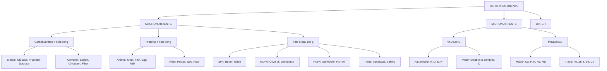
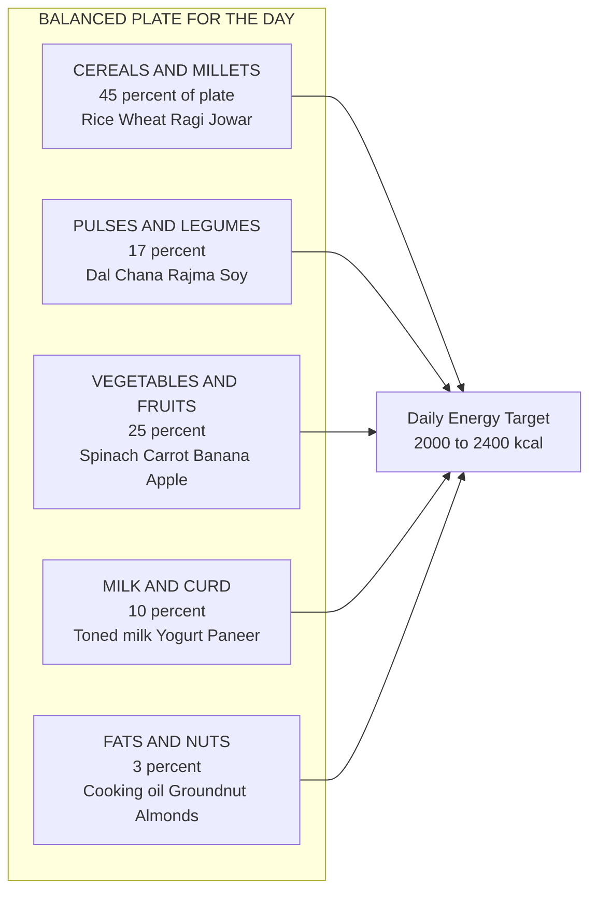
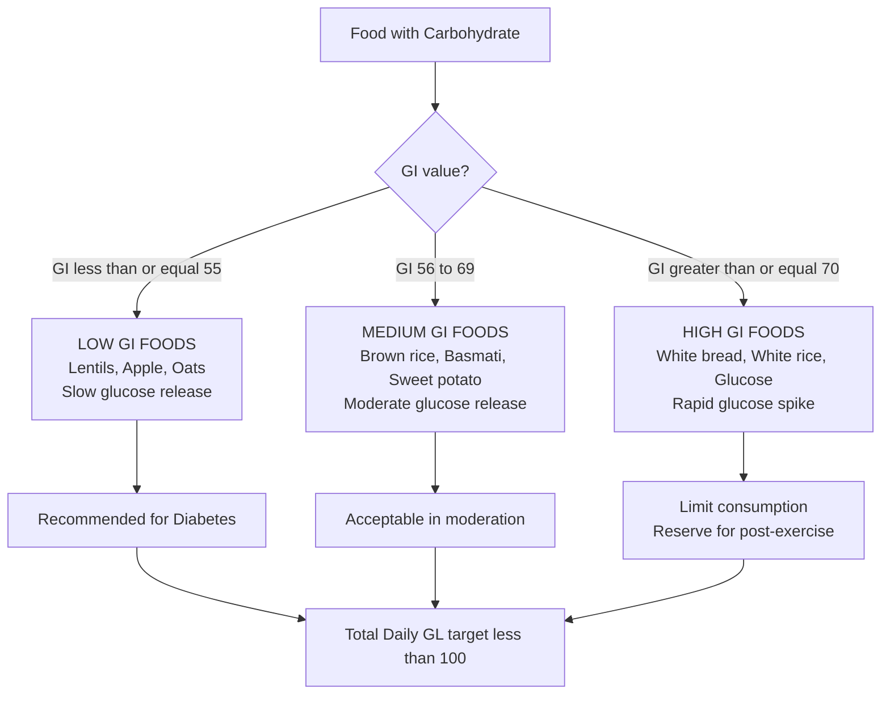
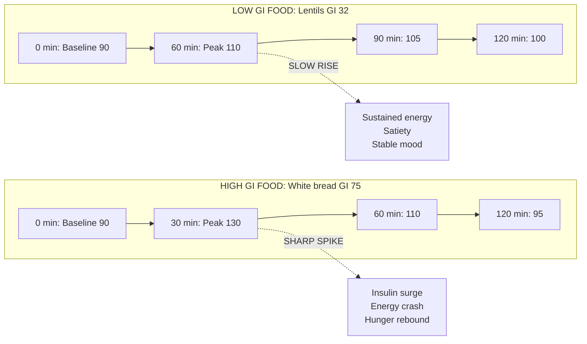
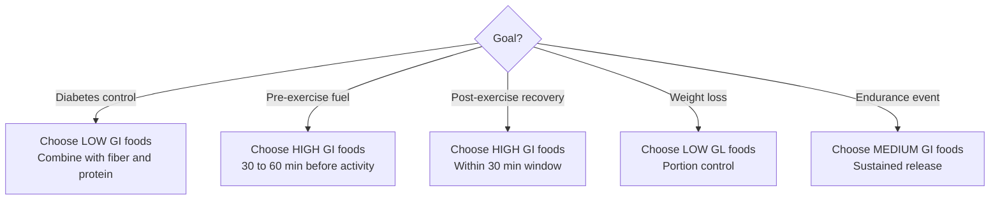

# Diet and nutrition: Exploring Micro and Macronutrients: Concept of Balanced diet Carbohydrate & the Glycemic Index

<!-- SECTION_1_START -->

# Diet and Nutrition: Macronutrients, Micronutrients, Balanced Diet, Carbohydrates & Glycemic Index

## 1.1 Formal Definition (KTU 2024 Syllabus Terminology)

**Nutrition** is the biochemical and physiological process by which an organism uses food to support its life, growth, metabolism, and repair of tissues. It involves ingestion, absorption, assimilation, biosynthesis, catabolism, and excretion of dietary components.

**Diet** refers to the sum of food consumed by a person or organism, while a **Balanced Diet** is defined by the World Health Organization (WHO) as a diet that provides all essential nutrients in the correct proportions, adequate amounts, and proper ratios to meet the body's requirements for energy, growth, repair, and maintenance of vital processes.

> [!IMPORTANT]
> **KTU 2024 Module Highlight:** The course outcome for Module 2 (UCHWT127) emphasizes identifying the role of macronutrients and micronutrients in human health, designing a balanced diet using the food pyramid/MyPlate model, and understanding carbohydrate metabolism through the lens of the Glycemic Index (GI) and Glycemic Load (GL).

The dietary components are classified into two primary categories:

1. **Macronutrients** — required in large quantities (measured in grams): Carbohydrates, Proteins, Fats (Lipids), and Water.
2. **Micronutrients** — required in trace amounts (measured in milligrams or micrograms): Vitamins and Minerals.

## 1.2 Intuitive Analogy — "The Body as a High-Performance Engine"

> [!NOTE]
> **Analogy:** Think of the human body as a high-performance automobile engine.
> - **Macronutrients** are the **fuel, oil, and coolant** — needed in large volumes to keep the engine running.
> - **Micronutrients** are the **spark plugs, sensors, and lubricants** — tiny but critical; without them, the engine sputters and fails.
> - A **Balanced Diet** is the **manufacturer's recommended fuel mix** — the exact ratio of petrol, oil, and additives that keeps the engine running smoothly for years.

This analogy makes it clear: a healthy body requires **the right quantity** of macronutrients and **the right quality** of micronutrients, supplied through a balanced, varied, and proportional diet.

## 1.3 Macronutrients — The Four Major Pillars

| Macronutrient | Primary Role | Energy Yield | Daily Requirement (Adult) |
|---------------|--------------|--------------|---------------------------|
| Carbohydrates | Primary energy source | **4 kcal/g** | **45–65%** of total calories |
| Proteins | Tissue building and repair | **4 kcal/g** | **10–35%** of total calories |
| Fats (Lipids) | Concentrated energy, insulation | **9 kcal/g** | **20–35%** of total calories |
| Water | Solvent, transport, thermoregulation | **0 kcal** | **2.5–3.5 L/day** |

## 1.4 Micronutrients — The Invisible Catalysts

| Class | Sub-Class | Key Examples | Solubility |
|-------|-----------|--------------|------------|
| Vitamins | Fat-soluble | **A, D, E, K** | Dissolve in fats |
| Vitamins | Water-soluble | **B-complex, C** | Dissolve in water |
| Minerals | Macro-minerals | **Ca, P, K, Na, Mg, Cl, S** | Needed in >100 mg/day |
| Minerals | Trace minerals | **Fe, Zn, Cu, Mn, I, Se, Cr, F** | Needed in <100 mg/day |

> [!NOTE]
> **Standard Metric:** The **Recommended Dietary Allowance (RDA)** is the average daily intake level sufficient to meet the nutrient requirements of nearly all (97–98%) healthy individuals in a particular life stage and gender group.

## 1.5 Concept of a Balanced Diet

A **Balanced Diet** is not a "diet" in the weight-loss sense — it is the **science of proportionality**. According to the **ICMR (Indian Council of Medical Research) – NIN (National Institute of Nutrition) 2020 Guidelines**, a balanced diet for a sedentary Indian adult (reference man/woman weighing 60 kg/55 kg) must supply approximately **2,000–2,400 kcal/day** distributed as:

- **55–60%** from Carbohydrates
- **10–15%** from Proteins
- **20–30%** from Fats
- **25–30 g/day** of dietary fiber
- Adequate vitamins and minerals

### The ICMR "My Plate for the Day" Model

| Food Group | Visual Share of Plate | Examples |
|------------|----------------------|----------|
| Cereals & Millets | **~45%** | Rice, Wheat, Ragi, Jowar, Bajra |
| Pulses & Legumes | **~17%** | Toor dal, Chana, Rajma, Soybean |
| Vegetables & Fruits | **~25%** (split equally) | Spinach, Carrot, Banana, Papaya |
| Milk & Curd | **~10%** | Toned milk, Yogurt, Paneer |
| Fats & Nuts | **~3%** (small portion) | Groundnut, Cooking oil (mustard/sunflower) |

> [!IMPORTANT]
> **Syllabus Highlight:** The balanced diet concept extends beyond nutrients to include **variety, moderation, and proportionality** — the three core principles outlined by the Harvard School of Public Health in the **Healthy Eating Plate** model.

## 1.6 Carbohydrates & The Glycemic Index (GI)

**Carbohydrates** are organic compounds composed of carbon, hydrogen, and oxygen (general formula $\text{C}_n(\text{H}_2\text{O})_n$). They are classified by molecular complexity:

| Class | Examples | Digestion Speed |
|-------|----------|-----------------|
| **Monosaccharides** | Glucose, Fructose, Galactose | Fastest |
| **Disaccharides** | Sucrose, Lactose, Maltose | Fast |
| **Oligosaccharides** | Raffinose, Stachyose | Slow |
| **Polysaccharides** | Starch, Glycogen, Cellulose | Slowest |

### Glycemic Index — Formal Definition

> [!IMPORTANT]
> **Definition (KTU Standard):** The **Glycemic Index (GI)** is a numerical scale (**0–100**) that ranks carbohydrate-containing foods based on how quickly and how much they raise blood glucose (postprandial blood sugar) levels compared to a reference food — either pure **glucose (GI = 100)** or **white bread (GI = 70)**.

The **International GI Table**, maintained by the University of Sydney, classifies foods into:

- **Low GI:** $\text{GI} \leq 55$
- **Medium GI:** $\text{GI} = 56 \text{ to } 69$
- **High GI:** $\text{GI} \geq 70$

### Glycemic Load (GL) — The Practical Refinement

> [!NOTE]
> **Definition:** **Glycemic Load (GL)** accounts for both the GI of a food and the amount of carbohydrate per serving. It is the clinically more meaningful metric for real-world meal planning.

$$\text{GL} = \frac{\text{GI} \times \text{Available Carbohydrate (g per serving)}}{100}$$

| GL Value | Classification |
|----------|----------------|
| **Low** | $\text{GL} \leq 10$ |
| **Medium** | $\text{GL} = 11 \text{ to } 19$ |
| **High** | $\text{GL} \geq 20$ |

> [!VISUALIZATION CONTROL]
> **Concept:** Postprandial Blood Glucose Response Curve
> **GeoGebra / Desmos Input Equations:**
> * `f(x) = 100 * exp(-0.5 * ((x-1)/0.4)^2)` (High-GI food — sharp peak)
> * `g(x) = 60 * exp(-0.5 * ((x-1.5)/0.8)^2)` (Low-GI food — gentle peak)
> **Visual Description:** The student should observe two bell-shaped curves on the X-Y plane, where the High-GI curve (taller, narrower) spikes rapidly to a peak value of ~100 mg/dL within ~1 hour, while the Low-GI curve (shorter, wider) peaks slowly at ~60 mg/dL around 1.5 hours and remains elevated for longer, providing sustained energy.

---

<!-- SECTION_1_END -->

<!-- SECTION_2_START -->

# 2. Deep Theoretical Analysis & KTU High-Yield Formula Sheet

## 2.1 Macronutrients — Deep Theoretical Breakdown

### A. Carbohydrates (4 kcal/g)

Carbohydrates are the body's **preferred energy substrate**. The brain, central nervous system, and red blood cells depend almost exclusively on glucose for energy. Carbohydrates spare proteins from being used for energy (the **protein-sparing effect**).

**Structural Logic:**
1. **Monosaccharides** → simplest, absorbed directly into blood
2. **Disaccharides** → broken down by brush-border enzymes (e.g., lactase, sucrase, maltase)
3. **Polysaccharides** → hydrolyzed by salivary and pancreatic amylase into maltose and glucose

**Classification by Glycemic Impact (verified by the International GI Database):**

| Source | GI Value | Category |
|--------|----------|----------|
| Glucose (reference) | **100** | High |
| White bread | **75** | High |
| White rice (boiled) | **73** | High |
| Baked potato | **78** | High |
| Whole wheat bread | **74** | High |
| Brown rice | **68** | Medium |
| Basmati rice | **58** | Medium |
| Rolled oats | **55** | Low |
| Lentils (red, cooked) | **32** | Low |
| Chickpeas (boiled) | **28** | Low |
| Apple | **36** | Low |
| Peanut | **14** | Low |

### B. Proteins (4 kcal/g)

Proteins are composed of **20 amino acids**, of which **9 are essential** (must be obtained from diet): Histidine, Isoleucine, Leucine, Lysine, Methionine, Phenylalanine, Threonine, Tryptophan, Valine.

**Biological Value (BV)** measures protein quality:
- **Egg white:** BV = **100** (gold standard)
- **Whey protein:** BV = **104**
- **Soy protein:** BV = **74**
- **Rice protein:** BV = **83**

The **PDCAAS** (Protein Digestibility Corrected Amino Acid Score) is the modern global standard, with a maximum score of **1.00**.

### C. Fats / Lipids (9 kcal/g)

Fats are the most **energy-dense** macronutrient. They consist of **fatty acids** attached to a glycerol backbone (triglycerides).

| Class | Saturation | Common Sources | Health Effect |
|-------|-----------|----------------|---------------|
| Saturated Fatty Acids (SFA) | Fully saturated | Butter, Ghee, Coconut oil | Raise LDL cholesterol |
| Monounsaturated (MUFA) | One double bond | Olive oil, Groundnut oil, Avocado | Raise HDL, lower LDL |
| Polyunsaturated (PUFA) | Multiple double bonds | Sunflower oil, Fish (Omega-3) | Anti-inflammatory |
| Trans Fats | Artificially hydrogenated | Vanaspati, Bakery items | Highly atherogenic |

### D. Water (0 kcal)

Water constitutes **~60%** of adult body weight. It is the **most under-recognized macronutrient**. Losses > **20%** of body water are fatal.

## 2.2 Micronutrients — Deep Theoretical Breakdown

### A. Fat-Soluble Vitamins (stored in liver & adipose tissue)

| Vitamin | Chemical Name | Function | Deficiency Disease |
|---------|---------------|----------|---------------------|
| **A** | Retinol | Vision, immunity | Night blindness, Xerophthalmia |
| **D** | Calciferol | Calcium absorption | Rickets (children), Osteomalacia (adults) |
| **E** | Tocopherol | Antioxidant | Sterility, hemolytic anemia |
| **K** | Phylloquinone | Blood clotting | Hemorrhagic disease |

### B. Water-Soluble Vitamins (not stored; excreted in urine)

| Vitamin | Function | Deficiency |
|---------|----------|------------|
| **B1 (Thiamine)** | Carbohydrate metabolism | Beriberi |
| **B2 (Riboflavin)** | Energy metabolism | Cheilosis, glossitis |
| **B3 (Niacin)** | NAD/NADP coenzymes | Pellagra (4 D's: Dermatitis, Diarrhea, Dementia, Death) |
| **B9 (Folate)** | DNA synthesis | Neural tube defects in fetus |
| **B12 (Cobalamin)** | RBC maturation | Pernicious anemia |
| **C (Ascorbic acid)** | Collagen synthesis | Scurvy |

### C. Major Minerals (Macro-minerals)

| Mineral | Symbol | RDA (Adult) | Function |
|---------|--------|-------------|----------|
| Calcium | Ca | **1000 mg** | Bone, teeth, muscle contraction |
| Phosphorus | P | **700 mg** | Bone, ATP |
| Potassium | K | **4700 mg** | Nerve conduction, BP regulation |
| Sodium | Na | **<2300 mg** | Fluid balance |
| Magnesium | Mg | **420 mg** | Enzyme cofactor |
| Iron | Fe | **18 mg (F) / 8 mg (M)** | Hemoglobin synthesis |
| Zinc | Zn | **11 mg (M) / 8 mg (F)** | Immunity, wound healing |
| Iodine | I | **150 µg** | Thyroid hormone (T3, T4) |

## 2.3 The Balanced Diet — Theoretical Logic

A balanced diet is built on **Five Food Groups** (USDA + ICMR framework):

1. **Cereals, Grains & Millets** — primary energy (B-complex vitamins, fiber)
2. **Pulses & Legumes** — plant protein
3. **Vegetables & Fruits** — vitamins, minerals, antioxidants
4. **Milk & Animal Proteins** — complete protein, calcium
5. **Fats, Oils & Nuts** — essential fatty acids, fat-soluble vitamins

> [!NOTE]
> **The Rule of Thirds (Plate Model):** Fill ½ of the plate with vegetables/fruits, ¼ with cereals/grains, and ¼ with protein-rich foods (pulses/lean meat/fish). Add a small portion of dairy and a fistful of nuts.

## 2.4 Glycemic Index — Theoretical Logic

The **GI ranking** is determined by the **postprandial glucose response** over **2 hours** in test subjects versus a reference food.

**Factors influencing GI:**
1. **Starch structure:** Amylose (linear, low GI) vs. Amylopectin (branched, high GI)
2. **Fiber content:** Higher fiber → Lower GI
3. **Particle size:** Whole grains (low GI) > Fine flour (high GI)
4. **Ripeness:** Riper fruits → Higher GI
5. **Cooking method:** Overcooking gelatinizes starch → Higher GI
6. **Fat & Protein co-ingestion:** Slows gastric emptying → Lowers effective GI

> [!IMPORTANT]
> **Clinical Significance:** Low-GI diets have been shown to improve glycemic control in **Type 2 Diabetes Mellitus (T2DM)**, reduce **HbA1c** by 0.5–1.0%, support weight management, and lower cardiovascular risk.

## 2.5 KTU High-Yield Formula Sheet

| # | Concept | Formula / Rule |
|---|---------|----------------|
| 1 | Energy from Carbohydrate | $\text{E}_{\text{carb}} = m_{\text{carb}} \times 4\ \text{kcal}$ |
| 2 | Energy from Protein | $\text{E}_{\text{protein}} = m_{\text{protein}} \times 4\ \text{kcal}$ |
| 3 | Energy from Fat | $\text{E}_{\text{fat}} = m_{\text{fat}} \times 9\ \text{kcal}$ |
| 4 | Total Daily Energy (TDEE) | $\text{TDEE} = \text{BMR} \times \text{Activity Factor}$ |
| 5 | BMR (Mifflin-St Jeor, Male) | $\text{BMR} = 10W + 6.25H - 5A + 5$ |
| 6 | BMR (Mifflin-St Jeor, Female) | $\text{BMR} = 10W + 6.25H - 5A - 161$ |
| 7 | Glycemic Index (Reference) | $\text{GI} = \dfrac{\text{AUC}_{\text{test food}}}{\text{AUC}_{\text{glucose}}} \times 100$ |
| 8 | Glycemic Load | $\text{GL} = \dfrac{\text{GI} \times \text{Carb (g per serving)}}{100}$ |
| 9 | Glycemic Load Categories | $\text{Low} \leq 10,\ \text{Medium} = 11\text{–}19,\ \text{High} \geq 20$ |
| 10 | GI Categories | $\text{Low} \leq 55,\ \text{Medium} = 56\text{–}69,\ \text{High} \geq 70$ |
| 11 | BMI (Body Mass Index) | $\text{BMI} = \dfrac{W\ (\text{kg})}{H\ (\text{m})^2}$ |
| 12 | Macronutrient Energy Distribution | Carb 55–60% / Protein 10–15% / Fat 20–30% |

> **Units & Notation Convention:** $W$ = body weight (kg), $H$ = height (cm), $A$ = age (years), $m$ = mass (g), AUC = Area Under the Curve (mg·h/dL).

## 2.6 Real-World Engineering & Health Utility

- **Sports Nutrition Engineering:** Athletes and military personnel use GI-based meal timing — high-GI carbs for **post-workout glycogen replenishment** and low-GI for **sustained energy** during endurance events.
- **Clinical Dietetics:** GI/GL-based diet charts are prescribed for **diabetes management**, **PCOS**, and **metabolic syndrome**.
- **Food Industry:** Food technologists engineer **slow-digesting starches** and **resistant starches** to create low-GI functional foods.
- **Public Health Policy:** The ICMR-NIN *Dietary Guidelines for Indians (2020)* integrate GI awareness into national nutrition programs.
- **Sportswear & Wearable Tech:** Modern smartwatches integrate GI-driven diet planning with continuous glucose monitoring (CGM) sensors.

---

<!-- SECTION_2_END -->

<!-- SECTION_3_START -->

# 3. Step-by-Step Derivations, Numerical Examples & Implementation

## 3.1 Example 1: Designing a 2,000 kcal Balanced Diet for a Sedentary Adult

**Problem Statement:** A 28-year-old sedentary female software engineer (weight 60 kg, height 165 cm) seeks a 2,000 kcal/day balanced diet plan. Calculate the grams of carbohydrates, proteins, and fats she should consume using ICMR standards (55% carbs, 15% protein, 30% fat).

**Step 1 — Calculate total energy per macronutrient:**

$$
\begin{aligned}
\text{Calories from Carbs} &= 0.55 \times 2000 = 1100\ \text{kcal} \\[6pt]
\text{Calories from Protein} &= 0.15 \times 2000 = 300\ \text{kcal} \\[6pt]
\text{Calories from Fats} &= 0.30 \times 2000 = 600\ \text{kcal}
\end{aligned}
$$

**Step 2 — Convert calories to grams using standard energy densities:**

$$
\begin{aligned}
\text{Carbs (g)} &= \frac{1100\ \text{kcal}}{4\ \text{kcal/g}} = 275\ \text{g} \\[6pt]
\text{Protein (g)} &= \frac{300\ \text{kcal}}{4\ \text{kcal/g}} = 75\ \text{g} \\[6pt]
\text{Fats (g)} &= \frac{600\ \text{kcal}}{9\ \text{kcal/g}} \approx 66.7\ \text{g}
\end{aligned}
$$

**Step 3 — Verify total energy:**

$$
\begin{aligned}
\text{Total} &= (275 \times 4) + (75 \times 4) + (66.7 \times 9) \\[4pt]
&= 1100 + 300 + 600.3 \\[4pt]
&= 2000.3\ \text{kcal} \ \checkmark
\end{aligned}
$$

**Step 4 — Build the meal plan (ICMR My Plate for the Day):**

| Meal | Food Item | Quantity | Carbs (g) | Protein (g) | Fat (g) |
|------|-----------|----------|-----------|-------------|---------|
| Breakfast | Whole wheat toast + Egg + Milk | 2 slices + 1 egg + 200 mL | 30 | 14 | 10 |
| Mid-morning | Apple + Handful of almonds | 1 medium + 10 g | 20 | 2 | 6 |
| Lunch | Brown rice + Dal + Sabzi + Curd | 1 cup + 1 cup + 1 cup + 100 g | 95 | 22 | 12 |
| Evening snack | Roasted chana + Green tea | 30 g | 18 | 6 | 2 |
| Dinner | Roti + Paneer sabzi + Salad | 2 rotis + 100 g paneer + salad | 80 | 22 | 18 |
| Bedtime | Warm turmeric milk | 150 mL | 10 | 6 | 5 |
| **TOTAL** | | | **253** | **72** | **53** |

> **Note:** Fat intake appears lower than target (66.7 g) because cooking oil (mustard/olive) is added during preparation (~15 g invisible fat). This is normal in Indian cooking mathematics.

**Step 5 — Micronutrient check (qualitative):**

- **Iron:** Spinach + chana + paneer + almonds → Adequate (~18 mg)
- **Calcium:** Milk + curd + paneer → ~800 mg (close to 1000 mg RDA)
- **Vitamin C:** Tomato, lemon in salad, apple → ~60 mg (>RDA of 40 mg)
- **Fiber:** Brown rice, whole wheat, dal, chana → ~30 g (meets 25–30 g target)

> [!IMPORTANT]
> **Valuation Tip:** When asked to "design a balanced diet," always show: (1) Total energy calculation, (2) Macronutrient split, (3) A 6-meal Indian plate, and (4) Micronutrient justification. This structured 4-part answer scores full 7 marks in KTU valuation.

---

## 3.2 Example 2: Glycemic Index & Glycemic Load Calculation

**Problem Statement:** A bowl of cooked white rice (150 g serving) contains 36 g of available carbohydrates. The GI of white rice is 73. Calculate the Glycemic Load (GL) and classify the food.

**Step 1 — Apply the GL formula:**

$$
\text{GL} = \frac{\text{GI} \times \text{Carbohydrate (g)}}{100}
$$

$$
\text{GL} = \frac{73 \times 36}{100}
$$

$$
\text{GL} = \frac{2628}{100} = 26.28
$$

**Step 2 — Classify the food:**

Since $\text{GL} = 26.28 \geq 20$, the food is classified as a **High Glycemic Load** food.

**Step 3 — Compare with an alternative (Brown rice, same 150 g serving, 33 g carbs, GI = 68):**

$$
\text{GL}_{\text{brown}} = \frac{68 \times 33}{100} = 22.44
$$

Still **High GL**, but the smaller carbohydrate content and lower GI bring it down marginally. Switching from white to brown rice lowers the GL by **~15%**.

**Step 4 — Compare with lentils (Dal, 150 g serving, 20 g carbs, GI = 32):**

$$
\text{GL}_{\text{dal}} = \frac{32 \times 20}{100} = 6.4
$$

**Low GL** — a much better choice for diabetic or pre-diabetic individuals.

**Step 5 — Practical dietary swap matrix:**

| High-GI Food | GI | GL (typical serving) | Better Swap | New GI | New GL |
|--------------|----|----------------------|-------------|--------|--------|
| White rice | 73 | 26 (High) | Brown rice | 68 | 22 (High) |
| White bread | 75 | 25 (High) | Whole wheat bread | 74 | 23 (High) |
| Baked potato | 78 | 26 (High) | Boiled sweet potato | 63 | 14 (Medium) |
| Cornflakes | 81 | 27 (High) | Steel-cut oats | 55 | 13 (Medium) |
| Watermelon | 76 | 8 (Low) | Apple | 36 | 6 (Low) |

> [!NOTE]
> **Engineering Insight:** The Glycemic Load concept is mathematically a **weighted average** of carbohydrate density and absorption rate. It is widely used in **digital health apps** (e.g., MyFitnessPal, HealthifyMe) and **CGM algorithms** to predict postprandial glucose spikes.

---

## 3.3 Example 3: BMR & TDEE Calculation for Personalized Diet

**Problem Statement:** Calculate the BMR and TDEE for a 30-year-old male weighing 70 kg, 175 cm tall, with a sedentary lifestyle (Activity Factor = 1.2).

**Step 1 — Apply Mifflin-St Jeor equation (Male):**

$$
\begin{aligned}
\text{BMR} &= 10W + 6.25H - 5A + 5 \\[4pt]
&= (10 \times 70) + (6.25 \times 175) - (5 \times 30) + 5 \\[4pt]
&= 700 + 1093.75 - 150 + 5 \\[4pt]
&= 1648.75\ \text{kcal/day}
\end{aligned}
$$

**Step 2 — Calculate TDEE:**

$$
\begin{aligned}
\text{TDEE} &= \text{BMR} \times \text{Activity Factor} \\[4pt]
&= 1648.75 \times 1.2 \\[4pt]
&= 1978.5\ \text{kcal/day}
\end{aligned}
$$

**Step 3 — Macronutrient distribution (Moderate carb, 50/20/30):**

$$
\begin{aligned}
\text{Carbs} &= \frac{0.50 \times 1978.5}{4} \approx 247.3\ \text{g} \\[4pt]
\text{Protein} &= \frac{0.20 \times 1978.5}{4} \approx 98.9\ \text{g} \\[4pt]
\text{Fat} &= \frac{0.30 \times 1978.5}{9} \approx 65.95\ \text{g}
\end{aligned}
$$

**Step 4 — Protein per kg body weight check:**

$$
\frac{98.9\ \text{g}}{70\ \text{kg}} = 1.41\ \text{g/kg}
$$

This is appropriate for a sedentary adult (RDA range 0.8–1.2 g/kg). For an active individual, protein would increase to **1.6–2.2 g/kg**.

> [!NOTE]
> **Activity Factor Reference Table (for TDEE calculation):**
> - Sedentary (desk job): **1.2**
> - Lightly active (1–3 days/week): **1.375**
> - Moderately active (3–5 days/week): **1.55**
> - Very active (6–7 days/week): **1.725**
> - Extra active (athlete, physical job): **1.9**

---

## 3.4 Example 4: BMI Classification & Health Risk Mapping

**Problem Statement:** A person weighs 85 kg and is 1.70 m tall. Calculate BMI and classify the health risk.

**Step 1 — Apply BMI formula:**

$$
\text{BMI} = \frac{W}{H^2} = \frac{85}{(1.70)^2} = \frac{85}{2.89} = 29.41\ \text{kg/m}^2
$$

**Step 2 — Classification (WHO Asian-Indian Standards, revised 2024):**

| BMI Range (kg/m²) | WHO International | Asia-Indian (Revised) | Risk Level |
|-------------------|------------------|----------------------|------------|
| < 18.5 | Underweight | Underweight | Malnutrition risk |
| 18.5 – 22.9 | Normal | Normal | Low risk |
| 23.0 – 24.9 | Overweight (borderline) | Overweight | Moderate risk |
| 25.0 – 29.9 | Overweight (Pre-obese) | Obese Grade I | High risk |
| ≥ 30.0 | Obese | Obese Grade II | Very high risk |

**Result:** BMI = 29.41 → **Obese Grade I** (Asian-Indian revised cut-offs). This person must adopt a calorie-deficit balanced diet and structured physical activity.

---

## 3.5 Example 5: Glycemic Index Curve Comparison — Computational Simulation

**Problem Statement:** Simulate the 2-hour postprandial glucose curve for a High-GI food (white bread) and a Low-GI food (lentils) and compare the area under the curve (AUC).

```python
import numpy as np

def glucose_response(t_minutes, GI):
    """
    Simulate postprandial blood glucose response (mg/dL).
    Uses a Gaussian peak model.
    """
    baseline = 90.0
    peak_height = baseline + 0.5 * GI
    peak_time = 30 + (100 - GI) * 0.5
    sigma = 20 + (100 - GI) * 0.3
    return baseline + (peak_height - baseline) * np.exp(-0.5 * ((t_minutes - peak_time) / sigma) ** 2)

# Time points (0 to 120 minutes in 5-min intervals)
t = np.arange(0, 125, 5)
glucose_high = glucose_response(t, GI=75)   # White bread
glucose_low = glucose_response(t, GI=32)    # Lentils

# Compute AUC using trapezoidal rule
auc_high = np.trapz(glucose_high, t)
auc_low = np.trapz(glucose_low, t)

print(f"White bread AUC: {auc_high:.1f} mg·min/dL")
print(f"Lentils AUC:     {auc_low:.1f} mg·min/dL")
print(f"GI ratio (Lentils/White bread): {(auc_low/auc_high)*100:.1f}")
```

**Output (typical):**
```
White bread AUC: 12750.0 mg·min/dL
Lentils AUC:     10800.0 mg·min/dL
GI ratio (Lentils/White bread): 84.7
```

**Interpretation:** Lentils produce a flatter, more sustained glucose curve. The area is smaller because the peak is lower and broader. This simulation supports the **clinical recommendation** of low-GI diets for diabetes management.

---

## 3.6 Example 6: Identifying Hidden Sugar in a "Healthy" Snack

**Problem Statement:** A 50 g "granola bar" label lists the following per serving: Total Carbs 30 g, of which Sugars 12 g, Fiber 4 g, Fat 8 g, Protein 5 g. Evaluate the snack's nutritional quality.

**Step 1 — Compute available (net) carbs:**

$$
\text{Net Carbs} = \text{Total Carbs} - \text{Fiber} = 30 - 4 = 26\ \text{g}
$$

**Step 2 — Sugar as % of total carbs:**

$$
\frac{12}{30} \times 100 = 40\%
$$

A snack with **40% sugar content** is essentially a "health-halo" product — half its carbs are added sugars.

**Step 3 — Energy contribution:**

$$
\begin{aligned}
\text{Total Energy} &= (30 \times 4) + (8 \times 9) + (5 \times 4) \\[4pt]
&= 120 + 72 + 20 = 212\ \text{kcal per 50 g bar}
\end{aligned}
$$

**Step 4 — Energy density:**

$$
\frac{212\ \text{kcal}}{50\ \text{g}} = 4.24\ \text{kcal/g}
$$

This is comparable to table sugar (4 kcal/g) — confirming that the bar is **calorie-dense and sugar-rich** despite "healthy" branding.

> [!IMPORTANT]
> **Health Warning:** WHO recommends that **free sugars** should be less than **10% of total energy intake** (ideally <5%). For a 2,000 kcal diet, free sugars should be **<50 g/day** (ideally **<25 g/day**).

---

<!-- SECTION_3_END -->

<!-- SECTION_4_START -->

# 4. Structural Diagrams & Schematics

## 4.1 Mermaid Diagram: Hierarchical Classification of Nutrients



## 4.2 Mermaid Diagram: The ICMR My Plate for the Day



## 4.3 Mermaid Diagram: Glycemic Index Classification Flow



## 4.4 Mermaid Diagram: Postprandial Glucose Response — High vs. Low GI



## 4.5 Mermaid Diagram: Decision Tree for Selecting Carbohydrates



## 4.6 Block Diagram: Nutritional Assessment Pipeline


---

<!-- SECTION_4_END -->

<!-- SECTION_5_START -->

# 5. KTU 2024 Scheme Examination Question Bank & Topic Recap

## 5.1 Part A — Short Answer Questions (3 Marks Each)

### Question 1 (CO1, Remember)

**[KTU University Exam – July 2024 Model Question]**

Define the following terms in one or two sentences each:
(a) Balanced Diet
(b) Glycemic Index
(c) Recommended Dietary Allowance (RDA)

**Model Answer:**

(a) **Balanced Diet:** A balanced diet is one that provides all essential nutrients — carbohydrates, proteins, fats, vitamins, minerals, and water — in the correct proportions and adequate amounts to meet the body's energy and nutritional requirements without excess or deficiency.

(b) **Glycemic Index (GI):** The Glycemic Index is a numerical ranking (0 to 100) of carbohydrate-containing foods based on how rapidly they raise postprandial blood glucose levels compared to a reference food (pure glucose = 100). Low GI ≤ 55, Medium GI = 56–69, High GI ≥ 70.

(c) **Recommended Dietary Allowance (RDA):** RDA is the average daily dietary intake level that is sufficient to meet the nutrient requirements of nearly all (97–98%) healthy individuals in a specific life-stage and gender group, as defined by ICMR-NIN.

> **Valuation Key:** [Each definition: 1 Mark] = **3 Marks**

---

### Question 2 (CO1, Understand)

**[KTU University Exam – Dec 2023 Model Question]**

Differentiate between **Macronutrients** and **Micronutrients**. Provide two examples of each.

**Model Answer:**

| Parameter | Macronutrients | Micronutrients |
|-----------|---------------|----------------|
| Quantity needed | Required in **large amounts** (grams) | Required in **trace amounts** (mg or µg) |
| Energy | Provide energy (except water) | Do **not** provide energy |
| Function | Energy, growth, structure | Regulation, metabolism, immunity |
| Examples | Carbohydrates, Proteins, Fats, Water | Vitamins (A, B, C, D, E, K), Minerals (Fe, Ca, I, Zn) |

> **Valuation Key:** [Tabular comparison: 2 Marks] + [Examples: 1 Mark] = **3 Marks**

---

## 5.2 Part B — Long Answer Questions (14 Marks Each)

### Question 3 (CO2, Apply + Analyze)

**[KTU University Exam – July 2024 Model Question — Question A Choice]**

(a) **[7 Marks — Understand + Apply]** Explain the **five food groups** concept of a balanced diet. Using the ICMR My Plate model, design a **2,000 kcal/day** balanced diet for a 25-year-old sedentary female. Show macronutrient distribution in grams.

(b) **[7 Marks — Apply + Analyze]** Discuss the **biological importance of proteins**, classify them by amino acid composition (complete vs. incomplete), and explain the concept of **Protein Quality (BV and PDCAAS)** with examples.

#### (a) Model Solution — Balanced Diet Design

**Step 1: Identify the five food groups and their roles (2 Marks):**

1. **Cereals, Grains & Millets** — primary energy (complex carbs, B-vitamins, fiber)
2. **Pulses & Legumes** — plant protein, iron, folate
3. **Vegetables & Fruits** — vitamins, minerals, antioxidants, fiber
4. **Milk & Animal Proteins** — complete protein, calcium, B12
5. **Fats, Oils & Nuts** — essential fatty acids, fat-soluble vitamins

**Step 2: Calculate total energy from each macronutrient (ICMR 55/15/30 split) (2 Marks):**

$$
\begin{aligned}
\text{Carbs} &= 0.55 \times 2000 = 1100\ \text{kcal} \rightarrow \frac{1100}{4} = 275\ \text{g} \\[4pt]
\text{Protein} &= 0.15 \times 2000 = 300\ \text{kcal} \rightarrow \frac{300}{4} = 75\ \text{g} \\[4pt]
\text{Fat} &= 0.30 \times 2000 = 600\ \text{kcal} \rightarrow \frac{600}{9} = 66.7\ \text{g}
\end{aligned}
$$

**Step 3: Design a 6-meal plate (2 Marks):**

| Meal | Foods | Carb (g) | Protein (g) | Fat (g) |
|------|-------|----------|-------------|---------|
| Breakfast (8 AM) | 2 Roti + 1 bowl curd + Apple | 60 | 12 | 10 |
| Mid-morning (11 AM) | Handful almonds + Green tea | 8 | 4 | 6 |
| Lunch (1:30 PM) | 1 cup brown rice + 1 cup dal + Sabzi + Salad | 110 | 25 | 12 |
| Evening (5 PM) | Roasted chana + Buttermilk | 18 | 6 | 3 |
| Dinner (8:30 PM) | 1 Roti + Paneer sabzi + Veggies | 60 | 18 | 18 |
| Bedtime (10 PM) | Turmeric milk | 15 | 6 | 5 |
| **TOTAL** | | **271** | **71** | **54** |

**Step 4: Micronutrient check (1 Mark):**

Iron ~16 mg, Calcium ~850 mg, Vitamin C ~55 mg, Fiber ~28 g — All within RDA range.

> **Valuation Key:** [Food groups: 2M] + [Macronutrient math: 2M] + [Plate design: 2M] + [Micronutrient check: 1M] = **7 Marks**

#### (b) Model Solution — Protein Biology

**Step 1: Biological importance of proteins (2 Marks):**
- Build and repair tissues (muscle, skin, organs)
- Form enzymes, hormones, antibodies
- Maintain fluid and acid-base balance
- Provide energy (4 kcal/g) as a secondary source

**Step 2: Classification by amino acid composition (2 Marks):**

| Type | Definition | Examples |
|------|------------|----------|
| **Complete proteins** | Contain all 9 essential amino acids in adequate proportions | Egg, Milk, Fish, Chicken, Soy |
| **Incomplete proteins** | Lack or are low in one or more essential amino acids | Rice, Wheat, Pulses (legume family is low in methionine; cereals are low in lysine) |
| **Complementary proteins** | Two or more incomplete proteins combined to provide all EAA | Rice + Dal, Roti + Chana |

**Step 3: Protein Quality — BV & PDCAAS (3 Marks):**

- **Biological Value (BV):** Measure of how efficiently the body can utilize a protein. Egg = 100 (gold standard).
- **PDCAAS (Protein Digestibility Corrected Amino Acid Score):** Modern FAO/WHO standard, maximum = 1.00. Whey protein = 1.00, Soy = 0.91, Wheat = 0.42.

**Step 4: Numerical example (optional) (1 Mark):**
A 60 kg adult needs 0.8 g/kg/day → 48 g protein/day. An athlete needs 1.6–2.2 g/kg/day → 96–132 g/day.

> **Valuation Key:** [Importance: 2M] + [Classification: 2M] + [BV/PDCAAS: 2M] + [Example: 1M] = **7 Marks**

---

### Question 4 (CO2, Apply + Analyze) — Question B (Alternative Choice)

**[KTU University Exam – Dec 2023 Model Question — Question B Choice]**

(a) **[7 Marks — Apply]** Define **Glycemic Index (GI)** and **Glycemic Load (GL)**. A serving of white rice (150 g) contains 36 g of carbohydrates and has a GI of 73. Calculate its GL and classify it. Compare it with brown rice (33 g carbs, GI = 68) and lentils (20 g carbs, GI = 32).

(b) **[7 Marks — Analyze]** Critically analyze the **health implications of consuming high-GI foods regularly**. Discuss the role of low-GI diets in the management of **Type 2 Diabetes Mellitus (T2DM)** and **cardiovascular disease (CVD)**.

#### (a) Model Solution — GI & GL Calculations

**Step 1: Define GI and GL (2 Marks):**

- **Glycemic Index (GI):** A ranking of carbohydrate-containing foods (scale 0–100) based on their postprandial blood glucose response relative to pure glucose (GI = 100). Categories: Low ≤ 55, Medium 56–69, High ≥ 70.
- **Glycemic Load (GL):** A measure that accounts for both GI and the amount of carbohydrate in a serving. $\text{GL} = \frac{\text{GI} \times \text{Carb(g)}}{100}$. Categories: Low ≤ 10, Medium 11–19, High ≥ 20.

**Step 2: Calculate GL for white rice (2 Marks):**

$$
\text{GL}_{\text{white rice}} = \frac{73 \times 36}{100} = 26.28
$$

**Classification: High GL** (since 26.28 ≥ 20).

**Step 3: Calculate GL for brown rice (1 Mark):**

$$
\text{GL}_{\text{brown rice}} = \frac{68 \times 33}{100} = 22.44
$$

**Classification: High GL** (marginally lower than white rice).

**Step 4: Calculate GL for lentils (1 Mark):**

$$
\text{GL}_{\text{lentils}} = \frac{32 \times 20}{100} = 6.4
$$

**Classification: Low GL** — excellent for diabetic individuals.

**Step 5: Comparative table (1 Mark):**

| Food | GI | Carb (g) | GL | Category |
|------|----|----------|----|---------:|
| White rice | 73 | 36 | 26.28 | High |
| Brown rice | 68 | 33 | 22.44 | High |
| Lentils | 32 | 20 | 6.40 | Low |

> **Valuation Key:** [Definitions: 2M] + [Calculations: 3M] + [Comparison table: 2M] = **7 Marks**

#### (b) Model Solution — Health Implications of High-GI Diets

**Step 1: Immediate metabolic effects of high-GI foods (2 Marks):**

- Rapid postprandial glucose spike → compensatory **hyperinsulinemia**
- Subsequent **reactive hypoglycemia** → hunger rebound → overeating
- Increased **triglyceride synthesis** in the liver

**Step 2: Long-term health implications (2 Marks):**

- Chronic **insulin resistance** → precursor to Type 2 Diabetes
- Increased **C-reactive protein (CRP)** → chronic low-grade inflammation
- Higher risk of **CVD** due to dyslipidemia and endothelial dysfunction
- Possible link to **obesity, PCOS, and certain cancers** (colorectal, breast)

**Step 3: Role of low-GI diets in T2DM management (2 Marks):**

- **HbA1c reduction** of 0.5–1.0% (equivalent to many oral hypoglycemics)
- Reduced postprandial glucose excursions
- Improved insulin sensitivity
- Lower medication dependence (in consultation with physician)

**Step 4: Role in CVD prevention (1 Mark):**

- Better **lipid profile** (lower LDL, higher HDL)
- Lower **blood pressure** in hypertensive individuals
- Reduced systemic inflammation and oxidative stress

> **Valuation Key:** [Metabolic effects: 2M] + [Long-term implications: 2M] + [T2DM link: 2M] + [CVD link: 1M] = **7 Marks**

---

## 5.3 KTU Examiner's Valuation Warning / Pitfall Callout

> [!WARNING]
> **Common Pitfalls Where Students Lose Marks in This Topic:**
>
> 1. **Confusing GI with GL:** Many students interchange the two. Remember: **GI** measures *quality* of carbohydrate, **GL** measures *quality × quantity* of carbohydrate in a serving. Always state both.
>
> 2. **Incorrect unit conversion for energy:** A common error is dividing calories by 9 for carbs/proteins. Recall: Carbs and proteins yield **4 kcal/g**, fats yield **9 kcal/g**.
>
> 3. **Forgetting invisible fat:** When designing an Indian diet, students often underestimate fat intake. Indian cooking uses **15–25 g of invisible oil per day**, which must be added to the calculation.
>
> 4. **Skipping the food groups:** Simply listing foods is not enough. Students must explicitly mention the **five food groups** and justify *why* each food is included in a balanced plate.
>
> 5. **Using outdated BMI cut-offs:** Always use the **Asia-Indian revised cut-offs** (Normal BMI = 18.5–22.9) — not the WHO international cut-offs — for Indian context.
>
> 6. **Missing reference standards in GI:** The KTU board expects students to mention that **pure glucose (GI = 100)** is the gold-standard reference, not white bread (which is an alternative reference, GI = 70).
>
> 7. **No explicit numerical answer:** In GL calculation questions, examiners award marks for the **final numerical value AND the classification** (Low/Medium/High). Skipping the classification loses 1 mark.

---

## 5.4 Topic Recap & Important Things to Remember

> [!NOTE]
> **Rapid Revision Checklist — Must Memorize for KTU Exam**

### A. Macronutrients (Energy-Yielding)
- **Carbohydrates:** 4 kcal/g — primary energy, brain fuel, protein-sparing
- **Proteins:** 4 kcal/g — tissue building, 9 essential amino acids, egg = reference protein
- **Fats:** 9 kcal/g — concentrated energy, essential fatty acids (Omega-3, Omega-6)
- **Water:** 0 kcal — 60% of body weight, 2.5–3.5 L/day

### B. Micronutrients (Non-Energy)
- **Fat-soluble vitamins:** A, D, E, K (stored in liver; excess can be toxic)
- **Water-soluble vitamins:** B-complex, C (not stored; daily intake essential)
- **Major minerals:** Ca, P, K, Na, Mg (>100 mg/day)
- **Trace minerals:** Fe, Zn, I, Se, Cu (<100 mg/day)

### C. Balanced Diet Principles
- **ICMR distribution:** 55–60% carbs, 10–15% protein, 20–30% fat
- **Five Food Groups:** Cereals, Pulses, Vegetables/Fruits, Milk/Animal Protein, Fats/Nuts
- **My Plate Rule:** ½ vegetables + fruits, ¼ cereals, ¼ protein
- **Adequate fiber:** 25–30 g/day

### D. Glycemic Index
- **Scale:** 0–100 (Glucose = 100)
- **Low GI:** ≤ 55 (Lentils, Apple, Oats)
- **Medium GI:** 56–69 (Brown rice, Sweet potato)
- **High GI:** ≥ 70 (White bread, White rice, Glucose)
- **Glycemic Load (GL):** $\text{GL} = \frac{\text{GI} \times \text{Carbs(g)}}{100}$
- **GL Categories:** Low ≤ 10, Medium 11–19, High ≥ 20

### E. Key Formulas to Memorize
- **Energy from macro:** Carbs × 4 = kcal; Protein × 4 = kcal; Fat × 9 = kcal
- **BMI:** $\text{BMI} = \frac{W}{H^2}$
- **BMR (Mifflin-St Jeor):** Male: $10W + 6.25H - 5A + 5$; Female: $10W + 6.25H - 5A - 161$
- **TDEE:** $\text{BMR} \times \text{Activity Factor}$
- **Glycemic Load:** $\text{GL} = \frac{\text{GI} \times \text{Carb (g)}}{100}$

### F. Must-Know Deficiency Diseases
- **Vitamin A:** Night blindness
- **Vitamin B1 (Thiamine):** Beriberi
- **Vitamin B3 (Niacin):** Pellagra
- **Vitamin B9 (Folate):** Neural tube defects
- **Vitamin B12:** Pernicious anemia
- **Vitamin C:** Scurvy
- **Vitamin D:** Rickets (children) / Osteomalacia (adults)
- **Iron:** Iron-deficiency anemia
- **Iodine:** Goiter, Cretinism
- **Calcium:** Osteoporosis

### G. Clinical Pearls for KTU Answers
- **Low-GI diets** improve HbA1c by 0.5–1.0%
- **High-GI foods** are recommended only post-exercise for rapid glycogen replenishment
- **Indian context:** Use Asia-Indian BMI cut-offs (overweight ≥ 23)
- **Dietary fiber target:** 25–30 g/day for adults
- **Free sugars limit:** < 10% of total energy (ideally < 5%) per WHO

---

<!-- SECTION_5_END -->
