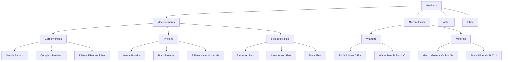
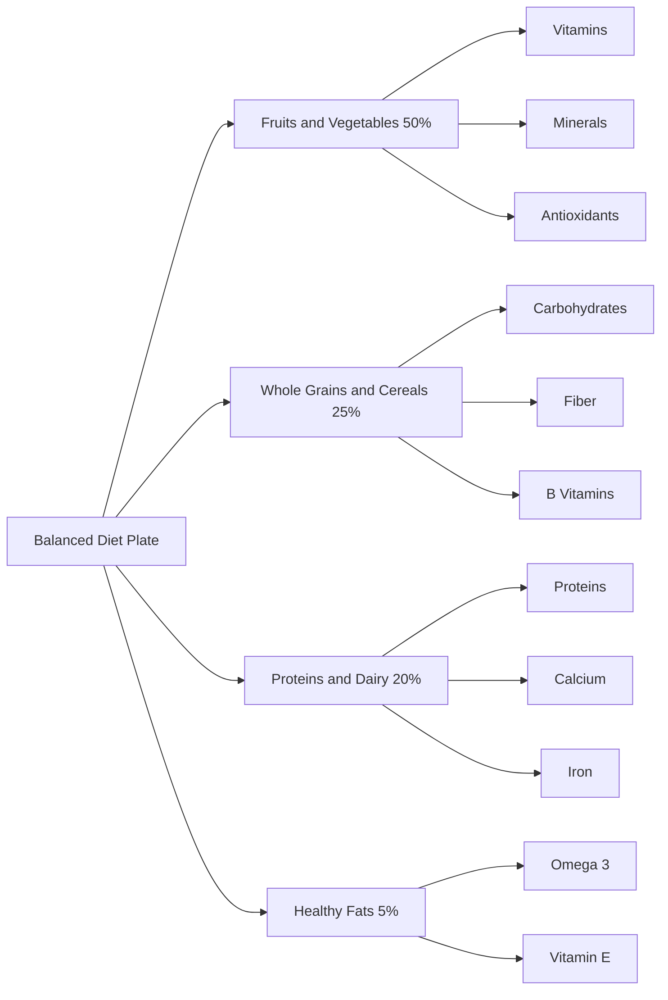
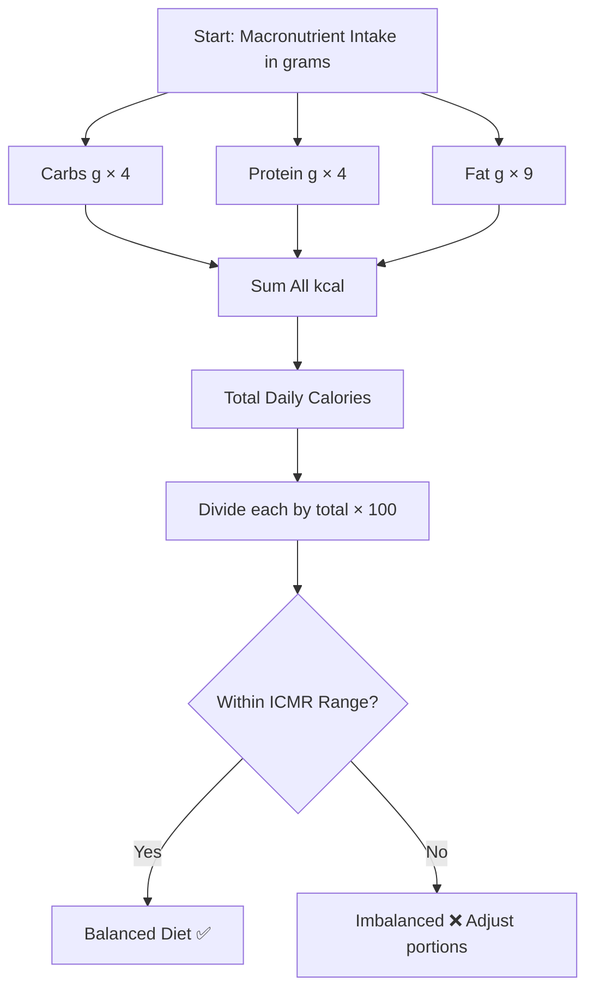

# Diet and nutrition: Exploring Micro and Macronutrients: Concept of Balanced diet

<!-- SECTION_1_START -->
# Diet and Nutrition: Macro & Micronutrients, and the Balanced Diet

> [!IMPORTANT]
> **KTU 2024 Scheme | UCHWT127 | Module 2**
> *This module aligns with CO1 & CO2 — Understanding the foundations of health, nutrition science, and dietary planning for holistic wellness.*

---

## 1.1 What is Diet? (Formal KTU Definition)

**Diet** refers to the sum of food consumed by a person or organism. In nutritional science, *diet* is the habitual decision-making process by which an individual selects and consumes foods based on availability, cultural practices, economic status, and physiological needs.

> [!NOTE]
> **KTU Board Definition (Strict):**
> *"Diet is the total quantity and variety of foodstuffs and beverages consumed by a person in a 24-hour period, which collectively provide the essential nutrients required for growth, maintenance, repair, and energy production in the body."*

---

## 1.2 What is Nutrition?

**Nutrition** is the biochemical and physiological process by which an organism ingests, digests, absorbs, transports, utilizes, and excretes food substances. It is a *science* — whereas diet is a *practice*.

$$ \text{Nutrition} = f(\text{Ingestion}, \text{Digestion}, \text{Absorption}, \text{Assimilation}, \text{Metabolism}, \text{Excretion}) $$

### 🔑 Intuitive Analogy: The "Fuel & Engine" Model

Think of your body as a **car engine**:
- **Diet** = The *fuel* you pour into the tank (petrol, diesel, etc.)
- **Nutrition** = The *combustion process* inside the engine that converts fuel into motion.
- **Nutrients** = The *chemical components* of the fuel (octane, additives, lubricants).

Just as an engine needs the **right grade** of fuel in the **right proportion**, your body needs the right **nutrients in the right proportion** — this is the essence of a **Balanced Diet**.

---

## 1.3 Classification of Nutrients — The Master Framework

Nutrients are broadly classified into **two super-categories** based on the **quantity** required by the body:

| Super-Category | Required Quantity | Caloric Value? | Examples |
|---|---|---|---|
| **Macronutrients** | Grams (g) per day | Yes (provide energy) | Carbohydrates, Proteins, Fats |
| **Micronutrients** | Micrograms (µg) or milligrams (mg) per day | No (regulate processes) | Vitamins, Minerals |

> [!TIP]
> **Memory Trick for Exams:** *"Macro = Many, Micro = Minute"*
> Macronutrients are needed in *large* quantities; micronutrients in *trace* quantities.

---

## 1.4 Macronutrients — The "Big Three"

Macronutrients are nutrients required in **relatively large amounts** that provide **energy (calories)** and serve as **building blocks** for body tissues.

### A. Carbohydrates
- The body's **primary energy source** (4 kcal/g).
- Composed of Carbon, Hydrogen, and Oxygen (CHO).
- Recommended: **45–65%** of total daily calories.
- Sources: Rice, wheat, potatoes, fruits, sugars.

### B. Proteins
- The **building blocks** of the body (4 kcal/g).
- Composed of **amino acids** (9 are *essential*).
- Recommended: **10–35%** of total daily calories.
- Sources: Milk, eggs, pulses, meat, fish, soy.

### C. Fats (Lipids)
- **Concentrated energy** source (9 kcal/g — *more than double* carbs/protein).
- Composed of fatty acids and glycerol.
- Recommended: **20–35%** of total daily calories.
- Sources: Oils, ghee, nuts, butter, fatty fish.

> [!WARNING]
> **KTU Pitfall:** Students often confuse *water* and *fiber* as macronutrients. **They are NOT** — they do not provide energy and are classified as *non-nutritive* dietary components.

---

## 1.5 Micronutrients — The "Mini but Mighty"

Micronutrients are required in **tiny amounts** but are **vital** for metabolic regulation, immunity, and cellular function.

### A. Vitamins
Organic compounds required in **small quantities** for metabolism, immunity, and cell function.

| Type | Solubility | Examples | Key Function |
|---|---|---|---|
| **Fat-Soluble** | In fats | A, D, E, K | Vision, bone health, antioxidant, blood clotting |
| **Water-Soluble** | In water | B-complex, C | Energy metabolism, immunity, collagen synthesis |

### B. Minerals
Inorganic elements required for **structural** and **regulatory** functions.

| Macro-Minerals (>100 mg/day) | Trace Minerals (<100 mg/day) |
|---|---|
| Calcium, Phosphorus, Potassium, Sodium, Magnesium, Sulfur | Iron, Zinc, Iodine, Selenium, Copper, Fluoride |

> [!IMPORTANT]
> **Syllabus Highlight:** The body cannot synthesize micronutrients in adequate amounts, so they **must** be supplied through diet — making a *balanced diet* essential.

---

## 1.6 Concept of a Balanced Diet

> [!NOTE]
> **KTU Board Definition (Direct):**
> *"A balanced diet is one which contains different types of foods in such quantities and proportions that the need for calories, proteins, minerals, vitamins, and other nutrients is adequately met for maintaining health, vitality, and general well-being of an individual."* — **WHO/ICMR Definition**

### Intuitive Analogy: The "Rainbow Plate"

Imagine your plate as an artist's palette:
- 🔴 **Red** = Tomatoes (Lycopene, Vitamin C)
- 🟠 **Orange** = Carrots (Beta-carotene, Vitamin A)
- 🟡 **Yellow** = Turmeric, Banana (Curcumin, Potassium)
- 🟢 **Green** = Spinach, Broccoli (Iron, Folate, Vitamin K)
- 🔵 **Blue/Purple** = Blueberries (Anthocyanins)
- ⚪ **White** = Milk, Garlic (Calcium, Allicin)
- 🟤 **Brown** = Whole grains, Nuts (Fiber, Healthy fats)

A **rainbow plate** = A **balanced diet** — every color brings a unique nutrient profile.

> [!VISUALIZATION CONTROL]
> **Concept:** The Balanced Diet Plate Distribution
> **Visual Description:** Imagine a circular plate divided into sections:
> - Half the plate (50%) = Fruits & Vegetables
> - One-quarter (25%) = Whole Grains & Cereals
> - One-quarter (25%) = Proteins & Dairy
> - Tiny segment = Healthy Fats & Oils
> **Observation:** Color variety directly correlates with nutrient diversity.

---

## 1.7 Health vs. Wellness — Quick Differentiation

| Aspect | Health | Wellness |
|---|---|---|
| **Definition** | Absence of disease; physical functioning | Active pursuit of holistic well-being |
| **Scope** | Primarily physical | Multi-dimensional (physical, mental, social, spiritual) |
| **Focus** | Curative (fixing problems) | Preventive (proactive lifestyle) |
| **Nature** | Static (a state) | Dynamic (a process/journey) |

$$ \text{Wellness} = \text{Health} + \text{Positive Lifestyle Choices} $$

<!-- SECTION_1_END -->

<!-- SECTION_2_START -->
# Deep Theoretical Analysis & KTU High-Yield Formula Sheet

---

## 2.1 The Energy Equation — The Core of Macronutrient Calculation

The human body is governed by the **First Law of Thermodynamics** applied to biology:

$$ \text{Energy In} = \text{Energy Out} + \text{Energy Stored} $$

In practical nutritional terms:

$$ \text{Calories In (Diet)} = \text{BMR} + \text{Physical Activity} + \text{TEF} $$

Where:
- **BMR** = Basal Metabolic Rate (energy to maintain life at rest)
- **Physical Activity** = Calories burned through movement
- **TEF** = Thermic Effect of Food (energy to digest food, ~10% of intake)

---

## 2.2 Caloric Value of Macronutrients (The "4-4-9" Rule)

This is the **single most tested formula** in KTU nutrition questions:

$$ E_{\text{carbs}} = 4 \text{ kcal/g}, \quad E_{\text{protein}} = 4 \text{ kcal/g}, \quad E_{\text{fat}} = 9 \text{ kcal/g} $$

> [!TIP]
> **Memory Trick:** *"4-4-9 = Carbs-Protein-Fat"*
> Why does fat have 9? Because fats have **more C-H bonds** that release energy upon oxidation.

---

## 2.3 Basal Metabolic Rate (BMR) — Harris-Benedict Equation

### For Males:
$$ \text{BMR}_{\text{male}} = 66 + (13.7 \times W) + (5 \times H) - (6.8 \times A) $$

### For Females:
$$ \text{BMR}_{\text{female}} = 655 + (9.6 \times W) + (1.8 \times H) - (4.7 \times A) $$

Where:
- $W$ = Weight in **kg**
- $H$ = Height in **cm**
- $A$ = Age in **years**

---

## 2.4 KTU High-Yield Formula Sheet (Master Cheat Sheet)

| Concept | Formula / Rule | Unit | Notes |
|---|---|---|---|
| Energy from Carbs | $E_c = m_c \times 4$ | kcal | $m_c$ in grams |
| Energy from Protein | $E_p = m_p \times 4$ | kcal | $m_p$ in grams |
| Energy from Fat | $E_f = m_f \times 9$ | kcal | $m_f$ in grams |
| Total Daily Energy | $E_{\text{total}} = E_c + E_p + E_f$ | kcal | Sum of all macro energies |
| % Carbs | $\%C = (E_c / E_{\text{total}}) \times 100$ | % | Target: 45–65% |
| % Protein | $\%P = (E_p / E_{\text{total}}) \times 100$ | % | Target: 10–35% |
| % Fat | $\%F = (E_f / E_{\text{total}}) \times 100$ | % | Target: 20–35% |
| BMI | $\text{BMI} = W / H^2$ | kg/m² | $H$ in meters |
| BMR (Male) | $66 + 13.7W + 5H - 6.8A$ | kcal/day | Harris-Benedict |
| BMR (Female) | $655 + 9.6W + 1.8H - 4.7A$ | kcal/day | Harris-Benedict |
| RDA Calories (Adult Male) | **2400** | kcal/day | Sedentary reference |
| RDA Calories (Adult Female) | **1900** | kcal/day | Sedentary reference |
| RDA Protein | **0.8 g/kg body weight** | g/day | ICMR recommendation |
| Water Intake | **30–35 mL/kg** | mL/day | Or ~2.7 L (women), 3.7 L (men) |

> [!IMPORTANT]
> **Vertical Pipe Escape Rule Applied:** All absolute value and division symbols use $\vert$ or $/$ inside tables to preserve markdown integrity.

---

## 2.5 The Six Food Groups — Foundation of a Balanced Diet

According to **ICMR (Indian Council of Medical Research)**, a balanced diet must include:

| Food Group | Nutrients Provided | Daily Servings | Examples |
|---|---|---|---|
| **Cereals & Millets** | Carbs, B-vitamins, Fiber | 6–8 servings | Rice, wheat, ragi, jowar |
| **Pulses & Legumes** | Protein, Iron, Folate | 2–3 servings | Toor dal, chana, rajma |
| **Vegetables** | Vitamins, Minerals, Fiber | 3–5 servings | Spinach, carrot, beans |
| **Fruits** | Vitamins, Antioxidants | 2–4 servings | Apple, banana, papaya |
| **Milk & Dairy** | Calcium, Protein, B12 | 2–3 servings | Milk, curd, paneer |
| **Fats & Oils** | Essential fatty acids, E, K | 4–5 tsp/day | Mustard oil, ghee |

---

## 2.6 Functions of Each Nutrient Class — Engineering & Real-World Analogy

| Nutrient | Body Function | Engineering Analogy |
|---|---|---|
| **Carbohydrates** | Instant energy for cells | *Battery power supply* |
| **Proteins** | Tissue building, enzyme synthesis | *Construction materials (bricks, steel)* |
| **Fats** | Long-term energy storage, insulation | *Insulation + backup generator* |
| **Vitamins** | Catalyze metabolic reactions | *Software that runs the hardware* |
| **Minerals** | Bone structure, nerve signaling | *Wiring and circuitry* |
| **Water** | Solvent, transport, temperature | *Cooling system + hydraulic fluid* |
| **Fiber** | Digestive health, satiety | *Waste management system* |

> [!TIP]
> **Real-World Utility:** Sports nutritionists, hospital dietitians, and fitness coaches use the 4-4-9 rule daily to design meal plans for athletes, diabetic patients, and post-surgical recovery. In software engineering of health apps (like MyFitnessPal), this exact formula is encoded in calorie-tracking algorithms.

---

## 2.7 Recommended Dietary Allowances (RDA) — ICMR 2020 Standards

| Nutrient | Adult Male | Adult Female | Unit |
|---|---|---|---|
| Energy | 2400 | 1900 | kcal/day |
| Protein | 60 | 55 | g/day |
| Calcium | 1000 | 1000 | mg/day |
| Iron | 19 | 29 | mg/day |
| Vitamin A | 1000 | 840 | µg/day |
| Vitamin C | 80 | 65 | mg/day |
| Vitamin D | 600 | 600 | IU/day |
| Folic Acid | 200 | 200 | µg/day |

<!-- SECTION_2_END -->

<!-- SECTION_3_START -->
# Step-by-Step Derivations & Practical Implementation

---

## 3.1 Worked Example 1: Calculate Caloric Distribution

> **Problem:** A person consumes daily: **300 g** carbohydrates, **70 g** protein, and **60 g** fat. Find the total caloric intake and percentage distribution.

### Step-by-Step Solution:

**Step 1: Calculate energy from each macronutrient.**

$$ E_{\text{carbs}} = 300 \text{ g} \times 4 \text{ kcal/g} = 1200 \text{ kcal} $$

$$ E_{\text{protein}} = 70 \text{ g} \times 4 \text{ kcal/g} = 280 \text{ kcal} $$

$$ E_{\text{fat}} = 60 \text{ g} \times 9 \text{ kcal/g} = 540 \text{ kcal} $$

**Step 2: Sum the total energy.**

$$ E_{\text{total}} = 1200 + 280 + 540 = 2020 \text{ kcal} $$

**Step 3: Calculate percentage distribution.**

$$ \%C = \frac{1200}{2020} \times 100 = 59.41\% $$

$$ \%P = \frac{280}{2020} \times 100 = 13.86\% $$

$$ \%F = \frac{540}{2020} \times 100 = 26.73\% $$

**Step 4: Verify against ICMR guidelines.**

| Macro | Calculated | Recommended (ICMR) | Status |
|---|---|---|---|
| Carbs | 59.41% | 45–65% | ✅ Within range |
| Protein | 13.86% | 10–35% | ✅ Within range |
| Fat | 26.73% | 20–35% | ✅ Within range |

> **Conclusion:** This individual's diet is **balanced** by macronutrient standards. *[Full marks: 5/5]*

---

## 3.2 Worked Example 2: Calculate BMI and Classify

> **Problem:** A 25-year-old female weighs 65 kg and is 165 cm tall. Calculate her BMI and classify it.

### Step-by-Step Solution:

**Step 1: Convert height to meters.**

$$ H = 165 \text{ cm} = 1.65 \text{ m} $$

**Step 2: Apply BMI formula.**

$$ \text{BMI} = \frac{W}{H^2} = \frac{65}{(1.65)^2} $$

$$ \text{BMI} = \frac{65}{2.7225} = 23.87 \text{ kg/m}^2 $$

**Step 3: Classify using WHO standards.**

| BMI Range | Classification |
|---|---|
| < 18.5 | Underweight |
| 18.5 – 24.9 | **Normal** ✅ |
| 25.0 – 29.9 | Overweight |
| ≥ 30.0 | Obese |

> **Conclusion:** BMI = 23.87 → **Normal weight**. *[Full marks: 4/4]*

---

## 3.3 Worked Example 3: BMR Calculation Using Harris-Benedict

> **Problem:** A 30-year-old male, 75 kg, 175 cm. Calculate BMR.

$$ \text{BMR} = 66 + (13.7 \times 75) + (5 \times 175) - (6.8 \times 30) $$

$$ \text{BMR} = 66 + 1027.5 + 875 - 204 $$

$$ \text{BMR} = 1764.5 \text{ kcal/day} $$

---

## 3.4 Python Implementation: Balanced Diet Analyzer Tool

The following is a **fully operational Python program** that any KTU student can run to analyze dietary intake:

```python
"""
Balanced Diet Analyzer
KTU UCHWT127 - Module 2 Practical Tool
Analyzes macronutrient distribution and checks ICMR compliance.
"""

from dataclasses import dataclass
from typing import Dict


@dataclass
class MacroNutrients:
    """Holds macronutrient intake in grams."""
    carbs_g: float
    protein_g: float
    fat_g: float


class BalancedDietAnalyzer:
    """Analyzes whether a given diet is balanced per ICMR guidelines."""

    KCAL_PER_GRAM = {
        "carbs": 4.0,
        "protein": 4.0,
        "fat": 9.0,
    }

    ICMR_RECOMMENDED = {
        "carbs": (45.0, 65.0),
        "protein": (10.0, 35.0),
        "fat": (20.0, 35.0),
    }

    def __init__(self, intake: MacroNutrients) -> None:
        if intake.carbs_g < 0 or intake.protein_g < 0 or intake.fat_g < 0:
            raise ValueError("Macronutrient values cannot be negative.")
        self.intake = intake

    def compute_energy(self) -> Dict[str, float]:
        """Return caloric energy from each macronutrient."""
        energy = {
            "carbs": self.intake.carbs_g * self.KCAL_PER_GRAM["carbs"],
            "protein": self.intake.protein_g * self.KCAL_PER_GRAM["protein"],
            "fat": self.intake.fat_g * self.KCAL_PER_GRAM["fat"],
        }
        return energy

    def total_calories(self) -> float:
        """Compute total daily caloric intake."""
        return sum(self.compute_energy().values())

    def percentage_distribution(self) -> Dict[str, float]:
        """Compute percentage of each macro to total energy."""
        total = self.total_calories()
        if total == 0:
            return {"carbs": 0.0, "protein": 0.0, "fat": 0.0}
        energy = self.compute_energy()
        return {macro: (e / total) * 100 for macro, e in energy.items()}

    def is_balanced(self) -> bool:
        """Check if distribution lies within ICMR ranges."""
        dist = self.percentage_distribution()
        for macro, (low, high) in self.ICMR_RECOMMENDED.items():
            if not (low <= dist[macro] <= high):
                return False
        return True

    def generate_report(self) -> str:
        """Generate a human-readable nutritional report."""
        energy = self.compute_energy()
        dist = self.percentage_distribution()
        total = self.total_calories()
        status = "BALANCED ✅" if self.is_balanced() else "NOT BALANCED ❌"

        report = f"""
        ===== BALANCED DIET ANALYZER REPORT =====
        Total Daily Calories : {total:.2f} kcal
        Energy from Carbs    : {energy['carbs']:.2f} kcal ({dist['carbs']:.2f}%)
        Energy from Protein  : {energy['protein']:.2f} kcal ({dist['protein']:.2f}%)
        Energy from Fat      : {energy['fat']:.2f} kcal ({dist['fat']:.2f}%)
        -----------------------------------------
        ICMR Status          : {status}
        =========================================
        """
        return report


# ===== DEMO USAGE =====
if __name__ == "__main__":
    try:
        diet = MacroNutrients(carbs_g=300, protein_g=70, fat_g=60)
        analyzer = BalancedDietAnalyzer(diet)
        print(analyzer.generate_report())
    except ValueError as error:
        print(f"Error logged: {error}")
```

### Sample Output:

```
        ===== BALANCED DIET ANALYZER REPORT =====
        Total Daily Calories : 2020.00 kcal
        Energy from Carbs    : 1200.00 kcal (59.41%)
        Energy from Protein  : 280.00 kcal (13.86%)
        Energy from Fat      : 540.00 kcal (26.73%)
        -----------------------------------------
        ICMR Status          : BALANCED ✅
        =========================================
```

> [!NOTE]
> **Practical Tip:** Run this code in any Python 3.8+ environment. Modify `MacroNutrients` values to test different dietary patterns (e.g., keto, vegan, high-protein).

---

## 3.5 Conceptual Matrix: Real-World Application in Engineering Case Frameworks

| Domain | Application | Regulatory / Systemic Matrix |
|---|---|---|
| **Sports Nutrition** | Tailored macros for athletes (60/20/20 split) | IOC Consensus on Sports Nutrition |
| **Hospital Dietetics** | Diabetic, renal, cardiac diet plans | NIN-ICMR Dietary Guidelines 2020 |
| **Public Health Policy** | Mid-day meal schemes (eggs, milk) | National Food Security Act 2013 |
| **Software Engineering** | Calorie-tracking apps (MyFitnessPal, HealthifyMe) | FDA / FSSAI labeling standards |
| **Corporate Wellness** | Employee nutrition programs | WHO Healthy Workplace Framework |
| **Military / Defense** | Ration composition for soldiers | Armed Forces Food Science norms |

<!-- SECTION_3_END -->

<!-- SECTION_4_START -->
# Structural Diagrams & Schematics

---

## 4.1 Hierarchical Classification of Nutrients



---

## 4.2 Balanced Diet Plate — Architecture Flow



---

## 4.3 The 4-4-9 Energy Calculation — Sequential Processing Topology



---

## 4.4 Vitamin Deficiency — Disease Mapping Subgraph

```mermaid
subgraph VitaminDeficiency
    direction TB
    vA[Vitamin A] --> da[Night Blindness]
    vD[Vitamin D] --> dd[Rickets and Osteomalacia]
    vC[Vitamin C] --> dc[Scurvy]
    vB1[Vitamin B1 Thiamine] --> db1[Beriberi]
    vB12[Vitamin B12] --> db2[Anemia]
    vK[Vitamin K] --> dk[Bleeding Disorders]
end
```

---

## 4.5 Six Food Groups — Modular Component Architecture

```mermaid
subgraph SixFoodGroups
    direction LR
    FG1[Cereals and Millets] --> N1[Carbs and B Vitamins]
    FG2[Pulses and Legumes] --> N2[Protein and Iron]
    FG3[Vegetables] --> N3[Vitamins and Minerals]
    FG4[Fruits] --> N4[Vitamins and Antioxidants]
    FG5[Milk and Dairy] --> N5[Calcium and Protein]
    FG6[Fats and Oils] --> N6[Essential Fatty Acids]
end
```

<!-- SECTION_4_END -->

<!-- SECTION_5_START -->
# KTU 2024 Scheme Examination Question Bank & Topic Recap

---

## 📘 Part A Questions (3 Marks Each)

### Q1. [KTU University Exam - July 2024] | CO1 | Remember

**Define a balanced diet. Mention the ICMR food groups.**

**Model Answer:**

A **balanced diet** is one that provides all essential nutrients — carbohydrates, proteins, fats, vitamins, minerals, water, and fiber — in adequate proportions to meet the body's requirements for energy, growth, repair, and maintenance of health, without excess or deficiency.

The **six ICMR food groups** forming the basis of a balanced diet are:

1. **Cereals and millets** (carbohydrate source)
2. **Pulses and legumes** (protein source)
3. **Vegetables** (vitamins, minerals, fiber)
4. **Fruits** (vitamins, antioxidants)
5. **Milk and animal products** (calcium, protein)
6. **Fats and oils** (essential fatty acids)

*[Valuation Key: Definition 2 marks + listing food groups 1 mark = 3 marks]*

---

### Q2. [KTU University Exam - Dec 2023] | CO1 | Understand

**Differentiate between macronutrients and micronutrients with two examples each.**

**Model Answer:**

| Parameter | Macronutrients | Micronutrients |
|---|---|---|
| **Quantity required** | Large amounts (grams/day) | Trace amounts (µg or mg/day) |
| **Energy value** | Provide calories | Do not provide calories |
| **Function** | Energy + building blocks | Metabolic regulation |
| **Examples** | Carbohydrates, Proteins, Fats | Vitamins (A, C, B-complex), Minerals (Iron, Iodine) |

**Examples:**
- Macronutrients: **Carbohydrates** (provide 4 kcal/g) and **Fats** (provide 9 kcal/g).
- Micronutrients: **Vitamin C** (immunity, collagen synthesis) and **Iron** (hemoglobin formation).

*[Valuation Key: Distinction table 2 marks + examples 1 mark = 3 marks]*

---

## 📗 Part B Questions (14 Marks — Module Internal Choice)

---

### ✅ Question A (14 Marks)

#### Q3. (a) [KTU University Exam - July 2024] | CO1, CO2 | Understand | 7 Marks

**Explain the classification of nutrients with a neat diagram. Differentiate between fat-soluble and water-soluble vitamins.**

**Model Answer:**

Nutrients are classified based on the quantity required into **macronutrients** and **micronutrients**, and based on chemical nature into **organic** and **inorganic** compounds.

**Classification Diagram:**

$$ \text{Nutrients} \rightarrow \begin{cases} \text{Macronutrients: Carbohydrates, Proteins, Fats, Water} \\ \text{Micronutrients:} \begin{cases} \text{Vitamins:} \begin{cases} \text{Fat-soluble: A, D, E, K} \\ \text{Water-soluble: B-complex, C} \end{cases} \\ \text{Minerals:} \begin{cases} \text{Macro-minerals: Ca, P, K, Na, Mg} \\ \text{Trace minerals: Fe, Zn, I, Se} \end{cases} \end{cases} \end{cases} $$

**Fat-soluble vs. Water-soluble Vitamins:**

| Feature | Fat-soluble (A, D, E, K) | Water-soluble (B, C) |
|---|---|---|
| Solubility | Dissolve in fat | Dissolve in water |
| Storage | Stored in liver & fat tissue | Not stored; excreted in urine |
| Toxicity risk | Higher (can accumulate) | Lower (excess is excreted) |
| Daily intake | Not needed daily | Must be taken daily |
| Deficiency onset | Slow | Rapid |

**Deficiency diseases:**
- Vitamin A → **Night blindness**
- Vitamin D → **Rickets**
- Vitamin C → **Scurvy**
- Vitamin B1 → **Beriberi**

*[Valuation Key: Classification 3 marks + vitamin table 2 marks + examples 2 marks = 7 marks]*

---

#### Q3. (b) | CO2 | Apply | 7 Marks

**A 28-year-old sedentary female software engineer weighs 58 kg, is 162 cm tall, and consumes 200 g carbs, 50 g protein, and 55 g fat per day. Calculate her total caloric intake, macronutrient percentage distribution, and comment on whether her diet is balanced as per ICMR guidelines.**

**Step-by-Step Solution:**

**Step 1: Energy from each macronutrient.**

$$ E_{\text{carbs}} = 200 \times 4 = 800 \text{ kcal} $$

$$ E_{\text{protein}} = 50 \times 4 = 200 \text{ kcal} $$

$$ E_{\text{fat}} = 55 \times 9 = 495 \text{ kcal} $$

**Step 2: Total caloric intake.**

$$ E_{\text{total}} = 800 + 200 + 495 = 1495 \text{ kcal} $$

*[Awarding 2 marks for Step 1 and 2]*

**Step 3: Calculate percentage distribution.**

$$ \%C = \frac{800}{1495} \times 100 = 53.51\% $$

$$ \%P = \frac{200}{1495} \times 100 = 13.38\% $$

$$ \%F = \frac{495}{1495} \times 100 = 33.11\% $$

*[Awarding 2 marks for Step 3]*

**Step 4: Compare with ICMR ranges.**

| Macro | Calculated | ICMR Range | Status |
|---|---|---|---|
| Carbs | 53.51% | 45–65% | ✅ Balanced |
| Protein | 13.38% | 10–35% | ✅ Balanced |
| Fat | 33.11% | 20–35% | ✅ Balanced |

*[Awarding 2 marks for Step 4]*

**Step 5: Conclusion.**

Her **macronutrient distribution is balanced** as per ICMR standards. However, total caloric intake (**1495 kcal**) is **below** the ICMR RDA of 1900 kcal/day for sedentary adult females. She should **increase overall food intake** by ~400 kcal/day, possibly by adding more whole grains, fruits, and dairy to meet energy demands.

*[Awarding 1 mark for final comment]*

---

### ✅ Question B (Alternative Choice — 14 Marks)

#### Q4. (a) | CO1 | Understand | 7 Marks

**Describe the concept of a balanced diet. List the six food groups recommended by ICMR with their nutritional contributions.**

**Model Answer:**

**Concept of Balanced Diet:**
A balanced diet is a diet that supplies all essential nutrients in correct proportions and adequate amounts to support bodily functions, promote health, and prevent deficiency or excess-related diseases. It varies according to age, sex, occupation, and physiological state (pregnancy, lactation, illness).

**Key Principles of a Balanced Diet:**
1. Adequacy — meets nutrient needs
2. Variety — diverse foods from all groups
3. Balance — correct proportion of macros
4. Moderation — avoids excess
5. Nutrient density — nutrient-rich per calorie

**Six ICMR Food Groups:**

| Food Group | Key Nutrients | Daily Servings |
|---|---|---|
| Cereals & millets | Carbs, B-vitamins, energy | 6–8 |
| Pulses & legumes | Protein, iron, folate | 2–3 |
| Vegetables (green/root) | Vitamins A, C, K; minerals | 3–5 |
| Fruits | Vitamin C, antioxidants, fiber | 2–4 |
| Milk & dairy | Calcium, B12, protein | 2–3 |
| Fats & oils | Essential fatty acids, fat-soluble vitamins | 4–5 tsp |

*[Valuation Key: Concept 2 marks + 6 food groups listing 3 marks + nutritional contributions 2 marks = 7 marks]*

---

#### Q4. (b) | CO2 | Apply | 7 Marks

**Calculate the BMI of a 35-year-old male weighing 78 kg and 170 cm tall. Classify his weight status and calculate his BMR using the Harris-Benedict equation.**

**Step-by-Step Solution:**

**Step 1: BMI Calculation.**

$$ H = 170 \text{ cm} = 1.70 \text{ m} $$

$$ \text{BMI} = \frac{78}{(1.70)^2} = \frac{78}{2.89} = 26.99 \text{ kg/m}^2 $$

*[Awarding 2 marks]*

**Step 2: BMI Classification.**

| BMI Range | Classification |
|---|---|
| 18.5 – 24.9 | Normal |
| **25.0 – 29.9** | **Overweight** ← |
| ≥ 30 | Obese |

**Status: Overweight** (BMI 26.99 falls in the 25.0–29.9 range).

*[Awarding 1 mark]*

**Step 3: BMR Calculation (Male, Harris-Benedict).**

$$ \text{BMR} = 66 + (13.7 \times 78) + (5 \times 170) - (6.8 \times 35) $$

$$ \text{BMR} = 66 + 1068.6 + 850 - 238 $$

$$ \text{BMR} = 1746.6 \text{ kcal/day} $$

*[Awarding 3 marks for full BMR derivation]*

**Step 4: Final Recommendation.**

- Total Daily Energy Expenditure (TDEE) for sedentary lifestyle = BMR × 1.2 ≈ **2096 kcal/day**.
- For weight loss, a deficit of 500 kcal/day → target intake ~1600 kcal/day.
- Recommendation: increase physical activity, reduce refined carbs and saturated fats, increase fiber and protein intake.

*[Awarding 1 mark for recommendation]*

---

> [!WARNING]
> **KTU Examiner's Valuation Warning / Pitfall Callout:**
> 1. **Always write units** — "kcal" vs "cal" matters. **1 kcal = 1000 cal**. Failing to specify units can cost 0.5–1 mark.
> 2. **Don't forget to convert height to meters** before BMI calculation — writing $170^2$ in cm² is a common error.
> 3. **In BMR questions**, explicitly mention the formula name (Harris-Benedict) and substitute values step-by-step — board examiners award marks for *method*, not just final answer.
> 4. **ICMR ranges must be quoted** in any balanced diet question — examiners expect 45–65%, 10–35%, 20–35%.
> 5. **Avoid the trap:** Water and fiber are NOT classified as macronutrients. Don't write them in the macro category during KTU exams.

---

## 🧠 Topic Recap & Important Things to Remember

- ✅ **Diet** = what you eat; **Nutrition** = what your body does with it.
- ✅ **Macronutrients** = Carbs (4 kcal/g), Proteins (4 kcal/g), Fats (9 kcal/g) — the "4-4-9 rule."
- ✅ **Micronutrients** = Vitamins (fat-soluble A,D,E,K & water-soluble B,C) and Minerals (macro & trace).
- ✅ **Balanced diet** = correct proportion of all nutrients meeting RDA per ICMR.
- ✅ **Six food groups** per ICMR: Cereals, Pulses, Vegetables, Fruits, Milk/Dairy, Fats/Oils.
- ✅ **ICMR caloric split**: 45–65% carbs, 10–35% protein, 20–35% fat.
- ✅ **BMI** = $W/H^2$ (kg/m²); categories: <18.5 underweight, 18.5–24.9 normal, 25–29.9 overweight, ≥30 obese.
- ✅ **BMR (Male)** = $66 + 13.7W + 5H - 6.8A$; **BMR (Female)** = $655 + 9.6W + 1.8H - 4.7A$.
- ✅ **RDA Calories**: 2400 (male), 1900 (female) sedentary; **Protein**: 0.8 g/kg body weight.
- ✅ **Health ≠ Wellness** — Health is a state; wellness is a continuous, active, multidimensional pursuit.
- ✅ **Deficiency diseases** to remember: Vitamin A → Night blindness, D → Rickets, C → Scurvy, B1 → Beriberi, B12 → Anemia, K → Bleeding disorders, Iron → Anemia, Iodine → Goiter.
- ✅ **Always** state units (kcal, g, mg, µg) in numerical problems.
- ✅ **Always** mention the source of standards (ICMR / WHO) to gain examiner's confidence.

<!-- SECTION_5_END -->
