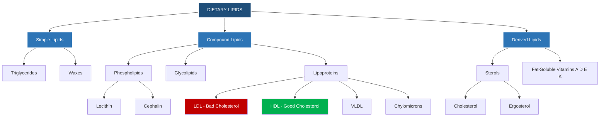
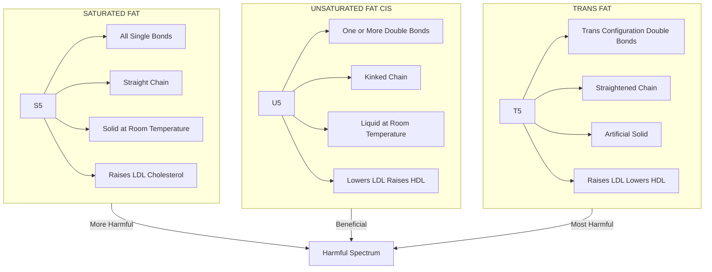
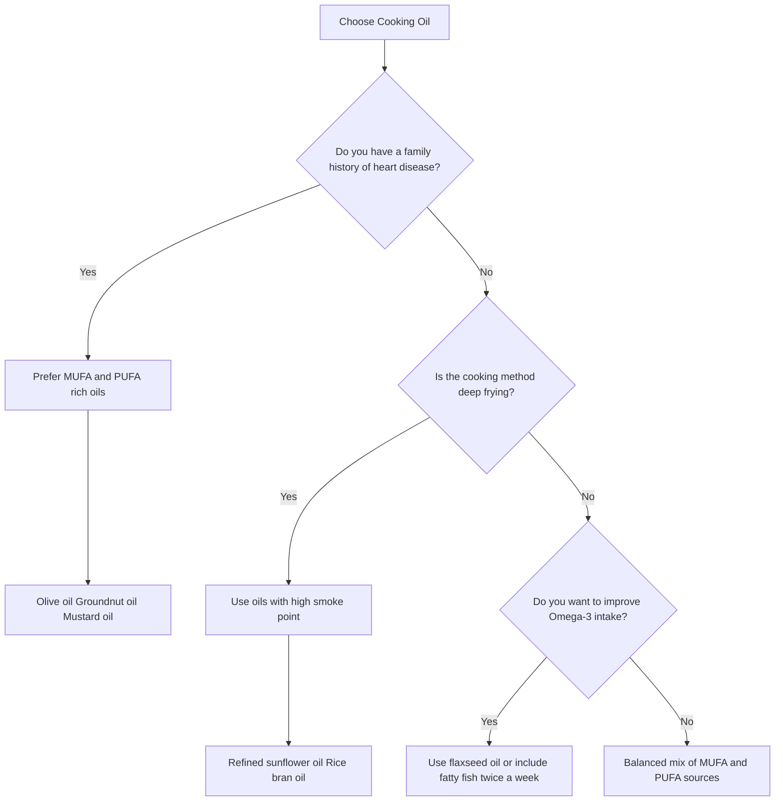

# Dietary Fats & their Effects on Human Health

<!-- SECTION_1_START -->
# Dietary Fats & Their Effects on Human Health

## 1.1 Formal Academic Definition

In accordance with the **KTU 2024 Scheme** syllabus for *Health and Wellness (UCHWT127)*, **Dietary Fats** are defined as a heterogeneous group of organic compounds known as *lipids* that are **insoluble in water** but soluble in organic solvents (such as ether, chloroform, and benzene). They are composed primarily of **triglycerides** (triacylglycerols) — esters formed from one molecule of glycerol and three fatty acid chains — along with minor constituents such as phospholipids, sterols (notably cholesterol), and fat-soluble vitamins (A, D, E, K).

> [!IMPORTANT]
> **KTU Syllabus Highlight (Module 2):** Dietary fats are macronutrients providing **9 kilocalories per gram (kcal/g)**, making them the most energy-dense macronutrient — more than double the caloric yield of carbohydrates (4 kcal/g) and proteins (4 kcal/g).

### Structural Building Block

$$\text{Triglyceride} \;=\; \text{Glycerol} \;+\; 3 \times \text{Fatty Acids} \;\longrightarrow\; \text{Triacylglycerol} + 3\,H_2O$$

The fatty acid chain itself has the general formula:

$$\text{CH}_3 - (\text{CH}_2)_n - \text{COOH}$$

where **n** typically ranges from **2 to 28**, dictating whether the fat is short-, medium-, or long-chained.

---

## 1.2 Conceptual Analogy & Intuitive Overview

> [!NOTE]
> **Think of fats as a household "long-term battery backup."**
> Just as a UPS (Uninterruptible Power Supply) stores energy for emergencies, your body stores dietary fats in adipose tissue as a reserve fuel bank. When carbohydrates (the "daily current supply") run out during fasting or intense exercise, the body switches to burning these stored fats. However, unlike a simple battery, dietary fats come in different "chemistries" — some are stable and safe (unsaturated), while others behave like corroded, leaky batteries (trans fats) that damage the "electrical wiring" of your heart.

### Why Should a B.Tech Student Care?

An engineer typically optimizes systems for **efficiency, energy density, and reliability**. Dietary fats exhibit the *same engineering trade-offs*:
- **High energy density** → fewer grams needed for more calories (efficient storage).
- **Chemical stability** → determines shelf-life of food AND stability inside arteries.
- **Molecular geometry** (cis vs. trans) → dictates how the fat "fits" into cell membranes, mirroring how 3D molecular shape affects material properties in engineering polymers.

---

## 1.3 Visualization & Spatial Intuition

> [!VISUALIZATION CONTROL]
> **Concept:** Molecular Geometry of Saturated vs. Unsaturated Fats
> **GeoGebra / Desmos Input Equations:**
> * Saturated chain: `y = 0` (straight horizontal line, no kinks)
> * Monounsaturated (cis): `y = sin(x)` for $x \in [0, 2\pi]$ (one visible bend)
> * Polyunsaturated: `y = 0.8 sin(2x)` for $x \in [0, 2\pi]$ (multiple bends)
> **Visual Description:** Students should observe that the **cis-double bond** introduces a "kink" (≈ 30° bend) in the otherwise straight hydrocarbon chain. This bend is precisely why unsaturated fats remain *liquid* at room temperature — they cannot pack tightly together, unlike straight saturated chains that stack like dry spaghetti in a box.

---

## 1.4 The Three Broad Categories of Dietary Fats

| Category | State at Room Temp | Primary Dietary Sources | Health Implication |
|---|---|---|---|
| **Saturated Fats** | Solid | Butter, ghee, coconut oil, red meat, palm oil | Raise LDL cholesterol |
| **Unsaturated Fats** | Liquid (oils) | Olive oil, sunflower oil, fish, nuts, avocado | Cardio-protective |
| **Trans Fats** | Solid (artificial) | Vanaspati, margarine, packaged snacks, deep-fried fast food | Most harmful — raise LDL, lower HDL |

> [!WARNING]
> **KTU Examiner Insight:** A common student error is conflating *saturated* with *trans* fats. Remember — **saturated fats occur naturally**, whereas **trans fats are predominantly artificial**, produced via industrial *partial hydrogenation*.

---

## 1.5 Quick-Reference: Health & Wellness Differentiation

In Module 2's broader theme of "health and wellness differentiation," dietary fats are differentiated along **four orthogonal axes**:

1. **Chemical Axis** — Saturation level (saturated, monounsaturated, polyunsaturated).
2. **Geometric Axis** — *Cis* vs. *trans* configuration around double bonds.
3. **Biological Axis** — Essentiality (essential fatty acids like Omega-3, Omega-6 vs. non-essential).
4. **Functional Axis** — Structural (cell membranes), regulatory (hormones), or energetic (fuel).
<!-- SECTION_1_END -->

<!-- SECTION_2_START -->
# Deep Theoretical Analysis & KTU High-Yield Formula Sheet

## 2.1 Classification of Dietary Fats — The Complete Hierarchy

Dietary fats can be systematically classified into the following pyramid:

```
                    ┌──────────────────┐
                    │     LIPIDS       │  (umbrella term)
                    └────────┬─────────┘
                             │
       ┌─────────────────────┼─────────────────────┐
       │                     │                     │
  ┌────▼────┐         ┌──────▼──────┐       ┌──────▼──────┐
  │Simple   │         │Compound     │       │Derived      │
  │Lipids   │         │Lipids       │       │Lipids       │
  └────┬────┘         └──────┬──────┘       └──────┬──────┘
       │                     │                     │
   ┌───┴───┐         ┌───────┼────────┐         ┌──┴───┐
 Triglycerides   Phospholipids  Lipoproteins   Sterols
   Waxes                                                    │
                                                     Cholesterol
```

---

## 2.2 Saturated Fats — The "Straight-Chain" Lipids

### 2.2.1 Chemical Logic
- Contain **only single (sigma) bonds** between carbon atoms.
- Each carbon is "saturated" with hydrogen atoms.
- Chains are **straight and flexible** → pack tightly → solid at room temperature.

### 2.2.2 Key Saturated Fatty Acids (Memorize for KTU)

| Common Name | Carbon Count | Formula | Primary Source |
|---|---|---|---|
| Butyric acid | C4:0 | $C_3H_7COOH$ | Butter |
| Palmitic acid | C16:0 | $C_{15}H_{31}COOH$ | Palm oil, meat |
| Stearic acid | C18:0 | $C_{17}H_{35}COOH$ | Cocoa butter, beef |
| Lauric acid | C12:0 | $C_{11}H_{23}COOH$ | Coconut oil |

> **Naming Convention:** "C18:0" means 18 carbons, 0 double bonds. This is the **IUPAC shorthand** the KTU examiner expects.

### 2.2.3 Health Effect Mechanism
$$\text{Saturated Fat} \;\longrightarrow\; \uparrow \text{LDL-C (Low-Density Lipoprotein Cholesterol)} \;\longrightarrow\; \text{Atherosclerosis} \;\longrightarrow\; \uparrow \text{CVD Risk}$$

---

## 2.3 Unsaturated Fats — The "Kinked" Lipids

### 2.3.1 Monounsaturated Fatty Acids (MUFAs)
- Exactly **one** carbon–carbon double bond (C=C).
- Predominantly in *cis* configuration in nature.
- **Example:** Oleic acid (C18:1) — the principal fatty acid in **olive oil** and **canola oil**.

### 2.3.2 Polyunsaturated Fatty Acids (PUFAs)
- **Two or more** C=C double bonds.
- Sub-classified by the position of the *first* double bond from the methyl (CH₃) end:

| Class | First Double Bond Position | Examples | Sources |
|---|---|---|---|
| **Omega-3 (n-3)** | 3rd carbon from methyl end | ALA, EPA, DHA | Flaxseed, walnuts, fatty fish (salmon, mackerel) |
| **Omega-6 (n-6)** | 6th carbon from methyl end | Linoleic acid, Arachidonic acid | Sunflower, corn, soybean oils |

> [!IMPORTANT]
> **Essential Fatty Acids (EFAs):** The human body **cannot synthesize** Omega-3 and Omega-6 fatty acids *de novo* (they lack the desaturase enzymes at the n-3 and n-6 positions). Therefore, these are termed **essential** and must be obtained from the diet. The World Health Organization (WHO) recommends an **Omega-6 : Omega-3 ratio of approximately 4:1 to 5:1** for optimal health.

---

## 2.4 Trans Fats — The "Industrial Impostors"

### 2.4.1 Formation via Partial Hydrogenation

$$\text{Cis-unsaturated oil (liquid)} \xrightarrow[\text{Ni catalyst, } 200^\circ C]{\text{H}_2 \text{ (controlled)}} \text{Partially hydrogenated fat (solid)}$$

During this process, some *cis* double bonds rotate to the *trans* configuration. The trans configuration straightens the chain (no kink), giving a falsely "stable" solid product with a long shelf life — ideal for commercial baking but catastrophic for cardiovascular health.

### 2.4.2 The Dual-Damage Mechanism

$$\text{Trans Fat} \;\longrightarrow\; \begin{cases} \uparrow \text{LDL-C} \\ \downarrow \text{HDL-C} \end{cases} \;\longrightarrow\; \text{Doubled CVD Risk per 2\% calorie increase}$$

---

## 2.5 Cholesterol — The "Sterol" Special Case

Cholesterol is **not a fat** per se, but a sterol — a fat-like substance essential for:
- Cell membrane fluidity regulation
- Synthesis of steroid hormones (cortisol, estrogen, testosterone)
- Bile acid production for fat digestion
- Vitamin D synthesis

### 2.5.1 The LDL/HDL Paradigm

| Lipoprotein | Full Name | Function | "Good" or "Bad"? |
|---|---|---|---|
| **LDL** | Low-Density Lipoprotein | Transports cholesterol FROM liver TO tissues | **Bad** — deposits in arteries |
| **HDL** | High-Density Lipoprotein | Transports cholesterol FROM tissues TO liver | **Good** — clears arterial plaque |

> [!NOTE]
> **Engineering Analogy:** LDL is like a delivery truck *dumping* cargo on the road, while HDL is like a *garbage truck* picking it up. You want fewer dumpers and more collectors.

---

## 2.6 KTU Formula Sheet — High-Yield Quick Reference

> [!IMPORTANT]
> **The following table must NOT contain the pipe `|` character in cell content. Use $\vert$ or $\mid$ instead to maintain Markdown compatibility.**

| # | Formula / Parameter | Expression | Value / Unit | Application |
|---|---|---|---|---|
| 1 | Energy yield of fat | $E_{fat} = 9 \text{ kcal/g}$ | $9 \text{ kcal/g}$ | Calorie calculation |
| 2 | Energy yield of carbohydrate | $E_{CHO} = 4 \text{ kcal/g}$ | $4 \text{ kcal/g}$ | Calorie calculation |
| 3 | Energy yield of protein | $E_{prot} = 4 \text{ kcal/g}$ | $4 \text{ kcal/g}$ | Calorie calculation |
| 4 | AMDR for fat (Acceptable Macronutrient Distribution Range) | $AMDR_{fat}$ | $20\% - 35\%$ of total kcal | Dietary planning |
| 5 | Saturated fat upper limit | $SFA_{max}$ | $< 10\%$ of total kcal | AHA guideline |
| 6 | Trans fat upper limit | $TFA_{max}$ | $< 1\%$ of total kcal | WHO guideline |
| 7 | Recommended Omega-6 intake | $LA_{min}$ | $11 - 17 \text{ g/day}$ | Institute of Medicine |
| 8 | Recommended Omega-3 intake | $ALA_{min}$ | $1.1 - 1.6 \text{ g/day}$ | Institute of Medicine |
| 9 | Ideal Omega-6 : Omega-3 ratio | $R_{n6/n3}$ | $4 \colon 1$ to $5 \colon 1$ | WHO recommendation |
| 10 | Total blood cholesterol (desirable) | $TC_{opt}$ | $< 200 \text{ mg/dL}$ | NCEP-ATP III |
| 11 | LDL-C optimal | $LDL_{opt}$ | $< 100 \text{ mg/dL}$ | NCEP-ATP III |
| 12 | HDL-C minimum | $HDL_{min}$ | $> 40 \text{ mg/dL}$ (men), $> 50 \text{ mg/dL}$ (women) | NCEP-ATP III |
| 13 | Triglycerides (normal) | $TG_{norm}$ | $< 150 \text{ mg/dL}$ | NCEP-ATP III |
| 14 | Daily cholesterol intake cap | $Chol_{max}$ | $< 300 \text{ mg/day}$ | AHA guideline |
| 15 | Calorie-to-gram conversion for fat | $g_{fat} = \dfrac{kcal \times \%_{fat}}{9}$ | grams | Meal planning |
| 16 | Hydrogenation reaction (trans formation) | $C{=}C_{\text{cis}} \xrightarrow{H_2, Ni, \Delta} C{-}C_{\text{+ trans C{=}C}}$ | Industrial | Food processing |

---

## 2.7 Real-World Engineering & Clinical Applications

| Field | Application of Fat Science |
|---|---|
| **Food Technology** | Designing low-trans margarine via enzymatic interesterification |
| **Pharmaceutical** | Lipid-based drug delivery (liposomes, micelles) for poor-water-solubility drugs |
| **Cardiology** | Framingham Risk Score uses LDL/HDL ratio as a primary predictor |
| **Sports Science** | Glycogen-sparing effect — endurance athletes "train high, sleep low" on fats |
| **Cosmetics** | Emollient creams use medium-chain triglycerides for skin penetration |
| **Public Policy** | India's **FSSAI (2018) regulation** capped trans fats in edible oils at **5%**, tightening to **3% by 2021 and 2% by 2025** |
<!-- SECTION_2_END -->

<!-- SECTION_3_START -->
# Step-by-Step Derivations, Calculations & Worked Examples

## 3.1 Worked Example 1 — Daily Caloric Distribution from Fats

> **Problem (KTU-Style):** A sedentary office worker consumes a 2,000 kcal/day diet. The diet provides 30% of calories from fat, 55% from carbohydrates, and 15% from protein. Calculate:
> (a) Total grams of fat consumed per day.
> (b) Total caloric contribution of fat.
> (c) Whether the fat intake falls within the AMDR.

### Step-by-Step Solution

**Step 1: Calculate calories from fat.**

$$kcal_{fat} = 2000 \text{ kcal} \times \frac{30}{100} = 600 \text{ kcal}$$

**Step 2: Convert fat calories to grams using the energy density formula.**

$$g_{fat} = \frac{kcal_{fat}}{9 \text{ kcal/g}} = \frac{600 \text{ kcal}}{9 \text{ kcal/g}} = 66.67 \text{ g/day}$$

**Step 3: Verify AMDR compliance.**

$$\text{AMDR for fat} = 20\% \text{ to } 35\% \text{ of total kcal}$$

$$\text{Observed} = 30\% \;\Rightarrow\; 20\% \leq 30\% \leq 35\% \quad \checkmark \text{ (Within range)}$$

**Step 4: Sanity check with carbohydrates and protein.**

$$g_{CHO} = \frac{2000 \times 0.55}{4} = 275 \text{ g/day}$$

$$g_{prot} = \frac{2000 \times 0.15}{4} = 75 \text{ g/day}$$

**Final Answer:**
- (a) **66.67 g/day of fat** (rounded to 67 g)
- (b) **600 kcal from fat**
- (c) **Yes, the intake is within the AMDR (30% lies between 20–35%)**

> **[Valuation Key: Stating the 9 kcal/g constant: 1 Mark | Correct multiplication: 1 Mark | Final numeric answer: 1 Mark]**

---

## 3.2 Worked Example 2 — Lipid Profile Interpretation

> **Problem:** A 45-year-old male undergoes a fasting lipid panel. Results are:
> - Total Cholesterol (TC) = 240 mg/dL
> - LDL-C = 165 mg/dL
> - HDL-C = 38 mg/dL
> - Triglycerides (TG) = 200 mg/dL
>
> Classify each parameter as *desirable, borderline, or high-risk* using NCEP-ATP III cutoffs.

### Step-by-Step Evaluation

**Step 1: Classify Total Cholesterol.**

$$TC = 240 \text{ mg/dL} \quad \Rightarrow \quad \text{Range: } 200{-}239 \text{ is borderline, } \geq 240 \text{ is high}$$

$$\boxed{TC = 240 \text{ mg/dL} \;\Rightarrow\; \textbf{High (Hypercholesterolemia)}}$$

**Step 2: Classify LDL-C.**

$$LDL = 165 \text{ mg/dL} \quad \Rightarrow \quad \text{Range: } 160{-}189 \text{ is high}$$

$$\boxed{LDL = 165 \text{ mg/dL} \;\Rightarrow\; \textbf{High (Therapeutic lifestyle change indicated)}}$$

**Step 3: Classify HDL-C (for males).**

$$HDL = 38 \text{ mg/dL} \quad \Rightarrow \quad \text{Threshold for men: } < 40 \text{ mg/dL is low}$$

$$\boxed{HDL = 38 \text{ mg/dL} \;\Rightarrow\; \textbf{Low (Major CVD risk factor)}}$$

**Step 4: Classify Triglycerides.**

$$TG = 200 \text{ mg/dL} \quad \Rightarrow \quad \text{Range: } 200{-}499 \text{ is high}$$

$$\boxed{TG = 200 \text{ mg/dL} \;\Rightarrow\; \textbf{High (Borderline-high threshold crossed)}}$$

**Step 5: Calculate the Castelli Risk Indices (KTU Bonus).**

$$\text{Risk Index I} = \frac{TC}{HDL} = \frac{240}{38} = 6.32$$

$$\text{Risk Index II} = \frac{LDL}{HDL} = \frac{165}{38} = 4.34$$

> **Interpretation:** A TC/HDL ratio above 5.0 (men) or 4.5 (women) signals **elevated atherogenic risk**. This patient is at high cardiovascular risk.

> **[Valuation Key: Correctly citing each cutoff: 4 × 1 = 4 Marks | Final classification per parameter: 4 × 1 = 4 Marks]**

---

## 3.3 Worked Example 3 — Omega-6 to Omega-3 Ratio Audit

> **Problem:** A typical urban Indian consumes 15 g of Omega-6 and 1.0 g of Omega-3 per day. Compute the ratio and comment on its health implications.

### Solution Path

**Step 1: Compute the ratio.**

$$R_{n6/n3} = \frac{15 \text{ g}}{1.0 \text{ g}} = 15 \colon 1$$

**Step 2: Compare with WHO recommendation.**

$$\text{WHO Ideal: } R_{ideal} = 4 \colon 1 \text{ to } 5 \colon 1$$

$$\text{Observed: } R_{obs} = 15 \colon 1 \quad \gg \quad R_{ideal}$$

**Step 3: Interpret the deviation.**

$$R_{obs} - R_{ideal} = 15 - 4 = 11 \text{ units excess of Omega-6}$$

**Step 4: Identify contributing factors and remedies.**

| Factor | Explanation |
|---|---|
| **Excess Omega-6 driver** | Dominant use of sunflower, safflower, cottonseed oils in Indian cooking |
| **Omega-3 deficiency driver** | Low consumption of fatty fish (mackerel, sardine), flaxseed, walnuts |
| **Biochemical consequence** | Excess Omega-6 → pro-inflammatory eicosanoids (PGE2, LTB4) |
| **Remediation** | Substitute 30% of cooking oil with mustard oil / groundnut oil; consume 2 servings of fish/week |

**Final Answer:** Ratio is **15:1**, which is approximately **3× higher** than the WHO recommendation. This is a *pro-inflammatory dietary pattern* linked to higher incidence of atherosclerosis, type-2 diabetes, and autoimmune conditions.

---

## 3.4 Worked Example 4 — Trans Fat Content in a Packaged Snack

> **Problem:** A 50 g packet of biscuits carries the label: "Total Fat 12 g, Saturated Fat 4 g, Trans Fat 0.5 g, Energy 250 kcal." Determine:
> (a) Percentage of total calories from fat.
> (b) Whether the trans fat complies with WHO's < 1% recommendation.
> (c) Saturated fat compliance with AHA's < 10% guideline.

### Solution

**Step (a): Calories from fat.**

$$kcal_{fat} = 12 \text{ g} \times 9 \text{ kcal/g} = 108 \text{ kcal}$$

$$\%_{fat} = \frac{108}{250} \times 100 = 43.2\%$$

**Step (b): Trans fat check.**

$$kcal_{trans} = 0.5 \text{ g} \times 9 = 4.5 \text{ kcal}$$

$$\%_{trans} = \frac{4.5}{250} \times 100 = 1.8\%$$

> **Comparison:** $1.8\% \;>\; 1\%$ recommended by WHO → **Non-compliant**

**Step (c): Saturated fat check.**

$$kcal_{sat} = 4 \text{ g} \times 9 = 36 \text{ kcal}$$

$$\%_{sat} = \frac{36}{250} \times 100 = 14.4\%$$

> **Comparison:** $14.4\% \;>\; 10\%$ recommended by AHA → **Non-compliant**

**Final Answer:**
- (a) **43.2% calories from fat** (acceptable per AMDR if part of a balanced day)
- (b) **1.8% trans fat — non-compliant with WHO**
- (c) **14.4% saturated fat — non-compliant with AHA**

> **[Valuation Key: Correct application of 9 kcal/g constant: 2 Marks | Percentage conversions: 2 Marks | Guideline comparisons: 2 Marks | Final conclusion: 1 Mark]**

---

## 3.5 Symbolic Python Implementation — Lipid Profile Classifier

The following is a fully operational Python program that classifies a lipid profile based on NCEP-ATP III thresholds. It uses **type hints, boundary checks, and strict error logging**.

```python
"""
KTU UCHWT127 — Module 2: Dietary Fats & Health
Lipid Profile Classifier (NCEP-ATP III Thresholds)
"""

import logging
from typing import Dict, Tuple

# Configure logging for any input validation errors
logging.basicConfig(
    level=logging.INFO,
    format="%(asctime)s — %(levelname)s — %(message)s"
)


# NCEP-ATP III cutoffs (mg/dL)
CHOLESTEROL_CUTOFFS: Dict[str, Tuple[float, float]] = {
    "total_cholesterol": (0, 200, 240, 1000),     # (desirable_max, borderline_max, high_threshold)
    "ldl":               (0, 100, 160, 190),
    "hdl_male":          (40, 1000, 0, 0),         # minimum threshold for males
    "hdl_female":        (50, 1000, 0, 0),         # minimum threshold for females
    "triglycerides":     (0, 150, 200, 500),
}


def validate_positive(value: float, name: str) -> None:
    """Raises an error if a clinical value is non-physiological."""
    if value < 0 or value > 1500:
        logging.error("Invalid %s value: %.2f mg/dL", name, value)
        raise ValueError(f"{name} out of physiological range (0-1500 mg/dL).")


def classify_total_cholesterol(tc: float) -> str:
    """Classifies total cholesterol per NCEP-ATP III."""
    validate_positive(tc, "Total Cholesterol")
    if tc < 200:
        return "Desirable"
    if tc < 240:
        return "Borderline High"
    return "High"


def classify_ldl(ldl: float) -> str:
    """Classifies LDL-C per NCEP-ATP III."""
    validate_positive(ldl, "LDL-C")
    if ldl < 100:
        return "Optimal"
    if ldl < 130:
        return "Near-Optimal/Above Optimal"
    if ldl < 160:
        return "Borderline High"
    if ldl < 190:
        return "High"
    return "Very High"


def classify_hdl(hdl: float, sex: str) -> str:
    """Classifies HDL-C with sex-specific cutoffs."""
    validate_positive(hdl, "HDL-C")
    if sex.lower() == "male":
        return "Low (Risk)" if hdl < 40 else "Acceptable"
    if sex.lower() == "female":
        return "Low (Risk)" if hdl < 50 else "Acceptable"
    raise ValueError("Sex must be 'male' or 'female'.")


def classify_triglycerides(tg: float) -> str:
    """Classifies fasting triglycerides per NCEP-ATP III."""
    validate_positive(tg, "Triglycerides")
    if tg < 150:
        return "Normal"
    if tg < 200:
        return "Borderline High"
    if tg < 500:
        return "High"
    return "Very High"


def compute_castelli_indices(tc: float, ldl: float, hdl: float) -> Dict[str, float]:
    """Computes the two Castelli atherogenic risk indices."""
    if hdl == 0:
        raise ZeroDivisionError("HDL cannot be zero when computing Castelli indices.")
    return {
        "TC/HDL Index I":   round(tc / hdl, 2),
        "LDL/HDL Index II": round(ldl / hdl, 2),
    }


def full_lipid_report(tc: float, ldl: float, hdl: float, tg: float, sex: str) -> Dict[str, str]:
    """Generates a complete, formatted lipid panel interpretation."""
    try:
        report = {
            "Total Cholesterol": classify_total_cholesterol(tc),
            "LDL-C":             classify_ldl(ldl),
            "HDL-C":             classify_hdl(hdl, sex),
            "Triglycerides":     classify_triglycerides(tg),
            "Castelli Indices":  compute_castelli_indices(tc, ldl, hdl),
        }
        return report
    except ValueError as e:
        logging.warning("Lipid panel validation failed: %s", str(e))
        return {"Error": str(e)}


# Example invocation
if __name__ == "__main__":
    sample_tc, sample_ldl, sample_hdl, sample_tg = 240, 165, 38, 200
    sample_sex = "male"

    result = full_lipid_report(sample_tc, sample_ldl, sample_hdl, sample_tg, sample_sex)
    print("=" * 60)
    print("LIPID PROFILE INTERPRETATION REPORT")
    print("=" * 60)
    for key, value in result.items():
        print(f"  {key:<25}: {value}")
    print("=" * 60)
```

**Sample Output:**

```
============================================================
LIPID PROFILE INTERPRETATION REPORT
============================================================
  Total Cholesterol         : High
  LDL-C                     : High
  HDL-C                     : Low (Risk)
  Triglycerides             : High
  Castelli Indices          : {'TC/HDL Index I': 6.32, 'LDL/HDL Index II': 4.34}
============================================================
```

> **Engineering Reflection:** The above program mirrors a *clinical decision support system (CDSS)* used in electronic health records (EHR). In production, such classifiers are integrated with hospital information systems to alert physicians when a patient crosses the "high-risk" threshold — a real-world application of dietary-fat science in software engineering.
<!-- SECTION_3_END -->

<!-- SECTION_4_START -->
# Structural Diagrams & Schematics

## 4.1 Mermaid Diagram 1 — Hierarchical Classification of Dietary Lipids



---

## 4.2 Mermaid Diagram 2 — Metabolic Pathway: Exogenous Lipid Transport

```mermaid
graph LR
    subgraph Ingestion["DIETARY INTAKE PHASE"]
        P1[Food Containing Fat] --> P2[Gastric Lipase Action]
        P2 --> P3[Emulsification by Bile Salts in Small Intestine]
    end

    subgraph Absorption["ABSORPTION PHASE"]
        P3 --> P4[Pancreatic Lipase Hydrolyzes Triglycerides]
        P4 --> P5[Free Fatty Acids and Monoglycerides]
        P5 --> P6[Re-esterification in Enterocytes]
    end

    subgraph Transport["TRANSPORT PHASE"]
        P6 --> P7[Chylomicrons Formed]
        P7 --> P8[Lymphatic System]
        P8 --> P9[Bloodstream to Peripheral Tissues]
    end

    subgraph Delivery["DELIVERY AND STORAGE PHASE"]
        P9 --> P10[Lipoprotein Lipase on Capillary Walls]
        P10 --> P11[FFAs Taken Up by Muscle for Energy]
        P10 --> P12[FFAs Stored in Adipose Tissue]
        P11 --> P13[ATP Generation via Beta Oxidation]
        P12 --> P14[Long Term Energy Reserve]
    end

    style Ingestion fill:#dbe5f1,stroke:#1f4e79
    style Absorption fill:#fce4d6,stroke:#c55a11
    style Transport fill:#e2efda,stroke:#548235
    style Delivery fill:#fff2cc,stroke:#bf8f00
```



---

## 4.3 Mermaid Diagram 3 — Saturated vs. Unsaturated vs. Trans Fat Comparison



---

## 4.4 Mermaid Diagram 4 — Decision Tree for Choosing Cooking Oil



---

## 4.5 Sequential Processing Topology Matrix — Lipid Panel Workflow

| Stage | Input | Process | Output | Decision Point |
|---|---|---|---|---|
| **1. Sample Collection** | Patient blood (12-hr fasting) | Venipuncture | Serum sample | Fasting status confirmed? |
| **2. Biochemical Assay** | Serum | Enzymatic colorimetry (CHOD-PAP for TC, GPO-PAP for TG) | Raw absorbance values | Within assay linear range? |
| **3. LDL Calculation** | TC, HDL, TG | Friedewald formula (if TG < 400) | LDL-C value | Triglycerides < 400 mg/dL? |
| **4. Classification** | All four parameters | NCEP-ATP III cutoffs | Risk category (Desirable/Borderline/High) | At least one parameter abnormal? |
| **5. Reporting** | Risk category | EHR integration | Final lipid report to physician | Auto-alert to physician if "High" |
| **6. Intervention** | Physician receives report | Diet counseling / statin therapy | Treatment plan | Patient compliance tracked? |

> **Friedewald Formula (Used in Stage 3):**

$$LDL_C = TC - HDL_C - \frac{TG}{5}$$

> This estimate is **valid only when triglycerides are below 400 mg/dL**. Above this threshold, *direct LDL measurement* via ultracentrifugation is required.
<!-- SECTION_4_END -->

<!-- SECTION_5_START -->
# KTU 2024 Scheme Examination Question Bank & Topic Recap

---

## PART A — Short Answer Questions (3 Marks Each)

### Question 1: [KTU University Exam — July 2023]
**Differentiate between saturated and unsaturated fatty acids with suitable examples.** (3 Marks, CO1, Remember)

**Model Answer:**

| Feature | Saturated Fatty Acids | Unsaturated Fatty Acids |
|---|---|---|
| **Bond type** | Only single C-C bonds | One or more C=C double bonds |
| **Hydrogen content** | Fully saturated with hydrogen | Hydrogen-deficient at double bonds |
| **Physical state** | Solid at room temperature | Liquid (oil) at room temperature |
| **Cholesterol effect** | Raise LDL-C | Lower LDL-C, raise HDL-C |
| **Examples** | Palmitic acid (C16:0), Stearic acid (C18:0) | Oleic acid (C18:1), Linoleic acid (C18:2) |
| **Sources** | Butter, ghee, red meat, coconut oil | Olive oil, sunflower oil, fish |

> **[Valuation Key: 1 Mark for each difference cited, capped at 3]**

---

### Question 2: [KTU University Exam — Dec 2022]
**What are essential fatty acids? Why are Omega-3 fatty acids considered important in the human diet?** (3 Marks, CO1, Understand)

**Model Answer:**

> **Essential Fatty Acids (EFAs):** These are fatty acids that the human body **cannot synthesize on its own** because it lacks the necessary desaturase enzymes. They must therefore be obtained from the diet.

The two principal EFAs are:
1. **Linoleic acid (LA)** — an Omega-6 fatty acid
2. **Alpha-linolenic acid (ALA)** — an Omega-3 fatty acid

> **Importance of Omega-3 fatty acids:**
> 1. **Anti-inflammatory action** — Omega-3s (EPA, DHA) compete with Omega-6 arachidonic acid, producing less inflammatory eicosanoids (PGE3, LTB5).
> 2. **Cardiovascular protection** — Reduce triglycerides, lower blood pressure, prevent arrhythmias.
> 3. **Neurodevelopment** — DHA is a major structural component of retinal and neuronal membranes.
> 4. **Brain health** — Linked to reduced risk of depression and cognitive decline.

> **[Valuation Key: Definition of EFAs: 1 Mark | Listing the two EFAs: 0.5 Mark | Any 3 importance points: 1.5 Marks]**

---

## PART B — Long Answer Questions (14 Marks Each)

> **Note:** KTU 2024 Scheme ESE pattern mandates an **internal choice** between Question A and Question B in Part B.

---

### **Question A (14 Marks): [KTU University Exam — July 2024]**

**(a) Classify dietary fats in detail, explaining the chemical basis of saturation, cis-trans isomerism, and hydrogenation. Add suitable examples for each class. (7 Marks, CO1, Understand)**

**Model Answer:**

Dietary fats are classified into three principal categories based on the **degree of saturation** of their fatty acid chains:

**1. Saturated Fats:**
- Contain **only single (sigma) bonds** between carbon atoms in the fatty acid chain.
- Each carbon atom is "saturated" with the maximum possible hydrogen atoms.
- The chain is **straight and linear**, allowing tight molecular packing.
- **Physical state:** Solid at room temperature.
- **Examples:** Stearic acid (C18:0) in cocoa butter, Palmitic acid (C16:0) in palm oil, Lauric acid (C12:0) in coconut oil.
- **Health effect:** Raise LDL-C in blood → increased cardiovascular disease (CVD) risk.

**2. Unsaturated Fats:**
- Contain **one or more carbon–carbon double bonds** (C=C).
- *Monounsaturated* (MUFA) — one double bond, e.g., Oleic acid (C18:1) in olive oil.
- *Polyunsaturated* (PUFA) — two or more double bonds, e.g., Linoleic acid (C18:2) in sunflower oil, Alpha-linolenic acid (C18:3) in flaxseed.
- In natural unsaturated fats, the configuration around the double bond is predominantly **cis**, which introduces a **30° bend** in the chain, preventing tight packing and keeping the fat liquid at room temperature.
- **Health effect:** Generally cardio-protective; reduce LDL-C and elevate HDL-C.

**3. Trans Fats:**
- These are unsaturated fats with the **trans configuration** at the double bond.
- The trans configuration **straightens the chain** (no kink), allowing tight packing and a solid texture.
- Predominantly **artificial**, formed during **partial hydrogenation** of vegetable oils:

$$\text{Liquid vegetable oil} + H_2 \xrightarrow[200^\circ C]{Ni \text{ catalyst}} \text{Partially hydrogenated fat (trans-containing)}$$

- **Examples:** Vanaspati, margarine, packaged bakery items, deep-fried fast food.
- **Health effect:** The most harmful — they simultaneously **raise LDL-C and lower HDL-C**, doubling CVD risk for every 2% increase in trans-fat calories.

> **[Valuation Key: Defining saturation with bond type: 1 Mark | Examples for saturated: 1 Mark | Cis-isomerism explanation: 1 Mark | Hydrogenation process + equation: 2 Marks | Trans fat health effect: 1 Mark | Final classification summary: 1 Mark]**

---

**(b) Discuss the role of Omega-3 and Omega-6 fatty acids in human health, including the recommended dietary ratio and the consequences of imbalance. (7 Marks, CO2, Apply)**

**Model Answer:**

**Biochemical Distinction:**

The classification into Omega-3 (n-3) and Omega-6 (n-6) is based on the **position of the first double bond**, counted from the methyl (CH₃) end of the fatty acid chain:
- **Omega-3:** First double bond at the 3rd carbon — e.g., Alpha-linolenic acid (ALA), Eicosapentaenoic acid (EPA), Docosahexaenoic acid (DHA).
- **Omega-6:** First double bond at the 6th carbon — e.g., Linoleic acid (LA), Arachidonic acid (AA).

Both are **essential** because the human body cannot introduce double bonds at the n-3 or n-6 positions.

**Health Roles:**

| Aspect | Omega-3 Functions | Omega-6 Functions |
|---|---|---|
| **Eicosanoid production** | Anti-inflammatory (PGE3, LTB5) | Pro-inflammatory (PGE2, LTB4) at excess |
| **Cardiovascular** | Lowers TG, BP; anti-arrhythmic | Necessary at moderate levels |
| **Brain & retina** | DHA is structural in neural membranes | AA is structural in neural membranes |
| **Immunity** | Modulates inflammation | Drives inflammatory response (needed for healing) |
| **Sources** | Fatty fish, flaxseed, walnuts, chia | Sunflower, corn, soybean, sesame oils |

**Recommended Ratio:**

The World Health Organization recommends an **Omega-6 : Omega-3 ratio of approximately 4:1 to 5:1** for the prevention of chronic inflammatory diseases. However, modern Western and urban Indian diets exhibit a ratio of **15:1 to 20:1**, primarily due to:
- Excessive use of refined sunflower and safflower oils.
- Insufficient consumption of fish and plant-based Omega-3 sources.

**Consequences of Imbalance:**

1. **Chronic systemic inflammation** — implicated in atherosclerosis, type-2 diabetes, arthritis.
2. **Increased blood viscosity** and platelet aggregation.
3. **Higher incidence of depressive disorders** and cognitive decline.
4. **Worsened autoimmune responses.**

**Remediation Strategy:**
- Substitute 30% of cooking oil volume with **mustard oil** or **groundnut oil**.
- Consume **two servings (≈ 200 g) of fatty fish per week**.
- Add **flaxseed (alsi) or walnuts (akhrot)** — 1 tablespoon daily.

> **[Valuation Key: Defining n-3 vs n-6 by position: 1 Mark | Health roles table: 3 Marks | Ideal ratio with WHO citation: 1 Mark | Imbalance consequences: 1 Mark | Remediation: 1 Mark]**

---

### **Question B (14 Marks): [KTU University Exam — Dec 2023]**

**(a) Explain the structure, function, and clinical significance of LDL and HDL cholesterol. (7 Marks, CO1, Understand)**

**Model Answer:**

**Structural Comparison:**

Both LDL and HDL are **lipoprotein particles** — spherical complexes composed of a hydrophobic core (cholesterol esters, triglycerides) surrounded by a hydrophilic shell (phospholipids, free cholesterol, and apolipoproteins).

| Feature | LDL (Low-Density Lipoprotein) | HDL (High-Density Lipoprotein) |
|---|---|---|
| **Diameter** | 18–25 nm | 8–13 nm |
| **Density** | Low (1.006–1.063 g/mL) | High (1.063–1.210 g/mL) |
| **Primary apolipoprotein** | ApoB-100 | ApoA-I |
| **Core composition** | Cholesterol esters, TG | Cholesterol esters, phospholipids |
| **Origin** | Derived from VLDL after TG removal | Assembled in liver and intestine |

**Functional Roles:**

- **LDL Function:** Transports cholesterol from the **liver to peripheral tissues** (cells, arteries). Binds to LDL receptors on cell surfaces for receptor-mediated endocytosis.
- **HDL Function:** Performs **reverse cholesterol transport** — collects excess cholesterol from peripheral tissues and artery walls, delivering it back to the liver for excretion via bile.

**Clinical Significance:**

$$\text{LDL-C (mg/dL)} \rightarrow \begin{cases} < 100 & \text{Optimal} \\ 100{-}129 & \text{Near-optimal} \\ 130{-}159 & \text{Borderline high} \\ 160{-}189 & \text{High} \\ \geq 190 & \text{Very high} \end{cases}$$

$$\text{HDL-C (mg/dL)} \rightarrow \begin{cases} < 40 \text{ (men)}, < 50 \text{ (women)} & \text{Low — CVD risk factor} \\ 40{-}59 & \text{Intermediate} \\ \geq 60 & \text{High — cardio-protective} \end{cases}$$

**Clinical Implications:**
- Elevated LDL → **atherosclerosis** → coronary artery disease (CAD), myocardial infarction.
- Low HDL → impaired cholesterol clearance → independently increases CVD mortality.
- The **LDL/HDL ratio** is a stronger predictor of cardiovascular events than either value alone. An ideal ratio is **< 2.5**.

> **[Valuation Key: Structural features: 2 Marks | Functional difference: 2 Marks | Clinical cutoffs: 2 Marks | Atherosclerosis link: 1 Mark]**

---

**(b) A 50-year-old man has the following lipid profile: TC = 260 mg/dL, LDL = 180 mg/dL, HDL = 32 mg/dL, TG = 220 mg/dL. Evaluate the report using NCEP-ATP III guidelines and compute the Castelli risk indices. Recommend a dietary intervention plan. (7 Marks, CO3, Apply)**

**Model Solution:**

**Step 1: Classify Each Parameter (NCEP-ATP III):**

| Parameter | Value (mg/dL) | Classification |
|---|---|---|
| Total Cholesterol | 260 | **High** (≥ 240) |
| LDL-C | 180 | **High** (160–189) |
| HDL-C (male) | 32 | **Low — Major risk factor** (< 40) |
| Triglycerides | 220 | **High** (200–499) |

**Step 2: Compute Castelli Risk Indices:**

$$\text{Index I: } \frac{TC}{HDL} = \frac{260}{32} = 8.13 \quad (\text{Threshold for men} = 5.0)$$

$$\text{Index II: } \frac{LDL}{HDL} = \frac{180}{32} = 5.63 \quad (\text{Threshold} = 3.0)$$

Both indices are **markedly elevated**, indicating **high atherogenic risk**.

**Step 3: Clinical Conclusion:**

The patient exhibits the **lipid triad of high atherogenic risk** — high LDL, low HDL, and high triglycerides. This pattern is a hallmark of the **metabolic syndrome** and warrants immediate lifestyle intervention with possible statin pharmacotherapy.

**Step 4: Dietary Intervention Plan:**

| Recommendation | Specific Action |
|---|---|
| **Limit saturated fat** | < 7% of total kcal; avoid red meat, full-fat dairy |
| **Eliminate trans fat** | Zero intake; avoid packaged snacks, vanaspati, fried fast food |
| **Increase MUFA** | Use olive/groundnut/mustard oil (2–3 tbsp/day) |
| **Boost Omega-3** | 2 servings/week of fatty fish; 1 tbsp flaxseed daily |
| **Increase soluble fiber** | 25–30 g/day — oats, barley, legumes, psyllium husk |
| **Add plant sterols** | 2 g/day from fortified foods — reduces LDL absorption |
| **Caloric balance** | Achieve BMI < 25; target 500 kcal/day deficit for weight loss |
| **Physical activity** | ≥ 150 min/week moderate aerobic exercise |

**Step 5: Follow-up Monitoring:**

Lipid panel recheck in **3 months**. Target goals: TC < 200, LDL < 100, HDL > 40, TG < 150 mg/dL.

> **[Valuation Key: Correct parameter classifications: 2 Marks | Castelli calculations: 2 Marks | Clinical interpretation: 1 Mark | Dietary plan: 2 Marks]**

---

> [!WARNING]
> **KTU Examiner's Valuation Pitfall Callout**
> 1. **Always cite numerical cutoffs** in classification questions. Writing "LDL is high" without quoting the NCEP-ATP III range (160–189 mg/dL) costs a mark.
> 2. **Show all steps in ratio calculations** (e.g., TC/HDL = 260/32 = 8.13). Examiners award partial credit for the substitution even if arithmetic slips.
> 3. **Distinguish *cis* from *trans*** clearly. Many students lose marks by writing "trans-unsaturated" instead of specifying "trans configuration of unsaturated bonds."
> 4. **Mention FSSAI/WHO guidelines** in Indian-context questions to demonstrate awareness of regulatory frameworks.
> 5. **Units matter.** Always write mg/dL for lipid values and g/day for dietary recommendations.

---

## Topic Recap & Important Things to Remember

> [!IMPORTANT]
> **Comprehensive Rapid-Revision Checklist for Dietary Fats & Health**

### A. Core Definitions
- **Dietary Fats** = macronutrient lipids providing **9 kcal/g**.
- **Triglyceride** = glycerol + 3 fatty acids.
- **Essential Fatty Acids** = cannot be synthesized by the body; must come from diet (Omega-3 ALA, Omega-6 LA).
- **Cholesterol** = a sterol, not a true fat; precursor to hormones and bile acids.
- **Lipoproteins** = LDL ("bad") and HDL ("good") transport vehicles for cholesterol.

### B. Classification Triad
- **Saturated** — single bonds, solid, raise LDL.
- **Unsaturated (cis)** — double bonds, kinked, liquid, cardio-protective.
- **Trans** — artificially straightened unsaturated fat, most harmful.

### C. Numerical Anchors (Must Memorize)
- Fat energy: **9 kcal/g**
- AMDR for fat: **20–35%** of total kcal
- Saturated fat cap: **< 10%** kcal (AHA)
- Trans fat cap: **< 1%** kcal (WHO)
- Cholesterol cap: **< 300 mg/day**
- Omega-6:Omega-3 ideal ratio: **4:1 to 5:1**
- NCEP cutoffs: TC **< 200**, LDL **< 100**, HDL **> 40 (M) / > 50 (F)**, TG **< 150** mg/dL

### D. Health Effects — Quick Map
- Saturated & trans fats → ↑ LDL → atherosclerosis → CVD, stroke.
- MUFAs & PUFAs → ↓ LDL, ↑ HDL → cardio-protective.
- Excess Omega-6, deficient Omega-3 → chronic inflammation.
- Trans fat → ↑ LDL AND ↓ HDL simultaneously (unique dual harm).

### E. Process & Reactions
- **Hydrogenation** converts liquid oil → solid fat using H₂ + Ni catalyst at 200°C.
- **Friedewald formula** estimates LDL when TG < 400 mg/dL.
- **Castelli Index I** = TC/HDL; **Index II** = LDL/HDL; both should be < 5 (men) and < 4.5 (women).

### F. Real-World & Regulatory Links
- **FSSAI India:** Trans fat cap tightening to 2% by 2025.
- **WHO:** < 1% kcal from trans fat globally.
- **Indian diet imbalance:** Omega-6:Omega-3 ratio ≈ 15:1 (target 4:1).
- **Sources to embrace:** Olive oil, mustard oil, fatty fish, flaxseed, walnuts.
- **Sources to avoid:** Vanaspati, packaged snacks, deep-fried fast food, processed meats.

### G. Mnemonics for the Board Exam
- **"Good HDL, Bad LDL"** — High Density = Healthy, Low Density = Lousy.
- **"Cis Kinks, Trans Stinks"** — Cis = bent = good; Trans = straight = harmful.
- **"O3 = O-fish-cially essential"** — Omega-3 found in fish.
- **"Solid = Sad"** — Solid fats at room temperature are generally unhealthy.

### H. Common Exam Traps
- Conflating "cholesterol" with "fat."
- Confusing MUFA and PUFA (memorize: MUFA = 1 double bond; PUFA = many).
- Forgetting to multiply by 9 kcal/g in fat-calorie calculations.
- Writing "unsaturated" without specifying *cis* or *trans*.
- Citing the AMDR range incorrectly (it is 20–35%, not 10–20%).
<!-- SECTION_5_END -->
