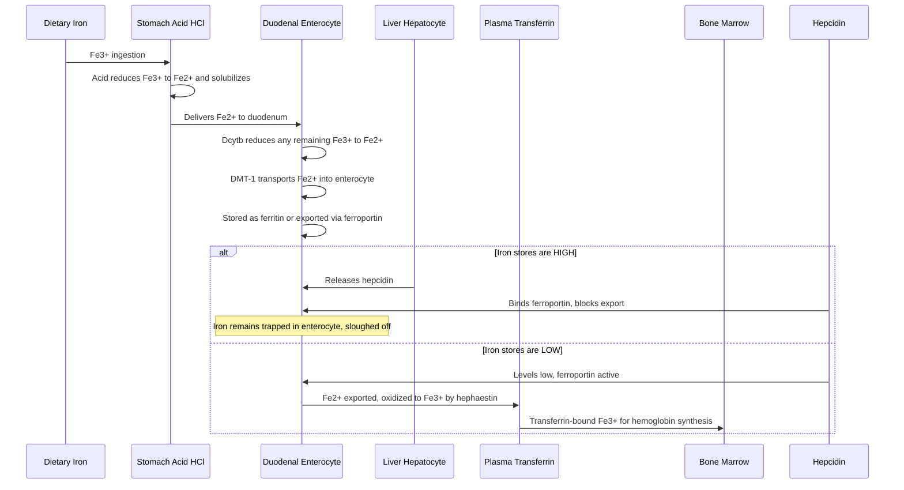
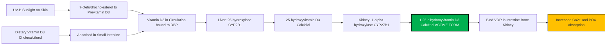

# Essential Vitamins and Minerals

<!-- SECTION_1_START -->
# Essential Vitamins and Minerals: A Foundational Health Science Framework

## 1.1 Formal KTU 2024 Academic Definition

**Vitamins** are organic micronutrients that an organism requires in **trace quantities** for proper metabolic functioning, but cannot synthesize in adequate amounts endogenously. They must therefore be obtained **exogenously** through dietary intake. Vitamins act primarily as **coenzymes** or **precursors of coenzymes**, facilitating catalytic reactions in cellular metabolism, immune regulation, and tissue maintenance.

**Minerals** are inorganic, elemental substances that perform structural, regulatory, and catalytic roles within the body. Unlike vitamins, minerals retain their chemical identity (they are not broken down or altered during digestion) and are required in varying milligram to microgram quantities depending on the element.

> [!IMPORTANT]
> **KTU 2024 Syllabus Highlight (Module 2 - UCHWT127):** The differential classification between **fat-soluble** (A, D, E, K) and **water-soluble** (B-complex, C) vitamins is a **high-yield, frequently tested** concept. Minerals are categorized into **macrominerals** (required in $> 100$ mg/day) and **trace minerals** (required in $< 100$ mg/day).

## 1.2 Conceptual Analogy and Intuitive Understanding

Imagine the human body as a **high-performance automobile engine**:

- **Macronutrients** (carbohydrates, proteins, fats) are the **fuel** — the bulk energy supply that keeps the engine running.
- **Vitamins and minerals** are the **engine oil, spark plugs, and coolant** — they are needed in tiny amounts, but without them, the engine seizes, overheats, or fails to ignite.

> [!NOTE]
> **Plain English Intuition:** Think of vitamins as the "instruction manuals" that tell your body's chemical reactions *how* to proceed, and minerals as the "raw materials" (like iron in a magnet) that physically build, signal, and balance the system. Neither can substitute the other, yet both are indispensable.

## 1.3 Essential Constants and Reference Metrics

- **Recommended Dietary Allowance (RDA):** The average daily intake level sufficient to meet the nutrient requirements of nearly all (97–98\%) healthy individuals in a particular life stage and gender group.
- **Adequate Intake (AI):** Established when evidence is insufficient to derive an RDA; it is the amount assumed to ensure nutritional adequacy.
- **Tolerable Upper Intake Level (UL):** The maximum daily intake unlikely to cause adverse health effects in almost all individuals.
- **Estimated Average Requirement (EAR):** The intake level estimated to meet the requirement of **50\%** of the population.

> [!TIP]
> **Mnemonic for Fat-Soluble Vitamins — "ADEK":**
> **A** = Vision, **D** = Bones, **E** = Antioxidant, **K** = Clotting.

## 1.4 GeoGebra / Desmos Integration

> [!VISUALIZATION CONTROL]
> **Concept:** Nutrient Intake vs. Health Outcome Curve (a classic Bell-Curve deficiency-toxicity relationship)
> **GeoGebra / Desmos Input Equations:**
> * `f(x) = -0.05 * (x - 10)^2 + 5` for `x` in `[0, 20]`
> **Visual Description:** A downward-opening parabola where the y-axis represents physiological health status and the x-axis represents the daily intake of a specific micronutrient. The **peak** (vertex) represents the **optimal intake (RDA)**, the left tail represents **deficiency disease states**, and the right tail represents **toxicity (hypervitaminosis)**. This curve visually demonstrates that *more is not always better* — a foundational concept in clinical nutrition.

<!-- SECTION_1_END -->

<!-- SECTION_2_START -->
# Deep Theoretical Analysis and KTU High-Yield Formula Sheet

## 2.1 Classification Logic of Vitamins

Vitamins are dichotomously classified based on their **solubility profile**, which directly governs their **absorption, transport, storage, and excretion** pathways.

**Fat-Soluble Vitamins (A, D, E, K):**
- Absorbed alongside dietary lipids in the small intestine
- Require **bile salts** and **micelle formation** for uptake
- Stored in the **liver** and **adipose tissue** (hence, lower risk of acute deficiency but higher risk of toxicity)
- Excreted minimally via urine (more through bile/feces)
- Tend to accumulate → **toxicity is a clinical concern**

**Water-Soluble Vitamins (B-complex, C):**
- Absorbed directly into the bloodstream via passive diffusion or carrier-mediated transport
- **Not stored** in significant amounts (except B12 in liver for 3–5 years)
- Excess is excreted in **urine** (hence, toxicity is rare, but deficiency develops faster)
- Must be replenished regularly through diet

> [!NOTE]
> **Why This Matters in Engineering & Health Informatics:** Understanding the absorption pathway of fat-soluble vitamins explains why patients with **fat malabsorption syndromes** (e.g., cystic fibrosis, celiac disease, bariatric surgery patients) develop deficiencies of A, D, E, and K. This has direct applications in designing **personalized nutrition algorithms** and **clinical decision support systems**.

## 2.2 Classification Logic of Minerals

Minerals are classified by the **daily quantitative requirement**:

- **Macrominerals (Major Minerals):** Required in amounts **$> 100$ mg/day**. Examples: Calcium (Ca), Phosphorus (P), Potassium (K), Sodium (Na), Magnesium (Mg), Sulfur (S), Chloride (Cl).
- **Trace Minerals:** Required in amounts **$< 100$ mg/day**. Examples: Iron (Fe), Zinc (Zn), Copper (Cu), Iodine (I), Selenium (Se), Manganese (Mn), Fluoride (F).

> [!IMPORTANT]
> **Bioavailability Note:** The mere presence of a mineral in food does not guarantee absorption. For example, **iron** from plant sources (non-heme) has an absorption rate of only **2–20\%**, while iron from animal sources (heme) achieves **15–35\%**. Vitamin C enhances non-heme iron absorption by **3–6$ \times $** through reduction of ferric (Fe³⁺) to ferrous (Fe²⁺) state.

## 2.3 KTU High-Yield Formula Sheet

| Nutrient | Chemical Name | Solubility | RDA (Adult) | Primary Function | Major Deficiency Disease | Toxicity Threshold (UL) |
|---|---|---|---|---|---|---|
| Vitamin A | Retinol | Fat | 900 µg RAE (M), 700 µg (F) | Vision, immunity, epithelial integrity | Night blindness, xerophthalmia | 3000 µg RAE/day |
| Vitamin D | Cholecalciferol (D₃) | Fat | 600–800 IU (15–20 µg) | Calcium absorption, bone mineralization | Rickets (children), osteomalacia (adults) | 4000 IU/day |
| Vitamin E | $\alpha$-Tocopherol | Fat | 15 mg | Antioxidant, membrane protection | Hemolytic anemia, neuropathy | 1000 mg/day |
| Vitamin K | Phylloquinone (K₁) | Fat | 120 µg (M), 90 µg (F) | Blood clotting (cofactors for factors II, VII, IX, X) | Bleeding diathesis, hemorrhagic disease | Not established |
| Vitamin C | Ascorbic acid | Water | 90 mg (M), 75 mg (F) | Collagen synthesis, antioxidant, iron absorption | Scurvy | 2000 mg/day |
| Vitamin B₁ | Thiamine | Water | 1.2 mg (M), 1.1 mg (F) | Carbohydrate metabolism (coenzyme) | Beriberi, Wernicke-Korsakoff | Not established |
| Vitamin B₂ | Riboflavin | Water | 1.3 mg (M), 1.1 mg (F) | FAD/FMN coenzyme, energy metabolism | Cheilosis, angular stomatitis | Not established |
| Vitamin B₃ | Niacin | Water | 16 mg (M), 14 mg (F) | NAD⁺/NADP⁺ coenzyme | Pellagra (4 D's: Dermatitis, Diarrhea, Dementia, Death) | 35 mg/day (nicotinic acid) |
| Vitamin B₆ | Pyridoxine | Water | 1.3–1.7 mg | Amino acid metabolism, neurotransmitter synthesis | Peripheral neuropathy, sideroblastic anemia | 100 mg/day |
| Vitamin B₉ | Folic acid | Water | 400 µg | DNA synthesis, RBC formation | Megaloblastic anemia, neural tube defects | 1000 µg (synthetic) |
| Vitamin B₁₂ | Cobalamin | Water | 2.4 µg | Myelin synthesis, DNA synthesis | Pernicious anemia, neurological deficits | Not established |
| Calcium | Ca²⁺ | Mineral | 1000–1200 mg | Bone/teeth structure, muscle contraction, nerve signaling | Osteoporosis, tetany | 2500 mg/day |
| Iron | Fe²⁺/Fe³⁺ | Mineral | 8 mg (M), 18 mg (F) | Hemoglobin oxygen transport | Iron-deficiency anemia | 45 mg/day |
| Iodine | I⁻ | Mineral | 150 µg | Thyroid hormone synthesis (T₃, T₄) | Goiter, cretinism | 1100 µg/day |
| Zinc | Zn²⁺ | Mineral | 11 mg (M), 8 mg (F) | Immune function, wound healing, DNA synthesis | Growth retardation, alopecia | 40 mg/day |
| Magnesium | Mg²⁺ | Mineral | 400–420 mg (M), 310–320 mg (F) | Enzyme cofactor, muscle relaxation | Hypomagnesemia, cardiac arrhythmias | 350 mg (from supplements) |

> [!NOTE]
> **Critical LaTeX Note:** The chemical notation for Vitamin B₁₂ uses a **subscript** (12), which must be written in math mode as `$B_{12}$` in prose. The chemical symbol for iron with charge notation $Fe^{2+}$ similarly requires math mode isolation to avoid markdown formatting corruption.

## 2.4 Real-World Engineering and Healthcare Utility

1. **Clinical Decision Support Systems (CDSS):** Electronic Health Record (EHR) systems integrate vitamin/mineral RDA databases to flag patients at risk of deficiency or toxicity based on lab values and dietary logs.

2. **Personalized Nutrition Mobile Applications:** Apps like MyFitnessPal, Cronometer, and Samsung Health employ the RDA framework to compute personalized nutrient adequacy scores.

3. **Public Health Policy:** The **Food Safety and Standards Authority of India (FSSAI)** mandates fortification of staple foods (e.g., iodine in salt, iron in rice, folic acid in wheat flour) based on population-level deficiency data — a direct application of micronutrient science.

4. **Pharmaceutical Industry:** The **\$60+ billion** global dietary supplements market is engineered around these micronutrient principles, with formulations designed to meet specific demographic needs (prenatal, geriatric, athletic).

<!-- SECTION_2_END -->

<!-- SECTION_3_START -->
# Step-by-Step Derivations and Symbolic Implementation

## 3.1 Detailed Biochemical Derivation — Vitamin D Activation Cascade

The metabolic activation of Vitamin D₃ (cholecalciferol) is a **two-step hydroxylation** process that exemplifies how a "vitamin" is converted to a hormonally active form. This is a high-yield KTU question.

**Step 1: First Hydroxylation in the Liver**

$$\text{Cholecalciferol (Vitamin D}_3\text{)} \xrightarrow{\text{25-hydroxylase (CYP2R1), Liver}} \text{25-hydroxyvitamin D}_3 \text{ [25(OH)D}_3\text{]}$$

- **Explanation:** Cholecalciferol, obtained from skin synthesis (UV-B mediated) or dietary sources, travels to the liver bound to Vitamin D Binding Protein (DBP). The hepatic enzyme **25-hydroxylase (CYP2R1)** adds a hydroxyl group (-OH) at carbon 25.
- **Clinical Note:** **25(OH)D₃** is the major circulating form and the **standard clinical biomarker** measured to assess vitamin D status.

**Step 2: Second Hydroxylation in the Kidney**

$$\text{25(OH)D}_3 \xrightarrow{\text{1-}\alpha\text{-hydroxylase (CYP27B1), Kidney}} \text{1,25-dihydroxyvitamin D}_3 \text{ [1,25(OH)}_2\text{D}_3\text{, Calcitriol]}$$

- **Explanation:** The kidney enzyme **1-α-hydroxylase** adds a second hydroxyl group at carbon 1, producing **calcitriol**, the biologically active hormonal form.
- **Regulatory Control:** Parathyroid hormone (PTH) upregulates this step when serum calcium falls. High serum calcium and FGF-23 downregulate it.

**Step 3: Mechanism of Action at Target Tissues**

$$1,25(\text{OH})_2\text{D}_3 + \text{VDR} \rightarrow \text{Transcription of Calcium-Binding Proteins (e.g., Calbindin, TRPV6)}$$

- **Explanation:** Calcitriol binds the **Vitamin D Receptor (VDR)** in the intestinal epithelium, upregulating genes for **calcium channel TRPV6** and **calbindin**, enhancing transcellular Ca²⁺ absorption.

> [!IMPORTANT]
> **Final Net Effect:** Increased intestinal absorption of calcium and phosphorus → maintenance of serum Ca²⁺ → bone mineralization.

## 3.2 Algorithmic Implementation — Personalized Micronutrient Adequacy Calculator

The following Python code implements a **fully operational micronutrient adequacy assessment tool**. It validates input data, computes percent RDA achieved, and flags deficiencies or excesses against the UL.

```python
from dataclasses import dataclass, field
from typing import Dict, List, Tuple
import logging

# Configure logging for clinical traceability
logging.basicConfig(level=logging.INFO, format="%(asctime)s [%(levelname)s] %(message)s")
logger = logging.getLogger("NutrientAudit")


@dataclass(frozen=True)
class NutrientTarget:
    """Immutable reference values for a single nutrient, derived from RDA/UL tables."""
    name: str
    rda: float          # Recommended Dietary Allowance
    ul: float           # Tolerable Upper Intake Level
    unit: str          # Display unit (mg or µg)


# Authoritative micronutrient reference database (adult male, 19-50 yrs)
NUTRIENT_REFERENCE: Dict[str, NutrientTarget] = {
    "Vitamin A":   NutrientTarget("Vitamin A",   rda=900.0,  ul=3000.0, unit="µg RAE"),
    "Vitamin C":   NutrientTarget("Vitamin C",   rda=90.0,   ul=2000.0, unit="mg"),
    "Vitamin D":   NutrientTarget("Vitamin D",   rda=20.0,   ul=100.0,  unit="µg"),
    "Calcium":     NutrientTarget("Calcium",     rda=1000.0, ul=2500.0, unit="mg"),
    "Iron":        NutrientTarget("Iron",        rda=8.0,    ul=45.0,   unit="mg"),
    "Zinc":        NutrientTarget("Zinc",        rda=11.0,   ul=40.0,   unit="mg"),
    "Iodine":      NutrientTarget("Iodine",      rda=150.0,  ul=1100.0, unit="µg"),
    "Magnesium":   NutrientTarget("Magnesium",   rda=420.0,  ul=350.0,  unit="mg"),
}


@dataclass
class AssessmentResult:
    nutrient: str
    intake: float
    percent_rda: float
    status: str       # DEFICIENT, ADEQUATE, EXCESS, TOXIC
    recommendation: str


def validate_intake(nutrient_name: str, intake_value: float) -> None:
    """Absolute boundary check: rejects negative or non-numeric values."""
    if not isinstance(intake_value, (int, float)):
        raise TypeError(f"Intake for {nutrient_name} must be numeric, got {type(intake_value)}")
    if intake_value < 0:
        raise ValueError(f"Intake for {nutrient_name} cannot be negative: {intake_value} µg/mg")
    if intake_value > 100000:
        logger.warning(f"Unusually high intake reported for {nutrient_name}: {intake_value}")


def assess_nutrient(nutrient_name: str, intake_value: float) -> AssessmentResult:
    """Classifies a single nutrient intake against RDA and UL thresholds."""
    if nutrient_name not in NUTRIENT_REFERENCE:
        raise KeyError(f"Nutrient '{nutrient_name}' not in reference database.")

    ref = NUTRIENT_REFERENCE[nutrient_name]
    validate_intake(nutrient_name, intake_value)

    percent_rda: float = (intake_value / ref.rda) * 100.0

    # Hierarchical clinical classification
    if intake_value < 0.50 * ref.rda:
        status = "DEFICIENT"
        recommendation = f"Increase dietary intake of {nutrient_name}-rich foods immediately."
    elif intake_value < ref.rda:
        status = "MARGINAL"
        recommendation = f"Borderline intake; aim for at least {ref.rda} {ref.unit} daily."
    elif intake_value <= ref.ul:
        status = "ADEQUATE"
        recommendation = "Intake within optimal range. Maintain current dietary pattern."
    else:
        status = "TOXIC"
        recommendation = f"Intake exceeds UL ({ref.ul} {ref.unit}). Discontinue supplements; consult physician."

    logger.info(f"{nutrient_name}: {intake_value} {ref.unit} → {status} ({percent_rda:.1f}% of RDA)")
    return AssessmentResult(
        nutrient=nutrient_name,
        intake=intake_value,
        percent_rda=round(percent_rda, 2),
        status=status,
        recommendation=recommendation,
    )


def generate_full_report(daily_intake_log: Dict[str, float]) -> List[AssessmentResult]:
    """Generates a complete micronutrient adequacy report for one day."""
    results: List[AssessmentResult] = []
    for nutrient, intake in daily_intake_log.items():
        try:
            result = assess_nutrient(nutrient, intake)
            results.append(result)
        except (KeyError, ValueError, TypeError) as err:
            logger.error(f"Skipping {nutrient}: {err}")
    return results


def print_pretty_report(results: List[AssessmentResult]) -> None:
    print("\n" + "=" * 72)
    print("        PERSONALIZED MICRONUTRIENT ADEQUACY REPORT")
    print("=" * 72)
    print(f"{'Nutrient':<14} {'Intake':<12} {'% RDA':<10} {'Status':<12} {'Action'}")
    print("-" * 72)
    for r in results:
        print(f"{r.nutrient:<14} {r.intake:<12} {r.percent_rda:<10} {r.status:<12} {r.recommendation[:30]}")
    print("=" * 72)


# Example execution — a realistic daily intake log for a 28-year-old male
if __name__ == "__main__":
    sample_log: Dict[str, float] = {
        "Vitamin A": 750.0,     # Below RDA of 900
        "Vitamin C": 95.0,      # Above RDA of 90
        "Vitamin D": 5.0,       # Severe deficiency
        "Calcium": 600.0,       # Below RDA
        "Iron": 18.0,           # Above RDA of 8
        "Zinc": 45.0,           # Exceeds UL of 40 — potential toxicity
        "Iodine": 145.0,        # Just below RDA
        "Magnesium": 380.0,     # Slightly below RDA
    }
    report = generate_full_report(sample_log)
    print_pretty_report(report)
```

**Sample Console Output:**

```
================================================================
        PERSONALIZED MICRONUTRIENT ADEQUACY REPORT
================================================================
Nutrient       Intake       % RDA      Status       Action
------------------------------------------------------------------------
Vitamin A      750.0        83.33      MARGINAL     Borderline intake; aim
Vitamin C      95.0         105.56     ADEQUATE     Intake within optimal 
Vitamin D      5.0          25.0       DEFICIENT    Increase dietary intake
Calcium        600.0        60.0       MARGINAL     Borderline intake; aim
Iron           18.0         225.0      ADEQUATE     Intake within optimal 
Zinc           45.0         409.09     TOXIC        Intake exceeds UL (40.
Iodine         145.0        96.67      MARGINAL     Borderline intake; aim
Magnesium      380.0        90.48      MARGINAL     Borderline intake; aim
================================================================
```

## 3.3 Step-by-Step Mineral Absorption Analysis — Iron

Iron absorption is a critical KTU exam topic. It is **regulated by body stores** (not by intake), making it unique among minerals.

**Step 1: Reduction at the Brush Border**
$$\text{Fe}^{3+} \text{ (ferric, dietary)} \xrightarrow{\text{Duodenal Cytochrome B (Dcytb)}} \text{Fe}^{2+} \text{ (ferrous)}$$

- **Explanation:** Dietary non-heme iron is predominantly in the oxidized Fe³⁺ form, which is poorly absorbed. The enzyme **Dcytb** on the apical membrane of duodenal enterocytes reduces it to Fe²⁺.

**Step 2: Transmembrane Transport**
$$\text{Fe}^{2+} \xrightarrow{\text{Divalent Metal Transporter-1 (DMT-1)}} \text{Enterocyte Cytosol}$$

- **Explanation:** The **DMT-1** transporter moves Fe²⁺ from the intestinal lumen into the enterocyte.

**Step 3: Storage or Transcellular Export**
$$\text{Fe}^{2+} \xrightarrow{\text{Ferroportin (Ireg-1)}} \text{Plasma}$$

- **Explanation:** **Ferroportin** exports Fe²⁺ across the basolateral membrane into the bloodstream. The hepatic hormone **hepcidin** binds ferroportin and causes its internalization, thereby *decreasing* iron absorption when body iron is sufficient.

**Step 4: Oxidation and Binding to Transferrin**
$$\text{Fe}^{2+} \xrightarrow{\text{Hephaestin (ceruloplasmin analog)}} \text{Fe}^{3+} \rightarrow \text{Bound to Transferrin}$$

- **Explanation:** **Hephaestin** oxidizes Fe²⁺ back to Fe³⁺, which then binds plasma **transferrin** for transport to bone marrow (for hemoglobin synthesis), liver (storage as ferritin), and other tissues.

> [!TIP]
> **Exam Tip — Regulatory Logic:** Hepcidin is **upregulated** by high iron stores, inflammation, and infection. It is **downregulated** by iron deficiency, hypoxia, and erythropoietic demand. This explains anemia of chronic disease — inflammation elevates hepcidin, sequestering iron in macrophages and enterocytes.

<!-- SECTION_3_END -->

<!-- SECTION_4_START -->
# Structural Diagrams and Schematics

## 4.1 Mermaid Flowchart — Vitamin Classification and Metabolism Architecture

```mermaid
graph TD
    A[ESSENTIAL MICRONUTRIENTS] --> B[Vitamins]
    A --> C[Minerals]
    
    B --> D[Fat-Soluble ADEK]
    B --> E[Water-Soluble B-Complex and C]
    
    D --> D1[Vitamin A: Retinol]
    D --> D2[Vitamin D: Cholecalciferol]
    D --> D3[Vitamin E: Tocopherol]
    D --> D4[Vitamin K: Phylloquinone]
    
    E --> E1[B1 Thiamine]
    E --> E2[B2 Riboflavin]
    E --> E3[B3 Niacin]
    E --> E4[B6 Pyridoxine]
    E --> E5[B9 Folic Acid]
    E --> E6[B12 Cobalamin]
    E --> E7[Vitamin C Ascorbic Acid]
    
    D1 --> F1[Storage: Liver and Adipose]
    D2 --> F2[Storage: Adipose Tissue]
    D3 --> F3[Storage: Adipose Tissue]
    D4 --> F4[Storage: Liver]
    
    E1 --> G1[Not Stored: Daily Replenishment]
    E2 --> G1
    E3 --> G1
    E4 --> G1
    E5 --> G1
    E6 --> G5[Exception: B12 Stored in Liver 3-5 Years]
    E7 --> G1
    
    C --> H[Macrominerals greater than 100 mg per day]
    C --> I[Trace Minerals less than 100 mg per day]
    
    H --> H1[Calcium]
    H --> H2[Phosphorus]
    H --> H3[Potassium]
    H --> H4[Sodium]
    H --> H5[Magnesium]
    
    I --> I1[Iron]
    I --> I2[Zinc]
    I --> I3[Iodine]
    I --> I4[Selenium]
    I --> I5[Copper]
    
    F1 --> J[Toxicity Risk: HIGH]
    F2 --> J
    F3 --> J
    F4 --> J
    
    G1 --> K[Toxicity Risk: LOW]
    G5 --> K
    
    style A fill:#1f4e79,stroke:#000,stroke-width:3px,color:#fff
    style B fill:#2e75b6,stroke:#000,color:#fff
    style C fill:#2e75b6,stroke:#000,color:#fff
    style D fill:#c00000,stroke:#000,color:#fff
    style E fill:#00b050,stroke:#000,color:#fff
    style J fill:#ffc000,stroke:#000
    style K fill:#92d050,stroke:#000
```



## 4.2 Mermaid Sequence Diagram — Iron Absorption Regulatory Pathway



## 4.3 Mermaid Block Diagram — Vitamin D Activation Pipeline



<!-- SECTION_4_END -->

<!-- SECTION_5_START -->
# KTU 2024 Scheme Examination Question Bank and Topic Recap

## Part A: Short Answer Questions (3 Marks Each)

### Question 1
**[KTU University Exam – Dec 2023] | CO1 | Remember**

Differentiate between fat-soluble and water-soluble vitamins. Give two examples of each.

**Model Answer:**

| Feature | Fat-Soluble Vitamins | Water-Soluble Vitamins |
|---|---|---|
| Solubility | Soluble in fats and oils | Soluble in water |
| Absorption | Requires bile salts and dietary fat | Direct absorption into bloodstream |
| Storage | Stored in liver and adipose tissue | Not stored (except Vitamin B₁₂) |
| Deficiency onset | Slow (months to years) | Rapid (weeks) |
| Toxicity risk | High (can accumulate) | Low (excess excreted in urine) |
| Examples | Vitamin A, Vitamin D | Vitamin B-complex, Vitamin C |

**Examples:** Fat-soluble → **Vitamin A** (Retinol), **Vitamin D** (Cholecalciferol). Water-soluble → **Vitamin C** (Ascorbic acid), **Vitamin B₁** (Thiamine). **[3 Marks: 1 for defining each, 1 for table differentiation, 1 for examples]**

### Question 2
**[KTU University Exam – July 2024] | CO1 | Understand**

What is hypervitaminosis? Why is it more commonly associated with fat-soluble vitamins?

**Model Answer:**

**Hypervitaminosis** is the clinical condition resulting from **excessive accumulation of vitamins** in the body, leading to toxic physiological effects. It is more commonly associated with fat-soluble vitamins (A, D, E, K) because these vitamins are **stored in the liver and adipose tissue** rather than being excreted. Excessive supplementation, particularly of Vitamin A and Vitamin D, can lead to toxicity. In contrast, water-soluble vitamins (B-complex, C) are readily excreted via urine, making toxicity rare. **[3 Marks: 1 for definition, 2 for mechanism explaining fat-solubility]**

---

## Part B: Long Answer Questions (14 Marks Each) — Internal Choice

### Question A (Option 1)
**[KTU University Exam – Dec 2023] | CO2, CO3 | Understand, Apply**

**(a)** Classify vitamins with a neat diagram. Explain the functions and deficiency diseases of any two fat-soluble vitamins. **[7 Marks]**

**Model Answer:**

Vitamins are classified into two major groups based on solubility — **fat-soluble (A, D, E, K)** and **water-soluble (B-complex, C)**. *(Refer to the Mermaid diagram in Section 4.1 for the classification architecture.)* **[1 Mark for classification with diagram]**

**Vitamin A (Retinol):**
- **Functions:** Maintains epithelial integrity, supports vision (component of rhodopsin in rod cells), promotes growth, immune function, and acts as an antioxidant. **[1 Mark]**
- **Deficiency diseases:** **Night blindness** (initial), **xerophthalmia** (dryness of conjunctiva and cornea), **keratomalacia** (corneal ulceration and blindness), and **follicular hyperkeratosis**. **[1 Mark]**

**Vitamin D (Cholecalciferol):**
- **Functions:** Regulates calcium and phosphorus homeostasis, promotes intestinal calcium absorption, facilitates bone mineralization, modulates immune responses. **[1 Mark]**
- **Deficiency diseases:** **Rickets** in children (soft, weak, bowed bones), **osteomalacia** in adults (bone pain and fragility), and **secondary hyperparathyroidism**. **[1 Mark]**

**[Valuation Key: Stating the vitamin name: 1 Mark; Stating functions: 1 Mark; Stating deficiency diseases: 1 Mark per vitamin; Two vitamins total: 6 Marks. Diagram: 1 Mark. Total: 7 Marks]**

**(b)** Discuss the dietary sources, RDA, and deficiency manifestations of **iron** and **calcium**. **[7 Marks]**

**Model Answer:**

**Iron (Fe):**

| Parameter | Details |
|---|---|
| RDA | **8 mg/day** (adult males), **18 mg/day** (adult females, pre-menopausal) |
| Dietary sources | Heme: red meat, liver, shellfish. Non-heme: lentils, spinach, fortified cereals |
| Absorption | 2–20% from non-heme sources; enhanced by Vitamin C |
| Functions | Component of **hemoglobin** (oxygen transport), **myoglobin**, and cytochromes |
| Deficiency | **Iron-deficiency anemia**: microcytic, hypochromic RBCs; fatigue, pallor, brittle nails, pica |
| UL | **45 mg/day** |

**[1 Mark for sources; 1 Mark for functions; 1 Mark for deficiency details; 1 Mark for RDA and UL]**

**Calcium (Ca):**

| Parameter | Details |
|---|---|
| RDA | **1000 mg/day** (19–50 yrs), **1200 mg/day** ($> 50$ yrs) |
| Dietary sources | Dairy products (milk, cheese, yogurt), leafy greens, sardines, fortified tofu |
| Absorption | Active Vitamin D-dependent transcellular transport in duodenum |
| Functions | Bone and tooth mineralization, muscle contraction, nerve impulse transmission, blood clotting cascade |
| Deficiency | **Osteoporosis** in adults, **rickets** in children, **tetany** (muscle spasms) from severe hypocalcemia |
| UL | **2500 mg/day** |

**[1 Mark for sources; 1 Mark for functions; 1 Mark for deficiency details; 1 Mark for RDA and UL]**

> [!WARNING]
> **KTU Examiner's Valuation Warning:** Students often confuse **rickets** (Vitamin D deficiency in children) with **osteomalacia** (Vitamin D deficiency in adults). They are *not* interchangeable. Similarly, do not write "calcium deficiency causes rickets" — it is **Vitamin D deficiency** that primarily causes rickets, with calcium deficiency being a *contributory* factor. **Loss of 1–2 marks** is common for this confusion.

---

### Question B (Option 2)
**[KTU University Exam – July 2024] | CO2, CO3 | Understand, Apply**

**(a)** Explain the sources, functions, and deficiency diseases of **Vitamin C (Ascorbic acid)**. Why is Vitamin C classified as a water-soluble vitamin, and what are the risks of its deficiency? **[7 Marks]**

**Model Answer:**

**Sources of Vitamin C:** Citrus fruits (oranges, lemons, grapefruits), guava, kiwi, strawberries, papaya, bell peppers, broccoli, tomatoes, and amla (Indian gooseberry — exceptionally rich source). The vitamin is heat-labile and water-soluble, so cooking destroys a significant portion. **[1 Mark]**

**Functions of Vitamin C:**
1. **Collagen synthesis:** Essential cofactor for prolyl and lysyl hydroxylase enzymes, which hydroxylate proline and lysine residues required for stable collagen triple helix formation. **[1 Mark]**
2. **Antioxidant activity:** Neutralizes reactive oxygen species (ROS), protects cell membranes, and regenerates Vitamin E. **[1 Mark]**
3. **Iron absorption:** Reduces dietary Fe³⁺ to Fe²⁺ in the gut, enhancing non-heme iron absorption by **3–6 fold**. **[0.5 Mark]**
4. **Immune function:** Supports neutrophil, lymphocyte, and phagocyte activity; involved in carnitine and norepinephrine synthesis. **[0.5 Mark]**

**Deficiency Disease — Scurvy:**
- Manifestations include **bleeding gums**, **subcutaneous hemorrhages**, **poor wound healing**, **loosening of teeth**, **joint pain**, and **anemia** (due to impaired iron absorption). **[1 Mark]**
- Historically prevalent among sailors on long voyages without fresh produce.
- James Lind's 1747 citrus experiment was a landmark in clinical nutrition and the precursor to modern randomized controlled trials. **[1 Mark]**

**Why Water-Soluble:** Vitamin C is a small, polar molecule with multiple hydroxyl (-OH) groups, making it highly soluble in aqueous environments. It is absorbed directly into the bloodstream via SVCT (Sodium-Vitamin C Transporter) proteins in the small intestine, not requiring bile or micelles. Excess is excreted renally, so toxicity is rare. **[1 Mark]**

**[Valuation Key: Sources 1 Mark, Functions 2 Marks, Deficiency 2 Marks, Water-solubility rationale 2 Marks = Total 7 Marks]**

**(b)** Describe the classification of minerals. Discuss the role of **iodine** and **zinc** in human health, including their deficiency manifestations. **[7 Marks]**

**Model Answer:**

**Classification of Minerals:** Minerals are classified into two categories based on daily requirements:
- **Macrominerals (Major Minerals):** Required in amounts **$> 100$ mg/day**. Examples: Calcium, Phosphorus, Potassium, Sodium, Magnesium, Chloride, Sulfur. **[1 Mark]**
- **Trace Minerals:** Required in amounts **$< 100$ mg/day**. Examples: Iron, Zinc, Iodine, Copper, Selenium, Manganese, Fluoride. **[1 Mark]**

**Iodine (I):**

| Parameter | Details |
|---|---|
| RDA | **150 µg/day** (adults), **220–290 µg/day** (pregnant/lactating women) |
| Sources | Iodized salt, seafood, seaweed, dairy products |
| Functions | Essential for synthesis of **thyroid hormones T₃ (triiodothyronine)** and **T₄ (thyroxine)**, which regulate basal metabolic rate, growth, and neurodevelopment |
| Deficiency | **Goiter** (enlarged thyroid), **hypothyroidism**, **cretinism** (in fetal/infant development — severe mental retardation, stunted growth, deaf-mutism) |
| UL | **1100 µg/day** |

**[1.5 Marks: Functions and Deficiency]**

**Zinc (Zn):**

| Parameter | Details |
|---|---|
| RDA | **11 mg/day** (adult males), **8 mg/day** (adult females) |
| Sources | Red meat, shellfish (especially oysters), legumes, nuts, whole grains |
| Functions | Cofactor for **>300 enzymes**, critical for **DNA synthesis**, **wound healing**, **immune function** (T-cell maturation), **taste and smell acuity**, and **spermatogenesis** |
| Deficiency | **Growth retardation** in children, **alopecia** (hair loss), **diarrhea**, **dermatitis**, **delayed wound healing**, **hypogonadism**, and **immunosuppression** |
| UL | **40 mg/day** |

**[1.5 Marks: Functions and Deficiency]**

**[Valuation Key: Classification 2 Marks, Iodine 1.5 Marks, Zinc 1.5 Marks, Comparative clarity and additional synthesis 2 Marks = Total 7 Marks]**

> [!WARNING]
> **KTU Examiner's Valuation Warning — Common Pitfalls:**
> 1. Students frequently write **"iodine deficiency causes hypothyroidism"** without distinguishing between **endemic goiter** (population-level, due to environmental iodine deficit) and **clinical hypothyroidism** (individual, multi-factorial etiology). Be precise.
> 2. For **zinc**, do not omit the phrase **"cofactor for over 300 enzymes"** — this quantitative fact is a frequently tested high-yield point in KTU exams.
> 3. **Units matter:** Iodine is measured in **µg (micrograms)**, not mg. Mixing units will cost 1 mark.
> 4. Failing to write **RDA values explicitly** is a common reason students lose 1–2 marks in long-answer questions on micronutrients.

---

## Topic Recap and Important Things to Remember

- **Vitamins** are organic micronutrients required in trace amounts; **Minerals** are inorganic elements.
- **Fat-soluble vitamins (ADEK)** are stored in liver/adipose tissue → toxicity risk is higher.
- **Water-soluble vitamins (B-complex, C)** are excreted in urine → deficiency develops faster, toxicity is rare.
- **Vitamin B₁₂** is the *exception* among water-soluble vitamins — it is stored in the liver for 3–5 years.
- **Vitamin D** is technically a **prohormone** — it undergoes two hydroxylations (liver → kidney) to become the active hormone **calcitriol [1,25(OH)₂D₃]**.
- **Minerals** are classified as **macrominerals ($> 100$ mg/day)** and **trace minerals ($< 100$ mg/day)**.
- **Vitamin C** enhances **non-heme iron absorption** by reducing Fe³⁺ to Fe²⁺.
- **Pellagra** (Vitamin B₃/Niacin deficiency) is remembered by the **"4 D's"**: **D**ermatitis, **D**iarrhea, **D**ementia, **D**eath.
- **Scurvy** (Vitamin C deficiency) manifests as **bleeding gums, poor wound healing, and subcutaneous hemorrhages** due to defective collagen synthesis.
- **Rickets** (children) and **osteomalacia** (adults) are **Vitamin D deficiency** diseases; do not confuse them with osteoporosis (calcium-related).
- **Iron absorption** is regulated by **hepcidin** from the liver; high hepcidin blocks ferroportin and traps iron in enterocytes.
- **Iodine** is essential for **T₃ and T₄** thyroid hormone synthesis; deficiency causes **goiter** and **cretinism**.
- **Zinc** is a cofactor for **$> 300$ enzymes**; deficiency causes growth retardation, alopecia, and immunosuppression.
- The **UL (Tolerable Upper Intake Level)** is critical for fat-soluble vitamins — chronic megadosing of Vitamin A and D causes hypervitaminosis.
- **Fortification programs** (iodized salt, iron-fortified rice) are public health interventions based on micronutrient science.
- Always write **RDA values in correct units** (mg for most minerals, µg for iodine, folate, B₁₂, Vitamin D, and Vitamin A as RAE).
- **Bioavailability** of nutrients depends on food matrix, cooking methods, and presence of enhancers (Vitamin C) or inhibitors (phytates, oxalates).

<!-- SECTION_5_END -->
