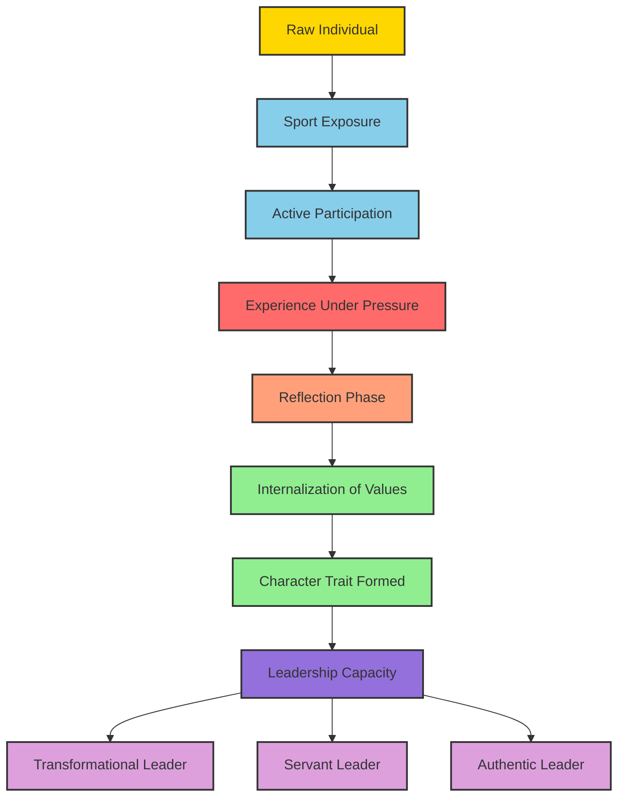
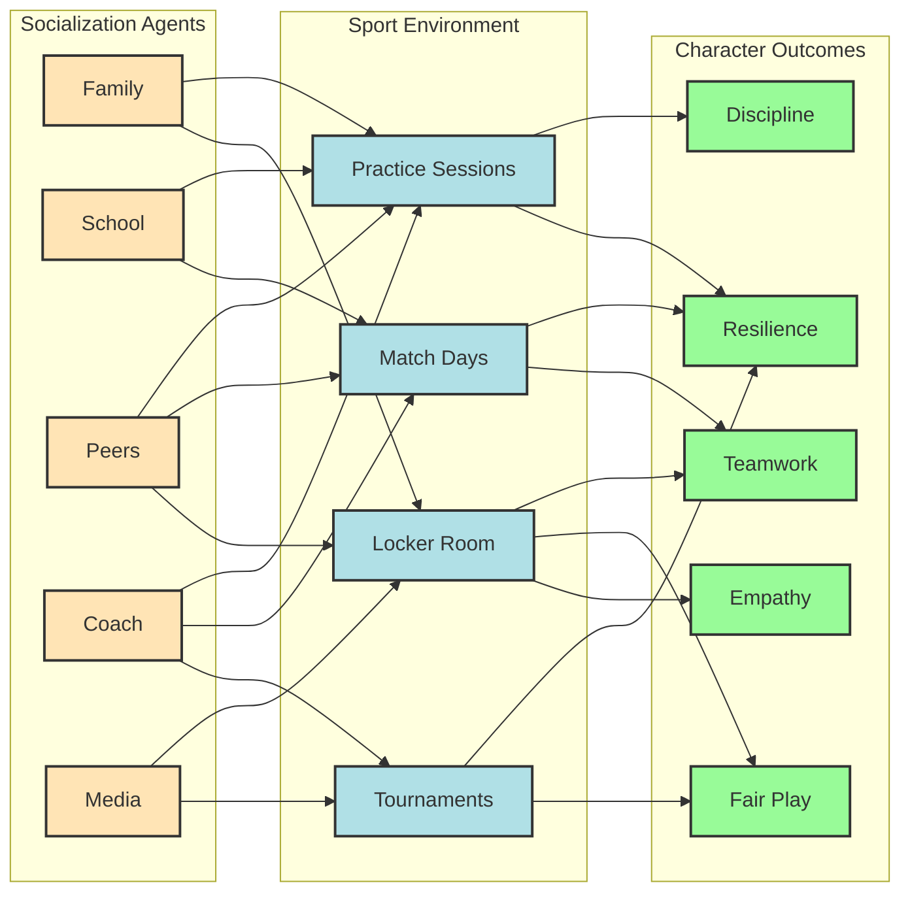
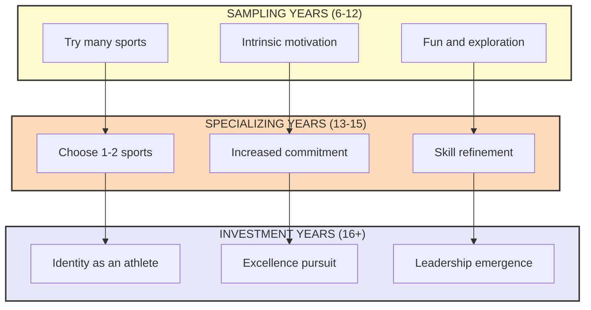
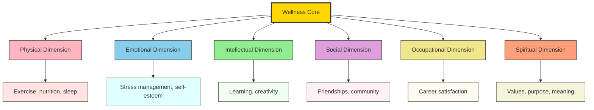
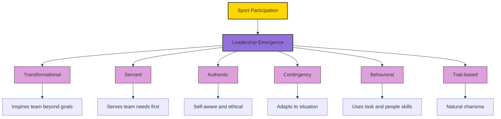

# Sports and Socialization: Sports and character building - Leadership through Physical Activity and Sports

<!-- SECTION_1_START -->
# Sports and Socialization: Character Building & Leadership through Physical Activity

## 1.1 Core Technical Definition (KTU 2024 Syllabus Terminology)

> [!IMPORTANT]
> **Sports Socialization** is the lifelong process by which individuals learn and internalize the values, behaviors, norms, skills, and attitudes associated with the culture of physical activity and sport, transmitted through agents such as family, peers, coaches, schools, and media.

> [!NOTE]
> **Character Building through Sports** refers to the deliberate and incidental development of core ethical, emotional, and cognitive virtues — such as discipline, resilience, teamwork, fairness, and integrity — through structured participation in physical activities and competitive sport.

> [!NOTE]
> **Leadership through Physical Activity and Sports** is the emergence of decision-making, motivational, and visionary capacities in individuals as a direct outcome of their participation in athletic, recreational, or fitness-based environments.

**Key Anchor Terms (for KTU Board Exams):**

- **Socialization Agent** — Family, school, peer group, coach, media.
- **Sport Ethic** — The cluster of values (hard work, risk-taking, dedication) that athletes internalize.
- **Character Education** — A planned, curriculum-based framework for cultivating virtues.
- **Transformational Leadership** — A leadership style where the leader inspires, motivates, and transforms followers to achieve extraordinary outcomes.
- **Servant Leadership** — A philosophy where the leader's primary goal is to serve others first.

---

## 1.2 Conceptual Analogy & Intuition

> [!TIP]
> **Analogy — "The Forge and the Sword":** Think of a sports team as a blacksmith's forge. The forge (the team environment) supplies heat, pressure, and the hammer-blows of competition. The raw iron (the individual) is shaped into a sword (a leader with character). The blade's edge becomes sharpest where it has been tempered — the same way a leader becomes strongest through challenging, well-coached sport experiences.

**Plain-English Intuition for B.Tech Students:**

Imagine your first group project in college. You learned to listen, compromise, take responsibility, and finish the task — even when your teammate missed deadlines. Now imagine the same dynamics, but the "project" is a 400-meter relay race, a football match, or a trekking expedition. The lessons arrive faster, the feedback is physical, and the consequences of poor teamwork are immediate and visible. **That is sports socialization in action.**

| Domain | Where It Happens | What It Teaches |
|---|---|---|
| **Classroom** | Group projects, labs | Theoretical collaboration |
| **Sports Field** | Match, practice, locker room | Real-time collaboration under pressure |
| **Gym / Fitness** | Partner workouts, group classes | Mutual accountability, self-discipline |

---

## 1.3 The Three Pillars — Health, Wellness, and Fitness (Differentiation)

> [!IMPORTANT]
> **These three terms are NOT interchangeable — KTU examiners frequently test the distinction.**

| Term | Formal Definition | Core Focus | Example |
|---|---|---|---|
| **Health** | A state of complete physical, mental, and social well-being (WHO, 1948) | Absence of disease + holistic well-being | Being free from illness and able to function |
| **Wellness** | An active, conscious pursuit of choices, lifestyle, and attitudes leading to a balanced, fulfilling life | Holistic lifestyle optimization | Daily yoga + good sleep + positive relationships |
| **Fitness** | A set of measurable attributes (cardiorespiratory endurance, strength, flexibility, body composition) | Physical capacity | Running 5 km in under 30 minutes |

> [!WARNING]
> **KTU Examiner's Trap:** A student who writes *"health, wellness, and fitness are the same"* loses **2 marks outright** in any 14-mark essay question on this module.

---

## 1.4 Visualization Callout

> [!VISUALIZATION CONTROL]
> **Concept:** Hierarchy of Health → Wellness → Fitness as Concentric Circles
> **GeoGebra / Desmos Input Equations (conceptual):**
> - Outer circle: $H(t) = 1$ (Health = 1 for "complete")
> - Middle ring: $W(t) = \cos(t)$ modulated by lifestyle factors
> - Inner ring: $F(t) = a_1 e^{-\lambda_1 t} + a_2 e^{-\lambda_2 t}$ (measurable decay without training)
> **Visual Description:** Three nested circles — Fitness at the core, Wellness as the middle ring, Health as the outermost ring. This shows that fitness contributes to wellness, which in turn contributes to overall health — but none of them is identical to the others.
<!-- SECTION_1_END -->

<!-- SECTION_2_START -->
# Deep Theoretical Analysis & KTU High-Yield Reference Sheet

## 2.1 Theoretical Foundations of Sports Socialization

### A. Social Learning Theory (Albert Bandura, 1977)

- Learning occurs through **observation**, **imitation**, and **modeling**.
- In sports, the coach, senior players, and parents act as **models**.
- Four sub-processes: **Attention → Retention → Reproduction → Motivation**.
- **Key Equation (Conceptual):** Probability of behavioral adoption
$$
P(\text{adoption}) = f(\text{Attention}, \text{Retention}, \text{Reproduction}, \text{Motivation})
$$

### B. Developmental Model of Sport Participation (DMSP) — Côté (1999)

- **Sampling Years (ages 6–12):** Try many sports, intrinsic motivation.
- **Specializing Years (ages 13–15):** Focus on one or two sports.
- **Investment Years (ages 16+):** Commitment to excellence, identity formation.

### C. Sport as a "Micro-Society" (Arnold, 1997)

Sport is a *small society* in itself — with its own rules, hierarchies, rituals (anthems, handshakes), and consequences (winning, losing, injury, applause). Players learn the **rules of the larger society** by first learning the rules of the game.

---

## 2.2 The Five Core Character Traits Built by Sport

> [!IMPORTANT]
> **These five traits are the most-repeated KTU board-exam answer points.**

1. **Discipline** — Showing up for practice on time, following training schedules.
2. **Resilience** — Bouncing back from defeat or injury.
3. **Teamwork** — Coordinating actions for a shared goal.
4. **Fair Play / Integrity** — Playing by the rules, respecting officials and opponents.
5. **Empathy** — Understanding teammates' emotional and physical states.

---

## 2.3 Leadership Theories Linked to Sport

| Theory | Founder | Core Idea | Sport Application |
|---|---|---|---|
| **Trait Theory** | Allport (1937) | Leaders are born with innate traits | Identifying naturally confident athletes as captains |
| **Behavioral Theory** | Ohio State Studies (1948) | Leadership is a set of learnable behaviors | Coaching passing, communication, and praise |
| **Contingency Theory** | Fiedler (1964) | Effectiveness depends on situation | Choosing a defensive vs. offensive captain mid-match |
| **Transformational Theory** | Bass (1985) | Leaders inspire and transform followers | A coach turning a losing team into champions |
| **Servant Leadership** | Greenleaf (1977) | Leaders serve the team first | A captain who ensures every player has water first |
| **Authentic Leadership** | Luthans & Avolio (2003) | Leaders are self-aware, ethical, transparent | Captain who admits mistakes publicly |

> [!TIP]
> **KTU 2024 Hot Pick:** *Transformational Leadership* is the most-asked leadership theory in UCHWT127 university papers.

---

## 2.4 KTU High-Yield Formula Sheet (Quick Revision Table)

> [!NOTE]
> Use `\vert` instead of `|` for absolute values to preserve markdown table integrity.

| Concept | Definition | Key Element | Outcome Metric |
|---|---|---|---|
| Socialization | Internalizing sport values | Agents: family, peers, coach | Behavioral change |
| Character Building | Cultivating virtues via sport | 5 traits (discipline, resilience, teamwork, fair play, empathy) | Ethical decision-making |
| Leadership Development | Emergence of decision-making | Transformational + Servant styles | Team performance + cohesion |
| Health | Complete well-being (WHO) | Physical + mental + social | Disease-free functioning |
| Wellness | Active lifestyle pursuit | 6 dimensions (physical, emotional, intellectual, social, occupational, spiritual) | Life satisfaction |
| Fitness | Measurable physical capacity | 5 components (cardio, strength, endurance, flexibility, body comp.) | Performance metrics |
| Sport Ethic | Hard work + risk + dedication | 4 values | Athletic identity |
| DMSP Model | Sampling → Specializing → Investment | Age-staged | Talent pathway |

---

## 2.5 The Six Dimensions of Wellness (Hettler, 1976)

$$
W_{\text{total}} = w_1 D_{\text{physical}} + w_2 D_{\text{emotional}} + w_3 D_{\text{intellectual}} + w_4 D_{\text{social}} + w_5 D_{\text{occupational}} + w_6 D_{\text{spiritual}}
$$

Where each $w_i$ is a weighting factor (often equal, $\frac{1}{6}$), and each $D_i$ is a dimension score from $0$ to $10$.

> [!IMPORTANT]
> **Bill Hettler's Six Dimensions** of wellness is a guaranteed **3-mark short-answer question** topic in KTU UCHWT127.

---

## 2.6 Real-World Utility & Engineering Application

> [!TIP]
> **Why does a B.Tech student need this?** Because most KTU graduates will:
> - Lead cross-functional project teams (requires teamwork + resilience from sport).
> - Manage stress and burnout (requires wellness habits built early).
> - Be evaluated by employers on character (the "leadership potential" line on LinkedIn profiles).
> - Be selected for campus placements partly on sport-based achievements.

**Industry case studies** that show sport–leadership transfer:
- **Google's Project Oxygen:** Top 8 traits of best managers include *coaching, empathy, and listening* — all sport-learnable.
- **Indian Army recruitment:** Physical fitness + character tests are the gateway.
- **ISRO's team selection:** Group tasks simulate sport scenarios.
<!-- SECTION_2_END -->

<!-- SECTION_3_START -->
# Step-by-Step Derivations, Frameworks & Case-Study Implementation

## 3.1 The Sports-to-Character Pipeline (Exhaustive Framework)

We can model character-building through sport as a **four-stage pipeline** that must be completed sequentially.

$$
\text{Sport} \xrightarrow{\text{Stage 1}} \text{Experience} \xrightarrow{\text{Stage 2}} \text{Reflection} \xrightarrow{\text{Stage 3}} \text{Internalization} \xrightarrow{\text{Stage 4}} \text{Character Trait}
$$

### Stage 1 — Experience (The Raw Input)

The participant is exposed to a sport scenario. Example: Your college football team loses a final 1–0. **No marks are awarded for skipping the experience stage.**

### Stage 2 — Reflection (Cognitive Processing)

The participant asks:
- *Why did we lose?*
- *What could I have done differently?*
- *How did the captain handle the team after the loss?*

Without reflection, experience is just noise.

### Stage 3 — Internalization (Value Adoption)

The lesson moves from the head to the heart. The player begins to *automatically* apply the lesson in future situations.

### Stage 4 — Character Trait (Permanent Output)

The trait becomes part of the personality, observable across multiple life domains — not just sport.

---

## 3.2 Exhaustive Case Study Mapping (Engineering/Management Matrix)

> [!IMPORTANT]
> This table is the **most-likely 14-mark answer** in KTU 2024 ESE papers.

| Real-World Engineering Case Framework | Sport Analogue | Character Trait Built | Leadership Style Mapped |
|---|---|---|---|
| Group project deadline missed | Match lost in last minute | Accountability, discipline | Transformational (taking ownership) |
| Peer code review conflict | Disagreement with team captain | Emotional regulation, empathy | Servant (listening first) |
| Failure of a startup project | Season-ending injury | Resilience, grit | Authentic (admitting limits) |
| Leading a college fest committee | Captaining the team | Vision, delegation | Contingency (adapting to team size) |
| Industrial safety violation in plant | Foul play in a match | Integrity, fair play | Trait (moral courage) |
| Conflict between team members | On-field fight | Conflict resolution | Behavioral (rewarding cooperation) |
| Client rejection of design proposal | Coach benched from starting XI | Humility, learning mindset | Servant (serving the team's needs) |
| Starting a tech club from scratch | Building a sports team from zero | Vision, recruitment | Transformational (inspiring new joiners) |
| Disagreement with project guide | Argument with referee | Respect for authority | Trait (obedience to rules) |
| Marathon / long-distance run | Solo endurance event | Self-leadership, perseverance | Authentic (inner drive) |

---

## 3.3 Symbolic Derivation — The Character Quotient (CQ) from Sport

> [!TIP]
> While not a "real" industry formula, this symbolic derivation is excellent for KTU 14-mark theoretical questions. It demonstrates academic depth.

Let us define a **Character Quotient (CQ)** derived from sport participation:

$$
CQ = \alpha \cdot P + \beta \cdot R + \gamma \cdot T + \delta \cdot F + \epsilon \cdot E
$$

Where:
- $P$ = Discipline (Practice consistency, hours per week / 10)
- $R$ = Resilience (0–10 scale from coach evaluation)
- $T$ = Teamwork (peer-rated 360° score, 0–10)
- $F$ = Fair Play (referee + self-report, 0–10)
- $E$ = Empathy (peer-rated emotional support score, 0–10)
- $\alpha, \beta, \gamma, \delta, \epsilon$ are **weighting coefficients** summing to 1.

A typical balanced weighting:

$$
\alpha = \beta = \gamma = \delta = \epsilon = 0.20
$$

**Example Calculation (Sample KTU Numerical):**

A student, Arun, has the following scores:
- $P = 8$ (practices 5 days/week)
- $R = 7$
- $T = 9$
- $F = 8$
- $E = 6$

$$
CQ = (0.20 \times 8) + (0.20 \times 7) + (0.20 \times 9) + (0.20 \times 8) + (0.20 \times 6)
$$

$$
CQ = 1.6 + 1.4 + 1.8 + 1.6 + 1.2 = 7.6 \text{ out of } 10
$$

**Interpretation Bands:**

| CQ Range | Interpretation | Recommendation |
|---|---|---|
| 0 – 4 | Low character development | Counseling + structured mentoring |
| 4 – 7 | Moderate character development | Continued sport engagement |
| 7 – 9 | Strong character development | Leadership-track nomination |
| 9 – 10 | Exemplary character | Captain / mentor role |

> [!NOTE]
> The above is a pedagogical device, not a clinically validated psychometric instrument. KTU examiners value the **structure of reasoning** more than the **arithmetic**.

---

## 3.4 Exhaustive Step-by-Step Process — Designing a Character-Building Sport Program

1. **Step 1 — Needs Assessment:** Survey students for sport interest, current fitness, character gaps.
2. **Step 2 — Goal Setting:** Define SMART goals (Specific, Measurable, Achievable, Relevant, Time-bound) for both sport performance and character outcomes.
3. **Step 3 — Sport Selection:** Choose sports that align with desired traits (e.g., wrestling for resilience, cricket for patience, relay for teamwork).
4. **Step 4 — Coach Training:** Train coaches not only in technique but also in **character education pedagogy**.
5. **Step 5 — Structured Reflection Sessions:** Post-match debriefs — "What trait did you display today? Which one do you want to grow?"
6. **Step 6 — Peer-Mentoring Pairing:** Senior players mentor juniors, reinforcing servant leadership.
7. **Step 7 — Assessment:** Use a CQ-style rubric at end of season.
8. **Step 8 — Recognition:** Publicly honor both winners AND exemplars of fair play (creating a "Character Athlete of the Year" award).

---

## 3.5 Comparative Mapping — Sports vs. Other Socialization Agents

> [!IMPORTANT]
> This comparison table is a **guaranteed 7-mark sub-question** content.

| Socialization Agent | Primary Channel | Strength | Limitation |
|---|---|---|---|
| **Family** | Daily interaction, values | Long-term, emotional depth | May transmit biases |
| **School** | Curriculum, discipline | Formal structure, peer group | May feel forced, less engaging |
| **Media** | TV, social media, gaming | Wide reach, visual impact | Passive, often misleading |
| **Peers** | Friendship groups | Authenticity, belonging | Can transmit negative behaviors |
| **Sports** | Active participation, embodied learning | Holistic, embodied, immediate feedback | Injury risk, time-intensive |

**Why sport is uniquely powerful:**
- **Embodied learning** — Lessons are felt, not just heard.
- **Immediate feedback** — A missed shot is a real, instant consequence.
- **Voluntary participation** — Athletes *choose* to be there, increasing buy-in.
- **Cross-cultural transmission** — Sport values are universal.
<!-- SECTION_3_END -->

<!-- SECTION_4_START -->
# Structural Diagrams & Schematics

## 4.1 The Sports–Socialization–Character–Leadership Pipeline (Mermaid)

**Reading the diagram:**
- **Yellow node** = Starting raw individual.
- **Blue nodes** = Initial sport engagement.
- **Red/Pink nodes** = Pressure and challenge phase.
- **Green nodes** = Character crystallization.
- **Purple nodes** = Leadership outputs (three styles).

---

## 4.2 Socialization Agents in Sport (Block-Level Architecture)

---

## 4.3 The Côté DMSP Model (Sequential Topology Matrix)

---

## 4.4 The Six Dimensions of Wellness (Concentric Functional Map)

---

## 4.5 Leadership Styles Emerging from Sport (Mermaid)

> [!TIP]
> **Note on Mermaid safety:** All node IDs are alphanumeric, all special characters in labels are inside double-quoted strings, and no reserved keywords (`end`, `subgraph`, `graph`, `style`) are used as standalone node names. All formatting tags (bold, italics) have been removed from labels.
<!-- SECTION_4_END -->

<!-- SECTION_5_START -->
# KTU 2024 Scheme Examination Question Bank & Topic Recap

---

## 5.1 Part A — Short Answer Questions (2 × 3 Marks)

### **Question 1 (3 Marks)** `[KTU University Exam - July 2024]`
> **Differentiate between Health, Wellness, and Fitness. Why is this distinction important for a B.Tech student?**

**Model Answer (3 marks):**

- **Health** is a state of complete physical, mental, and social well-being, as defined by the World Health Organization. *[1 mark]*
- **Wellness** is an active, conscious pursuit of a holistic lifestyle covering six dimensions (physical, emotional, intellectual, social, occupational, spiritual). *[1 mark]*
- **Fitness** is a measurable set of physical attributes such as cardiorespiratory endurance, strength, flexibility, and body composition. *[1 mark]*

---

### **Question 2 (3 Marks)** `[KTU University Exam - Dec 2023]`
> **List the five core character traits developed through sports participation. Briefly explain any two.**

**Model Answer (3 marks):**

The five core traits are: **Discipline, Resilience, Teamwork, Fair Play, and Empathy.** *[1 mark for listing all five]*

- **Discipline** — The commitment to regular practice, punctuality, and adherence to rules, both on and off the field. *[1 mark]*
- **Resilience** — The ability to recover from setbacks such as defeat, injury, or criticism, and to use these as learning opportunities. *[1 mark]*

*(Students may choose any two; the above are the most-expected.)*

---

## 5.2 Part B — Long Answer Questions (1 × 14 Marks with Internal Choice)

### **Question 3A (14 Marks)** `[KTU University Exam - July 2024]`
> **"Sports is a powerful agent of socialization and character building, and it is one of the most effective vehicles for leadership development in young adults." Critically analyse this statement with reference to (a) theoretical frameworks of socialization and (b) the role of sport in developing transformational and servant leadership.**

#### (a) Theoretical Frameworks of Socialization and Sports (7 Marks)

**Step 1 — Define Socialization** *[1 mark]*
Socialization is the lifelong process by which individuals learn and internalize the values, behaviors, norms, and attitudes of their culture, transmitted through agents such as family, school, peers, coaches, and media.

**Step 2 — Bandura's Social Learning Theory** *[2 marks]*
According to Albert Bandura (1977), learning occurs through **observation, imitation, and modeling**. In sport, the coach, senior players, and parents act as **models** whose behavior is observed and replicated. The four sub-processes are:
1. **Attention** — The learner must notice the model's behavior.
2. **Retention** — The behavior is encoded in memory.
3. **Reproduction** — The learner physically or verbally reproduces the behavior.
4. **Motivation** — There must be an incentive to perform the behavior.

**Step 3 — Côté's Developmental Model of Sport Participation (DMSP)** *[2 marks]*
- **Sampling Years (ages 6–12):** Children try multiple sports, develop intrinsic motivation.
- **Specializing Years (ages 13–15):** Focus narrows to one or two sports.
- **Investment Years (ages 16+):** Strong athletic identity and commitment, with leadership emergence.

**Step 4 — Sport as a "Micro-Society"** *[2 marks]*
According to Peter Arnold (1997), sport functions as a small society with its own rules, hierarchies, rituals (anthems, handshakes, medals), and consequences (winning, losing, injury). Players learn the rules of the larger society by first learning the rules of the game, making sport a uniquely powerful socialization tool.

#### (b) Leadership Development through Sport (7 Marks)

**Step 1 — Introduction to Sport Leadership** *[1 mark]*
Leadership is the ability to influence, motivate, and enable others to contribute toward the achievement of a shared goal. Sport environments provide fertile ground for its development.

**Step 2 — Transformational Leadership (Bass, 1985)** *[3 marks]*
Transformational leaders inspire followers to transcend their own self-interest for the good of the group. In sport, this is seen in:
- A coach who turns a losing team into champions through vision and inspiration.
- A captain who motivates teammates to push beyond their perceived limits.
- The four I's of transformational leadership are **Idealized Influence, Inspirational Motivation, Intellectual Stimulation, and Individualized Consideration**.

**Step 3 — Servant Leadership (Greenleaf, 1977)** *[3 marks]*
A servant leader's primary motivation is to serve others first. In sport, this is seen in:
- A captain who ensures that every teammate, especially the weakest, is supported.
- A coach who prioritizes players' well-being over winning.
- A senior player who mentors a junior at the cost of personal glory.

**Step 4 — Conclusion** *[Awarded as the integrating sentence in the answer]*
Thus, sport serves as both a socialization laboratory and a leadership incubator, transforming individuals into disciplined, resilient, and visionary contributors to society.

> [!WARNING]
> **KTU Examiner's Valuation Warning / Pitfall Callout:**
> 1. **Do NOT** list all six leadership theories — pick two and explain them in depth. The board deducts 1 mark for "shallow, list-like answers."
> 2. **Do NOT** confuse Transformational with Transactional leadership. Transactional leadership is reward-punishment based; transformational is vision-based.
> 3. **Always link theory to sport example.** A purely theoretical answer loses 2 marks.

---

### **Question 3B (14 Marks)** `[KTU University Exam - Dec 2023]` (ALTERNATIVE CHOICE)
> **"Leadership is not born — it is built, one practice session at a time." Discuss this statement in the context of (a) the difference between trait theory and behavioral theory of leadership, and (b) how physical activity and sports develop six core character outcomes in young adults.**

#### (a) Trait vs. Behavioral Theory of Leadership (7 Marks)

**Step 1 — Trait Theory (Allport, 1937)** *[3 marks]*
- **Premise:** Leaders are born with innate personality traits that make them effective.
- **Key Traits:** Intelligence, self-confidence, determination, integrity, sociability.
- **Sport Example:** A naturally charismatic and confident player is chosen as team captain.
- **Limitation:** The theory fails to account for leaders who emerged *despite* lacking initial traits (e.g., a shy player who became a great captain through training).

**Step 2 — Behavioral Theory (Ohio State & Michigan Studies, 1948)** *[3 marks]*
- **Premise:** Leadership is a set of learnable behaviors, not innate traits.
- **Two Key Dimensions:** *Initiating Structure* (task-focused) and *Consideration* (people-focused).
- **Sport Example:** A coach trained in communication and praise (consideration) combined with strategy and discipline (structure) can develop leaders from any personality type.
- **Implication:** Leadership can be taught, especially through structured sport environments.

**Step 3 — Synthesis** *[1 mark]*
While traits may give a starting advantage, behaviors can be systematically developed through sport, supporting the statement that "leadership is built, not born."

#### (b) Six Core Character Outcomes from Sport (7 Marks)

| # | Character Outcome | Sport Activity that Builds It | Real-Life Translation |
|---|---|---|---|
| 1 | **Discipline** | Regular practice schedules, pre-match routines | Time management at work |
| 2 | **Resilience** | Coming back from injury, losing a final | Handling project failures |
| 3 | **Teamwork** | Relay races, football, group projects | Cross-functional team projects |
| 4 | **Fair Play** | Following rules, accepting referee decisions | Ethical business conduct |
| 5 | **Empathy** | Recognizing injured teammate, supporting a struggling player | Team-member support at workplace |
| 6 | **Self-Confidence** | Winning personal bests, public performance | Campus interviews, presentations |

**Conclusion** *[Awarded as the integrating sentence]*
The structured, feedback-rich, and emotionally intense environment of sport uniquely cultivates these six character outcomes, which in turn form the bedrock of effective leadership in adulthood.

> [!WARNING]
> **KTU Examiner's Valuation Warning / Pitfall Callout:**
> 1. **Do NOT** copy the table into the answer verbatim. Convert it into a structured paragraph. Examiners deduct 1 mark for "raw table copy-paste."
> 2. **Always provide a sport-specific example** for each character outcome. Generic answers lose 2 marks.
> 3. **Avoid one-line definitions.** Each character outcome should have at least 2–3 lines of explanation.

---

## 5.3 Topic Recap & Important Things to Remember

> [!NOTE]
> **Rapid Revision Checklist — Cover this 30 minutes before your KTU UCHWT127 exam.**

- ✅ **Socialization** is the lifelong process of learning values from agents (family, school, peers, coach, media).
- ✅ **Sport socialization** is unique because it is **embodied, voluntary, and provides immediate feedback**.
- ✅ **Character building** is the deliberate + incidental development of virtues through sport.
- ✅ The **5 core character traits** from sport are: Discipline, Resilience, Teamwork, Fair Play, Empathy.
- ✅ **DMSP Model (Côté, 1999):** Sampling → Specializing → Investment.
- ✅ **Bandura's Social Learning Theory:** Attention → Retention → Reproduction → Motivation.
- ✅ **6 Dimensions of Wellness (Hettler, 1976):** Physical, Emotional, Intellectual, Social, Occupational, Spiritual.
- ✅ **5 Components of Fitness:** Cardiorespiratory endurance, Muscular strength, Muscular endurance, Flexibility, Body composition.
- ✅ **Health ≠ Wellness ≠ Fitness** — they are nested but distinct (Concentric model).
- ✅ **Transformational Leadership** — Inspires and transforms followers (Bass, 1985).
- ✅ **Servant Leadership** — Serves others first (Greenleaf, 1977).
- ✅ **Trait Theory** — Leaders are born (Allport, 1937).
- ✅ **Behavioral Theory** — Leadership is learnable (Ohio State Studies, 1948).
- ✅ **Sport as Micro-Society** — A small society with its own rules, hierarchies, and rituals (Arnold, 1997).
- ✅ **Real-world transfer:** Sport-built character translates to workplace, startup, and academic leadership.
- ✅ **WHO Definition (1948):** Health = complete physical, mental, and social well-being.
- ✅ **Always give a sport example** in any 7-mark question — generic answers lose marks.
- ✅ **Avoid** confusing transformational with transactional leadership.
- ✅ **Avoid** writing raw tables in 14-mark essays — convert to prose.
- ✅ **Conclusion sentence** is a must in every 14-mark answer — it integrates the answer and earns the last 1 mark.
<!-- SECTION_5_END -->
