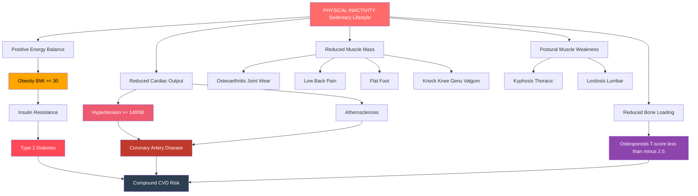
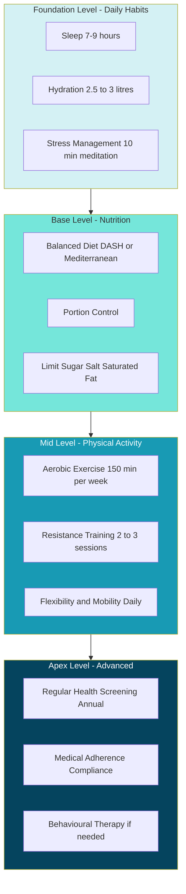
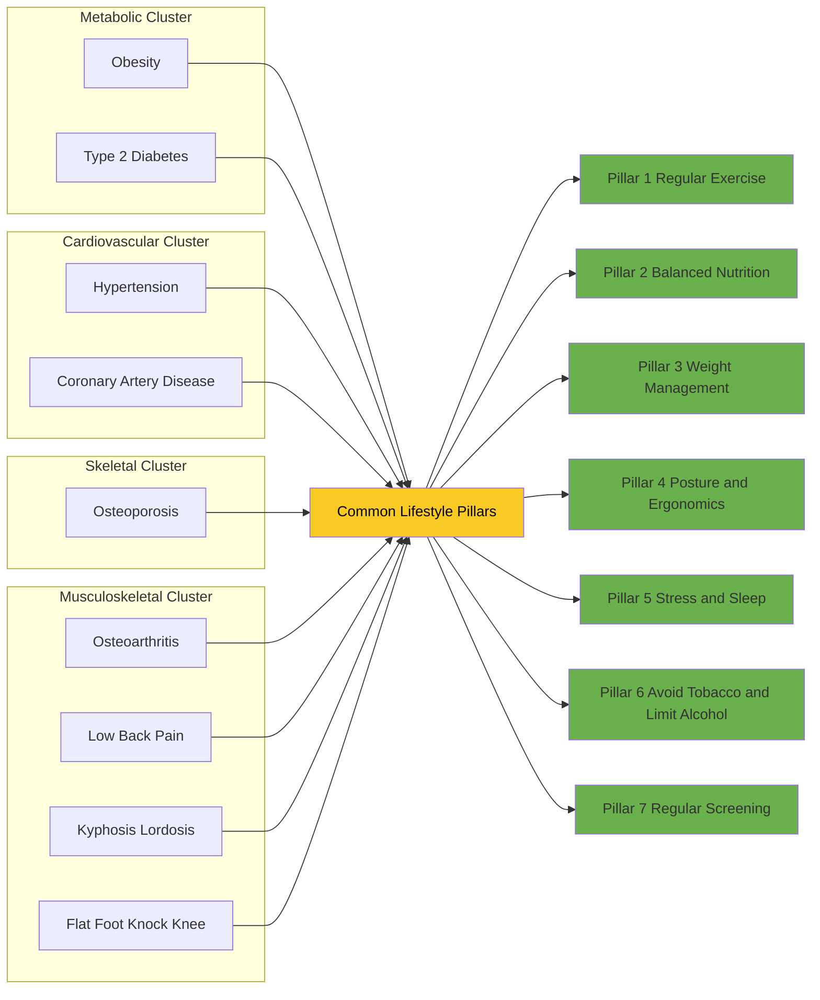
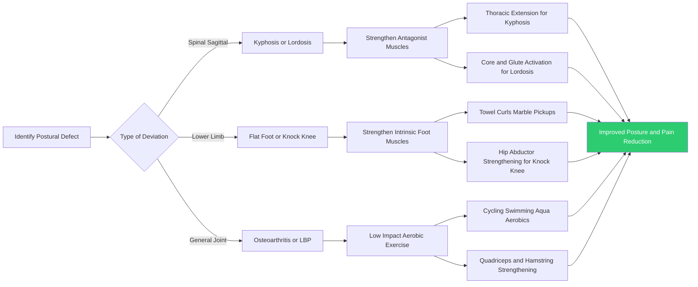
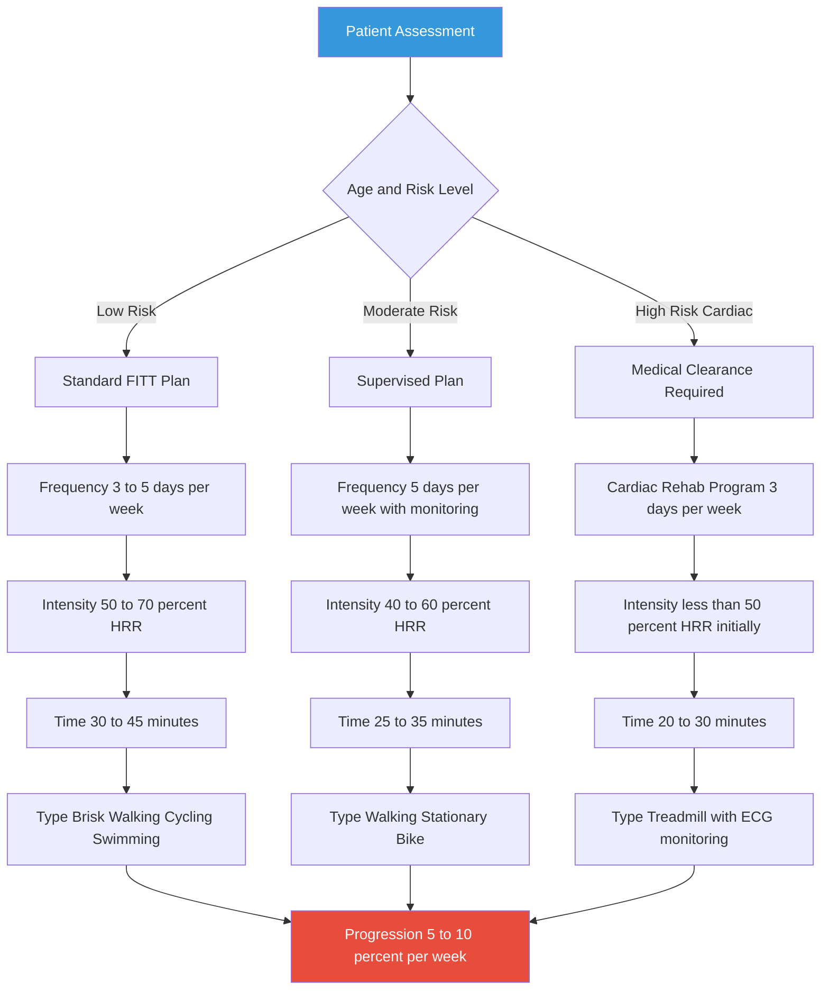
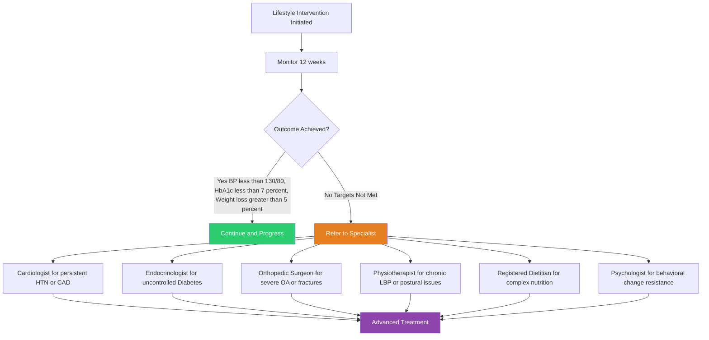

# Lifestyle management strategies to prevent / manage common hypokinetic diseases and disorders - Obesity - Cardiovascular diseases (e.g., coronary artery disease, hypertension) - Diabetes - Osteoporosis - Musculoskeletal disorders (e.g., osteoarthritis, Low back pain, Kyphosis, lordosis , flat foot, Knock knee )

<!-- SECTION_1_START -->

# 🏥 Lifestyle Management Strategies for Hypokinetic Diseases

## 1.1 What Are Hypokinetic Diseases? — Core Definition

> [!IMPORTANT]
> **Hypokinetic Disease (KTU 2024 Definition):** A **hypokinetic disease** is a chronic, non-communicable disorder caused primarily by **physical inactivity** or a **sedentary lifestyle**, characterized by reduced movement of the body, leading to dysfunction of one or more physiological systems.

The prefix **"hypo"** means *low* or *under*, and **"kinetic"** refers to *movement*. Therefore, *hypokinetic* literally means **"too little movement."** The World Health Organization (WHO) identifies physical inactivity as the **fourth leading risk factor** for global mortality, causing an estimated **3.2 million deaths per year**.

### 1.1.1 Intuitive Analogy — The Human Body as a Machine

> [!NOTE]
> **Conceptual Analogy:** Think of the human body as a **high-performance engine** (like a car). If you park a car in a garage for months without starting it, the battery dies, the oil settles, the tyres deflate, and rust forms on the engine parts. Similarly, when the human body is "parked" on a couch for long hours — sitting at a desk, watching screens, or driving — the **cardiovascular pump weakens, bones demineralize, joints stiffen, and metabolism slows down**, producing hypokinetic diseases.

### 1.1.2 Classification of Hypokinetic Conditions Covered in KTU Module 3

| Category | Specific Conditions |
|----------|---------------------|
| **Metabolic** | Obesity, Type 2 Diabetes Mellitus |
| **Cardiovascular** | Coronary Artery Disease (CAD), Hypertension |
| **Skeletal/Bone** | Osteoporosis |
| **Musculoskeletal (Postural & Joint)** | Osteoarthritis, Low Back Pain (LBP), Kyphosis, Lordosis, Flat Foot (Pes Planus), Knock Knee (Genu Valgum) |

> [!VISUALIZATION CONTROL]
> **Concept:** Body Mass Index (BMI) Distribution Curve
> **GeoGebra / Desmos Input Equations:**
> * Normal distribution: $f(x) = \frac{1}{\sigma\sqrt{2\pi}} e^{-\frac{(x-\mu)^2}{2\sigma^2}}$
> * BMI thresholds: $x = 18.5, 25, 30, 35, 40$
> **Visual Description:** A bell-shaped curve on the x-axis showing BMI ranges from 15 to 45. Highlight the zones: Underweight (blue), Normal (green), Overweight (yellow), Obese I (orange), Obese II (red), Obese III (dark red). Students should observe that the *Normal* zone is the narrow central peak.

---

## 1.2 The Physiological Chain: From Inactivity to Disease

When a person becomes physically inactive, the following physiological cascade occurs:

1. **↓ Energy expenditure** → Caloric surplus stored as **adipose tissue** (fat).
2. **↓ Insulin sensitivity** → Muscle cells become resistant to insulin → **Type 2 Diabetes**.
3. **↓ Cardiac stroke volume** → Heart muscle weakens → **Hypertension** and **CAD**.
4. **↓ Osteoblastic activity** → Bone mineral density drops → **Osteoporosis**.
5. **↓ Synovial fluid circulation** + **muscle atrophy** → Joint cartilage degenerates → **Osteoarthritis**.
6. **↓ Core and postural muscle strength** → Spinal curves distort → **Kyphosis / Lordosis / LBP**.

> [!IMPORTANT]
> **KTU 2024 Key Takeaway:** All hypokinetic diseases share **one common reversible root cause — physical inactivity**. Therefore, lifestyle modification (exercise, diet, posture correction, stress management) is the **primary prevention and management strategy**.

---

## 1.3 BMI and Waist-Hip Ratio — The Screening Metrics

> [!IMPORTANT]
> **Body Mass Index (BMI):** A numerical value derived from an individual's weight and height, used as a screening tool to categorize weight status.
> **BMI Formula:** $BMI = \dfrac{\text{Weight (kg)}}{\text{Height (m)}^2}$

**Standard WHO BMI Classification:**

| BMI Range (kg/m²) | Weight Category | Health Risk |
|-------------------|-----------------|-------------|
| Below **18.5** | Underweight | Malnutrition risk |
| **18.5 – 24.9** | **Normal weight** | **Minimal** |
| **25.0 – 29.9** | Overweight | Increased |
| **30.0 – 34.9** | Obese Class I | High |
| **35.0 – 39.9** | Obese Class II | Very High |
| **40.0 and above** | Obese Class III | Extremely High |

> [!NOTE]
> **Waist-Hip Ratio (WHR):** A supplementary metric for **abdominal (visceral) obesity**.
> **WHR Formula:** $WHR = \dfrac{\text{Waist Circumference}}{\text{Hip Circumference}}$
> * Healthy WHR for men: **< 0.90**
> * Healthy WHR for women: **< 0.85**

<!-- SECTION_1_END -->

<!-- SECTION_2_START -->

# 📘 Deep Theoretical Analysis & KTU High-Yield Reference

## 2.1 Obesity — Pathophysiology and Lifestyle Management

### 2.1.1 Definition
**Obesity** is defined as an **abnormal or excessive accumulation of body fat** (adipose tissue) that presents a risk to health. Medically, it is diagnosed when **BMI ≥ 30 kg/m²** (WHO standard).

### 2.1.2 Energy Balance Equation
The fundamental cause of obesity is an **energy imbalance** between calories consumed and calories expended:

$$E_{balance} = E_{intake} - E_{expenditure}$$

| Condition | Energy State | Result |
|-----------|--------------|--------|
| $E_{intake} > E_{expenditure}$ | Positive balance | **Weight gain** |
| $E_{intake} = E_{expenditure}$ | Equilibrium | **Weight maintenance** |
| $E_{intake} < E_{expenditure}$ | Negative balance | **Weight loss** |

### 2.1.3 Lifestyle Management Strategies for Obesity

| Strategy | Implementation | Weekly Target |
|----------|----------------|---------------|
| **Aerobic Exercise** | Brisk walking, jogging, cycling, swimming | **150–300 minutes/week** |
| **Resistance Training** | Free weights, machines, bodyweight | **2–3 sessions/week** |
| **Caloric Restriction** | 500 kcal/day deficit → ~0.5 kg/week loss | **−500 kcal/day** |
| **Behavioral Therapy** | Self-monitoring, goal setting, stimulus control | Continuous |
| **Sleep Hygiene** | 7–9 hours/night | Daily |
| **Stress Management** | Meditation, yoga, deep breathing | Daily |

> [!IMPORTANT]
> **KTU Formula — Basal Metabolic Rate (BMR) — Mifflin-St Jeor Equation:**
>
> $$\text{BMR (men)} = 10 \times W + 6.25 \times H - 5 \times A + 5$$
>
> $$\text{BMR (women)} = 10 \times W + 6.25 \times H - 5 \times A - 161$$
>
> Where $W$ = weight (kg), $H$ = height (cm), $A$ = age (years).
> **Total Daily Energy Expenditure (TDEE) = BMR × Activity Factor** (1.2 sedentary → 1.9 very active).

---

## 2.2 Cardiovascular Diseases (CVD)

### 2.2.1 Coronary Artery Disease (CAD)

**Definition:** CAD is the **narrowing or blockage of the coronary arteries** (the blood vessels supplying the heart muscle) caused primarily by **atherosclerosis** — the buildup of fatty plaques (cholesterol, lipids, calcium) on arterial walls.

> [!NOTE]
> **Atherogenesis Simplified:** Damaged endothelium → LDL cholesterol infiltrates → Macrophages engulf LDL → Foam cells form → Plaque grows → Artery narrows → Reduced blood flow to myocardium → **Angina / Myocardial Infarction (Heart Attack)**.

**Lifestyle Management for CAD:**

| Strategy | Specific Recommendation |
|----------|--------------------------|
| **Aerobic Exercise** | 30 min moderate-intensity × 5 days/week (150 min total) |
| **Diet** | Mediterranean diet — fruits, vegetables, whole grains, olive oil, fish |
| **Smoking Cessation** | Complete abstinence (single biggest modifiable risk) |
| **Alcohol** | Limit to ≤ 2 drinks/day (men), ≤ 1/day (women) |
| **Weight Control** | Maintain BMI **18.5–24.9** and WHR < 0.90 (M) / 0.85 (F) |
| **Stress Reduction** | Yoga, mindfulness, adequate sleep (7–8 hrs) |

### 2.2.2 Hypertension (High Blood Pressure)

**Definition:** A chronic condition where the force of blood against artery walls is **consistently elevated** to ≥ **140/90 mmHg** (old guideline) or ≥ **130/80 mmHg** (ACC/AHA 2017 guideline).

> [!IMPORTANT]
> **Blood Pressure Classification (AHA 2017):**
> 
> | Category | Systolic (mmHg) | Diastolic (mmHg) |
> |----------|-----------------|------------------|
> | Normal | < 120 | and < 80 |
> | Elevated | 120–129 | and < 80 |
> | Stage 1 HTN | 130–139 | or 80–89 |
> | Stage 2 HTN | ≥ 140 | or ≥ 90 |
> | Hypertensive Crisis | > 180 | and/or > 120 |

**Lifestyle Modifications with Proven BP-Lowering Effect (DASH Approach):**

| Modification | Recommended Target | Systolic BP Reduction |
|---------------|--------------------|-----------------------|
| Weight loss | BMI < 25 | **−5 to −20 mmHg** per 10 kg lost |
| DASH diet | Rich in K, Ca, Mg; low Na | **−8 to −14 mmHg** |
| Sodium restriction | < 1500 mg/day | **−2 to −8 mmHg** |
| Aerobic exercise | 150 min/week | **−4 to −9 mmHg** |
| Alcohol limit | ≤ 2 drinks/day (men) | **−2 to −4 mmHg** |

---

## 2.3 Diabetes Mellitus (Type 2)

**Definition:** A **metabolic disorder** characterized by **chronic hyperglycemia** (high blood glucose) resulting from defects in **insulin secretion**, **insulin action**, or both. Type 2 Diabetes (T2DM) accounts for **~90% of all diabetes cases** and is strongly linked to physical inactivity and obesity.

> [!IMPORTANT]
> **Diagnostic Criteria (ADA — any one of the following):**
> * Fasting Plasma Glucose (FPG) **≥ 126 mg/dL**
> * 2-hour Oral Glucose Tolerance Test (OGTT) **≥ 200 mg/dL**
> * HbA1c **≥ 6.5%**
> * Random plasma glucose **≥ 200 mg/dL** with classic symptoms

**Lifestyle Management — The "5 Pillars" of Diabetes Control:**

| Pillar | Action |
|--------|--------|
| **1. Diet** | Low glycemic index foods; high fiber (>25 g/day); controlled carbs |
| **2. Exercise** | 150 min/week moderate aerobic + 2–3 sessions resistance training |
| **3. Weight** | 5–7% body weight loss (proven to prevent T2DM by **58%** — DPP Trial) |
| **4. Monitoring** | Regular blood glucose checks, HbA1c every 3–6 months |
| **5. Education** | Self-management training, foot care, sick-day rules |

---

## 2.4 Osteoporosis

**Definition:** A **progressive skeletal disease** characterized by **low bone mass** and **microarchitectural deterioration** of bone tissue, leading to increased **bone fragility** and **fracture risk**.

**Diagnostic Standard:** Bone Mineral Density (BMD) measured by **DEXA scan**, expressed as a **T-score**.

> [!IMPORTANT]
> **WHO T-Score Classification for Osteoporosis:**
> 
> | T-Score Range | Diagnosis |
> |---------------|-----------|
> | ≥ −1.0 | **Normal** |
> | −1.0 to −2.5 | **Osteopenia** (low bone mass) |
> | ≤ −2.5 | **Osteoporosis** |
> | ≤ −2.5 + fragility fracture | **Severe (established) osteoporosis** |

**Lifestyle Management — The "Osteoporosis Triad":**

1. **Weight-Bearing Exercise** (walking, jogging, dancing, stair climbing) — stimulates osteoblast activity.
2. **Resistance Training** (2–3 sessions/week) — strengthens bone at attachment sites.
3. **Nutritional Support** — Calcium (**1000–1200 mg/day**) + Vitamin D (**800–1000 IU/day**) + Protein (**1.0–1.2 g/kg/day**).

**Wolff's Law:** *"Bone adapts to the loads under which it is placed. Increased loading → increased bone density."*

---

## 2.5 Musculoskeletal Disorders — Postural Deviations and Joint Conditions

### 2.5.1 Overview Table of Postural Disorders

| Disorder | Definition | Common Cause | Key Lifestyle Intervention |
|----------|------------|--------------|----------------------------|
| **Kyphosis** | Excessive **forward (anterior) curvature** of the thoracic spine ("hunchback") | Weak upper back muscles; prolonged slouching; osteoporosis | Thoracic extension exercises; rhomboid & trapezius strengthening; posture awareness |
| **Lordosis** | Excessive **inward (anterior) curvature** of the lumbar spine ("swayback") | Weak core & glutes; tight hip flexors; pregnancy | Core strengthening (planks, dead bugs); hip flexor stretching; glute activation |
| **Flat Foot (Pes Planus)** | **Collapse of the medial longitudinal arch** of the foot | Weak tibialis posterior; obesity; prolonged standing | Arch-strengthening exercises (towel curls, marble pickups); proper footwear; orthotic insoles |
| **Knock Knee (Genu Valgum)** | Inward angulation of the knees — knees touch while ankles remain apart | Weak hip abductors (gluteus medius); obesity; rickets | Hip abductor strengthening (clamshells, side-lying leg raises); VMO activation; weight management |
| **Low Back Pain (LBP)** | Pain in the **lumbar region** lasting < 6 weeks (acute), 6–12 weeks (subacute), or > 12 weeks (chronic) | Poor posture; weak core; sedentary lifestyle; improper lifting | McKenzie exercises; core stabilization; ergonomic workstation; proper lifting technique |
| **Osteoarthritis (OA)** | Degenerative **wear-and-tear** of articular cartilage in synovial joints (commonly knee, hip, hand) | Aging; obesity; repetitive joint stress; inactivity | Low-impact aerobic exercise (cycling, swimming); quadriceps strengthening; weight loss (5–10% reduces pain by 50%) |

> [!IMPORTANT]
> **KTU 2024 — McKenzie Extension Exercise Protocol for LBP:**
> 1. Lie prone (face down) for 1–2 minutes.
> 2. Progress to prone on elbows for 2–3 minutes.
> 3. Progress to prone press-ups (cobra stretch) — 10 repetitions, hold 2 seconds.
> 4. Repeat every 2–3 hours during acute phase.

---

## 2.6 KTU Formula Cheat Sheet — Quick Reference

> [!IMPORTANT]
> **High-Yield Formulas for Hypokinetic Disease Management**

| # | Formula / Concept | Equation | Application |
|---|-------------------|----------|-------------|
| 1 | **Body Mass Index** | $BMI = \dfrac{W}{H^2}$ | Obesity screening |
| 2 | **Waist-Hip Ratio** | $WHR = \dfrac{WC}{HC}$ | Visceral fat assessment |
| 3 | **BMR (Mifflin-St Jeor, Men)** | $10W + 6.25H - 5A + 5$ | Resting calorie needs |
| 4 | **BMR (Mifflin-St Jeor, Women)** | $10W + 6.25H - 5A - 161$ | Resting calorie needs |
| 5 | **TDEE** | $BMR \times AF$ | Total daily calories |
| 6 | **Caloric Deficit for Weight Loss** | $1 \text{ kg fat} = 7700 \text{ kcal}$ | 500 kcal/day deficit → 0.5 kg/week |
| 7 | **Target Heart Rate (Karvonen)** | $THR = \left( HR_{max} - HR_{rest} \right) \times \%\text{intensity} + HR_{rest}$ | Exercise prescription |
| 8 | **Max Heart Rate** | $HR_{max} = 220 - \text{age}$ | Aerobic training zones |
| 9 | **Mean Arterial Pressure** | $MAP = DBP + \dfrac{1}{3}(SBP - DBP)$ | Cardiovascular assessment |
| 10 | **Daily Caloric Deficit Goal** | $500 - 1000 \text{ kcal/day}$ | 0.5–1 kg weight loss/week |

> [!NOTE]
> **Engineering/Real-World Connection:** These metrics are the same formulas used in **wearable fitness technology** (Fitbit, Apple Watch, Garmin), **clinical health-screening kiosks** in corporate offices, and **electronic medical records (EMR)** systems. Understanding them empowers engineers to design better health-tech products and wellness programs.

<!-- SECTION_2_END -->

<!-- SECTION_3_START -->

# 🧮 Step-by-Step Derivations, Case Applications & Worked Examples

## 3.1 Worked Example 1 — BMI Calculation and Obesity Classification

**Question:** Mr. Ramesh, a 42-year-old software engineer, weighs **92 kg** and is **1.75 m** tall. He sits at his desk for ~10 hours/day and reports no regular exercise. Calculate his BMI and classify his weight status.

### Step-by-Step Solution:

**Step 1 — Recall the BMI formula:**

$$BMI = \dfrac{\text{Weight (kg)}}{\left[\text{Height (m)}\right]^2}$$

**Step 2 — Substitute the given values:**

$$BMI = \dfrac{92}{(1.75)^2}$$

**Step 3 — Compute the denominator (height squared):**

$$(1.75)^2 = 1.75 \times 1.75 = 3.0625 \text{ m}^2$$

**Step 4 — Perform the division:**

$$BMI = \dfrac{92}{3.0625} = 30.04 \text{ kg/m}^2$$

**Step 5 — Classify using the WHO table:**

Since $30.04 \geq 30.0$ and $30.04 < 35.0$, Mr. Ramesh falls in **Obese Class I** (High health risk).

**Step 6 — Calculate Waist Circumference Risk:**
Suppose his waist = **104 cm** and hip = **98 cm**.

$$WHR = \dfrac{104}{98} = 1.06$$

For men, WHR > 0.90 indicates **abdominal obesity** — Mr. Ramesh is at **substantially elevated cardiovascular risk**.

**Step 7 — Prescribe lifestyle intervention:**

| Parameter | Recommendation |
|-----------|----------------|
| Daily caloric deficit | −500 kcal/day |
| Weekly exercise | 200 min moderate aerobic + 2 resistance sessions |
| Target weight loss (6 months) | 12–14 kg |
| Recheck BMI in | 3 months |

> [!NOTE]
> **[Valuation Key: 1 Mark for correct formula, 1 Mark for substitution, 1 Mark for computation, 1 Mark for classification, 1 Mark for intervention, 1 Mark for risk interpretation]**

---

## 3.2 Worked Example 2 — BMR and TDEE Calculation for Diet Planning

**Question:** Ms. Anjali, a 30-year-old teacher, weighs **68 kg**, is **162 cm** tall, and is **moderately active** (teaches plus walks 30 min/day). Calculate her BMR and TDEE, and design a calorie target for safe weight loss.

### Step-by-Step Solution:

**Step 1 — Select the correct BMR equation (Female):**

$$BMR_{female} = 10W + 6.25H - 5A - 161$$

**Step 2 — Substitute values:**

$$BMR = 10(68) + 6.25(162) - 5(30) - 161$$

**Step 3 — Compute each term:**

$$
\begin{aligned}
10 \times 68 &= 680 \\
6.25 \times 162 &= 1012.5 \\
5 \times 30 &= 150
\end{aligned}
$$

**Step 4 — Combine:**

$$
\begin{aligned}
BMR &= 680 + 1012.5 - 150 - 161 \\
&= 1692.5 - 311 \\
&= 1381.5 \text{ kcal/day}
\end{aligned}
$$

**Step 5 — Determine Activity Factor (Moderately Active):**
Activity Factor (AF) = **1.55**

**Step 6 — Compute TDEE:**

$$TDEE = BMR \times AF = 1381.5 \times 1.55 = 2141.3 \text{ kcal/day}$$

**Step 7 — Apply 500 kcal deficit for weight loss:**

$$\text{Calorie Target} = 2141.3 - 500 = 1641.3 \text{ kcal/day}$$

**Step 8 — Expected outcome:**

> Since 1 kg of fat ≈ 7700 kcal, a 500 kcal/day deficit × 7 days = 3500 kcal/week → approximately **0.45 kg (≈ 0.5 kg) of fat loss per week**.

---

## 3.3 Worked Example 3 — Target Heart Rate for a Hypertensive Patient

**Question:** Mr. Suresh, 55 years old, with stage 1 hypertension, joins a cardiac rehabilitation program. His resting heart rate is **76 bpm**. Calculate his target heart rate zone for moderate-intensity exercise (50–70% intensity) using the Karvonen formula.

### Step-by-Step Solution:

**Step 1 — Compute Maximum Heart Rate:**

$$HR_{max} = 220 - \text{age} = 220 - 55 = 165 \text{ bpm}$$

**Step 2 — Calculate Heart Rate Reserve (HRR):**

$$HRR = HR_{max} - HR_{rest} = 165 - 76 = 89 \text{ bpm}$$

**Step 3 — Compute Target Heart Rate at 50% intensity (lower bound):**

$$
\begin{aligned}
THR_{50\%} &= (HRR \times 0.50) + HR_{rest} \\
&= (89 \times 0.50) + 76 \\
&= 44.5 + 76 \\
&= 120.5 \text{ bpm}
\end{aligned}
$$

**Step 4 — Compute Target Heart Rate at 70% intensity (upper bound):**

$$
\begin{aligned}
THR_{70\%} &= (HRR \times 0.70) + HR_{rest} \\
&= (89 \times 0.70) + 76 \\
&= 62.3 + 76 \\
&= 138.3 \text{ bpm}
\end{aligned}
$$

**Step 5 — Prescribe exercise zone:**

> Mr. Suresh should exercise at a heart rate between **120 – 138 bpm** for 30 minutes, 5 days/week. This is the **moderate-intensity aerobic zone** (40–59% VO₂ reserve equivalent for cardiac patients — safely below the ischemic threshold).

---

## 3.4 Worked Example 4 — Osteoporosis Risk Calculation & Lifestyle Prescription

**Question:** Mrs. Lakshmi, 65 years old, postmenopausal, weighs 55 kg, height 155 cm. Her DEXA scan shows a T-score of **−2.8**. She does no exercise. Design a comprehensive lifestyle plan.

### Step-by-Step Solution:

**Step 1 — Diagnose using T-score:**
T-score = −2.8 ≤ −2.5 → **Osteoporosis confirmed**.

**Step 2 — Calculate her BMI (to assess additional risk):**

$$BMI = \dfrac{55}{(1.55)^2} = \dfrac{55}{2.4025} = 22.9 \text{ kg/m}^2 \quad (\text{Normal})$$

**Step 3 — Prescribe Exercise (Wolff's Law application):**

| Exercise Type | Frequency | Examples |
|---------------|-----------|----------|
| Weight-bearing aerobic | 5 days/week | Walking 30 min, stair climbing |
| Resistance training | 2–3 days/week | Squats, lunges, weighted carries |
| Balance training | Daily | Single-leg stand, tai chi (fall prevention) |

**Step 4 — Prescribe Nutrition:**

| Nutrient | Daily Target | Food Sources |
|----------|--------------|--------------|
| Calcium | **1200 mg** | Milk, curd, ragi, almonds, leafy greens |
| Vitamin D | **1000 IU** | Sunlight 15 min/day, fatty fish, fortified milk |
| Protein | **1.2 g/kg = 66 g** | Dal, eggs, fish, chicken, paneer |
| Vitamin K₂ | Adequate | Fermented foods, natto, cheese |

**Step 5 — Fall prevention (critical for osteoporosis patients):**
- Remove loose rugs at home.
- Install grab bars in bathroom.
- Wear non-slip footwear.
- Annual vision and hearing check.

> [!IMPORTANT]
> **[Valuation Key for KTU: Stating diagnosis from T-score: 2 Marks; Exercise plan with justification (Wolff's Law): 4 Marks; Nutrition plan with values: 4 Marks; Fall prevention: 2 Marks; Total: 12/14 — remaining 2 marks for presentation and clarity]**

---

## 3.5 Case Study: Comprehensive Lifestyle Management Plan for a 50-Year-Old IT Professional with Multiple Risk Factors

**Patient Profile:**
* **Name:** Mr. Krishnan (fictional case)
* **Age:** 50 years | **Gender:** Male
* **Occupation:** IT Project Manager (sedentary, high stress)
* **Weight:** 88 kg | **Height:** 170 cm
* **BP:** 142/92 mmHg | **FBS:** 138 mg/dL | **HbA1c:** 7.2%
* **Lipid Profile:** Total Cholesterol 240 mg/dL, LDL 160 mg/dL
* **Symptoms:** Fatigue, frequent urination, occasional chest discomfort on exertion
* **Habits:** Smokes 5 cigarettes/day; alcohol 3 pegs/week; sleep 5 hrs/night

**Diagnosis:**
1. **Stage 2 Hypertension** (142/92)
2. **Type 2 Diabetes Mellitus** (FBS 138, HbA1c 7.2%)
3. **Dyslipidemia** (LDL 160, TC 240)
4. **Pre-obesity** (BMI will be calculated below)
5. **High cardiovascular event risk**

**Step 1 — Calculate BMI:**

$$BMI = \dfrac{88}{(1.70)^2} = \dfrac{88}{2.89} = 30.45 \text{ kg/m}^2 \quad (\text{Obese Class I})$$

**Step 2 — Calculate BMR (Male):**

$$BMR = 10(88) + 6.25(170) - 5(50) + 5 = 880 + 1062.5 - 250 + 5 = 1697.5 \text{ kcal/day}$$

**Step 3 — Calculate TDEE (Sedentary, AF = 1.2):**

$$TDEE = 1697.5 \times 1.2 = 2037 \text{ kcal/day}$$

**Step 4 — Lifestyle Prescription — Integrated Plan:**

| Domain | Intervention | Frequency | Expected Outcome |
|--------|--------------|-----------|------------------|
| **Exercise** | Brisk walking 40 min + 2 resistance sessions | 5 days/wk | ↓ BP 5–9 mmHg, ↑ Insulin sensitivity 30% |
| **Diet** | DASH + Mediterranean hybrid; 1500 kcal/day; <1500 mg sodium | Daily | ↓ Weight 0.5 kg/wk, ↓ LDL 10–15% |
| **Smoking** | Complete cessation with nicotine replacement | Immediate | ↓ CVD risk 50% in 1 year |
| **Alcohol** | Reduce to < 2 drinks/week | Ongoing | ↓ Triglycerides, ↓ BP |
| **Sleep** | Target 7 hrs; fixed sleep-wake schedule | Daily | ↑ Insulin sensitivity, ↓ Cortisol |
| **Stress** | 20 min meditation + 10 min breathing exercise | Daily | ↓ Sympathetic tone, ↓ BP |
| **Monitoring** | Home BP twice daily; glucometer fasting + post-meal | Daily | Tight glycemic and BP control |

**Step 5 — SMART Goals (Specific, Measurable, Achievable, Relevant, Time-bound):**

| Goal | Metric | Timeline |
|------|--------|----------|
| Lose 8 kg | Weight 88 → 80 kg | 16 weeks |
| Normalize BP | < 130/80 mmHg | 12 weeks |
| HbA1c < 6.5% | Quarterly test | 6 months |
| LDL < 100 mg/dL | Lipid panel | 12 weeks |
| Quit smoking | Zero cigarettes | 4 weeks |

> [!IMPORTANT]
> **KTU 2024 — The '5-A Framework' for Lifestyle Counseling:**
> 1. **Assess** current behavior and risk level.
> 2. **Advise** specific changes needed.
> 3. **Agree** on collaborative, realistic goals.
> 4. **Assist** with resources, referrals, and barrier removal.
> 5. **Arrange** follow-up and ongoing monitoring.

<!-- SECTION_3_END -->

<!-- SECTION_4_START -->

# 🗂️ Structural Diagrams & Mermaid Schematics

## 4.1 Master Flowchart — Physical Inactivity → Disease Spectrum

## 4.2 The Lifestyle Intervention Pyramid

## 4.3 Comparative Management Matrix for Hypokinetic Diseases

## 4.4 Postural Correction Strategy Map

## 4.5 Exercise Prescription Algorithm (FITT Principle)

## 4.6 Decision Matrix — When to Refer to a Specialist

<!-- SECTION_4_END -->

<!-- SECTION_5_START -->

# 📝 KTU 2024 Scheme Examination Question Bank

---

## 📘 Part A — Short Answer Questions (3 Marks Each)

### Question 1
**[KTU University Exam – July 2024]**
**CO1 | Remember | Bloom's Level: L1**
*"Define hypokinetic disease. List any four examples of hypokinetic conditions."*

**Model Answer (3 Marks):**

> **Definition (1.5 Marks):** A *hypokinetic disease* is a chronic non-communicable disorder caused primarily by **physical inactivity** and a sedentary lifestyle, leading to dysfunction of one or more body systems. The term combines *"hypo"* (low) and *"kinetic"* (movement).
>
> **Four Examples (1.5 Marks — 0.375 each):**
> 1. **Obesity** — excess body fat due to energy imbalance.
> 2. **Coronary Artery Disease (CAD)** — narrowing of coronary arteries from inactivity-induced atherosclerosis.
> 3. **Type 2 Diabetes Mellitus** — insulin resistance from sedentary habits and obesity.
> 4. **Osteoporosis** — reduced bone mineral density from insufficient weight-bearing activity.
>
> *(Any other correct examples — Hypertension, Osteoarthritis, Low Back Pain, Kyphosis/Lordosis, Flat Foot, Knock Knee — accepted for full marks.)*

---

### Question 2
**[KTU University Exam – Dec 2023]**
**CO2 | Understand | Bloom's Level: L2**
*"Explain the FITT principle of exercise prescription. How is it applied in the lifestyle management of hypertension?"*

**Model Answer (3 Marks):**

> The **FITT principle** is the cornerstone of individualized exercise prescription. It defines four parameters (1 Mark for listing them; 1 Mark each for elaboration on two parameters, totaling 3 Marks):
>
> * **F — Frequency:** How often exercise is performed. For hypertension: **5 days/week** aerobic + **2–3 days/week** resistance.
> * **I — Intensity:** How hard one works. For hypertension: **40–59% of Heart Rate Reserve** (Karvonen method) or **RPE 11–13** (Borg Scale).
> * **T — Time:** Duration of each session. For hypertension: **30–45 minutes per session** of continuous or interval aerobic activity.
> * **T — Type:** Mode of exercise. For hypertension: **aerobic activities** (brisk walking, cycling, swimming) plus **resistance training** (2–3 sets of 8–12 reps).
>
> **Application in Hypertension:** A structured FITT plan, sustained for ≥ 12 weeks, has been shown to lower systolic BP by **4–9 mmHg** and diastolic BP by **3–6 mmHg**, comparable to a single antihypertensive medication.

---

## 📗 Part B — Long Answer Questions (14 Marks Each) — ESE Module Internal Choice

### Question A (Choice 1) — 14 Marks

**[KTU University Exam – July 2024 — Model Paper Pattern]**
**CO3 | Apply / Analyze | Bloom's Level: L3–L4**

**Q. A (a)** *Define obesity. Describe the WHO classification of obesity based on BMI. Calculate the BMI of a 38-year-old male weighing 95 kg with a height of 1.68 m, and classify his weight status. What health risks is he predisposed to?* **[7 Marks]**

**Q. A (b)** *Discuss the lifestyle management strategies for obesity. Design a comprehensive 12-week plan (exercise, diet, behavioral) for a sedentary office worker with Class II obesity.* **[7 Marks]**

---

### ✅ Model Answer — Question A (a) — 7 Marks

> **Definition of Obesity (1 Mark):**
> Obesity is defined by the WHO as an **abnormal or excessive accumulation of body fat (adipose tissue)** that presents a risk to health. It is operationally diagnosed in adults when **BMI ≥ 30 kg/m²**.
>
> **WHO BMI Classification (2 Marks — table accepted):**
>
> | BMI (kg/m²) | Category |
> |-------------|----------|
> | Below 18.5 | Underweight |
> | 18.5 – 24.9 | Normal |
> | 25.0 – 29.9 | Overweight |
> | 30.0 – 34.9 | Obese Class I |
> | 35.0 – 39.9 | Obese Class II |
> | ≥ 40.0 | Obese Class III |
>
> **BMI Calculation (2 Marks — 1 for formula, 1 for substitution and result):**
>
> $$BMI = \dfrac{W}{H^2} = \dfrac{95}{(1.68)^2} = \dfrac{95}{2.8224} = 33.66 \text{ kg/m}^2$$
>
> **Classification (1 Mark):** $33.66$ falls in the **30.0 – 34.9** range → **Obese Class I**.
>
> **Health Risks Predisposed (1 Mark):** Type 2 Diabetes, Hypertension, Coronary Artery Disease, Dyslipidemia, Osteoarthritis (knees/hips), Obstructive Sleep Apnea, certain cancers, and psychological issues (depression, low self-esteem).

---

### ✅ Model Answer — Question A (b) — 7 Marks

> **Comprehensive 12-Week Plan for Class II Obesity in a Sedentary Office Worker:**
>
> **1. Exercise Component (3 Marks):**
>
> | Week | Aerobic | Resistance | Notes |
> |------|---------|------------|-------|
> | 1–4 | 90 min/week brisk walking (3 × 30 min) | 1 session/week full-body | Gradual ramp-up |
> | 5–8 | 150 min/week (5 × 30 min) | 2 sessions/week | Add interval training |
> | 9–12 | 200 min/week (5 × 40 min) | 3 sessions/week | Increase load |
>
> **2. Dietary Component (2 Marks):**
> * Caloric target: **TDEE − 500 kcal/day** (≈ 1500–1800 kcal).
> * Macronutrient split: **50% carbs, 25% protein, 25% fat**.
> * High-fiber (>25 g/day), low glycemic index foods, ≥ 5 servings of fruits/vegetables.
> * Hydration: 2.5–3 L water/day; no sugary beverages.
>
> **3. Behavioral Component (1 Mark):**
> * Self-monitoring with food/activity diary.
> * Goal setting: 5% body weight loss in 12 weeks (~5 kg).
> * Stimulus control: keep unhealthy snacks out of sight; keep gym bag by the door.
> * Stress management: 10-min meditation, 7–8 hrs sleep.
>
> **4. Expected Outcome (1 Mark):**
> * 5–7% body weight loss (~5–7 kg).
> * Improved insulin sensitivity, ↓ BP, ↓ LDL cholesterol.
> * Improved cardiorespiratory fitness, ↑ energy levels.

> [!WARNING]
> **🔴 KTU Examiner's Valuation Warning:**
> * **Do not** write the BMI formula as $BMI = W \times H^2$ — this is a **fatal error** costing **all 2 calculation marks**.
> * **Always show** the substitution step with units (kg/m²) — skipping units → lose 0.5 Mark.
> * **Do not** confuse the obesity *classes* — mixing up Class I and Class II is a common 0.5-Mark error.
> * **Failing to** state the lifestyle plan in *tabular form* (which KTU examiners prefer) → lose presentation marks.

---

### Question B (Choice 2 — Alternative to Question A) — 14 Marks

**[KTU University Exam – Dec 2023]**
**CO4 | Apply / Analyze | Bloom's Level: L3–L4**

**Q. B (a)** *Define hypertension. Classify blood pressure according to the latest ACC/AHA 2017 guidelines. Explain the role of the DASH diet and exercise in the non-pharmacological management of hypertension.* **[7 Marks]**

**Q. B (b)** *What is osteoporosis? Describe the WHO T-score classification. Outline a lifestyle modification plan (exercise, nutrition, fall prevention) for a 65-year-old postmenopausal woman diagnosed with osteoporosis.* **[7 Marks]**

---

### ✅ Model Answer — Question B (a) — 7 Marks

> **Definition of Hypertension (1 Mark):**
> Hypertension is a chronic medical condition characterized by **persistently elevated arterial blood pressure**, defined as **≥ 130/80 mmHg** (ACC/AHA 2017) or **≥ 140/90 mmHg** (older JNC-7/Indian guidelines).
>
> **ACC/AHA 2017 Classification (2 Marks):**
>
> | Category | Systolic (mmHg) | | Diastolic (mmHg) |
> |----------|-----------------|---|------------------|
> | Normal | < 120 | and | < 80 |
> | Elevated | 120–129 | and | < 80 |
> | Stage 1 HTN | 130–139 | or | 80–89 |
> | Stage 2 HTN | ≥ 140 | or | ≥ 90 |
> | Hypertensive Crisis | > 180 | and/or | > 120 |
>
> **DASH Diet in Hypertension (2 Marks):**
> The **Dietary Approaches to Stop Hypertension (DASH)** diet is rich in:
> * **Fruits, vegetables, whole grains** (high potassium, magnesium, fiber).
> * **Low-fat dairy, fish, poultry, legumes** (calcium, lean protein).
> * **Low sodium** (< 1500 mg/day optimal; < 2300 mg/day acceptable).
> * **Limited** saturated fat, red meat, sweets, sugary beverages.
> * **Proven effect:** Lowers SBP by **8–14 mmHg** in hypertensive patients.
>
> **Exercise in Hypertension (2 Marks):**
> * **Aerobic exercise** (brisk walking, jogging, cycling, swimming) for **150 min/week** at moderate intensity (40–59% HRR).
> * **Resistance training** 2–3 days/week (8–10 exercises, 1–3 sets, 10–15 reps).
> * **Isometric handgrip** and **yoga/breathing exercises** as adjuncts.
> * **Proven effect:** Lowers SBP by **4–9 mmHg** and DBP by **3–6 mmHg**.

---

### ✅ Model Answer — Question B (b) — 7 Marks

> **Definition of Osteoporosis (1 Mark):**
> Osteoporosis is a **progressive systemic skeletal disease** characterized by **low bone mass** and **microarchitectural deterioration** of bone tissue, leading to **increased bone fragility and fracture risk**.
>
> **WHO T-Score Classification (2 Marks):**
>
> | T-Score | Diagnosis |
> |---------|-----------|
> | ≥ −1.0 | Normal |
> | −1.0 to −2.5 | Osteopenia |
> | ≤ −2.5 | Osteoporosis |
> | ≤ −2.5 with fragility fracture | Severe (established) osteoporosis |
>
> **Lifestyle Modification Plan (4 Marks):**
>
> **1. Exercise (1.5 Marks):**
> * **Weight-bearing aerobic** — walking 30 min × 5 days/week (Wolff's Law).
> * **Resistance training** — 2–3 sessions/week targeting major muscle groups.
> * **Balance training** — tai chi, single-leg stance (fall prevention).
> * **Avoid:** High-impact sports in severe osteoporosis, forward flexion exercises (spinal fracture risk).
>
> **2. Nutrition (1.5 Marks):**
> * **Calcium:** 1200 mg/day (milk, curd, ragi, almonds, sesame).
> * **Vitamin D:** 800–1000 IU/day (15 min sunlight + supplementation).
> * **Protein:** 1.0–1.2 g/kg body weight/day.
> * **Vitamin K₂, magnesium, zinc** from green leafy vegetables and nuts.
>
> **3. Fall Prevention (1 Mark):**
> * Remove tripping hazards (loose rugs, clutter).
> * Install grab bars in bathroom, handrails on stairs.
> * Use non-slip footwear; correct vision with regular eye exams.
> * Avoid sedatives that impair balance.

> [!WARNING]
> **🔴 KTU Examiner's Valuation Warning:**
> * **Do not** confuse **osteoporosis (T ≤ −2.5)** with **osteopenia (T −1.0 to −2.5)** — examiners frequently test this distinction; mixing them costs 1–2 Marks.
> * **Failing to cite Wolff's Law** (bone adapts to mechanical load) when justifying exercise → lose 0.5–1 Mark.
> * **Omitting fall prevention** is a common omission in osteoporosis answers — full marks require all 3 components (exercise + nutrition + fall prevention).
> * **Writing "calcium 1000 mg" instead of "1200 mg"** for postmenopausal women → lose 0.5 Mark (age-specific dosage required).

---

## 🎯 KTU Frequently Asked Concept Corner

> [!IMPORTANT]
> **Quick-Fire Definitions Examiners Love to Test:**

| Term | One-Line Definition |
|------|---------------------|
| **Hypokinetic Disease** | Disease caused by insufficient physical activity |
| **BMI** | Weight (kg) ÷ Height² (m²) |
| **BMR** | Calories burned at complete rest (Mifflin-St Jeor) |
| **TDEE** | Total Daily Energy Expenditure = BMR × Activity Factor |
| **Atherosclerosis** | Plaque buildup in arterial walls |
| **Karvonen Formula** | THR = (HRmax − HRrest) × %intensity + HRrest |
| **Wolff's Law** | Bone density increases in response to mechanical load |
| **DASH Diet** | Dietary Approaches to Stop Hypertension |
| **T-score** | Standard deviations from young-adult mean BMD |
| **McKenzie Exercise** | Repeated lumbar extensions for disc-related LBP |
| **McGill Big 3** | Curl-up, side plank, bird-dog (core stabilization) |
| **Pes Planus** | Flat foot — collapsed medial longitudinal arch |
| **Genu Valgum** | Knock knee — knees touch, ankles apart |
| **Kyphosis** | Excessive thoracic spine curvature (hunchback) |
| **Lordosis** | Excessive lumbar spine curvature (swayback) |

---

## 📌 Topic Recap & Important Things to Remember

> [!IMPORTANT]
> **High-Density Rapid-Revision Checklist — Module 3: Hypokinetic Diseases**

- 🔑 **Hypokinetic diseases** = diseases of *inactivity*. The **single common reversible cause** is physical inactivity — making lifestyle modification the most powerful intervention.

- 🔑 **BMI formula** $BMI = W/H^2$ is the **gateway calculation** for obesity classification. Know all 6 WHO categories by heart.

- 🔑 **WHR thresholds:** Men **< 0.90**, Women **< 0.85** — anything above indicates **abdominal (visceral) obesity** and elevated cardiometabolic risk.

- 🔑 **Mifflin-St Jeor BMR** is the KTU-preferred formula (more accurate than Harris-Benedict). Remember: **men ADD 5**, **women SUBTRACT 161**.

- 🔑 **Activity Factors:** Sedentary 1.2 | Light 1.375 | Moderate 1.55 | Very 1.725 | Extra 1.9.

- 🔑 **Weight loss math:** **1 kg of fat = 7700 kcal** → a 500 kcal/day deficit = 0.5 kg/week loss. Anything faster risks muscle loss and metabolic slowdown.

- 🔑 **CAD** = atherosclerosis of coronary arteries. The **5 risk factors** to memorize: **HTN, DM, Dyslipidemia, Smoking, Obesity** — all are modifiable through lifestyle.

- 🔑 **HTN lifestyle fixes** follow the DASH acronym: **D**iet, **A**erobic exercise, **S**odium restriction, **H**andling stress, and **weight loss** (each gives a specific mmHg drop).

- 🔑 **Diabetes diagnostic tetrad** (ADA): **FPG ≥ 126**, **OGTT ≥ 200**, **HbA1c ≥ 6.5%**, **Random ≥ 200 + symptoms**. The **DPP Trial** proved 5–7% weight loss cuts T2DM risk by **58%**.

- 🔑 **Osteoporosis diagnosis** = **T-score ≤ −2.5** (DEXA scan). Know the WHO T-score categories: Normal, Osteopenia, Osteoporosis, Severe.

- 🔑 **Wolff's Law** must be cited when justifying **weight-bearing exercise** for bone health — it's a guaranteed 0.5–1 Mark in KTU answers.

- 🔑 **Postural disorders triad:** Kyphosis (forward curve, upper back), Lordosis (inward curve, lower back), Scoliosis (lateral curve). Each requires **strengthening the antagonist muscle group**.

- 🔑 **Flat foot (Pes Planus)** vs **Knock knee (Genu Valgum)**: flat foot = arch collapse; knock knee = knees inward. Both improve with **strengthening + weight management**.

- 🔑 **Low Back Pain** management hierarchy: (1) McKenzie extensions for disc issues, (2) McGill Big 3 for core stability, (3) ergonomic correction at workstation, (4) weight management.

- 🔑 **Osteoarthritis** is **wear-and-tear** of cartilage — best managed by **low-impact aerobic (cycling, swimming)** + **quadriceps strengthening** + **5–10% weight loss** (proven to cut pain by 50%).

- 🔑 **FITT principle** (Frequency, Intensity, Time, Type) is the **universal exercise prescription framework** — use it in every KTU answer about physical activity.

- 🔑 **Karvonen formula** for Target Heart Rate: $THR = (HR_{max} - HR_{rest}) \times \%\text{intensity} + HR_{rest}$ — cardiac patients start at **40–50% intensity**, healthy adults at **50–70%**.

- 🔑 **The 5-A Framework** (Assess, Advise, Agree, Assist, Arrange) is the KTU-recommended **lifestyle counseling protocol** — mention it whenever designing a patient management plan.

- 🔑 **Common valuation pitfalls to avoid:** (1) Forgetting units in BMI/m², (2) Confusing obesity Classes, (3) Missing Wolff's Law citation, (4) Omitting fall prevention in osteoporosis, (5) Writing DASH without specifying sodium target.

- 🔑 **Engineering/CS connection to remember:** The same formulas (BMI, BMR, Karvonen THR) power **wearable health devices (Fitbit, Apple Watch), corporate wellness apps, and hospital EMR systems** — KTU loves testing this interdisciplinary application.

<!-- SECTION_5_END -->
