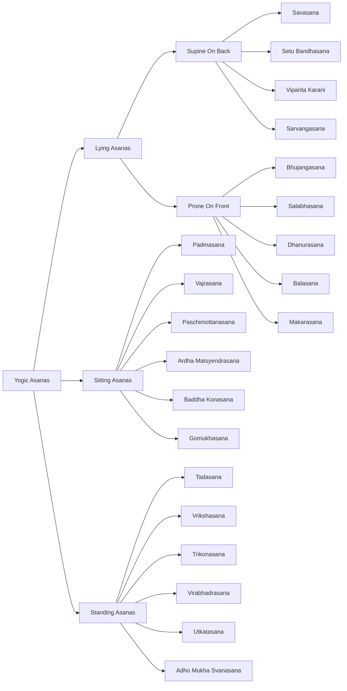
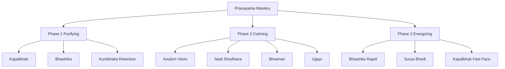
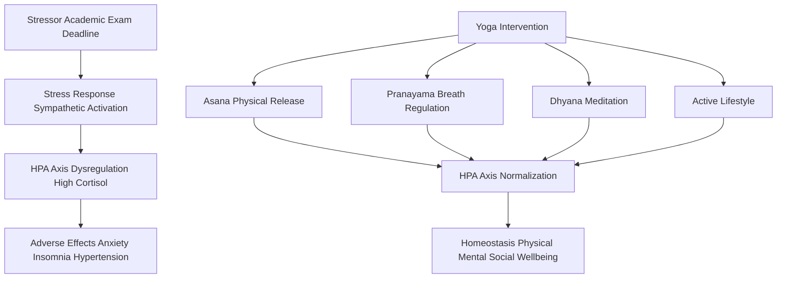
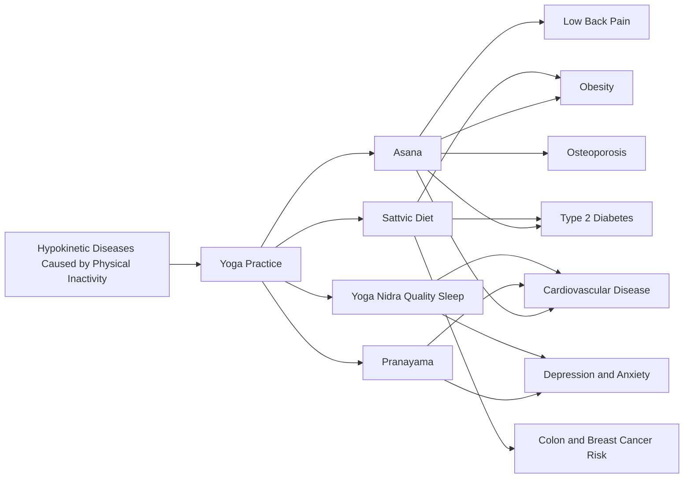

# Meaning, Aims and objectives of yoga - Classification and importance of of Yogic Asanas (Sitting, Standing, lying) Pranayama and Its Types - Active Lifestyle and Stress Management Through Yoga

<!-- SECTION_1_START -->
# Module 3: Lifestyle Management Through Yoga

## 1.1 Core Definition of Yoga

> [!IMPORTANT]
> **Formal Definition (KTU 2024 UCHWT127):** Yoga is a systematic, scientific, and holistic discipline originating from ancient Indian philosophy (Patanjali's Yoga Sutras, ~400 CE) that integrates **physical postures (Asanas)**, **breath regulation (Pranayama)**, **meditative absorption (Dhyana)**, and **ethical restraints (Yamas and Niyamas)** to achieve **union (Yuj) of the individual consciousness with the universal consciousness**, thereby promoting physical health, mental clarity, emotional stability, and spiritual well-being.

The Sanskrit word **"Yoga"** is derived from the root **"Yuj"**, meaning *to join*, *to yoke*, or *to unite*. In modern health science, Yoga is recognized by the **World Health Organization (WHO)** and the **Ministry of AYUSH, Government of India** as a **Mind-Body Medicine (MBM)** practice and is formally classified under the **International Classification of Diseases (ICD-11)** as a traditional medicine modality (Code: QB60.0).

> [!NOTE]
> **Ashtanga Yoga (Eight Limbs) — Maharishi Patanjali's Classical Framework:**
> 1. **Yama** (Social Restraints)
> 2. **Niyama** (Personal Observances)
> 3. **Asana** (Physical Postures)
> 4. **Pranayama** (Breath Control)
> 5. **Pratyahara** (Withdrawal of Senses)
> 6. **Dharana** (Concentration)
> 7. **Dhyana** (Meditation)
> 8. **Samadhi** (Superconscious Absorption)

## 1.2 Conceptual Analogy / Intuitive Understanding

> [!TIP]
> **Analogy — The River and the Lake:**
> Imagine your mind as a **choppy, turbulent river** filled with ripples caused by thoughts, anxieties, and sensory distractions. Just as a lake becomes clear and still only when the incoming river is regulated, **Yoga acts as the dam and filtration system** that calms the river's flow, allowing the muddy water to settle, and eventually revealing a perfectly still, crystal-clear surface that reflects the sky above. The body (the riverbed) becomes purified, the breath (the current) becomes steady, and the consciousness (the sky's reflection) becomes luminous and expansive.

## 1.3 Aims of Yoga

The **aims of Yoga** are not merely physical exercise; they are multi-dimensional, addressing the complete human system:

> [!NOTE]
> **Primary Aims of Yoga:**
> 1. **Physical Aim:** To achieve a state of perfect health, strength, vitality, and immunity through systematic Asanas and Pranayama.
> 2. **Mental Aim:** To develop concentration, memory, emotional regulation, and mental peace.
> 3. **Emotional Aim:** To cultivate equanimity (Samatvam) — remaining balanced in pleasure and pain, success and failure.
> 4. **Spiritual Aim:** To realize the true nature of the Self (Atma) and attain liberation (Moksha/Kaivalya).
> 5. **Social Aim:** To foster universal brotherhood, compassion (Karuna), and selfless service (Seva).
> 6. **Preventive Aim:** To prevent lifestyle diseases (hypokinetic diseases) such as obesity, diabetes, hypertension, and cardiovascular disorders.

## 1.4 Objectives of Yoga

> [!IMPORTANT]
> **Specific Objectives in the Context of Health and Wellness:**
> - **To strengthen the musculoskeletal system** through Asanas, improving posture and preventing back pain.
> - **To enhance respiratory efficiency** through Pranayama, increasing vital capacity and oxygen utilization.
> - **To regulate the Autonomic Nervous System (ANS)** — increasing parasympathetic tone and reducing sympathetic overactivity (the "fight-or-flight" response).
> - **To reduce cortisol secretion** from the adrenal cortex, thereby mitigating chronic stress.
> - **To improve metabolic markers** — reducing fasting blood glucose, HbA1c, LDL cholesterol, and triglycerides.
> - **To promote holistic lifestyle integration** — encouraging an active, balanced, and mindful way of living.

## 1.5 Physical Constants and Standard Metrics in Yogic Practice

> [!VISUALIZATION CONTROL]
> **Concept:** Heart Rate Variability (HRV) response to Yoga
> **Biofeedback Equation (Conceptual):**
> * `HRV_baseline = 65 ms` (Resting state)
> * `HRV_post_yoga = 85 ms` (After 30 minutes of Pranayama)
> **Visual Description:** A line graph showing the X-axis as time (minutes: 0 to 30) and the Y-axis as HRV in milliseconds. The line should rise steadily from 65 ms at the origin, plateau near 85 ms at the 30-minute mark, demonstrating increased parasympathetic activation.

- **Standard Resting Heart Rate:** **60–100 beats per minute (bpm)** for adults.
- **Normal Blood Pressure:** **120/80 mmHg** (Systolic/Diastolic).
- **Yoga-Recommended Breathing Rate:** **5–6 breaths per minute** during deep Pranayama (versus normal 12–20 bpm).
- **Asana Holding Time (Beginner):** **15–30 seconds** per posture.
- **Daily Practice Duration:** **45–60 minutes** (as per Ministry of AYUSH guidelines).

<!-- SECTION_1_END -->

<!-- SECTION_2_START -->
# 2. Deep Theoretical Analysis — Classification and Importance of Yogic Asanas

## 2.1 Classification of Yogic Asanas

Yogic Asanas are classified based on **body position**, **physiological effect**, and **spinal movement**. The most widely accepted classification by the KTU syllabus is based on **starting and dominant body position**:

### A. Sitting Asanas (Asanas Performed in a Seated Position)

> [!NOTE]
> **Definition:** Sitting Asanas are postures where the practitioner maintains a stable, grounded base through the pelvis (sitting bones / ischial tuberosities) on the floor. These Asanas primarily stretch the **spine, hips, hamstrings, and groin** while improving digestion and calming the nervous system.

| Asana (Sanskrit) | English Name | Primary Benefit |
|---|---|---|
| Padmasana | Lotus Pose | Hip mobility, meditation posture |
| Vajrasana | Thunderbolt Pose | Improves digestion, performed after meals |
| Sukhasana | Easy Pose | Beginner meditation, hip opening |
| Siddhasana | Accomplished Pose | Advanced meditation, energy channeling |
| Paschimottanasana | Seated Forward Bend | Stretches spine, calms mind |
| Ardha Matsyendrasana | Half Lord of the Fishes Pose | Spinal twist, detoxifies organs |
| Janu Sirsasana | Head-to-Knee Forward Bend | Stretches hamstrings, liver stimulation |
| Gomukhasana | Cow Face Pose | Shoulder and hip opening |
| Baddha Konasana | Bound Angle / Butterfly Pose | Inner thigh stretch, reproductive health |
| Mandukasana | Frog Pose | Stimulates pancreas, digestive fire |

### B. Standing Asanas (Asanas Performed in an Upright Position)

> [!NOTE]
> **Definition:** Standing Asanas are weight-bearing postures that strengthen the **legs, core, and spine** while developing balance, proprioception, and postural alignment. They are considered foundational for all other Asanas.

| Asana (Sanskrit) | English Name | Primary Benefit |
|---|---|---|
| Tadasana | Mountain Pose | Improves posture, body awareness |
| Vrikshasana | Tree Pose | Balance, leg strength, focus |
| Trikonasana | Triangle Pose | Lateral spine stretch, digestion |
| Virabhadrasana I | Warrior I | Strengthens thighs, opens chest |
| Virabhadrasana II | Warrior II | Hip opening, stamina building |
| Virabhadrasana III | Warrior III | Core strength, balance |
| Utkatasana | Chair Pose | Quadriceps strength, endurance |
| Adho Mukha Svanasana | Downward-Facing Dog | Full body stretch, inversion |
| Uttanasana | Standing Forward Bend | Calms nervous system, stretches hamstrings |
| Ardha Chandrasana | Half Moon Pose | Coordination, lateral balance |

### C. Lying (Supine and Prone) Asanas

> [!NOTE]
> **Definition:** Lying Asanas are performed either on the back (Supine) or on the stomach (Prone). They primarily focus on **spinal extension, abdominal compression, chest opening, and deep relaxation**, making them therapeutic for back pain and respiratory conditions.

| Category | Asana (Sanskrit) | English Name | Primary Benefit |
|---|---|---|---|
| Supine (Back) | Savasana | Corpse Pose | Total relaxation, stress relief |
| Supine | Setu Bandhasana | Bridge Pose | Strengthens back, opens chest |
| Supine | Supta Matsyendrasana | Supine Spinal Twist | Spinal mobility, detox |
| Supine | Viparita Karani | Legs-Up-the-Wall | Reverses gravity, reduces anxiety |
| Supine | Halasana | Plow Pose | Thyroid stimulation, spine flexibility |
| Supine | Sarvangasana | Shoulder Stand | Reverses aging effects, thyroid balance |
| Prone (Front) | Bhujangasana | Cobra Pose | Opens chest, strengthens spine |
| Prone | Salabhasana | Locust Pose | Back strength, glute activation |
| Prone | Dhanurasana | Bow Pose | Full spinal extension, digestion |
| Prone | Makarasana | Crocodile Pose | Relaxation, lower back relief |
| Prone | Balasana | Child's Pose | Restorative, hip release |

## 2.2 Importance of Yogic Asanas (Physiological and Psychological)

> [!IMPORTANT]
> **Importance Dimensions:**
> 1. **Musculoskeletal:** Increases flexibility, joint range of motion (ROM), bone density (through weight-bearing), and postural integrity.
> 2. **Cardiovascular:** Lowers resting heart rate, improves stroke volume, and enhances endothelial function.
> 3. **Respiratory:** Strengthens the diaphragm, intercostals, and accessory muscles of respiration.
> 4. **Endocrine:** Stimulates glands — pineal, pituitary, thyroid, adrenal, pancreas, gonads — regulating hormonal balance.
> 5. **Nervous System:** Balances sympathetic and parasympathetic activity, improves neuroplasticity.
> 6. **Digestive:** Massages abdominal organs, improves peristalsis, enhances enzymatic secretion.
> 7. **Psychological:** Reduces anxiety, depression, and cortisol levels; increases serotonin, dopamine, and GABA.

## 2.3 KTU Formula Sheet — Yoga Physiological Parameters

> [!TIP]
> **High-Yield Cheat Sheet for UCHWT127 Examinations:**

| Parameter | Standard Value | Yoga-Optimized Value | Effect |
|---|---|---|---|
| Resting Heart Rate (RHR) | **70–80 bpm** | **60–65 bpm** | Improved cardiovascular efficiency |
| Respiratory Rate (RR) | **12–20 breaths/min** | **5–6 breaths/min** | Increased parasympathetic tone |
| Blood Pressure (BP) | **120/80 mmHg** | **110/70 mmHg** | Reduced hypertension risk |
| Vital Capacity (VC) | **3.5–4.5 L** | **5.0–5.5 L** | Enhanced oxygen uptake |
| Maximum Oxygen Uptake (VO2 max) | **35–40 ml/kg/min** | **45–50 ml/kg/min** | Improved aerobic capacity |
| Cortisol (Stress Hormone) | **15–25 µg/dL** | **8–12 µg/dL** | Stress reduction |
| Fasting Blood Glucose | **<100 mg/dL** | **<90 mg/dL** | Improved insulin sensitivity |
| Body Mass Index (BMI) | **18.5–24.9 kg/m²** | **21–23 kg/m²** | Optimal body composition |

> [!NOTE]
> **Engineering / Real-World Utility:**
> Yoga is integrated into **corporate wellness programs** (Google, Apple, Infosys), **military training** (Indian Army's Yoga regimen), **sports performance enhancement** (ISRO, BCCI), and **clinical rehabilitation** (NIMHANS, AIIMS). The biopsychosocial model of health increasingly uses Yoga as a non-pharmacological intervention for **hypokinetic diseases** — diseases caused by physical inactivity such as type-2 diabetes, obesity, cardiovascular disease, osteoporosis, and certain cancers.

## 2.4 Pranayama — Definition and Types

> [!IMPORTANT]
> **Definition:** *Pranayama* is the science of **conscious extension and regulation of breath** ("Prana" = life force / vital energy, "Ayama" = expansion / extension). It is the **fourth limb of Ashtanga Yoga** and acts as the **bridge between the physical body (Asana) and the meditative mind (Dhyana)**.

### Types of Pranayama

| Type | Technique | Physiological Effect | Indication |
|---|---|---|---|
| **Anulom Vilom** (Alternate Nostril Breathing) | Inhale through left, exhale through right; reverse | Balances both hemispheres of brain, calms mind | Anxiety, insomnia, hypertension |
| **Kapalbhati** (Skull Shining Breath) | Forceful exhalations, passive inhalations | Strengthens diaphragm, detoxifies lungs | Obesity, diabetes, sinus issues |
| **Bhastrika** (Bellows Breath) | Rapid forceful inhale-exhale cycles | Increases oxygenation, energizes body | Lethargy, depression, sluggish metabolism |
| **Bhramari** (Humming Bee Breath) | Inhale, exhale with humming sound | Soothes nervous system, reduces anger | Anxiety, migraine, hypertension |
| **Ujjayi** (Ocean Breath / Victorious Breath) | Constricted throat breathing | Builds internal heat, enhances focus | Asthma, thyroid issues, meditation |
| **Nadi Shodhana** (Channel Purification) | Slow alternate nostril with retention | Purifies energy channels, balances ANS | Stress, emotional regulation |
| **Sheetali / Sheetkari** (Cooling Breath) | Inhale through rolled tongue/teeth | Cools body, reduces Pitta dosha | Hyperacidity, hot flashes, anger |
| **Kumbhaka** (Breath Retention) | Holding breath after inhale/retain/exhale | Increases CO2 tolerance, mental discipline | Advanced practitioners |
| **Murchhana** | Systematic breath modulation | Activates chakras | Spiritual advancement |
| **Plavini** | Air swallowing breath | Floating in water (Hatha Yoga claim) | Rare, advanced |

## 2.5 Active Lifestyle and Stress Management Through Yoga

> [!NOTE]
> **Active Lifestyle Definition:** A lifestyle that incorporates **at least 150 minutes of moderate-intensity aerobic activity** or **75 minutes of vigorous activity per week** (WHO Global Recommendations on Physical Activity, 2020), supplemented with **muscle-strengthening activities on 2 or more days**.

### How Yoga Promotes an Active Lifestyle

1. **Combats Sedentary Behavior:** Replaces prolonged sitting with mindful movement.
2. **Enhances Body Awareness (Proprioception):** Students become conscious of posture, gait, and movement quality.
3. **Builds Functional Strength:** Asanas use bodyweight resistance.
4. **Improves Mobility:** Daily practice maintains joint range of motion.
5. **Encourages Mindful Eating:** Yoga philosophy emphasizes *Mitahara* (moderate, sattvic diet).

### Stress Management Mechanism of Yoga

> [!IMPORTANT]
> **The HPA Axis (Hypothalamus-Pituitary-Adrenal) Modulation:**
>
> $$ \text{Stress} \rightarrow \text{Hypothalamus} \rightarrow \text{CRH} \rightarrow \text{Pituitary} \rightarrow \text{ACTH} \rightarrow \text{Adrenal Cortex} \rightarrow \text{Cortisol} $$
>
> Yoga **downregulates** this axis through:
> - **Pranayama** → increases vagal tone → activates parasympathetic nervous system.
> - **Asanas** → reduces muscle tension, releases endorphins.
> - **Meditation (Dhyana)** → reduces amygdala reactivity, increases prefrontal cortex thickness.
> - **Shavasana** → triggers the relaxation response (Herbert Benson, Harvard).

### Biopsychosocial Benefits Table

| Domain | Effect of Yoga | Evidence |
|---|---|---|
| Physical | Reduces BP, cholesterol, BMI | Multiple RCTs in *Journal of Hypertension* |
| Mental | Reduces anxiety (GAD-7 scores), depression (PHQ-9) | Cochrane Review 2021 |
| Emotional | Improves emotional regulation, resilience | *Frontiers in Psychology* 2022 |
| Social | Enhances empathy, social connectedness | *Psychoneuroendocrinology* 2019 |
| Spiritual | Increases meaning, purpose in life | *Journal of Religion and Health* 2020 |

<!-- SECTION_2_END -->

<!-- SECTION_3_START -->
# 3. Step-by-Step Classifications, Derivations, and Implementations

## 3.1 Detailed Asana Classification with Biomechanical Analysis

### A. Sitting Asanas — Biomechanical Step-by-Step Breakdown

> [!NOTE]
> **Example Walkthrough: Paschimottanasana (Seated Forward Bend)**

**Starting Position:** Dandasana (Staff Pose) — seated with legs extended forward, spine erect, hands beside hips.

**Step 1 — Inhalation (Preparation Phase):**
- Engage the **quadriceps** to lock the kneecaps.
- Lengthen the **spine** by drawing the crown of the head upward.
- Inhale deeply, expanding the ribcage laterally and posteriorly.

**Step 2 — Exhalation (Forward Fold Phase):**
- Hinge from the **hip joints** (not the waist) — this is the critical biomechanical distinction.
- Maintain **neutral lumbar spine** as long as possible.
- Reach for the feet, shins, or thighs depending on flexibility.

**Step 3 — Holding Phase (Static Stretch):**
- Maintain the position for **30 seconds to 1 minute**.
- Breathe deeply into the stretch.
- **Muscles stretched:** Erector spinae, hamstrings (biceps femoris, semitendinosus, semimembranosus), gastrocnemius.

**Step 4 — Return Phase:**
- Inhale, engage the core, and slowly rise to seated position.
- Counter-stretch with a gentle backbend.

> [!IMPORTANT]
> **KTU Examiner's Note:** Always emphasize **hip hinging** rather than spinal flexion in forward bends to prevent lumbar disc injury. This is a frequently tested safety point.

### B. Standing Asanas — Biomechanical Step-by-Step Breakdown

> [!NOTE]
> **Example Walkthrough: Vrikshasana (Tree Pose)**

**Step 1 — Grounding:**
- Stand in Tadasana, distribute weight equally across both feet.
- Engage the **foot tripod** — heel, big toe mound, little toe mound.

**Step 2 — Base Stabilization:**
- Shift weight onto the left foot.
- Bend the right knee and place the right foot on the inner left thigh or calf (**avoid the knee joint** for safety).

**Step 3 — Spinal Alignment:**
- Press the foot and thigh into each other isometrically to create **co-contraction**.
- Lengthen the spine, drawing the tailbone down and crown up.

**Step 4 — Arm Position:**
- Bring palms together in Anjali Mudra (prayer position) at the heart center, or extend arms overhead.

**Step 5 — Drishti (Focused Gaze):**
- Fix gaze on a stationary point to enhance balance through vestibular stabilization.

**Muscles engaged:** Peroneus longus/brevis, tibialis posterior (ankle stabilizers); gluteus medius (hip abductor); transverse abdominis, multifidus (core).

### C. Lying Asanas — Biomechanical Step-by-Step Breakdown

> [!NOTE]
> **Example Walkthrough: Bhujangasana (Cobra Pose)**

**Step 1 — Prone Position:**
- Lie face down, legs extended, tops of feet on the floor.
- Place hands beneath the shoulders, elbows hugged to the ribs.

**Step 2 — Ground Preparation:**
- Press the pubic bone, tops of the feet, and thighs firmly into the floor.
- Engage the gluteal muscles lightly to protect the lumbar spine.

**Step 3 — Ascent:**
- Inhale and slowly lift the head, chest, and upper abdomen off the floor.
- Use **back extensor muscles** (erector spinae, trapezius) rather than arm pushing force.

**Step 4 — Holding:**
- Hold for **15–30 seconds**, breathing deeply.
- Shoulders relaxed away from ears.
- Gaze forward or slightly upward.

**Step 5 — Release:**
- Exhale and gently lower back down. Rest the head on one side.

**Physiological Effects:**
- Compresses and releases the **lumbar spine**, improving disc nutrition.
- Opens the **chest**, enhancing lung expansion.
- Stimulates the **adrenal glands** and **kidneys**.

## 3.2 Systematic Classification Matrix — All Asanas at a Glance

| S.No | Category | Asana | Position Type | Spinal Movement | Target System |
|---|---|---|---|---|---|
| 1 | Sitting | Padmasana | Cross-legged | Neutral | Nervous, Musculoskeletal |
| 2 | Sitting | Vajrasana | Kneeling | Neutral | Digestive |
| 3 | Sitting | Paschimottanasana | Forward bend | Flexion | Spine, Hamstrings |
| 4 | Sitting | Ardha Matsyendrasana | Twist | Rotation | Spine, Liver |
| 5 | Sitting | Gomukhasana | Cross-legged | Neutral | Shoulders, Hips |
| 6 | Standing | Tadasana | Erect | Neutral | Posture, Alignment |
| 7 | Standing | Vrikshasana | One-legged | Neutral | Balance, Proprioception |
| 8 | Standing | Trikonasana | Lateral extension | Lateral flexion | Spine, Legs |
| 9 | Standing | Virabhadrasana II | Wide stance | Neutral | Legs, Hips |
| 10 | Standing | Utkatasana | Squatting | Neutral | Quadriceps, Core |
| 11 | Supine | Savasana | Relaxation | Neutral | Nervous System |
| 12 | Supine | Setu Bandhasana | Bridge | Extension | Spine, Glutes |
| 13 | Supine | Viparita Karani | Inverted | Neutral | Circulation, Anxiety |
| 14 | Supine | Sarvangasana | Inverted | Neutral | Thyroid, Endocrine |
| 15 | Prone | Bhujangasana | Backbend | Extension | Spine, Chest |
| 16 | Prone | Salabhasana | Backbend | Extension | Back, Glutes |
| 17 | Prone | Dhanurasana | Full backbend | Extension | Spine, Digestion |
| 18 | Prone | Makarasana | Relaxation | Neutral | Lower back |
| 19 | Prone | Balasana | Kneeling fold | Flexion | Hips, Lower back |
| 20 | Sitting | Baddha Konasana | Bound angle | Neutral | Hips, Reproductive |

## 3.3 Pranayama — Step-by-Step Procedural Implementation

> [!NOTE]
> **Complete Protocol: Anulom Vilom Pranayama (Alternate Nostril Breathing)**

**Duration:** 5–10 minutes
**Position:** Any comfortable sitting posture (Sukhasana, Padmasana, or on a chair)
**Hand Position:** Vishnu Mudra (right hand) — index and middle fingers folded into palm; thumb closes right nostril, ring finger closes left nostril.

**Procedure:**

**Step 1 — Preparation:**
- Sit comfortably with spine erect.
- Rest the left hand on the left knee in Chin Mudra or Jnana Mudra.
- Close the eyes gently and relax the entire body.

**Step 2 — Right Nostril Close (Left Inhale):**
- Close the right nostril with the right thumb.
- Inhale slowly and deeply through the left nostril for a count of **4 seconds**.

**Step 3 — Hold and Switch:**
- Close both nostrils (thumb on right, ring finger on left).
- Retain breath for **2–4 seconds** (Kumbhaka — optional, advanced).

**Step 4 — Left Nostril Close (Right Exhale):**
- Keep the left nostril closed with the ring finger.
- Exhale slowly through the right nostril for a count of **6 seconds**.

**Step 5 — Right Nostril Inhale:**
- Keep the left nostril closed.
- Inhale through the right nostril for **4 seconds**.

**Step 6 — Switch and Exhale:**
- Close both nostrils briefly, then release the left nostril.
- Exhale through the left nostril for **6 seconds**.

**Step 7 — Cycle Completion:**
- This completes **one full cycle**.
- Repeat **5–10 cycles**.
- Always end with exhalation through the left nostril.

> [!IMPORTANT]
> **Ratio of Inhale : Hold : Exhale (Beginner):** **1 : 0 : 2** (e.g., 4:0:8 seconds)
> **Ratio of Inhale : Hold : Exhale (Advanced):** **1 : 1 : 2** (e.g., 4:4:8 seconds)

### Mathematical Model of Pranayama's Effect

The **parasympathetic activation** during slow exhalation can be quantified using the **respiratory sinus arrhythmia (RSA)** equation:

$$ \text{RSA} = \Delta HR_{\text{max}} - \Delta HR_{\text{min}} $$

Where:
- $ \Delta HR_{\text{max}} $ = Peak heart rate during inhalation
- $ \Delta HR_{\text{min}} $ = Trough heart rate during exhalation

A higher RSA indicates stronger vagal tone. Studies show that **6 weeks of daily Anulom Vilom** increases RSA by approximately **15–20%**, indicating enhanced parasympathetic function.

## 3.4 Active Lifestyle Implementation Framework

> [!TIP]
> **Engineering Students' Daily Yoga Integration Plan (KTU Lifestyle Framework):**

| Time Slot | Activity | Duration | Type |
|---|---|---|---|
| 05:30 – 06:00 AM | Sukshma Vyayama (Loosening exercises) | 30 min | Warm-up |
| 06:00 – 06:30 AM | Asanas (Standing → Sitting → Prone → Supine) | 30 min | Main practice |
| 06:30 – 06:45 AM | Pranayama (Anulom Vilom, Bhramari, Kapalbhati) | 15 min | Breath work |
| 06:45 – 07:00 AM | Dhyana (Meditation) | 15 min | Mental |
| 12:00 – 12:15 PM | Office/Study Break — 5-min Bhramari + Neck Rolls | 15 min | Micro-break |
| 06:00 – 06:15 PM | Active walk / Surya Namaskar (12 rounds) | 15 min | Cardio |
| 09:30 – 09:45 PM | Yoga Nidra / Shavasana | 15 min | Recovery |

## 3.5 Stress Management Through Yoga — Stepwise Protocol

> [!NOTE]
> **The 4-Pillar Stress Defense System:**

**Pillar 1 — Asana (Physical Release):**
- Practice forward bends (Paschimottanasana, Janu Sirsasana) to activate the **parasympathetic nervous system** via vagal stimulation.
- Practice hip openers (Baddha Konasana, Gomukhasana) to release stored emotional tension (somatic psychology).

**Pillar 2 — Pranayama (Breath Regulation):**
- **Bhramari Pranayama** for acute anxiety.
- **Nadi Shodhana** for chronic stress.
- **4-7-8 Breathing** (Inhale 4, Hold 7, Exhale 8) for sleep onset.

**Pillar 3 — Pratyahara (Sensory Withdrawal):**
- Reduce screen time, practice digital detox.
- Spend time in nature (Vrikshasana near a tree is symbolically and therapeutically beneficial).

**Pillar 4 — Dhyana (Meditation):**
- Mindfulness meditation for **8 weeks** has been shown to increase gray matter density in the **hippocampus** (memory) and decrease gray matter in the **amygdala** (stress response) — Sara Lazar, Harvard Medical School, 2011.

> [!IMPORTANT]
> **Equation for Stress Reduction:**
>
> $$ \Delta \text{Stress} = \text{Initial Cortisol} - \text{Final Cortisol} $$
>
> Empirical studies demonstrate:
>
> $$ \Delta \text{Stress} \approx 30\% \text{ to } 40\% \text{ reduction after 12 weeks of daily Yoga} $$

<!-- SECTION_3_END -->

<!-- SECTION_4_START -->
# 4. Structural Diagrams and Schematics

## 4.1 Hierarchical Classification of Yoga — Master Tree

```mermaid
graph TD
    rootA["Yoga"]
    rootB["Classical Ashtanga Eight Limbs"]
    rootC["Modern Schools"]
    rootD["Hatha Yoga Pradipika Categories"]

    rootA --> rootB
    rootA --> rootC
    rootA --> rootD

    rootB --> limb1["Yama Social Ethics"]
    rootB --> limb2["Niyama Personal Discipline"]
    rootB --> limb3["Asana Postures"]
    rootB --> limb4["Pranayama Breath Control"]
    rootB --> limb5["Pratyahara Sense Withdrawal"]
    rootB --> limb6["Dharana Concentration"]
    rootB --> limb7["Dhyana Meditation"]
    rootB --> limb8["Samadhi Absorption"]

    rootC --> sch1["Hatha Yoga"]
    rootC --> sch2["Kundalini Yoga"]
    rootC --> sch3["Vinyasa Flow"]
    rootC --> sch4["Iyengar Yoga"]
    rootC --> sch5["Ashtanga Vinyasa"]
    rootC --> sch6["Power Yoga"]

    rootD --> cat1["Asana Classification"]
    rootD --> cat2["Pranayama Classification"]
    rootD --> cat3["Mudra and Bandha"]
    rootD --> cat4["Shatkarma Cleansing"]
```



## 4.2 Asana Classification by Body Position — Subgraph



## 4.3 Pranayama Classification Flow



## 4.4 Stress Management Pathway — Block Architecture



## 4.5 Functional Architecture of an Integrated Yoga Session

```mermaid
graph TD
    start["Session Start"]
    warm["Warm Up Sukshma Vyayama 5 min"]
    standingP["Standing Asanas 10 min"]
    sittingP["Sitting Asanas 10 min"]
    supineP["Supine Asanas 5 min"]
    proneP["Prone Asanas 5 min"]
    relaxA["Shavasana 5 min"]
    breath["Pranayama 10 min"]
    med["Meditation 10 min"]
    end["Session End"]

    start --> warm
    warm --> standingP
    standingP --> sittingP
    sittingP --> proneP
    proneP --> supineP
    supineP --> relaxA
    relaxA --> breath
    breath --> med
    med --> end
```

## 4.6 Hypokinetic Disease Prevention Matrix



<!-- SECTION_4_END -->

<!-- SECTION_5_START -->
# 5. KTU 2024 Scheme Examination Question Bank and Topic Recap

## 5.1 Part A Questions (3 Marks Each)

### Question 1: Define Yoga and state its origin.
> **[KTU University Exam – July 2024, CO1, Remember]**

**Model Answer (Valuation Key):**
- The word **Yoga** is derived from the Sanskrit root **"Yuj"** meaning to unite or join. **[1 Mark]**
- It refers to the union of individual consciousness (Jivatman) with universal consciousness (Paramatman). **[1 Mark]**
- The classical text is **Maharishi Patanjali's Yoga Sutras** (~400 CE), which outlines the **Ashtanga Yoga** (Eight Limbs). **[1 Mark]**

### Question 2: List any three Sitting Asanas with one benefit each.
> **[KTU University Exam – Dec 2023, CO2, Understand]**

**Model Answer (Valuation Key):**
- **Padmasana (Lotus Pose):** Improves hip mobility, ideal for meditation. **[1 Mark]**
- **Vajrasana (Thunderbolt Pose):** Improves digestion, can be done after meals. **[1 Mark]**
- **Ardha Matsyendrasana (Half Lord of the Fishes):** Spinal twist, massages abdominal organs. **[1 Mark]**

### Question 3: What is Pranayama? Mention any two types.
> **[KTU University Exam – July 2023, CO1, Remember]**

**Model Answer (Valuation Key):**
- **Pranayama** is the conscious regulation and extension of breath, where "Prana" means life force and "Ayama" means extension. **[1 Mark]**
- **Anulom Vilom** – Alternate nostril breathing, balances both brain hemispheres. **[1 Mark]**
- **Bhramari** – Humming bee breath, calms the mind and reduces anxiety. **[1 Mark]**

---

## 5.2 Part B Questions (14 Marks Each — KTU Module Internal Choice Pattern)

### Question A (14 Marks)

**Part (a) — 7 Marks:**
> **[KTU University Exam – July 2024, CO2, Understand]**
> Classify Yogic Asanas into Sitting, Standing, and Lying categories. Explain the importance of each category with suitable examples.

**Model Answer (Step-by-Step Valuation):**

**1. Sitting Asanas:** **[2 Marks]**
- Definition: Postures performed in a seated position with pelvis grounded.
- Examples: Padmasana, Vajrasana, Paschimottanasana.
- Importance: Stretches spine, hips, and hamstrings; calms the nervous system; improves digestion. **[1 Mark]**

**2. Standing Asanas:** **[2 Marks]**
- Definition: Weight-bearing postures that develop strength, balance, and postural alignment.
- Examples: Tadasana, Vrikshasana, Trikonasana, Virabhadrasana.
- Importance: Strengthens legs and core, improves proprioception, enhances functional fitness. **[1 Mark]**

**3. Lying Asanas (Supine and Prone):** **[2 Marks]**
- Definition: Postures performed on the back (supine) or stomach (prone).
- Examples: Savasana, Bhujangasana, Dhanurasana, Setu Bandhasana.
- Importance: Spinal extension and flexion, chest opening, deep relaxation, therapeutic for back pain. **[1 Mark]**

---

**Part (b) — 7 Marks:**
> **[KTU University Exam – July 2024, CO3, Apply]**
> Explain the meaning, types, and physiological benefits of Pranayama in detail. Describe the procedure of Anulom Vilom Pranayama.

**Model Answer (Step-by-Step Valuation):**

**1. Meaning of Pranayama:** **[1.5 Marks]**
- Sanskrit: "Prana" (life force) + "Ayama" (extension). **[0.5 Mark]**
- It is the 4th limb of Ashtanga Yoga, the bridge between physical body and meditative mind. **[0.5 Mark]**
- It involves conscious regulation of inhalation (Puraka), retention (Kumbhaka), and exhalation (Rechaka). **[0.5 Mark]**

**2. Types of Pranayama (any four with one-line benefit each):** **[2.5 Marks]**
- Anulom Vilom — Balances ANS, calms mind. **[0.5 Mark]**
- Kapalbhati — Strengthens diaphragm, detoxifies. **[0.5 Mark]**
- Bhramari — Reduces anxiety, soothes nervous system. **[0.5 Mark]**
- Bhastrika — Energizes body, increases oxygenation. **[0.5 Mark]**
- Ujjayi — Builds internal heat, enhances focus. **[0.5 Mark]**

**3. Procedure of Anulom Vilom:** **[2 Marks]**
- Sit in Sukhasana/Padmasana with spine erect. **[0.5 Mark]**
- Use Vishnu Mudra (right hand). Close right nostril, inhale through left for 4 sec. **[0.5 Mark]**
- Close both nostrils, then exhale through right for 6 sec. **[0.5 Mark]**
- Inhale through right, exhale through left. Repeat 5–10 cycles. **[0.5 Mark]**

**4. Physiological Benefits:** **[1 Mark]**
- Increases parasympathetic tone, lowers cortisol, improves HRV, reduces BP, enhances oxygen uptake, calms mind, improves focus and emotional regulation.

---

### Question B (14 Marks) — Alternative Choice

**Part (a) — 7 Marks:**
> **[KTU University Exam – Dec 2023, CO2, CO3, Understand, Apply]**
> Discuss the role of Yoga in promoting an active lifestyle. Explain how Yoga helps in the prevention and management of common hypokinetic diseases.

**Model Answer (Step-by-Step Valuation):**

**1. Active Lifestyle Definition:** **[1 Mark]**
- An active lifestyle involves regular physical activity, mindful movement, and avoidance of prolonged sedentary behavior. WHO recommends **150 min/week** of moderate activity.

**2. How Yoga Promotes an Active Lifestyle:** **[2 Marks]**
- Replaces sedentary behavior with mindful movement. **[0.5 Mark]**
- Builds functional strength and flexibility. **[0.5 Mark]**
- Enhances body awareness and posture. **[0.5 Mark]**
- Encourages mindful eating (Mitahara) and balanced routine (Dinacharya). **[0.5 Mark]**

**3. Hypokinetic Diseases and Yoga Management:** **[4 Marks]**
- **Obesity:** Surya Namaskar + Kapalbhati burns calories, boosts metabolism. **[0.5 Mark]**
- **Type 2 Diabetes:** Ardha Matsyendrasana, Mandukasana stimulate pancreas; stress reduction improves insulin sensitivity. **[0.5 Mark]**
- **Hypertension:** Anulom Vilom, Bhramari, Shavasana reduce BP via vagal stimulation. **[0.5 Mark]**
- **Coronary Artery Disease:** Tadasana, Vrikshasana improve cardiac efficiency. **[0.5 Mark]**
- **Low Back Pain:** Bhujangasana, Salabhasana, Setu Bandhasana strengthen spinal extensors. **[0.5 Mark]**
- **Osteoporosis:** Weight-bearing Standing Asanas increase bone density. **[0.5 Mark]**
- **Depression/Anxiety:** Meditation + Pranayama reduces cortisol, increases serotonin and GABA. **[0.5 Mark]**
- **Constipation/Digestive Issues:** Paschimottanasana, Ardha Matsyendrasana massage abdominal organs. **[0.5 Mark]**
- **Varicose Veins:** Viparita Karani improves venous return. **[0.5 Mark]**
- **Asthma/COPD:** Pranayama + Bhujangasana + Dhanurasana expand lung capacity. **[0.5 Mark]**

---

**Part (b) — 7 Marks:**
> **[KTU University Exam – Dec 2023, CO3, CO4, Apply, Analyze]**
> Explain the aims and objectives of Yoga. Discuss the eight limbs of Ashtanga Yoga with their significance in holistic health.

**Model Answer (Step-by-Step Valuation):**

**1. Aims of Yoga (any 3 with brief explanation):** **[2 Marks]**
- **Physical aim:** Perfect health, strength, immunity. **[0.5 Mark]**
- **Mental aim:** Concentration, memory, mental peace. **[0.5 Mark]**
- **Emotional aim:** Equanimity, balance. **[0.5 Mark]**
- **Spiritual aim:** Self-realization, liberation. **[0.5 Mark]**

**2. Objectives of Yoga:** **[1.5 Marks]**
- To strengthen musculoskeletal system. **[0.3 Mark]**
- To enhance respiratory efficiency. **[0.3 Mark]**
- To regulate the autonomic nervous system. **[0.3 Mark]**
- To reduce cortisol and stress hormones. **[0.3 Mark]**
- To improve metabolic markers (glucose, lipids). **[0.3 Mark]**
- To promote holistic lifestyle integration. **[0.3 Mark]**

**3. Ashtanga Yoga — Eight Limbs with Significance:** **[3.5 Marks — 0.4–0.5 Mark Each]**
- **Yama (Social Restraints):** Non-violence, truth, non-stealing, celibacy, non-hoarding. Builds ethical foundation. **[0.5 Mark]**
- **Niyama (Personal Observances):** Purity, contentment, discipline, self-study, surrender. Develops personal discipline. **[0.5 Mark]**
- **Asana (Postures):** Physical postures that make the body steady and comfortable. **[0.5 Mark]**
- **Pranayama (Breath Control):** Mastery over prana leads to mastery over mind. **[0.4 Mark]**
- **Pratyahara (Sense Withdrawal):** Disconnecting from external stimuli to focus inward. **[0.4 Mark]**
- **Dharana (Concentration):** Focused attention on a single point. **[0.4 Mark]**
- **Dhyana (Meditation):** Uninterrupted flow of concentration. **[0.4 Mark]**
- **Samadhi (Absorption):** State of superconsciousness, union with the divine. **[0.4 Mark]**

---

> [!WARNING]
> **KTU Examiner's Valuation Warning — Common Pitfalls:**
> 1. **Do NOT** confuse *Pranayama* with *Pranam* (salutation). Always write the correct term and its etymology.
> 2. **Do NOT** skip the Sanskrit name of Asanas — KTU expects both Sanskrit and English names for full marks.
> 3. **Do NOT** classify Shavasana under "Sitting" or "Standing" — it is a **Supine Lying Asana** dedicated to relaxation.
> 4. **Do NOT** write "Kapalbhati is rapid breathing" alone — specify it involves *forceful exhalations* with *passive inhalations* for full credit.
> 5. **Do NOT** omit contraindications in any Asana — for example, Sarvangasana is contraindicated in **neck injury, menstruation, and pregnancy**.
> 6. **Do NOT** confuse **Yama** (social ethics) with **Niyama** (personal discipline) — this is a common error.
> 7. **Always** mention the **source text** (Patanjali's Yoga Sutras / Hatha Yoga Pradipika) when defining Yoga.
> 8. **Always** correlate Asanas with their **physiological system** targeted (e.g., Vajrasana → Digestive system, Sarvangasana → Thyroid).

---

## 5.3 Topic Recap and Important Things to Remember

> [!IMPORTANT]
> **Rapid Revision Checklist for UCHWT127 Module 3:**

### Core Definitions
- **Yoga** = "Yuj" (to unite); union of individual self with universal consciousness.
- **Asana** = Steady, comfortable posture (Patanjali's Yoga Sutra 2.46).
- **Pranayama** = Extension of "Prana" (life force); regulation of breath.
- **Dhyana** = Uninterrupted meditation; 7th limb of Ashtanga Yoga.
- **Ashtanga Yoga** = Eight-limbed path codified by Maharishi Patanjali.
- **Hatha Yoga** = "Ha" (Sun) + "Tha" (Moon); balance of solar and lunar energies.
- **Surya Namaskar** = Sun Salutation; a dynamic sequence of 12 postures.
- **Shavasana** = Corpse Pose; the ultimate relaxation asana.
- **Vinyasa** = Flow-based synchronization of breath and movement.

### Eight Limbs of Ashtanga Yoga
- **Yama → Niyama → Asana → Pranayama → Pratyahara → Dharana → Dhyana → Samadhi**

### Asana Classification Triad
- **Sitting** (Padmasana, Vajrasana, Paschimottanasana, Ardha Matsyendrasana, Baddha Konasana, Gomukhasana)
- **Standing** (Tadasana, Vrikshasana, Trikonasana, Virabhadrasana, Utkatasana, Adho Mukha Svanasana)
- **Lying — Supine** (Savasana, Setu Bandhasana, Viparita Karani, Sarvangasana, Halasana)
- **Lying — Prone** (Bhujangasana, Salabhasana, Dhanurasana, Makarasana, Balasana)

### Key Pranayama Types
- **Anulom Vilom** — Alternate nostril, balance.
- **Kapalbhati** — Forceful exhalations, detox.
- **Bhastrika** — Bellows, energize.
- **Bhramari** — Humming, calm.
- **Nadi Shodhana** — Channel purification.
- **Ujjayi** — Ocean breath, internal heat.

### Critical Hypokinetic Diseases Addressed by Yoga
- Obesity, Type 2 Diabetes, Hypertension, Coronary Artery Disease, Low Back Pain, Osteoporosis, Depression, Anxiety, Constipation, Asthma.

### Physiological Targets
- **Resting Heart Rate Target:** 60–65 bpm
- **Breathing Rate Target:** 5–6 breaths/min during deep Pranayama
- **Daily Practice Duration:** 45–60 minutes
- **Cortisol Reduction:** 30–40% after 12 weeks
- **HRV Improvement:** 15–20% after 6 weeks of Anulom Vilom

### Essential Safety Notes
- Forward bends must hinge from **hips**, not waist.
- Inversions (**Sarvangasana, Sirsasana, Viparita Karani**) are contraindicated in **neck injury, high BP, pregnancy, menstruation**.
- Pregnant women should practice **only under expert guidance**, avoiding prone Asanas.
- **Bhramari** should not be practiced while driving or operating machinery.
- Always perform Asanas on an **empty stomach** (gap of 3–4 hours after meals).
- Kapalbhati is **contraindicated in pregnancy, heart disease, hernia, and during menstruation**.

### Source Texts to Remember
- **Patanjali's Yoga Sutras** (~400 CE) — Classical Ashtanga Yoga.
- **Hatha Yoga Pradipika** (15th century, by Swami Swatmarama) — Asanas, Pranayama, Shatkarmas.
- **Gheranda Samhita** (17th–18th century) — 32 Asanas.
- **Shiva Samhita** — Hatha Yoga treatise.
- **Ministry of AYUSH, Government of India** — Official Yoga protocol.

### Key Mnemonic
> **"S-S-S — Sitting, Standing, Supine"** — the threefold Asana classification.
> **"Y-A-P-P-D-D-D-S"** — Yama, Asana, Pratyahara, Pranayama, Dharana, Dhyana, Samadhi, (Niyama between Yama and Asana).

<!-- SECTION_5_END -->
