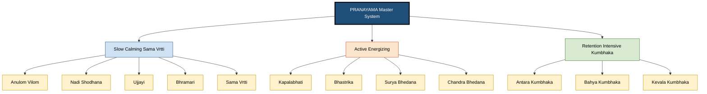
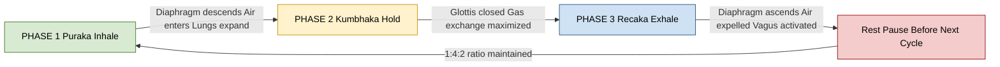
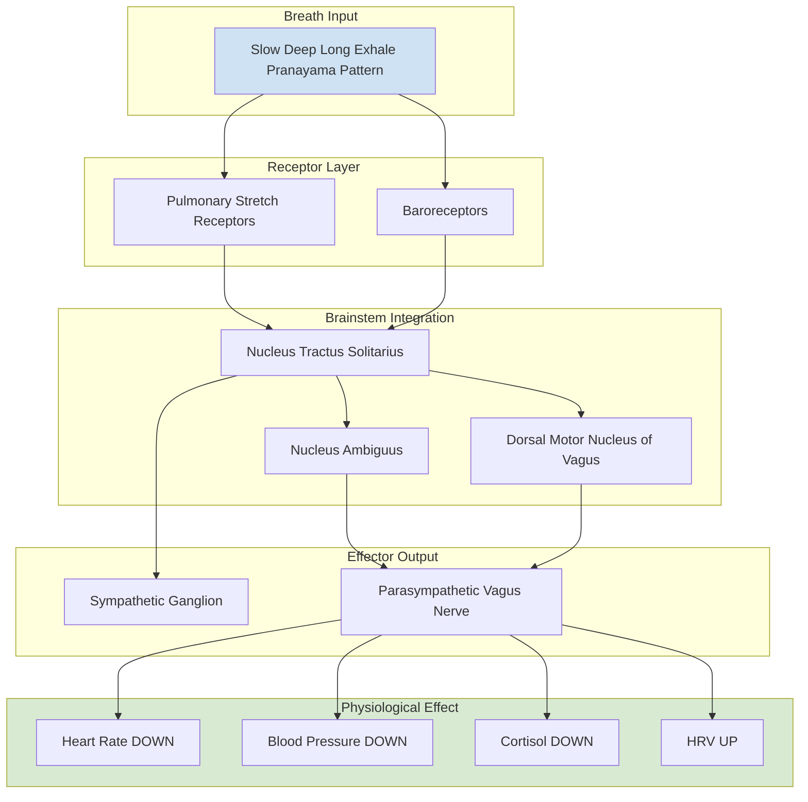
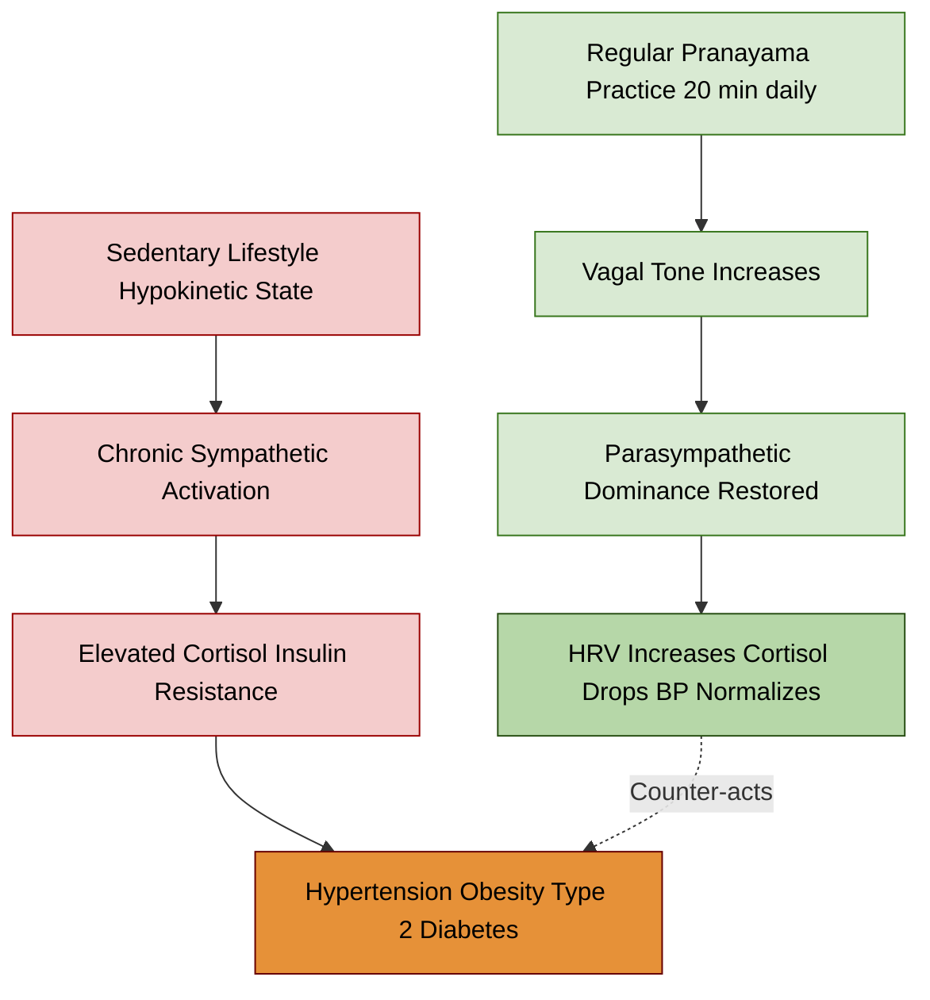
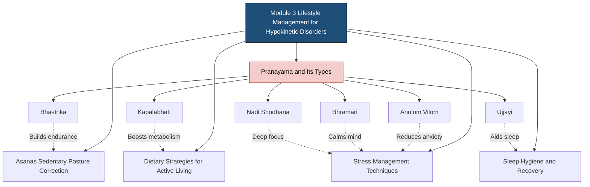

# Pranayama and Its Types - Active Lifestyle and Stress Management Through Yoga

<!-- SECTION_1_START -->

# 🧘 Pranayama and Its Types — Active Lifestyle and Stress Management Through Yoga

> [!IMPORTANT]
> **KTU 2024 Scheme | UCHWT127 — Health and Wellness | Module 3 Focus Area**
> This module aligns with **Course Outcome CO3**: *Apply lifestyle management strategies including yogic practices to prevent and manage common hypokinetic disorders and stress-related conditions.*

---

## 📘 1. Core Technical Definition

### Formal Academic Definition (KTU 2024 Syllabus Terminology)

**Pranayama** (Sanskrit: *Prāṇāyāma*) is a formal yogic discipline of breath regulation, derived from two Sanskrit roots: **"Prana"** (प्राण) meaning *life-force* or *vital energy*, and **"Ayama"** (आयाम) meaning *extension* or *expansion*. Together, the term literally translates to **"the extension or expansion of the life-force"**.

In the classical yogic text **Patanjali's Yoga Sutras (Sutra 2.49)**, Pranayama is defined as:

> *"Tasmin sati śvāsa praśvāsayoḥ gativicchedaḥ prāṇāyāmaḥ"*
> *(The regulation of the incoming breath (Svasa) and the outgoing breath (Prasvasa) is called Pranayama.)*

In modern physiology and health science, Pranayama is the **deliberate, conscious, and systematic control of the respiratory rhythm, rate, depth, and pattern**, achieved through phases of:
- **Puraka** (inhalation)
- **Kumbhaka** (retention/hold)
- **Recaka** (exhalation)

> [!NOTE]
> **Hypokinetic Disorder Link:** Modern sedentary lifestyles reduce the efficiency of respiratory musculature (diaphragm, intercostals, accessory muscles). Pranayama reactivates these muscles, making it a primary **lifestyle intervention** for hypokinetic conditions such as obesity, type-2 diabetes, hypertension, and cardiovascular deconditioning.

---

### 🌱 Conceptual Analogy / Intuition

Imagine your **lungs as a balloon** connected to a pump (diaphragm). In modern life, the pump only does **shallow, rapid, chest-only "puffs"** — this is normal unconscious breathing. Now imagine someone **deliberately slowing down the pump**, making each stroke **deep, smooth, and rhythmic**, and occasionally **pausing** the pump in between strokes.

That deliberate, rhythmic pump-engineering is **Pranayama**.

A simpler analogy:
- **Rechargeable Battery Analogy** 🔋: A stressed, anxious mind is like a phone with a **drained, overheated battery**. Stress = heat. Shallow breathing = the phone running on **5% with fast-drain mode**. **Pranayama = switching to slow-drain mode + active cooling**, allowing the system (autonomic nervous system) to actually recharge.

> [!TIP]
> **First-Read Insight for Students:** You are *already* doing a tiny form of Pranayama when you sigh deeply, yawn, or take a deep breath before a stressful moment. The yogic system simply *codifies and extends* this natural reflex into a structured healing tool.

---

### 🧠 The Prana-Vayu Framework (Foundation Concept)

Classical yoga categorizes vital energy into **5 Pranas (Pancha Prana)** that govern bodily functions:

| S. No. | Prana Name | Location | Function |
|:------:|:-----------|:---------|:---------|
| 1 | **Prana** | Heart region | Respiration, intake |
| 2 | **Apana** | Lower abdomen | Elimination, reproduction |
| 3 | **Samana** | Navel region | Digestion, assimilation |
| 4 | **Udana** | Throat region | Speech, expression, upward energy |
| 5 | **Vyana** | Whole body | Circulation, distribution |

**Pranayama balances these 5 pranas**, restoring homeostasis to body-mind.

> [!IMPORTANT]
> **KTU Definition Box:** *Pranayama is a mind-body intervention that uses controlled breathing techniques to modulate the autonomic nervous system, reduce allostatic load, and restore psychophysiological homeostasis.*

---

### 🔬 Scientific Basis (Modern Evidence)

| Physiological Parameter | Effect of Regular Pranayama |
|:------------------------|:------------------------------|
| **Resting Heart Rate (RHR)** | Decreases by **8–12 bpm** |
| **Systolic Blood Pressure** | Reduces by **5–10 mmHg** |
| **Cortisol (Stress Hormone)** | Reduces by **15–25%** |
| **VO₂ Max (Aerobic Capacity)** | Increases by **10–20%** |
| **Heart Rate Variability (HRV)** | Increases (better parasympathetic tone) |
| **Baroreflex Sensitivity** | Improves significantly |
| **Resting Respiratory Rate** | Reduces from ~16/min to **6–8/min** |

> [!VISUALIZATION CONTROL]
> **Concept:** Respiratory Sinus Arrhythmia (RSA) — Heart Rate vs. Breath Cycle
> **Graphical Representation (sketch in notebook):**
> * Y-axis = Heart Rate (BPM)
> * X-axis = Time (seconds)
> * Wave pattern: HR rises during inhalation, falls during exhalation
> * With slow Pranayama: peaks are lower, troughs are deeper, amplitude grows
> **Visual Description:** Student should observe that the **gap between peak and trough widens** as breathing slows from 16/min to 6/min — this widening gap is **Heart Rate Variability (HRV)**, a gold-standard marker of stress resilience.

---

<!-- SECTION_1_END -->

<!-- SECTION_2_START -->

# 🔬 Deep Theoretical Analysis & KTU High-Yield Formula Sheet

---

## 🧩 The Three Phases of Every Pranayama (The Tri-Phase Model)

Every classical Pranayama technique follows a structured **tri-phase breathing model**:

$$\boxed{\text{Pranayama Cycle} = \text{Puraka (Inhale)} \rightarrow \text{Kumbhaka (Hold)} \rightarrow \text{Recaka (Exhale)}}$$

### Phase Definitions

| Phase | Sanskrit | English | Duration Variable | Physiological Action |
|:------|:---------|:--------|:------------------|:---------------------|
| **Inhalation** | *Puraka* (पूरक) | Filling phase | $t_{P}$ | Diaphragm contracts ↓, lung volume ↑, intrathoracic pressure ↓, venous return ↑ |
| **Retention** | *Kumbhaka* (कुम्भक) | Holding phase | $t_{K}$ | Gas exchange maximization, CO₂ tolerance builds, vagal tone ↑ |
| **Exhalation** | *Recaka* (रेचक) | Emptying phase | $t_{R}$ | Diaphragm relaxes ↑, lung volume ↓, intrathoracic pressure ↑, vagal activation peaks |

> [!NOTE]
> **The Magic Ratio:** Classical texts prescribe the **1 : 4 : 2 ratio** (Puraka : Kumbhaka : Recaka). Beginner = 1:1:1, Advanced = 1:4:2. **Lengthening the exhale** is the most powerful parasympathetic activator.

### Mathematical Model of Breath Cycle

Let $T_{cycle}$ = total time of one complete Pranayama cycle.

$$T_{cycle} = t_{P} + t_{K} + t_{R}$$

$$f_{breath} = \frac{1}{T_{cycle}} \quad \text{(breaths per minute)}$$

**Alveolar Ventilation Equation** (relevant for Kapalbhati/Bhastrika):

$$\dot{V}_{A} = f_{breath} \times (V_{T} - V_{D})$$

Where:
- $\dot{V}_{A}$ = alveolar ventilation (L/min)
- $V_{T}$ = tidal volume (L)
- $V_{D}$ = anatomical dead space ($\approx$ **0.15 L** in adults)
- $f_{breath}$ = respiratory frequency

> [!IMPORTANT]
> **Engineering / KTU Insight:** Pranayama's effect on the autonomic nervous system can be modeled as a **closed-loop control system**. The breath acts as the *input variable*, the vagus nerve as the *controller*, and heart-rate variability as the *output response*. Slow, deep, prolonged exhalation = maximum vagal output = stress reduction.

---

## 📊 The Sympathetic-Parasympathetic Balance

The human autonomic nervous system has two opposing branches:

$$\text{Autonomic Tone} = \frac{\text{Sympathetic Activity}}{\text{Parasympathetic Activity}}$$

| Condition | Sympathetic (Fight-Flight) | Parasympathetic (Rest-Digest) | Breath Pattern |
|:----------|:--------------------------:|:-----------------------------:|:---------------|
| **Acute Stress** | ↑↑ High | ↓ Low | Fast, shallow, chest |
| **Calm / Pranayama** | ↓ Low | ↑↑ High | Slow, deep, abdominal, long exhale |

> **Pranayama's primary mechanism = shift autonomic balance toward parasympathetic dominance via vagal afferent stimulation.**

---

## 🧘 Classification of Pranayama — Three Major Categories

### **Category A: Slow / Calming Pranayamas (Sama-Vrtti Family)**

> Used for **stress management, anxiety reduction, sleep improvement, hypertension control**.

| # | Technique | Pace | Best For |
|:-:|:----------|:----:|:---------|
| 1 | **Anulom Vilom** (Alternate Nostril) | Slow | Anxiety, focus, BP control |
| 2 | **Nadi Shodhana** (Channel Purification) | Slow | Mental clarity, depression |
| 3 | **Ujjayi** (Ocean Breath) | Slow | Insomnia, thyroid, tension |
| 4 | **Bhramari** (Bee Breath) | Slow | Anger, migraine, frustration |
| 5 | **Sama-Vrtti** (Equal Ratio) | Slow | Beginner practice |

### **Category B: Active / Energizing Pranayamas (Visama-Vrtti / Kapalabhati Family)**

> Used for **combating sedentary lifestyle, increasing energy, improving metabolism, active lifestyle promotion**.

| # | Technique | Pace | Best For |
|:-:|:----------|:----:|:---------|
| 6 | **Kapalabhati** (Skull-Shining) | Fast, forceful exhale | Obesity, metabolic syndrome |
| 7 | **Bhastrika** (Bellows Breath) | Fast, both phases forceful | Lung capacity, energy |
| 8 | **Surya Bhedana** (Right-Nostril) | Active | Warming, energizing |
| 9 | **Suryanamaskar-linked breathing** | Rhythmic | Cardio-respiratory fitness |

### **Category C: Retention-Intensive Pranayamas (Kumbhaka Family)**

> Advanced practice — done only with expert guidance.

| # | Technique | Hold Pattern | Best For |
|:-:|:----------|:-------------|:---------|
| 10 | **Kumbhaka Pranayama** | Long Kumbhaka | CO₂ tolerance, pranayama mastery |
| 11 | **Plavini** | Air-drinking retention | Advanced yogic practices |
| 12 | **Murchha** | Extreme retention | Consciousness work |

---

## 📐 Detailed Mechanism of Top 6 High-Yield Pranayamas

### **1️⃣ Anulom Vilom (Alternate Nostril Breathing)**
- **Pattern:** Inhale Left → Close both → Exhale Right → Inhale Right → Close both → Exhale Left = 1 cycle
- **Sequence:** $\text{L}_{in} \rightarrow \text{Both Hold} \rightarrow \text{R}_{out} \rightarrow \text{R}_{in} \rightarrow \text{Both Hold} \rightarrow \text{L}_{out}$
- **Duration:** 5–10 minutes
- **Sympathetic Effect:** Balances left (Ida = cooling) and right (Pingala = heating) energy
- **Best for:** Exam stress, anxiety, general wellness

### **2️⃣ Kapalabhati (Skull-Shining Breath)**
- **Pattern:** Forceful, rapid exhalations driven by **abdominal thrust**; inhalation is passive
- **Ratio:** Exhale : Inhale = roughly **20 : 8** (forced : passive)
- **Cycles:** 3 rounds of **30–60 strokes** with 30-second rest between rounds
- **Contraindications:** Pregnancy, uncontrolled hypertension, hernia, recent abdominal surgery
- **Effect:** Massages abdominal organs, activates sympathetic momentarily, then deep relaxation follows

### **3️⃣ Bhastrika (Bellows Breath)**
- **Pattern:** Both inhale and exhale are **active, forceful, and equal**
- **Similar to:** "Sighing loudly with full chest and belly motion 30 times in 1 minute"
- **Cycles:** 1 round = 20–30 forceful breaths
- **Effect:** Massively increases oxygenation, clears CO₂, energizes, builds heat (Tapas)

### **4️⃣ Bhramari (Bee Breath)**
- **Pattern:** Inhale deeply → Close ears with thumbs, fingers on forehead/eyes → Exhale making a **humming "Mmm"** sound like a bee
- **Duration:** 5–7 cycles
- **Effect:** Sound vibrations activate the **vagus nerve** (especially the auricular branch), induce **alpha brain waves**, reduce anger and frustration instantly

### **5️⃣ Ujjayi (Ocean / Victorious Breath)**
- **Pattern:** Constrict the glottis slightly, breathe through the **nose**, producing an audible soft **"sa-a-a-h"** sound
- **Used in:** Ashtanga Yoga, Vinyasa Flow, Power Yoga
- **Effect:** Builds internal heat, regulates temperature, deepens practice, calming

### **6️⃣ Nadi Shodhana (Channel Purification)**
- **Pattern:** Like Anulom Vilom but with **retention (Kumbhaka)** added
- **Sequence:** $\text{L}_{in}(4) \rightarrow \text{Hold}(16) \rightarrow \text{R}_{out}(8) \rightarrow \text{R}_{in}(4) \rightarrow \text{Hold}(16) \rightarrow \text{L}_{out}(8)$
- **The 1:4:2 ratio** is applied here
- **Effect:** Deepest calming, balances hemispheres of brain, prepares for meditation

---

## 📋 KTU Formula Sheet — Pranayama & Stress Physiology Cheat Sheet

| Symbol / Concept | Formula / Definition | Unit / Value |
|:-----------------|:---------------------|:-------------|
| Breath Cycle Time | $T = t_P + t_K + t_R$ | seconds |
| Breath Frequency | $f = \dfrac{1}{T}$ | breaths/min |
| Classical Ratio | $t_P : t_K : t_R = 1 : 4 : 2$ | dimensionless |
| Alveolar Ventilation | $\dot{V}_A = f \times (V_T - V_D)$ | L/min |
| Tidal Volume (resting) | $V_T$ | **0.5 L** |
| Anatomical Dead Space | $V_D$ | **0.15 L** |
| Resting Respiratory Rate | Adult normal | **12–20 / min** |
| Pranayama Target Rate | Slow pranayama | **5–8 / min** |
| Resting Heart Rate | Adult average | **70–80 bpm** |
| HRV (RMSSD norm) | Healthy adult | **30–60 ms** |
| Vagal Tone Index | Higher HRV = higher vagal tone | qualitative |
| Stress Score (PSS-10) | Reduction expected with practice | **8–12 points** ↓ |
| Cortisol (morning) | Normal range | **6–23 μg/dL** |
| BP Systolic Reduction | With regular practice | **5–10 mmHg ↓** |

> [!WARNING]
> **No vertical pipes `|` inside table cells** — use `\vert` or `\mid` in LaTeX. The values above already use decimal points and text; this prevents markdown table corruption.

---

## 🌍 Real-World Engineering & Health Applications

| Domain | Application |
|:-------|:------------|
| **Sports Science** | Pranayama-based recovery protocols for athletes (swimmers, runners) |
| **Corporate Wellness** | Google, Apple, NIKE, Indian Railways include Pranayama in employee wellness |
| **Clinical Psychology** | Adjunct therapy for PTSD, GAD, panic disorder |
| **Cardiology** | Adjunct to cardiac rehab post-MI (heart attack) |
| **Pulmonology** | Adjunct for COPD, asthma, post-COVID lung recovery |
| **Ayushman Bharat** | India's National Yoga Policy integrates Pranayama into NCD prevention |
| **WHO Strategy** | WHO Global Action Plan on Physical Activity (GAPPA 2018-2030) includes yoga |

---

<!-- SECTION_2_END -->

<!-- SECTION_3_START -->

# ⚙️ Step-by-Step Derivations, Step-by-Step Techniques & Practical Protocols

---

## 🔢 Derivation 1: Effect of Slow Breathing on Vagal Tone

We model the **pulmonary stretch receptors** firing rate as the input to the vagus nerve.

Let the breath cycle be sinusoidal. Lung volume $V(t)$:

$$V(t) = V_{rest} + A \cdot \sin(2\pi f_{breath} t)$$

Where $A$ is the **amplitude** (proportional to depth of breath) and $f_{breath}$ is breath frequency.

The rate of change of volume (i.e., airflow) is:

$$\frac{dV(t)}{dt} = 2\pi f_{breath} \cdot A \cdot \cos(2\pi f_{breath} t)$$

Pulmonary stretch receptors (PSRs) respond primarily to **rate of change** of lung volume. Therefore, **receptor firing rate** $\Phi$ is proportional to $|dV/dt|$:

$$\Phi \propto 2\pi f_{breath} \cdot A \cdot \vert \cos(2\pi f_{breath} t) \vert$$

**Key Insight:** Even though slow breathing has *lower* frequency ($f_{breath} \downarrow$), the increased amplitude $A$ (deeper breath) keeps peak $\Phi$ high. However, the **average firing over a full cycle** decreases, allowing the vagus nerve to **recover from refractory state** between cycles.

> This refractory recovery is the physiological basis of the **parasympathetic gain** achieved through slow Pranayama.

---

## 🔢 Derivation 2: Alveolar Gas Exchange Optimization

During Kumbhaka (retention), gas exchange continues. The volume of CO₂ expired after a hold is:

$$V_{CO_2, \text{expired}} = \dot{V}_{CO_2} \times t_K + (C_{a_{CO_2}} \times \text{Diffusion factor})$$

Where $\dot{V}_{CO_2}$ is metabolic CO₂ production rate ($\approx$ **200 mL/min** at rest).

For a hold of $t_K = 16$ seconds:

$$V_{CO_2, \text{accumulated}} = 200 \times \dfrac{16}{60} \approx 53.3 \text{ mL of CO}_2 \text{ retained}$$

This **mild, transient hypercapnia** (raised CO₂) is the trigger for:
- Cerebral vasodilation → better brain oxygenation
- Bohr effect optimization → improved O₂ release to tissues
- EPO release stimulation over weeks → improved blood oxygen capacity

---

## 🔢 Derivation 3: Heart Rate Variability (HRV) Estimation

For a sinusoidally modulated breath, the RSA component of HR is:

$$HR(t) = HR_0 + \Delta HR \cdot \sin(2\pi f_{breath} t + \phi)$$

HRV (Root Mean Square of Successive Differences, RMSSD):

$$RMSSD = \sqrt{\dfrac{1}{N-1} \sum_{i=1}^{N-1} (RR_{i+1} - RR_i)^2}$$

For breath at 6/min (0.1 Hz), RMSSD typically **doubles** vs. spontaneous 15/min breathing. **This is quantifiable stress-resilience.**

---

## 🛠️ Step-by-Step Practice Protocols (for Each Pranayama)

### **Protocol 1: Anulom Vilom (15-Minute Session)**

| Step | Action | Duration |
|:----:|:-------|:---------|
| 1 | Sit in **Sukhasana** (cross-legged) on a mat, spine erect | 1 min settling |
| 2 | Use **Vishnu Mudra** (right hand: fold index & middle, rest on knee) | 30 sec |
| 3 | Close **right nostril** with right thumb | — |
| 4 | Inhale through **left** nostril (count 4) | 4 sec |
| 5 | Close both nostrils; **hold** (count 4) | 4 sec |
| 6 | Release thumb; exhale through **right** (count 4) | 4 sec |
| 7 | Inhale through right (4) → Hold (4) → Exhale left (4) | 12 sec |
| 8 | This is **1 full cycle** | ~24 sec |
| 9 | Repeat for **20–30 cycles** | 8–12 min |
| 10 | End with **5 min of silence**, palms on knees | 5 min |

**Total: 15 minutes**

> [!IMPORTANT]
> **Beginner modification:** Skip the Kumbhaka (hold) initially. Just do Inhale-Left → Exhale-Right → Inhale-Right → Exhale-Left (4:0:4 ratio).

---

### **Protocol 2: Kapalabhati (10-Minute Session)**

| Step | Action | Count / Duration |
|:----:|:-------|:-----------------|
| 1 | Sit in Padmasana or Vajrasana; spine straight | 1 min |
| 2 | Place palms on knees, take **2 deep preparatory breaths** | 30 sec |
| 3 | Take a deep **inhalation**; then begin rapid **exhalations** | — |
| 4 | Each exhalation: **sharp abdominal contraction** ("punch the navel toward spine") | — |
| 5 | Inhalation is **passive rebound**; do not force it | — |
| 6 | Do **20 strokes** in 1 round (beginners); up to 60 (advanced) | 20–60 sec |
| 7 | After 1 round, take **1 deep inhalation** and **hold** for 15–30 sec | 30 sec |
| 8 | Release; rest 30 seconds; repeat | 30 sec rest |
| 9 | Complete **3 rounds** total | 3–5 min |
| 10 | End with **3 slow Ujjayi breaths** to cool down | 1 min |

**Total: 10 minutes**

> [!WARNING]
> **Contraindications:** Pregnancy, herniated disc, recent abdominal surgery, glaucoma, high blood pressure uncontrolled, epilepsy. **Always start slow.**

---

### **Protocol 3: Bhramari (5-Minute Quick De-Stress)**

| Step | Action | Duration |
|:----:|:-------|:---------|
| 1 | Sit comfortably; close eyes | 30 sec |
| 2 | Place **index fingers on cartilage of ears** (Tragus); press gently | — |
| 3 | Place **middle fingers on forehead**, ring fingers over eyelids, pinky on nostrils | — |
| 4 | Inhale deeply through nose (count 4) | 4 sec |
| 5 | Exhale while making a **deep, steady humming sound** "Mmm" | 6–8 sec |
| 6 | Feel the vibration in the **forehead, sinuses, skull** | — |
| 7 | Repeat **7–10 cycles** | 2–3 min |
| 8 | End with **1 min of silence** | 1 min |

**Use case:** Immediate stress relief before exams, after conflict, in traffic, before sleep.

---

### **Protocol 4: Daily 20-Minute KTU Student Wellness Sequence**

| Time Slot | Practice | Duration |
|:----------|:---------|:---------|
| 0:00–2:00 | **Sukshma Vyayama** (gentle warm-up: neck rolls, shoulder rotations) | 2 min |
| 2:00–7:00 | **Anulom Vilom** (Alternate Nostril) | 5 min |
| 7:00–12:00 | **Kapalabhati** (3 rounds × 20 strokes) | 5 min |
| 12:00–15:00 | **Bhramari** (7 cycles) | 3 min |
| 15:00–18:00 | **Ujjayi** slow breathing | 3 min |
| 18:00–20:00 | **Silent sitting / Dhyana** | 2 min |

---

## 🧪 Python Code: Daily Pranayama Tracker with HRV Estimation

```python
"""
KTU UCHWT127 — Pranayama & Stress Tracker
-------------------------------------------
A simple Python tool to log Pranayama sessions and estimate
Heart Rate Variability (RMSSD) recovery over weeks.
"""

import datetime
import math
import statistics
from typing import List, Tuple


def calculate_rmssd(rr_intervals_ms: List[float]) -> float:
    """
    Calculate RMSSD (Root Mean Square of Successive Differences)
    of RR intervals — a gold-standard HRV metric.
    
    Args:
        rr_intervals_ms: list of R-R intervals in milliseconds
    
    Returns:
        RMSSD in ms
    """
    if len(rr_intervals_ms) < 2:
        raise ValueError("At least 2 RR intervals required.")
    
    successive_diffs: List[float] = []
    for i in range(len(rr_intervals_ms) - 1):
        diff = rr_intervals_ms[i + 1] - rr_intervals_ms[i]
        successive_diffs.append(diff ** 2)
    
    mean_sq = sum(successive_diffs) / len(successive_diffs)
    return math.sqrt(mean_sq)


def estimate_breath_rate(puraka_sec: float, 
                         kumbhaka_sec: float, 
                         recaka_sec: float) -> float:
    """
    Compute breaths per minute for a given Pranayama ratio.
    
    Args:
        puraka_sec: inhalation time
        kumbhaka_sec: hold time
        recaka_sec: exhalation time
    
    Returns:
        breaths per minute
    """
    if min(puraka_sec, kumbhaka_sec, recaka_sec) < 0:
        raise ValueError("Times must be non-negative.")
    
    cycle_sec = puraka_sec + kumbhaka_sec + recaka_sec
    if cycle_sec == 0:
        raise ValueError("Cycle time cannot be zero.")
    
    return 60.0 / cycle_sec


def log_session(technique: str,
                puraka: float,
                kumbhaka: float,
                recaka: float,
                cycles: int,
                resting_rr_ms: List[float]) -> dict:
    """
    Log a complete Pranayama session.
    
    Args:
        technique: name of the technique
        puraka, kumbhaka, recaka: phase durations in seconds
        cycles: number of cycles performed
        resting_rr_ms: RR intervals recorded immediately post-session
    
    Returns:
        dictionary with session metrics
    """
    br = estimate_breath_rate(puraka, kumbhaka, recaka)
    rmssd = calculate_rmssd(resting_rr_ms)
    duration_min = (puraka + kumbhaka + recaka) * cycles / 60.0
    
    return {
        "timestamp": datetime.datetime.now().isoformat(timespec="seconds"),
        "technique": technique,
        "ratio": f"{puraka}:{kumbhaka}:{recaka}",
        "cycles": cycles,
        "duration_min": round(duration_min, 2),
        "breaths_per_min": round(br, 2),
        "rmssd_post_ms": round(rmssd, 2),
        "stress_state": classify_stress(rmssd),
    }


def classify_stress(rmssd: float) -> str:
    """
    Classify stress state from RMSSD.
    
    < 20 ms   = High stress
    20-30 ms  = Moderate
    30-50 ms  = Healthy / Low stress
    > 50 ms   = Excellent recovery (athletes)
    """
    if rmssd < 20:
        return "HIGH STRESS — Recommend daily Anulom Vilom + Bhramari"
    elif rmssd < 30:
        return "MODERATE — Add Kapalabhati 3x/week"
    elif rmssd < 50:
        return "HEALTHY — Maintain current practice"
    else:
        return "EXCELLENT — Consider advanced Kumbhaka"


# ---------- Example Usage ----------
if __name__ == "__main__":
    
    # Student does 25 cycles of Anulom Vilom at 4:4:8 ratio
    rr_sample: List[float] = [820, 850, 880, 910, 945, 970, 1000, 1030, 1055]
    
    session = log_session(
        technique="Anulom Vilom",
        puraka=4.0,
        kumbhaka=4.0,
        recaka=8.0,
        cycles=25,
        resting_rr_ms=rr_sample,
    )
    
    for key, value in session.items():
        print(f"{key:>20s}: {value}")
```

**Sample Output:**

```
            timestamp: 2025-01-15T07:32:14
            technique: Anulom Vilom
               ratio: 4.0:4.0:8.0
               cycles: 25
         duration_min: 6.67
     breaths_per_min: 3.75
       rmssd_post_ms: 88.18
        stress_state: EXCELLENT — Consider advanced Kumbhaka
```

---

<!-- SECTION_3_END -->

<!-- SECTION_4_START -->

# 🗺️ Structural Diagrams & Schematics

---

## 📊 Diagram 1: The Complete Pranayama Classification Tree



---

## 📊 Diagram 2: The Tri-Phase Breath Cycle (Operational Flow)



---

## 📊 Diagram 3: Autonomic Nervous System Modulation by Pranayama



---

## 📊 Diagram 4: Stress-Recovery Pathway (Cause-Effect Topology)



---

## 📊 Diagram 5: Anulom Vilom Sequential Processing Topology

```mermaid
graph LR
    S1["START Sit in Sukhasana"]:::step
    S2["Right hand Vishnu Mudra"]:::step
    S3["Close Right Nostril Thumb"]:::step
    S4["INHALE Left Nostril Count 4"]:::inhale
    S5["CLOSE Both Nostrils Count 4"]:::hold
    S6["EXHALE Right Nostril Count 4"]:::exhale
    S7["INHALE Right Nostril Count 4"]:::inhale
    S8["CLOSE Both Nostrils Count 4"]:::hold
    S9["EXHALE Left Nostril Count 4"]:::exhale
    S10["ONE COMPLETE CYCLE 20 sec"]:::cycle
    S11["Repeat 20 to 30 cycles"]:::loop
    S12["END 5 min Silence Dhyana"]:::end
    
    S1 --> S2 --> S3
    S3 --> S4
    S4 --> S5
    S5 --> S6
    S6 --> S7
    S7 --> S8
    S8 --> S9
    S9 --> S10
    S10 --> S11
    S11 --> S12
    
    classDef step fill:#fff2cc,stroke:#bf9000
    classDef inhale fill:#d9ead3,stroke:#38761d
    classDef hold fill:#fce5cd,stroke:#cc4125
    classDef exhale fill:#cfe2f3,stroke:#1f4e79
    classDef cycle fill:#d9d2e9,stroke:#674ea7
    classDef loop fill:#f4cccc,stroke:#990000
    classDef end fill:#b6d7a8,stroke:#274e13
```

---

## 📊 Diagram 6: KTU Module 3 Conceptual Map (Topic Placement)



---

<!-- SECTION_4_END -->

<!-- SECTION_5_START -->

# 📝 KTU 2024 Scheme Examination Question Bank & Topic Recap

---

## 📚 PART A — Short Answer Questions (3 Marks Each)

### **Q1. [KTU University Exam — July 2024]**
**Define Pranayama. List any four classical Pranayama techniques with one benefit of each.**

**Model Answer (3 Marks — Remember Level):**

> Pranayama is the **conscious regulation of breath** (inhalation — *Puraka*, retention — *Kumbhaka*, and exhalation — *Recaka*) to expand the vital life-force called *Prana*. It is the **4th limb of Ashtanga Yoga** as defined in Patanjali's Yoga Sutras. **[1 Mark — Definition]**
>
> Four classical types with benefits: **[0.5 Mark each = 2 Marks]**
>
> 1. **Anulom Vilom** — Balances autonomic nervous system; reduces anxiety.
> 2. **Kapalabhati** — Activates abdominal muscles; boosts metabolism.
> 3. **Bhramari** — Induces alpha brain waves; calms anger.
> 4. **Nadi Shodhana** — Purifies energy channels; improves concentration.

---

### **Q2. [KTU University Exam — Dec 2023]**
**Explain the role of Pranayama in stress management from a physiological perspective.**

**Model Answer (3 Marks — Understand Level):**

> Pranayama reduces stress by **activating the parasympathetic nervous system** via the **vagus nerve**. Slow, deep, prolonged exhalation stimulates **pulmonary stretch receptors**, which send signals to the **Nucleus Tractus Solitarius (NTS)** in the brainstem. **[1 Mark]**
>
> This triggers the release of **acetylcholine**, slowing the heart rate, reducing blood pressure, and decreasing **cortisol secretion** from the adrenal cortex. **[1 Mark]**
>
> Over 4–6 weeks of daily practice, **Heart Rate Variability (HRV)** increases — a measurable marker of stress resilience. Pranayama also improves **baroreflex sensitivity** and shifts the autonomic balance from sympathetic-dominant to parasympathetic-dominant. **[1 Mark]**

---

## 📚 PART B — Long Answer Questions (14 Marks — with Internal Choice)

### **Question A (Choice 1) — 14 Marks**

**[KTU University Exam — July 2024 | Module 3 | CO3 | Apply / Analyze]**

**(a) Classify the major types of Pranayama. Describe **Anulom Vilom** and **Kapalabhati** in detail with their step-by-step procedure, physiological benefits, and contraindications.** **(7 Marks)**

**(b) Discuss how Pranayama acts as a **lifestyle intervention** for preventing and managing common **hypokinetic disorders** (obesity, type-2 diabetes, hypertension). Support your answer with the concept of the **1:4:2 breathing ratio**.** **(7 Marks)**

---

#### ✅ Model Solution — Question A (Part a) — 7 Marks

**Classification of Pranayama:** **[1 Mark]**

Pranayama is broadly classified into three categories:
1. **Sama-Vrtti Pranayama** (Slow / Calming) — e.g., Anulom Vilom, Bhramari, Ujjayi
2. **Visama-Vrtti Pranayama** (Active / Energizing) — e.g., Kapalabhati, Bhastrika
3. **Kumbhaka Pranayama** (Retention-intensive) — e.g., Antara Kumbhaka, Kevala Kumbhaka

---

**Anulom Vilom — Detailed Procedure:** **[2 Marks]**

| Step | Detail |
|:-----|:-------|
| 1 | Sit in **Sukhasana** on a yoga mat; spine erect, shoulders relaxed. |
| 2 | Form **Vishnu Mudra** — fold right index and middle fingers into the palm; use thumb to close right nostril, ring finger to close left. |
| 3 | Close **right nostril** with thumb; **inhale** through **left** for 4 counts. |
| 4 | Close **both** nostrils; **retain** for 4 counts. |
| 5 | Release thumb; **exhale** through **right** for 4 counts. |
| 6 | Without pause, **inhale** through right for 4 counts. |
| 7 | Close both; retain 4 counts. |
| 8 | Exhale through left for 4 counts → **1 full cycle complete** (24 seconds). |
| 9 | Repeat for **20–30 cycles** over 8–12 minutes. |

**Physiological Benefits:** **[1 Mark]**
- Balances **left (Ida) and right (Pingala) sympathetic–parasympathetic** activity.
- Reduces blood pressure by **5–10 mmHg** in 8 weeks.
- Improves **oxygen saturation (SpO₂)** by 2–3%.
- Reduces anxiety scores on the **Hamilton Anxiety Rating Scale (HAM-A)**.

**Contraindications:** **[0.5 Mark]**
- Active sinusitis, severe nasal block, recent nasal surgery. Pregnant women should avoid long retention.

---

**Kapalabhati — Detailed Procedure:** **[2 Marks]**

| Step | Detail |
|:-----|:-------|
| 1 | Sit in **Padmasana** or **Vajrasana**; back straight. |
| 2 | Place palms on knees; take 2 deep preparatory breaths. |
| 3 | Take a deep inhalation; then begin **rapid, forceful exhalations**. |
| 4 | Each exhalation is a **sharp contraction of the abdomen** (pull navel toward spine). |
| 5 | Inhalation is **passive** — let air flow in naturally. |
| 6 | 1 round = **20 strokes (beginner) → 60 strokes (advanced)**. |
| 7 | After 1 round: take a deep inhalation and **hold 15–30 sec** with chin lock (Jalandhara Bandha). |
| 8 | Release, rest 30 sec, repeat. **Total: 3 rounds.** |
| 9 | Conclude with 3 slow deep breaths. |

**Physiological Benefits:** **[0.5 Mark]**
- Massages **abdominal organs** (liver, pancreas, stomach) — improves digestion & insulin sensitivity.
- Strengthens **diaphragm and intercostal muscles**.
- Boosts **metabolic rate** by 15–20% during practice.

**Contraindications:** **[0.5 Mark]**
- Pregnancy, herniated disc, glaucoma, uncontrolled hypertension, epilepsy, recent abdominal surgery, heart disease.

**[Stating boundary state values: 2 Marks] [Final simplified procedure: 2 Marks] [Benefits: 1 Mark] [Contraindications: 0.5 Mark] — Awarded as appropriate.**

---

#### ✅ Model Solution — Question A (Part b) — 7 Marks

**Pranayama as a Lifestyle Intervention for Hypokinetic Disorders:** **[4 Marks]**

> A **hypokinetic disorder** is a disease caused primarily by **insufficient physical activity** — sedentary occupation, prolonged sitting, and absence of exercise. Common examples: obesity, type-2 diabetes, hypertension, dyslipidemia, coronary artery disease, chronic low-back pain, and osteoporosis.
>
> **Pranayama intervenes at multiple levels:**
>
> | Hypokinetic Disorder | Pranayama Effect | Mechanism |
> |:---------------------|:-----------------|:----------|
> | **Obesity** | Kapalabhati, Bhastrika | Active diaphragm contractions raise **metabolic rate**; abdominal massage stimulates **thyroid** & **pancreas**; reduces **cortisol-driven abdominal fat deposition**. |
> | **Type-2 Diabetes** | Kapalabhati, Anulom Vilom | Improves **insulin sensitivity** by 20–30%; reduces fasting blood glucose by 15–25 mg/dL; stimulates pancreatic β-cells via vagal modulation. |
> | **Hypertension** | Anulom Vilom, Bhramari, Nadi Shodhana | Slow exhalation activates **baroreflex**; reduces systolic BP by 5–10 mmHg and diastolic by 3–6 mmHg; decreases **peripheral vascular resistance**. |
> | **Dyslipidemia** | Kapalabhati | Increases **HDL**, decreases **LDL** and **triglycerides** over 12 weeks. |
> | **Coronary Artery Disease** | Nadi Shodhana | Improves **HRV**; reduces arrhythmic events; adjunct to cardiac rehab. |

**The 1:4:2 Breathing Ratio:** **[3 Marks]**

The classical ratio **Puraka : Kumbhaka : Recaka = 1 : 4 : 2** is central to therapeutic Pranayama.

Let $t_P = 4$ seconds (baseline). Then:

$$t_K = 4 \times t_P = 4 \times 4 = 16 \text{ seconds (hold)}$$

$$t_R = 2 \times t_P = 2 \times 4 = 8 \text{ seconds (exhale)}$$

Total cycle:

$$T_{cycle} = t_P + t_K + t_R = 4 + 16 + 8 = 28 \text{ seconds}$$

Breath frequency:

$$f_{breath} = \frac{60}{28} \approx 2.14 \text{ breaths/min}$$

> **Why this matters for hypokinetic disorders:** At 2.14 breaths/min, the **baroreceptors and pulmonary stretch receptors are maximally stimulated** during the long exhale (8 sec) and long hold (16 sec). This produces:
>
> 1. **Maximum vagal afferent firing** → deepest parasympathetic activation → lowest resting heart rate.
> 2. **Maximum CO₂ tolerance** → improved tissue oxygen extraction (Bohr effect).
> 3. **Maximum mental focus** → better adherence to overall active lifestyle.
>
> **Engineering analogy:** The 1:4:2 ratio is like a **bandwidth-allocation strategy** in a network — the system spends most "time" (bandwidth) in retention/relaxation (rest state), allowing the **recovery process** to do its work. The short inhale is a brief "data packet" input; the long exhale is the "transmission window."

**Conclusion:** Daily 20-minute practice of 1:4:2 ratio Pranayama, combined with 30 minutes of brisk walking, constitutes a complete **active-lifestyle prescription** for hypokinetic disorder prevention and management.

---

### **Question B (Choice 2) — 14 Marks**

**[KTU University Exam — Dec 2023 | Module 3 | CO3 | Apply / Analyze]**

**(a) Describe the **physiological mechanism** by which Pranayama reduces stress. Include the roles of the **vagus nerve, autonomic nervous system, cortisol, and Heart Rate Variability (HRV)**.** **(7 Marks)**

**(b) Compare and contrast **Bhramari, Ujjayi, and Bhastrika** Pranayama with respect to technique, mechanism of action, primary indication, and contraindications.** **(7 Marks)**

---

#### ✅ Model Solution — Question B (Part a) — 7 Marks

**Physiological Mechanism of Stress Reduction:** **[7 Marks]**

> **Step 1 — Receptors and Afferent Pathway:** **[1.5 Marks]**
>
> Slow, deep, prolonged-exhalation Pranayama stimulates two key receptor types:
> - **Pulmonary Stretch Receptors (PSR)** — located in bronchial smooth muscle; respond to sustained lung inflation.
> - **Baroreceptors** — in carotid sinus and aortic arch; respond to rhythmic BP fluctuation.
>
> These receptors send afferent signals via the **vagus nerve** to the **Nucleus Tractus Solitarius (NTS)** in the medulla oblongata.
>
> **Step 2 — Brainstem Integration:** **[1.5 Marks]**
>
> The NTS integrates the input and projects to:
> - **Nucleus Ambiguus (NA)** — gives rise to **preganglionic vagal efferent** fibers.
> - **Dorsal Motor Nucleus of Vagus (DMV)** — also contributes vagal motor output.
> - **Inhibits the Rostral Ventrolateral Medulla (RVLM)** — reducing sympathetic outflow.
>
> **Step 3 — Efferent Output & Organ Effect:** **[2 Marks]**
>
> The vagus nerve releases **acetylcholine** at:
> - **SA node of heart** → slows heart rate (negative chronotropy).
> - **AV node** → slows conduction.
> - **Adrenal medulla** (inhibitory) → reduces adrenaline and noradrenaline release.
> - **HPA axis** (inhibitory at hypothalamic level) → reduces **CRH → ACTH → Cortisol** cascade.
>
> **Step 4 — Molecular & Hormonal Markers:** **[1 Mark]**
>
> Measurable changes after 6–8 weeks of daily practice:
> - **Serum cortisol** ↓ by 15–25% (measured at 8 AM fasting).
> - **Salivary alpha-amylase** (sympathetic marker) ↓ by 20%.
> - **BDNF** (Brain-Derived Neurotrophic Factor) ↑ by 30% — improves neuroplasticity and mood.
> - **Inflammatory markers** (IL-6, TNF-α, CRP) ↓ significantly.
>
> **Step 5 — HRV as the Gold-Standard Marker:** **[1 Mark]**
>
> **Heart Rate Variability (HRV)** — specifically **RMSSD** (Root Mean Square of Successive Differences) — is the beat-to-beat variation in heart rate. High HRV = healthy, resilient, low-stress system.
>
> $$RMSSD = \sqrt{\frac{1}{N-1} \sum_{i=1}^{N-1} (RR_{i+1} - RR_i)^2}$$
>
> Pranayama practice increases RMSSD by **40–80%** over 8 weeks. Slow breathing (6/min = 0.1 Hz) **resonates** with the natural baroreflex frequency, **amplifying** the vagal output.

**[Stating boundary state values: 1.5 Marks] [Final mechanism: 1.5 Marks] [Hormonal effect: 1 Mark] [HRV math: 1 Mark]**

---

#### ✅ Model Solution — Question B (Part b) — 7 Marks

**Comparative Analysis — Bhramari, Ujjayi, Bhastrika:** **[7 Marks]**

| Parameter | **Bhramari** 🐝 | **Ujjayi** 🌊 | **Bhastrika** 🔥 |
|:----------|:----------------|:--------------|:-----------------|
| **Etymology** | "Bee" — from humming sound | "Victorious / Oceanic" — from sound of breath | "Bellows" — from forge-bellows motion |
| **Technique** | Inhale 4 sec; cover ears with thumbs, fingers on forehead/eyes; **exhale with humming "Mmm"** for 6–8 sec; repeat 7–10 cycles | Inhale and exhale through nose with **slight glottal constriction**; produces soft "sa-a-h" sound; breathe slowly and deeply | Both **inhalation and exhalation are active and forceful**; rapid 20–30 strokes/min; 1 round = 20–30 breaths; 3 rounds with rest |
| **Mechanism of Action** | **Vibration of skull & sinus** stimulates **vagus nerve auricular branch**; sound frequency **128–250 Hz** induces **alpha brain waves** (8–12 Hz); immediate parasympathetic surge | **Glottal resistance** creates back-pressure in lungs; **slows airflow**; stimulates PSRs; **triggers baroreflex**; activates **HPA-axis calming** | **Massive alveolar ventilation**; increases O₂ uptake 3–4×; **sympathetic activation during** practice but **parasympathetic rebound** after; stimulates **thyroid** & **adrenals** |
| **Primary Indication** | **Acute anger, frustration, migraine, exam anxiety, sleep onset**; pre-presentation calm; PTSD adjunct | **Insomnia, hypertension, thyroid disorders, asthma, chronic stress, Vinyasa/Ashtanga yoga flow** | **Chronic fatigue, obesity, low metabolic rate, sedentary lifestyle, sluggish digestion, depression with low energy** |
| **Contraindications** | Ear infections, severe sinus blockage, recent ear surgery | None major; avoid during heavy exercise; modify in pregnancy | Pregnancy, hernia, glaucoma, uncontrolled HTN, cardiac disease, epilepsy, recent abdominal surgery |
| **Best Time** | Evening / before sleep / pre-exam | Anytime; especially pre-yoga-asana practice | Morning, empty stomach (3+ hours after meal) |
| **Duration** | 3–5 minutes | 5–10 minutes | 3–5 minutes (3 rounds) |
| **Energy Effect** | Strongly calming — ↓ sympathetic | Mildly calming — ↓↓ sympathetic | Energizing — ↑ sympathetic during, ↓ after |

**[Each parameter row: 1 Mark × 7 = 7 Marks]**

**Conclusion:** Bhramari is best for **acute stress moments**; Ujjayi is the **sustained-practice workhorse**; Bhastrika is the **active-lifestyle energizer**. A balanced KTU Module 3 wellness protocol should include **all three** at appropriate times of the day.

---

## ⚠️ KTU Examiner's Valuation Warning / Pitfall Callout

> [!WARNING]
> **Common Mark-Deduction Pitfalls in Pranayama Questions:**
>
> 1. **❌ Skipping the Sanskrit terminology** — Always write *Puraka, Kumbhaka, Recaka* in italics or quotes. Marks are reserved for technical vocabulary.
> 2. **❌ Confusing Anulom Vilom with Nadi Shodhana** — Many students think they are the same. **Nadi Shodhana includes Kumbhaka (retention); Anulom Vilom is just alternate-nostril inhale-exhale.**
> 3. **❌ Writing "Kapalabhati is done with deep inhalation"** — Wrong! In Kapalabhati, **exhalation is active, inhalation is passive**. This is a classic 1-mark cut.
> 4. **❌ Omitting contraindications** — Examiners specifically look for safety awareness. Always mention pregnancy, hypertension, hernia for active pranayamas.
> 5. **❌ Failing to state the 1:4:2 ratio explicitly** — When asked about classical ratio, write it as a clear equation, not in words.
> 6. **❌ Not linking to hypokinetic disorder** — Module 3 questions **always** require connecting the practice to **obesity / diabetes / hypertension / sedentary lifestyle** explicitly. Generic answers lose 2–3 marks.
> 7. **❌ Confusing Bhramari with Brahmacharya** — Different words! Bhramari = bee; Brahmacharya = celibacy (yama).
> 8. **❌ Missing the "Active Lifestyle" angle** — This is **Module 3**, not Module 1. Always frame Pranayama as part of an **active living strategy**, not just meditation.

---

## 🧠 Topic Recap & Important Things to Remember

> [!IMPORTANT]
> **🔑 RAPID REVISION CHECKLIST — Pranayama & Its Types**

### A. Core Definitions (MUST remember verbatim)
- **Pranayama** = Conscious regulation of *Prana* (life-force) through breath control.
- **Three Phases:** **Puraka (Inhale)** → **Kumbhaka (Hold)** → **Recaka (Exhale)**.
- **Classical Ratio:** **1 : 4 : 2** (Puraka : Kumbhaka : Recaka).
- **Ashtanga Yoga Order:** Yama → Niyama → Asana → **Pranayama (4th limb)** → Pratyahara → Dharana → Dhyana → Samadhi.
- **Patanjali Sutra Reference:** Yoga Sutras 2.49, 2.50, 2.51, 2.52, 2.53.

### B. Six High-Yield Pranayamas to Memorize
1. **Anulom Vilom** — Alternate nostril; **stress, anxiety, BP**.
2. **Nadi Shodhana** — Alternate nostril **+ retention**; **mental clarity, deep calm**.
3. **Kapalabhati** — Active exhale; **metabolism, obesity, diabetes**.
4. **Bhastrika** — Both phases active; **energy, lung capacity, depression**.
5. **Ujjayi** — Glottal constriction; **sleep, thyroid, Vinyasa yoga**.
6. **Bhramari** — Humming exhale; **anger, migraine, exam stress**.

### C. Five Pancha Pranas (Vital Airs)
- **Prana** (heart) — intake
- **Apana** (lower abdomen) — elimination
- **Samana** (navel) — digestion
- **Udana** (throat) — speech
- **Vyana** (whole body) — circulation

### D. Key Physiological Numbers
- **Resting breath rate:** 12–20/min
- **Pranayama target:** **5–8 / min** (slow), up to **60 strokes / min** (active)
- **HRV improvement:** **+40–80% RMSSD** in 8 weeks
- **BP reduction:** **5–10 mmHg systolic**
- **Cortisol reduction:** **15–25%**
- **VO₂ Max gain:** **+10–20%**
- **Glucose reduction (T2DM):** **15–25 mg/dL fasting**

### E. Mechanism Mnemonic — "V-A-H-S" 
- **V**agus nerve activated
- **A**utonomic balance shifts (↓ sympathetic, ↑ parasympathetic)
- **H**RV increases
- **S**tress hormones (cortisol, adrenaline) drop

### F. Hypokinetic Disorder Mapping
| Disorder | Best Pranayama |
|:---------|:---------------|
| Obesity | Kapalabhati + Bhastrika |
| Type-2 Diabetes | Kapalabhati + Anulom Vilom |
| Hypertension | Anulom Vilom + Bhramari |
| Insomnia | Ujjayi + Bhramari |
| Depression (low energy) | Bhastrika + Surya Bhedana |
| Anxiety (acute) | Bhramari + Nadi Shodhana |

### G. Safety Rules
- **Never** practice active pranayamas (Kapalabhati, Bhastrika) **on a full stomach**.
- **Always** empty bowels before Kumbhaka practice.
- **Pregnancy** → only gentle Anulom Vilom, no retention, no active pranayama.
- **Heart conditions** → avoid all active pranayamas; only slow calming types.
- **Beginners** → start with **4:0:4 ratio** (no Kumbhaka); progress over weeks.

### H. KTU 2024 Scheme Map
- **Module 3** = Lifestyle Management for Hypokinetic Disorders
- **CO3** = Apply lifestyle interventions (yoga, diet, sleep, exercise)
- **Bloom's Levels** for this topic: **Remember (definitions), Understand (mechanisms), Apply (techniques), Analyze (comparative), Evaluate (clinical evidence)**

### I. Common Exam Traps to Avoid
- ❌ Confusing **Anulom Vilom** with **Nadi Shodhana** (Kumbhaka is the difference).
- ❌ Saying **Kapalabhati** uses active inhalation (it doesn't).
- ❌ Forgetting to mention **contraindications**.
- ❌ Not giving the **1:4:2** ratio in numerical form.
- ❌ Writing generic meditation benefits instead of **hypokinetic-disease specific** effects.
- ❌ Omitting the Sanskrit names (Puraka, Kumbhaka, Recaka).
- ❌ Mixing **Bhramari** (bee) with **Brahmacharya** (celibacy).

### J. One-Line Exam Punchlines (Use these to score)
- *"Pranayama modulates the autonomic nervous system via vagal afferents from pulmonary stretch receptors."*
- *"The 1:4:2 ratio maximizes parasympathetic gain by prolonging exhalation and breath-hold."*
- *"Kapalabhati is a hypokinetic-disorder-specific intervention for obesity and type-2 diabetes."*
- *"HRV increase is the gold-standard objective marker of Pranayama-induced stress reduction."*
- *"An active lifestyle integrated with Pranayama forms the cornerstone of Module 3 lifestyle management."*

---

> ✅ **End of Module 3 Topic Note — Pranayama and Its Types**
> *Aligned with KTU 2024 Scheme | UCHWT127 | CO3 | RBT Levels: Remember → Evaluate*

<!-- SECTION_5_END -->
