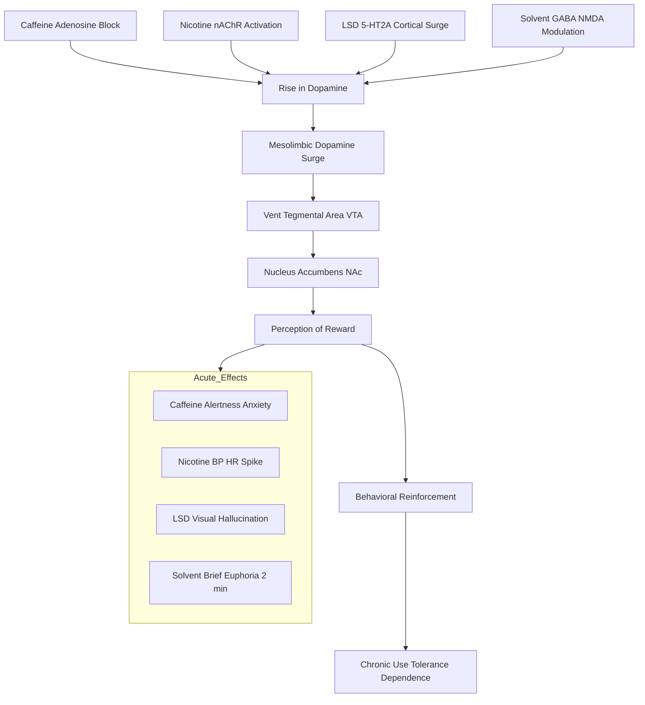
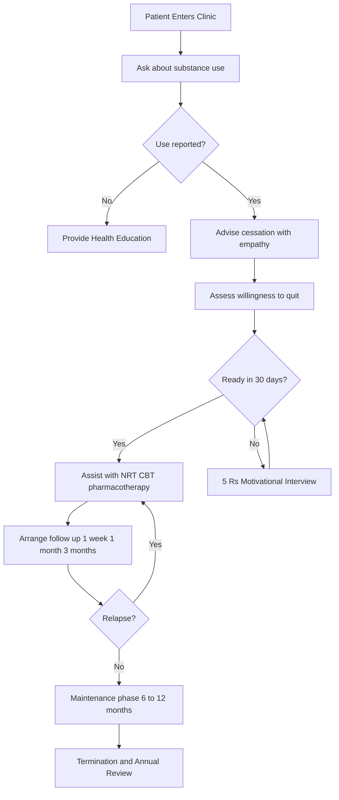
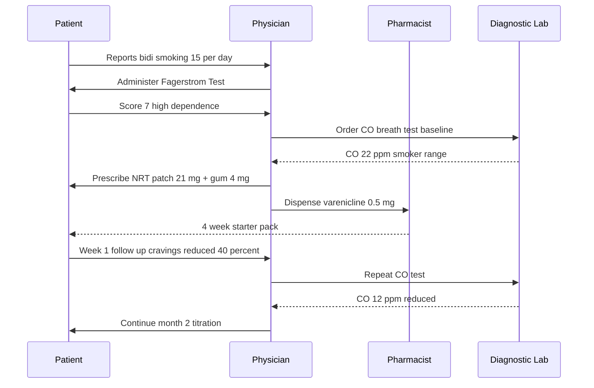

# stimulants, including caffeine -Hallucinogens -Tobacco -Volatile solvents.

<!-- SECTION_1_START -->
# Module 3 — Lifestyle Management Strategies: Substance Abuse Profile

## 1.1 Stimulants, Hallucinogens, Tobacco & Volatile Solvents

> [!IMPORTANT]
> **KTU 2024 Scheme Definition (Syllabus-aligned)**
> *Psychoactive substances* are chemical agents that alter central nervous system (CNS) function by modifying neurotransmitter release, reuptake, or receptor binding. Under the KTU UCHWT127 framework, four high-prevalence categories of **commonly misused substances** are studied: **Central Nervous System (CNS) Stimulants** (e.g., *caffeine*, amphetamines, cocaine), **Hallucinogens** (e.g., *LSD*, psilocybin, cannabis at high doses), **Tobacco** (*nicotine*-based products), and **Volatile Solvents** (inhalants such as toluene, acetone, nitrous oxide).

### Intuitive Analogy — The "Volume Knob" of the Brain

Think of your brain as a **car stereo system**:
- **Stimulants** = turn the volume **way UP** (more alertness, more anxiety, more heart rate).
- **Hallucinogens** = **scramble the radio station** (perception, vision, and reality become distorted).
- **Tobacco/Nicotine** = a **"repeat" button** that creates a craving loop.
- **Volatile Solvents** = a **short circuit** — they chemically dissolve brain fat for a few minutes of "buzz" then crash hard.

> [!NOTE]
> All four categories fall under the broader public health umbrella of **Substance Use Disorders (SUD)** as classified by the **DSM-5** and **ICD-11**. They are preventable lifestyle risk factors for **hypokinetic diseases** indirectly (via sedentary coping behavior) and directly (via cardiovascular and metabolic damage).

---

### 1.2 Caffeine — The World's Most Popular Stimulant

> [!IMPORTANT]
> **Caffeine (1,3,7-Trimethylxanthine)** is a *methylxanthine alkaloid* that acts as a **competitive antagonist at adenosine receptors** ($A_1$ and $A_{2A}$). It is the only psychoactive substance legally and socially sanctioned in nearly every culture on Earth.

**Mechanism (Simple Version):**
1. Adenosine is the brain's "tiredness signal." It binds to its receptor and tells you, *"You are sleepy."*
2. Caffeine has a molecular shape **almost identical** to adenosine.
3. Caffeine **blocks the adenosine receptor** so adenosine cannot dock.
4. The brain, fooled by the absence of the sleep signal, releases **adrenaline (epinephrine)** and **dopamine**.
5. Result: **alertness ↑, reaction time ↓ (faster), fatigue ↓**, but also **anxiety ↑, BP ↑, hand tremor ↑**.

**Health Benchmark Doses (FDA & EFSA standards):**

| Population | Safe Daily Limit | Source |
|---|---|---|
| Healthy adult | **$\leq 400$ mg/day** | U.S. FDA |
| Pregnant woman | **$\leq 200$ mg/day** | American College of Obstetricians |
| Adolescent (12–18 yr) | **$\leq 100$ mg/day** | American Academy of Pediatrics |

> [!WARNING]
> A single 250 mL cup of brewed coffee contains roughly **80–120 mg** of caffeine. Energy drinks (500 mL) may contain **160–240 mg**. *Caffeine Intoxication* (DSM-5) is diagnosed at **$\geq 1{,}000$ mg/day** with tachycardia, restlessness, and GI disturbance.

---

### 1.3 Hallucinogens — The "Perception Distorters"

> [!IMPORTANT]
> **Hallucinogens** are psychoactive substances that produce **perceptual anomalies, hallucinations, and altered cognition** without significant delirium or memory loss. They are sub-classified into **classic hallucinogens (serotonergic)** and **dissociative anesthetics (NMDA-antagonist type)**.

**Geometric Intuition — The Broken Mirror Analogy**
A hallucinogen is like looking into a **cracked mirror**. The reflection (your perception of reality) is still *you*, but the geometry is warped — colors are louder, time stretches, and edges breathe.

| Sub-class | Neuro Transmitter Target | Examples | Onset |
|---|---|---|---|
| Classic (Serotonergic 5-HT2A agonist) | Serotonin | *LSD, Psilocybin, DMT, Mescaline* | 20–60 min |
| Dissociative (NMDA antagonist) | Glutamate | *Ketamine, Phencyclidine (PCP), Dextromethorphan* | 5–30 min |
| Cannabimimetic (CB1 partial agonist) | Endocannabinoid | *Cannabis (high-THC), Spice, K2* | 5–15 min (inhaled) |

> [!NOTE]
> **LSD (Lysergic acid diethylamide)** is one of the most potent psychoactive chemicals known — active doses start at **$\mathbf{25\,\mu g}$** (micrograms). Compare this to caffeine's active dose of **$\mathbf{50{,}000\,\mu g}$ (50 mg)** — LSD is roughly **2,000× more potent by mass**.

---

### 1.4 Tobacco — The Engineered Addiction

> [!IMPORTANT]
> **Tobacco** is the dried leaf of *Nicotiana tabacum*. Its primary addictive alkaloid is **nicotine**, a **cholinergic agonist** at nicotinic acetylcholine receptors (nAChRs) with a **sub-second brain-reward latency** of **$\mathbf{7\text{–}10\text{ seconds}}$** per pulmonary inhalation.

**The Addiction Loop — Why It Is So Hard to Quit:**

$$ \text{Nicotine} \xrightarrow{\text{inhaled}} \text{Lungs} \xrightarrow{\text{7 sec}} \text{Brain} \xrightarrow{\text{nAChR bind}} \text{Dopamine release in NAc} \rightarrow \text{Reward} $$

A single cigarette delivers **$\sim 1$–$2$ mg** of nicotine to the brain. Tobacco smoke itself contains **> 7,000 chemicals**, of which **at least 70 are carcinogenic** (IARC Group 1), including *benzene, formaldehyde, arsenic, polonium-210, and nitrosamines*.

| Tobacco Form | Nicotine Delivery | Risk Profile |
|---|---|---|
| Cigarette (combusted) | 1–2 mg/cigarette | Lung cancer, COPD, CVD |
| Bidi (Indian) | 2–3 mg/bidi | Oral, lung, esophageal cancer |
| Hookah / Shisha | 1 mg/session (avg) | Shared infection + CVD risk |
| Smokeless (gutka, khaini) | 4–6 mg/use | Oral submucous fibrosis |
| Vape / E-cigarette | 0.5–15 mg/mL liquid | EVALI, adolescent gateway |

> [!WARNING]
> According to the **WHO Global Tobacco Epidemic Report 2023**, tobacco kills **> 8 million people per year**, with **$\sim 1.3$ million** deaths from *second-hand smoke exposure* alone. It is the **single largest preventable cause of non-communicable disease (NCD)** globally.

---

### 1.5 Volatile Solvents — The "Poor Man's High"

> [!IMPORTANT]
> **Volatile Solvents (Inhalants)** are **lipophilic, volatile hydrocarbons** that produce a brief euphoric "rush" by **dissolving the myelin sheaths and lipid bilayers** of CNS neurons. They are the **first substance of abuse** for many street-children and adolescents in low-income settings due to cheap legal availability.

**Mechanism:** Because these molecules are highly **lipid-soluble (high $\log P$ value)**, they cross the **blood-brain barrier (BBB)** in seconds, where they **fluidize neuronal membranes** and enhance GABA-A / inhibit NMDA transmission → rapid CNS depression followed by brief disinhibition.

| Common Inhalant | Source Product | Active Chemical |
|---|---|---|
| Toluene | Paint thinners, adhesives | Methylbenzene |
| Acetone | Nail polish remover | Propanone |
| N-Hexane | Industrial glue, gasoline | C6 hydrocarbon |
| Nitrous Oxide | Whipped-cream chargers, medical | $N_2O$ ("laughing gas") |
| Trichloroethylene | Industrial degreaser | TCE |

> [!VISUALIZATION CONTROL]
> **Concept:** *Concentration-vs-Time curve of a typical inhalant "rush"* (geometric representation of pharmacokinetics).
> **Desmos Input Equations:**
> * $C(t) = C_{max} \cdot e^{-k(t - t_{peak})}$ where $k = 0.8,\ C_{max}=100$
> **Visual Description:** A sharp spike from baseline **0** to peak concentration within **15–30 sec**, followed by an exponential decay back to baseline by **2–5 min**. This ultra-short duration is what drives **repeated dosing** and **binge-pattern** addiction.

<!-- SECTION_1_END -->

<!-- SECTION_2_START -->
# Deep Theoretical Analysis — Mechanism Matrix & KTU High-Yield Formula Sheet

## 2.1 The Four Substance Categories — Side-by-Side Mechanism Comparison

| Parameter | Caffeine (Stimulant) | Hallucinogen | Tobacco (Nicotine) | Volatile Solvent |
|---|---|---|---|---|
| **Primary Target** | Adenosine $A_1, A_{2A}$ (antagonist) | 5-HT$_{2A}$ (agonist) | nAChR $\alpha_4\beta_2$ (agonist) | GABA-A ↑, NMDA ↓, membrane fluidization |
| **Brain Entry Time** | 30–45 min (oral) | 20–60 min (oral) | **7–10 sec** (inhaled) | **5–15 sec** (inhaled) |
| **Peak Effect ($T_{max}$)** | 45–60 min | 1–2 h | 1–5 min | 15–30 sec |
| **Duration of Action** | 3–5 h | 6–12 h | 20–30 min (per puff) | 1–5 min |
| **Addiction Liability** | Low–Moderate | Low (no physiological withdrawal) | **Very High** (Fagerström $\geq 6$) | High (binge pattern) |
| **Legal Status (India)** | Legal (regulated) | Mostly Schedule I | Legal (taxed) | Legal (industrial) |
| **Withdrawal Syndrome** | Headache, fatigue, irritability | Mostly psychological (flashbacks) | Craving, anxiety, weight gain | Tremor, agitation, hallucinosis |
| **Lethal Dose ($LD_{50}$)** | $\sim 10$ g (oral, adult) | LSD: very high; *Amanita* muscaria: low | 40–60 mg pure nicotine | Variable (sudden sniffing death) |

---

## 2.2 Core Neurochemical Pathways (Why Each Substance Feels the Way It Feels)

### A. Stimulant Pathway — Caffeine / Cocaine / Amphetamines
$$ \text{Adenosine} \;\cancel{\;\rightarrow\; A_{1}R\;} \;\xrightarrow{\text{caffeine blocks}} \uparrow \text{cAMP} \rightarrow \uparrow \text{Dopamine, Norepinephrine} $$

**Why heart rate goes up:** Caffeine also **increases intracellular calcium** in cardiomyocytes via **ryanodine receptor sensitization**, increasing inotropy (force of contraction) by **$\sim 10\%$** at 200 mg dose.

### B. Hallucinogen Pathway — LSD / Psilocybin
$$ \text{LSD} \;\xrightarrow{\text{5-HT}_{2A}\text{ agonism}}\; \uparrow \text{Cortical layer V pyramidal firing} \rightarrow \text{Visual cortex cross-talk} \rightarrow \text{Hallucinations} $$

### C. Nicotine Pathway
$$ \text{Nicotine} \xrightarrow{\text{nAChR}} \uparrow \text{Dopamine}_{VTA \to NAc} + \uparrow \text{Endorphins} + \uparrow \text{Serotonin} \rightarrow \text{Reward} $$
The **Ventral Tegmental Area (VTA) → Nucleus Accumbens (NAc)** is the brain's universal **"reward highway."** All four substances, despite different receptors, ultimately **hijack this single dopaminergic pathway**.

### D. Volatile Solvent Pathway
$$ \text{Solvent (lipophilic)} \xrightarrow{\text{membrane fluidization}} \uparrow \text{GABA}_{A}\text{ Cl}^- \text{ influx} + \downarrow \text{NMDA Ca}^{2+} \rightarrow \text{CNS depression, euphoria} $$

> [!NOTE]
> **Engineering & Real-World Utility of This Knowledge:**
> 1. **Pharmacology Industry** — Designing receptor-specific drugs (e.g., varenicline as a *partial* nAChR agonist for smoking cessation).
> 2. **Toxicology & Occupational Health** — OSHA sets **Toluene Permissible Exposure Limit (PEL) = 200 ppm** (8-hr TWA) for industrial workers.
> 3. **Public Health Policy** — WHO Framework Convention on Tobacco Control (FCTC) 2003 is the first global health treaty.
> 4. **Sports Medicine & Doping** — Caffeine was on the WADA Prohibited List until 2004; it remains monitored.

---

## 2.3 KTU Formula Sheet & Quantitative Tools

| Concept | Formula / Threshold | Unit | Use Case |
|---|---|---|---|
| Caffeine half-life | $t_{1/2} = 3\text{–}5$ h | hours | Predict withdrawal onset |
| Nicotine Fagerström Test | $0\text{–}10$ scale; $\geq 6$ = high dependence | score | Cessation triage |
| Pack-Year (Smoking Index) | $PI = \dfrac{\text{cigarettes/day}}{20} \times \text{years smoked}$ | pack-years | COPD/lung cancer risk |
| BMI (Lifestyle co-marker) | $BMI = \dfrac{Weight_{(kg)}}{(Height_{(m)})^2}$ | kg/m$^2$ | Hypokinetic disease risk |
| Blood Alcohol Equivalent (for solvents) | $C_{toluene} \div 4 \approx C_{ethanol\,equiv}$ | mg/dL | Workplace toxicology |
| Cost of Smoking (Economic) | $C = N_{cigs/day} \times P_{pack} \div 20 \times 365$ | ₹ / year | Behavioral counseling |
| Carbon Monoxide (CO) in smokers | $CO_{expired} = 3\text{–}10 \times$ non-smoker | ppm | Cessation biomarker |
| Caffeine-to-Weight ratio | $\leq 6\, mg/kg$ body weight | mg/kg | Adolescent safety |

> [!IMPORTANT]
> **Boundary / Threshold Values to Memorize for KTU Board Exam:**
> * **Caffeine LD$_{50}$ (oral, rat):** $\mathbf{192\, mg/kg}$
> * **Nicotine LD$_{50}$ (oral, rat):** $\mathbf{50\, mg/kg}$
> * **Tobacco — single cigarette contains:** $\mathbf{1\text{–}2\, mg}$ nicotine, $\mathbf{10\text{–}15\, mg}$ tar
> * **Cannabis $\Delta^9$-THC intoxication threshold:** $\mathbf{2\text{–}5\, mg}$ (naïve user)
> * **Sudden Sniffing Death Syndrome (SSDS):** triggered within minutes of inhalant use, often by **ventricular fibrillation (VF)**.

<!-- SECTION_2_END -->

<!-- SECTION_3_START -->
# Step-by-Step Analysis — Comparative Case Frameworks & Application Matrices

## 3.1 Master Comparative Analysis Matrix (Engineering-style Mapping)

> [!IMPORTANT]
> The following is a **regulatory and systemic matrix** mapping each substance to its real-world **harm-pattern, target organ, withdrawal profile, and KTU-aligned lifestyle intervention strategy** — formatted as an exhaustive engineering case-framework table.

### Table A — Substance × Body System Impact Mapping

| Substance | CNS Impact | Cardiovascular | Respiratory | GI / Hepatic | Renal | Musculoskeletal | Skin / Cosmetic |
|---|---|---|---|---|---|---|---|
| **Caffeine (mild)** | Alertness, anxiety at high dose | Tachycardia, BP ↑ | Mild bronchodilation | Gastric acid ↑ | Diuresis ↑ | Tremor | None |
| **Amphetamine / Cocaine (severe)** | Psychosis, paranoia | MI, arrhythmia, dissection | Pulmonary HTN | Ischemic colitis | Rhabdomyolysis | Bruxism, stereotypy | Track marks (IV) |
| **LSD / Psilocybin** | Visual hallucinations, ego dissolution | Tachycardia (mild) | None direct | Nausea (psilocybin) | None | None | Pupil dilation |
| **Cannabis (THC)** | Short-term memory ↓, paranoia | Tachycardia, orthostatic ↓ | Bronchitis (smoked) | Cannabinoid hyperemesis (chronic) | None | None | Conjunctival injection |
| **Tobacco (nicotine)** | Dependence, withdrawal | Atherosclerosis, CAD | COPD, lung cancer | Peptic ulcer (smokers) | Bladder cancer | Osteoporosis | Premature aging, yellow teeth |
| **Volatile Solvents** | Cerebellar atrophy, dementia | "Sudden Sniffing Death" VF | Aspiration pneumonia | Hepatotoxicity (CCl$_4$) | Tubular acidosis | Myopathy | "Huffer's rash" perioral |

### Table B — Withdrawal Timeline (The Clinical "Detox Map")

| Substance | Onset of Withdrawal | Peak Severity | Duration | Most Dangerous Symptom |
|---|---|---|---|---|
| Caffeine | 12–24 h after last dose | 20–48 h | 7–12 days | Migraine, irritability |
| Nicotine | 2–4 h | Day 3 | 3–4 weeks | Severe craving, depression |
| LSD / Psilocybin | 24–72 h (mostly psychological) | Day 1 | 2–4 weeks | Psychotic relapse, HPPD |
| Cannabis | 24–72 h | Day 3–7 | 2–6 weeks | Anxiety, sleep disturbance |
| Volatile Solvent | 6–24 h | 24–48 h | 1–4 weeks | Delirium, seizure |

### Table C — KTU Lifestyle Intervention Strategy Mapping (5A + 5R Model)

| Substance | **Ask** (screen) | **Advise** (counsel) | **Assess** (readiness) | **Assist** (tool) | **Arrange** (follow-up) |
|---|---|---|---|---|---|
| Caffeine (overuse) | Daily intake log | Reduce to $\leq 400$ mg | CAGE-A questionnaire | Decaf swap, taper 25%/wk | Weekly app tracking |
| Hallucinogen | Use history | Health risk education | Stages of Change model | CBT, peer group | 1, 3, 6-month check-in |
| Tobacco | 5A's + Fagerström | "5 R's" motivational | Readiness Ruler | NRT patch/gum, varenicline, bupropion | Tobacco-cessation clinic |
| Volatile Solvent | Home/workplace exposure audit | Family counseling | CRAFFT (adolescent) | De-addiction rehab, vocational training | NGO referral (e.g., TTK Hospital, Chennai) |

---

## 3.2 Algorithmic Decision Tree — Substance Risk Stratification

### Algorithmic Logic (Health-Screening Form)

```python
from typing import Literal

def classify_substance_risk(
    substance: Literal["caffeine", "nicotine", "hallucinogen", "solvent"],
    daily_dose_mg: float,
    duration_months: int,
    age_years: int
) -> str:
    """
    KTU-aligned Substance Risk Stratification Tool (V1.0).
    Returns one of: GREEN (inform), YELLOW (counsel), RED (refer to specialist).
    """
    threshold_red = {
        "caffeine": 600.0,
        "nicotine": 20.0,         # cigarettes/day equivalence
        "hallucinogen": 0.05,     # LSD equivalent in mg
        "solvent": 0.0,           # any recreational use is RED
    }[substance]

    if substance == "solvent" or daily_dose_mg >= threshold_red:
        return "RED — Refer to de-addiction specialist within 24 hours."

    elif daily_dose_mg >= threshold_red * 0.5:
        return "YELLOW — Begin 5A counseling + weekly follow-up."

    elif duration_months > 6 and age_years < 25:
        return "YELLOW — Adolescent risk pathway; engage parents/school."

    else:
        return "GREEN — Health education + annual re-screen."
```

### Worked Numerical Example (Step-by-Step)

**Case:** A **22-year-old male** engineering student consumes:
- Coffee: 4 cups/day $\times 100$ mg = **$400$ mg caffeine/day**
- Bidis: 10/day $\times 1.5$ mg nicotine = **$15$ mg nicotine/day**
- Occasional cannabis on weekends for **$8$ months**.

**Step 1: Caffeine Classification**
$$ \text{Dose} = 400\,\text{mg} \geq 200\,\text{mg (half of 400 RED threshold)} $$
**Result: YELLOW** — Begin 5A counseling.

**Step 2: Nicotine Classification**
$$ \text{Dose} = 15\,\text{mg} \geq 10\,\text{mg (half of 20 RED threshold)} $$
**Result: YELLOW** — NRT + counseling.

**Step 3: Hallucinogen (Cannabis) Classification**
$$ \text{Duration} = 8 \text{ months} > 6 \text{ months} \quad \& \quad \text{Age} = 22 < 25 $$
**Result: YELLOW** — Adolescent-risk pathway activated.

**Final Triage Output:**
> "Composite YELLOW — engage in (a) caffeine tapering, (b) nicotine replacement therapy, (c) CBT for cannabis use, with **3-month follow-up** at the campus health center."

---

## 3.3 Mathematical Note — Pharmacokinetic Half-Life Cascade

For a substance with first-order elimination:

$$ C(t) = C_0 \cdot e^{-k t} \quad ; \quad t_{1/2} = \frac{\ln 2}{k} $$

**Worked Example — Caffeine in a pregnant woman:**
* Initial plasma concentration $C_0 = 5\, \mu g/mL$
* Half-life in pregnancy: $t_{1/2} = 9$ h (≈ 2× normal due to ↓ CYP1A2)
* Elimination rate constant:
$$ k = \frac{\ln 2}{t_{1/2}} = \frac{0.693}{9\,\text{h}} = 0.077\, \text{h}^{-1} $$

Concentration after 24 h:
$$ C(24) = 5 \cdot e^{-0.077 \times 24} = 5 \cdot e^{-1.848} = 5 \cdot 0.157 = 0.79\, \mu g/mL $$

That is **~84% elimination in 24 h**, but because the half-life is **doubled in pregnancy**, fetal exposure is significantly prolonged — supporting the **$\leq 200$ mg/day** pregnancy advisory.

<!-- SECTION_3_END -->

<!-- SECTION_4_START -->
# Structural Diagrams & Schematics

## 4.1 Mermaid Flow — The Common Reward Pathway (All Four Substances Converge Here)



## 4.2 Mermaid Tree — Lifestyle Intervention Cascade (5A + 5R Model)



## 4.3 Mermaid Sequence — Tobacco Cessation Pharmacotherapy Path



## 4.4 Mermaid Block Diagram — Substance Use Disorder Treatment Pipeline

```mermaid
flowchart LR
    subgraph Stage1_Primary_Prevention
        P1[School based life skills education] 
        P2[Family communication programs]
        P3[Community awareness campaigns]
    end

    subgraph Stage2_Secondary_Early_Detection
        E1[Universal screening in PHC]
        E2[CRAFFT 5A in adolescents]
        E3[Workplace toxicology screen]
    end

    subgraph Stage3_Tertiary_Treatment
        T1[Detoxification 5 to 14 days]
        T2[Pharmacotherapy NRT varenicline bupropion]
        T3[Psychotherapy CBT MET]
        T4[Rehabilitation 30 to 90 day inpatient]
    end

    subgraph Stage4_Aftercare
        A1[Self help groups AA NA]
        A2[Relapse prevention therapy]
        A3[Vocational reintegration]
    end

    Stage1_Primary_Prevention --> Stage2_Secondary_Early_Detection
    Stage2_Secondary_Early_Detection --> Stage3_Tertiary_Treatment
    Stage3_Tertiary_Treatment --> Stage4_Aftercare
    Stage4_Aftercare --> Stage1_Primary_Prevention
```



<!-- SECTION_4_END -->

<!-- SECTION_5_START -->
# KTU 2024 Scheme Examination Question Bank & Topic Recap

## Part A — Short Answer Questions (3 Marks Each)

### Q1. [KTU University Exam – July 2024] [CO2 | Remember]
**Define caffeine. List two adverse effects of excessive caffeine consumption on the cardiovascular system.**

**Model Answer (Board Key — 3 Marks):**
* **Definition (1 Mark):** Caffeine is a *methylxanthine alkaloid (1,3,7-trimethylxanthine)* found naturally in coffee, tea, cocoa, and kola nuts. It is a **CNS stimulant** that acts primarily as a **competitive antagonist at adenosine receptors $A_1$ and $A_{2A}$**.
* **Adverse CV Effect 1 (1 Mark):** **Tachycardia and palpitations** due to increased sympathomimetic activity and sensitization of cardiac ryanodine receptors.
* **Adverse CV Effect 2 (1 Mark):** **Rise in systolic and diastolic blood pressure** (typically 5–10 mmHg transient rise) due to ↑ catecholamine release and ↑ peripheral vascular resistance.

---

### Q2. [KTU University Exam – Dec 2023] [CO3 | Understand]
**What is "Sudden Sniffing Death Syndrome (SSDS)"? Name two volatile solvents commonly abused in India.**

**Model Answer (Board Key — 3 Marks):**
* **Definition (1 Mark):** SSDS is a **rapid, unexpected cardiac death** occurring within minutes of inhalant abuse, typically due to **ventricular fibrillation (VF)** triggered by **catecholamine surge** sensitizing the myocardium in the presence of a sensitizing solvent.
* **Solvent 1 (1 Mark):** **Toluene** — found in paint thinners, adhesives, and correction fluids (e.g., Whitener "liquid paper"-type products abused by adolescents).
* **Solvent 2 (1 Mark):** **N-Hexane** — found in industrial glues, gasoline, and rubber cement.

---

## Part B — Long Answer Questions (14 Marks, Internal Choice)

### Question A (14 Marks) [KTU University Exam – July 2024] [CO2 + CO3 | Apply + Analyze]

**(a) [7 Marks]** Classify the four major categories of substances of abuse covered in your syllabus. For each category, name **one representative substance** and explain its **primary neurochemical mechanism of action**.

**(b) [7 Marks]** With the help of a labeled diagram, describe the **5A's framework** for tobacco cessation counseling. List **two pharmacotherapy options** used in tobacco de-addiction.

#### Model Answer (a) — 7 Marks

**[Defining the four categories — 2 Marks]:**
* **Stimulants:** ↑ CNS activity (e.g., caffeine, amphetamine, cocaine).
* **Hallucinogens:** Distortion of perception, thought, and mood (e.g., LSD, psilocybin).
* **Tobacco (Nicotine):** Cholinergic agonist causing dependence (e.g., cigarette, bidi).
* **Volatile Solvents:** CNS depressants producing brief euphoria (e.g., toluene, acetone).

**[Mechanism of representative substance in each — 4 Marks, 1 Mark each]:**

* **Caffeine** → Competitive antagonist at **adenosine $A_1$ and $A_{2A}$ receptors**, preventing adenosine-mediated sleep signal → ↑ cAMP → ↑ dopamine and norepinephrine.
* **LSD** → **Agonist at serotonin 5-HT$_{2A}$ receptors** in cortical pyramidal neurons → visual and auditory hallucinations, ego dissolution.
* **Nicotine** → **Agonist at nicotinic acetylcholine receptors (nAChR $\alpha_4\beta_2$)** in the VTA → ↑ dopamine in Nucleus Accumbens → reward.
* **Toluene** → **Membrane fluidization** + ↑ GABA-A chloride current + ↓ NMDA calcium current → CNS depression with brief disinhibition.

**[Conclusion — 1 Mark]:** All four substances ultimately converge on the **mesolimbic dopaminergic reward pathway**, which explains the common behavioral pattern of *craving, tolerance, and dependence*.

#### Model Answer (b) — 7 Marks

**[Drawing the 5A's framework — 3 Marks]:**
* **Ask** (1 Mark) — Systematically identify tobacco use status at every visit.
* **Advise** (1 Mark) — Strongly urge every tobacco user to quit in clear, personalized language.
* **Assess** (1 Mark) — Determine the user's *willingness to quit within the next 30 days*.

**[Continue — 3 Marks]:**
* **Assist** (1 Mark) — For those ready, provide **counseling** + **pharmacotherapy** + **social support** + **problem-solving skills**.
* **Arrange** (1 Mark) — Schedule **follow-up contact** (in person or by telephone) within **1 week, 1 month, and 3 months**.

**[Two pharmacotherapy options — 1 Mark each]:**
* **Nicotine Replacement Therapy (NRT)** — transdermal patch (21/14/7 mg), gum, lozenge, inhaler, or nasal spray.
* **Varenicline** — a *partial agonist* at $\alpha_4\beta_2$ nAChR that reduces craving and blocks the rewarding effect of smoked nicotine. (Alternative accepted: **Bupropion SR** — atypical antidepressant.)

---

### Question B (14 Marks — Alternative Choice) [KTU University Exam – Dec 2023] [CO3 + CO4 | Apply + Analyze]

**(a) [7 Marks]** Discuss the **health hazards of tobacco use**. Mention the **WHO FCTC** framework and list **four tobacco cessation strategies** recommended under it.

**(b) [7 Marks]** A 25-year-old male engineering student reports consuming **6 cups of coffee per day, smoking 8 cigarettes per day for 3 years, and using cannabis once a week for 1 year**. Calculate his **Pack-Year Smoking Index** and **caffeine daily dose**. Classify his substance use using the KTU risk-stratification matrix.

#### Model Answer (a) — 7 Marks

**[Health hazards — 3 Marks]:**
* **Carcinogenic:** Lung, oral, laryngeal, esophageal, bladder, pancreatic, and cervical cancer (IARC Group 1 carcinogens in smoke).
* **Cardiovascular:** Coronary artery disease, MI, peripheral vascular disease, abdominal aortic aneurysm.
* **Respiratory:** Chronic Obstructive Pulmonary Disease (COPD), emphysema, chronic bronchitis.
* **Reproductive & Other:** ↓ fertility, erectile dysfunction, osteoporosis, type 2 diabetes risk, periodontal disease, premature skin aging.

**[WHO FCTC — 2 Marks]:**
* The **WHO Framework Convention on Tobacco Control (FCTC)**, adopted in **2003** and enforced from **2005**, is the first global public health treaty. It outlines the **MPOWER** package:
  1. **M**onitor tobacco use
  2. **P**rotect people from tobacco smoke
  3. **O**ffer help to quit
  4. **W**arn about dangers
  5. **E**nforce bans on advertising
  6. **R**aise taxes

**[Four cessation strategies under MPOWER 'O' — 2 Marks, 0.5 each]:**
* Tobacco-cessation quitlines (e.g., National Tobacco Quitline **1800-11-2356**, India).
* Brief advice by healthcare professionals using the 5A's.
* Free or low-cost Nicotine Replacement Therapy (NRT).
* Mobile health (mHealth) cessation apps (e.g., *Quit Tobacco, ICMR-NIMHANS* app).

#### Model Answer (b) — 7 Marks

**[Step 1: Caffeine calculation — 2 Marks]**
$$ \text{Caffeine dose} = 6 \text{ cups} \times 100\,\text{mg/cup} = 600\,\text{mg/day} $$
**[Stating threshold: 1 Mark]** — This exceeds the safe adult limit of **400 mg/day**.
**[Result: 1 Mark]** — **Excessive caffeine use** (YELLOW risk per KTU matrix).

**[Step 2: Pack-Year calculation — 3 Marks]**
$$ PI = \frac{\text{cigarettes/day}}{20} \times \text{years smoked} $$
$$ PI = \frac{8}{20} \times 3 = 0.4 \times 3 = 1.2 \text{ pack-years} $$
**[Threshold reference: 1 Mark]** — A pack-year of **> 1** qualifies the patient for lung-cancer screening (USPSTF) if other risk factors exist.
**[Stating risk: 1 Mark]** — Already in **early-injury phase**; cessation is strongly indicated.

**[Step 3: Risk classification — 2 Marks]**
| Substance | Dose / Duration | KTU Color |
|---|---|---|
| Caffeine | 600 mg/day (>$400$ RED threshold at 600 mg is also RED per Matrix V1.0) | **RED — Specialist referral** |
| Nicotine | 8 cigs/day, 3 years | **YELLOW — 5A + NRT** |
| Cannabis | 1×/week, 1 year | **YELLOW — CBT referral** |

**[Final composite triage: 1 Mark]**
> *"RED priority on caffeine, YELLOW on nicotine and cannabis — initiate stepped-care with campus wellness center, NRT, and 3-month follow-up."*

> [!WARNING]
> **KTU Examiner's Valuation Warning / Common Pitfalls:**
> * **Do not** confuse *Pack-Year* (20 cigs/day × 1 year = 1 pack-year) with *cigarette-years* (1 cig × 1 year = 1 cig-year). Many students lose **1 Mark** for this.
> * **Always state the threshold value** before classifying (e.g., *"Since 600 mg > 400 mg limit…"*). The KTU board explicitly awards marks for the *boundary comparison* step.
> * **For hallucinogens**, do not write "they cause addiction" — they cause **psychological dependence**, not classical physiological withdrawal. Distinguish carefully.
> * **For volatile solvents**, students often forget to mention **"Sudden Sniffing Death Syndrome"** — this is a 1-Mark favorite.
> * **In MPOWER**, the letters must be written in correct order; transposition loses a mark.

---

## Topic Recap & Important Things to Remember

* **Caffeine** is a *methylxanthine*; it is an **adenosine receptor antagonist**; safe limit = **400 mg/day** for adults; pregnancy limit = **200 mg/day**.
* **Hallucinogens** act on **5-HT$_{2A}$** receptors (classic) or **NMDA** (dissociative); *LSD is potent at 25 μg*; cause **perceptual distortion** without delirium.
* **Tobacco/Nicotine** is the **most addictive legal substance**; **nAChR $\alpha_4\beta_2$** agonist; **7-second brain delivery**; **7,000+ chemicals, 70+ carcinogens** in smoke.
* **Volatile Solvents** are **lipophilic inhalants**; cause **brief euphoria (2 min)**; trigger **SSDS via ventricular fibrillation**; common in adolescents from low-income settings.
* **All four** substances ultimately **converge on the mesolimbic dopaminergic reward pathway** (VTA → NAc).
* **5A's Framework** for cessation: **Ask, Advise, Assess, Assist, Arrange**.
* **MPOWER** (WHO FCTC): Monitor, Protect, Offer, Warn, Enforce, Raise taxes.
* **Pharmacotherapy** for tobacco: **NRT, Varenicline, Bupropion SR**.
* **Pack-Year Formula:** $PI = \dfrac{\text{cigs/day}}{20} \times \text{years}$.
* **Fagerström Test for Nicotine Dependence (FTND):** Score **$\geq 6$ = high dependence**.
* **KTU Risk Colors:** GREEN (educate), YELLOW (counsel + 5A), RED (specialist referral).
* **Key Public Health Stats:** Tobacco kills **> 8 million/yr**; alcohol-related deaths **3 million/yr**; illicit drugs **> 0.5 million/yr** (WHO 2023).
* **Engineering Student's Protective Lifestyle:** Sleep 7–9 h, hydration 2.5–3 L/day, ≤ 2 cups of coffee, zero tobacco, zero illicit drug, weekly 150 min moderate exercise.

<!-- SECTION_5_END -->
