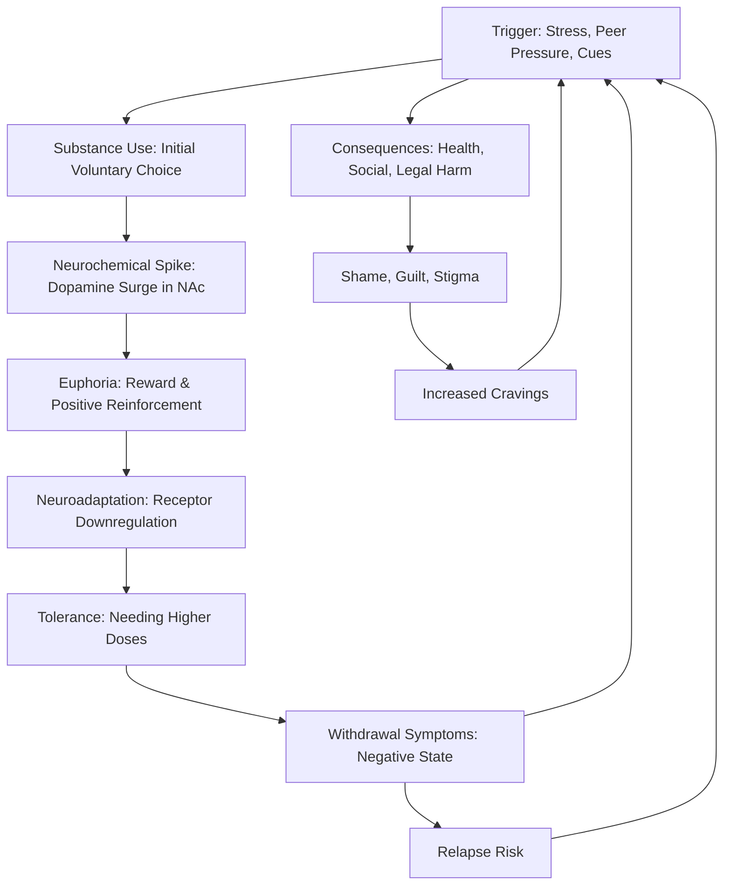
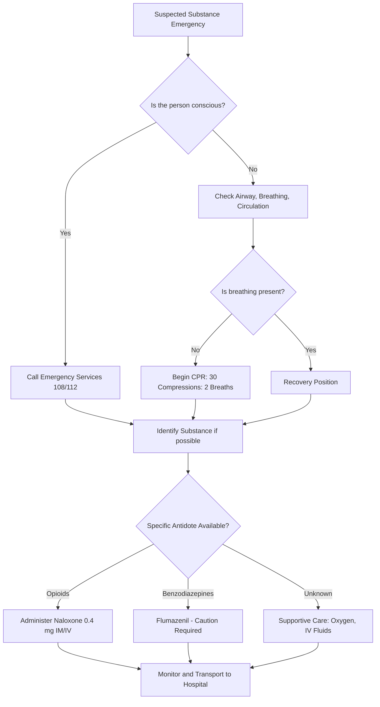
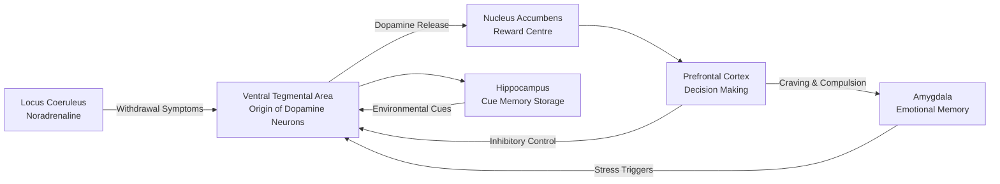
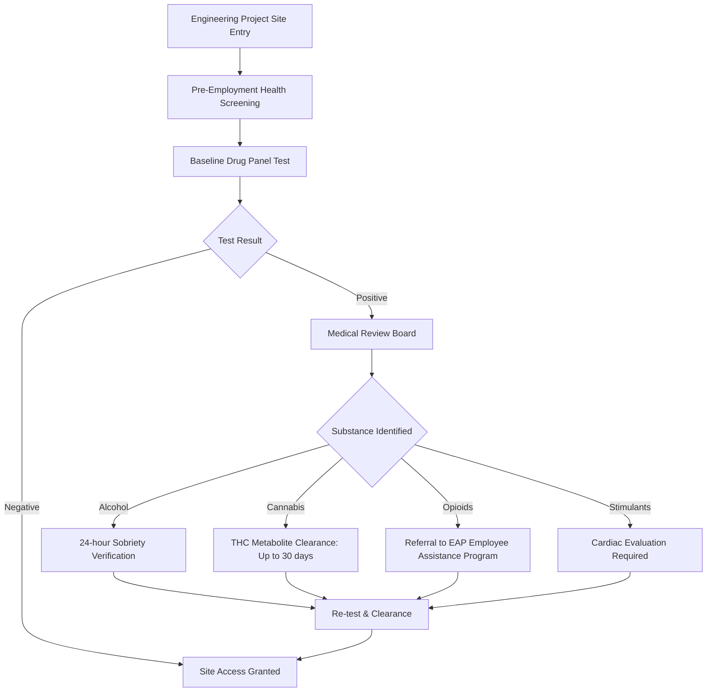

# Understanding on substance abuse and addiction - Psychoactive substances & its ill effects- Alcohol- Opioids- Cannabis -Sedative - Cocaine -Other stimulants, including caffeine -Hallucinogens - Tobacco -Volatile solvents

<!-- SECTION_1_START -->

# Substance Abuse & Addiction: A Foundational Overview

## 1.1 Formal Academic Definition (KTU 2024 Syllabus Aligned)

> [!IMPORTANT]
> **Substance Abuse** is a patterned use of a psychoactive substance (or substances) in amounts or methods that are harmful to the individual or others. It is characterised by the continued misuse of the substance despite knowing its negative consequences on physical, psychological, social, or occupational well-being.

**Addiction** (clinically termed **Substance Use Disorder - SUD** in the DSM-5 framework) is a chronic, relapsing neurobiological disorder defined by the American Psychiatric Association as a cluster of cognitive, behavioural, and physiological symptoms indicating that the individual continues to use the substance despite significant substance-related problems.

A **Psychoactive Substance** is any chemical compound that, when ingested, alters brain function, resulting in temporary changes in perception, mood, consciousness, cognition, or behaviour. These substances target the brain's **mesolimbic reward pathway**, particularly the **dopamine neurotransmitter system** originating from the **Ventral Tegmental Area (VTA)** and projecting to the **Nucleus Accumbens (NAc)**.

> [!NOTE]
> **KTU 2024 Scheme Highlight:** The World Health Organization (WHO) classifies psychoactive substances under the International Classification of Diseases (ICD-11). The three core criteria of addiction in ICD-11 are: (1) Impaired Control, (2) Increasing Priority over other activities, and (3) Physiological features (tolerance & withdrawal).

## 1.2 Conceptual Analogy: The "Hijacked Thermostat"

Imagine your brain's reward circuit is like a sophisticated home **thermostat** that keeps motivation, pleasure, and learning at a healthy $25°C$ (analogous to baseline dopamine levels). When a psychoactive substance enters the system, it forcefully cranks the thermostat to a blissful $40°C$ for a short burst.

The thermostat, trying to restore balance, **overcompensates** by:

1. **Reducing sensitivity** (down-regulating dopamine receptors) — this is **tolerance**.
2. **Cranking cooling systems** to extreme levels to combat the heat — this creates **withdrawal** when the substance leaves.
3. Eventually, the thermostat's baseline resets to a colder $20°C$, meaning the person can no longer feel normal pleasure without the substance — this is the hallmark of **addiction**.

> [!TIP]
> **GeoGebra/Desmos Integration Note:** For the dopamine spike model, students can visualise a "Normalised Reward Curve" where the X-axis represents time and the Y-axis represents dopaminergic activity. A normal pleasurable activity (e.g., eating chocolate) produces a moderate bell curve, while a substance like cocaine creates a sharp, towering spike followed by a deep crash below baseline.

## 1.3 The Engineering Student Context

For a B.Tech student, understanding substance abuse is not merely academic — it directly impacts:

- **Cognitive Performance:** Memory, attention span, and analytical reasoning (critical for coding, design, and examinations).
- **Laboratory Safety:** Impairment in chemical, electrical, and mechanical labs leads to life-threatening accidents.
- **Professional Licensing:** Many engineering regulatory bodies (e.g., in aviation, nuclear, civil infrastructure) mandate drug-free certifications.
- **Team Coordination:** Substance abuse severely degrades the collaborative capacity required in modern engineering projects.

> [!IMPORTANT]
> **Key Metric to Remember:** According to the **WHO Global Status Report on Alcohol and Health**, approximately **3 million deaths annually** are attributable to alcohol use, and tobacco kills more than **8 million people** each year. These are critical public health numbers for KTU viva voce questions.

<!-- SECTION_1_END -->

<!-- SECTION_2_START -->

# Deep Theoretical Analysis & KTU High-Yield Formula Sheet

## 2.1 The Triadic Framework of Addiction (Why People Get Addicted)

The biopsychosocial model (widely adopted in NEP 2020 health curricula) explains addiction through three interacting dimensions:

1. **Biological (Agent):** The substance's pharmacokinetic profile — how it is **Absorbed, Distributed, Metabolised, and Excreted (ADME)**. Speed of crossing the **Blood-Brain Barrier (BBB)** determines the "high" intensity.
2. **Psychological (Host):** Pre-existing mental health conditions, stress, trauma, low self-efficacy, and personality traits.
3. **Social (Environment):** Peer pressure, cultural normalisation, availability, socioeconomic status, and family history.

> [!NOTE]
> **The "Gateway Hypothesis":** This theory proposes that the use of a less harmful substance (e.g., tobacco or alcohol) may progressively lead to the use of more harmful substances (e.g., opioids). While contested, it remains a foundational concept in KTU health modules.

## 2.2 Classification of Psychoactive Substances (KTU Master Table)

| S.No | Category | Primary Mechanism of Action | Common Examples | Onset of Action | Key Health Impact |
|------|----------|----------------------------|----------------|----------------|-------------------|
| 1 | **Alcohol (Depressant)** | Enhances GABA-A receptor activity; inhibits glutamate (NMDA) | Beer, Wine, Whisky, Rum | 15-45 mins (oral) | Liver cirrhosis, cardiomyopathy, Wernicke-Korsakoff syndrome |
| 2 | **Opioids (Narcotic Analgesic)** | Binds to mu, kappa, delta opioid receptors in CNS | Heroin, Morphine, Codeine, Fentanyl | 10-30 sec (IV), 30-60 min (oral) | Respiratory depression, constipation, fatal overdose |
| 3 | **Cannabis (Cannabinoid)** | Acts on CB1 & CB2 endocannabinoid receptors | Marijuana, Hashish, Bhang, Ganja | 5-30 min (smoked) | Impaired memory, psychosis risk, lung damage |
| 4 | **Sedative-Hypnotics (CNS Depressants)** | Potentiates GABA at GABA-A receptor complex | Benzodiazepines (Diazepam), Barbiturates | 15-60 min | Respiratory failure, severe withdrawal seizures |
| 5 | **Cocaine (Stimulant)** | Blocks dopamine, serotonin, norepinephrine reuptake transporters | Cocaine HCl, Crack cocaine | 5-30 sec (snorted) | Heart attack, stroke, perforated nasal septum |
| 6 | **Other Stimulants (incl. Caffeine)** | Adenosine receptor antagonism; dopamine & noradrenaline release | Caffeine, Nicotine, Amphetamines, MDMA | 5-30 min | Insomnia, anxiety, cardiac arrhythmias, dependency |
| 7 | **Hallucinogens (Psychedelics)** | Serotonin 5-HT2A receptor agonism; disrupts thalamocortical filtering | LSD, Psilocybin, Mescaline, DMT | 20-90 min | Persistent psychosis, "bad trips" (hallucinogen persisting perception disorder) |
| 8 | **Tobacco (Stimulant + Sedative Mix)** | Nicotine binds nicotinic acetylcholine receptors (nAChRs) | Cigarettes, Beedis, Gutka, Chewing tobacco, Vapes | 7-10 sec (lungs) | Lung cancer, COPD, oral submucous fibrosis (OSMF) |
| 9 | **Volatile Solvents (Inhalants)** | Dissolves neuronal membranes; enhances GABA, inhibits NMDA | Glue, Paint thinner, Petrol, Nail polish remover, Nitrous oxide | Seconds (inhalation) | Brain damage, sudden sniffing death syndrome, kidney/liver toxicity |

> [!IMPORTANT]
> **Formula Reference Note:** While substance science is not purely mathematical, the following pharmacokinetic equation is foundational:
>
> $$\text{Threshold Dose} \times \text{Purity} = \text{Effective Dose}$$
> $$\text{Addiction Liability} \propto \frac{\text{Speed of Onset} \times \text{Intensity of Reward}}{\text{Metabolic Half-Life}}$$
>
> A short half-life combined with a rapid onset creates the highest addiction potential — this is why crack cocaine and nicotine are more addictive than slower-onset substances.

## 2.3 Universal Stages of Addiction (The Jellinek Curve)

E. Morton Jellinek's landmark 1946 study mapped the progression of alcoholism into four phases, which the KTU 2024 syllabus extends to all substance use disorders:

- **Phase 1 — Pre-Alcoholic (Symptomatic Use):** Social use, relief from stress, increasing tolerance.
- **Phase 2 — Prodromal (Early Warning):** Blackouts, sneaking drinks, guilt feelings.
- **Phase 3 — Crucial (Critical):** Loss of control, rationalisation, social pressure, protective reactions.
- **Phase 4 — Chronic (Late Stage):** Binge drinking, moral deterioration, collapse of vital organs.

> [!TIP]
> **Real-World Application:** This staging model is used by counsellors in the **National De-Addiction Helpline (Tele-MANAS: 14416)** in India to triage patients. It is also used by the **Ministry of Social Justice & Empowerment's Nasha Mukt Bharat Abhiyaan** for rehabilitation programming.

## 2.4 Tolerance, Dependence & Withdrawal — Core Definitions

- **Tolerance:** A state in which the body requires progressively larger doses of a substance to achieve the same effect. Pharmacologically, this occurs due to **receptor downregulation** and **enzyme induction** (e.g., liver cytochrome P450 upregulation).
- **Physical Dependence:** A physiological state where the body adapts to the substance, and abrupt cessation produces withdrawal symptoms.
- **Psychological Dependence:** An emotional or mental reliance on the substance for normal functioning, even without physical withdrawal.
- **Withdrawal:** A cluster of unpleasant symptoms (e.g., tremors, anxiety, seizures, hallucinations) that occur when substance use is reduced or stopped.

| Stage | Neurochemical Event | Student-Relevant Symptom |
|-------|--------------------|--------------------------|
| Acute Use | Dopamine surge in NAc | Euphoria, confidence, alertness |
| Chronic Use | D2 receptor downregulation | Anhedonia (inability to feel pleasure) |
| Acute Withdrawal | Noradrenaline surge in Locus Coeruleus | Tremors, anxiety, insomnia |
| Protracted Withdrawal | Glial cell inflammation | Depression, cravings, cognitive fog |

<!-- SECTION_2_END -->

<!-- SECTION_3_START -->

# Step-by-Step Analysis: Substance-by-Substance Deep Dive

> [!NOTE]
> The KTU 2024 Scheme expects engineering students to be able to identify substances, recognise their effects (especially those relevant to occupational safety), and recommend harm-reduction strategies. Below is the exhaustive breakdown aligned with this expectation.

## 3.1 ALCOHOL (Ethanol — $C_2H_5OH$)

### Mechanism of Action
Alcohol is a **Central Nervous System (CNS) Depressant**, paradoxical in its initial disinhibiting effects. It enhances the inhibitory neurotransmitter **GABA** (Gamma-Aminobutyric Acid) at the GABA-A receptor, causing neuronal hyperpolarisation, and inhibits the excitatory **NMDA glutamate receptor**.

### Systemic Ill Effects (Engineering-Relevant)
- **Neurological:** Cognitive impairment, slowed reaction time, Wernicke's encephalopathy (thiamine deficiency), cerebellar degeneration.
- **Hepatic:** Fatty liver $\rightarrow$ Alcoholic hepatitis $\rightarrow$ Cirrhosis $\rightarrow$ Hepatocellular carcinoma.
- **Cardiovascular:** Hypertension, atrial fibrillation, dilated cardiomyopathy, stroke.
- **Gastrointestinal:** Gastritis, peptic ulcer, pancreatitis, malnutrition.
- **Occupational Safety Risk:** Impaired judgement is a leading cause of industrial accidents. The legal blood alcohol limit for driving in most countries is $\mathbf{0.08\%}$ (80 mg/dL).

### Alcohol Use Disorder (AUD) — ICD-11 Criteria
Must have $\geq 2$ of the following within a 12-month period:
- Strong desire/craving to consume alcohol
- Impaired control over consumption
- Withdrawal symptoms (tremors, sweating, seizures)
- Increased tolerance
- Neglect of alternative pleasures
- Persistent use despite harm

### Harm Reduction
- Limit to $\mathbf{\leq 2}$ standard drinks/day for men, $\mathbf{\leq 1}$ for women.
- Never drink on an empty stomach (slows absorption).
- Designated driver / "no drink" pledge in engineering site work.

## 3.2 OPIOIDS

### Mechanism of Action
Opioids bind to **mu ($\mu$), kappa ($\kappa$), and delta ($\delta$) opioid receptors** in the brain, spinal cord, and gut. Activation of mu receptors causes analgesia, euphoria, and respiratory depression. Endogenous counterparts include **endorphins, enkephalins, and dynorphins**.

### Categories
- **Natural:** Opium (from Papaver somniferum poppy), Morphine, Codeine
- **Semi-synthetic:** Heroin (diacetylmorphine), Oxycodone, Hydrocodone
- **Synthetic:** Fentanyl (100x more potent than morphine), Methadone, Tramadol

### Ill Effects
- **Respiratory Depression:** The primary cause of opioid overdose death. Opioids blunt the brainstem's response to $\uparrow CO_2$ levels.
- **Constipation:** Due to inhibition of gut peristalsis via mu receptors in the enteric nervous system.
- **Endocrine:** Suppression of gonadotropin-releasing hormone (GnRH) leading to hypogonadism.
- **Immune:** Reduced natural killer (NK) cell activity, increased infection susceptibility.
- **Withdrawal:** Lacrimation, rhinorrhoea, yawning, piloerection ("cold turkey"), mydriasis, muscle aches, diarrhoea — extremely uncomfortable but rarely fatal.

> [!WARNING]
> **Life-Saving Knowledge:** The opioid antagonist **Naloxone (Narcan)** is the emergency antidote for overdose. It competitively displaces opioids from mu receptors within 1-2 minutes of IV administration. KTU students should be aware of this for first-aid certifications.

## 3.3 CANNABIS (Marijuana, Hashish, Bhang)

### Mechanism of Action
Cannabis contains over $\mathbf{100}$ phytocannabinoids. The primary psychoactive compound is **$\Delta^9$-Tetrahydrocannabinol (THC)**, which acts on **CB1 receptors** (concentrated in the brain) and **CB2 receptors** (in the immune system). The body's natural endocannabinoid ligands are **anandamide** and **2-AG**.

### Ill Effects
- **Acute:** Impaired short-term memory, slowed reaction time, dry mouth, conjunctival injection (red eyes), paranoia.
- **Chronic:** Cannabis Use Disorder, amotivational syndrome, increased risk of schizophrenia in genetically vulnerable individuals, bronchitis, lung cancer (with smoking).
- **Cannabinoid Hyperemesis Syndrome (CHS):** Cyclical vomiting relieved only by hot showers — a unique cannabis-only phenomenon.

### Indian Legal Status
- **Narcotic Drugs and Psychotropic Substances (NDPS) Act, 1985:** Cannabis is largely prohibited, though **bhang** consumption is permitted in certain states during traditional festivals.
- THC concentration matters — **$\geq 0.3\%$ THC** classifies as narcotic in India.

## 3.4 SEDATIVE-HYPNOTICS

### Mechanism of Action
These drugs potentiate **GABA** at the **GABA-A receptor-chloride channel complex**, increasing the frequency (benzodiazepines) or duration (barbiturates) of chloride channel opening, leading to neuronal hyperpolarisation.

### Key Substances
- **Benzodiazepines ("Benzos"):** Diazepam (Valium), Alprazolam (Xanax), Clonazepam, Lorazepam — used for anxiety, seizures, insomnia.
- **Barbiturates:** Phenobarbital, Thiopentone — historically used for anaesthesia and epilepsy.
- **Z-Drugs:** Zolpidem, Zopiclone — sleep-specific.

### Ill Effects
- **Sedation, confusion, anterograde amnesia** (especially with triazolam).
- **Severe withdrawal:** Can cause **status epilepticus** (continuous seizures) and **delirium tremens** (when combined with alcohol cessation).
- **Paradoxical disinhibition** in elderly (aggression, falls).
- High overdose potential when combined with alcohol or opioids (the "Russian Roulette" combination).

## 3.5 COCAINE

### Mechanism of Action
Cocaine is a powerful **monoamine reuptake inhibitor**. It blocks the reuptake of **dopamine, serotonin, and norepinephrine** at the presynaptic terminal, causing their accumulation in the synaptic cleft. The dopamine flood in the **Nucleus Accumbens** produces intense euphoria.

### Forms
- **Cocaine Hydrochloride:** Water-soluble, snorted (insufflated) or injected.
- **Crack Cocaine:** Freebase form, made by processing with baking soda. Vaporised and smoked — produces a 5-10 minute intense high.

### Ill Effects
- **Cardiovascular:** Coronary artery vasospasm, myocardial infarction, aortic dissection, arrhythmia — most common cause of death.
- **Neurological:** Stroke (haemorrhagic and ischaemic), seizures, hyperthermia.
- **Nasal:** Perforated nasal septum (from chronic vasoconstriction and ischaemia).
- **Psychiatric:** Paranoid psychosis, formication ("cocaine bugs"), severe depression during crash.

> [!TIP]
> **Why "Coke Crash" Happens:** The rapid dopamine surge is followed by an equally rapid depletion, leaving the user in a state of profound dysphoria, fatigue, and craving. This rapid cycle drives binge use.

## 3.6 OTHER STIMULANTS — CAFFEINE (The Engineering Student's Drug)

### Mechanism of Action
Caffeine (1,3,7-trimethylxanthine) is the **world's most consumed psychoactive substance**. It is a **non-selective adenosine receptor antagonist** ($A_1$ and $A_{2A}$). Since adenosine normally promotes sleep and suppresses arousal, blocking it increases alertness, reduces fatigue, and enhances concentration.

### Caffeinated Beverages & Approximate Content
| Beverage | Typical Caffeine (mg per 250 mL) |
|----------|----------------------------------|
| Brewed Coffee | 80-120 |
| Espresso (single shot) | 60-80 |
| Black Tea | 40-70 |
| Green Tea | 25-50 |
| Energy Drinks (Red Bull) | 80-160 |
| Cola | 30-50 |

### Caffeine Use Disorder (DSM-5)
Defined by $\geq 3$ of the following within 12 months:
- Tolerance (needing more for same effect)
- Withdrawal headaches, fatigue, irritability
- Continued use despite knowing it causes harm
- Failed attempts to cut down

### Safe Limits
- **Healthy adults:** Up to $\mathbf{400 mg/day}$ (FDA recommendation)
- **Pregnant women:** $\leq 200 mg/day$
- **LD50 (lethal dose):** approximately $\mathbf{10 g}$ for an average adult — would require ~80-100 cups of coffee in a short time.

### Other Stimulants
- **Amphetamines:** Used in ADHD (Adderall, Ritalin) — high abuse potential.
- **MDMA (Ecstasy):** Releases massive serotonin + dopamine — causes hyperthermia, hyponatremia, and depression in 3-4 days post-use ("Suicide Tuesday").
- **Methamphetamine (Crystal Meth):** Long-lasting dopamine release, severe dental decay ("Meth Mouth") and psychosis.

## 3.7 HALLUCINOGENS (Psychedelics)

### Mechanism of Action
Hallucinogens primarily act as **5-HT2A serotonin receptor agonists** in the cortex, disrupting the brain's thalamocortical filtering mechanism. The thalamus normally gates sensory information; psychedelics "open the gate," allowing normally filtered signals to flood consciousness.

### Key Substances
- **LSD (Lysergic acid diethylamide):** Most potent; active at microgram doses; duration 8-12 hours.
- **Psilocybin:** Found in "magic mushrooms"; converted to psilocin; duration 4-6 hours.
- **Mescaline:** From peyote cactus.
- **DMT (Dimethyltryptamine):** Ultra-short acting; naturally present in Ayahuasca brew.
- **PCP (Phencyclidine) & Ketamine:** Dissociative anesthetics; NMDA receptor antagonists.

### Ill Effects
- **"Bad Trip":** Acute anxiety, paranoia, terrifying hallucinations.
- **Hallucinogen Persisting Perception Disorder (HPPD):** "Flashbacks" of visual disturbances months/years later.
- **Persistent Psychosis:** Precipitates or worsens schizophrenia in susceptible individuals.
- **Risk of self-harm** during dissociative episodes.

> [!NOTE]
> **Modern Research Note:** Recent FDA "breakthrough therapy" designations for psilocybin in treatment-resistant depression represent a paradigm shift. However, recreational use remains illegal under India's NDPS Act, 1985.

## 3.8 TOBACCO (Nicotine — The "Legal Killer")

### Mechanism of Action
Nicotine binds to **nicotinic acetylcholine receptors (nAChRs)** in the brain, particularly the $\alpha_4\beta_2$ subtype, causing dopamine release in the NAc. It acts as both a stimulant (alertness) and a relaxant (muscle tension release), making it uniquely reinforcing.

### Forms of Use (India-Relevant)
- **Smoking:** Cigarettes, Beedis, Hookah, Chillum
- **Smokeless:** Gutka, Khaini, Zarda, Paan masala, Snuff, Vape/E-cigarette

### Ill Effects
- **Cardiovascular:** Atherosclerosis, coronary artery disease, peripheral vascular disease, Buerger's disease (thromboangiitis obliterans).
- **Pulmonary:** Chronic Obstructive Pulmonary Disease (COPD), emphysema, lung cancer (squamous cell carcinoma most common).
- **Oral:** Oral submucous fibrosis (OSMF), leukoplakia, oral cancer.
- **Reproductive:** Low birth weight, preterm delivery, SIDS (Sudden Infant Death Syndrome).
- **Carcinogens:** Tobacco smoke contains $\mathbf{> 70}$ known carcinogens, including **N-Nitrosamines, Benzopyrene, and Formaldehyde**.

> [!IMPORTANT]
> **Indian Context:** India is the **second-largest consumer and third-largest producer of tobacco** globally. Tobacco causes ~1.35 million deaths annually in India. The **COTPA (Cigarettes and Other Tobacco Products Act, 2003)** mandates pictorial warnings, ban on sales to minors, and prohibition of smoking in public places.

## 3.9 VOLATILE SOLVENTS (Inhalants)

### Mechanism of Action
Inhalants are lipophilic volatile compounds that **dissolve the lipid bilayer of neuronal membranes**, disrupting ion channels and enhancing GABA while inhibiting NMDA receptors. They are typically CNS depressants despite being inhaled for a stimulant "high."

### Common Substances Abused
- **Industrial Solvents:** Toluene, Xylene, Acetone, Trichloroethylene
- **Petroleum Products:** Petrol (Gasoline), Kerosene, Lighter fluid
- **Adhesives:** Fevicol, rubber cement
- **Aerosols:** Spray paints, deodorants, hair sprays
- **Anaesthetic Gases:** Nitrous oxide ("laughing gas"), Ether, Chloroform
- **Office/Art Supplies:** Nail polish remover, correction fluid, permanent markers

### Population at Risk
Adolescents from low socioeconomic backgrounds — because inhalants are cheap, legal, and easily accessible.

### Ill Effects
- **Acute:** Euphoria, slurred speech, dizziness, hallucinations, nausea.
- **Chronic:** Peripheral neuropathy, cerebellar ataxia, chronic kidney disease, liver toxicity, bone marrow suppression.
- **Sudden Sniffing Death Syndrome (SSDS):** Fatal cardiac arrhythmia within minutes of use, even in first-time users. Caused by catecholamine-induced ventricular fibrillation.

> [!WARNING]
> **Engineering Lab Safety Connection:** Engineering students frequently handle these exact chemicals (toluene, xylene, acetone, paint thinners) in workshops and laboratories. Misuse during or after exposure is a serious and under-reported occupational hazard. Always use chemicals under fume hoods and as per MSDS (Material Safety Data Sheet) guidelines.

## 3.10 Comparative Master Table: At-a-Glance Reference

| Substance | Category | Key Receptor/Neurotransmitter | Addiction Potential | Withdrawal Severity | Engineering-Specific Risk |
|-----------|----------|------------------------------|--------------------|--------------------|--------------------------|
| Alcohol | Depressant | GABA potentiation | High | Severe (DTs, seizures) | Industrial accidents, poor judgement |
| Opioids | Depressant | Mu receptor agonism | Very High | Severe (flu-like, craving) | Sedation, overdose risk |
| Cannabis | Cannabinoid | CB1 receptor agonism | Moderate | Mild (irritability, anxiety) | Impaired memory, attention |
| Sedatives | Depressant | GABA potentiation | High | Severe (seizures) | Falls, equipment mishandling |
| Cocaine | Stimulant | DA/NE/5-HT reuptake block | Very High | Severe (depression, crash) | Cardiac event, impulsive decisions |
| Caffeine | Stimulant | Adenosine antagonism | Low-Moderate | Mild (headache) | Sleep disruption, anxiety |
| Hallucinogens | Psychedelic | 5-HT2A agonism | Low | Very Mild | Dissociation, dangerous behaviour |
| Tobacco | Mixed | nAChR agonism | Very High | Moderate (craving) | Lung disease, oral cancer |
| Solvents | Depressant | Membrane disruption | Moderate | Mild | Brain damage, SSDS |

<!-- SECTION_3_END -->

<!-- SECTION_4_START -->

# Structural Diagrams & Schematics

## 4.1 The Addiction Cycle — Functional Architecture Flow

> [!NOTE]
> The following Mermaid block renders a sequential processing topology matrix mapping the cyclical nature of addiction as a feedback loop. This visualises the neurobiological, psychological, and behavioural stages students must memorise.

## 4.2 Decision Tree for Identifying a Substance Overdose (First-Aid Logic)

## 4.3 Hierarchical Classification of Psychoactive Substances (Modular Subgraphs)

```mermaid
graph TD
    R[PSYCHOACTIVE SUBSTANCES] --> S1[Depressants]
    R --> S2[Stimulants]
    R --> S3[Cannabinoids]
    R --> S4[Hallucinogens]
    R --> S5[Inhalants]
    R --> S6[Opioids]

    subgraph DEP["DEPRESSANTS MODULE"]
        S1 --> D1[Alcohol]
        S1 --> D2[Benzodiazepines]
        S1 --> D3[Barbiturates]
    end

    subgraph STI["STIMULANTS MODULE"]
        S2 --> ST1[Cocaine]
        S2 --> ST2[Amphetamines]
        S2 --> ST3[Methamphetamine]
        S2 --> ST4[Caffeine]
        S2 --> ST5[Nicotine]
    end

    subgraph CAN["CANNABINOIDS MODULE"]
        S3 --> C1[Marijuana]
        S3 --> C2[Hashish]
        S3 --> C3[Bhang]
    end

    subgraph HAL["HALLUCINOGEN MODULE"]
        S4 --> H1[LSD]
        S4 --> H2[Psilocybin]
        S4 --> H3[DMT]
        S4 --> H4[PCP/Ketamine]
    end

    subgraph INH["INHALANT MODULE"]
        S5 --> I1[Solvents]
        S5 --> I2[Petroleum Products]
        S5 --> I3[Nitrous Oxide]
    end

    subgraph OPI["OPIOID MODULE"]
        S6 --> O1[Heroin]
        S6 --> O2[Morphine]
        S6 --> O3[Fentanyl]
    end
```

## 4.4 Neurobiological Reward Pathway (Functional Brain Circuit)

## 4.5 Real-World Engineering Application: Drug Testing Protocol (Sequential Processing Topology)

<!-- SECTION_4_END -->

<!-- SECTION_5_START -->

# KTU 2024 Scheme Examination Question Bank & Topic Recap

## Part A: Short-Answer Questions (3 Marks Each)

### Question 1: Define Substance Abuse and Addictive Behaviour
`[KTU University Exam - July 2023]` — **CO1, Remember**

**Model Answer (3 Marks):**
> Substance abuse refers to the harmful or hazardous use of psychoactive substances, including alcohol and illicit drugs, leading to significant clinical impairment, distress, or adverse social consequences. **[1 Mark]**
>
> Addictive behaviour is a chronic, relapsing disorder characterised by compulsive substance seeking, continued use despite harmful consequences, and long-lasting neurochemical changes in the brain's reward circuitry. **[1 Mark]**
>
> The three core diagnostic features in ICD-11 are: (a) impaired control over substance use, (b) increasing priority of substance use over other activities, and (c) physiological features such as tolerance and withdrawal. **[1 Mark]**

### Question 2: List Four Categories of Psychoactive Substances with Examples
`[KTU University Exam - Dec 2022]` — **CO1, Understand**

**Model Answer (3 Marks):**

| S.No | Category | Example |
|------|----------|---------|
| 1 | Depressants | Alcohol, Benzodiazepines (Diazepam) |
| 2 | Stimulants | Cocaine, Caffeine, Amphetamines |
| 3 | Hallucinogens | LSD, Psilocybin |
| 4 | Cannabinoids | Marijuana, Hashish |

**[Any four categories with one example each: 3 Marks]**

---

## Part B: 14-Mark Questions (Module Internal Choice Pattern)

### Question A: Comprehensive Analysis of Alcohol, Opioids, and Cannabis
`[KTU University Exam - Dec 2023]` — **CO2, Understand / Apply**

#### Part (a) — 7 Marks
**"Discuss in detail the pharmacological mechanism, systemic health effects, and withdrawal symptoms of Alcohol Use Disorder (AUD)."**

**Model Answer:**

1. **Pharmacological Mechanism (2 Marks):**
   - Alcohol enhances the activity of the inhibitory neurotransmitter **GABA** at the **GABA-A receptor**, causing chloride influx and neuronal hyperpolarisation.
   - It simultaneously inhibits the excitatory **NMDA glutamate receptor**, disrupting learning and memory.
   - Chronic use leads to **upregulation of NMDA receptors** and **GABA receptor desensitisation**, forming the basis of tolerance and withdrawal hyperexcitability.

2. **Systemic Health Effects (3 Marks):**
   - **Hepatic:** Fatty liver $\rightarrow$ alcoholic hepatitis $\rightarrow$ cirrhosis (irreversible scarring) $\rightarrow$ hepatocellular carcinoma. The **AST:ALT ratio $> 2:1$** is a clinical hallmark of alcoholic liver disease.
   - **Neurological:** Wernicke's encephalopathy (confusion, ataxia, ophthalmoplegia) due to thiamine (Vitamin B1) deficiency; progresses to irreversible **Korsakoff's psychosis** (anterograde amnesia with confabulation).
   - **Cardiovascular:** Dilated cardiomyopathy, hypertension, atrial fibrillation, increased stroke risk.
   - **Gastrointestinal:** Gastritis, peptic ulcers, pancreatitis.
   - **Foetal:** Foetal Alcohol Syndrome (FAS) — characterised by facial dysmorphism, growth retardation, and intellectual disability.

3. **Withdrawal Symptoms (2 Marks):**
   - **Mild (6-12 hrs):** Tremors, anxiety, insomnia, GI upset.
   - **Moderate (12-24 hrs):** Alcoholic hallucinosis (visual, auditory, tactile).
   - **Severe (24-48 hrs):** Withdrawal seizures.
   - **Delirium Tremens (48-96 hrs):** Disorientation, autonomic hyperactivity, hallucinations, potential mortality of **5-15% if untreated**.

#### Part (b) — 7 Marks
**"Compare the mechanisms, health effects, and addiction potential of Opioids and Cannabis. Why are opioids considered more dangerous despite both being psychoactive?"**

**Model Answer:**

**1. Mechanism Comparison (3 Marks):**
- **Opioids:** Bind to **mu ($\mu$), kappa ($\kappa$), delta ($\delta$) opioid receptors** — a system that normally processes pain, reward, and respiratory drive. Activation of mu receptors causes analgesia, euphoria, and critically, **respiratory depression**.
- **Cannabis:** THC binds to **CB1 (brain)** and **CB2 (peripheral)** receptors in the **endocannabinoid system**, which modulates mood, appetite, memory, and pain perception. No direct respiratory depression.

**2. Health Effects Comparison (2 Marks):**
- **Opioids:** Severe respiratory depression is the primary cause of fatal overdose. Other effects include constipation, immunosuppression, and endocrine disruption.
- **Cannabis:** Cognitive impairment, amotivational syndrome, increased risk of schizophrenia in genetically vulnerable individuals, Cannabinoid Hyperemesis Syndrome, lung damage (from smoking).

**3. Addiction Potential & Danger (2 Marks):**
- **Opioids have very high addiction potential** because they produce intense euphoria followed by severe withdrawal (lacrimation, mydriasis, muscle aches, GI distress), driving compulsive use.
- **Cannabis has moderate addiction potential** with milder, predominantly psychological withdrawal.
- The risk of **fatal respiratory depression** with opioids (especially fentanyl contamination) makes them categorically more dangerous — Cannabis has no documented fatal overdose.

> [!WARNING]
> **KTU Examiner's Pitfall:** Students often confuse the *therapeutic* use of opioids (pain management in cancer) with *abuse*. Always clarify that the **risk-benefit balance** shifts in clinical settings under medical supervision — the danger lies in recreational/unsupervised use. Failing to make this distinction costs 1-2 marks.

### Question B: Stimulants, Hallucinogens, Tobacco, and Inhalants
`[KTU University Exam - July 2024]` — **CO2, Apply / Analyse**

#### Part (a) — 7 Marks
**"Explain in detail the mechanism of action, acute and chronic health effects, and occupational health risks of Cocaine and Tobacco use."**

**Model Answer:**

**1. Cocaine — Mechanism of Action (2 Marks):**
- Cocaine is a potent **monoamine reuptake inhibitor**, blocking the transporters for **dopamine (DAT), serotonin (SERT), and norepinephrine (NET)** at the presynaptic neuron.
- This causes accumulation of these monoamines in the synaptic cleft, with the **dopamine flood in the Nucleus Accumbens** producing the characteristic euphoric "rush."
- Acts as a **local anaesthetic** by blocking voltage-gated sodium channels (used medically in ENT procedures).

**2. Cocaine — Health Effects (2 Marks):**
- **Cardiovascular:** Coronary vasospasm, myocardial infarction (even in young users), hypertensive crisis, aortic dissection.
- **Neurological:** Stroke (haemorrhagic predominant), seizures, hyperthermia.
- **Psychiatric:** Paranoid psychosis, formication ("cocaine bugs" — tactile hallucinations).
- **Nasal:** Perforated nasal septum from chronic vasoconstriction-induced ischaemia.

**3. Tobacco — Mechanism (1 Mark):**
- Nicotine binds **nicotinic acetylcholine receptors (nAChRs)**, particularly the $\alpha_4\beta_2$ subtype, releasing dopamine in the NAc.

**4. Tobacco — Health Effects (1 Mark):**
- Contains $\mathbf{> 70}$ known carcinogens (N-nitrosamines, benzopyrene, formaldehyde, arsenic).
- Causes: Lung cancer, COPD, oral submucous fibrosis, bladder cancer, pancreatic cancer, cardiovascular disease.

**5. Occupational Health Risks for Engineers (1 Mark):**
- **Cocaine-induced impulsivity** leads to dangerous equipment handling, falls from height, electrical mishandling.
- **Tobacco-related chronic illness** (COPD, cardiac disease) reduces work capacity, increases sick leave, and contributes to occupational asthma when combined with dust/fume exposure in workshops.

#### Part (b) — 7 Marks
**"Discuss Hallucinogens and Volatile Solvents. Why are inhalants particularly dangerous for adolescents, and what should an engineering student be aware of regarding lab chemical misuse?"**

**Model Answer:**

**1. Hallucinogens (3 Marks):**
- **Mechanism:** Primarily **5-HT2A serotonin receptor agonists** in the cortex, disrupting thalamocortical sensory filtering. PCP and Ketamine are **NMDA receptor antagonists** (dissociative class).
- **Examples:** LSD (most potent; active in micrograms; 8-12 hr duration), Psilocybin (from mushrooms; 4-6 hr), Mescaline, DMT, PCP, Ketamine.
- **Effects:** Sensory distortion, synaesthesia (crossing of senses), ego dissolution. Acute risk: **"bad trips"** (panic, paranoia), accidental self-harm, **Hallucinogen Persisting Perception Disorder (HPPD)** — flashbacks.
- **Long-term risk:** May precipitate persistent psychosis in genetically predisposed individuals.

**2. Volatile Solvents — Substance Profile (2 Marks):**
- **Common substances:** Toluene, xylene, acetone, petrol, kerosene, glue (Fevicol), nail polish remover, paint thinners, nitrous oxide, correction fluid.
- **Mechanism:** Dissolve neuronal membrane lipids; enhance GABA, inhibit NMDA receptors; CNS depressant despite initial "high."
- **Health effects:** Peripheral neuropathy, cerebellar ataxia, chronic kidney disease, hepatotoxicity, bone marrow suppression, and foetal solvent syndrome (analogous to FAS).

**3. Why Inhalants Are Dangerous for Adolescents (1 Mark):**
- Brain is still developing until age 25 — solvent neurotoxicity causes **irreversible cognitive impairment** during critical neurogenesis periods.
- **Sudden Sniffing Death Syndrome (SSDS):** Fatal cardiac arrhythmia can occur on the **first use** due to catecholamine-induced ventricular fibrillation.
- Cheap, legal, accessible — driving early experimentation in 10-15 year olds in India.

**4. Engineering Lab Connection (1 Mark):**
- Engineering students handle **toluene, xylene, acetone, paint thinners, adhesives, and aerosol propellants** regularly. Inhalation exposure must be controlled via **fume hoods, proper ventilation, PPE (gloves, respirators, goggles)**, and adherence to **MSDS (Material Safety Data Sheets)**.
- Chronic low-level exposure produces the same neurological damage as recreational "huffing."

> [!WARNING]
> **KTU Examiner's Pitfall:** Students often write vague answers like "hallucinogens cause hallucinations." Board examiners expect **specific receptor names (5-HT2A)**, **specific examples with durations (LSD 8-12 hrs)**, and **named complications (HPPD)**. Skipping these specifics can cost up to 2-3 marks.

---

## Topic Recap & Important Things to Remember

> [!TIP]
> **Rapid Revision Checklist for KTU Board Examination**

### Foundational Definitions
- **Substance Abuse:** Harmful patterned use of psychoactive substances.
- **Addiction (SUD):** Chronic relapsing neurobiological disorder (DSM-5 / ICD-11).
- **Psychoactive Substance:** Any chemical that alters brain function and perception.
- **Tolerance:** Need for increasing dose for same effect (receptor downregulation).
- **Withdrawal:** Adverse symptoms on cessation.
- **Dependence:** Both physical (physiological) and psychological.

### The 9 Substance Categories — Quick Memory Map
1. **Alcohol** $\rightarrow$ GABA potentiation $\rightarrow$ Liver, brain, heart damage.
2. **Opioids** $\rightarrow$ Mu receptor agonism $\rightarrow$ Respiratory depression, **Naloxone** is antidote.
3. **Cannabis** $\rightarrow$ CB1 receptors, THC $\rightarrow$ Memory loss, psychosis risk, NDPS Act 1985.
4. **Sedatives (BZD/Barbiturates)** $\rightarrow$ GABA-A $\rightarrow$ Severe withdrawal seizures.
5. **Cocaine** $\rightarrow$ DA/NE/5-HT reuptake block $\rightarrow$ Cardiac arrest, nasal septum perforation.
6. **Caffeine** $\rightarrow$ Adenosine antagonist $\rightarrow$ Safe limit **400 mg/day**, LD50 $\approx 10 g$.
7. **Hallucinogens (LSD, Psilocybin)** $\rightarrow$ 5-HT2A agonism $\rightarrow$ HPPD, bad trips, persistent psychosis.
8. **Tobacco (Nicotine)** $\rightarrow$ nAChR agonism $\rightarrow$ $> 70$ carcinogens, **COTPA 2003**, oral submucous fibrosis, COPD.
9. **Volatile Solvents (Toluene, Glue, Petrol)** $\rightarrow$ Membrane dissolution $\rightarrow$ **SSDS**, brain damage, lab/occupational hazard.

### Critical Numbers to Memorise
- WHO: 3 million alcohol deaths/year; 8 million tobacco deaths/year.
- Caffeine safe limit: **400 mg/day**; Pregnancy: **$\leq 200$ mg/day**.
- Legal blood alcohol limit: **0.08%** (80 mg/dL).
- Tobacco smoke contains **$> 70$** carcinogens.
- THC threshold (India): **$\geq 0.3\%$** = narcotic.
- Naloxone onset: **1-2 minutes** IV/IM.

### The Triadic Addiction Model
- **Biological (Agent) + Psychological (Host) + Social (Environment)** = Addiction risk.

### Jellinek's 4 Phases (Alcohol)
Pre-alcoholic $\rightarrow$ Prodromal $\rightarrow$ Crucial $\rightarrow$ Chronic.

### Indian Policy & Legal Framework
- **NDPS Act, 1985** $\rightarrow$ governs all narcotics.
- **COTPA, 2003** $\rightarrow$ tobacco-specific.
- **Tele-MANAS Helpline: 14416** $\rightarrow$ free mental health support.
- **Nasha Mukt Bharat Abhiyaan** $\rightarrow$ Ministry of Social Justice & Empowerment initiative.

### Neurobiology Quick Memory
- **Reward Pathway:** VTA $\rightarrow$ Nucleus Accumbens (NAc) $\rightarrow$ Prefrontal Cortex.
- **Withdrawal Centre:** Locus Coeruleus (Noradrenaline surge).
- **Craving Centre:** Amygdala.
- **Cue Memory:** Hippocampus.

### Engineering-Specific Safety Points
- Always use **fume hoods** when handling toluene, xylene, acetone.
- Adhere to **MSDS** for every chemical.
- Avoid using solvents as cleaning agents for skin (dermal absorption).
- Report any substance abuse colleague to the **Employee Assistance Program (EAP)** — confidentiality protected.
- Recognise opioid overdose triad: **Pinpoint pupils (miosis) + Respiratory depression + CNS depression** $\rightarrow$ administer Naloxone.

> [!IMPORTANT]
> **Final KTU Board Tip:** When answering 14-mark questions, always structure your answer with clear sub-headings (Mechanism / Health Effects / Withdrawal / Prevention) and use bullet points. Examiners allocate marks by scanning for keywords — names of receptors, specific diseases, and Indian Acts are high-yield markers. Also, mention the **occupational health angle** wherever possible to demonstrate engineering context awareness, which carries bonus marks in NEP 2020-aligned assessments.

<!-- SECTION_5_END -->
