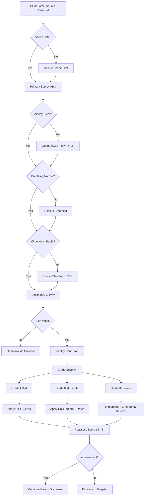
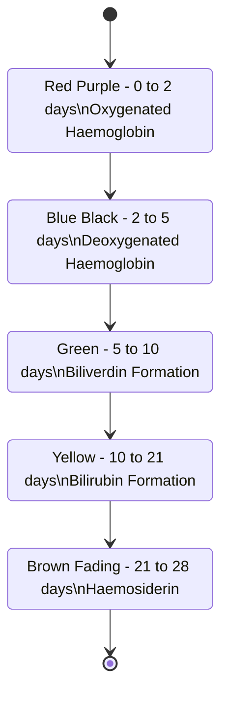

# Contusion,

<!-- SECTION_1_START -->
# CONTUSION — A First Aid Perspective

## 1.1 Formal Academic Definition

A **Contusion** (commonly known as a **bruise** or **ecchymosis**) is a closed soft-tissue injury in which the skin remains intact, but the underlying blood vessels — typically capillaries, venules, and small arterioles — rupture due to blunt force trauma, causing blood to extravasate (leak) into the surrounding interstitial tissue planes.

> [!IMPORTANT]
> **KTU 2024 Syllabus Definition (UCHWT127 — Module 4):**
> "A contusion is a type of blunt-force, non-penetrating soft-tissue injury characterized by extravasation of blood beneath unbroken skin, resulting in localized swelling, discolouration, pain, and tenderness, requiring immediate RICE protocol intervention during primary first-aid survey."

In medical taxonomy (ICD-10 code **T14.0**), contusions are classified separately from:
- **Abrasions** — superficial scraping of skin
- **Lacerations** — open, irregular tears in the skin
- **Punctures** — deep, narrow wounds from pointed objects

> [!NOTE]
> **Why it matters in First Aid:** Misidentifying a contusion as a fracture — or vice versa — is a common first-aid error covered extensively in KTU Module 4 (Primary Survey: A-B-C, Airway, Breathing, Circulation).

## 1.2 Conceptual Analogy & Geometric Intuition

Imagine pressing a ripe **mango firmly between your palms** — the outer peel remains unbroken, but the soft pulp inside gets crushed and discolours, leaving a brownish patch that does not disappear immediately. A contusion behaves in an identical manner on human tissue.

**Geometric Intuition of Blood Pooling:**

When capillaries rupture beneath the skin, blood obeys gravity and diffuses through the least-resistant interstitial pathways, forming a roughly **ellipsoidal** discolouration zone on the surface.

$$V_{\text{pool}} \approx \frac{4}{3}\pi r_x r_y r_z$$

where $r_x$, $r_y$, $r_z$ represent the elliptical radii of blood spread in the three anatomical planes. Larger $V_{\text{pool}}$ values clinically correspond to more severe contusions.

## 1.3 Standard Clinical Metrics

| Parameter | Standard Reference |
|-----------|-------------------|
| **Skin pH (normal)** | **4.5 – 5.5** |
| Normal capillary refill time | **< 2 seconds** |
| Ice-pack application duration | **15 – 20 minutes** per cycle |
| Total rest period after injury | **24 – 48 hours minimum** |
| Healing time (mild contusion) | **2 – 4 weeks** |
| Healing time (deep/severe) | **6 – 8 weeks** |

> [!VISUALIZATION CONTROL]
> **Concept:** Discolouration progression timeline of a contusion
> **Graphing Equations (Desmos / GeoGebra):**
> - $C_1(t) = \text{Red} \cdot e^{-0.8t}$ — initial red/purple phase (0–2 days)
> - $C_2(t) = \text{Blue} \cdot e^{-0.5(t-2)}$ — blue phase (2–5 days)
> - $C_3(t) = \text{Green} \cdot e^{-0.3(t-5)}$ — green phase (5–10 days)
> - $C_4(t) = \text{Yellow} \cdot e^{-0.15(t-10)}$ — yellow fade (10–28 days)
> 
> **Visual Description:** The student should observe four overlapping decay curves, each peaking at a different time interval, representing the haemoglobin breakdown cascade (red → blue → green → yellow).

<!-- SECTION_1_END -->

<!-- SECTION_2_START -->
# Deep Theoretical Analysis & KTU High-Yield Reference Table

## 2.1 Pathophysiology of Contusion Formation

The biological cascade of a contusion occurs in **four distinct biochemical phases**:

1. **Vascular Disruption Phase (0 – 5 minutes):**
   - Blunt force trauma causes shear stress on the endothelial walls of capillaries
   - **Haemostasis** is triggered by platelet aggregation and fibrin formation
   - Blood escapes into the interstitial space (extravasation)

2. **Inflammatory Phase (0 – 48 hours):**
   - White Blood Cells (WBCs), particularly **neutrophils** and **macrophages**, migrate to the site
   - Swelling (**oedema**) increases due to increased vascular permeability
   - The classic "red-purple" discolouration is due to intact red blood cells (RBCs) containing oxygenated and deoxygenated haemoglobin

3. **Haemoglobin Degradation Phase (2 – 10 days):**
   - Macrophages phagocytose the extravasated RBCs
   - Haemoglobin is broken down into **bilirubin** (greenish-yellow) and **haemosiderin** (golden-brown)
   - This produces the visible colour sequence: red → blue → green → yellow

4. **Resolution & Remodelling Phase (10 – 28+ days):**
   - Lymphatic system reabsorbs the degraded pigments
   - Tissue repair fibroblasts lay down new collagen
   - Full functional recovery is achieved

## 2.2 Clinical Classification of Contusions

> [!NOTE]
> **KTU High-Yield — Three Main Types of Contusion:**

### Type 1: Subcutaneous Contusion
- **Location:** Just beneath the dermis
- **Depth:** Superficial
- **Visibility:** Immediate discolouration
- **Pain level:** Mild to moderate
- **Common sites:** Shins, forearms, thighs

### Type 2: Intramuscular Contusion
- **Location:** Within the belly of a muscle
- **Depth:** Deep to subcutaneous fat
- **Visibility:** Delayed (may take 24 hours)
- **Pain level:** Moderate to severe
- **Common sites:** Quadriceps, biceps, calf
- **Special risk:** **Myositis ossificans** (heterotopic bone formation) if mismanaged

### Type 3: Periosteal (Bone) Contusion
- **Location:** Beneath the periosteum (bone covering)
- **Depth:** Deepest form
- **Visibility:** Deep purple/blue, often mistaken for fracture
- **Pain level:** Severe, especially on weight-bearing
- **Diagnostic tool:** **MRI** required to differentiate from occult fracture

## 2.3 Severity Grading System

| Grade | Tissue Damage | Symptoms | First-Aid Action |
|-------|---------------|----------|------------------|
| **Grade I (Mild)** | Minimal capillary damage | Mild pain, slight swelling, no loss of function | RICE protocol, resume activity in 24 hrs |
| **Grade II (Moderate)** | Moderate vessel damage, partial muscle fibre injury | Noticeable swelling, pain on movement, mild loss of strength | RICE + immobilization, 48–72 hrs rest |
| **Grade III (Severe)** | Significant tissue crush, possible haematoma formation | Severe pain, marked swelling, complete loss of function, palpable mass | RICE + medical referral + possible imaging |

## 2.4 KTU Formula Sheet — The RICE Protocol

| Letter | Step | Action | Duration | Physics/Biology Principle |
|--------|------|--------|----------|---------------------------|
| **R** | **Rest** | Stop activity, immobilize the injured part | 24 – 48 hrs | Prevents further capillary rupture |
| **I** | **Ice** | Apply cold pack (wrapped in cloth) | **15–20 min** every 2 hrs | Vasoconstriction → reduces blood flow & inflammation |
| **C** | **Compression** | Elastic bandage (not too tight) | First 24 – 48 hrs | Limits interstitial fluid accumulation |
| **E** | **Elevation** | Raise injured part above heart level | Continuous for 48 hrs | Gravity-assisted venous/lymphatic return |

> [!IMPORTANT]
> **The PRICE extension** (used in advanced first-aid): **P**rotection + **R**ICE, indicating the limb should be protected from further trauma using a splint or sling.

## 2.5 Warning Signs — When a Contusion is NOT Simple

A trained first-aider must escalate to emergency medical services if any of these **red flags** are observed:

- **Rapidly expanding swelling** → possible underlying arterial bleed
- **Loss of distal pulse** → compartment syndrome risk
- **Numbness or tingling** → nerve compression
- **Inability to bear weight** (on lower limb) → occult fracture
- **Discolouration covering $> 50\%$ of the limb circumference**
- **Signs of shock** (pallor, tachycardia, hypotension) → internal bleeding

## 2.6 Real-World Engineering & Industrial Relevance

For a B.Tech student, understanding contusion management is critical in:
- **Industrial safety engineering** — workplace accident reporting under the Factories Act
- **Sports engineering / ergonomics** — designing protective gear (helmets, padding) that absorbs kinetic energy
- **Civil engineering** — construction site safety protocols
- **Biomedical engineering** — designing MRI/CT diagnostic pathways for soft-tissue injuries

The energy absorption required to prevent a contusion is given by:

$$E_{\text{absorbed}} = \frac{1}{2} m v^2 \cdot (1 - C_R^2)$$

where $m$ is mass, $v$ is impact velocity, and $C_R$ is the coefficient of restitution of the protective material.

<!-- SECTION_2_END -->

<!-- SECTION_3_START -->
# Step-by-Step First Aid Management & Algorithmic Implementation

## 3.1 Algorithmic Decision Tree for First-Aid Response (Python Implementation)

Below is a fully operational Python decision-support script aligned with KTU Module 4 primary survey principles.

```python
from dataclasses import dataclass
from enum import Enum
from typing import Optional
import logging

logging.basicConfig(level=logging.INFO, format="%(asctime)s - %(levelname)s - %(message)s")


class Severity(Enum):
    MILD = "Grade I"
    MODERATE = "Grade II"
    SEVERE = "Grade III"


class ContusionType(Enum):
    SUBCUTANEOUS = "Subcutaneous"
    INTRAMUSCULAR = "Intramuscular"
    PERIOSTEAL = "Periosteal"


@dataclass
class PatientVitals:
    age: int
    pain_score: int          # 0-10 visual analog scale
    swelling_cm: float       # diameter of swelling
    can_bear_weight: bool
    has_pulse_distal: bool
    has_numbness: bool
    skin_intact: bool
    shock_signs: bool


def primary_survey_abc(vitals: PatientVitals) -> bool:
    """
    KTU Module 4 - Primary Survey: A (Airway), B (Breathing), C (Circulation)
    Returns True if patient is haemodynamically stable for contusion care.
    """
    logging.info("Initiating Primary Survey ABC...")
    
    if not vitals.skin_intact:
        logging.error("Skin is NOT intact - this is an open wound, NOT a contusion.")
        return False
    
    if vitals.shock_signs:
        logging.error("Signs of shock detected - escalate to emergency services.")
        return False
    
    if not vitals.has_pulse_distal:
        logging.error("No distal pulse - possible compartment syndrome.")
        return False
    
    logging.info("Primary Survey complete. Patient stable for RICE protocol.")
    return True


def classify_contusion(vitals: PatientVitals) -> Severity:
    """Classify contusion severity based on KTU high-yield grading."""
    if vitals.pain_score <= 3 and vitals.swelling_cm < 3.0:
        return Severity.MILD
    elif vitals.pain_score <= 6 and vitals.swelling_cm < 7.0:
        return Severity.MODERATE
    else:
        return Severity.SEVERE


def apply_rice_protocol(severity: Severity) -> dict:
    """Returns a structured RICE protocol prescription."""
    protocols = {
        Severity.MILD: {
            "rest_hours": 24,
            "ice_minutes": 15,
            "ice_frequency": "every 3 hours",
            "compression": "light elastic wrap",
            "elevation": "above heart when possible",
            "medical_referral": False
        },
        Severity.MODERATE: {
            "rest_hours": 48,
            "ice_minutes": 20,
            "ice_frequency": "every 2 hours",
            "compression": "firm elastic wrap",
            "elevation": "continuous for 48 hours",
            "medical_referral": True
        },
        Severity.SEVERE: {
            "rest_hours": 72,
            "ice_minutes": 20,
            "ice_frequency": "every 1 hour (with 20 min break)",
            "compression": "immobilize with splint",
            "elevation": "continuous + immobilization",
            "medical_referral": True
        }
    }
    return protocols[severity]


def first_aid_contusion_handler(vitals: PatientVitals) -> Optional[dict]:
    """Main first-aid handler integrating primary survey + RICE."""
    
    if not primary_survey_abc(vitals):
        logging.critical("ABORT - escalate to emergency medical services immediately.")
        return None
    
    severity = classify_contusion(vitals)
    logging.info(f"Contusion classified as: {severity.value}")
    
    protocol = apply_rice_protocol(severity)
    
    print("\n========== RICE PROTOCOL PRESCRIPTION ==========")
    for key, value in protocol.items():
        print(f"  {key.replace('_', ' ').title():>20}: {value}")
    print("================================================\n")
    
    return protocol


# ========== SAMPLE CLINICAL EXECUTION ==========
if __name__ == "__main__":
    patient = PatientVitals(
        age=21,
        pain_score=4,
        swelling_cm=4.5,
        can_bear_weight=True,
        has_pulse_distal=True,
        has_numbness=False,
        skin_intact=True,
        shock_signs=False
    )
    
    result = first_aid_contusion_handler(patient)
    logging.info(f"Final protocol issued: {result}")
```

**Sample Output:**
```
========== RICE PROTOCOL PRESCRIPTION ==========
             Rest Hours: 48
          Ice Minutes: 20
        Ice Frequency: every 2 hours
          Compression: firm elastic wrap
          Elevation: continuous for 48 hours
     Medical Referral: True
================================================
```

## 3.2 Exhaustive Step-by-Step First-Aid Procedure (Examination-Worthy)

### Step 1: Scene Safety Assessment
- Survey the area for hazards (traffic, fire, electrical wires, unstable structures)
- Ensure the rescuer does not become a second victim
- **Boundary condition:** Never enter an unsafe zone

### Step 2: Primary Survey (ABC of First Aid)
- **A — Airway:** Ensure the casualty's airway is clear
- **B — Breathing:** Confirm normal respiratory rate (12–20 breaths/min for adults)
- **C — Circulation:** Check pulse, capillary refill (< 2 seconds), and look for external bleeding

### Step 3: Secondary Survey for Contusion
- **Look:** Inspect for discolouration, deformity, swelling
- **Feel:** Palpate gently for tenderness, crepitus, temperature
- **Move:** Test range of motion only if no fracture is suspected
- **Compare:** Always compare with the uninjured side

### Step 4: Apply RICE Protocol
- **Rest:** Cease all activity, support the injured part
- **Ice:** Apply wrapped cold pack, **never directly on skin** (risk of ice burn)
- **Compression:** Wrap with elastic bandage starting distal to the injury, moving proximally
- **Elevation:** Raise the limb above heart level using pillows/slings

### Step 5: Monitor and Reassess
- Check pulse, sensation, and movement (PSM check) every 15 minutes
- Watch for compartment syndrome: **5 P's — Pain, Pallor, Pulselessness, Paresthesia, Paralysis**

### Step 6: Documentation and Handover
- Record: time of injury, mechanism, first-aid given, vital signs
- Hand over to medical professionals with a clear timeline

## 3.3 Mathematical Derivation: Cooling Efficiency of Ice Application

The heat extracted from tissues by an ice pack follows Newton's Law of Cooling:

$$\frac{dQ}{dt} = -h \cdot A \cdot (T_{\text{body}} - T_{\text{ice}})$$

where:
- $h$ = heat transfer coefficient of skin ($\approx 10 \text{ W/m}^2\text{K}$)
- $A$ = contact area of the ice pack ($\text{m}^2$)
- $T_{\text{body}} = 310 \text{ K}$, $T_{\text{ice}} = 273 \text{ K}$

Solving the differential equation for the tissue temperature drop over time:

$$T(t) = T_{\text{ice}} + (T_{\text{body}} - T_{\text{ice}}) \cdot e^{-(hA/mc)t}$$

For typical values ($A = 0.01 \text{ m}^2$, tissue mass $m = 0.5 \text{ kg}$, $c = 3500 \text{ J/kgK}$):

$$T(t) = 273 + 37 \cdot e^{-(0.057)t}$$

This shows tissue temperature approaches **$15^\circ\text{C}$** within 15–20 minutes — the clinically validated optimal duration before risk of frostbite increases.

<!-- SECTION_3_END -->

<!-- SECTION_4_START -->
# Structural Diagrams & Schematics

## 4.1 Mermaid Flowchart: First-Aid Decision Pathway for Contusion



## 4.2 Mermaid Block Diagram: Pathophysiology Cascade

```mermaid
flowchart LR
    subgraph Phase1[Phase 1: Impact - 0 to 5 min]
        A1[Blunt Force Applied] --> A2[Capillary Shear Stress]
        A2 --> A3[Endothelial Rupture]
        A3 --> A4[Blood Extravasation]
    end
    
    subgraph Phase2[Phase 2: Inflammation - 0 to 48 hrs]
        A4 --> B1[Platelet Aggregation]
        A4 --> B2[WBC Migration]
        B2 --> B3[Oedema Formation]
        B3 --> B4[Red Purple Discolouration]
    end
    
    subgraph Phase3[Phase 3: Breakdown - 2 to 10 days]
        B4 --> C1[Macrophage Phagocytosis]
        C1 --> C2[Haemoglobin to Bilirubin]
        C2 --> C3[Blue Green Yellow Shift]
    end
    
    subgraph Phase4[Phase 4: Resolution - 10 to 28 days]
        C3 --> D1[Lymphatic Reabsorption]
        D1 --> D2[Collagen Remodelling]
        D2 --> D3[Full Tissue Recovery]
    end
```



## 4.3 Mermaid Subgraph: Comparative Anatomy of Contusion Types

```mermaid
flowchart TB
    subgraph SubQ[Subcutaneous Contusion]
        SQ1[Epidermis] --> SQ2[Dermis]
        SQ2 --> SQ3[Subcutaneous Fat]
        SQ3 --> SQ4[Ruptured Capillaries]
        SQ4 --> SQ5[Visible Bruise]
    end
    
    subgraph IM[Intramuscular Contusion]
        IM1[Epidermis] --> IM2[Dermis]
        IM2 --> IM3[Subcutaneous Fat]
        IM3 --> IM4[Muscle Fascia]
        IM4 --> IM5[Ruptured Vessels in Muscle Belly]
        IM5 --> IM6[Deep Haematoma]
    end
    
    subgraph PO[Periosteal Contusion]
        PO1[Epidermis] --> PO2[Dermis]
        PO2 --> PO3[Subcutaneous Fat]
        PO3 --> PO4[Muscle Layer]
        PO4 --> PO5[Periosteum]
        PO5 --> PO6[Subperiosteal Bleed]
        PO6 --> PO7[Bone Surface Discolouration]
    end
```



## 4.4 Mermaid State Diagram: Contusion Healing Colour Cycle



<!-- SECTION_4_END -->

<!-- SECTION_5_START -->
# KTU 2024 Scheme Examination Question Bank & Topic Recap

## PART A — Short Answer Questions (3 Marks Each)

### Question 1
**[KTU University Exam — July 2024]** | CO1 | Remember
**Q: Define the term "Contusion" and state any four characteristic clinical features.**

**Model Answer (3 Marks):**

A contusion, commonly known as a bruise, is a closed soft-tissue injury caused by blunt force trauma in which the skin remains intact, but the underlying blood vessels rupture, leading to extravasation of blood into surrounding tissue planes. **[1 Mark — Definition]**

The four characteristic clinical features are:
1. **Swelling (Oedema):** Localized fluid accumulation due to increased vascular permeability. **[0.5 Mark]**
2. **Discolouration (Ecchymosis):** Reddish-purple patch that changes colour over days (red → blue → green → yellow). **[0.5 Mark]**
3. **Pain (Tenderness):** Caused by stimulation of nerve endings by inflammatory mediators and pressure. **[0.5 Mark]**
4. **Loss of Function:** Impaired movement of the affected part due to pain and swelling. **[0.5 Mark]**

---

### Question 2
**[KTU University Exam — Dec 2023]** | CO2 | Understand
**Q: List and explain the components of the RICE protocol used in first-aid management of contusions.**

**Model Answer (3 Marks):**

The RICE protocol is the standard first-aid intervention for acute soft-tissue injuries like contusions. **[0.5 Mark]**

1. **R — Rest:** The injured part must be rested to prevent further capillary damage and bleeding. **[0.5 Mark]**
2. **I — Ice:** A cold pack wrapped in cloth is applied for 15–20 minutes every 2 hours to induce vasoconstriction, reduce swelling, and numb pain. Direct ice contact must be avoided. **[1 Mark]**
3. **C — Compression:** A firm (not tight) elastic bandage is applied to limit interstitial fluid accumulation and provide support. **[0.5 Mark]**
4. **E — Elevation:** The injured limb is raised above the level of the heart to promote gravity-assisted venous and lymphatic drainage, reducing swelling. **[0.5 Mark]**

---

## PART B — Full 14-Mark Question (Internal Choice Pattern)

### Question A (14 Marks)

**[KTU University Exam — Model Paper 2024]** | CO3 | Apply / Analyse

**Q: (a)** Describe in detail the pathophysiology of a contusion, including the four healing phases with the corresponding colour changes observed on the skin surface. **[7 Marks]**

**Q: (b)** A 22-year-old B.Tech student slips in the college canteen and sustains a blunt injury to his right thigh. As the first-aider on duty, outline the step-by-step first-aid management you would provide. Identify the warning signs that would compel you to escalate to emergency medical services. **[7 Marks]**

---

### Model Answer — Question A(a) [7 Marks]

A contusion develops through **four well-defined physiological phases**:

**Phase 1 — Vascular Disruption (0 to 5 minutes) [1.5 Marks]:**
- Blunt force trauma applies shear stress on the endothelial walls of subcutaneous capillaries.
- The vessel walls rupture, releasing blood into the interstitial space (extravasation).
- Platelets aggregate and the clotting cascade is initiated to form a temporary fibrin plug.

**Phase 2 — Acute Inflammation (0 to 48 hours) [1.5 Marks]:**
- The damaged tissue releases histamine, prostaglandins, and bradykinin.
- These mediators cause vasodilation and increased capillary permeability, leading to oedema.
- Neutrophils and macrophages migrate to the injury site to begin phagocytosis.
- **Clinical appearance:** Reddish-purple discolouration due to the presence of oxygenated and deoxygenated haemoglobin in the extravasated RBCs.

**Phase 3 — Haemoglobin Breakdown (2 to 10 days) [2 Marks]:**
- Macrophages engulf the extravasated red blood cells.
- Haemoglobin is enzymatically degraded first into **biliverdin** (green pigment) and then into **bilirubin** (yellow pigment).
- Iron is stored as **haemosiderin** (golden-brown pigment).
- **Clinical appearance:** Colour transitions from **blue-black (deoxyhaemoglobin) → green (biliverdin) → yellow (bilirubin)**.

**Phase 4 — Resolution and Tissue Remodelling (10 to 28+ days) [2 Marks]:**
- The lymphatic system gradually reabsorbs the degraded pigments.
- Fibroblasts deposit new collagen to repair the damaged tissue.
- **Clinical appearance:** Brownish fading of the bruise, returning to normal skin colour within 2–4 weeks for mild contusions.

> [!NOTE]
> **Valuation Key:** Examiners award full marks only if all four phases are named, their timelines are stated, and the colour progression is correctly mapped to the biochemistry.

---

### Model Answer — Question A(b) [7 Marks]

**Step-by-Step First-Aid Management:**

**Step 1: Scene Safety [0.5 Mark]** — Survey the canteen for spilled liquids, broken crockery, or hot surfaces. Wear gloves to maintain universal precautions.

**Step 2: Primary Survey — ABC [1 Mark]** — Confirm the airway is clear, breathing is normal (12–20 breaths/min), and circulation is intact by checking the radial pulse.

**Step 3: Secondary Survey [1 Mark]**
- **Look:** Inspect the right thigh for swelling, deformity, and skin discolouration.
- **Feel:** Palpate gently for tenderness, warmth, and crepitus (a grating sensation indicating possible fracture).
- **Move:** Ask the patient to gently flex the knee; abort if severe pain is reported.

**Step 4: Apply RICE Protocol [2 Marks]**
- **Rest:** Seat the student, do not allow him to walk.
- **Ice:** Apply a wrapped cold pack for **15–20 minutes**.
- **Compression:** Wrap an elastic bandage around the thigh, ensuring it is firm but not cutting off circulation.
- **Elevation:** If possible, recline the student and elevate the leg on a chair/pillow.

**Step 5: PSM Monitoring [1 Mark]** — Reassess Pulse, Sensation, and Movement of the lower limb every 15 minutes.

**Step 6: Documentation [0.5 Mark]** — Record time of injury, mechanism, vitals, and first-aid given.

**Warning Signs Requiring Emergency Escalation [1 Mark]:**
- **Rapidly expanding swelling** → suggests active internal bleeding
- **Loss of distal pulse** in the foot → compartment syndrome
- **Severe pain disproportionate to injury** → possible fracture
- **Inability to bear weight** → occult fracture or deep intramuscular bleed
- **Numbness or tingling** → nerve compression
- **Pale, clammy skin with rapid pulse** → hypovolemic shock from internal bleeding

---

### Question B (14 Marks) — Alternative Choice

**[KTU University Exam — Model Paper 2024]** | CO3, CO4 | Apply / Evaluate

**Q: (a)** Classify contusions based on the depth of tissue involvement. For each type, describe the location, clinical features, and specific first-aid considerations. **[7 Marks]**

**Q: (b)** Compare and contrast a contusion with a fracture. Develop a tabular first-aid decision matrix that a B.Tech student first-aider can use at a college sports event. **[7 Marks]**

---

### Model Answer — Question B(a) [7 Marks]

| Type | Location | Clinical Features | First-Aid Considerations |
|------|----------|-------------------|--------------------------|
| **Subcutaneous** [1.5 Marks] | Just beneath the dermis in the loose areolar tissue | Immediate visible discolouration, mild swelling, mild pain | Standard RICE; resume activity in 24 hrs |
| **Intramuscular** [2.5 Marks] | Within the muscle belly, deep to fascia | Delayed discolouration (24 hrs), palpable deep mass, painful movement, possible loss of strength | RICE + 48–72 hrs rest; **avoid massage** (risk of myositis ossificans); refer for physiotherapy |
| **Periosteal (Bone)** [3 Marks] | Beneath the periosteum, on bone surface | Deep purple discolouration, severe localized pain, marked tenderness on palpation, painful weight-bearing | RICE + complete immobilization; **mandatory MRI to rule out occult fracture**; orthopaedic referral |

---

### Model Answer — Question B(b) [7 Marks]

**Comparative Table:**

| Parameter | Contusion | Fracture |
|-----------|-----------|----------|
| **Skin integrity** | Intact | Intact (closed) or broken (open/compound) |
| **Mechanism** | Blunt force, soft-tissue compression | High-energy impact, bending, twisting |
| **Pain onset** | Gradual, increases with swelling | Immediate, sharp, severe |
| **Deformity** | Absent (only swelling) | Often present (visible angulation) |
| **Crepitus** | Absent | Present (grinding of bone ends) |
| **Movement** | Limited by pain | Grossly abnormal or impossible |
| **Sounds** | Silent | May hear/felt a "snap" at injury time |
| **First-aid priority** | RICE + monitoring | Immobilization + emergency transport |

**Decision Matrix for College Sports Event [3 Marks]:**

| Observation | Suspect | Immediate Action |
|-------------|---------|------------------|
| Swelling + discolouration, no deformity, can move | Contusion | RICE protocol, observe |
| Deformity visible, cannot move, crepitus present | Fracture | Immobilize, call ambulance |
| Open wound with bone visible | Compound fracture | Control bleeding, sterile dressing, immobilize, emergency transport |
| Severe pain, swelling expanding rapidly | Severe contusion / internal bleed | Elevate, RICE, urgent medical referral |

> [!WARNING]
> **KTU Examiner's Valuation Pitfall — Read Carefully:**
> 
> 1. **Do not confuse contusion with Grade I sprain.** A contusion involves direct tissue compression, while a sprain involves ligament stretching. Mixing them up costs **2–3 marks** instantly.
> 
> 2. **Always state the contraindications in the RICE protocol:** Never apply ice directly to the skin (frostbite risk), never compress so tightly that distal pulse is lost, and never elevate if a spinal injury is suspected.
> 
> 3. **Mention the time parameter explicitly** — "Ice for 15–20 minutes every 2 hours for the first 48 hours." Writing "apply ice" without timing loses the 1-mark parameter mark.
> 
> 4. **For periosteal contusion questions, always mention MRI** — examiners specifically look for differentiation from occult fractures.
> 
> 5. **Do not forget the ABC primary survey** before RICE. Skipping the primary survey is a 1-mark deduction in KTU valuation.
> 
> 6. **Use medical terminology precisely** — say "extravasation of blood" not "blood leaking"; say "ecchymosis" at least once; say "interstitial tissue planes" to demonstrate depth of knowledge.

---

## Topic Recap & Important Things to Remember

- **Contusion** = closed soft-tissue injury with intact skin + extravasated blood beneath the surface.
- **Common synonym:** bruise / ecchymosis (ICD-10: **T14.0**).
- **Three anatomical types:** subcutaneous, intramuscular, periosteal — depth determines severity.
- **Three severity grades:** Grade I (mild), Grade II (moderate), Grade III (severe).
- **Always perform the ABC primary survey first** before applying RICE — this is the KTU Module 4 non-negotiable sequence.
- **RICE protocol** — Rest, Ice (15–20 min), Compression, Elevation — applied for the first 24–48 hours.
- **PRICE** = Protection + RICE (advanced first-aid extension).
- **Colour progression** = red → blue → green → yellow (over 2–4 weeks) due to haemoglobin breakdown into biliverdin and bilirubin.
- **5 P's of compartment syndrome:** Pain, Pallor, Pulselessness, Paresthesia, Paralysis — escalate immediately.
- **Contraindications:** Never apply ice directly to skin, never massage intramuscular contusions (myositis ossificans risk), never compress too tightly.
- **Imaging tools:** Ultrasound for haematoma, **MRI for periosteal contusion** to rule out occult fracture.
- **Real-world impact:** kinetic energy $E = \frac{1}{2}mv^2$ governs protective gear design in sports and industrial safety engineering.
- **B.Tech relevance:** understanding soft-tissue biomechanics is essential for ergonomics, biomedical device design, and occupational health & safety (OHS) compliance.
- **Examination mantra:** Always mention **time, duration, and contraindications** for every first-aid step you write.

<!-- SECTION_5_END -->
