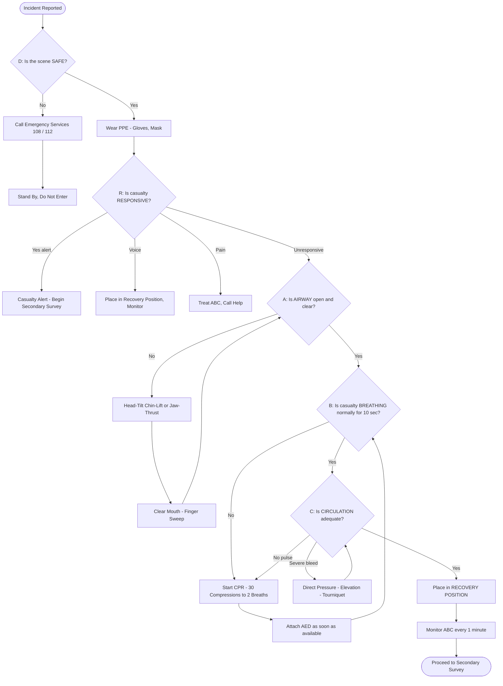
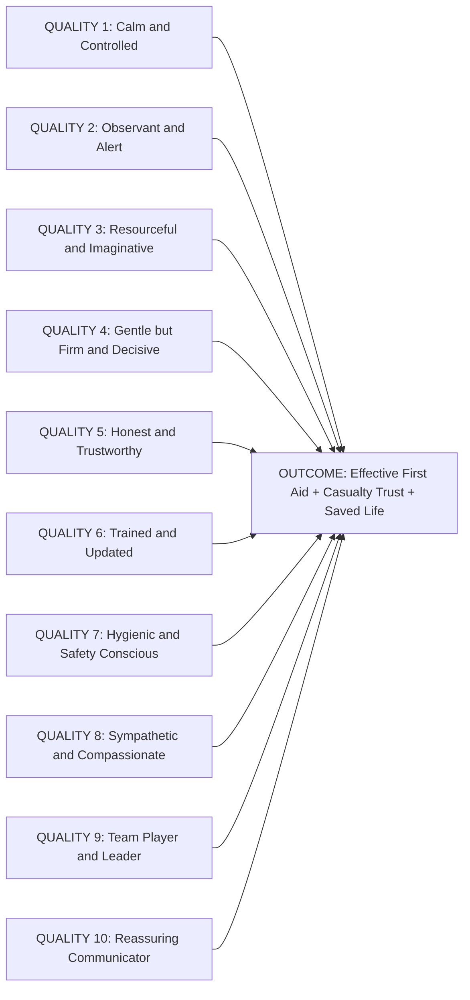
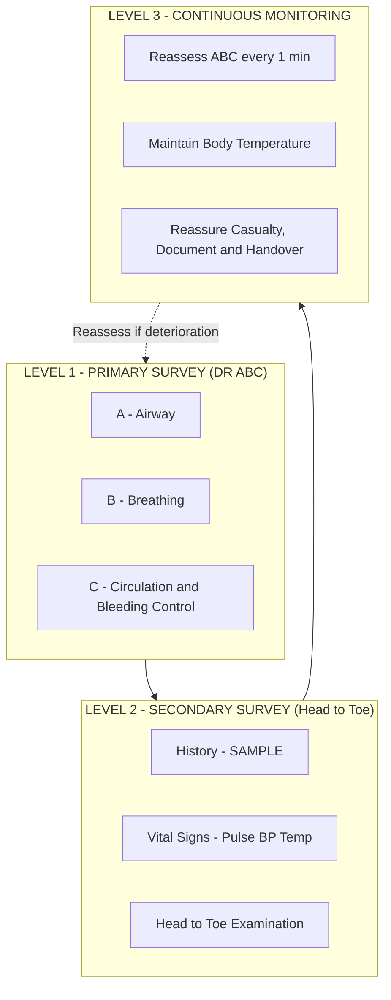

# First aid and principles of First Aid: Primary survey: ABC (Airway, Breathing, Circulation). Qualities of a Good First Aider

<!-- SECTION_1_START -->

# First Aid and Principles of First Aid: Primary Survey (ABC) and Qualities of a Good First Aider

## 1.1 Formal Definition (KTU 2024 Syllabus Terminology)

**First Aid** is the *immediate, temporary, and often life-saving* assistance given to a person who has been injured or suddenly taken ill, before the arrival of qualified medical help (doctor, ambulance, or hospital care). It is the **first** link in the **chain of survival**.

> [!IMPORTANT]
> **KTU 2024 Definition (UCHWT127):** *"First aid is the emergency care given to a sick or injured person at the site of the incident, using readily available materials and standard procedures, with the aim of preserving life, preventing the condition from worsening, and promoting recovery, until professional medical aid is obtained."*

The **Primary Survey** is the *initial, rapid, systematic assessment* of a casualty (victim) performed immediately at the scene. It identifies and manages **life-threatening conditions** in a strict priority order. The internationally accepted framework is the **ABC of First Aid**, often extended to **DR ABC** (Danger → Response → Airway → Breathing → Circulation).

| Term | Expansion | Meaning |
| :--- | :--- | :--- |
| **A** | **Airway** | Is the passage from the nose/mouth to the lungs clear? |
| **B** | **Breathing** | Is the casualty breathing normally? |
| **C** | **Circulation** | Is the heart pumping blood? Are there severe bleeds? |

## 1.2 Conceptual Analogy & Intuitive Understanding

> [!TIP]
> **Analogy — The "Building the Ladder of Survival"**
> Imagine you are a **carpenter building a ladder** to rescue someone from a deep well. You **cannot start from the top** (treatment) — you must build the ladder **from the ground up**. In the same way, the rescuer must secure the **Airway (A)** first, then **Breathing (B)**, and only then **Circulation (C)**. Skipping a rung (e.g., giving CPR without clearing the airway) is futile because oxygen cannot reach the lungs or blood even if the heart is pumping.

**Another Analogy — The Three-Layer Cake of Life:**
* **Layer 1 (Bottom): Airway** — the road that lets air in.
* **Layer 2 (Middle): Breathing** — the lungs filling the road with oxygen.
* **Layer 3 (Top): Circulation** — the delivery truck that carries oxygen to the brain.

> If the road (airway) is blocked, no oxygen can be loaded. If lungs are not working, no oxygen is loaded. If the heart stops, oxygen never reaches the brain.

## 1.3 Why Primary Survey Comes *Before* Everything Else

A first aider who runs to dress a minor finger wound while the casualty is not breathing has **failed the casualty**. The Primary Survey enforces discipline so that **only life-threatening issues** are treated in the first few seconds.

> [!NOTE]
> **Golden Rule of First Aid (KTU Board Favourite):**
> *"Treat the casualty, not the wound. Treat the most urgent thing first."*

## 1.4 The Modified Modern Sequence — DR ABC

Most modern certifying bodies (Red Cross, St. John Ambulance, AHA) teach:

$$\text{D} \;\rightarrow\; \text{R} \;\rightarrow\; \text{A} \;\rightarrow\; \text{B} \;\rightarrow\; \text{C} \;\rightarrow\; \text{D} \text{ (Defibrillation)}$$

* **D — Danger:** Ensure the *scene is safe* for you, bystanders, and the casualty (no traffic, fire, electric wires, hostile crowd).
* **R — Response:** Check if the casualty is *conscious* (tap shoulders, shout *"Are you okay?"*).
* **A — Airway:** Open and clear the airway.
* **B — Breathing:** Look, Listen, Feel for **10 seconds**.
* **C — Circulation:** Check pulse (carotid for adults; brachial for infants) and control severe bleeding.
* **D — Defibrillation (AED):** If available, attach an Automated External Defibrillator.

> [!VISUALIZATION CONTROL]
> **Concept:** The Priority Pyramid of First Aid
> **Reference Axes:** Vertical axis = Priority of treatment (top = highest), Horizontal axis = Time from incident
> **Visual Description:** A four-step pyramid. The widest bottom layer is "Safety (D — Danger)", the second layer is "Consciousness (R — Response)", the third is "Airway (A)", the fourth is "Breathing (B)", and the apex is "Circulation + Bleeding Control (C)". A red arrow on the left side labelled "URGENCY" points upward. The student should observe that without the base layers being secure, higher layers cannot be addressed safely.

---

<!-- SECTION_1_END -->

<!-- SECTION_2_START -->

# Deep Theoretical Analysis and KTU High-Yield Formula Sheet

## 2.1 The Three Aims of First Aid (3 Ps)

> [!IMPORTANT]
> Every first-aid action must align with the **3 Ps** — the KTU board examines this in 2-mark definition questions.

1. **P**reserve life — the paramount aim.
2. **P**revent the condition from worsening — avoid further harm.
3. **P**romote recovery — provide comfort and support.

## 2.2 Detailed Breakdown of the ABC Primary Survey

### **A — Airway Assessment & Management**

* **Why:** The tongue is the most common cause of airway obstruction in an unconscious casualty. The brain stops controlling muscle tone, and the tongue falls backward against the pharynx.
* **How (Adult/Child):** *Head-Tilt-Chin-Lift* manoeuvre.

$$\text{One hand on forehead (palm)} \;\rightarrow\; \text{tilt head back gently}$$
$$\text{Two fingers of other hand under chin} \;\rightarrow\; \text{lift jaw upward}$$

* **How (Suspected Spinal Injury):** *Jaw-Thrust* manoeuvre only (no head tilt), because tilting the head may damage the cervical spine.
* **Look in the mouth** for vomitus, blood, foreign bodies, broken teeth, or dentures. Remove with a finger sweep **only if solid and visible**.

> [!WARNING]
> **Common student mistake:** *Aggressive* head tilt in suspected neck injury. Always suspect spinal injury in falls from height, road accidents, and diving accidents.

### **B — Breathing Assessment**

* **Duration:** Exactly **10 seconds**. (Less than 10 seconds is unreliable; more than 10 seconds wastes critical time in cardiac arrest.)
* **Procedure: Look – Listen – Feel (LLF)**

$$\text{Look} \rightarrow \text{Chest movement (rise/fall)}$$
$$\text{Listen} \rightarrow \text{Breath sounds near mouth/nose}$$
\text{Feel} \rightarrow \text{Air movement on cheek, chest expansion under hand}$$

* **Normal adult rate:** **12 to 20 breaths per minute**.
* **Abnormal:** Gasping, slow, noisy (snoring/stridor/wheeze), or absent breathing.

### **C — Circulation Assessment & Bleeding Control**

* **Check carotid pulse** (adult) for **no more than 10 seconds**.
* **Check for severe external bleeding** — this is now considered *part of C* (catastrophic haemorrhage is the modern "C-ABC" priority in trauma — *Catastrophic bleeding → Airway → Breathing → Circulation*).
* **Control bleeding** using direct pressure → elevation → pressure bandage → tourniquet (last resort).
* **Check skin colour, temperature, and capillary refill time (CRT).**

$$\text{Normal CRT} < 2 \text{ seconds}$$

## 2.3 Recovery Position (When A, B, C are Stable but Casualty is Unconscious)

Used when the casualty is **unconscious but breathing normally** with no spinal injury. Side-lying position keeps the airway clear and prevents aspiration of vomit.

## 2.4 KTU Formula Sheet — Critical Numbers to Memorise

| Parameter | Adult | Child (1–8 yrs) | Infant (<1 yr) |
| :--- | :---: | :---: | :---: |
| **Compression : Ventilation Ratio** | **30 : 2** | **30 : 2** (1 rescuer) / **15 : 2** (2 rescuers) | **30 : 2** (1 rescuer) / **15 : 2** (2 rescuers) |
| **Compression Rate (per minute)** | **100 – 120** | **100 – 120** | **100 – 120** |
| **Compression Depth** | **5 – 6 cm** | **5 cm** (≈ 1/3 chest depth) | **4 cm** (≈ 1/3 chest depth) |
| **Hand Position** | Two hands, lower half of sternum | One or two hands | Two fingers (one rescuer) / Two-thumb encircling (two rescuers) |
| **Rescue Breath Duration** | **1 second** | **1 second** | **1 second** |
| **Initial Rescue Breaths** | 2 | 5 | 5 |
| **Breath Check Duration** | **10 seconds** | **10 seconds** | **10 seconds** |
| **Recovery Position Arm Angle** | **90°** | **90°** | **90°** |

## 2.5 Real-World Utility of the ABC Framework

* **Engineering/Industrial Sites:** Trauma from falls, electrocution, machine entanglement — first responder on site uses ABC before the occupational health centre doctor arrives.
* **Computer-Science/AI applications:** Modern *triage decision-support software* (e.g., emergency call dispatch AI, hospital triage kiosks) embeds the ABC decision tree as a clinical algorithm.
* **Sports & Fitness:** Coaches and gym trainers use the same sequence on athletes who collapse (cardiac arrest, heat stroke).
* **Disaster Management:** Search-and-rescue teams, NDRF, civil defence volunteers — all are trained in DR ABC.

> [!NOTE]
> **Industrial Engineering Link:** The ABC framework mirrors a **fault-tree analysis** in reliability engineering — you fix the *root cause* (airway) before the *downstream effect* (oxygenation, perfusion). The 30:2 ratio is essentially a **redundancy ratio** in a man–machine system.

---

<!-- SECTION_2_END -->

<!-- SECTION_3_START -->

# Step-by-Step Procedures, Derivations, and Practical Implementation

## 3.1 Exhaustive Step-by-Step Primary Survey Procedure (DR ABC)

> [!NOTE]
> Every step is expanded in full. *No step is omitted.* KTU examiners look for this systematic listing.

### **Step 1 — D: Danger Assessment**
1. Stop, observe the scene for **5 seconds**.
2. Look for: traffic, fire, live electric wires, smoke, gas leak, hostile crowd, unstable structures, biological hazards (blood spills).
3. Wear **personal protective equipment (PPE)** if available — gloves, mask, eye protection.
4. If danger exists, **do not enter**. Call emergency services first.

### **Step 2 — R: Response Check**
1. Tap the casualty's shoulders firmly (avoid violent shaking).
2. Shout loudly in **both ears**: *"Can you hear me? Open your eyes!"*
3. Categorise response using **AVPU scale:**

$$\text{A} = \text{Alert} \quad \text{V} = \text{Voice responsive} \quad \text{P} = \text{Pain responsive} \quad \text{U} = \text{Unresponsive}$$

4. If unresponsive → call for help and proceed to **A**.

### **Step 3 — A: Airway**
1. Place the casualty **flat on the back** on a hard surface.
2. Open the airway using **Head-Tilt-Chin-Lift** (no spinal injury) or **Jaw-Thrust** (spinal injury suspected).
3. Inspect mouth; clear visible obstructions with a finger sweep.
4. Keep airway open using a **recovery position** if breathing resumes.

### **Step 4 — B: Breathing**
1. Place your ear near the casualty's mouth and nose, cheek facing the chest.
2. **Look** at the chest for 10 seconds.
3. **Listen** for breath sounds.
4. **Feel** for exhaled air on your cheek.
5. If breathing normally → **Recovery Position** + monitor.
6. If NOT breathing → **2 initial rescue breaths** (5 for child/infant) → proceed to **C**.

### **Step 5 — C: Circulation**
1. **Check carotid pulse** for maximum 10 seconds (brachial in infant).
2. If pulse present, breathing absent → **Rescue Breathing only** (1 breath every 5–6 sec adult; 3 sec child/infant).
3. If no pulse → **Start CPR** (chest compressions + rescue breaths at the table ratio above).
4. **Scan for severe bleeding**: scalp wounds, amputations, arterial spurts.
5. Control bleeding: **Direct pressure → Elevation → Pressure bandage → Tourniquet (last resort)**.

### **Step 6 — D (Defibrillation)**
* Attach AED as soon as available. Follow voice prompts. Resume CPR immediately after shock.

## 3.2 Step-by-Step Placement into Recovery Position

1. Kneel beside the casualty. Straighten both legs.
2. Place the **near arm** at right angle to the body, elbow bent, palm up.
3. Bring the **far arm** across the chest, hand on the near shoulder.
4. Bend the **far leg** at the knee, foot flat on the ground.
5. **Roll the casualty toward you** by pulling the far knee and shoulder.
6. Tilt the head back slightly to keep airway open.
7. Place the **top hand under the cheek** to support the head.
8. Monitor breathing continuously.

## 3.3 Step-by-Step CPR Derivation (Compression–Ventilation Logic)

The **30:2 ratio** is derived from the empirical fact that the average rescuer performs **compressions continuously for ~18 seconds** at 100–120/min, after which **2 effective breaths** take ~4 seconds, summing to one 30-compression cycle of ~22 seconds → this preserves coronary and cerebral perfusion pressure.

$$\text{Compressions per minute} = \frac{30 \text{ compressions}}{18 \text{ seconds}} \times 60 \text{ s} \approx 100 \text{ cpm}$$

## 3.4 Practical/Laboratory Table — First Aid Kit Standard (IS: 13416 / KTU Reference)

> [!NOTE]
> The following table is a **practical demonstration aid** — KTU may ask *"List 8 items in a standard first aid box"* (3-mark question).

| Sl. No. | Item | Quantity | Use |
| :---: | :--- | :---: | :--- |
| 1 | Sterile gauze pads (various sizes) | 12 | Dressing wounds, control bleeding |
| 2 | Adhesive bandages (Band-Aids) | 20 | Minor cuts, abrasions |
| 3 | Antiseptic solution (Dettol/Savlon) | 100 mL | Wound cleaning |
| 4 | Roller bandages (5 cm, 10 cm) | 4 each | Support, pressure dressing |
| 5 | Triangular bandage | 2 | Slings, arm support |
| 6 | Adhesive tape (1 inch) | 1 roll | Securing dressings |
| 7 | Scissors (blunt-tipped) | 1 | Cutting tape, clothes |
| 8 | Safety pins | 6 | Securing slings, bandages |
| 9 | Disposable gloves (pair) | 4 | Infection control, PPE |
| 10 | CPR face shield / pocket mask | 1 | Safe rescue breathing |
| 11 | Thermal / space blanket | 1 | Prevent hypothermia |
| 12 | Sterile eye pad | 2 | Eye injury dressing |
| 13 | Burn dressing / gel | 1 | Burns management |
| 14 | Torch (penlight) | 1 | Pupil check, dark areas |
| 15 | Note pad and pencil | 1 | Recording vitals, times |
| 16 | List of emergency phone numbers | 1 | Quick reference |

## 3.5 Symbolic / Code Implementation — Triage Priority Tagger (Pseudo-Logic for Health Tech)

> [!TIP]
> The following Python function models a *clinical-decision ABC triage algorithm* used in AI triage systems (mimics the Primary Survey). It demonstrates how the ABC rules can be encoded for engineering applications.

```python
from enum import Enum
from dataclasses import dataclass
import logging

logging.basicConfig(level=logging.INFO, format="%(asctime)s | %(levelname)s | %(message)s")

class AirwayStatus(Enum):
    CLEAR = "CLEAR"
    OBSTRUCTED = "OBSTRUCTED"

class BreathingStatus(Enum):
    NORMAL = "NORMAL"
    ABNORMAL = "ABNORMAL"
    ABSENT = "ABSENT"

class CirculationStatus(Enum):
    PULSE_PRESENT = "PULSE_PRESENT"
    NO_PULSE = "NO_PULSE"
    SEVERE_BLEED = "SEVERE_BLEED"

class TriagePriority(Enum):
    P1_CRITICAL = "P1 - Immediate (Red)"
    P2_URGENT = "P2 - Delayed (Yellow)"
    P3_MINOR = "P3 - Minor (Green)"

@dataclass
class Casualty:
    casualty_id: str
    airway: AirwayStatus
    breathing: BreathingStatus
    circulation: CirculationStatus

    def is_unresponsive(self: "Casualty") -> bool:
        return self.breathing == BreathingStatus.ABSENT

def primary_survey(casualty: Casualty) -> TriagePriority:
    """Implements DR ABC primary survey logic — returns KTU triage tag."""

    if casualty.circulation == CirculationStatus.SEVERE_BLEED:
        logging.warning(f"[{casualty.casualty_id}] CATASTROPHIC BLEED detected -> control first.")
        return TriagePriority.P1_CRITICAL

    if casualty.airway == AirwayStatus.OBSTRUCTED:
        logging.info(f"[{casualty.casualty_id}] Open airway (Head-Tilt-Chin-Lift).")
        return TriagePriority.P1_CRITICAL

    if casualty.breathing == BreathingStatus.ABSENT:
        logging.info(f"[{casualty.casualty_id}] Begin rescue breathing / CPR.")
        return TriagePriority.P1_CRITICAL

    if casualty.circulation == CirculationStatus.NO_PULSE:
        logging.info(f"[{casualty.casualty_id}] Start chest compressions (CPR 30:2).")
        return TriagePriority.P1_CRITICAL

    if casualty.breathing == BreathingStatus.ABNORMAL:
        logging.info(f"[{casualty.casualty_id}] Place in recovery position, monitor.")
        return TriagePriority.P2_URGENT

    logging.info(f"[{casualty.casualty_id}] Stable -> secondary survey.")
    return TriagePriority.P3_MINOR

if __name__ == "__main__":
    sample = Casualty("C-007", AirwayStatus.CLEAR, BreathingStatus.NORMAL, CirculationStatus.PULSE_PRESENT)
    tag = primary_survey(sample)
    print(f"Final Triage Tag: {tag.value}")
```

> **Engineering Insight:** This algorithm is the **exact decision tree** used in modern emergency-dispatch software (e.g., the *ProQA* system used by 911/108 dispatchers). A B.Tech student who understands this can transition into **Health Tech / MedTech software engineering**.

---

<!-- SECTION_3_END -->

<!-- SECTION_4_START -->

# Structural Diagrams and Schematics

## 4.1 Mermaid Flowchart — The DR ABC Primary Survey Algorithm



## 4.2 Mermaid Block Diagram — Qualities of a Good First Aider



## 4.3 Mermaid Subgraph — Hierarchy of Casualty Assessment



## 4.4 Sequential Topology Matrix — Triage Colour Coding (Engineering-First Aid Mapping)

| Triage Tag | Colour | Priority | ABC Status | Action Time | Engineering Analogy |
| :---: | :--- | :--- | :--- | :--- | :--- |
| **P1** | **Red** | Immediate | One or more of A/B/C compromised | Within minutes | Critical bug — hotfix deploy |
| **P2** | **Yellow** | Urgent | ABC stable but serious injury | Within 1 hour | High-priority ticket |
| **P3** | **Green** | Minor | Walking wounded | Within 4 hours | Standard backlog |
| **P0** | **Black / White** | Expectant / Deceased | No signs of life, irreversible | Documentation | Service deprecated |

---

<!-- SECTION_4_END -->

<!-- SECTION_5_START -->

# KTU 2024 Scheme Examination Question Bank and Topic Recap

## 5.1 Part A — Short Answer Questions (3 Marks Each)

### **Q1.** Define First Aid. State any **four** principles of First Aid. **[CO1, Remember] — 3 Marks** `[KTU University Exam - July 2024]`

**Model Answer:**
* **Definition (1 Mark):** First aid is the immediate emergency care given to a sick or injured person at the site of the incident, using readily available materials, with the aim of preserving life, preventing further harm, and promoting recovery, until professional medical help arrives.
* **Any Four Principles (½ Mark each = 2 Marks):**
  1. Preserve life — the foremost aim.
  2. Prevent the condition from worsening (avoid infection, further injury).
  3. Promote recovery (comfort, reassurance, rest).
  4. Do no harm — never attempt procedures beyond your training.
  5. Call for professional help early.
  6. Stay calm and reassure the casualty.
  7. Maintain hygiene to prevent infection.

> [!NOTE]
> **Valuation Tip:** Award ½ mark per principle. Writing the 3 Ps alone is only 1½ marks. The examiner expects at least 4 distinct points.

### **Q2.** What is the **Primary Survey** in First Aid? List the components of the **ABC** in order. **[CO1, Understand] — 3 Marks** `[KTU University Exam - Dec 2023]`

**Model Answer:**
* **Primary Survey (1 Mark):** It is the rapid, systematic initial assessment of a casualty performed at the scene to identify and manage *life-threatening conditions* in order of priority, before any detailed examination.
* **ABC Components (1 Mark total — ⅓ Mark each):**
  * **A** — **Airway:** Check and open the airway using Head-Tilt-Chin-Lift.
  * **B** — **Breathing:** Look, Listen, Feel for 10 seconds.
  * **C** — **Circulation:** Check pulse and control severe bleeding.

  *(For full 1 mark, write the action associated with each letter.)*
* **Order of priority (½ Mark):** Airway → Breathing → Circulation. A is treated before B, B before C.
* **Extension (½ Mark — bonus):** Modern sequence is **D – R – A – B – C** adding Danger and Response.

---

## 5.2 Part B — Long Answer Questions (14 Marks)

> [!IMPORTANT]
> **KTU Pattern:** Two sub-parts, **Part (a) for 7 marks** (Understand/Apply) and **Part (b) for 7 marks** (Apply/Analyse). An internal choice between **Question A** and **Question B** is given.

---

### **Question A (14 Marks)** `[KTU University Exam - July 2024]`

#### **Q A (a)** Explain the **Primary Survey (DR ABC)** in detail. State what you will do at each step. **[7 Marks — CO1, Understand]**

**Model Answer (7 Marks):**

**(i) Introduction (1 Mark):** The Primary Survey is a rapid, structured assessment that follows the sequence **D – R – A – B – C**. The aim is to detect and treat life-threatening conditions in strict order of priority within the first few seconds.

**(ii) Step-by-Step Explanation (5 Marks — 1 Mark per letter):**

| Step | Action |
| :--- | :--- |
| **D — Danger** | Scan the scene for hazards (traffic, fire, electric wires). Ensure safety of rescuer, casualty, and bystanders. Wear PPE. |
| **R — Response** | Tap shoulders, shout *"Are you OK?"*. Categorise using **AVPU** scale (Alert, Voice, Pain, Unresponsive). |
| **A — Airway** | Place casualty flat on back. Open airway with **Head-Tilt-Chin-Lift** (or **Jaw-Thrust** if spinal injury). Clear visible obstructions. |
| **B — Breathing** | Look, Listen, Feel for **10 seconds**. If absent, give **2 initial rescue breaths** (5 for child/infant). |
| **C — Circulation** | Check **carotid pulse** for ≤10 seconds. If no pulse → start **CPR (30:2)**. Control severe bleeding using direct pressure. |

**(iii) Conclusion (1 Mark):** Once ABC is stable, place the unconscious-but-breathing casualty in the **Recovery Position** and proceed to the **Secondary Survey** (head-to-toe check).

---

#### **Q A (b)** List and explain **any eight qualities of a Good First Aider**. Why are these qualities important in real-life emergency situations? **[7 Marks — CO2, Apply]**

**Model Answer (7 Marks):**

**Introduction (1 Mark):** A first aider is often the *only* link between life and death in the golden minutes. The personality, training, and conduct of the first aider determine the outcome as much as the medical procedure itself.

**Eight Qualities (4 Marks — ½ Mark each):**

1. **Calm and Controlled** — Panic spreads to the casualty. A calm rescuer thinks clearly and reassures others.
2. **Observant and Alert** — Notices subtle signs (skin colour, pupil size, breathing pattern) that guide treatment.
3. **Resourceful and Imaginative** — Uses available materials (e.g., a rolled jacket as a neck roll, a belt as a tourniquet).
4. **Gentle but Firm and Decisive** — Acts promptly and confidently, yet handles the casualty without causing pain.
5. **Honest and Trustworthy** — Does not overstate skills, respects casualty's privacy, does not steal.
6. **Trained and Updated** — Possesses a valid first aid certificate; refreshes skills every 2–3 years.
7. **Hygienic and Safety-Conscious** — Wears gloves, washes hands, prevents cross-infection.
8. **Sympathetic and Compassionate** — Provides emotional comfort; treats casualty with dignity regardless of age, gender, or background.

**Importance in Real-Life Emergencies (2 Marks):** In a road accident, a calm first aider prevents secondary collisions by parking safely, alerting traffic, and triaging. In a home cardiac arrest, decisive action within 4 minutes can double survival. Sympathy and trust encourage the casualty to share symptoms (e.g., chest pain vs. indigestion), enabling accurate treatment. The combination of technical training **and** humane qualities is what separates a *Good* first aider from merely a *trained* one.

> [!WARNING]
> **Examiner Pitfall — Common Mark Losers:**
> 1. Writing only 4–5 qualities (loses 2–3 marks). The question asks for **eight**.
> 2. Listing qualities *without explaining* their importance. KTU awards ½ mark per quality *and* 2 marks for real-life application.
> 3. Confusing "qualities of a first aider" with "principles of first aid". The former is *personal traits*; the latter is *guiding rules*.

---

### **Question B (14 Marks) — Internal Choice** `[KTU University Exam - Dec 2023]`

#### **Q B (a)** Describe the **Head-Tilt-Chin-Lift** and **Jaw-Thrust** manoeuvres. In which situations is each used? **[7 Marks — CO2, Apply]**

**Model Answer (7 Marks):**

**Anatomy of Obstruction (1 Mark):** In an unconscious casualty lying on the back, the tongue and epiglottis fall backward against the pharyngeal wall, blocking the airway. The most common airway obstruction in the unconscious patient is therefore the **tongue**, not a foreign object.

**Head-Tilt-Chin-Lift (3 Marks):**

* **Method:** Place one hand on the casualty's forehead. Place the tips of two fingers of the other hand under the bony part of the chin (not the soft tissue). Gently tilt the head backward by pressing on the forehead, while simultaneously lifting the chin upward. This lifts the tongue away from the back of the throat.
* **Indication:** Used in **all unconscious casualties** when *no spinal injury is suspected*.
* **Precaution (½ Mark):** Do not press on the soft tissue under the chin — this can push the tongue back and worsen the obstruction.

**Jaw-Thrust (2 Marks):**

* **Method:** Kneel above the casualty's head. Place fingers behind the angles of the lower jaw on both sides. Lift the jaw forward (upward) without tilting the head. The mouth opens slightly.
* **Indication:** Used when **cervical spine (neck) injury is suspected** — road accidents, falls from height, diving accidents, contact sports injuries.
* **Rationale (½ Mark):** It opens the airway **without moving the neck**, preventing secondary spinal cord damage.

**Comparison (½ Mark):** Head-Tilt-Chin-Lift is simpler and more effective in routine cases. Jaw-Thrust is the *only* safe choice in suspected neck injury but is technically harder and more fatiguing for the rescuer.

---

#### **Q B (b)** A 45-year-old man collapses at a college sports ground. As the first person to reach him, describe in order what you will do using the **DR ABC** approach until the ambulance arrives. **[7 Marks — CO3, Apply/Analyse]**

**Model Answer — Scenario-based Application (7 Marks):**

**Step 1 — D: Danger (½ Mark):** Look around the ground. No live wires, no traffic. Wear gloves if available (from the sports first-aid kit). Confirm scene is safe.

**Step 2 — R: Response (½ Mark):** Tap his shoulders firmly. Shout *"Open your eyes! Can you hear me?"* He does not respond. Treat as **unresponsive**.

**Step 3 — Call for Help (½ Mark):** Shout for a bystander. Instruct them clearly: *"Call 108, bring the AED and the first aid kit."* Do not leave the casualty.

**Step 4 — A: Airway (1 Mark):** Place him flat on his back on the hard ground. Open the airway using **Head-Tilt-Chin-Lift** (no obvious neck injury). Look inside the mouth — clear of blood, food, or dentures.

**Step 5 — B: Breathing (1 Mark):** Place cheek near his mouth. Look, Listen, Feel for **10 seconds**. **No chest rise, no breath sound, no air on cheek.** He is **not breathing**.

**Step 6 — C: Circulation (1 Mark):** Check **carotid pulse** for ≤10 seconds. **No pulse palpable.** Diagnose **Cardiac Arrest**.

**Step 7 — Initiate CPR (1 Mark):**
* Kneel beside him.
* Place heel of one hand on the **lower half of sternum**, other hand on top, interlock fingers, keep arms straight.
* Compress **5–6 cm deep** at a rate of **100–120 per minute**.
* After **30 compressions**, give **2 rescue breaths** (1 sec each) using a pocket mask.
* Continue cycles of **30:2**.
* As soon as AED arrives, switch it on, attach pads, follow voice prompts — shock if advised, then resume CPR immediately.

**Step 8 — Continuous Action (½ Mark):** Continue CPR without interruption until the ambulance arrives, the casualty shows signs of life, or you are exhausted. Reassess ABC every 1–2 minutes.

**Step 9 — Handover (½ Mark):** When paramedics arrive, give a structured handover using the **SAMPLE** history (Signs/Symptoms, Allergies, Medications, Past medical history, Last oral intake, Events leading to incident). Document the time of collapse and the time CPR was started.

> [!WARNING]
> **Examiner Pitfall — Common Mark Losers:**
> 1. Skipping the **D (Danger)** step — KTU explicitly tests this. *(−1 mark)*
> 2. Saying *"check pulse for 30 seconds"* — the correct limit is **10 seconds**. *(−1 mark)*
> 3. Compressing at the *"centre of the chest"* without specifying *"lower half of sternum"*. *(−½ mark)*
> 4. Forgetting to mention **AED usage** in 2024. *(−½ mark)*
> 5. Not specifying **CPR ratio 30:2** in numbers. *(−1 mark)*

---

## 5.3 KTU Examiner's Final Valuation Warning

> [!WARNING]
> **TOP THREE REASONS STUDENTS LOSE MARKS IN THIS MODULE:**
> 1. **Confusing the sequence** — writing A, B, C, D instead of D, R, A, B, C. The modern sequence is **DR ABC**; the older sequence is **ABC**. State which one you are following.
> 2. **Forgetting "D — Danger"** — examiners specifically allocate 1–2 marks for the safety check. Many students rush into treatment.
> 3. **Writing generic "be calm, be kind" answers for qualities** — these earn ½ mark each at best. The board expects 8 *distinct* qualities with *application examples* (e.g., *"Sympathetic — reassures a frightened child during dressing of a burn"*).
> 4. **Omitting the numbers** — always quote 30:2, 100–120 cpm, 5–6 cm, 10 seconds. Numbers convert a 5-mark answer into a 7-mark answer.
> 5. **Not drawing the recovery position** — even a rough stick diagram is worth 1 mark in Part B.

---

## 5.4 Topic Recap & Important Things to Remember

> [!TIP]
> **Rapid Revision Checklist — Print This Before the Exam**

- **First Aid** = immediate, temporary care at the site; *first link* in the chain of survival.
- **Three Aims (3 Ps)** = Preserve life, Prevent worsening, Promote recovery.
- **Primary Survey** = rapid assessment for *life-threatening* conditions.
- **DR ABC** = Danger → Response → Airway → Breathing → Circulation (→ Defibrillation).
- **Modern Trauma Priority** = **C-ABC** (Catastrophic bleeding first).
- **A — Airway manoeuvre:** Head-Tilt-Chin-Lift (routine) | Jaw-Thrust (suspected spinal injury).
- **Commonest airway obstruction** = the **tongue** in unconscious patients.
- **B — Breathing check:** Look, Listen, Feel for **exactly 10 seconds**.
- **Normal adult breathing rate:** **12 – 20 breaths/min**.
- **C — Circulation:** Check **carotid pulse** (adult) / **brachial pulse** (infant) for **≤10 seconds**.
- **CPR ratio (adult):** **30 compressions : 2 breaths**.
- **CPR rate:** **100 – 120 / minute**.
- **CPR depth:** **5 – 6 cm (adult)**, **5 cm (child)**, **4 cm (infant)**.
- **Recovery position** is for *unconscious + breathing + no spinal injury*.
- **AED** must be attached as soon as it is available in cardiac arrest.
- **First aid kit (IS 13416 standard)** — minimum 16 essential items (see Section 3.4 table).
- **Qualities of a Good First Aider (8 must-knows):** Calm, Observant, Resourceful, Gentle-but-Firm, Honest, Trained, Hygienic, Sympathetic.
- **Hand position for compressions:** **Lower half of the sternum**, two hands, arms straight.
- **Do NOT:** tilt head if neck injury suspected, press on soft tissue under chin, give food or water to unconscious casualty, leave casualty alone, perform procedures beyond your training.
- **Golden Rule:** *Treat the casualty, not the wound.*
- **Universal Emergency Number (India):** **112** (single emergency number) / **108** (ambulance).
- **Compression-only CPR** is acceptable when rescuer is unwilling/unable to give rescue breaths.
- **Handover to paramedics** uses the **SAMPLE** mnemonic: **S**ymptoms, **A**llergies, **M**edications, **P**ast history, **L**ast oral intake, **E**vents.

> [!NOTE]
> **KTU 2024 Scheme Alignment:** This topic is mapped to **CO1** (Recall health emergency principles) and **CO2** (Apply first-aid techniques in simulated scenarios). Bloom's cognitive levels tested: **Remember, Understand, Apply, Analyse**. A 14-mark Part B question typically distributes marks as *Understand (3–4) + Apply (4–5) + Analyse (4–5) + Diagram/Values (1–2)*.

---

<!-- SECTION_5_END -->
