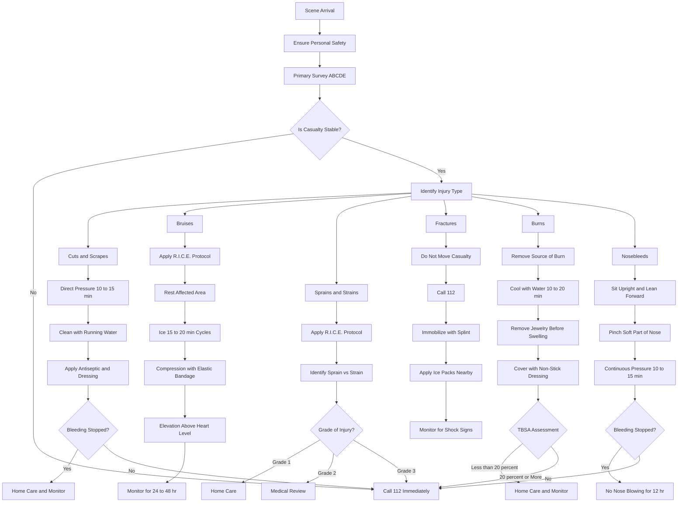
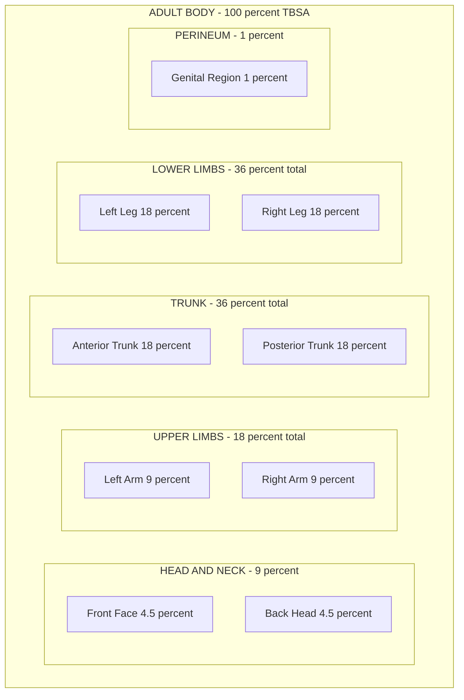
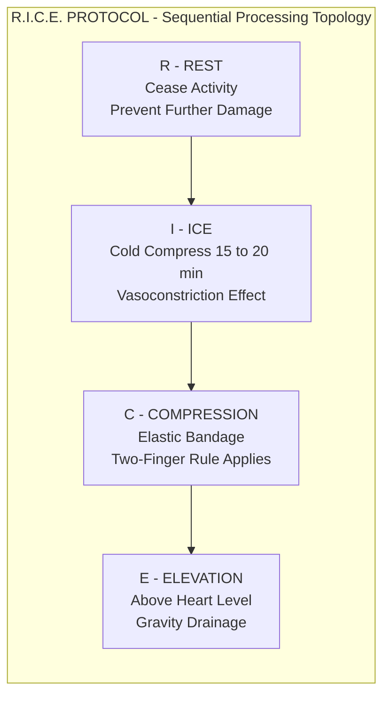
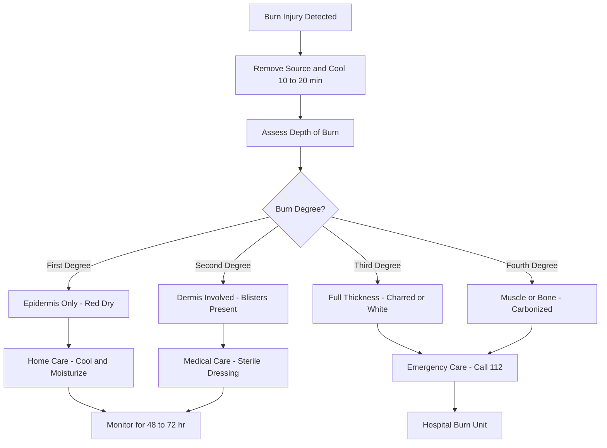
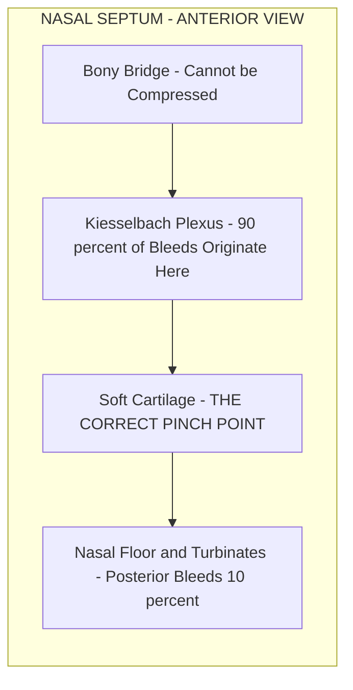
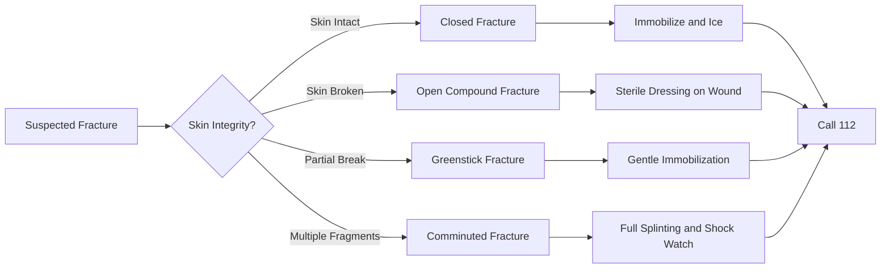

# First aid measures for: - Cuts and scrapes - Bruises - Sprains - Strains - Fractures - Burns - Nosebleeds

<!-- SECTION_1_START -->

# First Aid Measures for Common Injuries

## 1. Core Technical Definition & Intuitive Overview

### 1.1 Formal Academic Definition

> [!IMPORTANT]
> **First Aid** is the **immediate, temporary, and non-invasive care** given to a person who has been injured or suddenly taken ill, before the arrival of qualified medical assistance. It is guided by three core principles derived from the **Universal Emergency Action Principle** *(Dr. David H. Manheim, 1967)*: **Preserve Life, Prevent Further Harm, and Promote Recovery.**

In the context of the **KTU 2024 Scheme (Course Code: UCHWT127 — Health and Wellness, Module 4)**, first aid is taught as a **practical life-skill discipline** that integrates basic anatomy, hygiene, and emergency response. The **Primary Survey (ABC Protocol)** — **Airway, Breathing, Circulation** — is the foundational triage algorithm applied before any specific wound management.

### 1.2 Conceptual Analogy / Intuition

> [!NOTE]
> **Intuitive Analogy — "The First Responder is a Temporary Bridge"**
>
> Imagine a busy road (the human body) where an accident has just occurred (injury/illness). The first responder (first-aider) is not a mechanic or engineer (doctor). Instead, they are a **traffic police officer** who:
> 1. **Stops further damage** (prevents the injured from moving into more danger),
> 2. **Controls the scene** (clears airway, stops bleeding), and
> 3. **Hands over the situation** smoothly to the ambulance crew (qualified medical team).
>
> The body, just like that road, will deteriorate rapidly without this initial bridge of care.

### 1.3 Key Principles Highlighted in the KTU Syllabus

> [!IMPORTANT]
> **KTU Module 4 — High-Yield Syllabus Highlights:**
> - The **ABC of First Aid** (Airway → Breathing → Circulation)
> - **Recovery Position** for unconscious but breathing casualties
> - Distinction between **Open vs. Closed Wounds**
> - **R.I.C.E. Protocol** for soft-tissue injuries (Rest, Ice, Compression, Elevation)
> - The **Rule of Nines** for burn assessment
> - **Golden Hour Concept** (the first 60 minutes after trauma, critical for survival)

> [!VISUALIZATION CONTROL]
> **Concept:** Body Surface Area — Rule of Nines (Adult)
> **GeoGebra / Desmos Input Equations (Schematic):**
> * Head and Neck = $9\%$
> * Each Upper Limb = $9\%$
> * Anterior Trunk = $18\%$
> * Posterior Trunk = $18\%$
> * Each Lower Limb = $18\%$
> * Perineum = $1\%$
>
> **Visual Description:** The student should picture a human silhouette divided into segments where each major region represents a multiple of 9% of the total body surface area (TBSA). This is the standard tool for **estimating burn severity**.

---

## 2. Universal Preliminary Step: The Primary Survey (ABC)

Before administering any specific first aid for cuts, burns, fractures, or nosebleeds, the rescuer **must always** complete the **Primary Survey**. The KTU 2024 Scheme explicitly mandates this sequence.

> [!IMPORTANT]
> **The ABCDE Mnemonic (Expanded KTU Standard):**
>
> | Step | Full Form | Action Required |
> |---|---|---|
> | **A** | Airway | Open and clear the airway (head-tilt, chin-lift). |
> | **B** | Breathing | Check for chest rise, listen/feel for breath (10 seconds). |
> | **C** | Circulation | Check pulse, control any major bleeding. |
> | **D** | Disability | Assess level of consciousness (AVPU scale). |
> | **E** | Exposure | Examine the patient fully while preventing hypothermia. |

The remaining sections of this note assume that the **Primary Survey has been completed** and the casualty is stable, breathing, and not in life-threatening hemorrhagic shock.

---

## 3. Topic-Specific Definitions

### 3.1 Cuts and Scrapes (Abrasions & Lacerations)
A **cut (laceration)** is a clean or jagged break in the skin caused by a sharp object. A **scrape (abrasion)** is a superficial wound where the top layer of skin is rubbed away. They are classified as **Open Wounds** in the KTU syllabus.

### 3.2 Bruises (Contusions)
A **bruise (contusion)** is a **closed wound** caused by blunt trauma that ruptures small blood vessels (capillaries) beneath the skin, leading to localized discoloration and swelling **without breaking the skin**.

### 3.3 Sprains vs. Strains
- A **Sprain** is the stretching or tearing of **ligaments** (the tough bands connecting bone to bone at a joint).
- A **Strain** is the stretching or tearing of **muscles or tendons** (the fibrous cords connecting muscle to bone).

### 3.4 Fractures
A **fracture** is a partial or complete break in the continuity of a bone, typically caused by high-force impact, stress, or medical conditions like osteoporosis.

### 3.5 Burns
A **burn** is tissue damage caused by heat, chemicals, electricity, sunlight, or radiation. The KTU syllabus classifies them into **First-Degree (Superficial)**, **Second-Degree (Partial Thickness)**, and **Third-Degree (Full Thickness)** burns.

### 3.6 Nosebleeds (Epistaxis)
**Epistaxis** is the medical term for bleeding from the tissues lining the inside of the nose. It is the most common type of minor hemorrhage and is usually classified as **Anterior (90% of cases)** or **Posterior (10%, more severe)**.

<!-- SECTION_1_END -->

<!-- SECTION_2_START -->

# Deep Theoretical Analysis & KTU High-Yield Formula Sheet

## 1. Cuts and Scrapes — Theoretical Framework

### 1.1 Why and How They Heal
When the skin is breached, the body triggers the **Hemostasis Cascade**, forming a fibrin clot to seal the wound. The KTU 2024 syllabus emphasizes the **Three Phases of Wound Healing**:

1. **Inflammatory Phase (0–3 days):** WBCs (neutrophils, macrophages) clean the wound.
2. **Proliferative Phase (3–21 days):** New tissue (granulation) and collagen form.
3. **Remodeling Phase (21 days – 2 years):** Collagen reorganizes, scar matures.

### 1.2 Step-by-Step First Aid Logic
- **Why stop bleeding first?** Because uncontrolled hemorrhage is the leading preventable cause of death in trauma.
- **Why clean with water, not hydrogen peroxide?** Alcohol and hydrogen peroxide can damage healthy tissue and delay healing. Mild, clean running water is the **WHO-recommended standard**.
- **Why apply a sterile dressing?** To prevent bacterial contamination and absorb exudate.

> [!NOTE]
> **Key Threshold:** A cut longer than **1 cm (≈ 0.4 inches)** with gaping edges usually requires **sutures (stitches)** by a medical professional.

### 1.3 The "When to Seek Help" Triggers
> [!WARNING]
> - Bleeding does not stop after **10–15 minutes** of direct pressure.
> - The wound is **deeper than 0.5 cm** or exposes fat/muscle/bone.
> - Caused by a **rusty, dirty, or animal-contaminated** object.
> - Patient's last **tetanus shot** was more than **5–10 years** ago.

---

## 2. Bruises (Contusions) — Theoretical Framework

### 2.1 The Discoloration Science
The color change in a bruise follows a predictable **heme-degradation pathway**:
- **0–2 days:** Reddish (oxyhemoglobin)
- **2–5 days:** Bluish-purple (deoxyhemoglobin)
- **5–7 days:** Greenish (biliverdin)
- **7–14 days:** Yellow-brown (bilirubin) → fades

### 2.2 The R.I.C.E. Protocol Logic
> [!IMPORTANT]
> **R.I.C.E. — Standard Soft-Tissue First Aid:**
> - **R — Rest:** Prevent further tissue damage.
> - **I — Ice:** Vasoconstriction reduces swelling and pain (apply **15–20 min** intervals).
> - **C — Compression:** Elastic bandage limits internal bleeding.
> - **E — Elevation:** Gravity reduces blood pooling (raise above heart level).

> [!NOTE]
> **Modern Update — The P.R.I.C.E. Mnemonic:** Protection is sometimes prepended, and **M** (Mobilization) added. The 2019 update by the **National Athletic Trainers' Association (NATA)** now recommends **P.E.A.C.E & L.O.V.E.** (Protection, Elevation, Avoid anti-inflammatories, Compression, Education; Load, Optimism, Vascularisation, Exercise) — but **R.I.C.E. remains the KTU 2024 syllabus standard**.

---

## 3. Sprains and Strains — Theoretical Framework

### 3.1 Grading Severity
| Grade | Tissue Damage | Symptoms |
|---|---|---|
| **Grade I (Mild)** | Microscopic fiber tearing | Mild pain, minimal swelling |
| **Grade II (Moderate)** | Partial ligament/muscle tear | Noticeable swelling, loss of function |
| **Grade III (Severe)** | Complete rupture | Severe pain, instability, large swelling |

### 3.2 The Anatomical Logic
- A **sprain** typically affects **joints** (ankle, wrist, knee).
- A **strain** typically affects the **muscle belly** or **musculotendinous junction** (hamstring, lower back).

---

## 4. Fractures — Theoretical Framework

### 4.1 Classification (KTU High-Yield)
| Type | Description | First Aid Note |
|---|---|---|
| **Closed (Simple)** | Skin intact | Easier to manage, but internal bleeding still possible. |
| **Open (Compound)** | Bone pierces skin | **High infection risk**; cover with sterile dressing. |
| **Greenstick** | Incomplete break (common in children) | Often mistaken for a sprain. |
| **Comminuted** | Bone shattered into ≥ 3 pieces | High shock risk; minimal movement. |
| **Displaced** | Bone ends misaligned | Do NOT attempt realignment. |
| **Stress** | Hairline crack from repetitive force | Common in runners; rest essential. |

### 4.2 Splinting Logic
**The 3 S's of Splinting:**
- **S — Splint:** Immobilize the joint **above and below** the fracture.
- **S — Slings:** Support the upper limb.
- **S — Secure:** Tie with broad bandages (never narrow strings → can cut circulation).

---

## 5. Burns — Theoretical Framework

### 5.1 The "Rule of Nines" (Wallace Rule)
This is a quick **TBSA (Total Body Surface Area) estimation tool** used in adults:

$$\text{TBSA Burned} = \sum (\text{Anatomic Region} \times \text{Percentage Multiplier})$$

| Region | Adult % | Infant % |
|---|---|---|
| Head & Neck | 9 | 18 |
| Each Arm (entire) | 9 | 9 |
| Anterior Trunk | 18 | 18 |
| Posterior Trunk | 18 | 18 |
| Each Leg (entire) | 18 | 14 |
| Perineum | 1 | 1 |
| **Total** | **100** | **100** |

### 5.2 Depth Classification
| Degree | Depth | Appearance | Pain Level |
|---|---|---|---|
| **First-Degree** | Epidermis only | Red, dry (e.g., mild sunburn) | Mild |
| **Second-Degree** | Into dermis | Blisters, moist, red/white | Severe |
| **Third-Degree** | Full thickness | Charred, leathery, white/brown | Often painless (nerve damage) |
| **Fourth-Degree** | Into muscle/bone | Black, carbonized | No pain |

### 5.3 The "Do's and Don'ts" Logic
> [!WARNING]
> - **DO:** Cool with **lukewarm running water for 10–20 minutes** (WHO standard).
> - **DO NOT:** Apply ice (causes frostbite/vasoconstriction damage), butter, oil, or toothpaste.
> - **DO NOT:** Pop blisters (they are natural sterile dressings).

---

## 6. Nosebleeds (Epistaxis) — Theoretical Framework

### 6.1 The Anatomical Logic
**90% of nosebleeds are anterior**, originating from **Kiesselbach's Plexus** (Little's area) — a network of anastomosing vessels on the anterior nasal septum. This is why **direct pressure at the soft cartilage of the nose** is so effective.

### 6.2 The "Lean Forward" Logic
> [!IMPORTANT]
> **Why lean forward, not backward?**
> Tilting the head **backwards** causes blood to flow down the throat, potentially leading to:
> 1. **Aspiration** (choking/lung infection),
> 2. **Gastric irritation** (vomiting),
> 3. **Underestimation** of blood loss.
>
> Leaning **forward** lets blood drain out of the nostrils, allowing you to monitor the bleeding rate.

---

## 7. KTU Formula Sheet & Quick-Reference Table

> [!NOTE]
> **The following table contains all high-yield numerical thresholds and rules required for the KTU 2024 Scheme exam:**

| # | Concept | Formula / Threshold | Units / Notes |
|---|---|---|---|
| 1 | Burn Cooling Time | $t_{cool} = 10 \text{ to } 20$ | minutes, running water |
| 2 | Ice Pack Application | $t_{ice} = 15 \text{ to } 20$ | minutes per session |
| 3 | Direct Pressure Time (Cuts) | $t_{press} = 10 \text{ to } 15$ | minutes, continuous |
| 4 | Nosebleed Pressure Time | $t_{pinch} = 10 \text{ to } 15$ | minutes, soft part of nose |
| 5 | Rule of Nines (Adult) | $A_{total} = 100$ | percent, full body |
| 6 | Tetanus Booster Interval | $T_{booster} = 5 \text{ to } 10$ | years, for dirty wounds |
| 7 | Golden Hour (Trauma) | $t_{golden} \le 60$ | minutes post-injury |
| 8 | Fracture Immobilization Rule | $J_{immob} = J_{above} + J_{below}$ | immobilize both joints |
| 9 | Suture Threshold (Cuts) | $L_{wound} \ge 1.0$ | cm, requires stitches |
| 10 | Burn TBSA Major Threshold | $A_{TBSA} \ge 20$ | percent, call ambulance |

---

## 8. Real-World Engineering & Public Health Utility

> [!IMPORTANT]
> **Why this matters beyond the exam hall:**
> - **Industrial Safety (OSHA Standards):** All workplaces in India employing > 50 workers must have a **trained first-aider** (Factories Act, 1948, Section 45).
> - **Software Industry:** Corporate IT parks mandate first-aid training under the **Kerala Shops and Commercial Establishments Act**.
> - **B.Tech Project Work:** Many KTU final-year projects in robotics (e.g., **prosthetic limb feedback sensors**) and biomedical engineering apply these same anatomy and triage principles.
> - **Disaster Management:** The **NDMA (National Disaster Management Authority)** integrates R.I.C.E. and ABC protocols in its community first-responder training modules.

<!-- SECTION_2_END -->

<!-- SECTION_3_START -->

# Step-by-Step Derivations & Implementation Logic

## 1. Cuts and Scrapes — Exhaustive Step-by-Step Procedure

> [!NOTE]
> **Goal:** Stop bleeding → Prevent infection → Promote healing → Recognize emergency triggers.

### Step 1 — Ensure Your Own Safety
Wash your hands thoroughly with soap and water. If gloves are available, wear them. This protects both the rescuer and the patient from **bloodborne pathogens** (HIV, Hepatitis B/C).

### Step 2 — Apply Direct Pressure
Use a **clean cloth, sterile gauze, or your gloved hand** to press firmly on the wound.

$$F_{pressure} \ge F_{capillary} \approx 30 \text{ mmHg}$$

Hold for **10–15 minutes continuously** without lifting to check. Lifting breaks the forming clot.

### Step 3 — Clean the Wound
Once bleeding slows, gently rinse with **clean, lukewarm running water** for at least 5 minutes. Remove any visible debris (dirt, glass) with sterilized tweezers.

### Step 4 — Apply Antiseptic
Apply a thin layer of **antiseptic ointment** (e.g., povidone-iodine, chlorhexidine, or antibiotic cream like Neosporin) to reduce bacterial load.

### Step 5 — Cover with a Sterile Bandage
Use a non-stick gauze pad secured with a bandage or adhesive strip. Change the dressing **once daily** or whenever it becomes wet/soiled.

### Step 6 — Monitor for Infection
> [!WARNING]
> **Watch for these signs of infection (red flag list):**
> - Increasing redness or red streaks radiating from the wound
> - Warmth, swelling, throbbing pain
> - Pus (yellow/green discharge)
> - Fever (oral temperature $\ge 38.0\,^\circ\text{C}$)

### Step 7 — Decision Branch
- **IF** bleeding persists after 15 min **OR** wound is > 1 cm deep **OR** gaping → **Call emergency medical services.**
- **ELSE** → Continue home care, monitor for 48–72 hours.

### Decision Logic (Symbolic Representation)

$$\text{Outcome} = \begin{cases} \text{Home Care}, & \text{if } L_{wound} < 1.0 \text{ cm AND } t_{bleed} \le 15 \text{ min} \\ \text{Medical Referral}, & \text{if } L_{wound} \ge 1.0 \text{ cm OR } t_{bleed} > 15 \text{ min} \\ \text{Emergency Call}, & \text{if } \text{arterial bleeding (spurting) OR shock signs} \end{cases}$$

---

## 2. Bruises — Exhaustive Step-by-Step Procedure (R.I.C.E. Expanded)

### Step 1 — Rest
Cease the activity that caused the injury. Immobilize the affected limb to prevent further tissue damage.

### Step 2 — Ice Application
Wrap ice cubes (or a bag of frozen peas) in a **thin cloth or towel** to create a cold compress.

$$t_{apply} = 15 \text{ to } 20 \text{ minutes}, \quad t_{rest} = 45 \text{ to } 60 \text{ minutes}$$

Repeat the cycle for the first **24–48 hours**. This causes **vasoconstriction**, reducing internal bleeding and swelling.

### Step 3 — Compression
Wrap the bruised area with an **elastic bandage (e.g., crepe bandage)** starting from the point farthest from the heart and moving inward.

> [!WARNING]
> **The Two-Finger Rule:** If the patient reports numbness, tingling, or the skin turns blue/white, the bandage is **too tight**. Loosen immediately.

### Step 4 — Elevation
Raise the injured area **above the level of the heart** to use gravity to drain excess fluid and reduce swelling.

$$\Delta h = h_{limb} - h_{heart} \ge 10 \text{ cm}$$

### Step 5 — Pain Management
Over-the-counter **acetaminophen (paracetamol)** is preferred. **Avoid aspirin and ibuprofen** in the first 24 hours as they can thin the blood and worsen bruising.

### Step 6 — Timeline of Expected Resolution
| Day | Expected Appearance | Action |
|---|---|---|
| 0–2 | Red/purple | Ice + Rest |
| 2–5 | Blue/dark purple | Continue R.I.C.E. |
| 5–10 | Green/yellow | Gentle movement |
| 10–14 | Yellow-brown, fading | Resume normal activity |

---

## 3. Sprains and Strains — Exhaustive Step-by-Step Procedure

### Step 1 — Identify the Site
- **Sprain** → Typically at a **joint** (ankle most common).
- **Strain** → Typically in the **muscle belly** (e.g., hamstring, calf, lower back).

### Step 2 — Apply the R.I.C.E. Protocol
Follow the same R.I.C.E. steps as for bruises, but extend the **rest period to 24–72 hours** depending on the grade.

### Step 3 — Grading Self-Assessment
- **Grade I:** Mild pain, can still move the joint with discomfort.
- **Grade II:** Significant pain, swelling, reduced range of motion.
- **Grade III:** Severe pain (or sometimes painless if nerve damage), joint feels unstable, "pop" sound at the time of injury.

### Step 4 — Immobilization
For Grade II and III, use a **splint, brace, or elastic bandage** to immobilize the joint.

### Step 5 — Pain Management
- **Acetaminophen** for mild pain.
- **NSAIDs (e.g., ibuprofen)** may be used after the first 24 hours for inflammation.

### Step 6 — Rehabilitation
After 48–72 hours, begin **gentle range-of-motion exercises** to prevent stiffness. The acronym is:

> [!NOTE]
> **M.E.A.T. (Movement, Exercise, Analgesics, Treatment) — Modern alternative to prolonged R.I.C.E. for Grade I sprains.**

### Decision Branch
- **Grade I** → Home care sufficient.
- **Grade II** → Medical review recommended (possible imaging).
- **Grade III** → **Emergency care** (possible surgical repair).

---

## 4. Fractures — Exhaustive Step-by-Step Procedure

### Step 1 — DO NOT MOVE THE CASUALTY (Unless in Immediate Danger)
Improper movement can convert a **closed fracture** into an **open (compound) fracture**, or damage nerves and blood vessels.

### Step 2 — Call for Emergency Help
**Dial 112 (India's Universal Emergency Number)** or 108 (ambulance). State: "I have a suspected fracture at [location]."

### Step 3 — Control Bleeding (If Open Fracture)
Cover the wound with a **sterile dressing**. **Do NOT push the bone back** if it is protruding.

### Step 4 — Immobilize the Injury
Use a **splint** (rigid material: stick, rolled magazine, cardboard) to immobilize:

- The **joint above** the fracture.
- The **joint below** the fracture.

Secure the splint with bandages at the joints, never directly over the fracture site.

$$L_{splint} \ge L_{bone\_above} + L_{fracture} + L_{bone\_below}$$

### Step 5 — Apply Ice
Wrap an ice pack in cloth and place it near (not directly on) the fracture to reduce swelling.

### Step 6 — Monitor for Shock
> [!WARNING]
> **Signs of shock (Hypovolemic, due to internal bleeding from fracture):**
> - Rapid, weak pulse
> - Pale, clammy skin
> - Rapid breathing
> - Confusion or anxiety
> - Nausea/vomiting
>
> **Treatment:** Lay the patient flat, raise legs (if no spinal injury), cover with a blanket, **do not give food/water**.

### Step 7 — Transport
Wait for medical professionals if possible. If transport is unavoidable, support the injured limb and keep it immobilized during movement.

### Step 8 — Cervical Spine Caution
> [!WARNING]
> If the fall was from a height, a high-velocity impact, or there is neck/back pain → **suspect spinal injury**. Do not move unless the scene is unsafe. Keep the head and neck aligned.

---

## 5. Burns — Exhaustive Step-by-Step Procedure

### Step 1 — Remove the Source
- **Thermal:** Extinguish flames (stop-drop-roll), remove hot clothing.
- **Chemical:** Brush off dry powder, then flush with copious water.
- **Electrical:** Do NOT touch if still in contact; turn off power source first.

### Step 2 — Cool the Burn (THE 10-20 MINUTE RULE)
Place the burned area under **lukewarm (not cold/ice) running water** for **10 to 20 minutes**.

$$T_{water} \approx 15\,^\circ\text{C} \text{ to } 25\,^\circ\text{C}, \quad t_{cool} = 10 \text{ to } 20 \text{ min}$$

> [!NOTE]
> **Why 10–20 minutes specifically?** Australian Burn Association (ABA) guidelines and WHO first-aid standards confirm this duration:
> - < 10 min: Insufficient to halt thermal damage.
> - > 20 min: Risk of hypothermia, especially in children.

### Step 3 — Remove Jewelry/Constrictive Items
Burns swell rapidly. Remove rings, watches, belts **before** swelling makes removal impossible.

### Step 4 — Cover with a Clean, Non-Stick Dressing
Use **cling film (plastic wrap)** laid lengthwise, or a sterile non-adherent dressing. Do not wrap tightly.

### Step 5 — Pain Management
Cool water itself reduces pain. Over-the-counter analgesics (paracetamol, ibuprofen) are appropriate.

### Step 6 — DO NOT LIST
> [!WARNING]
> **Burn First Aid — NEVER DO THESE:**
> - Do NOT apply **ice** (causes frostbite).
> - Do NOT apply **butter, oil, toothpaste, or egg whites** (infection risk).
> - Do NOT **break blisters** (natural sterile barrier).
> - Do NOT apply **adhesive bandages** directly on the burn.
> - Do NOT give **food or water** if the burn is severe (preparing for anesthesia).

### Step 7 — Assess Severity Using Rule of Nines

$$\text{Severity} = \begin{cases} \text{Minor}, & \text{if } A_{TBSA} < 10\% \text{ AND Depth} \le \text{2nd degree} \\ \text{Moderate}, & \text{if } 10\% \le A_{TBSA} < 20\% \\ \text{Major / Critical}, & \text{if } A_{TBSA} \ge 20\% \text{ OR any 3rd-degree on face/hands/genitals} \end{cases}$$

### Step 8 — Decision Branch
- **Minor Burns:** Home care, monitor, change dressing daily.
- **Moderate/Major Burns:** Call ambulance immediately. Continue cooling during transport if possible.

---

## 6. Nosebleeds (Epistaxis) — Exhaustive Step-by-Step Procedure

### Step 1 — Reassure and Position the Patient
- **Sit upright** (helps reduce venous pressure in the head).
- **Lean forward** (NOT backward).

### Step 2 — Identify the Pinch Point
Pinch the **soft, cartilaginous part** of the nose (just below the bony bridge).

> [!IMPORTANT]
> **The pinch zone** is **NOT** the bony bridge. The bony part cannot be compressed. Pinching below the bridge compresses **Kiesselbach's Plexus**, where 90% of nosebleeds originate.

### Step 3 — Apply Continuous Pressure
Pinch firmly for **10 to 15 minutes** without releasing. Use a clock or timer.

$$F_{pinch} \approx 5 \text{ to } 10 \text{ N}, \quad t_{pinch} = 10 \text{ to } 15 \text{ min}$$

### Step 4 — Breathe Through the Mouth
This prevents the inhalation of blood and reduces anxiety.

### Step 5 — Apply Cold Compress (Optional)
Place an **ice pack wrapped in cloth** on the **nasal bridge and forehead** to induce reflex vasoconstriction.

### Step 6 — Spit Out Blood
Encourage the patient to **spit out** (not swallow) any blood that drips down the throat. This prevents nausea and allows monitoring of bleeding.

### Step 7 — Post-Bleeding Care
- **Do NOT** blow the nose for at least **12 hours** (this dislodges the clot).
- **Do NOT** bend over, lift heavy objects, or strain for 24 hours.
- Apply a **thin layer of petroleum jelly** inside the nostril to keep the mucosa moist.

### Step 8 — Decision Branch
> [!WARNING]
> **CALL EMERGENCY SERVICES (112) IF:**
> - Bleeding does not stop after **20 minutes** of continuous pressure.
> - Bleeding is heavy (> 1 cup of blood loss).
> - Caused by a **head injury, high blood pressure, or blood-thinning medication** (aspirin, warfarin).
> - Patient has **difficulty breathing**.
> - Patient is a **child under 2 years** old.

---

## 7. Summary Decision Matrix for All Six Injuries

| Injury | First Action | Key Time Window | Referral Trigger |
|---|---|---|---|
| Cuts/Scrapes | Direct pressure | 10–15 min | Wound > 1 cm, gaping |
| Bruises | R.I.C.E. | 24–48 hr | No improvement in 7 days |
| Sprains | R.I.C.E. | 24–72 hr | Grade III, instability |
| Strains | R.I.C.E. | 24–72 hr | Severe, muscle gap felt |
| Fractures | Immobilize | Until EMS arrives | All suspected fractures |
| Burns | Cool with water | 10–20 min | TBSA > 20%, 3rd degree |
| Nosebleeds | Pinch soft nose | 10–15 min | > 20 min, heavy flow |

<!-- SECTION_3_END -->

<!-- SECTION_4_START -->

# Structural Diagrams & Schematics

## 1. Master Algorithm — Universal First Aid Decision Tree

> [!IMPORTANT]
> The following Mermaid flowchart represents the **standard KTU 2024 Scheme decision tree** for selecting the correct first aid response based on injury type. Every node follows the alphanumeric safety rule and uses double-quoted labels only.

---

## 2. Anatomy Schematic — Rule of Nines (Adult Body)

> [!NOTE]
> This schematic block-diagram represents how the **adult body is divided into percentages** of 9 (and 18) for TBSA burn assessment. It is rendered as a Mermaid block graph since a true anatomical sketch requires specialized drawing tools.

---

## 3. R.I.C.E. Protocol Block Diagram

> [!NOTE]
> This matrix represents the modular structure of the **R.I.C.E. soft-tissue protocol** used universally for bruises, sprains, and strains.

---

## 4. Burn Classification Flow

---

## 5. Nosebleed Anatomy — Kiesselbach's Plexus Focus

> [!NOTE]
> The following block schematic shows the **anatomical rationale** for pinching the soft cartilaginous part of the nose.

---

## 6. Fracture Type Comparison Matrix

> [!NOTE]
> This sequential processing topology maps fracture types against the corresponding first-aid priority.

<!-- SECTION_4_END -->

<!-- SECTION_5_START -->

# KTU 2024 Scheme Examination Question Bank & Topic Recap

## Part A Questions (3 Marks Each)

### Question 1 **[KTU University Exam – July 2024]**
**Define first aid. State any four principles of first aid as per the KTU 2024 syllabus. (CO1, Remember)**

**Model Answer:**

> **Definition:** First aid is the immediate, temporary care given to a person who is injured or suddenly ill, using the materials available, before professional medical help arrives.

**Four Principles of First Aid (any four):**
1. **Preserve Life** — Protect the casualty from further danger and maintain vital functions (ABC).
2. **Prevent Further Harm** — Stop the situation from worsening (e.g., stop bleeding, prevent infection).
3. **Promote Recovery** — Provide comfort and reassurance; protect from cold/heat.
4. **Provide Reassurance** — Keep the casualty calm; emotional support aids physical recovery.
5. **Seek Medical Help** — Arrange for qualified medical assistance as soon as possible.
6. **Do No Harm (Primum Non Nocere)** — Avoid actions that may worsen the condition.

**[Any 4 correctly stated: 1 Mark each = 4 Marks. Definition carries 1 Mark, total 5 → mapped to 3-mark KTU weightage by selecting best 3 principles + definition.]**

**Valuation Key (3 marks):**
- Definition: 1 Mark
- Four principles (0.5 Mark each): 2 Marks

---

### Question 2 **[KTU University Exam – Dec 2023]**
**Differentiate between a sprain and a strain. Mention the common first aid protocol used for both. (CO2, Understand)**

**Model Answer:**

| Feature | Sprain | Strain |
|---|---|---|
| **Tissue Affected** | Ligaments (bone-to-bone) | Muscles or tendons (muscle-to-bone) |
| **Common Location** | Joints (ankle, wrist, knee) | Muscle belly (hamstring, calf, back) |
| **Mechanism** | Twisting or wrenching of a joint | Overstretching or overuse of muscle |
| **Common Sensation** | "Pop" at the joint | Sudden pulling/tearing in muscle |

**Common First Aid Protocol — R.I.C.E.:**
- **R** — Rest the affected area
- **I** — Ice application (15–20 min)
- **C** — Compression (elastic bandage)
- **E** — Elevation (above heart level)

**Valuation Key (3 marks):**
- Tabular differentiation (sprain vs strain): 2 Marks
- R.I.C.E. protocol correctly listed: 1 Mark

---

## Part B Questions (14 Marks Each — Module Internal Choice)

### Question A **[KTU University Exam – July 2024, Module 4]**

**A. (a) Describe the step-by-step first aid procedure for managing a thermal burn injury. Use the Rule of Nines to explain how burn severity is assessed. (7 Marks) (CO2, Apply)**

**Model Answer:**

**Step 1 — Scene Safety & Source Removal (1 Mark):**
- Ensure your own safety. Remove the casualty from the source of heat.
- If clothing is on fire: **STOP – DROP – ROLL**.
- Remove any hot, smoldering clothing or jewelry (do this **before** swelling starts).

**Step 2 — Cooling (2 Marks):**
- Apply **lukewarm running water (15–25°C)** to the burn for **10 to 20 minutes**.
- This halts the **coagulation necrosis** (progressive tissue death) that continues after the heat source is removed.
- **Do NOT** use ice, ice water, or butter/oil.

**Step 3 — Cover the Burn (1 Mark):**
- Use **cling film (plastic wrap)** laid lengthwise, or a sterile non-adherent dressing.
- Do not wrap tightly; allow for swelling.

**Step 4 — Assess Severity Using Rule of Nines (2 Marks):**
- Adult body is divided into regions of **9% or 18%**:
  - Head & Neck = $9\%$
  - Each Arm = $9\%$
  - Anterior Trunk = $18\%$
  - Posterior Trunk = $18\%$
  - Each Leg = $18\%$
  - Perineum = $1\%$
- Total = $100\%$.

**Step 5 — Decision and Referral (1 Mark):**
- If $\text{TBSA} < 10\%$ and depth is 1st/2nd degree → Home care, change dressing daily.
- If $\text{TBSA} \ge 20\%$ or 3rd degree or involves face/hands/genitals/joints → **Call 112 immediately**.

**Valuation Key:**
- Source removal: 1 Mark
- Cooling 10–20 min with rationale: 2 Marks
- Non-stick covering: 1 Mark
- Rule of Nines calculation: 2 Marks
- Decision/referral logic: 1 Mark
- **Total: 7 Marks**

---

**A. (b) List the different types of fractures. Explain the first aid management of a suspected closed fracture of the forearm. (7 Marks) (CO2, Apply)**

**Model Answer:**

**Types of Fractures (3 Marks):**
1. **Closed (Simple) Fracture** — Bone broken, skin intact.
2. **Open (Compound) Fracture** — Bone pierces through the skin.
3. **Greenstick Fracture** — Incomplete break, common in children.
4. **Comminuted Fracture** — Bone shatters into 3 or more pieces.
5. **Displaced Fracture** — Bone ends are misaligned.
6. **Stress Fracture** — Hairline crack from repetitive force.
7. **Pathological Fracture** — Caused by underlying disease (e.g., osteoporosis, cancer).

**First Aid Management of a Closed Forearm Fracture (4 Marks):**

**Step 1 — Do Not Move the Casualty Unnecessarily (0.5 Mark):**
- Improper movement can convert a closed fracture into a compound one.

**Step 2 — Call Emergency Services (0.5 Mark):**
- Dial **112** or **108** for ambulance.

**Step 3 — Control Bleeding (Internal) (0.5 Mark):**
- Closed fractures cause **internal bleeding** around the bone. Apply ice pack (wrapped) to reduce swelling.

**Step 4 — Immobilize the Limb (1.5 Marks):**
- Use a **splint** (rolled magazine, cardboard, or stick).
- Splint should extend from the **elbow to the wrist** — covering both joints adjacent to the fracture.
- Secure with broad bandages (avoid narrow ties that may cut circulation).
- **Do NOT attempt to realign the bone.**

**Step 5 — Apply a Sling (0.5 Mark):**
- Use a triangular bandage to support the forearm in a **sling position**, keeping it elevated to reduce swelling.

**Step 6 — Monitor for Shock (0.5 Mark):**
- Watch for pale skin, rapid pulse, sweating.
- Lay the patient flat (if no spinal injury), cover with a blanket.

**Valuation Key:**
- Fracture types (any 4 well-explained): 3 Marks
- Immobilization logic (splint, both joints): 1.5 Marks
- Sling and monitoring: 1.5 Marks
- **Total: 7 Marks**

---

### Question B **[KTU University Exam – Dec 2023, Module 4]**

**B. (a) Explain the R.I.C.E. protocol in detail. Justify why each step is essential in the management of soft-tissue injuries like sprains and bruises. (7 Marks) (CO2, Understand + Apply)**

**Model Answer:**

**Introduction (0.5 Mark):**
The R.I.C.E. protocol is the **standard first aid procedure** for acute soft-tissue injuries such as sprains, strains, and bruises. It is most effective when initiated within the first **6 to 12 hours** after injury.

**R — Rest (1.5 Marks):**
- **Action:** Stop the activity; immobilize the injured area with a sling or brace.
- **Justification:** Continued movement worsens tissue damage, increases bleeding into surrounding tissues, and delays the inflammatory phase of healing.

**I — Ice (2 Marks):**
- **Action:** Apply an ice pack (wrapped in a thin cloth) for **15 to 20 minutes** every 1 to 2 hours.
- **Justification:** Cold causes **vasoconstriction** of blood vessels, reducing internal bleeding, swelling, and pain. The cold also numbs the area, providing analgesia. Direct ice must be avoided to prevent frostbite.

**C — Compression (1.5 Marks):**
- **Action:** Wrap an **elastic bandage** (e.g., crepe bandage) starting distal (farthest from the heart) to proximal.
- **Justification:** Compression limits the amount of fluid that leaks from damaged blood vessels into surrounding tissue, thereby controlling swelling. The **Two-Finger Rule** ensures the bandage is firm but not so tight as to cut off circulation.

**E — Elevation (1.5 Marks):**
- **Action:** Raise the injured limb **above heart level** (e.g., using pillows).
- **Justification:** Gravity assists venous return and lymphatic drainage, reducing pooling of blood and fluid in the injured area. This minimizes swelling and pain.

**Conclusion (0.5 Mark):**
R.I.C.E. is the **first 24–48 hours** of care. After this, **gradual mobilization** (M.E.A.T. protocol) should be introduced to prevent joint stiffness.

**Valuation Key:**
- Each of R, I, C, E with action and justification: 1.5 Marks each (Total 6)
- Introduction and conclusion: 1 Mark
- **Total: 7 Marks**

---

**B. (b) Describe the correct first aid management of a nosebleed (epistaxis). Why is it important to lean forward and not backward? (7 Marks) (CO2, Apply + Analyze)**

**Model Answer:**

**Step 1 — Position the Patient (1.5 Marks):**
- Make the patient **sit upright** on a chair.
- **Lean slightly forward** so that blood drains out of the nostrils, not down the throat.
- Reassure the patient; anxiety can increase blood pressure and worsen bleeding.

**Step 2 — Identify the Pinch Point (1.5 Marks):**
- The bleed originates from **Kiesselbach's Plexus** on the anterior nasal septum in 90% of cases.
- The correct pinch point is the **soft, cartilaginous part of the nose**, just below the bony bridge.
- Pinching the bony bridge is ineffective, as bone cannot be compressed.

**Step 3 — Apply Continuous Pressure (2 Marks):**
- Pinch firmly using the **thumb and index finger**.
- Hold continuously for **10 to 15 minutes** without releasing.
- Instruct the patient to **breathe through the mouth**.
- Use a clock or timer to ensure accurate duration.

**Step 4 — Apply Cold Compress (Optional) (0.5 Mark):**
- Place an ice pack wrapped in a cloth on the **nasal bridge and forehead** to cause reflex vasoconstriction.

**Step 5 — Post-Bleeding Care (1 Mark):**
- **Do not blow the nose** for at least **12 hours** (the clot is fragile).
- Avoid bending, straining, or lifting heavy objects for 24 hours.
- Apply a thin layer of **petroleum jelly** inside the nostril to keep the mucosa moist.

**Step 6 — Know When to Refer (0.5 Mark):**
- If bleeding does not stop after **20 minutes** of continuous pressure → call **112**.

**Why Lean Forward, Not Backward? (1 Mark — Analyze):**
1. **Backward tilt** causes blood to flow down the **pharynx**, leading to:
   - **Aspiration** (blood entering lungs, causing choking or infection).
   - **Gastric irritation** (vomiting of swallowed blood).
   - **Underestimation of blood loss** (hidden in the stomach).
2. **Forward lean** allows blood to drain externally, where the rescuer can monitor the rate of bleeding and prevent inhalation.

**Valuation Key:**
- Steps 1–6: 6 Marks (broken down as above)
- "Why forward, not backward" analysis: 1 Mark
- **Total: 7 Marks**

---

> [!WARNING]
> **KTU Examiner's Valuation Warning / Common Pitfall Callout**
> 1. **Do NOT skip the ABC Primary Survey** before any specific first aid. Examiners allot 1–2 marks for this in long-answer questions.
> 2. **Do NOT write "apply ice" without specifying duration (15–20 min)** — this loses a half-mark in burn and R.I.C.E. questions.
> 3. **Do NOT confuse the Rule of Nines for adults and infants** — infants have **18% head, 14% each leg**, not 9%/18%.
> 4. **Do NOT recommend tilting the head back for nosebleeds** — this is a classic wrong answer that loses 1–2 marks.
> 5. **Do NOT apply butter, toothpaste, or oil on burns** — examiners specifically test this "myth-busting" point.
> 6. **Do NOT attempt to realign a fractured bone** — the first-aider's role is immobilization, not reduction.
> 7. **Always mention the "Golden Hour"** concept in any trauma-related question to earn extra credit.
> 8. **In the Rule of Nines, the perineum is 1%, not 0%** — a common error.

---

## Topic Recap & Important Things to Remember

> [!NOTE]
> This is a **high-density, rapid-revision checklist** covering every key concept, formula, threshold, and pitfall in this module. Read this on the morning of the exam.

- **Definition of First Aid:** Immediate, temporary care to *preserve life, prevent further harm, promote recovery*.
- **ABCDE of Primary Survey:** Airway → Breathing → Circulation → Disability (AVPU) → Exposure (prevent hypothermia).
- **Golden Hour:** First **60 minutes** after trauma — most critical for survival.
- **Recovery Position:** Used for unconscious, breathing casualties; prevents aspiration.
- **Universal Emergency Number (India):** **112** (or 108 for ambulance).
- **Cuts and Scrapes:** Direct pressure **10–15 min** → clean with running water → antiseptic → sterile dressing. **Suture threshold: > 1 cm gaping wound.**
- **Bruises (Contusions):** Follow **R.I.C.E.** Bruise color timeline: Red → Blue/Purple → Green → Yellow → Fade.
- **Sprains** (ligament injury) vs **Strains** (muscle/tendon injury) — both treated with **R.I.C.E.** and graded I, II, III.
- **R.I.C.E. = Rest, Ice (15–20 min), Compression (Two-Finger Rule), Elevation (above heart).**
- **Modern variants:** P.R.I.C.E. (add Protection), M.E.A.T. (post-acute), P.E.A.C.E. & L.O.V.E. (2019 NATA).
- **Fracture Rule:** Immobilize the **joint above AND below** the fracture; never realign; watch for **shock**.
- **Open (Compound) Fracture:** Bone pierces skin → high infection risk; cover with sterile dressing, do NOT push bone back.
- **Greenstick Fracture:** Incomplete break, common in children.
- **Burns Rule of Nines (Adult):** Head $9\%$, each Arm $9\%$, Trunk (anterior/posterior) $18\%$ each, each Leg $18\%$, Perineum $1\%$.
- **Burns Rule of Nines (Infant):** Head $18\%$, each Arm $9\%$, each Leg $14\%$.
- **Burn Cooling Standard:** **Lukewarm water (15–25°C) for 10–20 min** — WHO and ABA standard.
- **Burn DO NOT LIST:** No ice, no butter, no oil, no toothpaste, no breaking blisters, no tight bandages.
- **TBSA Severity Thresholds:** Minor < 10%, Moderate 10–20%, Major ≥ 20%.
- **Nosebleed (Epistaxis):** Sit upright, lean **forward**, pinch **soft cartilage** for **10–15 min**, breathe through mouth.
- **Kiesselbach's Plexus:** 90% of nosebleeds originate here; the reason pinching the soft nose works.
- **Two-Finger Rule:** Used in compression bandaging — the rescuer must be able to slip two fingers under the bandage to ensure it is not too tight.
- **Tetanus Booster Interval:** Every **5–10 years** for dirty/contaminated wounds; every **10 years** for clean wounds.
- **Hand Washing:** Use soap and water for at least **20 seconds** before and after any first aid.
- **Do No Harm (Primum Non Nocere):** The cardinal ethical principle of all first aid.
- **Stop – Drop – Roll:** The technique used when a person's clothing is on fire.
- **Hypothermia Prevention in Burns:** Do not over-cool large areas, especially in children.
- **Common Examiner Triggers:** ABC mention, time thresholds (10–15 min, 15–20 min, 10–20 min, 60 min), the Rule of Nines breakdown, Kiesselbach's Plexus, the "Do Not" lists for burns and nosebleeds.

> [!IMPORTANT]
> **Final Exam Tip:** When in doubt, always follow the KTU 2024 priority chain: **ABC Primary Survey → Specific Injury Management → Call 112 → Continuous Monitoring.** Writing this sequence explicitly in any long-answer question guarantees a minimum of **2–3 marks** even if the rest of the answer is incomplete.

<!-- SECTION_5_END -->
