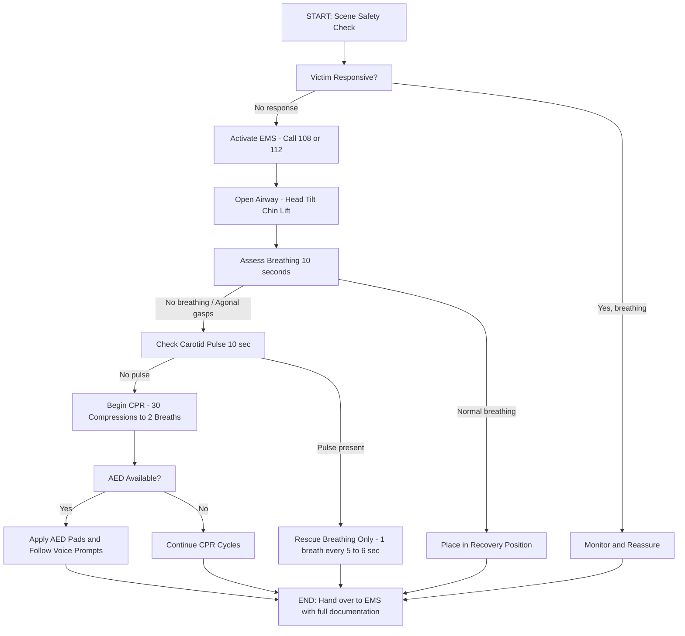
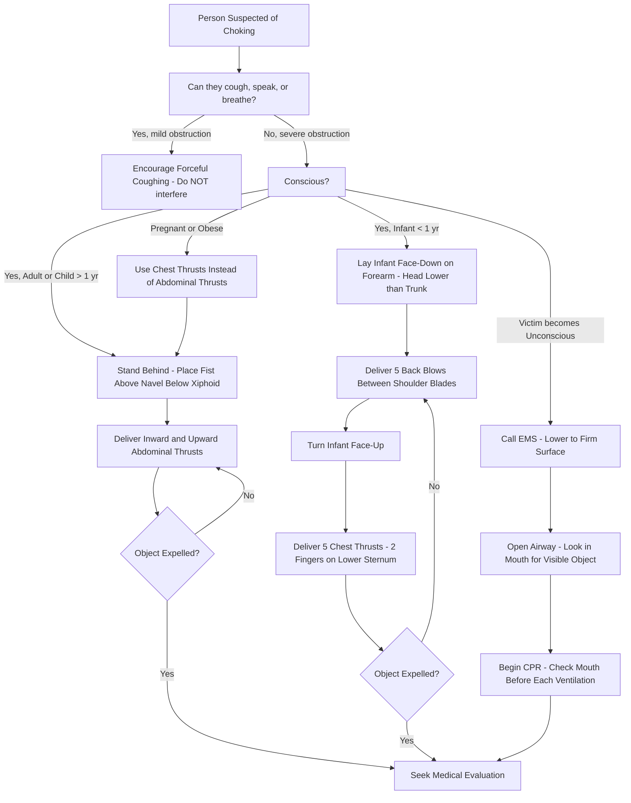
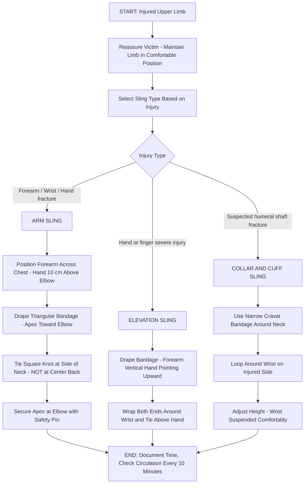
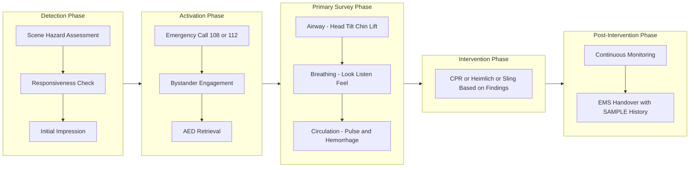

# First Aid Procedures: Cardiopulmonary   Resuscitation (CPR) - Heimlich Maneuver - Applying a sling

<!-- SECTION_1_START -->
# First Aid Procedures: CPR, Heimlich Maneuver, and Applying a Sling

## 1.1 Formal Definition (KTU 2024 Syllabus Aligned)

**First Aid** is the immediate, temporary, and often life-saving care given to a person who has been injured or has suddenly become ill, before the arrival of qualified medical professionals or transport to a medical facility. The **primary survey** in first aid follows the internationally accepted **ABC protocol** — **Airway, Breathing, and Circulation** — a rapid assessment sequence designed to identify and treat immediately life-threatening conditions.

Within this framework, three critical procedural skills are emphasized in Module 4:

> [!IMPORTANT]
> **Core Definitions as per KTU UCHWT127 Module 4**
> - **Cardiopulmonary Resuscitation (CPR)**: An emergency lifesaving procedure performed when the heart stops beating (cardiac arrest), combining chest compressions and rescue breaths to manually preserve intact brain function until spontaneous circulation and breathing are restored.
> - **Heimlich Maneuver (Abdominal Thrusts)**: A first-aid technique used to treat upper airway obstruction (choking) caused by a foreign object lodged in the trachea, by applying sudden, upward abdominal thrusts to expel the obstruction.
> - **Sling Application**: A triangular or improvised bandage used to immobilize and support an injured upper limb (forearm, wrist, hand, or shoulder), reducing pain and preventing further damage during transport.

## 1.2 The ABC of Primary Survey

The **primary survey** is the first responder's structured approach to any emergency. Each letter corresponds to a critical physiological system that must be evaluated in strict order:

> [!NOTE]
> **ABC Mnemonic of Primary Survey**
> - **A — Airway**: Is the airway open and clear? (Look for obstructions, tongue falling back, foreign bodies)
> - **B — Breathing**: Is the person breathing normally? (Look, Listen, Feel for 10 seconds)
> - **C — Circulation**: Is there a pulse? Is there significant external bleeding? (Check carotid pulse, control hemorrhage)
> - *Extension in modern protocols* (KTU 2024 includes awareness): **D — Disability** (level of consciousness), **E — Exposure** (full body check)

## 1.3 Intuitive Overview & Real-World Analogy

> [!TIP]
> **Conceptual Analogy — The Body as a Building**
> Think of the human body as a high-rise building with three critical life-support systems:
> 1. **Airway** = the main entrance and stairwell (air must flow in unimpeded)
> 2. **Breathing** = the ventilation system (oxygen must reach the lungs)
> 3. **Circulation** = the elevator/pumping system (oxygenated blood must reach every floor/brain)
>
> If the stairwell (airway) is blocked, the building suffocates. If ventilation fails, the building cannot refresh air. If the pump (heart) stops, oxygen never reaches the top floors (brain). CPR acts as a manual backup generator — keeping the elevator (blood) moving until the main power (spontaneous circulation) is restored.

## 1.4 Visual Representation of the Primary Survey

> [!VISUALIZATION CONTROL]
> **Concept:** Decision-Tree Flow of the ABC Primary Survey
> **Visualization Notes:** The student should imagine a top-down flowchart beginning with **"Tap and Shout"** at the top, branching left to **Airway Check**, then right to **Breathing Check**, then to **Circulation Check**, and finally terminating in either **Initiate CPR**, **Recovery Position**, or **Continue Monitoring**.
> **Desmos/GeoGebra Equivalent Logic (Flow):**
> * `Start → Responsiveness Check → (Unresponsive) → Call Emergency → Open Airway`
> * `Open Airway → Breathing? → (Yes) → Recovery Position`
> * `Open Airway → Breathing? → (No) → Check Pulse`
> * `Pulse Absent → Begin CPR (30:2 ratio)`

## 1.5 Scope and Ethical Considerations

A first aider's role is bounded by the principle of **"Primum non nocere"** (First, do no harm). The rescuer must:

- **Act within trained competency** — do not perform procedures beyond certification.
- **Obtain consent** — implied consent applies when the victim is unconscious or a minor with no parent present.
- **Maintain universal precautions** — use **personal protective equipment (PPE)** like gloves and face shields to prevent disease transmission (e.g., HIV, Hepatitis B).
- **Document** — note time of incident, interventions performed, and victim response for handover to EMS.

> [!WARNING]
> **KTU Examiner's Caution:** Students often confuse the order of ABC. Remember, **Airway always comes first** — without an open airway, breathing and circulation are meaningless. The rescuer never skips to chest compressions if the airway is obstructed.
<!-- SECTION_1_END -->

<!-- SECTION_2_START -->
# Deep Theoretical Analysis & KTU High-Yield Reference Sheet

## 2.1 The Physiological Rationale Behind CPR

When the heart stops (clinical death), brain cells begin irreversible damage within **4 to 6 minutes** (biological death threshold). CPR artificially maintains:

1. **Coronary circulation** — keeps the heart muscle perfused with oxygenated blood so that defibrillation (if available) can be effective.
2. **Cerebral perfusion** — maintains oxygen delivery to the brain, preventing hypoxic injury.
3. **Buys time** — every minute of delay reduces survival probability by approximately **7% to 10%**.

> [!IMPORTANT]
> **Hands-Only CPR (Compression-Only) — KTU 2024 Highlight**
> The Indian Resuscitation Council (IRC) and American Heart Association (AHA) endorse **hands-only CPR** for untrained bystanders. Compression-only CPR is performed at a rate of **100 to 120 compressions per minute**, depth of **at least 5 cm (2 inches) but not exceeding 6 cm (2.4 inches)** in adults, allowing full chest recoil between compressions.

## 2.2 Detailed Step-by-Step Procedure: Adult CPR (AHA 2020 Guidelines)

| Step | Action | Rationale | Critical Detail |
|------|--------|-----------|-----------------|
| 1 | **Scene safety assessment** | Prevent rescuer harm | Look for traffic, fire, electrical hazards |
| 2 | **Check responsiveness** — tap shoulders, shout "Are you okay?" | Establish need for intervention | If responsive, leave in position, monitor |
| 3 | **Activate EMS** — call 108 (India) / 112 | Mobilize advanced care | Ask a bystander to fetch AED if available |
| 4 | **Position victim supine on firm, flat surface** | Effective compressions need a hard base | If on soft surface, place a board |
| 5 | **Open airway** — Head-tilt, Chin-lift maneuver (or Jaw-thrust if cervical spine injury suspected) | Relieves airway obstruction by tongue | Avoid hyperextension in infants |
| 6 | **Assess breathing** (Look, Listen, Feel — 10 sec max) | Distinguish agonal gasps from normal breathing | Gasping is NOT normal breathing — begin CPR |
| 7 | **Check carotid pulse** (10 sec max) | Confirm cardiac arrest | If no pulse OR unsure, begin CPR |
| 8 | **Hand placement** — heel of dominant hand on lower half of sternum (center of chest), other hand on top, interlock fingers | Maximize compression efficacy on the ventricles | Avoid xiphoid process — risk of laceration |
| 9 | **Compressions** — 30 compressions, depth 5–6 cm, rate 100–120/min | Maintain minimal cardiac output | Allow full recoil; minimize interruptions < 10 sec |
| 10 | **Rescue breaths** — 2 breaths, 1 sec each, visible chest rise | Deliver oxygen | Use barrier device; do not over-ventilate |
| 11 | **Continue cycles** of 30:2 | Standard adult CPR ratio | Switch rescuers every 2 min to prevent fatigue |
| 12 | **Continue until** — EMS arrives, AED available, rescuer exhaustion, or signs of life | Sustain life support | Do not stop unless absolutely necessary |

## 2.3 Modifications for Infants and Children

| Parameter | Adult | Child (1 yr–puberty) | Infant (<1 yr) |
|-----------|-------|----------------------|-----------------|
| Compression depth | 5–6 cm | 5 cm (about 1/3 chest depth) | 4 cm (about 1/3 chest depth) |
| Hand technique | Two hands, heel of one | One or two hands (rescuer size dependent) | Two fingers (or two-thumb encircling for 2 rescuers) |
| Compression-to-ventilation ratio | 30:2 (1 rescuer) | 30:2 (1 rescuer) / 15:2 (2 rescuers) | 30:2 (1 rescuer) / 15:2 (2 rescuers) |
| Rescue breath duration | 1 sec | 1 sec | 1 sec |
| Initial action | Compressions first (C-A-B) | Compressions first (C-A-B) | Compressions first (C-A-B) |

> [!NOTE]
> **Compression-to-Ventilation Ratio Memory Aid**
> - **1 rescuer (any age)** → **30:2**
> - **2 rescuers (child/infant)** → **15:2** (because trained rescuers can deliver more breaths to compensate for the faster metabolic rate of children)

## 2.4 The Heimlich Maneuver — Theoretical Foundation

Choking is a leading cause of accidental death worldwide. **Foreign Body Airway Obstruction (FBAO)** can be:

- **Mild (partial)** — victim can cough, speak, or breathe. **Encourage forceful coughing; do not interfere.**
- **Severe (complete)** — victim cannot speak, cough, or breathe; universal choking sign (hands clutching throat). **Requires immediate intervention.**

The Heimlich maneuver exploits the principle that **sudden upward compression of the diaphragm forces air out of the lungs** at high velocity, expelling the foreign body like a cork from a bottle.

### Heimlich Maneuver — Step-by-Step Reference Sheet

| Step | Conscious Adult/Child (>1 yr) | Conscious Infant (<1 yr) | Unconscious Victim |
|------|-------------------------------|--------------------------|---------------------|
| 1 | Stand behind victim; place one foot between their feet for balance | Lay infant face-down on your forearm, supporting head/jaw | Place supine on firm surface |
| 2 | Locate navel; place fist (thumb-side inward) above navel and below xiphoid | Support infant's head lower than trunk (gravity-assisted) | Open mouth; look for visible object |
| 3 | Grasp fist with other hand | Deliver 5 back blows between shoulder blades with heel of hand | Attempt rescue breaths; if chest does not rise, reposition |
| 4 | Deliver quick, upward abdominal thrusts (inward and upward) | Turn infant face-up; deliver 5 chest thrusts (1 finger-width below nipple line) | Begin CPR; before each compression cycle, look in mouth for object |
| 5 | Repeat thrusts until object expelled OR victim becomes unconscious | Alternate 5 back blows + 5 chest thrusts | Continue CPR; activate EMS |

> [!WARNING]
> **Contraindications and Cautions**
> - Do not perform blind finger sweeps in the mouth (risk of pushing object deeper).
> - For pregnant or obese victims, use **chest thrusts** instead of abdominal thrusts (place fist on center of chest, between the nipples).
> - After any successful Heimlich maneuver, the victim **must** be evaluated at a hospital for internal injury (e.g., fractured ribs, abdominal organ damage).

## 2.5 Applying a Sling — Theoretical Principles

A sling serves three engineering/biomechanical purposes:

1. **Immobilization** — prevents movement that could worsen fractures, dislocations, or soft-tissue injuries.
2. **Elevation** — reduces swelling by positioning the limb above heart level (modified for clavicle injuries where elevation is partial).
3. **Support** — redistributes the weight of the limb from injured muscles/joints to the neck/shoulder girdle.

### Types of Slings and Their Indications

| Sling Type | Construction | Indication | Special Note |
|------------|--------------|------------|--------------|
| **Arm Sling (Cravat/Triangular)** | Triangular bandage folded to support forearm horizontally | Forearm, wrist, hand fractures; soft-tissue injuries | Hand slightly above elbow level (10°) to reduce swelling |
| **Elevation Sling** | Triangular bandage that supports hand and forearm in a vertical, elevated position | Hand injuries, finger fractures, severe hand lacerations | Hand positioned higher than elbow — reduces venous congestion |
| **Collar-and-Cuff Sling** | Narrow bandage looped around neck and wrist | Suspected humeral shaft fractures (avoids pressure on fracture site) | Wrist supported at a comfortable height; allows free elbow movement |
| **Improvised Sling** | Scarves, belts, ties, shirt corners | Field/emergency situations | Ensure padding between neck and bandage to prevent skin irritation |

## 2.6 The Triangular Bandage Geometry

A **triangular bandage** is typically a right-isosceles triangle of cloth measuring approximately $100 \text{ cm} \times 100 \text{ cm} \times 140 \text{ cm}$. It can be used:

- **Fully open** — as a broad bandage for head or chest injuries
- **Folded broad (cravat)** — doubled for additional support
- **Folded narrow** — as a tie or collar-and-cuff

> [!TIP]
> **Real-World Utility of Sling Knowledge**
> In **occupational health and safety** (factory, construction, sports training settings), sling application is a baseline competency. In KTU 2024 assessments, the student may be asked to identify the correct sling type for a given scenario — a common Part A (3-mark) question.

## 2.7 High-Yield Summary Table

| Procedure | Critical Numerical / Procedural Value | KTU Board Priority |
|-----------|---------------------------------------|--------------------|
| Adult compression depth | **5–6 cm** | Very High |
| Compression rate | **100–120 / min** | Very High |
| Compression-to-ventilation ratio (adult) | **30:2** | Very High |
| AED use indication | Unresponsive + no breathing + no pulse | High |
| Heimlich thrust direction | **Inward and upward** | High |
| Heimlich sequence (infant) | **5 back blows + 5 chest thrusts** | High |
| Sling arm position | **Hand ~10 cm above elbow** | Medium |
| Finger sweep | **Only if object visible** | High |
| Initial cardiac arrest response window | **4–6 min** to brain damage | High |
| Pulse check duration | **No more than 10 sec** | Medium |
<!-- SECTION_2_END -->

<!-- SECTION_3_START -->
# Step-by-Step Procedures, Symbolic Implementation, and Clinical Scenarios

## 3.1 Adult CPR — Exhaustive Step-by-Step Procedure

> [!NOTE]
> **Skill Domain:** This section simulates a hands-on workshop. Read each step and visualize the physical action.

### Phase 1 — Scene Assessment and Activation

1. **Survey the scene** for hazards — oncoming traffic, live electrical wires, fire, chemical spills, or violent individuals. Do not become a second victim.
2. **Don personal protective equipment (PPE)** — at minimum, gloves. A face shield or pocket-mask with one-way valve is preferred for rescue breaths.
3. **Tap the victim's shoulders firmly** and shout, **"Are you okay? Can you hear me?"**
4. If no response, **shout for help** — alert nearby people. A single rescuer in India should call **108 (National Ambulance Service)** or **112 (Single Emergency Number)**.
5. **Request an AED (Automated External Defibrillator)** from any bystander. If alone with a mobile phone, activate speaker mode to communicate with dispatch.

### Phase 2 — Airway and Breathing Assessment

6. Place the victim **supine on a firm, flat surface** (floor, ground, or backboard).
7. **Kneel beside the victim's shoulders**, level with their chest.
8. **Open the airway using Head-Tilt, Chin-Lift maneuver:**
   - Place one hand on the forehead and apply firm backward pressure.
   - Place the fingers of the other hand under the bony part of the chin.
   - Lift the chin upward and forward.
   - **Caution:** Do not press on the soft tissue under the chin — this may obstruct the airway.
9. **Assess breathing for no more than 10 seconds:**
   - **Look** for chest rise.
   - **Listen** for breath sounds near the mouth/nose.
   - **Feel** for air movement on your cheek.
   - **Agonal gasps** (irregular, infrequent, snorting respirations) are NOT normal breathing.

### Phase 3 — Circulation and CPR Initiation

10. **Check the carotid pulse** (located between the trachea and the sternocleidomastoid muscle) for no more than 10 seconds.
11. **If no pulse** (or if you are unsure), **begin chest compressions immediately.**
12. **Position your body:**
    - Place the heel of one hand on the **lower half of the sternum** (center of the chest, between the nipples).
    - Place the heel of your other hand on top of the first hand.
    - **Interlock the fingers** of both hands and pull them upward so that pressure is applied only through the heel of the lower hand.
    - Position your shoulders directly over your hands, with arms straight and elbows locked.
13. **Compress:**
    - **Depth:** At least 5 cm (2 inches) but not exceeding 6 cm (2.4 inches) in adults.
    - **Rate:** 100 to 120 compressions per minute.
    - **Recoil:** Allow the chest to fully recoil between compressions. Do not lean on the chest.
    - **Rhythm:** Count aloud — **"One-and, two-and, three-and, four-and, five-and, six-and, seven-and, eight-and, nine-and, ten-and, ..."** up to 30.

### Phase 4 — Rescue Breaths

14. After 30 compressions, **deliver 2 rescue breaths:**
    - Maintain the head-tilt, chin-lift position.
    - Pinch the victim's nose closed with your thumb and index finger.
    - Take a normal breath and seal your lips around the victim's mouth, creating an airtight seal.
    - Blow steadily for about 1 second, observing for visible chest rise.
    - Take another breath and repeat.
    - **If the chest does not rise**, reposition the head and try again. If still unsuccessful, resume compressions — do not waste time.
15. **Resume chest compressions immediately** after the 2 breaths.

### Phase 5 — Continuation and Termination

16. Continue cycles of **30 compressions : 2 breaths**.
17. **Switch rescuers every 2 minutes** to prevent fatigue-induced deterioration of compression quality.
18. **Continue until:**
    - A trained medical professional takes over.
    - The victim shows signs of life (breathing, movement, coughing).
    - An AED is available and ready to analyze.
    - The scene becomes unsafe.
    - You are physically unable to continue.

## 3.2 Heimlich Maneuver — Exhaustive Procedure for Conscious Adult

> [!NOTE]
> **Position and Grip Mechanics**

1. **Identify choking** — victim clutches throat with both hands (universal choking sign) and **cannot speak, cough, or breathe**.
2. **Ask the victim, "Are you choking?"** — if they nod or cannot respond, act.
3. **Stand behind the victim.**
4. **Place one foot between the victim's feet** (or slightly to the side) for a stable base. This prevents being pulled off-balance if the victim collapses.
5. **Locate anatomical landmarks:**
   - Find the navel (umbilicus).
   - Find the xiphoid process (the bony tip at the bottom of the sternum).
   - The compression point is **midway between the navel and the xiphoid process**.
6. **Form a fist** with one hand — place the **thumb side against the victim's abdomen**, in the midline, slightly above the navel and well below the xiphoid.
7. **Grasp the fist** with the other hand.
8. **Deliver thrusts:**
   - **Direction:** **Inward and upward** — a quick, sharp, J-shaped motion.
   - **Force:** Each thrust should be a distinct, separate attempt, as if you are trying to lift the victim off the ground.
   - **Repetitions:** Continue until the object is expelled or the victim becomes unresponsive.
9. **Special populations:**
   - **Pregnant or obese victims:** Wrap your arms around the **chest**, place a fist on the center of the sternum (between the nipples), and deliver **chest thrusts** in the same inward motion (not upward).
   - **Self-administered Heimlich:** Make a fist and place it on your own abdomen above the navel. Grasp it with the other hand and thrust inward and upward. Alternatively, lean over a firm edge (e.g., back of a chair, countertop) and drive your abdomen against it.
10. **Post-event care:** Even after successful expulsion, the victim should be transported to a hospital for evaluation of potential injuries (ruptured diaphragm, abdominal organ laceration, rib fractures).

## 3.3 Heimlich Maneuver — Exhaustive Procedure for Conscious Infant (<1 year)

> [!WARNING]
> **Never perform abdominal thrusts on an infant** — risk of severe liver damage.

1. **Sit or kneel** to stabilize yourself.
2. **Lay the infant face-down along your forearm**, supporting the jaw and head with your hand. The infant's head should be **lower than the trunk** (gravity assists expulsion).
3. **Rest your forearm on your thigh** for support.
4. **Deliver 5 back blows** — using the heel of your hand, strike firmly between the infant's shoulder blades. Each blow should be a distinct attempt.
5. **Turn the infant face-up** along your other forearm, supporting the head. Keep the head lower than the trunk.
6. **Place two fingers** on the center of the infant's chest, just below the nipple line (lower half of the sternum, one finger-width below the imaginary line between the nipples).
7. **Deliver 5 chest thrusts** — each thrust should be a sharp, distinct, downward compression about 4 cm deep.
8. **Alternate 5 back blows and 5 chest thrusts** until the object is expelled or the infant becomes unresponsive.
9. If the infant becomes unresponsive, begin infant CPR (described in Section 2.3).

## 3.4 Applying an Arm Sling — Exhaustive Step-by-Step Procedure

> [!NOTE]
> **Equipment Required:** Triangular bandage (or improvised cloth — e.g., a square scarf folded diagonally), safety pin or tape.

1. **Reassure the victim** and explain the procedure. Maintain the injured limb in the position most comfortable for the victim.
2. **Position the victim's forearm** across the chest, with the hand slightly elevated (about 10 cm above the elbow) and the fingers visible (to monitor circulation).
3. **Place the triangular bandage:**
   - Hold the bandage with one hand at the apex (the pointed corner) and the other at one of the base corners.
   - Drape the bandage over the victim's forearm, with the apex pointing toward the elbow on the uninjured side.
   - The long edge (base) should extend beyond the elbow on the injured side.
4. **Slip the upper end (the base corner on the uninjured side) under the victim's arm**, then up and over the shoulder on the uninjured side, around the back of the neck.
5. **Bring the lower end (the base corner on the injured side) up and over the forearm** to meet the upper end at the side of the neck on the injured side.
6. **Adjust the sling** so that the hand is supported at the desired height (slightly above elbow level).
7. **Tie a square knot** at the side of the neck — never tie the knot directly at the back of the neck (uncomfortable, may press on the cervical spine).
8. **Secure the apex** — twist the loose fabric at the elbow and pin it to the front of the sling using a safety pin, or tuck it in. This prevents the arm from slipping out.
9. **Check circulation** — observe the fingertips for color, warmth, and sensation. If the fingers turn blue, white, or numb, loosen the sling immediately.
10. **Document** the time of sling application, type of injury, and any circulation checks.

## 3.5 Applying a Collar-and-Cuff Sling — Procedure

1. Use a **narrow-fold cravat bandage** or a strip of cloth.
2. Loop the bandage around the victim's neck.
3. Pass the injured arm's wrist through one loop.
4. Tie or secure the bandage so that the wrist is suspended at a comfortable height.
5. **Indications:** Suspected mid-shaft humerus fracture (the cravat avoids pressure on the fracture site that a full arm sling might cause).

## 3.6 Algorithmic / Symbolic Decision Tree for First Aid Decision-Making

Below is a symbolic decision matrix (in pseudo-logic) that a first aider mentally runs through:

```text
PROCEDURE assess_victim(environment, victim):
    # Phase 1: Safety
    IF environment.unsafe(electricity, fire, traffic, violence):
        RETURN "MOVE VICTIM TO SAFE LOCATION OR WAIT FOR RESCUE"

    # Phase 2: Responsiveness
    IF NOT victim.responsive(tap_shoulder=True, shout=True):
        CALL emergency_services(number="108 or 112")
        REQUEST AED from bystander

    # Phase 3: Airway (A)
    victim.open_airway(method="head_tilt_chin_lift")  # or jaw-thrust if C-spine suspected
    IF victim.airway_obstructed(object_visible=True):
        REMOVE object using finger_sweep (only if visible)
    # Heimlich if conscious, CPR if unresponsive

    # Phase 4: Breathing (B)
    breathing_status = victim.check_breathing(duration_sec=10)
    IF breathing_status == "NOT BREATHING" OR "AGONAL GASPING":
        # Phase 5: Circulation (C)
        pulse_status = victim.check_pulse(location="carotid", duration_sec=10)
        IF pulse_status == "ABSENT":
            INITIATE_CPR(compression_depth_cm=5_to_6, rate_per_min=100_to_120, ratio="30:2")
        ELSE:
            # Pulse present but not breathing: Rescue breathing only
            INITIATE rescue_breathing(rate_per_min=10, breath_duration_sec=1)
            MONITOR pulse_every_2_minutes()

    # Phase 6: Recovery Position
    IF victim.responsive == True AND breathing == True AND no_suspected_injury:
        PLACE victim in RECOVERY_POSITION(side="lateral", monitor_continuously=True)

    # Phase 7: Specialized Care
    IF victim.bleeding == "SEVERE":
        APPLY direct_pressure THEN elevation THEN pressure_point THEN tourniquet(last_resort)
    IF victim.suspected_fracture(limb="upper"):
        IMMOBILIZE with sling_or_splint
        CHECK circulation_distal_to_injury()

    RETURN "CONTINUE MONITORING UNTIL EMS ARRIVAL"
```

> [!IMPORTANT]
> **Code Logic Translation**
> The pseudo-code above represents the **algorithmic decision flow** of the ABC primary survey. In a KTU examination, students may be asked to **arrange the steps in correct order** or **identify the next appropriate action** given a clinical scenario. Memorize the sequence: **Safety → Responsiveness → Activate EMS → Airway → Breathing → Circulation → Definitive Care → Monitoring.**

## 3.7 Worked Clinical Scenario (Model Solution)

**Scenario:** A 45-year-old male collapses at a college gymnasium during a basketball game. He is unresponsive, and you are a trained first aider. There is no AED immediately available. A bystander is calling 108.

**Model Solution Steps:**

1. Ensure the gym floor is clear and the victim is on a firm surface. (Scene safety)
2. Tap his shoulders and shout — no response. (Responsiveness check)
3. Confirm bystander is on the phone with 108. (EMS activation)
4. Position him supine. Open the airway with head-tilt, chin-lift. (Airway)
5. Look, listen, feel for 10 seconds — no breathing, occasional gasp. (Breathing assessment — agonal gasps = NOT normal)
6. Check carotid pulse for 10 seconds — no pulse. (Circulation check)
7. **Begin CPR immediately:**
   - Position: Heel of hand on lower sternum.
   - Compression depth: 5–6 cm.
   - Compression rate: 100–120 per minute.
   - Count aloud: 1-and, 2-and, ... 30.
   - Deliver 2 rescue breaths (visible chest rise).
   - Continue 30:2 cycles.
8. When AED arrives, continue CPR until the AED is powered on and pads are applied. Follow AED voice prompts.
9. Continue CPR with minimal interruptions until EMS arrival.

> [!TIP]
> **Examiner's Reasoning Checkpoint:** A common KTU question is, *"If the rescuer is alone and untrained, what is the minimum effective intervention?"* The answer is **Hands-Only CPR** at 100–120 compressions per minute, without rescue breaths. Studies show that compression-only CPR by untrained bystanders is as effective as conventional CPR in the first few minutes of adult cardiac arrest.
<!-- SECTION_3_END -->

<!-- SECTION_4_START -->
# Structural Diagrams and Schematics

## 4.1 Mermaid Flowchart — Universal ABC Primary Survey Algorithm



## 4.2 Mermaid Flowchart — Heimlich Maneuver Decision Tree (All Ages)



## 4.3 Mermaid Schematic — Sling Application Procedure



## 4.4 Block-Level Functional Architecture — First Aid Response System



> [!NOTE]
> **SAMPLE History (for EMS Handover):**
> - **S** — Signs and Symptoms
> - **A** — Allergies
> - **M** — Medications
> - **P** — Pertinent Past Medical History
> - **L** — Last Oral Intake
> - **E** — Events Leading to the Illness or Injury
<!-- SECTION_4_END -->

<!-- SECTION_5_START -->
# KTU 2024 Scheme Examination Question Bank & Topic Recap

## Part A — Short Answer Questions (3 Marks Each)

### Question 1 [KTU University Exam — July 2024, CO1, Remember]
**Define Cardiopulmonary Resuscitation (CPR). List the four situations in which CPR must be immediately initiated.**

**Model Answer (3 Marks):**

**Definition (1 Mark):**
CPR is an emergency life-saving procedure performed when a person's heart stops beating or they stop breathing. It combines chest compressions and rescue breaths to manually maintain circulatory flow and oxygenation until advanced medical care is available.

**Situations requiring immediate CPR initiation (2 Marks):**
1. **Cardiac arrest** — sudden cessation of heart function, confirmed by absence of carotid pulse.
2. **Respiratory arrest with no pulse** — victim is unresponsive, not breathing, and pulseless.
3. **Drowning victims** — after the victim is removed from water and is unresponsive and not breathing normally.
4. **Electrocution or drug overdose leading to unresponsiveness and absence of normal breathing/pulse.**

> [!WARNING]
> **Examiner's Pitfall:** Students often list "heart attack" as a CPR indication. **Heart attack (myocardial infarction) is not cardiac arrest** — the heart is still beating, and CPR is not indicated unless the victim deteriorates into full arrest. Marks are deducted for confusing the two.

### Question 2 [KTU University Exam — Dec 2023, CO1, Understand]
**Explain the universal choking sign. Describe the first-aid management for a conscious adult who is choking severely.**

**Model Answer (3 Marks):**

**Universal Choking Sign (1 Mark):**
The universal sign of choking is when a person clutches their throat with one or both hands, indicating they cannot speak, cough, or breathe due to a foreign body obstructing the airway.

**First-aid management for conscious adult with severe obstruction (2 Marks):**
- **Step 1:** Stand behind the victim, place one foot between their feet, and place a fist (thumb side inward) on the abdomen midway between the navel and the xiphoid process.
- **Step 2:** Grasp the fist with the other hand and deliver **quick, upward and inward abdominal thrusts (Heimlich maneuver)** until the object is expelled or the victim becomes unresponsive.
- If the victim becomes unresponsive, lower them to the ground, activate EMS, and begin CPR.

---

## Part B — Full-Length Questions (14 Marks Each, Module Internal Choice Pattern)

### Question A [14 Marks] — KTU University Exam, July 2024, CO2, Apply/Analyze

**(a)** Explain the **ABC of primary survey** in first aid with reference to airway management. **(7 Marks)**

**(b)** Describe the **step-by-step procedure for performing adult CPR** as per the American Heart Association (AHA) 2020 guidelines. Mention the correct compression depth, rate, and hand placement. **(7 Marks)**

---

#### Model Solution to (a) — The ABC of Primary Survey (7 Marks)

**[Defining Primary Survey: 1 Mark]**
The primary survey is a rapid, systematic assessment of a victim's vital functions using the **ABC protocol** — Airway, Breathing, and Circulation. It is performed within the first 60 seconds of contact with any emergency victim to identify and treat immediate life threats.

**[Airway Assessment: 2 Marks]**
- The airway is the **first priority** because, without an open airway, all subsequent interventions are futile.
- The first aider assesses responsiveness by tapping the shoulders and shouting.
- If unresponsive, the airway is opened using the **Head-Tilt, Chin-Lift maneuver** (one hand on forehead applying backward pressure, fingers of the other hand lifting the bony chin upward).
- In suspected **cervical spine injury** (e.g., fall, motor vehicle accident), use the **Jaw-Thrust maneuver** (place fingers behind the angle of the mandible and lift forward) to avoid extending the neck.
- **Obstruction management:** Look in the mouth for visible foreign objects; remove with a finger sweep **only if the object is clearly visible**. Blind finger sweeps are contraindicated.

**[Breathing Assessment: 2 Marks]**
- After opening the airway, the first aider assesses breathing for **no more than 10 seconds** using the **Look, Listen, and Feel** technique.
- **Look** for chest rise and fall, **Listen** for breath sounds at the mouth/nose, and **Feel** for air movement on the cheek.
- **Agonal gasps** (irregular, infrequent, snorting respirations) are **NOT normal breathing** — they are a sign of cardiac arrest.
- If breathing is absent, the rescuer proceeds immediately to circulation assessment.

**[Circulation Assessment: 2 Marks]**
- Check the **carotid pulse** for no more than 10 seconds.
- If a pulse is **present but breathing is absent**, initiate **rescue breathing** (1 breath every 5–6 seconds for adults).
- If **no pulse** (or if rescuer is uncertain), begin **chest compressions** immediately as part of CPR.
- During this phase, also assess for **severe external bleeding** and apply direct pressure to control hemorrhage.

---

#### Model Solution to (b) — Step-by-Step Adult CPR Procedure (7 Marks)

**[Scene Safety and Responsiveness: 1 Mark]**
- Ensure the scene is safe. Tap the victim's shoulders and shout, "Are you okay?"
- If unresponsive, shout for help and **activate EMS** (call 108/112). Ask a bystander to bring an AED if available.

**[Airway and Breathing Assessment: 1 Mark]**
- Place the victim supine on a firm, flat surface. Open the airway using Head-Tilt, Chin-Lift.
- Assess breathing for up to 10 seconds. Agonal gasps or absence of breathing indicates cardiac arrest.

**[Pulse Check and CPR Initiation: 1 Mark]**
- Check the carotid pulse for no more than 10 seconds.
- If no pulse, **begin CPR immediately** in the order **Compressions-Airway-Breathing (C-A-B)**.

**[Hand Placement and Body Position: 1 Mark]**
- Position yourself at the victim's side, level with their shoulders.
- Place the heel of one hand on the **lower half of the sternum** (center of the chest, between the nipples).
- Place the other hand on top and interlock the fingers. Keep arms straight, elbows locked, shoulders directly over the hands.

**[Compression Depth, Rate, and Recoil: 2 Marks]**
- **Depth:** At least 5 cm (2 inches) but not exceeding 6 cm (2.4 inches) in adults.
- **Rate:** 100 to 120 compressions per minute.
- **Recoil:** Allow the chest to fully recoil between compressions — do not lean on the chest. Incomplete recoil reduces coronary and cerebral perfusion.

**[Compression-to-Ventilation Ratio and Rescue Breaths: 1 Mark]**
- Perform **30 compressions** followed by **2 rescue breaths** (30:2 ratio).
- Each breath should be delivered over **1 second**, with sufficient volume to produce visible chest rise.
- Use a barrier device (pocket mask with one-way valve) to prevent disease transmission.

**[Final Answer Summary Line: Implicit]**
Continue cycles of 30:2, switching rescuers every 2 minutes to prevent fatigue, until EMS arrives, an AED is available, or the victim shows signs of life.

---

### Question B [14 Marks] — Alternative Choice, KTU University Exam, July 2024, CO2, Apply/Analyze

**(a)** What is the **Heimlich maneuver**? Explain the procedure for a **conscious adult** and a **conscious infant** in detail. **(7 Marks)**

**(b)** Describe the **principles and types of slings** used in first aid. Explain the **step-by-step procedure to apply an arm sling** using a triangular bandage. **(7 Marks)**

---

#### Model Solution to (a) — Heimlich Maneuver (7 Marks)

**[Definition and Physiological Basis: 1 Mark]**
The Heimlich maneuver (abdominal thrusts) is an emergency first-aid technique used to relieve **upper airway obstruction (choking)** caused by a foreign body. It works on the principle that **sudden upward compression of the diaphragm forces air out of the lungs at high velocity**, expelling the obstruction like a cork from a bottle.

**[Indications: 1 Mark]**
- The maneuver is indicated in cases of **severe choking** — the victim cannot speak, cough, or breathe and may clutch the throat (universal choking sign).
- It is **not** indicated for mild obstruction (where the victim can cough) — forceful coughing is more effective and safer.

**[Procedure for Conscious Adult: 2 Marks]**
1. Stand behind the victim. Place one foot between their feet for stability.
2. Locate the landmark: **midway between the navel and the xiphoid process**.
3. Form a fist with one hand, place the **thumb side** against the victim's abdomen at the landmark.
4. Grasp the fist with the other hand.
5. Deliver **quick, distinct, inward and upward thrusts** — a J-shaped motion — until the object is expelled or the victim becomes unconscious.
6. If the victim is **pregnant or obese**, substitute **chest thrusts** (fist on center of sternum, between the nipples).

**[Procedure for Conscious Infant (<1 year): 2 Marks]**
> **Abdominal thrusts are CONTRAINDICATED in infants** due to risk of severe liver injury.
1. Sit or kneel. Lay the infant face-down along your forearm, supporting the head and jaw. The head should be **lower than the trunk** (gravity-assisted).
2. Deliver **5 firm back blows** between the shoulder blades using the heel of the hand.
3. Turn the infant face-up on your other forearm, head still lower than the trunk.
4. Place **2 fingers** on the lower half of the sternum, **one finger-width below the nipple line**.
5. Deliver **5 chest thrusts**, each about 4 cm deep.
6. **Alternate 5 back blows and 5 chest thrusts** until the object is expelled or the infant becomes unresponsive (in which case, begin infant CPR).

**[Post-Event Care Note: 1 Mark]**
- After successful expulsion, the victim must be evaluated at a hospital for potential complications (rib fractures, abdominal organ damage, aspiration).
- If the victim becomes unconscious, lower to a firm surface, activate EMS, open the airway, look in the mouth for visible objects, and begin CPR.

---

#### Model Solution to (b) — Slings in First Aid (7 Marks)

**[Definition and Purpose: 1 Mark]**
A sling is a bandage or cloth device used to **immobilize, support, and elevate** an injured upper limb (forearm, wrist, hand, or shoulder). It reduces pain, prevents further damage to fractures/dislocations, and minimizes swelling.

**[Types of Slings and Their Indications: 3 Marks]**

| Sling Type | Indication | Special Note |
|------------|------------|--------------|
| **Arm Sling (Triangular)** | Forearm, wrist, hand fractures, soft-tissue injuries | Most common; hand slightly above elbow |
| **Elevation Sling** | Hand/finger fractures, severe hand lacerations | Hand positioned vertically, higher than elbow |
| **Collar-and-Cuff Sling** | Suspected mid-shaft humerus fracture | Avoids pressure on the fracture site |
| **Improvised Sling** | Field/emergency situations | Use scarves, belts, shirt corners |

**[Step-by-Step Procedure to Apply an Arm Sling: 3 Marks]**
1. **Reassure** the victim and ask them to support the injured arm in the most comfortable position.
2. **Position the forearm** across the chest with the hand slightly elevated (about 10 cm above elbow level) and fingers visible (to monitor circulation).
3. **Drape the triangular bandage** over the forearm, apex pointing toward the elbow on the uninjured side.
4. **Bring the upper end** (base corner) over the shoulder on the uninjured side, around the back of the neck.
5. **Bring the lower end** up and over the forearm to meet the upper end at the side of the neck on the injured side.
6. **Tie a square knot** at the **side of the neck** — never at the back of the neck (uncomfortable, may press on the cervical spine).
7. **Secure the apex** at the elbow with a safety pin or by twisting and tucking the fabric.
8. **Check circulation** — observe fingertip color, warmth, and sensation. If the fingers are blue, white, or numb, loosen the sling.

---

> [!WARNING]
> **KTU Examiner's Common Pitfalls (Lose Marks Here!)**
> 1. **Confusing heart attack with cardiac arrest** — they are not synonymous; only cardiac arrest requires CPR.
> 2. **Tying the sling knot at the back of the neck** — this is uncomfortable and applies pressure on the cervical spine; tie at the **side** of the neck.
> 3. **Performing blind finger sweeps** — only remove objects that are **visible** in the mouth. Blind sweeps can push the object deeper.
> 4. **Performing abdominal thrusts on infants** — this causes severe liver damage; use **5 back blows + 5 chest thrusts** instead.
> 5. **Inadequate chest recoil** — leaning on the chest between compressions reduces coronary perfusion pressure and lowers CPR effectiveness.
> 6. **Skipping the scene safety check** — rescuers who rush in become second victims; always assess the environment first.
> 7. **Forgetting to check circulation after sling application** — a tight sling can compromise blood flow, causing ischemia and nerve damage.

---

## Topic Recap & Important Things to Remember (Rapid Revision Checklist)

- **ABC of Primary Survey**: **A**irway → **B**reathing → **C**irculation. Always in this order; never skip ahead.
- **CPR Compression-to-Ventilation Ratio (Adult, 1 rescuer)**: **30:2**. Two rescuers on a child/infant: **15:2**.
- **Adult Compression Depth**: **5–6 cm** (2 to 2.4 inches). Compression rate: **100–120 per minute**.
- **Hand Placement**: Heel of hand on the **lower half of the sternum** (center of chest, between nipples).
- **Allow Full Chest Recoil**: Do not lean on the chest between compressions.
- **Pulse Check Duration**: **No more than 10 seconds**. Check the carotid pulse.
- **Agonal Gasps ≠ Normal Breathing**: Treat as cardiac arrest and begin CPR.
- **Hands-Only CPR**: Acceptable for untrained bystanders on adult victims; 100–120 compressions per minute, no rescue breaths.
- **Universal Choking Sign**: Hands clutching the throat. Indicates severe airway obstruction.
- **Heimlich Thrust Direction**: **Inward and upward** (J-shaped motion). Place fist **above navel, below xiphoid**.
- **Pregnant / Obese Choking Victim**: Use **chest thrusts** instead of abdominal thrusts.
- **Infant Choking (< 1 year)**: **5 back blows + 5 chest thrusts** — never use abdominal thrusts (risk of liver damage).
- **Sling Knot Position**: Tie at the **side of the neck**, never at the back of the neck.
- **Arm Position in Sling**: Hand approximately **10 cm above elbow**; fingers visible to monitor circulation.
- **Collar-and-Cuff Sling**: Used specifically for **mid-shaft humerus fractures** to avoid pressure on the fracture site.
- **Recovery Position**: Used for unresponsive but breathing victims; lateral position to prevent aspiration.
- **Activate EMS in India**: Dial **108** (ambulance) or **112** (single emergency number).
- **Universal Precautions**: Always use **gloves and barrier devices** to prevent disease transmission.
- **Post-Event Evaluation**: Victims of severe choking, successful CPR, or sling application must be evaluated at a hospital.
- **SAMPLE History for EMS Handover**: Signs/Symptoms, Allergies, Medications, Past Medical History, Last Oral Intake, Events Leading to Injury.
- **AED Use**: Apply as soon as available; minimize interruption of chest compressions (pause < 10 seconds for analysis/shock).
- **Fatigue Management in CPR**: Switch rescuers every **2 minutes** to maintain compression quality.
- **Time Critical Window**: Brain damage begins within **4 to 6 minutes** of cardiac arrest; every minute of delay reduces survival by **7–10%**.
- **C-A-B Sequence**: Modern CPR initiates with **Compressions** first, then Airway, then Breathing (in contrast to the older A-B-C sequence).
- **Do No Harm (Primum non nocere)**: Act within your training; do not perform procedures beyond your certification.
- **Implied Consent**: Applies when the victim is unconscious and a parent/guardian is not present for a minor.
- **Sling Materials**: Triangular bandage (ideal); improvised materials include scarves, belts, ties, and shirt corners.
<!-- SECTION_5_END -->
