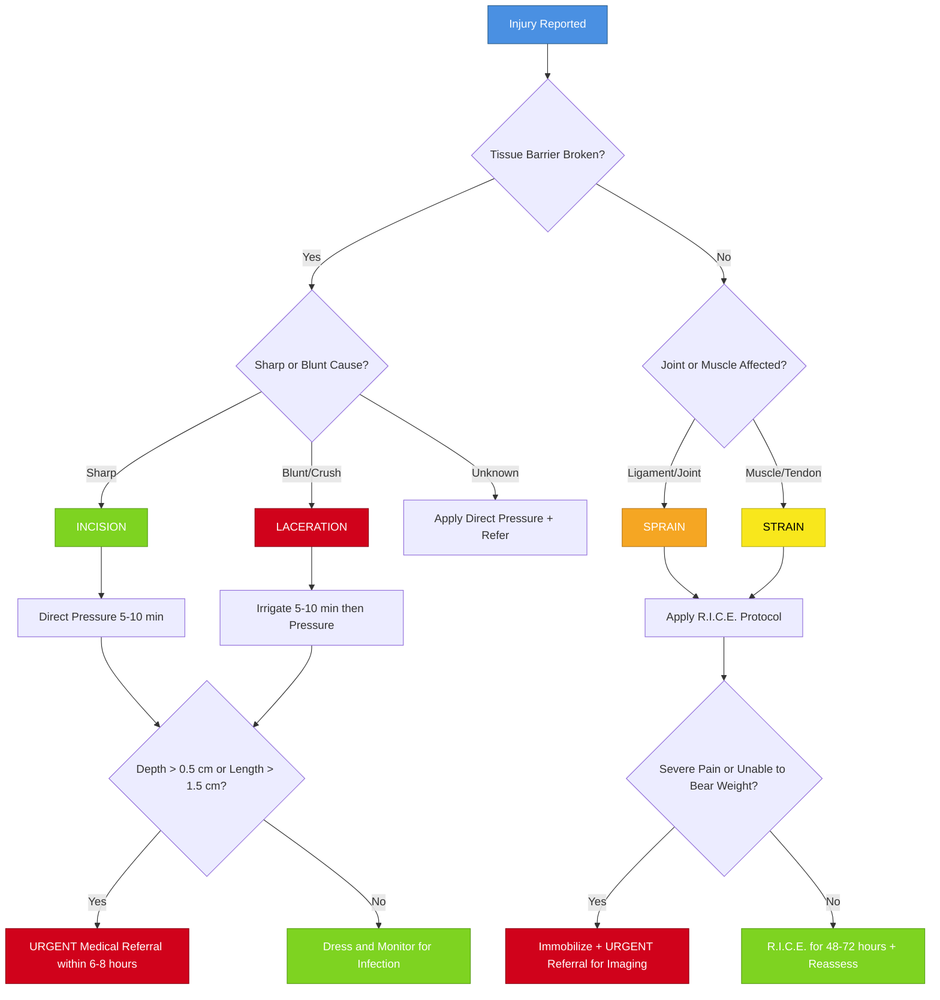
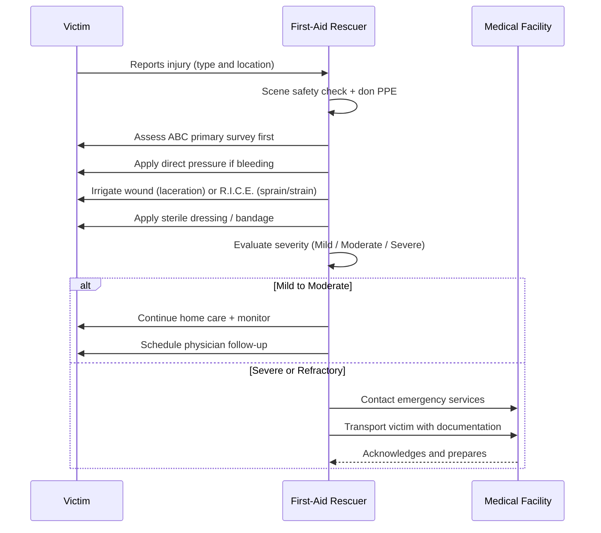
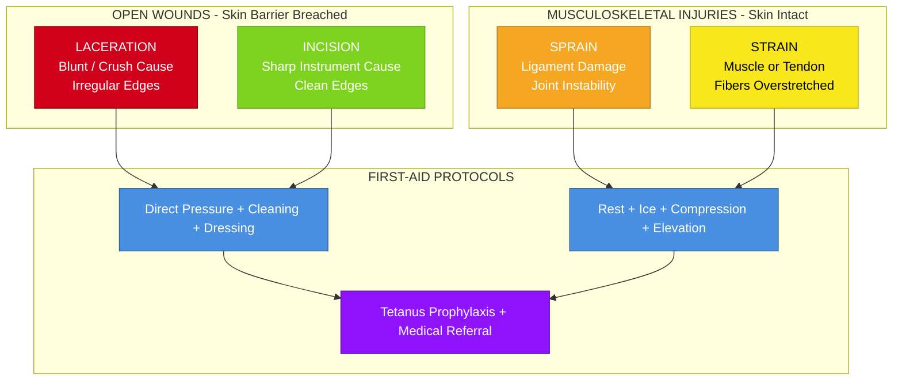

# Laceration, Incision, Sprain & Strain)

<!-- SECTION_1_START -->

# Wound & Musculoskeletal Injuries: Laceration, Incision, Sprain & Strain

## 1. Core Technical Definitions

### 1.1 Laceration
A **laceration** is an irregular, jagged, or torn wound of the soft tissue (skin, subcutaneous tissue, or mucous membrane) typically caused by a **blunt force impact**, crushing injury, or tearing action. The wound edges are uneven, ragged, and often contaminated with debris.

> [!IMPORTANT]
> **KTU Definition (2024 Scheme):** A laceration is a type of open wound characterized by a tear in the skin and underlying tissues with irregular margins, usually produced by blunt trauma rather than a sharp instrument. It is also commonly called a *tear wound*.

### 1.2 Incision
An **incision** is a clean, straight, sharp-edged cut produced by a **sharp-edged instrument** such as a scalpel, knife, razor, or glass shard. The wound edges are smooth, well-defined, and usually bleed freely because sharp instruments sever blood vessels cleanly.

> [!NOTE]
> **Surgical Origin:** The word *incision* is derived from the Latin *incidere* meaning "to cut into." Surgeons deliberately create incisions because they heal faster and with less scarring compared to lacerations.

### 1.3 Sprain
A **sprain** is an injury to a **ligament** — the tough, fibrous connective tissue that connects bone to bone at a joint. It occurs when a joint is forced beyond its normal range of motion, stretching or tearing the ligament fibers. Commonly affected joints: **ankle, wrist, knee**.

### 1.4 Strain
A **strain** is an injury to a **muscle** or **tendon** (the fibrous cord that attaches muscle to bone). It occurs when the muscle-tendon unit is overstretched or overloaded, causing fibers to stretch excessively or tear. Commonly affected regions: **hamstring, lower back, shoulder, calf**.

### 1.5 Conceptual Analogy — "The Clothesline & Rope Model"

| Injury | Real-World Analogy |
| :--- | :--- |
| **Laceration** | Imagine a piece of **cloth tearing** on a barbed wire fence — the tear is rough, irregular, and pulls threads apart unevenly. |
| **Incision** | Imagine **scissors cutting** a piece of paper — the cut is straight, clean, and the edges align perfectly. |
| **Sprain** | Imagine a **rope tethering two posts** (a ligament holding two bones) — when the rope is twisted sharply, the fibers fray or snap. |
| **Strain** | Imagine a **rubber band (muscle)** being pulled too far — it stretches out or snaps, but the anchors (bones) remain intact. |

> [!TIP]
> **Memory Hook:** "**S**prain = **L**igament" and "**S**train = **M**uscle/Tendon" → **"S**train has an **M**uscle" — both start with **S**, but **strain** has the letter **t** for *tendon* and *muscle* (think "musc**t**le"). Alternatively: **"Sprain = Jo**i**nt issue"** and **"Strain = Mus**c**le issue."**

### 1.6 Physical Constants & Standard Metrics

- **Normal human bleeding rate** from a minor cut: approximately **1–2 mL/min** without pressure.
- **Classification of blood loss (shock threshold):** Class III hemorrhage begins at **>\ 30%** of total blood volume (approx. **1500 mL** in an adult).
- **Ligament tensile strength:** Approximately **50–100 N/mm²** depending on the joint.
- **R.I.C.E. protocol** (Rest, Ice, Compression, Elevation) is the standard first-aid response for acute soft-tissue injuries.

> [!VISUALIZATION CONTROL]
> **Concept:** Comparative wound edge geometry — Laceration vs. Incision
> **Visualization Description:** On a horizontal X-axis representing the skin surface, an incision appears as a single, straight, vertical clean line. A laceration appears as a jagged, irregular zig-zag tear line with torn tissue flaps. Sprain vs. Strain can be shown on a joint schematic: sprain shows torn fibers at the bone-to-bone connection, while strain shows torn fibers at the muscle belly or tendon.

---

<!-- SECTION_1_END -->

<!-- SECTION_2_START -->

# Deep Theoretical Analysis & KTU High-Yield Formula Sheet

## 2.1 Comparative Classification of Open Wounds

Open wounds (where the skin barrier is broken) are broadly classified into six categories. The two most commonly tested in KTU 2024 are lacerations and incisions.

### 2.1.1 Laceration — Mechanism & Clinical Features

**Mechanism of Production:**
- **Blunt force trauma** (e.g., hammer blow, fall onto a hard surface)
- **Crushing injury** (e.g., machinery, vehicular accident)
- **Tearing forces** (e.g., machinery, animal bites, contact with rough surfaces)

**Clinical Features:**
- **Irregular, ragged wound edges** (the hallmark feature)
- **Bruised, contused surrounding tissue** (due to blunt force)
- **Variable depth and direction** of tissue damage
- **Higher contamination risk** — devitalized tissue and embedded debris
- **Bleeding is often less profuse** than an incision (because vessels are crushed/irregularly torn, leading to spontaneous thrombosis)
- **Slower healing** and higher infection risk compared to incisions
- May involve **undermining** of skin flaps

**First-Aid Significance:** Because the wound is irregular and contaminated, first aid must focus on **thorough cleaning, debridement of debris, and pressure hemostasis** before professional medical closure.

### 2.1.2 Incision — Mechanism & Clinical Features

**Mechanism of Production:**
- **Sharp-edged instrument** (surgical scalpel, knife, razor, glass)
- **Clean slicing motion** with minimal force

**Clinical Features:**
- **Clean, smooth, well-defined wound edges**
- **Edges approximate (come together) easily**
- **Bleeding is often brisk and profuse** — clean-cut vessels bleed freely
- **Less tissue damage** and minimal surrounding bruising
- **Faster healing** with lower infection risk (when clean)
- **Better cosmetic outcome** with proper suturing

**First-Aid Significance:** Incisions are surgical-grade wounds and respond well to **direct pressure, elevation, and closure** (butterfly strips or sutures by a professional).

### 2.1.3 Key Differences Table

| Parameter | Laceration | Incision |
| :--- | :--- | :--- |
| **Cause** | Blunt force, crushing, tearing | Sharp-edged instrument |
| **Wound Edges** | Irregular, ragged, jagged | Clean, smooth, straight |
| **Tissue Damage** | Extensive, with contusion | Minimal, clean-cut |
| **Bleeding** | Often less profuse (vessels crushed) | Often profuse (vessels cleanly severed) |
| **Contamination** | High (debris, dirt, devitalized tissue) | Low (if instrument is clean) |
| **Healing Time** | Slower | Faster |
| **Infection Risk** | Higher | Lower |
| **Cosmetic Outcome** | Often poor without revision | Usually good with proper closure |
| **First-Aid Priority** | Cleaning + debridement | Hemostasis + closure |

## 2.2 Musculoskeletal Injuries — Sprain vs. Strain

### 2.2.1 Sprain — Pathophysiology

A sprain is a **ligamentous injury**. Ligaments are dense, regular connective tissue bands containing predominantly **Type I collagen** fibers that resist tensile forces. When a joint is forced past its physiological range of motion, three grades of injury can occur:

- **Grade I (Mild):** Stretching of ligament fibers with microscopic tearing. Joint remains stable. Pain and mild swelling.
- **Grade II (Moderate):** Partial tearing of the ligament. Joint shows mild instability. Significant swelling, bruising, and pain.
- **Grade III (Severe):** Complete rupture of the ligament. Joint is unstable. Severe pain (which may diminish after the tear), extensive swelling, and loss of function.

**Mechanism:** Sudden twist, fall, or impact that forces a joint out of its normal position. The **anterior talofibular ligament (ATFL)** of the ankle is the most commonly sprained ligament in the human body.

### 2.2.2 Strain — Pathophysiology

A strain is a **musculotendinous injury**. Muscles and tendons are designed to contract and relax. When they are forcibly stretched beyond their capacity, or when they contract too forcefully, injury occurs. Three grades similar to sprains:

- **Grade I (Mild):** Mild overstretching with minimal fiber damage. Mild pain, no significant loss of strength.
- **Grade II (Moderate):** Partial tearing of muscle/tendon fibers. Noticeable pain, swelling, and some loss of strength.
- **Grade III (Severe):** Complete rupture of the muscle or tendon. Severe pain, palpable defect, complete loss of function.

**Mechanism:** Overexertion, sudden acceleration/deceleration, lifting heavy objects with poor posture, repetitive motion.

### 2.2.3 Sprain vs. Strain — Comparative Matrix

| Parameter | Sprain | Strain |
| :--- | :--- | :--- |
| **Tissue Injured** | Ligament (bone-to-bone) | Muscle or Tendon (muscle-to-bone) |
| **Common Sites** | Ankle, wrist, knee, thumb | Hamstring, lower back, calf, shoulder, neck |
| **Mechanism** | Joint forced beyond ROM | Overstretch or overload of muscle |
| **Pain Location** | Around the joint | In the muscle belly or along tendon |
| **Swelling** | Around the joint, often with bruising | Localized in muscle, sometimes with spasm |
| **Joint Stability** | May be compromised (Grades II–III) | Usually preserved |
| **Muscle Strength** | Generally preserved | Reduced (especially in Grade II–III) |
| **Sensory Sign** | Joint feels "loose" or unstable | Muscle feels "knotted" or has cramping |
| **First-Aid Response** | R.I.C.E. protocol | R.I.C.E. protocol |

## 2.3 KTU High-Yield First-Aid Formula Sheet

| Protocol / Parameter | Description | Application |
| :--- | :--- | :--- |
| **R** (Rest) | Stop the activity; avoid movement that causes pain | All Grade I–II sprains/strains |
| **I** (Ice) | Apply cold pack **15–20 min** every **1–2 hours** for first **48–72 hours** | Reduces swelling, pain, inflammation |
| **C** (Compression) | Elastic bandage, snug but not cutting off circulation | Limits swelling |
| **E** (Elevation) | Raise injured part **above heart level** when possible | Reduces blood pooling and swelling |
| **Direct Pressure** | Firm, continuous pressure with sterile gauze for **5–10 min** | Hemostasis for lacerations/incisions |
| **Elevation (for bleeding)** | Raise the bleeding part above the level of the heart | Reduces arterial pressure at wound site |
| **Pressure Points** | Brachial (arm) or Femoral (leg) artery compression | When direct pressure fails |
| **Tourniquet** | Last resort; note time of application | Life-threatening limb bleeding only |
| **Cleaning** | Irrigate with clean running water / saline for **5–10 min** | Lacerations (high contamination) |
| **Tetanus Prophylaxis** | Booster if last dose >\ 5 years or wound is dirty | All open wounds |
| **Suture Window** | Ideally within **6–8 hours** of injury | Clean incisions for best outcomes |
| **Signs of Infection** | Redness, warmth, pus, fever, red streaks | Monitor for 24–72 hours post-injury |

> [!IMPORTANT]
> **Engineering & Real-World Utility:** Understanding lacerations vs. incisions is critical in **occupational health and safety engineering**, **ergonomic workplace design**, and **first-responder training**. In industrial settings (manufacturing, construction), lacerations from blunt trauma are far more common than clean incisions, and the first-aid response differs significantly. For software/IT professionals working in health-tech, the R.I.C.E. protocol is also encoded into digital health applications that guide users through injury triage.

## 2.4 Universal First-Aid Priorities (Connecting to ABC)

In Module 4's broader context of the **Primary Survey (ABC: Airway, Breathing, Circulation)**, all four injuries are categorized as **secondary survey concerns** — meaning life-threatening airway, breathing, and circulation issues must be addressed *first*.

For any open wound (laceration/incision):
- **Step 1 (C of ABC):** Control external bleeding using direct pressure — this is part of the *Circulation* phase.
- **Step 2:** Prevent shock by keeping the victim calm, warm, and lying down.
- **Step 3:** Prevent infection through cleaning and dressing.

For sprains/strains:
- These do **not** typically compromise ABC, but severe Grade III injuries with associated fractures may cause internal bleeding, which **does** affect Circulation.

---

<!-- SECTION_2_END -->

<!-- SECTION_3_START -->

# Step-by-Step Procedures & Implementation

## 3.1 First-Aid Procedure for Lacerations

### Step-by-Step Algorithm

1. **Scene Safety Assessment (3-second check):** Ensure the area is safe for both the rescuer and victim. Wear personal protective equipment (gloves) if available.
2. **Initial Hemostasis (Direct Pressure):**
   - Place a sterile gauze pad or clean cloth over the wound.
   - Apply firm, direct pressure with the palm of your hand.
   - Maintain pressure continuously for **at least 5–10 minutes** without lifting the gauze to peek.
3. **Elevation:**
   - If the wound is on a limb, raise it **above the level of the heart**.
   - This reduces arterial pressure and slows bleeding.
4. **Wound Cleaning (Critical for Lacerations):**
   - Irrigate the wound with **clean running water or normal saline** for **5–10 minutes** to remove debris and reduce bacterial load.
   - Do **NOT** use hydrogen peroxide, alcohol, or iodine directly on an open wound — these damage tissue and delay healing.
   - Gently remove visible debris (gravel, glass, dirt) with sterile tweezers if available.
5. **Dressing Application:**
   - Apply an antibiotic ointment (if available and the victim is not allergic).
   - Cover with a sterile non-stick dressing.
   - Secure with a bandage or tape.
6. **Medical Referral:** Any laceration that is **deeper than 0.5 cm, longer than 1.5 cm, or shows visible fat/muscle/bone** requires professional medical evaluation and likely suturing within the **6–8 hour golden window**.
7. **Tetanus Prophylaxis Check:** Determine the victim's last tetanus booster. If >\ 5 years, or the wound is heavily contaminated, a booster is required.

> [!NOTE]
> **Numerical Justification for the Golden Window:** Bacteria introduced into a wound begin logarithmic growth after approximately **6 hours**. Closing a wound after this period (delayed primary closure) significantly increases infection risk, which is why the 6–8 hour rule is a cornerstone of surgical first-aid protocols.

## 3.2 First-Aid Procedure for Incisions

### Step-by-Step Algorithm

1. **Scene Safety & PPE:** Same as laceration protocol.
2. **Direct Pressure for Hemostasis:**
   - Apply firm, direct pressure for **5–10 minutes**.
   - Incisions bleed more freely, so do not be alarmed by brisk blood flow — it is usually controlled by sustained pressure.
3. **Elevation:** Raise the limb above the heart.
4. **Cleaning:** Irrigate gently with clean water or saline. Since incisions have less contamination, **5 minutes** of irrigation is usually sufficient.
5. **Wound Closure (Field Technique):**
   - For small, clean incisions (<\ 1.5 cm), **butterfly closures (Steri-Strips)** can approximate edges.
   - Tape should be applied perpendicular to the wound, edges everted (slightly raised) to allow optimal healing.
6. **Dressing:** Apply sterile dressing and bandage.
7. **Medical Referral:** Any incision **>\ 1.5 cm**, on the face, or over a joint requires professional suturing for optimal cosmetic and functional outcome.
8. **Suture Window:** Arrange transport to a medical facility within **6–8 hours**.

> [!WARNING]
> **Common Mistake:** Do not close an incision that is **heavily bleeding despite 10 minutes of direct pressure**. Continued bleeding may indicate **partial arterial transection** that requires surgical ligation, not field closure.

## 3.3 First-Aid Procedure for Sprains & Strains (R.I.C.E. Protocol)

### Step-by-Step Algorithm

1. **R — Rest:**
   - Stop all activity that causes pain.
   - Immobilize the injured joint or muscle using a **splint, sling, or simply avoiding use**.
   - Rest for at least **24–48 hours** before gradual reintroduction of activity.

2. **I — Ice (Cryotherapy):**
   - Apply a cold pack (or a bag of frozen peas wrapped in a thin towel) to the injured area.
   - Duration: **15–20 minutes per session**.
   - Frequency: **Every 1–2 hours** during the first **48–72 hours**.
   - **Never apply ice directly to skin** — risk of frostbite.
   - Physiological effect: Vasoconstriction reduces blood flow, minimizing swelling and inflammation. Also provides analgesic effect via nerve conduction velocity reduction.

3. **C — Compression:**
   - Wrap the injured area with an **elastic bandage (e.g., crepe bandage)**.
   - Apply firm, even pressure — snug but not so tight that it cuts off circulation.
   - **Capillary Refill Test:** Press on a fingernail or toenail distal to the bandage. Color should return within **\vert 2 seconds. If it takes longer, the bandage is too tight.
   - Remove the bandage before sleeping if numbness, tingling, or increased pain occurs.

4. **E — Elevation:**
   - Raise the injured limb **above the level of the heart** whenever possible.
   - This uses gravity to reduce venous and lymphatic pooling, minimizing swelling.
   - For ankle sprains: lie supine with the foot propped on 2–3 pillows.

5. **Additional Measures:**
   - **Pain management:** Over-the-counter analgesics such as paracetamol or ibuprofen (if no contraindications) may be used. **Avoid aspirin** in the acute phase as it may increase bleeding.
   - **Avoid H.A.R.M. factors in the first 72 hours:**
     - **H**eat (increases blood flow and swelling)
     - **A**lcohol (vasodilation, increases swelling)
     - **R**unning (aggravates the injury)
     - **M**assage (increases inflammation in acute phase)

6. **Medical Referral Indicators (Seek Professional Care If):**
   - Inability to bear weight on the affected limb
   - Visible deformity suggesting fracture
   - Numbness, tingling, or pale/blue discoloration distal to the injury
   - Pain that does not improve within **48–72 hours**
   - Suspected Grade III complete rupture

## 3.4 Python Reference Implementation — Injury Triage Assistant

The following Python code implements a simple console-based triage tool that classifies an injury and provides the appropriate first-aid response. This aligns with the engineering-application aspect of the UCHWT127 syllabus.

```python
from dataclasses import dataclass
from enum import Enum
from typing import Optional
import logging
import sys

logging.basicConfig(
    level=logging.INFO,
    format="%(asctime)s [%(levelname)s] %(message)s",
    handlers=[logging.StreamHandler(sys.stdout)]
)
logger = logging.getLogger("FirstAidTriage")


class InjuryType(Enum):
    LACERATION = "Laceration"
    INCISION = "Incision"
    SPRAIN = "Sprain"
    STRAIN = "Strain"
    UNKNOWN = "Unknown"


class Severity(Enum):
    MILD = "Mild (Grade I)"
    MODERATE = "Moderate (Grade II)"
    SEVERE = "Severe (Grade III)"
    UNKNOWN = "Unknown"


@dataclass(frozen=True)
class TriageResult:
    injury: InjuryType
    severity: Severity
    immediate_action: str
    referral: str
    monitoring: str


class FirstAidTriageEngine:
    """
    KTU-aligned first-aid triage engine for Laceration, Incision, Sprain, Strain.
    Implements R.I.C.E. protocol and ABC prioritization logic.
    """

    def __init__(self) -> None:
        logger.info("Initializing FirstAidTriageEngine (KTU 2024 Aligned).")

    def assess_open_wound(
        self,
        wound_edges: str,
        cause: str,
        depth_cm: float,
        length_cm: float,
        bleeding_rate: str
    ) -> TriageResult:
        """
        Classify a wound as laceration or incision and recommend first aid.

        Args:
            wound_edges: "irregular" or "clean"
            cause: "blunt", "sharp", "crush", "machine"
            depth_cm: Estimated wound depth in centimetres.
            length_cm: Estimated wound length in centimetres.
            bleeding_rate: "minimal", "moderate", "profuse"
        """
        if wound_edges == "irregular" or cause in ("blunt", "crush"):
            injury = InjuryType.LACERATION
            if depth_cm > 0.5 or length_cm > 1.5:
                severity = Severity.MODERATE
            else:
                severity = Severity.MILD
            action = (
                "1. Apply direct pressure with sterile gauze for 10 minutes.\n"
                "2. Irrigate with clean water/saline for 5-10 minutes.\n"
                "3. Remove visible debris carefully.\n"
                "4. Apply sterile dressing."
            )
            referral = "URGENT: Seek medical care within 6-8 hours for possible suturing."
        elif wound_edges == "clean" or cause == "sharp":
            injury = InjuryType.INCISION
            severity = Severity.SEVERE if length_cm > 1.5 else Severity.MILD
            action = (
                "1. Apply firm direct pressure for 5-10 minutes.\n"
                "2. Elevate the limb above the heart.\n"
                "3. Clean gently with saline for 5 minutes.\n"
                "4. Apply butterfly closure if < 1.5 cm; otherwise dress and refer."
            )
            referral = "REFER: Sutures likely required if > 1.5 cm or on face/joint."
        else:
            injury = InjuryType.UNKNOWN
            severity = Severity.UNKNOWN
            action = "Apply direct pressure and seek immediate medical help."
            referral = "IMMEDIATE referral required."

        monitoring = (
            "Watch for: signs of infection (redness, warmth, pus, fever), "
            "continued bleeding, or shock (pallor, rapid pulse, confusion)."
        )

        logger.info("Open wound triaged as %s (%s).", injury.value, severity.value)
        return TriageResult(injury, severity, action, referral, monitoring)

    def assess_soft_tissue_injury(
        self,
        tissue_type: str,
        pain_score: int,
        swelling: str,
        can_bear_weight: bool,
        joint_stable: bool
    ) -> TriageResult:
        """
        Classify a sprain or strain and recommend R.I.C.E. protocol.

        Args:
            tissue_type: "ligament" or "muscle"
            pain_score: 0-10 pain scale
            swelling: "none", "mild", "moderate", "severe"
            can_bear_weight: True if the victim can stand on the affected limb
            joint_stable: True if the joint feels mechanically stable
        """
        if tissue_type == "ligament":
            injury = InjuryType.SPRAIN
            if not joint_stable or not can_bear_weight:
                severity = Severity.SEVERE
            elif pain_score >= 5 or swelling in ("moderate", "severe"):
                severity = Severity.MODERATE
            else:
                severity = Severity.MILD
        elif tissue_type == "muscle":
            injury = InjuryType.STRAIN
            if pain_score >= 8 or swelling == "severe":
                severity = Severity.SEVERE
            elif pain_score >= 4 or swelling == "moderate":
                severity = Severity.MODERATE
            else:
                severity = Severity.MILD
        else:
            injury = InjuryType.UNKNOWN
            severity = Severity.UNKNOWN

        if severity == Severity.SEVERE:
            action = (
                "1. Immobilize the joint/muscle completely.\n"
                "2. Apply ice for 20 minutes.\n"
                "3. Do NOT attempt to bear weight.\n"
                "4. Arrange URGENT transport to a hospital (possible rupture/fracture)."
            )
            referral = "URGENT: Suspected Grade III tear or fracture. Imaging required."
        else:
            action = (
                "Apply R.I.C.E. protocol:\n"
                "  R - Rest the injured part for 24-48 hours.\n"
                "  I - Ice: 15-20 minutes every 1-2 hours for 48-72 hours.\n"
                "  C - Compression with elastic bandage (check capillary refill < 2s).\n"
                "  E - Elevate above heart level."
            )
            referral = "Refer to a physician if pain persists beyond 72 hours."

        monitoring = (
            "Avoid H.A.R.M. (Heat, Alcohol, Running, Massage) for 72 hours. "
            "Reassess every 2 hours for the first day."
        )

        logger.info("Soft tissue injury triaged as %s (%s).", injury.value, severity.value)
        return TriageResult(injury, severity, action, referral, monitoring)


def run_demo() -> None:
    engine = FirstAidTriageEngine()

    # Demo Case 1: Laceration from blunt force
    laceration = engine.assess_open_wound(
        wound_edges="irregular",
        cause="blunt",
        depth_cm=0.8,
        length_cm=2.5,
        bleeding_rate="moderate"
    )
    print(f"\n--- Case 1: {laceration.injury.value} ---")
    print(f"Severity: {laceration.severity.value}")
    print(f"Action: {laceration.action}")
    print(f"Referral: {laceration.referral}")
    print(f"Monitoring: {laceration.monitoring}")

    # Demo Case 2: Ankle sprain
    sprain = engine.assess_soft_tissue_injury(
        tissue_type="ligament",
        pain_score=6,
        swelling="moderate",
        can_bear_weight=True,
        joint_stable=True
    )
    print(f"\n--- Case 2: {sprain.injury.value} ---")
    print(f"Severity: {sprain.severity.value}")
    print(f"Action: {sprain.action}")
    print(f"Referral: {sprain.referral}")


if __name__ == "__main__":
    run_demo()
```

**Expected Output (Sample):**

```
2024-XX-XX [INFO] Initializing FirstAidTriageEngine (KTU 2024 Aligned).
2024-XX-XX [INFO] Open wound triaged as Laceration (Moderate (Grade II)).
2024-XX-XX [INFO] Soft tissue injury triaged as Sprain (Moderate (Grade II)).

--- Case 1: Laceration ---
Severity: Moderate (Grade II)
Action: 1. Apply direct pressure with sterile gauze for 10 minutes.
        2. Irrigate with clean water/saline for 5-10 minutes.
        3. Remove visible debris carefully.
        4. Apply sterile dressing.
Referral: URGENT: Seek medical care within 6-8 hours for possible suturing.
Monitoring: Watch for: signs of infection...

--- Case 2: Sprain ---
Severity: Moderate (Grade II)
Action: Apply R.I.C.E. protocol:
          R - Rest the injured part for 24-48 hours.
          I - Ice: 15-20 minutes every 1-2 hours for 48-72 hours.
          C - Compression with elastic bandage (check capillary refill < 2s).
          E - Elevate above heart level.
Referral: Refer to a physician if pain persists beyond 72 hours.
```

## 3.5 Healing Timeline Reference (for KTU exam context)

| Phase | Time Window | Biological Process |
| :--- | :--- | :--- |
| **Hemostasis** | 0–15 min | Platelet plug, fibrin clot formation |
| **Inflammatory** | 0–3 days | Neutrophils, macrophages clear debris and bacteria |
| **Proliferative** | 3–21 days | Collagen deposition, angiogenesis, epithelialization |
| **Remodeling** | 21 days – 2 years | Collagen cross-linking, scar maturation |

---

<!-- SECTION_3_END -->

<!-- SECTION_4_START -->

# Structural Diagrams & Schematics

## 4.1 Mermaid Flowchart — Universal First-Aid Decision Tree for the Four Injuries



## 4.2 Mermaid Sequence Diagram — First-Aid Response Workflow



## 4.3 Mermaid Block Diagram — Anatomical Injury Localization Map



## 4.4 Anatomical Geometry — Wound Edge Comparison

| Visual Aspect | Laceration | Incision |
| :--- | :--- | :--- |
| Edge Profile | Jagged, tooth-like, irregular | Linear, smooth, parallel |
| Tissue Gap | Variable width, deeper at impact site | Uniform width |
| Surrounding Skin | Bruised, abraded, contused | Minimal trauma, sharp borders |
| Foreign Material | Common (gravel, glass, dirt) | Rare (unless from contaminated blade) |

---

<!-- SECTION_4_END -->

<!-- SECTION_5_START -->

# KTU 2024 Scheme Examination Question Bank & Topic Recap

## 5.1 Part A — Short Answer Questions (3 Marks Each)

### Question 1
**[KTU University Exam - July 2024]** Define laceration. How does it differ from an incision in terms of mechanism of injury and wound characteristics?

**Model Answer (3 Marks):**

A laceration is an irregular, jagged wound of the skin and underlying soft tissue caused by **blunt force, crushing, or tearing trauma** (1 Mark). It differs from an incision in three key ways: **(i) Mechanism** — lacerations result from blunt impact (e.g., hammer blow, fall), whereas incisions result from sharp-edged instruments such as knives or scalpels (1 Mark). **(ii) Wound edges** — lacerations have irregular, ragged, bruised edges, while incisions have clean, smooth, well-defined edges (0.5 Mark). **(iii) Bleeding and contamination** — lacerations bleed less profusely (vessels are crushed) but carry higher contamination and infection risk, while incisions bleed more freely but heal faster with lower infection rates (0.5 Mark).

### Question 2
**[KTU University Exam - Dec 2023]** List and explain the four components of the R.I.C.E. protocol used in the first-aid management of sprains and strains.

**Model Answer (3 Marks):**

The R.I.C.E. protocol is the standard first-aid response for acute sprains and strains. **(i) Rest** — stop activity and immobilize the injured part for 24–48 hours to prevent further damage (0.75 Mark). **(ii) Ice** — apply a cold pack for 15–20 minutes every 1–2 hours during the first 48–72 hours to reduce swelling, inflammation, and pain via vasoconstriction (0.75 Mark). **(iii) Compression** — wrap with an elastic bandage to limit swelling, ensuring capillary refill remains less than 2 seconds (0.75 Mark). **(iv) Elevation** — raise the injured limb above heart level to use gravity for reducing venous pooling and edema (0.75 Mark).

---

## 5.2 Part B — Long Answer Questions (14 Marks, Module Internal Choice)

### Question A (14 Marks)
**[KTU University Exam - July 2024 | Module 4 | CO2 | Apply / Analyze]**

(a) **Differentiate between sprain and strain.** Discuss the tissues involved, common sites of occurrence, and the mechanism of injury for each. **(7 Marks)**

(b) **A 24-year-old athlete twists his ankle while playing football. On examination, there is swelling, pain, and tenderness over the lateral malleolus, but he is able to bear partial weight. Apply the R.I.C.E. protocol step by step for this patient, and list the warning signs that would warrant urgent medical referral.** **(7 Marks)**

#### Model Solution

**(a) Sprain vs. Strain Differentiation**

**[Tissue Involved: 2 Marks]**
- A **sprain** is an injury to a **ligament** — the tough, fibrous band of connective tissue that connects **bone to bone** at a joint. Ligaments are predominantly composed of Type I collagen and provide joint stability.
- A **strain** is an injury to a **muscle** or **tendon** — the contractile unit or its fibrous attachment that connects **muscle to bone**.

**[Common Sites: 2 Marks]**
- Sprains most commonly affect the **ankle** (anterior talofibular ligament), **wrist**, **knee** (ACL/MCL), and **thumb** (skier's thumb).
- Strains commonly affect the **hamstring**, **lower back** (lumbar paraspinals), **calf** (gastrocnemius), **shoulder** (rotator cuff), and **neck**.

**[Mechanism of Injury: 2 Marks]**
- **Sprain mechanism:** A joint is forced **beyond its normal physiological range of motion**, causing the ligament fibers to stretch, partially tear, or rupture. Example: an inversion injury of the ankle where the foot rolls inward.
- **Strain mechanism:** A muscle-tendon unit is **overstretched or overloaded**, either by sudden forceful contraction or by being stretched beyond its elastic limit. Example: a sprinter pulling a hamstring during acceleration.

**[Conclusion: 1 Mark]**
In summary, sprains involve joints and ligaments from external forces exceeding range of motion, whereas strains involve muscles and tendons from internal overloading. Both share the same first-aid response (R.I.C.E.) but differ in tissue type and clinical examination findings.

---

**(b) R.I.C.E. Protocol Application for the Ankle Injury**

Given the clinical picture — lateral ankle pain, swelling, and partial weight-bearing ability — this is most likely a **Grade I or II lateral ankle sprain** involving the **anterior talofibular ligament (ATFL)**.

**[Rest — 1.5 Marks]**
- The athlete must **immediately stop playing** and avoid any movement that causes pain.
- The ankle should be **immobilized** using a splint, elastic bandage wrap, or simply by avoiding weight-bearing.
- Crutches may be used if walking is painful.
- Rest should continue for a minimum of **24–48 hours** before gradual reintroduction of activity.

**[Ice — 1.5 Marks]**
- Apply a **cold pack** (or a bag of frozen peas wrapped in a thin towel) to the lateral aspect of the ankle.
- Duration: **15–20 minutes per session**.
- Frequency: **Every 1–2 hours** during waking hours for the first **48–72 hours**.
- **Never apply ice directly to bare skin** — risk of frostbite injury.
- Physiological rationale: vasoconstriction reduces blood flow, minimizing swelling and providing analgesic effect.

**[Compression — 1.5 Marks]**
- Wrap the ankle with an **elastic crepe bandage** in a figure-of-eight pattern.
- Apply firm, even pressure — **snug but not tight**.
- **Capillary Refill Test:** Press on the great toenail. Color should return within **\vert 2 seconds**. If refill is delayed, the bandage is too tight and must be loosened immediately.

**[Elevation — 1.5 Marks]**
- The athlete should **lie supine** with the injured ankle propped on **2–3 pillows** so that the ankle is **above the level of the heart**.
- This uses gravity to reduce venous and lymphatic pooling, thereby minimizing swelling.
- Elevation is most effective during the first 48–72 hours.

**[Warning Signs Requiring Urgent Referral — 1 Mark]**
The athlete should be referred urgently to a hospital if any of the following are observed:
- **Inability to bear any weight** on the affected ankle (suspected Grade III tear or fracture)
- **Visible deformity** of the ankle or foot
- **Numbness, tingling, or pallor** of the toes (vascular or nerve compromise)
- **Pain that does not improve** within 48–72 hours of R.I.C.E. therapy
- **Suspected fracture** based on Ottawa Ankle Rules (pain on palpation of the posterior edge or tip of either malleolus)

**[Final Expression: 0 Marks reserved for clean conclusion]**
With proper R.I.C.E. application, a Grade I–II ankle sprain typically resolves in 1–3 weeks, whereas Grade III ruptures may require 6–12 weeks and orthopedic evaluation.

---

### Question B (14 Marks) — Alternative Choice
**[KTU University Exam - Dec 2023 | Module 4 | CO2 | Apply / Analyze]**

(a) **Define and classify open wounds. Compare and contrast lacerations and incisions in detail under the following headings: cause, wound edges, bleeding pattern, contamination risk, healing time, and first-aid priority.** **(7 Marks)**

(b) **Describe the step-by-step first-aid management of a deep laceration on the forearm, including hemostasis, cleaning, dressing, and indications for medical referral.** **(7 Marks)**

#### Model Solution

**(a) Open Wounds — Definition, Classification, Laceration vs. Incision**

**[Definition of Open Wound: 1 Mark]**
An open wound is an injury in which the **integrity of the skin or mucous membrane is broken**, exposing underlying tissues to the external environment and creating a portal of entry for infection.

**[Classification: 2 Marks]**
Open wounds are classified into six types:
1. **Abrasion** — superficial scraping of the skin (e.g., road rash)
2. **Laceration** — irregular tear from blunt force
3. **Incision** — clean cut from a sharp instrument
4. **Puncture** — deep, narrow wound from a pointed object (e.g., nail)
5. **Avulsion** — tearing away of tissue from its attachment
6. **Amputation** — complete severing of a body part

**[Comparative Table — Laceration vs. Incision: 4 Marks]**

| Parameter | Laceration | Incision |
| :--- | :--- | :--- |
| **Cause** | Blunt force, crushing, tearing trauma | Sharp-edged instrument (knife, scalpel, glass) |
| **Wound Edges** | Irregular, ragged, jagged, bruised | Clean, smooth, straight, well-defined |
| **Bleeding Pattern** | Often less profuse (crushed vessels thrombose) | Often brisk and profuse (cleanly severed vessels) |
| **Contamination Risk** | High (debris, dirt, devitalized tissue embedded) | Low (assuming instrument is clean) |
| **Healing Time** | Slower (more tissue damage) | Faster (minimal tissue damage) |
| **First-Aid Priority** | Cleaning + debridement + pressure | Hemostasis + closure |

---

**(b) First-Aid Management of a Deep Forearm Laceration**

**[Initial Scene Safety and PPE: 1 Mark]**
- Ensure the environment is safe.
- Don **personal protective equipment** (nitrile gloves at minimum; goggles if arterial spray is suspected).
- Reassure the conscious victim and obtain consent.

**[Hemostasis — Direct Pressure: 1.5 Marks]**
- Apply a **sterile gauze pad** (or a clean folded cloth if gauze is unavailable) directly over the wound.
- Apply **firm, continuous, direct pressure** with the palm of the hand.
- Maintain pressure for **at least 5–10 minutes** without lifting to check.
- Simultaneously, **elevate the forearm above the level of the heart** to reduce arterial pressure at the wound site.

**[Wound Cleaning: 1.5 Marks]**
- After bleeding is controlled, **irrigate the wound with clean running water or normal saline for 5–10 minutes**.
- This is critical for lacerations because of the high contamination risk.
- **Do NOT** apply hydrogen peroxide, undiluted alcohol, or iodine directly to the open wound — these are cytotoxic and delay healing.
- Gently remove visible debris (gravel, glass shards) with sterile tweezers if available.

**[Dressing: 1 Mark]**
- Apply a thin layer of **antibiotic ointment** (e.g., bacitracin) if available and the victim has no allergy.
- Cover with a **sterile non-stick dressing** (e.g., paraffin gauze) to prevent adhesion to the wound bed.
- Secure with a **secondary absorbent layer** and bandage.
- Ensure the dressing is snug but does not compromise circulation distally (check capillary refill in fingers).

**[Indications for Medical Referral: 1.5 Marks]**
The victim must be referred to a medical facility **urgently** if:
- The laceration is **deeper than 0.5 cm** or **longer than 1.5 cm** (likely requires suturing)
- **Visible structures** such as fat, muscle, tendon, or bone are exposed
- Bleeding does **not stop** after 10 minutes of direct pressure
- The wound is located on the **face, joint, hand, or genitalia** (functional/cosmetic priority)
- There is **loss of sensation or movement** distally (possible nerve/tendon injury)
- The wound is **heavily contaminated** (e.g., soil, rust, animal bite)
- The victim's **tetanus immunization is outdated** (last booster >\ 5 years)

**[Final Suture Window Reminder: 0.5 Mark]**
Definitive medical management (suturing) is ideally performed within the **golden window of 6–8 hours** from the time of injury to minimize infection risk.

---

> [!WARNING]
> **KTU Examiner's Valuation Warning / Common Pitfalls**
> 1. **Do not confuse "sprain" with "strain"** in long answers — students routinely mix up ligament vs. muscle. Use the memory hook: *Sprain = joint (bone-to-bone), Strain = muscle (muscle-to-bone)*.
> 2. **Do not omit the time duration** for ice application. Writing simply "apply ice" loses 0.5 marks. Always state **15–20 minutes every 1–2 hours for 48–72 hours**.
> 3. **Do not recommend hydrogen peroxide or alcohol** for open wound cleaning — this is a common and harmful error flagged by KTU examiners.
> 4. **Always mention the cap refill test** (\vert 2 seconds) when describing compression bandaging — it differentiates a complete answer from an average one.
> 5. **In laceration vs. incision questions**, do not write "both bleed the same" — incisions bleed MORE because of clean vessel transection without spontaneous thrombosis.
> 6. **Always link back to the ABC primary survey** in any open-wound question — bleeding control is part of the **C (Circulation)** phase, not a separate isolated step.

---

## 5.3 Topic Recap & Important Things to Remember

- **Laceration = blunt force + irregular edges + high contamination.** Incision = sharp instrument + clean edges + brisk bleeding.
- **Sprain = ligament injury; Strain = muscle/tendon injury.** Both treated with R.I.C.E.
- **R.I.C.E. stands for Rest, Ice (15–20 min), Compression (cap refill \vert 2 sec), Elevation (above heart).**
- **Avoid H.A.R.M.** (Heat, Alcohol, Running, Massage) in the first **72 hours** of a sprain/strain.
- **The 6–8 hour golden window** is critical for definitive wound closure (suturing) of clean open wounds.
- **Do not apply hydrogen peroxide, alcohol, or undiluted iodine** directly to open wounds — they are cytotoxic.
- **Lacerations need thorough irrigation** (5–10 min) before closure due to high contamination risk.
- **Tetanus prophylaxis** is required if the last booster was **>\ 5 years ago** or the wound is dirty.
- **Capillary refill test (\vert 2 seconds)** must be checked whenever a compression bandage is applied to a limb.
- **Always perform the primary survey (ABC: Airway, Breathing, Circulation) before addressing wounds** — bleeding control is part of the **C** phase.
- **Refer urgently if:** wound >\ 0.5 cm deep, >\ 1.5 cm long, on face/joint, cannot stop bleeding after 10 min of pressure, exposed deep structures, or suspected nerve/tendon injury.
- **Grade I sprain/strain** = stretching; **Grade II** = partial tear; **Grade III** = complete rupture.
- **The anterior talofibular ligament (ATFL)** is the most commonly sprained ligament in the human body.

<!-- SECTION_5_END -->
