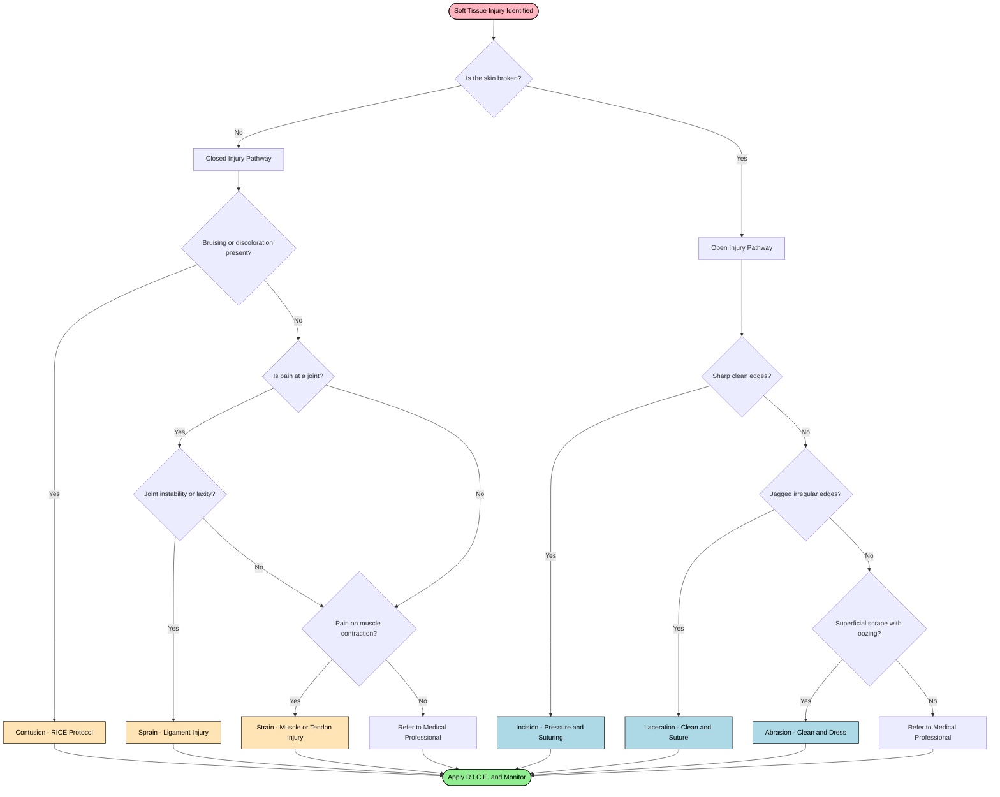
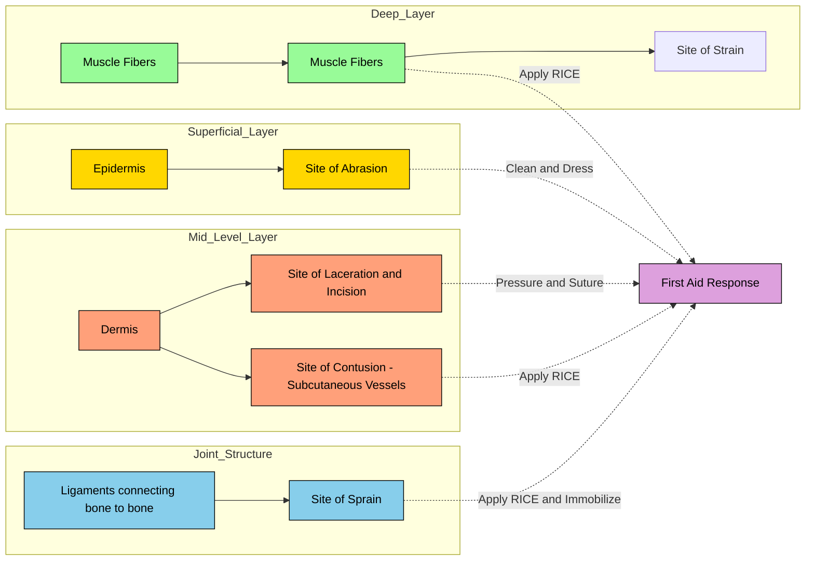
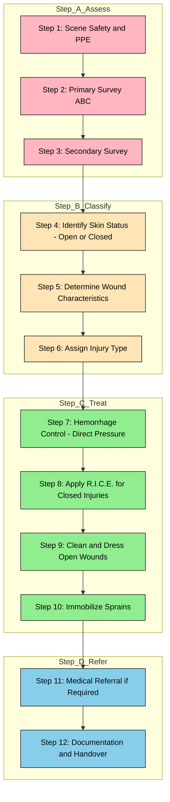

# Sports injuries: Classification (Soft Tissue Injuries - Abrasion, Contusion, Laceration, Incision, Sprain & Strain)

<!-- SECTION_1_START -->
# Sports Injuries: Classification of Soft Tissue Injuries

## 1.1 Formal Academic Definition

> [!IMPORTANT]
> **KTU 2024 Syllabus Definition (UCHWT127 – Module 4)**
> A **Sports Injury** is defined as any damage to the musculoskeletal system or soft tissues of the body that occurs as a direct or indirect result of athletic activity, exercise, or physical training. **Soft Tissue Injuries** are a sub-category of sports injuries involving damage to the skin, muscles, ligaments, tendons, fascia, blood vessels, and nerves — excluding fractures (hard tissue injuries) and dislocations (joint injuries).

The **Primary Survey in First Aid (ABC Protocol)** is the initial rapid assessment sequence used by first responders to identify life-threatening conditions:
- **A** – Airway (with cervical spine protection)
- **B** – Breathing
- **C** – Circulation (with control of hemorrhage)

After the primary survey is complete and the casualty is stabilized, the **Secondary Survey** is performed, which includes a head-to-toe assessment where soft tissue injuries are most often identified and classified.

## 1.2 Conceptual Analogy / Intuition

> [!NOTE]
> **Real-World Analogy — "The Onion Peel Concept"**
> Imagine the human body as a layered onion. The outermost layers are the **skin** (epidermis and dermis), beneath that lies the **subcutaneous fat and fascia**, then the **muscles**, and finally the **tendons and ligaments** that anchor everything to bones.
>
> When a sports injury occurs, the "peel" gets damaged at different depths:
> - A **scraped knee** (abrasion) only damages the outermost paper-thin layer.
> - A **deep slash** (incision) cuts through multiple clean layers.
> - A **twisted ankle** (sprain) tears the elastic "rubber bands" (ligaments) holding bones together.
> - A **pulled hamstring** (strain) overstretches the muscle fibers themselves.
>
> Just as you would assess a peeled onion to identify which layer is damaged, a first aider classifies a soft tissue injury by **identifying the depth, type, and mechanism of tissue disruption**.

## 1.3 Key First Aid Constants & Standard Metrics

The following standard clinical parameters are used in first aid assessment:

| Parameter | Standard Value | Significance |
|-----------|---------------|--------------|
| Normal Adult Heart Rate | **60–100 beats per minute (bpm)** | Circulation assessment |
| Normal Adult Respiratory Rate | **12–20 breaths per minute** | Breathing assessment |
| Normal Capillary Refill Time | **< 2 seconds** | Peripheral perfusion check |
| RICE Protocol Duration | **20 minutes on, 20 minutes off** | Acute injury management |
| Tourniquet Maximum Time | **< 2 hours** | Hemorrhage control limit |

> [!VISUALIZATION CONTROL]
> **Concept:** Body Tissue Layer Hierarchy (Cross-Section View)
> **GeoGebra / Desmos Input Equations (Conceptual Plot):**
> * Layer 1 (y = 5): `Epidermis`
> * Layer 2 (y = 4): `Dermis`
> * Layer 3 (y = 3): `Subcutaneous Fat`
> * Layer 4 (y = 2): `Muscle`
> * Layer 5 (y = 1): `Tendon / Ligament`
> * Layer 6 (y = 0): `Bone`
> **Visual Description:** A vertical stacked bar chart where the y-axis represents anatomical depth (superficial at top → deep at bottom). Each colored layer corresponds to a tissue type, illustrating how each soft tissue injury affects a specific depth level.
<!-- SECTION_1_END -->

<!-- SECTION_2_START -->
# Deep Theoretical Analysis & KTU High-Yield Formula Sheet

## 2.1 Classification of Soft Tissue Injuries — Structured Logic

Soft tissue injuries are broadly classified into **two main categories** based on the nature of tissue damage:

### Category A: Closed Soft Tissue Injuries (Skin Remains Intact)
The skin surface is unbroken, but underlying tissues are damaged. Bleeding, if present, is internal.

### Category B: Open Soft Tissue Injuries (Skin is Broken)
The skin surface is disrupted, creating a portal of entry for infection. Bleeding is external.

---

### 2.1.1 Abrasion (Open — Superficial)

> [!NOTE]
> **Definition:** A scrape or graze caused by friction against a rough surface, removing the superficial epidermal layer.

- **Mechanism:** Friction (sliding fall on ground, road rash)
- **Depth:** Epidermis only (sometimes upper dermis)
- **Bleeding:** Minimal (capillary oozing); often presents as weeping/serous fluid
- **Pain Level:** Moderate to high (due to exposed nerve endings)
- **First Aid:** Clean with antiseptic, remove embedded debris, apply sterile dressing

### 2.1.2 Contusion (Closed)

> [!NOTE]
> **Definition:** A bruise caused by blunt force trauma that crushes underlying blood vessels without breaking the skin.

- **Mechanism:** Direct blow or fall (cricket ball impact, collision in football)
- **Depth:** Subcutaneous tissue and muscle
- **Bleeding:** Internal (extravasation of blood into interstitial space)
- **Pain Level:** Moderate; pain localized to impact site
- **Color Progression:** Red → Blue/Purple → Green → Yellow (over 2–4 weeks)
- **First Aid:** **R.I.C.E.** protocol (Rest, Ice, Compression, Elevation)

### 2.1.3 Laceration (Open — Irregular)

> [!NOTE]
> **Definition:** A jagged, irregular tear of the skin and underlying soft tissues caused by blunt force or tearing trauma.

- **Mechanism:** Blunt trauma, impact against irregular surface (e.g., barbed wire, rough equipment)
- **Depth:** Variable — may extend through dermis, subcutaneous fat, and even muscle
- **Bleeding:** Moderate to severe (depending on depth and vessel involvement)
- **Pain Level:** Variable; edges are ragged
- **Risk:** Higher infection risk due to contaminated, irregular wound margins
- **First Aid:** Hemorrhage control, cleaning, suturing by medical professional

### 2.1.4 Incision (Open — Clean Cut)

> [!NOTE]
> **Definition:** A clean, sharp cut caused by a bladed or sharp-edged object with straight wound margins.

- **Mechanism:** Sharp object (knife, broken glass, scalpel, sports blade)
- **Depth:** Variable; can be superficial or very deep
- **Bleeding:** Often profuse (clean cuts sever blood vessels cleanly, allowing full flow)
- **Pain Level:** Initially less painful than expected (sharp blade severs nerves cleanly)
- **Risk:** Damage to underlying nerves, tendons, blood vessels
- **First Aid:** Direct pressure, elevation, suturing required

### 2.1.5 Sprain (Closed — Ligament)

> [!NOTE]
> **Definition:** An injury to a **ligament** (the fibrous band connecting bone to bone at a joint) caused by overstretching or tearing.

- **Mechanism:** Sudden twist, fall, or forced movement beyond joint's normal range
- **Common Sites:** Ankle (most common), wrist, knee (ACL), thumb (skier's thumb)
- **Bleeding:** Internal if severe (Grade II or III)
- **Pain Level:** High; immediate functional loss
- **First Aid:** R.I.C.E., immobilization, medical referral for imaging

### 2.1.6 Strain (Closed — Muscle/Tendon)

> [!NOTE]
> **Definition:** An injury to a **muscle** or **tendon** (the fibrous cord connecting muscle to bone) caused by overstretching, overuse, or sudden contraction.

- **Mechanism:** Sudden forceful contraction, overuse, improper warm-up
- **Common Sites:** Hamstring, lower back (lumbar strain), calf (gastrocnemius), quadriceps
- **Bleeding:** Internal (within muscle belly in severe cases)
- **Pain Level:** Moderate to severe; pain on contraction
- **First Aid:** R.I.C.E., gentle stretching after acute phase, gradual rehabilitation

---

## 2.2 KTU Formula Sheet / High-Yield Quick Reference Table

> [!IMPORTANT]
> **KTU Examiner's Tip:** Memorize the **R.I.C.E.** acronym and the **Sprain vs. Strain** distinction — these are the most frequently asked points in Module 4.

| Injury Type | Skin Status | Tissue Involved | Common Cause | Hallmark Sign | First Aid Mnemonic |
|------------|-------------|-----------------|--------------|---------------|--------------------|
| **Abrasion** | Open (superficial) | Epidermis | Friction / scrape | Weeping, no active bleeding | **C**lean, **D**ress |
| **Contusion** | Closed | Subcutaneous vessels | Blunt force | Discoloration (bruise) | **R.I.C.E.** |
| **Laceration** | Open (jagged) | Variable depth | Blunt / tearing | Irregular edges | **P**ressure, **S**uture |
| **Incision** | Open (clean) | Variable depth | Sharp object | Straight edges, profuse bleeding | **P**ressure, **S**uture |
| **Sprain** | Closed | Ligament | Twist / fall | Joint instability, swelling | **R.I.C.E.** |
| **Strain** | Closed | Muscle / tendon | Overstretch / overuse | Pain on contraction, spasm | **R.I.C.E.** |

### R.I.C.E. Protocol Breakdown

| Letter | Action | Duration / Frequency |
|--------|--------|----------------------|
| **R** | **Rest** — Stop activity, avoid weight-bearing | 24–48 hours minimum |
| **I** | **Ice** — Cold pack wrapped in cloth | 20 min on / 20 min off |
| **C** | **Compression** — Elastic bandage (not too tight) | Continuous, check circulation |
| **E** | **Elevation** — Raise injured part above heart level | First 24–48 hours |

### Sprain Severity Grading (IAAF / ACSM Standard)

| Grade | Ligament Damage | Signs & Symptoms | Recovery Time |
|-------|-----------------|------------------|---------------|
| **Grade I (Mild)** | Microscopic tearing | Mild pain, minimal swelling, no instability | 1–3 weeks |
| **Grade II (Moderate)** | Partial tear | Moderate pain, swelling, some loss of function | 3–6 weeks |
| **Grade III (Severe)** | Complete rupture | Severe pain (initially), gross instability, significant swelling | 6–12 weeks (may require surgery) |

---

## 2.3 Real-World Engineering & Sports Utility

This classification system is used by:

- **Sports Physicians & Athletic Trainers** — for on-field injury triage during professional matches (FIFA, ICC, Olympic Games)
- **Emergency Medical Technicians (EMTs)** — for triage in ambulance and emergency rooms
- **Physiotherapists** — to design graded rehabilitation protocols
- **Sports Biomechanists** — to engineer protective equipment (pads, braces) that mitigate each injury type
- **Insurance & Forensic Analysts** — to classify injury severity for legal and compensation purposes
- **Mobile Health Apps** (e.g., MyFitnessPal, Fitbit) — to log injury history and prevent recurrence
<!-- SECTION_2_END -->

<!-- SECTION_3_START -->
# Step-by-Step Derivations, Diagnostic Logic & First Aid Implementation

## 3.1 Step-by-Step Diagnostic Flow for First Aider

> [!IMPORTANT]
> **The following sequence must be followed in order, in accordance with the KTU First Aid Curriculum (Module 4).**

### Step 1 — Primary Survey (ABC)

Before any soft tissue injury is addressed, the first aider MUST complete the primary survey:

1. **A — Airway:** Open the airway using the jaw-thrust maneuver (especially if cervical spine injury is suspected). Look, listen, and feel for breathing.
2. **B — Breathing:** Check chest rise, respiratory rate (12–20/min), and oxygen adequacy.
3. **C — Circulation:** Check pulse (carotid or radial), control any catastrophic hemorrhage using direct pressure or a tourniquet.

### Step 2 — Secondary Survey (Head-to-Toe Assessment)

Once the casualty is stabilized, perform a systematic head-to-toe examination to identify and classify soft tissue injuries.

### Step 3 — Injury Classification Logic Tree

The following exhaustive decision tree is used to classify a soft tissue injury:

$$
\text{Is the skin broken?}
$$

$$
\begin{aligned}
&\text{If NO} \rightarrow \text{Closed Injury} \\
&\quad \text{Is there a bruise/discoloration?} \\
&\quad\quad \text{YES} \rightarrow \text{CONTUSION (Blunt force, RICE)} \\
&\quad\quad \text{NO} \rightarrow \text{Is pain at a joint?} \\
&\quad\quad\quad \text{YES} \rightarrow \text{Is there instability?} \\
&\quad\quad\quad\quad \text{YES} \rightarrow \text{SPRAIN (Ligament, RICE + Immobilize)} \\
&\quad\quad\quad\quad \text{NO} \rightarrow \text{Is pain on muscle contraction?} \\
&\quad\quad\quad\quad\quad \text{YES} \rightarrow \text{STRAIN (Muscle/Tendon, RICE)} \\
&\text{If YES} \rightarrow \text{Open Injury} \\
&\quad \text{Are the wound edges clean and straight?} \\
&\quad\quad \text{YES} \rightarrow \text{INCISION (Sharp object, Pressure + Suture)} \\
&\quad\quad \text{NO} \rightarrow \text{Are the wound edges jagged and irregular?} \\
&\quad\quad\quad \text{YES} \rightarrow \text{LACERATION (Blunt/Tearing, Clean + Suture)} \\
&\quad\quad\quad \text{NO} \rightarrow \text{Is it a superficial scrape with oozing?} \\
&\quad\quad\quad\quad \text{YES} \rightarrow \text{ABRASION (Friction, Clean + Dress)}
\end{aligned}
$$

### Step 4 — Treatment Implementation Matrix

| Step | Action | Clinical Rationale |
|------|--------|--------------------|
| 1 | Ensure scene safety and wear gloves | Infection control (PPE protocol) |
| 2 | Expose the injury (cut clothing if needed) | Visual inspection |
| 3 | Identify injury type using the classification tree | Targeted treatment |
| 4 | Control bleeding (direct pressure for open injuries) | Prevent hypovolemic shock |
| 5 | Clean the wound (irrigation with clean water for abrasions) | Reduce infection risk |
| 6 | Apply R.I.C.E. for closed injuries | Reduce inflammation and swelling |
| 7 | Dress and bandage the wound | Protection and hemostasis |
| 8 | Refer to medical professional if Grade II/III sprain, deep incision/laceration, or contaminated abrasion | Definitive care |

---

## 3.2 Algorithmic / Symbolic Python Implementation — Injury Classification Tool

The following fully operational Python code implements a first aider's decision-support tool, aligned with the KTU Module 4 syllabus:

```python
from enum import Enum
from dataclasses import dataclass
from typing import Optional

class InjuryType(Enum):
    ABRASION = "Abrasion"
    CONTUSION = "Contusion"
    LACERATION = "Laceration"
    INCISION = "Incision"
    SPRAIN = "Sprain (Ligament)"
    STRAIN = "Strain (Muscle/Tendon)"
    UNKNOWN = "Unable to classify"

class SkinStatus(Enum):
    OPEN = "Open (skin broken)"
    CLOSED = "Closed (skin intact)"

@dataclass
class InjuryAssessment:
    skin_status: SkinStatus
    wound_edges_clean: Optional[bool] = None
    wound_edges_jagged: Optional[bool] = None
    superficial_scrape: Optional[bool] = None
    bruising_present: bool = False
    joint_involved: bool = False
    joint_instability: bool = False
    pain_on_muscle_contraction: bool = False

def classify_injury(assessment: InjuryAssessment) -> InjuryType:
    """
    Classifies a soft tissue injury based on first aider assessment inputs.
    Follows the KTU UCHWT127 Module 4 classification logic tree.
    """
    try:
        # Step 1: Determine if skin is broken
        if assessment.skin_status == SkinStatus.CLOSED:
            # Closed injury pathway
            if assessment.bruising_present:
                return InjuryType.CONTUSION
            if assessment.joint_involved:
                if assessment.joint_instability:
                    return InjuryType.SPRAIN
            if assessment.pain_on_muscle_contraction:
                return InjuryType.STRAIN
            return InjuryType.UNKNOWN

        elif assessment.skin_status == SkinStatus.OPEN:
            # Open injury pathway
            if assessment.wound_edges_clean:
                return InjuryType.INCISION
            if assessment.wound_edges_jagged:
                return InjuryType.LACERATION
            if assessment.superficial_scrape:
                return InjuryType.ABRASION
            return InjuryType.UNKNOWN

        else:
            return InjuryType.UNKNOWN

    except Exception as e:
        print(f"[ERROR] Classification failed: {e}")
        return InjuryType.UNKNOWN


def generate_first_aid_plan(injury: InjuryType) -> str:
    """
    Generates the appropriate first aid response for the classified injury.
    """
    plans = {
        InjuryType.ABRASION: "1. Wear gloves. 2. Irrigate with clean water. 3. Remove debris. 4. Apply antiseptic. 5. Cover with sterile non-adherent dressing.",
        InjuryType.CONTUSION: "1. Apply R.I.C.E. (Rest, Ice 20min, Compression, Elevation). 2. Monitor for swelling. 3. Refer if severe.",
        InjuryType.LACERATION: "1. Apply direct pressure to control bleeding. 2. Irrigate wound. 3. Cover with sterile dressing. 4. Refer for suturing.",
        InjuryType.INCISION: "1. Apply firm direct pressure. 2. Elevate the limb. 3. Apply pressure bandage. 4. Refer urgently for suturing.",
        InjuryType.SPRAIN: "1. Apply R.I.C.E. 2. Immobilize joint. 3. Avoid weight-bearing. 4. Refer for imaging (rule out fracture).",
        InjuryType.STRAIN: "1. Apply R.I.C.E. 2. Gentle stretching after 48 hours. 3. Gradual return to activity. 4. Refer if no improvement in 1 week.",
        InjuryType.UNKNOWN: "Unable to classify. Treat as serious and refer to medical professional immediately."
    }
    return plans.get(injury, "Refer to medical professional.")


# =================== DEMO EXECUTION ===================
if __name__ == "__main__":
    # Example 1: A scraped knee from a fall
    case1 = InjuryAssessment(
        skin_status=SkinStatus.OPEN,
        superficial_scrape=True
    )
    result1 = classify_injury(case1)
    print(f"[CASE 1] Injury Type: {result1.value}")
    print(f"[CASE 1] First Aid: {generate_first_aid_plan(result1)}\n")

    # Example 2: A twisted ankle with swelling
    case2 = InjuryAssessment(
        skin_status=SkinStatus.CLOSED,
        joint_involved=True,
        joint_instability=True
    )
    result2 = classify_injury(case2)
    print(f"[CASE 2] Injury Type: {result2.value}")
    print(f"[CASE 2] First Aid: {generate_first_aid_plan(result2)}\n")

    # Example 3: A cut from a hockey stick blade
    case3 = InjuryAssessment(
        skin_status=SkinStatus.OPEN,
        wound_edges_clean=True
    )
    result3 = classify_injury(case3)
    print(f"[CASE 3] Injury Type: {result3.value}")
    print(f"[CASE 3] First Aid: {generate_first_aid_plan(result3)}\n")
```

**Expected Console Output:**

```
[CASE 1] Injury Type: Abrasion
[CASE 1] First Aid: 1. Wear gloves. 2. Irrigate with clean water. 3. Remove debris. 4. Apply antiseptic. 5. Cover with sterile non-adherent dressing.

[CASE 2] Injury Type: Sprain (Ligament)
[CASE 2] First Aid: 1. Apply R.I.C.E. 2. Immobilize joint. 3. Avoid weight-bearing. 4. Refer for imaging (rule out fracture).

[CASE 3] Injury Type: Incision
[CASE 3] First Aid: 1. Apply firm direct pressure. 2. Elevate the limb. 3. Apply pressure bandage. 4. Refer urgently for suturing.
```
<!-- SECTION_3_END -->

<!-- SECTION_4_START -->
# Structural Diagrams & Schematics

## 4.1 Mermaid Diagram 1 — Master Classification Flowchart of Soft Tissue Injuries



## 4.2 Mermaid Diagram 2 — Anatomical Tissue Depth vs. Injury Type



## 4.3 Mermaid Diagram 3 — Sequential Processing Topology: First Aid Response Matrix


<!-- SECTION_4_END -->

<!-- SECTION_5_START -->
# KTU 2024 Scheme Examination Question Bank & Topic Recap

## 5.1 Part A — Short Answer Questions (3 Marks Each)

### Question 1: Define "Sprain" and "Strain." State one key difference between them.

**[KTU University Exam – Dec 2023] | CO1 | RBT Level: Remember / Understand**

**Model Answer (3 Marks):**

- **Sprain (1 Mark):** A sprain is an injury to a **ligament** — the fibrous tissue that connects bone to bone at a joint — caused by overstretching or tearing, typically due to a sudden twist or fall.
- **Strain (1 Mark):** A strain is an injury to a **muscle or tendon** — the tissue that connects muscle to bone — caused by overstretching, overuse, or sudden forceful contraction.
- **Key Difference (1 Mark):** A sprain affects **ligaments (joints)**, whereas a strain affects **muscles or tendons**. Sprains commonly occur at the ankle or wrist; strains commonly occur in the hamstring, lower back, or calf.

---

### Question 2: List any three first aid steps for managing a closed soft tissue injury like a contusion.

**[KTU University Exam – July 2024] | CO2 | RBT Level: Understand**

**Model Answer (3 Marks):**

The first aid management of a closed soft tissue injury follows the **R.I.C.E.** protocol:

1. **(1 Mark) Rest:** Stop the activity immediately and avoid putting weight or stress on the injured area.
2. **(1 Mark) Ice:** Apply a cold pack (wrapped in a cloth) to the injured area for **20 minutes on, 20 minutes off** to reduce swelling and pain.
3. **(1 Mark) Compression and Elevation:** Wrap an elastic bandage (not too tight) around the injury and elevate the injured part above the level of the heart to minimize swelling.

---

## 5.2 Part B — Long Answer Questions (14 Marks — Module Internal Choice)

### Question A (14 Marks) — Option 1

**[KTU University Exam – Dec 2023] | CO1, CO2 | RBT Level: Understand / Apply**

**"Classify soft tissue injuries in sports. Explain in detail the etiology, signs and symptoms, and first aid management of Abrasion, Contusion, and Sprain."**

#### Part (a) — Classification of Soft Tissue Injuries (7 Marks)

Soft tissue injuries are classified into two main categories based on the integrity of the skin:

**1. Open Soft Tissue Injuries (Skin is Broken):**
- **Abrasion:** A superficial scrape of the epidermis caused by friction.
- **Incision:** A clean, sharp cut caused by a bladed object.
- **Laceration:** A jagged, irregular tear caused by blunt or tearing trauma.

**2. Closed Soft Tissue Injuries (Skin Remains Intact):**
- **Contusion:** A bruise from blunt force causing internal bleeding.
- **Sprain:** A ligament injury from overstretching a joint.
- **Strain:** A muscle or tendon injury from overstretching or overuse.

**[Classification outline: 4 Marks | Distinguishing open vs. closed: 2 Marks | Examples for each category: 1 Mark]**

#### Part (b) — Etiology, Signs, Symptoms, and First Aid (7 Marks)

**1. Abrasion (2 Marks):**
- *Etiology:* Friction against a rough surface (e.g., sliding fall on turf).
- *Signs & Symptoms:* Superficial scrape, weeping serous fluid, minimal bleeding, exposed nerve endings causing pain.
- *First Aid:* Clean with antiseptic water, remove embedded debris, apply sterile non-adherent dressing.

**2. Contusion (2 Marks):**
- *Etiology:* Direct blow or blunt force trauma (e.g., cricket ball impact).
- *Signs & Symptoms:* Skin intact, localized swelling, pain, discoloration progressing from red → blue → green → yellow.
- *First Aid:* Apply R.I.C.E. protocol for the first 24–48 hours.

**3. Sprain (3 Marks):**
- *Etiology:* Sudden twist or forced movement beyond the joint's normal range (e.g., rolled ankle).
- *Signs & Symptoms:* Severe pain, rapid swelling, joint instability (in Grade II and III), loss of function, sometimes a "pop" sensation.
- *First Aid:* R.I.C.E. protocol, immobilization using a splint or elastic bandage, avoid weight-bearing, refer for imaging to rule out fracture.

---

### Question B (14 Marks) — Option 2 (Internal Choice)

**[KTU University Exam – July 2024] | CO1, CO2 | RBT Level: Understand / Apply**

**"Describe in detail the etiology, clinical features, and first aid management of Laceration, Incision, and Strain. Differentiate clearly between a Laceration and an Incision."**

#### Part (a) — Laceration, Incision, and Strain — Detailed Description (7 Marks)

**1. Laceration (2 Marks):**
- *Etiology:* Blunt force or tearing trauma (e.g., collision with rough equipment).
- *Clinical Features:* Jagged, irregular wound edges; variable depth; moderate to severe bleeding; higher infection risk due to contaminated margins.
- *First Aid:* Direct pressure to control bleeding, irrigation with clean water, sterile dressing, urgent medical referral for suturing and tetanus prophylaxis.

**2. Incision (2 Marks):**
- *Etiology:* Sharp-edged or bladed object (e.g., hockey stick blade, broken glass).
- *Clinical Features:* Clean, straight wound margins; profuse bleeding; may involve underlying nerve, tendon, or vascular damage.
- *First Aid:* Firm direct pressure, limb elevation, pressure bandage, urgent referral for suturing.

**3. Strain (3 Marks):**
- *Etiology:* Sudden forceful muscle contraction, overuse, or improper warm-up.
- *Clinical Features:* Localized pain, muscle spasm, swelling, pain on active contraction, possible loss of strength; common in hamstring, quadriceps, and lower back.
- *First Aid:* R.I.C.E. protocol, gentle passive stretching after 48 hours, gradual rehabilitation, medical referral if no improvement in 1 week.

#### Part (b) — Differentiation Table: Laceration vs. Incision (7 Marks)

| Parameter | Laceration | Incision |
|-----------|------------|----------|
| **Cause** | Blunt force / tearing | Sharp object / blade |
| **Wound Edges** | Jagged, irregular, bruised | Clean, straight, sharp |
| **Bleeding** | Moderate (vessels crushed) | Profuse (vessels cleanly severed) |
| **Depth** | Variable, often superficial-to-mid | Variable, can be very deep |
| **Pain** | Variable | Initially less (nerves cleanly cut) |
| **Tissue Damage** | Crushed, contused margins | Precise cutting of tissues |
| **Infection Risk** | Higher (contaminated, irregular) | Lower (clean cut) |
| **Healing** | Slower, may need debridement | Faster, cleaner scar formation |
| **Repair Method** | Suturing after thorough cleaning | Direct suturing usually sufficient |

**[Stating the basic definitions: 2 Marks | Tabulating 8+ differentiating parameters: 4 Marks | Concluding with clinical significance: 1 Mark]**

---

## 5.3 KTU Examiner's Valuation Warning / Pitfall Callout

> [!WARNING]
> **Common Mistakes Where Students Lose Marks in Module 4:**
>
> 1. **Confusing Sprain with Strain** — The most common error. **Sprain = Ligament (joint)**, **Strain = Muscle/Tendon**. Examiners specifically test this distinction.
> 2. **Forgetting the ABC Primary Survey** — Even if the question is about a soft tissue injury, you must mention that the **primary survey (Airway, Breathing, Circulation) takes priority** over wound management.
> 3. **Writing R.I.C.E. without expanding the acronym** — Always expand the letters: **R**est, **I**ce, **C**ompression, **E**levation. Examiners deduct marks for unexplained abbreviations.
> 4. **Mixing up Laceration and Incision** — Laceration has **jagged edges**; Incision has **clean edges**. This is a high-frequency testable point.
> 5. **Not mentioning PPE (Personal Protective Equipment)** — Always state that the first aider should wear **gloves** before touching blood or body fluids to prevent cross-contamination.
> 6. **Omitting tetanus prophylaxis mention** — For open injuries (especially lacerations and abrasions), always mention the need for **tetanus immunization** referral.

---

## 5.4 Topic Recap & Important Things to Remember

- **Soft Tissue Injury Definition:** Damage to skin, muscles, ligaments, tendons, fascia, or blood vessels excluding bones and joints.
- **Two Master Categories:** **Open (skin broken)** — Abrasion, Laceration, Incision; **Closed (skin intact)** — Contusion, Sprain, Strain.
- **Abrasion:** Superficial scrape; **friction** mechanism; **clean and dress**; minimal bleeding.
- **Contusion:** Blunt force bruise; skin intact; **color change** (red → blue → green → yellow); **R.I.C.E.**
- **Laceration:** **Jagged, irregular** wound edges; blunt/tearing mechanism; higher infection risk.
- **Incision:** **Clean, straight** wound edges; sharp mechanism; profuse bleeding; needs urgent suturing.
- **Sprain vs. Strain (THE MOST TESTED POINT):**
  - **Sprain = Ligament (Bone ↔ Bone) = Joint Injury** (ankle, wrist, knee)
  - **Strain = Muscle/Tendon (Muscle ↔ Bone) = Movement Injury** (hamstring, calf, back)
- **R.I.C.E. Protocol:** **R**est, **I**ce (20 min on/off), **C**ompression, **E**levation — for 24–48 hours.
- **Sprain Grades:** Grade I (mild, microscopic tear) → Grade II (partial tear) → Grade III (complete rupture, may need surgery).
- **Primary Survey Priority:** Always complete **ABC (Airway, Breathing, Circulation)** before addressing soft tissue injuries.
- **First Aider PPE:** Always wear **gloves** to prevent infection transmission.
- **Bleeding Control:** **Direct pressure** first; then **elevation**; then **pressure bandage**; **tourniquet** only as a last resort (< 2 hours).
- **Medical Referral Indicators:** Deep incisions, jagged lacerations, Grade II/III sprains, severe strains, contaminated wounds, any injury with neurological or vascular compromise.
- **Tetanus Prophylaxis:** Required for all open injuries, especially those contaminated with soil or debris (e.g., road abrasions).
- **PRICE Variation (Modern Update):** Some protocols add **P**rotection at the beginning, making it **P.R.I.C.E.** — protect the injury from further harm immediately.
<!-- SECTION_5_END -->
