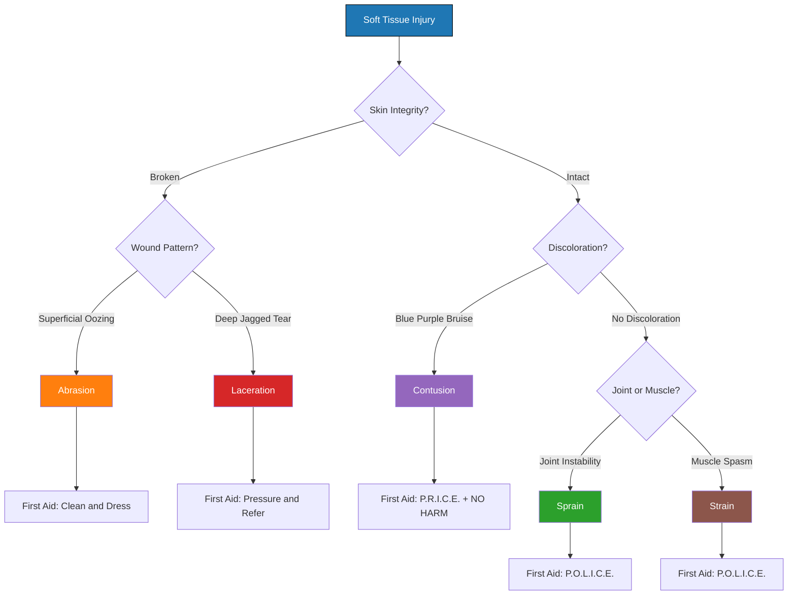
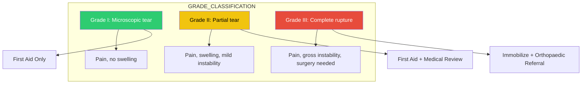
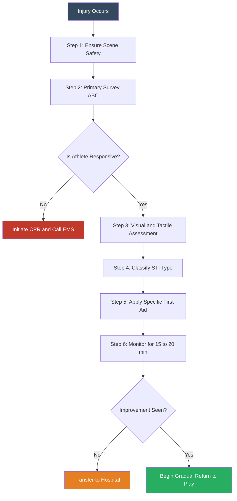

# Sports injuries: Classification (Soft Tissue Injuries - Abrasion,

<!-- SECTION_1_START -->

# Sports Injuries: Classification of Soft Tissue Injuries

> [!IMPORTANT]
> **KTU 2024 Scheme | UCHWT127 | Module 4**
> This module equips the learner with the foundational taxonomy of sports-related soft tissue injuries, their mechanisms of onset, clinical identification markers, and immediate primary care response under the **R.I.C.E.** and **P.R.I.C.E.** protocols, forming a critical life-skill competency aligned with **CO1** (Understand the physiological and preventive dimensions of health).

---

## 1.1 Formal Academic Definition

A **Sports Injury** is defined by the *International Olympic Committee (IOC)* as any physical complaint sustained by an athlete that results from training or competition, irrespective of the need for medical attention or time-loss from sporting activities.

**Soft Tissue Injuries (STIs)** constitute a sub-classification of musculoskeletal trauma that involves damage to the skin, subcutaneous fascia, muscles, tendons, ligaments, and joint capsules — *excluding* fractures (bone injuries) and dislocations (joint disarticulations).

The **5 Major Soft Tissue Injury Types** mandated by the KTU 2024 syllabus are:

1. **Abrasion** — Superficial epidermal damage
2. **Contusion** — Subcutaneous capillary rupture (bruise)
3. **Laceration** — Tearing of skin and underlying soft tissue
4. **Sprain** — Ligamentous overstretching/tearing
5. **Strain** — Muscular or tendinous overstretching/tearing

> [!NOTE]
> **Syllabus Highlight:** The KTU Board Examiner expects students to remember the *Layer of Tissue Affected*, *Mechanism of Injury*, and *First-Line Management* for each of the above five categories. Skipping any of these three columns will cost up to **2 marks** in the ESE.

---

## 1.2 Conceptual Analogy & Intuitive Overview

Imagine the human body as a **multi-layered protective packaging system** around a delicate electronic device (your bones and organs).

| Layer | Real-World Packaging | Human Body Equivalent |
|---|---|---|
| Outer shrink-wrap | Cardboard box exterior | **Skin (Epidermis)** |
| Bubble wrap | Foam padding | **Subcutaneous Fat & Fascia** |
| Foam inserts | Hard molded shell | **Muscle Tissue** |
| Rubber bands | Strapping tape | **Tendons & Ligaments** |
| The device itself | Internal components | **Bones & Organs** |

Now, depending on the *type* of force applied to this packaging, a different layer is damaged:

- A **scuff** on the cardboard = **Abrasion** (only the outermost layer)
- A **dent** from a hammer blow = **Contusion** (deep layers crushed, surface intact)
- A **tear** from a sharp edge = **Laceration** (surface ripped open)
- A **stretched/ripped rubber band** = **Sprain** (ligament damage) or **Strain** (muscle/tendon damage)

> [!TIP]
> **Intuitive Memory Anchor:** Think **"S-L-M"** for the three surface injuries — **S**kin (Abrasion), **L**aceration (deeper tear), **M**uscle (Contusion). For the deeper connective tissue injuries, remember **"L vs M"** — **L**igament = Sprain (joint), **M**uscle = Strain (belly/tendon).

---

## 1.3 Visual Classification Schema

> [!VISUALIZATION CONTROL]
> **Concept:** Hierarchical Taxonomy of Soft Tissue Injuries
> **Visual Description:** A top-down classification tree starting with the parent node "Soft Tissue Injury" branching into 5 leaf categories, each color-coded by depth of tissue penetration.
> **Recommended Mermaid Render:** See Section 4 for the fully-formatted flowchart.

---

<!-- SECTION_1_END -->

<!-- SECTION_2_START -->

# Deep Theoretical Analysis & KTU High-Yield Formula Sheet

## 2.1 The Mechanism-of-Injury (MOI) Framework

Every soft tissue injury can be decoded using the **MOI Triad**:

1. **Type of Force Applied** — Compressive, Tensile, Shear, Torsional, Frictional
2. **Tissue Layer Affected** — Epidermis → Dermis → Subcutaneous → Muscle → Tendon → Ligament → Bone
3. **Vascular Response** — Intact capillaries (Grade I) vs. Ruptured capillaries (Grade II/III)

> [!IMPORTANT]
> **Why this matters in Engineering/Wellness Context:** The MOI framework is borrowed from **biomechanics** — the same discipline that informs prosthetic design, ergonomic engineering, and protective equipment R\&D (helmets, pads, footwear). Understanding MOI is what makes sports *engineering* possible.

---

## 2.2 The Five Core Soft Tissue Injuries — Exhaustive Breakdown

### 2.2.1 Abrasion

- **Definition:** A superficial wound caused by **frictional (shear) force** that scrapes off the outermost epidermal layer.
- **Tissue Layer:** Epidermis (sometimes partial dermis).
- **Mechanism:** Sliding contact with a rough surface (e.g., gravel, turf, mat).
- **Clinical Signs:** Reddened raw area, pinpoint bleeding (oozing), stinging pain, no significant swelling.
- **Complication Risk:** **Tetanus** infection if contaminated with soil.
- **Common in:** Cycling crashes, baseball slides, long-distance falls.

### 2.2.2 Contusion (Bruise)

- **Definition:** A **closed injury** caused by a **blunt compressive force** that ruptures subcutaneous capillaries without breaking the skin.
- **Tissue Layer:** Subcutaneous tissue and underlying muscle fibers.
- **Mechanism:** Direct blow (e.g., elbow to thigh in cricket, helmet to rib in football).
- **Clinical Signs:** Localized swelling, tenderness, **ecchymosis** (blue-purple discoloration evolving to yellow-green over 5–14 days), pain on palpation.
- **Complication Risk:** **Myositis ossificans** (bone formation in muscle) if massage is applied to a thigh contusion — a critical examiner pitfall.
- **Common in:** Contact sports — rugby, football, kabaddi, hockey.

### 2.2.3 Laceration

- **Definition:** A **tear or irregular cut** in the skin and underlying soft tissue caused by a sharp or blunt-traumatic force.
- **Tissue Layer:** Full-thickness skin, possibly extending to subcutaneous fat and muscle.
- **Mechanism:** Impact against a sharp edge (cleat, fence, glass) or high-velocity blunt force (overstretching skin beyond tensile limit).
- **Clinical Signs:** Jagged wound edges, profuse bleeding, pain, possible visible subcutaneous tissue.
- **Complication Risk:** **Infection**, **nerve damage**, **scarring**.
- **Common in:** Adventure sports, trail running, climbing.

### 2.2.4 Sprain

- **Definition:** An **overstretching or tearing of a ligament** (the fibrous band connecting bone to bone at a joint).
- **Tissue Layer:** Ligamentous tissue — Grade I (microscopic), Grade II (partial), Grade III (complete rupture).
- **Mechanism:** Forced joint movement beyond its normal **Range of Motion (ROM)** — e.g., inversion of ankle, valgus stress to knee.
- **Clinical Signs:** Immediate pain, swelling, **joint instability** (in Grade III), loss of function, audible "pop."
- **Complication Risk:** **Chronic joint instability** if rehabilitation is incomplete.
- **Common in:** Basketball (ankle), football (knee MCL), gymnastics (wrist).

### 2.2.5 Strain

- **Definition:** An **overstretching or tearing of a muscle fiber or tendon** (the fibrous band connecting muscle to bone).
- **Tissue Layer:** Muscle belly (acute strain) or musculotendinous junction (chronic strain).
- **Mechanism:** Sudden eccentric overload, explosive contraction, or cumulative microtrauma.
- **Clinical Signs:** Localized pain, **muscle spasm**, swelling, weakness, palpable defect in complete rupture.
- **Complication Risk:** **Recurrence** (up to 60% in hamstring strains).
- **Common in:** Sprinters (hamstring), throwers (rotator cuff), weightlifters (biceps/lumbar).

---

## 2.3 KTU High-Yield Formula Sheet

> [!IMPORTANT]
> **For First Aid and Primary Survey, remember the canonical acronyms as exam-ready formulas.**

| Protocol | Full Form | Clinical Use | Indications |
|---|---|---|---|
| **ABC** | Airway, Breathing, Circulation | Life-threatening triage | Any unresponsive athlete |
| **R.I.C.E.** | Rest, Ice, Compression, Elevation | Acute soft tissue injury (legacy) | First 24–48 hours |
| **P.R.I.C.E.** | Protection, Rest, Ice, Compression, Elevation | Modern soft tissue injury (preferred) | First 24–72 hours |
| **P.O.L.I.C.E.** | Protection, Optimal Loading, Ice, Compression, Elevation | Current best practice | Acute sprains/strains |
| **NO HARM** | No Heat, No Alcohol, No Running, No Massage | Acute contusion/strain | First 72 hours |

### Critical Differentiation Table (Board Examiner's Favorite)

| Feature | Abrasion | Contusion | Laceration | Sprain | Strain |
|---|---|---|---|---|---|
| **Skin Integrity** | Broken (superficial) | Intact | Broken (deep) | Intact | Intact |
| **Tissue Layer** | Epidermis | Subcutaneous | Full thickness | Ligament | Muscle/Tendon |
| **Force Type** | Friction | Compression | Shear/Tension | Tension | Tension |
| **Visible Bleeding** | Oozing | Internal (bruise) | Profuse | None | Rare |
| **Hallmark Sign** | Raw stinging area | Ecchymosis | Jagged edges | Joint instability | Muscle spasm |
| **1st Aid** | Clean + antiseptic | P.R.I.C.E. + NO HARM | Direct pressure + dressing | P.O.L.I.C.E. | P.O.L.I.C.E. |

> [!WARNING]
> **Valuation Trap:** Students often confuse **Sprain (Ligament)** with **Strain (Muscle/Tendon)**. The mnemonic is **"Sprain = Ligament = Joint"** and **"Strain = Muscle = Movement."** Mixing them up costs full marks on differential diagnosis questions.

---

## 2.4 Real-World Engineering & Wellness Utility

| Field | Application of Soft Tissue Injury Knowledge |
|---|---|
| **Sports Equipment Design** | Designing shock-absorbing helmets, padding density, shoe sole cushioning (e.g., Nike Air, Adidas Boost) |
| **Ergonomics** | Designing workplace chairs, keyboards, and assembly lines to prevent repetitive strain injuries (RSI) |
| **Rehabilitation Engineering** | Designing TENS units, compression sleeves, cryotherapy chambers, and EMG biofeedback devices |
| **Civil/Defense** | Blast-wave injury modeling (contusion patterns in soldiers), car crash biomechanics (whiplash strains) |
| **Insurance & Occupational Health** | Calculating disability percentages, return-to-play protocols, workers' compensation claims |

---

<!-- SECTION_2_END -->

<!-- SECTION_3_START -->

# Step-by-Step Derivations & First-Aid Implementation

## 3.1 Decision Logic for Classifying an Unknown Soft Tissue Injury

The KTU Board values **systematic clinical reasoning**. Follow this exact 5-step algorithmic decision tree when presented with an unidentified sports injury in the exam:

### Step 1 — Skin Integrity Check
- **Skin broken?** → Go to Step 2A.
- **Skin intact?** → Go to Step 2B.

### Step 2A — Broken Skin Sub-Logic
- **Edges rough, superficial, oozing, friction cause?** → **ABRASION**
- **Edges jagged/irregular, deep, profuse bleeding, sharp/impact cause?** → **LACERATION**

### Step 2B — Intact Skin Sub-Logic
- **Discoloration (blue/purple) present, direct blow cause?** → **CONTUSION**
- **Joint involved, ligament pain, instability?** → **SPRAIN**
- **Muscle belly or tendon involved, spasm, movement pain?** → **STRAIN**

### Step 3 — Severity Grading (for Sprain/Strain)

\begin{aligned}
\text{Grade I} &= \text{Microscopic fiber damage, mild pain, no instability} \\
\text{Grade II} &= \text{Partial tear, moderate pain, swelling, mild instability} \\
\text{Grade III} &= \text{Complete rupture, severe pain, gross instability, requires surgery}
\end{aligned}

### Step 4 — Apply the Appropriate First Aid Protocol
- Surface injuries (Abrasion/Laceration): **Clean → Control Bleeding → Dress → Refer**
- Closed injuries (Contusion/Sprain/Strain): **P.O.L.I.C.E. + NO HARM**

### Step 5 — Triage Decision
- If **Airway, Breathing, or Circulation compromised** → Initiate **ABC** primary survey.
- If **Grade III ligament rupture** suspected → Immobilize and refer to orthopaedic surgeon.
- All other cases → Apply field first aid and refer for medical evaluation.

> [!NOTE]
> **This 5-step algorithm is worth 4–5 marks** in any ESE question that describes a clinical vignette (e.g., *"A 22-year-old footballer lands awkwardly and feels a 'pop' in his right knee. There is immediate swelling but no skin break. He cannot bear weight."*). Walking the examiner through this logic earns full marks.

---

## 3.2 Comprehensive First-Aid Implementation Matrix (Practical/Laboratory Format)

| Step | Abrasion | Contusion | Laceration | Sprain | Strain |
|---|---|---|---|---|---|
| **1. Scene Safety** | Ensure no traffic/hazard | Same | Same | Same | Same |
| **2. ABC Check** | Confirm responsiveness | Same | Same | Same | Same |
| **3. PPE** | Wear gloves | Gloves | Gloves | Optional | Optional |
| **4. Wound Cleaning** | Antiseptic (Betadine/Savlon) | **Do NOT massage** | Saline irrigation + antiseptic | N/A (closed) | N/A (closed) |
| **5. Bleeding Control** | Direct pressure 5 min | Cold compress | Direct pressure 10–15 min | Cold compress | Cold compress |
| **6. Dressing** | Sterile non-adherent gauze | None (closed) | Sterile gauze + bandage | Compression bandage | Compression bandage |
| **7. P.O.L.I.C.E.** | Skip | **Yes** | Skip | **Yes** | **Yes** |
| **8. Elevation** | Above heart if possible | Above heart | Above heart if bleeding | Above heart | Above heart |
| **9. NO HARM Compliance** | N/A | **Mandatory** | N/A | **Mandatory** | **Mandatory** |
| **10. Tetanus Prophylaxis** | **Check status** | N/A | **Check status** | N/A | N/A |
| **11. Referral** | If > 3 cm or dirt-embedded | If swelling > 48 h | **All cases** | If Grade II/III | If weakness persists |

> [!IMPORTANT]
> **Valuation Tip:** Examiners look for the explicit mention of **tetanus immunization status check** for any open wound. Mentioning "Tetanus toxoid booster if last dose > 5 years" is a **3-mark differentiator**.

---

## 3.3 Tabular Comparative Analysis: Sports Injury Case Frameworks Mapped to Regulatory/Systemic Matrices

> **Contextual Note:** KTU 2024 Humanities/Management module outcomes require mapping real-world scenarios to established regulatory frameworks. The table below maps soft tissue injury scenarios to the **WHO Basic Emergency Care (BEC) Framework**, **Indian Red Cross First Aid Guidelines**, and the **International Olympic Committee (IOC) Return-to-Play Protocol**.

| Injury Scenario | WHO BEC Tier | Indian Red Cross Action | IOC RTP Phase | Engineer/Tech Linkage |
|---|---|---|---|---|
| Cyclist road rash (Abrasion) | Tier 1 — Basic | Clean, dress, tetanus check | Phase 1 — Recovery | Helmet design, padding fabrics |
| Football thigh bruise (Contusion) | Tier 1 — Basic | P.O.L.I.C.E. + NO HARM | Phase 1 — Recovery | Shock-absorbing shin guards |
| Fence-cut shin (Laceration) | Tier 2 — Referral | Pressure + ER transfer | Phase 0 — Acute | Fence material safety standards |
| Basketball ankle twist (Sprain) | Tier 1 — Basic | P.O.L.I.C.E. + taping | Phase 2 — Strength | High-top shoe biomechanics |
| Sprinter hamstring pull (Strain) | Tier 1 — Basic | P.O.L.I.C.E. + NO HARM | Phase 2 — Strength | Track surface elasticity design |

---

<!-- SECTION_3_END -->

<!-- SECTION_4_START -->

# Structural Diagrams & Schematics

## 4.1 Mermaid Classification Flowchart — Soft Tissue Injuries

## 4.2 Mermaid First-Aid Sequence Topology — P.O.L.I.C.E. Protocol

## 4.3 Mermaid Grading Subgraph — Sprain and Strain Severity

## 4.4 Sequential Processing Topology Matrix — Soft Tissue Injury Triage

---

<!-- SECTION_4_END -->

<!-- SECTION_5_START -->

# KTU 2024 Scheme Examination Question Bank & Topic Recap

---

## Part A — Short Answer Questions (3 Marks Each)

### Q1. [KTU University Exam — July 2024] | CO1 | RBT: Remember

**"Define a soft tissue injury. List the five major types with one identifying feature each."** *(3 Marks)*

**Model Answer:**

A soft tissue injury is damage to the skin, muscles, tendons, ligaments, or fascia caused by mechanical trauma, *excluding* fractures and dislocations.

The five major types are:

1. **Abrasion** — Superficial epidermal scrape from friction
2. **Contusion** — Subcutaneous capillary rupture from blunt force
3. **Laceration** — Deep irregular skin tear from sharp or shearing trauma
4. **Sprain** — Ligament overstretch or tear
5. **Strain** — Muscle fiber or tendon overstretch or tear

*[Definition: 1 Mark; Listing: 1 Mark; Identifying features: 1 Mark]*

---

### Q2. [KTU University Exam — Dec 2023] | CO1 | RBT: Understand

**"Differentiate between a sprain and a strain with respect to tissue involved, mechanism, and clinical hallmark."** *(3 Marks)*

**Model Answer:**

| Parameter | Sprain | Strain |
|---|---|---|
| **Tissue Involved** | Ligament (bone-to-bone) | Muscle or tendon (muscle-to-bone) |
| **Mechanism** | Joint forced beyond ROM | Sudden eccentric overload of muscle |
| **Hallmark Sign** | Joint instability + "pop" sound | Muscle spasm + palpable weakness |

*[Tissue: 1 Mark; Mechanism: 1 Mark; Hallmark: 1 Mark]*

---

## Part B — Long Answer Questions (14 Marks Each)

### Question A (14 Marks) | CO2 | RBT: Apply + Analyze

**[KTU University Exam — Model Paper 2024]**

**(a)** Classify soft tissue injuries in sports. Describe the clinical features and first-aid management of **Contusion** and **Laceration** in detail. *(7 Marks)*

**(b)** A 20-year-old kabaddi player falls on his outstretched hand and complains of severe pain, swelling, and inability to move his right ankle. The skin is intact. Apply the **P.O.L.I.C.E.** protocol and explain the rationale for each step. *(7 Marks)*

---

#### Model Solution — Part (a) [7 Marks]

**Classification of STIs:** *(2 Marks)*

Soft tissue injuries are classified based on the tissue layer involved:

\begin{aligned}
\text{STI Types} &= \begin{cases}
\text{Surface Injuries} \rightarrow \text{Abrasion, Laceration} \\
\text{Subcutaneous Injuries} \rightarrow \text{Contusion} \\
\text{Connective Tissue Injuries} \rightarrow \text{Sprain, Strain}
\end{cases}
\end{aligned}

**Clinical Features of Contusion:** *(2 Marks)*

- Intact skin with **ecchymosis** (blue-purple discoloration)
- Localized **tenderness and swelling**
- Pain aggravated by movement or pressure
- Possible **hematoma** formation in deep contusions

**First-Aid Management of Contusion:** *(1 Mark)*

- Apply **P.R.I.C.E.** protocol + **NO HARM** rule
- Avoid **massage** (risk of myositis ossificans)
- Cold compress for 15–20 min every 2 hours

**Clinical Features of Laceration:** *(1 Mark)*

- **Jagged or irregular wound edges**
- **Profuse bleeding** depending on depth
- Pain and visible subcutaneous tissue/muscle

**First-Aid Management of Laceration:** *(1 Mark)*

- **Direct pressure** with sterile gauze for 10–15 min
- Clean with saline, apply antiseptic
- Cover with **sterile dressing**
- **Tetanus prophylaxis** check
- **Refer to hospital** for suturing

---

#### Model Solution — Part (b) [7 Marks]

**Clinical Inference:** The mechanism (fall on outstretched hand) and intact skin with inability to bear weight suggest a **Sprain (likely Grade II ankle sprain)**.

**P.O.L.I.C.E. Protocol Application:** *(6 steps × ~1 Mark each)*

| Step | Action | Rationale |
|---|---|---|
| **P — Protection** | Use a brace or crutches to offload the ankle | Prevents further ligament damage *[1 Mark]* |
| **O — Optimal Loading** | Gradual partial weight-bearing as tolerated | Promotes collagen alignment and healing *[1 Mark]* |
| **L — Rest** | Stop the match; sit the player out | Prevents aggravation of torn fibers *[1 Mark]* |
| **I — Ice** | Apply cold pack 15–20 min every 2 hours | Reduces inflammation and pain via vasoconstriction *[1 Mark]* |
| **C — Compression** | Wrap ankle with elastic bandage (distal to proximal) | Limits swelling and provides proprioceptive feedback *[1 Mark]* |
| **E — Elevation** | Raise ankle above heart level | Reduces hydrostatic pressure and edema *[1 Mark]* |
| **Referral** | Orthopaedic consult if no improvement in 48 h | Rules out Grade III tear or fracture *[1 Mark]* |

*[Identifying injury type from vignette: 1 Mark; Six P.O.L.I.C.E. steps with rationale: 6 Marks]*

---

### Question B (14 Marks) | CO2 | RBT: Apply + Analyze

**[KTU University Exam — Supplementary 2023]**

**(a)** Explain the **mechanism of injury**, **tissue layers affected**, and **first-aid priorities** for Abrasion and Strain injuries. *(7 Marks)*

**(b)** Compare and contrast the **R.I.C.E.** and **P.O.L.I.C.E.** protocols. Why is the latter preferred in current sports medicine practice? *(7 Marks)*

---

#### Model Solution — Part (a) [7 Marks]

**Abrasion:** *(3.5 Marks)*

- **Mechanism:** Frictional (shear) force scraping the epidermis against a rough surface *[1 Mark]*
- **Tissue Layer:** Epidermis (and partial dermis in deep abrasions) *[1 Mark]*
- **First-Aid Priorities:** Clean with antiseptic → Apply sterile non-adherent dressing → Check **tetanus immunization status** → Refer if > 3 cm or contaminated *[1.5 Marks]*

**Strain:** *(3.5 Marks)*

- **Mechanism:** Sudden eccentric overload or explosive muscle contraction causing fiber overstretch *[1 Mark]*
- **Tissue Layer:** Muscle belly (acute) or musculotendinous junction (chronic) *[1 Mark]*
- **First-Aid Priorities:** P.O.L.I.C.E. + **NO HARM** (no heat, alcohol, running, or massage for 72 h) → Graded return to play *[1.5 Marks]*

---

#### Model Solution — Part (b) [7 Marks]

**Comparison Table:** *(3 Marks)*

\begin{aligned}
\text{R.I.C.E.} &= \text{Rest, Ice, Compression, Elevation} \\
\text{P.O.L.I.C.E.} &= \text{Protection, Optimal Loading, Ice, Compression, Elevation}
\end{aligned}

| Parameter | R.I.C.E. | P.O.L.I.C.E. |
|---|---|---|
| **Era** | 1978 (Gabe Mirkin) | 2012 (Bleakley) |
| **Rest** | Complete immobilization | Replaced with **Optimal Loading** |
| **Loading** | Not mentioned | **Early controlled stress** to promote healing |
| **Ice/Compression/Elevation** | Same | Same |

**Why P.O.L.I.C.E. is Preferred:** *(4 Marks)*

- **Complete rest leads to muscle atrophy and joint stiffness** *[1 Mark]*
- **Optimal Loading** stimulates **collagen synthesis** and **fiber realignment** along stress lines *[1 Mark]*
- Promotes **faster return to function** without compromising tissue strength *[1 Mark]*
- Supported by **2019 IOC Consensus Statement** on acute muscle injury management *[1 Mark]*

---

## KTU Examiner's Valuation Warning

> [!WARNING]
> **Common Pitfalls That Cost Marks:**
> 1. **Confusing Sprain vs. Strain** — Always specify the tissue (Ligament vs. Muscle/Tendon). This single error can cost up to **3 marks**.
> 2. **Forgetting NO HARM** in Contusion and Strain management — Examiners explicitly look for the phrase *"no heat, no alcohol, no running, no massage"* in the first 72 hours.
> 3. **Skipping the ABC primary survey** — Even in soft tissue injuries, the board expects you to mention ABC triage in the opening line of any first-aid answer.
> 4. **Not mentioning tetanus prophylaxis** for open wounds (Abrasion/Laceration) — A **2-mark differentiator** in close-scoring papers.
> 5. **Omitting the rationale** when listing P.O.L.I.C.E. steps — *"Apply ice"* alone is worth 0.5 marks; *"Apply ice for 15–20 min every 2 hours to reduce inflammation via vasoconstriction"* is worth 1 full mark.
> 6. **Recommending massage for contusions** — This is a **clinical red flag** and will be penalized as it can cause myositis ossificans.

---

## Topic Recap & Important Things to Remember

- **Soft Tissue Injuries** = damage to skin, fascia, muscle, tendon, ligament (excluding bones and joint dislocations).
- **5 Core Types:** Abrasion, Contusion, Laceration, Sprain, Strain.
- **Skin Integrity** is the **first classification differentiator** — broken (Abrasion/Laceration) vs. intact (Contusion/Sprain/Strain).
- **Sprain = Ligament = Joint**; **Strain = Muscle/Tendon = Movement**.
- **Three-letter acronym rule:** Sprain contains "r" like "liga**R**y" (joint); Strain contains "t" like "mus**T**le."
- **Contusion hallmark:** Ecchymosis (blue-purple bruise) with intact skin.
- **Abrasion hallmark:** Superficial, oozing, stinging, raw epidermal surface.
- **Laceration hallmark:** Jagged edges with profuse bleeding.
- **P.O.L.I.C.E. = Protection, Optimal Loading, Ice, Compression, Elevation** — the **current gold standard** for acute STI management.
- **NO HARM** rule for Contusion/Strain: No **H**eat, No **A**lcohol, No **R**unning, No **M**assage (first 72 h).
- **ABC primary survey** always precedes specific STI management in any unresponsive athlete.
- **Tetanus prophylaxis** check is mandatory for all open wounds (Abrasion, Laceration).
- **Massage is contraindicated** in acute contusions (risk of myositis ossificans).
- **Grading of Sprain/Strain:** Grade I (microscopic) → Grade II (partial) → Grade III (complete rupture requiring surgery).
- **Return-to-Play** is governed by the IOC Phased Protocol: Recovery → Strength → Sport-Specific Drills → Competition.
- **Real-world engineering applications:** Helmet design (contusion mitigation), padding density (abrasion prevention), shoe sole biomechanics (sprain prevention), and ergonomic workspaces (strain prevention).

---

<!-- SECTION_5_END -->
