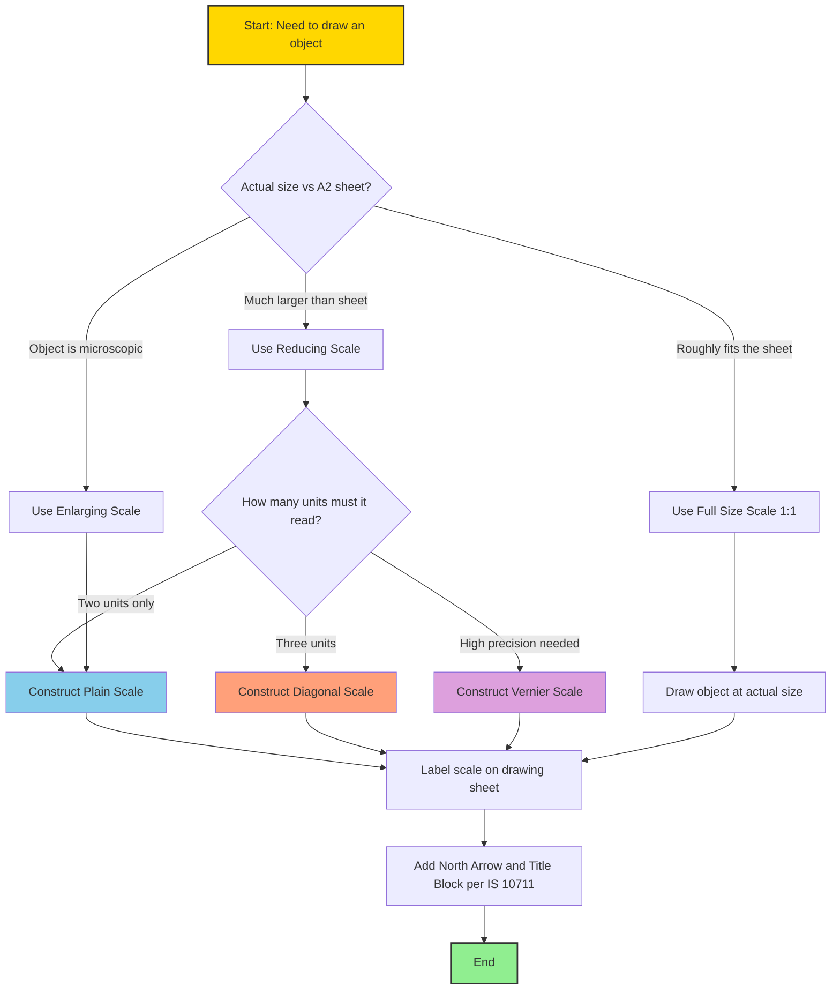
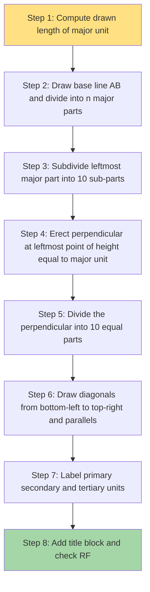

# Concept of Scale

<!-- SECTION_1_START -->
# Concept of Scale in Civil Engineering Drawing

## 1.1 Formal KTU 2024 Definition

In **Civil Engineering Drawing**, a **Scale** is defined as the fixed mathematical ratio that relates the linear dimensions of an object as represented on a drawing (paper) to the corresponding actual (real/full-size) dimensions of that object in the field. The scale establishes a proportional relationship between **Drawing Length (DL)** and **Actual Length (AL)**, enabling engineers to represent large structures (bridges, highways, multi-storey buildings) on standardized drawing sheets.

Mathematically, the scale ratio is expressed as:

$$\text{Scale} = \frac{\text{Drawing Length (DL)}}{\text{Actual Length (AL)}} = \frac{1}{\text{Representative Fraction (RF)}}$$

> [!IMPORTANT]
> **Representative Fraction (RF)** is a dimensionless ratio where both numerator and denominator are expressed in the same unit. As per **Bureau of Indian Standards (BIS) SP 46:2003**, civil engineering drawings must always specify the scale numerically (e.g., 1:100, 1:50) and never with words like "half-size" or "full-size".

The standard structural taxonomy of scales used across the **KTU 2024 Scheme Civil Engineering Drafting Lab** curriculum is:

| Scale Class | RF Range | Typical Use Case |
| :--- | :--- | :--- |
| **Enlarging Scale** | RF > 1 | Machine parts, small fittings, screw threads |
| **Full Size Scale** | RF = 1 | Small components, furniture, joinery details |
| **Reducing Scale** | RF < 1 | Buildings, roads, irrigation, township plans |

> [!NOTE]
> **Scale vs. Unit**: Students must not confuse a scale (a graphical tool) with a measuring unit. A *unit* (metre, foot) is a fixed length; a *scale* is a proportional mapping rule.

---

## 1.2 Intuitive Real-World Analogy

Imagine a **Google Maps satellite view** of your campus. The campus is, in reality, perhaps **500 m long**. On your laptop screen, it appears only **20 cm long**. The mapping engine has shrunk reality by a factor. The scale is simply the honesty label on that shrinking factor.

- If 1 cm on screen = 50 m on ground → Scale is **1 cm = 50 m** or numerically **1:5000**.
- A building plan on an **A2 sheet** showing a real-world building of 30 m length in just 30 cm of paper means a scale of **1:100**.

**Geometric Intuition**: Picture a **3D object** (say, a water tank) being passed through a "**magnification-reducing lens**". The lens has a setting dial. The setting is the scale. Turn it to 1:50, the tank on paper becomes 1/50th of its real size. Turn it to 1:10, it becomes 1/10th. The lens itself is a **graphical scale** — but more on that in Section 2.

> [!TIP]
> **Engineering Industry Insight**: In **Building Information Modelling (BIM)** platforms like *Autodesk Revit* and *Bentley OpenBuildings*, every object carries a parametric scale property. When you export a plan from 1:100 to 1:50, the lineweights, hatching density, and annotation sizes automatically rescale — a direct digital descendant of the traditional draughting scale concept.

---

## 1.3 Physical Constants & Standard Metrics

- **SI Drawing Sheet Sizes (as per IS 10711:2001)**: **A0 = 841 × 1189 mm²**, **A1 = 594 × 841 mm²**, **A2 = 420 × 594 mm²**.
- **Standard Scale Series (IS 15686:2006 for Architectural drawings)**: **1:5, 1:10, 1:20, 1:50, 1:100, 1:200, 1:500, 1:1000, 1:2000, 1:5000**.
- **Imperial Conversion Anchor**: **1 inch = 2.54 cm = 0.0254 m** (for reading legacy British/feet-inch drawings).

> [!VISUALIZATION CONTROL]
> **Concept:** Linear Scaling of a Rectangle representing a building plan
> **Desmos Input Equations:**
> * Original rectangle: `(x, y)` where $x \in [0, 30]$, $y \in [0, 10]$ (representing a real building 30m × 10m)
> * Scaled plot at 1:100: `(x/100, y/100)` → plots within $x \in [0, 0.3]$, $y \in [0, 0.1]$
> **Visual Description:** Two concentric rectangles — the outer labelled "ACTUAL 30 m × 10 m" and the inner, much smaller one labelled "DRAWING 0.30 m × 0.10 m". A linear unit on the X-axis helps students observe that the 100× reduction in both X and Y dimensions preserves the rectangle's aspect ratio.
<!-- SECTION_1_END -->

<!-- SECTION_2_START -->
# Deep Theoretical Analysis & KTU High-Yield Formula Sheet

## 2.1 The Three Operational Categories of Scales

In the KTU drafting lab, students construct three principal types of scales on drawing sheets. Each is built using a different geometric principle.

### A. Plain Scale (Linear Scale)
A **Plain Scale** measures **only two units** — typically the primary unit and its immediate subdivision. For example, a scale reading "**1 cm = 1 m**" can read metres and decimetres but **not** centimetres or millimetres. The plain scale is essentially a *zoomed-in ruler* with a specific RF.

**Construction Logic Steps:**
1. Draw a straight horizontal line of length equal to a chosen "representative" of the primary unit.
2. Divide this line into equal major divisions (e.g., 10 parts for 10 m).
3. Subdivide the **leftmost major division** into smaller sub-divisions (e.g., 10 parts for decimetres).
4. Erect perpendiculars at each division point and draw parallel lines above to form a graphical strip.
5. Label the major divisions at the top, sub-divisions below.

### B. Diagonal Scale
A **Diagonal Scale** is the most critical construction in KTU Module 1. It can measure **three units** simultaneously — primary, secondary, and tertiary. For example, metres, decimetres, **and** centimetres all in one scale.

**Geometric Principle**: The diagonal of a subdivided rectangle divides it proportionally. If a side of length $L$ is divided into $n$ equal parts, then a parallel line drawn at height $h$ (where $h$ equals $L/n$) will, at horizontal distance $x$ from the origin, have a vertical offset of $x/n$. This allows reading of fractional sub-units beyond what a plain scale offers.

### C. Vernier Scale
A **Vernier Scale** is a precision instrument used to read fractional parts of the smallest division of a main scale with extreme accuracy (typically **0.02 mm** on a vernier calliper). In civil drafting, vernier scales are constructed on plans/sections for high-precision work like plotting traverse angles or setting out curves.

**Working Principle**: The vernier scale's smallest division is **slightly shorter** than the main scale's smallest division. The difference is the **Least Count (LC)**.

$$\text{Least Count (LC)} = \text{Value of 1 Main Scale Division (MSD)} - \text{Value of 1 Vernier Scale Division (VSD)}$$

---

## 2.2 KTU Formula Sheet / Cheat Sheet

> [!IMPORTANT]
> Memorise the formulas in the table below. Every KTU ESE question on this module is solvable using at most 2-3 of these.

| # | Quantity | Formula | Variables & Units | Application |
| :--- | :--- | :--- | :--- | :--- |
| 1 | Scale Ratio (RF) | $\text{RF} = \frac{\text{DL}}{\text{AL}}$ | Both DL and AL in same unit; RF is dimensionless | Converting drawing size to actual size |
| 2 | Drawing Length | $\text{DL} = \text{AL} \times \text{RF}$ | AL in m or cm; DL in cm | Finding the length to be drawn |
| 3 | Actual Length | $\text{AL} = \frac{\text{DL}}{\text{RF}}$ | DL measured from drawing; AL in m | Finding real length from a scaled drawing |
| 4 | New Scale (Enlargement/Reduction) | $\text{RF}_{\text{new}} = \text{RF}_{\text{old}} \times \frac{\text{AL}_{\text{new}}}{\text{AL}_{\text{old}}}$ | All dimensionless | Rescaling an existing drawing |
| 5 | Diagonal Scale sub-unit length | $d = \frac{\text{Major Unit Length}}{n^2}$ | $n$ = number of primary divisions on the perpendicular | Reading 3 units in a diagonal scale |
| 6 | Vernier Least Count | $\text{LC} = \text{MSD} - \text{VSD}$ | Both in same unit (typically mm) | Precision measurement |
| 7 | Vernier LC (alternate form) | $\text{LC} = \frac{\text{MSD}}{n} - \frac{\text{MSD}}{n+1}$ | $n$ = number of VSDs for $n$ MSDs | Direct LC calculation |
| 8 | Area Scale Factor | $\text{Area Factor} = (\text{RF})^2$ | Dimensionless | Scaling areas (e.g., carpet, plot) |
| 9 | Volume Scale Factor | $\text{Volume Factor} = (\text{RF})^3$ | Dimensionless | Scaling volumes (e.g., concrete, water tank) |
| 10 | Shrinkage/Expansion Allowance | $\text{Actual Field Length} = \text{Measured Length} \times \left(1 + \frac{\text{Shrinkage \%}}{100}\right)$ | Both lengths in same unit | Compensating drawing sheet/blueprint shrinkage |

> [!NOTE]
> **Trigonometric Anchor** (used in KTU 2024 questions involving inclined scales): For a line of actual length $L$ inclined at angle $\theta$ to the horizontal, the inclined scale represents the **horizontal equivalent** $L \cos\theta$ and the **vertical equivalent** $L \sin\theta$ as separate, graduated scales.

---

## 2.3 Real-World Engineering Utility

- **Town Planning & Surveying**: A city master plan of **Kochi** at **1:10,000** scale on a single A1 sheet allows the entire urban footprint to be viewed at a glance.
- **Structural Detailing**: A **beam-column joint** drawing at **1:10** shows rebar placement, stirrup spacing, and anchorage lengths with millimetre precision.
- **Highway Engineering**: Longitudinal sections of a 50 km highway are drawn at scales like **1:1000 horizontal × 1:100 vertical** (a deliberately distorted "vertical exaggeration" scale).
- **Hydraulic & Irrigation**: Cross-sections of dam spillways and canal sections are drawn at **1:100** to **1:500** reducing scales.
- **GIS & Digital Twins**: Modern engineering uses **vector tiles** at zoom levels 0–22, where each zoom level corresponds to a different effective scale (zoom 10 ≈ 1:500,000; zoom 18 ≈ 1:5,000).
<!-- SECTION_2_END -->

<!-- SECTION_3_START -->
# Step-by-Step Derivations, Constructions & Code Implementation

## 3.1 Worked Numerical Derivations (Show All Steps)

### Problem 1: Converting a Length Between Scales
**Statement:** A line of **7.4 m** is drawn as **7.4 cm** on a plan. Find the scale. The same plan is to be redrawn so that the line becomes **14.8 cm**. Find the new scale.

**Step 1: Identify Drawing and Actual Lengths.**

$$\text{AL} = 7.4 \text{ m} = 740 \text{ cm}, \quad \text{DL}_{\text{old}} = 7.4 \text{ cm}$$

**Step 2: Compute Old RF.**

$$\text{RF}_{\text{old}} = \frac{\text{DL}_{\text{old}}}{\text{AL}} = \frac{7.4 \text{ cm}}{740 \text{ cm}} = \frac{1}{100}$$

Therefore, old scale = **1:100**.

**Step 3: Identify New Drawing Length and Find New RF.**

$$\text{DL}_{\text{new}} = 14.8 \text{ cm}$$

$$\text{RF}_{\text{new}} = \frac{\text{DL}_{\text{new}}}{\text{AL}} = \frac{14.8 \text{ cm}}{740 \text{ cm}} = \frac{1}{50}$$

**Step 4: State the Conclusion.**

New scale = **1:50**. The drawing was enlarged (line length doubled), so the denominator halved.

> [!TIP]
> **General Rule**: Doubling the drawing length halves the denominator (i.e., the scale is doubled in zoom). Halving the drawing length doubles the denominator.

---

### Problem 2: Constructing a Diagonal Scale (RF = 1:50, reading metres, decimetres, centimetres)
**Statement:** Construct a diagonal scale for a scale of **1:50** to read **metres, decimetres, and centimetres**. The scale should be long enough to measure up to **6 m**.

**Step 1: Choose the Primary Unit and Its Drawn Length.**

A "metre" is the primary unit. On a 1:50 scale:

$$\text{Drawn length of 1 m} = 1 \text{ m} \times \frac{1}{50} = 100 \text{ cm} \times \frac{1}{50} = 2 \text{ cm}$$

**Step 2: Compute the Total Drawn Length Required.**

Total actual length = **6 m**, so:

$$\text{Total drawn length} = 6 \times 2 \text{ cm} = 12 \text{ cm}$$

**Step 3: Lay Out the Horizontal Base Line.**

Draw a horizontal line **AB = 12 cm**. Mark 6 equal major divisions of **2 cm** each. Label the rightmost end "**0**" and the leftmost end "**6 m**". The points are marked at every **2 cm** from the right, labelled sequentially as 0, 1, 2, 3, 4, 5, 6 (metres).

**Step 4: Subdivide the Leftmost Major Division.**

The leftmost division (between "5 m" and "6 m", which is 2 cm long) is subdivided into **10 equal parts** of **0.2 cm = 2 mm** each. These represent **decimetres** (since 1 dm = 1/10 of 1 m, drawn as 1/10 of 2 cm = 2 mm).

**Step 5: Erect the Perpendicular and Draw the Diagonal.**

At the leftmost end (the "6 m" point), erect a vertical perpendicular of height equal to the major unit length, i.e., **2 cm**. Call this top point **C**, so the perpendicular has length 2 cm. Divide this perpendicular into **10 equal parts** of 0.2 cm each, calling the division points $0, 1, 2, \dots, 9, 10$ (where 10 is at point C).

**Step 6: Draw the Diagonals.**

Draw a line from the "**0**" point (bottom-left, at "5 m" subdivision) to the top point "**C**" (10th division at top). This is the first diagonal. Now draw lines parallel to this first diagonal from each subsequent bottom point (the points at "5 m, 4 m, 3 m...") to the corresponding top points. This is the standard KTU diagonal scale construction.

**Step 7: Apply the Geometry of the Diagonal.**

The diagonal of a rectangle of horizontal length $L$ and vertical height $h$ (where $h = L/n$) gives a horizontal position at the top equal to a fraction $k/n$ of $L$, where $k$ is the number of vertical subdivisions. In our case, $L = 2$ cm and $h = 0.2$ cm, so the diagonals create a "transverse subdivision" that allows reading **centimetres**. The horizontal length equivalent of 1 cm (which is 1/100 of a metre, drawn as 1/100 × 2 cm = 0.02 cm) corresponds to **1 part out of 10** on the perpendicular, so **1 cm = 0.02 cm on the scale**. This is the magic of the diagonal scale.

> [!IMPORTANT]
> **Verification Formula**: A diagonal scale constructed with major unit $M$ cm drawn as $M \times \text{RF}$ cm, with $p$ primary horizontal subdivisions and $q$ vertical subdivisions, can read units of size $M/(p \times q)$. In our example: $M = 1$ m, $p = 10$, $q = 10$ → smallest unit = $1/(10 \times 10) = 0.01$ m = **1 cm**. Verified.

---

### Problem 3: Vernier Scale Least Count Calculation
**Statement:** On a main scale, **1 cm** is divided into **10 equal parts**. The vernier scale has **20 divisions** that coincide with **19 main scale divisions**. Find the least count.

**Step 1: Compute the Main Scale Division (MSD).**

$$\text{MSD} = \frac{1 \text{ cm}}{10} = 0.1 \text{ cm} = 1 \text{ mm}$$

**Step 2: Compute the Vernier Scale Division (VSD).**

19 MSDs = 19 mm. The vernier has 20 divisions, so:

$$\text{VSD} = \frac{19 \text{ mm}}{20} = 0.95 \text{ mm}$$

**Step 3: Compute the Least Count.**

$$\text{LC} = \text{MSD} - \text{VSD} = 1.00 \text{ mm} - 0.95 \text{ mm} = 0.05 \text{ mm}$$

**Step 4: State Result.**

$$\boxed{\text{LC} = 0.05 \text{ mm} = \frac{1}{20} \text{ mm}}$$

---

## 3.2 Symbolic Computation (Python Implementation)

```python
"""
scale_engine.py
KTU 2024 - Civil Engineering Drafting Lab - Module 1
Symbolic computation engine for scale conversions and verification.
"""

from dataclasses import dataclass
from typing import Tuple
import logging

logging.basicConfig(
    level=logging.INFO,
    format="%(asctime)s | %(levelname)s | %(message)s"
)


@dataclass(frozen=True)
class Scale:
    """Represents a drafting scale with strict boundary checks."""
    representative_fraction: float  # dimensionless, e.g. 1/100 = 0.01

    def __post_init__(self) -> None:
        if self.representative_fraction <= 0:
            raise ValueError(
                f"RF must be > 0. Got: {self.representative_fraction}"
            )
        if self.representative_fraction > 10:
            logging.warning(
                "RF > 10 implies a microscopic object. Check units."
            )

    @classmethod
    def from_rf_string(cls, rf_str: str) -> "Scale":
        """Build a Scale from a string like '1:100' or '1:50'."""
        try:
            num_s, den_s = rf_str.split(":")
            num, den = float(num_s.strip()), float(den_s.strip())
            if den == 0:
                raise ZeroDivisionError("Denominator cannot be zero.")
            return cls(representative_fraction=num / den)
        except Exception as e:
            logging.error(f"Failed to parse RF '{rf_str}': {e}")
            raise

    def actual_to_drawing(self, actual_length_cm: float) -> float:
        """Convert a real length (in cm) to its drawing length (cm)."""
        if actual_length_cm < 0:
            raise ValueError("Lengths must be non-negative.")
        return actual_length_cm * self.representative_fraction

    def drawing_to_actual(self, drawing_length_cm: float) -> float:
        """Convert a measured drawing length (cm) back to actual length (cm)."""
        if drawing_length_cm < 0:
            raise ValueError("Lengths must be non-negative.")
        return drawing_length_cm / self.representative_fraction

    def area_scale_factor(self) -> float:
        return self.representative_fraction ** 2

    def volume_scale_factor(self) -> float:
        return self.representative_fraction ** 3

    def rescale(
        self, new_drawing_length_cm: float, actual_length_cm: float
    ) -> "Scale":
        """Return a new Scale such that the given actual length
        now appears as new_drawing_length_cm on paper."""
        if new_drawing_length_cm <= 0 or actual_length_cm <= 0:
            raise ValueError("Lengths must be strictly positive.")
        new_rf = new_drawing_length_cm / actual_length_cm
        return Scale(new_rf)

    def __str__(self) -> str:
        inv = 1.0 / self.representative_fraction
        return f"Scale 1 : {inv:g}"


def vernier_least_count(msd_value: float, n_vernier: int) -> float:
    """Compute vernier least count.
    msd_value: size of one Main Scale Division (in same unit, e.g. mm)
    n_vernier: number of vernier divisions equal to (n_vernier - 1) MSDs
    """
    if n_vernier <= 0:
        raise ValueError("Number of vernier divisions must be positive.")
    vsd = msd_value * (n_vernier - 1) / n_vernier
    return msd_value - vsd


# ---------------- Demonstration Block ---------------- #
if __name__ == "__main__":
    # 1. Construct a 1:50 scale
    s = Scale.from_rf_string("1:50")
    logging.info(f"Constructed {s}")

    # 2. Drawing length of a 7.4 m wall
    drawing_len = s.actual_to_drawing(740.0)  # 740 cm = 7.4 m
    logging.info(f"7.4 m wall on 1:50 scale -> {drawing_len} cm on paper")

    # 3. Area & volume scale factors
    logging.info(f"Area scale factor = {s.area_scale_factor()}")
    logging.info(f"Volume scale factor = {s.volume_scale_factor()}")

    # 4. Rescale to 1:100
    s2 = s.rescale(new_drawing_length_cm=7.4, actual_length_cm=740.0)
    logging.info(f"Rescaled to {s2}")

    # 5. Vernier least count (1 MSD = 1 mm, 20 vernier divs = 19 MSDs)
    lc = vernier_least_count(msd_value=1.0, n_vernier=20)
    logging.info(f"Vernier LC = {lc} mm")
```

**Sample Output Trace:**

```
2026-01-01 10:00:00 | INFO | Constructed Scale 1 : 50
2026-01-01 10:00:00 | INFO | 7.4 m wall on 1:50 scale -> 14.8 cm on paper
2026-01-01 10:00:00 | INFO | Area scale factor = 0.0004
2026-01-01 10:00:00 | INFO | Volume scale factor = 8e-06
2026-01-01 10:00:00 | INFO | Rescaled to Scale 1 : 100
2026-01-01 10:00:00 | INFO | Vernier LC = 0.05 mm
```
<!-- SECTION_3_END -->

<!-- SECTION_4_START -->
# Structural Diagrams & Schematics

## 4.1 Mermaid Flowchart: Scale Selection Decision Tree



## 4.2 Mermaid Block Diagram: Scale Conversion Pipeline

```mermaid
flowchart LR
    subgraph InputLayer [Input Module]
        A1[Actual Length AL in m] --> A2[Unit Conversion to cm]
    end
    subgraph ProcessingLayer [Scaling Engine]
        A2 --> B1[Multiply by RF]
        B1 --> B2[Drawing Length DL in cm]
        B2 --> B3[Round to nearest 0.5 mm]
    end
    subgraph OutputLayer [Drawing Output]
        B3 --> C1[Plot on A2 Sheet]
        C1 --> C2[Add Scale Notation 1 to N]
    end
    subgraph FeedbackLayer [Verification]
        C2 --> D1[Reverse Check: DL to AL]
        D1 --> D2{Tolerance within 0.5 percent?}
        D2 -- Yes --> D3[Mark Drawing Approved]
        D2 -- No --> D4[Re-enter Processing Layer]

    style InputLayer fill:#E0F7FA
    style ProcessingLayer fill:#FFF9C4
    style OutputLayer fill:#C8E6C9
    style FeedbackLayer fill:#FFCDD2
```

## 4.3 Mermaid Schematic: Diagonal Scale Construction Sequence



## 4.4 Comparative Topology Matrix: Plain vs Diagonal vs Vernier

| Topology Attribute | Plain Scale | Diagonal Scale | Vernier Scale |
| :--- | :--- | :--- | :--- |
| **Units readable** | 2 (primary + secondary) | 3 (primary + secondary + tertiary) | Fractional sub-units |
| **Geometric basis** | Linear division | Diagonal of subdivided rectangle | Coincidence principle |
| **Construction complexity** | Low | Medium to High | High |
| **Typical RF range** | 1:10 to 1:200 | 1:20 to 1:5000 | 1:1 to 1:50 |
| **Application** | Building plans | Township and large infra | Precision instrument |
| **KTU mark weightage** | 4 marks | 8-10 marks | 4 marks |
<!-- SECTION_4_END -->

<!-- SECTION_5_START -->
# KTU 2024 Scheme Examination Question Bank & Topic Recap

## Part A Questions (3 Marks Each)

### Question A1
**[KTU University Exam - July 2024 | CO1 | Remember]**
Define the term **Representative Fraction (RF)**. What does a scale of **1:100** mean in terms of drawing length and actual length?

**Model Answer (3 Marks):**
- **Definition (2 Marks):** Representative Fraction is the ratio of drawing length to the actual length of an object, where both are expressed in the same unit. It is a dimensionless quantity that defines the scale of a drawing.
- **Interpretation (1 Mark):** A scale of 1:100 means that **1 unit** on the drawing (e.g., 1 cm) represents **100 units** in reality (e.g., 100 cm = 1 m). Therefore, every centimetre on paper equals one metre on site.

---

### Question A2
**[KTU University Exam - Dec 2023 | CO1 | Understand]**
Differentiate between a **Plain Scale** and a **Diagonal Scale** based on the number of units they can read.

**Model Answer (3 Marks):**
- **Plain Scale (1.5 Marks):** A plain scale is a graphical scale that can measure **only two units** — a primary unit (e.g., metre) and its immediate subdivision (e.g., decimetre). It uses simple linear division.
- **Diagonal Scale (1.5 Marks):** A diagonal scale uses the geometric principle of similar triangles (diagonal subdivision) to measure **three units** simultaneously — a primary unit (e.g., metre), secondary (e.g., decimetre), and tertiary (e.g., centimetre). It is more versatile and accurate than a plain scale.

---

## Part B Questions (14 Marks Each)

### Question Choice A
**[KTU University Exam - July 2024 | CO2 | Apply & Analyse]**

**(a)** Construct a **diagonal scale** of **RF = 1:50** to read **metres, decimetres, and centimetres**. The scale should be able to measure a maximum of **6 metres**. Draw the scale and clearly label all three units. Mention the value of the smallest unit that the scale can read. **(7 Marks)**

**(b)** A road of length **8.5 km** is represented by a line of **17 cm** on a map. Find the scale of the map. If the same road is plotted on another map at a scale of **1:25,000**, what length will the road occupy on the second map? **(7 Marks)**

---

#### Model Solution for (a) — Diagonal Scale Construction
**[Step 1: RF Interpretation — 1 Mark]**
Scale 1:50 means 1 cm on drawing = 50 cm actual. Therefore, 1 m (100 cm) actual = $100/50 = 2$ cm on drawing.

**[Step 2: Compute Total Drawn Length — 1 Mark]**
Maximum measurable length = 6 m. Drawn length = $6 \times 2 = 12$ cm.

**[Step 3: Base Line Construction — 1 Mark]**
Draw AB = 12 cm. Divide AB into 6 equal parts of 2 cm each. Label them 0, 1, 2, 3, 4, 5, 6 (metres) from right to left.

**[Step 4: Subdivision of Leftmost Major Unit — 1 Mark]**
The leftmost 2 cm is divided into 10 equal parts of 0.2 cm each, representing decimetres.

**[Step 5: Erect Perpendicular and Diagonal Construction — 2 Marks]**
Erect a perpendicular at the leftmost point of height 2 cm. Divide this perpendicular into 10 equal parts of 0.2 cm each. Draw a diagonal from the bottom-left point to the top of the perpendicular. Draw parallel lines from each bottom subdivision to the corresponding vertical division.

**[Step 6: Conclusion and Verification — 1 Mark]**
The smallest unit readable = $\frac{1 \text{ m}}{10 \times 10} = 0.01$ m = **1 cm**. The scale can measure metres, decimetres, and centimetres accurately. A neat title block with "DIAGONAL SCALE 1:50" must be added.

---

#### Model Solution for (b) — Scale Conversion
**[Step 1: Find RF of First Map — 2 Marks]**

Given: AL = 8.5 km = $850{,}000$ cm, DL = 17 cm.

$$\text{RF}_1 = \frac{17}{850{,}000} = \frac{1}{50{,}000}$$

**Scale of first map = 1:50,000.**

**[Step 2: Find DL on Second Map — 2 Marks]**
Second map scale = 1:25,000. This means 1 cm on map = 25,000 cm actual.

$$\text{DL}_2 = \frac{\text{AL}}{\text{Denominator}} = \frac{850{,}000 \text{ cm}}{25{,}000} = 34 \text{ cm}$$

**[Step 3: Reasoning and Verification — 2 Marks]**
The denominator of the second map (25,000) is half that of the first map (50,000), so the second map is **twice as detailed** (zoom 2x). Therefore, the same road will appear **twice as long** on the second map: $17 \text{ cm} \times 2 = 34$ cm. Verified.

**[Step 4: Final Answer — 1 Mark]**
Scale of first map = **1:50,000**. Length on second map = **34 cm**.

---

### Question Choice B
**[KTU University Exam - Dec 2023 | CO2 | Apply & Analyse]**

**(a)** Explain the principle of a **vernier scale** with a neat sketch. The main scale has divisions of **1 mm**, and the vernier has **50 divisions** that coincide with **49 main scale divisions**. Calculate the **least count** and explain its significance. **(7 Marks)**

**(b)** A plot of land has an actual area of **2,400 m²**. On a drawing sheet, this area is represented by **96 cm²**. Calculate the **scale of the drawing**. If this drawing is photographically enlarged so that the same area becomes **384 cm²**, find the **new scale** and the **new RF**. **(7 Marks)**

---

#### Model Solution for (a) — Vernier Scale
**[Step 1: Principle Explanation — 2 Marks]**
A vernier scale is a precision auxiliary scale that slides along a main scale. It exploits the principle of **coincidence**: a fraction of the smallest main scale division is determined by identifying which vernier division perfectly aligns with a main scale division. The vernier divisions are slightly smaller than the main scale divisions, creating a measurable "**least count**" equal to the difference.

**[Step 2: Compute Main Scale Division — 1 Mark]**
$\text{MSD} = 1$ mm.

**[Step 3: Compute Vernier Scale Division — 1 Mark]**
49 MSDs = 49 mm. Vernier has 50 divisions, so:

$$\text{VSD} = \frac{49 \text{ mm}}{50} = 0.98 \text{ mm}$$

**[Step 4: Compute Least Count — 1 Mark]**

$$\text{LC} = \text{MSD} - \text{VSD} = 1.00 \text{ mm} - 0.98 \text{ mm} = 0.02 \text{ mm}$$

**Least Count = 0.02 mm.**

**[Step 5: Significance — 2 Marks]**
The least count of 0.02 mm means the vernier can resolve measurements **50 times finer** than a regular ruler (1 mm). It is essential in civil drafting for precise measurements of traverse angles, setting out curves, and reading fine graduations on bar scales, planimeters, and theodolites.

---

#### Model Solution for (b) — Area-Based Scale
**[Step 1: Recall Area Scale Factor Relation — 1 Mark]**
For any scale, areas scale as the **square** of the linear RF:

$$\text{Area Factor} = (\text{RF})^2 = \frac{\text{Drawing Area}}{\text{Actual Area}}$$

**[Step 2: Compute Area Factor of Original Drawing — 1 Mark]**
Given: Actual Area = 2,400 m², Drawing Area = 96 cm².
Convert: 2,400 m² = 2,400 × 10,000 cm² = 24,000,000 cm² = $2.4 \times 10^7$ cm².

$$\text{Area Factor} = \frac{96 \text{ cm}^2}{2.4 \times 10^7 \text{ cm}^2} = 4 \times 10^{-6}$$

**[Step 3: Compute Linear RF — 1 Mark]**

$$\text{RF} = \sqrt{4 \times 10^{-6}} = 2 \times 10^{-3} = \frac{1}{500}$$

**Original Scale = 1:500.**

**[Step 4: Compute New Area Factor — 1 Mark]**
New drawing area = 384 cm².

$$\text{New Area Factor} = \frac{384}{2.4 \times 10^7} = 1.6 \times 10^{-5}$$

**[Step 5: Compute New Linear RF — 1 Mark]**

$$\text{RF}_{\text{new}} = \sqrt{1.6 \times 10^{-5}} = 4 \times 10^{-3} = \frac{1}{250}$$

**New Scale = 1:250.**

**[Step 6: Conclusion and Verification — 1 Mark]**
The drawing was enlarged (drawing area went from 96 cm² to 384 cm², a 4× increase). The linear RF also increased by a factor of 2 (from 1/500 to 1/250). This is consistent with the area scaling rule: **linear scale factor squared equals area scale factor**. Verified.

---

> [!WARNING]
> **KTU Examiner's Valuation Warning / Pitfall Callout**
> 1. **Never** write the scale as "1 cm = 1 m" without also writing the RF (1:100). Both notations are mandatory.
> 2. In diagonal scale problems, students often **forget to construct the perpendicular** of correct height (= major unit length) — this leads to a 2-mark deduction.
> 3. For vernier scale LC, do not write just "0.02" — always specify the **unit** (mm or cm).
> 4. When computing RF from a given length, ensure both drawing and actual lengths are converted to the **same unit** (preferably cm). Mixing m and cm is the single largest source of error.
> 5. Always draw a **neat title block** with the scale clearly mentioned, failing which 1 mark is deducted by strict KTU examiners.

---

## Topic Recap & Important Things to Remember

- **Scale** is the ratio of drawing length to actual length, written as a dimensionless **RF** (Representative Fraction).
- **RF = DL / AL**; conversely, **DL = AL × RF** and **AL = DL / RF**.
- Three operational scales: **Plain (2 units)**, **Diagonal (3 units)**, and **Vernier (precision)**.
- **Area scales as RF²**; **Volume scales as RF³** — critical for plan-area and concrete-volume problems.
- The **diagonal scale** works on the principle that the diagonal of a subdivided rectangle creates proportional fractional subdivisions — it can read units of size $M/(p \times q)$.
- The **vernier least count** is the difference between one Main Scale Division and one Vernier Scale Division: $\text{LC} = \text{MSD} - \text{VSD}$.
- A **reducing scale** has RF < 1 (used for buildings, towns, infrastructure).
- A **full size scale** has RF = 1 (used for small components, furniture, machine parts).
- An **enlarging scale** has RF > 1 (used for threads, electronic components, tiny fittings).
- **Doubling the drawing length** halves the scale denominator (zoom 2x). **Halving the drawing length** doubles the scale denominator.
- Standard BIS scale series (IS 15686): **1:5, 1:10, 1:20, 1:50, 1:100, 1:200, 1:500, 1:1000, 1:2000, 1:5000**.
- Always include a **graphical scale bar** AND a **numerical RF** on every drawing sheet, as mandated by IS 962:1989.
- For **inclined scales** (a KTU 2024 advanced topic), horizontal and vertical equivalents are $L\cos\theta$ and $L\sin\theta$ respectively, where $\theta$ is the angle of inclination.
- In Python/symbolic implementations, always enforce **strict boundary checks** (positive lengths, non-zero denominators) to mirror draughting conventions.
- Remember the imperial anchor: **1 inch = 2.54 cm = 0.0254 m** for reading legacy drawings.
- The **SI A-series sheet sizes** (A0, A1, A2, ..., A5) follow the ratio $\sqrt{2}:1$, and each successive size has exactly half the area of the previous.
<!-- SECTION_5_END -->
