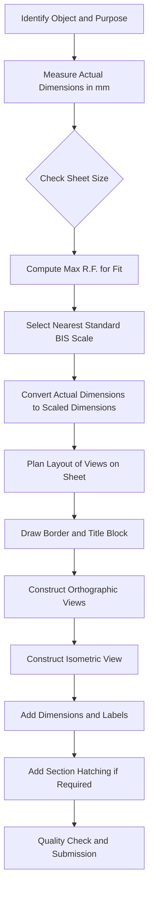
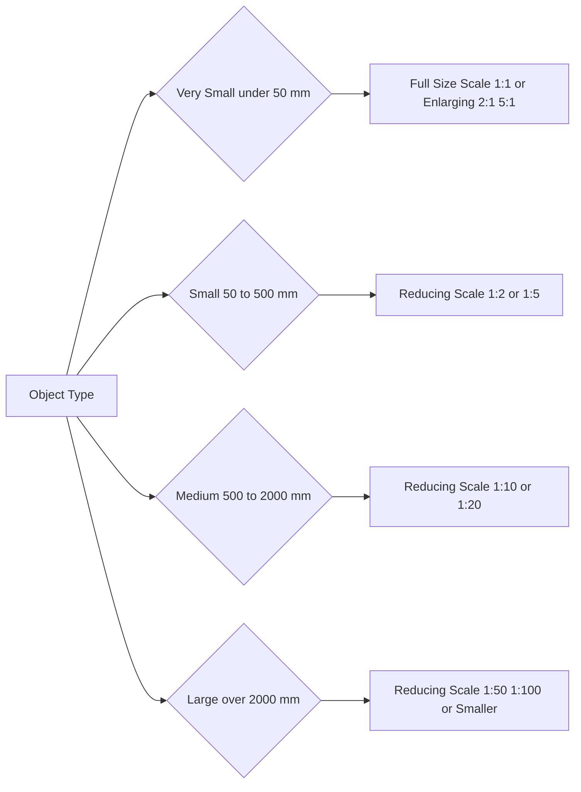
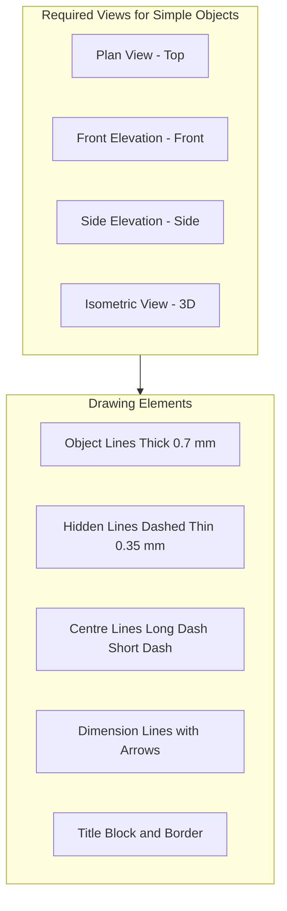
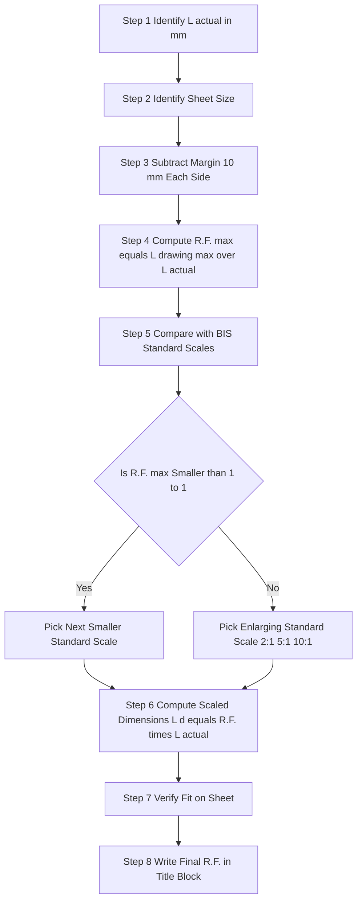

# Draw the view of simple objects (books, shelves, benches, etc.) adopting appropriate scales

<!-- SECTION_1_START -->

# Introduction to Civil Engineering Drawing — Simple Objects & Scale Selection

## 1.1 Formal KTU 2024 Definition

**Civil Engineering Drawing** is the graphical language of engineers, used to represent civil engineering structures, components, and objects on a plane surface (paper) using standardized lines, symbols, dimensions, and projections as per **Bureau of Indian Standards (BIS) – SP 46:2003** and **IS 962:1989**.

> [!IMPORTANT]
> **Scale** in engineering drawing is defined as the **ratio of the length of a line on the drawing to the actual length of the object represented**.
>
> $$\text{Representative Fraction (R.F.)} = \frac{\text{Length on Drawing}}{\text{Actual Length of Object}}$$

A **simple object** (book, shelf, bench, table, step, etc.) is any primitive geometric body bounded by planes, cylinders, or simple prisms. Drafting such objects is the foundational exercise that introduces a student to **projection geometry**, **dimensioning practice**, and **scale adoption**.

## 1.2 Conceptual Analogy — The "Map Analogy"

Imagine you are explaining your classroom to a friend who lives in another state. You cannot carry the whole classroom to them, so you make a **smaller copy on a paper** that looks exactly the same but fits in your hand. The "shrinking factor" you used is the **scale**.

- If the classroom is 10 m long and you draw it as 100 mm, your **R.F. = 100/10000 = 1/100**.
- This ratio is the **universal language of scale** — anyone, anywhere, can read the drawing and reconstruct the real object.

> [!NOTE]
> **Golden Rule of Scaling (KTU Board Favourite):**
> Always pick a scale that keeps the drawing **within the sheet**, leaves a **minimum 10 mm margin** on all sides, and makes dimensions **legible without strain** (recommended minimum text height = 2.5 mm on the final print).

## 1.3 Types of Scales in Civil Drafting

| Scale Type | Notation | Usage in Civil Drafting |
|---|---|---|
| **Full Size Scale** | **R.F. = 1 : 1** | Small machine bolts, simple object details (book, key) |
| **Reducing Scale** | **R.F. < 1** (e.g., 1:5, 1:50, 1:100) | Buildings, benches, shelves, plans |
| **Enlarging Scale** | **R.F. > 1** (e.g., 2:1, 5:1) | Tiny components, threads, sections |
| **Plain Scale** | Single R.F. | Measures only one unit (m or mm) |
| **Diagonal Scale** | Three-unit accuracy | Reads metres, decimetres, centimetres simultaneously |
| **Vernier Scale** | High precision | Engineering instruments, scientific drafting |

> [!VISUALIZATION CONTROL]
> **Concept:** R.F. and its visual representation on a number line.
> **GeoGebra / Desmos Input Equations:**
> * `R = 1/50`
> * `x = 50 * R` (point on the number line showing 1 m on paper equals 50 m actual)
> **Visual Description:** A number line from 0 to 1 with a marked point showing how 1 unit on the drawing expands to 50 units in reality.

## 1.4 Recommended Scales for Simple Civil Objects

| Object | Typical Real Size | Recommended Scale | R.F. |
|---|---|---|---|
| Book / Notebook | 300 mm × 200 mm × 30 mm | Full or 1:2 | 1:1 or 1:2 |
| Wooden Shelf | 1200 mm × 300 mm × 25 mm | 1:5 or 1:10 | 1:5, 1:10 |
| Reading Bench | 1500 mm × 450 mm × 450 mm | 1:5 or 1:10 | 1:5, 1:10 |
| Door / Window | 2100 mm × 900 mm | 1:5 or 1:10 | 1:5, 1:10 |
| Step / Riser | 300 mm × 150 mm | 1:2 or 1:5 | 1:2, 1:5 |

<!-- SECTION_1_END -->

<!-- SECTION_2_START -->

# Deep Theoretical Analysis & KTU High-Yield Scale Cheat Sheet

## 2.1 Principles Governing the Choice of Scale

The selection of scale is **not arbitrary**; it is governed by a logical hierarchy of constraints that every KTU examiner expects a student to articulate.

1. **Size of the Object vs. Sheet Size**
   The drawing must fit comfortably. For an A2 sheet (594 mm × 420 mm) with a 10 mm border, the usable area is 574 mm × 400 mm. The longest object dimension must be **scaled down** to fall within this envelope.

2. **Degree of Detail to be Shown**
   Complex objects with many internal features require a **larger scale** (closer to 1:1) to retain clarity. Simple objects can be drawn at smaller scales.

3. **Purpose of the Drawing**
   - *Presentation drawings* (for clients) → smaller scales (1:50, 1:100).
   - *Working drawings* (for site execution) → larger scales (1:5, 1:10).
   - *Detail drawings* (joints, fittings) → very large scales (1:1, 2:1, 5:1).

4. **Standardisation (BIS Guidelines)**
   IS 962:1989 recommends **preferred scales** such as 1:1, 1:2, 1:5, 1:10, 1:20, 1:50, 1:100, 1:200, 1:500, 1:1000, 1:2000. Always pick the **nearest standard scale**.

## 2.2 KTU High-Yield Formula Sheet

| Concept | Formula / Rule | Application |
|---|---|---|
| Representative Fraction | $R.F. = \dfrac{L_d}{L_a}$ | Where $L_d$ = length on drawing, $L_a$ = actual length |
| Drawing Length | $L_d = R.F. \times L_a$ | Convert real size to paper size |
| Actual Length | $L_a = \dfrac{L_d}{R.F.}$ | Convert paper size to real size |
| Scale Conversion (mm to m) | $1 \text{ m} = 1000 \text{ mm}$ | Always convert units before applying R.F. |
| Area Ratio | $(R.F.)^2$ | Used in plan area problems |
| Volume Ratio | $(R.F.)^3$ | Used in storage/capacity problems |
| Sheet Margin Rule | $\geq 10 \text{ mm}$ on all sides | BIS drafting convention |
| Minimum Letter Height | $\geq 2.5 \text{ mm}$ (final print) | Legibility on reduced copies |
| Dimension Line Spacing | $\geq 7 \text{ mm}$ between parallel dims | Avoids dimension overlap |
| Line Thickness Hierarchy | Object line thick, hidden thin, centre very thin | IS 962 line conventions |

> [!IMPORTANT]
> **Always convert to the same unit** before substituting into the R.F. formula. A classic KTU pitfall is mixing metres and millimetres, which gives a wrong R.F. by a factor of 1000.

## 2.3 Drawing Conventions for Simple Objects

- **Object Lines:** Continuous thick lines (≈ 0.7 mm) outlining the visible edges.
- **Hidden Lines:** Dashed thin lines (≈ 0.35 mm) for edges behind the object.
- **Centre Lines:** Long-dash-short-dash thin lines (≈ 0.35 mm) for symmetry.
- **Dimension Lines:** Continuous thin lines (≈ 0.35 mm) with arrowheads, placed **outside** the object.
- **Extension Lines:** Thin lines projecting from the object to the dimension line, leaving a **2 mm gap** from the object.
- **Title Block:** Bottom-right corner of the sheet, listing drawing name, scale, drawn by, checked by, date, sheet number.

## 2.4 Real-World Engineering Utility

Scale drawings are the **backbone of the construction industry**. Before a single brick is laid, the engineer produces:
- A **site plan** at 1:500 showing the plot in its surroundings.
- A **building plan** at 1:50 showing room layouts.
- A **bench/wood-work detail** at 1:5 or 1:10 for the carpenter to fabricate.
- A **door/window schedule** at 1:1 for the vendor to manufacture.

Without standardised scales, no two stakeholders (architect, structural engineer, contractor, client) could communicate a unified vision of the project.

<!-- SECTION_2_END -->

<!-- SECTION_3_START -->

# Step-by-Step Derivations, Scale Calculations & Drawing Procedures

## 3.1 Worked Example 1 — Scale Calculation for a Wooden Bench

> **Problem Statement:**
> A wooden reading bench has actual dimensions **1500 mm (Length) × 450 mm (Width) × 450 mm (Height)**. The draughtsman decides to draw it on an A2 sheet (594 mm × 420 mm) using a uniform scale.
>
> **(a)** Determine the largest standard R.F. that fits the bench **along the length** of the sheet with a 10 mm margin.
>
> **(b)** Check if the **width (90 mm scaled)** and **height (90 mm scaled)** fit on the perpendicular side of the sheet.
>
> **(c)** State whether this scale is acceptable or whether a smaller scale must be chosen.

### Step 1 — Convert Sheet to Usable Drawing Area
$$\text{Usable Length} = 594 - (2 \times 10) = 574 \text{ mm}$$
$$\text{Usable Width} = 420 - (2 \times 10) = 400 \text{ mm}$$

### Step 2 — Compute Maximum R.F. along the Length
$$L_d^{\max} = 574 \text{ mm}, \quad L_a = 1500 \text{ mm}$$
$$R.F._{\max} = \frac{L_d^{\max}}{L_a} = \frac{574}{1500} = 0.3827 \approx \frac{1}{2.61}$$

### Step 3 — Snap to the Nearest Standard (BIS) Scale
The next **smaller** standard scale below 1/2.61 is **R.F. = 1/5**.

> [!IMPORTANT]
> Always pick a scale **smaller** (more reduced) than the calculated maximum so the drawing fits comfortably with breathing room for dimensions and title block.

### Step 4 — Recompute Scaled Dimensions at R.F. = 1:5
$$L_d = 1500 \times \frac{1}{5} = 300 \text{ mm}$$
$$W_d = 450 \times \frac{1}{5} = 90 \text{ mm}$$
$$H_d = 450 \times \frac{1}{5} = 90 \text{ mm}$$

### Step 5 — Verify the Fit
- Length 300 mm < 574 mm ✓
- Width 90 mm < 400 mm ✓
- Height 90 mm < 400 mm ✓

**R.F. = 1:5 is ACCEPTABLE** with substantial space for three orthographic views and dimensioning.

## 3.2 Worked Example 2 — Reverse Scale Calculation (Drawing → Actual)

> **Problem Statement:**
> On a sheet, a bookshelf is drawn as **240 mm long** at **R.F. = 1:10**. Find the actual length of the bookshelf.

### Solution
$$L_a = \frac{L_d}{R.F.} = \frac{240}{1/10} = 240 \times 10 = 2400 \text{ mm} = 2.4 \text{ m}$$

## 3.3 Step-by-Step Drafting Procedure for a Simple Book (Isometric View)

### 3.3.A Required Drawing Tools & Materials

| S.No. | Item | Specification | Purpose |
|---|---|---|---|
| 1 | Drawing Sheet | A2 (594 × 420 mm), 180 gsm | Base surface |
| 2 | Drawing Board | Standard wooden / metal | Support |
| 3 | T-Square | 600 mm, graduated | Horizontal lines |
| 4 | Set Squares | 45° and 30°-60° | Angles & isometric axes |
| 5 | Mini Drafting Set | Compass, divider, inking pen | Curves, circles |
| 6 | Scale (Ruler) | Flat wooden, 300 mm | Measuring scaled distances |
| 7 | Pencils | H, 2H, HB (sharpened) | Construction, outlining, darkening |
| 8 | Eraser & Dusting Cloth | Soft, non-smudging | Corrections |
| 9 | Sand Paper Block | Fine grade | Sharpening pencils |
| 10 | Adhesive Tape | 12 mm wide | Fixing sheet to board |
| 11 | Title Block Template | Pre-printed | Standardised information |

### 3.3.B Step-by-Step Drafting Procedure

**Phase 1 — Sheet Preparation (5 minutes)**
1. Fix the sheet on the drawing board using adhesive tape at the four corners.
2. Draw a **border line** 10 mm from each edge using the T-square and set square.
3. Partition the sheet into a **title block** at the bottom-right corner (170 mm × 65 mm standard).
4. In the title block, write: *Name, Roll No, Subject, Drawing Title, Scale, Date, Sheet No*.

**Phase 2 — Layout Planning (5 minutes)**
5. Decide the views to be drawn. For a book, we draw:
   - **Plan (Top View)**
   - **Elevation (Front View)**
   - **Side Elevation (Side View)**
   - **Isometric View** (3D impression)
6. Apply the **2 × 2 layout** rule: divide the sheet into four equal quadrants.

**Phase 3 — Orthographic Projection Construction (20 minutes)**
7. For a book of actual size **300 mm × 200 mm × 30 mm** at **R.F. = 1:2**:
   - Scaled Length = 150 mm
   - Scaled Width = 100 mm
   - Scaled Height = 15 mm
8. In the **plan view quadrant**, draw a rectangle 150 mm × 100 mm using H-grade pencil for construction.
9. Project vertical lines **downward** using T-square to draw the **front elevation** (150 mm × 15 mm rectangle).
10. Project horizontal lines **to the right** using 45° set square to draw the **side elevation** (100 mm × 15 mm rectangle).
11. Darken the final outlines with HB pencil at the recommended **0.7 mm thickness**.

**Phase 4 — Isometric Construction (15 minutes)**
12. Mark a starting point in the isometric quadrant.
13. Draw three isometric axes at **30° (left), 30° (right), and 90° (vertical)**.
14. Mark the scaled dimensions along these axes:
    - Along left axis: 75 mm (= 150/2)
    - Along right axis: 50 mm (= 100/2)
    - Along vertical axis: 15 mm
15. Complete the **isometric box**, then offset it inward to represent the book thickness.

**Phase 5 — Dimensioning & Hatching (15 minutes)**
16. Add dimension lines, extension lines, and arrowheads. Write dimensions in **mm** (no units on the drawing).
17. Show the **R.F. = 1:2** in the title block and below the isometric view as *"Scale 1:2"*.
18. Hatch the section planes (if any) using 45° lines, spaced 3 mm apart.

**Phase 6 — Quality Check (5 minutes)**
19. Verify all lines, dimensions, and the title block.
20. Erase construction lines gently. Initial the sheet at the bottom-right of the title block.

> [!NOTE]
> **Safety & Quality Checklist:**
> - Always work on a **flat, vibration-free** table.
> - Keep **hands clean** to avoid smudging pencil lines.
> - Never use the **eraser aggressively** — it damages the sheet surface.
> - Store sheets in a **flat folder**, never folded.

## 3.4 Worked Example 3 — Diagonal Scale Construction (Theory)

> Although the lab focuses on simple objects, KTU frequently tests the **principle** of diagonal scales. A diagonal scale is constructed to measure **three successive units** accurately.

For a diagonal scale of **R.F. = 1:5** to read **metres, decimetres, and centimetres** (3 units):
- Draw a horizontal line and divide it into 5 equal parts (each part = 1 m).
- Erect perpendiculars at each division, 15 cm tall.
- Divide the leftmost perpendicular into 10 equal parts (each = 1 dm).
- Connect the top of the 10th division to the bottom of the 1st perpendicular, then draw **diagonals parallel** to this line.

Reading principle: a point on the 3rd horizontal and 7th diagonal reads **0.37 m = 3 dm 7 cm**.

<!-- SECTION_3_END -->

<!-- SECTION_4_START -->

# Structural Diagrams & Schematics

## 4.1 Block Diagram — Civil Engineering Drafting Workflow

## 4.2 Block Diagram — Scale Selection Decision Matrix

## 4.3 Functional Architecture — Drawing View Composition

## 4.4 Sequential Processing Topology — Scale Calculation Pipeline

<!-- SECTION_4_END -->

<!-- SECTION_5_START -->

# KTU 2024 Scheme Examination Question Bank & Topic Recap

## 5.1 Part A — Short Answer Questions (3 Marks Each)

### Question 1
**[KTU University Exam — July 2024]** Define **Representative Fraction (R.F.)** in engineering drawing. Mention **two standard scales** used for drawing building plans and **two** used for component details.

**Model Answer (Valuation Key):**
- **Definition (2 Marks):** Representative Fraction is the ratio of the length of a line on the drawing to its actual length on the object, i.e., $R.F. = \dfrac{L_d}{L_a}$. It is dimensionless and independent of units.
- **Building Plan Scales (0.5 Mark):** 1:50 and 1:100.
- **Component Detail Scales (0.5 Mark):** 1:1 and 1:5.

> [!WARNING]
> Do not write "R.F. = drawing/actual" without defining both terms explicitly. Examiners deduct **1 mark** for vague definitions.

### Question 2
**[KTU University Exam — Dec 2023]** What is a **plain scale**? State its **limitations** and explain why a **diagonal scale** is preferred when three units are to be measured.

**Model Answer (Valuation Key):**
- **Plain Scale (1 Mark):** A scale that can measure only **one unit** (or two successive units like m and dm) accurately.
- **Limitations (1 Mark):** Cannot read three successive units (m, dm, cm) precisely; accuracy is limited to the smallest division drawn.
- **Diagonal Scale Advantage (1 Mark):** A diagonal scale uses the principle of similar triangles along the diagonal of a divided rectangle, allowing the **third unit** (cm in a m-dm-cm scale) to be read with high precision, satisfying the need for fine measurement in detailed civil drawings.

---

## 5.2 Part B — Long Answer Questions (14 Marks Each, with Internal Choice)

### Question A — 14 Marks

**[KTU University Exam — July 2024, CO1, Apply / Analyse]**

**(a)** A wooden reading bench has actual dimensions **1500 mm × 450 mm × 900 mm** (L × W × H). The draughtsman proposes to draw it on an A2 sheet (594 × 420 mm) using a uniform scale. Determine the **largest standard R.F.** that fits the longest dimension. State all assumptions clearly. **(7 Marks)**

**(b)** With the scale obtained in part (a), draw a **neat free-hand isometric sketch** of the bench, label all three dimensions, and explain why an **isometric view** is essential in civil engineering drafting. **(7 Marks)**

#### Model Solution — Part (a) (7 Marks)

**[Assumption Statement: 1 Mark]**
- Assume a 10 mm border on all four sides of the A2 sheet.
- The bench is to be drawn along the **length direction** of the sheet.

**[Usable Drawing Area Calculation: 1 Mark]**
$$\text{Usable Length} = 594 - (2 \times 10) = 574 \text{ mm}$$

**[Maximum R.F. Calculation: 2 Marks]**
$$R.F._{\max} = \frac{L_d^{\max}}{L_a} = \frac{574}{1500} = 0.3827 \approx \frac{1}{2.61}$$

**[Selection of Standard Scale: 1 Mark]**
The next smaller standard BIS scale is **R.F. = 1:5**.

**[Scaled Dimensions: 1 Mark]**
$$L_d = \frac{1500}{5} = 300 \text{ mm}, \quad W_d = \frac{450}{5} = 90 \text{ mm}, \quad H_d = \frac{900}{5} = 180 \text{ mm}$$

**[Verification: 1 Mark]**
- Length 300 mm < 574 mm ✓
- Width 90 mm < 400 mm ✓
- Height 180 mm < 400 mm ✓
- **R.F. = 1:5 is ACCEPTABLE.**

#### Model Solution — Part (b) (7 Marks)

**[Isometric Axes Construction: 2 Marks]**
- Draw two axes at **30° to the horizontal** (left and right) and one **vertical axis**.
- These are the standard isometric axes.

**[Isometric Sketch of the Bench: 3 Marks]**
- Along the right axis: mark 150 mm (= 300/2).
- Along the left axis: mark 45 mm (= 90/2).
- Along the vertical axis: mark 90 mm (= 180/2).
- Complete the **isometric box** representing the bench, with the top surface as the seat and the four vertical edges as the legs.

**[Labelling Dimensions: 1 Mark]**
- Label all three edges as "300 mm, 90 mm, 180 mm (at scale 1:5)".

**[Importance of Isometric View: 1 Mark]**
- An isometric view gives a **three-dimensional impression** in a single picture, helping the client, site engineer, and fabricator to **visualise the object instantly** without needing to mentally combine orthographic views.

### Question B — 14 Marks (Alternative Choice)

**[KTU University Exam — Dec 2023, CO1, Understand / Apply]**

**(a)** Explain the **BIS preferred scales** (IS 962) for civil engineering drawings. Classify them into **reducing, full size, and enlarging** categories, and state the **scale most suitable** for drawing a small bookshelf of size **1200 mm × 300 mm × 25 mm** on an A3 sheet. **(7 Marks)**

**(b)** Describe the **step-by-step procedure** to construct an **isometric scale** from a given R.F., using a suitable example. **(7 Marks)**

#### Model Solution — Part (a) (7 Marks)

**[BIS Preferred Scales — Enlarging: 2 Marks]**
- 50:1, 20:1, 10:1, 5:1, 2:1
- Used for small machine parts, threads, fine details.

**[BIS Preferred Scales — Full Size and Reducing: 2 Marks]**
- Full Size: 1:1
- Reducing: 1:2, 1:5, 1:10, 1:20, 1:50, 1:100, 1:200, 1:500, 1:1000, 1:2000
- Used for components, furniture, building plans, site plans.

**[Scale Selection for Bookshelf: 2 Marks]**
- A3 sheet usable area ≈ 380 mm × 250 mm (after 10 mm border).
- Maximum R.F. along length: $380 / 1200 = 1/3.16$.
- The nearest smaller standard scale is **R.F. = 1:5**.
- Scaled dimensions: 240 mm × 60 mm × 5 mm.
- This fits comfortably, leaving room for views and title block.

**[Conclusion: 1 Mark]**
- **R.F. = 1:5 is the most suitable standard scale.**

#### Model Solution — Part (b) (7 Marks)

**[Principle of Isometric Scale: 1 Mark]**
- The isometric scale is **shorter than the true scale** because isometric projection foreshortens lengths by a factor of $\sqrt{2/3} \approx 0.815$.

**[Construction Steps: 4 Marks]**
1. Draw a horizontal line. Mark 10 equal divisions to represent the **true scale**.
2. At the left end, erect a vertical line and mark 10 equal divisions on it.
3. From the topmost point, draw a line to the rightmost point of the horizontal true scale.
4. Through each division on the vertical, draw **lines parallel** to this diagonal.
5. The horizontal distances from the left end to these parallels give the **isometric scale** lengths.

**[Numerical Example: 1 Mark]**
- If true scale is 1:5 and isometric scale factor is 0.815, then 1 unit on true scale = 0.815 units on isometric scale.

**[Application: 1 Mark]**
- Use the isometric scale to **mark dimensions along the 30° axes** when drawing isometric views of objects, ensuring the final 3D drawing is **proportionally correct** when viewed at the standard isometric angle.

> [!WARNING]
> **KTU Examiner's Valuation Pitfall Alert:**
> - Do **not** confuse **R.F. of the drawing** with the **isometric scale factor (0.815)**. They are different concepts. R.F. shrinks the object to fit the sheet; isometric scale compensates for projection foreshortening.
> - Failing to write the **assumptions** (border, unit conversion) costs **2 marks** in part (a) type questions.
> - In isometric drawings, students often draw the 30° axes at 45° by mistake — verify with a set square.

---

## 5.3 Topic Recap & Important Things to Remember

- **R.F. is dimensionless** — always express the ratio in its simplest integer form (e.g., 1:5, not 100:500).
- **Convert all units to the same system** (mm or m) before applying the R.F. formula.
- **BIS preferred scales** for civil drawings: 1:1, 1:2, 1:5, 1:10, 1:20, 1:50, 1:100, 1:200, 1:500, 1:1000, 1:2000.
- **Always select a scale smaller** (more reduced) than the calculated maximum R.F. to leave space for views, dimensions, and title block.
- **Sheet border**: minimum **10 mm** from all edges; A2 (594 × 420 mm), A3 (420 × 297 mm), A4 (297 × 210 mm).
- **Minimum letter height on final print**: **2.5 mm**; line thickness — object lines 0.7 mm, other lines 0.35 mm.
- **Three standard views** for any simple object: Plan (Top), Elevation (Front), Side Elevation (Right or Left).
- **Isometric view** uses 30°-30°-90° axes; the **isometric scale factor = 0.815** corrects for foreshortening.
- **Plain scale** measures one or two units; **diagonal scale** measures three units; **vernier scale** gives sub-millimetre precision.
- **Dimension placement rules**: outside the object, in mm (no unit written), with arrowheads and 2 mm gap from the object outline.
- **Title block** is mandatory and must contain: drawing title, scale, name, roll number, date, sheet number.
- **Hidden lines** (dashed) represent edges not visible from the viewing direction; **centre lines** (long-short dash) indicate symmetry.
- **Hatching** (45° parallel lines, 3 mm apart) indicates **sectioned surfaces** in sectional views.
- **Free-hand sketching** is for conceptual visualisation; **instrument drawing** is for final submission with precise scale and dimensioning.
- For simple objects like books, shelves, and benches, the **most commonly used scale is R.F. = 1:5** on A2/A3 sheets.

<!-- SECTION_5_END -->
