# Drawing tools and accessories

<!-- SECTION_1_START -->

# Drawing Tools and Accessories — A Civil Engineer's Drafting Kit

## 1.1 Formal Definition (KTU 2024 Syllabus Terminology)

> [!IMPORTANT]
> **Drawing Tools and Accessories** refer to the standardized set of **manual and mechanical drafting instruments** used to prepare, lay out, dimension, and reproduce **engineering drawings** on a drawing sheet with prescribed accuracy, scale, and line convention as per **Bureau of Indian Standards (BIS: SP 46:2003)** and **ISO 5455** drafting norms.

In a Civil Engineering context, these tools are the foundational instrumentation used in **CAD-less environments (manual drafting)** and serve as the conceptual ground truth for any **Computer-Aided Design (CAD)** workflow in **AutoCAD, Revit, or STAAD.Pro** environments.

## 1.2 Intuitive Analogy — The Kitchen Analogy

Imagine a civil engineer preparing a **blueprint meal** for a building. Just like a chef cannot bake a cake without a measured set of bowls, whisks, and ovens, a drafter cannot produce a clean structural plan without the right instruments.

| Kitchen Tool | Drafting Equivalent | Purpose |
| :--- | :--- | :--- |
| Knife | **Compass / Divider** | Cuts and transfers measurements |
| Chopping Board | **Drafting Board / Table** | Flat stable base |
| Measuring Cup | **Scale (Plain / Diagonal)** | Converts real dimensions to drawing |
| Recipe Book | **IS 962:1989 Code** | Reference conventions |
| Whisk | **Set Squares ($45°$ and $30°$–$60°$)** | Mixes angles and lines |
| Rolling Pin | **T-Square** | Straightens horizontal lines |
| Icing Templates | **French Curves / Templates** | Curves of standard shapes |

> [!NOTE]
> **Core Takeaway:** Every tool has *one* primary geometric function. Mastery lies in knowing **which tool solves which drafting problem** in minimum time.

## 1.3 Standard Drawing Sheet Sizes (ISO A-Series — BIS Conformant)

> [!IMPORTANT]
> The **constant of proportionality** between consecutive sheet sizes is **$\sqrt{2} \approx 1.414$**. This ensures that folding any sheet in half yields the next standard size while preserving the **aspect ratio**.

| Designation | Dimensions (mm × mm) | Area ($m^2$) | Typical Use in Civil Drafting |
| :--- | :---: | :---: | :--- |
| **A0** | $1189 \times 841$ | $1.00$ | Master site plans, large industrial layouts |
| **A1** | $841 \times 594$ | $0.50$ | Building plans, major sections |
| **A2** | $594 \times 420$ | $0.25$ | Standard floor plans, elevations |
| **A3** | $420 \times 297$ | $0.125$ | Detail drawings, working sketches |
| **A4** | $297 \times 210$ | $0.0625$ | Specifications, title blocks, notes |

> [!VISUALIZATION CONTROL]
> **Concept:** A-Series sheet size halving geometry.
> **GeoGebra / Desmos Input Equations:**
> * $x_1 = 1189, \; y_1 = 841$
> * $x_2 = 841, \; y_2 = 594$
> * $x_3 = 594, \; y_3 = 420$
> **Visual Description:** A nested set of rectangles where each inner rectangle is exactly the previous one folded along the longer axis — visualizing the $1:\sqrt{2}$ ratio.

---

<!-- SECTION_1_END -->

<!-- SECTION_2_START -->

# Deep Theoretical Analysis & KTU High-Yield Formula Sheet

## 2.1 Classification of Drafting Tools

Drafting instruments are logically grouped into **five functional families**. KTU examiners frequently test this classification directly.

### A. Drawing Board & Surface Tools
* **Drafting Board / Table:** A perfectly planed wooden board (usually **pine or teak**) with one smooth working edge. The board must be **warp-free** and the working edge must be a true straight line.
* **Drawing Sheet:** Held via **drafting tape (drafting dots / adhesive tape)** — never pins, since pins distort the sheet.

### B. Straight-Line & Angle Generation Tools
* **T-Square:** A T-shaped ruler with a fixed $90°$ head. The head rides along the **left edge** of the board to draw horizontal lines.
* **Set Squares (Triangles):** Used in pairs.
  * $45°$–$45°$–$90°$ triangle
  * $30°$–$60°$–$90°$ triangle
* **Combination Set:** A multipurpose instrument combining a protractor head, spirit level, and centering square.

### C. Circular & Curve Generation Tools
* **Large Compass (Bow Compass):** For drawing circles of radius $> 30 \text{ mm}$.
* **Small Compass (Bow Pencil Compass):** For circles of radius $< 30 \text{ mm}$.
* **Divider:** Two needle-pointed legs for *transferring* measurements (no pencil).
* **French Curves:** A set of pre-moulded curves used to draw smooth irregular curves between plotted points.
* **Flexible Curve (Lead Wire / Snake):** A malleable lead strip encased in plastic, used to draw arbitrary smooth curves.

### D. Measurement & Scale Tools
* **Plain Scale:** Measures up to **two units** (e.g., metres and centimetres).
* **Diagonal Scale:** Measures **three units** with the smallest division limited by human eye resolution ($\approx 0.25 \text{ mm}$).
* **Comparative Scale:** Two scales back-to-back for direct unit conversion (e.g., Imperial to Metric).
* **Vernier Scale:** A sliding auxiliary scale for sub-millimetre precision.
* **Protractor:** A semi-circular or circular disc graduated in **degrees ($0°$–$180°$)** or **gradients** for angle measurement.

### E. Marking, Erasing & Auxiliary Tools
* **Drafting Pencils:** Graphite lead grades: **$2H$ (light construction)**, **$H$ (light guidelines)**, **$HB$ (dimensioning text)**, **$2B$ (dark sketches)**.
* **Eraser / Kneaded Eraser:** For graphite removal.
* **Erasing Shield:** A thin metal template with cut-out slots — shields neighbouring lines from accidental erasure.
* **Sandpaper Block / Lead Pointer:** To sharpen lead to a conical point.
* **Template (Architectural / Structural):** Pre-cut symbols for doors, windows, electrical fixtures, plumbing.

## 2.2 KTU High-Yield Formula Sheet

> [!NOTE]
> Memorize these formulas. KTU ESE 14-mark questions frequently require scale construction derivations.

| Concept | Formula | Variables | Use |
| :--- | :--- | :--- | :--- |
| **Representative Fraction (RF)** | $RF = \dfrac{L_d}{L_a}$ | $L_d$: Length on drawing, $L_a$: Actual length | Scale definition |
| **Diagonal Scale Smallest Division** | $d = \dfrac{L}{n \cdot m}$ | $L$: First main division length, $n$: Primary parts, $m$: Secondary parts | $3$-unit measurement |
| **Drawing Length from Actual** | $L_d = L_a \times RF$ | — | Convert real to drawing |
| **Sheet Halving Ratio** | $\dfrac{x_{i+1}}{x_i} = \dfrac{1}{\sqrt{2}}$ | $x_i$: longer side of sheet $i$ | ISO A-series progression |
| **Diagonal of Rectangle** | $D = \sqrt{L^2 + B^2}$ | $L, B$: Length and Breadth | Constructing scales and shapes |
| **Angle Bisector Length (Triangle)** | $l = \dfrac{2 \cdot a \cdot b \cdot \cos(\theta/2)}{a+b}$ | $a, b$: adjacent sides, $\theta$: included angle | Drafting geometry |

## 2.3 Real-World Engineering Utility

| Domain | Tool / Concept | Industrial Application |
| :--- | :--- | :--- |
| **Topographic Surveying** | Plain Scale | Drawing long cross-sections of roads/railways on a single sheet |
| **Architectural Design** | French Curve | Drafting free-form façades of museums, airports |
| **Structural Detailing** | Diagonal Scale | Reading $0.1 \text{ mm}$ precision in rebar schedules |
| **Cartography** | Comparative Scale | Imperial-to-metric conversion in legacy British maps |
| **Geometric Construction** | Set Squares | Generating standard $30°$/$45°$/$60°$ angles in plan layouts |

---

<!-- SECTION_2_END -->

<!-- SECTION_3_START -->

# Step-by-Step Derivations & Practical Implementation

## 3.1 Derivation 1: Construction of a Diagonal Scale

> **Problem (KTU-Style):** Construct a diagonal scale of **$RF = 1:50$** to read distances up to **$6$ metres** in **decimetres, centimetres, and millimetres** ($3$ units). Take a main scale length of **$12 \text{ cm}$**.

### Step 1 — Calculate Main Scale Length
The full scale should represent $6 \text{ m} = 600 \text{ cm}$.

$$
L_{ms} = 600 \text{ cm} \times RF = 600 \times \frac{1}{50} = 12 \text{ cm}
$$

**Hence, draw a line of length $12 \text{ cm}$.** [Valuation Key: 1 Mark]

### Step 2 — Divide into Primary Units
Since the scale reads in **metres**, divide the $12 \text{ cm}$ line into **$6$ equal parts**, each part representing $1 \text{ m}$.

$$
\text{Each primary division} = \frac{12 \text{ cm}}{6} = 2 \text{ cm} \text{ representing } 1 \text{ m}
$$

[Valuation Key: 1 Mark]

### Step 3 — Erect Vertical Divisions
At each of the $6$ primary division endpoints, erect **perpendiculars of equal height** (typically $2$ to $3 \text{ cm}$). Connect the top ends to form a **rectangle**.

[Valuation Key: 1 Mark]

### Step 4 — Subdivide the Leftmost Primary Division
The leftmost primary division represents $1 \text{ m} = 10 \text{ dm}$. Divide this leftmost vertical line (and its corresponding horizontal line at the top) into **$10$ equal parts**, each representing **$1 \text{ decimetre (dm)}$**.

$$
\text{Each sub-division} = \frac{2 \text{ cm}}{10} = 0.2 \text{ cm} = 2 \text{ mm} \text{ representing } 1 \text{ dm}
$$

[Valuation Key: 2 Marks]

### Step 5 — Construct the Diagonal
Draw a diagonal line from the **zero point on the bottom** to the **tenth sub-division point on the top** of the leftmost primary division.

[Valuation Key: 1 Mark]

### Step 6 — Parallel Diagonals
Through each of the intermediate sub-division points on the top horizontal, draw lines **parallel to the main diagonal**, extending across the full width of the rectangle.

[Valuation Key: 2 Marks]

### Step 7 — Read the Smallest Division
The smallest readable unit is now the **horizontal projection of the first parallel diagonal segment**. From similar triangles:

$$
d = \frac{L}{n \cdot m} = \frac{2 \text{ cm}}{10 \times 10} = 0.02 \text{ cm} = 0.2 \text{ mm} \text{ representing } 1 \text{ mm}
$$

[Valuation Key: 2 Marks — Final Resolution]

### Step 8 — Label the Scale
* Bottom row: $0$ to $6$ representing $0$ to $6 \text{ m}$.
* Left vertical: $0$ to $10$ representing decimetres.
* Diagonal series: $0, 10, 20, ..., 100$ representing centimetres ($10 \times 10 = 100 \text{ cm} = 1 \text{ m}$).
* Top horizontal: indices showing millimetre readings.

[Valuation Key: 1 Mark for proper labelling]

### Final Scale Characteristics
* **$RF = 1:50$**
* **Range = $0$ to $6$ m**
* **Resolution = $1 \text{ mm}$** (via the diagonal)

---

## 3.2 Derivation 2: Conversion Between Scales

> **Problem:** A line measures **$8.4 \text{ cm}$** on a drawing drawn to **$RF_1 = 1:100$**. What is its length on a drawing drawn to **$RF_2 = 1:50$**?

### Step 1 — Compute the Actual Length
The actual length is independent of the drawing scale.

$$
L_a = L_{d1} \times \frac{1}{RF_1} = 8.4 \text{ cm} \times 100 = 840 \text{ cm} = 8.4 \text{ m}
$$

### Step 2 — Compute the New Drawing Length
$$
L_{d2} = L_a \times RF_2 = 8.4 \text{ m} \times \frac{1}{50} = \frac{8.4}{50} \text{ m} = 0.168 \text{ m} = 16.8 \text{ cm}
$$

### Step 3 — Quick Cross-Verification Formula
$$
L_{d2} = L_{d1} \times \frac{RF_2}{RF_1} = 8.4 \times \frac{1/50}{1/100} = 8.4 \times 2 = 16.8 \text{ cm} \;\checkmark
$$

[Valuation Key: Stating formula: 1 Mark | Substitution: 1 Mark | Final value: 1 Mark]

---

## 3.3 Practical Tool Specification Table (Laboratory / Drafting Room)

> [!IMPORTANT]
> For KTU Drafting Lab viva, this table is **examiner-favorite territory**. Memorize the instrument names, materials, and primary uses.

| Tool / Accessory | Material | Standard Size / Range | Primary Use | Care Tip |
| :--- | :--- | :--- | :--- | :--- |
| **Drafting Board** | Seasoned pine / teak | $700 \times 1000 \text{ mm}$ (A1 typical) | Base for all drawings | Wipe with dry cloth; never expose to moisture |
| **T-Square** | Hardwood / acrylic | Blade length $600 \text{ mm}$ | Horizontal lines | Slide with head flush to board edge |
| **$45°$ Set Square** | Transparent acrylic | $250 \text{ mm}$ hypotenuse | $45°$ angles, perpendiculars | Don't drop — edges chip easily |
| **$30°$–$60°$ Set Square** | Transparent acrylic | $300 \text{ mm}$ long leg | $30°$, $60°$, $15°$ (combined) angles | Store flat, not on edge |
| **Large Compass** | Brass / steel | Radius up to $300 \text{ mm}$ | Circles $\geq 30 \text{ mm}$ | Tighten hinge; keep needle sharp |
| **Small Compass** | Brass | Radius up to $40 \text{ mm}$ | Small circles | Lift after full revolution |
| **Divider** | Steel | Span up to $200 \text{ mm}$ | Transfer measurements | Don't use as compass (no lead) |
| **Plain Scale** | Boxwood / plastic | $300 \text{ mm}$ | 2-unit measurement | Don't use as straightedge |
| **Diagonal Scale** | Boxwood / plastic | $300 \text{ mm}$ | 3-unit measurement | Avoid finger contact with graduations |
| **Protractor** | Plastic / brass | $180°$ or $360°$, $1°$ divisions | Angle measurement | Centre must align with vertex |
| **French Curves** | Plastic set | Set of $3$ curves | Smooth irregular curves | Rotate to find best fit among plotted points |
| **Drafting Pencil** | Wooden / clutch | $2\text{mm}$ lead holder preferred | Lines of varying weight | Sharpen on sandpaper block |
| **Erasing Shield** | Stainless steel | $0.4 \text{ mm}$ slot | Selective erasure | Press flat; erase with single stroke |
| **Drafting Tape** | Low-tack paper | $12 \text{ mm}$ width | Sheet fixing | Apply at $45°$ corner, never centre |

---

## 3.4 Algorithmic Equivalence — Python Script for Scale Conversion

> For students who later transition to **CAD programming**, the manual scale derivations above translate cleanly to algorithmic logic.

```python
from typing import Tuple
import logging

logging.basicConfig(level=logging.INFO, format="%(levelname)s: %(message)s")


def convert_scale(
    length_drawing: float,
    rf_from: Tuple[int, int],
    rf_to: Tuple[int, int],
) -> float:
    """
    Convert a measured drawing length between two different scales.

    Parameters
    ----------
    length_drawing : float
        Length measured on the source drawing (in cm).
    rf_from : Tuple[int, int]
        Source Representative Fraction as (numerator, denominator), e.g., (1, 100).
    rf_to : Tuple[int, int]
        Target Representative Fraction as (numerator, denominator), e.g., (1, 50).

    Returns
    -------
    float
        Length on the target drawing (in cm).

    Raises
    ------
    ZeroDivisionError
        If any denominator in RF is zero.
    ValueError
        If any RF component is non-positive.
    """
    if rf_from[1] == 0 or rf_to[1] == 0:
        raise ZeroDivisionError("RF denominator cannot be zero.")
    if rf_from[0] <= 0 or rf_from[1] <= 0 or rf_to[0] <= 0 or rf_to[1] <= 0:
        raise ValueError("RF components must be strictly positive integers.")

    # Step 1: Compute the actual (real-world) length in cm.
    actual_length_cm: float = length_drawing * rf_from[1] / rf_from[0]
    logging.info(f"Actual length resolved: {actual_length_cm:.4f} cm")

    # Step 2: Project the actual length onto the target drawing.
    target_length_cm: float = actual_length_cm * rf_to[0] / rf_to[1]
    logging.info(f"Target drawing length: {target_length_cm:.4f} cm")

    return target_length_cm


if __name__ == "__main__":
    # KTU textbook example: 8.4 cm on RF 1:100  =>  length on RF 1:50 ?
    result: float = convert_scale(
        length_drawing=8.4, rf_from=(1, 100), rf_to=(1, 50)
    )
    print(f"\nFinal Answer: {result} cm")
```

### Expected Console Output

```
INFO: Actual length resolved: 840.0000 cm
INFO: Target drawing length: 16.8000 cm

Final Answer: 16.8 cm
```

This script mirrors Section 3.2's algebraic steps **line-for-line**, providing a computational sanity check during CAD workflows.

---

<!-- SECTION_3_END -->

<!-- SECTION_4_START -->

# Structural Diagrams & Schematics

## 4.1 Master Classification Tree of Drafting Tools

The following Mermaid diagram represents the **hierarchical taxonomy** of all drafting tools, as expected in KTU 14-mark structural questions.

```mermaid
graph TD
    A0[Drafting Tools and Accessories] --> B1[Drawing Surface Tools]
    A0 --> B2[Straight Line and Angle Tools]
    A0 --> B3[Circular and Curve Tools]
    A0 --> B4[Measurement and Scale Tools]
    A0 --> B5[Marking and Auxiliary Tools]

    B1 --> C1A[Drafting Board]
    B1 --> C1B[Drawing Sheet]
    B1 --> C1C[Drafting Tape]

    B2 --> C2A[T Square]
    B2 --> C2B[Set Square 45 deg]
    B2 --> C2C[Set Square 30 60 deg]
    B2 --> C2D[Combination Set]

    B3 --> C3A[Large Compass]
    B3 --> C3B[Small Compass]
    B3 --> C3C[Divider]
    B3 --> C3D[French Curves]
    B3 --> C3E[Flexible Curve]

    B4 --> C4A[Plain Scale]
    B4 --> C4B[Diagonal Scale]
    B4 --> C4C[Comparative Scale]
    B4 --> C4D[Vernier Scale]
    B4 --> C4E[Protractor]

    B5 --> C5A[Drafting Pencils]
    B5 --> C5B[Eraser]
    B5 --> C5C[Erasing Shield]
    B5 --> C5D[Lead Pointer]
    B5 --> C5E[Symbol Templates]
```



## 4.2 Sequential Drafting Workflow — Functional Architecture

This topology matrix models the **standard operational sequence** a drafter follows when starting a manual civil drawing.


## 4.3 Tool-Application Mapping Matrix

> [!NOTE]
> This matrix serves as a quick reference that KTU students can reproduce in their answer scripts to score easy structure marks.

| Drafting Task | Primary Tool | Secondary Tool | Auxiliary Tool |
| :--- | :--- | :--- | :--- |
| Draw horizontal line | T-Square | Set Square | Pencil $H$ |
| Draw vertical line | Set Square on T-Square | T-Square | Pencil $2H$ |
| Draw $45°$ line | $45°$ Set Square | T-Square | Pencil $2H$ |
| Draw $30°$ or $60°$ line | $30°$–$60°$ Set Square | T-Square | Pencil $2H$ |
| Draw circle radius $>30$ mm | Large Compass | — | Pencil Lead |
| Draw circle radius $<30$ mm | Small Compass | — | Pencil Lead |
| Transfer distance | Divider | Plain Scale | — |
| Read $0.1$ mm precision | Diagonal Scale | Vernier Scale | — |
| Draw smooth free curve | French Curve | Flexible Curve | — |
| Measure angle | Protractor | Set Squares | — |
| Erase selective line | Erasing Shield | Eraser | Brush |
| Draw a door symbol | Architectural Template | Pencil $HB$ | — |

---

<!-- SECTION_4_END -->

<!-- SECTION_5_START -->

# KTU 2024 Scheme Examination Question Bank & Topic Recap

## 5.1 Part A — Short Answer Questions (3 Marks Each)

> [!IMPORTANT]
> Each Part-A answer should be **$3$ to $5$ crisp lines**. Do not over-write. The valuation key rewards **keyword density**, not verbosity.

---

### Question 1
**$[KTU \text{ University Exam} - \text{Dec 2023}]$**
**CO1, Remember:**
List any **six standard drawing sheet sizes** as per the **ISO A-series** classification, along with their typical civil drafting applications.

#### Model Answer (3 Marks)
The ISO A-series sheet sizes, with their typical civil drafting uses, are:

1. **A0** ($1189 \times 841 \text{ mm}$) — Master site plans, large industrial layouts.
2. **A1** ($841 \times 594 \text{ mm}$) — Building plans, major cross-sections.
3. **A2** ($594 \times 420 \text{ mm}$) — Standard floor plans, elevations.
4. **A3** ($420 \times 297 \text{ mm}$) — Detail drawings, component sketches.
5. **A4** ($297 \times 210 \text{ mm}$) — Specifications, title blocks.
6. **A5** ($210 \times 148 \text{ mm}$) — Small notes sheets, supplementary details.

**Each consecutive size is exactly half of the previous one, following the $1:\sqrt{2}$ aspect ratio.** [Valuation: 0.5 Mark per correct size with correct application.]

---

### Question 2
**$[KTU \text{ University Exam} - \text{July 2024}]$**
**CO1, Understand:**
Differentiate between a **Plain Scale** and a **Diagonal Scale** in manual drafting. State the number of units each can represent.

#### Model Answer (3 Marks)

| Parameter | Plain Scale | Diagonal Scale |
| :--- | :--- | :--- |
| **Units Represented** | Two units only | Three units |
| **Smallest Division** | Limited to $\approx 0.25 \text{ mm}$ (eye resolution) | Can read sub-eye-resolutions via the diagonal principle |
| **Construction Complexity** | Simple — straight divisions | Complex — parallel diagonal lines |
| **Typical Use** | Site plans, simple floor plans | Precise rebar schedules, mechanical part drawings |

A plain scale measures two units (e.g., metres and decimetres), while a diagonal scale uses the principle of similar triangles to measure three units (e.g., metres, decimetres, and centimetres) with higher precision. [Valuation: Comparison table 2 Marks; Definition 1 Mark.]

---

## 5.2 Part B — 14-Mark Questions (ESE Module Internal Choice)

---

### Question A (14 Marks)
**$[KTU \text{ University Exam} - \text{Dec 2023}]$**
**CO2, Apply + Analyze:**
**Part (a) [7 Marks] — CO2, Understand:** List and explain the use of any **seven major drafting tools** required for manual civil engineering drawing, highlighting the function of each.
**Part (b) [7 Marks] — CO2, Apply:** Construct a **diagonal scale** of $RF = 1:40$ to read up to $5$ metres, with the smallest division representing $1$ decimetre ($10 \text{ cm}$). Show all construction steps and label the scale.

#### Model Solution

**Part (a) — Seven Drafting Tools and Their Functions (7 Marks)**

1. **Drafting Board (1 Mark):** A perfectly flat wooden surface, typically teak or pine, that provides a stable base. The left edge serves as the reference datum for the T-Square.
2. **T-Square (1 Mark):** A T-shaped ruler used to draw all horizontal lines. The head slides along the left edge of the board, ensuring perfect horizontal alignment.
3. **Set Squares — $45°$ and $30°$–$60°$ (1 Mark):** Triangular instruments used in combination with the T-Square to draw vertical lines, $45°$ angles, $30°$/$60°$ angles, and parallel/perpendicular lines to any given inclined line.
4. **Compass (Large) (1 Mark):** Used to draw circles of radius greater than $30 \text{ mm}$. The radius is set using a scale, and a sharpened lead point traces the circle.
5. **Divider (1 Mark):** A two-legged instrument with sharp steel points used to *transfer* measurements from a scale to the drawing, without drawing.
6. **Diagonal Scale (1 Mark):** Used to measure three units (e.g., metres, decimetres, centimetres) with sub-millimetre precision, using the geometric principle of similar triangles.
7. **French Curves (1 Mark):** Pre-shaped plastic templates used to draw smooth, free-form curves between plotted points on topographic plans, road alignments, or façade designs.

**Part (b) — Diagonal Scale Construction (7 Marks)**

**Step 1: Compute Main Scale Length (1 Mark)**
$$
L_{ms} = 5 \text{ m} \times \frac{1}{40} = \frac{500 \text{ cm}}{40} = 12.5 \text{ cm}
$$
Draw a horizontal line $AB = 12.5 \text{ cm}$.

**Step 2: Primary Division (1 Mark)**
Divide $AB$ into $5$ equal parts of $2.5 \text{ cm}$ each, representing $1$ m per part.

**Step 3: Erect Perpendiculars (1 Mark)**
Erect perpendiculars of height $\approx 2.5 \text{ cm}$ at each division point. Connect the top to form a rectangle.

**Step 4: Subdivide the Leftmost Primary Division (1 Mark)**
Since the smallest division is $1 \text{ dm} = 10 \text{ cm}$, divide the leftmost primary division ($2.5 \text{ cm}$) into $10$ equal sub-parts of $0.25 \text{ cm}$ each on both the bottom and top edges.

**Step 5: Draw the Diagonal (1 Mark)**
Join the $0$ point on the bottom to the $10$th sub-division on the top-left vertical with a straight diagonal line.

**Step 6: Parallel Diagonals (1 Mark)**
Through each intermediate sub-division on the top, draw lines parallel to the main diagonal, extending across the full rectangle width.

**Step 7: Label and Verify (1 Mark)**
* Bottom: $0$ to $5$ (metres).
* Left vertical: $0$ to $10$ (decimetres).
* Diagonal series: $0, 10, 20, ..., 100$ (centimetres).
* **Smallest readable unit:** $1 \text{ dm} = 10 \text{ cm}$.

$$
d_{min} = \frac{2.5 \text{ cm}}{10 \times 10} = 0.025 \text{ cm} = 0.25 \text{ mm} \text{ representing } 1 \text{ cm on ground}
$$

[Final 1 Mark: Verification of resolution via similar triangles.]

---

### Question B (14 Marks) — Alternative Choice
**$[KTU \text{ University Exam} - \text{July 2024}]$**
**CO1 + CO2, Understand + Apply:**
**Part (a) [7 Marks] — CO1, Understand:** Explain the **classification of scales** used in civil engineering drafting with neat diagrams and the principle of **Representative Fraction (RF)**.
**Part (b) [7 Marks] — CO2, Apply:** A line of $12 \text{ cm}$ on a map drawn to $RF = 1:250$ is to be re-drawn on a sheet such that it measures $8 \text{ cm}$. Calculate the new **$RF$** and identify the type of scale needed if the smallest division is to read $0.5$ metre.

#### Model Solution

**Part (a) — Classification of Scales and RF Principle (7 Marks)**

**Definition of Representative Fraction (RF) (2 Marks):**
The **Representative Fraction (RF)** is a unitless ratio that defines the scale of a drawing.

$$
RF = \frac{\text{Length on Drawing } (L_d)}{\text{Actual Length on Ground } (L_a)}
$$

Since it is a ratio of like units, RF is dimensionless. For example, $RF = 1:100$ means $1 \text{ cm}$ on the drawing equals $100 \text{ cm}$ on the ground.

**Classification of Scales (5 Marks):**

1. **Plain Scale (1.5 Marks):** Represents only **two consecutive units** (e.g., metres and decimetres). Constructed by dividing the main scale line into primary units and the leftmost primary unit into secondary units. Limited to eye resolution of $\approx 0.25 \text{ mm}$.
2. **Diagonal Scale (1.5 Marks):** Represents **three units** (e.g., metres, decimetres, centimetres) using the **diagonal principle** based on similar triangles. Allows sub-eye-resolutions.
3. **Comparative Scale (1 Mark):** Two scales mounted back-to-back for direct conversion between two unit systems (e.g., Imperial feet/inches to Metric metres/cm).
4. **Vernier Scale (1 Mark):** A sliding auxiliary scale graduated to $n$ equal parts covering $(n-1)$ main divisions, enabling sub-division precision of $\frac{1}{n}$ of the smallest main division.

**Part (b) — Scale Conversion and Selection (7 Marks)**

**Step 1: Compute Actual Length (1 Mark)**
$$
L_a = L_d \times \frac{1}{RF_1} = 12 \text{ cm} \times 250 = 3000 \text{ cm} = 30 \text{ m}
$$

**Step 2: Compute New RF (2 Marks)**
The new drawing length is $8 \text{ cm}$ for the same actual length of $30 \text{ m} = 3000 \text{ cm}$.

$$
RF_2 = \frac{L_{d2}}{L_a} = \frac{8 \text{ cm}}{3000 \text{ cm}} = \frac{1}{375}
$$

[Stating the new RF: 2 Marks — Value: 1 Mark, Justification: 1 Mark.]

**Step 3: Select Appropriate Scale (2 Marks)**
The smallest division required is $0.5 \text{ m} = 50 \text{ cm}$.
* $RF_2 = 1:375$ means $1 \text{ cm}$ on drawing $= 375 \text{ cm}$ on ground.
* $0.5 \text{ m} = 50 \text{ cm}$ corresponds to $\frac{50}{375} = 0.1333 \text{ cm} \approx 1.33 \text{ mm}$ on the drawing.

Since a plain scale would be limited to $\approx 0.25 \text{ mm}$ precision, and the required smallest division is a **third unit** (the $0.5$ m being the third subdivision below metres), a **Diagonal Scale** is needed.

[Selection: 1 Mark, Justification via 3-unit rule: 1 Mark.]

**Step 4: Final Verification (2 Marks)**
* Scale range needed: At least $30 \text{ m}$ to be readable.
* $30 \text{ m} \times \frac{1}{375} = 8 \text{ cm}$ ✓ matches the given drawing length.
* Therefore, the new scale is **$RF = 1:375$** constructed as a **Diagonal Scale** with a smallest readable unit of $0.5 \text{ m}$.

---

## 5.3 KTU Examiner's Valuation Warning / Pitfall Callout

> [!WARNING]
> **Common Mark-Deduction Traps in This Topic:**
>
> 1. **Forgetting the formula justification:** Writing $RF = 1:50$ without stating that it is a *ratio* of drawing length to actual length costs **$0.5$ Mark**.
> 2. **Missing the "units are equal" rule:** A common student error is writing $RF = 1 \text{ cm}: 50 \text{ m}$. The correct form is $RF = 1:5000$ (after unit conversion).
> 3. **Confusing Compass and Divider:** A *Compass* has a lead point; a *Divider* has two steel needle points. Examiners **specifically deduct** if a student claims dividers are used to draw circles.
> 4. **Skipping the diagonal principle in a diagonal scale derivation:** Writing only the division counts without the **similar-triangle geometric justification** costs **$1$ to $2$ Marks** in the construction step.
> 5. **Not labelling the scale:** Unlabelled scales receive **$1$ Mark deduction** even if the construction is correct.
> 6. **Stating A0 in inches or any non-SI unit:** A0 dimensions are **always in millimetres**: $1189 \text{ mm} \times 841 \text{ mm}$. Writing them in cm is technically correct but unconventional and may be flagged.

---

## 5.4 Topic Recap & Important Things to Remember

> [!NOTE]
> **High-Density Rapid Revision Checklist — Module 1: Drawing Tools and Accessories**

* **Drawing Board:** Flat, warp-free, left edge used as reference datum for T-Square.
* **T-Square:** Head rides on left edge of board; draws only horizontal lines.
* **Set Squares:** Two pieces — $45°$–$45°$–$90°$ and $30°$–$60°$–$90°$; combined use can generate $15°$, $75°$, $105°$, etc.
* **Compass vs Divider:** Compass has a lead point (draws circles); Divider has two steel points (transfers distances). **Never interchangeable.**
* **Plain Scale:** $2$ units only.
* **Diagonal Scale:** $3$ units; uses the **principle of similar triangles** for sub-eye-resolution.
* **Comparative Scale:** Two scales back-to-back for unit conversion.
* **Vernier Scale:** Uses $(n-1)/n$ sliding principle for sub-millimetre precision.
* **Protractor:** Measures angles; must be centred on vertex with $0°$–$180°$ baseline aligned with one arm.
* **French Curves:** Used by *rotating* the curve until it best fits a sequence of plotted points.
* **Erasing Shield:** Slots allow selective erasure; press flat, single stroke, then lift.
* **Sheet Sizes (A0 to A5):** Each next size is half the previous, with aspect ratio $1:\sqrt{2} \approx 1.414$.
* **Representative Fraction (RF):** $RF = L_d / L_a$; always a unitless ratio; convert all units to the *same* unit before computing.
* **Smallest Division Formula:** $d = \dfrac{L}{n \cdot m}$ where $L$ is the leftmost primary division, $n$ is the secondary division count on the leftmost primary, and $m$ is the count of primary sub-divisions.
* **Lead Grades:** $2H$ (light construction) → $H$ (light guidelines) → $HB$ (text/dimensions) → $2B$ (dark sketches).
* **Sheet Fixing:** Use **drafting tape**, **never pins** — pins distort paper and tear over time.
* **Standard Sheet Margin:** Typically $20 \text{ mm}$ on all sides for A1, scaled proportionally for others.
* **Construction Defaults:** Always use $2H$ or $H$ for construction lines; final object lines in $HB$ or $2B$.

---

<!-- SECTION_5_END -->
