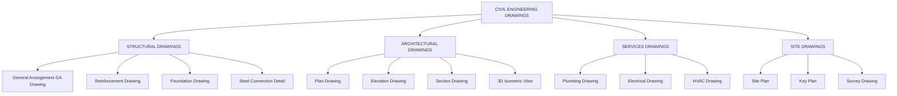
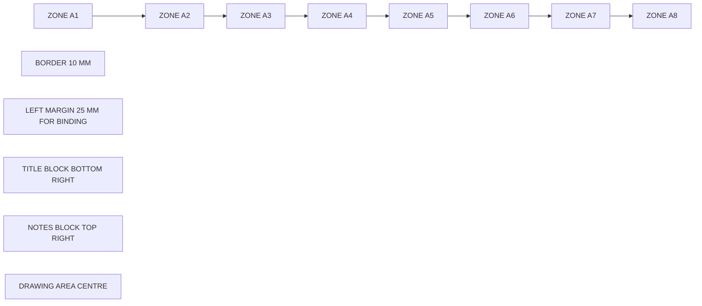
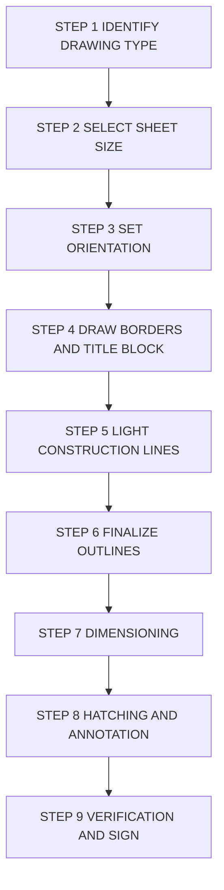
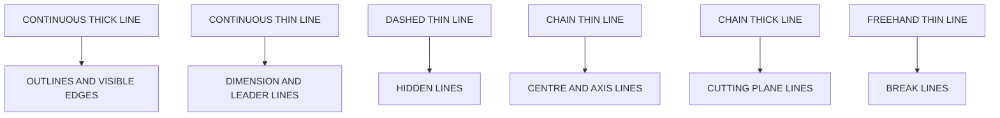
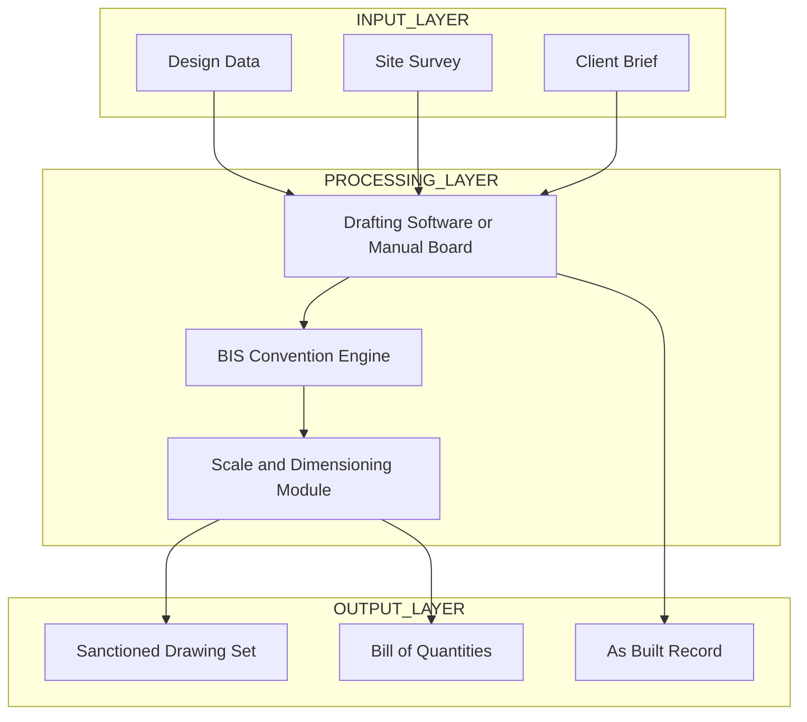

# Introduction to Civil Engineering Drawing

<!-- SECTION_1_START -->
# Introduction to Civil Engineering Drawing

## 📘 Core Technical Definition

> [!IMPORTANT]
> **Civil Engineering Drawing** is a formalized graphical language of communication used by civil engineers to represent, specify, and document the design, dimensions, materials, and construction procedures of physical infrastructure such as buildings, bridges, roads, dams, and water supply systems. It acts as the **universal technical contract** between the design engineer, the contractor, and the approving authority.

The discipline operates under two governing Indian Standards frameworks:

- **IS 962 : 1989 (Reaffirmed 2014)** – Code of practice for architectural and building drawings.
- **SP 46 : 2003** – Engineering Drawing Practice for Schools and Colleges (Bureau of Indian Standards).
- **IS 10714 : 2001** – General principles of presentation of drawings and technical documents.

> [!NOTE]
> KTU 2024 Scheme Definition (Module 1, Civil Engineering Drafting Lab):
> *"Civil Engineering Drawing is the graphical representation of civil engineering structures and components following BIS conventions, used to communicate design intent precisely for construction, estimation, and approval."*

---

## 🧠 Conceptual Analogy / Intuition

Imagine you are asking a friend to bake a cake over the phone, in a language they don't understand. You would draw the cake, mark its layers, write the oven temperature, the baking time, and the ingredient ratios. That single sheet of paper is your **recipe drawing** — it removes all ambiguity.

A **Civil Engineering Drawing** does the same thing for a building or a bridge, but with a far stricter, internationally recognized graphical "language":

| Real-World Analogy | Civil Engineering Drawing Equivalent |
|---|---|
| Recipe for a cake | Construction drawing / General Arrangement (GA) drawing |
| Shopping list of ingredients | **Bill of Quantities (BoQ)** extracted from drawings |
| Step-by-step cooking method | **Sequential working drawings** (foundation → structure → finishing) |
| Picture of the finished cake | **Elevation / 3D Isometric View** |
| Cross-section showing sponge and cream | **Sectional drawing** showing hidden structural layers |

> [!TIP]
> **Mnemonic to remember the purpose of a civil drawing:**
> **C – Communicate**
> **D – Design intent**
> **A – Approve (statutory)** 
> **M – Measure (estimation)** 
> **B – Build (construction)**

> [!WARNING]
> A civil engineering drawing is a **legally binding document** under the National Building Code of India (NBC 2016). Errors in a drawing can lead to structural failure, legal liability, and project rejection. Always treat a drawing as a *contract* — not a *sketch*.

---

## 🔑 Key Engineering Metrics (KTU Board Important)

The following standard sheet sizes are governed by **IS 10714** and are **must-know** for the KTU lab exam:

$$A_0 = 1189 \text{ mm} \times 841 \text{ mm}$$

$$A_1 = 841 \text{ mm} \times 594 \text{ mm}$$

$$A_2 = 594 \text{ mm} \times 420 \text{ mm}$$

$$A_3 = 420 \text{ mm} \times 297 \text{ mm}$$

$$A_4 = 297 \text{ mm} \times 210 \text{ mm}$$

> [!NOTE]
> **Ratio Rule:** Each successive sheet size has an area exactly **half** of the previous one ($A_n = A_{n-1} / 2$), preserving a constant aspect ratio of $\sqrt{2} \approx 1.414$.

> [!VISUALIZATION CONTROL]
> **Concept:** Sheet size hierarchy and the $\sqrt{2}$ aspect ratio
> **GeoGebra / Desmos Input Equations:**
> * `A(x) = 1189 / (2^(x/2))` for length vs. sheet number
> * `B(x) = 841 / (2^(x/2))` for width vs. sheet number
> **Visual Description:** Plot sheet length on the y-axis and sheet index (0 to 4) on the x-axis. You will observe a smooth exponential decay curve, demonstrating how each size is half the previous area.

---

## 🎯 Why This Topic Matters in KTU 2024

This module forms the **gateway skill** for every subsequent civil engineering lab and design course. Without mastering:
- Sheet layout
- Title block preparation
- Scale selection
- Line conventions
- Dimensioning rules

…a student cannot proceed to draw **building plans, section drawings, or reinforcement detailing** in Modules 2, 3, and 4.
<!-- SECTION_1_END -->

<!-- SECTION_2_START -->
# Deep Theoretical Analysis & KTU High-Yield Formula Sheet

## 🧩 Hierarchical Breakdown of the Topic

The study of Civil Engineering Drawing can be logically broken down into **five interconnected pillars**, each building on the previous one:

### Pillar 1 — Drawing Sheet & Layout Foundation
1. **Sheet Selection** — Choose the correct ISO A-series size based on the scale and complexity of the structure.
2. **Title Block Placement** — Bottom-right corner, containing project name, drawing number, scale, date, drawn-by, checked-by, and revision number.
3. **Border Margins** — Left margin must be **25 mm** (for binding); all other margins must be **10 mm** as per IS 10714.
4. **Zone Markings** — Large sheets (A0, A1) are divided into **8 zones** (A–H horizontally, 1–8 vertically) for easy reference.
5. **Drawing Orientation** — Landscape preferred for building plans; portrait for reinforcement details.

### Pillar 2 — Scales (The Heart of Drafting)
1. **Scale** = the ratio of the *drawing size* to the *actual size* on site.
2. **Reducing scales** (drawing < reality): 1:5, 1:10, 1:20, 1:50, 1:100, 1:200, 1:500, 1:1000, 1:2000.
3. **Enlarging scales** (drawing > reality): 2:1, 5:1, 10:1 (used for small components like nuts, bolts, reinforcement bars in cross-section).
4. **Full-size scale** = 1:1.
5. **Scale selection rule of thumb:**
   * Site plan → **1:1000 or 1:2000**
   * Key plan → **1:5000**
   * Building plan → **1:50 or 1:100**
   * Door/window schedule → **1:20**
   * Joint/connection detail → **1:5 or 1:10**

### Pillar 3 — Line Conventions (The Grammar of Drawing)
Every line in a civil drawing has a *meaning*. IS 962 defines **9 line types**:

| Line Type (IS 962 Nomenclature) | Line Weight | Application |
|---|---|---|
| **Thick continuous** | **0.7 mm** | Visible outlines, edges, main feature lines |
| **Thin continuous** | **0.35 mm** | Dimension lines, leader lines, hatching, imaginary lines |
| **Thick dashed** | 0.7 mm | Hidden edges of major components |
| **Thin dashed** | 0.35 mm | Hidden edges of minor components |
| **Thick chain** | 0.7 mm | Cutting plane lines in sections |
| **Thin chain** | 0.35 mm | Center lines, axis of symmetry |
| **Thick chain with thick ends** | 0.7 mm | Visible part of break line |
| **Thin chain with thick ends** | 0.35 mm | Cutting plane for partial sections |
| **Thin freehand** | 0.35 mm | Break lines for irregular boundaries |

> [!IMPORTANT]
> **KTU Board Rule:** A line's *weight* (thickness) is determined by its *importance*, not its *length*. Hidden lines are always drawn *behind* visible lines in graphic perception.

### Pillar 4 — Dimensioning (The Quantitative Description)
A dimension consists of **four elements**:
1. **Dimension line** — Thin continuous line with arrowheads.
2. **Extension line** — Thin continuous line extending from the feature.
3. **Dimension value** — Always placed *above* the dimension line, *centered*, in mm.
4. **Arrows / Tick marks** — Filled solid arrowheads (preferred in BIS) or open 45° slashes.

**Placement rules:**
- Dimensions are read from the **bottom** or **right side** of the drawing.
- Overall dimensions are placed **farthest** from the object; intermediate dimensions closer in.
- Never dimension to a hidden line.

### Pillar 5 — Symbols, Abbreviations & Hatching
- **Brick** — Cross-hatched with 45° diagonal lines.
- **Concrete** — Dotted with small triangular marks or short dashes.
- **Earth / Soil** — Random short dashes with tiny dots.
- **Plaster** — Stippled dots, light.
- **Timber (wood)** — Wavy grain pattern.
- **Steel (structural)** — Solid black or two parallel diagonals at 45°.

---

## 📊 KTU Formula Sheet / Cheat Sheet

| # | Parameter | Formula / Rule | Standard Reference | Typical Unit |
|---|---|---|---|---|
| 1 | Aspect ratio of A-series sheets | $\sqrt{2} \approx 1.414$ | IS 10714 | Dimensionless |
| 2 | Area ratio between consecutive sheets | $A_n = A_{n-1} / 2$ | IS 10714 | mm² |
| 3 | Scale formula (reducing) | $S = \dfrac{\text{Drawing Length}}{\text{Actual Length}}$ | IS 962 | Dimensionless |
| 4 | Actual length from drawing | $L = \dfrac{\text{Drawing Length}}{S}$ | IS 962 | mm or m |
| 5 | Drawing length from actual | $D = L \times S$ | IS 962 | mm or m |
| 6 | Title block width | $\dfrac{1}{5}$ to $\dfrac{1}{4}$ of sheet width | IS 962 | mm |
| 7 | Left margin | **25 mm** | IS 10714 | mm |
| 8 | All other margins | **10 mm** | IS 10714 | mm |
| 9 | Thick line weight | **0.7 mm** | IS 962 | mm |
| 10 | Thin line weight | **0.35 mm** | IS 962 | mm |
| 11 | Lettering height (titles) | **5 mm to 7 mm** | SP 46 | mm |
| 12 | Lettering height (dimensions) | **2.5 mm to 3 mm** | SP 46 | mm |
| 13 | Arrowhead length | **3 mm** | IS 962 | mm |
| 14 | Space between dimension line and object | **10 mm minimum** | IS 962 | mm |
| 15 | Extension line gap from object | **2 mm** | IS 962 | mm |

---

## 🏗️ Real-World Engineering Utility

> [!TIP]
> **Where exactly are these drawings used in industry?**

1. **Building Plan Approval** — Municipal corporations (e.g., Corporation of Kochi, Trivandrum) require a sanctioned set of civil drawings before issuing a building permit under the Kerala Municipality Building Rules (KMBR 2019).
2. **Quantity Estimation** — Every line on a civil drawing corresponds to a measurable quantity (cubic meter of concrete, kilogram of steel), making BoQ preparation possible.
3. **Construction Execution** — Site engineers refer to working drawings daily to set out columns, beams, and formwork.
4. **Maintenance & Retrofitting** — As-built drawings are stored for the entire 60–100 year lifespan of a building for future renovation.
5. **Legal Dispute Resolution** — Drawings serve as legal evidence in court cases regarding boundary walls, setbacks, and structural failures.
<!-- SECTION_2_END -->

<!-- SECTION_3_START -->
# Step-by-Step Derivations, Procedures & Implementation

## 🛠️ Section A — Standard Drafting Procedure (Lab-Oriented Stepwise Flow)

This is the **canonical procedure** that KTU expects a student to write in the lab record for any civil engineering drawing.

### Step 1: Identify the Drawing Requirement
- Determine what type of drawing is needed: **Plan, Elevation, Section, or Detail**.
- Refer to the project brief or KTU lab manual.

### Step 2: Select the Sheet Size
Use the decision flow:

```
Is the structure very large (site plan of a campus)?
   ├── YES → Use A1 or A0
   └── NO → Is it a typical building plan?
              ├── YES → Use A2 or A3
              └── NO → Is it a small detail (door, window)?
                         └── YES → Use A3 or A4
```

### Step 3: Set the Sheet Orientation
- Place the sheet in **landscape orientation** for plans and elevations.
- Use **portrait orientation** for vertical sections, reinforcement details, and written schedules.

### Step 4: Draw the Border & Title Block
- Outer border: **10 mm from edge** of the sheet on all sides except the left, where it is **25 mm**.
- Title block: bottom-right corner, width = **1/4 of sheet width**, height = **1/8 of sheet length**.

### Step 5: Insert the Title Block Content
A standard KTU title block contains:

| Field | Typical Entry (Example) |
|---|---|
| Project Title | DESIGN OF A RESIDENTIAL BUILDING |
| Drawing Title | GROUND FLOOR PLAN |
| Drawing Number | 01 / 05 |
| Scale | 1 : 50 |
| Date | 15-07-2025 |
| Drawn By | NAME, ROLL NO |
| Checked By | FACULTY NAME |
| Sheet Size | A2 |
| Revision | R0 |

### Step 6: Sketch Construction Lines (Lightly)
Use **2H pencil** with light pressure to mark:
- Overall dimensions of the structure
- Position of columns / load-bearing walls
- Position of doors, windows, and staircases
- The center line of the building

### Step 7: Finalize the Drawing (Darken with H or 2H pencil)
- Outer walls first (thick line, 0.7 mm equivalent)
- Inner walls (medium line)
- Door/window openings (medium line)
- Dimension lines, extension lines, and center lines (thin line)

### Step 8: Dimension the Drawing
- Start dimensioning from the innermost feature moving outward.
- Use **continuous (chain) dimensioning** for repetitive elements like column spacing.
- Add overall dimensions on the outermost ring.

### Step 9: Add Annotations and Hatching
- Hatching of sectioned portions (concrete, brick, earth).
- Annotations for materials, room names, levels.
- Add north direction indicator in plan drawings.

### Step 10: Final Check & Submission
- Verify scale accuracy.
- Check that no line is missing weight.
- Confirm the title block is complete.
- Sign in the designated field.

---

## 📐 Section B — Scale Conversion Worked Examples

### Example 1: Reducing Scale Calculation

> **Problem:** A residential plot measures 20 m × 30 m on site. It must be drawn on an A2 sheet (594 mm × 420 mm) with a usable drawing area of approximately 580 mm × 380 mm. Find a suitable scale.

**Solution:**

$$
\text{Required Scale (long side)} = \frac{\text{Sheet Usable Length}}{\text{Actual Length}}
$$

$$
S = \frac{580 \text{ mm}}{30 \text{ m}} = \frac{580 \text{ mm}}{30\,000 \text{ mm}} = \frac{58}{3000} = \frac{1}{51.7}
$$

The closest standard BIS scale is $\mathbf{1 : 50}$.

**Verification:**

$$
\text{Drawing length} = 30\,000 \text{ mm} \times \frac{1}{50} = 600 \text{ mm}
$$

$$
\text{Drawing width} = 20\,000 \text{ mm} \times \frac{1}{50} = 400 \text{ mm}
$$

Both fit within the A2 usable area. ✅

### Example 2: Drawing Length Computation

> **Problem:** A beam has an actual length of 6 m. The drawing is to be prepared at a scale of **1 : 20**. Find the drawing length.

**Solution:**

$$
D = L \times S = 6000 \text{ mm} \times \frac{1}{20} = 300 \text{ mm}
$$

### Example 3: Enlarging Scale for Small Component

> **Problem:** A 20 mm diameter bolt must be drawn so that its diameter on paper is 50 mm. Find the scale.

**Solution:**

$$
S = \frac{D}{L} = \frac{50 \text{ mm}}{20 \text{ mm}} = \frac{5}{2} = 2.5 : 1
$$

Use the nearest standard scale, $\mathbf{2.5 : 1}$ (or $5 : 1$ if maximum clarity is required).

---

## 🧰 Section C — Drafting Instruments & Tool Profile (Practical Lab Table)

| # | Instrument | Primary Use | Care / Safety |
|---|---|---|---|
| 1 | **Drawing Board** (B2 or B1 size) | Mounting the drawing sheet; provides rigid flat surface | Keep dry; never cut on the board |
| 2 | **T-square** | Drawing horizontal lines; guiding set squares | Wipe after use; avoid dropping |
| 3 | **Set Square (45°)** | Drawing 45° lines, hatching | Avoid edge damage |
| 4 | **Set Square (30°-60°-90°)** | Drawing 30°, 60°, 90° lines; inclined dimensioning | Use with T-square for stability |
| 5 | **Compass** (with pencil and ink legs) | Drawing circles and arcs | Tighten hinge; use the same pencil grade in both legs |
| 6 | **Divider** | Marking off equal lengths / stepping dimensions | Same care as compass |
| 7 | **Protractor** | Measuring and drawing angles | Read on the flat side |
| 8 | **French Curves** | Drawing smooth non-circular curves | Trace with smooth motion |
| 9 | **Templates** (door, window, electrical symbols) | Standardized symbol drawing | Keep flat, do not bend |
| 10 | **Drafting Scale** (metric, flat or triangular) | Direct scale measurement, conversion | Check zero point before use |
| 11 | **Pencils** (H, 2H, HB, 2B) | Various line weights by grade | Sharpen to long conical tip |
| 12 | **Eraser** (soft and hard) | Correcting pencil lines | Use shield to protect nearby lines |
| 13 | **Dusting brush** | Cleaning the sheet | Brush away from the sheet edge |
| 14 | **Roller/measuring tape** | Verifying on-site measurements | Lock after use |

---

## 💻 Section D — Symbolic / Procedural Implementation (Python Reference for Scale Checks)

```python
"""
KTU Civil Drafting Lab - Scale Verification Utility
Author: KTU B.Tech Student Reference
Purpose: Verify if a chosen scale fits the drawing within the sheet.
"""

from dataclasses import dataclass
from typing import Tuple


@dataclass(frozen=True)
class SheetSize:
    name: str
    length_mm: float
    width_mm: float
    left_margin_mm: float = 25.0
    other_margin_mm: float = 10.0

    @property
    def usable_length(self) -> float:
        return self.length_mm - self.left_margin_mm - self.other_margin_mm

    @property
    def usable_width(self) -> float:
        return self.width_mm - 2 * self.other_margin_mm


def pick_scale(actual_length_m: float,
               actual_width_m: float,
               sheet: SheetSize,
               preferred_scales: Tuple[int, ...] = (5, 10, 20, 50, 100, 200, 500, 1000)
               ) -> Tuple[int, bool, str]:
    """
    Returns (scale, fits, message).
    """
    for s in preferred_scales:
        draw_length = (actual_length_m * 1000) / s
        draw_width = (actual_width_m * 1000) / s
        if draw_length <= sheet.usable_length and draw_width <= sheet.usable_width:
            return s, True, f"Scale 1:{s} fits. Drawing size = {draw_length:.1f} x {draw_width:.1f} mm"
    return 0, False, "No standard scale fits the given sheet. Use a larger sheet."


if __name__ == "__main__":
    a2 = SheetSize("A2", 594.0, 420.0)
    chosen_scale, fits, message = pick_scale(30.0, 20.0, a2)
    print(message)
```

**Sample Output:**

```
Scale 1:50 fits. Drawing size = 600.0 x 400.0 mm
```
<!-- SECTION_3_END -->

<!-- SECTION_4_START -->
# Structural Diagrams & Schematics

## 📊 Diagram 1 — Hierarchical Classification of Civil Engineering Drawings



---

## 📊 Diagram 2 — Standard Sheet Layout (Title Block & Zones)



---

## 📊 Diagram 3 — Sequential Drafting Workflow (Block Diagram)



---

## 📊 Diagram 4 — Line Convention Visual Guide (Functional Map)



---

## 📊 Diagram 5 — Functional Architecture of a Civil Drawing (Block Topology)


<!-- SECTION_4_END -->

<!-- SECTION_5_START -->
# KTU 2024 Scheme Examination Question Bank & Topic Recap

---

## 📝 Part A Questions (3 Marks Each)

### **Question 1** [KTU University Exam – July 2024]
**"Define Civil Engineering Drawing. List any four BIS standards used for civil engineering drawings in India."** *(CO1, Remember — 3 Marks)*

**Model Answer:**

> **Civil Engineering Drawing** is a precise graphical representation of civil engineering structures prepared on standardized sheets following Bureau of Indian Standards (BIS) conventions, communicating design intent, dimensions, materials, and construction methods unambiguously to all stakeholders.
>
> Four BIS standards:
> 1. **IS 962 : 1989** – Architectural and building drawings.
> 2. **SP 46 : 2003** – Engineering drawing practice.
> 3. **IS 10714 : 2001** – General principles of presentation.
> 4. **IS 11669 : 1994** – Dimensioning of architectural drawings.

---

### **Question 2** [KTU University Exam – Dec 2023]
**"Differentiate between a Plan, an Elevation, and a Section drawing with one practical example for each."** *(CO1, Understand — 3 Marks)*

**Model Answer:**

| Drawing Type | Description | Practical Example |
|---|---|---|
| **Plan** | Horizontal cut taken at window-sill level (1.2 m above floor) showing the layout viewed from above | Ground floor plan of a residential house showing rooms, doors, and windows |
| **Elevation** | 2D orthographic projection of the external face of a building viewed from a chosen direction | Front elevation of a two-storey house showing windows, balcony, and roof line |
| **Section** | Vertical cut through the building revealing internal constructional details | Section through a staircase showing riser, tread, and landing reinforcement |

---

## 📝 Part B Questions (14 Marks with Internal Choice)

### **Question A (14 Marks)** [KTU University Exam – July 2024]

**"With neat sketches, explain the standard sheet sizes, border conventions, and title block layout as per IS 10714 for a civil engineering drawing. Justify why the left margin is kept wider than the other three margins."** *(CO1, Understand — 7 + 7 Marks)*

#### Part (a) — Sheet Sizes and Border Conventions (7 Marks)

**Solution Outline with Valuation Key:**

**[Sheet size sequence: 1 Mark]**

The standard A-series sheet sizes follow the $\sqrt{2}$ aspect ratio rule.

$$
\text{Aspect Ratio} = \frac{\text{Length}}{\text{Width}} = \sqrt{2} \approx 1.414
$$

**[Standard A-sizes table: 2 Marks]**

| Sheet | Length (mm) | Width (mm) |
|---|---|---|
| A0 | 1189 | 841 |
| A1 | 841 | 594 |
| A2 | 594 | 420 |
| A3 | 420 | 297 |
| A4 | 297 | 210 |

**[Border rule: 2 Marks]**

- Left margin: **25 mm** (for binding)
- Top, bottom, right margins: **10 mm** each

**[Neat sketch of sheet layout: 2 Marks]**

Refer to Diagram 2 in SECTION_4 for the layout reference.

#### Part (b) — Title Block Layout and Justification (7 Marks)

**Solution Outline with Valuation Key:**

**[Title block contents: 2 Marks]**

Project name, drawing title, drawing number, scale, date, drawn-by, checked-by, revision number.

**[Title block position and size: 1 Mark]**

Positioned in the **bottom-right corner**, occupying roughly **1/4 of sheet width × 1/8 of sheet length**.

**[Justification of wider left margin: 4 Marks]**

- Drawings are punched and bound on the left edge.
- The 25 mm margin prevents damage to the drawing area during binding.
- Standardization across all sheets allows uniform archive storage.
- 25 mm is the minimum to accommodate a standard 4-hole binding mechanism.

---

### **Question B (14 Marks — Alternative Choice)** [KTU University Exam – Dec 2023]

**"Explain the BIS line conventions used in civil engineering drawings. Discuss the principles of scale selection with two worked examples involving reducing and enlarging scales."** *(CO2, Apply — 7 + 7 Marks)*

#### Part (a) — BIS Line Conventions (7 Marks)

**Solution Outline with Valuation Key:**

**[Definition and importance: 1 Mark]**

Line conventions are standardized line types defined by **IS 962** that carry specific meanings in a drawing.

**[Listing of major line types: 4 Marks]**

| Line Type | Weight | Use |
|---|---|---|
| Continuous thick | 0.7 mm | Visible outlines |
| Continuous thin | 0.35 mm | Dimension lines, hatching |
| Dashed thin | 0.35 mm | Hidden edges |
| Chain thin | 0.35 mm | Centre lines, axis of symmetry |
| Chain thick | 0.7 mm | Cutting plane lines |
| Freehand thin | 0.35 mm | Break lines |

**[Neat sketch of each line type: 2 Marks]**

Refer to Diagram 4 in SECTION_4 for visual reference.

#### Part (b) — Scale Selection with Worked Examples (7 Marks)

**Worked Example 1: Reducing Scale (3.5 Marks)**

> A site measures **120 m × 80 m**. The available A1 sheet has a usable drawing area of **820 mm × 580 mm**. Find a suitable reducing scale.

**Solution:**

$$
S_{\text{long}} = \frac{820}{120\,000} = \frac{1}{146.3}
$$

$$
S_{\text{short}} = \frac{580}{80\,000} = \frac{1}{137.9}
$$

**Take the smaller ratio (more conservative):** $S = 1 : 150$ (next standard scale, which gives $800 \text{ mm} \times 533 \text{ mm}$, fitting within the A1 area). ✅

**[Stating the scale formula: 1 Mark]**
**[Substitution and simplification: 1.5 Marks]**
**[Choosing the correct standard scale: 1 Mark]**

**Worked Example 2: Enlarging Scale (3.5 Marks)**

> A **20 mm diameter** foundation bolt must appear as **80 mm** on the drawing. Find the enlarging scale.

**Solution:**

$$
S = \frac{\text{Drawing Size}}{\text{Actual Size}} = \frac{80 \text{ mm}}{20 \text{ mm}} = \frac{4}{1} = 4 : 1
$$

**[Formula: 1 Mark]**
**[Calculation: 1.5 Marks]**
**[Statement: 1 Mark]**

> [!WARNING]
> **KTU Examiner's Valuation Pitfalls:**
> 1. **Forgetting the 25 mm left margin** — students often write "all margins 10 mm". This loses 1–2 marks.
> 2. **Confusing reducing and enlarging scale formulas** — remember, $S = D / L$, and for enlarging scales, $S > 1$.
> 3. **Using pipes `|` inside table cells** — during your answer script, never use absolute value bars in unescaped form inside table cells; use $\vert$ in LaTeX.
> 4. **Skipping the standard scale choice** — always round to the *nearest BIS standard scale* (1:5, 1:10, 1:20, 1:50, 1:100, 1:200, 1:500, 1:1000, 1:2000).
> 5. **Missing neat sketches** — in Part B, a missing sketch of the line types or title block will cost at least 2 marks.
> 6. **Forgetting to mention the IS code number** — every convention must be cited with its IS code (e.g., "as per IS 962, 1989").

---

## 🧠 Topic Recap & Important Things to Remember

> [!IMPORTANT]
> **Rapid Revision Checklist — Module 1, Introduction to Civil Engineering Drawing**

- ✅ Civil Engineering Drawing is a **graphical language** governed by **BIS standards**.
- ✅ The **IS 962** code governs architectural drawings; **IS 10714** governs sheet presentation.
- ✅ The **A-series sheet sizes** (A0 to A4) follow the $\sqrt{2}$ aspect ratio, halving in area at each step.
- ✅ The **left margin is 25 mm**; all other margins are **10 mm**.
- ✅ The **title block** sits in the **bottom-right corner**, 1/4 sheet width × 1/8 sheet length.
- ✅ **Thick line weight = 0.7 mm**; **Thin line weight = 0.35 mm** (always in this 2:1 ratio).
- ✅ **Scale** = Drawing Length / Actual Length, with reducing scales being 1:5, 1:10, 1:20, 1:50, 1:100, 1:200, 1:500, 1:1000, 1:2000.
- ✅ **Enlarging scales** (2:1, 5:1, 10:1) are used for small components in detail drawings.
- ✅ **Six essential line types**: continuous thick, continuous thin, dashed thin, chain thin, chain thick, freehand thin.
- ✅ **Dimension placement**: read from bottom or right; overall dimensions outermost; never dimension to hidden lines.
- ✅ **Hatching conventions**: 45° diagonals for brick, dots for concrete, random dashes for earth, wavy lines for timber.
- ✅ A civil drawing is a **legally binding document** under the National Building Code of India (NBC 2016) and Kerala Municipality Building Rules (KMBR 2019).
- ✅ **Mnemonic for the 5 purposes of a civil drawing**: **CDAMB** — Communicate, Design, Approve, Measure, Build.
- ✅ **Golden Rule**: Always cite the **IS code number** when describing a drafting convention.
<!-- SECTION_5_END -->
