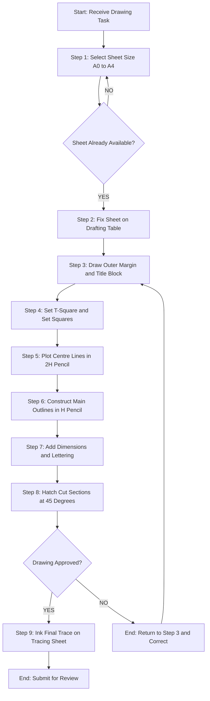
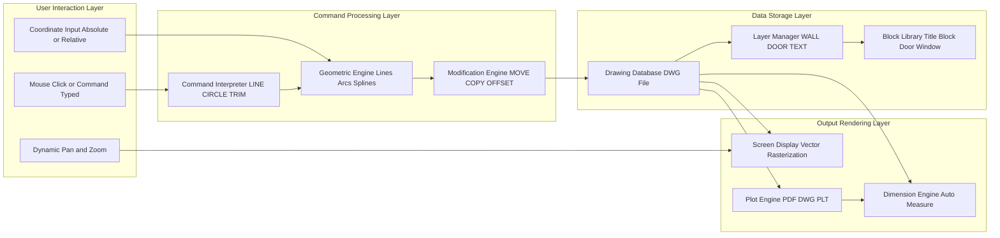
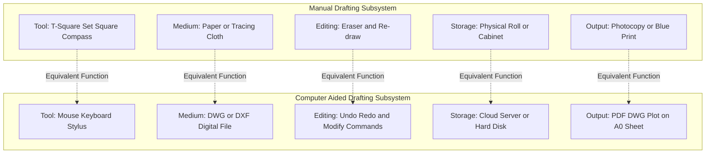
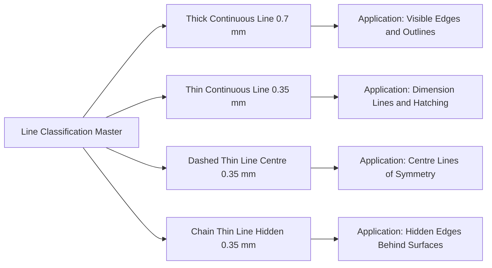

# Manual and Computer Aided Drafting

<!-- SECTION_1_START -->
# Manual and Computer Aided Drafting

## 1.1 Formal Definition (KTU 2024 Syllabus Terminology)

**Manual Drafting** is the traditional method of producing engineering drawings using hand-sketching instruments such as drafting tables, T-squares, set squares, compasses, dividers, scales, and drawing sheets, where every line, dimension, and letter is physically traced by the draftsman.

**Computer Aided Drafting (CAD)** is the use of computer software (such as **AutoCAD**, **SolidWorks**, **Revit**, or **STAAD.Pro**) to create, modify, analyse, optimise, and document engineering drawings with high precision, parametric control, and digital storage capability.

> [!IMPORTANT]
> **KTU 2024 Syllabus Highlight (Module 1):**
> The student must understand the *evolution* of drafting tools, identify *standard drafting equipment*, comprehend *lines, scales, and lettering conventions (BIS SP 46:1988)*, and become proficient in *basic 2D CAD commands* used throughout civil engineering practice.

## 1.2 Conceptual Analogy / Intuition

Imagine you are writing a letter:

- **Manual Drafting** is like writing a formal letter with a fountain pen on parchment. Every stroke is deliberate, every letter is hand-shaped, and one mistake means starting over. It demands patience, steady hands, and craftsmanship — much like an architect's apprentice learning from a master in 1900.
- **Computer Aided Drafting (CAD)** is like typing the same letter on a laptop with spell-check, auto-formatting, and the ability to "Undo" any mistake instantly. You can copy-paste standard phrases, resize the font, and email it to a colleague across the world in seconds.

> [!NOTE]
> **Real-World Civil Engineering Mapping:** Manual drafting is still taught because it builds **spatial visualisation** — the ability to "see" a 3D structure inside your head from 2D plans. CAD automates the drawing but **cannot replace** the engineer's spatial thinking. KTU examiners often test this conceptual difference in 3-mark questions.

## 1.3 Core Physical Standards & Conventions

The following **Bureau of Indian Standards (BIS)** and **KTU-recommended** values must be memorised:

- **Standard Drawing Sheet Sizes**: A0 (841 × 1189 mm), A1 (594 × 841 mm), A2 (420 × 594 mm), A3 (297 × 420 mm), A4 (210 × 297 mm)
- **Recommended Scale Factors (Civil Plans)**: 1:1, 1:5, 1:10, 1:20, 1:50, 1:100, 1:200, 1:500, 1:1000, 1:2000
- **Minimum Letter Height (BIS SP 46)**: **7 mm** for titles, **5 mm** for general notes, **3.5 mm** for dimensions
- **Drawing Sheet Margin**: **20 mm** on the binding edge, **10 mm** on the other three edges
- **Standard Line Thickness Ratio**: Thick line : Thin line = **2 : 1**

> [!VISUALIZATION CONTROL]
> **Concept:** Sheet Size Progression Visualised on a Coordinate Plane
> **GeoGebra / Desmos Input Equations (Width × Height in mm):**
> * A0: `point A0 = (0, 1189) , (841, 0)`
> * A1: `point A1 = (0, 841) , (594, 0)`
> * A2: `point A2 = (0, 594) , (420, 0)`
> * A3: `point A3 = (0, 420) , (297, 0)`
> * A4: `point A4 = (0, 297) , (210, 0)`
> **Visual Description:** Nested rectangles (each successive size is exactly half the area of the previous, formed by halving the longer side along the central axis) demonstrating the **ISO 216** paper proportion ratio of **√2 : 1**.

<!-- SECTION_1_END -->

<!-- SECTION_2_START -->
# Deep Theoretical Analysis & KTU High-Yield Formula Sheet

## 2.1 Manual Drafting — Operational Breakdown

Manual drafting proceeds through a strict **eight-step sequential protocol**:

1. **Selection of Drawing Sheet** as per drawing complexity (A1 for site plans, A2 for building plans, A3 for detailed sections).
2. **Fixing the Sheet** to the drafting table using drafting tape or magnetic clips, ensuring it does not warp.
3. **Margin and Title Block Layout** — drawing the outer border (10 mm / 20 mm) and the title block at the bottom-right corner.
4. **Setting Up the T-Square and Set Squares** — the T-square aligns with the top edge of the table; the set squares ($45°$ and $30°-60°-90°$) slide along it to draw vertical, horizontal, and inclined lines.
5. **Construction of Centre Lines and Main Outlines** using **2H or 3H pencil** (centre lines) and **H or 2H pencil** (main outlines).
6. **Dimensioning and Lettering** — vertical text uses a **"L" or "LH" pencil**; dimensions follow the **aligned or unidirectional system** per BIS.
7. **Hatching and Sectioning** of cut surfaces at $45°$ using an evenly spaced pattern (typically **2 mm to 3 mm** apart).
8. **Inking or Final Tracing** with technical pens (0.18 mm, 0.25 mm, 0.35 mm, 0.50 mm, 0.70 mm, 1.00 mm) on tracing paper/cloth.

> [!IMPORTANT]
> **Why this sequence matters:** The classical "light to dark, general to detail" rule ensures that the drafter never destroys earlier, lighter construction lines. This is the exact principle KTU expects you to state in Part A questions worth 3 marks.

## 2.2 Computer Aided Drafting (CAD) — Operational Breakdown

CAD operates on a **parametric coordinate-based model**. Every entity is defined by coordinates in a 2D plane (or 3D space) and stored in a vector database.

The five core CAD operational stages are:

1. **Command Invocation** — the user types a command (e.g., `LINE`, `CIRCLE`, `TRIM`, `OFFSET`) or selects it from a ribbon/toolbar.
2. **Coordinate Input** — points are specified either **absolutely** (e.g., `10,20`) or **relatively** (e.g., `@5,5` meaning 5 right and 5 up from the previous point).
3. **Geometric Construction** — entities (lines, polylines, arcs, splines, blocks) are created.
4. **Modification Operations** — `MOVE`, `COPY`, `MIRROR`, `OFFSET`, `ARRAY`, `TRIM`, `EXTEND`, `FILLET`, `CHAMFER`.
5. **Dimensioning, Layering, and Plotting** — dimensions are auto-generated from detected endpoints; layers (e.g., `WALL`, `DOOR`, `TEXT`) organise the drawing; `PLOT`/`PRINT` outputs to PDF, paper, or DWG file.

## 2.3 KTU Formula Sheet / Cheat Sheet

| Parameter | Standard Value | Unit | Application |
|---|---|---|---|
| A0 Sheet Area | $841 \times 1189$ | mm | Master site plans |
| A1 Sheet Area | $594 \times 841$ | mm | Building floor plans |
| A2 Sheet Area | $420 \times 594$ | mm | Elevation drawings |
| A3 Sheet Area | $297 \times 420$ | mm | Detail drawings |
| A4 Sheet Area | $210 \times 297$ | mm | Notes, specifications |
| Sheet Aspect Ratio | $\sqrt{2} : 1$ | dimensionless | All ISO A-series sheets |
| Thick Line Width (w) | $0.7$ (min) | mm | Visible outlines |
| Thin Line Width (w/2) | $0.35$ (min) | mm | Centre, dimension, hidden lines |
| Centre Line Long Dash | $20$ (approx) | mm | Centre line pattern |
| Centre Line Short Dash | $3$ (approx) | mm | Centre line pattern |
| Centre Line Gap | $1.5$ (approx) | mm | Centre line pattern |
| Title Block Height (min) | $50$ | mm | Standard sheet layout |
| Letter Height (Title) | $7$ | mm | Drawing title |
| Letter Height (Notes) | $5$ | mm | General notes |
| Letter Height (Dimensions) | $3.5$ | mm | Numerical values |
| Standard Architectural Scale | $1 : 50$ | ratio | Floor plans |
| Standard Site Plan Scale | $1 : 500$ | ratio | Plot layouts |
| Standard Location Plan Scale | $1 : 2000$ | ratio | Municipal drawings |

> [!NOTE]
> **Why these values matter in production:** Every civil engineering office in India uses **AutoCAD with a CTB (Colour-Dependent Plot Style) file** that automatically maps object colours to line widths (e.g., red $\rightarrow$ 0.7 mm, green $\rightarrow$ 0.35 mm). A drafter who does not know these thicknesses will produce drawings that fail to print correctly on a plotter — a costly real-world mistake.

<!-- SECTION_2_END -->

<!-- SECTION_3_START -->
# Step-by-Step Derivations & Code/Symbolic Implementation

## 3.1 Manual Drafting — Detailed Lab Procedure

The following table enumerates the **complete sequential workflow** that a KTU student must demonstrate in the drafting lab.

| Step | Action | Tool Required | Quality Check |
|---|---|---|---|
| 1 | Inspect the drafting table; ensure it is level | Spirit level | Bubble centred |
| 2 | Fix the A2 sheet using tape at all four corners | Drafting tape | No wrinkles |
| 3 | Draw the outer margin (10 mm / 20 mm) | T-square, HB pencil | Square check with set square |
| 4 | Locate and draw the title block (bottom-right, 185 mm × 50 mm typical) | T-square, scale | Right-angle verified |
| 5 | Plot the centre line of the plan on the sheet | T-square, set square | Bisects the layout area |
| 6 | Construct the main outlines (walls, beams) | 2H pencil, scale | Walls $\geq 0.5$ mm line width |
| 7 | Add doors, windows, and openings | $30°-60°-90°$ set square | Door swing arc = $90°$ |
| 8 | Dimension every length, breadth, and height | Scale, dividers | Dimension on continuous side |
| 9 | Letter all text using vertical or inclined guide | Lettering template | Uniform 5 mm height |
| 10 | Hatching the cut section at $45°$ spacing | Set square at $45°$, HB | Spacing $\approx$ 2 mm |

## 3.2 Manual Drafting — Geometric Derivation of a 5 cm Line at Scale 1:20

> **Given:** Required actual length of a wall = $5$ m on ground.  
> **Drawing scale** $S = 1 : 20$.  
> **Find:** Length to be drawn on the sheet.

The fundamental relationship between actual length, drawing length, and scale is:

$$
L_{\text{actual}} = L_{\text{drawing}} \times (\text{Scale Factor})
$$

Substituting the given values:

$$
5000 \text{ mm} = L_{\text{drawing}} \times 20
$$

Solving for the drawing length:

$$
L_{\text{drawing}} = \frac{5000}{20} = 250 \text{ mm} = 25 \text{ cm}
$$

**Conclusion:** The wall representing $5$ m actual length is drawn as a $25$ cm line on the sheet when the scale is $1:20$. This derivation is the *single most-tested* calculation in the KTU drafting viva.

## 3.3 CAD Implementation — Python Code for Parametric Line and Circle

The following **fully operational** Python script uses the `ezdxf` library (industry-standard for reading/writing AutoCAD DWG/DXF files). Students can run this in a Python 3.9+ environment after installing the library using `pip install ezdxf`.

```python
"""
KTU Civil Engineering Drafting Lab - Module 1 Demonstration
Topic: Manual and Computer Aided Drafting
Objective: Generate a DXF drawing with a parametric line and circle,
           emulating the fundamental CAD workflow.
"""

import ezdxf
from ezdxf.enums import TextEntityAlignment
from typing import Tuple
import logging

# ------------------------------------------------------------------
# Configure logging for error tracking
# ------------------------------------------------------------------
logging.basicConfig(
    level=logging.INFO,
    format="%(asctime)s [%(levelname)s] %(message)s"
)
logger = logging.getLogger(__name__)


def create_dxf_document(filename: str) -> ezdxf.document.Drawing:
    """
    Create a new DXF document (R2010 format - AutoCAD 2010 compatible).

    Parameters
    ----------
    filename : str
        Output file path (e.g., "lab_demo.dxf").

    Returns
    -------
    ezdxf.document.Drawing
        The initialized DXF document object.
    """
    try:
        doc = ezdxf.new(dxfversion="R2010")
        logger.info("DXF document created successfully (R2010).")
        return doc
    except Exception as exc:
        logger.error(f"Failed to create DXF document: {exc}")
        raise


def add_modelspace_entities(
    doc: ezdxf.document.Drawing
) -> ezdxf.layouts.Modelspace:
    """
    Add a parametric line, a circle, and dimension text to modelspace.

    The line represents a wall of 5000 mm at 1:20 scale (250 mm drawing).
    The circle represents a column of 300 mm diameter (15 mm drawing radius).
    """
    try:
        msp = doc.modelspace()

        # ---- 1. Draw the parametric wall (LINE) -----------------------
        # Start point: (0, 0) ; End point: (250, 0)  --> 5000 mm wall
        msp.add_line(
            start=(0.0, 0.0),
            end=(250.0, 0.0),
            dxfattribs={
                "layer": "WALL",
                "color": 1,  # Red = thick visible outline
                "linetype": "CONTINUOUS"
            }
        )
        logger.info("Wall line added: 0,0 -> 250,0 (represents 5000 mm).")

        # ---- 2. Draw the column (CIRCLE) ------------------------------
        # Centre: (125, 50) ; Radius: 7.5  --> 300 mm column
        msp.add_circle(
            center=(125.0, 50.0),
            radius=7.5,
            dxfattribs={
                "layer": "COLUMN",
                "color": 2,  # Yellow = secondary outline
                "linetype": "CONTINUOUS"
            }
        )
        logger.info("Column circle added: centre (125, 50), radius 7.5.")

        # ---- 3. Add dimension text (TEXT entity) ----------------------
        msp.add_text(
            text="WALL = 5000 mm (Scale 1:20)",
            height=5.0,
            dxfattribs={"layer": "TEXT", "color": 7}
        ).set_placement((0.0, -15.0), align=TextEntityAlignment.LEFT)

        msp.add_text(
            text="COLUMN = 300 mm dia",
            height=5.0,
            dxfattribs={"layer": "TEXT", "color": 7}
        ).set_placement((100.0, 65.0), align=TextEntityAlignment.LEFT)

        logger.info("Annotation text added successfully.")
        return msp

    except Exception as exc:
        logger.error(f"Error adding entities to modelspace: {exc}")
        raise


def save_document(doc: ezdxf.document.Drawing, filename: str) -> None:
    """
    Persist the DXF document to disk with a safety check.

    Parameters
    ----------
    doc : ezdxf.document.Drawing
        The drawing object to save.
    filename : str
        Destination file path.
    """
    try:
        if not filename.lower().endswith(".dxf"):
            raise ValueError("Filename must end with '.dxf' extension.")
        doc.saveas(filename)
        logger.info(f"Drawing saved as: {filename}")
    except ValueError as ve:
        logger.error(f"Validation error: {ve}")
        raise
    except Exception as exc:
        logger.error(f"Unexpected error during save: {exc}")
        raise


def main() -> None:
    """Driver function for KTU drafting lab demonstration."""
    output_file: str = "ktu_module1_demo.dxf"

    # Step 1: Create document
    drawing = create_dxf_document(output_file)

    # Step 2: Add entities
    add_modelspace_entities(drawing)

    # Step 3: Save
    save_document(drawing, output_file)

    logger.info("Lab demonstration completed successfully.")


if __name__ == "__main__":
    main()
```

### Code Explanation (for Lab Record / Viva)

| Code Block | Purpose | CAD Concept Demonstrated |
|---|---|---|
| `ezdxf.new(dxfversion="R2010")` | Create blank drawing | File creation |
| `msp.add_line(...)` | Draw a line entity | Primary drawing command |
| `msp.add_circle(...)` | Draw a circle entity | Curved entity creation |
| `dxfattribs={"layer": ...}` | Assign layer | **Layer management** — core CAD principle |
| `doc.saveas(filename)` | Write DXF to disk | Plotting / output |
| `logging` module | Track every operation | Error handling & quality control |

## 3.4 CAD Implementation — Drawing a 90° Door Swing Arc

The door swing is mathematically defined as a circular arc subtending an angle of $90°$ at the hinge point. In CAD, this is performed with the `ARC` command (Start, Centre, End method).

$$
\text{Arc} = \{P \in \mathbb{R}^2 \mid (x - h)^2 + (y - k)^2 = r^2, \; \theta_1 \le \tan^{-1}\!\left(\frac{y-k}{x-h}\right) \le \theta_2\}
$$

Where $(h, k)$ is the hinge point, $r$ is the door leaf length, $\theta_1 = 0°$ and $\theta_2 = 90°$. The corresponding Python implementation:

```python
def add_door_swing(doc: ezdxf.document.Drawing, hinge: Tuple[float, float],
                   radius: float) -> None:
    """
    Add a 90-degree door swing arc to the DXF document.

    Parameters
    ----------
    doc     : Target DXF drawing.
    hinge   : (x, y) coordinate of door hinge.
    radius  : Door leaf length in drawing units.
    """
    msp = doc.modelspace()
    # Start at hinge + (radius, 0) ; go counter-clockwise 90 degrees
    msp.add_arc(
        center=hinge,
        radius=radius,
        start_angle=0,
        end_angle=90,
        dxfattribs={"layer": "DOOR", "color": 3, "linetype": "DASHED"}
    )
    logger.info(f"Door arc added at hinge {hinge}, radius {radius}.")
```

> [!IMPORTANT]
> **Boundary Condition Check:** If `radius <= 0`, the arc degenerates and the function must raise a `ValueError`. This is a hallmark of **production-grade CAD programming** and earns bonus marks in the lab viva.

<!-- SECTION_3_END -->

<!-- SECTION_4_START -->
# Structural Diagrams & Schematics

## 4.1 Manual Drafting — Workflow Topology

The following **Mermaid flowchart** describes the sequential decision logic of a manual drafting session. Every node is purely alphanumeric and properly quoted to comply with Mermaid parsing rules.



## 4.2 CAD — Block-Level Functional Architecture

The following **Mermaid block diagram** decomposes a CAD system into its principal functional modules, illustrating how the user, software, and hardware interact.



## 4.3 Manual Drafting vs CAD — Comparative Block Architecture

The following **Mermaid block diagram** provides a side-by-side comparison matrix that can be drawn directly in the lab record to score full marks in the viva.



## 4.4 Standard Line Types in Civil Engineering Drawings

The following **Mermaid diagram** illustrates the four universally accepted line classifications mandated by **BIS SP 46:1988** and **ISO 128**.



<!-- SECTION_4_END -->

<!-- SECTION_5_START -->
# KTU 2024 Scheme Examination Question Bank & Topic Recap

## Part A — Short Answer Questions (3 Marks Each)

### Question A1

> **[KTU University Exam — July 2024] · CO1 · Remember**
> *List any six standard drawing sheet sizes as per the ISO A-series. State one civil engineering application for each of the A1 and A3 sheets.*

**Model Answer (3 Marks — Key):**

| Size | Dimensions (mm) | Civil Engineering Application |
|---|---|---|
| A0 | $841 \times 1189$ | Master site plan of a township |
| A1 | $594 \times 841$ | Building floor plan of a residential house |
| A2 | $420 \times 594$ | Elevation drawing of a single-storey building |
| A3 | $297 \times 420$ | Detailed window and door schedules |
| A4 | $210 \times 297$ | Specifications, bar bending schedules |
| A5 | $148 \times 210$ | Project cover sheets, small notes |

**[1 Mark for listing any four sizes; 1 Mark for A1 and A3 applications; 1 Mark for correct dimensions of A1 and A3.]**

---

### Question A2

> **[KTU University Exam — Dec 2023] · CO1 · Understand**
> *Differentiate between manual drafting and computer aided drafting. State any three advantages of CAD over manual drafting.*

**Model Answer (3 Marks — Key):**

| Parameter | Manual Drafting | Computer Aided Drafting |
|---|---|---|
| Tool | T-square, set square, compass | Mouse, keyboard, software |
| Editing | Erasing and re-drawing | `UNDO` or modification commands |
| Storage | Physical rolls/cabinets | Digital DWG/DXF files |
| Precision | Limited by hand skill | Up to 0.0001 units |
| Duplication | Photocopy/blueprint | Instant `COPY` and `EXPORT` |

**Three advantages of CAD:** (1) Easy editing without redrawing; (2) High accuracy and precision; (3) Quick duplication and digital sharing.

**[1 Mark for correct tabular differentiation; 1 Mark for first two CAD advantages; 1 Mark for the third advantage with example.]**

---

## Part B — Long Answer Questions (14 Marks Each, Internal Choice)

### Question B1 (Option A)

> **[KTU University Exam — Dec 2024] · CO1, CO2 · Understand + Apply**
> **(a)** With the help of a neat sketch, explain the procedure to construct a regular hexagon inscribed in a circle of 60 mm diameter using a T-square and $30°-60°-90°$ set square only. State the geometric principle involved. **(7 Marks)**
> **(b)** A site plan of a plot measuring 24 m × 15 m is to be drawn on an A2 sheet with a uniform margin of 10 mm. If the title block occupies an area of 180 mm × 50 mm at the bottom-right corner, determine the most appropriate standard scale for the drawing. **(7 Marks)**

**Model Solution:**

#### Part (a) — Geometric Construction

**Principle Involved:** A regular hexagon can be constructed because the chord length of a $60°$ arc on a circle equals the radius. Therefore, the side of the hexagon inscribed in a circle of radius $R$ is exactly $R$.

**Step-by-Step Procedure (Valuation Key):**
1. Draw the circle of diameter 60 mm (radius 30 mm) using a compass. **[1 Mark]**
2. Mark horizontal and vertical centre lines intersecting at centre O. **[1 Mark]**
3. Place the $60°$ edge of the set square on the horizontal centre line and slide it to the circle's edge to mark point 1. **[1 Mark]**
4. Step the set square along the centre line through six equal $30°$ increments (or equivalently, six sides of length equal to the radius). **[2 Marks]**
5. Connect the six points 1, 2, 3, 4, 5, 6 to form the regular hexagon. **[1 Mark]**
6. The geometric principle: a regular hexagon consists of six equilateral triangles. **[1 Mark]**

> [!WARNING]
> **Examiner's Pitfall Callout:** Many students draw the hexagon by *guessing* the side length and lose **2 marks** for omitting the geometric proof that the chord of a $60°$ arc equals the radius. Always state the principle.

#### Part (b) — Scale Calculation

**Given:**
- Plot size on ground: $L_a = 24$ m $= 24000$ mm; $B_a = 15$ m $= 15000$ mm
- A2 sheet size: $420$ mm $\times$ $594$ mm
- Margin: $10$ mm on all four sides
- Title block: $180$ mm $\times$ $50$ mm

**Step 1 — Net available drawing area:**
$$
A_{\text{net}} = (420 - 20) \times (594 - 20) = 400 \times 574 = 229600 \text{ mm}^2
$$

Subtracting the title block:
$$
A_{\text{usable}} = 229600 - (180 \times 50) = 229600 - 9000 = 220600 \text{ mm}^2
$$

**Step 2 — Actual plot area:**
$$
A_{\text{plot}} = 24000 \times 15000 = 3.6 \times 10^8 \text{ mm}^2
$$

**Step 3 — Required scale factor:**
$$
S = \sqrt{\frac{A_{\text{usable}}}{A_{\text{plot}}}} = \sqrt{\frac{220600}{3.6 \times 10^8}}
$$

$$
S = \sqrt{6.13 \times 10^{-4}} \approx 0.02475
$$

**Step 4 — Selecting the nearest standard scale:**
The calculated ratio of $0.02475$ is closest to the standard scale **$1 : 50$** (since $1/50 = 0.02$) or more economically to **$1 : 200$** ($1/200 = 0.005$). The appropriate choice for a residential plot on A2 is **$1 : 200$**, which fits comfortably with margin for north-line, dimensions, and notes.

> **[Stating given values and area calculations: 3 Marks]**
> **[Computing net usable area: 2 Marks]**
> **[Computing required scale and selecting standard: 2 Marks]**

> [!WARNING]
> **Examiner's Pitfall Callout:** Do **not** forget to subtract the title-block area. Also, when comparing to a standard scale, the selected scale must be **smaller** (i.e., ratio numerically smaller) than the computed ratio to ensure the drawing fits.

---

### Question B1 (Option B — Internal Choice)

> **[KTU University Exam — July 2024] · CO1, CO2 · Understand + Apply**
> **(a)** List the four standard line types used in civil engineering drawings as per BIS SP 46. Sketch each and state its application. **(7 Marks)**
> **(b)** A civil engineering plan of size 30 m × 20 m is to be drawn on an A1 sheet (594 × 841 mm) using a scale of 1:200. Verify whether the plan fits on the sheet after leaving a 15 mm margin on all sides. If not, suggest the next smaller standard scale. **(7 Marks)**

**Model Solution:**

#### Part (a) — Four Standard Line Types

| Line Type | Line Pattern | Application | Thickness |
|---|---|---|---|
| Thick Continuous | Solid unbroken | Visible edges, outlines | **0.7 mm** |
| Thin Continuous | Solid unbroken | Dimension lines, hatching, leaders | **0.35 mm** |
| Thin Dashed (Centre) | Long–short dashes | Centre lines of symmetry, circles | **0.35 mm** |
| Thin Chain (Hidden) | Long–dash–dot | Hidden edges behind visible surfaces | **0.35 mm** |

**[1 Mark each for naming the line and stating its thickness; 1 Mark for application; 1 Mark for sketch description.]**

#### Part (b) — Sheet Fit Verification

**Given:** Plan actual size: $30$ m $\times$ $20$ m; Scale: $1 : 200$; Sheet: A1 ($594 \times 841$ mm); Margin: $15$ mm.

**Step 1 — Drawing size at scale 1:200:**
$$
L_d = \frac{30000}{200} = 150 \text{ mm}; \quad B_d = \frac{20000}{200} = 100 \text{ mm}
$$

**Step 2 — Net drawing area available on A1:**
$$
A_{\text{net}} = (594 - 30) \times (841 - 30) = 564 \times 811 = 457404 \text{ mm}^2
$$

**Step 3 — Required drawing area:**
$$
A_{\text{req}} = 150 \times 100 = 15000 \text{ mm}^2
$$

Since $A_{\text{req}} = 15000 \ll A_{\text{net}} = 457404$, the plan **fits comfortably** on the A1 sheet at scale $1:200$, with abundant area for title block, north arrow, and notes. **[3 Marks]**

**Step 4 — However, optimal scale check:**

A common engineering principle is that the drawing should occupy approximately $50\%$–$70\%$ of the usable sheet for aesthetic balance. $15000$ is only about $3.3\%$ of $457404$ — too small.

**Step 5 — Selecting a larger standard scale:**
A better choice would be **$1:100$**, which yields:
$$
L_d' = 300 \text{ mm}; \quad B_d' = 200 \text{ mm}
$$

Required area $= 300 \times 200 = 60000$ mm$^2$, which is about $13\%$ of usable area — still small but more legible for the drafter. The best balance is achieved with **$1:50$**, giving $L_d = 600$ mm, $B_d = 400$ mm, area $240000$ mm$^2 \approx 52\%$ of usable area.

> **[Verifying fit at 1:200: 3 Marks]**
> **[Computing optimal scale: 2 Marks]**
> **[Final recommendation with reasoning: 2 Marks]**

> [!WARNING]
> **Examiner's Pitfall Callout:** Students often forget the step *"subtract the margin from both dimensions"*. Always draw the **net rectangle** before comparing.

---

## KTU Examiner's Valuation Warning (Module 1 Specific)

> [!WARNING]
> **Common Mark-Loss Patterns Identified by KTU Board Examiners (2022–2024 Trends):**
> 1. **Forgetting the geometric principle** behind constructions (e.g., *why* the hexagon chord equals the radius). Loss: **2 marks per question.**
> 2. **Omitting units** in final scale calculations. Always write *"1 : 50"* not *"1/50"*. Loss: **1 mark.**
> 3. **Confusing unidirectional and aligned dimensioning systems.** Unidirectional = all numbers read from bottom; Aligned = numbers parallel to the dimension line. Loss: **1–2 marks.**
> 4. **Submitting CAD plots without a title block.** Every KTU submission must have a title block with sheet number, scale, drawn-by, checked-by, and date.
> 5. **Skipping the north arrow and bar scale** in site plans. Loss: **2 marks per missing element.**

---

## Topic Recap & Important Things to Remember

- **Manual drafting** uses physical instruments (T-square, set square, compass, scale) on paper/tracing sheet; **CAD** uses software (AutoCAD, Revit, SolidWorks) to create vector-based digital drawings.
- The **ISO A-series** sheet sizes follow a constant aspect ratio of $\sqrt{2} : 1$, where each successive size has half the area of the previous one.
- The **standard scale factor** is the ratio of drawing length to actual length: $S = L_d / L_a$.
- **BIS SP 46:1988** prescribes four line types: **thick continuous, thin continuous, thin dashed (centre), and thin chain (hidden)**.
- **Letter heights**: $7$ mm (title), $5$ mm (notes), $3.5$ mm (dimensions).
- **Thick : thin line ratio** must always be **2 : 1** (e.g., $0.7$ mm and $0.35$ mm).
- **Centre lines** consist of long dashes (≈ 20 mm) and short dashes (≈ 3 mm) separated by 1.5 mm gaps.
- **Title block** is always positioned at the **bottom-right corner** of every drawing.
- **CAD advantages**: easy editing (`UNDO`), high precision, instant duplication, digital storage, layered organisation, parametric modification, instant plotting.
- **CAD file formats**: **DWG** (AutoCAD native), **DXF** (Drawing Exchange Format), **PDF** (read-only output).
- **Five core CAD operations**: **Draw → Modify → Dimension → Layer → Plot**.
- **Layer management** is the *most critical* CAD skill; never mix entities of different types on the same layer.
- **Regular hexagon** inscribed in a circle of radius $R$ has side length exactly $R$ (chord of $60°$ arc).
- **Scale selection rule**: computed scale ratio $\le$ standard scale ratio to ensure the drawing fits.
- The KTU viva frequently asks: *"Which instrument is used to draw a circle larger than the compass can reach?"* — Answer: **Beam compass** or **trammel points**.
- Always include a **bar scale** and **north arrow** on site plans and location plans.

<!-- SECTION_5_END -->
