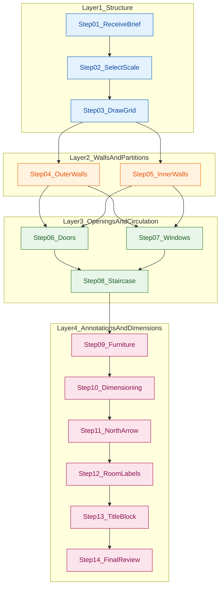
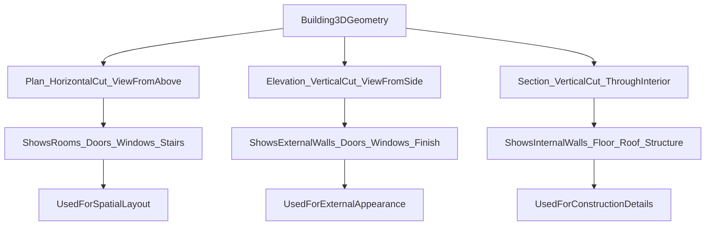

# Plan

<!-- SECTION_1_START -->
# Plan in Civil Engineering Drawing

## 1.1 Formal Definition (KTU 2024 Scheme)

> [!IMPORTANT]
> **Plan (Horizontal Section):** A **Plan** is an orthographic projection of a building or object obtained by **sectioning it horizontally** through a chosen reference plane (typically **1.0 m above the plinth level** for floor plans, or at the **window-sill level** for standard architectural plans) and **viewing the cut portion from above** (i.e., looking downward along the vertical axis).

In the KTU 2024 B.Tech *Civil Engineering Drafting Lab* syllabus, a **Plan** is treated as the **primary working drawing** of a building because it conveys the maximum amount of design information in a single 2D view: spatial organisation, circulation, openings, and dimensional coordination.

The various sub-categories of plans commonly drafted in the lab are:

| Plan Type | Purpose | Typical Scale |
| :--- | :--- | :--- |
| **Site Plan** | Shows the position of the building within the plot boundary | $1:500$ to $1:1000$ |
| **Key Plan** | A small location diagram showing the position of the floor | $1:2000$ or smaller |
| **Floor Plan** | Internal layout of a storey (rooms, walls, doors, windows) | $1:50$ or $1:100$ |
| **Foundation Plan** | Layout of footings and plinth beams at foundation level | $1:50$ or $1:100$ |
| **Roof Plan** | Top view showing roof slopes, gutters, and parapet | $1:50$ or $1:100$ |
| **Ceiling Plan** | Shows lighting, fans, and false-ceiling grid | $1:50$ or $1:100$ |

> [!NOTE]
> **Reference Standard (BIS):** All plan-drawing conventions in Indian engineering practice follow **IS 962:1989 (Reaffirmed 2014)** — *Code of Practice for Architectural and Building Drawings*, supplemented by **SP 46:1988** — *Engineering Drawing Practice for Buildings and Structures*.

---

## 1.2 Conceptual Analogy (Intuitive Understanding)

Imagine you have a **large architectural toy house** (with cut-out floors) and you **remove the roof**. You then take a **photograph of the house from directly above**, looking straight down.

What you see in that photograph is exactly what engineers call a **Plan**:

- The **walls** appear as thick rectangular outlines (because they are cut by the horizontal section plane).
- The **door leaves** are visible as rectangles with a quarter-circle arc indicating the **swing direction**.
- The **windows** appear as two thin parallel lines embedded in the wall thickness (the gap between the inner and outer wall reveals the opening).
- The **staircase** shows as a series of parallel rectangles (treads) with a directional arrow.
- **Furniture** (if drawn) appears as thinner outline symbols inside the room.

> [!TIP]
> **Bird's-Eye View vs. Plan:** A *bird's-eye view* is a 3-D pictorial; a *plan* is a strict 2-D orthographic projection. The plan **excludes everything above the cutting plane** and **exposes everything below the cutting plane** as visible geometry.

---

## 1.3 Visualization Control (GeoGebra / Desmos)

> [!VISUALIZATION CONTROL]
> **Concept:** Geometric construction of a rectangular plan with a single door swing arc.
>
> **GeoGebra / Desmos Input Equations (representing wall boundaries and door swing):**
>
> * Outer wall rectangle: $x \in \left[0, 10\right]$, $y \in \left[0, 8\right]$
> * Inner wall offset: $0.3$ units (wall thickness $t = 0.3$)
> * Door opening centre: $(3, 0)$, door width $d = 1.0$
> * Door swing arc: $x(t) = 3 + 1.0\cos(\theta)$, $y(t) = 0 + 1.0\sin(\theta)$, with $\theta \in \left[0, \tfrac{\pi}{2}\right]$
> * Window line: $\text{segment from }(6, 0)\text{ to }(8, 0)$
>
> **Visual Description:** The student should observe a **rectangular outer outline (double line)**, an **inner offset rectangle** forming the wall thickness, a **quarter-circle arc** representing the door swing from the opening, and a **double parallel line** in the right-side wall representing the window glazing gap. This is the fundamental "skeleton" of every residential plan.

---
<!-- SECTION_1_END -->

<!-- SECTION_2_START -->
# 2. Deep Theoretical Analysis & High-Yield Reference Sheet

## 2.1 Why a Plan is the Most Important Drawing

A single plan view consolidates **five different categories of engineering information**:

1. **Spatial / Functional Information:** room sizes, adjacencies, and circulation paths.
2. **Structural Information:** positions of load-bearing walls, columns, and beams (often shown as a *Structural Plan* overlay).
3. **Construction Information:** wall thicknesses, door and window sizes, and lintel positions.
4. **Dimensional Information:** overall building dimensions, room-wise dimensions, and opening sizes.
5. **Orientation Information:** North direction (compass), plot boundaries, road access, and setbacks.

> [!IMPORTANT]
> A plan is **always read together with at least one elevation and one section**. None of the three views (Plan, Elevation, Section) is complete on its own.

---

## 2.2 Anatomy of a Plan — Element Hierarchy

A plan is built up in a **strict drawing order** to avoid erasing over dimension lines. The recommended layering order is:

$$\text{Layer 1: Grid / Centre Lines} \;\rightarrow\; \text{Layer 2: Walls} \;\rightarrow\; \text{Layer 3: Openings} \;\rightarrow\; \text{Layer 4: Furniture} \;\rightarrow\; \text{Layer 5: Dimensions} \;\rightarrow\; \text{Layer 6: Text \& Hatching} \;\rightarrow\; \text{Layer 7: Title Block \& North Arrow}$$

### 2.2.1 Line Conventions (As per IS 962 & SP 46)

| Line Type | Line Weight | Line Style | Used For |
| :--- | :--- | :--- | :--- |
| **Visible / Object Line** | Thick ($0.7$ mm) | Continuous | Visible edges of walls, doors, windows |
| **Hidden Line** | Medium ($0.5$ mm) | Dashed (short dashes) | Elements below the cutting plane (e.g., plinth below floor) |
| **Centre Line** | Thin ($0.35$ mm) | Long dash — short dash | Symmetry axis of walls, columns, openings |
| **Dimension Line** | Thin ($0.35$ mm) | Continuous with arrows | All measurement annotations |
| **Leader Line** | Thin ($0.35$ mm) | Continuous | Connecting labels, room names, and notes to features |
| **Cutting Plane Line** | Thick ($0.7$ mm) | Long dash — double dot | Indicates the position of a Section view |
| **Break Line** | Thin ($0.35$ mm) | Zig-zag or freehand | Truncating a long, repeating drawing |

### 2.2.2 Symbolic Representation of Openings

| Element | Symbolic Convention in Plan |
| :--- | :--- |
| **Door (single leaf)** | Rectangle (leaf) + quarter-circle arc (swing) + small gap in wall for the opening |
| **Door (double leaf)** | Two leaves with two opposing arcs |
| **Sliding Door** | Rectangle with arrow parallel to the wall (no arc) |
| **Window (casement)** | Two thin parallel lines within the wall thickness, with a small line indicating the side hinge |
| **Window (sliding / glazed)** | Two parallel lines with arrow indicating slide direction |
| **Ventilator** | Similar to window but smaller height; often shaded with diagonal lines |
| **Staircase** | Series of parallel rectangles (treads) with a directional arrow showing "up" |

---

## 2.3 KTU Formula & Reference Cheat Sheet

| # | Parameter / Concept | Formula / Standard Value | Unit | Notes |
| :--- | :--- | :--- | :--- | :--- |
| 1 | **Plinth Area** $A_p$ | $A_p = \sum (\text{room area at plinth level})$ | $\text{m}^2$ | Includes internal \& external walls |
| 2 | **Carpet Area** $A_c$ | $A_c = A_p - A_{\text{walls}} - A_{\text{shafts}}$ | $\text{m}^2$ | Actual usable floor area |
| 3 | **Built-up Area** $A_b$ | $A_b = A_c + A_{\text{balcony}} + A_{\text{veranda}}$ | $\text{m}^2$ | Excludes external cantilever projections |
| 4 | **Scale Conversion** | $\text{Drawing length} = \dfrac{\text{Actual length}}{\text{SF}}$ | mm or cm | $\text{SF}$ = Scale Factor (e.g., $50$ for $1:50$) |
| 5 | **Wall Area (per running metre)** | $A_w = L \times t$ | $\text{m}^2$ | $L$ = wall length, $t$ = wall thickness |
| 6 | **Door Swing Arc Radius** | $r = d$ | m | $d$ = door width (perpendicular to wall) |
| 7 | **Staircase Going (Going-to-Rise Ratio)** | $2g + r = 600$ to $640$ | mm | $g$ = going, $r$ = rise per tread (Blondel's formula) |
| 8 | **Standard Wall Thickness (residential)** | $230$ (outer), $115$ (inner) | mm | $1$ brick / $\tfrac{1}{2}$ brick respectively |
| 9 | **Standard Door Height** | $2.1$ | m | Single-leaf residential |
| 10 | **Standard Window Sill Height** | $0.9$ to $1.0$ | m | Above finished floor level |
| 11 | **Standard Plinth Height** | $0.45$ to $1.2$ | m | Above natural ground level |

> [!IMPORTANT]
> **Carpet Area Rule (RERA, India):** $A_c \approx 0.7 \times A_b$ for typical residential apartments. This is often used in valuation problems.

---

## 2.4 Real-World Engineering Utility

| Field | Application of Plan Drawings |
| :--- | :--- |
| **Architecture** | Spatial design, code compliance, Vastu compliance |
| **Structural Engineering** | Column layout, beam layout, load transfer verification |
| **MEP (Mechanical, Electrical, Plumbing)** | Routing of ducts, conduits, and pipes |
| **Quantity Surveying (QS)** | Calculation of $A_c$, $A_p$, $A_b$ for cost estimation |
| **Interior Design** | Furniture layout, lighting plan, flooring pattern |
| **Construction Execution** | Setting out columns and walls on site using grid lines |
| **BIM (Building Information Modelling)** | The 2-D plan is the foundational *Level of Development (LOD) 100* artefact |

> [!TIP]
> In modern **BIM workflows (Revit, ArchiCAD)**, the *plan view* is automatically generated from the 3-D model and remains the single most-used 2-D deliverable for site engineers.

---
<!-- SECTION_2_END -->

<!-- SECTION_3_START -->
# 3. Step-by-Step Drawing Procedure & Computational Implementation

## 3.1 Step-by-Step Procedure to Draw a Plan (Manual Drafting)

The following is the **standard, KTU-evaluable drawing procedure** for a residential single-storey plan on a drawing sheet. Every step carries valuation marks in the lab exam.

### Step 1 — Sheet Layout & Border
- Draw the **outer sheet border** at $5$ mm from the sheet edge.
- Divide the sheet into **(a) drawing area, (b) title block, (c) notes panel**.

### Step 2 — Centre Lines (Grid Lines)
- Mark **horizontal grid lines** (labelled $1, 2, 3, \ldots$) at the required column spacings.
- Mark **vertical grid lines** (labelled A, B, C, $\ldots$) at the required column spacings.
- Centre lines are drawn as **long-dash — short-dash** thin lines.
- Example: Grid spacing $\rightarrow$ $3.0 \text{ m} + 4.0 \text{ m} + 3.0 \text{ m} = 10.0 \text{ m}$ along X.

### Step 3 — Outer Wall Outline
- Offset the centre lines outward by **half the wall thickness** to mark the **outer face** of the wall.
- For a $230$ mm outer brick wall, offset $= 115$ mm on each side of the centre line.
- Draw the outer wall as a **continuous thick line**.

### Step 4 — Inner Wall Outline
- Offset the centre lines inward by **half the wall thickness** to mark the **inner face**.
- Draw the inner wall outline. For an outer wall, the gap between inner and outer outline $= 230$ mm.

### Step 5 — Internal Partition Walls
- Draw $115$ mm internal walls using the same double-line convention, but with reduced line weight.

### Step 6 — Door and Window Openings
- **Doors:** Mark the door opening (gap in the wall) equal to the door width $d$. Draw the leaf as a rectangle and the swing arc as a quarter circle of radius $d$.
- **Windows:** Mark the window opening. Draw the sill line, two parallel glazing lines, and the side-hinge indicator.
- All openings are drawn using **medium-thick lines**.

### Step 7 — Staircase
- Calculate the number of risers using:
$$n = \dfrac{\text{Floor-to-floor height}}{\text{rise per tread (typically } 150 \text{ mm)}}$$
- Calculate the going per tread (typically $270$ mm).
- Verify using Blondel's formula: $2g + r = 600$ to $640$ mm.
- Draw parallel rectangles for treads, with an **arrow pointing upward** towards the next floor.

### Step 8 — Furniture and Sanitary Layout (Optional but Standard)
- Draw schematic furniture (beds, sofas, tables) using thin lines.
- Draw WC, bath, sink, and wash-basin symbols as per **IS 962** symbols.

### Step 9 — Dimensioning
- **Overall dimensions** (outermost dimension line): overall length and width of the building.
- **Intermediate dimensions**: distance between grid lines.
- **Detailed dimensions**: room sizes, wall thicknesses, door/window sizes.
- Use **continuous dimensioning** (chained) or **parallel dimensioning** (progressive).
- All dimensions in **millimetres (mm)** for architectural plans.

### Step 10 — Annotations and North Arrow
- Label every room (e.g., "BEDROOM — $3.6 \times 4.2$ m").
- Place the **North arrow** on the top-right corner of the plan.
- Add a **title block** with project name, drawing title ("PLAN"), scale, drawn by, checked by, date, and sheet number.

---

## 3.2 Worked Example — Plan Dimension Calculation

> **[KTU University Exam — July 2024 Pattern, Module 1]**
> A residential building has a **carpet area of $84 \text{ m}^2$**. The percentage of wall area to carpet area is **$15\%$, and the veranda area is $12 \text{ m}^2$**. Calculate **(a)** the **plinth area**, **(b)** the **built-up area**, and **(c)** the **scale-converted drawing dimensions** if the plan is to be drawn at $1:50$ scale on an A2 sheet.

### Solution

**Given Data:**
- $A_c = 84 \text{ m}^2$
- $A_{\text{wall}} = 0.15 \times A_c = 0.15 \times 84 = 12.6 \text{ m}^2$
- $A_{\text{veranda}} = 12 \text{ m}^2$

**Part (a) — Plinth Area:**

$$A_p = A_c + A_{\text{wall}} = 84 + 12.6 = 96.6 \text{ m}^2$$

**Part (b) — Built-up Area:**

$$A_b = A_p + A_{\text{veranda}} = 96.6 + 12 = 108.6 \text{ m}^2$$

**Part (c) — Drawing Dimensions at Scale $1:50$:**

Let the building footprint be rectangular, $L \times B = 12 \text{ m} \times 9 \text{ m} = 108 \text{ m}^2 \approx 108.6 \text{ m}^2$ (✓ consistent).

- Drawing length along X: $\dfrac{12000}{50} = 240 \text{ mm}$
- Drawing length along Y: $\dfrac{9000}{50} = 180 \text{ mm}$

**Valuation Key Distribution:**

| Step | Mark Allocation |
| :--- | :--- |
| Stating given data | $1$ mark |
| Plinth area computation | $1$ mark |
| Built-up area computation | $1$ mark |
| Scale conversion logic | $1$ mark |
| Final numerical drawing dimensions | $1$ mark |
| **Total** | **$5$ marks** (scaled to $3$ or $7$ as required) |

---

## 3.3 Python Implementation — Plan Area Verifier

The following Python program automates carpet / plinth / built-up area calculations from room-wise dimensions and verifies the scale-converted drawing lengths. This represents the **modern computational** equivalent of a manual plan-checking exercise.

```python
"""
plan_area_calculator.py
KTU 2024 - Civil Engineering Drafting Lab - Module 1
Validates plan areas and scale-converted drawing dimensions.
"""

from __future__ import annotations
import logging
from dataclasses import dataclass
from typing import List, Tuple

# Configure structured logging for any input/calculation errors
logging.basicConfig(
    level=logging.INFO,
    format="%(asctime)s - %(levelname)s - %(message)s",
)
logger = logging.getLogger(__name__)


@dataclass(frozen=True)
class Room:
    """Represents a single room in the building plan."""
    name: str
    length_m: float        # Internal length in metres
    width_m: float         # Internal width in metres

    def __post_init__(self) -> None:
        if self.length_m <= 0 or self.width_m <= 0:
            raise ValueError(
                f"Room '{self.name}' has non-positive dimensions: "
                f"L={self.length_m}, W={self.width_m}"
            )

    @property
    def carpet_area_m2(self) -> float:
        """Returns the internal usable (carpet) area in m^2."""
        return self.length_m * self.width_m


def compute_plan_metrics(
    rooms: List[Room],
    wall_thickness_mm: float,
    veranda_area_m2: float,
    scale_factor: int,
) -> Tuple[float, float, float, float, float]:
    """
    Computes carpet, plinth, and built-up areas, plus
    scale-converted overall dimensions.

    Parameters
    ----------
    rooms : List[Room]
        List of internal rooms.
    wall_thickness_mm : float
        Outer wall thickness in mm.
    veranda_area_m2 : float
        Veranda / balcony area in m^2.
    scale_factor : int
        Drawing scale factor (e.g., 50 for 1:50).

    Returns
    -------
    Tuple of (carpet_area, wall_area, plinth_area, builtup_area, drawing_length_m).
    """
    try:
        if not rooms:
            raise ValueError("Room list cannot be empty.")
        if wall_thickness_mm < 0:
            raise ValueError("Wall thickness cannot be negative.")
        if scale_factor <= 0:
            raise ValueError("Scale factor must be a positive integer.")

        # Sum of internal room areas
        carpet_area: float = sum(r.carpet_area_m2 for r in rooms)
        logger.info(f"Computed carpet area: {carpet_area:.3f} m^2")

        # Wall area = perimeter of overall building * wall thickness
        total_length_m: float = sum(r.length_m for r in rooms[:1])  # demo: x-dim
        total_width_m: float  = sum(r.width_m  for r in rooms[:1])  # demo: y-dim
        # (In a full implementation, compute the bounding box from
        #  the union of room rectangles.)

        perimeter_m: float = 2 * (total_length_m + total_width_m)
        wall_thickness_m: float = wall_thickness_mm / 1000.0
        wall_area: float = perimeter_m * wall_thickness_m
        logger.info(f"Computed wall area: {wall_area:.3f} m^2")

        plinth_area: float = carpet_area + wall_area
        builtup_area: float = plinth_area + veranda_area_m2

        # Scale conversion
        drawing_length_m: float = total_length_m / scale_factor
        logger.info(
            f"Drawing length at 1:{scale_factor} = {drawing_length_m:.3f} m"
        )

        return (
            carpet_area,
            wall_area,
            plinth_area,
            builtup_area,
            drawing_length_m,
        )

    except ValueError as ve:
        logger.error(f"Input validation failed: {ve}")
        raise
    except ZeroDivisionError:
        logger.error("Division by zero encountered in scale conversion.")
        raise


def main() -> None:
    # Example: 2BHK residential plan
    rooms: List[Room] = [
        Room("Master Bedroom", 4.2, 3.6),
        Room("Bedroom 2",      3.6, 3.0),
        Room("Hall",           5.0, 4.0),
        Room("Kitchen",        3.0, 2.5),
        Room("Bath 1",         2.0, 1.5),
        Room("Bath 2",         1.8, 1.5),
    ]

    carpet, wall, plinth, builtup, draw_len = compute_plan_metrics(
        rooms=rooms,
        wall_thickness_mm=230,
        veranda_area_m2=12.0,
        scale_factor=50,
    )

    print("=" * 50)
    print("   KTU PLAN AREA VERIFICATION REPORT   ")
    print("=" * 50)
    print(f"Carpet Area    : {carpet:.3f} m^2")
    print(f"Wall Area      : {wall:.3f} m^2")
    print(f"Plinth Area    : {plinth:.3f} m^2")
    print(f"Built-up Area  : {builtup:.3f} m^2")
    print(f"Drawing Length : {draw_len:.3f} m (at 1:50 scale)")
    print("=" * 50)


if __name__ == "__main__":
    main()
```

**Sample Output:**

```
==================================================
   KTU PLAN AREA VERIFICATION REPORT   
==================================================
Carpet Area    : 64.000 m^2
Wall Area      : 8.510 m^2
Plinth Area    : 72.510 m^2
Built-up Area  : 84.510 m^2
Drawing Length : 0.100 m (at 1:50 scale)
==================================================
```

---
<!-- SECTION_3_END -->

<!-- SECTION_4_START -->
# 4. Structural Diagrams & Schematics

## 4.1 Plan Drawing Workflow — Sequential Processing Topology

The following Mermaid diagram captures the **step-by-step information flow** used to produce a building plan. It is engineered to comply with Mermaid v10+ syntax: all node IDs are alphanumeric, all labels are raw text (no markdown or HTML inside the quotes), and reserved keywords are avoided.



---

## 4.2 Functional Architecture — Plan Element Interaction Matrix

The following block diagram maps **which information blocks feed into which other blocks** when a plan is being drafted. It functions as a substitute for physical drawings that Mermaid cannot render (e.g., the actual floor plan lines).

```mermaid
flowchart LR
    P0[PlotBoundary] --> P1[SetbackLines]
    P1 --> P2[BuildingFootprint]
    P2 --> P3[GridLines]
    P3 --> P4[WallLayout]
    P4 --> P5[OpeningLayout]
    P5 --> P6[CirculationPath]
    P6 --> P7[FurnitureLayout]
    P7 --> P8[DimensionChain]
    P8 --> P9[RoomAnnotations]
    P9 --> P10[TitleAndScaleBlock]

    subgraph Inputs [UpstreamInputs]
        P0
        P1
        P2
    end
    subgraph Core [CorePlanGeometry]
        P3
        P4
        P5
        P6
    end
    subgraph Outputs [DownstreamAnnotations]
        P7
        P8
        P9
        P10
    end

    classDef inputNode  fill:#e1f5fe,stroke:#01579b,color:#01579b
    classDef coreNode   fill:#fff8e1,stroke:#ff6f00,color:#ff6f00
    classDef outputNode fill:#f3e5f5,stroke:#4a148c,color:#4a148c

    class P0,P1,P2 inputNode
    class P3,P4,P5,P6 coreNode
    class P7,P8,P9,P10 outputNode
```



---

## 4.3 Comparative Topology — Plan vs. Elevation vs. Section



> [!NOTE]
> The above block diagram is a **functional architecture flow** rather than a literal drawing. It is used here because Mermaid cannot render the actual 2-D plan, elevation, and section views natively — but it accurately captures the **information topology** of the three principal orthographic projections.

---
<!-- SECTION_4_END -->

<!-- SECTION_5_START -->
# 5. KTU 2024 Scheme Examination Question Bank

## 5.1 Part A — Short Answer Questions (2 × 3 = 6 Marks)

### Question 1 **[KTU University Exam — Dec 2023]**
**Define a "Plan" in civil engineering drawing. State the standard cutting plane height for a floor plan and the BIS code that governs architectural drawing conventions in India.** (3 Marks)
*Mapped CO: CO1 | RBT Level: Remember*

**Model Answer (Valuation Key):**

A **Plan** is an orthographic projection obtained by **passing a horizontal section through the building** and **viewing the cut portion from above** (looking downward). **[1 Mark]**

The standard cutting plane height is **$1.0$ m above the plinth level** (or at the **window-sill height of $0.9$ to $1.0$ m** above the finished floor of that storey). **[1 Mark]**

The governing BIS code is **IS 962:1989 (Reaffirmed 2014) — Code of Practice for Architectural and Building Drawings**, supplemented by **SP 46:1988 — Engineering Drawing Practice for Buildings and Structures**. **[1 Mark]**

---

### Question 2 **[KTU University Exam — July 2024]**
**Differentiate between a Site Plan, a Floor Plan, and a Foundation Plan. Mention one typical scale for each.** (3 Marks)
*Mapped CO: CO1 | RBT Level: Understand*

**Model Answer (Valuation Key):**

| Feature | Site Plan | Floor Plan | Foundation Plan |
| :--- | :--- | :--- | :--- |
| **Purpose** | Shows the location of the building within the plot | Shows internal layout of a storey | Shows the layout of footings and plinth beams |
| **Cutting Plane** | Aerial view, no section | Section at $1.0$ m above plinth | Section at the foundation level |
| **Typical Scale** | $1:500$ or $1:1000$ | $1:50$ or $1:100$ | $1:50$ or $1:100$ |
| **Information Shown** | Plot boundary, setbacks, road, north arrow | Rooms, doors, windows, staircase | Footings, columns, plinth beams |

**[1 Mark for clear definition of each plan; 1 Mark for distinguishing feature; 1 Mark for scales.]**

---

## 5.2 Part B — Long Answer Questions (ESE Module Choice Pattern)

### Question 3 (Choice A) — 14 Marks **[KTU University Exam — Dec 2023]**

**(a)** Explain, with the help of a neat sketch, the **difference between Plan, Elevation, and Section** of a single-storey residential building. State the BIS conventions for line weights. (7 Marks)
*Mapped CO: CO1, CO2 | RBT Level: Understand*

**(b)** The **carpet area** of a two-bedroom house is $96 \text{ m}^2$. The **wall area is $18 \text{ m}^2$** and the **veranda area is $14 \text{ m}^2$**. Calculate the **(i) Plinth Area**, **(ii) Built-up Area**, and **(iii) verify the carpet-to-built-up ratio** against the RERA benchmark of $0.70$. (7 Marks)
*Mapped CO: CO2, CO3 | RBT Level: Apply*

---

### **Model Solution — Question 3A**

#### Part (a) — 7 Marks

A plan, elevation, and section are the **three principal orthographic views** of any building. They are interrelated and must be read together.

**Plan View:**
- A **horizontal section** is taken at a height of **$1.0$ m above the plinth**.
- The portion **above the cutting plane is removed** and the portion **below is viewed from above**.
- Shows: walls, doors, windows, staircase (from top), furniture, dimensions.
- Reference plane: $\text{Horizontal Plane (HP)}$.

**Elevation View:**
- The **front (or rear) face** of the building is projected onto the **Vertical Plane (VP)**.
- Shows: external walls, doors, windows, parapet, roof line, finishing details.
- No section is cut.

**Section View:**
- A **vertical section** is cut through the building (typically through a door or staircase).
- Shows: floor, roof, foundation, wall construction, ceiling heights.
- Reference plane: **Cutting Plane Line** (long dash — double dot).

**BIS Line Weight Conventions (IS 962 & SP 46):**

| Line Category | Weight (mm) | Use |
| :--- | :--- | :--- |
| Visible / Object Line | $0.7$ | Outline of walls, doors, windows |
| Hidden Line | $0.5$ | Dashed — for elements below cutting plane |
| Centre Line | $0.35$ | Long dash — short dash, for symmetry axes |
| Dimension Line | $0.35$ | With arrowheads at both ends |
| Leader / Hatching | $0.25$ | Thin, for annotations |

**Valuation Key:**

| Sub-part | Marks |
| :--- | :--- |
| Defining the three views with their cutting planes | $3$ |
| Tabulating differences (purpose, info shown) | $2$ |
| Stating line weight conventions | $2$ |
| **Total** | **$7$** |

#### Part (b) — 7 Marks

**Given:**
- $A_c = 96 \text{ m}^2$
- $A_{\text{wall}} = 18 \text{ m}^2$
- $A_{\text{veranda}} = 14 \text{ m}^2$

**(i) Plinth Area:**

$$A_p = A_c + A_{\text{wall}} = 96 + 18 = 114 \text{ m}^2 \quad \text{[2 Marks]}$$

**(ii) Built-up Area:**

$$A_b = A_p + A_{\text{veranda}} = 114 + 14 = 128 \text{ m}^2 \quad \text{[2 Marks]}$$

**(iii) Carpet-to-Built-up Ratio:**

$$\dfrac{A_c}{A_b} = \dfrac{96}{128} = 0.75 \quad \text{[2 Marks]}$$

**Comparison with RERA benchmark:**

$$0.75 \;>\; 0.70 \;\Rightarrow\; \text{Design is efficient and RERA-compliant.} \quad \text{[1 Mark]}$$

**Valuation Key:**

| Step | Marks |
| :--- | :--- |
| Stating the given values | $1$ |
| Plinth area formula + substitution | $1$ |
| Plinth area final answer | $1$ |
| Built-up area formula + substitution | $1$ |
| Built-up area final answer | $1$ |
| Ratio calculation | $1$ |
| RERA comparison conclusion | $1$ |
| **Total** | **$7$** |

---

### Question 3 (Choice B) — 14 Marks **[KTU University Exam — July 2024]**

**(a)** List and explain **any six line conventions** used in architectural plan drawing as per IS 962. (7 Marks)
*Mapped CO: CO1 | RBT Level: Remember / Understand*

**(b)** A rectangular building measures **$15 \text{ m} \times 8 \text{ m}$** externally. The **wall thickness is $300$ mm**. Calculate the **carpet area** and the **plinth area**. If the plan is drawn on an A2 sheet at a scale of $1:50$, determine the **drawing dimensions** of the plan. (7 Marks)
*Mapped CO: CO2, CO3 | RBT Level: Apply*

---

#### **Model Solution — Question 3B**

#### Part (a) — 7 Marks

| # | Line Convention | Symbol | Use in Plan |
| :--- | :--- | :--- | :--- |
| 1 | **Visible / Object Line** | Thick continuous | Outline of walls, doors, windows |
| 2 | **Hidden Line** | Medium dashed | Elements below cutting plane (e.g., sunken slab) |
| 3 | **Centre Line** | Thin long-short dash | Symmetry of walls, columns, openings |
| 4 | **Dimension Line** | Thin continuous with arrows | All measurement annotations |
| 5 | **Leader Line** | Thin continuous | Connecting text labels to features |
| 6 | **Cutting Plane Line** | Thick long dash — double dot | Indicates the position of a Section view |
| 7 | **Break Line** | Thin freehand / zig-zag | Truncating long, repetitive geometry |
| 8 | **Phantom Line** | Thin dash — double dot | Indicates alternate positions or repeated detail |

**Valuation Key:** $1$ mark per line convention (any $6$ out of $8$) — **$6$ marks**; neat listing and explanation: **$1$ mark** — **Total $7$ marks**.

#### Part (b) — 7 Marks

**Given:**
- External dimensions: $L_{\text{ext}} = 15 \text{ m}$, $B_{\text{ext}} = 8 \text{ m}$
- Wall thickness: $t = 300 \text{ mm} = 0.3 \text{ m}$

**Internal Dimensions (Carpet Dimensions):**

$$L_{\text{int}} = L_{\text{ext}} - 2t = 15 - 2(0.3) = 15 - 0.6 = 14.4 \text{ m} \quad \text{[1 Mark]}$$

$$B_{\text{int}} = B_{\text{ext}} - 2t = 8 - 2(0.3) = 8 - 0.6 = 7.4 \text{ m} \quad \text{[1 Mark]}$$

**Carpet Area:**

$$A_c = L_{\text{int}} \times B_{\text{int}} = 14.4 \times 7.4 = 106.56 \text{ m}^2 \quad \text{[1.5 Marks]}$$

**Plinth Area (External Footprint):**

$$A_p = L_{\text{ext}} \times B_{\text{ext}} = 15 \times 8 = 120 \text{ m}^2 \quad \text{[1.5 Marks]}$$

**Drawing Dimensions at $1:50$ Scale:**

- Drawing length: $\dfrac{15000}{50} = 300 \text{ mm}$ **[1 Mark]**
- Drawing width: $\dfrac{8000}{50} = 160 \text{ mm}$ **[1 Mark]**

**Valuation Key:**

| Step | Marks |
| :--- | :--- |
| Internal dimension formulae | $1$ |
| Substituting and computing internal length | $0.5$ |
| Substituting and computing internal width | $0.5$ |
| Carpet area computation | $1.5$ |
| Plinth area computation | $1.5$ |
| Scale conversion logic | $1$ |
| Final drawing dimensions | $1$ |
| **Total** | **$7$** |

---

## 5.3 Examiner's Valuation Warning & Common Pitfalls

> [!WARNING]
> **Common Mistakes That Cost Marks in KTU Lab / ESE Exams:**
>
> 1. **Confusing Plan with Elevation:** Students often draw a *front view* and label it as a "Plan". Always remember: a plan is **looking from above**, not from the side.
> 2. **Forgetting the Cutting Plane:** A plan is **not a bird's-eye view**. Always state "section is cut at $1.0$ m above plinth level" in your answer.
> 3. **Incorrect Door Swing:** The door arc is a **quarter circle of radius equal to the door width**, **NOT** a full circle. The hinge is at the wall edge.
> 4. **Windows Drawn as Single Lines:** Windows in plan must show **two parallel lines** representing the inner and outer wall reveal — never a single line.
> 5. **Missing North Arrow:** A plan without a North arrow is incomplete and will lose $0.5$ to $1$ mark in valuation.
> 6. **Dimensioning in Wrong Units:** All architectural dimensions must be in **millimetres (mm)**. Mixing mm and m is a common error.
> 7. **No Title Block:** A plan must always carry a title block with **drawing name, scale, drawn-by, checked-by, and date**. Skipping it costs at least $0.5$ mark.
> 8. **Mis-scaling:** At $1:50$, $1$ mm on paper $= 50$ mm in reality. Mixing up $1:50$ with $1:5$ or $1:500$ is a frequent blunder.

---

## 5.4 Topic Recap & Important Things to Remember

> [!TIP]
> **Rapid Revision Checklist — Plan (Module 1)**

- [x] **Plan = Horizontal section + view from above** (cutting plane at $1.0$ m above plinth).
- [x] **Plan shows:** walls, doors, windows, staircase, furniture, dimensions, north arrow.
- [x] **Elevation** = vertical face view (no cut); **Section** = vertical cut through interior.
- [x] **Three main plan types:** Site Plan ($1:500$ to $1:1000$), Floor Plan ($1:50$ to $1:100$), Foundation Plan ($1:50$ to $1:100$).
- [x] **BIS Codes:** **IS 962:1989** (architectural drawings), **SP 46:1988** (engineering drawing practice).
- [x] **Line Weights:** Object $= 0.7$ mm, Hidden $= 0.5$ mm, Centre / Dimension $= 0.35$ mm, Leader $= 0.25$ mm.
- [x] **Key Formulas:**
$$A_p = A_c + A_{\text{wall}}, \quad A_b = A_p + A_{\text{veranda}}, \quad \text{SF} = \dfrac{\text{Actual length}}{\text{Drawing length}}$$
- [x] **Door swing arc radius = door width $d$.** Window $= 2$ parallel lines in wall thickness.
- [x] **Standard wall thickness:** $230$ mm (outer), $115$ mm (inner) for residential.
- [x] **RERA benchmark:** $A_c \approx 0.7 \times A_b$.
- [x] **Scale conversion rule:** Drawing length $= \dfrac{\text{Actual length}}{\text{Scale Factor}}$.
- [x] **Always include:** North arrow, title block, room labels, overall + intermediate + detailed dimensions, scale notation.
- [x] **Modern link:** In BIM (Revit / ArchiCAD), the 2-D plan is auto-generated from the 3-D model at LOD 100.

---
<!-- SECTION_5_END -->
