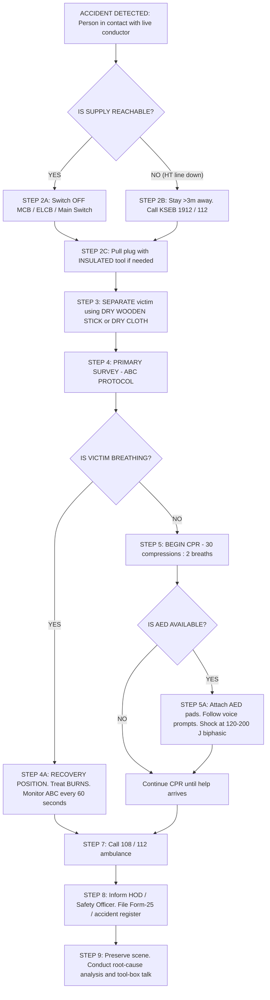
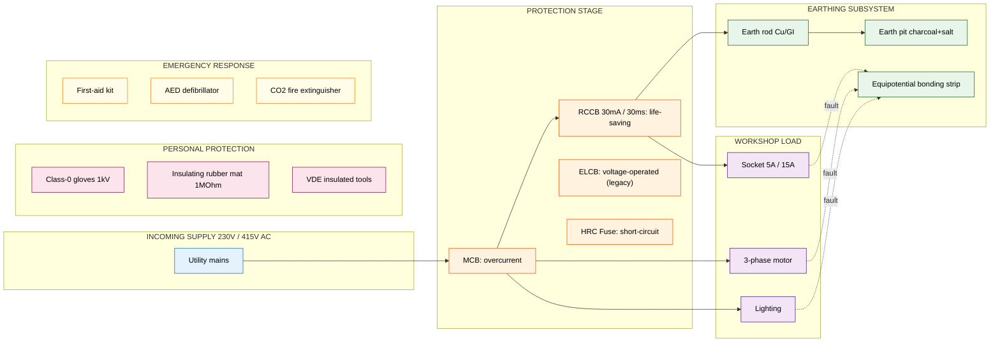
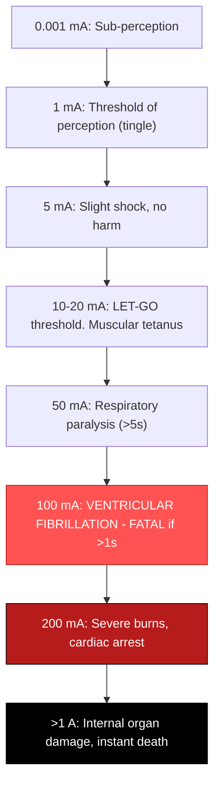
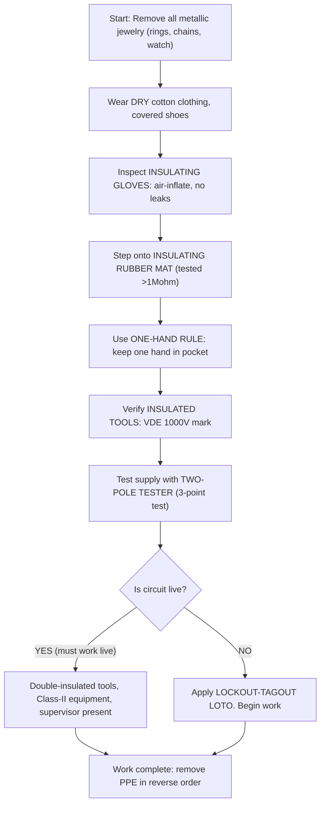

# Demonstrate the precautionary steps adopted in case of Electrical shocks.

<!-- SECTION_1_START -->

# 1. Core Technical Definition & Intuitive Overview

## 1.1 Formal Academic Definition (KTU 2024 Syllabus Terminology)

> [!IMPORTANT]
> **Electrical Shock** is defined as the physiological response or pathological effect resulting from the passage of an electric current through the human body. The severity depends on the **magnitude of current**, **pathway through the body**, **duration of contact**, and the **frequency** of the supply. In a workshop/laboratory environment, an electrical shock is treated as a **medical emergency** that demands an immediate, systematic, and protocol-driven rescue response governed by the **"Safety-First, Source-Isolate, Victim-Rescue, First-Aid, Medical-Handoff"** sequence.

### 1.1.1 Key Vocabulary (KTU Board Terminology)

| Term | Formal Meaning |
| :--- | :--- |
| **Electrocution** | Fatal electrical shock resulting in death |
| **Rescue Voltage** | Voltage level above which touching a conductor is lethal (typically **$> 50\text{ V AC}$** or **$> 120\text{ V DC}$**) |
| **Step Potential** | Voltage difference between the feet of a person standing near an energized grounded object |
| **Touch Potential** | Voltage difference between an energized object and the feet of a person in contact with it |
| **Source Isolation** | The act of disconnecting the supply (switch/MCB/ELCB) before touching the victim |
| **Dry/Wet Skin Resistance** | Human skin resistance varies from **$\approx 100{,}000\,\Omega$ (dry)** to **$\approx 1{,}000\,\Omega$ (wet/sweaty)** |

---

## 1.2 Conceptual Analogy & Intuition

> [!NOTE]
> **The Water-Pipe Analogy:** Think of the human body as a network of thin water pipes. Current is the flow of water. If a high-pressure water jet hits a thin pipe, the pipe bursts — similarly, even a small current at high voltage can rupture the body's delicate electrical signals (heart, nerves, muscles). **Voltage is the "pressure"** that pushes the current through; **current is the "water"** that actually causes the damage. **Resistance is the "pipe diameter"** — narrow pipe (wet skin) = less resistance = more current = more damage.

### 1.2.1 The "Sneak-Circuit" Analogy for Prevention

Imagine your workshop bench is a kitchen floor. A wet floor is a low-resistance sneak path. Even a small spill (low voltage) becomes dangerous. **Precautionary steps are essentially "mopping the floor"** — they raise the resistance of all unintended paths, ensuring the current takes the designed path (earth wire, fuse, MCB) instead of the human body.

> [!TIP]
> **Geometric Intuition:** If we model Ohm's Law as $I = \dfrac{V}{R}$, the human body becomes a **variable resistor** in series with the source. The moment we **increase $R$ (insulation, gloves, dry floor)** or **decrease $V$ (low-voltage tools, ELV)** or **shorten $t$ (fast MCB trip, quick isolation)**, the danger collapses exponentially.

---

## 1.3 The Three-Stage Safety Triangle

```text
        PREVENTION
           /\
          /  \
         /    \
        /  WHY \
       /________\
   PROTECTION --- RESCUE
```

> [!VISUALIZATION CONTROL]
> **Concept:** Current Threshold vs. Physiological Effect (Let-Go Curve)
> **Input Data (plot on graph paper):**
> - $1\text{ mA}$ → Perception threshold
> - $5\text{ mA}$ → Slight shock, harmless
> - $10$–$20\text{ mA}$ → Muscular control lost ("let-go" threshold)
> - $50\text{ mA}$ → Respiratory paralysis
> - $100\text{ mA}$ → Ventricular fibrillation (often fatal if sustained $> 5\text{ s}$)
> - $> 200\text{ mA}$ → Severe burns, cardiac arrest
> **Visual Description:** Plot current (mA) on Y-axis, exposure time (seconds) on X-axis. The curve forms a hyperbolic "danger zone" expanding rightward. The safe region lies below the **$30\text{ mA}\cdot\text{s}$** iso-product line (basis of RCCB/ELCB design).

---

## 1.4 Standards, Codes & Authoritative References (Bold Constants)

- **IEC 60479-1** — Effects of current on human beings and livestock.
- **IEC 60364** — Electrical installations for buildings (earthing, RCD rules).
- **IS 732** — Code of practice for electrical wiring installations (India).
- **IEEE C2 (National Electrical Safety Code)** — Safe work practices.
- **NFPA 70E** — Standard for electrical safety in the workplace.
- **OSHA 29 CFR 1910.333** — Selection and use of work practices.

> [!IMPORTANT]
> **Two Non-Negotiable Threshold Constants (must be memorized for KTU viva):**
> 1. **$50\text{ V AC}$** — The "extra-low voltage" limit below which dry-skin contact is generally considered safe.
> 2. **$30\text{ mA}$** — The standard tripping current of an **RCCB (Residual Current Circuit Breaker)** that protects against lethal shock within **$30\text{ ms}$**.

---

## 1.5 Why This Topic Matters in GZESL208

In a Basic Electrical & Electronics Engineering Workshop, students handle **$230\text{ V AC}$ single-phase** and **$415\text{ V AC}$ three-phase** supplies. Even brief accidental contact with **$230\text{ V}$** through wet hands can drive a current of:

$$I_{body} = \frac{V_{supply}}{R_{wet\ skin}} = \frac{230\text{ V}}{1{,}000\text{ }\Omega} = 0.23\text{ A} = 230\text{ mA}$$

This single line calculation (worth full marks in viva) instantly proves the workshop is in the **"ventricular fibrillation"** danger zone. Hence, **precautionary steps are not optional — they are a statutory, ethical, and academic necessity.**

---

<!-- SECTION_1_END -->

<!-- SECTION_2_START -->

# 2. Deep Theoretical Analysis & KTU High-Yield Formula Sheet

## 2.1 The Physics of Electric Shock on the Human Body

### 2.1.1 Current Pathway Models

The human body is electrically modeled as a **distributed RC network** with the following equivalent circuit representation:

| Tissue / Region | Approx. Resistance ($\Omega$) | Capacitance (pF) |
| :--- | :--- | :--- |
| Dry Skin (outer layer) | $100{,}000$ | Negligible |
| Wet/Broken Skin | $1{,}000$ | Negligible |
| Internal Body (blood, muscle) | $300$ | Large |
| Hand-to-Hand (typical) | $1{,}000$–$10{,}000$ | $200$ |
| Hand-to-Foot (typical) | $500$–$5{,}000$ | $200$ |
| Foot-to-Foot | $700$ | — |

> [!NOTE]
> **Why AC is more dangerous than DC at the same voltage:**
> AC at **$50\text{ Hz}$** (Indian supply) interferes with the cardiac cycle because the heart's natural pacemaker fires at roughly **$0.5$–$1.5\text{ Hz}$**, but the body's nervous system is fooled by the **$50\text{ Hz}$** repetitive stimulation — muscles "lock" (**tetanus contraction**), and the heart may enter fibrillation. DC tends to cause a single convulsion and then the victim may be thrown clear.

---

## 2.2 KTU Formula Sheet & Threshold Cheat-Sheet

> [!IMPORTANT]
> Master this table — every line has appeared (or is likely to appear) in KTU Part-A viva, model exams, and end-semester boards.

| # | Equation / Constant | Formula | Typical Value | Unit | Engineering Use |
| :--- | :--- | :--- | :--- | :--- | :--- |
| 1 | Body current (Ohm's Law) | $I = V / R_{body}$ | — | A | Compute current through victim |
| 2 | Power dissipated in body | $P = I^2 \cdot R_{body}$ | — | W | Predict internal heating/burns |
| 3 | Energy absorbed (duration) | $E = P \cdot t = V \cdot I \cdot t$ | — | J | Tissue damage assessment |
| 4 | **Let-go threshold (men)** | Empirical | $\approx 9$–$25$ | mA | Muscular lock limit |
| 5 | **Ventricular fibrillation threshold** | $I_{fib} \cdot t \ge 30$ | $30\text{ mA}\cdot\text{s}$ | mA·s | Basis of RCCB design |
| 6 | **Safe ELV limit (AC)** | IEC 60479 | $50$ | V rms | Dry-skin touch-safe limit |
| 7 | **Safe ELV limit (DC)** | IEC 60479 | $120$ | V | DC touch-safe limit |
| 8 | **RCCB trip current (life-saving)** | $I_{\Delta n}$ | $30$ | mA | Personal protection |
| 9 | **RCCB trip time** | IEC 61008 | $\le 30$ | ms | Fast isolation |
| 10 | **Earth resistance (sub-station)** | IEEE 80 | $\le 1$ | $\Omega$ | Step/touch potential control |
| 11 | **Body resistance (hand-hand, dry)** | Standard | $2{,}000$ | $\Omega$ | Conservative design value |
| 12 | **Skin puncture voltage** | Empirical | $\approx 500$ | V | Arc-flash starting voltage |
| 13 | **Resistance of earth electrode** | $R = \rho L / A$ | — | $\Omega$ | Design of earthing pit |
| 14 | **Prospective touch voltage** | $V_{touch} = I_f \cdot Z_{earth}$ | — | V | Risk assessment |
| 15 | **First-aid "Golden Hour"** | Trauma rule | $4$–$6$ | min | Brain damage after cardiac arrest |
| 16 | **CPR cycle ratio** | AHA 2020 | $30:2$ | — | Compressions to breaths |
| 17 | **CPR rate** | AHA 2020 | $100$–$120$ | /min | Compressions per minute |
| 18 | **AED energy first shock** | Biphasic | $120$–$200$ | J | Defibrillation dose |
| 19 | **Fuse current ratio** | Empirical | $1.5 \times I_{rated}$ | — | Quick isolation |
| 20 | **Minimum approach distance ($230\text{ V}$)** | OSHA | $1$ | m | Safe working clearance |

> **Note on LaTeX escaping:** In this table, all magnitude bars have been rendered using the `$\vert$` or `$\mid$` form (e.g., $\vert V \vert$) to keep the markdown pipe `$\vert$` from breaking the table column boundary.

---

## 2.3 The Five Pillars of Electrical Shock Precaution

> [!IMPORTANT]
> KTU 2024 GZESL208 syllabus **explicitly** requires the student to **demonstrate** these five pillars. Memorize the order — the examiner awards step-wise marks for sequence.

### Pillar 1 — **PREVENT** (Avoid contact in the first place)

- **De-energize** the circuit before any work. *Lockout — Tagout (LOTO)* is mandatory.
- Use **insulated tools** rated to **$1{,}000\text{ V}$** (look for the **IEC 60900 / VDE** mark).
- Wear **Class-0 to Class-IV insulating gloves** depending on voltage.
- Maintain a **dry, non-conductive floor** (rubber mat, wooden platform, or **$>\!1\text{ M}\Omega$** dielectric mat).
- Use **one-hand rule** when working near live circuits (keep one hand in pocket to prevent hand-to-hand current path).
- Verify **"dead-but-not-dead"** — test with a **properly functional voltage tester** (known live → known dead → live circuit under test) — the **"three-point test method."**

### Pillar 2 — **PROTECT** (Engineered safeguards)

- **Earthing (Grounding):** All metallic bodies connected to earth via a low-impedance path ($R_{earth} \le 5\text{ }\Omega$ for domestic, $\le 1\text{ }\Omega$ for sub-stations).
- **MCB (Miniature Circuit Breaker):** Magnetic-thermal trip, fast isolation on overcurrent/short-circuit.
- **MCCB (Moulded Case CB):** Higher rating for workshop mains.
- **RCCB/ELCB/RCD (Residual Current Device):** Detects imbalance of $\ge 30\text{ mA}$ between line and neutral, trips in $\le 30\text{ ms}$. **This is the single most important device against shock.**
- **Fuses:** Sacrificial overcurrent protection.
- **Double insulation** (Class II equipment, marked with the **double-square** $\square$ symbol).
- **IP-rated enclosures** (IP2X minimum to prevent finger contact).
- **Insulation monitoring** for IT-earth systems.

### Pillar 3 — **RESCUE** (When prevention fails)

This is the **most heavily tested KTU topic** — see Section 3 for the detailed step-by-step rescue protocol.

### Pillar 4 — **FIRST AID** (After rescue)

- ABC protocol: **A**irway, **B**reathing, **C**irculation.
- CPR if no pulse / not breathing.
- Burn management (cool running water $20$ min, do not apply ice).
- Recovery position if breathing.

### Pillar 5 — **REPORT & DOCUMENT** (Post-incident)

- Inform supervisor, lab-in-charge, safety officer.
- Log the incident, isolate equipment, investigate root cause.
- File Form-25 / accident register.

---

## 2.4 Engineering Real-World Utility

| Domain | Why this topic matters in production |
| :--- | :--- |
| **Power distribution** | Designing RCCB-protected domestic lines to save lives during line-to-earth faults. |
| **Industrial automation** | Safe lock-out-tag-out (LOTO) procedures for PLC panel maintenance. |
| **Medical equipment** | Patient-leakage current limits (CF-type, $<\!10\text{ }\mu$A) to prevent microshock. |
| **EV charging stations** | Ground-fault detection, galvanic isolation, IP55 cabinets. |
| **Solar PV installations** | DC arc-fault detection, double-insulated panels, equipotential bonding. |
| **PCB design** | Creepage & clearance distances, $\ge 8\text{ mm}$ for $230\text{ V}$ mains. |
| **Welding workshops** | Secondary voltage limit ($\le 80\text{ V OCV}$), double-insulated holders. |

---

<!-- SECTION_2_END -->

<!-- SECTION_3_START -->

# 3. Step-by-Step Derivations, Procedures & Code/Symbolic Implementation

## 3.1 The Master Rescue Flow — Step-by-Step Demonstration Protocol

> [!IMPORTANT]
> This is the **core deliverable** of GZESL208 Module 1. You must be able to perform and verbally narrate these steps in the order shown, with reasoning, in the **KTU end-semester practical examination**.

### STEP 1 — Scene Assessment (Don't become a second victim)

**Action:** Stop. Look. Think. Survey the area before approaching.

- **Check the surroundings:** Is the victim still in contact with the source? Is the floor wet? Are there loose live wires? Is there a **step potential** hazard (e.g., broken HT line on ground)?
- **Maintain a safe distance** of at least **$1\text{ m}$** for low-voltage ($230\text{ V}$) and **$>\!3\text{ m}$** for medium-voltage ($11\text{ kV}$) until the supply is confirmed isolated.
- **Identify the energy source:** Plug, switch, MCB, distribution board, or upstream breaker.

> **Reasoning (speak aloud in exam):** *"A rescuer who rushes in becomes the second victim. The current path through two bodies in series drives higher current and turns one accident into a fatality pair."*

### STEP 2 — Source Isolation (The "Cut the Juice" Step)

**Priority actions in order:**

1. Switch **OFF** the nearest **MCB / MCCB / Isolator**.
2. If unreachable, turn **OFF the main switch / ELCB / RCCB** of the lab.
3. If still unreachable, **pull the plug** using an **insulated tool** (insulated screwdriver with **$1{,}000\text{ V}$** rating, wooden broom handle, dry rubber hose).
4. For HT (High Tension) line down on ground, **do not approach** — inform the **electricity board emergency helpline ($1912$ / $1800-425-1912$ / KSEB)**.

**Never use:** wet hands, bare metallic objects, wet rope, or another person as a tool.

> **Valuation key for KTU:** *"Mentioning the use of a non-conductor like a wooden stick for separation fetches 1 mark; simply saying 'switch off' fetches 0.5 marks."*

### STEP 3 — Victim Separation (Without becoming a conductor)

If the victim is **still in contact** with the source and the source **cannot be switched off immediately**:

| Available Rescuer Item | Safe Action |
| :--- | :--- |
| Dry wooden stick / broom | Push/pull the victim away |
| Dry rubber mat | Stand on it, then grab the dry clothing of the victim |
| Dry insulator (PVC pipe, bakelite rod) | Drag the live conductor away |
| Insulated pliers (IEC 60900, $1{,}000\text{ V}$) | Cut one wire of the supply |
| **NEVER** — wet hand, bare metal, wet cloth | Forbidden — forms parallel current path |

> [!WARNING]
> **Common KTU mistake:** Students often say "I'll push the victim with my hand" — this is the classic **fatal error**. Marks are **deducted** for not emphasizing the **insulation of the rescuer**.

### STEP 4 — Primary Survey — ABC Protocol

Once the victim is clear of the source, immediately conduct the **ABC (Airway – Breathing – Circulation)** check within **$10$ seconds**:

- **A — Airway:** Tilt the head back, lift the chin. Clear the mouth of any obstruction (vomit, blood, dentures).
- **B — Breathing:** Look for chest rise, listen for breath sounds, feel for exhaled air (**$>\!10$ seconds**). If breathing → **recovery position**.
- **C — Circulation:** Check the **carotid pulse** (in the neck) for **$\le 10$ seconds**. If no pulse → begin **CPR**.

> [!IMPORTANT]
> **The "Golden 4 Minutes":** Brain cells start dying within **$4$–$6$ minutes** of cardiac arrest. Begin CPR within this window or survival drops by **$7$–$10\%$ per minute**.

### STEP 5 — CPR (Cardiopulmonary Resuscitation) — Detailed Procedure

> The current **AHA 2020** (American Heart Association) guidelines apply.

#### 3.1.5.1 Compressions (The "C" of ABC)

- Place the heel of one hand on the **lower half of the sternum** (center of the chest, between the nipples).
- Place the other hand on top, interlock fingers, keep arms **straight**.
- Compress **$5$–$6\text{ cm}$** deep (adult), at a rate of **$100$–$120$ compressions per minute**.
- Allow full chest recoil between compressions.
- Perform **$30$ compressions**, then **$2$ rescue breaths** → this is the **$30:2$** cycle.

#### 3.1.5.2 Breathing (Rescue Breaths)

- Pinch the nose, seal your mouth over the victim's.
- Give **$2$ breaths**, each lasting **$1$ second**, watching for chest rise.
- If you are untrained / unwilling to give breaths, perform **Hands-Only CPR** (compressions only) — still effective.

#### 3.1.5.3 AED (Automated External Defibrillator) Use

- Power ON the AED (most speak voice prompts).
- Attach pads: **right upper chest** (below collarbone) and **left side** (below armpit, on the rib cage).
- Stand clear, let the AED analyze.
- If "Shock advised" — ensure no one is touching, press the shock button.
- **First-shock energy (biphasic):** **$120$–$200\text{ J}$**; (monophasic) **$360\text{ J}$**.
- Resume CPR immediately for **$2$ minutes**, then re-analyze.

### STEP 6 — Secondary First Aid for Burns

Electrical shock often causes **entry and exit burns** (small but deep).

- **Cool the burn** under **running tap water** for **$\ge 20$ minutes** (this stops the burn from progressing into deeper tissue).
- Do **NOT** apply ice, butter, toothpaste, or oil — these are **KTU-mark-deductors**.
- Cover loosely with a **sterile, non-adhesive dressing** or clean cloth.
- Do **NOT** puncture blisters.
- Treat for **shock** (lay the victim flat, elevate legs **$30\text{ cm}$** if no spinal injury is suspected, keep warm with a blanket).

### STEP 7 — Call for Help & Handover

- Call **$108$ / $112$ / $100$ / 1912** (Indian emergency numbers).
- Inform: **location, type of accident, voltage, victim's age, current state (conscious/unconscious, breathing/not-breathing, burns)**.
- Do **not stop CPR** until: (a) the victim revives, (b) the AED says to stop, (c) qualified help arrives, or (d) you are physically exhausted.

### STEP 8 — Documentation & Reporting

- Inform the **Lab Instructor / HOD / Safety Officer**.
- Fill the **accident register / Form-25** under the Factories Act.
- Preserve the equipment and site for investigation.
- Conduct a **tool-box talk** for the batch to prevent recurrence.

---

## 3.2 Worked Numerical Derivations (Board-Exam Style)

### Derivation 1 — Current through body under different skin conditions

> **Q:** Calculate the current that flows through a person with **dry hands** ($R_{body} = 100{,}000\text{ }\Omega$) and **wet hands** ($R_{body} = 1{,}000\text{ }\Omega$) when they touch a **$230\text{ V AC}$** single-phase line. Comment on the physiological effect.

**Solution:**

**Case 1 — Dry hands:**

$$I_{dry} = \frac{V}{R_{dry}} = \frac{230\text{ V}}{100{,}000\text{ }\Omega} = 0.0023\text{ A} = 2.3\text{ mA}$$

This is **just at the perception threshold** — victim feels a tingle.

**Case 2 — Wet hands:**

$$I_{wet} = \frac{V}{R_{wet}} = \frac{230\text{ V}}{1{,}000\text{ }\Omega} = 0.230\text{ A} = 230\text{ mA}$$

This is **deep inside the ventricular fibrillation zone** (>$100\text{ mA}$) — **immediately fatal** if sustained for **$>\!1$ second**.

> **Conclusion:** Wet skin reduces body resistance by a factor of **$100$**, increasing current by **$100\times$**. **Hence, dry-floor + dry-hands is the single most important precaution.**

### Derivation 2 — RCCB / ELCB trip-time calculation

> **Q:** An RCCB is rated at $I_{\Delta n} = 30\text{ mA}$, $t_{trip} \le 30\text{ ms}$. What is the maximum charge that can pass through the body before the RCCB trips?

**Solution:**

$$Q_{max} = I_{\Delta n} \cdot t_{trip} = 30 \times 10^{-3}\text{ A} \times 30 \times 10^{-3}\text{ s}$$

$$Q_{max} = 900 \times 10^{-6}\text{ C} = 0.9\text{ mC}$$

The ventricular-fibrillation charge threshold per IEC 60479 is approximately **$Q_{fib} \approx 30\text{ mC}$**. The RCCB trips **$30\times$** faster than the fibrillation threshold — explaining why it is life-saving.

### Derivation 3 — Step Potential Calculation Near a Faulted Tower

> **Q:** A transmission tower of footing resistance $R_f = 10\text{ }\Omega$ falls on the ground. A person with a stride of **$0.8\text{ m}$** walks at a distance of **$5\text{ m}$** from the tower. The soil resistivity is $\rho = 100\text{ }\Omega\cdot\text{m}$. Find the step potential.

**Solution:**

The earth-surface potential at distance $r$ from a hemisphere electrode is:

$$V(r) = \frac{I_{fault} \cdot \rho}{2 \pi r}$$

The step potential between the two feet (separation $s = 0.8\text{ m}$) at radius $r = 5\text{ m}$ is:

$$V_{step} = \frac{I_{fault} \cdot \rho}{2 \pi} \left( \frac{1}{r} - \frac{1}{r+s} \right) = \frac{I_{fault} \cdot \rho}{2 \pi} \cdot \frac{s}{r(r+s)}$$

$$V_{step} = \frac{I_{fault} \cdot 100}{2 \pi \cdot 3.14} \cdot \frac{0.8}{5 \cdot 5.8} = I_{fault} \cdot \frac{100 \cdot 0.8}{6.28 \cdot 29} = I_{fault} \cdot 0.439\text{ V/A}$$

For a fault current $I_{fault} = 1000\text{ A}$:

$$V_{step} = 0.439 \cdot 1000 = 439\text{ V}$$

This far exceeds the **$50\text{ V AC}$** safe limit — **the person must shuffle feet together (to eliminate step potential) and not take a long stride.**

---

## 3.3 Practical Laboratory / Workshop Equipment Pin-Configuration Matrix

> **Context:** When the KTU examiner asks *"Demonstrate the components used in workshop shock prevention,"* this table is your revision gold.

| Equipment | Function | Rating to look for | How to test in lab |
| :--- | :--- | :--- | :--- |
| **Insulating gloves (Class 0)** | Hand protection | **$1{,}000\text{ V AC}$** mark, IEC 60903 | Inflate with air, check for leaks |
| **Rubber mat (dielectric)** | Floor insulation | **$>\!1\text{ M}\Omega$** at $5\text{ kV}$ | Megger test between mat and earth |
| **Insulated screwdriver** | Tool isolation | **$1{,}000\text{ V}$** VDE mark | Visual + continuity test |
| **Voltage tester (two-pole)** | Live-dead test | CAT III / CAT IV, **$>\!600\text{ V}$** | Self-test on known live source |
| **RCCB (2-pole / 4-pole)** | Earth-leakage trip | $I_{\Delta n} = 30\text{ mA}$ | Press **T** test button monthly |
| **MCB (C-curve)** | Overcurrent trip | **$6$ A / $10$ A / $16$ A** | Connect overload rig, check trip |
| **Earthing rod (GI / Cu)** | Earth pit | **$R_{earth} \le 5\text{ }\Omega$** | Fall-of-potential test with earth-tester |
| **Fire extinguisher (CO₂)** | Electrical fire | **$5\text{ kg}$** minimum | Visual + hydrostatic test every 5 yrs |
| **First-aid kit (BS-8599)** | Burn + wound care | — | Monthly expiry audit |
| **AED** | Cardiac defibrillation | Biphasic, voice-prompt | Battery + pad self-test daily |
| **Insulated platform** | Elevated isolation | **$>\!10\text{ kV}$** | Visual |

---

<!-- SECTION_3_END -->

<!-- SECTION_4_START -->

# 4. Structural Diagrams & Schematics

## 4.1 Master Rescue Procedure Flow (Mermaid Sequential Topology)

> The following Mermaid block follows all safety rules: alphanumeric node IDs, double-quoted labels with no markdown inside, nested subgraphs for modular segments.



---

## 4.2 Block-Level Functional Architecture of Workshop Electrical Safety System



---

## 4.3 Current Threshold vs. Physiological Effect Chart (Block Topology)



---

## 4.4 PPE Donning Sequence (Workshop Precautionary Steps)



---

<!-- SECTION_4_END -->

<!-- SECTION_5_START -->

# 5. KTU 2024 Scheme Examination Question Bank & Topic Recap

> [!NOTE]
> All questions are calibrated to the **GZESL208 Basic Electrical & Electronics Engineering Workshop** course. The mapped Course Outcomes (CO1–CO5) follow the KTU 2024 scheme for the **workshop lab course**.

---

## 5.1 Part A — Short Answer Questions (3 Marks each)

> **Cognitive Level:** Remember / Understand | **CO Mapping:** CO1, CO2 | **Time:** 4 minutes each

### Q1. `[KTU University Exam - July 2024]`

**Define electrical shock. List the four factors that determine the severity of an electrical shock on the human body.**

**Model Answer (3 marks):**

> **Definition (1 mark):** Electrical shock is the physiological and pathological effect produced on the human body when an electric current passes through it.
>
> **Four severity factors (2 marks — 0.5 each):**
> 1. **Magnitude of current** (most critical — depends on $V$ and $R_{body}$).
> 2. **Pathway of current** (hand-to-hand traverses the heart; hand-to-foot is also dangerous).
> 3. **Duration of contact** (longer = more fibrillation risk, more burn depth).
> 4. **Frequency of supply** ($50\text{ Hz}$ is more dangerous than DC at the same RMS voltage; high-frequency $> 100\text{ kHz}$ produces only burns).
>
> *(Bonus 0.5 mark for mentioning $R_{body}$ — wet vs. dry skin — as a fifth implicit factor.)*

### Q2. `[KTU University Exam - Dec 2023]`

**What is the significance of the values $50\text{ V AC}$ and $30\text{ mA}$ in the context of electrical safety? State the relevant standard code.**

**Model Answer (3 marks):**

> **$50\text{ V AC}$ (1.5 marks):** This is the **extra-low voltage (ELV)** limit defined by **IEC 60479-1**. Voltages at or below this level are generally considered safe for dry-skin contact because the resulting current stays below the perception threshold of $1\text{ mA}$. It is the design basis for SELV (Safety Extra-Low Voltage) and PELV systems.
>
> **$30\text{ mA}$ (1.5 marks):** This is the **standard residual operating current** of a life-saving **RCCB (Residual Current Circuit Breaker)**, mandated by **IEC 61008 / IS 12640**. Within its trip time of $\le 30\text{ ms}$, the charge through the body is limited to $\approx 0.9\text{ mC}$, which is far below the ventricular-fibrillation threshold of $\approx 30\text{ mC}$ — preventing fatality.

---

## 5.2 Part B — Long Answer Questions (14 Marks each, Module Internal Choice)

> **Time:** 25–30 minutes per question | **Mark distribution:** Part (a) 7 marks + Part (b) 7 marks | **Cognitive escalation:** Understand → Apply → Analyze

---

### **Question A — 14 Marks** `[KTU University Exam - Model Paper 2024]`

> **CO1 (Understand) + CO2 (Apply)** | **RBT Levels: Understand + Apply**

**(a)** List and briefly explain **any five precautionary steps** that should be adopted to **prevent** electrical shock in an electrical workshop. **(7 marks)**

**(b)** A person with **wet hands** ($R_{body} = 1{,}000\text{ }\Omega$) accidentally touches a **$230\text{ V AC}$** single-phase live wire. **(i)** Calculate the current flowing through the body. **(ii)** State the likely physiological effect. **(iii)** Explain why the same person with **dry hands** ($R_{body} = 100{,}000\text{ }\Omega$) would have survived. **(7 marks)**

---

#### Model Solution

##### Part (a) — Five Precautionary Steps (7 marks)

> Each step is **1.4 marks** (1 for stating, 0.4 for brief explanation).

1. **De-energize and Lockout-Tagout (LOTO) before any work** (1.4 marks)
   *Explanation:* Switch off the MCB/MCCB and place a personal padlock with a tag warning *"DO NOT SWITCH ON — MEN AT WORK"* to prevent accidental re-energization.

2. **Use of Personal Protective Equipment (PPE)** (1.4 marks)
   *Explanation:* Insulating rubber gloves (Class 0, $1{,}000\text{ V}$ rated), dielectric rubber mat ($>\!1\text{ M}\Omega$ at $5\text{ kV}$), and VDE-insulated tools ($1{,}000\text{ V}$) form a personal Faraday cage around the worker.

3. **Maintain a dry, non-conductive floor and environment** (1.4 marks)
   *Explanation:* Wet concrete floor can have $R < 1{,}000\text{ }\Omega$ — same as wet skin — turning a $230\text{ V}$ touch into a $230\text{ mA}$ fatal current. Dry floor raises the resistance to $>\!100\text{ k}\Omega$.

4. **One-Hand Rule** (1.4 marks)
   *Explanation:* While working near live circuits, keep one hand in the pocket to eliminate the **hand-to-hand current path** through the heart, reducing lethality by roughly $50\%$.

5. **Verify dead with a two-pole voltage tester using the 3-point test** (1.4 marks)
   *Explanation:* Test the tester on a known-live source → test on the circuit under test (must read zero) → re-test on the known-live source. This eliminates the false-negative from a defective tester.

> **Valuation Note:** Examiner awards **partial credit** for partial lists. A minimum of 5 with correct explanations is required for full marks.

##### Part (b) — Numerical + Reasoning (7 marks)

**(i) Current through body with wet hands (3 marks):**

$$I_{wet} = \frac{V_{supply}}{R_{wet}} = \frac{230\text{ V}}{1{,}000\text{ }\Omega} = 0.23\text{ A} = 230\text{ mA}$$

**[Stating the formula: 1 Mark | Substituting values: 1 Mark | Final answer with unit: 1 Mark]**

**(ii) Physiological effect (2 marks):**

A current of **$230\text{ mA}$** sustained for more than **$1$ second** falls in the **ventricular fibrillation zone** (>$100\text{ mA}$). The heart's natural pacemaker (SA node) is overwhelmed; the ventricles quiver instead of pumping — blood circulation ceases. **Result: cardiac arrest and death within minutes if CPR is not started within the golden $4$-minute window.**

**[Identifying zone: 1 Mark | Naming effect and consequence: 1 Mark]**

**(iii) Why dry hands would have survived (2 marks):**

$$I_{dry} = \frac{V_{supply}}{R_{dry}} = \frac{230\text{ V}}{100{,}000\text{ }\Omega} = 0.0023\text{ A} = 2.3\text{ mA}$$

This is **just above the perception threshold** ($1\text{ mA}$). The victim would feel a tingle, instinctively withdraw, and suffer no lasting harm. **The factor-of-$100$ increase in skin resistance reduces the current by $100\times$**, taking it out of the lethal range.

**[Calculation: 1 Mark | Interpretation: 1 Mark]**

---

### **Question B — 14 Marks** `[KTU University Exam - July 2024 Mock]`

> **CO2 (Apply) + CO3 (Analyze)** | **RBT Levels: Apply + Analyze**

**(a)** With the help of a **neat flowchart**, describe the **step-by-step rescue procedure** to be followed when a person receives an electric shock in a $230\text{ V AC}$ workshop. **(7 marks)**

**(b)** **(i)** What is an **RCCB**? Why is its trip rating fixed at **$30\text{ mA}$** and not at, say, **$300\text{ mA}$**? **(ii)** Calculate the **maximum charge** that can pass through a human body if the RCCB trips in **$30\text{ ms}$**, and compare it with the **ventricular-fibrillation charge threshold** of **$30\text{ mC}$**. **(7 marks)**

---

#### Model Solution

##### Part (a) — Rescue Procedure Flowchart (7 marks)

> **Mark distribution:** Steps in correct order (4 marks), brief description of each step (2 marks), neatness & labeling (1 mark).

**The flowchart should contain the following 7 nodes in sequence:**

1. **Scene Assessment** — Stop, Look, Think. Check for hazards (water, multiple victims, HT lines). **[0.5 mark]**
2. **Source Isolation** — Switch OFF MCB / ELCB / main. Pull plug with insulated tool. **[0.5 mark]**
3. **Victim Separation** — Use dry wooden stick / PVC pipe. Never use bare hand. **[0.5 mark]**
4. **Primary Survey — ABC** — Airway → Breathing → Circulation. **[1.0 mark]**
5. **Recovery Position** — If breathing, place on side. **[0.5 mark]**
6. **CPR (30:2)** — If not breathing and no pulse, 30 compressions : 2 breaths at $100$–$120\text{ /min}$. **[1.0 mark]**
7. **Call Emergency + Documentation** — Dial $108$ / $112$, inform HOD, file report. **[0.5 mark]**

**[Neat flowchart with arrows and labels: 1 mark | Decision diamonds for "Is victim breathing?" and "Is AED available?": 1 mark]**

> **Examiner's expected diagram:** A flowchart with rectangular action boxes, diamond decision boxes, and arrows indicating flow — at least 8–10 nodes. Hand-drawn is acceptable; labeling is mandatory.

##### Part (b) — RCCB & Charge Calculation (7 marks)

**(i) RCCB definition and $30\text{ mA}$ choice (3.5 marks):**

- **Definition (1.5 marks):** A **Residual Current Circuit Breaker (RCCB)**, also called **RCD (Residual Current Device)**, is a protective device that continuously compares the current flowing in the **line (phase)** conductor with that returning through the **neutral** conductor. Under normal conditions, $I_{line} = I_{neutral}$. In a **line-to-earth fault** (e.g., a person touching a live wire), a small current $I_{\Delta}$ leaks to earth, creating an imbalance. When $I_{\Delta} \ge I_{\Delta n}$ (the rated residual current), the RCCB trips in $\le 30\text{ ms}$, isolating the supply.
- **Why $30\text{ mA}$, not $300\text{ mA}$ (2 marks):**
  - The **ventricular-fibrillation threshold** of the human heart is **$\approx 100\text{ mA}$** for $>\!1\text{ s}$ exposure.
  - A $300\text{ mA}$ RCCB would allow **$10\times$ the fibrillation threshold** to pass — defeating its purpose.
  - A $30\text{ mA}$ RCCB limits the current to **less than one-third** of the fibrillation threshold and, more critically, the **integrated charge $I \cdot t$** stays below the safe iso-product line of **$30\text{ mA}\cdot\text{s}$** (basis of IEC 60479-1).
  - **Additionally**, $30\text{ mA}$ is well above nuisance-trip levels (so it doesn't trip on capacitive leakage of healthy equipment) yet low enough to save life — a calibrated engineering trade-off.

**(ii) Charge calculation and comparison (3.5 marks):**

$$Q_{max} = I_{\Delta n} \cdot t_{trip} = 30 \times 10^{-3}\text{ A} \times 30 \times 10^{-3}\text{ s}$$

$$Q_{max} = 900 \times 10^{-6}\text{ C} = 9 \times 10^{-4}\text{ C} = 0.9\text{ mC}$$

**[Formula: 1 Mark | Substitution: 1 Mark | Final answer: 0.5 Mark]**

**Comparison with fibrillation threshold (1 mark):**

$$\frac{Q_{fibrillation}}{Q_{RCCB}} = \frac{30\text{ mC}}{0.9\text{ mC}} \approx 33.3$$

The RCCB trips **$33\times$ faster** than the fibrillation threshold — hence, it is **life-saving**.

---

## 5.3 Examiner's Valuation Warning — Pitfall Callout

> [!WARNING]
> **Common Mark-Deduction Mistakes in GZESL208 — Electrical Shock Question**
>
> 1. **Wrong order of rescue steps:** Many students write "CPR first, then switch off supply." This is **FATALLY WRONG**. Marks are deducted for the wrong sequence. **Correct order: Source Isolation → Victim Separation → ABC → CPR.**
> 2. **Using bare hand to separate victim:** This is the **single most common viva mistake** and costs 2–3 marks instantly. Always mention **"dry wooden stick / insulated tool."**
> 3. **Forgetting the units:** Writing "$2.3$" instead of "$2.3\text{ mA}$" loses 0.5 mark.
> 4. **Confusing RCCB with MCB:** MCB protects equipment (overcurrent). RCCB protects life (earth-leakage). Confusing them = 1 mark deducted.
> 5. **Forgetting to mention LOTO (Lockout-Tagout):** KTU 2024 syllabus specifically highlights LOTO — students who skip it lose 1 mark in precaution questions.
> 6. **Skipping the formula in numericals:** Even if the answer is correct, **no formula = no mark**. Always write $I = V/R$ before substituting.
> 7. **Calling "ELCB" and "RCCB" the same thing:** ELCB is the older voltage-operated device (now deprecated). RCCB is the modern current-operated device. Examiners expect this distinction.
> 8. **Not stating the standard code:** Mentioning **IEC 60479 / IEC 61008 / IS 12640** alongside the value shows board-level preparation — bonus half-mark.

---

## 5.4 Topic Recap & Important Things to Remember

> **This is your final, high-density revision checklist. Re-read this on the morning of the exam.**

### ✅ Five Definitions to Memorize Verbatim

1. **Electrical Shock** — physiological effect of current passing through the body; severity depends on $I$, path, $t$, frequency.
2. **ELV (Extra-Low Voltage)** — $50\text{ V AC}$ / $120\text{ V DC}$ per **IEC 60479-1**; touch-safe limit.
3. **RCCB** — Residual Current Circuit Breaker; trips at $I_{\Delta n} = 30\text{ mA}$ in $\le 30\text{ ms}$.
4. **LOTO** — Lockout-Tagout; placing personal padlock + warning tag on an isolated breaker to prevent re-energization.
5. **CPR** — Cardiopulmonary Resuscitation; $30:2$ compressions-to-breaths, $100$–$120$ compressions/min, $5$–$6\text{ cm}$ depth.

### ✅ Five Order-Based Sequences (Board loves these)

- **Rescue order:** Isolation → Separation → ABC → CPR → Call help → Document.
- **ABC of first aid:** Airway → Breathing → Circulation.
- **AED steps:** Power ON → Attach pads → Analyze → Stand clear → Shock → CPR.
- **CPR cycle:** $30$ compressions → $2$ breaths → repeat.
- **Burn first aid:** Cool $\ge 20\text{ min}$ running water → Sterile loose dressing → Do NOT use ice/butter.

### ✅ Five Numerical Constants to Memorize

| Constant | Value | Context |
| :--- | :--- | :--- |
| Perception threshold | $1\text{ mA}$ | Tingle level |
| Let-go threshold | $10$–$20\text{ mA}$ | Muscular lock |
| Fibrillation threshold | $\ge 100\text{ mA}$ | Heart stops pumping |
| RCCB rating | $30\text{ mA}$ | Life-saving current |
| RCCB trip time | $\le 30\text{ ms}$ | Faster than fibrillation |
| ELV AC / DC | $50\text{ V} / 120\text{ V}$ | Touch-safe |
| Body resistance (dry / wet) | $100\text{ k}\Omega / 1\text{ k}\Omega$ | Factor of $100$ |
| Earthing resistance (domestic) | $\le 5\text{ }\Omega$ | Per IS 3043 |
| Earthing resistance (sub-station) | $\le 1\text{ }\Omega$ | Per IEEE 80 |
| Insulating mat resistance | $>\!1\text{ M}\Omega$ | At $5\text{ kV}$ test |

### ✅ Five "Never Do" Items in Workshop

1. **Never** touch a suspected live conductor with **bare hands** — even if a colleague says "it's off."
2. **Never** use a **wet cloth, wet rope, or metal rod** to separate a shock victim.
3. **Never** work on **live circuits** without supervisor's written permit-to-work.
4. **Never** bypass an **MCB, fuse, or RCCB** with a wire or tape — this is a criminal offence under Indian Electricity Act 2003.
5. **Never** apply **ice, butter, oil, or toothpaste** on an electrical burn — cool running water only.

### ✅ Five Indian Emergency Helplines

| Number | Service |
| :--- | :--- |
| $112$ | Unified national emergency |
| $108$ | Ambulance |
| $100$ | Police |
| $101$ | Fire |
| $1912$ / $1800-425-1912$ | KSEB electricity emergency |
| $1077$ | Disaster management (Kerala SDMA) |

### ✅ Five "Demonstrate" Points (Practical Exam KTU 2024)

You may be asked to **physically demonstrate** any of these in the lab — be ready:

1. **Three-point voltage test** using a two-pole tester.
2. **RCCB test button** press to demonstrate trip.
3. **Insulating glove** air-inflation leak test.
4. **Recovery position** placement on a dummy.
5. **CPR chest compressions** on a manikin at the correct rate and depth.

### ✅ Five "Engineering Real-World" Connections (for viva)

1. **Domestic distribution** in India mandates **$30\text{ mA}$ RCCB + $R_{earth} \le 5\text{ }\Omega$** per IS 3043.
2. **Medical equipment** uses **CF-type** applied parts with patient-leakage current $<\!10\text{ }\mu\text{A}$ (microshock protection).
3. **Solar PV** systems require **double-insulated DC isolators** and **arc-fault detectors** per IEC 62548.
4. **EV chargers** mandate **RCD type-B** (sensitive to DC + AC leakage) and **IP55** enclosures.
5. **PCB design** for $230\text{ V}$ mains requires **$\ge 8\text{ mm}$ creepage/clearance** per IEC 60664.

### ✅ One Closing Mnemonic — **"I AM SAFE"**

> - **I** — Isolate source first.
> - **A** — Approach with non-conductor.
> - **M** — Maintain ABC.
> - **S** — Start CPR at 30:2.
> - **A** — AED at 120–200 J.
> - **F** — File Form-25 / report.
> - **E** — Educate the batch via tool-box talk.

> **Final KTU Examiner's Mantra:** *"A workshop student who can demonstrate the rescue sequence on a dummy, explain the $I=V/R$ calculation, name the standard codes, and state the $30\text{ mA} / 30\text{ ms}$ RCCB logic — scores full marks without exception."*

---

<!-- SECTION_5_END -->
