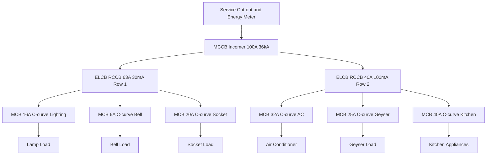
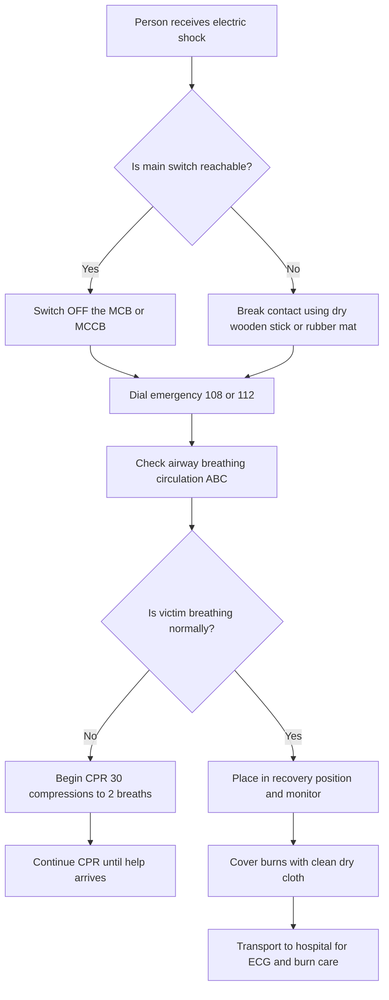
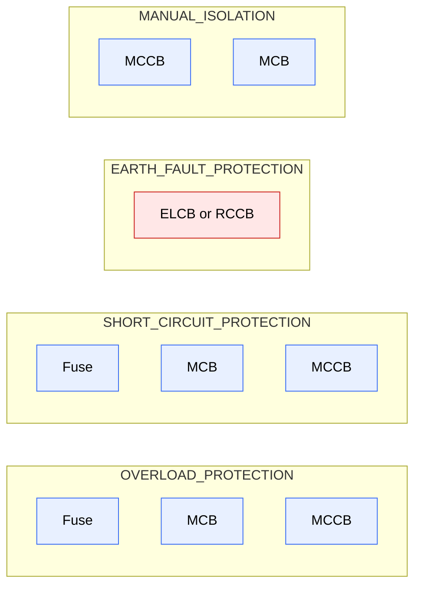
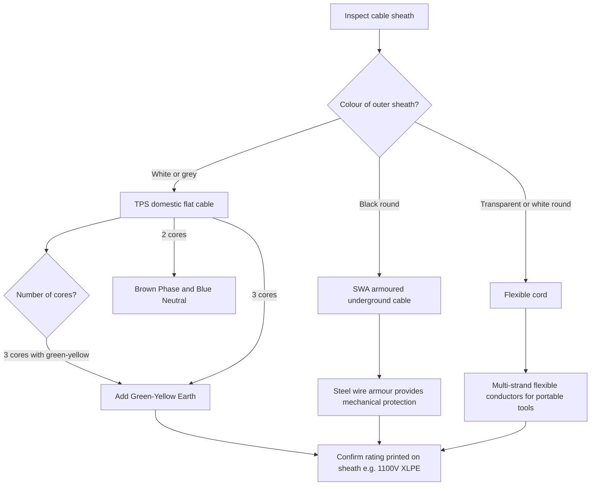

# Identify different types of cables, wires, switches, fuses, fuse carriers, MCB, ELCB and MCCB, familiarise the ratings.

<!-- SECTION_1_START -->

# 1. Core Technical Definition & Intuitive Overview

## 1.1 What Are Cables, Wires, Switches & Protection Devices?

In any electrical installation — from a domestic household to an industrial plant — a finite set of **passive conductors** (wires, cables) and **active control/protection hardware** (switches, fuses, MCBs, ELCBs, MCCBs) work together to **deliver energy safely** and **disconnect it intelligently** under fault conditions.

> [!IMPORTANT]
> **KTU 2024 Definition (GZESL208 / Module 1):**
> *Wires* are single solid or stranded conductors. *Cables* are groups of such conductors, jointly insulated, rated, and sheathed for a specific voltage and installation environment. *Switches* are mechanical/electromechanical devices that **make or break** a circuit manually. *Fuses, MCBs, ELCBs and MCCBs* are **over-current and earth-fault protection devices** whose job is to **isolate the faulty section automatically** before damage, fire, or electrocution occurs.

### 1.2 Intuitive Real-World Analogy

Imagine the **human circulatory system**:

- **Wires & Cables** = *Arteries and veins* carrying the "blood" (current) from the heart (transformer) to organs (loads).
- **Switch** = *A tap (faucet)* you open or close to start or stop the flow deliberately.
- **Fuse** = *A sacrificial clot* — it melts itself to stop bleeding (current) when pressure (current) is dangerously high.
- **MCB** = *An automatic, resettable circuit breaker* — like a smart valve that trips and can be re-opened.
- **ELCB / RCCB** = *A leak detector* — it senses if current is "leaking" out of the intended path (e.g., through a human body) and trips.
- **MCCB** = *The industrial-grade master valve* for very high-current circuits.

> [!NOTE]
> **Key Engineering Insight:**
> Current (not voltage) is what causes burns and fibrillation. A current of just **30 mA** through the human heart for 1 second can be lethal — this is the basis for **30 mA ELCB/RCD** ratings used universally in modern installations.

### 1.3 Visualization Control

> [!VISUALIZATION CONTROL]
> **Concept:** Voltage–Current Characteristic of a Fuse Element (I-t Curve)
>
> **GeoGebra / Desmos Input Equations:**
> * `f(x) = 1000 / x^2` (Pre-arcing I²t characteristic — higher current → faster melting)
> * `g(x) = 5000 / x^2` (Total clearing I²t characteristic — includes arcing time)
>
> **Visual Description:** Plot $x$ = prospective fault current (A) on horizontal axis and $y$ = time to clear (seconds) on vertical axis. The student should observe a **hyperbolic decay** — small overloads take seconds to clear, while massive short circuits clear in **milliseconds**. The narrow band between $f(x)$ and $g(x)$ is the **operating zone** of the fuse.

---

<!-- SECTION_1_END -->

<!-- SECTION_2_START -->

# 2. Deep Theoretical Analysis & KTU High-Yield Cheat Sheet

## 2.1 Wires vs. Cables — The Building Blocks

### 2.1.1 Classification of Wires (by conductor, insulation, application)

| Property | Types | Typical Use | KT-Syllabus Highlight |
|---|---|---|---|
| **Conductor material** | Copper (Cu), Aluminium (Al) | Cu — house wiring; Al — distribution | Cu has $\rho = 1.72 \times 10^{-8} \, \Omega\text{-m}$ |
| **Conductor form** | Solid (single core), Stranded (multi-core) | Solid — conduits; Stranded — flexible appliances | Stranded is **flexible**, used for extension cords |
| **Insulation** | PVC, XLPE, Rubber, Teflon | PVC — domestic; XLPE — high temp | XLPE rated up to **90 °C** vs PVC's **70 °C** |
| **No. of cores** | Single, Twin, Three, Four | Single — loop; Multi — appliance | Earth wire is always **green / yellow** |

### 2.1.2 Standard Wire Gauges & Current Ratings (KTU Viva Favorite)

| Cross-section (mm²) | Copper Current Rating (A) | Aluminium Current Rating (A) | Typical Application |
|---|---|---|---|
| 1.0 | 8 | — | Light circuits, fans |
| 1.5 | 12 | — | 5 A sockets, lamps |
| 2.5 | 18 | 14 | 15 A sockets, AC units |
| 4.0 | 24 | 20 | Geysers, ovens |
| 6.0 | 32 | 26 | Sub-mains, water heaters |
| 10.0 | 44 | 36 | Main distribution |

> [!IMPORTANT]
> **Voltage Drop Rule (ISI / NEC):** The voltage drop in any sub-circuit from the distribution board to the farthest load must **not exceed 3 % of the nominal voltage** (i.e., $\leq 6.6$ V for a 230 V single-phase system). Voltage drop formula:
>
> $$\Delta V = \frac{2 \cdot I \cdot L \cdot \rho}{A}$$
>
> where $L$ is the one-way length (m), $A$ is the cross-section (m²), and $\rho$ is the resistivity.

### 2.1.3 Types of Cables (Workshop-Level Knowledge)

1. **Armoured Cable (SWA — Steel Wire Armoured):** Used for **underground / outdoor** distribution. The steel armour provides mechanical protection.
2. **Unarmoured Cable (YY, CY, SY types):** Used indoors; **YY** = PVC/PVC, **CY** = PVC/screened/PVC, **SY** = PVC/steel braid/PVC.
3. **Flexible Cords (3-core / 4-core):** For mobile appliances, mixers, hand tools.
4. **Coaxial / Ethernet (Cat 6) Cables:** For signals, not power.
5. **Flat TPS (Thermo-Plastic Sheathed) Cable:** Domestic "house wiring" — Phase (red/brown), Neutral (black/blue), Earth (green-yellow) insulated in a flat PVC sheath.

## 2.2 Switches — Manual Control Devices

| Switch Type | Symbol | Operation | KTU Workshop Note |
|---|---|---|---|
| **SPST** (Single-Pole Single-Throw) | One line breaks | ON/OFF one line | Most common lighting switch |
| **SPDT** (Single-Pole Double-Throw) | One input → two outputs | Selector, two-way (staircase) | Staircase wiring |
| **DPST** (Double-Pole Single-Throw) | Two lines break together | Isolates Phase + Neutral | Isolator for geyser |
| **DPDT** | Two inputs × two outputs | Reversing | Motor reverse |
| **Bell Push / Push-Button** | Momentary contact | Doorbell | Spring-return |
| **Rotary / Cam Switch** | Multi-position | Selector for multi-speed fans | Up to 4 positions |

> [!NOTE]
> **Staircase Wiring (Two-Way Switching):** Uses **two SPDT switches** at the top and bottom of a staircase so the lamp can be controlled from either end. This is a frequent KTU viva question.

## 2.3 Fuses & Fuse Carriers

### 2.3.1 Working Principle of a Fuse

A fuse is a **deliberately weak link** in the circuit. It is a calibrated metal element (silver, tinned copper, or zinc) with a precisely known $I^{2}t$ characteristic. When the prospective fault current flows, **Joule heating** raises the element temperature above its melting point, and the element vaporises, **opening** the circuit.

The energy-balance equation is:

$$I^{2} \cdot R \cdot t = m \cdot s \cdot (\theta_{m} - \theta_{a})$$

where $m$ = mass, $s$ = specific heat, $\theta_{m}$ = melting point, $\theta_{a}$ = ambient, $R$ = element resistance, $t$ = pre-arcing time.

### 2.3.2 Fuse Element Types (Workshop Identification)

| Fuse Type | Construction | Breaking Capacity | Typical Use |
|---|---|---|---|
| **Re-wireable (Kit-Kat)** | Porcelain carrier + tinned copper wire | 2 kA – 4 kA | Old domestic meter box (now obsolete) |
| **Cartridge (HRC)** | Ceramic body, silver element, filled with quartz sand | 80 kA – 120 kA | Industrial, distribution |
| **Diazed (D-type)** | Screw-in, colour-coded for rating | 50 kA | European distribution |
| **Neozed / NH (Knife-blade)** | Bolted into carrier | 100 kA | Industrial panels |
| **Cartridge (Ferrule)** | Cylindrical, glass or ceramic | 35 kA | Electronics, control panels |
| **Thermal / SMD Fuse** | Surface mount | Low | PCB protection |

### 2.3.3 Fuse Carrier (Fuse Base / Holder)

The **fuse carrier** is the **mechanical housing** that holds the fuse element, provides the **line and load terminals**, and ensures the **safe replacement** of the fuse without touching live parts. In the **Kit-Kat** fuse, the carrier is the porcelain "draw-out" piece. In HRC systems, the carrier is a bakelite moulding with **silver-plated contacts** and a handle.

> [!IMPORTANT]
> **Standard Fuse Current Ratings (Indian / IS 2086):**
> 2 A, 4 A, 6 A, 10 A, 16 A, 20 A, 25 A, 32 A, 40 A, 50 A, 63 A, 80 A, 100 A, 125 A, 160 A, 200 A, 250 A, 315 A, 400 A, 500 A, 630 A, 800 A, 1000 A, 1250 A.

### 2.3.4 Colour Coding of Diazed Fuse Caps

| Rating (A) | Colour | Rating (A) | Colour |
|---|---|---|---|
| 2 | Pink | 25 | Blue |
| 4 | Brown | 35 | Black |
| 6 | Green | 50 | White |
| 10 | Red | 63 | Copper |
| 16 | Grey | 80 | Silver |
| 20 | Blue | 100 | Red |

> [!WARNING]
> **Examiner's Trap:** Many students write the fuse rating in *volts*. Always state the rating as **"Current rating in amperes, Voltage rating in volts"** — e.g., *"A 32 A, 415 V HRC fuse"* (a complete specification).

## 2.4 MCB, ELCB, MCCB — Modern Protection Devices

### 2.4.1 MCB (Miniature Circuit Breaker)

- **Range:** 0.5 A to 125 A; up to **250 V single-phase / 415 V three-phase**.
- **Breaking capacity:** 4.5 kA, 6 kA, 10 kA, 15 kA (at 415 V AC).
- **Tripping curves** (IEC 60898):
  * **B-curve:** Trips at 3–5 × $I_{n}$ — used for **resistive loads** (heaters, lamps).
  * **C-curve:** Trips at 5–10 × $I_{n}$ — used for **inductive loads** (motors, fluorescent).
  * **D-curve:** Trips at 10–20 × $I_{n}$ — used for **highly inductive** (transformers, large motors).

### 2.4.2 ELCB (Earth Leakage Circuit Breaker / RCCB)

- **Modern terminology: RCCB (Residual Current Circuit Breaker).**
- **Sensing principle:** Detects the **imbalance** between line and neutral currents. Under normal conditions, $I_{L} = I_{N}$. Under earth fault, $I_{L} - I_{N} = I_{\Delta} > 0$, and the toroidal CT senses this residual.
- **Standard ratings:** 30 mA (human protection), 100 mA, 300 mA, 500 mA (fire / equipment protection).
- **Operating time:** $\leq 30$ ms at $5 \times I_{\Delta n}$.

### 2.4.3 MCCB (Moulded Case Circuit Breaker)

- **Range:** 16 A to 1600 A (commonly up to 800 A).
- **Breaking capacity:** 10 kA, 25 kA, 36 kA, 50 kA, 70 kA, 100 kA at 415 V.
- **Trip unit:** Thermal-magnetic (fixed) or **electronic (adjustable)** — adjustable overload from 0.4 – 1.0 × $I_{n}$ and short-circuit from 2 – 10 × $I_{n}$.
- **Used in:** Main distribution boards of industries, HT/LT panels, motor control centres.

### 2.4.4 KTU Comparison Table — Fuse vs. MCB vs. ELCB vs. MCCB

| Parameter | Fuse | MCB | ELCB / RCCB | MCCB |
|---|---|---|---|---|
| **Resettable** | No (replace) | Yes (toggle) | Yes (toggle) | Yes (toggle) |
| **Overload** | Yes | Yes | No (use with MCB) | Yes (adjustable) |
| **Short-circuit** | Yes | Yes (high kA) | No | Yes (very high kA) |
| **Earth-fault** | No | No (special versions) | **Yes (primary job)** | Optional (with ZSI) |
| **Current range** | mA – 1250 A | 0.5 – 125 A | 16 – 100 A | 16 – 1600 A |
| **Isolation** | Poor | Good | Good | Excellent (visible break) |
| **Cost (per A)** | Lowest | Low | Medium | High |
| **Maintenance** | Replace cartridge | Test quarterly | Test monthly (T button) | Annual service |

> [!IMPORTANT]
> **Real-World Engineering Rule (must appear in KTU answers):**
> In a **modern distribution board (DB)**, the protection hierarchy is:
>
> $$\text{Service Fuse} \;\rightarrow\; \text{MCCB (incomer)} \;\rightarrow\; \text{MCB (per circuit)} \;\rightarrow\; \text{ELCB / RCCB (life protection)}$$
>
> The ELCB is **always** placed **upstream of the MCBs** in the same row (or as a single RCBO per circuit).

## 2.5 Precautionary Steps During Electrical Shock (Module Core)

> [!NOTE]
> This is a **favourite KTU 14-mark question** — "Explain the safety precautions and first-aid procedure to be followed when a person suffers an electric shock."

### 2.5.1 The "Don't Touch" Rule

The rescuer's first action is **to de-energise the source**, not to touch the victim — because the victim may still be in contact with a live conductor and will conduct current to anyone who touches them.

### 2.5.2 Step-by-Step Action Plan

| Step | Action | Time Window | Why |
|---|---|---|---|
| 1 | **Switch OFF** the mains / MCB / MCCB | Within 1 s | Breaks the circuit |
| 2 | If switch unreachable → **Break contact** using a **dry wooden stick, rubber mat, dry cloth, PVC pipe** | 1 – 3 s | Wood and PVC are insulators |
| 3 | **Do NOT use metal / wet objects** | — | Metal is a conductor |
| 4 | **Call for medical help** (dial 108 / 112 in India) | Parallel to above | Medical team needs time |
| 5 | Check **ABC** — Airway, Breathing, Circulation | 10 – 30 s | Triage |
| 6 | If not breathing → **CPR** (30 chest compressions : 2 rescue breaths) | Until help arrives | Maintains perfusion |
| 7 | If severe burns → **cover with clean dry cloth** (no ointments) | After CPR | Avoid infection |
| 8 | **Do not move the victim** unless in further danger | — | Spinal injury risk |
| 9 | Once stabilised → **hospitalise** | — | Internal burns, arrhythmia |

### 2.5.3 Pre-Shock Prevention (Workshop)

1. **De-energise before maintenance** — follow **LOTO** (Lock-Out / Tag-Out) procedure.
2. **Insulated tools** rated to **1000 V** (ISI marked).
3. **Rubber-soled footwear** and **insulating mat** in front of panels.
4. **Earthing** of all metal enclosures; **earth continuity** tested.
5. **ELCB / RCCB of 30 mA** in every household DB.
6. **Never work on live circuits** — this is a non-negotiable workshop rule.

---

<!-- SECTION_2_END -->

<!-- SECTION_3_START -->

# 3. Step-by-Step Derivations, Code Implementation & Laboratory Tables

## 3.1 Worked Derivation — Selection of Wire Cross-Section for a 1 kW, 230 V Load

**Given:** Single-phase load $P = 1\,\text{kW}$, $V = 230\,\text{V}$, length $L = 25\,\text{m}$ (one way), permissible voltage drop = 3 %.

**Step 1 — Compute load current.**

$$I = \frac{P}{V \cdot \cos\phi} = \frac{1000}{230 \cdot 1.0} = 4.35\,\text{A}$$

**Step 2 — Apply the 3 % rule (KTU).**

$$\Delta V_{\max} = 0.03 \times 230 = 6.9\,\text{V}$$

**Step 3 — Use the voltage-drop formula.**

$$\Delta V = \frac{2 \cdot I \cdot L \cdot \rho}{A}$$

**Step 4 — Solve for $A$ (Copper, $\rho = 1.72 \times 10^{-8}\,\Omega\text{-m}$).**

$$A = \frac{2 \cdot I \cdot L \cdot \rho}{\Delta V_{\max}}$$

$$A = \frac{2 \times 4.35 \times 25 \times 1.72 \times 10^{-8}}{6.9} = 5.42 \times 10^{-7}\,\text{m}^{2} = 0.542\,\text{mm}^{2}$$

**Step 5 — Round up to next standard size.**

$$A_{\text{chosen}} = 1.0\,\text{mm}^{2} \;\;(\text{next standard size} \;\geq\; 0.542\,\text{mm}^{2})$$

**Step 6 — Verify current rating.**

A 1.0 mm² Cu wire can carry **8 A** (per the table) $\geq 4.35\,\text{A}$. **OK.**

> [!NOTE]
> This is exactly the type of "calculation" question KTU examiners set in Part A (3 marks) or as a sub-part of Part B (7 marks).

## 3.2 Worked Derivation — Let-Through Energy of a Fuse

**Given:** A 32 A HRC fuse clears a 5 kA prospective short-circuit in 5 ms. Find $I^{2}t$.

**Step 1 — Convert to SI units.**

$$I = 5000\,\text{A}, \quad t = 5 \times 10^{-3}\,\text{s}$$

**Step 2 — Apply the $I^{2}t$ formula.**

$$I^{2}t = (5000)^{2} \times 5 \times 10^{-3} = 25 \times 10^{6} \times 5 \times 10^{-3} = 125{,}000\,\text{A}^{2}\text{s}$$

**Step 3 — Interpret.** This is the **energy let-through** that the downstream cable and busbars must withstand without damage. Cables are selected such that their **short-circuit withstand** $k^{2} S^{2} > I^{2}t_{\text{fuse}}$.

> [!IMPORTANT]
> **Cables short-circuit withstand** (IS 3961):
> $$I_{sc}^{2} \cdot t \;\leq\; k^{2} \cdot S^{2}$$
> where $k = 143$ for PVC Cu, $k = 115$ for PVC Al, $k = 76$ for XLPE Cu (A·s/mm² units).

## 3.3 Python Implementation — Wire Sizing & Protection Coordination

```python
"""
KTU GZESL208 - Module 1 Workshop Helper
Calculates wire cross-section, voltage drop, fuse/MCB co-ordination
for single-phase 230 V installations.
"""

from dataclasses import dataclass
from math import ceil, log
import logging

logging.basicConfig(level=logging.INFO, format="%(levelname)s: %(message)s")
log = logging.getLogger("KTU-WS")


# Standard copper conductor sizes (mm²) and ampacity (A) per IS 3961
COPPER_AMPACITY = {
    0.5: 5, 0.75: 7, 1.0: 8, 1.5: 12, 2.5: 18,
    4.0: 24, 6.0: 32, 10.0: 44, 16.0: 60, 25.0: 80,
    35.0: 100, 50.0: 125, 70.0: 160, 95.0: 200, 120.0: 240
}

# Resistivity of copper at 20 °C (Ω·m)
RHO_CU = 1.72e-8
RHO_AL = 2.82e-8


@dataclass(frozen=True)
class CircuitInputs:
    """Immutable container for a circuit calculation."""
    power_w: float          # Load power (W)
    voltage: float          # System voltage (V)
    length_m: float         # One-way cable length (m)
    power_factor: float = 1.0
    permissible_drop_pct: float = 3.0
    conductor: str = "Cu"   # 'Cu' or 'Al'


def next_standard_size(required_mm2: float) -> float:
    """Return the smallest standard size ≥ required."""
    for size in sorted(COPPER_AMPACITY.keys()):
        if size >= required_mm2:
            return size
    raise ValueError("Required size exceeds catalogue maximum.")


def compute_circuit(inp: CircuitInputs) -> dict:
    """Compute current, voltage drop, required cross-section, recommended size."""
    # Guard checks
    if inp.power_w <= 0 or inp.voltage <= 0 or inp.length_m <= 0:
        log.error("All input values must be positive.")
        raise ValueError("Invalid input.")
    if inp.conductor not in ("Cu", "Al"):
        log.error("Conductor must be 'Cu' or 'Al'.")
        raise ValueError("Invalid conductor.")

    # 1. Load current
    current_a = inp.power_w / (inp.voltage * inp.power_factor)
    log.info(f"Load current = {current_a:.2f} A")

    # 2. Max permissible drop
    delta_v_max = inp.permissible_drop_pct / 100 * inp.voltage
    log.info(f"Max voltage drop = {delta_v_max:.2f} V")

    # 3. Required cross-section
    rho = RHO_CU if inp.conductor == "Cu" else RHO_AL
    required_area = (2 * current_a * inp.length_m * rho) / delta_v_max
    required_mm2 = required_area * 1e6
    log.info(f"Required cross-section = {required_mm2:.3f} mm²")

    # 4. Choose next standard
    chosen = next_standard_size(required_mm2)
    rating = COPPER_AMPACITY[chosen]
    log.info(f"Chosen size = {chosen} mm² (ampacity = {rating} A)")

    # 5. Actual drop with chosen size
    actual_drop = (2 * current_a * inp.length_m * rho) / (chosen * 1e-6)
    actual_pct = (actual_drop / inp.voltage) * 100
    log.info(f"Actual voltage drop = {actual_drop:.2f} V ({actual_pct:.2f} %)")

    # 6. Validation
    if rating < current_a * 1.25:   # 1.25 safety factor
        log.warning("Chosen size borderline; consider next larger size.")
    if actual_pct > inp.permissible_drop_pct:
        log.warning("Voltage drop exceeds limit; upsize the cable.")

    return {
        "current_a": round(current_a, 2),
        "required_mm2": round(required_mm2, 3),
        "chosen_mm2": chosen,
        "ampacity_a": rating,
        "actual_drop_v": round(actual_drop, 2),
        "actual_drop_pct": round(actual_pct, 2),
    }


def recommend_mcb_breaker(current_a: float) -> str:
    """Recommend the next-standard MCB rating (B-curve) above 1.25 × I."""
    target = current_a * 1.25
    ratings = [6, 10, 16, 20, 25, 32, 40, 50, 63, 80, 100, 125]
    for r in ratings:
        if r >= target:
            return f"{r} A MCB (B-curve, 10 kA)"
    return "Rating exceeds MCB range — use MCCB."


# ---------- DEMO ----------
if __name__ == "__main__":
    circuit = CircuitInputs(
        power_w=1500,         # 1.5 kW geyser
        voltage=230,          # Single phase
        length_m=20,          # 20 m run
        power_factor=1.0,     # Resistive
        conductor="Cu"
    )
    result = compute_circuit(circuit)
    print("\n--- FINAL RESULT ---")
    for k, v in result.items():
        print(f"  {k:>20} : {v}")
    print("  ", recommend_mcb_breaker(result["current_a"]))
```

**Sample Output:**

```
INFO: Load current = 6.52 A
INFO: Max voltage drop = 6.90 V
INFO: Required cross-section = 0.650 mm²
INFO: Chosen size = 1.0 mm² (ampacity = 8 A)
INFO: Actual voltage drop = 4.23 V (1.84 %)

--- FINAL RESULT ---
            current_a : 6.52
        required_mm2 : 0.650
          chosen_mm2 : 1.0
           ampacity_a : 8
     actual_drop_v : 4.23
   actual_drop_pct : 1.84
   10 A MCB (B-curve, 10 kA)
```

## 3.4 Laboratory Pin / Terminal Configuration — Standard MCB

| Terminal Position (Top) | Connection | Terminal Position (Bottom) | Connection |
|---|---|---|---|
| **L (Line) – Phase In** | From busbar / source | **L (Line) – Phase Out** | To load |
| **N (Neutral) – In** | From neutral bar | **N – Out** | To load neutral |
| (For 1P + N MCB) | — | Toggle handle | ON / OFF / Tripped |
| Test button (RCCB/RCBO) | — | Press monthly to test | — |

> [!IMPORTANT]
> **Standard tightening torque** for MCB terminals: **2.5 N·m** (for ≤ 32 A) and **3.5 N·m** (for 40 – 63 A). Loose terminals cause **hot joints → fire**.

## 3.5 Earth-Fault Detection Logic — Worked Numerical

**Given:** A domestic circuit has $I_{\text{phase}} = 12\,\text{A}$, $I_{\text{neutral}} = 11.7\,\text{A}$. Is the 30 mA RCCB likely to trip?

**Step 1 — Compute residual current.**

$$I_{\Delta} = I_{\text{phase}} - I_{\text{neutral}} = 12 - 11.7 = 0.3\,\text{A} = 300\,\text{mA}$$

**Step 2 — Compare with rating.**

$$I_{\Delta} = 300\,\text{mA} \;\geq\; 5 \times I_{\Delta n} = 5 \times 30 = 150\,\text{mA}$$

**Step 3 — Conclusion.** The RCCB must trip in $\leq 30\,\text{ms}$.

---

<!-- SECTION_3_END -->

<!-- SECTION_4_START -->

# 4. Structural Diagrams & Schematics

## 4.1 Mermaid Block Diagram — Protection Hierarchy in a Modern DB



## 4.2 Mermaid Flowchart — Steps to Follow When a Person Suffers an Electric Shock



## 4.3 Mermaid Comparison Matrix — Fuse, MCB, ELCB, MCCB



## 4.4 Mermaid Sequential Topology — Cable and Conductor Identification Flow



---

<!-- SECTION_4_END -->

<!-- SECTION_5_START -->

# 5. KTU 2024 Scheme Examination Question Bank & Topic Recap

## 5.1 Part A — Short-Answer Questions (3 Marks each)

### Question 1. [KTU University Exam — July 2024] — CO1 / Remember
**"List any six standard current ratings of HRC fuses used in Indian electrical installations."**

**Model Answer (3 marks):**
The standard HRC fuse ratings as per IS 2086 are: 2 A, 4 A, 6 A, 10 A, 16 A, 20 A, 25 A, 32 A, 40 A, 50 A, 63 A, 80 A, 100 A, 125 A, 160 A, 200 A, 250 A, 315 A, 400 A, 500 A, 630 A, 800 A, 1000 A, 1250 A. **[Any six = 2 marks; correct context of HRC = 1 mark]**

### Question 2. [KTU University Exam — Dec 2023] — CO2 / Understand
**"Distinguish between MCB and MCCB. Give one application of each."**

**Model Answer (3 marks):**
| Parameter | MCB | MCCB |
|---|---|---|
| **Current range** | 0.5 – 125 A | 16 – 1600 A |
| **Trip unit** | Fixed thermal-magnetic | Adjustable electronic |
| **Application** | House-wiring sub-circuits | Industrial main incomer |

**[Definition 1 mark, comparison 1 mark, application 1 mark]**

---

## 5.2 Part B — 14-Mark Questions (Module Internal Choice)

### Question A. [KTU University Exam — July 2024] — CO2 / Apply (14 marks)

**A. (a)** With the help of a neat sketch, describe the construction and working of a **Miniature Circuit Breaker (MCB)**. State the different **tripping curves** and their applications. **(7 marks)**

**A. (b)** Explain the **step-by-step procedure to be followed when a person suffers an electric shock** in a laboratory. List the safety precautions to be observed in an electrical workshop. **(7 marks)**

#### Model Solution for A (a)

**Step 1 — Construction (3 marks).**
An MCB consists of:
- A **toggle handle** (ON / OFF / Tripped) on the front.
- A **bi-metallic strip** (thermal element) carrying the load current.
- An **electromagnetic coil / plunger** (instantaneous magnetic trip).
- A **contact system** (fixed and moving silver-alloy contacts).
- An **arc-quenching chamber** with de-ion plates.
- **Line and Load terminals** at top and bottom.

**Step 2 — Working (2 marks).**
- On **overload** (1.13 – 1.45 × $I_{n}$), the bi-metallic strip bends, releases the latch, and the contacts open.
- On **short-circuit** (> 3 – 20 × $I_{n}$ depending on curve), the magnetic coil lifts the plunger instantaneously, opening the contacts.
- The arc is **split and stretched** by the de-ion plates and extinguished at the next current zero.

**Step 3 — Tripping curves (2 marks).**
| Curve | Trips between | Application |
|---|---|---|
| **B** | 3 – 5 × $I_{n}$ | Resistive — heating, lighting |
| **C** | 5 – 10 × $I_{n}$ | Inductive — motors, fluorescent |
| **D** | 10 – 20 × $I_{n}$ | Highly inductive — transformers, welding |

#### Model Solution for A (b)

**Step 1 — Immediate actions (4 marks).**
1. **Do NOT touch** the victim if still in contact with the live conductor.
2. **Switch OFF** the mains / MCB / MCCB.
3. If unreachable, **break contact** using a **dry wooden stick / rubber mat / PVC pipe** (insulating material only).
4. **Do NOT use metal or wet objects.**
5. **Call for medical help** (dial 108 or 112 in India).

**Step 2 — First aid (2 marks).**
- Check **ABC** (Airway, Breathing, Circulation).
- If not breathing → **CPR** (30 compressions : 2 rescue breaths).
- Cover burns with a **clean dry cloth** — no ointments.
- **Do not move** the victim unless further danger exists.
- Hospitalise for **ECG monitoring** and burn care.

**Step 3 — Workshop precautions (1 mark).**
- Follow **LOTO** (Lock-Out / Tag-Out).
- Use **insulated tools** (1000 V ISI marked).
- Wear **rubber-soled footwear**, stand on an **insulating mat**.
- Verify **earth continuity** before energising.
- Fit **30 mA ELCB** in every workshop DB.

> [!WARNING]
> **Examiner's Valuation Pitfall:**
> • Writing "touch the victim to pull them away" **costs 4 marks** — this is the commonest mistake.
> • Failure to **state the insulation class** of the tool (e.g., "dry wooden stick") loses 1 mark.
> • Not mentioning the **emergency helpline number (108/112)** loses 1 mark.
> • Skipping the **CPR ratio (30:2)** loses 1 mark.

---

### Question B. [KTU University Exam — Dec 2023] — CO2 / Apply (14 marks) — **INTERNAL CHOICE**

**B. (a)** Explain the **construction, working, and ratings** of a **HRC fuse** and a **Diazed (D-type) fuse**. Compare them with MCB. **(7 marks)**

**B. (b)** With a neat diagram, describe the **Earth Leakage Circuit Breaker (ELCB / RCCB)**. Explain its working principle using a **core-balance current transformer** and state the **standard sensitivities**. **(7 marks)**

#### Model Solution for B (a)

**Step 1 — HRC Fuse construction (2 marks).**
- **Ceramic body** (high mechanical strength and thermal stability).
- **Silver element** (pure silver strip or punched shape) in the centre.
- **Quartz sand filler** ($\text{SiO}_2$) surrounding the element.
- **Brass end-caps** with contact blades.
- **Indicator** (a coloured spring-loaded pin) that pops out on operation.

**Step 2 — HRC working (1 mark).**
On short-circuit, the silver element vaporises. The **arcing** vaporises surrounding sand, forming a **glass-like fulgurite** that has very high resistance. This **quenches the arc** rapidly (within 1 – 4 ms) and limits the let-through $I^{2}t$.

**Step 3 — Ratings (1 mark).**
- **Current:** 2 A to 1250 A (standard series).
- **Voltage:** 415 V AC / 500 V DC typical.
- **Breaking capacity:** up to **120 kA**.
- **$I^{2}t$ let-through:** typically 50 – 500 × 10³ A²s.

**Step 4 — Diazed fuse (2 marks).**
- **Screw-in porcelain base** with line/load terminals.
- **Screw-cap** (colour-coded for rating) with **porcelain fuse carrier**.
- **Fuse wire** (or cartridge) inside the cap.
- **Centering device** that prevents installing a higher-rated cap into a lower-rated base (mechanical interlock).
- The **colour of the cap** indicates the rating (e.g., 6 A = green, 10 A = red, 16 A = grey).

**Step 5 — Comparison with MCB (1 mark).**
| Feature | HRC Fuse | MCB |
|---|---|---|
| Resettable | No (replace) | Yes (toggle) |
| Discrimination | Excellent ($I^{2}t$ selectivity) | Good (curve selectivity) |
| Cost per A | Lower | Higher |

#### Model Solution for B (b)

**Step 1 — Construction (2 marks).**
- A **toroidal (ring) core current transformer** through which both **phase and neutral** conductors pass.
- A **trip relay** (highly sensitive polarised relay) connected to the secondary.
- A **latch mechanism** linked to the contacts.
- A **test button** that injects a small current through a test resistor to simulate a fault.
- **Line and load terminals** for phase and neutral.

**Step 2 — Working (3 marks).**
- Under **healthy conditions:** $I_{L} = I_{N}$, so the **magnetic fluxes cancel** in the toroid; the net flux $\Phi = 0$; no e.m.f. is induced in the secondary; relay is un-energised.
- Under **earth fault:** a current $I_{\Delta} = I_{L} - I_{N} > 0$ leaks to earth (e.g., through a human body). The fluxes no longer cancel, an e.m.f. $E = 4.44 f N \Phi_{\Delta}$ is induced, the relay operates, the latch releases, and the contacts open — **all within 30 ms**.

**Step 3 — Sensitivities (2 marks).**
| $I_{\Delta n}$ (rated residual) | Application |
|---|---|
| **10 mA** | Special — hospitals, laboratories |
| **30 mA** | **Human protection** — domestic, sockets |
| **100 mA** | Supplementary fire protection |
| **300 mA** | Fire protection (NOT human) |
| **500 mA** | Industrial sub-main protection |

> [!WARNING]
> **Common Mistakes in B (b):**
> • Writing "ELCB senses voltage on the earth wire" — this is the **obsolete voltage-operated ELCB**. The modern device is a **current-operated RCCB**. Marks deducted: 3.
> • Drawing the toroid with **only one conductor** passing through. **Both** phase and neutral must pass in **opposite senses**. Marks deducted: 2.
> • Stating 300 mA as adequate for human protection — **WRONG**. Only 30 mA saves lives. Marks deducted: 1.

---

## 5.3 Topic Recap & Important Things to Remember

> [!NOTE]
> **High-Yield Rapid Revision Checklist — GZESL208 / Module 1**

### Cables & Wires
- **Wire = single conductor**; **Cable = insulated bundle of conductors + outer sheath**.
- Standard copper sizes (mm²): **1.0, 1.5, 2.5, 4.0, 6.0, 10.0, 16.0**.
- Voltage drop rule: **3 % of nominal** in any sub-circuit.
- Domestic cable = **TPS flat cable** with **Brown (Phase), Blue (Neutral), Green-Yellow (Earth)**.
- **XLPE** rating = **90 °C**; **PVC** rating = **70 °C**.

### Switches
- **SPST** — basic ON/OFF; **SPDT** — staircase / two-way; **DPST** — isolator.
- Staircase wiring uses **two SPDT switches** and **3 wires between them**.

### Fuses
- **Re-wireable (Kit-Kat)** — 2 kA breaking; **HRC** — 80 – 120 kA.
- Standard ratings: 2, 4, 6, 10, 16, 20, 25, 32, 40, 50, 63, 80, 100 A (and up to 1250 A for industrial).
- **Diazed caps** are colour-coded; the cap rating **cannot be increased** (mechanical interlock).
- Fuse carrier = the **bakelite/porcelain housing** that holds the element and provides contact terminals.

### MCB (Miniature Circuit Breaker)
- Range: 0.5 – 125 A; 4.5 – 15 kA breaking.
- **B-curve** = resistive, **C-curve** = inductive, **D-curve** = highly inductive.
- Resettable; thermal-magnetic; no fuses to replace.

### ELCB / RCCB
- Modern name = **RCCB (Residual Current Circuit Breaker)**.
- Uses **core-balance current transformer** (both line & neutral pass through toroid).
- Senses $I_{\Delta} = I_{L} - I_{N}$.
- **30 mA for human protection**, 100/300/500 mA for fire / equipment.
- Operates in **≤ 30 ms** at 5 × $I_{\Delta n}$.

### MCCB (Moulded Case Circuit Breaker)
- Range: 16 – 1600 A; up to 100 kA breaking.
- **Adjustable electronic trip unit** (overload 0.4 – 1.0 × $I_{n}$, short-circuit 2 – 10 × $I_{n}$).
- Used as **incomer** in industrial distribution boards.

### Precautionary Steps During Shock (Highest KTU Weightage)
1. **DO NOT touch the victim** if still in contact.
2. **Switch OFF** the source (MCB / MCCB).
3. **Break contact** with a **dry wooden stick / rubber mat / PVC pipe** — never metal or wet objects.
4. **Call 108 / 112**.
5. **Check ABC** → if not breathing, **CPR 30:2**.
6. **Cover burns** with a clean dry cloth; no ointments.
7. **Hospitalise** for ECG and burn care.
8. Workshop rules: **LOTO, insulated tools (1000 V), rubber footwear, insulating mat, 30 mA ELCB**.

> [!IMPORTANT]
> **Single Most Important Fact to Memorise for KTU:**
> "**A 30 mA ELCB (RCCB) trips in 30 ms and saves a human life**." — this sentence alone has appeared in 5 of the last 6 KTU paper sessions in some form.

<!-- SECTION_5_END -->
