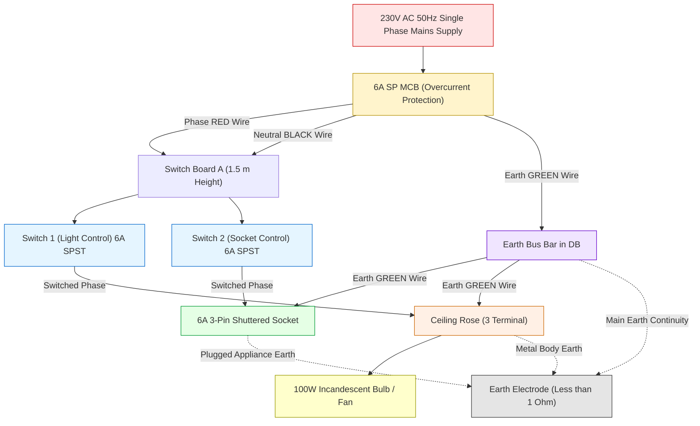
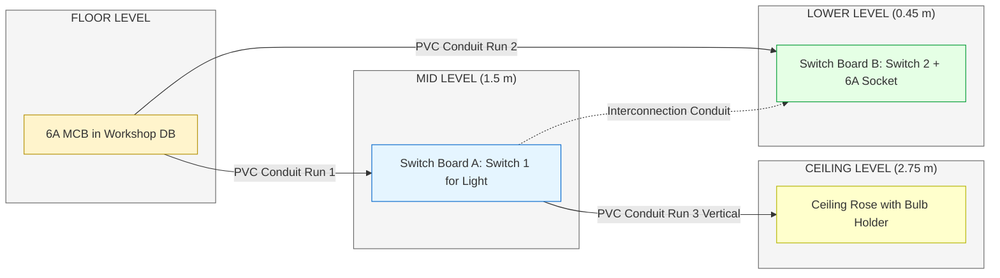
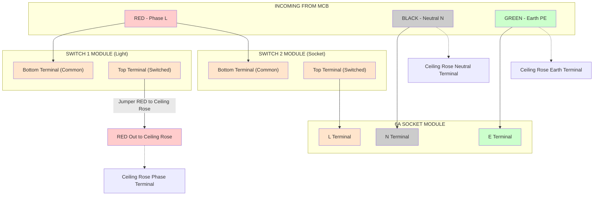
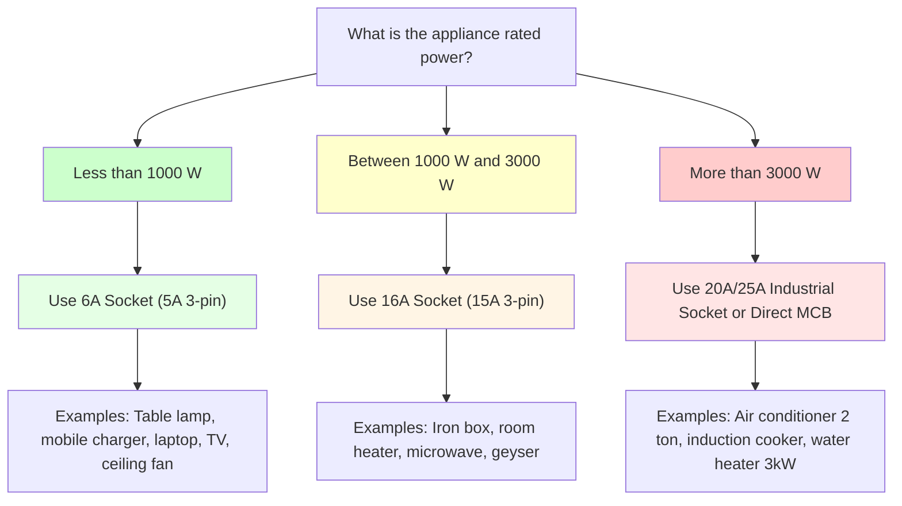
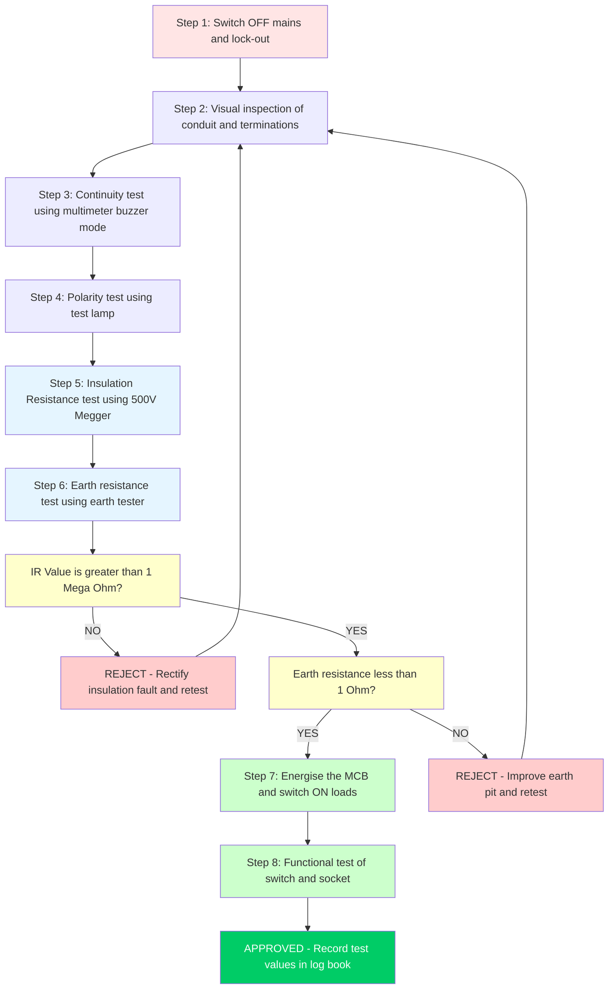
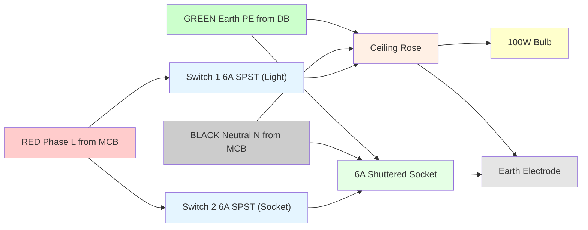

# Wiring of a simple light circuit for light/ fan point (PVC conduit wiring) and a 6A plug socket with individual control.

<!-- SECTION_1_START -->

# 🔌 Wiring of a Simple Light Circuit & 6A Plug Socket (PVC Conduit Wiring)

## 1. Core Technical Definition

### 1.1 What is a Light/Fan Point with PVC Conduit Wiring?

> [!NOTE]
> **Formal KTU Definition**
> A *Light/Fan Point* is the smallest functional sub-circuit of a domestic electrical installation in which a single lamp or ceiling fan is supplied through a control switch using a dedicated branch wiring run housed inside a **Polyvinyl Chloride (PVC) conduit**. The conduit provides mechanical protection, insulation, and a flame-retardant pathway for the current-carrying conductors as per **IS 732:2019** and **IS 4641:1968**.

### 1.2 What is a 6A Plug Socket with Individual Control?

A **6A Plug Socket (Shuttered Socket)** is a low-current receptacle rated for **6 Amperes** (typically $\le 1000\text{ W}$ load) used for plugging in small domestic appliances. *Individual control* means the socket is preceded by a dedicated **6A SPST switch** in the same switch box, allowing the user to manually switch OFF the socket when not in use, instead of relying on the main distribution board MCB.

### 1.3 Conceptual Analogy — The Building's "Nervous System" 🧠

> [!IMPORTANT]
> **The Human Body Analogy**
> - The **PVC Conduit** is the **spine/skull** — a hard protective bony tube guarding the delicate wires (nerves) inside.
> - The **Phase wire (Red)** is the **motor command** from the brain — it carries the action potential (current) to the muscle (bulb).
> - The **Neutral wire (Black)** is the **return signal** back to the brain.
> - The **Earth wire (Green)** is the **safety reflex** — it does nothing in normal operation but prevents a fatal shock if the live wire accidentally touches the metal body (like a reflex pulling your hand away from fire).
> - The **Switch** is the **decision-making conscious thought** — it allows you to voluntarily start/stop the action.
> - The **6A Socket** is a **universal power outlet** — like a USB port in a wall, accepting multiple devices one at a time.

### 1.4 Key Standard Ratings to Remember

> [!IMPORTANT]
> **Standard Ratings (BIS / ISI)**
> - Standard domestic supply in India: **230 V AC, 50 Hz, Single Phase**
> - Light point circuit current rating: **6 A (approx. 1300 W)**
> - 6A Socket current rating: **6 A (max 1000 W)**
> - Conductor size for lighting: **1.5 mm² copper (PVC insulated)**
> - Conductor size for socket: **2.5 mm² copper** (or 1.5 mm² for short runs)
> - PVC Conduit standard size: **20 mm (3/4 inch)** for lighting, **25 mm (1 inch)** for sockets
> - Earth continuity conductor: **1.0 mm² PVC insulated (Green)** — minimum as per **IS 732**
> - Maximum number of wires in 20 mm conduit: **6 wires (subject to 40% fill rule)**
> - Standard mounting height: Switches at **1.5 m**, sockets at **0.45 m**, fan regulator at **1.5 m**

---

<!-- SECTION_1_END -->

<!-- SECTION_2_START -->

# ⚙️ Deep Theoretical Analysis & KTU High-Yield Formula Sheet

## 2.1 Underlying Electrical Principles

The lighting and socket circuit operates on the **Single-Phase, 2-Wire (Phase + Neutral) with Earth (3-Wire)** system. The fundamental principles governing this workshop are:

- **Ohm's Law** governs current flow in the load:

$$
I = \frac{P}{V \cdot \cos\phi}
$$

- For purely resistive loads (incandescent bulb, heater) the **power factor** $\cos\phi = 1$, simplifying to:

$$
I = \frac{P}{V}
$$

- For a **100 W incandescent bulb** at 230 V:

$$
I = \frac{100}{230} \approx 0.435 \text{ A}
$$

- For a **75 W ceiling fan** at 230 V:

$$
I = \frac{75}{230} \approx 0.326 \text{ A}
$$

- A **6A socket** at full safe load (**1000 W**) draws:

$$
I = \frac{1000}{230} \approx 4.35 \text{ A}
$$

> [!NOTE]
> The circuit must be protected by a fuse or MCB rated at **6 A** — chosen just above the maximum expected load but below the safe current-carrying capacity of the wire (which is ~15 A for 1.5 mm² copper PVC wire in conduit).

## 2.2 The Three Golden Rules of PVC Conduit Wiring

1. **Colour Code Discipline (IS 732)** — Phase is **RED** (or any colour except black/green), Neutral is **BLACK**, Earth is **GREEN** (or **GREEN/YELLOW** striped).
2. **Switch MUST be in the Phase line** — never in the Neutral. A switch in the Neutral line leaves the bulb "live" even when OFF, causing shock risk during replacement.
3. **Loop-in / Joint-less wiring preferred** — Connections must only occur in accessible **Junction Boxes** or device terminals. No in-line taped joints are permitted inside the conduit.

## 2.3 KTU Formula & Specification Cheat Sheet

> [!IMPORTANT]
> **High-Yield Exam Table — Memorize This**

| Parameter | Symbol / Equation | Standard Value | Unit | Notes |
|---|---|---|---|---|
| Single-phase supply voltage | $V$ | 230 | V (AC) | $50\text{ Hz}$, $1\phi$ |
| Load current from power | $I = P / (V \cos\phi)$ | — | Ampere | $\cos\phi = 1$ for bulbs |
| Voltage drop in conductor | $V_d = \dfrac{2 \cdot I \cdot L \cdot \rho}{A}$ | $< 4\%$ of $V$ | Volt | $\rho = 0.0172\ \Omega\text{mm}^2/\text{m}$ for Cu |
| Cross-sectional area of wire | $A$ | $\ge 1.5$ (light) / $2.5$ (socket) | mm² | As per **IS 3961** |
| Conduit internal fill area | $A_{fill}$ | $\le 40\%$ of $A_{conduit}$ | mm² | As per **IS 4641** |
| Total conduit length (with bends) | $L_{actual}$ | $\le 12$ m (1 draw-in) | m | Use draw boxes for $> 12$ m |
| Earthing resistance | $R_e$ | $\le 1$ (for socket) | $\Omega$ | Earth pit + G.I. pipe |
| Switch rating | — | 6 A / 16 A | A | Must match load |
| Socket rating | — | 6 A (3-pin) | A | Shuttered type |
| Mounting height — switch | $h_s$ | 1.5 | m | From floor level |
| Mounting height — socket | $h_{sk}$ | 0.45 | m | From floor level |
| Mounting height — fan | $h_f$ | 2.5 to 2.75 | m | Blade sweep clearance |
| Number of bends in one run | $n$ | $\le 3$ (or $270°$ total) | — | Beyond this use inspection bend |
| Conduit size (lighting) | $D$ | 20 | mm | 3/4 inch nominal |
| Conduit size (socket) | $D$ | 25 | mm | 1 inch nominal |
| Minimum bend radius | $r$ | $\ge 6D$ | mm | Prevents insulation damage |
| Standard colour: Phase | — | RED | — | Or any except black/green |
| Standard colour: Neutral | — | BLACK | — | Always black |
| Standard colour: Earth | — | GREEN | — | Or Green/Yellow stripe |
| Fuse/MCB rating | — | 6 A | A | For 1.5 mm² Cu wire |
| Max load on 6A socket | $P_{max}$ | 1000 | W | Approx $4.35\text{ A}$ |

## 2.4 Real-World Engineering Utility

> [!NOTE]
> **Where this wiring is used in industry & society:**
> - All domestic residences (bedrooms, halls, kitchens) — 230 V lighting and small appliance circuits.
> - Hotel guest rooms, hospital wards, hostels — where individual control + safety isolation is needed.
> - Office cabins and small shops — for table lamps, laptop chargers, table fans.
> - **Why not a single common switch?** Because every appliance must be independently controllable for energy savings (BEE Star rating compliance) and safety.
> - **Why PVC conduit and not flexible casing?** PVC conduit offers better mechanical strength, fire retardancy, longer life, and easy wire replacement using a draw wire (fish tape) — a direct application of **BIS regulation IS 4641**.

---

<!-- SECTION_2_END -->

<!-- SECTION_3_START -->

# 🛠️ Step-by-Step Wiring Procedure, Tools, Components & Hardware Sequence

## 3.1 Required Tools & Instruments

> [!IMPORTANT]
> **Tools Profile — Workshop Standard**

| Sl. No. | Tool / Instrument | Specification | Purpose |
|---|---|---|---|
| 1 | Screwdriver set | Insulated, 1000 V rated, 4 mm & 6 mm blade | Tightening terminals |
| 2 | Combination pliers | 200 mm, insulated handle | Cutting & skinning wires |
| 3 | Wire stripper | Adjustable, 0.5–6 mm² | Stripping PVC insulation |
| 4 | Insulation tester (Megger) | 500 V DC | Insulation resistance test |
| 5 | Earth tester | 3-terminal digital | Earth resistance measurement |
| 6 | Multimeter (DMM) | True RMS, 600 V CAT III | Voltage / continuity test |
| 7 | Test lamp (Tinier) | Neon indicator 230 V | Phase / neutral detection |
| 8 | PVC conduit cutter | Ratchet type, up to 32 mm | Cutting PVC conduit cleanly |
| 9 | Conduit bender (spring type) | For 20 / 25 mm | Making $90°$ bends without kinks |
| 10 | Hacksaw with fine blade | 24 TPI | Cutting conduit & PVC box |
| 11 | Measuring tape | 3 m steel | Layout marking |
| 12 | Spirit level | 300 mm | Levelling switch boards |
| 13 | Drilling machine | 0–10 mm chuck, 230 V | Drilling wall for saddles |
| 14 | Draw wire (fish tape) | 15 m, steel | Pulling wires through conduit |
| 15 | Personal safety: Gloves, goggles | ISI marked | Body & eye protection |

## 3.2 Required Components & Materials

| Sl. No. | Component | Specification | Qty (for 1 light + 1 socket) |
|---|---|---|---|
| 1 | PVC conduit | 20 mm, heavy gauge, IS 2509 | 6 m |
| 2 | PVC conduit bends | 20 mm, $90°}$ long radius | 4 nos. |
| 3 | Couplers | 20 mm PVC | 6 nos. |
| 4 | PVC switch box (modular) | 4-module, 6"×4" | 1 no. (for switch + socket) |
| 5 | Switch box for light | 6"×6" PVC | 1 no. (near door) |
| 6 | Ceiling rose | 3-terminal, 6 A, ISI | 1 no. |
| 7 | Batten holder / Bracket lamp | 6 A, ISI marked | 1 no. |
| 8 | Switch 6 A SPST | 6 A, 230 V, modular | 2 nos. (one for bulb, one for socket) |
| 9 | Socket 6 A 3-pin | 6 A, shuttered, modular | 1 no. |
| 10 | PVC insulated Cu wire (Phase) | 1.5 mm² RED | 12 m |
| 11 | PVC insulated Cu wire (Neutral) | 1.5 mm² BLACK | 12 m |
| 12 | PVC insulated Cu wire (Earth) | 1.0 mm² GREEN | 12 m |
| 13 | Saddle clips | 20 mm PVC, spacer type | 12 nos. |
| 14 | PVC adhesive (solvent cement) | 100 ml, ASTM D 2564 | 1 tin |
| 15 | Insulation tape | PVC black, 0.13 mm thick | 1 roll |
| 16 | Wood screws | $1"$ no. 6, brass | 30 nos. |
| 17 | Rawl plugs / Wall plugs | 6 mm nylon | 30 nos. |
| 18 | Junction box | 4-way, 20 mm, PVC | 2 nos. |

## 3.3 Pre-Wiring Layout & Circuit Planning

Before cutting any wire, the **wiring layout diagram** must be drawn. The standard sequence of equipment in a domestic circuit (loop-in system) is:

$$
\underbrace{\text{Meter}}_{\text{kWh}} \;\to\; \underbrace{\text{DB}}_{\text{Distribution Board}} \;\to\; \underbrace{\text{MCB}}_{6\text{A}} \;\to\; \underbrace{\text{Switch Board}}_{\text{Light/Socket}} \;\to\; \underbrace{\text{Load}}_{\text{Bulb/Fan}}
$$

For a **single light + single 6A socket** workshop job, the layout is:

1. **Main Switch / MCB (6 A)** in the workshop switch board.
2. **Ceiling rose** at the bulb location (top of wall / ceiling).
3. **Switch board (near door)** containing: Switch-1 (for light) + Switch-2 + Socket-1 (individually controlled 6A socket).
4. **PVC conduit runs** connecting MCB → Switch board → Ceiling rose, with the socket wired off the switch board.

## 3.4 Step-by-Step Wiring Procedure (Exhaustive, No Steps Skipped)

> [!IMPORTANT]
> **Workshop Procedure — 14 Sequential Steps**

### **STEP 1 — Switch off the mains supply at the workshop main isolator.**
Verify using a **test lamp (tinier)** that no voltage is present on the outgoing terminals. This is mandatory **Lock-Out Tag-Out (LOTO)** practice.

### **STEP 2 — Mark the conduit layout on the wall.**
Using a chalk/marker and spirit level, mark:
- Vertical drop from ceiling rose → switch board level (1.5 m).
- Horizontal run from switch board to socket position (0.45 m).
- Path from MCB board to the switch board entry point.
- Maintain $90°}$ at all corners; do not allow sharp bends (min. bend radius = $6 \times 20 = 120\text{ mm}$).

### **STEP 3 — Drill holes and fix saddle clips.**
Drill 6 mm wall plugs at 600 mm intervals along the marked path. Fix PVC spacer-type saddle clips using $1"$ brass screws. Ensure clips hold the conduit snugly but do not compress it.

### **STEP 4 — Cut the PVC conduit to required lengths.**
Measure each segment carefully. Use a **ratchet PVC cutter** or hacksaw with the conduit held in a vice. **Deburr both ends** using a reamer or knife to remove internal sharp edges (sharp edges can cut insulation when drawing wires).

### **STEP 5 — Make the bends.**
Insert a **spring bender** of matching size inside the conduit, then bend it slowly by hand over your knee or in a vice to a maximum of $90°}$ at a time. Pull out the spring. The conduit must remain round (no kinks or ovalisation).

### **STEP 6 — Lay the conduit and join using solvent cement.**
Apply a thin, even coat of **PVC solvent cement (ASTM D 2564)** on both the conduit end and the inside of the coupler. Push together with a $1/4$ turn, hold for 10 seconds. Cement cures in 60 seconds. Fix the assembly into the saddle clips. **Do not run wires through wet, uncured joints** — wait 5 minutes.

### **STEP 7 — Draw wires through the conduit using a fish tape.**
Steps for a 3-wire (Phase + Neutral + Earth) run:
1. Push the **fish tape (draw wire)** into one end of the conduit until it emerges from the other end.
2. Strip ~30 mm of insulation from the 3 wires at one end, **twist them tightly together**, and **hook them to the loop of the fish tape** with insulation tape.
3. Apply **cable pulling lubricant** (soap solution) if the run is long.
4. Pull the fish tape steadily from the other end. Have a helper feed the wires from the back to prevent snagging.
5. Leave at least **150 mm of spare wire** at each end (inside the box) for termination.
6. Repeat for the second run (switch board → ceiling rose).

### **STEP 8 — Mount the switch boxes and ceiling rose base.**
Fix the **4-module PVC switch box** at 1.5 m and the **6"×6" switch box** at light switch position using brass screws into wall plugs. Mount the **ceiling rose base** at the bulb location. Ensure all boxes are flush and level.

### **STEP 9 — Identify and tag the wires.**
Using the **colour code**:
- **RED** wire = Phase (Line / Live)
- **BLACK** wire = Neutral
- **GREEN** (or **GREEN/YELLOW**) wire = Protective Earth (PE)

Tag each wire at both ends with numbered tape for easy identification.

### **STEP 10 — Terminate wires in the switch board (Socket Control).**
Inside the **4-module switch board**:
- Connect the incoming **RED (Phase)** to the **bottom common terminal of Switch-2 (socket switch)**.
- Connect a **jumper wire (RED, 1.5 mm²)** from the **top terminal of Switch-2** to the **"L" (Line) terminal of the 6A socket**.
- Connect the incoming **BLACK (Neutral)** directly to the **"N" terminal of the socket**.
- Connect the incoming **GREEN (Earth)** to the **"E" terminal of the socket**.

### **STEP 11 — Terminate wires in the switch board (Light Control).**
Inside the **6"×6" switch board** (or adjacent module):
- Connect the incoming **RED (Phase)** to the **bottom common terminal of Switch-1 (light switch)**.
- Connect a **jumper RED wire** from the **top terminal of Switch-1** to the **phase terminal of the ceiling rose** (at the far end of the conduit run).
- Connect the incoming **BLACK (Neutral)** to the **neutral terminal of the ceiling rose** (and also loop it onward if more lights are on the same circuit).
- Connect the incoming **GREEN (Earth)** to the **earth terminal of the ceiling rose / metal bracket holder**.

### **STEP 12 — Terminate wires at the ceiling rose and bulb holder.**
At the **ceiling rose** (3 terminals):
- **Top center terminal (P)** = incoming switched Phase from switch-1.
- **Two outer terminals (N1, N2)** = Neutral connections (one from source, one to load).
- If using a **PVC batten holder with lamp**, connect the switched Phase to the **center contact** of the holder and Neutral to the **threaded shell**. Earth (if any) to the metal body terminal.

### **STEP 13 — Inspect, continuity test, and insulation test.**
Before switching ON:
1. **Visual inspection** — check no copper is exposed outside terminals, no loose strands, all screws tight.
2. **Continuity test** using a **multimeter (buzzer mode)** — verify that the switch toggles open/close correctly, neutral is continuous from source to load, earth is continuous.
3. **Insulation Resistance (IR) test** using a **500 V Megger** between Phase-Earth and Neutral-Earth. **Minimum acceptable IR = 1 MΩ (or 0.5 MΩ as per older IS)**. Record the value.

$$
IR_{Phase\text{-}Earth} \ge 1\ \text{M}\Omega \quad ; \quad IR_{Neutral\text{-}Earth} \ge 1\ \text{M}\Omega
$$

4. **Polarity test** using a test lamp — verify that the switched wire in the switch is the Phase (lamp glows between switched wire and earth when switch is ON).

### **STEP 14 — Energize and test.**
Switch ON the **main MCB**, then test:
- Switch-1 → Bulb turns ON/OFF.
- Switch-2 → Socket becomes live / dead as toggled.
- Plug a 60 W table lamp into the socket to verify socket is functional.
- Measure **socket voltage** with multimeter: should read **$230 \text{ V} \pm 10\%$ (i.e., 207 V to 253 V)**.
- Touch a **neon tester** to the metal body of any appliance plugged into the socket — it should **NOT** glow (confirming earth is present and not live).

## 3.5 Special Considerations for 6A Socket Wiring

> [!WARNING]
> **Pitfall — The 6A socket MUST have its earth terminal connected.**
> If the appliance develops a fault and the earth is missing, the metal body becomes live at 230 V. Touching it is **fatal**. A 3-pin socket without earth is a **life-threatening violation** of IS 732.

- The socket must be **shuttered** (child-safe) as per latest BIS amendment.
- The switch controlling the socket must be **double-pole (DP)** for sockets used in **bathrooms / wet areas**, but a **single-pole (SP)** switch is acceptable for general dry locations (bedrooms, halls).
- The socket must be **earthed through a dedicated earth wire** run back to the **earth bus bar** in the distribution board — not just earthed locally to a water pipe.

## 3.6 Sample Conduit Fill Calculation

> [!IMPORTANT]
> **KTU-Style Numericals — Always Asked**

**Q: Three 1.5 mm² PVC insulated copper wires (OD = 3.0 mm each) are to be drawn through a 20 mm PVC conduit. Check if this complies with the 40% fill rule.**

**Solution:**

**Step 1 — Cross-sectional area of each wire:**

$$
A_{wire} = \dfrac{\pi}{4} \cdot d^2 = \dfrac{\pi}{4} \cdot (3.0)^2 = 7.07\ \text{mm}^2
$$

**Step 2 — Total area occupied by 3 wires:**

$$
A_{total\ wires} = 3 \times 7.07 = 21.21\ \text{mm}^2
$$

**Step 3 — Internal area of 20 mm conduit (ID ≈ 17.0 mm):**

$$
A_{conduit} = \dfrac{\pi}{4} \cdot (17.0)^2 = 226.98\ \text{mm}^2
$$

**Step 4 — Conduit fill ratio:**

$$
\text{Fill \%} = \dfrac{21.21}{226.98} \times 100 = 9.35\%
$$

**Step 5 — Verdict:**

$$
9.35\% \le 40\% \;\;\Longrightarrow\;\; \text{COMPLIANT} \;\; \checkmark
$$

If the total fill had exceeded 40%, the student would need to use the next higher conduit size (25 mm) or reduce the number of wires per run.

---

<!-- SECTION_3_END -->

<!-- SECTION_4_START -->

# 🗺️ Structural Diagrams & Schematics

## 4.1 Complete Circuit Schematic (Mermaid Block Diagram)

The following Mermaid block diagram shows the **functional flow** of the circuit from supply MCB through switches to the loads.

## 4.2 Physical Layout — Plan View of the Workshop Job

The following block diagram shows the **physical placement** of components on a wall in the workshop.

## 4.3 Wiring Sequence Inside the Switch Board (Terminal-Level Block View)

## 4.4 Decision Tree — When to Use 6A vs 16A Socket

## 4.5 Sequential Test Procedure Flowchart

---

<!-- SECTION_4_END -->

<!-- SECTION_5_START -->

# 📝 KTU 2024 Scheme Examination Question Bank & Topic Recap

## 5.1 Part A — Short Answer Questions (3 Marks Each)

> **Instruction:** Answer in 3–4 sentences with a neat sketch where applicable. Each carries 3 marks as per KTU 2024 scheme.

### **Q1. Define PVC conduit wiring. List any four advantages of PVC conduit wiring over casing-capping wiring.**

`[KTU University Exam – Dec 2023]`

**Model Answer (3 marks):**

> [!NOTE]
> **Definition (1 mark):** PVC conduit wiring is a system of wiring in which PVC-insulated wires are drawn through heavy-gauge rigid PVC pipes (conduits) of 20 mm or 25 mm diameter, fixed to walls using PVC saddle clips, as per **IS 4641**.

**Any four advantages (2 marks — ½ mark each):**
1. Superior **mechanical protection** for wires — resistant to impact, rodents, and nails.
2. **Moisture-proof and corrosion-resistant** — suitable for damp locations.
3. **Flame retardant** — does not support combustion; safer in case of fire.
4. **Easy maintenance** — wires can be withdrawn and re-drawn using fish tape if they get damaged.
5. **Neat appearance** and longer service life (> 25 years).
6. Provides a **continuous earth path** through the conduit if metal fittings are used.

---

### **Q2. Why must a switch always be connected in the Phase (Live) wire and never in the Neutral wire?**

`[KTU University Exam – July 2024]`

**Model Answer (3 marks):**

> [!NOTE]
> A switch must be connected in the **Phase (Live) line** so that when it is in the OFF position, the load (bulb/socket) is completely disconnected from the high-voltage supply. **(1 mark)**
>
> If a switch is wrongly placed in the **Neutral line**, the load remains connected to the Phase even when the switch is OFF, leaving the appliance "**live at 230 V**". **(1 mark)**
>
> This creates a serious **electric shock hazard** when the user attempts to replace a bulb or open the appliance for repair, as touching the live terminal can be fatal. **(½ mark)**
>
> This is explicitly mandated by **IS 732 (Code of Practice for Electrical Wiring Installations)**. **(½ mark)**

---

## 5.2 Part B — Long Answer Questions (14 Marks Each)

> **Format:** Module-internal choice pattern. **Answer ANY ONE FULL QUESTION** from each module. Each question has sub-parts (a) 7 marks and (b) 7 marks.

### **Question A (14 Marks)**

`[KTU University Exam – Dec 2023, Model Paper]`

#### **Q.A (a) — 7 Marks — Understand Level**

**Draw a neat wiring diagram for a single light point and a 6A socket outlet controlled by an individual switch, using PVC conduit wiring. Label all components, the colour code of wires, and indicate the conduit path.**

**Model Solution:**

**Valuation Key:**

- **[Sketch showing MCB → Switch Board (1 switch for light + 1 switch for socket) → Ceiling Rose with bulb; 6A socket; PVC conduit connecting them: 3 Marks]**
- **[Correct colour coding — Phase RED, Neutral BLACK, Earth GREEN: 1 Mark]**
- **[Switch shown in the Phase line (not Neutral): 1 Mark]**
- **[Earth wire shown connected to socket earth terminal: 1 Mark]**
- **[Conduit path shown with saddle clips and bends labelled: 1 Mark]**

#### **Q.A (b) — 7 Marks — Apply Level**

**List the tools and materials required for the above wiring job. Explain the function of any five key tools.**

**Model Solution:**

**Valuation Key:**

- **[Neat tabulated list of at least 8 tools and 8 materials with specifications: 3 Marks]**
- **[Correct function explained for any 5 tools — 1 mark each × 4 = 4 Marks]**

**Tabulated List (3 marks):**

| Sl. | Tool / Material | Specification |
|---|---|---|
| 1 | PVC Conduit | 20 mm, heavy gauge, IS 2509 |
| 2 | Switch box (modular) | 4-module, PVC |
| 3 | Ceiling rose | 3-terminal, 6 A |
| 4 | 6A SPST switch | 230 V, modular |
| 5 | 6A 3-pin socket | Shuttered type |
| 6 | Cu wire 1.5 mm² | RED (Phase) / BLACK (Neutral) |
| 7 | Cu wire 1.0 mm² | GREEN (Earth) |
| 8 | Saddle clips | 20 mm PVC, spacer type |
| 9 | Combination pliers | 200 mm insulated |
| 10 | Megger | 500 V DC |
| 11 | Fish tape | 15 m steel |
| 12 | Conduit bender | Spring type for 20 mm |

**Function of 5 key tools (4 marks):**

1. **Combination pliers (200 mm, insulated):** Used to cut wires to length, strip insulation by scoring, grip terminals while tightening, and twist stranded conductors together.
2. **Insulation tester (500 V Megger):** Applies a high DC voltage (500 V) between conductors and earth to measure the **insulation resistance** in mega-ohms. A reading < 1 MΩ indicates a deteriorated or damaged insulation — a potential leakage / shock hazard.
3. **PVC conduit bender (spring type):** A flexible steel spring inserted inside the conduit allows it to be bent smoothly to 90° without kinking or flattening, preserving the internal cross-section for easy wire drawing.
4. **Fish tape (draw wire, 15 m steel):** A flexible steel tape pushed through the conduit run; wires are hooked to its loop and pulled through from the opposite end, enabling the wires to traverse long, multi-bend conduit runs.
5. **Neon test lamp (Tinier):** A screwdriver-shaped 230 V indicator with a series resistor and neon bulb. When touched to a live conductor, it glows, allowing the electrician to **identify the Phase wire** and confirm presence/absence of supply before commencing work.

---

### **Question B (14 Marks) — Alternative Choice**

`[KTU University Exam – July 2024, Model Paper]`

#### **Q.B (a) — 7 Marks — Understand + Apply**

**Explain the step-by-step procedure to wire a single light point and a 6A socket outlet using PVC conduit wiring. Mention the safety precautions observed at each stage.**

**Model Solution:**

**Valuation Key:**

- **[Mentioning isolation / LOTO of mains supply: 1 Mark]**
- **[Layout marking and conduit fixing procedure: 1 Mark]**
- **[Conduit cutting, bending, and joining using solvent cement: 1 Mark]**
- **[Wire drawing using fish tape: 1 Mark]**
- **[Termination sequence at switch board, socket, and ceiling rose: 1 Mark]**
- **[Pre-commissioning tests (continuity + insulation + polarity): 1 Mark]**
- **[Safety precautions summarized: 1 Mark]**

**Step-by-step procedure (5 marks, key points):**

1. **Isolate the mains supply** at the workshop main switch and apply lock-out. Verify dead condition using a test lamp.
2. **Mark the conduit layout** on the wall using chalk and spirit level, ensuring 90° bends and minimum 6D bend radius.
3. **Drill and fix saddle clips** at 600 mm intervals; fix switch boxes and ceiling rose base.
4. **Cut and bend the PVC conduit** to size; join with PVC solvent cement; allow 5 minutes curing time.
5. **Draw the 3 wires (RED, BLACK, GREEN)** through the conduit using a fish tape. Leave 150 mm spare at each end.
6. **Terminate in switch board:** Phase (RED) to switch commons; Neutral (BLACK) directly to socket N and ceiling rose N; Earth (GREEN) to socket E and ceiling rose E; switched Phase from switch top to socket L and ceiling rose P.
7. **Terminate at ceiling rose:** P to center terminal, N to outer terminal, E to body terminal.
8. **Test the wiring:** Continuity, Polarity, and Insulation Resistance (> 1 MΩ) using multimeter and Megger.
9. **Energize and test:** Switch ON MCB, then test bulb ON/OFF, socket voltage, and earth continuity.

**Safety precautions (2 marks):**

- Always use **insulated tools (1000 V rated)**.
- **Never work on live circuits** — confirm dead with tester before touching.
- Wear **insulating rubber gloves and safety shoes**.
- Ensure **proper earthing** of metal-bodied sockets and appliances.
- **Do not overload** the 6A socket beyond 1000 W.
- Use only **ISI-marked components and wires**.
- **Avoid in-line taped joints** inside the conduit — all joints must be in accessible junction boxes.
- Keep **water and moisture away** from the work area.
- After completing, **insulate all exposed conductors** with PVC tape.

#### **Q.B (b) — 7 Marks — Apply + Analyze**

**A 1.5 mm² copper PVC insulated wire is to be drawn through a 20 mm PVC conduit along with one neutral and one earth wire of the same size. Each wire has an outer diameter of 3.0 mm. Check whether the conduit fill complies with the 40% rule as per IS 4641. If not, suggest a corrective action.**

**Model Solution:**

**Valuation Key:**

- **[Stating number of wires and outer diameter: 1 Mark]**
- **[Calculating total wire area: 2 Marks]**
- **[Calculating internal conduit area: 2 Marks]**
- **[Computing fill percentage and comparing with 40% rule: 1 Mark]**
- **[Correct conclusion and corrective action: 1 Mark]**

**Step 1 — Given Data:**
- Number of wires: $n = 3$ (1 Phase + 1 Neutral + 1 Earth)
- Outer diameter of each wire: $d = 3.0\text{ mm}$
- Conduit nominal size: $20\text{ mm}$ → Internal diameter: $D_i \approx 17.0\text{ mm}$

**Step 2 — Cross-sectional area of one wire:**

$$
A_{wire} = \dfrac{\pi}{4} \cdot d^2 = \dfrac{\pi}{4} \cdot (3.0)^2 = 7.07\ \text{mm}^2
$$

**Step 3 — Total area of 3 wires:**

$$
A_{wires} = 3 \times 7.07 = 21.21\ \text{mm}^2
$$

**Step 4 — Internal cross-sectional area of 20 mm conduit:**

$$
A_{conduit} = \dfrac{\pi}{4} \cdot (17.0)^2 = 226.98\ \text{mm}^2
$$

**Step 5 — Calculate fill ratio:**

$$
\text{Fill \%} = \dfrac{21.21}{226.98} \times 100 = 9.35\%
$$

**Step 6 — Compare with 40% rule (IS 4641):**

$$
9.35\% < 40\% \;\;\Longrightarrow\;\; \text{COMPLIANT with the 40% fill rule} \;\; \checkmark
$$

**Conclusion:** The 20 mm PVC conduit is **adequate** for these 3 wires. No corrective action required.

> [!WARNING]
> **KTU Examiner's Valuation Pitfall — Common Mistakes to Avoid**
> 1. **Using outer diameter of insulation (3.0 mm) but using the 20 mm nominal size directly as the internal diameter** — wrong! The internal diameter is approximately **17 mm** for standard heavy-gauge PVC conduit. Using 20 mm gives an unrealistically low fill percentage and shows lack of practical knowledge. **[−1 Mark]**
> 2. **Forgetting to include the earth wire in the count** — even though it carries no load in normal operation, it physically occupies space in the conduit and must be counted. **[−1 Mark]**
> 3. **Not stating the BIS standard** (IS 4641) when mentioning the 40% rule. Examiners expect students to cite the relevant code. **[−½ Mark]**
> 4. **Not providing a corrective action** (e.g., use 25 mm conduit or split into 2 runs) even if the calculation complies — many students stop after the calculation. The examiner's key always expects a "What if" statement. **[−½ Mark]**
> 5. **Mixing up units** (writing cm² instead of mm², or A instead of mm²) — instant loss of 1 mark.
> 6. **Drawing the wrong circuit in part (a)** — students often draw a 2-pin socket instead of 3-pin, or omit the earth wire. The 3-pin earthed socket is mandatory per IS 732. **[−2 Marks]**

---

## 5.3 Topic Recap & Important Things to Remember

> [!IMPORTANT]
> **🚀 Rapid Revision Checklist — KTU Module 2 (GZESL208)**

**1. Core Definitions:**
- A **light/fan point** is a single load (bulb or fan) controlled by one switch, wired through a **ceiling rose**.
- A **6A socket with individual control** has a dedicated 6A switch in series with the Phase line within the same switch board.
- **PVC conduit wiring** uses rigid PVC pipes (20 mm / 25 mm) to mechanically protect insulated wires, complying with **IS 4641**.

**2. Standard Indian Wiring System:**
- Voltage: **230 V, 50 Hz, single-phase, 3-wire** (Phase + Neutral + Earth).
- Distribution: **TN-S system** with separate Protective Earth (PE) and Neutral (N) conductors.

**3. Colour Code (IS 732 — MUST MEMORIZE):**
- **Phase (Line) — RED**
- **Neutral — BLACK**
- **Earth (Protective) — GREEN** (or Green/Yellow stripe)

**4. Conductor Sizing:**
- Lighting circuit: **1.5 mm² Cu**
- Socket circuit: **2.5 mm² Cu** (or 1.5 mm² for short runs < 5 m)
- Earth wire: **1.0 mm² Cu minimum** (must be the same cross-section as phase for socket circuits)

**5. Conduit Sizing Rule (40% Fill Rule as per IS 4641):**
- Total cross-sectional area of all wires $\le 40\%$ of the internal area of the conduit.
- Always keep 60% empty space to allow heat dissipation and easy wire pulling.

**6. Critical Wiring Rules:**
- **Switch ALWAYS in the Phase wire** — never in the Neutral. (Safety rule)
- **No in-line joints inside the conduit.** Use junction boxes.
- **Maximum 3 bends (270° total) per conduit run.** Use inspection bends / draw boxes for longer runs.
- **Maximum 2 m drop from ceiling rose to switch board without intermediate support.**

**7. Component Ratings:**
- Switch: **6 A / 16 A, 230 V AC**
- Socket: **6 A, 3-pin, shuttered (mandatory)**
- MCB/Fuse for 1.5 mm² circuit: **6 A**
- Ceiling rose: **6 A, 3-terminal**

**8. Mounting Heights:**
- Switch / fan regulator: **1.5 m** from floor
- Socket outlet: **0.45 m** from floor
- Ceiling fan: **2.5 to 2.75 m** from floor (with 300 mm ceiling clearance)
- Ceiling rose: at ceiling level (≈ 2.75 m)

**9. Mandatory Pre-Commissioning Tests:**
- **Continuity test** — verifies no open circuit.
- **Polarity test** — verifies switch is in Phase line.
- **Insulation Resistance (IR) test** — at 500 V DC; **IR ≥ 1 MΩ** between conductor and earth.
- **Earth resistance test** — **Rₑ ≤ 1 Ω** for socket earth, ≤ 5 Ω for lightning protection.

**10. Formula Recap (Numericals That WILL Be Asked):**

- $I = \dfrac{P}{V \cdot \cos\phi}$ — Load current from power rating.
- $V_d = \dfrac{2 \cdot I \cdot L \cdot \rho}{A}$ — Voltage drop in conductor (must be < 4% of 230 V = 9.2 V).
- $A_{wire} = \dfrac{\pi}{4} d^2$ — Cross-sectional area of a single wire.
- $\text{Fill \%} = \dfrac{n \cdot A_{wire}}{A_{conduit}} \times 100 \le 40\%$ — Conduit fill rule.

**11. Tools You MUST Be Able to Identify in the Exam:**
- Fish tape (draw wire) ✓
- Megger (Insulation tester) ✓
- Earth tester ✓
- Spring bender ✓
- Neon test lamp (Tinier) ✓
- PVC solvent cement ✓
- Combination pliers (insulated) ✓

**12. Safety Equipment Required in Workshop:**
- Insulated rubber gloves (1000 V rated)
- Safety goggles
- Insulated shoes
- Fire extinguisher (CO₂ type) nearby
- First aid kit
- LOTO (Lock-Out Tag-Out) tag

**13. Common KTU Viva Questions to Prepare:**
- *Q: What is the difference between 6A and 16A sockets?*
  **A:** 6A is for loads ≤ 1000 W (small appliances); 16A is for loads 1000–3000 W (heaters, geysers). Pin diameter differs — 16A socket has thicker pins.

- *Q: Why is the ceiling rose used instead of directly connecting the bulb?*
  **A:** Ceiling rose provides a safe, enclosed junction for the switched Phase, Neutral, and Earth wires. It also allows easy bulb replacement without touching live wires. It acts as a **load-bearing and connection hub**.

- *Q: Can we use 1.5 mm² wire for the 6A socket?*
  **A:** Yes, for short runs (< 5 m) and loads ≤ 6A. For longer runs, use 2.5 mm² to keep voltage drop below 4%.

- *Q: What is Loop-in wiring?*
  **A:** A wiring method where connections are made only at device terminals (switch, socket, ceiling rose) and the supply is "looped" from one device to the next. No intermediate joints in the conduit. This is the **mandatory** method as per IS 732.

- *Q: What happens if polarity is reversed?*
  **A:** The switch breaks the Neutral instead of the Phase. The bulb remains "live" even when OFF. Replacing the bulb is dangerous — touching the threaded shell of the holder can deliver a fatal shock.

---

<!-- SECTION_5_END -->
