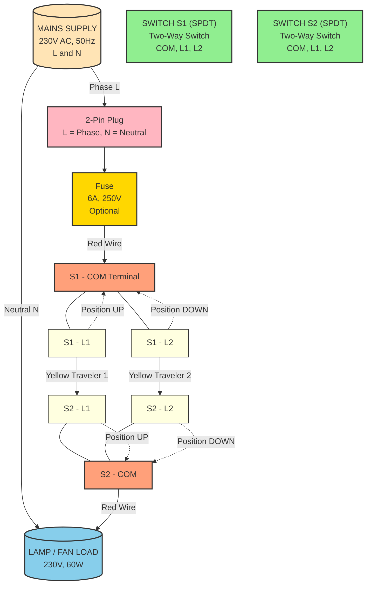
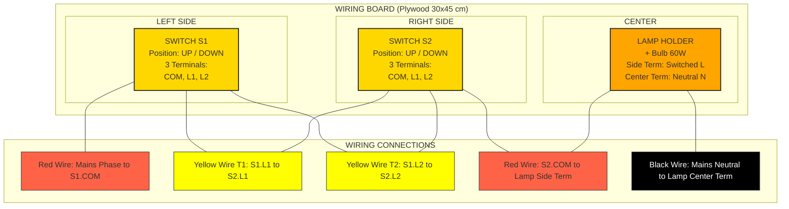

# Wiring of light/fan circuit using two-way switches. (Staircase wiring)

<!-- SECTION_1_START -->

# Wiring of Light/Fan Circuit Using Two-Way Switches (Staircase Wiring)

## 1.1 Core Technical Definition

**Staircase Wiring** is a specialized electrical wiring configuration that allows a single lamp (or fan) to be controlled independently from **two different locations** using a pair of **Two-Way Switches** (also called **SPDT switches** — Single Pole Double Throw). This is a fundamental laboratory exercise in the KTU 2024 Scheme B.Tech *Basic Electrical and Electronics Engineering Workshop* (GZESL208), where students physically wire a working model on a wiring board.

In KTU 2024 Scheme board terminology:

> [!IMPORTANT]
> **Two-Way Switch (SPDT):** A switch with **one common terminal (COM)** and **two throw terminals (L1 and L2)**. The internal contact can be toggled to connect the COM to either L1 or L2, but never to both at the same time.

> [!NOTE]
> **Staircase Circuit:** A series-parallel arrangement of two SPDT switches interconnected by a **traveler wire pair**, such that the ON/OFF state of the lamp depends only on the relative positions of both switch levers — not on which switch is pressed first.

## 1.2 Intuitive Overview & Real-World Analogy

**The "Banquet Hall Entrance/Exit" Analogy**

Imagine a long banquet hall with a door at **each end**. A chandelier hangs in the middle. You want to switch it **ON** while entering from the left door and switch it **OFF** while leaving from the right door. 

- A **simple SPST switch** won't work — you would have to walk back to the entrance every time.
- The **two-way switch** acts like a **railway signal lever**: depending on which way you throw it, the current takes **Route A** (through the upper traveler) or **Route B** (through the lower traveler).
- The lamp glows **only when current successfully completes a closed loop** from the line (Phase) through both switches back to the lamp and then to Neutral.

> [!NOTE]
> **Engineering Insight:** The same principle is extended in real buildings to **staircases** (control from ground floor and first floor), **bedrooms** (control from bed and doorway), **long corridors** (control from both ends), and **godown/warehouse lighting**.

## 1.3 Physical Constants & Standard Ratings

- **Standard Domestic Supply:** $V = 230\text{ V}$, $f = 50\text{ Hz}$, Single Phase AC (**India — IS 732 standard**).
- **Rated Current per Switch Contact:** $I_{rated} = 6\text{ A}$ to $10\text{ A}$ (resistive load).
- **Standard Wire Color Code (India, IS 732):**
  - **Phase (Line):** **Red** or **Brown**
  - **Neutral:** **Black** or **Blue**
  - **Earth:** **Green** or **Green-Yellow stripe**
  - **Traveler wires:** **Yellow** (or any color other than Phase/Neutral/Earth)

> [!VISUALIZATION CONTROL]
> **Concept:** Visualization of switch toggle positions and lamp state
> **GeoGebra / Desmos Input Equations (Logic Truth Table):**
> * Define a Boolean function: $Lamp = (S1 \oplus S2)'$ (XOR gate equivalent)
> * `f(x,y) = NOT (x XOR y)` where $x, y \in \{0, 1\}$ represent switch positions
> **Visual Description:** A 2x2 grid (Karnaugh map style) showing that the lamp is ON when both switches are in the **same logical position** (both UP or both DOWN) and OFF when they are in **opposite positions**.

## 1.4 Why This Topic Matters in KTU 2024

This is a **mandatory practical session** in GZESL208. Students are evaluated on:
1. Correct identification of **SPDT switch terminals**.
2. Drawing the **circuit diagram and wiring layout**.
3. **Physical wiring** on the wooden/ply board.
4. **Testing and verification** of the working model.
5. **Viva-voce** on safety, components, and applications.

<!-- SECTION_1_END -->

<!-- SECTION_2_START -->

# Deep Theoretical Analysis & KTU High-Yield Formula Sheet

## 2.1 Operating Principle — The "Traveler Wire" Concept

A two-way switch has **three terminals**:

$$
T_{total} = 3 \text{ terminals per switch} = 1 \text{ COM} + 2 \text{ Throws (L1, L2)}
$$

When **Switch 1 (S1)** is toggled, the COM terminal of S1 connects to either its **L1** or its **L2**. The two L-terminals of S1 are cross-connected to the two L-terminals of **Switch 2 (S2)** via two **traveler wires**. The COM of S2 feeds the **lamp**, and the COM of S1 receives the **Phase (Line)**.

### Logic State Analysis

Let $S1, S2 \in \{U, D\}$ (Up or Down position). The lamp state $L$ is:

| S1 Position | S2 Position | Current Path Continuity | Lamp State $L$ |
|-------------|-------------|-------------------------|----------------|
| U (L1) | U (L1) | Phase → S1-COM → L1 → Travel-1 → S2-L1 → S2-COM → Lamp | **ON** |
| U (L1) | D (L2) | Phase → S1-L1 → Travel-1 → S2-L1 (dead end, no return) | **OFF** |
| D (L2) | U (L1) | Phase → S1-L2 → Travel-2 → S2-L2 (dead end) | **OFF** |
| D (L2) | D (L2) | Phase → S1-L2 → Travel-2 → S2-L2 → S2-COM → Lamp | **ON** |

The mathematical truth table can be expressed using XOR logic:

$$
L = \overline{S1 \oplus S2} = (S1 \odot S2)
$$

Where $\odot$ is the **XNOR (equivalence)** operator. **The lamp is ON when both switches are in the same position.**

## 2.2 KTU Formula Sheet & Component Cheat Sheet

> [!IMPORTANT]
> All formulas below are **exam-ready** and aligned with KTU 2024 Scheme board evaluation patterns. The Greek letter $\phi$ denotes magnetic flux in motor contexts, but is **not** used in this specific switching circuit.

| Parameter | Formula / Value | Unit | Practical Use |
|-----------|-----------------|------|---------------|
| Power consumed by Lamp | $P = V \times I \times \cos\phi$ | Watts (W) | For resistive lamp load, $\cos\phi = 1$, so $P = V \times I$ |
| For purely resistive load | $P = \dfrac{V^2}{R}$ | Watts (W) | Calculating fuse/wire rating |
| Energy consumed | $E = P \times t$ | kWh (Units) | Electricity bill calculation |
| Switch contact current rating | $I_{switch} \geq 1.25 \times I_{load}$ | Ampere (A) | Safety derating factor of 25% |
| Wire current capacity (Cu, 1.5 mm²) | $I_{wire} \approx 16\text{ A}$ | Ampere (A) | Standard PVC insulated Cu wire |
| Resistance of copper wire | $R = \dfrac{\rho \times L}{A}$ | Ohm ($\Omega$) | $\rho_{Cu} = 1.72 \times 10^{-8}\ \Omega\cdot\text{m}$ at $20\degree\text{C}$ |
| Number of switches required | $N_{sw} = 2$ (for 2 locations) | — | Both must be **SPDT (Two-Way)** type |
| Number of traveler wires | $N_{travel} = 2$ | — | Connect L1↔L1 and L2↔L2 between the two switches |
| Standard AC supply | $V_{rms} = 230\text{ V}$, $f = 50\text{ Hz}$ | V, Hz | India domestic standard per **IS 732** |

> [!NOTE]
> **Syllabus Highlight:** For GZESL208, you are **not required to derive the XNOR logic**, but understanding it helps in viva-voce. The KTU board examiner expects you to **state the operating principle** and **draw the circuit diagram** correctly.

## 2.3 Engineering Real-World Applications

| Application | Reason for Two-Way Wiring |
|-------------|---------------------------|
| **Staircases (2 floors)** | Switch ON at ground floor, switch OFF at first floor — saves energy. |
| **Bedrooms** | Switch ON at door, switch OFF at bedside — convenience. |
| **Long corridors** (hostels, hospitals) | Control from both ends. |
| **Godowns & Warehouses** | Operator can switch from entry and exit gates. |
| **Garden pathways** | Light the path from the gate and switch off from the house. |
| **Three-way (multi-location) extensions** | For 3+ locations, an **intermediate switch (SPDT-DPDT crossover)** is added in series between two two-way switches. |

> [!TIP]
> **Industry Note:** In modern smart homes, the staircase wiring concept is now implemented using **smart relays (e.g., Schneider AvatarOn, Legrand MyHome)** or **IoT-based wireless switches** (Sonoff, Tuya), but the underlying **two-way switching logic** remains identical.

<!-- SECTION_2_END -->

<!-- SECTION_3_START -->

# Step-by-Step Wiring Procedure & Hardware Implementation

## 3.1 Required Components (Bill of Materials)

> [!IMPORTANT]
> The following is the **standard BOM** specified by the KTU 2024 Scheme GZESL208 laboratory manual. Quantities may vary by ±1 per college.

| Sl. No. | Component | Specification | Quantity | Purpose |
|---------|-----------|---------------|----------|---------|
| 1 | **SPDT Two-Way Switch** | 6 A, 230 V AC, ISI marked | 2 | Control the lamp from two locations |
| 2 | **Lamp Holder (B22/Bayonet)** | 6 A, 230 V | 1 | Holds the incandescent/LED bulb |
| 3 | **Incandescent Bulb / LED Bulb** | 230 V, 60 W / 9 W | 1 | Load (visual indicator of switching) |
| 4 | **PVC Insulated Copper Wire** | 1.5 mm² (Red, Black, Yellow) | As required | Phase, Neutral, Traveler connections |
| 5 | **Wooden/Ply Wiring Board** | 30 cm × 45 cm (approx.) | 1 | Mounting surface |
| 6 | **Wooden Board Connectors (Cedis)** | — | 8–10 | Holds wires on the board |
| 7 | **2-Pin Plug with Cable** | 6 A, 230 V | 1 | Mains input connection |
| 8 | **Fuse (Cartridge Type)** | 6 A, 250 V (optional) | 1 | Overcurrent protection |
| 9 | **Ceiling Rose (optional)** | 3-plate type | 1 | For fan application variant |

## 3.2 Required Tools

| Sl. No. | Tool | Use |
|---------|------|-----|
| 1 | **Wire Stripper / Knife** | Stripping insulation from conductors |
| 2 | **Insulated Screwdriver (Flat & Philips)** | Tightening terminal screws |
| 3 | **Combination Plier / Side Cutter** | Cutting wires to length |
| 4 | **Multimeter (Digital)** | Continuity & voltage testing |
| 5 | **Line Tester (Neon Screwdriver)** | Identifying Phase wire |
| 6 | **Insulation Tape (PVC)** | Insulating joints (avoid joints if possible) |
| 7 | **Soldering Iron + Lead (optional)** | Permanent joints in advanced kits |
| 8 | **Pliers (Long Nose)** | Bending wires for neat routing |

## 3.3 Step-by-Step Wiring Procedure

> [!WARNING]
> **SAFETY FIRST — KTU MANDATORY**
> 1. **Never** work on a live circuit. Always **switch OFF the MCB** before wiring.
> 2. Use **insulated tools** only.
> 3. Wear **rubber-soled footwear**.
> 4. After wiring, get it **checked by the lab instructor** before switching ON mains.
> 5. **Never** touch the neutral and phase simultaneously.

### Phase 1 — Board Preparation

1. Take the **plywood board** (≈ 30 cm × 45 cm) and lay out the components as per the layout drawing.
2. Mark positions for the **two switches** (left = S1, right = S2) and the **lamp holder** (center or one end).
3. Fix the switches and lamp holder using the **mounting screws** provided with them.
4. Fix **cedis (wooden board connectors)** along the planned wire path.

### Phase 2 — Wire Cutting and Stripping

1. Cut the following wires to approximate lengths (you will trim later):
   - **Phase wire (Red):** From plug → to S1-COM terminal.
   - **Traveler 1 (Yellow):** From S1-L1 → to S2-L1.
   - **Traveler 2 (Yellow):** From S1-L2 → to S2-L2.
   - **Switch-to-Lamp wire (Red):** From S2-COM → to lamp holder.
   - **Neutral wire (Black):** From plug → directly to lamp holder.
2. Strip **≈ 1.5 cm** of insulation from each end of every wire using the wire stripper.
3. **Twist the stranded copper** strands tightly to prevent stray filaments.

### Phase 3 — Termination (Connecting Wires to Terminals)

1. **Identify the SPDT terminals correctly**:
   - **COM (Common):** Usually the **center** terminal on the back of the switch.
   - **L1 and L2:** The **two outer** terminals. They may be marked **"1" and "2"** or shown by arrows on the back plate.
2. **S1 Connection:**
   - Connect the **Red Phase wire** from the plug into the **COM** terminal of S1. Tighten the screw firmly.
   - Connect one end of **Traveler 1 (Yellow)** to S1's **L1** terminal.
   - Connect one end of **Traveler 2 (Yellow)** to S1's **L2** terminal.
3. **S2 Connection:**
   - Connect the other end of **Traveler 1** to S2's **L1** terminal.
   - Connect the other end of **Traveler 2** to S2's **L2** terminal.
   - Connect one end of the **Switch-to-Lamp wire (Red)** to S2's **COM** terminal.
4. **Lamp Holder Connection:**
   - Connect the other end of the **Switch-to-Lamp wire (Red)** to the **lateral (side) terminal** of the lamp holder.
   - Connect the **Neutral wire (Black)** from the plug to the **center terminal** of the lamp holder.
5. **Plug Connection:**
   - Connect the **Phase wire (Red)** to the **"L" (Line)** pin of the 2-pin plug.
   - Connect the **Neutral wire (Black)** to the **"N" (Neutral)** pin of the plug.

### Phase 4 — Routing and Securing

1. Route all wires neatly along the **planned path** on the board.
2. Press the wires into the **cedis** to hold them firmly.
3. Ensure **no loose strands** of copper are protruding from any terminal.
4. Apply **PVC insulation tape** to any exposed joints (preferably avoid joints on the board).

### Phase 5 — Continuity Test (Before Mains Connection)

1. Set the **multimeter** to **Continuity / Buzzer mode** ($\Omega$).
2. Test that there is **no continuity** between the **plug's L and N pins** when both switches are in different positions (this confirms the switch is OPEN).
3. Test **continuity between the plug's L pin and the lamp holder's side terminal** when **both switches are in the same position** (e.g., both UP). The buzzer should sound.
4. Verify the **Neutral path** (plug's N pin to lamp holder's center terminal) — should always show continuity (no switch in between).

### Phase 6 — Mains Connection and Functional Test

> [!WARNING]
> Get the wiring **inspected and approved by the lab instructor** before inserting the plug into the socket.

1. Screw the **bulb** into the lamp holder.
2. Insert the **2-pin plug** into the **230 V AC mains socket**.
3. **Switch ON the MCB** on the distribution board.
4. Perform the following **four-state functional test**:

| Test # | S1 Position | S2 Position | Expected Lamp State | Observation |
|--------|-------------|-------------|---------------------|-------------|
| 1 | UP | UP | **ON** | Verify visually |
| 2 | UP | DOWN | **OFF** | Verify visually |
| 3 | DOWN | UP | **OFF** | Verify visually |
| 4 | DOWN | DOWN | **ON** | Verify visually |

5. If the lamp behaves as expected, the wiring is **correct**.
6. **Record observations** in the lab manual and get the instructor's signature.

### Phase 7 — Shutdown and Dismantling (After Lab)

1. **Switch OFF the MCB** and **remove the plug** from the socket.
2. Allow the bulb to **cool** (if incandescent).
3. Carefully dismantle the components, label them, and return to the store.

## 3.4 Common Wiring Mistakes (KTU Examiner's Pitfalls)

> [!WARNING]
> **Top reasons students lose marks in the lab:**
> 1. **Swapping the COM terminal** — students often connect Phase to an L-terminal by mistake.
> 2. **Neutral switched instead of Phase** — this is a **lethal safety violation**. The switch MUST break the Phase line, not Neutral.
> 3. **Traveler wires connected to the wrong throw terminals** (L1 to L2 cross-wired) — circuit will not work correctly.
> 4. **Loose terminal screws** — cause arcing and overheating.
> 5. **Fuse placed in the Neutral line** — defeats the purpose of protection.

<!-- SECTION_3_END -->

<!-- SECTION_4_START -->

# Structural Diagrams & Schematics

## 4.1 Circuit Diagram (Mermaid Schematic Representation)

The Mermaid block below renders a **functional topology** of the staircase wiring circuit, showing current flow paths for all four logical states. Since Mermaid cannot natively draw physical switch symbols (SPDT), the diagram below uses a **functional block architecture** approach to depict the interconnections.



## 4.2 Sequential Processing Topology — Current Flow for Each Switch Position

```mermaid
graph LR
    subgraph StateA["STATE 1: S1=UP, S2=UP -- LAMP ON"]
        P1[("Phase 230V")] --> X1["S1.COM"]
        X1 -->|"UP contact"| X2["S1.L1"]
        X2 -->|"Traveler 1"| X3["S2.L1"]
        X3 -->|"UP contact"| X4["S2.COM"]
        X4 --> X5[("LAMP GLOWS")]
        X5 --> N1[("Neutral")]
    end
    
    subgraph StateB["STATE 2: S1=UP, S2=DOWN -- LAMP OFF"]
        Y1[("Phase 230V")] --> Y2["S1.COM"]
        Y2 -->|"UP contact"| Y3["S1.L1"]
        Y3 -->|"Traveler 1"| Y4["S2.L1"]
        Y4 -->|"DOWN contact OPEN"| Y5["DEAD END"]
        Y5 -.->|"No current"| Y6[("LAMP OFF")]
    end
    
    subgraph StateC["STATE 3: S1=DOWN, S2=UP -- LAMP OFF"]
        Z1[("Phase 230V")] --> Z2["S1.COM"]
        Z2 -->|"DOWN contact"| Z3["S1.L2"]
        Z3 -->|"Traveler 2"| Z4["S2.L2"]
        Z4 -->|"UP contact OPEN"| Z5["DEAD END"]
        Z5 -.->|"No current"| Z6[("LAMP OFF")]
    end
    
    subgraph StateD["STATE 4: S1=DOWN, S2=DOWN -- LAMP ON"]
        W1[("Phase 230V")] --> W2["S1.COM"]
        W2 -->|"DOWN contact"| W3["S1.L2"]
        W3 -->|"Traveler 2"| W4["S2.L2"]
        W4 -->|"DOWN contact"| W5["S2.COM"]
        W5 --> W6[("LAMP GLOWS")]
        W6 --> N4[("Neutral")]
    end
    
    style P1 fill:#FF6347,stroke:#333
    style X5 fill:#32CD32,stroke:#333
    style Y6 fill:#808080,stroke:#333
    style Z6 fill:#808080,stroke:#333
    style W6 fill:#32CD32,stroke:#333
    style N1 fill:#4682B4,stroke:#333
    style N4 fill:#4682B4,stroke:#333
```



## 4.3 Physical Layout Diagram (Block Architecture)



## 4.4 Standard SPDT Switch Terminal Identification (ASCII Reference)

```
        FRONT VIEW              BACK VIEW (Terminals)
       ┌──────────┐            ┌─────────────────────┐
       │          │            │  L1   L2            │
       │   ●  ← Toggle         │   ●   ●             │
       │  /│\      │            │                     │
       │ / │ \     │            │      COM            │
       │/  │  \    │            │       ●             │
       │   │   ●   │            │                     │
       │   │   │   │            │                     │
       └──────────┘            └─────────────────────┘
       
       WHEN TOGGLE IS UP:    COM ↔ L1  (Circuit Closed via L1)
       WHEN TOGGLE IS DOWN:  COM ↔ L2  (Circuit Closed via L2)
```

<!-- SECTION_4_END -->

<!-- SECTION_5_START -->

# KTU 2024 Scheme Examination Question Bank & Topic Recap

## Part A — Short Answer Questions (3 Marks Each)

### Question 1 [KTU University Exam — July 2024] (CO1, Remember)

**Define a two-way switch. How is it different from a single-pole single-throw (SPST) switch?**

**Model Answer (Valuation Key — 3 Marks):**

A **two-way switch (SPDT — Single Pole Double Throw)** is a switch that has **one common (COM) terminal** and **two throw terminals (L1 and L2)**. The internal moving contact can connect the COM to either L1 or L2, but not to both simultaneously. **[Definition: 2 Marks]**

In contrast, an **SPST switch** has only **two terminals** — it can only **make or break a single circuit path** (ON/OFF), and cannot divert current to two different paths. **[Comparison: 1 Mark]**

> [!NOTE]
> **Examiner's Tip:** Always mention the full form "SPDT" along with "Two-Way Switch" to score full marks.

---

### Question 2 [KTU University Exam — Dec 2023] (CO1, Understand)

**State any three practical applications of staircase wiring in buildings.**

**Model Answer (Valuation Key — 3 Marks):**

1. **Staircase lighting** — Control a single lamp from the ground floor and first floor, allowing a person to switch ON while entering and switch OFF while exiting. **[1 Mark]**

2. **Bedroom lighting** — Control the same lamp from both the **doorway switch** and the **bedside switch** for convenience. **[1 Mark]**

3. **Long corridors** (hostels, hospitals, offices) — Provide switch control at **both ends of the corridor** to avoid walking back to a single switch. **[1 Mark]**

*(Acceptable alternate answers: godowns, garden pathways, large rooms with multiple entrances, garage lighting.)*

---

## Part B — Long Answer Questions (14 Marks Each, with Internal Choice)

### Question A [KTU University Exam — July 2024] (CO2, Apply)

**(a) Draw the neat circuit diagram of a staircase wiring circuit used to control a lamp from two different locations using two-way switches. Label all components and wires clearly. [7 Marks]**

**Model Answer — Circuit Diagram (Valuation Key — 7 Marks):**

The student should draw the following circuit diagram showing all components:

```
                    TRAVELER 1 (Yellow)
            ┌──────────────────────────────┐
            │                              │
            │     TRAVELER 2 (Yellow)      │
            │     ┌──────────────────┐     │
            │     │                  │     │
   PHASE ───┤COM  L1            L1 COM├─── LAMP ─── NEUTRAL
   (Red)   S1│ ●  ●  ─────────  ●  ●   │S2  (Load)  (Black)
            │ │                    │   │
            │ │   ●●  ─────────  ●●│   │
            │ │COM  L2            L2 COM│
            └──┴─────              ────┘
              S1                       S2
          (Switch 1)               (Switch 2)
          
   Two-Way SPDT                Two-Way SPDT
```

**Terminal Identification Table for the diagram (essential for full marks):**

| Component | Terminal | Connected To | Wire Color |
|-----------|----------|--------------|------------|
| S1 | COM | Mains Phase (via plug) | **Red** |
| S1 | L1 | S2-L1 | **Yellow** (Traveler 1) |
| S1 | L2 | S2-L2 | **Yellow** (Traveler 2) |
| S2 | L1 | S1-L1 | **Yellow** (Traveler 1) |
| S2 | L2 | S1-L2 | **Yellow** (Traveler 2) |
| S2 | COM | Lamp holder side terminal | **Red** |
| Lamp Holder | Center | Mains Neutral | **Black** |

**Valuation Key Points:**
- [Drawing Phase and Neutral clearly with labels: **1 Mark**]
- [Showing both SPDT switches with COM, L1, L2 terminals labeled: **2 Marks**]
- [Drawing the two traveler wires between the switches: **2 Marks**]
- [Showing the lamp load connected correctly to S2-COM and Neutral: **1 Mark**]
- [Color code indication and neat labeling: **1 Mark**]

---

**(b) Explain with a truth table the working of the staircase wiring circuit. What happens to the lamp in all four possible combinations of switch positions? [7 Marks]**

**Model Answer (Valuation Key — 7 Marks):**

The staircase wiring circuit works on the principle of **two traveler wires** providing two alternate paths for current flow. The lamp will glow **only when current gets a complete path** from Phase → through both switches → to Lamp → back to Neutral.

**Truth Table:**

| Sl. No. | S1 Position | S2 Position | Current Path | Lamp State |
|---------|-------------|-------------|--------------|------------|
| 1 | UP (L1) | UP (L1) | Phase → S1.COM → S1.L1 → Traveler 1 → S2.L1 → S2.COM → Lamp → Neutral | **ON (Glows)** |
| 2 | UP (L1) | DOWN (L2) | Phase → S1.COM → S1.L1 → Traveler 1 → S2.L1 → S2.L2 (open path) | **OFF (Dark)** |
| 3 | DOWN (L2) | UP (L1) | Phase → S1.COM → S1.L2 → Traveler 2 → S2.L2 → S2.L1 (open path) | **OFF (Dark)** |
| 4 | DOWN (L2) | DOWN (L2) | Phase → S1.COM → S1.L2 → Traveler 2 → S2.L2 → S2.COM → Lamp → Neutral | **ON (Glows)** |

**Key Inference:** The lamp is **ON only when both switches are in the SAME position** (both UP or both DOWN). When the switches are in **opposite positions**, the circuit is broken and the lamp is **OFF**. This is mathematically equivalent to the **XNOR (equivalence) logic function**:

$$
L_{state} = \overline{S1 \oplus S2} = S1 \odot S2
$$

**Valuation Key Points:**
- [Writing the four-state truth table correctly: **3 Marks**]
- [Identifying that lamp is ON when both switches are in the same position: **2 Marks**]
- [Stating the XNOR logic equivalence: **1 Mark**]
- [Conclusion and practical implication: **1 Mark**]

---

### Question B [Internal Choice for Question A] [KTU University Exam — Dec 2023] (CO2, Apply + Analyze)

**(a) List the components and tools required for wiring a staircase circuit on a wiring board. Explain the function of each component. [7 Marks]**

**Model Answer (Valuation Key — 7 Marks):**

| Sl. No. | Component / Tool | Specification | Function | Marks |
|---------|------------------|---------------|----------|-------|
| 1 | **SPDT Two-Way Switch (×2)** | 6 A, 230 V AC, ISI marked | To control the lamp from two different locations by selecting one of two current paths | 1.5 |
| 2 | **Lamp Holder (B22 type)** | 6 A, 230 V | To hold the incandescent/LED bulb and provide electrical connection to it | 1 |
| 3 | **Incandescent / LED Bulb** | 230 V, 60 W (or 9 W LED) | The load (visible indicator) of the circuit | 0.5 |
| 4 | **PVC Insulated Copper Wire** (Red, Black, Yellow) | 1.5 mm² stranded Cu | Red = Phase, Black = Neutral, Yellow = Traveler wires | 1 |
| 5 | **Plywood Wiring Board** | 30 cm × 45 cm | Mounting surface for the circuit assembly | 0.5 |
| 6 | **Wooden Board Connectors (Cedis)** | Standard size | To hold and route wires neatly on the board | 0.5 |
| 7 | **2-Pin Plug with Cable** | 6 A, 230 V | To connect the wiring board to the 230 V AC mains supply | 0.5 |
| 8 | **Fuse (Cartridge Type)** | 6 A, 250 V (optional but recommended) | Overcurrent protection in case of short circuit | 0.5 |
| 9 | **Multimeter / Line Tester** | Digital, 600 V rated | For continuity and voltage testing during wiring | 0.5 |
| 10 | **Insulated Screwdriver, Wire Stripper, Pliers, Side Cutter** | Standard workshop tools | For cutting, stripping, and terminating wires | 0.5 |

**Total: 7 Marks**

---

**(b) Describe the step-by-step procedure to wire a staircase circuit on a wiring board. State the safety precautions to be followed. [7 Marks]**

**Model Answer (Valuation Key — 7 Marks):**

**Step-by-Step Procedure:**

1. **Layout and Fixing:** Mark the positions of the two switches and the lamp holder on the plywood board. Fix them using mounting screws. Fix cedis along the planned wire path. **[1 Mark]**

2. **Wire Preparation:** Cut the required lengths of **Red (Phase)**, **Black (Neutral)**, and **Yellow (Traveler)** wires. Strip ≈ 1.5 cm of insulation from each end. **[1 Mark]**

3. **Identifying Switch Terminals:** Identify the **COM (center)**, **L1, and L2 (outer)** terminals of both SPDT switches by referring to the back plate markings. **[1 Mark]**

4. **S1 Wiring:** Connect the **Red Phase wire** from the mains plug to S1's **COM** terminal. Connect **Traveler 1 (Yellow)** from S1's **L1** to S2's **L1**. Connect **Traveler 2 (Yellow)** from S1's **L2** to S2's **L2**. **[1.5 Marks]**

5. **S2 and Lamp Wiring:** Connect the **Switch-to-Lamp wire (Red)** from S2's **COM** to the **side terminal** of the lamp holder. Connect the **Neutral wire (Black)** from the mains plug directly to the **center terminal** of the lamp holder. **[1.5 Marks]**

6. **Continuity Test:** Use a multimeter in **buzzer mode** to verify continuity through the lamp path when both switches are in the same position, and **no continuity** when they are in opposite positions. **[0.5 Mark]**

7. **Mains Connection and Verification:** Get the wiring **inspected by the lab instructor**. Insert the bulb, plug into mains, and verify the **four-state functional test** (both UP → ON, opposite → OFF, both DOWN → ON). **[0.5 Mark]**

**Safety Precautions (state any 4):**

- **Switch OFF the MCB** before any wiring work. **[0.25 Mark]**
- Use **insulated tools** only. **[0.25 Mark]**
- **Never touch Phase and Neutral simultaneously.** **[0.25 Mark]**
- Wear **rubber-soled footwear** and stand on a **dry surface**. **[0.25 Mark]**
- Get the wiring **verified by the instructor** before switching ON mains. **[0.25 Mark]**
- Replace **blown fuses** only with the correct rating. **[0.25 Mark]**
- Do not overload the circuit beyond the **switch's rated current**. **[0.25 Mark]**
- After completion, **switch OFF and unplug** before dismantling. **[0.25 Mark]**

**Total: 7 Marks**

---

> [!WARNING]
> **KTU Examiner's Valuation Warning / Common Pitfalls:**
> 1. **Drawing circuit without labeling terminal names (COM, L1, L2)** — loses 1–2 marks.
> 2. **Confusing SPDT with DPDT switch** in the diagram — major error.
> 3. **Placing the fuse in the Neutral line** instead of Phase — safety violation, lose 1 mark.
> 4. **Not mentioning wire color codes** — board examiners expect this.
> 5. **Omitting safety precautions** in the procedure answer — typically 0.5–1 mark deduction.
> 6. **Writing "switched off" instead of "switch OFF the MCB"** — be specific.
> 7. **Not stating the XNOR logic inference** in the truth table answer — costs a mark in higher-cognitive-level questions.
> 8. **Drawing the lamp between the two switches instead of after S2** — wrong topology.

---

## Topic Recap & Important Things to Remember

- **Staircase wiring** controls **one lamp from two locations** using **two SPDT (Two-Way) switches** and **two traveler wires**.
- **SPDT switch terminals:** **COM (common)**, **L1 (throw 1)**, **L2 (throw 2)**. The COM of S1 receives the **Phase**, the COM of S2 feeds the **Lamp**.
- **Two traveler wires** connect **S1.L1 ↔ S2.L1** and **S1.L2 ↔ S2.L2**.
- **Lamp logic:** **ON** when both switches are in the **same position** (both UP or both DOWN); **OFF** when switches are in **opposite positions**. Mathematically: $L = \overline{S1 \oplus S2}$ (XNOR).
- **Wire color code (India, IS 732):** **Red/Brown** = Phase, **Black/Blue** = Neutral, **Green** = Earth, **Yellow** = Traveler.
- **Standard supply:** $V = 230\text{ V}$, $f = 50\text{ Hz}$, single-phase AC.
- **The switch MUST break the Phase line, not the Neutral** — this is a critical safety rule.
- **Switch current rating:** Always use a switch with $I_{rated} \geq 1.25 \times I_{load}$ (25% derating).
- **Continuity test** must be performed **before** connecting to mains.
- **Fuse** is placed in the **Phase line**, rated to match or slightly exceed the load current.
- **Applications:** staircases, bedrooms, corridors, godowns, garden paths, large halls.
- **For 3+ control locations:** Add **intermediate (crossover) switches** between the two two-way switches.
- **Safety triad to remember:** **(i) MCB OFF, (ii) Insulated tools, (iii) Instructor verification before mains ON.**
- **Wire size for standard domestic lighting:** **1.5 mm² PVC Cu** (current capacity ≈ **16 A**).
- **Resistance of copper:** $R = \rho L / A$, where $\rho_{Cu} = 1.72 \times 10^{-8}\ \Omega\cdot\text{m}$ at $20\degree\text{C}$.
- **Lab Viva Quick Answers:** Staircase wiring uses **SPDT switches**; the lamp is controlled by the **relative position** of the two switches; the **traveler pair** provides the alternate path.

<!-- SECTION_5_END -->
