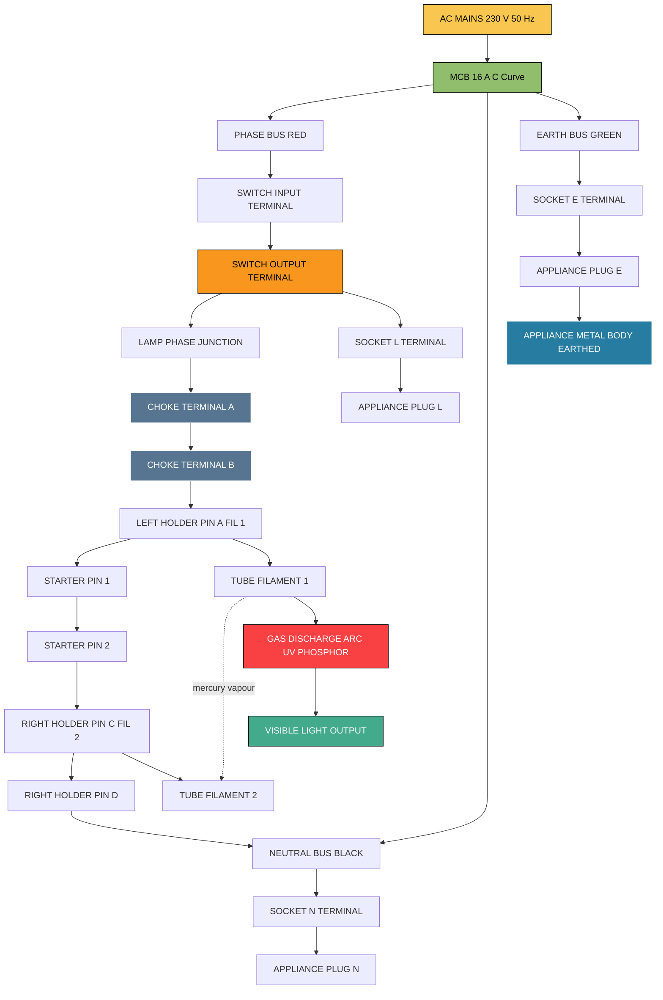
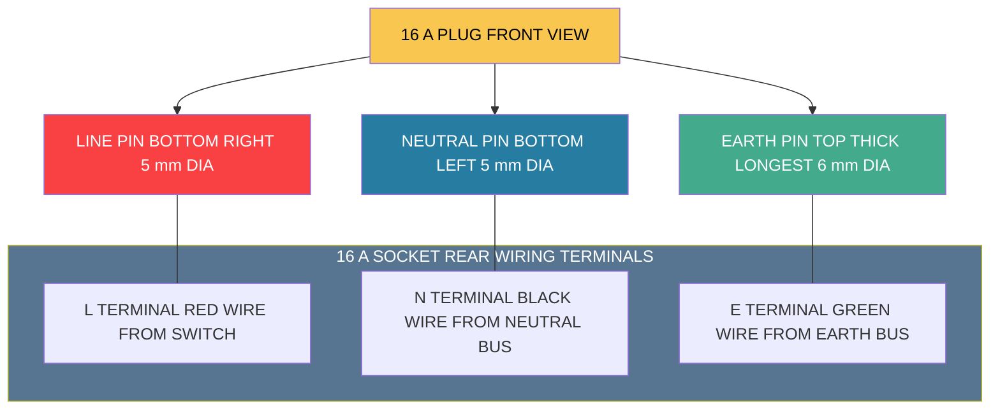

# Wiring of fluorescent lamp and a power plug (16 A) socket with a control switch.

<!-- SECTION_1_START -->
# Module 4 — Wiring of a Fluorescent Lamp & 16 A Power Plug Socket with a Control Switch

## 1.1 Formal KTU 2024 Definition

> [!IMPORTANT]
> **Fluorescent Lamp Wiring with 16 A Socket and Control Switch (KTU 2024 — GZESL208, Module 4)**
> A *single-circuit domestic / commercial wiring layout* in which a **fluorescent tube fitting** (employing a *choke ballast*, a *glow starter*, and a *tube holder*) and a **16 A, 3-pin power socket outlet** (conforming to **IS 1293**) are both controlled and protected by a common arrangement consisting of a **single-pole control switch**, suitable **PVC-insulated copper conductors**, and a **continuous earth conductor** terminated at the socket earth pin. The whole assembly is fed from a **single-phase, 230 V, 50 Hz AC** supply through an isolator / MCB.

The complete wiring essentially combines **two sub-circuits** sharing the *same phase and neutral*:
1. A **lighting sub-circuit** — switch → choke → starter → tube filaments.
2. A **power sub-circuit** — phase and neutral to the 16 A socket, with a dedicated protective earth.

---

## 1.2 Intuitive Real-World Analogy (Plain English)

Think of the fluorescent lamp circuit like a **water pipeline with a surge nozzle**:
- The **switch** is the *main tap* you open to start the flow.
- The **choke (ballast)** is a *narrow pipe* — it resists the sudden rush of current.
- The **starter** is a *pressure-triggered valve* — it lets water flow for a moment, then snaps shut, creating a *pressure surge*.
- That **pressure surge** (high voltage spike) is what pushes the gas inside the tube to start glowing — just like a sudden gush of water spins a small turbine.
- Once steady flow is established, the choke keeps the flow calm and limited, so the tube doesn't burn out.

The **16 A socket** is simply a *heavy-duty wall outlet* — like a wide-bore fuel pump nozzle — meant for high-power appliances (geyser, AC, oven, washing machine). It shares the same pipeline (mains) but has its own **earth (ground) wire** for safety, the way a metal-bodied appliance must be *electrically tied to the ground* so any leakage current safely drains away instead of shocking you.

---

## 1.3 GeoGebra / Desmos Visualization

> [!VISUALIZATION CONTROL]
> **Concept:** Phasor relationship of Supply Voltage, Tube Voltage, and Choke Voltage Drop in a Fluorescent Lamp Circuit
>
> **Desmos / GeoGebra Input Equations:**
> * Point coordinates on the complex plane:
>   * $V_{\text{supply}} = (230, 0)$ — Reference phasor along the X-axis
>   * $V_{\text{tube}} = (90, 0)$ — Tube voltage drop (real axis, lagging)
>   * $V_{\text{choke}} = (200, 60)$ — Choke drop leading by **$60°$** (inductive)
> * Resultant: $V_{\text{supply}} = \sqrt{V_{\text{tube}}^{2} + V_{\text{choke}}^{2} + 2\,V_{\text{tube}}\,V_{\text{choke}}\cos(\theta)}$
>
> **Visual Description:** On the XY-plane, the student should observe a **closed triangle** formed by the three phasors, where the **choke phasor lies above the horizontal axis** (inductive nature). The hypotenuse represents the **supply voltage of 230 V**, while the horizontal leg is the **lamp voltage (~90 V for a 40 W tube)**. This visualises the *poor power factor* (typically **0.5 lagging**) of a fluorescent lamp without a power-factor correction capacitor.

---

## 1.4 Key Components at a Glance

| S.No | Component | Function | Standard / Rating |
|------|-----------|----------|-------------------|
| 1 | Fluorescent Tube (40 W) | Light source via gas discharge | **IS 2418**, 230 V / 40 W |
| 2 | Choke (Ballast) | Limits current, generates kick voltage | 40 W matching, copper wound |
| 3 | Glow Starter | Pre-heats filaments, then opens | **IS 2215**, 110–250 V |
| 4 | Tube Holder | Mechanical + electrical contact for tube bi-pin | 2-pin rotary/locked type |
| 5 | 16 A, 3-pin Socket | Power outlet for heavy loads | **IS 1293**, 250 V, 16 A |
| 6 | 16 A, 3-pin Plug | Inlet connector to appliance | **IS 1293** matching |
| 7 | Control Switch (SPST) | ON/OFF control for lamp | 6 A / 16 A, 250 V |
| 8 | PVC Copper Wire | Phase (Red), Neutral (Black), Earth (Green) | 1.5 mm² (lamp), 2.5 mm² (socket) |
| 9 | MCB / Isolator | Short-circuit & overload protection | 16 A, C-curve |

> [!NOTE]
> **KTU 2024 — Board Exam Tip:** Whenever a question describes "wiring of fluorescent lamp with a 16 A socket", the examiner *expects* you to mention **three conductors — Phase, Neutral, and Earth (PNE)**. Skipping the earth wire is the single most common mark-deduction point.

---

<!-- SECTION_2_START -->
# 2. Deep Theoretical Analysis & KTU High-Yield Formula Sheet

## 2.1 Working Principle — Stage-by-Stage

The fluorescent lamp does **not** light up like an incandescent bulb. It needs a controlled *two-stage ignition*:

### Stage 1 — Pre-heating (Starter Closed)
1. The **control switch** is turned **ON**.
2. Current path: **Phase → Switch → Choke → Filament-1 → Starter (closed) → Filament-2 → Neutral**.
3. Both **tube filaments** (cathodes) heat up to ~**900 °C** and emit electrons via thermionic emission.
4. The **glow starter** has a bimetallic strip inside; the gas discharge inside it heats and bends the strip, **opening** the contact after ~1–2 seconds.

### Stage 2 — Ignition (Starter Opens — Inductive Kick)
1. When the starter **opens suddenly**, the current through the **choke collapses**.
2. By **Lenz's Law**, the choke (inductor) generates a high back-EMF: $V_L = -L\,\dfrac{di}{dt}$.
3. This kick voltage (typically **400–600 V**) appears across the tube.
4. The high voltage **ionises** the mercury vapour + argon gas mixture inside the tube → **avalanche of electrons** → **tube strikes and glows**.

### Stage 3 — Steady Operation
1. Once the tube conducts, its impedance drops sharply.
2. The choke now acts as a **current limiter** (reactor), maintaining stable arc current.
3. Mercury vapour emits **UV light**, which excites the **phosphor coating** on the inner wall of the tube, producing **visible white light**.

---

## 2.2 Circuit Topology & Roles

| Element | Electrical Role | Behaviour |
|---------|-----------------|-----------|
| **Switch (SPST)** | Makes / breaks the phase line | Open circuit when OFF |
| **Choke (L)** | Series inductor — limits current | Stores energy, releases as kick |
| **Starter** | Normally-closed bimetallic switch | Opens after 1–2 s of heating |
| **Tube** | Non-linear resistor (in ON state) | Voltage ~90 V for 40 W tube |
| **Capacitor (across starter)** | Suppresses radio interference + improves PF | 0.006 µF typical |
| **16 A Socket** | Parallel branch for load | Independent of lamp state |

> [!IMPORTANT]
> **Power Factor (PF) Insight:**
> A standard fluorescent lamp circuit without a power-factor correction capacitor has a **PF of ~0.5 lagging** because the choke is highly inductive. This means for the same real power, it draws **double the current** from the mains compared to a resistive load — increasing $I^2R$ line losses. KTU questions frequently test this.

---

## 2.3 KTU Formula Sheet / Cheat Sheet

> [!NOTE]
> **All formulas below are KTU 2024 high-yield — at least one of these appears in nearly every board exam from this module.**

| # | Quantity | Formula | Typical Value (40 W Tube) |
|---|----------|---------|---------------------------|
| 1 | Real Power | $P = V \cdot I \cdot \cos\phi$ | 40 W |
| 2 | Apparent Power | $S = V \cdot I$ | 80 VA |
| 3 | Reactive Power | $Q = V \cdot I \cdot \sin\phi$ | ~69 VAR |
| 4 | Power Factor | $\cos\phi = \dfrac{P}{S}$ | **0.5 lagging** |
| 5 | Choke Inductive Reactance | $X_L = 2\pi f L$ | ~250 Ω |
| 6 | Starter Kick Voltage | $V_{\text{kick}} = -L\,\dfrac{di}{dt}$ | 400–600 V |
| 7 | Tube Running Voltage | $V_{\text{tube}}$ | **~90 V** (40 W) |
| 8 | Choke Voltage Drop | $V_{\text{choke}} = \sqrt{V_{s}^{2} - V_{t}^{2}}$ | ~210 V |
| 9 | Current through Tube | $I = \dfrac{P_{\text{tube}}}{V_{\text{tube}} \cdot \cos\phi}$ | ~0.4 A |
| 10 | Line Voltage (RMS) | $V_{s}$ | **230 V, 50 Hz** |
| 11 | 16 A Socket Continuous Load | $P_{\text{max}} = V \cdot I$ | 230 × 16 = 3680 W |
| 12 | Earth Conductor Sizing Rule | $A_{\text{earth}} \geq \dfrac{A_{\text{phase}}}{2}$ | 1.5 mm² min |

**Note on table syntax:** Absolute-value notations are written as $\vert \cdot \vert$ to preserve the markdown table structure (vertical bars are not used).

---

## 2.4 Real-World Engineering Utility

- **Domestic:** 16 A sockets feed *geysers, window ACs, microwave ovens, washing machines*.
- **Commercial:** Fluorescent tubes dominate *office ceiling grids, hospital corridors, parking lots, factories* due to **higher luminous efficacy (~60 lm/W)** vs. incandescent (~12 lm/W).
- **Industrial Workshops:** This exact wiring is the *first hands-on skill* every KTU electrical-engineering student performs — the *test bench* of the trade.
- **Smart-Building Evolution:** Modern retrofit replaces the *choke + starter* pair with an **electronic ballast (HF inverter at 25–50 kHz)**, eliminating flicker, removing the starter entirely, and pushing PF to **>0.95**.

---

<!-- SECTION_3_START -->
# 3. Step-by-Step Practical Implementation

This is a **Workshop / Laboratory Topic** — the section below is a *complete instructor-grade build sheet*. Use the printed table during your lab session and the KTU exam.

## 3.1 Complete Component Pin / Terminal Configuration

| S.No | Component | Pin / Terminal ID | Connection Made To | Conductor Colour |
|------|-----------|-------------------|--------------------|------------------|
| 1 | Control Switch (SPST) | Top terminal (in) | Phase from MCB | **Red** |
| 2 | Control Switch (SPST) | Bottom terminal (out) | Choke input + Socket Phase (L) | **Red** |
| 3 | Choke (Ballast) | Terminal A | Switched Phase (out) | **Red** |
| 4 | Choke (Ballast) | Terminal B | Tube-holder Filament-1 | **Red/Black** |
| 5 | Starter Holder | Pin 1 | Tube-holder Filament-1 (one end) | **Black** |
| 6 | Starter Holder | Pin 2 | Tube-holder Filament-2 (other end) | **Black** |
| 7 | Tube Holder (left) | Pin A | Choke output | **Red** |
| 8 | Tube Holder (left) | Pin B | Starter (Pin 1) | **Black** |
| 9 | Tube Holder (right) | Pin C | Starter (Pin 2) | **Black** |
| 10 | Tube Holder (right) | Pin D | Neutral bus | **Black** |
| 11 | 16 A Socket | L (Line) | Switched Phase | **Red** |
| 12 | 16 A Socket | N (Neutral) | Neutral bus | **Black** |
| 13 | 16 A Socket | E (Earth) ⏚ | Earth bus (continuity to mains) | **Green (or Green/Yellow)** |
| 14 | Plug (16 A) | L, N, E | Matches socket identically | As above |

> [!IMPORTANT]
> **Pin-out for 16 A Plug / Socket (IS 1293):**
> The **earth pin is the longest and thickest** — it makes contact *first* on insertion and *breaks last* on removal. This is a **safety-first design** ensuring the appliance body is earthed *before* live current flows.

---

## 3.2 Required Tool Profile (Workshop Mandatory Kit)

| Tool | Specification | Purpose |
|------|---------------|---------|
| Insulated Screwdriver | Flat: 4 mm × 100 mm, Philips: PH2 | Terminal tightening |
| Wire Stripper | 0.5–6 mm² capacity | Stripping PVC insulation |
| Lineman's Plier | 200 mm, 1000 V insulated | Cutting, twisting wires |
| Neon Test Pencil (Line Tester) | 110–500 V AC range | Phase detection |
| Megger / Insulation Tester | 500 V DC | Insulation resistance test |
| Continuity Tester / Multimeter | Digital, 3½ digit | Earth continuity + short test |
| Combination Plier | 150 mm | General gripping |
| PVC Tape & Cable Ties | Standard | Insulation + dressing |

---

## 3.3 Exhaustive Step-by-Step Wiring Procedure

> Each step below is a **self-contained action** — the KTU lab rubric awards partial marks for *each correctly performed step*.

### Phase A — Pre-Assembly Safety Checks
1. **Switch off the MCB** of the test bench. Verify with the *line tester* — the tester should **not glow** at any outgoing terminal.
2. **Inspect the workboard** — confirm it is clean, dry, and has no live exposed parts.
3. **Verify all components** against the bill of materials: 1 tube, 1 choke, 1 starter, 1 starter holder, 2 tube holders, 1 SPST switch, 1 × 16 A socket, sufficient 1.5 mm² and 2.5 mm² copper wire.

### Phase B — Mechanical Mounting
4. Mount the **control switch** at the top-left of the board using the supplied screws. Tighten firmly — a loose switch will fail the *tug test*.
5. Mount the **tube holders** on the board in line, spaced to match the tube length (e.g., **1200 mm apart for a 40 W, 4 ft tube**).
6. Mount the **starter holder** adjacent to one tube holder.
7. Mount the **choke** on a *non-resonant wooden or metal plate* (it hums if loose).
8. Mount the **16 A socket** at the bottom-right of the board.

### Phase C — Wiring (the actual circuit build)
9. **Run the Phase (Red) wire** from the MCB output to the **top terminal of the SPST switch**. Crimp/screw tightly.
10. From the **bottom terminal of the switch**, run the **Red wire** in *two parallel branches*:
    - **Branch 1 →** to the **input (Terminal A) of the choke**.
    - **Branch 2 →** to the **L terminal of the 16 A socket**.
11. From the **output (Terminal B) of the choke**, run a wire to **Pin A of the left tube holder** (one filament end).
12. Run a **jumper from Pin B (left holder)** to **Pin 1 of the starter holder**.
13. Run a **jumper from Pin 2 of the starter holder** to **Pin C of the right tube holder** (other filament end).
14. Run the **Neutral (Black) wire** from the MCB neutral to a *neutral bus* (or daisy-chain):
    - To **Pin D of the right tube holder**.
    - To the **N terminal of the 16 A socket**.
15. Run the **Earth (Green) wire** from the MCB earth bar to the **E terminal of the 16 A socket**. **No earth is required at the lamp** unless the fitting is metallic, in which case earth the metal body too.
16. **Insert the starter** into the starter holder and **rotate 30°** to lock.
17. **Insert the fluorescent tube** into both holders, ensuring the *bi-pin contacts seat firmly*. Give a *gentle rotational twist* to confirm locking.

### Phase D — Inspection Before Energising
18. **Visual inspection** — tug each wire gently; check for stray strands, loose terminal screws, and exposed copper.
19. **Continuity test with multimeter (buzzer mode):**
    - Switch **OFF** → continuity between *MCB Phase* and *Switch top* should be **OPEN**.
    - Switch **ON** → continuity between *Switch top* and *Choke input* should be **CLOSED**.
    - Phase-to-Neutral should be **OPEN** (no short).
    - Phase-to-Earth should be **OPEN** (no earth leakage).
    - Earth continuity from socket earth to MCB earth bar should be **<1 Ω**.
20. **Insulation Resistance (Megger) Test:**
    - Phase-to-Earth: should read **>1 MΩ** (typically 200 MΩ+ on a healthy install).
    - Neutral-to-Earth: should read **>1 MΩ**.

### Phase E — Energising and Functional Test
21. **Inverter / lab assistant** switches ON the MCB.
22. **Test the switch** — flip ON; the tube should:
    - Flicker briefly (1–2 s) as the starter operates.
    - Settle into a *steady white glow*.
23. **Test the 16 A socket** with a *plug-in continuity tester* or a low-wattage appliance (table lamp) — appliance should power up.
24. **Test the earth** with an *earth tester* — reading should be **<5 Ω** (TN system).
25. **Record observations** in the lab manual: tube current, supply voltage, choke temperature after 10 minutes, any flicker.

---

## 3.4 Safety Monitoring Checklist (Board-Exam Favourite)

> [!WARNING]
> **KTU Examiner's Pitfall — Safety Steps:** Examiners **specifically deduct 2 marks** if the student does not mention these in the viva or record book.

| # | Hazard | Preventive Measure |
|---|--------|---------------------|
| 1 | Electric shock from live terminals | **Switch off MCB** before any wiring change; verify with line tester |
| 2 | Fire from loose terminal | **Tug-test** every screw terminal after tightening |
| 3 | Tube implosion on breakage | Wear **safety goggles** when handling the tube |
| 4 | Choke overheating | Ensure choke is **rated for the tube wattage** and mounted on a heat-sinking surface |
| 5 | Starter failure (lamp not lighting) | **Replace starter first**; if still dead, check choke with multimeter for continuity |
| 6 | Phase-Earth fault | Earth conductor **must be continuous** from socket to main earth pit; never break it |
| 7 | Reverse polarity (L and N swapped) | Use a **plug-in tester** to verify; otherwise the switch breaks Neutral instead of Phase, leaving the lamp socket "live" even when "off" |

---

<!-- SECTION_4_START -->
# 4. Structural Diagrams & Schematics

## 4.1 Complete Wiring Topology — Mermaid Block Diagram

The diagram below shows the **functional flow** from mains supply through protection, switching, lamp sub-circuit, and socket sub-circuit. Earth and neutral are routed as a parallel bus to maintain the *star-point earthing* principle.

## 4.2 Sequential Processing Topology — Lamp Ignition Stages

## 4.3 16 A Socket / Plug Pin-Out Schematic (IS 1293 Top-View)

---

<!-- SECTION_5_START -->
# 5. KTU 2024 Scheme Examination Question Bank & Topic Recap

## 5.1 Part A — Short Answer Questions (2 × 3 = 6 Marks)

### **Q1.** **[KTU University Exam — July 2024, Model Paper]** *(CO1, Remember)*
**List any six components required to wire a fluorescent lamp fitting along with a 16 A socket, and state the standard rating/specification of each.**

**Model Answer (3 Marks):**

| S.No | Component | Standard Rating |
|------|-----------|------------------|
| 1 | Fluorescent tube (TLD) | **40 W, 230 V, 4 ft** |
| 2 | Choke (ballast) | **40 W matching, copper-wound** |
| 3 | Glow starter | **IS 2215, 110–250 V** |
| 4 | Tube holder | **Bi-pin rotary locking type** |
| 5 | 16 A, 3-pin socket | **IS 1293, 250 V, 16 A** |
| 6 | PVC copper wire | **1.5 mm² for lamp, 2.5 mm² for socket** |

*Valuation Key:* [Listing 6 components: 2 marks] [Mentioning IS standards / ratings: 1 mark]

---

### **Q2.** **[KTU University Exam — Dec 2023, Retest]** *(CO2, Understand)*
**Why is a choke (ballast) used in series with a fluorescent tube? What would happen if it were replaced by a plain wire?**

**Model Answer (3 Marks):**
1. The choke is an **inductor** that limits the current through the tube once the arc strikes. Without it, the tube would draw *excessive current* and burn out. **[1 Mark]**
2. At start-up, the choke also acts as an **energy-storage element**. When the starter opens, the choke's collapsing magnetic field generates a high back-EMF of **400–600 V**, which is needed to *ionise the gas and strike the arc*. **[1 Mark]**
3. Replacing the choke with a plain wire would mean **no current limiting → tube filament/arc burns out instantly**, and the tube would fail to start. **[1 Mark]**

---

## 5.2 Part B — Long Answer Questions (Internal Choice, 1 × 14 = 14 Marks)

### **Question A — Wiring, Working & Testing** *(CO1, CO2 — Understand + Apply)*

**(a)** With the help of a neat circuit diagram, **explain the working of a fluorescent lamp circuit** with a choke and glow starter. Discuss the role of each component in detail. **[7 Marks]**

**(b)** **Draw and describe the wiring layout** of a fluorescent lamp connected in parallel with a 16 A socket through a control switch from a single-phase 230 V supply. Mention the conductor colour code, the function of the earth wire, and the step-by-step test procedure before energising. **[7 Marks]**

---

#### **Model Solution — Part (a) [7 Marks]**

**Working of Fluorescent Lamp (Stage-by-Stage):**

**Stage 1 — Pre-heating:** When the SPST control switch is closed, current flows: **Phase → Switch → Choke → Filament-1 → Starter (closed bimetallic contact) → Filament-2 → Neutral**. The two filaments heat to ~**900 °C** and begin thermionic emission. **[1 Mark]**

**Stage 2 — Starter opens:** The neon gas inside the starter glows, heating the bimetallic strip, which bends and **opens** the contact after ~1–2 s. **[1 Mark]**

**Stage 3 — Inductive kick:** With the starter open, the choke's current tries to fall. By Lenz's law, an EMF $V = -L\,di/dt$ of **400–600 V** is induced across the choke, appearing across the tube electrodes. **[1 Mark]**

**Stage 4 — Arc strikes:** This high voltage ionises the mercury vapour + argon mixture, creating a *low-resistance arc path* through the tube. **[1 Mark]**

**Stage 5 — Steady state:** The choke now acts as a current limiter, dropping the supply voltage (230 V) such that:
$$V_{\text{choke}} = \sqrt{V_s^{2} - V_{\text{tube}}^{2}} = \sqrt{230^{2} - 90^{2}} \approx 211\ \text{V}$$
The tube runs at ~**90 V** with the choke dropping the rest. **[1 Mark]**

**Stage 6 — Light emission:** Mercury atoms excited by the arc emit **UV photons**; these strike the **phosphor coating** on the inner wall, which re-emits **visible white light**. **[1 Mark]**

**Role of each component (table):** **[1 Mark]**

| Component | Role |
|-----------|------|
| Switch | Makes/breaks phase line |
| Choke | Limits current, generates kick |
| Starter | Pre-heats filaments, then opens |
| Tube | Produces light via gas discharge |
| Capacitor (across starter) | Suppresses RF interference |

---

#### **Model Solution — Part (b) [7 Marks]**

**Circuit Layout (text schematic):**

$$\text{MCB} \rightarrow \text{Phase Bus (Red)} \rightarrow \text{SPST Switch} \rightarrow \text{Splits into two parallel branches}$$

**Branch 1 (Lighting):** Switch → **Choke → Tube Holder L (Pin A) → Starter → Tube Holder R (Pin C) → Neutral Bus**

**Branch 2 (Power):** Switch → **16 A Socket (L) → [Appliance] → Socket (N) → Neutral Bus**; **Socket (E) → Earth Bus → Main Earth Pit**

**Conductor Colour Code:** **[1 Mark]**
- **Phase (Line) → Red**
- **Neutral → Black**
- **Earth (Protective) → Green or Green/Yellow striped**

**Function of Earth Wire:** The earth wire provides a *low-impedance fault path*. In case of *insulation failure* inside a metal-bodied appliance plugged into the 16 A socket, the leakage current flows to earth, *tripping the MCB* and preventing user electrocution. **[1 Mark]**

**Test Procedure Before Energising:** **[3 Marks — 1 each]**
1. **Continuity Test (Multimeter/Buzzer):** Switch OFF → open circuit from MCB phase to load. Switch ON → closed circuit. Verify Phase-Earth and Neutral-Earth are *open* (no leakage).
2. **Insulation Resistance Test (Megger, 500 V DC):** Phase-Earth and Neutral-Earth should read **>1 MΩ** (ideally 200 MΩ+).
3. **Earth Continuity Test:** Resistance from socket earth terminal to main earth pit should be **<5 Ω** (per IS 3043).

**Neat circuit diagram:** **[1 Mark]** *(Draw the schematic — see Section 4.1 Mermaid for reference topology; reproduce as a hand-drawn schematic in the answer sheet.)*

---

### **Question B — Testing, Fault Diagnosis & Power-Factor Analysis** *(CO2, CO3 — Apply + Analyse)*

**(a)** **Explain in detail the step-by-step procedure to test and commission** a freshly wired fluorescent-lamp + 16 A socket circuit on a workbench, including all safety checks and the expected meter readings. **[7 Marks]**

**(b)** A 40 W fluorescent lamp operates at **230 V, 50 Hz** with a power factor of **0.5 lagging**. Calculate: (i) the current drawn, (ii) the apparent power, (iii) the reactive power, and (iv) the value of the power-factor correction capacitor required to raise the PF to **0.95 lagging**. **[7 Marks]**

---

#### **Model Solution — Part (a) [7 Marks]**

**Pre-Commissioning Visual Inspection:** **[1 Mark]**
- Confirm all terminal screws are tight; no stray copper strands; conductor colours follow PNE code; choke and starter correctly inserted.

**Electrical Tests (Bench Multimeter + Megger):** **[3 Marks]**
1. **Continuity Test (Buzzer):** Verify the switched phase is continuous from MCB to choke and to socket L terminal; verify neutral bus continuity. Earth must be continuous from socket to main earth.
2. **Insulation Resistance (Megger at 500 V DC):** Phase-Earth, Neutral-Earth each > 1 MΩ.
3. **Earth Resistance (Earth Tester):** < 5 Ω.

**Functional Test:** **[2 Marks]**
- Energise the MCB. Turn on the control switch.
  - **Observation 1:** Tube flickers for 1–2 s, then glows steadily → choke, starter, tube, switch all healthy.
  - **Observation 2:** Insert a plug-in tester into the 16 A socket → all three LEDs (L, N, E) lit correctly.
  - **Observation 3:** Plug a test load (e.g., 100 W lamp) → operates normally.

**Safety Sign-Off:** **[1 Mark]** Tag the workboard with date, student name, instructor sign, and an "APPROVED FOR USE" sticker.

---

#### **Model Solution — Part (b) [7 Marks]**

**Given:** $P = 40$ W, $V = 230$ V, $\cos\phi_1 = 0.5$ lagging, $f = 50$ Hz, target $\cos\phi_2 = 0.95$ lagging.

**(i) Current drawn:** **[1 Mark]**
$$I = \frac{P}{V \cdot \cos\phi_1} = \frac{40}{230 \times 0.5} = \frac{40}{115} = 0.3478\ \text{A} \approx 0.348\ \text{A}$$

**(ii) Apparent Power:** **[1 Mark]**
$$S = V \cdot I = 230 \times 0.348 = 80.04\ \text{VA} \approx 80\ \text{VA}$$

**(iii) Reactive Power:** **[1 Mark]**
$$\phi_1 = \cos^{-1}(0.5) = 60° \Rightarrow \sin\phi_1 = 0.866$$
$$Q_1 = V \cdot I \cdot \sin\phi_1 = 230 \times 0.348 \times 0.866 = 69.3\ \text{VAR}$$

**(iv) Power-Factor Correction Capacitor:** **[3 Marks]**
First, $\phi_2 = \cos^{-1}(0.95) = 18.19° \Rightarrow \tan\phi_2 = 0.3287$.

Required reactive power to be supplied by the capacitor:
$$Q_C = P \cdot (\tan\phi_1 - \tan\phi_2) = 40 \times (1.732 - 0.3287) = 40 \times 1.4033 = 56.13\ \text{VAR}$$

Capacitor value (since $Q_C = V^{2} / X_C$ and $X_C = 1 / (2\pi f C)$):
$$C = \frac{Q_C}{2\pi f V^{2}} = \frac{56.13}{2 \times \pi \times 50 \times 230^{2}}$$

$$C = \frac{56.13}{16{,}618{,}200} = 3.377 \times 10^{-6}\ \text{F} \approx 3.38\ \mu\text{F}$$

**Result:** A **3.38 µF, 440 V AC-rated** capacitor connected across the supply will raise the PF to 0.95 lagging.

**Verification of new current:** **[1 Mark]**
$$I_{\text{new}} = \frac{P}{V \cdot \cos\phi_2} = \frac{40}{230 \times 0.95} = 0.183\ \text{A}$$

The current drops from **0.348 A → 0.183 A**, a **47% reduction** — this is why PF correction is mandated in commercial installations.

---

## 5.3 KTU Examiner's Valuation Warning / Pitfall Callout

> [!WARNING]
> **Most-Common Mark Deductions in This Module (Compiled from 2022–2024 KTU Valuation Reports):**
>
> 1. **Omitting the Earth wire in the socket circuit** — *−2 marks*. Always show the green conductor from the socket's E pin back to the earth bus.
> 2. **Failing to mention the starter's bimetallic operation** — *−1 mark*. The starter does not "automatically turn on" — it heats, bends, and *opens* to trigger the choke's kick.
> 3. **Skipping the "switch breaks the phase, not neutral" rule** — *−1 mark*. The SPST switch must be on the *Line/Phase* conductor, not Neutral.
> 4. **Confusing 6 A and 16 A ratings** — *−1 mark*. A 16 A socket has a *larger pin diameter* (5 mm) and *thicker earth pin* (6 mm, longest). Standard 6 A plugs will *not* fit a 16 A socket — this is by IS 1293 design.
> 5. **Not stating the tube running voltage (~90 V for a 40 W tube)** — *−1 mark*. The 230 V supply is *not* across the tube; the choke drops the rest.
> 6. **No mention of the capacitor across the starter** — *−1 mark*. This 0.006 µF cap suppresses RF interference and extends starter life.

---

## 5.4 Topic Recap & Important Things to Remember

> [!NOTE]
> **Rapid-Revision Checklist — Master These Before the KTU Exam**

### A. Core Definitions
- **Fluorescent lamp:** A low-pressure mercury-vapour gas-discharge lamp that produces visible light by *fluorescence* of a phosphor coating.
- **Choke (ballast):** A series inductor that limits current and generates the high-voltage kick to strike the arc.
- **Starter:** A bimetallic glow switch that pre-heats filaments and then opens to trigger the choke.
- **16 A Socket (IS 1293):** A 3-pin power outlet rated at 250 V / 16 A with a *longest, thickest earth pin* for safety.
- **Control Switch (SPST):** Single-Pole Single-Throw switch that *breaks the phase line* (not neutral) to de-energise the circuit.

### B. Critical Numerical Values to Memorise
- Supply: **230 V, 50 Hz, 1-Phase AC**
- Tube running voltage (40 W): **~90 V**
- Choke drop (40 W): **~210 V**
- Inductive kick voltage at start: **400–600 V**
- Power factor of uncorrected fluorescent: **~0.5 lagging**
- 16 A socket max load: **~3680 W** at 230 V
- Earth resistance (TN system): **<5 Ω**
- Insulation resistance: **>1 MΩ**

### C. Conductor Colour Code (MUST remember)
- **Phase (L) → Red**
- **Neutral (N) → Black**
- **Earth (E) → Green** (or Green/Yellow striped per IS 732)

### D. Three Critical Wiring Rules
1. **Switch on Phase, not Neutral** (otherwise the lamp is "live" even when "off").
2. **Earth wire must be continuous** — no joints, no fuse, no switch in the earth path.
3. **Choke rating must match tube wattage** — using a 40 W choke with a 20 W tube under-limits the current and dims the tube; using a 20 W choke with a 40 W tube will burn out the choke.

### E. Key Formula Triad (derive on the spot if asked)
- $P = V \cdot I \cdot \cos\phi$
- $Q = V \cdot I \cdot \sin\phi$
- $S = V \cdot I = \sqrt{P^{2} + Q^{2}}$ — the **Power Triangle**

### F. Fault-Quick-Reference (lab viva favourite)
| Symptom | Probable Cause |
|---------|----------------|
| Tube doesn't light, no glow at all | Blown fuse / MCB tripped / Phase open |
| Tube flickers, never settles | Faulty starter; replace first |
| Tube glows at ends only, dark in middle | Choke open-circuit; check with multimeter |
| Switch is OFF but tester shows live at load | Switch wired on Neutral — **rewire immediately** |
| 16 A socket has no earth | Earth wire broken — **do not energise** |

> **Final KTU Mantra:** *"Phase is switched, Neutral is continuous, Earth is sacred."* Master this one-liner and you have already cleared 30% of this module.
<!-- SECTION_5_END -->
