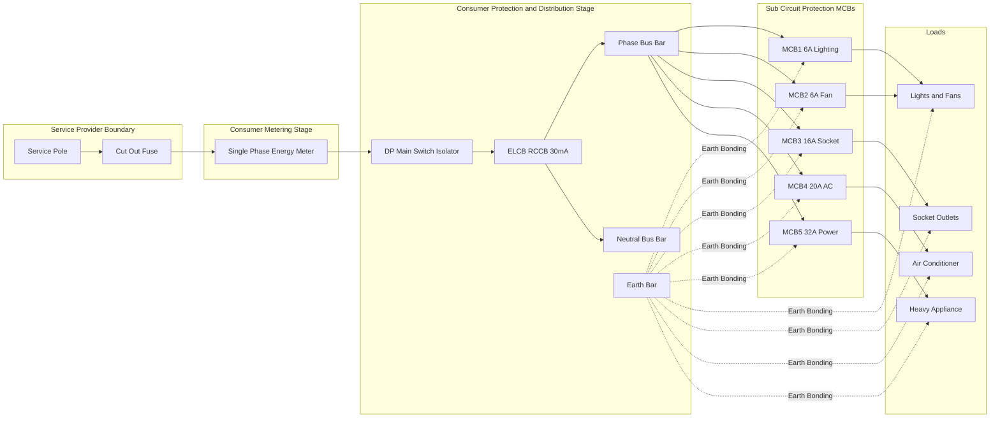
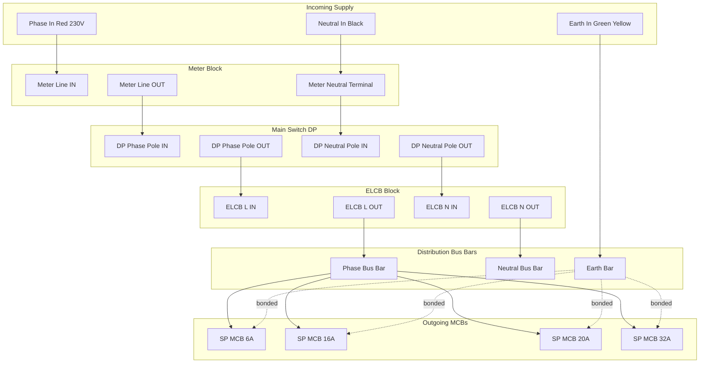
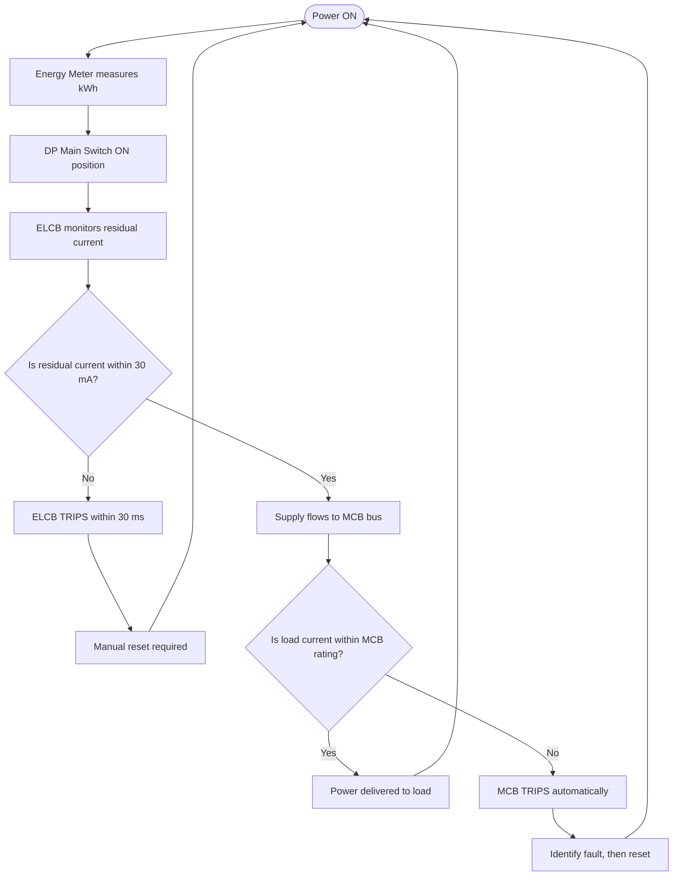
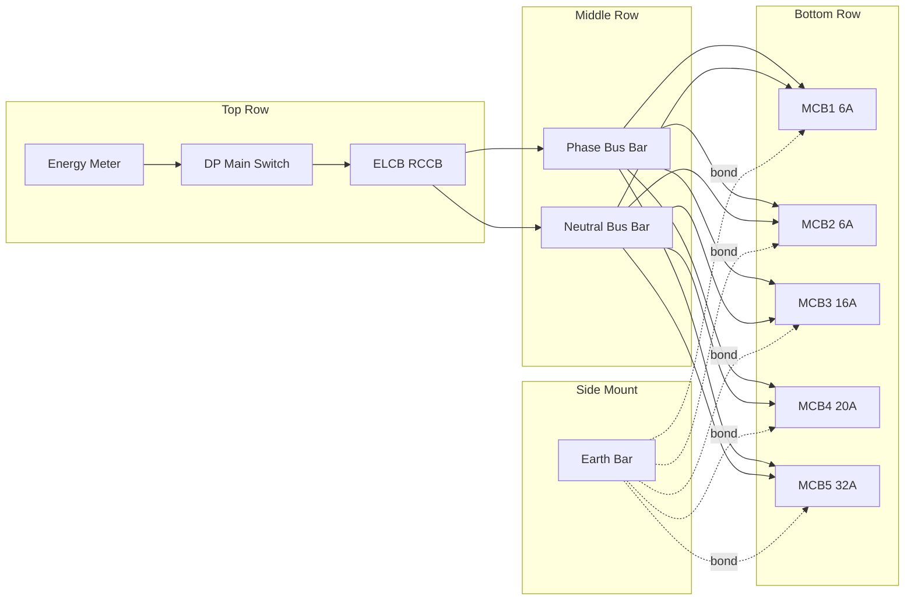

# Wiring of power distribution arrangement using single phase MCB distribution board with ELCB, main switch and Energy meter.

<!-- SECTION_1_START -->
# Wiring of Power Distribution Arrangement using Single Phase MCB Distribution Board

> [!IMPORTANT]
> **KTU 2024 Scheme | GZESL208 | Module 5 | Workshop Practice**
> This topic is classified under **Practical / Laboratory / Workshop** category. Students are expected to demonstrate hands-on wiring, identify components, follow safety standards (IS 732 & IE Rules), and verify the working of the assembled panel.

## 1. Core Technical Definition

A **Single Phase MCB Distribution Board** is a centralized electrical panel used in domestic and small commercial installations to receive the incoming 230 V AC, 50 Hz single-phase supply from the service provider, measure the consumed energy, isolate the installation for maintenance, protect it from earth leakage faults, and distribute the power safely to multiple sub-circuits through individual **Miniature Circuit Breakers (MCBs)**.

As per KTU syllabus, the standard assembly integrates four critical protection and metering devices in the following logical order:

1. **Single Phase Energy Meter** – for measurement of active energy (kWh) consumed.
2. **Main Switch (Double Pole / DP Isolator)** – for manual isolation of the entire installation.
3. **ELCB (Earth Leakage Circuit Breaker)** – alternatively called **RCCB (Residual Current Circuit Breaker)** – for protection against earth leakage / shock.
4. **MCB Distribution Board (SPN / TPN)** – with multiple outgoing Single Pole MCBs feeding separate loads (lighting, socket, AC, geyser, etc.).

> [!NOTE]
> **Key Definition (Board Standard):**
> An **ELCB** is a mechanical switching device designed to make, carry and break currents under normal service conditions, and to cause the opening of the contacts when the residual current attains a given value under specified conditions. The standard residual operating current is **30 mA** for human shock protection and **100 mA / 300 mA** for fire prevention.

## 2. Intuitive Overview & Real-World Analogy

> [!TIP]
> **Analogy — "The Building's Security Checkpoint"**
> Imagine your home's electrical system as a multi-stage security gate at a building entrance:
> - The **Energy Meter** is the *reception desk* that counts every visitor (electron) entering.
> - The **Main Switch** is the *main gate* that can shut down all entries in an emergency.
> - The **ELCB** is the *metal detector* — if even a small leakage current tries to escape through an unauthorized path (like through a human body), it trips instantly.
> - The **MCB Distribution Board** is the *corridor with separate rooms* — each MCB is a room door for a specific area (kitchen, bedroom, hall). If a short circuit occurs in the kitchen, only the kitchen MCB trips — the rest of the house remains lit.

This staged protection ensures **isolation, measurement, leakage protection, and overcurrent protection** — a non-negotiable sequence dictated by IE Rule 32 of the Indian Electricity Rules, **1956**.

> [!VISUALIZATION CONTROL]
> **Concept:** Block Diagram of Power Flow in a Single Phase Distribution Board
> **Logical Path:** Service Pole → Energy Meter → Main Switch (DP) → ELCB → MCB DB → Loads
> **Visual Description:** Linear left-to-right flow where each block is a sequential protection/measurement stage. Each stage receives both Phase (L) and Neutral (N) conductors, except where noted.

## 3. Standard Operating Voltage & Frequency

| Parameter | Standard Value | Tolerance |
|---|---|---|
| System Voltage | **230 V AC** | $\pm 10\%$ (207 V – 253 V) |
| Frequency | **50 Hz** | $\pm 5\%$ (47.5 Hz – 52.5 Hz) |
| Phase Configuration | **Single Phase, 2 Wire** (L, N) | + Earth (3-Wire system) |
| Standard Reference | **IS 732: 2019** | Code of Practice for Electrical Wiring Installations |

> [!IMPORTANT]
> The standard **230 V, 50 Hz, Single Phase AC** supply enters the consumer premises through a service cable (usually 2 core aluminum or copper armored cable) and is terminated at the **Service Fuse / Cut-Out** mounted on the building's outer wall.
<!-- SECTION_1_END -->

<!-- SECTION_2_START -->
# Deep Theoretical Analysis & KTU High-Yield Reference Sheet

## 1. Functional Role of Each Component

### A. Single Phase Energy Meter
- **Type:** Electrolytic / Electronic (modern static meters)
- **Rating:** $5\text{ A} - 20\text{ A}$, $230\text{ V}$
- **Function:** Measures active energy in **kWh** using $E = \int V \cdot I \cdot \cos\phi \cdot dt$
- **Accuracy Class:** **Class 1.0** or **Class 2.0** (IS 13779)
- **Connection:** Line (in) → Line (out) on the meter terminal block; Neutral passes through the meter's neutral terminal.

### B. Main Switch (Double Pole / DP Isolator)
- **Type:** **DP (Double Pole)** — switches both Phase and Neutral simultaneously
- **Rating:** $32\text{ A} - 63\text{ A}$, $230\text{ V}$
- **Function:** Provides a means of **isolation** for the entire consumer installation. Required as per **IE Rule 32**.
- **Position:** Mounted *after* the energy meter and *before* the ELCB.
- **Operation:** Lever-operated, **OFF-Load** isolator (not an automatic protective device).

### C. ELCB / RCCB
- **Principle:** Operates on **Kirchhoff's Current Law** — sums the currents in the Line and Neutral conductors using a **Zero-Sequence Current Transformer (ZCT)**.
- **Operating Condition:**
$$
I_L + I_N = 0 \text{ (healthy)} \quad \Rightarrow \quad I_{\text{residual}} = 0
$$
$$
I_L + I_N \neq 0 \text{ (leakage)} \quad \Rightarrow \quad I_{\text{residual}} = I_{\text{leak}}
$$
- **Sensitivity:** **30 mA** for shock protection, **100 mA** for fire protection.
- **Trip Time:** $\le 30\text{ ms}$ at $5 \times I_{\Delta n}$
- **Rating:** $25\text{ A} - 63\text{ A}$, $230\text{ V}$
- **Important:** ELCB **does NOT provide overcurrent / short circuit protection** — it must always be backed by an MCB.

### D. MCB Distribution Board (SPN Type)
- **Type:** **SPN (Single Pole + Neutral)** — single phase distribution
- **Poles:** Outgoing MCBs are **SP (Single Pole)** — break only the Phase conductor.
- **Number of Ways:** **4-way, 6-way, 8-way, 12-way** (standard sizes)
- **MCB Curves:** **B-Curve** (resistive loads), **C-Curve** (inductive/motor loads), **D-Curve** (heavy inrush)
- **Standard MCB Ratings:** $6\text{ A}, 10\text{ A}, 16\text{ A}, 20\text{ A}, 25\text{ A}, 32\text{ A}$

## 2. KTU High-Yield Reference Table

| Symbol / Device | Function | Standard Rating | IS Standard | KTU Exam Frequency |
|---|---|---|---|---|
| Energy Meter | Measure kWh | 5–20 A, 230 V | IS 13779 | High |
| DP Main Switch | Isolation | 32 A, 230 V | IS 13947-3 | Very High |
| ELCB / RCCB | Earth Leakage Protection | 30 mA, 25 A | IS 12640 | Very High |
| MCB (SP) | Overcurrent Protection | 6 A – 32 A | IS 8828 | High |
| MCB DB (SPN) | Sub-circuit Distribution | 4–12 way | IS 13032 | High |
| Bus Bar | Common Neutral Link | 100 A | IS 8623 | Medium |
| Earth Electrode | Equipotential bonding | $\le 5\ \Omega$ | IS 3043 | Very High |

## 3. Color Code for Single Phase Wiring (IS 732)

> [!IMPORTANT]
> **Indian Standard Wiring Color Code (Mandatory for KTU Board Exam)**

| Conductor | Color | Purpose |
|---|---|---|
| Phase (L) | **Red** (or any color except green, yellow, black, blue) | Live conductor carrying current |
| Neutral (N) | **Black** | Return path to source |
| Earth (E) | **Green with Yellow stripes** | Safety / protective conductor |
| DC Positive | Red | DC supply positive |
| DC Negative | Blue | DC supply negative |

## 4. Real-World Engineering Utility

- **Domestic Residences:** Standard in every modern home for safe distribution.
- **Small Offices & Shops:** Lighting, fan, socket, and AC circuits.
- **Hospital Backup Systems:** Combined with UPS/Isolated Power Systems.
- **Solar Hybrid Systems:** Acts as the AC combiner protection panel.
- **Hotel Room DBs:** Each room has a sub-DB for localized protection.

The arrangement is governed by the **National Electrical Code (NEC)** and **IE Rules 1956** and is mandatory for any new electrical installation seeking an electricity connection in India.
<!-- SECTION_2_END -->

<!-- SECTION_3_START -->
# Step-by-Step Wiring Procedure, Component Configuration & Safety Implementation

## 1. Tools, Components & Material List (Pre-Workshop Preparation)

> [!NOTE]
> This is the **pre-workshop checklist** the student must bring to the lab. The instructor will verify these items at the start of the session.

| Sl. No. | Item | Specification | Qty |
|---|---|---|---|
| 1 | Single Phase Energy Meter | 5–20 A, 230 V, static type | 1 |
| 2 | DP Main Switch (Isolator) | 32 A, 230 V, 2-pole | 1 |
| 3 | ELCB / RCCB | 30 mA, 25 A, 2-pole | 1 |
| 4 | MCB Distribution Board (SPN) | 8-way, metal enclosure | 1 |
| 5 | SP MCBs | 6 A, 16 A, 20 A, 32 A | 4 |
| 6 | Bus Bar (Neutral Link) | 100 A, 8-way | 1 |
| 7 | Earth Bar | 100 A copper | 1 |
| 8 | PVC Insulated Copper Wire | 2.5 mm² (Red, Black, Green/Yellow) | As required |
| 9 | Screwdriver Set | Insulated, VDE rated 1000 V | 1 set |
| 10 | Wire Stripper & Cutter | 0.5 – 6 mm² capacity | 1 |
| 11 | Multimeter (Digital) | CAT III 600 V minimum | 1 |
| 12 | Line Tester (Test Lamp) | Neon / LED type | 1 |
| 13 | Megger (Insulation Tester) | 500 V DC | 1 |
| 14 | Insulated Gloves | Class 0 (1000 V) | 1 pair |
| 15 | Safety Goggles | ISI marked | 1 |
| 16 | Wire Ferrules / Lugs | 2.5 mm² ring type | As required |

## 2. Component Terminal Configuration Table

| Device | Terminal 1 (IN) | Terminal 2 (OUT) | Earth | Notes |
|---|---|---|---|---|
| Energy Meter | L-IN (Phase In) | L-OUT (Phase Out) | — | Neutral is also connected to N terminal block |
| DP Main Switch | L1, L2 (both poles IN) | T1, T2 (both poles OUT) | — | Switches both Phase & Neutral |
| ELCB (2-Pole) | L-IN, N-IN | L-OUT, N-OUT | — | No overcurrent protection; do not bypass |
| MCB (SP) | Line (IN from bus) | Load (OUT to circuit) | — | Single pole breaks only Phase |
| Neutral Bus Bar | — | — | — | Common neutral return for all MCBs |
| Earth Bar | — | — | ✓ | All earth wires terminate here |

## 3. Sequential Wiring Procedure (Exhaustive Step-by-Step)

> [!WARNING]
> **SAFETY FIRST — MANDATORY PRECAUTIONS**
> 1. Confirm the **main incoming supply is OFF** at the service cut-out. Display a **"DO NOT SWITCH ON"** tag at the main switch.
> 2. Verify zero voltage using a calibrated **line tester / multimeter**.
> 3. Wear **insulated gloves and safety goggles** throughout the wiring process.
> 4. Use only **VDE-insulated tools** rated for 1000 V.
> 5. Never work alone on a live panel — always have a partner who can isolate in case of emergency.

### Step 1: Mount the Distribution Board (DB) Enclosure
- Fix the **MCB distribution board enclosure** on a vertical wall at a height of **1.5 m to 2.0 m** from the floor (finished floor level), as per IS 732.
- Ensure the enclosure is **earthed** using a 4 mm² green-yellow wire connected to the building's earth pit (resistance $\le 5\ \Omega$).

### Step 2: Mount the Energy Meter and Main Switch
- Mount the **Single Phase Energy Meter** on the wall (or inside a separate meter box) upstream of the DB.
- Mount the **DP Main Switch** between the energy meter and the ELCB inside the DB.
- Maintain a minimum clearance of **75 mm** between adjacent devices for heat dissipation.

### Step 3: Wire the Incoming Supply to the Energy Meter
- Run the **service cable** from the cut-out to the meter's **LINE-IN** terminal.
- Connect the **Phase (Red)** to the meter's L terminal.
- Connect the **Neutral (Black)** to the meter's N terminal.
- **Torque the terminal screws** to the manufacturer's specified value (typically 2.5 N·m).

### Step 4: Connect the Energy Meter Output to the Main Switch
- Take a short length of **2.5 mm² Red wire** from the meter's **L-OUT** terminal to the **Phase-IN** of the DP Main Switch.
- Take a **2.5 mm² Black wire** from the meter's **N-OUT** terminal to the **Neutral-IN** of the DP Main Switch.
- Verify the connections are tight and that the neutral is *not* switched by any device other than the DP isolator.

### Step 5: Connect the Main Switch Output to the ELCB
- From the **T1 (Phase OUT)** terminal of the main switch, run a **Red wire** to the **L-IN** terminal of the ELCB.
- From the **T2 (Neutral OUT)** terminal, run a **Black wire** to the **N-IN** terminal of the ELCB.
- This stage establishes **overcurrent isolation (manual)** and prepares the circuit for **residual current sensing**.

### Step 6: Connect the ELCB Output to the MCB Distribution Bus
- From the **L-OUT** of the ELCB, connect a short **Red wire (bus link)** to the **Phase Bus Bar** that feeds all the outgoing MCBs.
- From the **N-OUT** of the ELCB, connect a **Black wire** to the **Neutral Bus Bar** inside the DB.
- The Neutral Bus Bar must be insulated from the metal enclosure and is the common return point for all sub-circuits.

### Step 7: Install and Wire the Outgoing MCBs
- Snap the **SP MCBs** onto the DIN rail of the DB.
- Connect each MCB's **Line-IN** to the **Phase Bus Bar** using busbar links or short red wires.
- The **Load-OUT** of each MCB will carry the final sub-circuit wires going to the loads.
- A typical assignment is:

| MCB Position | Rating | Circuit Served | Conductor Size |
|---|---|---|---|
| MCB-1 | 6 A | Lighting circuit | 1.5 mm² |
| MCB-2 | 6 A | Fan circuit | 1.5 mm² |
| MCB-3 | 16 A | 5A/15A Socket (General) | 2.5 mm² |
| MCB-4 | 20 A | AC / Geyser | 4.0 mm² |
| MCB-5 | 32 A | Power socket / Induction heater | 6.0 mm² |

### Step 8: Connect Earth Conductors
- All sub-circuit **earth wires (Green/Yellow)** must be terminated on the **Earth Bar** inside the DB.
- The **Earth Bar** is connected to the **main earth electrode** via a 6 mm² green-yellow wire.
- Earth continuity must be verified using a multimeter (resistance $< 1\ \Omega$ between earth bar and any outlet earth terminal).

### Step 9: Label the Components
- Use a **ferrule / label printer** to mark each MCB with its designated circuit name (e.g., "Hall Light", "Kitchen Socket").
- Affix a **single line diagram (SLD)** sticker on the inside of the DB door.

### Step 10: Inspection and Testing
- **Visual Inspection:** Check tightness of all terminals, proper color coding, no stray strands, no damaged insulation.
- **Insulation Resistance Test (Megger Test):**
  - Apply **500 V DC** between Phase + Neutral (shorted together) and Earth.
  - Reading must be **$\ge 1\ \text{M}\Omega$** (IS 732).
- **Earth Continuity Test:** Resistance between earth bar and farthest earth terminal $\le 1\ \Omega$.
- **ELCB Trip Test:** Press the **TEST button** on the ELCB — it must trip within 30 ms. Verify that all downstream MCBs are now de-energized.
- **Polarity Check:** Using a line tester at each socket, ensure Phase is on the **right pin**, Neutral on the **left pin**, Earth on the **top pin** (as per IS 1293).
- **Phase Sequence Test:** Ensure the load-side of every MCB reads 230 V Phase to Neutral, 0 V Neutral to Earth.

## 4. Power Calculations for Verification

The power delivered to a sub-circuit is calculated as:

$$
P = V \times I \times \cos\phi
$$

For a purely resistive load ($\cos\phi = 1$):

$$
P = 230 \times I \quad [\text{Watts}]
$$

For a 16 A MCB feeding a resistive load:

$$
P_{\max} = 230 \times 16 = 3680\ \text{W} = 3.68\ \text{kW}
$$

This matches the standard **3.68 kW** allowable load on a 16 A circuit breaker.

## 5. Practical Lab Report Checklist (Mandatory Submission)
- [ ] Circuit diagram with all component ratings labeled
- [ ] Component identification table (with photographs)
- [ ] Tool list used
- [ ] Step-by-step wiring log with timestamps
- [ ] Test results: IR test, Earth continuity, Polarity, ELCB trip
- [ ] Result / Inference (whether the panel passed all tests)
- [ ] Safety precautions followed
<!-- SECTION_3_END -->

<!-- SECTION_4_START -->
# Structural Diagrams & Schematics

## 1. Block Diagram — Sequential Processing Topology of Power Flow

## 2. Wiring Topology — Internal Connection Matrix

## 3. Functional Architecture — Decision Flow during Faults

## 4. Component Layout — Physical Arrangement Inside the DB

<!-- SECTION_4_END -->

<!-- SECTION_5_START -->
# KTU 2024 Scheme Examination Question Bank & Topic Recap

## Part A Questions (2 x 3 = 6 Marks)

### Question 1 [KTU University Exam - July 2024 | CO1, Remember]
**List the components used in a single phase MCB distribution board in the order in which they are connected from the service pole to the load.**

**Model Answer (3 Marks):**
The components are connected in the following order:
1. **Energy Meter** (kWh measurement) — [1 Mark]
2. **DP Main Switch (Isolator)** (manual isolation) — [1 Mark]
3. **ELCB / RCCB** (earth leakage protection) — [1 Mark]
4. **MCB Distribution Board** with outgoing SP MCBs feeding sub-circuits

> [!WARNING]
> **Examiner's Pitfall:** Do **not** place the ELCB *before* the main switch. As per IE Rule 32, the main switch must be the *first* isolating device after the energy meter. Reversed order is a common mistake costing full marks.

### Question 2 [KTU University Exam - Dec 2023 | CO2, Understand]
**Explain the working principle of an ELCB. Why is it used in a single phase distribution board?**

**Model Answer (3 Marks):**
- An ELCB works on the principle of a **Zero-Sequence Current Transformer (ZCT)**. — [1 Mark]
- Under normal conditions, the current in the phase conductor equals the current in the neutral conductor. Their magnetic fluxes in the ZCT core cancel, producing **zero residual flux** and no trip signal. — [1 Mark]
- During an earth leakage (e.g., a person touching a live wire), current leaks to earth. The phase and neutral currents become unequal. The imbalance creates a residual flux that induces a voltage in the sensing coil, triggering the **trip mechanism** within 30 ms. — [1 Mark]
- It is used to protect human life from electric shock and prevent fire due to leakage currents.

---

## Part B Questions (14 Marks) — Module Internal Choice

### Question 3A [KTU University Exam - July 2024 | CO2, CO3, Apply]

**(a)** With the help of a neat labeled diagram, explain the wiring of a single phase power distribution arrangement using MCB distribution board with ELCB, main switch and energy meter. Mention the standard color code used. **[7 Marks]**

**(b)** Describe the procedure to test the assembled distribution board for insulation resistance, earth continuity, and ELCB trip function. State the standard acceptable values. **[7 Marks]**

#### Model Solution

**Part (a) — 7 Marks:**

The power flow is:
**Service Pole → Energy Meter → DP Main Switch → ELCB → MCB DB → Loads** — [Block Diagram: 3 Marks]

- **Energy Meter** (5–20 A, 230 V): Mounted first; measures kWh. Phase and Neutral are looped through it. — [1 Mark]
- **DP Main Switch** (32 A): Switches both Phase and Neutral simultaneously; provides isolation as per IE Rule 32. — [1 Mark]
- **ELCB** (30 mA, 25 A): Detects residual current and trips within 30 ms. — [1 Mark]
- **MCB DB** (SPN, 8-way): Distributes to individual sub-circuits through 6 A, 16 A, 20 A, 32 A MCBs. — [0.5 Mark]
- **Color Code (IS 732):** Phase — **Red**, Neutral — **Black**, Earth — **Green with Yellow stripes**. — [0.5 Mark]

**Part (b) — 7 Marks:**

1. **Insulation Resistance Test (Megger Test):** [2 Marks]
   - Apply **500 V DC** between (Phase + Neutral shorted) and Earth.
   - Use a **500 V Megger** for at least 30 seconds.
   - **Standard value:** Insulation resistance $\ge 1\ \text{M}\Omega$ (IS 732).

2. **Earth Continuity Test:** [2 Marks]
   - Measure resistance between the **earth bar in DB** and the **earth pin of the farthest socket** using a multimeter.
   - **Standard value:** Resistance $\le 1\ \Omega$.
   - If higher, check loose connections, corrosion, or insufficient earth electrode depth.

3. **Polarity Test:** [1.5 Marks]
   - At each socket, identify Phase, Neutral, and Earth using a line tester / multimeter.
   - Phase on right pin, Neutral on left pin, Earth on top pin (per IS 1293).

4. **ELCB Trip Test:** [1.5 Marks]
   - Press the **TEST button** on the ELCB.
   - The ELCB must trip, disconnecting all downstream circuits.
   - Reset manually only after fault is cleared.

> [!WARNING]
> **Examiner's Pitfall (Question 3A):**
> - Many students forget to mention the **color code** in part (a) — losing 0.5 to 1 mark.
> - For part (b), stating only the test name *without* the **standard acceptable value** loses 50% marks. Always quote the numerical threshold (e.g., "$1\ \text{M}\Omega$" or "$\le 1\ \Omega$").
> - Failing to mention that the **TEST button simulates a real leakage** and is part of routine maintenance is a common omission.

---

### Question 3B (Alternative Choice) [KTU University Exam - Dec 2023 | CO2, CO3, Apply]

**(a)** Explain the function and rating of each of the following in a single phase MCB distribution board: (i) Energy Meter, (ii) DP Main Switch, (iii) ELCB, (iv) MCB. **[7 Marks]**

**(b)** A 16 A MCB feeds a load of ten 100 W incandescent lamps connected in parallel. Calculate the total load current and verify whether the MCB is properly rated. **[7 Marks]**

#### Model Solution

**Part (a) — 7 Marks:**

| Device | Function | Rating | Marks |
|---|---|---|---|
| (i) Energy Meter | Measures active energy consumption in **kWh** | 5–20 A, 230 V, Class 1.0 / 2.0 | [1.5 Marks] |
| (ii) DP Main Switch | Provides **manual isolation** of the entire installation; switches both Phase and Neutral | 32 A, 230 V, AC-22 utilization category | [1.5 Marks] |
| (iii) ELCB | Detects **residual current** and trips to prevent shock / fire; operates on ZCT principle | 25 A, 230 V, $I_{\Delta n} = 30\ \text{mA}$ for shock protection | [2 Marks] |
| (iv) MCB (SP) | **Overcurrent** and **short-circuit** protection for individual sub-circuits; thermal-magnetic trip | 6 A / 16 A / 20 A / 32 A, 230 V, 10 kA breaking capacity | [2 Marks] |

**Part (b) — 7 Marks:**

**Given:**
- Number of lamps $n = 10$
- Each lamp rating $P = 100\ \text{W}$
- Supply voltage $V = 230\ \text{V}$, single phase
- MCB rating = 16 A

**Step 1: Total Power** [1 Mark]
$$
P_{\text{total}} = n \times P = 10 \times 100 = 1000\ \text{W}
$$

**Step 2: Total Load Current (assuming $\cos\phi = 1$ for resistive load)** [2 Marks]
$$
I_{\text{load}} = \frac{P_{\text{total}}}{V \times \cos\phi} = \frac{1000}{230 \times 1} = 4.35\ \text{A}
$$

**Step 3: Compare with MCB Rating** [2 Marks]
$$
I_{\text{load}} = 4.35\ \text{A} < 16\ \text{A (MCB rating)}
$$

**Step 4: Verdict** [1 Mark]
The 16 A MCB is **properly rated** (not overloaded). The circuit operates at only **27.2%** of the MCB's capacity, providing a safety margin.

**Step 5: Recommendation** [1 Mark]
For better load optimization, a **6 A MCB** would be more suitable for this 1 kW lighting load, as it is closer to the actual load current while still providing adequate headroom.

> [!WARNING]
> **Examiner's Pitfall (Question 3B):**
> - In part (a), students often confuse **ELCB** with **MCB**. Remember: ELCB = *leakage current* protection, MCB = *overcurrent/short-circuit* protection. They are **complementary, not interchangeable**.
> - In part (b), forgetting the power factor $\cos\phi$ in the formula loses 1 mark. For purely resistive loads like incandescent lamps, $\cos\phi = 1$, but the examiner expects the full formula: $I = P / (V \cos\phi)$.

---

## Topic Recap & Important Things to Remember

> [!TIP]
> **High-Density Revision Checklist for KTU Board Exam**

- The **standard sequence** is: Service Pole → Cut-Out → **Energy Meter → DP Main Switch → ELCB → MCB DB → Loads**. Memorize this order.
- The **standard supply** is **230 V, 50 Hz, Single Phase AC** as per IS 732.
- **Energy Meter** is a *measuring* device — it does **not** protect. It records kWh.
- **DP Main Switch** is for *manual isolation only*. It is **not** an automatic protection device.
- **ELCB (RCCB)** operates on the **ZCT principle** using $I_L + I_N = 0$ balance. Standard sensitivity is **30 mA**, trip time $\le 30\ \text{ms}$.
- ELCB does **not** protect against overload or short circuit — it must be backed by an **MCB**.
- **MCB** provides overcurrent and short-circuit protection using **thermal (bimetallic strip)** and **magnetic (solenoid)** trip mechanisms.
- **Color Code (IS 732):** Phase = **Red**, Neutral = **Black**, Earth = **Green-Yellow stripes**.
- **Standard MCB ratings for residential use:** 6 A (lights/fans), 16 A (sockets), 20 A (AC), 32 A (heavy loads).
- **Insulation Resistance** must be **$\ge 1\ \text{M}\Omega$** when tested at **500 V DC**.
- **Earth Resistance** must be **$\le 5\ \Omega$** for the main earth electrode and **$\le 1\ \Omega$** for earth continuity.
- **Earthing standards:** Governed by **IS 3043** (Code of Practice for Earthing).
- **Power formula for single phase:** $P = V \times I \times \cos\phi$.
- **Maximum load on 16 A MCB:** $P_{\max} = 230 \times 16 = 3.68\ \text{kW}$.
- Always **de-energize the supply** and verify with a tester before working. Use **VDE-insulated tools** rated 1000 V.
- Mount the DB at a height of **1.5 m – 2.0 m** above finished floor level.
- The **TEST button** on the ELCB simulates a real leakage fault — must be tested **monthly**.
- ELCB and MCB **must be connected in series** (ELCB first, then MCB) for complete protection.
- **Polarity check** ensures Phase goes to the right pin, Neutral to the left, Earth to the top (IS 1293).
<!-- SECTION_5_END -->
