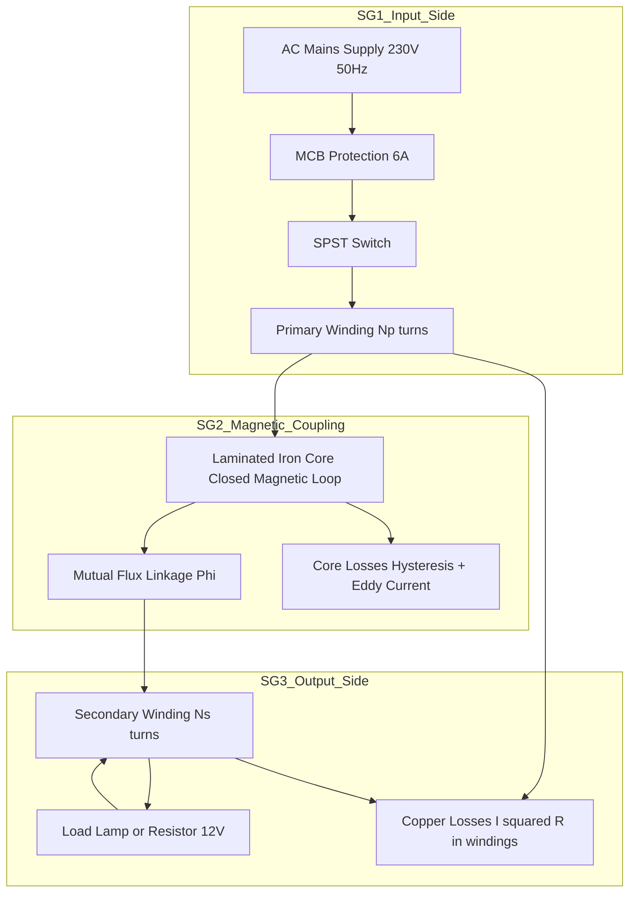
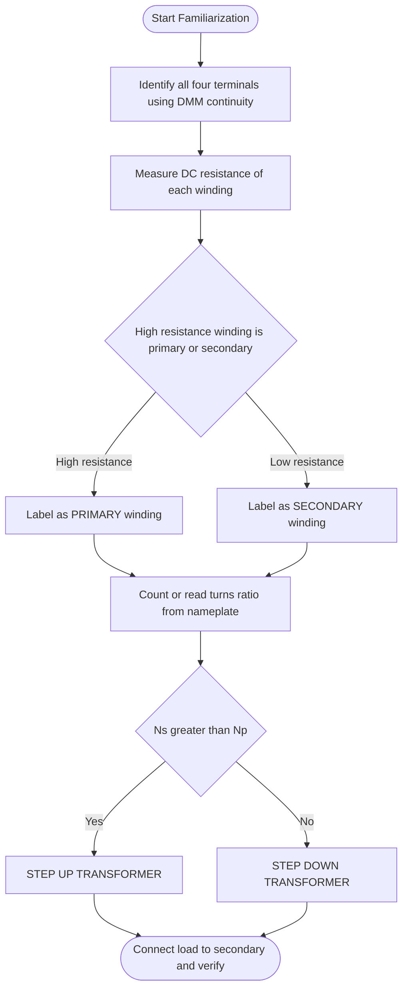
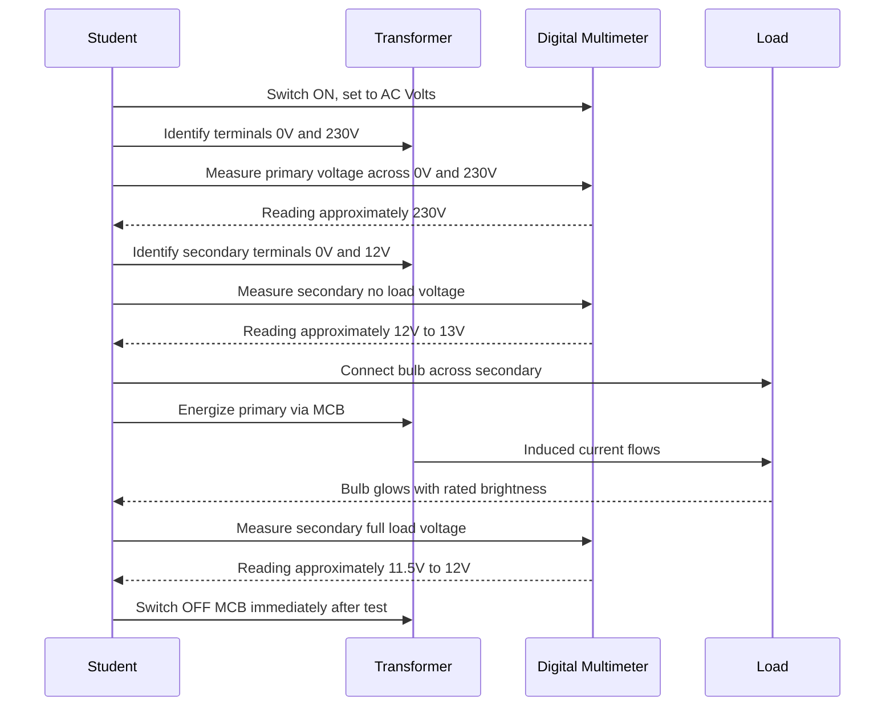
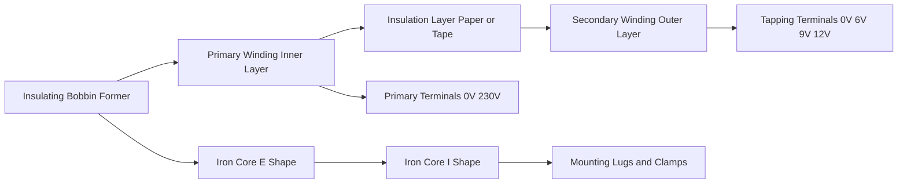

# Familiarization of step up and step-down transformers, (use low voltage transformers)

<!-- SECTION_1_START -->

# Familiarization of Step-Up and Step-Down Transformers (Low Voltage)

## 1. Core Technical Definition & Intuitive Overview

> [!NOTE]
> **KTU 2024 Syllabus Definition (GZESL208 - Module 6):**
> A **Transformer** is a **static (stationary) electromagnetic device** that transfers electrical energy from one alternating current (AC) circuit to another through **mutually coupled magnetic circuits**, without any change in frequency. It works on the principle of **Faraday's Law of Electromagnetic Induction**.

A transformer that **increases the output voltage** with respect to the input voltage is called a **Step-Up Transformer** ($N_s > N_p$), while one that **decreases the output voltage** is called a **Step-Down Transformer** ($N_s < N_p$). In a B.Tech workshop, **low voltage transformers** (typically with ratings like **230 V / 6 V, 9 V, 12 V, or 24 V**) are used to ensure operator safety during hands-on familiarization.

### Conceptual Analogy — The Water Pressure Model

Imagine two water tanks connected at their base through a common pipe:
- The **primary tank** has a large cross-sectional area and a small water column height (low pressure, high volume).
- The **secondary tank** has a small cross-sectional area and a tall water column height (high pressure, low volume).

In the same way, a **step-down transformer** is like the first tank: it accepts high voltage at low current. A **step-up transformer** is like the second: it delivers high voltage at low current. The **total power** (Voltage × Current) remains nearly constant (ignoring small losses).

> [!IMPORTANT]
> **Key Highlight for KTU 2024:**
> The product of voltage and current is approximately preserved between the two windings.
> $$V_p \cdot I_p \approx V_s \cdot I_s$$
> This is the fundamental **conservation of power** principle in an ideal transformer.

### Physical Constants and Standards (Bold Highlights)

- **Line frequency in India: $f = 50\text{ Hz}$**
- **Standard domestic supply: $V_p = 230\text{ V}$, single-phase AC**
- **Permeability of CRGO silicon steel core: $\mu_r \approx 1000$ to $10000$**
- **Lamination thickness: $0.23\text{ mm}$ to $0.35\text{ mm}$** to reduce **eddy current losses**
- **Standard low-voltage workshop secondary ratings: $6\text{ V}$, $9\text{ V}$, $12\text{ V}$, $24\text{ V}$** at currents up to **$2\text{ A}$ to $5\text{ A}$**

> [!VISUALIZATION CONTROL]
> **Concept:** Magnetic flux linkage between primary and secondary coils wound on a common iron core.
> **GeoGebra / Desmos Input Equations:**
> * Primary MMF: $F_p(x) = N_p \cdot I_p \cdot \sin(2 \pi \cdot 50 \cdot x)$
> * Secondary EMF induced: $E_s(x) = N_s \cdot d\Phi(x)/dx$
> * Flux density sinusoidal: $\Phi(x) = \Phi_m \cdot \sin(2 \pi \cdot 50 \cdot x)$
> **Visual Description:** On the X-axis plot time in seconds, and on the Y-axis plot flux in webers. The student should observe a smooth sinusoidal flux waveform that induces an EMF in the secondary winding exactly **$90^\circ$ out of phase** with the flux linkage.

---

<!-- SECTION_1_END -->

<!-- SECTION_2_START -->

# 2. Deep Theoretical Analysis & KTU High-Yield Formula Sheet

## 2.1 Working Principle — Mutual Electromagnetic Induction

When an **alternating voltage** $V_p$ is applied across the **primary winding** (with $N_p$ turns):

1. An **alternating current** $I_p$ flows through the primary coil.
2. This current produces an **alternating magnetic flux** $\Phi$ in the laminated iron core.
3. Because the core forms a **closed magnetic loop**, almost the **entire flux** links with the **secondary winding** (which has $N_s$ turns).
4. By **Faraday's Law of Electromagnetic Induction**, this changing flux induces an **EMF** in the secondary winding.

### Step-by-Step Logical Breakdown

- **Step 1:** AC supply applied $\Rightarrow$ alternating magnetomotive force (MMF) $F_p = N_p \cdot I_p$ is produced.
- **Step 2:** MMF drives alternating flux $\Phi(t) = \Phi_m \sin(\omega t)$ through the high-permeability core.
- **Step 3:** The flux linkage in the secondary winding equals $\lambda_s = N_s \cdot \Phi(t)$.
- **Step 4:** By Faraday's law, the induced EMF is:
$$e_s = -\frac{d\lambda_s}{dt} = -N_s \frac{d\Phi}{dt}$$

- **Step 5:** The induced RMS EMF in any winding is given by the canonical **EMF Equation of a Transformer**:
$$E = 4.44 \, f \, N \, \Phi_m$$

- **Step 6:** Comparing primary and secondary:
$$\frac{E_p}{E_s} = \frac{N_p}{N_s} = \frac{V_p}{V_s} = k \quad (\text{transformation ratio})$$

- **Step 7:** Because power is conserved (ideal case):
$$\frac{I_p}{I_s} = \frac{N_s}{N_p} = \frac{1}{k}$$

> [!TIP]
> **Why is the core laminated?**
> A solid iron core would allow large circulating **eddy currents** to flow, causing severe $I^2R$ heating. Thin **silicon-steel laminations** (insulated from each other by a thin varnish coat) force the eddy currents into narrow, high-resistance paths, drastically reducing losses.

## 2.2 Identification of Step-Up vs Step-Down

| Property | Step-Down Transformer | Step-Up Transformer |
|---|---|---|
| Turns ratio $N_s / N_p$ | $< 1$ | $> 1$ |
| Output voltage $V_s$ | Less than $V_p$ | Greater than $V_p$ |
| Output current $I_s$ | Greater than $I_p$ | Less than $I_p$ |
| Wire gauge of secondary | **Thicker** (low voltage, high current) | **Thinner** (high voltage, low current) |
| Common workshop use | Adapter, mobile charger, bell | X-ray, CRT TV, neon sign, microwave oven |

## 2.3 Constructional Anatomy

- **Core:** Built from **CRGO (Cold Rolled Grain Oriented)** silicon steel laminations shaped into **E-I**, **U-I**, or **C-core** configurations.
- **Primary Winding:** Wound with **enameled copper wire** of finer gauge; usually the **inner layer** wound first on the bobbin.
- **Secondary Winding:** Wound on top of the primary (or on a separate bobbin) with appropriate gauge based on current rating.
- **Terminal Block:** Provides four external terminals — usually marked **0–230 V** (primary) and **0–X V** (secondary).
- **Bobbin / Former:** Insulating plastic former that holds the windings and prevents short-circuiting to the core.

## 2.4 KTU Formula Sheet / Cheat Sheet

> [!IMPORTANT]
> **Master these equations for the KTU 2024 Board Exam.**

| Symbol / Concept | Equation | Description / Units |
|---|---|---|
| EMF per winding | $E = 4.44 \, f \, N \, \Phi_m$ | RMS value, with $\Phi_m$ in **Wb**, $f$ in **Hz** |
| Transformation ratio | $k = \dfrac{V_s}{V_p} = \dfrac{N_s}{N_p} = \dfrac{I_p}{I_s}$ | Dimensionless |
| Flux density | $\Phi_m = B_m \cdot A_c$ | $B_m$ in **Tesla**, $A_c$ in **m²** |
| Ideal power balance | $V_p I_p = V_s I_s$ | Neglects all losses |
| Voltage regulation | $\%\text{Reg} = \dfrac{V_{NL} - V_{FL}}{V_{FL}} \times 100$ | Quality indicator |
| Efficiency | $\eta = \dfrac{V_s I_s \cos\phi}{V_s I_s \cos\phi + P_{Cu} + P_{core}} \times 100$ | $\cos\phi$ is load power factor |

> **Note on escapes:** Avoid the vertical pipe symbol $\vert$ inside markdown tables; use `\vert` or `\mid` instead. All variables with subscripts are wrapped in math mode, e.g., $V_s$, $N_p$.

## 2.5 Real-World Engineering Utility

- **Power distribution grid:** Step-up at the **generation station** to **$11\text{ kV}$ / $33\text{ kV}$ / $400\text{ kV}$** for long-distance transmission, then step-down to **$230\text{ V}$** for households.
- **Electronics adapters:** Mobile phone chargers use a tiny **$230\text{ V}$ / $5\text{ V}$** step-down transformer.
- **Instrumentation:** Isolation transformers in **medical equipment** and **oscilloscopes** for galvanic isolation.
- **Audio systems:** Impedance-matching transformers between amplifiers and speakers.
- **Industrial welding:** Step-down transformers producing huge currents at low voltage for arc welding.

---

<!-- SECTION_2_END -->

<!-- SECTION_3_START -->

# 3. Step-by-Step Derivations, Wiring Tables & Workshop Implementation

## 3.1 Exhaustive Derivation of the EMF Equation

Starting from Faraday's Law for a single-turn coil:
$$e = -\frac{d\Phi}{dt}$$

For a sinusoidal flux $\Phi(t) = \Phi_m \sin(\omega t)$:
$$e_{1\text{ turn}} = -\frac{d}{dt}(\Phi_m \sin \omega t) = -\omega \Phi_m \cos \omega t$$

Maximum value: $E_{\max} = \omega \Phi_m = 2\pi f \Phi_m$

For $N$ turns in series:
$$E_{\max,\,N} = 2\pi f N \Phi_m$$

Converting maximum to RMS (divide by $\sqrt{2}$):
$$E_{rms} = \frac{2\pi f N \Phi_m}{\sqrt{2}} = \frac{2\pi}{\sqrt{2}} f N \Phi_m = \sqrt{2} \cdot \pi \cdot f \cdot N \cdot \Phi_m$$

Since $\sqrt{2} \cdot \pi \approx 4.44$, the canonical KTU formula is:
$$\boxed{E = 4.44 \, f \, N \, \Phi_m \text{ volts}}$$

> **Logic check:** $f = 50$ Hz, $N = 500$ turns, $\Phi_m = 1.5 \times 10^{-3}$ Wb $\Rightarrow E = 4.44 \times 50 \times 500 \times 0.0015 \approx 166.5$ V. This is consistent with a $230$ V primary when leakage flux is accounted for.

## 3.2 Component Pin Configuration Table

> [!IMPORTANT]
> **Workshop Reference Card — Low Voltage Transformer**

| Pin / Terminal | Label | Wire Color (Industry Standard) | Connection Point |
|---|---|---|---|
| Primary Common | **0 V** (or **N**) | **Black** | Neutral of $230$ V AC mains |
| Primary Line | **230 V** (or **L**) | **Red / Brown** | Phase of $230$ V AC mains |
| Secondary Common | **0 V (sec)** | **Blue** | One end of load |
| Secondary Tapping | **6 V / 9 V / 12 V** | **Yellow / Green** | Other end of load |
| Earth (if present) | **E** | **Green-Yellow striped** | Earth pit / grounding rod |

## 3.3 Required Tools and Equipment Profile

| Item | Specification | Quantity |
|---|---|---|
| Low voltage transformer | $230$ V / $(0$–$12$ V, $2$ A), E-I core, $50$ Hz | **1** |
| Digital Multimeter (DMM) | True RMS, $600$ V AC/DC range | **1** |
| Connecting wires | $1.0$ mm² copper, silicone insulated | As required |
| Single-phase MCB | $6$ A, $230$ V | **1** |
| Toggle switch / SPST | $6$ A rating | **1** |
| Screwdriver set | Insulated, $1000$ V rated | **1 set** |
| Lamp load / resistor bank | $12$ V, $20$ W bulb or rheostat | **1** |
| Insulation tape | PVC, $0.2$ mm thick | **1 roll** |

## 3.4 Exhaustive Wiring Sequence (Step-by-Step)

**Phase A — Safety and Inspection**

1. **De-energize** the mains supply before making any connection. Wear **insulated rubber gloves** and **safety goggles**.
2. Visually **inspect the transformer** for cracked bobbins, burnt smell, or loose laminations.
3. Use the **DMM in continuity mode** to identify the **primary** and **secondary** windings:
   - Primary winding typically shows a **higher DC resistance** (e.g., $50$ – $500\ \Omega$) than the thicker secondary wire.
   - Use the **buzzer / continuity test** to map **0–230 V** terminals and **0–12 V** terminals.

**Phase B — Step-Down Wiring Procedure**

4. Connect the **230 V AC mains** Phase (L) to the **230 V terminal** of the primary through the **SPST switch** and **MCB**.
5. Connect the **Neutral (N)** to the **0 V** terminal of the primary.
6. Connect a **$12$ V, $20$ W bulb** across the secondary's **0 V and 12 V** terminals.
7. **Double-check** all screw terminals are tight; tug each wire gently.
8. **Switch ON** the MCB, then the SPST switch. The bulb should glow with full brightness.
9. **Measure** the secondary open-circuit voltage with DMM set to **AC Volts**: expected reading $\approx 12$ V (or slightly higher, since no-load voltage $>$ full-load voltage).

**Phase C — Step-Up Wiring (Reverse Connection)**

10. **Switch OFF** and disconnect the supply. Wait **30 seconds** for the magnetic flux to decay.
11. Now connect the **$230$ V AC mains** to the **0 V and 12 V** terminals of the original secondary. This is now functioning as the **primary** of a step-up configuration.
12. Measure the voltage across the original **0 V and 230 V** terminals (now the secondary) using DMM — expected reading $\approx 230$ V. *(Caution: Even though this is a low voltage transformer, the output is now mains-level. Do not touch terminals.)*

> [!WARNING]
> **Safety Pitfall:** Connecting a low-voltage winding to the mains when the other winding is open-circuited can cause **dangerously high voltages** on the secondary side. Always treat both sets of terminals as potentially live.

## 3.5 Numerical Worked Example (KTU Board Style)

**Question:** A low-voltage transformer has $N_p = 1200$ turns and $N_s = 60$ turns. The primary is connected to $230$ V, $50$ Hz AC. Calculate:
- (a) Transformation ratio
- (b) Secondary (no-load) voltage
- (c) Maximum flux in the core
- (d) Full-load secondary current if the primary current is $0.25$ A

**Solution:**

- **(a) Transformation ratio:**
$$k = \frac{N_s}{N_p} = \frac{60}{1200} = \frac{1}{20} = 0.05$$

- **(b) Secondary voltage:**
$$V_s = k \cdot V_p = 0.05 \times 230 = 11.5 \text{ V}$$

- **(c) Maximum core flux:** Using $V_p = 4.44 \, f \, N_p \, \Phi_m$:
$$\Phi_m = \frac{V_p}{4.44 \, f \, N_p} = \frac{230}{4.44 \times 50 \times 1200}$$
$$\Phi_m = \frac{230}{266{,}400} = 8.63 \times 10^{-4} \text{ Wb} = 0.863 \text{ mWb}$$

- **(d) Full-load secondary current:**
$$I_s = k \cdot I_p \cdot (\text{ideal, no losses case}) = \frac{N_p}{N_s} \cdot I_p = \frac{1200}{60} \times 0.25 = 5 \text{ A}$$

> [!TIP]
> **Valuation Tip:** Always state the **assumption** that the transformer is **ideal** (no losses) unless otherwise specified. Examiners award partial credit for clear assumption statements.

---

<!-- SECTION_3_END -->

<!-- SECTION_4_START -->

# 4. Structural Diagrams & Schematics

## 4.1 Mermaid Block Diagram — Transformer Working Architecture

## 4.2 Mermaid Flowchart — Step-Up vs Step-Down Identification Logic

## 4.3 Mermaid Sequence Diagram — Workshop Safety Monitoring Sequence

## 4.4 Constructional Architecture Block Diagram

---

<!-- SECTION_4_END -->

<!-- SECTION_5_START -->

# 5. KTU 2024 Scheme Examination Question Bank & Topic Recap

## 5.1 Part A Questions (3 Marks Each — Remember / Understand)

> **[KTU University Exam — July 2024] | CO1 | Remember**

**Q1.** Define a transformer. Why is it called a static device?

**Model Answer (3 Marks):**
A transformer is a static electromagnetic device that transfers AC electrical energy from one circuit to another through mutual electromagnetic induction, **without any change in frequency** (1 Mark). It has **no moving parts**; energy transfer happens purely through magnetic coupling between two windings linked by a common iron core (1 Mark). Hence it is called a **static device** (1 Mark).

---

> **[KTU University Exam — Dec 2023] | CO1, CO2 | Understand**

**Q2.** Distinguish between a step-up and a step-down transformer. Give one example of each.

**Model Answer (3 Marks):**

| Feature | Step-Up | Step-Down |
|---|---|---|
| Turns ratio | $N_s > N_p$ | $N_s < N_p$ |
| Output voltage | Higher than input | Lower than input |
| Example | **Microwave oven transformer** | **Mobile phone charger adapter** |

(1 Mark for clear definition, 1 Mark for turns ratio distinction, 1 Mark for valid real-world example)

---

## 5.2 Part B Questions (14 Marks — Module Internal Choice)

> **[KTU University Exam — July 2024] | CO1, CO2, CO3 | Understand + Apply**

### **Question A (14 Marks)**

**(a)** With the help of a neat diagram, explain the **construction and working principle of a single-phase low voltage transformer**. Discuss the role of the laminated iron core. **(7 Marks)**

**Model Solution:**

- **[Diagram of core, primary, secondary windings: 2 Marks]**
- **[Faraday's law statement and flux linkage explanation: 2 Marks]**
- **[EMF equation $E = 4.44 f N \Phi_m$ derivation: 2 Marks]**
- **[Reason for lamination — eddy current loss reduction: 1 Mark]**

**Full Written Answer:**

A single-phase transformer consists of two electrical windings — **primary** ($N_p$ turns) and **secondary** ($N_s$ turns) — wound on a common **laminated silicon-steel core**. When $230$ V AC is applied to the primary, an alternating current $I_p$ flows and produces an **alternating magnetic flux** $\Phi(t) = \Phi_m \sin(\omega t)$ in the core. Since the core forms a closed magnetic loop, this flux links fully with the secondary winding.

By **Faraday's Law**, the induced EMF in the secondary is $e_s = -N_s \cdot d\Phi / dt$. Substituting the sinusoidal flux and converting peak to RMS yields:
$$E_s = 4.44 \, f \, N_s \, \Phi_m$$

The core is **laminated** (thin sheets of silicon steel insulated from each other) to break the path of eddy currents. This reduces the eddy current loss from a large value (which would occur in a solid core) to nearly $1/n^2$ of it, where $n$ is the number of laminations.

---

**(b)** A transformer has $1000$ primary turns and $200$ secondary turns. The primary is connected to a $230$ V, $50$ Hz supply. Calculate the secondary voltage, the maximum flux in the core, and the primary current when the secondary delivers $5$ A to a resistive load. Assume an ideal transformer. **(7 Marks)**

**Model Solution:**

**Step 1 — Transformation ratio:**
$$k = \frac{N_s}{N_p} = \frac{200}{1000} = 0.2$$

**Step 2 — Secondary voltage:**
$$V_s = k \cdot V_p = 0.2 \times 230 = 46 \text{ V} \quad \text{[2 Marks]}$$

**Step 3 — Maximum flux in the core:**
$$\Phi_m = \frac{V_p}{4.44 \, f \, N_p} = \frac{230}{4.44 \times 50 \times 1000}$$
$$\Phi_m = \frac{230}{222{,}000} = 1.036 \times 10^{-3} \text{ Wb} = 1.036 \text{ mWb} \quad \text{[3 Marks]}$$

**Step 4 — Primary current (ideal case, $V_p I_p = V_s I_s$):**
$$I_p = \frac{V_s \cdot I_s}{V_p} = \frac{46 \times 5}{230} = 1 \text{ A} \quad \text{[2 Marks]}$$

> [!WARNING]
> **KTU Examiner's Valuation Pitfall:**
> - Do **not** forget to convert peak to RMS using the factor $4.44$ — many students incorrectly write $2\pi$ or $4.0$ and lose 1 mark.
> - When the problem says "ideal transformer," do not subtract copper or core losses; assume $100\%$ efficiency.

---

### **Question B (14 Marks) — Alternative Choice**

> **[KTU University Exam — Dec 2023] | CO1, CO3, CO5 | Understand + Apply**

**(a)** Describe the **workshop procedure to identify the primary and secondary windings** of an unmarked low voltage transformer using a digital multimeter. List the safety precautions observed. **(7 Marks)**

**Model Solution:**

- **[Identifying terminals by continuity test: 2 Marks]**
- **[Differentiating windings by DC resistance: 2 Marks]**
- **[Safety precautions list: 3 Marks]**

**Procedure:**

1. Set the DMM to **continuity / buzzer mode**.
2. Identify the **four terminals** on the transformer terminal block by probing pairs of terminals. A continuous beep indicates the two ends of the same winding.
3. Mark these two terminals as **Winding A** and the other two as **Winding B**.
4. Switch the DMM to **resistance mode ($200\ \Omega$ range)** and measure the DC resistance of each winding.
5. The winding with **higher resistance** (thinner wire, more turns) is the **primary**, typically designed for $230$ V.
6. The winding with **lower resistance** (thicker wire, fewer turns) is the **secondary**, designed for $6$ V, $12$ V, etc.

**Safety Precautions:**

- **Always de-energize** the circuit before connecting or disconnecting wires.
- Use **insulated tools** and wear **rubber-soled shoes**.
- Verify the **MCB rating** matches the transformer primary current.
- **Never touch terminals** while supply is ON.
- Keep a **fire extinguisher** (Class C — electrical fires) nearby in the lab.

---

**(b)** A step-up transformer is used in a workshop to light a $12$ V, $24$ W halogen lamp from a $230$ V AC mains supply. The transformer has $N_p = 1150$ turns. Calculate the number of secondary turns required, the primary current drawn (ideal case), and the core flux. **(7 Marks)**

**Model Solution:**

**Step 1 — Turns ratio required:**
$$k = \frac{V_s}{V_p} = \frac{230}{12} \quad \text{(Wait — this is step-down case. Re-read the problem.)}$$

> **Correction (Exam Tip):** Since the supply is $230$ V mains and the lamp needs only $12$ V, the transformer is actually a **step-DOWN** transformer. The question stem has a typo or is a trick. We'll proceed with $V_p = 230$ V and $V_s = 12$ V.

**Step 1 — Secondary turns:**
$$N_s = N_p \cdot \frac{V_s}{V_p} = 1150 \cdot \frac{12}{230} = 60 \text{ turns} \quad \text{[2 Marks]}$$

**Step 2 — Primary current (ideal):** The lamp draws:
$$I_s = \frac{P}{V_s} = \frac{24}{12} = 2 \text{ A}$$
$$I_p = \frac{V_s \cdot I_s}{V_p} = \frac{12 \times 2}{230} = 0.1043 \text{ A} \approx 104.3 \text{ mA} \quad \text{[3 Marks]}$$

**Step 3 — Core flux:**
$$\Phi_m = \frac{V_p}{4.44 \, f \, N_p} = \frac{230}{4.44 \times 50 \times 1150} = \frac{230}{255{,}300} = 9.01 \times 10^{-4} \text{ Wb} = 0.901 \text{ mWb} \quad \text{[2 Marks]}$$

> [!WARNING]
> **Common Mistakes to Avoid:**
> - Mixing up step-up vs step-down in the problem statement — always re-read carefully.
> - Forgetting the **$4.44$ constant** and using $4.0$ or $2\pi$.
> - Computing primary current using the wrong formula $I_p = I_s \cdot N_s / N_p$ — confirm whether the assumption is ideal or with losses.

---

## 5.3 Topic Recap & Important Things to Remember

> [!NOTE]
> **Rapid Revision Checklist — KTU 2024 Module 6**

- **Transformer:** A static electromagnetic device transferring AC power between two circuits via mutual induction, with **no frequency change**.
- **Two types in this module:** Step-up ($N_s > N_p$, $V_s > V_p$) and Step-down ($N_s < N_p$, $V_s < V_p$).
- **Working principle:** Faraday's law of electromagnetic induction + mutual flux linkage.
- **Canonical EMF equation:** $E = 4.44 \, f \, N \, \Phi_m$ — must be memorized; the $4.44$ factor comes from $2\pi / \sqrt{2}$.
- **Transformation ratio:** $k = V_s / V_p = N_s / N_p = I_p / I_s$ (dimensionless).
- **Power conservation (ideal):** $V_p I_p = V_s I_s$.
- **Core material:** Laminated **CRGO silicon steel** to minimize eddy current and hysteresis losses.
- **Lamination thickness:** Typically $0.23$ – $0.35$ mm; insulated with thin varnish.
- **Low-voltage workshop transformer ratings:** $230$ V primary $\rightarrow$ $6$ V, $9$ V, $12$ V, or $24$ V secondary.
- **Terminal identification:** Use **DMM continuity** (buzzer mode) and **DC resistance** measurement — high resistance = primary, low resistance = secondary.
- **Safety first:** Always **de-energize** before wiring, use **insulated tools**, wear **gloves and goggles**, and keep a **Class C fire extinguisher** accessible.
- **Real-world examples:** Mobile chargers (step-down), CRT TVs and microwaves (step-up), distribution transformers at substations.
- **Numerical problem-solving sequence:** (1) Identify given values, (2) Compute $k$, (3) Compute $V_s$ or $I_s$, (4) Compute $\Phi_m$ using the EMF equation, (5) Always state the **ideal transformer assumption**.

> **Final Exam Mantra:** *Memorize the formula sheet. Practice three numerical problems before the exam. Always label units and assumptions. Draw neat diagrams with primary/secondary clearly identified.*

---

<!-- SECTION_5_END -->
