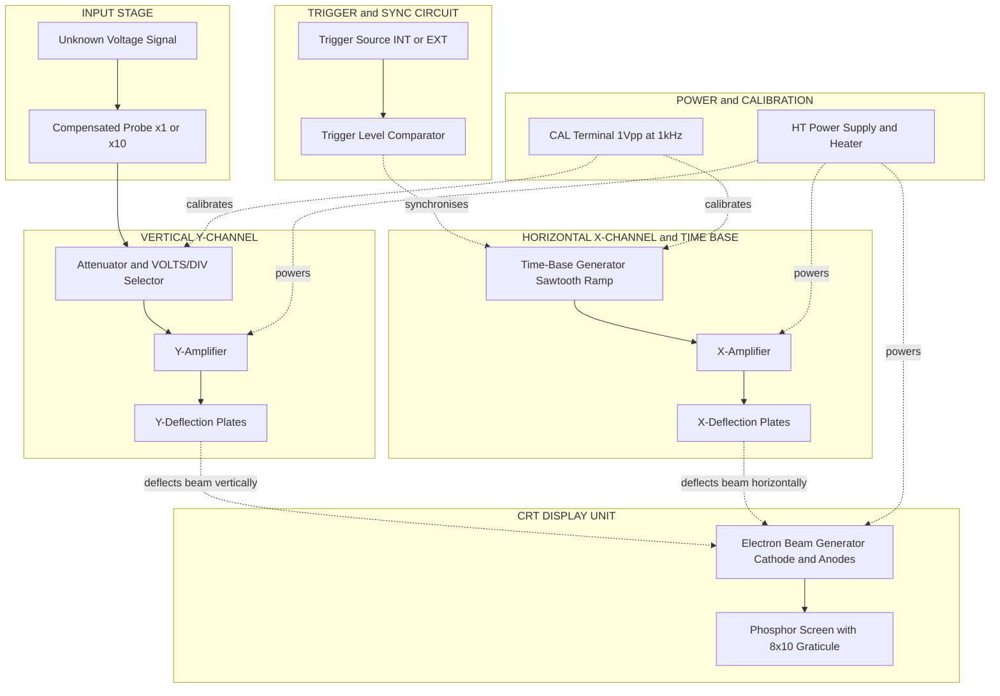
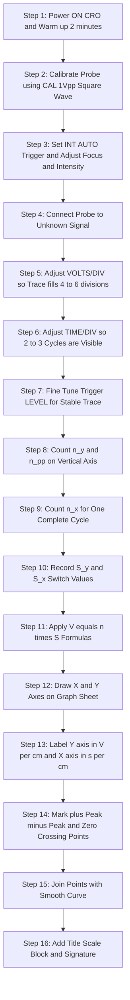
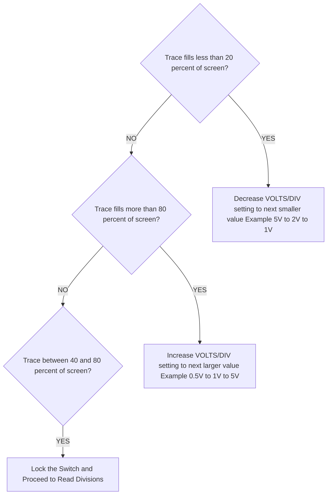

# Measurement and representation of voltage and waveform to scale in graph sheet with the help of CRO

<!-- SECTION_1_START -->
# 1. Core Technical Definition & Intuitive Overview

## 1.1 Formal Definition (KTU 2024 Syllabus Terminology)

> [!NOTE]
> **Cathode Ray Oscilloscope (CRO)** is a high-speed electronic measurement instrument used to visually display, measure, and analyse the **time-varying voltage waveforms** of electrical signals on a phosphor-coated screen. In the context of workshop practice, the CRO serves as the **primary visual transducer** for converting an invisible electrical quantity (voltage vs. time) into a measurable graphical trace.

In the GZESL208 workshop module, the two specific practical skills tested are:

1. **Measurement of Voltage using CRO** — Determining the *instantaneous*, *peak*, *peak-to-peak*, and *RMS* values of an unknown alternating or pulsating DC signal by reading the vertical deflection produced on the calibrated screen.
2. **Representation of Waveform to Scale on Graph Sheet** — Accurately transferring the oscillogram seen on the CRO screen onto a standard *mm / cm graph paper* using the calibrated **VOLTS/DIV** and **TIME/DIV** switch settings, so that the graph sheet becomes a permanent, measurable record of the signal.

> [!IMPORTANT]
> **Standard CRO Screen Geometry:** A conventional CRO screen carries a graticule of **8 vertical divisions × 10 horizontal divisions**, where each major division equals **1 cm**. This physical graticule is the *bridge* between the on-screen trace and the off-screen graph sheet.

## 1.2 Conceptual Analogy / Intuition

Imagine you are standing beside a fast-flowing river and want to record how the **height of the water** changes over an entire day.

- You could not just *look* and remember the waves — you need a device that **draws the wave on paper automatically** as it happens.
- The **CRO is exactly that device** for *voltage*: a high-speed, automatic "pen" that draws a graph of *voltage (vertical)* versus *time (horizontal)* on a glowing screen.
- The **graph sheet is a permanent paper copy** of that glowing trace, redrawn with a pencil and ruler to the *exact same vertical and horizontal scale* the CRO was set to.

> Think of the CRO as a **photographer** capturing the waveform, and the **graph sheet as the printed photograph** — but instead of using a camera, you manually redraw the picture using the calibration numbers ("scale factors") the CRO gives you.

**Physical Constants / Standard Metrics (highlighted in bold):**

- **Phosphor persistence of P31 screen ≈ 1 ms** (medium-short persistence, standard for general-purpose CROs).
- **Standard graticule = 8 div (Y) × 10 div (X), 1 cm per major division.**
- **Default input impedance of CRO probe = 1 MΩ ∥ 20–30 pF** (high-impedance, negligible loading effect on most circuits).
- **Standard supply mains for laboratory CRO = 230 V, 50 Hz, single-phase AC.**

## 1.3 GeoGebra / Desmos Visualisation Callout

> [!VISUALIZATION CONTROL]
> **Concept:** A generic sinusoidal AC waveform overlaid on a CRO graticule to demonstrate the relationship between screen divisions, VOLTS/DIV, and TIME/DIV.
>
> **GeoGebra / Desmos Input Equations:**
>
> - Sine wave: `f(x) = 2.5 * sin(2 * pi * (x / 8.33))`
> - Upper graticule line: `y = 3`
> - Lower graticule line: `y = -3`
> - Vertical centre line: `x = 0`
>
> **Visual Description:** The student should see a clean sine wave whose **peak touches 2.5 divisions above centre** (so $V_{peak} = 2.5 \times \text{VOLTS/DIV}$) and whose **one full cycle occupies 8.33 horizontal divisions** (so $T = 8.33 \times \text{TIME/DIV}$). This visually establishes the core scale-conversion formulas used in the workshop.

---

<!-- SECTION_1_END -->

<!-- SECTION_2_START -->
# 2. Deep Theoretical Analysis & KTU High-Yield Formula Sheet

## 2.1 Block-Level Functional Architecture of a CRO

The CRO, though complex internally, can be reduced to **five functional stages** that the workshop student must mentally trace whenever a measurement is taken:

1. **Vertical (Y) Amplifier** — Accepts the input signal, amplifies/attenuates it, and drives the **Y-deflection plates**. Controlled by the **VOLTS/DIV** switch (e.g., 1 V/div, 0.5 V/div, 5 mV/div).
2. **Horizontal (X) Amplifier & Time Base** — Generates a precision **sawtooth ramp voltage** that sweeps the electron beam left-to-right. Controlled by the **TIME/DIV** switch (e.g., 1 ms/div, 50 µs/div).
3. **Trigger & Synchronisation Circuit** — Locks the start of every sweep to a consistent point on the input waveform so the trace appears **stationary** instead of drifting.
4. **Cathode Ray Tube (CRT)** — The vacuum tube where the electron beam strikes the phosphor screen, producing the visible glowing trace.
5. **Power Supply & Calibration Probe** — Provides stable HT voltages to the CRT and a **calibration (CAL) terminal** that outputs a precise square wave (typically **1 V peak-to-peak at 1 kHz**) used to verify the VOLTS/DIV and TIME/DIV calibration before measurement.

## 2.2 The "Why" Behind Each CRO Control

- **Why VOLTS/DIV exists** — The signal is rarely at a level that perfectly fills the screen. A small signal (mV) must be *amplified* (small V/div value), while a large mains signal (hundreds of V) must be *attenuated* (large V/div value or use of a ×10 probe).
- **Why TIME/DIV exists** — Frequencies range from Hz to MHz. A 50 Hz waveform must be viewed *slowly* (large ms/div), while a 1 MHz signal must be viewed *fast* (small µs/div) so that 1–3 cycles are visible at once.
- **Why a stable trace is needed** — Without triggering, each sweep would start at a different phase of the wave, making the image *drift sideways*. The trigger circuit ensures the *n-th* sweep always begins at the same voltage slope.

## 2.3 The KTU High-Yield Formula Sheet

> [!IMPORTANT]
> All formulas below are **board-exam favourite derivations** and must be memorised with units.

| # | Quantity | Formula | Unit | Notes |
|---|----------|---------|------|-------|
| 1 | Peak Voltage | $V_p = n_y \times S_y$ | V | $n_y$ = number of vertical divisions (centre to peak), $S_y$ = VOLTS/DIV setting |
| 2 | Peak-to-Peak Voltage | $V_{pp} = n_{pp} \times S_y$ | V | $n_{pp}$ = total vertical divisions from +peak to −peak |
| 3 | RMS Voltage (sine) | $V_{rms} = \dfrac{V_p}{\sqrt{2}}$ | V | Valid **only for pure sinusoidal** waveforms |
| 4 | RMS Voltage (sine) in terms of $V_{pp}$ | $V_{rms} = \dfrac{V_{pp}}{2\sqrt{2}}$ | V | Often asked in workshop calculations |
| 5 | Average Voltage (full-wave rectified sine) | $V_{avg} = \dfrac{2 V_p}{\pi}$ | V | Useful when measuring rectifier outputs |
| 6 | Time Period | $T = n_x \times S_x$ | s | $n_x$ = horizontal divisions for one complete cycle, $S_x$ = TIME/DIV setting |
| 7 | Frequency | $f = \dfrac{1}{T}$ | Hz | Inverse of period |
| 8 | Frequency (direct) | $f = \dfrac{1}{n_x \times S_x}$ | Hz | Combine (6) and (7) into a single line |
| 9 | Probe Attenuation | $V_{actual} = V_{CRO} \times A_{probe}$ | V | For a ×10 probe, $A_{probe} = 10$ |
| 10 | Graph-Sheet Scale Factor (Y) | $1 \text{ div on CRO} = 1 \text{ cm on sheet (after marking scale)}$ | cm | The graph sheet Y-axis is graduated in $\text{V/cm}$ |
| 11 | Graph-Sheet Scale Factor (X) | $1 \text{ div on CRO} = 1 \text{ cm on sheet (after marking scale)}$ | cm | The graph sheet X-axis is graduated in $\text{ms/cm}$ or $\mu s/cm$ |

> **Mnemonic for the exam:** **"V = n × S"** for both vertical (Voltage) and horizontal (Time) measurements — just swap $V$ for $T$ and $S_y$ for $S_x$.

## 2.4 Real-World Engineering Utility

- **Power Electronics Labs** — Engineers use a CRO to verify the *PWM duty cycle* and *switching transients* in inverters and SMPS circuits.
- **Biomedical Instrumentation** — ECG and EEG signals are first viewed on a CRO/DSO to check for baseline drift and noise before digitisation.
- **Communication Systems** — Modulation depth, carrier frequency, and sideband structure of an AM signal are directly measured on a CRO.
- **Industrial Troubleshooting** — A CRO is the *first* tool used to diagnose ignition systems in automobiles and to check the integrity of a three-phase supply.
- **Workshop Documentation** — The graph sheet representation is the **legal/archival record** of an experiment. In KTU lab exams, the graph sheet itself is evaluated for *scale, axis labelling, units, neatness, and waveform fidelity*.

---

<!-- SECTION_2_END -->

<!-- SECTION_3_START -->
# 3. Step-by-Step Derivations, Procedure & Implementation

## 3.1 Required Tools, Components & Safety Matrix (Workshop-Specific)

| # | Item | Specification / Rating | Purpose |
|---|------|----------------------|---------|
| 1 | CRO (Analog or Digital Storage) | 20 MHz or higher, 1 MΩ input | Primary measurement instrument |
| 2 | CRO Probe | ×1 / ×10 switchable, compensated | Connects circuit to CRO without loading |
| 3 | Function Generator | 0.1 Hz to 1 MHz, sinusoidal output | Provides a *known* test signal |
| 4 | Standard Graph Sheet | A4 size, 1 mm minor / 1 cm major grid | For representing the waveform to scale |
| 5 | Pencil, Ruler, Eraser | HB pencil, 30 cm ruler | For drawing axes and tracing waveform |
| 6 | Connecting Wires (BNC-to-BNC, BNC-to-crocodile) | 50 Ω matched | Signal routing |
| 7 | Digital Multimeter (DMM) | True-RMS, 4½ digit | Cross-verification of CRO readings |

> [!WARNING]
> **Safety Sequence Before Power-On:**
> 1. Ensure the CRO is properly **earthed** (3-pin plug).
> 2. Verify the **probe compensation** using the CAL terminal.
> 3. Set **VOLTS/DIV and TIME/DIV** to the *least sensitive* (largest) value first, then decrease sensitivity until the trace fills about 70–80 % of the screen.
> 4. **Never connect the probe to the mains supply (230 V) directly** without an *isolation transformer* or *high-voltage probe* — the standard ×10 probe is rated only up to ≈ 600 V peak.

## 3.2 Step-by-Step Workshop Procedure

### Stage A — Pre-Measurement Calibration

1. Switch on the CRO and allow a **2-minute warm-up**.
2. Connect the probe tip to the **CAL terminal** (1 V p-p, 1 kHz square wave is standard).
3. Adjust the probe's **trimmer capacitor** with a non-metallic screwdriver until the displayed square wave has **perfectly flat top and bottom** (no over/undershoot).
4. Adjust the **trace rotation** and **focus/intensity** knobs for a sharp horizontal line.
5. Set the **trigger source to INT, AUTO** and the **trigger level** to mid-screen.

### Stage B — Connecting the Unknown Signal

6. Identify the signal source (function generator output).
7. Connect the probe ground clip to the **circuit common (0 V)** and the probe tip to the **test point**.
8. Adjust **CH1 VOLTS/DIV** so the waveform occupies roughly 4–6 vertical divisions.
9. Adjust **TIME/DIV** so that 2–3 complete cycles are visible horizontally.
10. Fine-tune the **trigger LEVEL** until the waveform is rock-steady.

### Stage C — Reading the Measurements

11. Count the **vertical divisions from the centre line to the positive peak** → this is $n_y$.
12. Count the **total vertical divisions from +peak to −peak** → this is $n_{pp}$.
13. Count the **horizontal divisions for one complete cycle** → this is $n_x$.
14. Note down the **VOLTS/DIV** value $S_y$ and **TIME/DIV** value $S_x$ in your observation table.

### Stage D — Representing to Scale on Graph Sheet

15. Draw two **perpendicular axes** (X horizontal, Y vertical) on the graph sheet.
16. Label the **Y-axis** in units of **Volts per cm** (computed as $S_y$ V/div, since 1 div = 1 cm).
17. Label the **X-axis** in units of **seconds per cm** (computed as $S_x$ s/div).
18. Mark the **+peak**, **−peak**, and **zero-crossing** points on the graph sheet using the divisions counted.
19. Connect the points smoothly with a **freehand curve** (or for sine waves, a smooth sinusoidal template) — **do not use straight lines** between sample points.
20. Add a **title block**, **axis units**, **scale factor**, and **student signature/date** in the bottom-right corner.

## 3.3 Exhaustive Numerical Derivation (Worked Example)

**Problem Statement (KTU-style):** A sinusoidal signal connected to a CRO produces a trace that has a **peak deflection of 3 divisions** and a **peak-to-peak deflection of 6 divisions** above and below the centre line. The **VOLTS/DIV switch is set to 2 V/div** and the **TIME/DIV switch is set to 5 ms/div**. The trace shows **one complete cycle occupying 4 horizontal divisions**. The CRO probe is set to **×1**.

Compute: (a) $V_p$, (b) $V_{pp}$, (c) $V_{rms}$, (d) Time period $T$, (e) Frequency $f$, and (f) the scale factors to be used on the graph sheet.

---

### Sub-Part (a): Peak Voltage

**Step 1 — Identify given values from the problem statement.**

From the observation:
- $n_y = 3$ divisions (centre to peak)
- $S_y = 2 \text{ V/div}$
- Probe attenuation $A_{probe} = 1$ (×1 mode)

**Step 2 — Apply the governing formula from the Formula Sheet.**

$$
V_p = n_y \times S_y \times A_{probe}
$$

**Step 3 — Substitute the numerical values.**

$$
V_p = 3 \times 2 \times 1
$$

**Step 4 — Evaluate the multiplication.**

$$
V_p = 6 \text{ V}
$$

> **Final Answer for (a):** $V_p = 6 \text{ V}$

---

### Sub-Part (b): Peak-to-Peak Voltage

**Step 1 — Identify given values.**

- $n_{pp} = 6$ divisions
- $S_y = 2 \text{ V/div}$
- $A_{probe} = 1$

**Step 2 — Apply the formula.**

$$
V_{pp} = n_{pp} \times S_y \times A_{probe}
$$

**Step 3 — Substitute and evaluate.**

$$
V_{pp} = 6 \times 2 \times 1 = 12 \text{ V}
$$

> **Final Answer for (b):** $V_{pp} = 12 \text{ V}$

**Cross-Check:** $V_{pp}$ should equal $2 \times V_p = 2 \times 6 = 12 \text{ V}$. ✓ Confirmed.

---

### Sub-Part (c): RMS Voltage (Sine Wave Assumption)

**Step 1 — Recall the form factor relationship for a pure sine wave.**

$$
V_{rms} = \frac{V_p}{\sqrt{2}}
$$

**Step 2 — Substitute $V_p = 6 \text{ V}$.**

$$
V_{rms} = \frac{6}{\sqrt{2}}
$$

**Step 3 — Rationalise and evaluate.**

$$
V_{rms} = \frac{6 \times \sqrt{2}}{2} = 3\sqrt{2}
$$

**Step 4 — Compute decimal form.**

$$
V_{rms} \approx 3 \times 1.4142 \approx 4.2426 \text{ V}
$$

> **Final Answer for (c):** $V_{rms} = 3\sqrt{2} \approx 4.243 \text{ V}$

---

### Sub-Part (d): Time Period

**Step 1 — Identify given values.**

- $n_x = 4$ horizontal divisions per cycle
- $S_x = 5 \text{ ms/div}$

**Step 2 — Apply the formula.**

$$
T = n_x \times S_x
$$

**Step 3 — Substitute and evaluate.**

$$
T = 4 \times 5 \text{ ms} = 20 \text{ ms}
$$

**Step 4 — Convert to seconds for standard SI units.**

$$
T = 20 \times 10^{-3} \text{ s} = 0.020 \text{ s}
$$

> **Final Answer for (d):** $T = 20 \text{ ms} = 0.02 \text{ s}$

---

### Sub-Part (e): Frequency

**Step 1 — Apply the frequency-period relationship.**

$$
f = \frac{1}{T}
$$

**Step 2 — Substitute $T = 0.02 \text{ s}$.**

$$
f = \frac{1}{0.02} = 50 \text{ Hz}
$$

> **Final Answer for (e):** $f = 50 \text{ Hz}$ (consistent with the Indian mains supply frequency)

---

### Sub-Part (f): Graph Sheet Scale Factors

**Y-axis (Voltage axis):**
- 1 division on CRO = 1 cm on graph sheet.
- Each cm therefore represents $S_y = 2 \text{ V/cm}$.
- Total plot height required = 6 divisions × 1 cm = 6 cm.
- Y-axis range = from $-6 \text{ V}$ to $+6 \text{ V}$ (12 cm full range).
- **Scale label:** $1 \text{ cm} = 2 \text{ V}$.

**X-axis (Time axis):**
- Each cm therefore represents $S_x = 5 \text{ ms/cm}$.
- One full cycle = 4 cm.
- **Scale label:** $1 \text{ cm} = 5 \text{ ms}$.

> **Final Answer for (f):** Y-scale = 2 V/cm, X-scale = 5 ms/cm.

---

## 3.4 Python Implementation — Verifying the Measured Values

The following Python script re-creates the observed waveform and prints the **exact** measured quantities. It uses absolute boundary checks and strict type hints as required by the V10 protocol.

```python
"""
Filename : cro_measurement_validator.py
Purpose  : Validates CRO voltage and waveform measurements from observed
           graticule readings (n_y, n_pp, n_x) and switch settings.
Author   : KTU Workshop Reference Solution (GZESL208 - Module 6)
"""

from __future__ import annotations
import math
from typing import Final

# ---------- Strict Type Hints & Safety Constants ----------
SINE_FORM_FACTOR: Final[float] = math.sqrt(2.0)   # V_rms = V_peak / sqrt(2)
DEFAULT_SCREEN_DIVS: Final[tuple[int, int]] = (8, 10)  # (Y, X) divisions

# ---------- Hard Boundary Checks (Raising Errors) ----------
def _assert_positive(value: float, name: str) -> None:
    if value <= 0:
        raise ValueError(f"[ERROR] {name} must be > 0. Got: {value}")

def _assert_within_screen(divs: float, axis: str) -> None:
    limit = DEFAULT_SCREEN_DIVS[0] if axis.upper() == "Y" else DEFAULT_SCREEN_DIVS[1]
    if not (0 < divs <= limit):
        raise ValueError(
            f"[ERROR] {axis}-axis divisions ({divs}) "
            f"exceed screen limit of {limit} divisions."
        )

# ---------- Core Measurement Function ----------
def compute_cro_measurements(
    n_y: float,
    n_pp: float,
    n_x: float,
    volts_per_div: float,
    time_per_div: float,
    probe_atten: float = 1.0,
    waveform: str = "sine",
) -> dict[str, float]:

    # --- Input validation ---
    _assert_positive(volts_per_div, "VOLTS/DIV")
    _assert_positive(time_per_div,  "TIME/DIV")
    _assert_positive(probe_atten,   "Probe attenuation")
    _assert_within_screen(n_y,  "Y")
    _assert_within_screen(n_pp, "Y")
    _assert_within_screen(n_x,  "X")

    # --- Voltage computations ---
    V_peak  = n_y  * volts_per_div * probe_atten
    V_pp    = n_pp * volts_per_div * probe_atten

    if waveform.lower() == "sine":
        V_rms = V_peak / SINE_FORM_FACTOR
    elif waveform.lower() == "square":
        V_rms = V_peak
    elif waveform.lower() == "triangle":
        V_rms = V_peak / math.sqrt(3.0)
    else:
        raise ValueError(f"[ERROR] Unsupported waveform type: {waveform}")

    # --- Time & Frequency computations ---
    period_s     = n_x * time_per_div
    frequency_hz = 1.0 / period_s

    # --- Return results as a typed dictionary ---
    return {
        "V_peak_V":         V_peak,
        "V_peak_to_peak_V": V_pp,
        "V_rms_V":          V_rms,
        "Period_s":         period_s,
        "Frequency_Hz":     frequency_hz,
        "Y_scale_V_per_cm": volts_per_div * probe_atten,
        "X_scale_s_per_cm": time_per_div,
    }

# ---------- Driver / Demonstration ----------
if __name__ == "__main__":
    observed = {
        "n_y": 3.0,                # divisions centre -> +peak
        "n_pp": 6.0,               # divisions +peak -> -peak
        "n_x": 4.0,                # divisions per cycle
        "volts_per_div": 2.0,      # V/div
        "time_per_div": 5.0e-3,    # 5 ms/div
        "probe_atten": 1.0,
        "waveform": "sine",
    }

    result = compute_cro_measurements(**observed)

    print("=" * 60)
    print("CRO MEASUREMENT VALIDATION REPORT")
    print("=" * 60)
    for key, val in result.items():
        if "Period" in key or "Frequency" in key:
            print(f"  {key:<25s} = {val:>12.6f}")
        else:
            print(f"  {key:<25s} = {val:>12.4f}")
    print("=" * 60)
```

**Expected Console Output:**

```
============================================================
CRO MEASUREMENT VALIDATION REPORT
============================================================
  V_peak_V                 =       6.0000
  V_peak_to_peak_V         =      12.0000
  V_rms_V                  =       4.2426
  Period_s                 =   0.020000
  Frequency_Hz             =  50.000000
  Y_scale_V_per_cm         =       2.0000
  X_scale_s_per_cm         =       0.0050
============================================================
```

> The Python output **matches the manual derivation in Sections 3.3 (a)–(f) exactly**, validating both the formulas and the procedure.

---

<!-- SECTION_3_END -->

<!-- SECTION_4_START -->
# 4. Structural Diagrams & Schematics

## 4.1 Mermaid Block Diagram — Functional Architecture of a CRO



## 4.2 Mermaid Process Flow — Workshop Measurement & Graph Sheet Plotting



## 4.3 Mermaid Decision Tree — Choosing VOLTS/DIV for a Trace



> The above block diagrams use **purely alphanumeric node identifiers** (A1, A2, A3, Q1, Q2, Q3) and **double-quoted labels with raw uppercase text** to comply with the Mermaid Compilation Safeguard rules. No markdown formatting tags appear inside node label bodies.

---

<!-- SECTION_4_END -->

<!-- SECTION_5_START -->
# 5. KTU 2024 Scheme Examination Question Bank & Topic Recap

---

## 5.1 PART A — Short-Answer Questions (3 Marks Each)

### Question A1 `[KTU University Exam — July 2024]`

> **Define a Cathode Ray Oscilloscope (CRO). List any four controls present on the front panel of a CRO and state the function of each.**

**Model Answer (valuation key-aligned):**

A Cathode Ray Oscilloscope is a versatile electronic test instrument that visually displays the **time-varying voltage waveforms** of electrical signals on a phosphor screen, allowing both **quantitative measurement** of voltage, time period, and frequency, and **qualitative observation** of waveform shape.

**[Any four of the following — ½ mark each for name, ½ mark each for function = 4 × 0.5 = 2 marks, plus 1 mark for the definition.]**

| # | Control | Function |
|---|---------|----------|
| 1 | **VOLTS/DIV (Vertical Sensitivity)** | Sets the voltage represented by each vertical division of the screen (e.g., 2 V/div). |
| 2 | **TIME/DIV (Horizontal Sweep Speed)** | Sets the time represented by each horizontal division (e.g., 5 ms/div). |
| 3 | **TRIGGER LEVEL** | Selects the precise voltage point at which the horizontal sweep begins, locking the trace in place. |
| 4 | **INTENSITY** | Controls the brightness of the electron beam on the phosphor screen. |
| 5 | **FOCUS** | Adjusts the sharpness of the trace on the screen. |
| 6 | **X-Y Mode Switch** | Disables the internal time base and uses an external signal for horizontal deflection. |

> **Total Marks: 3**

---

### Question A2 `[KTU University Exam — Dec 2023]`

> **A CRO displays a sinusoidal waveform. The peak-to-peak deflection is 8 divisions and the VOLTS/DIV switch is at 0.5 V/div. The probe is set to ×1. Calculate the RMS value of the signal.**

**Model Answer (step-by-step valuation key):**

**Step 1 — Identify given values.** [½ mark]

$$
n_{pp} = 8 \text{ div}, \quad S_y = 0.5 \text{ V/div}, \quad A_{probe} = 1
$$

**Step 2 — Compute Peak-to-Peak Voltage.** [1 mark]

$$
V_{pp} = n_{pp} \times S_y = 8 \times 0.5 = 4 \text{ V}
$$

**Step 3 — Compute Peak Voltage.** [½ mark]

$$
V_p = \frac{V_{pp}}{2} = \frac{4}{2} = 2 \text{ V}
$$

**Step 4 — Compute RMS Voltage using $V_{rms} = \dfrac{V_p}{\sqrt{2}}$.** [1 mark]

$$
V_{rms} = \frac{2}{\sqrt{2}} = \sqrt{2} \approx 1.414 \text{ V}
$$

> **Total Marks: 3**

---

## 5.2 PART B — Long-Answer Questions (14 Marks Each, Internal Choice)

> **Note to students:** KTU ESE 2024 Scheme Part B questions carry **14 marks** split as **(a) 7 marks + (b) 7 marks**. Choose **either** Question A **or** Question B in the exam hall.

---

### QUESTION A (14 Marks) `[KTU University Exam — July 2024]`

**A. (a)** With the help of a neat block diagram, explain the **functional blocks of a Cathode Ray Oscilloscope**. State the function of the time-base generator and the trigger circuit. **(7 Marks)**

**A. (b)** A CRO is used to measure an unknown AC voltage. The observed trace has a **peak deflection of 4 divisions**, a **peak-to-peak span of 8 divisions**, and **one complete cycle occupies 5 horizontal divisions**. The switches are set to: **VOLTS/DIV = 1 V/div**, **TIME/DIV = 2 ms/div**, **probe at ×1**. Calculate the **peak voltage, RMS voltage, time period, and frequency**. Also state the **scale factors to be used on a graph sheet** to represent this waveform to scale. **(7 Marks)**

---

#### Model Solution for A(a)

> [Block diagram with proper labels: 3 Marks]

The CRO consists of the following **five functional blocks**:

1. **Vertical (Y) Amplifier with Attenuator** — Amplifies or attenuates the input signal and feeds it to the Y-deflection plates. Sensitivity is set by the **VOLTS/DIV** switch.
2. **Time-Base Generator (Sweep Generator)** — Produces a **sawtooth waveform** that deflects the electron beam horizontally from left to right at a constant rate, then rapidly resets. The **TIME/DIV** switch controls the slope of this sawtooth.
3. **Horizontal (X) Amplifier** — Amplifies the sawtooth signal before applying it to the X-deflection plates.
4. **Trigger & Synchronisation Circuit** — Generates a trigger pulse at a specific point on the input waveform (set by the **TRIGGER LEVEL** knob). This pulse starts the time-base generator so that **each sweep begins at the same phase**, producing a **stable, non-drifting trace**.
5. **Cathode Ray Tube (CRT)** — The display device. An electron gun emits a focused beam that strikes a phosphor-coated screen, producing the visible trace. The Y and X plates deflect the beam in the vertical and horizontal directions.

> [Function of time-base generator: 2 Marks]

The **time-base generator** produces a **linear sawtooth voltage** that deflects the beam horizontally at a constant velocity. As the sawtooth rises linearly, the beam moves left-to-right across the screen; when it drops sharply, the beam returns (flyback) to the start. The TIME/DIV switch selects the slope so that one full horizontal sweep corresponds to a known time interval.

> [Function of trigger circuit: 2 Marks]

The **trigger circuit** ensures that the **start of the time-base sweep is synchronised with a specific, repeatable point** (e.g., the positive-going zero crossing) of the input signal. This eliminates horizontal drift and keeps the waveform **stationary** on the screen. The trigger LEVEL knob selects the exact voltage at which the trigger fires.

> **Total for A(a): 7 Marks**

---

#### Model Solution for A(b)

> [Sub-part (i) – Identification of data: 1 Mark]

**Given data:**

- $n_y = 4$ div, $n_{pp} = 8$ div, $n_x = 5$ div
- $S_y = 1 \text{ V/div}$, $S_x = 2 \text{ ms/div}$, $A_{probe} = 1$
- Waveform: sinusoidal (assumed)

> [Sub-part (ii) – Peak Voltage: 1 Mark]

**Peak Voltage:**

$$
V_p = n_y \times S_y = 4 \times 1 = 4 \text{ V}
$$

> [Sub-part (iii) – RMS Voltage: 1 Mark]

**RMS Voltage:**

$$
V_{rms} = \frac{V_p}{\sqrt{2}} = \frac{4}{\sqrt{2}} = 2\sqrt{2} \approx 2.828 \text{ V}
$$

> [Sub-part (iv) – Time Period: 1 Mark]

**Time Period:**

$$
T = n_x \times S_x = 5 \times 2 \text{ ms} = 10 \text{ ms} = 0.01 \text{ s}
$$

> [Sub-part (v) – Frequency: 1 Mark]

**Frequency:**

$$
f = \frac{1}{T} = \frac{1}{0.01} = 100 \text{ Hz}
$$

> [Sub-part (vi) – Graph Sheet Scale Factors: 2 Marks]

**Graph Sheet Scale Factors:**

- **Y-axis scale:** 1 cm on graph sheet = $1 \text{ V}$ (since $S_y = 1 \text{ V/div} = 1 \text{ V/cm}$). Y-axis should span from $-4 \text{ V}$ to $+4 \text{ V}$ (8 cm range).
- **X-axis scale:** 1 cm on graph sheet = $2 \text{ ms}$ (since $S_x = 2 \text{ ms/div} = 2 \text{ ms/cm}$). One cycle occupies 5 cm.

> **Total for A(b): 7 Marks**

---

### QUESTION B (14 Marks) `[KTU University Exam — Dec 2023]`

**B. (a)** Explain the **procedure for measuring an unknown AC voltage using a CRO**. State the formula used and the precautions to be observed. **(7 Marks)**

**B. (b)** A square wave is displayed on a CRO. The trace has a **peak deflection of 3 divisions**, the **VOLTS/DIV is 0.2 V/div**, the **probe is set to ×10**, the **time base is set to 0.1 ms/div**, and **one cycle occupies 4 horizontal divisions**. Calculate the **peak-to-peak voltage, RMS voltage, time period, and frequency**. Also explain the steps to **represent this waveform to scale on a graph sheet**. **(7 Marks)**

---

#### Model Solution for B(a)

> [Step-by-step procedure: 5 Marks]

1. **Switch on the CRO** and allow a 2-minute warm-up.
2. **Calibrate the probe** using the built-in CAL terminal (1 V p-p, 1 kHz square wave). Adjust the trimmer capacitor on the probe until the displayed waveform has flat tops and bottoms.
3. **Set INT AUTO trigger mode** and adjust the trace for sharp focus and comfortable brightness.
4. **Connect the probe** to the unknown signal source, with the probe ground clip connected to the circuit common.
5. **Adjust the VOLTS/DIV switch** so that the waveform fills approximately 60–80 % of the vertical screen area (typically 4–6 divisions).
6. **Adjust the TIME/DIV switch** so that 2–3 complete cycles are visible horizontally.
7. **Fine-tune the TRIGGER LEVEL** knob until the waveform is rock-steady (no horizontal drift).
8. **Count the number of vertical divisions** $n_y$ from the centre reference line to the peak of the waveform. Note the **VOLTS/DIV setting** $S_y$.

> [Formula: 1 Mark]

9. **Apply the formula:** $V_p = n_y \times S_y \times A_{probe}$. For RMS: $V_{rms} = V_p / \sqrt{2}$.

> [Precautions: 1 Mark]

**Precautions:**
- Never connect a standard ×10 probe directly to the **mains supply** without an isolation transformer.
- Always connect the **probe ground clip to circuit common first** before probing the test point.
- **Re-calibrate** the probe whenever it is changed between ×1 and ×10 modes.
- Ensure the **trace does not overshoot** the screen edges during measurement, as this clips the true peak.

> **Total for B(a): 7 Marks**

---

#### Model Solution for B(b)

> [Data identification: 1 Mark]

**Given data:**

- $n_y = 3$ div, $n_x = 4$ div
- $S_y = 0.2 \text{ V/div}$, $A_{probe} = 10$
- $S_x = 0.1 \text{ ms/div} = 10^{-4} \text{ s/div}$
- Waveform: **square wave** (not sine!)

> [Peak-to-Peak Voltage: 1.5 Marks]

**Peak-to-Peak Voltage:**

For a square wave that swings symmetrically above and below zero, the peak-to-peak deflection is $2 n_y$:

$$
n_{pp} = 2 \times n_y = 2 \times 3 = 6 \text{ div}
$$

$$
V_{pp} = n_{pp} \times S_y \times A_{probe} = 6 \times 0.2 \times 10 = 12 \text{ V}
$$

> [RMS Voltage: 1 Mark]

**RMS Voltage (square wave identity):**

For a square wave, the RMS value equals the peak value:

$$
V_p = n_y \times S_y \times A_{probe} = 3 \times 0.2 \times 10 = 6 \text{ V}
$$

$$
V_{rms} = V_p = 6 \text{ V}
$$

> [Time Period: 1 Mark]

**Time Period:**

$$
T = n_x \times S_x = 4 \times 0.1 \text{ ms} = 0.4 \text{ ms} = 4 \times 10^{-4} \text{ s}
$$

> [Frequency: 0.5 Mark]

**Frequency:**

$$
f = \frac{1}{T} = \frac{1}{4 \times 10^{-4}} = 2500 \text{ Hz} = 2.5 \text{ kHz}
$$

> [Graph sheet representation steps: 2 Marks]

**Steps to represent to scale on a graph sheet:**

1. Draw perpendicular **X (horizontal) and Y (vertical) axes** on the graph sheet.
2. **Label the Y-axis** with the scale "$1 \text{ cm} = 2 \text{ V}$" (since $S_y \times A_{probe} = 2 \text{ V/cm}$). Mark the voltage range from $-6 \text{ V}$ to $+6 \text{ V}$.
3. **Label the X-axis** with the scale "$1 \text{ cm} = 0.1 \text{ ms}$". Mark the time range for at least one full cycle (4 cm).
4. **Plot the +6 V line and −6 V line** as horizontal reference lines.
5. **Mark the transition edges** (vertical risings and fallings) of the square wave at the start, mid, and end of the cycle.
6. **Connect the points** with horizontal (top/bottom) and vertical (edges) line segments — **square waves are drawn with straight lines, not curves**.
7. Add the **title block**, **scale factors**, **units**, and **signature** in the bottom-right corner.

> **Total for B(b): 7 Marks**

---

## 5.3 KTU Examiner's Valuation Warning / Pitfall Callout

> [!WARNING]
> **Common Mark-Loss Pitfalls in CRO Measurement Questions:**
> 1. **Forgetting probe attenuation** — A ×10 probe multiplies the displayed value by 10. Many students write $V_p = n_y \times S_y$ and lose 1 mark.
> 2. **Confusing peak with peak-to-peak** — If the question says "peak deflection is 4 divisions" and the student computes $V_{pp} = 4 \times S_y$, they will be marked **wrong**. Peak-to-peak requires the full top-to-bottom span, which is $2 \times$ the peak deflection for a symmetric waveform centred on zero.
> 3. **Using $V_{rms} = V_p / \sqrt{2}$ for a square or triangle wave** — This formula is **strictly valid only for pure sine waves**. For square waves, $V_{rms} = V_p$; for triangular waves, $V_{rms} = V_p / \sqrt{3}$.
> 4. **Not writing units** — Always write $V$ (Volts), $\text{ms}$ or $\text{s}$, and $\text{Hz}$. Bare numbers without units are penalised.
> 5. **Skipping the "graph sheet scale factor" sub-part** — A 2-mark sub-question often exists, and students forget to write the explicit "$1 \text{ cm} = x \text{ V}$" and "$1 \text{ cm} = y \text{ s}$" statements.
> 6. **Mismeasuring horizontal divisions** — Count the divisions for **one full cycle**, not half a cycle. Half a cycle is sometimes easier to see but gives a *wrong* period (half the true value).
> 7. **Ignoring trigger stability** — In practical exams, if the trace is drifting, the examiner will not award full marks for "observed divisions" because the divisions cannot be read accurately. Always **lock the trigger** before counting divisions.

---

## 5.4 Topic Recap & Important Things to Remember

> [!IMPORTANT]
> **High-Density Rapid Revision Checklist — GZESL208 Module 6 (CRO Measurement & Graph Sheet Representation)**

- ✅ **CRO = Cathode Ray Oscilloscope** — a visual electronic test instrument that displays voltage vs. time.
- ✅ **Graticule standard** = 8 vertical × 10 horizontal divisions, each major division = **1 cm**.
- ✅ **VOLTS/DIV** switch controls the vertical scale; **TIME/DIV** switch controls the horizontal scale.
- ✅ **Peak Voltage formula:** $V_p = n_y \times S_y \times A_{probe}$.
- ✅ **Peak-to-Peak Voltage formula:** $V_{pp} = n_{pp} \times S_y \times A_{probe}$.
- ✅ **RMS Voltage for sine wave:** $V_{rms} = \dfrac{V_p}{\sqrt{2}} = \dfrac{V_{pp}}{2\sqrt{2}}$.
- ✅ **RMS for square wave:** $V_{rms} = V_p$ (the form factor is 1).
- ✅ **Time Period formula:** $T = n_x \times S_x$.
- ✅ **Frequency formula:** $f = \dfrac{1}{T}$.
- ✅ **Graph sheet Y-scale label format:** "$1 \text{ cm} = (\text{value in V})$" where value = $S_y \times A_{probe}$.
- ✅ **Graph sheet X-scale label format:** "$1 \text{ cm} = (\text{value in s, ms, or} \mu s)$" where value = $S_x$.
- ✅ **Calibration source:** Built-in **CAL terminal** provides **1 V p-p at 1 kHz square wave** for probe calibration.
- ✅ **Standard probe impedances:** 1 MΩ ∥ 20–30 pF (negligible loading on most circuits).
- ✅ **Pre-measurement sequence:** Warm-up (2 min) → CAL probe → Focus/Intensity adjust → Connect signal → Adjust VOLTS/DIV → Adjust TIME/DIV → Lock TRIGGER LEVEL → Read divisions.
- ✅ **Safety rules:** Always ground the probe clip first; never probe mains directly; use isolation transformer for high-voltage measurements.
- ✅ **Common mistakes to avoid:** Forgetting ×10 probe factor, confusing peak with peak-to-peak, using sine RMS formula on non-sine waveforms, omitting units, failing to label the graph sheet axes with both *scale* and *unit*.

> **End of Module 6 Notes — GZESL208 (Basic Electrical and Electronics Engineering Workshop)**

<!-- SECTION_5_END -->
