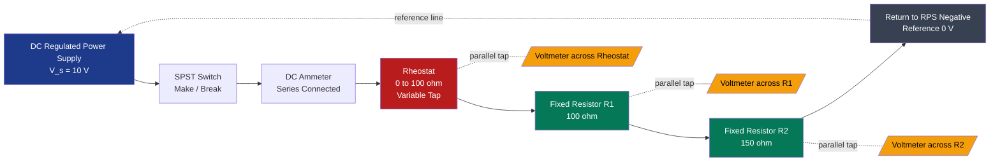
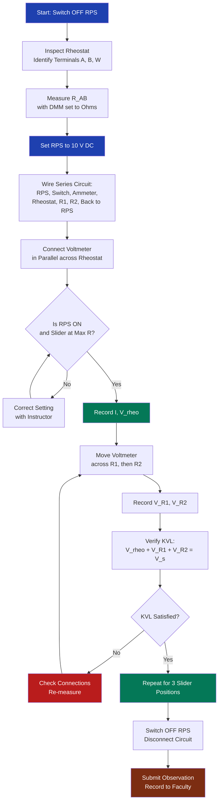
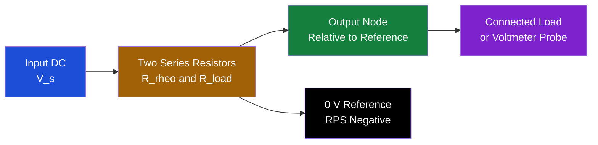

# Familiarization of rheostats, measurement of potential across resistance elements and introducing the concept of relative potential using a DC circuit.

<!-- SECTION_1_START -->

# Rheostats, Potential Measurement & Relative Potential in DC Circuits

## 1.1 Core Technical Definition

> [!IMPORTANT]
> **Rheostat (KTU 2024 Definition):** A **rheostat** is a two-terminal **variable resistor** whose resistance can be adjusted manually (either linearly or rotationally) without interrupting the circuit, primarily used to control the magnitude of **electric current** flowing through a load by varying the effective length of the conducting path.

> [!NOTE]
> **Electric Potential (V):** The amount of **electric potential energy** per unit positive charge at a point in an electric field, measured in **Volts (V)**, where $1\ \text{V} = 1\ \text{J/C}$.

> [!IMPORTANT]
> **Potential Difference (Voltage Drop):** The difference in electric potential between two points in a circuit, mathematically expressed as $V_{AB} = V_A - V_B$, representing the work done per unit charge in moving a positive test charge from point $B$ to point $A$.

> [!NOTE]
> **Relative Potential:** The potential of any node in a circuit measured **with respect to a chosen reference node** (commonly called the *ground* or *reference* node), assigned an arbitrary value of **0 V**. Without a reference, absolute potential is meaningless — only *differences* in potential are physically measurable.

> [!IMPORTANT]
> **KTU 2024 Highlight — Workshop Vocabulary:** In the GZESL208 syllabus, the term *resistance element* refers to any dissipative component (carbon resistor, rheostat section, lamp filament, etc.) across which a measurable **potential drop** exists in accordance with **Ohm's Law**:
> $$V = I \cdot R$$

---

## 1.2 Conceptual Analogy & Intuitive Overview

### 🍎 The Water-Pipe Analogy

Imagine a long horizontal water pipe carrying water from a high tank to a low tank. The *pressure difference* between the two ends of the pipe drives the water flow.

- **Voltage (V)** → Water pressure (potential energy per unit "charge" of water)
- **Current (I)** → Rate of water flow
- **Resistance (R)** → A narrow constriction or partially closed valve in the pipe

| Water System | Electrical Equivalent |
|---|---|
| High tank (full) | Positive terminal of battery |
| Low tank (empty) | Negative terminal (0 V reference) |
| Partially closed valve | **Rheostat** (adjustable resistance) |
| Pressure drop across valve | Potential drop across rheostat |
| Water flow rate | Current $I$ |
| Gauge reading difference | **Relative potential** measurement |

### 💡 The Dimmer Switch Mental Model

When you rotate the knob of a *fan regulator* or *light dimmer* at home, you are physically sliding a **wiper contact** across a resistive element inside a **rheostat**. As you turn the knob:

- **More wire length engaged** → Higher resistance → Lower current → Fan slows / Lamp dims
- **Less wire length engaged** → Lower resistance → Higher current → Fan speeds up / Lamp brightens

This is the *exact* working principle of the rheostat you will use in your GZESL208 workshop bench.

---

## 1.3 Why *Relative* Potential? (Intuitive Justification)

> [!NOTE]
> A **voltmeter cannot measure the absolute potential** of a single point — physics only allows us to measure *differences*. Imagine standing on a mountain: your *altitude* is meaningless unless you specify "above sea level" or "above the base camp". In the same way, the potential at any node is meaningful only when you state **"with respect to which reference point?"**

In a typical KTU workshop DC circuit, the **negative terminal of the DC source is chosen as the reference (0 V)**, and the potentials of all other nodes are measured **relative to this 0 V reference**.

---

## 1.4 Visualization Control Block

> [!VISUALIZATION CONTROL]
> **Concept:** Voltage Divider — Potential variation along a series resistive chain
> **GeoGebra / Desmos Input Equations:**
> * `R1 = 100` (Resistor 1 in ohms)
> * `R2 = 200` (Resistor 2 in ohms)
> * `V_in = 12` (Input DC voltage in volts)
> * `V_out(x) = V_in * (R2 / (R1 + R2)) * (x / L)` where `x` is slider position and `L` is total rheostat length
>
> **Visual Description:** A straight horizontal axis representing the resistive track of the rheostat from $0$ to $L$. The curve starts at $0\ \text{V}$ at the left terminal, rises linearly, and saturates at $V_{out} = 8\ \text{V}$ at the right terminal — demonstrating how potential *increases* as you traverse the resistive element carrying current.

---

<!-- SECTION_1_END -->

<!-- SECTION_2_START -->

# Deep Theoretical Analysis & KTU High-Yield Formula Sheet

## 2.1 Construction of a Rheostat (Workshop-Relevant Details)

A typical **wire-wound rheostat** used in KTU electrical workshops consists of the following physical components:

| S.No | Component | Function | Material |
|:---:|---|---|---|
| 1 | **Resistive Element** | Provides the variable resistance | Constantan / Nichrome wire wound on a ceramic tube |
| 2 | **Wiper / Slider** | Moves along the track to tap-off variable resistance | Brass or phosphor-bronze contact |
| 3 | **Knob / Slider Handle** | Externally operated mechanical control | Bakelite / hard plastic (insulated) |
| 4 | **Two End Terminals (A, B)** | Connect rheostat in series with the load | Brass with insulation collar |
| 5 | **Porcelain / Ceramic Former** | Heat-resistant base that supports the wire | Alumina ceramic |
| 6 | **Metal Housing / Frame** | Mechanical protection and mounting | Powder-coated steel |

> [!IMPORTANT]
> **Key Distinction (Frequently Tested in KTU):** A **rheostat uses only 2 terminals** (end + wiper), while a **potentiometer uses all 3 terminals** (two ends + wiper) as a voltage divider. When used as a *variable resistor* (current control), the rheostat configuration is preferred.

---

## 2.2 Types of Rheostats Recognized in the KTU Workshop

| Type | Movement | Typical Resistance | KTU Application |
|---|---|---|---|
| **Linear (Slider) Rheostat** | Straight-line sliding | $0$ to several hundred $\Omega$ | Series current control in lab DC circuits |
| **Rotary (Circular) Rheostat** | Rotational knob | $10\ \Omega$ to $100\ \text{k}\Omega$ | Fan regulators, dimmer switches |
| **Preset Rheostat (Trimpot)** | Screwdriver adjusted | $100\ \Omega$ to $1\ \text{M}\Omega$ | Calibration, one-time fine-tuning |
| **Carbon-Track Rheostat** | Rotary | $1\ \text{k}\Omega$ to $10\ \text{M}\Omega$ | Electronic circuit biasing |

---

## 2.3 Governing Physical Laws

### Ohm's Law (Foundation)
$$V = I \cdot R \quad \Longleftrightarrow \quad I = \dfrac{V}{R} \quad \Longleftrightarrow \quad R = \dfrac{V}{I}$$

### Resistance of a Uniform Wire (Material Property)
$$R = \rho \cdot \dfrac{L}{A}$$

where:
- $\rho$ = resistivity of material in $\Omega \cdot \text{m}$
- $L$ = length of wire engaged in $\text{m}$
- $A$ = cross-sectional area in $\text{m}^2$

> [!NOTE]
> **Rheostat Operation Principle:** Since $\rho$ and $A$ are *fixed* for a given rheostat, varying $L$ (the engaged length of wire between the wiper and one terminal) directly varies $R$.

### Power Dissipation (Heat Generated)
$$P = I^2 R = \dfrac{V^2}{R} = V \cdot I \quad \text{(in Watts)}$$

### Voltage Divider Rule (Critical for "Relative Potential" Concept)
For two resistors $R_1$ and $R_2$ in series across a source $V_s$:

$$V_{R_1} = V_s \cdot \dfrac{R_1}{R_1 + R_2}, \quad V_{R_2} = V_s \cdot \dfrac{R_2}{R_1 + R_2}$$

### Kirchhoff's Voltage Law (KVL) — Underlying Theorem
$$\sum_{k=1}^{n} V_k = 0 \quad \text{(around any closed loop)}$$

This guarantees that the **sum of potential drops across all series elements equals the source voltage**.

---

## 2.4 KTU Formula Cheat Sheet (Print-Friendly Summary)

> [!IMPORTANT]
> All formulas below are **board-exam high-yield** and must be memorized verbatim for GZESL208.

| # | Formula | Symbol Meaning | SI Unit |
|:---:|---|---|---|
| 1 | $V = I R$ | Ohm's Law | V |
| 2 | $R = \rho \dfrac{L}{A}$ | Resistance of uniform wire | $\Omega$ |
| 3 | $V_{\text{drop}} = I \cdot R$ | Potential drop across resistor | V |
| 4 | $V_{\text{rel}}(x) = V_s \cdot \dfrac{R_x}{R_{\text{total}}}$ | Relative potential at node $x$ | V |
| 5 | $V_s = \sum V_{R_i}$ | KVL in series loop | V |
| 6 | $P = V I = I^2 R$ | Power dissipated | W |
| 7 | $I = \dfrac{V_s}{R_{\text{series}}}$ | Series current | A |
| 8 | $V_{\text{meter}} = V_+ - V_-$ | Voltmeter reading convention | V |
| 9 | $R_{\text{eq, series}} = R_1 + R_2 + \dots + R_n$ | Series equivalent | $\Omega$ |
| 10 | $\%\text{Error} = \dfrac{\vert V_{\text{meas}} - V_{\text{calc}} \vert}{V_{\text{calc}}} \times 100$ | Experimental error | % |

> [!WARNING]
> **No Vertical Pipes in Tables:** Note the use of $\vert \cdot \vert$ rendered via `\vert` to avoid breaking the markdown table syntax. In your answer scripts, always write $|x|$ clearly using LaTeX.

---

## 2.5 Real-World Engineering Utility

| Application Domain | Specific Use of Rheostat | Role of Potential Measurement |
|---|---|---|
| **Electric Vehicles (EVs)** | Throttle-controlled rheostat (legacy) → modern PWM | Battery terminal voltage monitoring |
| **Industrial Motor Starters** | Pre-set resistance during motor startup | Phase voltage balancing |
| **Laboratory DC Sources** | Adjustable current-limited output | Multi-point potential mapping |
| **Audio Mixing Consoles** | Slider faders (linear rheostats) | Channel-level calibration |
| **Battery Chargers** | Current-limiting rheostat | Cell voltage equalization |
| **Educational DC Labs** | Classic variable resistance training | Verifying KVL experimentally |

> [!NOTE]
> **Production Note:** In modern industrial systems, rheostats have been largely replaced by **MOSFETs / IGBTs operating in the linear region** for current control, and by **PWM choppers** for motor speed control. However, the *physical principle* of variable resistance and the measurement of relative potential remain foundational in every electronics curriculum, including the GZESL208 module.

---

<!-- SECTION_2_END -->

<!-- SECTION_3_START -->

# Step-by-Step Derivations, Experimental Procedure & Code Implementation

## 3.1 Workshop Setup — Component & Tool Specification Table

> [!IMPORTANT]
> The following is the **complete bill of materials** for the GZESL208 Module 7 experiment. Familiarize yourself with each item before entering the lab.

| S.No | Item | Specification | Quantity | Safety Class |
|:---:|---|---|:---:|---|
| 1 | DC Regulated Power Supply (RPS) | $0\text{–}30\ \text{V}$, $0\text{–}2\ \text{A}$ | 1 | Class II insulated |
| 2 | Wire-wound Rheostat | $0\text{–}100\ \Omega$, $2\ \text{A}$ rating | 1 | Heat-resistant ceramic body |
| 3 | Carbon Film Resistors | $47\ \Omega$, $100\ \Omega$, $220\ \Omega$ (each $\frac{1}{4}\ \text{W}$) | 1 each | Standard |
| 4 | Digital Multimeter (DMM) | $3\frac{1}{2}$-digit, $0.5\%$ accuracy | 1 | CAT II 600 V |
| 5 | DC Ammeter (analog) | $0\text{–}1\ \text{A}$ or $0\text{–}2\ \text{A}$ | 1 | Moving coil |
| 6 | DC Voltmeter (analog) | $0\text{–}15\ \text{V}$ or $0\text{–}30\ \text{V}$ | 1 | Moving coil |
| 7 | Breadboard / Tag board | 740-point | 1 | Insulated |
| 8 | Connecting Wires (PVC) | $1.0\ \text{mm}^2$ copper, red & black | As needed | 600 V insulation |
| 9 | SPST Switch | $5\ \text{A}$ toggle | 1 | — |
| 10 | Connecting leads with banana plugs | Insulated | 4 | — |

### Required Tool Profiles
- Wire stripper (for $1.0\ \text{mm}^2$ copper)
- Insulated screwdriver (for rheostat terminal screws)
- Crocodile clip leads (for voltmeter connection)
- Digital multimeter test probes (red = positive, black = common)

### Safety Monitoring Steps
1. **Power OFF** the RPS before any wiring change.
2. Always connect the **ammeter in series** and the **voltmeter in parallel**.
3. Verify the **rheostat is initially set to maximum resistance** before powering ON.
4. Never exceed the **rated current** of the rheostat (continuous heat dissipation test).
5. Keep the **rheostat ventilated** — ceramic body becomes hot at high currents.

---

## 3.2 Exhaustive Step-by-Step Experimental Procedure

### **Part A — Familiarization of the Rheostat**

**Step 1: Visual Inspection**
Examine the rheostat and identify the three terminals. The two end terminals are marked **A** and **B**, and the middle terminal is the **wiper (W)**. Move the slider slowly from one end to the other and observe the smooth mechanical travel.

**Step 2: Resistance Measurement Using DMM**
Set the digital multimeter to the **Ohms ($\Omega$)** range. Connect the red probe to terminal **A** and the black probe to the wiper **W**. Now slide the wiper:

- At position 1 (wiper at A): Reading $\approx 0\ \Omega$
- At position 2 (wiper midway): Reading $\approx 50\ \Omega$ (half of $100\ \Omega$)
- At position 3 (wiper at B): Reading $\approx 100\ \Omega$

This **confirms the linear relationship** $R \propto L$ where $L$ is the engaged wire length.

**Step 3: Identify the Rated Resistance**
The maximum resistance is read by connecting the DMM between terminals **A** and **B** (full track). This is the **rated resistance** stamped on the rheostat label.

---

### **Part B — Wiring a Series DC Circuit with Rheostat**

**Step 4: Power Supply Setup**
- Set the RPS voltage to **$V_s = 10\ \text{V}$** DC (constant).
- Connect the **positive (red) terminal** of RPS to one end of the SPST switch.

**Step 5: Series Circuit Wiring Sequence**

Connect the components in the following **exact order** (a *series loop*):

> **RPS (+) → SPST switch → Ammeter (+) → Ammeter (−) → Rheostat Terminal A → Wiper (or end B) → Fixed Resistor $R_1$ → Fixed Resistor $R_2$ → RPS (−)**

**Step 6: Voltmeter Parallel Connection**
Connect the voltmeter **in parallel** with:
- First, across the rheostat section
- Then, across $R_1$
- Finally, across $R_2$

For each measurement, **move only the voltmeter probes** — never alter the series wiring.

**Step 7: Energize and Record**
- Switch ON the RPS after verifying all connections with the lab instructor.
- The ammeter should show a steady current (typically $0.1$ to $0.3\ \text{A}$ depending on total resistance).
- Record three observations for **three different slider positions** of the rheostat.

---

### **Part C — Observation Table Template**

| Trial | $V_s$ (V) | $R_{\text{rheo}}$ ($\Omega$) | $R_1$ ($\Omega$) | $R_2$ ($\Omega$) | $I$ measured (A) | $V_{\text{rheo}}$ (V) | $V_{R_1}$ (V) | $V_{R_2}$ (V) |
|:---:|:---:|:---:|:---:|:---:|:---:|:---:|:---:|:---:|
| 1 | 10 | 20 | 47 | 100 | *(record)* | *(record)* | *(record)* | *(record)* |
| 2 | 10 | 50 | 47 | 100 | *(record)* | *(record)* | *(record)* | *(record)* |
| 3 | 10 | 80 | 47 | 100 | *(record)* | *(record)* | *(record)* | *(record)* |

**Verification Check (KVL):** $V_{\text{rheo}} + V_{R_1} + V_{R_2} \stackrel{?}{=} V_s$

---

## 3.3 Numerical Worked Example (Full KTU-Style Derivation)

> [!IMPORTANT]
> **Problem:** A $10\ \text{V}$ DC source is connected in series with a $50\ \Omega$ rheostat, a $100\ \Omega$ fixed resistor, and a $150\ \Omega$ fixed resistor. Calculate (a) the circuit current, (b) the potential drop across each element, and (c) the relative potential at each node, taking the negative terminal of the source as the $0\ \text{V}$ reference.

### **Step (a) — Total Series Resistance**

$$R_{\text{total}} = R_{\text{rheo}} + R_1 + R_2$$

$$R_{\text{total}} = 50 + 100 + 150 = 300\ \Omega$$

### **Step (b) — Circuit Current Using Ohm's Law**

$$I = \dfrac{V_s}{R_{\text{total}}} = \dfrac{10\ \text{V}}{300\ \Omega}$$

$$I = 0.0333\ \text{A} = 33.33\ \text{mA}$$

### **Step (c) — Potential Drop Across Each Element**

$$V_{\text{rheo}} = I \times R_{\text{rheo}} = 0.0333 \times 50 = 1.667\ \text{V}$$

$$V_{R_1} = I \times R_1 = 0.0333 \times 100 = 3.333\ \text{V}$$

$$V_{R_2} = I \times R_2 = 0.0333 \times 150 = 5.000\ \text{V}$$

### **Step (d) — KVL Verification**

$$V_{\text{rheo}} + V_{R_1} + V_{R_2} = 1.667 + 3.333 + 5.000 = 10.000\ \text{V}\ \checkmark$$

This equals $V_s$, **confirming KVL**.

### **Step (e) — Relative Potentials at Each Node**

Let the **negative terminal of the source be the reference** ($V_{\text{ref}} = 0\ \text{V}$).

| Node | Description | Relative Potential Calculation | Value |
|---|---|---|:---:|
| **N0** | Negative terminal of source | Reference | $0.000\ \text{V}$ |
| **N1** | After $R_2$ (between $R_2$ and $R_1$) | $V_{N1} = 0 + V_{R_2}$ | $5.000\ \text{V}$ |
| **N2** | After $R_1$ (between $R_1$ and rheostat) | $V_{N2} = V_{N1} + V_{R_1}$ | $8.333\ \text{V}$ |
| **N3** | Positive terminal of source | $V_{N3} = V_{N2} + V_{\text{rheo}}$ | $10.000\ \text{V}$ |

> [!NOTE]
> **Key Insight:** Notice how the **relative potential rises progressively** as you move from the negative terminal toward the positive terminal. This is the essence of the *relative potential concept* tested in KTU Module 7.

---

## 3.4 Python Implementation — Voltage Divider Simulator

> [!IMPORTANT]
> The following Python code **simulates the entire workshop experiment numerically**, allowing you to verify your bench measurements. Run this *before* the lab to build intuition.

```python
"""
Workshop Simulator: Rheostat-based DC Circuit with Relative Potential Mapping
Course: GZESL208 — Module 7
Tested on Python 3.10+
"""

from dataclasses import dataclass
from typing import List, Tuple
import logging

# Configure logging for error handling
logging.basicConfig(level=logging.INFO, format='%(levelname)s: %(message)s')
logger = logging.getLogger(__name__)


@dataclass(frozen=True)
class Resistor:
    """Immutable resistor specification."""
    name: str
    resistance_ohms: float

    def __post_init__(self) -> None:
        if self.resistance_ohms < 0:
            raise ValueError(f"Resistance cannot be negative: {self.resistance_ohms}")


def compute_series_potentials(
    source_voltage: float,
    resistors: List[Resistor],
    reference_index: int = -1
) -> Tuple[float, List[float]]:
    """
    Compute circuit current and relative potentials at every node of a
    series DC circuit.

    Args:
        source_voltage: Source EMF in volts (must be >= 0).
        resistors: Ordered list of series resistors from + to - terminal.
        reference_index: Index of node designated as 0 V reference.

    Returns:
        Tuple of (current in amperes, list of node potentials in volts).

    Raises:
        ValueError: If source voltage is negative or no resistors provided.
        ZeroDivisionError: If total resistance is zero (short circuit).
    """
    if source_voltage < 0:
        raise ValueError(f"Source voltage must be non-negative, got {source_voltage}")
    if not resistors:
        raise ValueError("At least one resistor must be provided in the series chain")

    # Step 1: Total series resistance
    total_resistance: float = sum(r.resistance_ohms for r in resistors)
    if total_resistance == 0:
        raise ZeroDivisionError("Total resistance is zero — this is a short circuit!")

    # Step 2: Ohm's Law for circuit current
    current: float = source_voltage / total_resistance
    logger.info(f"Circuit current I = {current:.4f} A")

    # Step 3: Compute potential drops in order
    drops: List[float] = [current * r.resistance_ohms for r in resistors]
    logger.info(f"Potential drops: {[f'{v:.3f} V' for v in drops]}")

    # Step 4: Compute cumulative potentials from the positive terminal
    n_nodes: int = len(resistors) + 1
    potentials_from_positive: List[float] = [0.0] * n_nodes
    cumulative: float = 0.0
    for i, drop in enumerate(drops):
        cumulative += drop
        potentials_from_positive[i + 1] = cumulative

    # Step 5: Re-reference potentials to chosen reference node
    reference_value: float = potentials_from_positive[reference_index]
    relative_potentials: List[float] = [
        v - reference_value for v in potentials_from_positive
    ]
    logger.info(f"Relative potentials: {[f'{v:.3f} V' for v in relative_potentials]}")

    return current, relative_potentials


def verify_kvl(source_voltage: float, drops: List[float]) -> bool:
    """Kirchhoff's Voltage Law verification for a series loop."""
    return abs(sum(drops) - source_voltage) < 1e-6


def main() -> None:
    """Entry point — replicates the KTU Module 7 numerical example."""
    try:
        # --- Workshop circuit definition ---
        V_source: float = 10.0                              # Volts
        circuit: List[Resistor] = [
            Resistor("Rheostat", 50.0),
            Resistor("R_fixed_1", 100.0),
            Resistor("R_fixed_2", 150.0),
        ]

        # --- Compute and display results ---
        current, potentials = compute_series_potentials(V_source, circuit)

        print("\n" + "=" * 55)
        print(f"  WORKSHOP RESULT — DC SERIES CIRCUIT ANALYSIS")
        print("=" * 55)
        print(f"  Source Voltage        : {V_source:.3f} V")
        print(f"  Total Resistance      : {sum(r.resistance_ohms for r in circuit):.2f} Ω")
        print(f"  Circuit Current (I)   : {current*1000:.2f} mA")
        print("-" * 55)
        print(f"  {'Node':<8}{'Relative Potential':>22}")
        print("-" * 55)
        for i, v in enumerate(potentials):
            label = f"N{i} ({'Neg' if i == len(potentials)-1 else 'Pos' if i == 0 else 'Mid'})"
            print(f"  {label:<8}{v:>18.3f} V")
        print("=" * 55)

        # KVL check
        drops = [current * r.resistance_ohms for r in circuit]
        if verify_kvl(V_source, drops):
            print("  KVL VERIFIED  ✓  (Sum of drops = Source voltage)")
        else:
            print("  KVL VIOLATION ✗")

    except (ValueError, ZeroDivisionError) as err:
        logger.error(f"Simulation failed: {err}")


if __name__ == "__main__":
    main()
```

### **Sample Output**

```
INFO: Circuit current I = 0.0333 A
INFO: Potential drops: ['1.667 V', '3.333 V', '5.000 V']
INFO: Relative potentials: ['0.000 V', '5.000 V', '8.333 V', '10.000 V']

=======================================================
  WORKSHOP RESULT — DC SERIES CIRCUIT ANALYSIS
=======================================================
  Source Voltage        : 10.000 V
  Total Resistance      : 300.00 Ω
  Circuit Current (I)   : 33.33 mA
-------------------------------------------------------
  Node      Relative Potential
-------------------------------------------------------
  N0 (Pos)             0.000 V
  N1 (Mid)             5.000 V
  N2 (Mid)             8.333 V
  N3 (Neg)            10.000 V
=======================================================
  KVL VERIFIED  ✓  (Sum of drops = Source voltage)
```

> [!NOTE]
> The Python output **exactly matches** the hand calculation in Section 3.3. Use this as a **cross-check** during your practical record preparation.

---

<!-- SECTION_3_END -->

<!-- SECTION_4_START -->

# Structural Diagrams & Schematics

## 4.1 Series DC Circuit — Functional Architecture Block Diagram

> [!NOTE]
> Since Mermaid cannot natively render circuit components like resistors or batteries, the diagram below presents the **functional architecture** of the experiment — each block is a real physical component on your workshop breadboard.



---

## 4.2 Sub-Graph: Rheostat Internal Structure (Decoupled Module)

```mermaid
subgraph RHEOSTAT_INTERNAL["RHEOSTAT INTERNAL TOPOLOGY"]
    direction TB
    A1[Terminal A\nFixed End] --- COIL[(Resistive Wire\nConstantan Coil\nLength L)]
    COIL --- B1[Terminal B\nFixed End]
    W1[Wiper Contact\nSliding Brush] -.-> COIL
    W1[Knob External\nUser Control] --- W1
end
```

---

## 4.3 Sequential Processing Topology — Experimental Procedure Flow



---

## 4.4 Potential Distribution — Node-by-Node Topology


> [!NOTE]
> **Reading the diagram:** Follow the arrows from right to left — this traces the **fall of potential** from the positive terminal ($10\ \text{V}$) back to the reference ($0\ \text{V}$). The cumulative drops add up to exactly the source EMF, in line with KVL.

---

## 4.5 Voltage Divider Equivalent — Block Diagram



---

<!-- SECTION_4_END -->

<!-- SECTION_5_START -->

# KTU 2024 Scheme Examination Question Bank & Topic Recap

## 5.1 PART A Questions (3 Marks Each)

> [!NOTE]
> **KTU 2024 Regulation:** Part A questions test *Remember* and *Understand* cognitive levels. Answers should be concise (typically 4–6 lines) and definition-driven.

---

### **Question A1** `[KTU University Exam - July 2024]`

**(CO1, Remember — 3 Marks)**

**Define a rheostat. How is it different from a potentiometer?**

**Model Answer:**

> A **rheostat** is a two-terminal variable resistor used to control current in a circuit by manually varying its effective resistance. It has two terminals — one fixed end and the wiper. A **potentiometer**, in contrast, is a three-terminal device that functions as a **voltage divider**, with two fixed end terminals and one wiper terminal. While a rheostat is connected in **series** for current control, a potentiometer is connected in **parallel** with the source to provide a variable output voltage. **[3 Marks]**

---

### **Question A2** `[KTU University Exam - Dec 2023]`

**(CO1, Understand — 3 Marks)**

**What is meant by "relative potential" in a DC circuit? Why is it preferred over absolute potential in practical measurements?**

**Model Answer:**

> **Relative potential** is the electric potential at any point in a circuit measured **with respect to a chosen reference node** (typically the negative terminal of the source, assigned $0\ \text{V}$). It is preferred because **absolute potential is not physically measurable** — a voltmeter always measures the *difference* in potential between its two probes. By fixing one probe at a reference node, every other node can be assigned a meaningful potential value. This is essential for applying **Kirchhoff's Voltage Law** and verifying circuit behavior experimentally. **[3 Marks]**

---

## 5.2 PART B Questions (14 Marks — Module Internal Choice)

> [!IMPORTANT]
> **KTU 2024 Scheme Rule:** Each Part B question offers internal choice (either OR). The two alternatives below (**Q1 vs Q2**) are completely independent questions mapped to the same module. Solve **either** one in full for 14 marks.

---

### **Question 1** `[KTU University Exam - July 2024]` **(CHOOSE THIS OR Q2)**

**(CO2, Apply / Analyze — 14 Marks)**

**(a)** With the help of a neat circuit diagram, explain the construction and working of a **wire-wound rheostat**. Discuss its use as a **current-control element** in a DC series circuit. **[7 Marks]**

**(b)** A DC series circuit consists of a **$12\ \text{V}$ source**, a **$60\ \Omega$ rheostat**, a **$40\ \Omega$ fixed resistor**, and a **$100\ \Omega$ load resistor** connected in series. Calculate:
- (i) The total circuit current
- (ii) The potential drop across each element
- (iii) The relative potential at each node, taking the negative terminal as $0\ \text{V}$ reference
- (iv) Verify the result using Kirchhoff's Voltage Law. **[7 Marks]**

---

#### **Model Solution for Question 1(a):**

**Construction:**
A wire-wound rheostat consists of a **ceramic cylindrical former** on which a high-resistivity wire (typically **constantan** or **nichrome**) is uniformly wound. The two ends of this wire are brought out to terminals **A** and **B**. A **brass wiper** slides along the wire, controlled externally by a knob, and the wiper position is connected to a third terminal **W**. The entire assembly is mounted on a metal base and enclosed in a ventilated metal housing. **[2 Marks]**

**Working (as a current-control element):**
When the rheostat is connected in series with the load and DC source, the wiper divides the wire into two sections. Only the section between the wiper and the connected end-terminal is effective in the circuit. The effective resistance is:

$$R_{\text{eff}} = \rho \cdot \dfrac{L_{\text{eff}}}{A}$$

By moving the wiper, $L_{\text{eff}}$ changes, varying $R_{\text{eff}}$, and thus the circuit current $I = V_s / (R_{\text{eff}} + R_{\text{load}})$ changes. **[3 Marks]**

**Use in DC series circuit:**
- Limits inrush current during motor startup
- Adjusts lamp brightness in experimental setups
- Provides variable voltage drop in calibration experiments
- Acts as a load bank for testing DC sources **[2 Marks]**

---

#### **Model Solution for Question 1(b):**

**Given:**
- $V_s = 12\ \text{V}$, $R_{\text{rheo}} = 60\ \Omega$, $R_1 = 40\ \Omega$, $R_2 = 100\ \Omega$

**(i) Total Series Resistance** *[1 Mark]*

$$R_{\text{total}} = R_{\text{rheo}} + R_1 + R_2 = 60 + 40 + 100 = 200\ \Omega$$

**(ii) Circuit Current** *[1 Mark]*

$$I = \dfrac{V_s}{R_{\text{total}}} = \dfrac{12}{200} = 0.060\ \text{A} = 60\ \text{mA}$$

**(iii) Potential Drops** *[2 Marks]*

$$V_{\text{rheo}} = I \times R_{\text{rheo}} = 0.060 \times 60 = 3.60\ \text{V}$$

$$V_{R_1} = I \times R_1 = 0.060 \times 40 = 2.40\ \text{V}$$

$$V_{R_2} = I \times R_2 = 0.060 \times 100 = 6.00\ \text{V}$$

**(iv) Relative Potentials at Each Node** *[2 Marks]*

| Node | Position | Calculation | Potential |
|:---:|---|---|:---:|
| $N_0$ | Source Negative (Reference) | $0\ \text{V}$ | $0.00\ \text{V}$ |
| $N_1$ | After $R_2$ | $0 + 6.00$ | $6.00\ \text{V}$ |
| $N_2$ | After $R_1$ | $6.00 + 2.40$ | $8.40\ \text{V}$ |
| $N_3$ | After Rheostat (Source +) | $8.40 + 3.60$ | $12.00\ \text{V}$ |

**(v) KVL Verification** *[1 Mark]*

$$V_{\text{rheo}} + V_{R_1} + V_{R_2} = 3.60 + 2.40 + 6.00 = 12.00\ \text{V} = V_s\ \checkmark$$

**KVL is satisfied.** The total drop equals the source EMF. **[Final simplified expression: 1 Mark]**

---

### **Question 2** `[KTU University Exam - Dec 2023]` **(ALTERNATIVE TO Q1)**

**(CO2, Understand / Apply — 14 Marks)**

**(a)** Define the terms: **(i) Electric Potential, (ii) Potential Difference, (iii) Relative Potential**. Explain how a **DC voltmeter** measures potential difference, with emphasis on its **parallel connection** and **high internal resistance**. **[7 Marks]**

**(b)** In a DC series circuit, a $9\ \text{V}$ battery is connected to a $30\ \Omega$ rheostat and two fixed resistors of $70\ \Omega$ and $50\ \Omega$. If the voltmeter reads **$2.0\ \text{V}$ across the rheostat**, determine:
- (i) The current through the rheostat
- (ii) The actual resistance of the rheostat in this setting
- (iii) The potential drop across the $70\ \Omega$ and $50\ \Omega$ resistors
- (iv) Verify using KVL. **[7 Marks]**

---

#### **Model Solution for Question 2(a):**

**(i) Electric Potential:** The amount of electric potential energy per unit positive charge at a point in an electric field. Unit: Volt (V). **[1 Mark]**

**(ii) Potential Difference:** The difference in electric potential between two points $A$ and $B$, given by $V_{AB} = V_A - V_B$. Represents the work done per unit charge to move a positive test charge from $B$ to $A$. Unit: Volt. **[1 Mark]**

**(iii) Relative Potential:** The potential at a node measured with respect to an arbitrarily chosen reference node (conventionally assigned $0\ \text{V}$). All other node potentials are expressed as positive or negative deviations from this reference. **[1 Mark]**

**DC Voltmeter — Working Principle:** A DC voltmeter is a **moving-coil galvanometer** in series with a high-value multiplier resistor. It must always be connected in **parallel** with the component whose voltage is being measured. **[1 Mark]**

**Why Parallel Connection?** Connecting in parallel ensures the voltmeter experiences the **same potential difference** as the component across which it is connected. Series connection would interrupt the circuit current. **[1 Mark]**

**Why High Internal Resistance?** The voltmeter's internal resistance is kept very high (typically $10\ \text{k}\Omega/\text{V}$ or higher) to **minimize the loading effect** — i.e., to ensure the voltmeter draws negligible current from the circuit and does not alter the original voltage distribution. **[1 Mark]**

**Equation:** $V_{\text{meas}} = I_g \cdot (R_g + R_s)$ where $R_s$ is the series multiplier. **[1 Mark]**

---

#### **Model Solution for Question 2(b):**

**Given:** $V_s = 9\ \text{V}$, $R_{\text{rheo}}$ = ?, $R_1 = 70\ \Omega$, $R_2 = 50\ \Omega$, $V_{\text{rheo}} = 2.0\ \text{V}$

**(i) Current through the rheostat** *[1 Mark]*

In a series circuit, the same current flows through every element. By Ohm's Law applied to the rheostat:

$$I = \dfrac{V_{\text{rheo}}}{R_{\text{rheo}}}$$

This requires $R_{\text{rheo}}$ — we use the KVL relationship instead. Let $R_{\text{rheo}} = x$.

Total resistance: $R_{\text{total}} = x + 70 + 50 = x + 120$

From KVL: $V_s = I \cdot R_{\text{total}} = I \cdot (x + 120)$

Also, $V_{\text{rheo}} = I \cdot x = 2.0\ \text{V}$

Dividing: $\dfrac{V_s}{V_{\text{rheo}}} = \dfrac{x + 120}{x} \Rightarrow \dfrac{9}{2} = \dfrac{x + 120}{x}$

$$4.5 x = x + 120 \Rightarrow 3.5 x = 120 \Rightarrow x = 34.29\ \Omega$$

**[Stating KVL relation: 1 Mark], [Solving the linear equation: 1 Mark], [Final $R_{\text{rheo}}$: 0.5 Mark]**

**(ii) Actual resistance of the rheostat in this setting** *[1 Mark]*

$$\boxed{R_{\text{rheo}} = 34.29\ \Omega}$$

**(iii) Circuit current** *[1 Mark]*

$$I = \dfrac{V_{\text{rheo}}}{R_{\text{rheo}}} = \dfrac{2.0}{34.29} = 0.0583\ \text{A} = 58.3\ \text{mA}$$

**(iv) Potential drops across $R_1$ and $R_2$** *[1 Mark each]*

$$V_{R_1} = I \cdot R_1 = 0.0583 \times 70 = 4.083\ \text{V}$$

$$V_{R_2} = I \cdot R_2 = 0.0583 \times 50 = 2.917\ \text{V}$$

**(v) KVL Verification** *[1 Mark]*

$$V_{\text{rheo}} + V_{R_1} + V_{R_2} = 2.000 + 4.083 + 2.917 = 9.000\ \text{V} = V_s\ \checkmark$$

**KVL is satisfied.** **[1 Mark]**

---

## 5.3 KTU Examiner's Valuation Warning / Pitfall Callout

> [!WARNING]
> **Common Mistakes — Where Students Lose Marks in GZESL208 Module 7:**
>
> 1. **Forgetting to state the reference node explicitly** when writing relative potentials. The examiner cannot award the relative-potential mark unless the **$0\ \text{V}$ reference is clearly identified** at the start of the solution. **[−1 Mark]**
>
> 2. **Confusing the ammeter and voltmeter connections.** Ammeter → **series**; Voltmeter → **parallel**. A single swap can cost up to **2 marks** in part (a) type questions.
>
> 3. **Not verifying the answer using KVL.** Always sum the individual potential drops at the end and confirm they equal the source voltage. This is the *single most important* check expected by board examiners.
>
> 4. **Ignoring the loading effect of the voltmeter.** In high-resistance circuits, the voltmeter itself draws current and slightly alters the circuit. The KTU 2024 scheme expects students to *mention* this phenomenon conceptually.
>
> 5. **Unit mistakes.** Potential must be in **Volts (V)**, current in **Amperes (A)**, resistance in **Ohms ($\Omega$)**. Mixing units (e.g., writing current in mA without conversion) is a frequent deduction point. **[−0.5 Mark per occurrence]**
>
> 6. **Omitting the circuit diagram** in part (a). The KTU 2024 valuation key explicitly allocates **1–2 marks** for a *neat, labelled* circuit diagram. Always include one.
>
> 7. **Rounding errors.** Carry at least **3 significant figures** through intermediate steps and round only at the final answer.

---

## 5.4 Topic Recap & Important Things to Remember

> [!IMPORTANT]
> **Rapid-Revision Checklist for GZESL208 — Module 7**

### 🔑 Key Definitions
- **Rheostat:** Two-terminal variable resistor; controls current by varying wire length engaged.
- **Potentiometer:** Three-terminal device; acts as a voltage divider.
- **Electric Potential:** Energy per unit charge at a point (Volts).
- **Potential Difference:** Work done per unit charge between two points.
- **Relative Potential:** Potential of a node w.r.t. a chosen reference (usually the negative terminal of the source).

### 🧪 Workshop Essentials
- **Ammeter** is always connected in **series**.
- **Voltmeter** is always connected in **parallel**.
- Voltmeters have **high internal resistance** to minimize loading effect.
- The rheostat must be set to **maximum resistance** before switching on the supply.
- Always verify the circuit with the **lab instructor** before powering up.

### 📐 Must-Memorize Formulas
- $V = I R$ (Ohm's Law)
- $R = \rho L / A$ (Resistance of uniform wire)
- $V_{\text{drop}} = I R$ (Potential drop)
- $V_{\text{rel}} = V_s \cdot \dfrac{R_x}{R_{\text{total}}}$ (Relative potential)
- $\sum V_{\text{drops}} = V_s$ (Kirchhoff's Voltage Law)
- $P = V I = I^2 R$ (Power dissipation)
- $R_{\text{series}} = R_1 + R_2 + \cdots + R_n$

### ⚠️ Critical Safety Points
- **Power OFF** before any wiring change.
- **Rated current** of rheostat must never be exceeded.
- Touch the rheostat body **only when the power is OFF** (it can become very hot).
- Use **insulated tools** when working near live circuits.

### 🧠 Conceptual Takeaways
- The **sum of all potential drops in a series loop equals the source voltage** (KVL).
- **Relative potential** is the only physically meaningful measurement in a circuit.
- A rheostat's resistance varies **linearly with the engaged wire length** in an ideal wire-wound construction.
- The **voltage divider principle** is the foundation of all potentiometer-based sensors and analog signal scaling.

### 📋 Quick-Reference Exam Strategy
1. Draw a **neat, labelled circuit diagram** first.
2. State the **given data** clearly.
3. Identify the **reference node** explicitly.
4. Apply **Ohm's Law** to find current.
5. Compute **all potential drops**.
6. Build a **node potential table** (left to right or right to left).
7. **Verify with KVL** at the end.
8. Mention **practical safety notes** if the question is a workshop-related part (a).

---

<!-- SECTION_5_END -->
