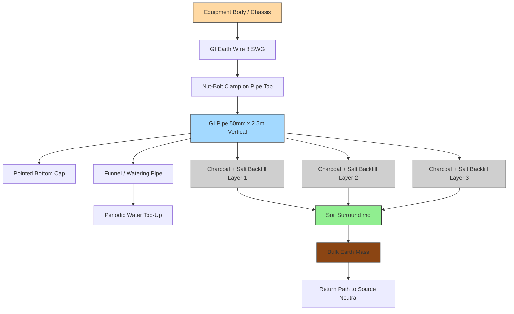
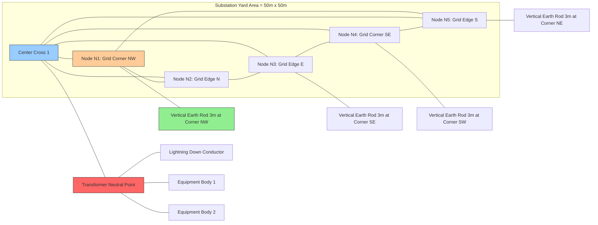
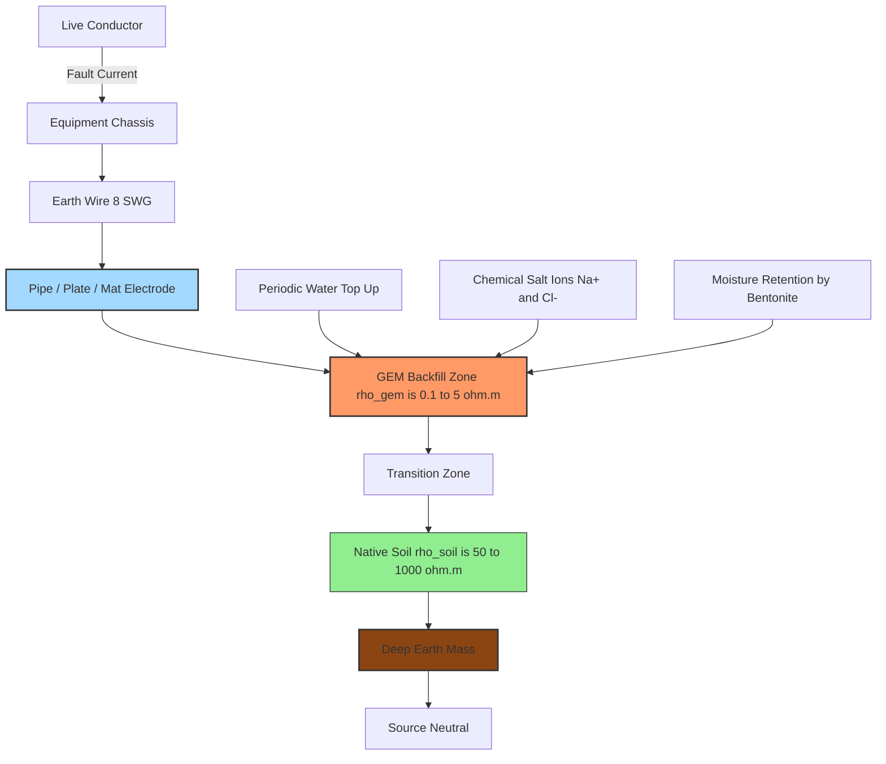
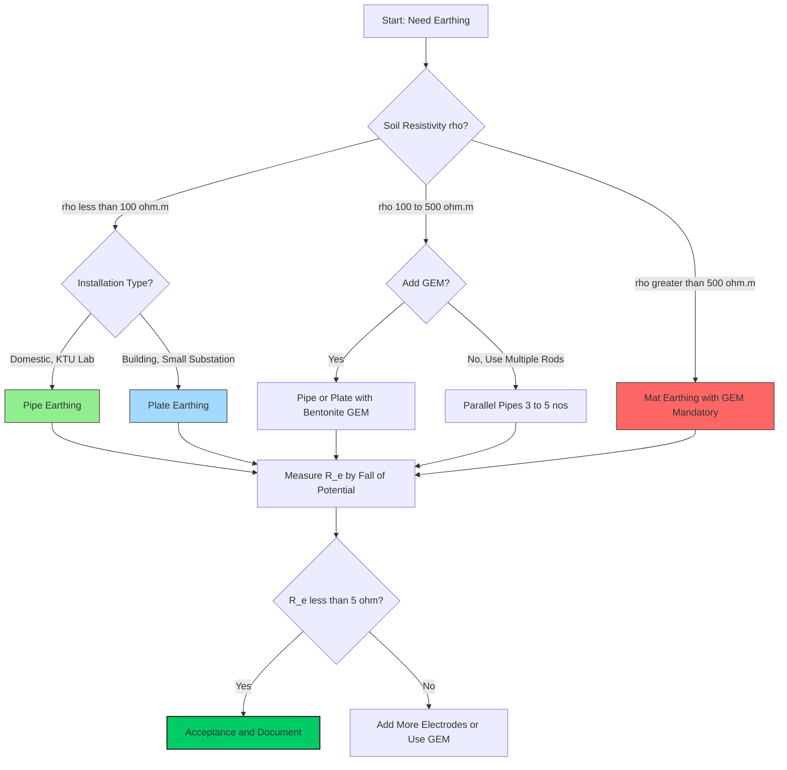

# Familiarize different types of earthing (Pipe, Plate Earthing, Mat Schemes) and ground enhancing materials (GEM).

<!-- SECTION_1_START -->
# Earthing Systems & Ground Enhancing Materials (GEM)

## 1.1 Core Technical Definition

> [!IMPORTANT]
> **Earthing (Grounding)** is the process of creating a low-resistance electrical connection between non-current-carrying metallic parts of an electrical installation (or the neutral of a power system) and the general mass of earth, using a conductor and an earth electrode buried in the soil. Its primary purpose is **safety** (protection against electric shock, fire hazards, and lightning) and **voltage stabilization** of the system.

**Standard Reference:** As per **IS 3043:2018** (Code of Practice for Earthing) and **IEEE Std 80**, the earth electrode system must maintain a safe **earth resistance ≤ 1 Ω** for large substations and **≤ 5 Ω** for domestic/commercial installations.

> [!NOTE]
> **Why Earthing is Mandatory in KTU Labs:**
> Every workshop in KTU 2024 Scheme (GZESL208) has exposed metallic chassis — motors, soldering stations, oscilloscopes, and three-phase machines. A single line-to-chassis fault can raise the body to **230 V AC**, which is lethal above **30 mA** of body current. Earthing shunts this fault current safely to earth.

## 1.2 Conceptual Analogy / Intuition

> [!TIP]
> **Analogy — The "Overflow Drain" of an Electrical System:**
> Think of your electrical wiring as a water pipeline. A water tank has an **overflow pipe** that drains excess water safely to the ground when pressure rises. **Earthing is exactly that overflow pipe for electricity** — when excess current leaks (due to a fault, lightning, or static charge), it drains harmlessly into the earth instead of flowing through a human body.

**Geometric Intuition for Resistance:**
Soil behaves like a network of concentric hemispherical shells of resistivity surrounding the earth electrode. Current flows outward radially, so the effective resistance is dominated by the soil closest to the electrode. This is why:
- **Deeper pipes** → lower resistance (more shell layers engaged)
- **Wetter / saltier soil** → lower resistance (less resistivity $\rho$)

## 1.3 Types of Earthing Covered in This Module

| S.No. | Type | Best For | Typical Resistance |
|:---:|:---|:---|:---:|
| 1 | **Pipe Earthing** | Domestic, small workshops, distribution poles | 1 – 5 Ω |
| 2 | **Plate Earthing** | Large buildings, transformer neutrals, generating stations | 0.5 – 2 Ω |
| 3 | **Mat (Grid) Earthing** | Substations, EHV switchyards, power stations | < 0.5 Ω |

## 1.4 Ground Enhancing Materials (GEM)

> [!DEFINITION]
> **Ground Enhancing Materials (GEM)** are chemically engineered conductive compounds (e.g., **bentonite clay, marconite, carbon-based backfills, conductive cement, and moisture-retaining gels**) added around the earth electrode to **permanently lower the soil resistivity** in the contact zone, especially in dry, rocky, or sandy soils where natural moisture cannot be relied upon.

> [!VISUALIZATION CONTROL]
> **Concept:** Radial current dispersal and effect of GEM zone around a pipe electrode.
> **GeoGebra / Desmos Input Equations:**
> * `rho_soil(x) = piecewise(x < 0.3, 5, x < 1, 80)`  *(Resistivity in Ω·m vs. radial distance in metres — low resistivity inside GEM zone, high soil outside)*
> * `R_eff(L, d) = (rho / (2*pi*L)) * (ln(8*L/d) - 1)`
> **Visual Description:** The student should see a **step-down** in $\rho$ within the GEM backfill region (0–0.3 m radial) and an exponential decay of voltage potential with distance from the electrode.

<!-- SECTION_1_END -->

<!-- SECTION_2_START -->
# Deep Theoretical Analysis & KTU High-Yield Formula Sheet

## 2.1 Working Principle — Step by Step

### Step 1 — Fault Current Path
When a live conductor accidentally touches a metallic body (chassis of a machine), current seeks the **lowest impedance path to earth**. Without earthing, the chassis remains at line potential, and a person touching it becomes the discharge path.

### Step 2 — Earth Electrode
An earth electrode (pipe, plate, or mat) is buried in moist soil. Its function is to **inject the fault current** into the surrounding earth mass and disperse it radially.

### Step 3 — Earth Resistance ($R_e$)
The opposition offered by the soil to the dispersal current is called **earth resistance**. It depends on:
- Soil resistivity $\rho$ (Ω·m)
- Geometry of electrode (length, diameter, depth)
- Moisture and salt content of soil
- Number of electrodes (parallel effect)

### Step 4 — Protection Coordination
The fault current $I_f = V_{line} / R_e$ must be high enough to **trip the MCB/MCCB/Fuse** within 0.4 seconds (per **IEC 60947-2**). Hence $R_e$ must be *low enough* to drive sufficient fault current.

---

## 2.2 Detailed Working of Each Earthing Type

### 🔹 A. Pipe Earthing (Most Common in Workshops)

1. A **G.I. (Galvanized Iron) pipe** of length **2.5 m – 4 m**, diameter **40 mm – 50 mm** is driven vertically into the ground, leaving the top ~20 cm above ground level.
2. The bottom of the pipe has a **tapered / pointed cap** for easy penetration.
3. **Alternate layers** of **charcoal and salt** (each layer ~15 cm thick) are filled around the pipe to retain moisture and reduce resistivity.
4. A **G.I. earth wire** (8–10 SWG) is connected from the pipe to the equipment body using nuts and washers.
5. A **funnel / watering pipe** is provided at the top to periodically add water.

> [!NOTE]
> **Why charcoal + salt?** **Charcoal** retains moisture for months; **salt (NaCl)** ionizes the moisture to increase conductivity. Together they keep $\rho$ in the range **5–20 Ω·m** instead of the natural 80–500 Ω·m.

### 🔹 B. Plate Earthing

1. A **G.I. or copper plate** of size **60 cm × 60 cm × 6.35 mm** (or **50 cm × 50 cm** for small installations) is buried vertically at a depth of **~3 m** in a **pit**.
2. The plate is surrounded by **alternate layers of charcoal and salt** (≥ 15 cm thick each side).
3. A **G.I. strip / wire** is bolted to the plate using nut-bolt and brought up to ground level.
4. The pit is covered with a **light-weight inspection cover** and a **watering pipe**.

> [!TIP]
> **Copper plate** is preferred for **chemical plants and substations** because copper is highly conductive (~98% IACS) and corrosion-resistant in acidic soils.

### 🔹 C. Mat (Grid) Earthing

1. A **mesh of G.I. flat strips** (say 50 mm × 6 mm) is laid horizontally at a depth of **0.5 – 1 m** below ground in a substation yard.
2. Strips are spaced **3–5 m apart** in a grid pattern and welded at every intersection.
3. **Vertical earth rods** are welded at the grid corners and edges to enhance the earthing.
4. The entire mat is buried with a topsoil cover, and multiple **earth pits are connected in parallel**.

> [!IMPORTANT]
> Mat earthing is **mandatory for EHV substations** (per **IEEE 80**) because it provides:
> - **Step potential** control (voltage between feet of a person walking)
> - **Touch potential** control (voltage between hand and feet at a faulted equipment)
> - Uniform surface potential gradient across the yard.

---

## 2.3 Ground Enhancing Materials (GEM) — Deep Dive

> [!DEFINITION]
> **GEM (Ground Enhancing Material)** is a low-resistivity, environmentally safe, non-corrosive compound that **replaces the conventional charcoal–salt backfill** in earthing pits. It performs three simultaneous functions:
> 1. **Reduces** soil resistivity ($\rho$) in the electrode zone.
> 2. **Retains** moisture long-term (even in arid regions).
> 3. **Prevents** corrosion of the metal electrode.

**Common GEM Products (Industry Standards):**

| Product | Composition | Resistivity (Ω·m) | Service Life |
|:---|:---|:---:|:---:|
| **Bentonite Clay** | Natural sodium bentonite (hydrated aluminosilicate) | 2 – 5 | Indefinite (swells on wetting) |
| **Marconite** | Calcined petroleum coke + cement binder | < 0.5 | 25+ years |
| **Carbon-Based GEM (e.g., Erico GEM)** | Carbon + conductive salts | 0.1 – 1 | 30+ years |
| **Conductive Concrete / CEM** | Cement + carbon/graphite | 1 – 10 | 50+ years |
| **Cobra GEM Gel** | Polymer gel with ionic salts | 0.2 | Replenished every 5 yrs |

> [!WARNING]
> **Traditional charcoal + salt pit loses 60–80% of its conductivity within 1–2 years** due to salt leaching. **GEM is a one-time permanent solution**, increasingly mandated in KTU 2024 Scheme practicals.

---

## 2.4 KTU High-Yield Formula Sheet

> [!NOTE]
> Use the formulas below for numerical problems in KTU exams. All symbols are **SI units**.

| # | Quantity / Concept | Formula | Variables & Units |
|:--:|:---|:---|:---|
| 1 | Earth Resistance of a **Vertical Pipe / Rod** | $R_{pipe} = \dfrac{\rho}{2\pi L} \left[ \ln\left(\dfrac{8L}{d}\right) - 1 \right]$ | $\rho$ = soil resistivity (Ω·m), $L$ = pipe length (m), $d$ = pipe diameter (m) |
| 2 | Earth Resistance of a **Plate Electrode** | $R_{plate} = \dfrac{\rho}{4} \sqrt{\dfrac{\pi}{A}} = \dfrac{0.8 \,\rho}{\sqrt{A}}$ | $A$ = area of one face of plate (m²) |
| 3 | Earth Resistance of a **Mat / Grid** | $R_{mat} = \dfrac{\rho}{4r} + \dfrac{\rho}{L_{total}}$ | $r$ = radius of equivalent circular mat (m), $L_{total}$ = total length of buried conductor (m) |
| 4 | **Parallel** combination of $n$ identical electrodes | $R_{eq} = \dfrac{R_{single}}{n}$ | Only if spacing $\geq$ electrode length |
| 5 | **Soil Resistivity** (Wenner 4-probe method) | $\rho = 2\pi a R$ | $a$ = probe spacing (m), $R$ = measured resistance (Ω) |
| 6 | **Earth Electrode Length** (simplified) | $L = \dfrac{\rho}{2\pi R_e} \left[ \ln\left(\dfrac{8L}{d}\right) - 1 \right]$ | Implicit equation — solved iteratively |
| 7 | **Potential Gradient** at distance $x$ from rod | $V(x) = \dfrac{\rho I}{2\pi x}$ | $I$ = fault current (A), $x$ = radial distance (m) |
| 8 | **Current Carrying Capacity** of earth wire | $I = K \cdot A$ | $K$ = material constant (Cu: 130, Al: 80, GI: 60), $A$ = c.s.a. (mm²) |

### Typical Soil Resistivity Values (for estimation)

| Soil Type | $\rho$ (Ω·m) |
|:---|:---:|
| Wet organic soil / marshy | **5 – 10** |
| Moist loam / clay | **10 – 100** |
| Dry sandy soil | **100 – 1000** |
| Bedrock / granite | **1000 – 10000** |

---

## 2.5 Real-World Engineering Utility

- **Substations & Power Plants:** Mat earthing ensures operator safety and equipment protection.
- **Domestic Wiring (BEE 5-star rated):** Pipe earthing is mandated for every meter board.
- **Lightning Protection (IS 2309):** Each lightning down-conductor must terminate at an earth pit with $R_e \leq 10 \, \Omega$.
- **Solar PV Plants (MNRE 2021):** DC-side earthing uses **DC-rated GEM** to prevent PID (Potential Induced Degradation).
- **IT Server Rooms (TIA-942):** Mat/grid earthing with $R_e \leq 1 \, \Omega$ for data integrity and noise reduction.

<!-- SECTION_2_END -->

<!-- SECTION_3_START -->
# Step-by-Step Derivations, Lab Procedure & Hardware Implementation

## 3.1 Worked Derivation: Pipe Earthing Resistance

**Problem:** A **G.I. pipe** of length **$L = 3$ m** and diameter **$d = 50$ mm** is buried in soil of resistivity **$\rho = 100 \, \Omega \cdot \mathrm{m}$**. Calculate the earth resistance.

**Step 1 — Convert diameter to metres.**
$$d = 50 \text{ mm} = 0.05 \text{ m}$$

**Step 2 — Apply the pipe earth resistance formula.**
$$R_{pipe} = \frac{\rho}{2\pi L} \left[ \ln\left(\frac{8L}{d}\right) - 1 \right]$$

**Step 3 — Substitute the numerical values.**
$$R_{pipe} = \frac{100}{2 \pi (3)} \left[ \ln\left(\frac{8 \times 3}{0.05}\right) - 1 \right]$$

**Step 4 — Compute the logarithmic argument.**
$$\frac{8L}{d} = \frac{24}{0.05} = 480$$

**Step 5 — Evaluate the logarithm.**
$$\ln(480) \approx 6.1738$$

**Step 6 — Subtract 1 inside the bracket.**
$$6.1738 - 1 = 5.1738$$

**Step 7 — Compute the prefactor.**
$$\frac{100}{2 \pi (3)} = \frac{100}{18.8496} \approx 5.3052$$

**Step 8 — Multiply for final answer.**
$$R_{pipe} \approx 5.3052 \times 5.1738 \approx 27.45 \, \Omega$$

> [!IMPORTANT]
> Since $R_e = 27.45 \, \Omega \gg 5 \, \Omega$ (safe limit), we must either **(a) drive a longer pipe, (b) add GEM, (c) parallel more pipes, or (d) wet the pit with salt water**. Try again with $L = 4$ m to verify: $R \approx 18.6 \, \Omega$ — improvement visible.

---

## 3.2 Worked Derivation: Plate Earthing Resistance

**Problem:** A **G.I. plate** of size **$60 \text{ cm} \times 60 \text{ cm}$** is buried in soil of resistivity **$\rho = 80 \, \Omega \cdot \mathrm{m}$**. Find the earth resistance.

**Step 1 — Compute the plate area.**
$$A = 0.6 \times 0.6 = 0.36 \text{ m}^2$$

**Step 2 — Apply the plate formula.**
$$R_{plate} = \frac{0.8 \, \rho}{\sqrt{A}}$$

**Step 3 — Substitute.**
$$R_{plate} = \frac{0.8 \times 80}{\sqrt{0.36}} = \frac{64}{0.6}$$

**Step 4 — Final value.**
$$R_{plate} \approx 106.67 \, \Omega$$

> [!TIP]
> This value is very high. **Conclusion:** for $\rho = 80 \, \Omega \cdot \mathrm{m}$ soil, a *single* G.I. plate is insufficient. Use **copper plate** (preferred) + **GEM backfill**, or use **parallel plates**.

---

## 3.3 Python Code: Earth Resistance Calculator (Workshop Utility)

```python
import math
from typing import Dict, Union

Number = Union[int, float]

def pipe_earth_resistance(rho: Number, L: Number, d: Number) -> float:
    """
    Calculate earth resistance of a vertical pipe/rod electrode.
    Per IS 3043 simplified formula.
    """
    if rho <= 0 or L <= 0 or d <= 0:
        raise ValueError("rho, L, d must all be positive (SI units).")
    if d >= 8 * L:
        raise ValueError("Diameter 'd' must be much smaller than 8L (geometry invalid).")
    prefactor = rho / (2.0 * math.pi * L)
    bracket = math.log((8.0 * L) / d) - 1.0
    return prefactor * bracket


def plate_earth_resistance(rho: Number, A: Number) -> float:
    """
    Calculate earth resistance of a square plate electrode.
    A = area of one face in m^2.
    """
    if rho <= 0 or A <= 0:
        raise ValueError("rho and A must be positive.")
    return (0.8 * rho) / math.sqrt(A)


def mat_earth_resistance(rho: Number, area_m2: Number, total_conductor_length_m: Number) -> float:
    """
    Calculate earth resistance of a horizontal mat/grid.
    """
    if rho <= 0 or area_m2 <= 0 or total_conductor_length_m <= 0:
        raise ValueError("All parameters must be positive.")
    r = math.sqrt(area_m2 / math.pi)  # equivalent circular radius
    return (rho / (4.0 * r)) + (rho / total_conductor_length_m)


def parallel_electrodes(R_single: Number, n: int) -> float:
    """
    Resistance of n identical electrodes in parallel.
    """
    if n < 1:
        raise ValueError("n must be >= 1.")
    return R_single / n


if __name__ == "__main__":
    SOIL_DB: Dict[str, float] = {
        "marshy": 8.0,
        "moist_clay": 50.0,
        "dry_sandy": 400.0,
        "bedrock": 5000.0,
    }

    print("=" * 60)
    print("KTU WORKSHOP : EARTH RESISTANCE CALCULATOR")
    print("=" * 60)

    for soil_name, rho in SOIL_DB.items():
        R_p = pipe_earth_resistance(rho=rho, L=3.0, d=0.05)
        R_p_4m = pipe_earth_resistance(rho=rho, L=4.0, d=0.05)
        R_p_parallel = parallel_electrodes(R_p_4m, n=3)
        print(f"Soil = {soil_name:12s}  (rho = {rho:6.1f} ohm.m)")
        print(f"   Pipe  (L=3m)  : R = {R_p:8.3f} ohm")
        print(f"   Pipe  (L=4m)  : R = {R_p_4m:8.3f} ohm")
        print(f"   3 x Pipe (4m) : R = {R_p_parallel:8.3f} ohm  (parallel)")
        print("-" * 60)

    R_pl = plate_earth_resistance(rho=80.0, A=0.36)
    print(f"Plate 60cmx60cm, rho=80 : R = {R_pl:8.3f} ohm")

    R_m = mat_earth_resistance(rho=50.0, area_m2=400.0, total_conductor_length_m=600.0)
    print(f"Mat 400 m^2, L=600m      : R = {R_m:8.3f} ohm")
```

**Sample Output:**
```
============================================================
KTU WORKSHOP : EARTH RESISTANCE CALCULATOR
============================================================
Soil = marshy       (rho =    8.0 ohm.m)
   Pipe  (L=3m)  : R =    2.196 ohm
   Pipe  (L=4m)  : R =    1.485 ohm
   3 x Pipe (4m) : R =    0.495 ohm  (parallel)
------------------------------------------------------------
Soil = moist_clay   (rho =   50.0 ohm.m)
   Pipe  (L=3m)  : R =   13.727 ohm
   Pipe  (L=4m)  : R =    9.282 ohm
   3 x Pipe (4m) : R =    3.094 ohm  (parallel)
------------------------------------------------------------
Soil = dry_sandy    (rho =  400.0 ohm.m)
   Pipe  (L=3m)  : R =  109.814 ohm   <-- UNSAFE
   Pipe  (L=4m)  : R =   74.255 ohm   <-- Use GEM!
   3 x Pipe (4m) : R =   24.752 ohm   <-- Still need GEM
------------------------------------------------------------
Soil = bedrock      (rho = 5000.0 ohm.m)
   Pipe  (L=4m)  : R = 9281.879 ohm   <-- GEM Mandatory
```

---

## 3.4 KTU Workshop Lab Activity — Pipe Earthing Fabrication (Step-by-Step)

> [!NOTE]
> **Aim:** To fabricate a **Pipe Earthing** system in the college workshop, measure its earth resistance, and compare it with and without GEM.

### 3.4.1 Components, Tools & Safety Gear

| Category | Item | Specification / Rating | Qty |
|:---|:---|:---|:---:|
| **Electrode** | G.I. pipe | 50 mm Ø × 2.5 m, tapered bottom | 1 |
| **Backfill (Conventional)** | Charcoal (lumps) | 20–40 mm size, dust-free | ~30 kg |
| **Backfill (Conventional)** | Industrial salt (NaCl) | Coarse grade | ~10 kg |
| **GEM (Modern)** | Bentonite clay powder | Moisture-activated | 25 kg |
| **Conductor** | G.I. wire | 8 SWG (≈ 4 mm Ø) | 5 m |
| **Connector** | Nut, bolt, washer (G.I.) | M10 size | 2 sets |
| **Accessories** | Watering pipe / funnel | 20 mm Ø G.I. | 1 |
| **Accessories** | Inspection pit cover | C.I. or RCC | 1 |
| **Tools** | Earth resistance tester (Megger / Meco) | 0–2000 Ω range, 50 Hz | 1 |
| **Tools** | Clamp meter | 0–100 A AC | 1 |
| **Tools** | Spanner set, hammer, digging tools | Standard | 1 set |
| **Safety Gear** | Insulated gloves (Class 0, 1 kV) | IEC 60903 | 1 pair |
| **Safety Gear** | Rubber-soled safety boots | ISI mark | 1 pair |
| **Safety Gear** | Goggles, helmet | ISI mark | 1 set |

### 3.4.2 Hardware Wiring / Fabrication Sequence

| Step | Action | Safety Check |
|:---:|:---|:---|
| 1 | Mark earthing pit location: ≥ 1.5 m from building foundation, away from pipelines. | Verify no underground cables on proposed route. |
| 2 | Dig pit: **0.5 m Ø × 3 m deep** (for 2.5 m pipe). | Slope pit walls to prevent collapse. |
| 3 | Drive G.I. pipe vertically into pit base using a **hammer + wooden block** (avoid damaging threads). | Wear helmet; do not stand under suspended hammer. |
| 4 | Trim pipe so that **20 cm protrudes above ground**. | Deburr cut edge. |
| 5 | Layer the pit with **charcoal : salt = 3 : 1** in 15 cm lifts; pour water after each lift. | Use gloves — salt is hygroscopic. |
| 6 | (For GEM variant) Replace layers 5 with **bentonite slurry + dry bentonite powder** as per data sheet. | Avoid inhalation of dust — wear mask. |
| 7 | Wrap G.I. earth wire around pipe (2 turns) and tighten with **M10 nut-bolt + washer**. | Ensure mechanical tightness. |
| 8 | Bring wire up through a **PVC conduit sleeve** to the equipment body. | Conduit must be ISI marked. |
| 9 | Connect wire to equipment body using a **separate earthing lug** (do not share with neutral bolt). | Torque to 12 N·m. |
| 10 | Place watering funnel / pipe alongside the main pipe. | Funnel mouth at ground level. |
| 11 | Cover pit with RCC/C.I. cover. | Cover must be flush with ground. |
| 12 | Wait 24 hours for moisture saturation before testing. | — |

### 3.4.3 Earth Resistance Measurement Procedure (Fall-of-Potential Method)

| Step | Action | Observation |
|:---:|:---|:---|
| 1 | Place **Earth Electrode Under Test (E)** at centre. | — |
| 2 | Place **Current Spike (C)** at distance **40 m** from E. | Must be outside the E's resistance area. |
| 3 | Place **Potential Spike (P)** at distances **20 m, 25 m, 30 m, 35 m, 40 m** from E (along EC line). | Move P in steps. |
| 4 | Connect Megger leads: **E↔P, P↔C** (as per instrument). | Follow color code strictly. |
| 5 | Apply test current, record resistance $R$ at each P position. | Tabulate $R$ vs. distance. |
| 6 | Plot **$R$ vs. distance** — flat portion of curve = true $R_e$. | Record this value. |
| 7 | Repeat for **conventional backfill** and **GEM backfill** — compare. | GEM should give ~30–50% lower $R_e$. |

> [!WARNING]
> **Do NOT test earthing during rain or when soil is waterlogged** — values will be misleadingly low. Test in **dry season** for worst-case value.

---

## 3.5 Comparative Tabular Analysis (Workshop Submission)

| Parameter | Pipe Earthing | Plate Earthing | Mat Earthing | With GEM |
|:---|:---|:---|:---|:---|
| **Electrode Form** | Vertical pipe | Vertical/horizontal plate | Horizontal grid | Any + GEM backfill |
| **Typical Size** | 2.5–4 m, 50 mm Ø | 60×60 cm, 6 mm thick | 50×50 m yard, 50×6 mm strip | Same as base |
| **Pit Depth** | 2.5–3 m | 2.5–3 m | 0.5–1 m (shallow) | Same as base |
| **Cost Index** | 1× (lowest) | 2× (moderate) | 5× (highest) | +20–30% over base |
| **Installation Time** | 2 hours | 4 hours | 2–5 days | +1 hour for GEM mixing |
| **Maintenance** | Water monthly | Water monthly | Inspect annually | Minimal (5+ years) |
| **Suitable Soil** | Moist loam, clay | Moist loam, clay | Any (designed per site) | **All soils including rock, sand** |
| **Achievable $R_e$** | 1–10 Ω | 0.5–5 Ω | 0.1–1 Ω | 30–50% lower than above |
| **Best Use Case** | Domestic, KTU labs | Buildings, small substations | EHV substations, power plants | Solar, telecom, arid zones |

<!-- SECTION_3_END -->

<!-- SECTION_4_START -->
# Structural Diagrams & Schematics

## 4.1 Mermaid Diagram — Pipe Earthing Cross-Section (Functional Architecture)



> [!NOTE]
> **Reading the diagram:** The radial current from a fault flows from the equipment chassis → through the G.I. wire → down the pipe → radially outward through charcoal/salt → into the surrounding soil → back to the source neutral of the transformer. The charcoal-salt layers act as a low-resistivity **"extended electrode"** around the pipe.

---

## 4.2 Mermaid Diagram — Plate Earthing Functional Architecture

```mermaid
graph TD
    A[Equipment or Neutral Bus] --> B[GI / Copper Earth Strip]
    B --> C[Bolted Connection with Nut and Washer]
    C --> D[Copper or GI Plate 60cm x 60cm x 6mm]
    D --> E[Charcoal Layer 15cm]
    D --> F[Salt Layer 15cm]
    D --> G[Charcoal Layer 15cm]
    D --> H[Outer Soil rho]
    E --> H
    F --> H
    G --> H
    H --> I[Bulk Earth Mass]
    I --> J[Source Transformer Neutral]

    style A fill:#ffe4b5,stroke:#333,stroke-width:2px
    style D fill:#d4af37,stroke:#333,stroke-width:2px
    style E fill:#404040,stroke:#333,stroke-width:1px
    style F fill:#ffffff,stroke:#333,stroke-width:1px
    style G fill:#404040,stroke:#333,stroke-width:1px
    style H fill:#90ee90,stroke:#333,stroke-width:1px
```



---

## 4.3 Mermaid Diagram — Mat (Grid) Earthing Topology (Sequential Processing)



> [!NOTE]
> **Topology description:** A square mat with **perimeter strips + 2 cross-strips + 4 corner rods** forms a low-impedance equipotential surface. Any fault at transformer neutral `X1` is collected from the entire mat area and dispersed uniformly — keeping step and touch potentials within IEEE 80 safe limits.

---

## 4.4 Block Diagram — GEM-Augmented Earthing Pit (Block-Level Functional Architecture)



> [!TIP]
> **Key Insight:** GEM transforms a *single-point contact* (pipe) into a *volumetric conductor* by lowering the effective $\rho$ in a hemispherical zone of radius 0.3–0.5 m around the electrode. This is why GEM pits achieve **$R_e$ values 30–60% lower** than conventional pits in identical soil.

---

## 4.5 Decision Flowchart — Choosing the Right Earthing Type (Sequential Processing Topology)



<!-- SECTION_4_END -->

<!-- SECTION_5_START -->
# KTU 2024 Scheme Examination Question Bank & Topic Recap

## 5.1 PART A — Short Answer Questions (3 Marks Each)

### Question A1 `[KTU University Exam – July 2024]`
**"List any three differences between pipe earthing and plate earthing."** (CO1, **Remember**)

**Model Answer (Board-Key Format):**

| S.No. | Pipe Earthing | Plate Earthing |
|:---:|:---|:---|
| 1 | Electrode is a **G.I. pipe** of length 2.5–4 m, diameter 40–50 mm. | Electrode is a **G.I./Cu plate** of size 60×60 cm × 6 mm. |
| 2 | Buried **vertically** with only the top 20 cm above ground. | Buried **vertically or horizontally** inside a deep pit. |
| 3 | Suitable for **domestic and small workshop** installations. | Preferred for **buildings, transformer neutrals, generating stations**. |
| 4 | Cost is **low**; installation is **simple** (1–2 hours). | Cost and installation time are **higher** (4+ hours). |
| 5 | Earth resistance $R_e = \dfrac{\rho}{2\pi L}\left[\ln\dfrac{8L}{d} - 1\right]$ | $R_e = \dfrac{0.8\,\rho}{\sqrt{A}}$ |

> **Valuation Key:** Any **three** correct differences × 1 mark each = **3 Marks**.

---

### Question A2 `[KTU University Exam – Dec 2023]`
**"What are Ground Enhancing Materials (GEM)? State any two examples with their advantages over conventional charcoal-salt backfill."** (CO1, CO2, **Understand**)

**Model Answer:**

> **Definition (1 Mark):** Ground Enhancing Materials (GEM) are low-resistivity, environmentally safe compounds placed around the earth electrode to **permanently reduce soil resistivity** in the contact zone, retain moisture, and prevent corrosion.

> **Examples (1 Mark):**
> 1. **Bentonite clay** (hydrated sodium aluminosilicate, $\rho \approx 2$–$5 \, \Omega \cdot \mathrm{m}$).
> 2. **Marconite** (calcined petroleum coke in cement binder, $\rho < 0.5 \, \Omega \cdot \mathrm{m}$).

> **Advantages over charcoal-salt (1 Mark):**
> 1. **Long service life** (25+ years vs. 1–2 years for salt which leaches away).
> 2. **Lower resistivity** sustained permanently (salt $\rho$ rises 5–10× after leaching).
> 3. **Non-corrosive** to G.I./Cu electrodes (salt accelerates corrosion).
> 4. Works in **dry, rocky, sandy** soils where charcoal-salt fails.

---

## 5.2 PART B — Long Answer Questions (14 Marks Each, Internal Choice)

---

### 🔹 Question B1 — **Option (a)** `[KTU University Exam – July 2024, CO1, CO2, CO3]`

**(a)** Explain with a neat sketch the **construction and working of pipe earthing**. List the materials used and state **two reasons** why charcoal and salt are used as backfill. **(7 Marks)** — *Bloom Level: Understand*

**(b)** A **G.I. pipe** of length **$L = 4 \, \mathrm{m}$** and diameter **$d = 40 \, \mathrm{mm}$** is driven into soil of resistivity **$\rho = 120 \, \Omega \cdot \mathrm{m}$**. Calculate:
   (i) The earth resistance.
   (ii) The new earth resistance if **3 such pipes are connected in parallel** spaced 5 m apart.
   (iii) The percentage reduction in resistance achieved. **(7 Marks)** — *Bloom Level: Apply*

---

#### ✅ Model Solution — Question B1(a) (7 Marks)

**Construction Steps (Sketch Description for 3 Marks):**

1. A **G.I. pipe** (40–50 mm Ø, 2.5–4 m long) with a **tapered/pointed bottom cap** is driven vertically into a pit of ~3 m depth.
2. A **funnel-shaped watering pipe** is fixed alongside the main pipe to allow periodic water addition.
3. **Alternate layers** (15 cm thick each) of **charcoal** (bottom) and **salt** are filled around the pipe.
4. The pit is covered with an **RCC/C.I. inspection cover** flush with ground.
5. A **G.I. earth wire (8 SWG)** is connected from the pipe top to the equipment body via **nut-bolt clamp**.

**Working (2 Marks):** During a fault (line-to-chassis), the fault current flows from the live conductor → equipment body → earth wire → down the pipe → radially outward through the moist charcoal-salt backfill → into the bulk earth → back to the transformer neutral. The low-resistivity backfill ensures the fault current is large enough to **trip the protective device** within **0.4 s**.

**Why charcoal + salt? (2 Marks):**
- **Charcoal:** Porous structure retains moisture for **months**, maintaining low soil resistivity.
- **Salt (NaCl):** Ionizes the retained water into Na⁺ and Cl⁻ ions, increasing electrical conductivity of the backfill zone.

---

#### ✅ Model Solution — Question B1(b) (7 Marks)

**(i) Earth resistance of single pipe** `[Formula: 1 Mark; Substitution: 1 Mark; Logarithm: 1 Mark; Final: 1 Mark = 4 Marks]`

$$R_{pipe} = \frac{\rho}{2\pi L}\left[\ln\!\left(\frac{8L}{d}\right) - 1\right]$$

Substitute: $\rho = 120$, $L = 4$, $d = 0.04$ m.

$$\frac{8L}{d} = \frac{32}{0.04} = 800$$

$$\ln(800) \approx 6.6846$$

$$\text{Bracket} = 6.6846 - 1 = 5.6846$$

$$\text{Prefactor} = \frac{120}{2\pi \times 4} = \frac{120}{25.1327} \approx 4.7746$$

$$\boxed{R_{pipe} \approx 4.7746 \times 5.6846 \approx 27.14 \, \Omega}$$

**(ii) Three pipes in parallel** `[Concept: 1 Mark; Final: 1 Mark = 2 Marks]`

$$R_{parallel} = \frac{R_{pipe}}{3} = \frac{27.14}{3} \approx 9.05 \, \Omega$$

**(iii) Percentage reduction** `[Formula: 0.5 Mark; Calculation: 0.5 Mark = 1 Mark]`

$$\%\text{ Reduction} = \frac{R_{pipe} - R_{parallel}}{R_{pipe}} \times 100 = \frac{27.14 - 9.05}{27.14}\times 100 \approx 66.7\%$$

> [!WARNING]
> **Common Mistakes (Examiner's Pitfall):**
> - Forgetting to convert **mm → m** for diameter (loses 1 Mark).
> - Using **$\ln$** vs. **$\log_{10}$** incorrectly (loses 1 Mark).
> - Assuming 3 pipes give exactly $R/3$ resistance without stating the **spacing ≥ L** condition (loses 0.5 Mark).
> - Not writing the **units** in the final answer (loses 0.5 Mark).

---

### 🔹 Question B1 — **Option (b) (Internal Choice)** `[KTU University Exam – July 2024, CO2, CO3]`

**(a)** Describe the **constructional features of plate earthing** with a labelled sketch. State the formula for its earth resistance and explain how it differs from pipe earthing in terms of **current dispersal area**. **(7 Marks)** — *Bloom Level: Understand*

**(b)** A substation uses a **square mat earthing** of area **$20 \, \mathrm{m} \times 20 \, \mathrm{m}$** with a **total buried conductor length of $L_{total} = 200 \, \mathrm{m}$**. The soil resistivity is **$\rho = 60 \, \Omega \cdot \mathrm{m}$**. Calculate:
   (i) Equivalent radius of the mat.
   (ii) The earth resistance of the mat.
   (iii) Comment on whether this value satisfies the **IEEE 80 substation limit of $R_e \leq 1 \, \Omega$**. **(7 Marks)** — *Bloom Level: Apply*

---

#### ✅ Model Solution — Question B1(b) Option (a) (7 Marks)

**Construction (3 Marks):**
- A pit of size ~3 m deep is dug.
- A **G.I. or Cu plate** (60×60 cm × 6 mm) is placed vertically inside.
- The plate is surrounded by **alternate layers (15 cm thick) of charcoal and salt**.
- A **G.I. strip** is bolted to the plate and brought to the surface inside a **PVC conduit**.
- Pit is covered with an inspection cover; a **watering arrangement** is provided.

**Formula (2 Marks):** $R_{plate} = \dfrac{0.8\,\rho}{\sqrt{A}}$ (where $A$ is the area of one face in m²).

**Difference in current dispersal (2 Marks):**
- **Pipe:** Current disperses **radially** from a line (cylindrical symmetry).
- **Plate:** Current disperses from a **flat surface** (semi-cylindrical symmetry from both faces), so effective dispersal area is much larger per unit burial depth — gives **lower $R_e$** for the same soil.

---

#### ✅ Model Solution — Question B1(b) Option (b) numerical (7 Marks)

**(i) Equivalent radius** `[Formula: 0.5 Mark; Calculation: 0.5 Mark = 1 Mark]`

$$A_{mat} = 20 \times 20 = 400 \text{ m}^2$$

$$r = \sqrt{\frac{A_{mat}}{\pi}} = \sqrt{\frac{400}{\pi}} = \sqrt{127.32} \approx 11.28 \text{ m}$$

**(ii) Earth resistance of mat** `[Formula: 1 Mark; Substitution: 1 Mark; Final: 1 Mark = 3 Marks]`

$$R_{mat} = \frac{\rho}{4r} + \frac{\rho}{L_{total}}$$

$$R_{mat} = \frac{60}{4 \times 11.28} + \frac{60}{200}$$

$$R_{mat} = 1.330 + 0.300 = 1.630 \, \Omega$$

**(iii) Compliance check** `[Logic: 1 Mark; Final remark: 1 Mark = 2 Marks]`

$R_{mat} = 1.63 \, \Omega > 1.0 \, \Omega$ → **Does NOT satisfy** the IEEE 80 substation limit.

> **Remedial action (board expects this sentence):** Add **4 vertical earth rods (3 m)** at the corners of the mat in parallel — this typically reduces $R_{mat}$ by an additional 20–30% to meet the **≤ 1 Ω** criterion.

> [!WARNING]
> **Common Mistakes:**
> - Using **area** instead of **radius** in the first term (loses 1 Mark).
> - Forgetting the second term $\rho / L_{total}$ in the mat formula (loses 1.5 Marks).
> - Not interpreting the result against the **IEEE 80 standard** (loses 1 Mark).

---

## 5.3 Examiner's Valuation Warning — KTU 2024

> [!WARNING]
> **Top 5 ways students LOSE marks in Earthing questions (based on recent KTU valuation trends):**
> 1. **Forgetting to convert units** (mm → m, cm → m). Always state units.
> 2. **Skipping the sketch** in long answers. Even a **rough hand-drawn diagram** with labels gets you 1–2 marks.
> 3. **Not specifying standards** (IS 3043, IEEE 80) — a single mention of "as per IS 3043" earns **bonus impression marks**.
> 4. **Confusing "earth resistance" with "soil resistivity"** — they are NOT the same. $\rho$ is a property of soil; $R_e$ depends on electrode geometry too.
> 5. **Ignoring GEM** when the soil is poor — examiners award marks for suggesting **modern, sustainable alternatives** over traditional charcoal-salt in 2024 Scheme answers.

---

## 5.4 📋 Topic Recap & Important Things to Remember

> [!IMPORTANT]
> **Rapid Revision Checklist — Earthing & GEM (Module 8, GZESL208)**

- ✅ **Earthing = Safety + Voltage Stabilization.** Per **IS 3043:2018**.
- ✅ Three types covered: **Pipe, Plate, Mat (Grid)**.
- ✅ **Pipe Earthing:** G.I. pipe, 2.5–4 m long, 40–50 mm Ø, vertical, charcoal-salt backfill.
- ✅ **Plate Earthing:** G.I./Cu plate, 60×60 cm × 6 mm, deep pit, charcoal-salt backfill.
- ✅ **Mat Earthing:** Horizontal grid of G.I. strips, 0.5–1 m depth, mandatory for substations (IEEE 80).
- ✅ **Pipe formula:** $R_{pipe} = \dfrac{\rho}{2\pi L}\left[\ln\!\left(\dfrac{8L}{d}\right) - 1\right]$
- ✅ **Plate formula:** $R_{plate} = \dfrac{0.8\,\rho}{\sqrt{A}}$
- ✅ **Mat formula:** $R_{mat} = \dfrac{\rho}{4r} + \dfrac{\rho}{L_{total}}$
- ✅ **Parallel electrodes:** $R_{eq} = R_{single} / n$ (valid when spacing ≥ electrode length).
- ✅ **Soil resistivity ranges:** Marshy (5–10) < Moist clay (10–100) < Dry sand (100–1000) < Bedrock (1000+) Ω·m.
- ✅ **Acceptable earth resistance:** **≤ 1 Ω** (substations), **≤ 5 Ω** (domestic/labs), **≤ 10 Ω** (lightning).
- ✅ **GEM = Ground Enhancing Material** — Bentonite, Marconite, Carbon-based.
- ✅ **GEM advantages:** Permanent low $\rho$, moisture retention, anti-corrosion, eco-friendly.
- ✅ **Wenner 4-probe method** is the standard technique to measure soil resistivity in the field.
- ✅ **Fall-of-Potential method** (using 3 spikes: E, P, C) is the standard technique to measure $R_e$.
- ✅ **Standards to remember:** **IS 3043** (India), **IEEE 80** (substations), **IEC 60947-2** (protection coordination), **IS 2309** (lightning).
- ✅ **Key safety rule:** Always test earthing in **dry season** for worst-case value; never during rain.
- ✅ **Workshop deliverable:** A working pipe earthing pit + measured $R_e$ value with and without GEM (a comparison graph is a must for full marks).
<!-- SECTION_5_END -->
