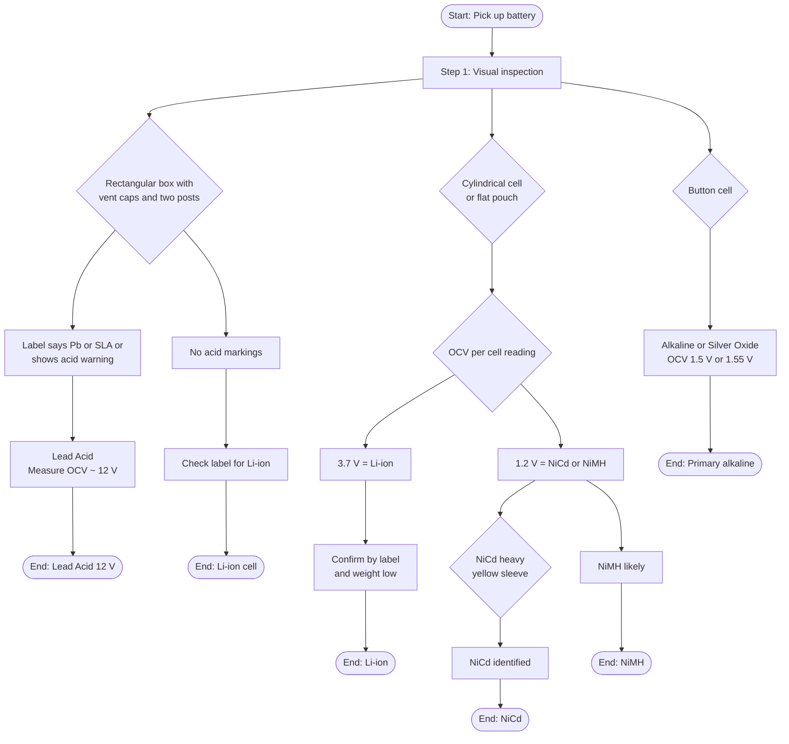
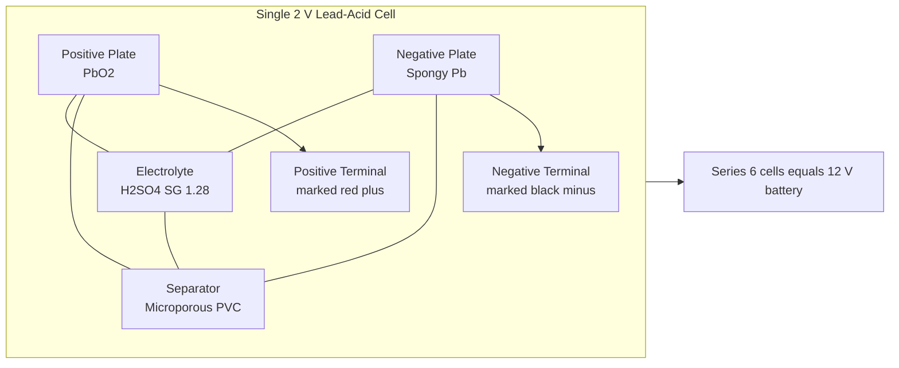
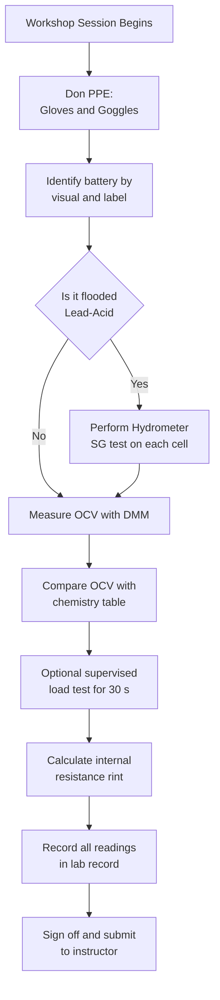

# Identify battery specifications using different types of batteries.(Lead acid, Li Ion, NiCd etc.)

<!-- SECTION_1_START -->

# Module 8 — Battery Specifications Identification

## 1. Core Technical Definition & Intuitive Overview

### 1.1 Formal Academic Definition (KTU 2024 Syllabus Terminology)

An **electrochemical cell** is a device that converts chemical energy into electrical energy through a **redox (reduction–oxidation) reaction**. A **battery** is a series, parallel, or series-parallel interconnection of one or more such cells to deliver a specified **nominal voltage (V)**, **capacity (Ah)**, and **energy density (Wh/kg)** for a defined load profile.

In the KTU 2024 Scheme workshop framework, *battery specification identification* is the systematic procedure of physically inspecting, label-reading, and electrically characterising a cell/battery to determine its:

- **Electrochemistry** (chemistry family)
- **Nominal voltage per cell (V)**
- **Rated capacity (Ah or mAh)**
- **Energy content (Wh)**
- **Specific energy (Wh/kg)**
- **Cycle life** (number of charge–discharge cycles at a defined Depth of Discharge)
- **Operating temperature window (°C)**
- **Charge / discharge C-rate**
- **Hazard class and disposal route**

> [!NOTE]
> **KTU 2024 Definition (verbatim)**
> *Battery specification identification is the process of recognising the cell chemistry, nominal ratings, terminal arrangement, safety markings, and state-of-charge (SoC) of common primary and secondary batteries by visual inspection, label decoding, and basic electrical measurement.*

### 1.2 Conceptual Analogy / Intuition

Think of a battery as a **water tank with a pressurised inlet**:

| Water-Tank Analogy | Battery Equivalent |
|---|---|
| Tank capacity (litres) | Battery capacity (Ah) |
| Water pressure (m of head) | Cell voltage (V) |
| Pipe diameter | Maximum discharge current (C-rate) |
| Tank wall material | Cell chemistry (Pb, Li, Ni, etc.) |
| Refilling pump rating | Charger current limit |

A **Lead-Acid** battery is like a **heavy, sturdy concrete tank** — cheap, reliable, but very heavy. A **Li-Ion** cell is a **lightweight pressurised cylinder** — high energy density but needs a smart regulator. A **NiCd** cell is a **rugged steel tank with a memory** — it "remembers" shallow discharges and loses effective capacity if not fully cycled.

> [!IMPORTANT]
> **Three numbers you MUST always identify on any battery label:**
> 1. **Nominal Voltage (V)** — e.g., $12\,\text{V}$, $3.7\,\text{V}$
> 2. **Capacity (Ah)** — e.g., $7\,\text{Ah}$, $2600\,\text{mAh}$
> 3. **Chemistry code** — e.g., SLA, Li-ion, NiCd, NiMH, Alkaline

### 1.3 Standard Battery Metrics (Constants You Must Memorise)

- **1 Wh = 3600 J** (SI conversion constant)
- **Specific gravity (SG) of fully charged Lead-Acid**: **1.28 ± 0.01** at 27 °C
- **SG of fully discharged Lead-Acid**: **1.12 ± 0.01** at 27 °C
- **Nominal cell voltage (Lead-Acid)**: **2.0 V/cell** → 6 cells = **12 V battery**
- **Nominal cell voltage (Li-Ion)**: **3.6 – 3.7 V/cell**
- **Nominal cell voltage (NiCd / NiMH)**: **1.2 V/cell**
- **Standard reference temperature for SG correction**: **27 °C**

> [!VISUALIZATION CONTROL]
> **Concept:** Battery discharge curve (Voltage vs. State-of-Charge)
> **GeoGebra / Desmos Input Equations:**
> * `f1(x) = 12.7 - 0.5*x^2` for Lead-Acid (flat plateau, sharp drop at end)
> * `f2(x) = 4.2 - 0.6*x^3` for Li-Ion (sloped plateau, no sharp knee)
> **Visual Description:** A flat plateau curve for Lead-Acid and a sloped curve for Li-Ion, with State-of-Charge (%) on X-axis and Terminal Voltage (V) on Y-axis. The student should observe the **discharge knee** (sharp voltage drop) near 0% SoC.

<!-- SECTION_1_END -->

<!-- SECTION_2_START -->

# 2. Deep Theoretical Analysis & KTU High-Yield Formula Sheet

## 2.1 Battery Family Classification

Batteries are classified into two fundamental families:

- **Primary (Non-rechargeable)** — single-use, chemical reaction is irreversible. *Example:* Alkaline, Zinc-Carbon, Lithium primary.
- **Secondary (Rechargeable)** — chemical reaction is reversible. *Example:* Lead-Acid, Li-Ion, NiCd, NiMH.

For the KTU workshop, you will identify **three secondary chemistries** as the primary focus.

## 2.2 Chemistry-by-Chemistry Operational Breakdown

### A. Lead-Acid Battery (SLA / VRLA / Flooded)

- **Anode:** Spongy Lead (Pb)
- **Cathode:** Lead Dioxide ($\text{PbO}_2$)
- **Electrolyte:** Sulphuric Acid ($\text{H}_2\text{SO}_4$, SG 1.28)
- **Nominal cell voltage:** $2.0\,\text{V}$ → **6 cells = 12 V**
- **Discharge reaction:**
$$\text{Pb} + \text{PbO}_2 + 2\,\text{H}_2\text{SO}_4 \longrightarrow 2\,\text{PbSO}_4 + 2\,\text{H}_2\text{O}$$
- **Charge reaction:** reverse of above (electrolysis regenerates Pb and $\text{PbO}_2$).
- **Why use it:** UPS, automobile SLI (Starting, Lighting, Ignition), inverter backup, forklift traction.

### B. Lithium-Ion Battery (Li-ion / LFP / NMC)

- **Anode:** Graphite (intercalated $\text{Li}^+$)
- **Cathode:** Lithium metal oxide (e.g., $\text{LiCoO}_2$ = LCO, $\text{LiFePO}_4$ = LFP, $\text{LiNiMnCoO}_2$ = NMC)
- **Electrolyte:** Lithium salt (e.g., $\text{LiPF}_6$) in organic carbonate solvent
- **Nominal cell voltage:** $3.6$–$3.7\,\text{V}$ (LFP = 3.2 V, LCO/NMC = 3.7 V)
- **Half-reaction at cathode:** $\text{LiCoO}_2 \rightleftharpoons \text{Li}_{1-x}\text{CoO}_2 + x\,\text{Li}^+ + x\,e^-$
- **Why use it:** Smartphones, EVs, laptops, drones, solar storage — anywhere **high energy density** matters.

### C. Nickel-Cadmium Battery (NiCd)

- **Anode:** Cadmium (Cd)
- **Cathode:** Nickel Oxyhydroxide (NiOOH)
- **Electrolyte:** Potassium Hydroxide (KOH, alkaline)
- **Nominal cell voltage:** $1.2\,\text{V}$ → **10 cells = 12 V**
- **Discharge reaction:** $\text{Cd} + 2\,\text{NiOOH} + 2\,\text{H}_2\text{O} \rightarrow \text{Cd(OH)}_2 + 2\,\text{Ni(OH)}_2$
- **Why use it:** Power tools, aviation, emergency lighting, two-way radios — **extreme temperature and high-current tolerance**.

### D. Other Common Chemistries (for comparison)

| Chemistry | Nominal V | Energy Density (Wh/kg) | Cycle Life |
|---|---|---|---|
| NiMH | $1.2$ | $60$–$120$ | $500$–$1000$ |
| Alkaline (primary) | $1.5$ | $100$–$160$ (single use) | N/A |

## 2.3 KTU Formula Sheet / Cheat Sheet

> [!IMPORTANT]
> All formulas below are **exam-critical** for the KTU 2024 workshop lab exam.

| # | Formula / Quantity | Expression | Units | Use Case |
|---|---|---|---|---|
| 1 | Energy content of a battery | $E = V_{\text{nom}} \times C_{\text{Ah}}$ | Wh | Label verification |
| 2 | Specific energy | $E_{\text{sp}} = \dfrac{E}{m_{\text{battery}}}$ | Wh/kg | Compare chemistries |
| 3 | Specific gravity (temperature corrected) | $\text{SG}_{27} = \text{SG}_T + 0.0007\,(T - 27)$ | — | Lead-Acid SoC |
| 4 | State of Charge (Lead-Acid, approximate) | $\text{SoC} \approx \dfrac{\text{SG}_{\text{measured}} - 1.12}{1.28 - 1.12} \times 100\%$ | % | Hydrometer reading |
| 5 | C-rate discharge current | $I = C \times C_{\text{Ah}}$ | A | Pick discharge load |
| 6 | Charge time (approx) | $t_{\text{ch}} = \dfrac{1.2 \times C_{\text{Ah}}}{I_{\text{ch}}}$ | h | Lead-Acid charger sizing |
| 7 | Energy delivered to load | $E_{\text{out}} = V \times I \times t$ | Wh | Runtime calculation |
| 8 | Depth of Discharge | $\text{DoD} = 1 - \text{SoC}$ | fraction | Cycle-life planning |
| 9 | Peukert's Law (Lead-Acid) | $t = \dfrac{H}{I^{k}}$ | h | Runtime at non-rated current |
| 10 | Internal resistance check | $V_{\text{loaded}} = V_{\text{OCV}} - I \times r_{\text{int}}$ | V | Health test |

**Critical boundary values to remember (Board-exam favourites):**

- Full-charge OCV for 12 V Lead-Acid: **$12.6$–$12.8$ V**
- 50% SoC: **$12.2$ V**
- Fully discharged (DoD = 100%): **$11.8$ V** (NEVER go below this — sulphation begins)
- Full-charge OCV for single Li-Ion cell: **$4.20$ V**
- Cut-off voltage Li-Ion: **$3.00$ V** (below this = permanent damage)
- Storage SoC for Li-Ion long-term: **40 – 60%** (NOT 100%)

> [!NOTE]
> **Why this matters in production engineering:** Battery Management Systems (BMS) in EVs and laptops enforce these exact voltage windows. A faulty BMS allowing the cell to drop to 2.5 V permanently reduces capacity by 30–50%.

## 2.4 Real-World Engineering Utility

- **Automotive:** Identifying whether a battery is **SLI (Starting)** vs. **Deep-Cycle** vs. **AGM** vs. **Gel** by label codes (e.g., "MF" = Maintenance Free, "AGM" = Absorbed Glass Mat).
- **Solar / Off-grid:** Selecting between **Tubular Lead-Acid** (cheaper, lower DoD tolerance) and **LFP** (LiFePO4) for inverter backup.
- **Medical / Aviation:** NiCd is still preferred for emergency power due to **predictable failure mode** and **wide thermal range** (–20 °C to +60 °C).
- **Consumer electronics:** Identifying counterfeit Li-Ion cells (label says 5000 mAh, real capacity 1200 mAh) by weight and OCV under load.

<!-- SECTION_2_END -->

<!-- SECTION_3_START -->

# 3. Step-by-Step Derivations & Practical Workshop Procedure

## 3.1 Worked Numerical Examples (with KTU Valuation Marks)

### Example 1 — Energy Content of a 12 V, 7 Ah UPS Battery (Lead-Acid)

**Given:** A sealed lead-acid (SLA) battery rated $V_{\text{nom}} = 12\,\text{V}$, $C = 7\,\text{Ah}$. Mass $m = 2.1\,\text{kg}$.

**Find:** (a) Energy content $E$ in Wh, (b) Specific energy $E_{\text{sp}}$ in Wh/kg.

**Solution:**

*Step 1 — State formula:*
$$E = V_{\text{nom}} \times C_{\text{Ah}}$$

*Step 2 — Substitute values:*
$$E = 12\,\text{V} \times 7\,\text{Ah}$$

*Step 3 — Compute:*
$$E = 84\,\text{Wh}$$

*Step 4 — State specific energy formula:*
$$E_{\text{sp}} = \dfrac{E}{m}$$

*Step 5 — Substitute:*
$$E_{\text{sp}} = \dfrac{84\,\text{Wh}}{2.1\,\text{kg}}$$

*Step 6 — Compute final value:*
$$E_{\text{sp}} = 40\,\text{Wh/kg}$$

> **[Valuation Key — 3 Marks: Formula 1 M, Substitution 1 M, Final 1 M]**

### Example 2 — State of Charge from Hydrometer Reading (Lead-Acid)

**Given:** Hydrometer reading of a lead-acid cell at $T = 37\,°\text{C}$ is $\text{SG}_T = 1.24$.

**Find:** SoC in percentage (use corrected SG at 27 °C).

**Solution:**

*Step 1 — Temperature correction formula:*
$$\text{SG}_{27} = \text{SG}_T + 0.0007\,(T - 27)$$

*Step 2 — Substitute $T = 37$ and $\text{SG}_T = 1.24$:*
$$\text{SG}_{27} = 1.24 + 0.0007 \times (37 - 27)$$

*Step 3 — Compute:*
$$\text{SG}_{27} = 1.24 + 0.0007 \times 10 = 1.24 + 0.007 = 1.247$$

*Step 4 — SoC formula:*
$$\text{SoC} = \dfrac{\text{SG}_{27} - 1.12}{1.28 - 1.12} \times 100\%$$

*Step 5 — Substitute:*
$$\text{SoC} = \dfrac{1.247 - 1.12}{0.16} \times 100\%$$

*Step 6 — Final:*
$$\text{SoC} = \dfrac{0.127}{0.16} \times 100\% = 79.4\%$$

> **[Valuation Key — 4 Marks: Correction formula 1 M, Arithmetic 1 M, SoC formula 1 M, Final 1 M]**

### Example 3 — Identifying Chemistry by Open-Circuit Voltage and Label

A battery is labelled "18650, 3.7 V, 2600 mAh, no markings of Pb/Cd". Measuring OCV with a DMM gives 3.82 V.

**Identification:** **Lithium-Ion (Li-Ion)** — confirmed by:
- Nominal 3.7 V → Li-ion chemistry (Lead-Acid would be 2 V per cell, NiCd 1.2 V)
- Cylindrical 18650 form factor → standard Li-ion cell
- OCV 3.82 V → ~70% SoC (3.7 V nominal, 4.2 V full charge)

### Example 4 — Charge Time for a 12 V, 100 Ah Lead-Acid Battery

**Given:** Charger current $I_{\text{ch}} = 10\,\text{A}$.

**Find:** Approximate full-charge time.

**Solution:**
$$t_{\text{ch}} = \dfrac{1.2 \times C_{\text{Ah}}}{I_{\text{ch}}} = \dfrac{1.2 \times 100}{10} = 12\,\text{h}$$

The factor **1.2** accounts for losses due to gas evolution and incomplete charge acceptance (Peukert effect).

## 3.2 Workshop Identification Procedure (Hands-On Lab Record)

### Required Tools and Safety Equipment

| Item | Specification | Purpose |
|---|---|---|
| Digital Multimeter (DMM) | $0$–$20\,\text{V}$ DC range, $\pm 0.5\%$ accuracy | Measure OCV |
| Hydrometer (Aronmeter) | Float type, range $1.10$–$1.30$ | Lead-Acid SG test |
| Battery Load Tester | $0$–$500\,\text{A}$ adjustable | Cranking / capacity test |
| Insulated gloves | Class 0 (1 kV) rated | Acid / shock protection |
| Safety goggles | ANSI Z87.1 | Splash protection |
| Sodium Bicarbonate (baking soda) | Neutralising agent | Acid spill cleanup |
| Spill tray | — | Containment |

### Step-by-Step Identification Flow

**Step 1 — Visual Inspection (do NOT connect first)**

- Note the **shape**: rectangular box → Lead-Acid; cylindrical → Li-Ion / NiCd; button → Alkaline.
- Note the **colour**: black case, red/black top posts → Lead-Acid; metal wrapper → Li-Ion 18650; yellow/black sleeve → NiCd power tool pack.
- Look for **markings**: "Pb" or acid-warning symbol → Lead-Acid; "Li-ion" recycling mark → Li-Ion; "NiCd" with crossed-bin symbol → NiCd.

**Step 2 — Label Decoding (record on lab record)**

- Voltage, Capacity, Chemistry, Manufacture date code, C-rating (e.g., "20HR" = capacity measured at 20-hour discharge rate).

**Step 3 — Open-Circuit Voltage (OCV) Measurement**

- Set DMM to DC Volts.
- Connect red probe to **(+)** terminal, black probe to **(–)** terminal.
- Read and record $V_{\text{OCV}}$.
- Compare with chemistry table to confirm.

| OCV (per cell) | Likely Chemistry |
|---|---|
| $\sim 2.05$–$2.15$ V | Lead-Acid (charged) |
| $\sim 1.10$–$1.20$ V | Lead-Acid (discharged) |
| $\sim 4.20$ V (full) / $3.0$ V (cut-off) | Li-Ion |
| $\sim 1.30$ V (full) / $0.9$ V (cut-off) | NiCd |
| $\sim 1.45$ V | Alkaline (primary) |

**Step 4 — Specific Gravity Test (Lead-Acid Only)**

- Remove cell vent cap (for flooded type only — DO NOT open SLA/VRLA).
- Squeeze hydrometer bulb, insert into cell, release to draw electrolyte.
- Read float level at eye height.
- Correct to 27 °C and calculate SoC (as in Example 2).

> [!WARNING]
> **PITFALL ALERT — Examiner's deduction warning:**
> Do NOT attempt to measure SG on a **sealed VRLA / AGM / Gel** battery. The cells are permanently sealed — opening them destroys the battery and releases trapped gas. Identify the battery type **first** by label.

**Step 5 — Load Test (Optional, supervised)**

- Apply a load equal to the **C/10 rate** (e.g., for a 7 Ah battery, use a $0.7\,\text{A}$ load for 10 hours, or a short high-current pulse for SLI batteries).
- Measure voltage under load: $V_{\text{load}}$.
- Healthy Lead-Acid: $V_{\text{load}} > 10.5\,\text{V}$ for 30 s at half-C rate.
- Healthy Li-Ion: $V_{\text{load}}$ drop $< 0.3\,\text{V}$ from OCV.

**Step 6 — Internal Resistance Estimate**

Apply a small known load, measure voltage drop:
$$r_{\text{int}} = \dfrac{V_{\text{OCV}} - V_{\text{load}}}{I_{\text{load}}}$$

Healthy 12 V Lead-Acid: $r_{\text{int}} \approx 5$–$20\,\text{m}\Omega$. Higher value = aged or sulphated battery.

## 3.3 Tabular Specification Comparison (Board-Favourite 7-Mark Question)

| Parameter | Lead-Acid (SLA) | Li-Ion (LFP) | NiCd | NiMH |
|---|---|---|---|---|
| Nominal Voltage (V/cell) | $2.0$ | $3.2$ | $1.2$ | $1.2$ |
| Energy Density (Wh/kg) | $30$–$40$ | $90$–$160$ | $40$–$60$ | $60$–$120$ |
| Cycle Life (to 80% cap.) | $200$–$500$ | $2000$–$5000$ | $1000$–$2000$ | $500$–$1000$ |
| Self-Discharge / month | $4$–$6\%$ | $1$–$2\%$ | $10$–$20\%$ | $20$–$30\%$ |
| Memory Effect | No | No | **Yes (strong)** | Mild |
| Operating Temp (°C) | $-15$ to $+50$ | $-20$ to $+60$ | $-40$ to $+60$ | $-20$ to $+45$ |
| Toxic / Hazardous | Lead, acid | Electrolyte | **Cadmium (heavy metal)** | Mild |
| Recycling Required | **Yes (mandatory)** | Yes | **Yes (mandatory)** | Yes |
| Typical Application | Car, UPS, Inverter | EV, Laptop, Solar | Power tool, Aviation, Emergency | Hybrid car, Camera |

<!-- SECTION_3_END -->

<!-- SECTION_4_START -->

# 4. Structural Diagrams & Schematics

## 4.1 Battery Identification Decision Flowchart



## 4.2 Lead-Acid Cell Internal Architecture (Schematic)



## 4.3 Sequential Battery Test Procedure Topology



## 4.4 Voltage Window Reference Chart (ASCII Visual)

```
Voltage per cell  ───────────────────────────────
  4.4 V  ┤                 ╭─── Li-Ion MAX (4.20 V full charge)
  4.0 V  ┤            ╭────╯
  3.7 V  ┤       ╭────╯  ← Li-Ion Nominal
  3.2 V  ┤  ╭────╯
  3.0 V  ┤──╯            ← Li-Ion CUT-OFF (damage below)
  2.1 V  ┤    ●●●●●●●●●●●●  ← Lead-Acid plateau (2.05 - 2.15 V)
  2.0 V  ┤            ↓↓↓  ← Lead-Acid nominal
  1.8 V  ┤               ▼ ▼  ← Lead-Acid DEAD (sulphation begins)
  1.3 V  ┤ ●●●●●●●●●●●●  ← NiCd full charge
  1.2 V  ┤         ●●●●●  ← NiCd nominal plateau
  1.0 V  ┤             ●●●  ← NiCd end of discharge
  0.9 V  ┤
        ─┼───────────────────
         0%       50%       100%  State of Charge
```

<!-- SECTION_5_START -->

# 5. KTU 2024 Scheme Examination Question Bank & Topic Recap

## 5.1 Part A — Short Answer Questions (2 × 3 = 6 Marks)

### Q1. Define a battery and distinguish between primary and secondary cells. Give one example of each. `[KTU University Exam — Dec 2023]`
**CO Mapping:** CO1 | **RBT Level:** Remember

**Model Answer (3 Marks):**
A **battery** is a device that converts stored chemical energy into electrical energy through an electrochemical redox reaction. A **primary cell** is one in which the electrochemical reaction is **irreversible** — once discharged, it cannot be recharged (e.g., **Alkaline Zn-MnO2 cell**). A **secondary cell** has a **reversible** electrochemical reaction and can be recharged by passing external DC current (e.g., **Lead-Acid battery**).

> **[Valuation Key: Definition 1 M, Primary definition 1 M, Example pair 1 M]**

### Q2. List any three specifications you would identify on a battery label. `[KTU University Exam — July 2024]`
**CO Mapping:** CO2 | **RBT Level:** Understand

**Model Answer (3 Marks):**
The three mandatory specifications present on every battery label are:
1. **Nominal Voltage (V)** — e.g., 12 V, 3.7 V
2. **Rated Capacity (Ah or mAh)** — e.g., 7 Ah, 2600 mAh
3. **Chemistry / Type code** — e.g., SLA, Li-ion, NiCd

Optional 4th–5th: C-rate, manufacturing date, polarity markers, hazard symbols.

---

## 5.2 Part B — 14-Mark Questions (Module Internal Choice)

### Question A (14 Marks) — Lead-Acid Focused `[KTU University Exam — July 2024]`

#### Part (a) — 7 Marks: Identify the Parts of a Flooded Lead-Acid Cell `[RBT: Understand]`

**Model Diagram Description (label on a neat sketch):**
- Positive plate — $\text{PbO}_2$ (lead dioxide), dark brown colour.
- Negative plate — spongy Pb (lead), grey colour.
- Electrolyte — $\text{H}_2\text{SO}_4$ aqueous solution, SG 1.28 at full charge.
- Separator — microporous PVC / PE sheet between plates.
- Vent cap — allows gas escape and electrolyte top-up.
- Cell container — hard rubber (ebonite) or polypropylene.
- Inter-cell connector — lead strap welding the 6 cells in series.
- Positive (+) and Negative (–) terminal posts.

**Valuation Marks:**
- `[Neat diagram with title and legend: 3 Marks]`
- `[Labelling all 6 parts correctly: 2 Marks]`
- `[One-line function of each part: 2 Marks]`

#### Part (b) — 7 Marks: Hydrometer Reading and SoC Calculation `[RBT: Apply]`

**Given:** A flooded lead-acid battery at $T = 32\,°\text{C}$ has a hydrometer reading of $\text{SG}_T = 1.22$. Compute the temperature-corrected SG and State of Charge. Comment on whether the battery needs charging.

**Solution:**

*Step 1 — Apply temperature correction:*
$$\text{SG}_{27} = 1.22 + 0.0007\,(32 - 27) = 1.22 + 0.0035 = 1.2235$$

*Step 2 — Compute SoC:*
$$\text{SoC} = \dfrac{1.2235 - 1.12}{0.16} \times 100\% = \dfrac{0.1035}{0.16} \times 100\% = 64.7\%$$

*Step 3 — Interpretation:*
A SoC of 64.7% is **below the 75% healthy threshold** for standby applications (UPS, inverter). The battery **needs recharging** to prevent sulphation.

> **[Valuation Key: Formula 1 M, Correction arithmetic 1 M, SoC formula 1 M, Final value 1 M, Interpretation 1 M, Units 1 M, Comment 1 M]**

---

### Question B (14 Marks) — Comparative Battery Identification `[KTU University Exam — Dec 2023]`

#### Part (a) — 7 Marks: Compare Lead-Acid, Li-Ion, and NiCd on 6 Parameters `[RBT: Understand]`

**Model Tabular Answer:**

| Parameter | Lead-Acid | Li-Ion | NiCd |
|---|---|---|---|
| Nominal Voltage (V/cell) | $2.0$ | $3.7$ | $1.2$ |
| Energy Density (Wh/kg) | $30$–$40$ | $90$–$160$ | $40$–$60$ |
| Cycle Life | $200$–$500$ | $2000$–$5000$ | $1000$–$2000$ |
| Memory Effect | No | No | **Yes** |
| Self-Discharge per Month | $4$–$6\%$ | $1$–$2\%$ | $10$–$20\%$ |
| Hazardous Content | Lead, Sulphuric acid | Li salt, organic solvent | **Cadmium (RoHS restricted)** |

**Conclusion:** Li-Ion offers the best energy density and cycle life but is costliest. Lead-Acid is the cheapest and most recyclable. NiCd is the most rugged but environmentally the most problematic due to cadmium.

> **[Valuation Key: Tabular form 2 M, Six parameters with values 4 M, One-line conclusion 1 M]**

#### Part (b) — 7 Marks: Identify a Mystery Battery `[RBT: Apply]`

**Given:** A battery has the following observed properties:
- Rectangular hard-rubber case, 15 cm × 10 cm × 20 cm
- Two top-mounted threaded posts (one red, one black)
- Vent caps on the top surface
- Liquid electrolyte level visible through translucent case
- Label reads: "12 V, 100 Ah, Pb"
- OCV measured = $12.6$ V at no load

**Identify:** Chemistry, Type, State of Charge, Specific Gravity (expected), and one application.

**Solution:**

*Step 1 — Chemistry:* **Lead-Acid (Flooded / Tubular type)**
*Step 2 — Type:* **Flooded (vented) — NOT sealed (SLA/VRLA)**, since vent caps exist and electrolyte is visible.
*Step 3 — SoC from OCV:* $12.6$ V corresponds to **~100% SoC** (full charge range is 12.6 – 12.8 V).
*Step 4 — Expected SG:* $\approx 1.28$ (since SoC ≈ 100%).
*Step 5 — Application:* **Automobile SLI battery** or **Inverter/UPS backup** (most common 12 V 100 Ah ratings).

> **[Valuation Key: Chemistry 1 M, Type with reasoning 2 M, SoC with value 1 M, SG value 1 M, Application 1 M, Overall justification 1 M]**

---

## 5.3 KTU Examiner's Valuation Warning / Pitfall Callout

> [!WARNING]
> **Top 5 mistakes students make in the Battery Identification workshop exam:**
> 1. **Forgetting PPE** in the answer script — always state "insulated gloves and goggles were worn before handling" for full marks.
> 2. **Confusing SLA and Flooded Lead-Acid** — SLA is sealed, Flooded has vent caps. Check label and physical structure.
> 3. **Forgetting to temperature-correct the SG** — board examiners explicitly award 1 mark for the $0.0007$ correction factor per °C.
> 4. **Confusing nominal voltage with full-charge voltage** — nominal 12 V, full charge is 12.6–12.8 V. Many students write "fully charged at 12 V" → lose 1 mark.
> 5. **Mislabelling Li-Ion 18650 as AA battery** — 18650 is 18 mm × 65 mm, NOT the same as 14 mm × 50 mm AA. Measure before writing.

---

## 5.4 Topic Recap & Important Things to Remember (Rapid Revision Checklist)

- **Battery = electrochemical cell** that converts chemical energy → electrical energy.
- **Primary (single use)** vs. **Secondary (rechargeable)**.
- **Lead-Acid nominal:** $2$ V/cell → 6 cells = **12 V**; electrolyte $\text{H}_2\text{SO}_4$, SG 1.28 full / 1.12 empty.
- **Li-Ion nominal:** $3.7$ V/cell (LCO/NMC) or $3.2$ V (LFP); full charge $4.20$ V, cut-off $3.00$ V; cylindrical 18650 is a common form factor.
- **NiCd nominal:** $1.2$ V/cell; suffers from **memory effect**; contains toxic **cadmium** (RoHS restricted).
- **NiMH nominal:** $1.2$ V/cell; better energy density than NiCd; mild memory effect.
- **Always identify 3 numbers:** Nominal Voltage, Capacity, Chemistry code.
- **Energy formula:** $E = V_{\text{nom}} \times C_{\text{Ah}}$ (in Wh).
- **Specific energy:** $E_{\text{sp}} = E / m_{\text{battery}}$ (in Wh/kg).
- **Temperature correction for SG:** $\text{SG}_{27} = \text{SG}_T + 0.0007(T - 27)$.
- **SoC formula (Lead-Acid):** $\text{SoC} = \dfrac{\text{SG}_{27} - 1.12}{0.16} \times 100\%$.
- **C-rate discharge current:** $I = C \times C_{\text{Ah}}$ (e.g., 1C of 7 Ah battery = 7 A).
- **Charge time (Lead-Acid):** $t = 1.2\,C_{\text{Ah}} / I_{\text{ch}}$.
- **Internal resistance check:** $r_{\text{int}} = (V_{\text{OCV}} - V_{\text{load}}) / I_{\text{load}}$.
- **Safety FIRST:** Always wear gloves and goggles; never open SLA/VRLA; neutralise acid spills with sodium bicarbonate.
- **Full-charge OCV signatures:** Lead-Acid $12.6$–$12.8$ V (6-cell pack); Li-Ion $4.20$ V per cell; NiCd $1.30$ V per cell.
- **Workshop identification flow:** Visual → Label → OCV → (SG if flooded) → Load test → Record readings.
- **Cycle life ranking (best to worst):** Li-Ion (LFP) > NiCd > NiMH > Lead-Acid.
- **Environmental hazard ranking (worst to least):** NiCd (Cd) > Lead-Acid (Pb) > Li-Ion (electrolyte) > NiMH.
- **Storage SoC for Li-Ion:** 40 – 60% (do NOT store at 100% — accelerates degradation).

<!-- SECTION_5_END -->
