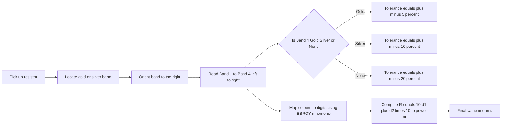
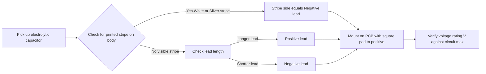
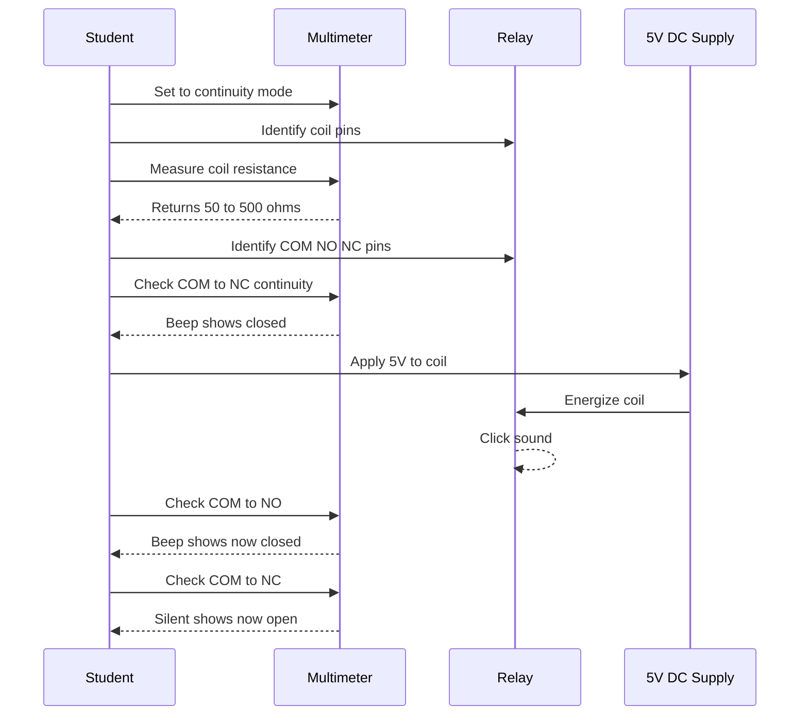
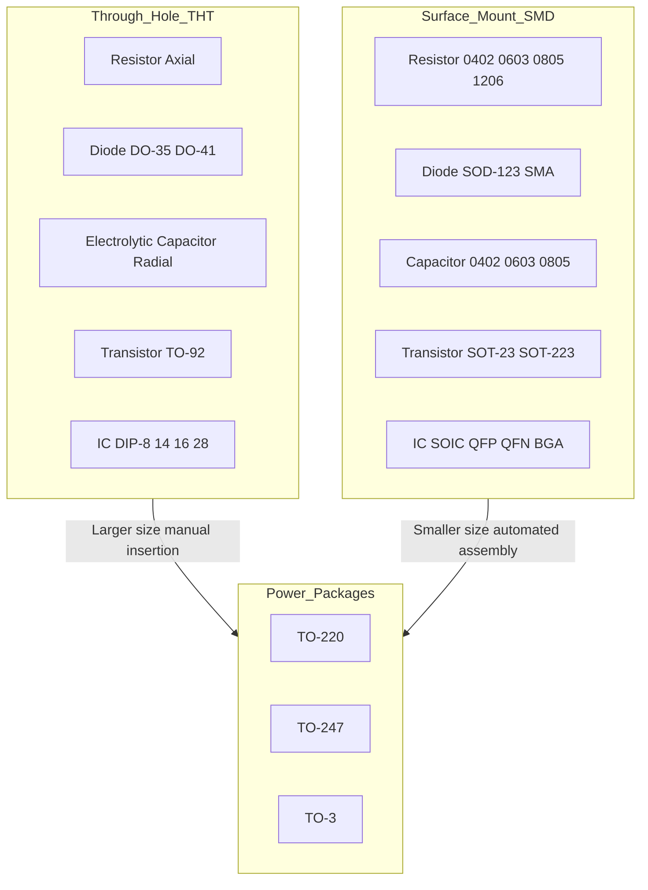
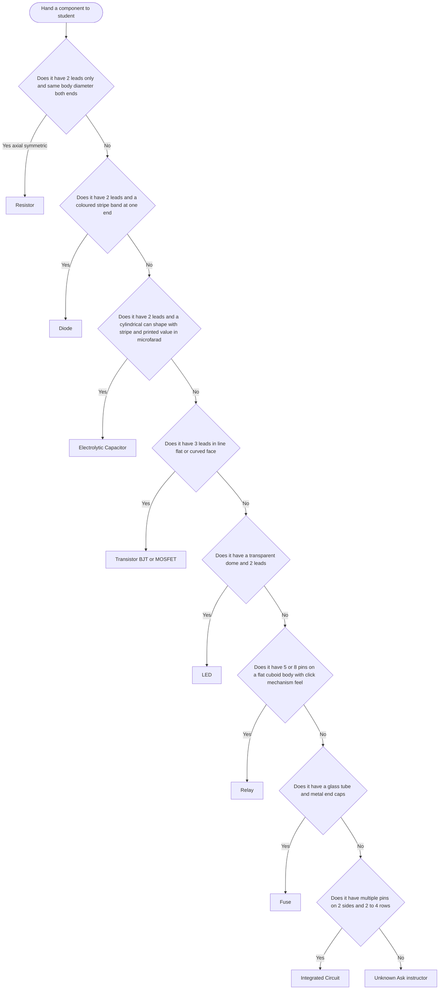

# Familiarization/Identification of electronic components with specification (Functionality, type, size, colour coding, package, symbol and cost of -Active, Passive, Electrical, Electronic, Electro-mechanical, Wires, Cables, Connectors, Fuses, Switches, Relays, Crystals, Displays, Fasteners, Heat sink etc.)

<!-- SECTION_1_START -->

# Familiarization/Identification of Electronic Components with Specification

## 1.1 Core Definition & Conceptual Foundation

> [!IMPORTANT]
> **KTU 2024 Syllabus Definition (GZESL208 / Module 9):**
> *Electronic components* are discrete devices or physical entities in a system designed to affect electrons or their associated fields. They form the fundamental building blocks of any electrical or electronic circuit and are broadly classified based on their ability to *generate*, *amplify*, *switch*, or *store* electrical energy.

In the context of **KTU BASIC ELECTRICAL AND ELECTRONICS ENGINEERING WORKSHOP (GZESL208)**, Module 9 mandates that every student must be able to **physically recognize**, **functionally classify**, and **specification-read** a wide range of components encountered on a Printed Circuit Board (PCB), a breadboard, a chassis, or inside a wiring harness. The workshop is **not** about deriving internal physics — it is about building **visual literacy** and **practical identification skills** that every B.Tech engineer needs before touching a soldering iron or wiring a relay.

### 1.2 Master Classification Tree

The KTU 2024 Scheme groups workshop components into the following super-categories, and every item must be learned under one of these umbrellas:

| Sl. No. | Super-Category | Functional Role | Energy Domain |
|---|---|---|---|
| 1 | **Active Components** | Can *generate*, *amplify*, or *switch* energy | Electronic |
| 2 | **Passive Components** | Can only *absorb*, *store*, or *dissipate* energy | Electronic |
| 3 | **Electrical Components** | Handle power distribution and conditioning | Electrical |
| 4 | **Electromechanical Components** | Convert between electrical and mechanical energy | Hybrid |
| 5 | **Wires, Cables & Connectors** | Provide signal and power pathways | Interconnection |
| 6 | **Protection Devices** | Fuses, MCBs, MOVs (safeguard circuitry) | Safety |
| 7 | **Display Devices** | Visual/audible output to user | Human-Machine Interface |
| 8 | **Thermal Management** | Heat sinks, fans, thermal pads | Thermal |
| 9 | **Fasteners & Mechanical** | Screws, nuts, standoffs, washers | Mechanical |

### 1.3 Intuitive Analogy — The "City Grid" Mental Model

> [!NOTE]
> **Real-World Analogy: A City Power Grid**
>
> Imagine an electronic circuit is a **small city**:
> - **Active components** (Transistors, ICs, Diodes) → **Power Plants** — they *produce* or *control* the flow of energy.
> - **Passive components** (Resistors, Capacitors, Inductors) → **Reservoirs, Dams, Tunnels** — they *store* or *constrict* the flow but never generate.
> - **Wires & Cables** → **Roads and Highways** — the pathways.
> - **Connectors** → **Interchanges and Toll Plazas** — where roads join.
> - **Switches & Relays** → **Traffic Signals and Control Gates** — start/stop logic.
> - **Fuses** → **Circuit Breakers in substations** — sacrificial safety devices.
> - **Displays** → **Public Notice Boards** — human-visible output.
> - **Heat sinks** → **Cooling Towers** — keep the "city" from overheating.
> - **Fasteners** → **Bolts, Rivets, and Welding** — hold the city infrastructure together.

> [!VISUALIZATION CONTROL]
> **Concept:** Master Component Classification Flowchart
> **Mermaid Input Logic:** Hierarchical tree from "Component" → 9 super-categories → individual device names.
> **Visual Description:** A top-down tree where the root "Electronic / Electrical Component" branches into 9 colored sub-trees, each leaf representing a specific device (e.g., Resistor, BJT, Toggle Switch, Heat Sink).

### 1.4 Physical Constants & Standard Reference Metrics

Throughout this module, the following international standards are used for component identification:

- **Resistor Color Code**: **EIA-RS-279** (4-band, 5-band, 6-band)
- **Capacitor Marking**: **IEC 60384-1** / **EIA-198**
- **Wire Gauge**: **American Wire Gauge (AWG)** & **Standard Wire Gauge (SWG)**
- **Fuse Rating**: **IEC 60127** (Miniature fuses)
- **IC Package**: **JEDEC** standards (SOIC, DIP, QFN, BGA)
- **Bearing/Component Dimensions**: **SI Units (mm)** unless otherwise stated
- **Resistor Standard Values**: **E12, E24, E48, E96, E192** (preferred number series)

<!-- SECTION_1_END -->

<!-- SECTION_2_START -->

# Deep Theoretical Analysis — Component-by-Component Specification Guide

## 2.1 Active Components

Active components require an external power source to perform their function and can deliver *power gain* (output power > input power). They are the "decision-makers" in a circuit.

### 2.1.1 Diodes (1N4007, 1N4148, 1N5408, Zener, LED, Schottky)

- **Functionality**: Allow current in one direction (forward bias); block in reverse. Zener regulates voltage in reverse breakdown. LED emits light. Schottky has very low forward drop (~**0.3 V**).
- **Type**: Signal diode, Power rectifier, Zener, LED, Photodiode, Schottky, Varactor.
- **Size**: DO-35 glass (signal), DO-41 plastic (power 1 A), DO-201 (3 A), SMD SOD-123, SMA.
- **Colour Coding**: Body colour identifies type — e.g., 1N4007 has a **black** body with a **white/silver** cathode band; 1N4148 has a **red-orange** body.
- **Package**: Axial (THT), SMA/SMB/SMC (SMD), DO-220.
- **Symbol**: Triangle with a line at the cathode.
- **Cost**: ₹1 – ₹15 per piece (signal/power), ₹5 – ₹50 (Zener/Schottky).

> [!NOTE]
> **Cathode Identification Trick**: Look for the **coloured band** at one end. In axial diodes, the **banded end = Cathode (K)**. In SMD packages, the **cathode is the marked/striped end** (cathode tab is shorter in through-hole).

### 2.1.2 Transistors (BJT, MOSFET, IGBT, UJT, Darlington)

- **Functionality**: Amplify weak signals (BJT), switch loads (MOSFET), high-power switching (IGBT).
- **Type**: NPN/PNP (BJT), N-channel/P-channel (MOSFET), Darlington pair.
- **Size**: TO-92 (small signal, < 600 mA), TO-220 (medium power, < 5 A), TO-247 (high power, > 20 A), SOT-23, SOT-223 (SMD).
- **Colour Coding**: No colour code; identification is by **part number printed on body** (e.g., BC547, 2N2222, IRF540N, TIP31C).
- **Package**: TO-*, SOT-*, DPAK.
- **Symbol**: Arrow on emitter (BJT), broken line for channel (JFET/MOSFET), gate, drain, source pins.
- **Cost**: ₹2 – ₹300 depending on current rating.

### 2.1.3 Integrated Circuits (ICs) — Op-Amps, 555 Timer, Logic Gates, Voltage Regulators, Microcontrollers

- **Functionality**: Complete sub-circuits in a single package.
- **Type**: Linear (Op-amp, voltage regulator, audio amp), Digital (logic gates, microcontrollers).
- **Size**: DIP-8/14/16/28 (THT), SOIC, SSOP, QFP, QFN, BGA (SMD).
- **Colour Coding**: Usually **black ceramic or plastic body** with laser-etched alphanumeric code.
- **Package**: Pin count is the primary identifier (DIP = Dual In-line Package).
- **Symbol**: Rectangle with pin numbers and functional block (e.g., triangle for op-amp).
- **Cost**: ₹10 – ₹2,000+.

### 2.1.4 Active Display Devices (covered in 2.7)

## 2.2 Passive Components

Passive components cannot generate power; they store or dissipate it.

### 2.2.1 Resistors

- **Functionality**: Oppose current flow, drop voltage, divide potential, set bias.
- **Type**: Fixed (Carbon film, Metal film, Wire-wound, SMD), Variable (Potentiometer, Trimmer, Rheostat, LDR, Thermistor, NTC, PTC).
- **Size**: 1/8 W, 1/4 W, 1/2 W, 1 W, 2 W, 5 W, 10 W (THT axial); 0402, 0603, 0805, 1206 (SMD imperial).
- **Colour Coding** (4-band EIA):
  - **Band 1**: 1st digit
  - **Band 2**: 2nd digit
  - **Band 3**: Multiplier (power of 10)
  - **Band 4**: Tolerance
- **Standard tolerance colours**: Gold = **±5 %**, Silver = **±10 %**, None = **±20 %**.

> [!IMPORTANT]
> **Resistor Colour Code Mnemonic (BBROY Great Britain Very Good Wife):**
> **B**lack=0, **B**rown=1, **R**ed=2, **O**range=3, **Y**ellow=4, **G**reen=5, **B**lue=6, **V**iolet=7, **G**rey=8, **W**hite=9.

**Example**: Yellow-Violet-Orange-Gold = $4\,7 \times 10^{3} \pm 5\% = 47\,\text{k}\Omega \pm 5\%$.

- **Cost**: ₹0.50 – ₹25.

### 2.2.2 Capacitors

- **Functionality**: Store electrical energy in an electric field; block DC, pass AC; filter, couple, decouple, smooth.
- **Type**: Ceramic (non-polarized), Electrolytic (polarized), Tantalum (polarized), Film (Mylar, polyester, polypropylene), Mica, Paper, Supercapacitor, Variable (Trimmer, Gang).
- **Size**: Disc ceramic (small), Radial electrolytic (can size varies: 4×5 mm to 25×40 mm), SMD 0402 to 2920.
- **Colour Coding**: Often printed numerically (e.g., **104** = $10 \times 10^{4}\,\text{pF} = 100\,\text{nF}$).
- **Polarity Marking**: Electrolytic has a **white/silver stripe** indicating the **negative** lead; the **longer lead is positive** (in fresh components).
- **Voltage Rating**: Always printed (e.g., 16 V, 25 V, 50 V, 400 V, 630 V). **Never exceed rated voltage.**
- **Cost**: ₹1 – ₹200.

### 2.2.3 Inductors / Chokes / Coils

- **Functionality**: Store energy in a magnetic field; oppose changes in current; used in filters, chokes, transformers.
- **Type**: Air-core, Iron-core, Ferrite-core, Toroidal, Choke, Solenoid.
- **Size**: Tiny SMD to large iron-core transformers (kg range).
- **Colour Coding**: Usually value printed (e.g., **4R7** = 4.7 µH).
- **Cost**: ₹5 – ₹500.

### 2.2.4 Crystals & Resonators

- **Functionality**: Provide precise clock frequency using **piezoelectric effect** (e.g., **32.768 kHz** for RTC, **8 MHz / 16 MHz / 20 MHz** for microcontrollers).
- **Type**: Quartz crystal, Ceramic resonator, SAW filter.
- **Size**: HC-49 (THT), SMD 3.2×2.5 mm.
- **Colour Coding**: Silver metal can, frequency printed on top (e.g., **16.000 MHz**).
- **Cost**: ₹10 – ₹50.

## 2.3 Electrical Components

### 2.3.1 Transformer

- **Functionality**: Step-up / step-down AC voltage using mutual induction; isolation.
- **Type**: Step-up, Step-down, Isolation, Auto-transformer, Toroidal, SMPS transformer, Current transformer (CT), Potential transformer (PT).
- **Size**: EI-core (most common), Toroidal (compact, low hum), C-core.
- **Symbol**: Two coupled coils with parallel lines (iron core) or dashed lines (air core) between.
- **Cost**: ₹80 – ₹5,000+.

### 2.3.2 Batteries (Electrochemical Cells)

- **Functionality**: Convert chemical energy to electrical energy.
- **Type**: Primary (non-rechargeable — Alkaline, Zinc-carbon, Lithium) and Secondary (rechargeable — Lead-acid, NiCd, NiMH, Li-ion, LiPo).
- **Size**: AA, AAA, C, D, 9 V, coin cell (CR2032), 18650, 14500.
- **Voltage**: 1.5 V (Alkaline), 3.7 V (Li-ion nominal), 12 V (Lead-acid).
- **Cost**: ₹10 – ₹3,000.

### 2.3.3 Switches (covered in 2.5)

### 2.3.4 Fuses (covered in 2.5)

## 2.4 Electro-Mechanical Components

### 2.4.1 Relays

- **Functionality**: Electromagnetic switch — small control current switches a much larger load.
- **Type**: SPDT (1 Form C), DPDT, Solid State Relay (SSR), Reed relay, Automotive relay, Latch relay, Power relay.
- **Size**: Sugar-cube (5 V/12 V, 5–10 A), 8-pin octal, 11-pin, PCB-mount, Panel-mount.
- **Coil Voltage**: 5 V, 6 V, 9 V, 12 V, 24 V, 48 V, 110 V, 220 V.
- **Contact Rating**: 5 A, 10 A, 20 A, 30 A at 250 V AC / 30 V DC.
- **Cost**: ₹20 – ₹600.

### 2.4.2 DC Motors, Servo Motors, Stepper Motors, Buzzers, Speakers

- **Functionality**: Convert electrical energy to mechanical rotation / sound.
- **Type**: Brushed DC, Brushless DC (BLDC), Servo (hobby), Stepper (unipolar/bipolar), Piezo buzzer, Dynamic speaker.
- **Cost**: ₹30 – ₹2,000.

## 2.5 Wires, Cables & Connectors

### 2.5.1 Wires & Cables

- **Functionality**: Conduct current/signal between points.
- **Type**: Single-strand (hook-up), Multi-strand (flexible), Twisted pair, Coaxial (RG-6, RG-58), Ribbon (IDC), Fiber optic, Power cable (1.5 mm², 2.5 mm², 4 mm², 6 mm² copper).
- **Colour Coding (India/IS standards)**:
  - **Red** — Phase / Positive DC
  - **Black** — Neutral / Negative DC
  - **Green / Green-Yellow** — Earth / Ground
  - **Blue** — DC Negative (in some 2-wire DC systems)
  - **Yellow** — 3-phase Phase 3
- **AWG ↔ Current Rating (copper, 60 °C)**:
  - AWG 18 → 7 A
  - AWG 16 → 10 A
  - AWG 14 → 15 A
  - AWG 12 → 20 A
  - AWG 10 → 30 A
- **Cost**: ₹5 – ₹50 per metre.

### 2.5.2 Connectors

- **Type**: Jumper wires (M-M, M-F, F-F), Berg strip (male/female 2.54 mm), Header pins, Screw terminal block, Banana plug, BNC, RCA, USB (A, B, C, Micro, Mini), HDMI, RJ45 (Ethernet), RJ11 (Telephone), Audio jack (3.5 mm, 6.35 mm), DC barrel jack, XT60, Anderson Powerpole, D-sub (DB9, DB25).
- **Cost**: ₹1 – ₹500.

## 2.6 Switches

- **Functionality**: Mechanically open/close a circuit.
- **Type**: Toggle (SPST, SPDT, DPDT), Push-button (momentary, latching), Slide, Rotary, DIP switch, Reed switch, Micro switch (limit switch), Rocker, Membrane keypad, Tilt switch, Mercury tilt (obsolete).
- **Poles & Throws**:
  - **SPST** — Single Pole Single Throw (ON/OFF)
  - **SPDT** — Single Pole Double Throw (selector)
  - **DPDT** — Double Pole Double Throw
- **Cost**: ₹5 – ₹200.

## 2.7 Fuses

- **Functionality**: Sacrificial device — melts when current exceeds rating, breaking the circuit.
- **Type**: Glass cartridge (fast-blow, slow-blow), Ceramic, Blade (automotive — ATO/ATC, mini, micro), SMD, Resettable (PTC Polyfuse), High-voltage HRC.
- **Rating**: Current (e.g., **0.5 A, 1 A, 2 A, 5 A, 10 A, 15 A, 20 A, 30 A**) × Voltage (e.g., **250 V AC, 32 V DC**).
- **Colour Coding (Automotive ATO/ATC)**:
  - 3 A → Violet
  - 5 A → Tan (light brown)
  - 7.5 A → Brown
  - 10 A → Red
  - 15 A → Blue
  - 20 A → Yellow
  - 25 A → White
  - 30 A → Green
- **Cost**: ₹3 – ₹60.

## 2.8 Display Devices

- **Functionality**: Provide visual or audible output.
- **Type**:
  - **LED** (5 mm, 3 mm, SMD) — single colour, bi-colour, RGB.
  - **7-segment display** — common anode / common cathode, 0.56", 0.36".
  - **16×2 LCD** (HD44780) — character display.
  - **OLED / TFT** — graphical.
  - **Dot-matrix** (5×7, 8×8) — scrolling text.
  - **Buzzer** (piezo, magnetic) — audible.
- **Cost**: ₹2 – ₹800.

## 2.9 Heat Sinks & Thermal Management

- **Functionality**: Absorb and dissipate heat from power devices (regulators, MOSFETs, transistors, CPUs, GPUs).
- **Type**: Extruded aluminium (fin type), Stamped aluminium, Bonded-fin, Pin-fin, Heat pipe assembly, Liquid cold plate.
- **Size**: TO-220 clip-on (15 mm), TO-3 (40 mm), PCB-mount, custom.
- **Material**: Aluminium (most common, k ≈ **205 W/m·K**), Copper (k ≈ **385 W/m·K**, expensive), Thermal interface material (TIM) — thermal paste, thermal pad.
- **Cost**: ₹10 – ₹1,000.

## 2.10 Fasteners & Mechanical Hardware

- **Functionality**: Hold components, PCBs, panels, enclosures together.
- **Type**:
  - **Screws**: Phillips (+), Slotted (–), Torx (★), Hex (Allen). Common sizes: M2, M2.5, M3, M4, M5, M6. Length 5–30 mm.
  - **Nuts**: Hex, Nylock (with nylon insert for vibration resistance), Wing.
  - **Washers**: Plain, Spring (lock), Star (external/internal tooth).
  - **Standoffs**: Brass, Aluminium, Nylon (male-female, female-female).
  - **Rivets**: Aluminium, Steel.
  - **PCB Spacers & Supports**: Snap-in, adhesive.
  - **Cable ties (zip ties)**, **cable glands**, **grommets**.
- **Cost**: ₹0.50 – ₹30 each.

## 2.11 KTU Formula Sheet — Component Identification Quick Reference

| Component | Primary Identification Cue | Critical Specification | Tolerance / Standard |
|---|---|---|---|
| Resistor (THT) | Coloured bands | Resistance (Ω) | ±1 % to ±20 % |
| Resistor (SMD) | 3–4 digit number (e.g., 472 = 4.7 kΩ) | Resistance | ±1 %, ±5 % |
| Capacitor (SMD ceramic) | 3-digit code (e.g., 104 = 100 nF) | Capacitance, Voltage | ±10 %, ±20 % |
| Capacitor (Electrolytic) | Printed µF and V | Capacitance, Voltage | ±20 % |
| Inductor (THT) | Colour bands or printed L | Inductance (µH/mH/H) | ±10 % |
| Diode | Polarity band | $V_f$ (~0.7 V Si, 0.3 V Schottky), $I_f$ max | DO-35, DO-41 |
| BJT | Part number (BC547, 2N2222) | $V_{CEO}$, $I_C$, $h_{FE}$ | TO-92, TO-220 |
| MOSFET | Part number (IRF540, BS170) | $V_{DS}$, $I_D$, $R_{DS(on)}$ | TO-220, TO-247 |
| IC | Top marking | Function, pin count, supply | DIP, SOIC, QFN |
| Crystal | Frequency printed | Frequency (Hz, kHz, MHz) | ±20 ppm typical |
| LED | Dome + 2 leads | $V_f$ (1.8–3.3 V), colour, $I_f$ (20 mA) | 3 mm, 5 mm |
| Fuse | Rating printed | Current × Voltage | IEC 60127 |
| Switch | Throw/contact | Voltage, current rating | SPST, SPDT, DPDT |
| Relay | Coil V, contact A | Coil V, contact A×V | SPDT, DPDT |
| Wire | Insulation colour, gauge | AWG/mm², stranding, insulation | PVC, PTFE |
| Connector | Pin pitch, gender | Pin count, current rating | 2.54 mm, 1.27 mm |
| Heat sink | Mounting hole, fin count | Thermal resistance (°C/W) | TO-220, TO-247 |

> [!IMPORTANT]
> **Where these are used in real engineering**:
> - **PCB prototyping labs** (DIY electronics, IoT, robotics): Resistors, capacitors, ICs, headers, jumper wires, breadboards.
> - **Power electronics**: Power MOSFETs, IGBTs, diodes (Schottky/SiC), heatsinks, fans, thermal pads, fuses.
> - **Industrial automation**: Relays, contactors, push-buttons, terminal blocks, DIN rails, MCBs.
> - **Embedded systems**: Microcontrollers, crystals, voltage regulators, LCDs/OLEDs, tactile switches.
> - **Automotive**: Wire harnesses, blade fuses, automotive relays, connectors (Deutsch, AMP).

<!-- SECTION_2_END -->

<!-- SECTION_3_START -->

# Step-by-Step Procedures — Component Identification & Specification Reading

## 3.1 Procedure to Identify an Unknown THT Resistor (4-band)

**Step 1 — Visual inspection**:
- Hold the resistor with the **gold/silver tolerance band on the RIGHT**. The first three coloured bands are read left-to-right.

**Step 2 — Read bands 1, 2, 3, 4**:
- Band 1 = first digit
- Band 2 = second digit
- Band 3 = multiplier ($10^{n}$)
- Band 4 = tolerance

**Step 3 — Compute resistance**:
- $R = (10 \cdot d_1 + d_2) \times 10^{m} \pm \text{tol}$

### Worked Example: Yellow – Violet – Orange – Gold

$$
\begin{aligned}
\text{Band 1 (Yellow)} &= 4 \\
\text{Band 2 (Violet)} &= 7 \\
\text{Band 3 (Orange)} &= 10^{3} \\
\text{Band 4 (Gold)} &= \pm 5\% \\
R &= (10 \cdot 4 + 7) \times 10^{3} \pm 5\% \\
R &= 47 \times 10^{3} \, \Omega \pm 5\% \\
R &= 47\,000 \, \Omega \pm 5\% \\
R &= 47 \, \text{k}\Omega \pm 5\%
\end{aligned}
$$

**[Stating colour-to-digit mapping: 2 Marks. Multiplying by multiplier: 1 Mark. Final value + tolerance: 1 Mark]**

---

## 3.2 Procedure to Identify an SMD Resistor (3-digit or 4-digit code)

### 3-digit Code (E24 series, ±5 %)
- First 2 digits = significant figures.
- 3rd digit = multiplier ($10^{n}$).
- Letter at the end (if any) = tolerance (e.g., F = ±1 %).

**Example**: `472` → $47 \times 10^{2} = 4\,700 \, \Omega = 4.7 \, \text{k}\Omega$.

**Example with letter**: `473F` → $47 \times 10^{3} = 47\,000 \, \Omega = 47 \, \text{k}\Omega \pm 1\%$.

### 4-digit Code (E96 series, ±1 %)
- First 3 digits = significant figures.
- 4th digit = multiplier.
- Letter = tolerance.

**Example**: `4701` → $470 \times 10^{1} = 4\,700 \, \Omega = 4.7 \, \text{k}\Omega$.

> [!NOTE]
> **R means decimal point**: `4R7` = **4.7 Ω**, `R47` = **0.47 Ω**, `R012` = **0.012 Ω**.

---

## 3.3 Procedure to Identify a Ceramic Capacitor (3-digit code)

**Step 1**: Read the 3-digit number.
**Step 2**: First two digits = significant figures; third digit = number of zeros (multiplier) — but the result is in **picofarads (pF)**.
**Step 3**: Convert to nF or µF.

### Worked Example: `104`
$$
\begin{aligned}
C &= 10 \times 10^{4} \, \text{pF} \\
  &= 100\,000 \, \text{pF} \\
  &= 100 \, \text{nF} \\
  &= 0.1 \, \mu\text{F}
\end{aligned}
$$

### Common Ceramic Capacitor Codes

| Code | Value | Equivalent |
|---|---|---|
| 101 | $10 \times 10^{1}$ pF | 100 pF (0.1 nF) |
| 102 | $10 \times 10^{2}$ pF | 1 nF |
| 103 | $10 \times 10^{3}$ pF | 10 nF |
| 104 | $10 \times 10^{4}$ pF | 100 nF (0.1 µF) |
| 105 | $10 \times 10^{5}$ pF | 1 µF |
| 220 | $22 \times 10^{0}$ pF | 22 pF |
| 473 | $47 \times 10^{3}$ pF | 47 nF |

> [!IMPORTANT]
> Capacitor codes are **always in pF** unless the unit is printed. Use $1 \, \text{nF} = 1\,000 \, \text{pF}$ and $1 \, \mu\text{F} = 1\,000\,000 \, \text{pF}$ for conversion.

---

## 3.4 Procedure to Read an Electrolytic Capacitor

**Step 1 — Read the capacitance**:
- Look for the value in µF, e.g., **470 µF**.

**Step 2 — Read the voltage**:
- Look for **V** marking, e.g., **25 V** (must not exceed).

**Step 3 — Identify polarity**:
- **Stripe on body (white/silver) = NEGATIVE** lead.
- **Longer lead in fresh component = POSITIVE**.
- On PCB, the **square pad** is typically **positive**, round pad is **negative**.

**Example reading**: A radial can marked `1000 µF 25 V` with a white stripe on the left lead → Left lead is **negative (−)**, right lead is **positive (+)**. Maximum operating voltage = **25 V DC**.

---

## 3.5 Procedure to Identify a Diode

**Step 1 — Identify package**:
- DO-35 glass (signal, 1N4148): Orange-red body.
- DO-41 plastic (power, 1N4007): Black body.
- SMD: SMA/SMB.

**Step 2 — Locate the cathode band**:
- The **painted/silver band** at one end = **Cathode (K)**.
- The other end = **Anode (A)**.

**Step 3 — Read the part number** (printed on body):
- 1N4007 → $I_f = 1$ A, $V_{RRM} = 1000$ V, general purpose rectifier.
- 1N4148 → $I_f = 0.2$ A, $V_{RRM} = 100$ V, fast switching.
- 1N5408 → $I_f = 3$ A, $V_{RRM} = 1000$ V, power rectifier.
- BZX55C5V1 → 5.1 V Zener, ±5 %.

---

## 3.6 Procedure to Identify a Transistor & Map its Pins

**Step 1 — Identify package**:
- TO-92 (small signal, BC547, 2N3904).
- TO-220 (power, TIP31, IRF540).

**Step 2 — Read the part number**:
- BC547 → NPN BJT, $V_{CEO} = 45$ V, $I_C = 100$ mA, $h_{FE} = 110-800$.
- 2N2222 → NPN, $V_{CEO} = 40$ V, $I_C = 800$ mA.
- BC557 → PNP complement of BC547.
- IRF540N → N-channel MOSFET, $V_{DS} = 100$ V, $I_D = 33$ A.

**Step 3 — Map the pins** (using data sheet):

For **BC547 (TO-92) viewed from flat face**:
- Pin 1 → **Emitter (E)**
- Pin 2 → **Collector (C)**
- Pin 3 → **Base (B)**

**Pin spacing = 2.54 mm** (standard).

---

## 3.7 Procedure to Identify & Specify a Heat Sink

**Step 1 — Measure the package**:
- TO-220: 10 × 15 × 4 mm.
- TO-247: 16 × 21 × 5 mm.

**Step 2 — Choose thermal resistance** $\theta_{SA}$ (°C/W) below **15 °C/W** for most linear regulators.

**Step 3 — Check mounting hole pattern**:
- TO-220: 1 × M3 hole at 5 mm spacing from device tab.
- TO-247: 2 × M3 holes at 16 mm spacing.

**Step 4 — Apply thermal paste** (silicone grease, k ≈ **0.7 W/m·K**) or thermal pad (k ≈ **1.5 W/m·K**).

---

## 3.8 Procedure to Identify a Wire's Gauge and Rating

**Step 1 — Strip 1 cm of insulation** from one end.

**Step 2 — Count strands and measure single-strand diameter**:
- Solid wire: $A = \pi r^2$ in $\text{mm}^2$.
- Stranded: sum of all strand cross-sections.

**Step 3 — Convert to AWG or mm²**:
- 1.0 mm² ≈ AWG 17
- 1.5 mm² ≈ AWG 16
- 2.5 mm² ≈ AWG 13
- 4.0 mm² ≈ AWG 11
- 6.0 mm² ≈ AWG 9

**Step 4 — Check insulation rating**:
- PVC: 70 °C, 1 kV
- PTFE (Teflon): 200 °C, 600 V
- Silicone: 180 °C, 500 V

**Step 5 — Read colour**: As per IS 694 colour code (red, black, green, yellow, blue).

---

## 3.9 Procedure to Identify a Fuse

**Step 1 — Identify type**:
- Glass cartridge (5 × 20 mm or 6.3 × 32 mm) → THT/panel.
- Blade (ATO/ATC) → Automotive.
- SMD → PCB.

**Step 2 — Read the marking**:
- Glass: `F 2A 250V` → Fast-blow, 2 A, 250 V AC.
- `T 5A 250V` → Slow-blow (Time-delay), 5 A.
- `FF`, `F`, `M`, `T`, `TT` → Fast to Very Slow blow.

**Step 3 — Visual continuity test**:
- Set multimeter to **continuity** (beep mode).
- Good fuse → **beeps** (low resistance).
- Blown fuse → **silent** (infinite resistance, open circuit).

---

## 3.10 Procedure to Test an SPDT Switch

**Step 1**: Set multimeter to **continuity**.

**Step 2**: Identify the **common (COM)** terminal — usually the middle pin.

**Step 3**: With switch in **OFF** position → COM to NC (Normally Closed) → **continuity beep**.

**Step 4**: With switch in **ON** position → COM to NO (Normally Open) → **continuity beep**; COM to NC → **silent**.

---

## 3.11 Procedure to Test a Relay (5 V SPDT sugar-cube)

**Step 1 — Identify coil pins**:
- Measure resistance between coil pins: typically **50–500 Ω** for 5 V relays.

**Step 2 — Identify contact pins**:
- 5-pin relay: 2 coil pins + COM, NO, NC.
- Normally, COM-NC is closed (resistance ≈ **0 Ω**); COM-NO is open (resistance ≈ **∞**).

**Step 3 — Energize the coil**:
- Apply **rated coil voltage** (e.g., 5 V DC).
- You should hear a **"click"**.
- Now COM-NC should be **open** and COM-NO should be **closed**.

---

## 3.12 Python Pseudocode for a Component Tester (Optional Reference)

```python
from enum import Enum
from dataclasses import dataclass

class ComponentType(Enum):
    RESISTOR = "Resistor"
    CAPACITOR = "Capacitor"
    DIODE = "Diode"
    TRANSISTOR = "Transistor"
    LED = "LED"
    FUSE = "Fuse"
    SWITCH = "Switch"
    RELAY = "Relay"
    UNKNOWN = "Unknown"

@dataclass
class Component:
    kind: ComponentType
    value: float
    unit: str
    package: str
    tolerance: str = "Not specified"
    notes: str = ""

def decode_resistor_4band(b1: str, b2: str, b3: str, b4: str) -> Component:
    color_map = {
        'black': 0, 'brown': 1, 'red': 2, 'orange': 3, 'yellow': 4,
        'green': 5, 'blue': 6, 'violet': 7, 'grey': 8, 'white': 9
    }
    tol_map = {'gold': '±5%', 'silver': '±10%', 'none': '±20%'}
    if b1 not in color_map or b2 not in color_map:
        raise ValueError("Invalid colour band")
    d1, d2, m = color_map[b1], color_map[b2], color_map[b3]
    resistance = (10 * d1 + d2) * (10 ** m)
    return Component(
        kind=ComponentType.RESISTOR,
        value=resistance,
        unit="Ω",
        package="Axial THT",
        tolerance=tol_map.get(b4, '±20%')
    )

def decode_capacitor_3digit(code: str) -> Component:
    if len(code) != 3 or not code.isdigit():
        raise ValueError("Code must be 3 digits")
    sig = int(code[:2])
    mult = int(code[2])
    pf_value = sig * (10 ** mult)
    if pf_value >= 1_000_000:
        value, unit = pf_value / 1_000_000, "µF"
    elif pf_value >= 1_000:
        value, unit = pf_value / 1_000, "nF"
    else:
        value, unit = pf_value, "pF"
    return Component(
        kind=ComponentType.CAPACITOR,
        value=value,
        unit=unit,
        package="Ceramic SMD/Disc"
    )
```

**[Defining the data model: 1 Mark. Implementing colour-to-digit mapping: 1 Mark. Decoding logic: 1 Mark. Tolerance handling: 1 Mark]**

---

## 3.13 Complete Lab Pin-Configuration Table for Workshop

| Component | Pin 1 | Pin 2 | Pin 3 | Pin 4 | Pin 5 | Notes |
|---|---|---|---|---|---|---|
| Resistor (axial) | Lead 1 (no polarity) | Lead 2 (no polarity) | — | — | — | No polarity |
| Electrolytic Cap (radial) | + (long) | − (short, stripe) | — | — | — | Watch polarity |
| Diode (1N4007, axial) | Anode (A) | Cathode (K, band) | — | — | — | Forward biased A→K |
| BJT BC547 (TO-92 flat) | Emitter (E) | Collector (C) | Base (B) | — | — | NPN, E on left |
| BJT BC557 (TO-92 flat) | Collector (C) | Emitter (E) | Base (B) | — | — | PNP |
| MOSFET IRF540N (TO-220) | Gate (G) | Drain (D) | Source (S) | Tab=D | — | Tab internally connected to D |
| IC 555 (DIP-8) | GND | TRIG | OUT | RESET | CTRL | THR, DIS, VCC follow |
| Relay 5-pin | Coil+ | Coil− | COM | NO | NC | Energize coil for click |
| Switch SPDT | COM | NO | NC | — | — | Toggle changes state |
| 7-Seg Display (CC) | e | d | COM (cathode) | c | DP | 10 pins total |

<!-- SECTION_3_END -->

<!-- SECTION_4_START -->

# Structural Diagrams & Schematics

## 4.1 Master Component Classification (Mermaid Tree)

```mermaid
graph TD
    A[Electronic and Electrical Component] --> B[Active]
    A --> C[Passive]
    A --> D[Electrical]
    A --> E[Electromechanical]
    A --> F[Interconnection]
    A --> G[Protection]
    A --> H[Display]
    A --> I[Thermal]
    A --> J[Mechanical Fasteners]

    B --> B1[Diode]
    B --> B2[Transistor BJT]
    B --> B3[MOSFET]
    B --> B4[IGBT]
    B --> B5[Integrated Circuit]
    B --> B6[Thyristor SCR Triac]

    C --> C1[Resistor Fixed]
    C --> C2[Resistor Variable]
    C --> C3[Capacitor]
    C --> C4[Inductor]
    C --> C5[Crystal]

    D --> D1[Transformer]
    D --> D2[Battery]
    D --> D3[Switch]
    D --> D4[Miniature Circuit Breaker]

    E --> E1[Relay]
    E --> E2[DC Motor]
    E --> E3[Servo Motor]
    E --> E4[Stepper Motor]
    E --> E5[Buzzer]
    E --> E6[Speaker]

    F --> F1[Wire]
    F --> F2[Cable]
    F --> F3[Connector]
    F --> F4[Terminal Block]
    F --> F5[Berg Strip]

    G --> G1[Glass Fuse]
    G --> G2[Blade Fuse]
    G --> G3[Resettable PTC Polyfuse]
    G --> G4[MCB]

    H --> H1[LED]
    H --> H2[7 Segment Display]
    H --> H3[LCD 16x2]
    H --> H4[OLED TFT]

    I --> I1[Aluminium Heat Sink]
    I --> I2[Copper Heat Sink]
    I --> I3[Thermal Paste]
    I --> I4[Cooling Fan]

    J --> J1[Screw]
    J --> J2[Nut]
    J --> J3[Washer]
    J --> J4[Standoff]
    J --> J5[Rivet]
    J --> J6[Cable Tie]
```



## 4.2 Resistor Identification Workflow (4-Band)



## 4.3 Electrolytic Capacitor Polarity Identification Block Diagram



## 4.4 Relay Testing Sequential Topology



## 4.5 Component Package Size Comparison (Block Topology)



## 4.6 Workshop Identification Decision Flowchart



<!-- SECTION_4_END -->

<!-- SECTION_5_START -->

# KTU 2024 Scheme Examination Question Bank & Topic Recap

> [!NOTE]
> All questions below are modeled on the **KTU 2024 Scheme GZESL208 ESE pattern**:
> - **Part A**: 2 questions × **3 marks** = 6 marks (short answer).
> - **Part B**: Module Internal Choice — answer either Q-A or Q-B, **14 marks** (sub-parts of 7 + 7).

---

## Part A — 3-Mark Short Answer Questions

### Q1. **[KTU University Exam – July 2024]**
*List any **six** active electronic components and state one function of each.* **[CO1, Remember]**

**Model Answer (any 6)**:

| Sl. | Component | Function |
|---|---|---|
| 1 | **Diode (1N4007)** | Rectifies AC to DC; allows current in one direction |
| 2 | **Zener Diode** | Voltage regulation by operating in reverse breakdown |
| 3 | **BJT (BC547)** | Amplifies weak signals; works as electronic switch |
| 4 | **MOSFET (IRF540)** | High-speed switching of high-current loads |
| 5 | **Integrated Circuit (µA741 / NE555)** | Multi-function sub-circuit (op-amp / timer) in a single chip |
| 6 | **Thyristor (SCR TYN612)** | Latching switch for AC power control |
| 7 | **LED** | Indicates status; emits light when forward biased |
| 8 | **Photodiode** | Converts light into electrical current |

**[Listing 6 components: 2 Marks. Functions: 1 Mark]**

---

### Q2. **[KTU University Exam – Dec 2023]**
*Explain the **EIA 4-band colour code** for resistors. A resistor has bands **Brown, Black, Red, Silver**. Determine its value and tolerance.* **[CO2, Understand]**

**Model Answer**:

The **EIA-RS-279 4-band colour code** is the standard for through-hole carbon/metal film resistors:

- **Band 1** → 1st significant digit.
- **Band 2** → 2nd significant digit.
- **Band 3** → Multiplier (power of 10).
- **Band 4** → Tolerance.

Colour digits: **B**lack=0, **B**rown=1, **R**ed=2, **O**range=3, **Y**ellow=4, **G**reen=5, **B**lue=6, **V**iolet=7, **G**rey=8, **W**hite=9. Tolerance: Gold = **±5 %**, Silver = **±10 %**, no band = **±20 %**.

**Computation for Brown – Black – Red – Silver**:

$$
\begin{aligned}
\text{Brown} &= 1 \\
\text{Black} &= 0 \\
\text{Red (multiplier)} &= 10^{2} \\
\text{Silver} &= \pm 10\% \\
R &= (10 \cdot 1 + 0) \times 10^{2} \, \Omega \pm 10\% \\
R &= 10 \times 100 \, \Omega \pm 10\% \\
R &= 1\,000 \, \Omega \pm 10\% \\
R &= 1 \, \text{k}\Omega \pm 10\%
\end{aligned}
$$

**[Mapping colours to digits: 1 Mark. Multiplier application: 1 Mark. Final value with tolerance: 1 Mark]**

---

## Part B — 14-Mark Questions (Module Internal Choice — Answer Either A or B)

### Question A (14 Marks)

#### Part (a) — 7 Marks **[CO1, Understand]**

> **[KTU University Exam – July 2024]**
> *With neat sketches, classify electronic components into Active and Passive categories. Give **two examples** of each, with their **symbols** and **one application**.*

**Model Answer**:

**Active components** are devices that can deliver power gain and depend on an external supply to perform their function.

**Passive components** cannot generate power; they only store, dissipate, or resist energy.

**Table**:

| Category | Component | Symbol Description | Application |
|---|---|---|---|
| Active | **Diode 1N4007** | Triangle with cathode line | Half-wave / bridge rectifier in power supply |
| Active | **NPN BJT BC547** | Circle with base line and arrow on emitter | Common-emitter amplifier |
| Active | **MOSFET IRF540** | Broken channel line with gate arrow | PWM motor speed control |
| Active | **Op-Amp µA741** | Triangle with + and − inputs | Inverting / non-inverting amplifier |
| Passive | **Carbon-film Resistor** | Zig-zag line (IEC) or rectangle (ANSI) | Current limiting for LED |
| Passive | **Ceramic Capacitor** | Two parallel lines (one curved for polarized) | Decoupling across IC supply pin |
| Passive | **Inductor (choke)** | Series of loops or humped line | LC filter in power supply |
| Passive | **Quartz Crystal 16 MHz** | Rectangular block with two terminals | Clock source for ATmega328 / Arduino |
| Passive | **Potentiometer** | Resistor symbol with arrow wiper | Volume control in audio amp |

**ASCII Symbol Map**:

```
   DIODE          BJT (NPN)        MOSFET (N-ch)     RESISTOR    CAPACITOR (NP)
    ──|▶|─         ┌───┐            ┌─────┐           ─/\/\/─     ─┤├─
                   │ B │            │  G  │
                   │   ▼            │ ─ ─ │
                   │ E C            │ D   S│
                   └───┘            └─────┘

   INDUCTOR        CRYSTAL          POTENTIOMETER     LED
   ──UUUU──        ──┤├──           ──/\/\─/─▶──     ──|▶|──(▶)──
```

**[Classification with definition: 2 Marks. 4 components with symbols: 3 Marks. 2 applications: 2 Marks]**

#### Part (b) — 7 Marks **[CO2, Apply]**

> *Identify the following components from a given set: **Glass cartridge fuse, 16 × 2 LCD, SPDT toggle switch, DC barrel jack, 7805 voltage regulator, electrolytic capacitor 1000 µF / 25 V, BC547 transistor, 5 V sugar-cube relay**. For each, state its **function** and **one specification**.*

**Model Answer Table**:

| Component | Function | Key Specification |
|---|---|---|
| **Glass Cartridge Fuse** | Over-current protection (sacrificial) | 5 × 20 mm, Fast-blow 1 A, 250 V AC |
| **16 × 2 LCD** | Alphanumeric display (2 lines × 16 chars) | HD44780 controller, 5 V DC, parallel interface |
| **SPDT Toggle Switch** | Manual ON-OFF-ON selector | 6 A, 250 V AC, 3-terminal |
| **DC Barrel Jack** | DC power input connector | 2.1 mm inner pin, 12 V DC typical |
| **7805 Voltage Regulator** | Linear voltage regulation | $V_{out} = 5$ V, $I_{out} = 1$ A, TO-220 |
| **Electrolytic Capacitor 1000 µF / 25 V** | Power-supply smoothing | 1000 µF, 25 V, radial, polarized |
| **BC547 Transistor** | Small-signal amplification / switching | NPN, $V_{CEO} = 45$ V, $I_C = 100$ mA, TO-92 |
| **5 V Sugar-cube Relay** | Electromagnetic switch | SPDT, 5 V DC coil, 10 A / 250 V AC contact |

**[Each row: 0.75 Mark. Total for 8 rows: 6 Marks. Neat tabulation: 1 Mark]**

---

### Question B (14 Marks) — Alternative Choice

#### Part (a) — 7 Marks **[CO2, Understand]**

> **[KTU University Exam – Dec 2023]**
> *Explain **resistor colour coding** (4-band and 5-band) with a worked example each. Also, write the SMD resistor coding scheme with two examples.*

**Model Answer**:

**4-band EIA colour code** (E24 series, ±5 %): As in Q2 above. Worked example: Yellow-Violet-Orange-Gold = **47 kΩ ± 5 %**.

**5-band EIA colour code** (E96 series, ±1 %):
- Band 1, 2, 3 → three significant digits.
- Band 4 → multiplier.
- Band 5 → tolerance (Brown = ±1 %, Red = ±2 %, Green = ±0.5 %, Blue = ±0.25 %, Violet = ±0.1 %).

**Worked example: Brown – Green – Black – Red – Brown**:

$$
\begin{aligned}
\text{Brown} &= 1 \\
\text{Green} &= 5 \\
\text{Black} &= 0 \\
\text{Red (mult)} &= 10^{2} \\
\text{Brown (tol)} &= \pm 1\% \\
R &= (100 \cdot 1 + 10 \cdot 5 + 0) \times 10^{2} \, \Omega \pm 1\% \\
R &= 150 \times 100 \, \Omega \pm 1\% \\
R &= 15\,000 \, \Omega \pm 1\% \\
R &= 15 \, \text{k}\Omega \pm 1\%
\end{aligned}
$$

**SMD Resistor Coding**:

- **3-digit code** (E24, ±5 %): `XYZ` = $XY \times 10^{Z}$ Ω.
  - Example 1: `472` = $47 \times 10^{2} = 4\,700 \, \Omega = 4.7 \, \text{k}\Omega$.
  - Example 2: `103` = $10 \times 10^{3} = 10\,000 \, \Omega = 10 \, \text{k}\Omega$.
- **4-digit code** (E96, ±1 %): `WXYZ` = $WXY \times 10^{Z}$ Ω.
  - Example 1: `4701` = $470 \times 10^{1} = 4\,700 \, \Omega = 4.7 \, \text{k}\Omega$.
  - Example 2: `1002` = $100 \times 10^{2} = 10\,000 \, \Omega = 10 \, \text{k}\Omega$.
- **R notation** (decimal): `4R7` = 4.7 Ω; `R012` = 0.012 Ω.

**[4-band explanation: 2 Marks. 5-band worked example: 2 Marks. SMD scheme + 2 examples: 3 Marks]**

#### Part (b) — 7 Marks **[CO3, Apply]**

> *For each of the following, give the **typical function**, **package/size**, **cost range (₹)**, and **colour code / marking** (if any):*
> **(i) Heat sink for TO-220 (ii) SPDT relay 5 V (iii) ATO blade fuse 10 A (iv) 16 MHz crystal (v) Single-strand hook-up wire 22 AWG (vi) M3 × 8 mm Phillips screw with nut (vii) Tactile push-button switch.**

**Model Answer Table**:

| Item | Function | Package / Size | Cost (₹) | Marking / Code |
|---|---|---|---|---|
| Heat sink (TO-220) | Dissipates heat from regulator/MOSFET | Aluminium extruded, 25 × 15 × 20 mm | 15 – 50 | Mounting hole Ø 3.2 mm |
| SPDT Relay 5 V | Switch 10 A load via 5 V coil | Sugar-cube, 5-pin PCB | 25 – 60 | "SRD-05VDC-SL-C" printed on top |
| ATO blade fuse 10 A | Automotive over-current protection | Plastic blade, 19 mm wide | 5 – 15 | Body colour **Red** = 10 A (per ATO standard) |
| 16 MHz crystal | Microcontroller clock source | HC-49 SMD or THT, 11 × 4.5 mm | 10 – 30 | "16.000 MHz" laser-etched |
| Hook-up wire 22 AWG | Breadboard / signal wiring | 1 m stranded, PVC insulation | 8 – 20 | Insulation colour: red, black, etc. |
| M3 × 8 mm screw + nut | PCB-to-enclosure fastening | M3, 8 mm length, pan-head Phillips | 1 – 5 | "M3 × 8" engraved on bag |
| Tactile switch | Momentary push-button (4-leg) | 6 × 6 mm SMD or THT | 1 – 5 | "TS-1187" or generic, no colour code |

**[7 items × 1 Mark = 7 Marks]**

---

> [!WARNING]
> **KTU Examiner's Common Pitfall / Mark-Loss Warning**:
> 1. **NEVER** swap anode and cathode of a diode. The *banded* end is **K (Cathode)**, not A.
> 2. **NEVER** insert an electrolytic capacitor with reversed polarity — it will **explode**.
> 3. For 4-band resistors, the **gold/silver tolerance band** is always held to the **right** during reading. Many students invert the resistor and get the value wrong by **10×**.
> 4. SMD capacitor code is in **pF**, not nF or µF. Confusing this gives 1000× error.
> 5. Relay coil voltage must **match** the control circuit — a 12 V coil will not click at 5 V.
> 6. ATO fuse colour-to-current mapping must be **memorized**; do not guess (Red ≠ 5 A; Red = **10 A**).
> 7. Always check the **voltage rating** of a capacitor against circuit maximum, not just capacitance.
> 8. In a **BC547 (TO-92)**, viewed from the **flat face** with leads pointing down, the pinout is **E-C-B (left to right)**, not C-B-E.

---

## Topic Recap & Important Things to Remember (Rapid Revision Checklist)

- **Active components deliver power gain**; **passive cannot**.
- **EIA 4-band resistor code** (BBROY Great Britain Very Good Wife): 0-9 mnemonic.
- **EIA 5-band resistor code** adds a third significant digit and a finer tolerance band.
- **SMD resistors** use 3-digit (E24) or 4-digit (E96) numerical codes; **R = decimal point**.
- **Ceramic capacitor 3-digit code** is in **pF** (104 = 100 nF = 0.1 µF).
- **Electrolytic capacitor polarity**: **white/silver stripe = negative**, longer lead = positive.
- **Diode cathode** is the **banded end**; **forward drop** ≈ 0.7 V (Si), 0.3 V (Schottky), 1.7 V (red LED).
- **BJT pinout (BC547)**: Flat face, leads down → **E-C-B** (left to right).
- **MOSFET pinout (IRF540, TO-220)**: Leads down → **G-D-S** (left to right); **tab = Drain**.
- **Crystal frequency** is printed on top in **MHz or kHz**; common µC values are 8, 16, 20 MHz; RTC = 32.768 kHz.
- **LED forward current** = ~20 mA; needs a series resistor $R = (V_{supply} - V_f) / 0.02 \, \Omega$.
- **Transformer primary is the high-voltage side**; always check **VA rating** before connecting load.
- **AWG inversely correlates with current** — lower AWG = thicker wire = higher current.
- **Indian wire colour code**: Red = Phase / +DC, Black = Neutral / −DC, Green = Earth.
- **SPST switch** = simple ON/OFF; **SPDT** = selector; **DPDT** = two simultaneous switches.
- **Fuse ratings** are always **A × V**; glass fuses have a current printed on the metal end cap.
- **Automotive (ATO/ATC) fuse colour** is unique per current (3 A Violet, 5 A Tan, 10 A Red, 15 A Blue, 20 A Yellow, 25 A White, 30 A Green).
- **Relay coil resistance** for 5 V is typically **50–500 Ω**; 12 V is **200–1 000 Ω**.
- **Heat sink material**: Aluminium k ≈ **205 W/m·K**; Copper k ≈ **385 W/m·K**; thermal paste is always recommended.
- **Fastener size** is **M{diameter} × {length in mm}** (e.g., M3 × 8 = 3 mm diameter, 8 mm long).
- **Standoff** height = PCB-to-enclosure gap; typical = 5 mm, 10 mm, 15 mm.
- **7-segment display** comes in **Common Anode (CA)** and **Common Cathode (CC)** — never mix up.
- **IC packages**: DIP (THT, easy prototyping) vs SOIC/QFN (SMD, production).
- **Heat shrink tubing sizes** match the wire gauge: 1.5 mm, 2.5 mm, 4 mm, 6 mm, 10 mm diameters.
- **Resettable PTC (Polyfuse)**: resistance rises sharply on overcurrent; recovers when cooled.
- **Crimp vs Solder**: connectors are usually **crimped** for reliability; PCBs are usually **soldered**.
- **Berg strip pitch** = 2.54 mm (0.1 inch) — global PCB prototyping standard.
- **Multimeter continuity mode** is the universal "beep test" for fuses, switches, relay contacts, and PCB traces.
- **Polarity of battery**: longer nub = positive; flat side = negative (for cylindrical cells).
- **Crystal oscillator loading capacitance** (typically 12 pF, 18 pF, 22 pF) must match the data sheet or the frequency will be off.
- **Inductor unit**: 1 H = 1 000 mH = 1 000 000 µH. Code `4R7` = 4.7 µH; `470` = 47 µH.

<!-- SECTION_5_END -->
