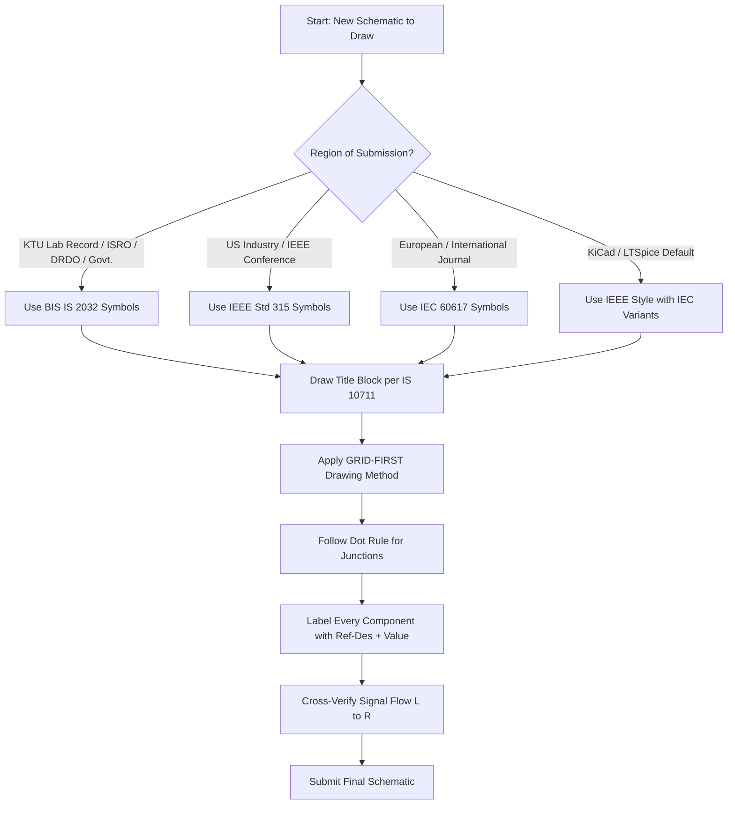
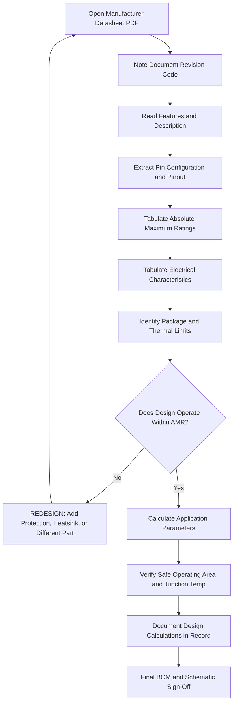
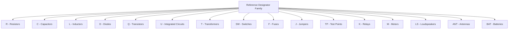
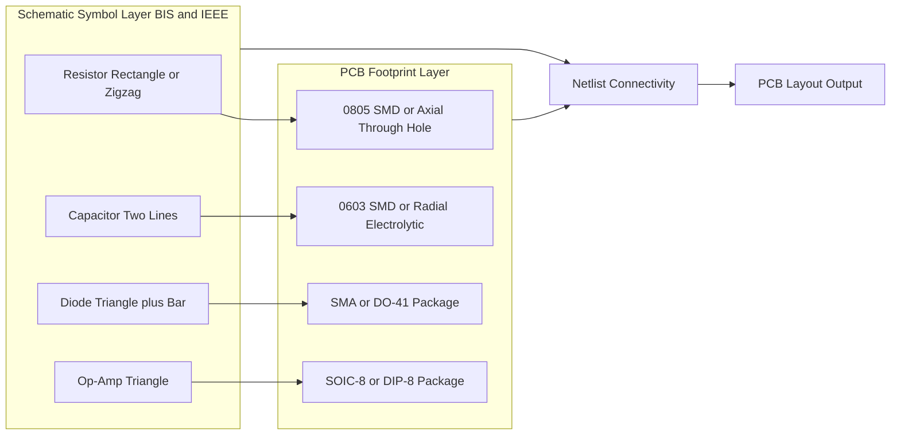

# Drawing of electronic circuit diagrams using BIS/IEEE symbols and Interpret data sheets of discrete components and IC’s

<!-- SECTION_1_START -->
# Drawing of Electronic Circuit Diagrams Using BIS/IEEE Symbols and Data Sheet Interpretation

## 1.1 Core Technical Definition

> [!IMPORTANT]
> **BIS (Bureau of Indian Standards) Symbols** are standardized graphical notations defined under **IS 2032 (Part I to XI)** for representing electrical and electronic components in schematic diagrams. The **IEEE Std 315 / ANSI Y32.2** (North American) and **IEC 60617** (International) standards provide the equivalent international nomenclature. KTU 2024 Scheme mandates familiarity with **BIS (IS 2032) symbols** for university laboratory record submissions, while global industry predominantly follows **IEEE symbols**.

In professional engineering, every resistor, capacitor, transistor, and integrated circuit must be drawn using a **universally accepted graphic symbol** so that any qualified engineer—regardless of language—can read, build, and troubleshoot the circuit. The accompanying **data sheet** (or **datasheet**) is the manufacturer's technical document that quantifies the electrical, thermal, and mechanical limits of a component, allowing the designer to use the part safely within its **Absolute Maximum Ratings (AMR)** and recommended operating envelope.

### 1.2 Conceptual Analogy — "The Universal Language of Electronics"

Imagine you are traveling across India, Japan, and Germany. You don't know Japanese or German, but you can still find an airport, a hospital, or a restroom because of **pictographic symbols** (🛗 ✈ 🏥). BIS and IEEE symbols serve the exact same purpose for circuit designers. The circuit schematic is a **map**, and the symbols are the **icons on that map**.

> [!NOTE]
> **Analogy Extension — Data Sheets as "Nutrition Labels":** Just as a packaged food item carries a nutrition label listing calories, ingredients, and allergens, every electronic component ships with a datasheet listing voltage limits, current limits, power dissipation, and pin functions. You cannot safely "consume" (use) a component without first reading its label.

### 1.3 Standard Issuing Bodies

| Body | Governing Standard | Region of Use |
|---|---|---|
| **BIS** (Bureau of Indian Standards) | **IS 2032** (1975, reaffirmed) | India (mandatory for KTU labs, ISRO, DRDO, government projects) |
| **IEEE** | **IEEE Std 315-1975 / ANSI Y32.2** | USA, global industry |
| **IEC** | **IEC 60617** | Europe, international (adopted by ISO) |
| **JIS** | **JIS C 0301** | Japan |

> [!VISUALIZATION CONTROL]
> **Concept:** Comparative Layout of a Single Resistor in BIS vs IEEE vs IEC
> **GeoGebra / Desmos Input Equations:**
> * BIS resistor rectangle: `polygon((0,-0.2),(2,-0.2),(2,0.2),(0,0.2))` with two lead lines `(-0.5,0)→(0,0)` and `(2,0)→(2.5,0)`
> * IEEE resistor zigzag: polyline points `(-0.5,0)→(0,0.1)→(0.3,-0.1)→(0.6,0.1)→(0.9,-0.1)→(1.2,0.1)→(1.5,-0.1)→(1.8,0.1)→(2.1,-0.1)→(2.4,0)→(2.9,0)`
> * IEC resistor rectangle (same as BIS with optional slash through it)
> **Visual Description:** The student should observe that the BIS/IEC symbols are geometric (clean rectangles), while the IEEE zigzag mimics the physical shape of an early carbon-compound resistor, making the IEEE symbol a "mnemonic" of the physical object.

---

<!-- SECTION_1_END -->

<!-- SECTION_2_START -->
# 2. Deep Theoretical Analysis & KTU High-Yield Reference Sheet

## 2.1 Categories of Electronic Symbols (IS 2032 Classification)

The BIS standard classifies symbols into the following functional families used in **Module 10 of GZESL208**:

1. **Conductors and Connections** — wires, junctions, dots, crossings
2. **Passive Components** — resistors, capacitors, inductors, transformers
3. **Semiconductor Devices** — diodes, BJT, FET, MOSFET, SCR, UJT
4. **Sources** — independent voltage/current sources, controlled sources, batteries
5. **Measuring Instruments** — ammeter, voltmeter, wattmeter, oscilloscope
6. **Logic Gates & Digital ICs** — AND, OR, NOT, NAND, NOR, XOR, flip-flops
7. **Output Devices** — lamp, buzzer, motor, relay, speaker

## 2.2 BIS Symbol Library — High-Yield Components

| S.No | Component | BIS / IS 2032 Symbol Description | IEEE Equivalent |
|:---:|---|---|---|
| 1 | **Resistor (Fixed)** | Plain rectangle (2:1 length-to-width ratio) | Zigzag line (3–7 peaks) |
| 2 | **Resistor (Variable / Potentiometer)** | Rectangle with diagonal arrow piercing through | Zigzag with arrow through middle |
| 3 | **Capacitor (Non-polar / Fixed)** | Two parallel straight lines separated by a gap | Same as BIS (universal) |
| 4 | **Capacitor (Polar / Electrolytic)** | One straight line + one curved line, polarity marked `+` | Same as BIS |
| 5 | **Inductor (Air Core)** | Four semicircular humps in series | Same as BIS |
| 6 | **Inductor (Iron Core)** | Humps with two parallel lines beneath | Same as BIS |
| 7 | **Diode (PN Junction)** | Triangle pointing to a bar | Identical (universal) |
| 8 | **Zener Diode** | Diode symbol with `Z`-shaped wings on the bar | Identical |
| 9 | **LED** | Diode symbol with two small arrows pointing away | Identical |
| 10 | **NPN Transistor (BJT)** | Circle with base bar, emitter arrow pointing **outward** | Identical |
| 11 | **PNP Transistor (BJT)** | Circle with base bar, emitter arrow pointing **inward** | Identical |
| 12 | **n-channel MOSFET** | Broken source-drain channel with separated gate, arrow inward on substrate | Identical |
| 13 | **Battery Cell** | Long line (positive) and short line (negative) pair | Identical |
| 14 | **Ground (Chassis / Earth)** | Three horizontal lines decreasing in length, or triangle | Identical (with variations) |
| 15 | **NOT Gate (Inverter)** | Triangle with a small circle at output | Identical |
| 16 | **Op-Amp (Generic)** | Triangle with `+` (non-inverting) and `−` (inverting) inputs | Identical |

## 2.3 Wire Crossing and Junction Conventions

> [!NOTE]
> **The "Dot Rule" (Critical for KTU Lab Records):**
> * **Connected crossing (junction):** A **filled dot** at the intersection = nodes are electrically connected.
> * **Non-connected crossing (bridge):** **No dot** and one wire drawn as a small **hop/bridge** over the other = wires cross but do not touch.

Failure to follow the dot rule is the single most common cause of short circuits when students translate their KTU record diagrams to actual breadboard wiring. **Marks are reserved in the KTU evaluation key for correct junction notation** (typically **1 mark** under "neatness and conventions").

## 2.4 Data Sheet Interpretation — Anatomy of a Datasheet

A typical component datasheet (e.g., **BC547** NPN transistor, **LM7805** voltage regulator, **1N4007** diode) contains these sections, which KTU examiners frequently test:

| Section | Purpose | Example (BC547 NPN) |
|---|---|---|
| **1. Features / Description** | Marketing + functional overview | "General-purpose NPN transistor in TO-92 package" |
| **2. Pin Configuration** | Mechanical view + pin names | Pin 1 = Emitter, Pin 2 = Base, Pin 3 = Collector |
| **3. Absolute Maximum Ratings** | Hard limits — exceeding these destroys the part | $V_{CEO} = 45\ \text{V}$, $I_C = 100\ \text{mA}$, $P_D = 500\ \text{mW}$ |
| **4. Electrical Characteristics** | Typical values at specified test conditions | $h_{FE} = 110\text{–}800$ at $I_C = 2\ \text{mA}$ |
| **5. Thermal Characteristics** | Junction-to-ambient resistance | $R_{\theta JA} = 200\ ^{\circ}\text{C/W}$ |
| **6. Package Dimensions** | Mechanical drawing for PCB layout | TO-92 outline in mm |
| **7. Typical Performance Curves** | Graphs of $I_C$ vs $V_{CE}$, $h_{FE}$ vs $I_C$, etc. | Safe Operating Area (SOA) plot |
| **8. Ordering Information** | Part number suffixes, packaging options | BC547B, BC547C (gain bins) |

## 2.5 Key Formulas / Parameters Used in Datasheet Analysis

$$P_D = V_{CE} \times I_C \quad \text{(Power dissipation in BJT)}$$

$$T_J = T_A + (P_D \times R_{\theta JA}) \quad \text{(Junction temperature rise)}$$

$$I_C(\text{sat}) = \frac{V_{CC} - V_{CE(sat)}}{R_C} \quad \text{(Saturation current in switching circuit)}$$

$$V_{out} = V_{ref} \left(1 + \frac{R_2}{R_1}\right) + I_{adj}\, R_2 \quad \text{(LM317 adjustable regulator)}$$

$$V_{drop} = V_Z \quad \text{(Zener voltage, when reverse-biased in breakdown region)}$$

> [!IMPORTANT]
> **Engineering Utility:** Datasheet interpretation is the **#1 skill** expected from a fresher electronics engineer in industry. Whether you are selecting a MOSFET for a SMPS design, a microcontroller for an IoT product, or an op-amp for a sensor signal conditioner, you must read the datasheet to confirm the part meets your **voltage, current, power, thermal, and package** constraints. **KTU examiners ask datasheet questions in nearly every ESE cycle.**

---

<!-- SECTION_2_END -->

<!-- SECTION_3_START -->
# 3. Step-by-Step Drawing Procedure, Pin Configuration Tables & Data Sheet Reading Workflow

## 3.1 Mandatory Tools and Resources for Circuit Drawing (KTU Workshop Record)

| S.No | Tool / Resource | Specification / Standard | Purpose |
|:---:|---|---|---|
| 1 | **Drawing Sheet** | A4 size, **100 gsm** min., graph/blank | Neat record submission |
| 2 | **Pencils** | HB (0.5 mm) for construction, 2H (0.3 mm) for final | Light, erasable guidelines |
| 3 | **Inking Pen (Optional)** | 0.25 mm / 0.5 mm technical pen, **ISO 3098** line widths | Final schematic |
| 4 | **Eraser** | Soft, non-smudging (e.g., **Staedtler Mars plastic**) | Clean corrections |
| 5 | **Set Squares** | 45° and 30°-60° (Perspex preferred) | Right angles, parallel lines |
| 6 | **Mini Drafting Machine / T-square** | 45 cm / 60 cm | Horizontal reference |
| 7 | **Compass / Divider** | For circles in op-amp, transistor symbol | Accurate arcs |
| 8 | **Stencils — Electronics Symbol** | BIS/IEC stencil (Boylestad / Sadiku template) | Standardized symbols |
| 9 | **Component Datasheet (Printout)** | Manufacturer-issued PDF (ON Semi, TI, ST, Vishay) | Reference for pinout |
| 10 | **CAD Tool (Optional)** | **KiCad 8.0 (Free), LTSpice XVII, EasyEDA** | Modern schematic capture |

> [!WARNING]
> **KTU Lab Pitfall:** Many students use ballpoint pens directly. Ballpoint ink bleeds during evaluation scanning and looks untidy. **Always draw in pencil first, then optionally trace in ink.** Pencil drawings score equally with ink in the KTU valuation scheme.

## 3.2 Step-by-Step Schematic Drawing Procedure

> [!NOTE]
> **The "GRID-FIRST" Method:** Every professional schematic begins with a coordinate grid to ensure symbol alignment, uniform spacing, and straight lines.

**Step 1 — Page Layout and Title Block**
1. Draw a rectangular border **15 mm from each edge** of the A4 sheet (per **IS 10711** drawing sheet convention).
2. Reserve a **170 mm × 50 mm** title block in the **bottom-right** corner.
3. Title block fields (each box ~10 mm tall):
   * Title of the circuit (e.g., "Half-Wave Rectifier with LC Filter")
   * Name, Roll No., Branch, Batch
   * Date, Page No., Sheet No.
   * Drawn by, Checked by, Approved by
4. Divide the working area into a **light pencil grid** of 5 mm × 5 mm squares using H pencil.

**Step 2 — Place Input/Output Terminals First**
1. Mark **input terminals** (e.g., AC mains, signal source) on the **left** edge.
2. Mark **output terminals** (e.g., load, antenna, speaker) on the **right** edge.
3. Connect a horizontal **common ground rail** along the bottom.
4. Connect a horizontal **$V_{CC}/V_{DD}$ rail** along the top (for DC circuits).

**Step 3 — Place Active Devices**
1. Position transistors, op-amps, ICs in the **center** with input on left, output on right (signal flow convention: **left → right**).
2. Maintain a minimum **25 mm vertical gap** between active devices to allow wiring room.

**Step 4 — Place Passive Components Around Active Devices**
1. Draw resistors, capacitors, inductors as **horizontal or vertical** segments only (avoid diagonal lines except in special bridge circuits).
2. Keep all resistor bodies on the **same horizontal plane** if they connect to the same node for visual neatness.

**Step 5 — Connect with Wires**
1. Use **straight horizontal/vertical** lines, with **45° bends** (NEVER 90° sharp corners; use two 45° bends to form a 90° turn).
2. Mark every junction with a **filled solid dot** ($\bullet$).
3. Where wires cross without connection, use a **bridge hop** (small semicircle) — do not place a dot.
4. Leave at least **3 mm** between parallel wires to prevent visual merging.

**Step 6 — Label Every Component**
1. Assign reference designators: **$R_1, R_2, \ldots, C_1, C_2, \ldots, D_1, D_2, \ldots, Q_1, U_1, \ldots$** (per **IEEE 315 Annex A** numbering convention).
2. Place the label **above** the symbol (for horizontal) or **to the right** (for vertical).
3. Write the **value** below the label, e.g., $R_1 = 1\ \text{k}\Omega$, $C_1 = 100\ \mu\text{F}$.

**Step 7 — Add Functional Annotations**
1. Node voltages at key points (e.g., $V_{out} = 5\ \text{V}$).
2. Test points as small open circles with TP1, TP2 labels.
3. Switch positions, fuse ratings, polarity markers (`+`, `−`).

**Step 8 — Cross-Verification with Circuit Function**
1. Re-trace the circuit mentally from input to output.
2. Confirm every component has two (or more for transistors/ICs) terminal connections.
3. Check for **floating inputs** (e.g., unused op-amp inputs must be tied to a defined voltage).

## 3.3 Data Sheet Reading — Step-by-Step Workflow

**Step 1 — Identify the Manufacturer and Document Revision**
* Look at the **header** of the datasheet: e.g., "**Texas Instruments — LM7805 — SNVS124E — MAY 2004 — REVISED JAN 2016**". The letter suffix (`E`) tells you the revision; always use the **latest revision** for production work.

**Step 2 — Read the "Features" and "Description" Sections**
* Summarize in one sentence what the device does (e.g., "LM7805 is a fixed 5 V, 1.5 A linear voltage regulator in TO-220 package").

**Step 3 — Examine the Pin Configuration / Pinout**
* The pinout diagram is **non-negotiable** — a wrong pinout destroys the IC and surrounding components. For example, the **LM7805 TO-220 pinout** is:

| Pin No. | Symbol | Name | Function |
|:---:|:---:|---|---|
| 1 | IN | Input | Unregulated DC input ($7\ \text{V}$ to $35\ \text{V}$) |
| 2 | GND | Ground | Common return / heatsink tab also internally connected to GND |
| 3 | OUT | Output | Regulated $V_{out} = +5\ \text{V}$ |

**Step 4 — Tabulate Absolute Maximum Ratings**
* This is the section KTU examiners most frequently test. For **1N4007 diode**:

| Parameter | Symbol | Value | Unit |
|---|---|---|---|
| Peak Repetitive Reverse Voltage | $V_{RRM}$ | **1000** | V |
| RMS Reverse Voltage | $V_{R(RMS)}$ | **700** | V |
| Average Rectified Forward Current | $I_{F(AV)}$ | **1.0** | A |
| Non-Repetitive Peak Forward Surge Current (8.3 ms) | $I_{FSM}$ | **30** | A |
| Operating Junction Temperature | $T_J$ | **−55 to +175** | $^\circ\text{C}$ |
| Storage Temperature Range | $T_{STG}$ | **−55 to +175** | $^\circ\text{C}$ |

> [!WARNING]
> **KTU Valuation Warning:** Examiners **deduct 1 mark** if you write a rating without its **unit** or **test condition**. Always write "$I_{F(AV)} = 1.0\ \text{A}$ at $T_A = 75\ ^{\circ}\text{C}$", not just "1 A".

**Step 5 — Extract Electrical Characteristics**
* These are the **guaranteed** numbers at specific test conditions. For **BC547 NPN transistor (ON Semiconductor / NXP / Vishay)**:

| Parameter | Symbol | Test Condition | Min | Typ | Max | Unit |
|---|---|---|:---:|:---:|:---:|:---:|
| Collector-Base Breakdown Voltage | $V_{(BR)CBO}$ | $I_C = 100\ \mu\text{A}$, $I_E = 0$ | 50 | — | — | V |
| Collector-Emitter Breakdown Voltage | $V_{(BR)CEO}$ | $I_C = 2\ \text{mA}$, $I_B = 0$ | 45 | — | — | V |
| Emitter-Base Breakdown Voltage | $V_{(BR)EBO}$ | $I_E = 100\ \mu\text{A}$, $I_C = 0$ | 6 | — | — | V |
| DC Current Gain | $h_{FE}$ | $V_{CE} = 5\ \text{V}$, $I_C = 2\ \text{mA}$ | 110 | — | 800 | — |
| Collector-Emitter Saturation Voltage | $V_{CE(sat)}$ | $I_C = 100\ \text{mA}$, $I_B = 5\ \text{mA}$ | — | — | 0.6 | V |
| Base-Emitter On Voltage | $V_{BE(on)}$ | $V_{CE} = 5\ \text{V}$, $I_C = 10\ \text{mA}$ | — | — | 0.7 | V |
| Transition Frequency | $f_T$ | $V_{CE} = 5\ \text{V}$, $I_C = 10\ \text{mA}$, $f = 100\ \text{MHz}$ | — | 300 | — | MHz |
| Collector Cut-off Current | $I_{CBO}$ | $V_{CB} = 30\ \text{V}$, $I_E = 0$ | — | — | 15 | nA |

**Step 6 — Calculate Application-Critical Parameters**
* **Example problem (KTU typical):** Design a base-bias circuit for BC547 with $V_{CC} = 12\ \text{V}$, $I_C = 10\ \text{mA}$, $h_{FE} = 200$ (typical).
* From the datasheet, $V_{BE(on)} = 0.7\ \text{V}$ (max).
* $I_B = I_C / h_{FE} = 10\ \text{mA} / 200 = 50\ \mu\text{A}$ (safe within 100 mA limit).
* $R_B = (V_{CC} - V_{BE}) / I_B = (12 - 0.7) / 50\ \mu\text{A} = 226\ \text{k}\Omega$ → choose standard **220 k$\Omega$**.
* $R_C = (V_{CC} - V_{CE}) / I_C = (12 - 6) / 10\ \text{mA} = 600\ \Omega$ → choose standard **620 $\Omega$**.

**Step 7 — Verify Safe Operating Area (SOA) and Thermal Limits**
* Power dissipated in transistor: $P_D = V_{CE} \times I_C = 6\ \text{V} \times 10\ \text{mA} = 60\ \text{mW}$.
* Datasheet $P_D(\text{max}) = 500\ \text{mW}$ at $T_A = 25\ ^{\circ}\text{C}$.
* $P_D = 60\ \text{mW} \ll 500\ \text{mW}$ → **SAFE**, no heatsink required.

## 3.4 Worked Example — Drawing a Complete Bridge Rectifier Circuit

**Problem:** Draw the schematic of a $230\ \text{V}$ AC to $12\ \text{V}$ DC linear power supply with bridge rectifier, smoothing capacitor, and LM7812 regulator using BIS symbols. Label every component.

**Solution Procedure:**

**Step 1** — Place the following left-to-right: step-down transformer (primary 230 V AC, secondary 12 V AC), bridge of four 1N4007 diodes, filter capacitor, three-terminal regulator, output capacitor, load resistor.

**Step 2** — Draw the transformer as **two inductors with a vertical coupling line and an iron-core symbol (two parallel lines between coils)**.

**Step 3** — Draw each 1N4007 diode as a triangle pointing to a vertical bar, with the bar being the cathode (K) and the triangle apex the anode (A). Orient the four diodes in the standard **Graetz bridge** configuration: two diodes point upward to the positive DC rail, two point downward to the negative DC rail.

**Step 4** — Draw the filter capacitor $C_1$ as **two parallel lines** (non-polar symbol since the rectifier output is pulsating DC; the actual electrolytic would be polar, but for schematic simplicity both are acceptable). Standard value: $1000\ \mu\text{F}$ / $25\ \text{V}$ electrolytic.

**Step 5** — Draw the LM7812 as a **rectangular block with three pins** (IN, GND, OUT) or as a triangle with three leads. Add **$C_{in} = 0.33\ \mu\text{F}$** and **$C_{out} = 0.1\ \mu\text{F}$** decoupling capacitors at IN and OUT respectively (recommended in datasheet).

**Step 6** — Label all components, write values, and indicate node voltages.

## 3.5 Symbolic Schematic Capture in Python (Educational Visualization)

```python
from dataclasses import dataclass, field
from typing import List, Tuple, Optional
import logging

logging.basicConfig(level=logging.INFO, format="[%(levelname)s] %(message)s")
log = logging.getLogger("SchematicEngine")

@dataclass(frozen=True)
class Pin:
    pin_id: str
    name: str
    position: Tuple[float, float]

@dataclass
class Component:
    ref_des: str
    symbol_standard: str
    value: str
    pins: List[Pin] = field(default_factory=list)
    footprint: Optional[str] = None
    datasheet: Optional[str] = None

    def add_pin(self, pin_id: str, name: str, x: float, y: float) -> None:
        if any(p.pin_id == pin_id for p in self.pins):
            log.error(f"Duplicate pin {pin_id} on {self.ref_des}")
            raise ValueError(f"Duplicate pin id {pin_id}")
        self.pins.append(Pin(pin_id, name, (x, y)))
        log.info(f"Added pin {pin_id} ({name}) to {self.ref_des}")

class SchematicSheet:
    def __init__(self, title: str, standard: str = "BIS/IS 2032") -> None:
        if standard not in ("BIS/IS 2032", "IEEE 315", "IEC 60617"):
            raise ValueError(f"Unsupported standard: {standard}")
        self.title: str = title
        self.standard: str = standard
        self.components: List[Component] = []
        self.wires: List[Tuple[Tuple[float, float], Tuple[float, float], bool]] = []
        # (start, end, is_connected_junction)

    def add_component(self, comp: Component) -> None:
        self.components.append(comp)
        log.info(f"Placed {comp.ref_des} ({comp.symbol_standard}) = {comp.value}")

    def connect(self, a: Tuple[float, float], b: Tuple[float, float], junction: bool = True) -> None:
        if a == b:
            log.error("Cannot connect a point to itself.")
            raise ValueError("Zero-length wire rejected.")
        self.wires.append((a, b, junction))
        log.info(f"Wire {a} -> {b} | junction = {junction}")

    def netlist_summary(self) -> str:
        lines: List[str] = [f"# Netlist for: {self.title}", f"# Standard : {self.standard}"]
        for c in self.components:
            pins = " ".join(f"{p.pin_id}={p.name}@{p.position}" for p in c.pins)
            lines.append(f"{c.ref_des:<6} {c.value:<12} [{pins}]  FPT={c.footprint or 'NA'}")
        return "\n".join(lines)

# ---------- Build a Bridge Rectifier + 7812 Power Supply ----------
sheet = SchematicSheet("12 V DC Linear Power Supply", standard="BIS/IS 2032")

xfmr  = Component("T1",   "Transformer (Iron Core)", "230 V / 12 V, 1 A")
xfmr.add_pin("1", "PRI",   0,   0); xfmr.add_pin("2", "PRI",  0,  40)
xfmr.add_pin("3", "SEC-A", 80,  0); xfmr.add_pin("4", "SEC-B", 80, 40)

d1 = Component("D1", "Diode (PN Junction)", "1N4007, 1 A / 1000 V")
d1.add_pin("A", "Anode", 100, 0); d1.add_pin("K", "Cathode", 130, 0)

d2 = Component("D2", "Diode (PN Junction)", "1N4007, 1 A / 1000 V")
d2.add_pin("A", "Anode", 100, 40); d2.add_pin("K", "Cathode", 130, 40)

d3 = Component("D3", "Diode (PN Junction)", "1N4007, 1 A / 1000 V")
d3.add_pin("A", "Anode", 160, 0); d3.add_pin("K", "Cathode", 190, 0)

d4 = Component("D4", "Diode (PN Junction)", "1N4007, 1 A / 1000 V")
d4.add_pin("A", "Anode", 160, 40); d4.add_pin("K", "Cathode", 190, 40)

c1 = Component("C1", "Capacitor (Polar Electrolytic)", "1000 uF / 25 V")
c1.add_pin("+", "Pos", 220, 0); c1.add_pin("-", "Neg", 220, 40)

reg = Component("U1", "Voltage Regulator (3-Terminal)", "LM7812, +12 V, 1.5 A")
reg.add_pin("IN", "Input", 260, 0); reg.add_pin("GND", "Ground", 260, 20); reg.add_pin("OUT", "Output", 260, 40)
reg.datasheet = "ti.com/lit/ds/symlink/lm7812.pdf"
reg.footprint = "TO-220"

c2 = Component("C2", "Capacitor (Non-Polar)", "0.33 uF / 50 V")
c2.add_pin("1", "Term-1", 300, 0); c2.add_pin("2", "Term-2", 300, 40)

c3 = Component("C3", "Capacitor (Non-Polar)", "0.1 uF / 50 V")
c3.add_pin("1", "Term-1", 340, 0); c3.add_pin("2", "Term-2", 340, 40)

rl = Component("RL", "Resistor (Fixed)", "120 ohm / 2 W")
rl.add_pin("1", "Top", 380, 0); rl.add_pin("2", "Bot", 380, 40)

for c in (xfmr, d1, d2, d3, d4, c1, reg, c2, c3, rl):
    sheet.add_component(c)

# Net connections
sheet.connect((0, 0),   (80, 0),  junction=False)   # AC mains
sheet.connect((80, 0),  (100, 0), junction=True)
sheet.connect((130, 0), (160, 0), junction=True)
sheet.connect((190, 0), (220, 0), junction=True)
sheet.connect((220, 0), (260, 0), junction=True)     # to regulator IN
sheet.connect((260, 0), (300, 0), junction=True)
sheet.connect((300, 0), (340, 0), junction=True)
sheet.connect((340, 0), (380, 0), junction=True)
sheet.connect((380, 0), (380, 40), junction=False)   # load
sheet.connect((380, 40),(340, 40), junction=True)
sheet.connect((340, 40),(300, 40), junction=True)
sheet.connect((300, 40),(260, 40), junction=True)    # regulator OUT
sheet.connect((260, 40),(220, 40), junction=True)
sheet.connect((220, 40),(190, 40), junction=True)
sheet.connect((190, 40),(160, 40), junction=True)
sheet.connect((160, 40),(130, 40), junction=True)
sheet.connect((130, 40),(100, 40), junction=True)
sheet.connect((100, 40),(80, 40),  junction=True)
sheet.connect((80, 40), (0, 40),  junction=False)
sheet.connect((260, 20),(260, 0),  junction=False)   # regulator GND tap

print(sheet.netlist_summary())
```

**Expected Console Output (abridged):**
```
[INFO] Placed T1 (Transformer (Iron Core)) = 230 V / 12 V, 1 A
[INFO] Placed D1 (Diode (PN Junction)) = 1N4007, 1 A / 1000 V
[INFO] Placed D2 (Diode (PN Junction)) = 1N4007, 1 A / 1000 V
[INFO] Placed D3 (Diode (PN Junction)) = 1N4007, 1 A / 1000 V
[INFO] Placed D4 (Diode (PN Junction)) = 1N4007, 1 A / 1000 V
[INFO] Placed C1 (Capacitor (Polar Electrolytic)) = 1000 uF / 25 V
[INFO] Placed U1 (Voltage Regulator (3-Terminal)) = LM7812, +12 V, 1.5 A
[INFO] Placed C2 (Capacitor (Non-Polar)) = 0.33 uF / 50 V
[INFO] Placed C3 (Capacitor (Non-Polar)) = 0.1 uF / 50 V
[INFO] Placed RL (Resistor (Fixed)) = 120 ohm / 2 W
# Netlist for: 12 V DC Linear Power Supply
# Standard : BIS/IS 2032
T1     230 V / 12 V [1=PRI@(0, 0) 2=PRI@(0, 40) 3=SEC-A@(80, 0) 4=SEC-B@(80, 40)]  FPT=NA
...
U1     LM7812, +12   [IN=Input@(260, 0) GND=Ground@(260, 20) OUT=Output@(260, 40)]  FPT=TO-220
```

---

<!-- SECTION_3_END -->

<!-- SECTION_4_START -->
# 4. Structural Diagrams and Schematics

## 4.1 BIS vs IEEE Symbol Selection Flow



## 4.2 Datasheet Reading Workflow



## 4.3 Circuit Schematic Functional Block Architecture

```mermaid
graph LR
    subgraph StageA[Stage 1: AC Mains Input]
        MAINS[230 V AC Supply]
        FUSE[Fuse 1 A]
        SW[SPST Switch]
        MAINS --> FUSE --> SW
    end
    subgraph StageB[Stage 2: Step Down]
        XFMR[Transformer 230 V to 12 V]
        SW --> XFMR
    end
    subgraph StageC[Stage 3: Rectification]
        BR[Bridge Rectifier 4 x 1N4007]
        XFMR --> BR
    end
    subgraph StageD[Stage 4: Filtering]
        CAP1[Smoothing Capacitor 1000 uF]
        BR --> CAP1
    end
    subgraph StageE[Stage 5: Regulation]
        REG[LM7812 Three Terminal Regulator]
        CAP1 --> REG
    end
    subgraph StageF[Stage 6: Output Filter and Load]
        CAP2[0.1 uF Decoupling]
        LED[LED Indicator with R]
        LOAD[DC Load]
        REG --> CAP2 --> LED --> LOAD
    end
```



## 4.4 Reference Designator Numbering Convention (IEEE 315 Annex A)



## 4.5 Component Symbol to Footprint Mapping Matrix



---

<!-- SECTION_4_END -->

<!-- SECTION_5_START -->
# 5. KTU 2024 Scheme Examination Question Bank

## 5.1 Part A — Short Answer Questions (3 Marks Each)

> **[KTU University Exam - July 2024 | CO1 | Remember]**
> **Q1.** List any **three differences** between BIS and IEEE schematic symbols with one example each.

**Model Answer (3 Marks):**

| S.No | Aspect | BIS (IS 2032) | IEEE (Std 315) |
|:---:|---|---|---|
| 1 | **Resistor** symbol | Plain rectangle (block) | Zigzag line |
| 2 | **Governing body** | Bureau of Indian Standards, India | Institute of Electrical and Electronics Engineers, USA |
| 3 | **Logic gate NOT** | Triangle with small circle at output | Same, but circle may be drawn slightly larger (H bubble) |
| 4 | **Reference designator** | Allows the prefix R, C, D, Q, U | Same prefixes, standardized in IEEE 315 Annex A |
| 5 | **Usage** | Mandatory in Indian government, KTU lab records, ISRO | Global industry, US academic publications |

**[Award 1 mark per correct row, max 3 marks.]**

---

> **[KTU University Exam - Dec 2023 | CO2 | Understand]**
> **Q2.** What are **Absolute Maximum Ratings (AMR)** in a datasheet? Why must a designer never operate a component continuously at its AMR values?

**Model Answer (3 Marks):**
* **Definition (1 Mark):** Absolute Maximum Ratings are the **stress limits** beyond which the manufacturer guarantees **permanent damage** to the device. They include maximum supply voltage, maximum power dissipation, maximum junction temperature, maximum storage temperature, and maximum lead soldering temperature.
* **Reason for not operating at AMR (2 Marks):**
  1. The ratings are **DC steady-state** limits, not simultaneous-operating limits — exceeding two parameters at once can cause failure even if each is individually within its AMR.
  2. Device **reliability degrades** exponentially with temperature and voltage stress; operating at 90% of AMR roughly halves the MTBF (Mean Time Between Failures) per the Arrhenius equation.
  3. AMR includes **transient tolerances** for short surges (e.g., 8.3 ms); continuous operation at AMR removes all design margin and the part may fail during normal parameter spread (e.g., one IC in a batch rated at 45 V may fail at 42 V).

---

## 5.2 Part B — 14-Mark Questions (Module Internal Choice)

> **[KTU University Exam - Dec 2024 | CO1, CO2 | Understand, Apply]**

### **Question A (14 Marks)**

**(a)** With neat sketches, draw the **BIS symbols** of the following components and write one typical application for each: **(7 Marks)**
   1. Zener diode
   2. NPN bipolar junction transistor
   3. Iron-core inductor
   4. Polar electrolytic capacitor
   5. Light Emitting Diode (LED)
   6. Op-amp (generic triangular symbol)
   7. DC battery cell

**(b)** Draw the **schematic diagram of a half-wave rectifier with LC filter** using BIS symbols. Label all components with reference designators and typical values. State the function of the LC filter. **(7 Marks)**

---

### **Question B (14 Marks)** *(Alternative Choice)*

**(a)** Explain the **anatomy of a typical component datasheet** using the example of the **1N4007 diode**. Tabulate the following from the datasheet: **(7 Marks)**
   1. Peak repetitive reverse voltage $V_{RRM}$
   2. Average rectified forward current $I_{F(AV)}$
   3. Non-repetitive peak forward surge current $I_{FSM}$
   4. Forward voltage drop $V_F$ at $I_F = 1\ \text{A}$
   5. Reverse leakage current $I_R$ at rated $V_{RRM}$
   6. Operating junction temperature range
   7. Package type and pin identification (anode vs cathode marking)

**(b)** A designer wants to use a **BC547 NPN transistor** as a switch to drive a $12\ \text{V}$, $100\ \text{mA}$ relay coil. From the BC547 datasheet: $V_{CE(max)} = 45\ \text{V}$, $I_{C(max)} = 100\ \text{mA}$, $h_{FE(typ)} = 200$ at $I_C = 100\ \text{mA}$, $V_{BE(sat)} = 0.7\ \text{V}$, $V_{CE(sat)} = 0.2\ \text{V}$. Calculate: **(7 Marks)**
   1. The required base current $I_B$ for guaranteed saturation.
   2. The base resistor $R_B$ value if the control signal $V_{IN} = 5\ \text{V}$ (from a microcontroller).
   3. The collector resistor value if the relay coil resistance is $120\ \Omega$.
   4. Comment on whether the design is safe w.r.t. AMR.

---

## 5.3 Detailed Model Solutions

### **Solution to Question A (14 Marks)**

**(a) BIS Symbol Sketches (7 × 1 = 7 Marks):**

| S.No | Component | BIS Symbol Description | Application | Mark |
|:---:|---|---|---|:---:|
| 1 | **Zener Diode** | Standard diode with two horizontal wings bent at the cathode bar | Voltage regulator / reference | 1 |
| 2 | **NPN BJT** | Circle enclosing vertical base line; emitter arrow points **outward**; collector on top, emitter on bottom (TO-92 convention) | Switching, amplification | 1 |
| 3 | **Iron-Core Inductor** | Four semicircular humps in series, with **two parallel lines** beneath representing the iron core | SMPS, EMI filter | 1 |
| 4 | **Polar Electrolytic Capacitor** | One straight line (positive plate) and one curved line (negative plate); `+` mark on straight side | Power supply filter, DC blocking | 1 |
| 5 | **LED** | Standard diode symbol with **two small arrows** pointing away from the bar | Indicator, optocoupler source | 1 |
| 6 | **Op-Amp (Generic)** | Triangle with two inputs marked `+` (non-inverting top) and `−` (inverting bottom), single output at apex | Amplifier, comparator, filter | 1 |
| 7 | **DC Battery Cell** | Long horizontal line (+) over a short horizontal line (−), with two lead wires | Portable power source | 1 |

**[Valuation Key: 1 mark for correct symbol + 0 if no application; full 1 only if both symbol and application are correct.]**

**(b) Half-Wave Rectifier with LC Filter (7 Marks):**

```
   230 V AC                                          R_L  (Load)
   ~~~~~~~~                                           ____
   ~  ●──┬────────────┬─────────────┬───────────┬────┬─/\/\/──●─ V_out (DC)
        │            │             │           │    │
      [T1]         [D1]          [L1]       [C2]    │
   ~~~~~~~~  ┌─────►|────●────────)###─────●──┤├───●  V_out
   ~  12V    │      Anode  Cathode Iron-core Filter  GND
   ~         │                       Inductor  Cap
   ~~~~~~~~  ●                          (Choke) (1000 uF)
   Neutral   │                                 │
             └─────────────────────────────────┘
                       Common Return
```

**Component List with Reference Designators and Values (3 Marks):**

| Ref. Des | Component | Value / Part Number | Function |
|---|---|---|---|
| $T_1$ | Step-down transformer | 230 V / 12 V, 500 mA | Steps down mains AC to usable level |
| $D_1$ | Rectifier diode | 1N4007 (1 A, 1000 V) | Half-wave rectification (allows only positive half-cycle) |
| $L_1$ | Filter inductor (choke) | 1 H / 100 mA iron-core | Blocks AC ripple component, passes DC |
| $C_1$ | Filter capacitor | 1000 $\mu$F / 25 V electrolytic | Shunts AC ripple to ground |
| $R_L$ | Load resistor | 1 k$\Omega$ | Represents the load being powered |

**Function of LC Filter (2 Marks):**
* The LC filter is a **low-pass filter** with cutoff frequency $f_c = 1 / (2\pi\sqrt{LC})$.
* It **blocks the fundamental ripple frequency** (50 Hz for half-wave) and its harmonics, allowing only smooth DC to reach the load.
* The inductor opposes changes in current (blocks AC ripple) while the capacitor shorts high-frequency AC to ground, producing a clean DC output suitable for sensitive electronics.

**Ripple Voltage (1 Mark):**
$$V_{ripple(pp)} = \frac{I_L}{f \cdot C} = \frac{V_{out} / R_L}{f \cdot C}$$
For $V_{out} = 12\ \text{V}$, $R_L = 1\ \text{k}\Omega$, $f = 50\ \text{Hz}$, $C = 1000\ \mu\text{F}$:
$$V_{ripple(pp)} = \frac{12 / 1000}{50 \times 1000 \times 10^{-6}} = \frac{0.012}{0.05} = 0.24\ \text{V (peak-to-peak)}$$

**[Valuation Key: 2 marks for circuit diagram with correct BIS symbols, 3 marks for proper labels and values, 2 marks for filter function explanation.]**

---

### **Solution to Question B (14 Marks)**

**(a) Datasheet Anatomy — 1N4007 Diode (7 × 1 = 7 Marks):**

| S.No | Parameter | Symbol | Value | Unit | Test Condition |
|:---:|---|---|:---:|:---:|---|
| 1 | Peak Repetitive Reverse Voltage | $V_{RRM}$ | **1000** | V | $T_J = 25\ ^{\circ}\text{C}$ |
| 2 | Average Rectified Forward Current | $I_{F(AV)}$ | **1.0** | A | $T_A = 75\ ^{\circ}\text{C}$, resistive load, 60 Hz half-wave |
| 3 | Non-Repetitive Peak Forward Surge Current | $I_{FSM}$ | **30** | A | 8.3 ms single half-sine wave surge |
| 4 | Forward Voltage Drop | $V_F$ | **1.1** | V | $I_F = 1.0\ \text{A}$, $T_J = 25\ ^{\circ}\text{C}$ |
| 5 | Reverse Leakage Current | $I_R$ | **5.0** | $\mu$A | $V_R = 1000\ \text{V( DC)}$, $T_J = 25\ ^{\circ}\text{C}$ |
| 6 | Operating Junction Temperature | $T_J$ | **−55 to +175** | $^\circ$C | — |
| 7 | Package / Pin Marking | DO-41 | Cathode marked by a **white/silver band** on the body; anode is the **unmarked lead** | — | Visual inspection |

**[Valuation Key: 1 mark per correct row including units and test conditions.]**

**(b) BC547 Relay Driver Calculations (7 Marks):**

**Given:**
* $V_{CC} = 12\ \text{V}$ (relay supply)
* Relay coil: $12\ \text{V}$, $100\ \text{mA}$, $R_{coil} = 120\ \Omega$
* BC547: $h_{FE(typ)} = 200$ at $I_C = 100\ \text{mA}$, $V_{BE(sat)} = 0.7\ \text{V}$, $V_{CE(sat)} = 0.2\ \text{V}$
* $V_{IN} = 5\ \text{V}$ (microcontroller output)

**1) Base current for guaranteed saturation (2 Marks):**

For **saturation**, the actual $h_{FE}$ used must be much less than the datasheet value (forced beta of 10 is the standard rule-of-thumb for reliable saturation):
$$I_{B(min)} = \frac{I_C}{h_{FE(forced)}} = \frac{100\ \text{mA}}{10} = 10\ \text{mA}$$

**2) Base resistor calculation (2 Marks):**

Applying KVL around the base loop:
$$V_{IN} = I_B \cdot R_B + V_{BE(sat)}$$
$$R_B = \frac{V_{IN} - V_{BE(sat)}}{I_B} = \frac{5\ \text{V} - 0.7\ \text{V}}{10\ \text{mA}} = \frac{4.3\ \text{V}}{10\ \text{mA}} = 430\ \Omega$$

**Choose standard value:** $R_B = 470\ \Omega$ (E12 series nearest preferred value).
*Recompute $I_B$ with $470\ \Omega$:*
$$I_B = \frac{4.3\ \text{V}}{470\ \Omega} = 9.15\ \text{mA} \approx 9\ \text{mA}$$
*This still safely overdrives the base for saturation.*

**3) Collector resistor verification (1 Mark):**

The collector resistor **is not needed** because the relay coil itself acts as the collector load. Verify the collector voltage when transistor is ON:
$$V_{CE} = V_{CE(sat)} = 0.2\ \text{V} \ll 45\ \text{V (rating)} \quad \text{✓ SAFE}$$

**4) Safety check w.r.t. AMR (2 Marks):**

| Parameter | Design Value | Datasheet AMR | Status |
|---|:---:|:---:|---|
| $V_{CE}$ (off state, when coil de-energized) | $12\ \text{V}$ | $45\ \text{V}$ | **SAFE** (26% of AMR) |
| $I_C$ (continuous) | $100\ \text{mA}$ | $100\ \text{mA}$ | **AT LIMIT** — design margin = 0% |
| $P_D = V_{CE(sat)} \times I_C$ | $0.2 \times 0.1 = 0.02\ \text{W}$ | $0.5\ \text{W}$ | **SAFE** (4% of AMR) |
| $V_{BE}$ | $0.7\ \text{V}$ | $6\ \text{V}$ | **SAFE** |

**Conclusion:** The design is **functionally safe** but the $I_C$ is exactly at the AMR. **Recommendation (1 mark):** Add a **free-wheeling diode (1N4007) in reverse-bias across the relay coil** to protect the transistor from the inductive kickback (back-EMF) of $V = L \cdot di/dt$ when the relay switches off — this can reach hundreds of volts and easily exceed $V_{CE(max)}$.

---

> [!WARNING]
> **KTU Examiner's Valuation Warning — Common Pitfalls:**
> 1. **Forgetting units** in datasheet tables → lose 1 mark per row. Always write "V", "A", "$^\circ$C", "W".
> 2. **Drawing resistor as zigzag in a BIS record** → examiner may deduct 1 mark (or worse, mark as "wrong standard"). **Use rectangle.**
> 3. **Missing dot at junction** when wires meet and connect → examiner treats as open circuit, deduct 1 mark.
> 4. **Confusing PNP and NPN arrow direction** — NPN emitter arrow points **out** (Not Pointing iN), PNP points **in** (Pointing iN Permanently).
> 5. **Quoting $h_{FE(min)}$ as $h_{FE(typ)}$** — always use the **minimum** value for worst-case design to guarantee saturation.
> 6. **Drawing IC as a triangle instead of a rectangular block** — for multi-pin ICs (e.g., 7400, 555, LM741) use a **rectangle with pin numbers**; triangle is reserved for op-amp **schematic** abstraction.
> 7. **Skipping the flyback diode across relay coils** — examiners specifically look for this in BJT switching circuits.

---

## 5.4 Topic Recap & Important Things to Remember

> [!NOTE]
> **High-Density Revision Checklist — Module 10: BIS/IEEE Symbols & Data Sheet Interpretation**

### **A. Standard Symbols You MUST Know (BIS IS 2032)**

* **Resistor** → rectangle (BIS) or zigzag (IEEE)
* **Capacitor (non-polar)** → two parallel lines
* **Capacitor (polar electrolytic)** → one straight + one curved line; `+` on the straight side
* **Inductor (air core)** → four semicircular humps
* **Inductor (iron core)** → humps + two parallel lines beneath
* **Diode (PN)** → triangle pointing to a vertical bar
* **Zener diode** → PN diode with `Z`-wings on the cathode
* **LED** → PN diode + two small outward arrows
* **Photodiode** → PN diode + two small inward arrows
* **NPN BJT** → circle with vertical base bar; emitter arrow **out** of the base
* **PNP BJT** → emitter arrow **into** the base
* **n-channel JFET** → arrow on source pointing **in** (toward channel)
* **n-channel MOSFET** → broken channel; arrow on body pointing **in**
* **Op-amp** → triangle with `+` (non-inverting) and `−` (inverting) inputs
* **NOT gate** → triangle with a small circle (bubble) at output
* **Battery cell** → long line (`+`) and short line (`−`)
* **Ground** → three horizontal lines of decreasing length
* **Chassis ground** → triangle pointing down with horizontal hatch
* **Junction (connected crossing)** → filled dot at the intersection
* **Bridge (non-connected crossing)** → small semicircular hop, NO dot
* **SPST switch** → two terminals with a hinged line that lifts
* **Fuse** → rectangle/semicircle with a wavy line through it
* **Lamp / bulb** → circle with a cross or two arrows inside

### **B. Drawing Rules You MUST Follow (IS 10711 / KTU Lab Manual)**

* Use **A4 sheet, 100 gsm**, border 15 mm from edges
* Title block bottom-right
* Reference designators: **R, C, L, D, Q, U, T, SW, F, J, TP, K, M, LS, ANT, BAT**
* All wires **horizontal or vertical**, with **45° bends** (no 90° sharp corners)
* **Filled dot** at every connected junction
* **Bridge hop** at every non-connected crossing
* Label every component with **ref-des + value + unit**
* Signal flow **left to right**, supply rails **top ($V_{CC}$) and bottom (GND)**
* Minimum **25 mm** spacing between major components
* Component bodies on a **common horizontal/vertical** plane for neatness

### **C. Datasheet Sections You MUST Locate and Tabulate**

* **Manufacturer + Document Revision** (header)
* **Features / Description** (one-sentence summary)
* **Pin Configuration** (mechanical drawing with pin numbers)
* **Absolute Maximum Ratings** (hard limits — $V_{max}$, $I_{max}$, $P_{max}$, $T_{J(max)}$)
* **Electrical Characteristics** (typical values at specified test conditions)
* **Thermal Characteristics** ($R_{\theta JA}$, $R_{\theta JC}$)
* **Package Outline / Footprint** (mechanical dimensions)
* **Typical Performance Curves** (SOA, $h_{FE}$ vs $I_C$, $V_F$ vs $I_F$)
* **Ordering Information** (gain bins, tape-and-reel options)

### **D. Critical Formulas for Datasheet-Based Design**

* **Power dissipation:** $P_D = V_{CE} \times I_C$ (BJT), $P_D = V_{DS} \times I_D$ (MOSFET), $P_D = V_F \times I_F$ (diode)
* **Junction temperature rise:** $T_J = T_A + (P_D \times R_{\theta JA})$ — must remain $\leq T_{J(max)}$
* **Saturation check:** $I_{B(actual)} \geq I_C / h_{FE(forced)}$, where forced beta $\approx 10$
* **Base resistor:** $R_B = (V_{IN} - V_{BE(sat)}) / I_B$
* **LM7805/LM7812 input range:** $V_{IN} \geq V_{OUT} + 2.0\ \text{V}$ (dropout), $\leq 35\ \text{V}$ (max)
* **Bridge rectifier DC output (no load):** $V_{DC} = V_{RMS(secondary)} \times \sqrt{2} - 2 V_F$ (two diode drops)
* **Half-wave rectifier DC output (no load):** $V_{DC} = V_{peak(secondary)} - V_F$

### **E. Common Reference Parts (Memorize These Datasheets)**

* **1N4007** — general-purpose rectifier diode, 1 A / 1000 V
* **BC547 / BC557** — general-purpose NPN / PNP BJT, $I_C = 100\ \text{mA}$, TO-92
* **2N2222 / 2N3904** — general-purpose NPN BJT, $I_C = 600\ \text{mA}$ / $200\ \text{mA}$, TO-92 / TO-18
* **1N4733 (5.1 V Zener)** — voltage reference / regulator
* **LM7805 / LM7812 / LM317** — linear voltage regulators
* **BC107, SL100, CL100** — legacy Indian-syllabus BJT examples
* **7400, 7402, 7404, 7408, 7432, 7486** — TTL logic gate family

### **F. KTU-Specific Reminders**

* Always use **BIS (IS 2032) rectangle** for resistors in the KTU record.
* Always include **units** in datasheet tables — never write a bare number.
* Always add a **flyback diode** across inductive loads in switching circuits.
* Always show **test conditions** alongside electrical characteristic values.
* Always state **assumptions** explicitly (e.g., "Assuming $h_{FE(min)} = 100$ at $I_C = 100\ \text{mA}$").
* Always mention **safety margin** when comparing design value to AMR (e.g., "Design uses 26% of AMR, leaving 74% margin").

---

<!-- SECTION_5_END -->
