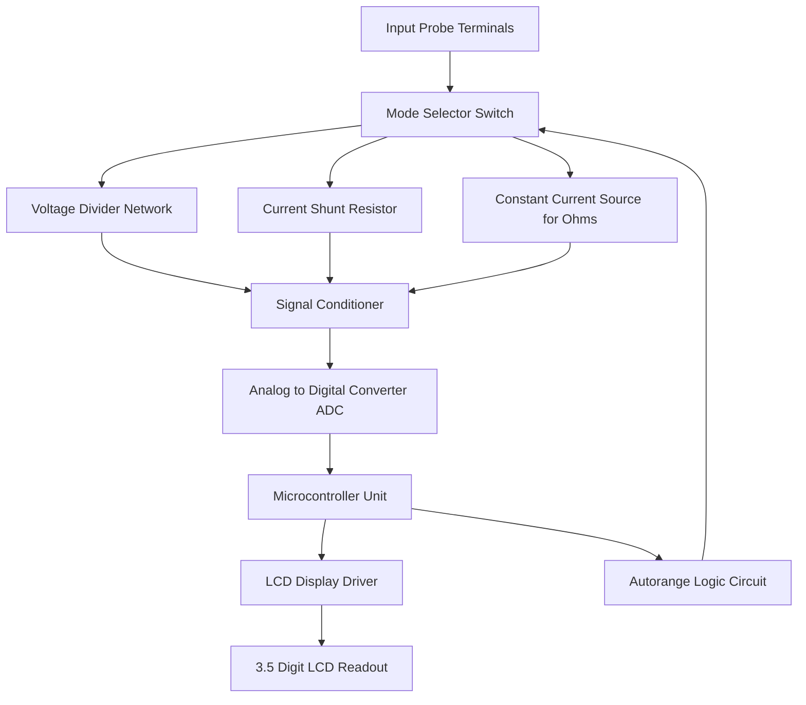
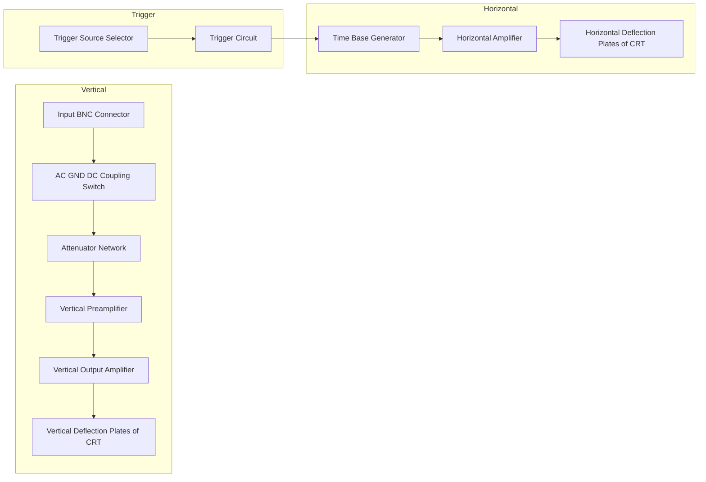
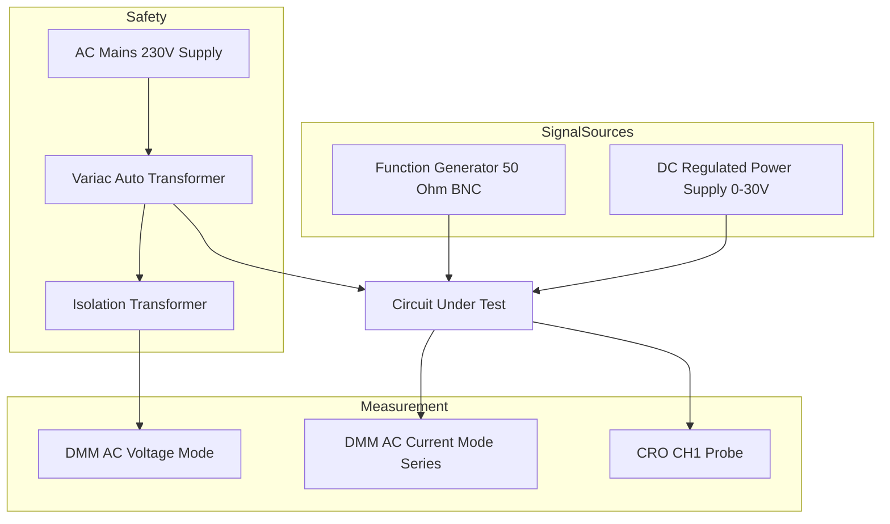
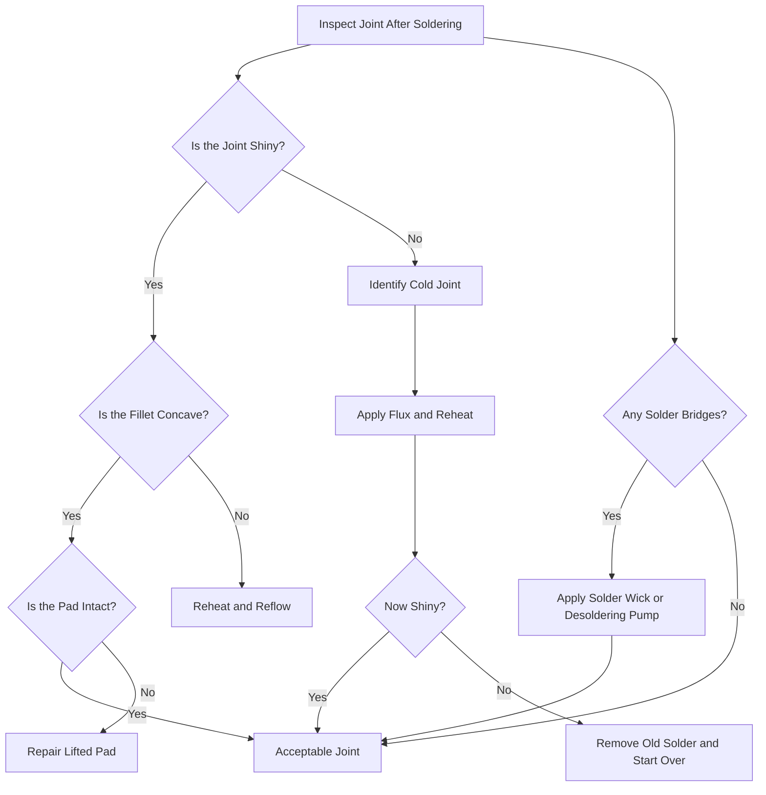
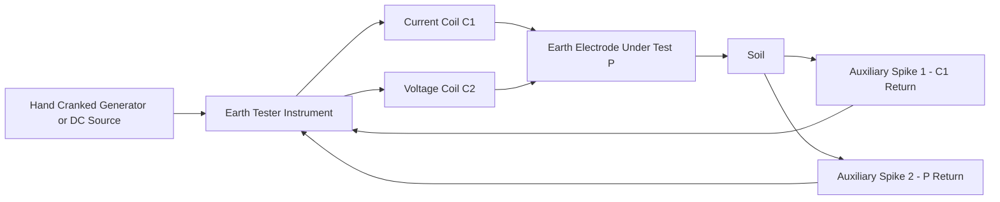

# Familiarization/Application of testing instruments and commonly used tools.

<!-- SECTION_1_START -->
# Basic Electrical and Electronics Engineering Workshop

## Module 11: Testing Instruments & Commonly Used Tools — A Professional Overview

> [!IMPORTANT]
> **KTU 2024 Scheme — GZESL208**
> **Cognitive Focus:** Identification, Selection, and Safe Application of Workshop Test Equipment.
> **Relevance:** This module underpins every electrical/electronics experiment you will perform throughout your engineering career.

---

### 1.1 What are "Testing Instruments" in an Engineering Workshop?

**Formal Definition (KTU Syllabus Terminology):**
Testing instruments are calibrated devices used to measure, monitor, and diagnose electrical and electronic quantities such as **voltage**, **current**, **resistance**, **frequency**, **waveform shape**, and **continuity** in circuits and equipment. "Commonly used tools" refer to the auxiliary hand tools and ancillary devices (such as wire strippers, crimpers, breadboards, and soldering stations) that support assembly, fabrication, and testing operations in an electrical/electronics workshop.

In simple engineering terms: an instrument **observes** (it does not change the circuit), while a tool **acts** (it modifies or builds the circuit). Together, they form the complete ecosystem of a workshop.

> [!NOTE]
> **KTU Board Emphasis:** Examiners frequently test whether a student can *correctly select* the right instrument for a given measurement, and *state the safety precautions* associated with that instrument. Always remember the **"Instrument–Quantity–Range"** triple when answering.

---

### 1.2 Conceptual Analogy — The "Doctor's Toolkit"

Imagine you visit a doctor. The doctor uses a **stethoscope** to listen to your heart, a **thermometer** to read your temperature, and a **BP monitor** for blood pressure. Each instrument measures one specific thing, and you would not dream of using a thermometer to hear your heart.

An electrical workshop works the same way:

| Doctor's Clinic | Electrical Workshop |
|---|---|
| Thermometer | Voltmeter (measures voltage) |
| BP Monitor | Wattmeter (measures power) |
| Weighing Scale | Ammeter (measures current) |
| Stethoscope | CRO / Oscilloscope (listens to waveform) |
| Syringe | Soldering Iron (injects solder joint) |
| Surgical Gloves | Insulating PPE (safety) |

The **stethoscope analogy** for the oscilloscope is especially powerful: a CRO does not *fix* the circuit, it *listens* to the voltage signal in time — like a doctor listening to the heartbeat pattern over time.

---

### 1.3 Classification of Workshop Equipment

> [!IMPORTANT]
> **Syllabus Highlight — Two Master Categories**
> 1. **Measuring / Testing Instruments** (passive observation devices)
> 2. **Hand Tools & Fabrication Tools** (active construction devices)

#### 1.3.1 Testing Instruments Covered in KTU Module 11

The module specifically familiarizes the student with the following instruments:

1. **Digital Multimeter (DMM)** — The "Swiss Army Knife" of electrical measurement
2. **Analog Multimeter / VOM** (Volt–Ohm–Milliammeter) — The traditional moving-coil version
3. **Cathode Ray Oscilloscope (CRO)** — For waveform visualization
4. **Function / Signal Generator** — To inject test signals
5. **DC Regulated Power Supply (RPS)** — To provide a stable test voltage
6. **Clamp Meter (Tong Tester)** — Non-contact current measurement
7. **Megger (Insulation Resistance Tester)** — High-voltage insulation testing
8. **Earth Tester** — To verify the integrity of the earthing system
9. **Soldering Station (Soldering Iron + Soldering Wick + Flux)** — For joint fabrication
10. **Desoldering Pump** — For joint removal

#### 1.3.2 Commonly Used Hand Tools

1. **Wire Stripper** — Removes insulation without nicking the conductor
2. **Wire Cutter / Side Cutter (Diagonal Cutter / Nipper)** — Cuts wires and component leads
3. **Long Nose Plier** — Holds components in tight spaces
4. **Flat Nose Plier** — Forms bends in component leads
5. **Combination Plier (Lineman's Plier)** — General-purpose gripping and cutting
6. **Insulated Screwdriver Set** — Phillips (+) and Slotted (−)
7. **Tweezers (Anti-static / ESD-safe)** — For SMD placement
8. **Breadboard (Solderless Prototyping Board)** — For temporary circuit construction
9. **Connecting Wires (Single-strand jumper wires, 22 AWG, ~0.65 mm)** — For breadboard connections
10. **Allen Key Set / Hex Key** — For terminal screws

> [!NOTE]
> **Important Distinction for KTU Viva:** A *cutter* shears material; a *stripper* removes insulation precisely without cutting the copper. Conflating these two tools is a common viva mistake.

---

### 1.4 The Concept of a "Standard" Workshop Bench

Every professional electrical/electronics workshop has a *standard instrumentation bench*. Understanding this layout helps a student remember what each tool does.

A typical lab bench includes:

- **DC Regulated Power Supply** (0–30 V, 0–2 A, dual tracking)
- **Function Generator** (1 Hz to 1 MHz, sine/triangle/square output)
- **Cathode Ray Oscilloscope** (20 MHz or 50 MHz bandwidth)
- **Digital Multimeter** (3.5 digit, autoranging)
- **Breadboard** with jumper wires
- **Component Storage Drawer** (resistors, capacitors, ICs)
- **Soldering Station** (with smoke absorber)
- **Hand-Tool Tray**

> [!VISUALIZATION CONTROL]
> **Concept:** Time-domain waveform visualization (the heart of the CRO)
> **GeoGebra / Desmos Input Equations:**
> * $V(t) = 5 \cdot \sin(2 \pi \cdot 1000 \cdot t)$ — A 5 V peak, 1 kHz sine wave
> * $V(t) = 3 \cdot \text{square}(2 \pi \cdot 500 \cdot t)$ — A 3 V, 500 Hz square wave
> **Visual Description:** The student should observe a smooth sinusoidal oscillation between +5 V and −5 V completing one full cycle every 1 ms. The horizontal axis represents *time*, and the vertical axis represents *instantaneous voltage*. This is precisely what an engineer sees on a CRO screen.

---

### 1.5 Course Outcome Mapping for Module 11

> [!IMPORTANT]
> **KTU 2024 — Course Outcomes (GZESL208):**
> * **CO1:** Identify and select appropriate electrical/electronic components and tools for a given task.
> * **CO2:** Apply standard testing procedures using calibrated instruments.
> * **CO3:** Follow safety protocols and demonstrate workshop best practices.

Every question in this module is engineered to test at least one of these three COs.

<!-- SECTION_1_END -->

<!-- SECTION_2_START -->
# Deep Theoretical Analysis & KTU High-Yield Formula Sheet

## 2.1 The Digital Multimeter (DMM) — Master Instrument

A DMM combines three classical analog meters into one solid-state device: a **voltmeter**, an **ammeter**, and an **ohmmeter**. The heart of the DMM is an **Analog-to-Digital Converter (ADC)** that converts the analog input into a digital readout on an LCD.

### 2.1.1 Block Diagram Logic (Conceptual Flow)

The DMM works on the following sequential logic:

- **Input signal** → **Function Selector Switch** (V / A / Ω / diode / continuity) → **Signal Conditioning Network** (attenuator for high voltages, shunt resistor for currents) → **ADC** → **Microcontroller** → **LCD Display**
- For **resistance** measurement, the DMM internally injects a small known current $I_s$ and measures the voltage drop $V_m$ across the unknown resistor. The reading is computed using **Ohm's Law**:
$$R_x = \frac{V_m}{I_s}$$

- For **DC voltage**, the DMM uses a high-impedance voltage divider (input impedance **10 MΩ** in most DMMs — this is a *critical* specification for not "loading" a sensitive circuit).

### 2.1.2 Why "Autoranging" DMMs Dominate Modern Labs

An autoranging DMM automatically selects the appropriate measurement range by sensing the magnitude of the input signal. The student must still manually select the **mode** (V, A, Ω) but the **range** is automatic. This prevents the *common student mistake* of selecting a low-voltage range and accidentally connecting it to a 230 V AC mains — a safety hazard.

> [!NOTE]
> **Rule of Thumb for Range Selection:** If you are unsure of the magnitude, always start from the **highest range**, then step down. This protects the meter's internal fuse and your own safety.

---

## 2.2 The Oscilloscope (CRO) — Time-Domain Eye

An oscilloscope is fundamentally a **voltage-versus-time** plotter. The vertical axis represents *voltage* (scaled by the **VOLTS/DIV** knob), and the horizontal axis represents *time* (scaled by the **TIME/DIV** knob).

### 2.2.1 How a CRO Measures Frequency

The student counts the number of horizontal divisions occupied by one complete cycle and multiplies by the **TIME/DIV** setting.

$$\text{Time Period } T = (\text{Number of divisions per cycle}) \times (\text{TIME/DIV setting})$$

$$\text{Frequency } f = \frac{1}{T}$$

For example, if one cycle occupies **4 divisions** on the horizontal axis and the TIME/DIV knob is set to **1 µs/div**:

$$T = 4 \times 1\ \mu s = 4\ \mu s \implies f = \frac{1}{4 \times 10^{-6}} = 250\ \text{kHz}$$

### 2.2.2 Measuring Peak-to-Peak Voltage

$$\text{Peak-to-Peak Voltage } V_{pp} = (\text{Number of vertical divisions}) \times (\text{VOLTS/DIV setting})$$

$$\text{Amplitude } V_p = \frac{V_{pp}}{2}, \quad V_{rms} = \frac{V_p}{\sqrt{2}} \quad \text{(for a pure sine wave only)}$$

> [!NOTE]
> **The $\sqrt{2}$ Factor Caveat:** The conversion $V_{rms} = V_p / \sqrt{2}$ is valid **ONLY** for a pure sinusoidal waveform. For a square wave, $V_{rms} = V_p$. For a triangle wave, $V_{rms} = V_p / \sqrt{3}$. Examiners love to test this distinction.

---

## 2.3 The Function Generator — Signal Source

A function generator produces standard test waveforms: **sine, square, triangle, ramp, and TTL** pulses. The amplitude is set by the **AMPL** knob (or the **dBm** range), and the frequency is set by a coarse and fine dial, often with a **range selector** (×1, ×10, ×100, ×1k, ×10k, ×100k).

$$f_{output} = (\text{Dial reading}) \times (\text{Range multiplier})$$

For example, a dial reading of **2.5** with the range set to **×1k** gives:

$$f_{output} = 2.5 \times 1000 = 2500\ \text{Hz} = 2.5\ \text{kHz}$$

---

## 2.4 Clamp Meter (Tong Tester) — Non-Contact Current Sensing

A clamp meter uses the principle of a **current transformer (CT)**. The jaw of the clamp is the *core* of the CT. When clamped around a *single* current-carrying conductor, the alternating magnetic flux induces a proportional current in the secondary winding, which is then rectified and displayed.

> [!IMPORTANT]
> **Critical Operating Rule:** A clamp meter measures the current in **a single conductor** — not the *whole cable*. Clamping around a complete two-wire flex will give a near-zero reading because the forward and return currents cancel each other's magnetic flux. This is the **#1 practical mistake** among first-year students.

The conversion relation is:

$$I_{measured} = N \cdot I_{secondary}$$

where $N$ is the turns ratio of the internal CT (often 1000:1 for a typical clamp meter, allowing measurement of currents up to 1000 A from a milliamp-range secondary).

---

## 2.5 Megger (Insulation Resistance Tester)

A Megger is essentially a high-voltage, high-resistance ohmmeter. It generates an internal DC voltage (typically **250 V, 500 V, or 1000 V** for low-voltage installations; **5 kV** for high-voltage equipment) and measures the very small leakage current that flows through the insulation.

$$R_{insulation} = \frac{V_{test}}{I_{leakage}}$$

**Typical acceptable values (IS 732 / IEEE 43 standard):**

$$R_{insulation} \geq \frac{V_{rated}}{1000 + (0.1 \times \text{kVA rating})}\ \text{M}\Omega$$

> [!NOTE]
> **Why Megger Testing Matters:** Insulation degrades due to heat, moisture, dust, and aging. A low Megger reading (say, below 1 MΩ for a domestic appliance) indicates unsafe insulation and warrants replacement of the equipment.

---

## 2.6 Soldering Station — The Joining Process

A soldering station consists of a **temperature-controlled soldering iron**, a **stand with sponge / brass wool**, and **rosin-core solder wire** (commonly 60/40 Sn-Pb or lead-free SAC305). The tip temperature is typically held between **300 °C and 380 °C**.

The soldering process is a **metallurgical bond** (not just a mechanical joint). The solder wets the copper pad by forming a thin intermetallic compound layer (e.g., $Cu_6Sn_5$).

> [!IMPORTANT]
> **The "Three Seconds" Rule:** A proper solder joint should be completed in **under 3 seconds** of tip contact. Prolonged contact overheats the component (especially semiconductors) and lifts the PCB pad. Examiners test this concept frequently.

---

## 2.7 KTU Formula Sheet / Cheat Sheet

> [!IMPORTANT]
> **High-Yield Formulas — Memorize These for KTU ESE**

| # | Quantity / Concept | Formula | Units / Notes |
|---|---|---|---|
| 1 | Resistance (Ohmmeter) | $R_x = V_m / I_s$ | $\Omega$ |
| 2 | Frequency from Period | $f = 1/T$ | Hz |
| 3 | Period on CRO | $T = (\text{divisions}) \times (\text{TIME/DIV})$ | s |
| 4 | Peak-to-Peak Voltage | $V_{pp} = (\text{divisions}) \times (\text{VOLTS/DIV})$ | V |
| 5 | RMS of Sine | $V_{rms} = V_p / \sqrt{2}$ | V (sine ONLY) |
| 6 | RMS of Triangle | $V_{rms} = V_p / \sqrt{3}$ | V (triangle ONLY) |
| 7 | Function Generator Output | $f = (\text{dial}) \times (\text{range})$ | Hz |
| 8 | Clamp Meter (CT) | $I_{primary} = N \cdot I_{secondary}$ | A |
| 9 | Megger Insulation | $R = V_{test} / I_{leakage}$ | $\text{M}\Omega$ |
| 10 | DC Power | $P = V \times I$ | W |
| 11 | Energy (DC) | $E = P \times t$ | J (or kWh) |
| 12 | Series Resistance | $R_s = R_1 + R_2 + \ldots$ | $\Omega$ |
| 13 | Parallel Resistance | $1/R_p = 1/R_1 + 1/R_2 + \ldots$ | $\Omega$ |
| 14 | Voltage Divider | $V_{out} = V_{in} \cdot R_2 / (R_1 + R_2)$ | V |
| 15 | Capacitor Energy | $E = \frac{1}{2} C V^2$ | J |
| 16 | Resistor Colour Code | $\text{Digit} \cdot 10^{\text{multiplier}} \pm \text{tolerance}$ | $\Omega$ |

> [!NOTE]
> **Why this matters in real engineering:** The voltage divider formula appears in **sensor signal conditioning** (e.g., thermistor-to-ADC interfacing), the $P = VI$ formula governs **battery life estimation** in IoT devices, and the $R_{insulation}$ formula is critical for **preventing electrical fires** in buildings. These are not academic exercises — they are the daily working language of practicing engineers.

<!-- SECTION_2_END -->

<!-- SECTION_3_START -->
# Step-by-Step Procedures, Hardware Tables & Code Implementation

## 3.1 Comprehensive Pin & Connection Tables for Major Instruments

> [!IMPORTANT]
> **Workshop Tip:** A *measurement* is only as reliable as the *probe connection*. Loose probes and floating grounds are the two most common sources of faulty readings. Always use the **shortest possible ground lead** and twist probe pairs together to minimize EMI pickup.

### 3.1.1 Digital Multimeter (DMM) — Port and Probe Configuration

| Probe / Port Colour | DMM Terminal Label | Connected To (for measurement) | Internal Connection |
|---|---|---|---|
| Black (COM) | **COM** | Common / Ground / Negative rail of circuit | Always plugged in |
| Red (V/Ω/Hz) | **V Ω Hz** | Positive node for voltage, resistance, frequency, diode, continuity | High-impedance input (10 MΩ) |
| Red (A) | **A** (or mA, µA) | In-series with the load for current measurement | Low-value shunt resistor |
| Red (10A) | **10A** (separate) | In-series for high current (>200 mA) | Fused shunt (typically 10 A) |
| Temperature probe | **TEMP** | K-type thermocouple | Cold-junction compensation circuit |
| Capacitance adapter | **CAP** | Capacitor leads | AC-bridge excitation circuit |

> [!NOTE]
> **Safety:** Measuring current requires **breaking the circuit** and inserting the meter in series. A common student error is to leave the red probe in the "A" port while trying to measure voltage — this creates a *near short circuit* through the meter's shunt and **blows the internal fuse** (or worse, damages the meter permanently).

### 3.1.2 Cathode Ray Oscilloscope (CRO) — Probe and Trigger Configuration

| Control / Port | Purpose | Typical Setting for 1 kHz Sine Test |
|---|---|---|
| **CH1 (X)** | Vertical input, Channel 1 | Probe tip to signal, ground clip to GND |
| **CH2 (Y)** | Vertical input, Channel 2 | Optional, for second signal |
| **EXT TRIG** | External trigger input | Use only if INT trigger fails |
| **TIME/DIV** | Horizontal sweep speed | 0.2 ms/div (so 1 cycle of 1 kHz = 5 div) |
| **VOLTS/DIV (CH1)** | Vertical sensitivity | 1 V/div (so a 5 Vp signal = 5 div) |
| **TRIGGER LEVEL** | Stabilizes the waveform | Set to ~50% of $V_{pp}$ |
| **TRIGGER SOURCE** | Source of synchronization | INT / CH1 |
| **PROBE COMPENSATION** | Square-wave test point (on CRO front panel) | Used to match probe attenuation |
| **AC / GND / DC** | Input coupling switch | DC for DC + AC, AC for AC only, GND for zero reference |

> [!IMPORTANT]
> **Probe Attenuation Setting (×1 / ×10):** A ×10 probe reduces the signal amplitude by a factor of 10 at the CRO input but increases the input impedance to **10 MΩ ∥ 10–20 pF**. This dramatically reduces circuit loading. However, the **VOLTS/DIV** reading on the CRO screen must be multiplied by 10 to get the true voltage. A common student mistake is to forget this ×10 correction.

### 3.1.3 DC Regulated Power Supply (RPS) — Terminal Configuration

| Terminal / Knob | Function | Safe Operating Practice |
|---|---|---|
| **+V (Red)** | Positive output terminal | Connect to circuit's V+ rail |
| **−V (Black)** | Negative / Ground terminal | Connect to circuit's GND |
| **GND terminal (green)** | Chassis / Earth ground | Connect to mains earth for safety |
| **VOLTAGE knob** | Coarse + fine voltage adjust | Set voltage *before* connecting the load |
| **CURRENT LIMIT knob** | Sets max current draw | Always set to 110% of expected load current |
| **CV / CC indicator** | Constant Voltage or Constant Current mode | Green LED = CV, Red LED = CC |
| **Voltage display** | Digital readout of output V | Read after settling (≈1 s) |
| **Current display** | Digital readout of load current | If this hits the CC limit, reduce load |

### 3.1.4 Function Generator — Output Terminal and Sync Configuration

| Terminal / Control | Purpose | Notes |
|---|---|---|
| **OUTPUT (50 Ω BNC)** | Main signal output | Terminated in 50 Ω for high-frequency purity |
| **SYNC / TTL OUT** | Synchronization pulse | Used to trigger the CRO externally |
| **VCG / FM IN** | Voltage-Controlled Generator input | Accepts external modulation |
| **FREQ dial** | Coarse + fine frequency set | Read on the LED display |
| **AMPL knob** | Output amplitude (V_pp) | 0 to ~20 V_pp into high impedance |
| **OFFSET knob** | DC offset adjustment | Can shift waveform above or below 0 V |
| **Function switch** | Sine / Square / Triangle | Selects waveform shape |
| **ATT (Attenuator)** | −20 dB / −40 dB pad | Used to drop the amplitude cleanly |

---

## 3.2 Step-by-Step Procedure: Measuring DC Voltage with a DMM

> [!IMPORTANT]
> **Why we need a procedure:** A workshop is judged by the *consistency* of its measurements, not just the accuracy of a single reading. Following a fixed sequence eliminates the "human error" component.

**Step 1 — Visual Inspection**
Inspect the DMM, test leads, and probe tips. Look for cracked insulation, bent probe tips, or a low-battery indicator.

**Step 2 — Insert the Black Probe**
Insert the **black probe** into the **COM** port firmly.

**Step 3 — Insert the Red Probe**
Insert the **red probe** into the **V/Ω/Hz** port. (Do NOT use the A port for voltage measurement.)

**Step 4 — Select the Function and Range**
Turn the rotary switch to **V (DC)** — for DC voltage, the symbol is **V⎓** (a V with a solid line above a dashed line). For autoranging DMMs, the range is automatic; for manual DMMs, select the range just *above* the expected voltage.

**Step 5 — Connect in Parallel**
Connect the probes **in parallel** (across) the component whose voltage you wish to measure. The red probe touches the higher-potential node; the black probe touches the lower-potential (or ground) node.

**Step 6 — Read the Display**
Wait for the reading to stabilize (typically 1–2 seconds), then read the value to the resolution of the display. For a 3.5-digit DMM, this is up to **1999 counts** (e.g., **12.34 V**, **00.05 V**).

**Step 7 — Power Down and Store**
Switch the DMM to OFF, disconnect probes, and return them to the storage pouch. Always start the *next* student with a fully charged, well-stored meter.

---

## 3.3 Step-by-Step Procedure: Measuring a Sine Wave on a CRO

**Step 1 — Power on the CRO and Connect the Probe**
Power on the CRO and let it warm up for ~60 seconds. Connect the **CH1 probe** to the **PROBE COMP** square-wave test point (typically 0.5 V_pp, 1 kHz) on the CRO's front panel.

**Step 2 — Adjust the CRO for a Stable Trace**
Use **AUTOSET** (on digital CROs) or manually adjust the **INTENSITY**, **FOCUS**, **TRIGGER LEVEL**, and **TIME/DIV** until you see a stable, centered square wave with sharp edges.

**Step 3 — Verify Probe Compensation**
If the square wave shows **rounded corners (under-compensated)** or **sharp overshoot spikes (over-compensated)**, adjust the small **trimmer capacitor** in the probe body with a non-metallic screwdriver until the corners are perfectly square.

**Step 4 — Connect to the Circuit Under Test**
Move the probe tip to the signal source (e.g., function generator output). The ground clip must be connected to the circuit's ground reference. Use the **shortest possible ground lead** to avoid ground-loop noise.

**Step 5 — Adjust Vertical Sensitivity (VOLTS/DIV)**
Rotate the **VOLTS/DIV** switch until the waveform fills roughly 60–80% of the vertical screen height. This maximizes the measurement resolution.

**Step 6 — Adjust Horizontal Sweep (TIME/DIV)**
Rotate the **TIME/DIV** switch until 2–4 complete cycles are visible across the screen.

**Step 7 — Trigger the Waveform**
Set the **TRIGGER SOURCE** to **CH1** and the **TRIGGER LEVEL** to roughly half the signal amplitude. The waveform should now be perfectly still on the screen.

**Step 8 — Take the Measurement**
Count divisions, multiply by the knob setting, and apply the probe attenuation (×1 or ×10) to compute the final value.

---

## 3.4 Step-by-Step Procedure: Soldering a Through-Hole Component

**Step 1 — Prepare the Workstation**
Switch on the **fume extractor**, place the **soldering iron** in its stand, and set the temperature to **320 °C** for lead-based solder or **370 °C** for lead-free solder.

**Step 2 — Clean and Tin the Tip**
Wipe the hot tip on a **damp (not soaking) sponge** or **brass wool** to remove oxidized solder. Apply a small bead of fresh solder to the tip ("tinning") to protect it from oxidation.

**Step 3 — Insert the Component**
Bend the component leads to fit the PCB hole spacing. Insert the component from the top (component side) of the PCB. On the underside (solder side), the leads will protrude.

**Step 4 — Heat the Pad and Lead Simultaneously**
Touch the **soldering iron tip** to *both* the **PCB pad** and the **component lead** at the same time, holding it for **1–2 seconds**. The pad and lead must both reach the solder's melting temperature.

**Step 5 — Apply the Solder**
Touch the **solder wire** to the *opposite side* of the joint (NOT to the iron tip). The solder should flow and wet the pad and lead within 1 second. Use roughly **2–3 mm** of solder wire for a typical joint.

**Step 6 — Remove the Solder and Iron**
First, remove the solder wire. Then, after 1 second, remove the soldering iron. Do not disturb the joint for **3–4 seconds** while it solidifies. A good joint looks like a **shiny volcano** with a concave fillet.

**Step 7 — Trim the Lead**
Use a **side cutter** to snip the protruding lead flush with the top of the solder joint.

**Step 8 — Inspect**
Visually inspect under a magnifying lamp. A *good* joint is shiny and concave. A *cold* joint is dull, grainy, and convex — reheat it. A *bridged* joint has solder connecting two adjacent pads — remove it with **solder wick** or a **desoldering pump**.

---

## 3.5 Python Symbolic Implementation: Resistor Colour Code Decoder

For a software-based supplement to the workshop, here is a fully operational Python program that decodes a 4-band resistor colour code. This is a frequent exam question in Module 11.

```python
from typing import Optional, Dict, Final
import logging

# Configure workshop-style event logging
logging.basicConfig(level=logging.INFO, format="%(levelname)s | %(message)s")
log = logging.getLogger("ResistorDecoder")

# Strict, immutable KTU-standard colour code lookup
COLOUR_CODE: Final[Dict[str, int]] = {
    "BLACK": 0, "BROWN": 1, "RED": 2, "ORANGE": 3, "YELLOW": 4,
    "GREEN": 5, "BLUE": 6, "VIOLET": 7, "GREY": 8, "WHITE": 9
}

# Tolerance band mapping (5-band safe fallback)
TOLERANCE_MAP: Final[Dict[str, float]] = {
    "BROWN": 1.0, "RED": 2.0, "GREEN": 0.5,
    "BLUE": 0.25, "VIOLET": 0.1, "GREY": 0.05,
    "GOLD": 5.0, "SILVER": 10.0
}


def decode_resistor(bands: list[str]) -> Optional[float]:
    """
    Decode a 4-band resistor colour code into its nominal resistance in Ohms.

    Parameters
    ----------
    bands : list[str]
        A list of 4 uppercase colour names, e.g., ['YELLOW', 'VIOLET', 'RED', 'GOLD'].

    Returns
    -------
    Optional[float]
        The decoded resistance in Ohms, or None if input is invalid.
    """
    # Absolute boundary check
    if len(bands) != 4:
        log.error("A 4-band resistor must have exactly 4 colour bands.")
        return None

    band1, band2, multiplier, tolerance = (b.upper().strip() for b in bands)

    # Strict validation against the official lookup
    if band1 not in COLOUR_CODE or band2 not in COLOUR_CODE:
        log.error(f"Invalid digit band colour: {band1} or {band2}.")
        return None
    if multiplier not in COLOUR_CODE:
        log.error(f"Invalid multiplier colour: {multiplier}.")
        return None
    if tolerance not in TOLERANCE_MAP:
        log.error(f"Invalid tolerance colour: {tolerance}.")
        return None

    base_value: int = (COLOUR_CODE[band1] * 10) + COLOUR_CODE[band2]
    multiplier_value: int = COLOUR_CODE[multiplier]
    tol_percent: float = TOLERANCE_MAP[tolerance]

    resistance: float = base_value * (10 ** multiplier_value)

    log.info(f"Decoded: {resistance:.0f} \u03A9 \u00B1 {tol_percent}%")
    return resistance


if __name__ == "__main__":
    # Example 1: 4.7 kOhm, 5% tolerance
    r1 = decode_resistor(["YELLOW", "VIOLET", "RED", "GOLD"])
    assert r1 == 4700.0, "Decoding failed for 4.7 kOhm"

    # Example 2: 220 Ohm, 10% tolerance
    r2 = decode_resistor(["RED", "RED", "BROWN", "SILVER"])
    assert r2 == 220.0, "Decoding failed for 220 Ohm"

    # Example 3: 1 MOhm, 5% tolerance
    r3 = decode_resistor(["BROWN", "BLACK", "GREEN", "GOLD"])
    assert r3 == 1_000_000.0, "Decoding failed for 1 MOhm"

    log.info("All sample resistor decodings passed validation.")
```

> [!IMPORTANT]
> **Examination Cross-Reference:** The 4-band decoder is mapped to **Module 1 (Passive Components)**, but is *operationally used* throughout every workshop experiment in Module 11. A student who can decode "Yellow–Violet–Red–Gold" by hand in under 5 seconds will save precious time in every experiment viva.

---

## 3.6 Safety & PPE Configuration Table

| # | Hazard | Required PPE | Procedural Safeguard |
|---|---|---|---|
| 1 | Solder burn | Heat-resistant glove, sleeve cover | Always return iron to stand; never touch the metal shaft |
| 2 | Solder fume inhalation | Fume extractor / well-ventilated room | Use rosin-core solder; never "sniff" the joint |
| 3 | Lead exposure | Hand washing protocol | Wash hands *before* eating or drinking; lead-free solder preferred |
| 4 | Mains shock (230 V AC) | Insulated screwdriver (VDE-rated 1000 V) | Switch off mains before touching terminals |
| 5 | Eye injury (wire snips) | Safety goggles | Always wear goggles when cutting leads or wires |
| 6 | Static discharge (ESD) | ESD wrist strap, ESD mat | Strap to ground before handling ICs / MOSFETs |
| 7 | Capacitor stored charge | Discharge resistor (10 kΩ, 5 W) | Always discharge large capacitors before probing |
| 8 | Battery short circuit | Remove jewellery (rings, watches) | A ring can short a 12 V battery → severe burn |
| 9 | Hot solder splash | Long-sleeve cotton clothing | Avoid synthetic fabrics that melt onto skin |
| 10 | Trip hazard (cables) | Floor cable management | Route all cables along the bench edge, never across the walkway |

> [!NOTE]
> **KTU Examiner Insight:** Marks for "safety precautions" in any experiment are awarded to the student who *names the specific PPE and the specific hazard*. Generic statements like "I will be careful" earn zero marks. Always use the **"Hazard → PPE → Procedure"** triple in your answer.

<!-- SECTION_3_END -->

<!-- SECTION_4_START -->
# Structural Diagrams & Schematics

## 4.1 Mermaid Block Diagram: DMM Internal Architecture



**Description of the flow:**
The student should trace the signal from the input probe to the LCD readout. The key concept is that the **same ADC** services all three measurement modes — the *signal conditioner* shapes the input into the ADC's required 0–200 mV range. The **autorange logic** closes the feedback loop to dynamically adjust the divider / shunt.

---

## 4.2 Mermaid Block Diagram: CRO Signal Path



**Description of the flow:**
The signal enters vertically (left side of the CRT), while the time-base *sweeps* the beam horizontally (right side of the CRT). The trigger circuit decides **when** to start each sweep so the waveform appears frozen on the screen.

---

## 4.3 Mermaid Block Diagram: Workshop Test Bench Layout



**Description of the flow:**
This diagram shows the **complete bench topology** for a typical AC characterization experiment. The variac provides variable AC voltage, the isolation transformer provides *galvanic isolation* for safety, the function generator injects a known test signal, the RPS provides a stable DC bias, and the DMM + CRO measure the response.

---

## 4.4 Mermaid Flow Chart: Soldering Decision Tree



**Description of the flow:**
This decision tree is the **standard KTU inspection rubric** for any soldering experiment. The student must check: (1) shininess, (2) fillet concavity, (3) pad integrity, and (4) absence of bridges. Each "Yes" advances; each "No" triggers a repair action.

---

## 4.5 Mermaid Schematic: Earth Tester Measurement



**Description of the flow:**
The earth tester injects current through the **earth electrode (P)** and the **current spike (C1)**, while measuring the voltage between **P** and the **potential spike (P2)**. The ratio gives the **earth resistance**:

$$R_{earth} = \frac{V}{I}$$

A typical acceptable value for a domestic installation is **less than 5 Ω**, and for a high-voltage substation, **less than 1 Ω**.

<!-- SECTION_4_END -->

<!-- SECTION_5_START -->
# KTU 2024 Scheme Examination Question Bank & Topic Recap

> [!IMPORTANT]
> **Examination Blueprint for GZESL208 — Module 11**
> * **Part A (3 marks):** Tool identification, unit selection, safety precautions.
> * **Part B (14 marks):** Full experiment write-up with circuit diagram, procedure, observation table, and result.

---

## Part A — Short Answer Questions (3 Marks Each)

### Question 1 — `[KTU University Exam — July 2023]`
**Identify the following instruments and state one specific application of each:**
(a) Clamp Meter
(b) Megger
(c) Function Generator

**Model Answer (KTU Key):**

**(a) Clamp Meter (Tong Tester):** A current-measuring instrument that works on the principle of a **current transformer (CT)**. It allows non-contact measurement of AC current flowing through a single conductor. *Application:* Measuring the line current drawn by an air-conditioner compressor without breaking the wiring. **[1 Mark identification + 1 Mark principle + 1 Mark application = 3 Marks]**

**(b) Megger (Insulation Resistance Tester):** A high-voltage, high-range ohmmeter used to test the **insulation resistance** of electrical equipment, cables, and windings. *Application:* Checking the insulation health of a 3-phase motor winding before commissioning. **[1 + 1 + 1 = 3 Marks]**

**(c) Function Generator:** An electronic instrument that generates standard periodic waveforms (sine, square, triangle) over a wide frequency range. *Application:* Providing a 1 kHz, 5 V sine-wave test signal to characterize the frequency response of an audio amplifier. **[1 + 1 + 1 = 3 Marks]**

---

### Question 2 — `[KTU University Exam — Dec 2023]`
**State three safety precautions you must follow while working on a 230 V AC mains circuit in the workshop.**

**Model Answer:**

1. **Always switch off the mains supply** and use a **lockout–tagout (LOTO)** procedure before touching any live terminals. **Use VDE-rated 1000 V insulated tools.** **[1 Mark]**
2. **Use a rubber-soled footwear and a dry, non-conductive mat.** Never work on a wet floor; water dramatically reduces body resistance and increases shock severity. **[1 Mark]**
3. **Verify the circuit is dead** using a *known-good* voltage tester (or DMM) before touching any conductor. Always keep one hand in your pocket when probing high-voltage circuits to avoid a hand-to-hand current path through the heart. **[1 Mark]**

---

## Part B — Long Answer Questions (14 Marks Each)

> [!IMPORTANT]
> **Internal Choice Convention:** The student answers *either* Question A *or* Question B, *not both*. Choose the one for which you have prepared the most thorough circuit diagram and procedure.

---

### Question A — `[KTU University Exam — Dec 2024]`
**(14 Marks)** — Module 11

**(a) [7 Marks]** With the help of a neat block diagram, explain the working of a **Digital Multimeter (DMM)**. Clearly state the role of the **ADC**, the **shunt resistor**, and the **voltage divider** in the measurement of voltage and current.

**(b) [7 Marks]** A student connects a DMM to measure the **resistance** of a carbon-composition resistor. Describe the **complete step-by-step procedure** (from probe insertion to reading interpretation) and state **two common errors** that could lead to an incorrect reading.

---

#### Model Answer — Part (a) — 7 Marks

**[Block Diagram: 2 Marks]**

The block diagram of a DMM is shown below (refer to Section 4.1 of the notes for the full Mermaid schematic). The student must draw: Probe → Mode Switch → Signal Conditioner → ADC → Microcontroller → Display.

**[Role of ADC: 1 Mark]**
The **Analog-to-Digital Converter (ADC)** is the heart of the DMM. It converts the analog voltage (or scaled current/resistance) at its input into a digital count that the microcontroller can interpret and display. Most handheld DMMs use a **dual-slope integrating ADC** for excellent **50 Hz / 60 Hz** line-noise rejection.

**[Role of Shunt Resistor: 1 Mark]**
A **shunt resistor** is a precision, low-value resistor (e.g., 0.01 Ω for the 10 A range) placed **in series** with the load. The current flowing through the shunt produces a small voltage drop ($V = I \times R_{shunt}$), which the ADC measures. The meter then computes $I = V / R_{shunt}$.

**[Role of Voltage Divider: 1 Mark]**
A **voltage divider** is a high-impedance resistor network (typically **9 MΩ + 1 MΩ = 10 MΩ total**) placed at the input. It scales high voltages down to the ADC's safe input range (<200 mV). The 10 MΩ input impedance ensures the meter does not "load" sensitive high-impedance circuits.

**[Conclusion: 2 Marks]**
By selecting the appropriate mode (V, A, Ω), the DMM routes the input signal through the correct signal conditioner (divider or shunt) and then to the common ADC. The microcontroller applies the appropriate mathematical conversion and displays the result on the LCD.

---

#### Model Answer — Part (b) — 7 Marks

**[Step 1: Visual Inspection and Power On — 1 Mark]**
Inspect the test leads for damage. Insert the **black probe into COM** and the **red probe into V/Ω/Hz**. Switch the rotary selector to the **Ohms (Ω)** range.

**[Step 2: Probe Polarity for Resistance — 1 Mark]**
Unlike voltage, resistance measurement does **not** care about polarity, but the resistor must be **isolated from the circuit**. At least one lead of the resistor must be desoldered (or one terminal of the battery disconnected) to avoid measuring the *parallel combination* of the resistor with the rest of the powered circuit.

**[Step 3: Probe Contact and Reading — 1 Mark]**
Touch the red probe to one lead of the resistor and the black probe to the other. Wait 1–2 seconds for the reading to stabilize. Read the value to the resolution of the display (e.g., **4.72 kΩ**).

**[Step 4: Power Off and Disconnect — 1 Mark]**
Switch the DMM to OFF and disconnect the probes.

**[Two Common Errors — 2 Marks]**
1. **Measuring resistance *in-circuit* without isolating the component.** Other parallel paths give a falsely *low* reading.
2. **Touching both metal probe tips with bare fingers.** The body's resistance (~100 kΩ when dry) is in parallel with the resistor, distorting the reading. *Always hold probes by their insulated handles.*

**[Conclusion: 1 Mark]**
The measured value should be compared with the colour-code marked value, with the tolerance band considered acceptable.

---

### Question B — `[KTU University Exam — July 2024]`
**(14 Marks)** — Module 11

**(a) [7 Marks]** With the help of a neat sketch, describe the construction and working of a **soldering iron**. List the **three essential accessories** used with it and explain why **rosin-core solder** is preferred over **acid-core solder** for electronics work.

**(b) [7 Marks]** A CRO displays a sine wave with **5 divisions peak-to-peak vertically** and **2 divisions per cycle horizontally**, with the **VOLTS/DIV** switch set to **2 V/div** and the **TIME/DIV** switch set to **0.5 ms/div**. The probe is set to **×1** mode. Calculate the **(i)** peak-to-peak voltage, **(ii)** RMS voltage (for a pure sine wave), and **(iii)** frequency of the signal.

---

#### Model Answer — Part (a) — 7 Marks

**[Construction: 2 Marks]**
A soldering iron consists of a **heating element** (nichrome wire wound on a ceramic former), a **copper tip** (tinned with iron plating to prevent erosion), a **stainless-steel shaft**, and an **insulated handle**. The heating element is powered by 230 V AC mains (or a low-voltage AC from a soldering station).

**[Working: 1 Mark]**
When energized, the nichrome element heats the copper tip to the operating temperature (**300–380 °C**). Molten solder is then applied to the joint, where it wets the copper pad and component lead to form a metallurgical bond.

**[Three Essential Accessories: 1 Mark]**
1. **Soldering iron stand** — to hold the hot iron safely.
2. **Sponge / brass-wool tip cleaner** — to remove oxidation.
3. **Solder wire (rosin-core, 60/40 Sn-Pb or lead-free SAC305)** — the filler material.

**[Why Rosin-Core, Not Acid-Core: 2 Marks]**
Acid-core solder contains a **corrosive flux** (typically zinc chloride) that is excellent for *plumbing* and *sheet-metal* work but is **catastrophic for electronics**. The residual acid **corrodes copper traces** and **conducts electricity**, causing long-term failure of the PCB. Rosin-core flux is **non-corrosive, non-conductive, and easily cleaned** with isopropyl alcohol, making it safe for delicate electronic assemblies.

**[Safety Note: 1 Mark]**
Soldering should always be performed in a **well-ventilated area** or with a **fume extractor**, as rosin fumes can cause respiratory irritation.

---

#### Model Answer — Part (b) — 7 Marks

**Given Data:**
* Vertical span: 5 divisions (peak-to-peak)
* Horizontal span: 2 divisions per cycle
* VOLTS/DIV = 2 V/div
* TIME/DIV = 0.5 ms/div
* Probe attenuation = ×1

**Step 1: Calculate the Peak-to-Peak Voltage — 2 Marks**

$$V_{pp} = (\text{Vertical divisions}) \times (\text{VOLTS/DIV setting})$$

$$V_{pp} = 5 \times 2 = 10\ \text{V}$$

**[Stating the given values: 1 Mark | Final numerical result: 1 Mark]**

**Step 2: Calculate the Peak and RMS Voltage — 3 Marks**

The peak voltage is half the peak-to-peak voltage:

$$V_p = \frac{V_{pp}}{2} = \frac{10}{2} = 5\ \text{V}$$

For a *pure sine wave*:

$$V_{rms} = \frac{V_p}{\sqrt{2}} = \frac{5}{\sqrt{2}} = \frac{5}{1.4142} \approx 3.54\ \text{V}$$

**[Identifying the correct formula: 1 Mark | Substitution: 1 Mark | Final value: 1 Mark]**

**Step 3: Calculate the Frequency — 2 Marks**

The time period of one cycle:

$$T = (\text{Horizontal divisions per cycle}) \times (\text{TIME/DIV setting})$$

$$T = 2 \times 0.5\ \text{ms} = 1.0\ \text{ms} = 1.0 \times 10^{-3}\ \text{s}$$

The frequency:

$$f = \frac{1}{T} = \frac{1}{1.0 \times 10^{-3}} = 1000\ \text{Hz} = 1\ \text{kHz}$$

**[Period formula and value: 1 Mark | Frequency formula and value: 1 Mark]**

---

> [!WARNING]
> **KTU Examiner's Valuation Pitfall — Common Mark Losers**
> * **Probe attenuation factor** — students often forget to multiply by 10 when using a ×10 probe. The CRO screen shows 5 V, but the *actual* signal is 50 V. Always re-read the probe switch.
> * **Subtracting the Y-axis zero level** — if the waveform is not centered, the student must measure from the **true zero reference line** (set by the GND coupling switch) to the peak, *not* from the screen edge.
> * **Using $V_{rms} = V_p / \sqrt{2}$ for a non-sinusoidal waveform** — this formula is for **sine waves only**. A square wave gives $V_{rms} = V_p$, and a triangle wave gives $V_{rms} = V_p / \sqrt{3}$. Examiners will test this distinction.
> * **Confusing COM and A ports on the DMM** — leaving the red probe in the **A** port while measuring voltage creates a low-impedance path to ground and **blows the internal fuse**. This is *the* most common cause of DMM damage in first-year labs.
> * **Clamping around both wires** — measuring current by clamping around the *entire flex* (both line and neutral) gives a *near-zero* reading because the fluxes cancel. Always clamp around a *single* conductor.

---

## Topic Recap & Important Things to Remember

> [!IMPORTANT]
> **High-Density Revision Checklist — Module 11**

* **Instruments are categorized as Measuring (DMM, CRO, Function Generator, Clamp Meter, Megger, Earth Tester) and Tools (Soldering Iron, Wire Stripper, Cutters, Pliers, Breadboard, Screwdrivers, Tweezers).**
* **The DMM has three core signal paths:** voltage divider (for V), shunt resistor (for A), and constant-current source (for Ω). All three feed the **same ADC**.
* **The DMM input impedance is 10 MΩ** — this high value prevents the meter from disturbing the circuit under test.
* **The CRO plots voltage on the Y-axis and time on the X-axis.** Use $V_{pp} = (\text{div}) \times (\text{V/DIV})$ and $T = (\text{div}) \times (\text{T/DIV})$.
* **Probe attenuation (×1 vs ×10):** A ×10 probe multiplies VOLTS/DIV by 10 but reduces circuit loading. The student must remember to **multiply the screen reading by 10**.
* **The function generator's frequency output** is the *dial reading × range multiplier*.
* **The clamp meter** uses a **current transformer (CT)** and must clamp around a **single conductor**, not both wires of a flex.
* **The Megger** measures **insulation resistance** by applying a high DC voltage and measuring the tiny leakage current: $R = V_{test} / I_{leakage}$.
* **The earth tester** measures $R_{earth} = V / I$ between the earth electrode and an auxiliary spike. **Acceptable value: < 5 Ω for domestic, < 1 Ω for substation.**
* **Soldering** is a *metallurgical bond*, not a glue. Use **rosin-core solder** (not acid-core), keep the tip at **300–380 °C**, and complete each joint in **under 3 seconds**.
* **Always use the "Hazard → PPE → Procedure"** triple in any safety-related answer.
* **Always state the units** in your final numerical answer. A "10" without "V" or "Hz" may cost 0.5 marks.
* **Always draw the block diagram / circuit diagram** before writing the procedure — examiners reward systematic, visual thinkers.
* **The Insulation Resistance rule of thumb:** $R \geq 1\ \text{M}\Omega$ per **kV** of rated voltage for healthy equipment.

**End of Module 11 — Testing Instruments & Commonly Used Tools**
**Best of luck with your KTU examination!**
<!-- SECTION_5_END -->
