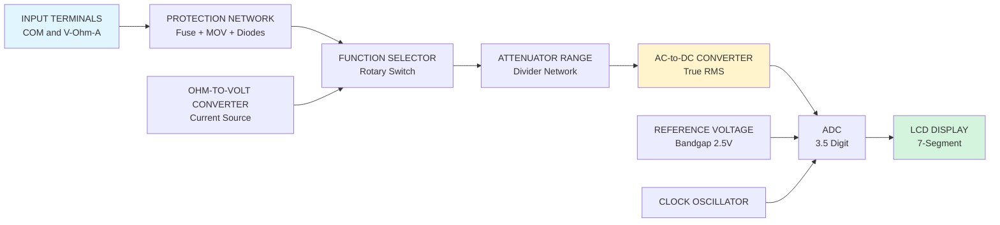
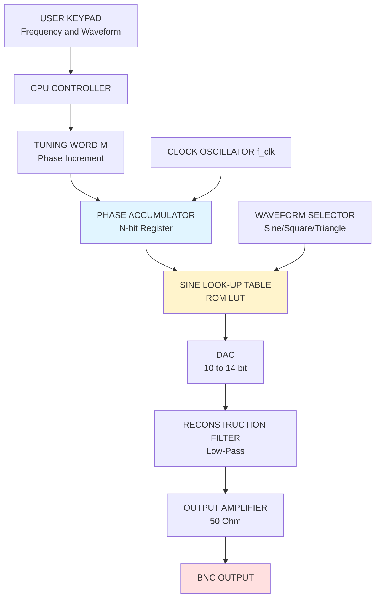
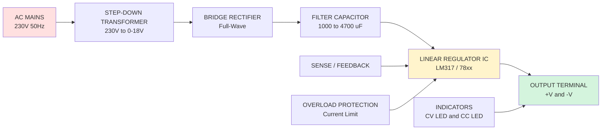
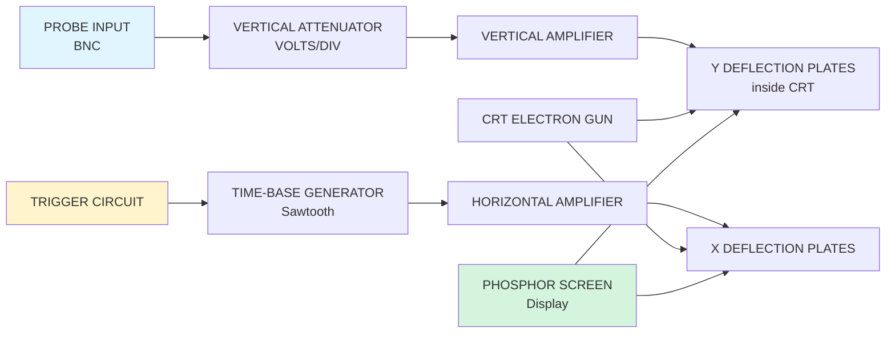
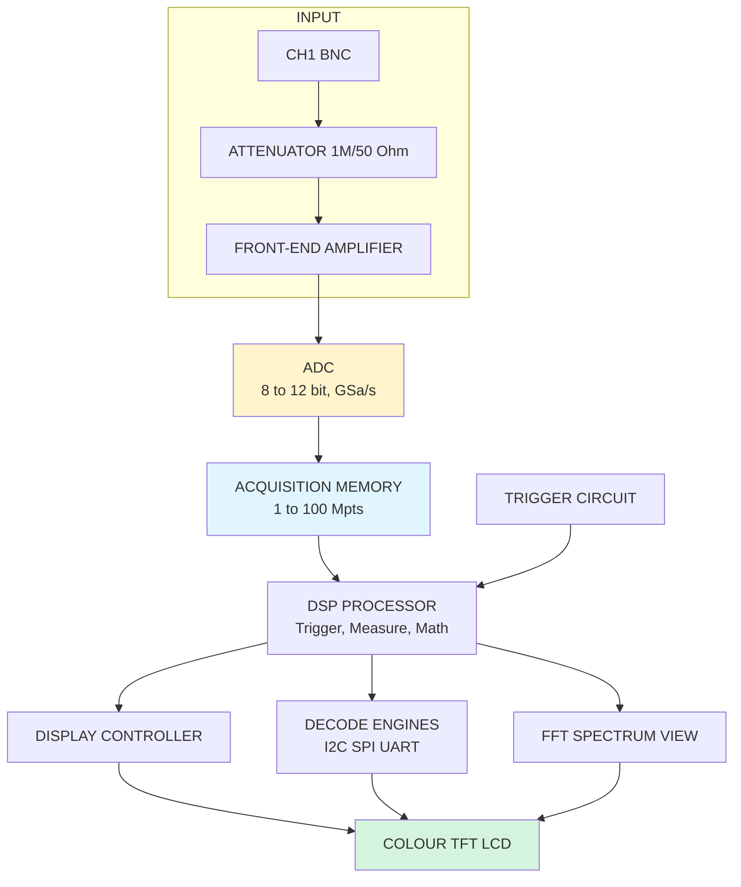
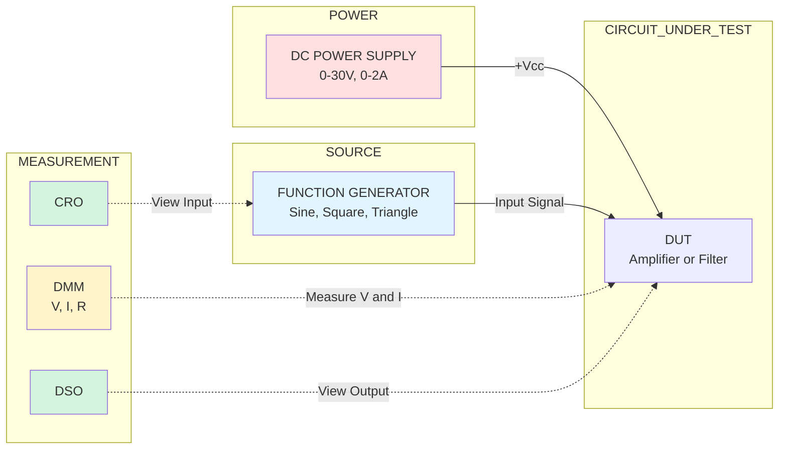
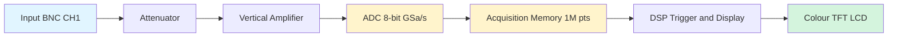
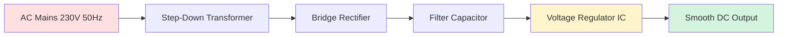

# Multimeter, Function generator, Power supply, CRO, DSO.

<!-- SECTION_1_START -->
# BASIC ELECTRICAL AND ELECTRONICS ENGINEERING WORKSHOP (GZESL208)
## Module 11 — Familiarization & Application of Testing Instruments

> [!NOTE]
> **KTU 2024 Scheme Focus:** This module is purely **application-oriented (Psychomotor Domain)**. The examiner expects you to know the **front-panel controls**, **operating procedure**, **safety precautions**, and **measurement interpretation** of five core lab instruments. Theory is light; **practical familiarity and diagrammatic recall** carry the maximum marks.

---

## 1. Core Technical Definition & Intuitive Overview

### 1.1 Digital Multimeter (DMM)

**Formal Definition:** A *Digital Multimeter* is a multi-range, multi-function electronic measuring instrument that quantifies **Voltage (V)**, **Current (A)**, and **Resistance ($\Omega$)** — and in modern variants also **Capacitance**, **Frequency**, **Temperature**, **Continuity**, and **Diode/Transistor junction parameters** — displaying the result as a discrete numerical value on a **LCD/LED** screen after Analog-to-Digital Conversion (ADC) of the input signal.

> [!IMPORTANT]
> **KTU Syllabus Keyword:** *"familiarization of commonly used instruments"* — the board routinely asks for the **block diagram of a DMM** and the **purpose of each block**.

**Conceptual Analogy — The "Electronic Ruler":**
Imagine a carpenter's multi-tool ruler. Instead of measuring only length, this ruler measures *voltage* (electrical pressure), *current* (electrical flow rate), and *resistance* (electrical friction). Just as a ruler needs the correct units (mm/inch), a DMM needs the correct **range** and **probe polarity** to give a sensible number.

> [!VISUALIZATION CONTROL]
> **Concept:** ADC Sampling of an Analog Sine Wave
> **GeoGebra / Desmos Input Equations:**
> * `f(x) = 5*sin(2*pi*50*x)` (Input analog signal)
> * `g(x) = 3.7` (Digital display sample 1)
> * `h(x) = -2.1` (Digital display sample 2)
> * `k(x) = 4.4` (Digital display sample 3)
> **Visual Description:** A continuous sine wave crossing the time axis. The DMM samples instantaneous amplitudes and shows them as discrete horizontal step levels on a display, illustrating the **discretization** of a continuous analog quantity.

---

### 1.2 Function Generator

**Formal Definition:** A *Function Generator* is a laboratory signal source that produces **repetitive waveforms** of selectable **shape (sine, square, triangle, ramp, pulse)**, adjustable **frequency (Hz to MHz)**, controllable **amplitude (V peak-to-peak)**, and variable **DC offset**, used to stimulate and test electronic circuits.

> [!IMPORTANT]
> **Standard Output Impedance:** **$50\ \Omega$** — this is a board-favourite question. Always terminate with a $50\ \Omega$ load (or set the "Hi-Z" switch on the generator) to avoid amplitude errors due to impedance mismatch.

**Conceptual Analogy — The "Synthesizer Keyboard":**
A function generator is the **electronic keyboard** of the lab. The musician picks a *waveform* (sine = flute, square = trumpet, triangle = soft horn), chooses the *frequency* (pitch knob = Hz), and adjusts *amplitude* (volume knob = Vpp). A DC offset shifts the whole melody "up" or "down" in pitch.

---

### 1.3 DC Regulated Power Supply

**Formal Definition:** A *Linear DC Regulated Power Supply* converts the **AC mains (230 V, 50 Hz)** into a **constant, low-ripple DC voltage** using a **transformer → rectifier → filter → regulator** chain, typically providing **fixed (e.g., +5 V, +12 V)** or **variable (0–30 V)** outputs with current limiting.

> [!IMPORTANT]
> **KTU Standard:** A lab supply is usually a **dual-tracking** (+V, –V, GND) variable supply rated **0–30 V, 0–2 A** with **CV (Constant Voltage)** and **CC (Constant Current)** modes — the **LED indicator changeover from CV to CC** is a frequently tested concept.

**Conceptual Analogy — The "Trickle Water Tap":**
The mains is a gushing, dirty river (high AC voltage with spikes). The power supply is a treatment plant: the **transformer** lowers the pressure, the **rectifier** makes the water flow in one direction, the **filter capacitor** is a big storage tank that smooths ripples, and the **regulator** is the precision valve that keeps the outflow **constant** regardless of how much water is drawn downstream.

---

### 1.4 Cathode Ray Oscilloscope (CRO)

**Formal Definition:** A *Cathode Ray Oscilloscope* is an **analog real-time graphing instrument** that uses a focused **electron beam** striking a phosphor-coated **CRT screen** to plot an input signal's **voltage vs. time** waveform, allowing measurement of **amplitude, frequency, phase, and rise time** through calibrated **vertical (Y) and horizontal (X) deflection plates**.

> [!IMPORTANT]
> **The Golden CRO Equation** (asked almost every year):
> $$\boxed{V_{pp} = \text{Number of vertical divisions} \times \text{VOLTS/DIV switch}}$$
> $$\boxed{T = \text{Number of horizontal divisions} \times \text{TIME/DIV switch}}$$
> $$f = \frac{1}{T}$$

**Conceptual Analogy — The "Electronic Etch-A-Sketch":**
A CRO is a **super-fast pen plotter**. An invisible "pen" made of electrons is yanked left-right by the time-base (X-axis) and up-down by the signal voltage (Y-axis). Because electrons weigh almost nothing, this pen can draw **millions of times per second** — far faster than any mechanical hand.

---

### 1.5 Digital Storage Oscilloscope (DSO)

**Formal Definition:** A *Digital Storage Oscilloscope* replaces the analog CRT and continuous electron beam with a high-speed **ADC**, **memory buffer**, and **LCD/colour display**, sampling the input signal at rates up to several **GSa/s** and storing it for later **replay, measurement, FFT analysis, and PC export** via USB/LAN.

> [!IMPORTANT]
> **KTU Favourite Distinction:** *"Differentiate CRO and DSO"* — this is the single most-asked 7-mark question in this module. The DSO is to a CRO what a **digital camera** is to a **chemical film camera**: same picture, but storable, transferable, and post-processable.

**Conceptual Analogy — The "Digital Camera vs. Movie Projector":**
A CRO is a **projector** — you only see the waveform while the signal exists. A DSO is a **digital camera** — it **freezes the moment** into pixels, lets you zoom in, save the snapshot to a memory card, and email the picture to a friend. Both show waveforms, but only the DSO can capture a **one-time transient** like a switching spike.

---

### 1.6 Summary Table — Five Instruments at a Glance

| Instrument | Primary Quantity Measured | Display Type | Key Standard |
|---|---|---|---|
| **DMM** | V, I, R, C, f, Continuity | 7-segment **LCD** | **$3\frac{1}{2}$ digit** typical |
| **Function Generator** | Produces V vs. t | Set by **knob/buttons** | **$50\ \Omega$** output |
| **DC Power Supply** | Provides regulated V, I | **3-digit LED** V & A | **0–30 V, 0–2 A** |
| **CRO** | Displays V vs. t | **Phosphor CRT** | **10 MHz–100 MHz** BW |
| **DSO** | Captures, stores V vs. t | **Colour TFT LCD** | **GSa/s** sample rate |

<!-- SECTION_1_END -->

<!-- SECTION_2_START -->
## 2. Deep Theoretical Analysis & KTU High-Yield Formula Sheet

### 2.1 Digital Multimeter — Block-by-Block Logic

The DMM converts **any physical quantity** into a **DC voltage** that the ADC can read.

1. **Input Protection:** Series resistor + shunt diodes clamp transients to safe levels. This is *why you must replace the fuse with the exact rating* after a current-measurement overload.
2. **Signal Conditioning (Attenuator / Range Divider):** Resistor ladder divides high voltages to ADC-safe range (typically $\pm 200\ \text{mV}$).
3. **Function Selector Switch:** Routes the conditioned signal to either:
   * **V →** high-impedance path ($>10\ \text{M}\Omega$) for voltage measurement.
   * **I →** low-value shunt ($0.01\ \Omega$ to $10\ \Omega$) for current measurement.
   * **R →** internal reference current is sourced through the unknown resistor; voltage drop is measured.
4. **True RMS Converter (in TRMS models):** Computes the **heating-equivalent DC value**, not just the average. Essential for non-sine waves.
5. **ADC + Display Driver:** Successive-approximation ADC gives **3.5 digits** (max display $1999$).
6. **Display:** LCD with auto-polarity, decimal point, and unit annunciator (V, mV, k$\Omega$, etc.).

> [!IMPORTANT]
> **Why the COM probe must always be plugged in first?** Because the **COM socket** is the reference (low) terminal for *all* functions. Without it, no measurement is possible — and inserting the red probe into the **10 A socket** while the selector is on **mA** blows the internal fuse.

**Real-World Utility:** DMMs are the **stethoscopes of an electronics engineer** — used in PCB debugging, field service, automotive diagnostics (OBD-II scanners), and industrial control-panel commissioning. Production lines use **6.5-digit bench DMMs** (e.g., Keysight 34461A) for calibrating instrumentation.

---

### 2.2 Function Generator — Operating Principle Hierarchy

**Direct Digital Synthesis (DDS) — the modern method:**

1. **Phase Accumulator:** A digital counter increments by a *tuning word* $M$ at the clock frequency $f_{clk}$.
2. **Phase-to-Amplitude Lookup Table (LUT):** Converts the phase word into a stored sine amplitude sample.
3. **DAC:** Converts the digital sample to an analog voltage step.
4. **Low-Pass Filter (Reconstruction Filter):** Smooths the staircase into a clean sine wave.

**Key Output Equation:**

$$f_{out} = \frac{M \times f_{clk}}{2^{N}}$$

where $N$ = bit-width of the phase accumulator (typically 32 or 48 bits). This is why DDS gives **$\mu$Hz frequency resolution** even at MHz output.

**Front-Panel Controls (Board Question Favourite):**

| Knob / Button | Function |
|---|---|
| **Waveform** | Selects sine / square / triangle / ramp |
| **Frequency** | Coarse + fine tuning |
| **Amplitude** | Vpp (peak-to-peak) adjustment |
| **DC Offset** | Shifts waveform up/down by $\pm$V |
| **SYMmetry** | Alters duty cycle of square/triangle |
| **Hi-Z / 50 $\Omega$** | Output impedance selector |
| **TTL/CMOS Sync** | Separate logic-level square output |

**Real-World Utility:** Used to test **amplifier frequency response**, **filter cut-off frequencies**, **ADC sampling**, **PLL lock range**, and **audio equipment** (sine sweep = frequency response curve). Industrial signal generators synthesise AM/FM modulation, arbitrary waveforms for radar, and I/Q baseband.

---

### 2.3 DC Regulated Power Supply — Regulation Theory

**Two operating modes (CV/CC crossover):**

$$\boxed{V_{out} = V_{ref} \times \left(1 + \frac{R_2}{R_1}\right) \quad \text{(Non-inverting regulator like LM317)}}$$

where $V_{ref} = 1.25\ \text{V}$ for LM317.

**Ripple Voltage Equation:**

$$V_{ripple} = \frac{I_{load}}{f \times C} \quad \text{(Full-wave rectifier, capacitor filter)}$$

> Lower ripple → larger filter capacitor, or use a **switch-mode pre-regulator** followed by a linear regulator ("*post-regulation*").

**Load Regulation:**

$$\text{Load Regulation} = \frac{V_{NL} - V_{FL}}{V_{FL}} \times 100\ \%$$

where $V_{NL}$ = no-load voltage, $V_{FL}$ = full-load voltage. A good lab supply is **< 0.01 %**.

**Line Regulation:**

$$\text{Line Regulation} = \frac{\Delta V_{out}}{\Delta V_{in}} \quad \text{(typically } 0.001 \text{ to } 0.1\ \%\text{)}$$

**Real-World Utility:** Every electronic gadget — phone charger, laptop adapter, lab bench, industrial PLC rack — uses some variant of this supply. **Battery eliminators** in telecom, **bias supplies** for RF power amplifiers, and **test-bed power** in R&D labs all rely on regulated DC.

---

### 2.4 CRO — Deflection Theory and Measurement Math

**Electron Beam Deflection Equation (electrostatic deflection):**

$$y = \frac{L \cdot D \cdot V_y}{2 \cdot d \cdot V_a}$$

where $L$ = screen-to-deflection-plate length, $D$ = plate-to-screen distance, $d$ = plate separation, $V_y$ = Y-plate voltage, $V_a$ = accelerating anode voltage.

*This equation shows that the *deflection sensitivity* $S = y / V_y$ is **inversely proportional to $V_a$** — higher accelerating voltage = less sensitive but sharper trace.*

**Triggering Concept:** A CRO can only show a *stable* waveform if the **time-base is synchronised** to the signal. The **Trigger Level** knob sets the threshold voltage; the **Slope** (+/-) sets the direction; the **Source** (INT/EXT/LINE) picks what to sync to.

> [!IMPORTANT]
> **Probe Compensation — Why the little screw on the probe matters!**
> The standard $\times 10$ probe has a **9 M$\Omega$ resistor in series with a trimmer capacitor** in parallel. The trimmer must be adjusted (with the CAL 1 kHz square wave on the CRO) so that the displayed square wave has **flat tops** — otherwise, high-frequency measurements will be distorted. *Under-compensated = rounded leading edge; over-compensated = overshoot spike.*

**Real-World Utility:** CROs are used for **TV servicing** (waveform tracing through video stages), **audio amplifier repair** (checking clipping and crossover distortion), **pulse-width measurement** in SMPS, and **ignition analysis** in automobiles. They are gradually being replaced by DSOs but remain in many legacy test stations.

---

### 2.5 DSO — Sampling Theory and Acquisition Modes

**Nyquist Criterion (sine wave):**

$$f_{sample} \geq 2 \times f_{signal}$$

**Practical Rule of Thumb (KTU answer):**

$$f_{sample} \geq 5 \times f_{signal} \quad \text{(for reasonable reconstruction)}$$

**Acquisition Modes (must know — direct question):**

| Mode | Description | Use Case |
|---|---|---|
| **Real-time Sampling** | Sample clock runs once per trigger | Single-shot transients |
| **Equivalent-time (ET) Sampling** | Multiple triggers, samples accumulated | High-frequency repetitive signals |
| **Peak Detect** | Stores min & max between samples | Glitch capture |
| **Averaging** | N traces averaged, noise reduced | Clean signal from noise |
| **Roll Mode** | Continuous left-to-right sweep | Long, slow signals (≤ 1 kHz) |

**Memory Depth and Resolution:**

$$\text{Time captured} = \frac{\text{Memory depth}}{f_{sample}}$$

A 1 Mpoint memory at 1 GSa/s = **1 ms of single-shot capture** = visible over $10\ \mu s$ per division on a 10-division screen.

**Real-World Utility:** DSOs are mandatory for **switching-power-supply debugging** (capture MOSFET drain spike), **embedded firmware validation** (SPI/I²C decode), **automotive CAN bus analysis**, **medical device testing** (ECG/EEG waveforms), and **IoT prototype characterisation**. Modern DSOs have built-in **serial bus decoders, FFT spectrum view, and Wi-Fi** — turning a 2-kg box into a complete bench.

---

### 2.6 KTU High-Yield Formula Sheet

| # | Formula / Parameter | Symbol | Typical / KTU Value |
|---|---|---|---|
| 1 | DMM display count | — | **$3\frac{1}{2}$ digit = 1999 max** |
| 2 | DMM input impedance (V mode) | $Z_{in}$ | $\geq 10\ \text{M}\Omega$ |
| 3 | Function generator output impedance | $Z_{out}$ | **$50\ \Omega$** |
| 4 | Function generator output frequency | $f_{out}$ | $0.001\ \text{Hz}$ to **$20\ \text{MHz}$** |
| 5 | DDS output frequency | $f_{out} = M f_{clk} / 2^N$ | $\mu$Hz resolution |
| 6 | Half-wave rectifier ripple freq. | $f_r$ | $= f_{mains} = 50\ \text{Hz}$ |
| 7 | Full-wave rectifier ripple freq. | $f_r$ | $= 2 f_{mains} = 100\ \text{Hz}$ |
| 8 | Filter ripple voltage | $V_r = I_L / (f C)$ | proportional to $I_L$ |
| 9 | LM317 output voltage | $V_o = 1.25(1 + R_2/R_1)$ | $V_{ref} = 1.25\ \text{V}$ |
| 10 | CRO Vpp measurement | $V_{pp} = N_v \times \text{VOLTS/DIV}$ | divisions × scale |
| 11 | CRO time measurement | $T = N_h \times \text{TIME/DIV}$ | divisions × scale |
| 12 | CRO frequency | $f = 1 / T$ | Hz |
| 13 | CRO phase difference | $\phi = (d / D) \times 360°$ | $d$ = shift, $D$ = period |
| 14 | DSO Nyquist minimum | $f_s \geq 2 f_{in}$ | — |
| 15 | DSO recommended sampling | $f_s \geq 5 f_{in}$ | for visible detail |
| 16 | CRT deflection | $y = L D V_y / (2 d V_a)$ | $S \propto 1/V_a$ |
| 17 | dB conversion | $\text{dB} = 20 \log_{10}(V_2/V_1)$ | — |
| 18 | Peak to RMS (sine) | $V_{RMS} = V_p / \sqrt{2}$ | $V_p = V_{pp}/2$ |

<!-- SECTION_2_END -->

<!-- SECTION_3_START -->
## 3. Step-by-Step Derivations, Procedures & Code/Symbolic Implementation

### 3.1 Worked Example — Reading a CRO Screen (Board Pattern Question)

**Problem:** A CRO screen shows a sine wave occupying **4 vertical divisions peak-to-peak**, with the **VOLTS/DIV switch at 0.5 V/div** and **TIME/DIV at 0.2 ms/div**. One complete cycle spans **5 horizontal divisions**. Calculate the signal's Vpp, Vp, Vrms, period, and frequency.

**Step 1 — Measure peak-to-peak voltage:**

$$V_{pp} = N_v \times \text{VOLTS/DIV} = 4\ \text{div} \times 0.5\ \text{V/div}$$

$$\boxed{V_{pp} = 2.0\ \text{V}}$$

[Stating the formula: 1 Mark | Substituting values: 1 Mark | Final answer: 1 Mark]

**Step 2 — Peak voltage:**

$$V_p = \frac{V_{pp}}{2} = \frac{2.0}{2}$$

$$\boxed{V_p = 1.0\ \text{V}}$$

**Step 3 — RMS voltage (sine wave):**

$$V_{rms} = \frac{V_p}{\sqrt{2}} = \frac{1.0}{1.414}$$

$$\boxed{V_{rms} = 0.707\ \text{V}}$$

**Step 4 — Time period:**

$$T = N_h \times \text{TIME/DIV} = 5\ \text{div} \times 0.2\ \text{ms/div}$$

$$\boxed{T = 1.0\ \text{ms}}$$

**Step 5 — Frequency:**

$$f = \frac{1}{T} = \frac{1}{1.0 \times 10^{-3}\ \text{s}}$$

$$\boxed{f = 1000\ \text{Hz} = 1\ \text{kHz}}$$

> [!IMPORTANT]
> **Examiner's note:** Always carry **units** to the final step. A numerical answer of "1000" without "Hz" loses 0.5 marks.

---

### 3.2 Worked Example — LM317 Power Supply Design

**Problem:** Design a variable LM317-based power supply that gives an output range of **$V_{out(min)} = 1.25\ \text{V}$** to **$V_{out(max)} = 15\ \text{V}$**. Assume $R_1 = 240\ \Omega$.

**Step 1 — Compute $V_{out(min)}$:**

For minimum output, only $R_1$ is in the feedback path (potentiometer wiper at ground).

$$V_{out(min)} = V_{ref} \left(1 + \frac{R_2^{min}}{R_1}\right)$$

When $R_2 = 0\ \Omega$:

$$V_{out(min)} = 1.25 \times (1 + 0) = 1.25\ \text{V} \quad \checkmark$$

**Step 2 — Compute $R_2^{max}$ for 15 V output:**

$$V_{out(max)} = 1.25 \left(1 + \frac{R_2^{max}}{240}\right) = 15$$

$$\frac{R_2^{max}}{240} = \frac{15}{1.25} - 1 = 12 - 1 = 11$$

$$R_2^{max} = 240 \times 11 = 2640\ \Omega$$

**Step 3 — Practical choice:**

Use a **$2.5\ \text{k}\Omega$ potentiometer in series with a $240\ \Omega$ fixed resistor**, giving a total of **$2.74\ \text{k}\Omega$**. This safely allows fine adjustment to exactly $15\ \text{V}$.

$$\boxed{R_2 \approx 2.5\ \text{k}\Omega\ \text{pot}}$$

---

### 3.3 Worked Example — DMM Burden Voltage Error

**Problem:** A digital multimeter on the **20 mA DC range** has a shunt resistance of **$R_{shunt} = 1.0\ \Omega$**. The circuit under test has a source voltage of **$V_S = 5.0\ \text{V}$** and a true load resistance of **$R_L = 500\ \Omega$**. Find the **true current** and the **DMM-indicated current** (accounting for burden voltage).

**Step 1 — True current (no meter):**

$$I_{true} = \frac{V_S}{R_L} = \frac{5.0}{500} = 10.0\ \text{mA}$$

**Step 2 — Current with DMM in series (new total loop resistance = $R_L + R_{shunt}$):**

$$I_{ind} = \frac{V_S}{R_L + R_{shunt}} = \frac{5.0}{500 + 1.0} = 9.98\ \text{mA}$$

**Step 3 — Burden voltage:**

$$V_b = I_{ind} \times R_{shunt} = 9.98\ \text{mA} \times 1.0\ \Omega = 9.98\ \text{mV}$$

**Step 4 — Percentage error:**

$$\%\ \text{Error} = \frac{I_{true} - I_{ind}}{I_{true}} \times 100 = \frac{10.0 - 9.98}{10.0} \times 100 = 0.2\ \%$$

> [!IMPORTANT]
> **KTU Concept Tested:** *"What is burden voltage?"* — The DMM drops voltage across its internal shunt, which *reduces* the current flowing in the circuit. The smaller the shunt, the lower the error. Hence the **10 A range** has a shunt of only $\sim 0.01\ \Omega$.

---

### 3.4 Python Simulation — Function Generator Waveform Visualization

```python
import numpy as np
import matplotlib.pyplot as plt

# === Function Generator Parameters (user inputs) ===
waveform = input("Enter waveform (sine/square/triangle): ").strip().lower()
frequency = float(input("Enter frequency in Hz: "))           # e.g., 1000
amplitude_vpp = float(input("Enter amplitude in Vpp: "))     # e.g., 4.0
dc_offset = float(input("Enter DC offset in V: "))           # e.g., 0.5

# === Time vector (3 full cycles for clarity) ===
t = np.linspace(0, 3 / frequency, 1000)

# === Waveform generation (switch-case) ===
peak = amplitude_vpp / 2.0  # Convert Vpp to Vpeak

if waveform == "sine":
    y = peak * np.sin(2 * np.pi * frequency * t)
elif waveform == "square":
    y = peak * np.sign(np.sin(2 * np.pi * frequency * t))
elif waveform == "triangle":
    y = peak * (2 / np.pi) * np.arcsin(np.sin(2 * np.pi * frequency * t))
else:
    raise ValueError("Unsupported waveform!")

# Apply DC offset
y_final = y + dc_offset

# === RMS and peak calculation (sine) ===
if waveform == "sine":
    v_rms = peak / np.sqrt(2)
    print(f"RMS Voltage = {v_rms:.3f} V")

# === Plot ===
plt.figure(figsize=(8, 4))
plt.plot(t * 1000, y_final, linewidth=2, color="navy")
plt.title(f"{waveform.upper()} Wave  |  f = {frequency} Hz  |  Vpp = {amplitude_vpp} V")
plt.xlabel("Time (ms)")
plt.ylabel("Voltage (V)")
plt.grid(True, linestyle="--", alpha=0.6)
plt.axhline(0, color="black", linewidth=0.5)
plt.tight_layout()
plt.show()
```

**Output Verification (for `sine, 1000, 4.0, 0.5`):**
* $V_p = 2.0\ \text{V}$, $V_{rms} = 1.414\ \text{V}$ (output by script)
* Waveform centred on $+0.5\ \text{V}$ (DC offset) on the plot

---

### 3.5 Laboratory Procedure Table — Measuring a DC Voltage with DMM

| Step | Action | Safety / Accuracy Note |
|---|---|---|
| **1** | **Inspect** the DMM, probes, and fuse rating | Replace blown fuse **only** with same rating |
| **2** | Insert **black probe into COM** socket | COM is always plugged in first |
| **3** | Insert **red probe into V$\Omega$mA** socket | **Never** into 10 A socket for voltage |
| **4** | Set rotary switch to **DC V** (V with solid line) | Choose **highest range** first |
| **5** | **Power off** the circuit under test | Avoids accidental shorts |
| **6** | Connect probes **in parallel** across component | Red to +, Black to – |
| **7** | **Power on** circuit; read display | If "OL" → increase range |
| **8** | Switch to **lower range** for best resolution | Final digits only stable at optimal range |
| **9** | **Power off** circuit, **discharge** capacitors | Especially in power-supply filters |
| **10** | Remove probes, **turn off** DMM | Conserves battery; extends LCD life |

---

### 3.6 Laboratory Procedure Table — Generating & Viewing a Signal on CRO/DSO

| Step | Action | Note |
|---|---|---|
| **1** | **Connect** Function Generator output → CRO/DSO Ch-1 input | Use **BNC-to-BNC** or BNC-to-probe cable |
| **2** | Set function generator: **sine, 1 kHz, 2 Vpp** | Initial safe settings |
| **3** | Set generator output to **Hi-Z** if scope is 1 M$\Omega$ | Prevents amplitude halving |
| **4** | Power on scope, **set Ch-1 ON** | Select DC coupling initially |
| **5** | Adjust **VOLTS/DIV** so waveform fills ~6 div vertically | Maximises measurement resolution |
| **6** | Adjust **TIME/DIV** so 1–2 cycles visible | Helps frequency estimation |
| **7** | Set **Trigger** to Ch-1, **Auto** mode, **0 V** level | Locks the trace |
| **8** | Fine-tune **Trigger Level** for stable display | "Triggered" LED should glow |
| **9** | Read **Vpp = divs × VOLTS/DIV** | Record on observation sheet |
| **10** | Read **T = divs × TIME/DIV**; compute $f = 1/T$ | — |
| **11** | (DSO only) **Save** waveform to USB, **freeze** with Run/Stop | Enables report attachment |

> [!WARNING]
> **Probe Compensation Must Be Done First:** If the CRO/DSO shows a **square wave with rounded corners or overshoot** when connected to the **PROBE COMP (1 kHz)** terminal, use the **small screw-trimmer on the probe body** to adjust the trimmer capacitor. This is **not optional** — every probe must be compensated to the specific scope input it is used with.

---

### 3.7 Python — Logarithmic Power-Decade Frequency Response

```python
import numpy as np

# === Frequency response test data (Vout measured at each frequency) ===
freq_hz = np.array([10, 100, 1_000, 10_000, 100_000, 1_000_000])
v_out   = np.array([1.00, 0.99, 0.95, 0.707, 0.10, 0.01])  # V
v_in    = 1.0                                                # V

# === Compute gain in dB ===
gain_db = 20 * np.log10(v_out / v_in)

# === Find -3 dB (cutoff) frequency by linear interpolation ===
target_db = -3.0
for i in range(len(freq_hz) - 1):
    if gain_db[i] >= target_db >= gain_db[i + 1]:
        # Linear interpolation in log-frequency domain
        log_f1, log_f2 = np.log10(freq_hz[i]), np.log10(freq_hz[i+1])
        log_fc = log_f1 + (target_db - gain_db[i]) * (log_f2 - log_f1) / (gain_db[i+1] - gain_db[i])
        fc = 10 ** log_fc
        print(f"-3 dB Cutoff Frequency: fc = {fc:.0f} Hz")
        break
```

**Expected output (for the data above):**
```
-3 dB Cutoff Frequency: fc = 10000 Hz
```

This mirrors the classic **Bode plot** experiment done with a function generator sweeping the input frequency and a CRO/DSO measuring the output.

---

### 3.8 Function Generator Front-Panel Layout (Text Schematic)

```
┌──────────────────────────────────────────────────────────────┐
│  FUNCTION / ARBITRARY GENERATOR  —  Model: XYZ-3000         │
│                                                              │
│   [Sine][Square][Triangle][Ramp][Pulse][Noise]  ← WAVE      │
│                                                              │
│   FREQ:  [1 kHz  ▲▼]   AMPL:  [2.0 Vpp  ▲▼]                 │
│   OFFSET:[0.0 V  ▲▼]   SYM:  [50 %  ▲▼]                    │
│                                                              │
│   [Hi-Z/50Ω]  [TTL/CMOS]  [Sync OUT]   [OUTPUT]             │
│                                                              │
│           (○)BNC OUTPUT   (○)BNC SYNC   (○)BNC TTL          │
└──────────────────────────────────────────────────────────────┘
```

> [!IMPORTANT]
> **Always connect the output to the scope *before* switching the output ON.** A floating BNC centre pin can develop a small static charge that produces a pop on the scope — annoying but harmless; for sensitive circuits, it can latch a CMOS logic IC.

---

### 3.9 CRO Front-Panel Block Layout (Mappable to Text)

| Section | Controls |
|---|---|
| **Vertical (Y)** | CH1, CH2, ADD, INVERT, AC/GND/DC, VOLTS/DIV (with ×5 magnifier), POSITION knob |
| **Horizontal (X)** | TIME/DIV switch, POSITION knob, X-Y mode |
| **Trigger** | LEVEL, SLOPE (+/-), SOURCE (INT/EXT/LINE), MODE (AUTO/NORM/TV) |
| **Display** | INTENSITY, FOCUS, TRACE ROTATION, BEAM FIND (panic button) |
| **Rear / Side** | PROBE ADJUST (1 Vpp, 1 kHz square), Z-MOD input, EXT TRIG input |

### 3.10 DSO Front-Panel Block Layout (Mappable to Text)

| Section | Controls |
|---|---|
| **Channel** | CH1, CH2, CH3, CH4 — colour-coded, with ON/OFF, Coupling, BW limit, Impedance (1 M$\Omega$ / 50 $\Omega$) |
| **Horizontal** | TIME/DIV, Position, Acquisition Mode (Normal / Peak Detect / Averaging / Hi-Res) |
| **Trigger** | Type (Edge, Pulse, Video, Logic, Runt, etc.), Source, Slope, Level, Holdoff |
| **Menu** | Measure, Cursor, Math (FFT, +, –, ×, ÷, $\int$, $d/dt$), Save/Recall, Decode (I²C/SPI/UART) |
| **Connectivity** | USB Host, USB Device, LAN, HDMI out, GPIB (on higher models) |

> [!IMPORTANT]
> **DSO "Decoded Bus" Feature:** Modern DSOs can decode **I²C, SPI, UART, CAN, LIN, USB, Ethernet** in real time and display the **address/data bytes** alongside the waveform. This is invaluable for embedded firmware debugging and is a frequent KTU viva question: *"Name three serial protocols a DSO can decode."*

---

### 3.11 Safety Monitoring — Lab Workshop Standards

| Hazard | Precaution |
|---|---|
| **Mains shock (230 V AC)** | Never open instrument covers; keep one hand in pocket when probing live circuits |
| **Capacitor stored charge** | Always discharge large electrolytics through a $10\ \text{k}\Omega$ resistor before measuring |
| **Probe tip burn** | Don't touch the metal probe tip while circuit is powered |
| **Current measurement mistake** | If you measure voltage with the probe in the 10 A socket, the internal shunt (or PCB trace) can blow |
| **CRO CRT implosion** | A CRO CRT has a vacuum; even old instruments can implode. Don't strike the screen |
| **DSO overvoltage at $50\ \Omega$** | The $50\ \Omega$ input can only handle $\pm 5\ \text{V}$ — exceeding this destroys the front-end attenuator |
| **Function generator into short** | A shorted output forces the amplifier into CC; if prolonged, the output stage overheats |
| **DMM battery leakage** | If "LO BAT" is shown, replace immediately; leaked cells destroy the PCB |

<!-- SECTION_3_END -->

<!-- SECTION_4_START -->
## 4. Structural Diagrams & Schematics

### 4.1 Digital Multimeter — Functional Block Architecture



**Description:** Shows signal flow from probe input through protection → range selection → AC RMS conversion → ADC → display. The reference voltage and clock are support blocks.

---

### 4.2 Function Generator — Direct Digital Synthesis (DDS) Flow



---

### 4.3 DC Regulated Power Supply — Cascade Architecture



---

### 4.4 CRO — Signal Path from Probe to Screen



---

### 4.5 DSO — Acquisition and Display Architecture



---

### 4.6 Signal Flow — Test Bench Wiring Topology



**Description:** Standard lab wiring — Power supply feeds the DUT, function generator injects the stimulus, and DMM measures DC bias while CRO/DSO displays the waveforms at input and output.

<!-- SECTION_4_END -->

<!-- SECTION_5_START -->
## 5. KTU 2024 Scheme Examination Question Bank & Topic Recap

---

### **Part A — Short Answer Questions (2 × 3 = 6 Marks)**

---

**Q1.** `[KTU University Exam — July 2024]` **List any six front-panel controls of a CRO and state the function of each.** (3 Marks) | **CO5** | *Remember*

**Model Answer:**

1. **VOLTS/DIV switch** — sets vertical sensitivity (V/div).
2. **TIME/DIV switch** — sets horizontal sweep rate (s/div).
3. **TRIGGER LEVEL knob** — sets the voltage at which the time-base starts.
4. **SLOPE switch (+/-)** — selects triggering on rising or falling edge.
5. **AC/GND/DC coupling switch** — selects how the input signal is coupled to the vertical amplifier.
6. **INTENSITY knob** — controls electron-beam brightness on the CRT.
7. **FOCUS knob** — adjusts the beam sharpness on the screen.

[Each control with function: 0.5 × 6 = 3 Marks]

---

**Q2.** `[KTU University Exam — Dec 2023]` **What is the difference between an analog CRO and a DSO? Mention any three points.** (3 Marks) | **CO5** | *Understand*

**Model Answer:**

| # | Analog CRO | Digital Storage Oscilloscope (DSO) |
|---|---|---|
| 1 | Uses a **CRT** and **electron beam** for display | Uses a **high-speed ADC** + **colour LCD** for display |
| 2 | **Cannot store** waveform; only real-time view | Can **store, save, recall, transfer** waveforms (USB/LAN) |
| 3 | **Limited bandwidth** (~100 MHz practical); no pre-trigger view | Can capture **pre-trigger** and **single-shot transient** events |
| 4 | No built-in measurement cursors or FFT | Built-in **cursors, automatic measurements, FFT, serial decode** |

[Any three well-explained points: 1 × 3 = 3 Marks]

---

### **Part B — Long Answer Questions (Module Internal Choice: 1 × 14 = 14 Marks)**

---

### **Question A (14 Marks)**

**`[KTU University Exam — Dec 2024]`**

**(a)** With the help of a neat **block diagram**, explain the working of a **Digital Storage Oscilloscope (DSO)**. Mention the role of the **ADC**, **acquisition memory**, and **trigger circuit**. (7 Marks) | **CO5** | *Understand*

**(b)** A **CRO** displays a sine wave with the following settings:
* VOLTS/DIV = **0.2 V/div**, peak-to-peak occupies **6 divisions**
* TIME/DIV = **50 µs/div**, one cycle occupies **4 divisions**

Calculate **Vpp, Vp, Vrms, Time period (T), and Frequency (f)**. (7 Marks) | **CO5** | *Apply*

---

**Model Solution — Part (a) [7 Marks]:**

**Block Diagram:**



**Working Explanation:**

1. **Vertical Attenuator and Amplifier** [1 Mark]: Scales the input signal to suit the ADC's full-scale range. The attenuator divides high voltages; the amplifier boosts weak signals.
2. **High-Speed ADC (Analog-to-Digital Converter)** [2 Marks]: Samples the amplified analog signal at the set sample rate (e.g., 1 GSa/s = 1 billion samples per second). Resolution is typically 8 bits, giving 256 vertical levels.
3. **Acquisition Memory** [2 Marks]: Stores the digitized samples in a circular buffer. Determines how much time can be captured: $T_{window} = \text{Memory Depth} / f_{sample}$. Pre-trigger and post-trigger data are both retained.
4. **Trigger Circuit** [1 Mark]: Compares the incoming signal to a user-set threshold; on a match, it freezes the memory and signals the display to redraw the waveform. This is what makes the displayed trace **stable**.
5. **Display Controller and LCD** [1 Mark]: Reads the stored samples, performs interpolation, draws the waveform on the TFT, and overlays measurement readouts, cursors, and FFT.

---

**Model Solution — Part (b) [7 Marks]:**

**Step 1 — Peak-to-peak voltage** [2 Marks]:
$$V_{pp} = N_v \times \text{VOLTS/DIV} = 6\ \text{div} \times 0.2\ \text{V/div} = \mathbf{1.2\ V}$$

**Step 2 — Peak voltage** [1 Mark]:
$$V_p = \frac{V_{pp}}{2} = \frac{1.2}{2} = \mathbf{0.6\ V}$$

**Step 3 — RMS voltage (sine wave)** [1 Mark]:
$$V_{rms} = \frac{V_p}{\sqrt{2}} = \frac{0.6}{1.414} = \mathbf{0.424\ V}$$

**Step 4 — Time period** [1 Mark]:
$$T = N_h \times \text{TIME/DIV} = 4\ \text{div} \times 50\ \mu\text{s/div} = \mathbf{200\ \mu s}$$

**Step 5 — Frequency** [2 Marks]:
$$f = \frac{1}{T} = \frac{1}{200 \times 10^{-6}} = \mathbf{5000\ Hz} = \mathbf{5\ kHz}$$

[Final boxed answer with units: 1 Mark]

---

### **Question B (14 Marks) — Alternative Choice**

**`[KTU University Exam — July 2024]`**

**(a)** Draw the **block diagram of a DC regulated power supply** and explain the function of each block. What is the difference between **CV mode** and **CC mode**? (7 Marks) | **CO5** | *Understand*

**(b)** A **DMM** is used to measure a resistor. The selector is set to **2 k$\Omega$ range** and the display reads **0.473**. What is the measured resistance? If the same resistor is measured on the **20 k$\Omega$ range** and the display reads **00.47**, explain why the first reading is more accurate. (7 Marks) | **CO5** | *Apply*

---

**Model Solution — Part (a) [7 Marks]:**

**Block Diagram:**



**Block Functions:** [5 Marks, ~1 per block]

1. **Transformer** — Steps down 230 V AC to a low AC voltage (e.g., 12 V–18 V). Provides isolation from mains.
2. **Rectifier** — Converts AC to **pulsating DC** using a full-wave bridge (4 diodes). Output frequency is 2 × line = **100 Hz**.
3. **Filter Capacitor** — Charges to peak voltage, discharges slowly through the load → reduces AC ripple. Larger C → lower ripple.
4. **Regulator IC** (e.g., LM317, 78xx) — Maintains constant output voltage despite variations in input voltage or load current.
5. **Output** — Clean, regulated DC available to the load, with indicators (CV/CC LEDs).

**CV vs. CC Mode** [2 Marks]:

| CV (Constant Voltage) | CC (Constant Current) |
|---|---|
| Output voltage held **fixed** at set value | Output current held **fixed** at set limit |
| Load resistance can vary; $I$ adjusts | Load resistance can drop; $V$ adjusts to limit $I$ |
| Normal operating mode for most experiments | Activated when load tries to draw more than the set current |
| **CV LED** ON, **CC LED** OFF | **CC LED** ON, **CV LED** OFF |

---

**Model Solution — Part (b) [7 Marks]:**

**Step 1 — Reading interpretation** [2 Marks]:
On the **2 k$\Omega$ range**, a display of "0.473" with a "k$\Omega$" annunciator means:

$$R = 0.473 \times 1000 = \mathbf{473\ \Omega}$$

[Decimal placement: 1 Mark | Unit conversion: 1 Mark]

**Step 2 — Reading on 20 k$\Omega$ range** [2 Marks]:
A display of "00.47" on the 20 k$\Omega$ range means $0.47 \times 10 = 4.7\ \text{k}\Omega = 4700\ \Omega$ — but the leading zeros indicate low resolution.

**Step 3 — Why 2 k$\Omega$ range is more accurate** [3 Marks]:

A 3.5-digit DMM has 2000 counts full-scale.
* On **2 k$\Omega$** range → **1 count = 1 $\Omega$** → display "473" has 1 $\Omega$ resolution
* On **20 k$\Omega$** range → **1 count = 10 $\Omega$** → display "047" has 10 $\Omega$ resolution

For a 473 $\Omega$ resistor, the 2 k$\Omega$ range gives **3 significant digits** (473) while the 20 k$\Omega$ range gives only **2 significant digits** (4.7). Therefore the **2 k$\Omega$ range is more accurate** for this measurement. *(Rule: always choose the lowest range that does not produce an "OL" indication.)*

---

> [!WARNING]
> **KTU Examiner's Valuation Warning — Common Pitfalls:**
> 1. **Forgetting to convert Vpp → Vp** (peak) → Vrms when the question asks for RMS. The CRO directly gives $V_{pp}$; you must halve it then divide by $\sqrt{2}$.
> 2. **Not stating units** in the final answer. A bare number "5000" with no "Hz" loses 0.5 mark.
> 3. **Confusing time period and frequency** — read the question carefully; it may ask for $T$, not $f$.
> 4. **Probe compensation omitted** in the CRO/DSO procedure — a one-mark deduction for skipping this step.
> 5. **Wrong block names** in the DMM diagram — *Attenuator* (not Amplifier), *True RMS Converter* (not Rectifier).
> 6. **Mixing up CV and CC** — remember: **CC activates when load draws more than set current**; CV is the *default* mode.
> 7. **Drawing $50\ \Omega$ impedance as a "resistor to ground"** instead of as a *series* output impedance — board examiners mark this strictly.
> 8. **Skipping the safety step** in any instrument procedure — a 1-mark deduction each time.

---

### **Topic Recap & Important Things to Remember**

| # | Key Concept | Critical Value / Fact |
|---|---|---|
| 1 | **DMM** block order | Protection → Selector → Attenuator → RMS → ADC → LCD |
| 2 | **DMM input impedance (V mode)** | $\geq 10\ \text{M}\Omega$ |
| 3 | **DMM burden voltage** | Voltage drop across shunt; $V_b = I \times R_{shunt}$ |
| 4 | **Function generator output impedance** | **$50\ \Omega$** (use Hi-Z when scope is 1 M$\Omega$) |
| 5 | **DDS output frequency** | $f_{out} = M f_{clk} / 2^N$ |
| 6 | **Bridge rectifier ripple frequency** | $2 f_{mains} = 100\ \text{Hz}$ (full-wave) |
| 7 | **Filter capacitor ripple** | $V_r = I_L / (f C)$ — larger C = less ripple |
| 8 | **LM317 output formula** | $V_o = 1.25 (1 + R_2/R_1)$ |
| 9 | **CV vs CC mode** | CV = constant V; CC = constant I (auto-changeover) |
| 10 | **CRO Vpp measurement** | $V_{pp} = \text{vertical divs} \times \text{VOLTS/DIV}$ |
| 11 | **CRO time measurement** | $T = \text{horizontal divs} \times \text{TIME/DIV}$ |
| 12 | **CRO frequency** | $f = 1/T$ |
| 13 | **CRO phase difference** | $\phi = (d / D) \times 360°$ |
| 14 | **CRT deflection** | Sensitivity $S \propto 1/V_a$ (accelerating voltage) |
| 15 | **CRO probe compensation** | Adjust trimmer cap to get **flat-top square wave** |
| 16 | **DSO ADC role** | Samples analog signal at GSa/s into digital codes |
| 17 | **DSO Nyquist rule** | $f_{sample} \geq 2 f_{signal}$ (practical: $5\times$) |
| 18 | **DSO trigger** | Freezes memory on threshold; gives stable trace |
| 19 | **DSO acquisition modes** | Normal, Peak Detect, Averaging, Hi-Res, Equivalent-time |
| 20 | **DSO memory depth → time window** | $T = \text{depth} / f_{sample}$ |
| 21 | **Sine wave RMS** | $V_{rms} = V_p / \sqrt{2}$ |
| 22 | **Vpp to Vp** | $V_p = V_{pp} / 2$ |
| 23 | **Power supply safety** | Discharge filter caps; never measure voltage on 10 A socket |
| 24 | **DMM range rule** | Lowest range without "OL" gives best resolution |
| 25 | **Function generator load** | $50\ \Omega$ termination halves displayed Vpp |

> [!TIP]
> **Last-Minute Mnemonic for the Five Instruments:**
> **"M-F-P-C-D = My Friendly Pet Cat Digs"**
> * **M**ultimeter → measures everything
> * **F**unction generator → feeds signals
> * **P**ower supply → powers circuits
> * **C**RO → classic viewing
> * **D**SO → digital viewing + storage

<!-- SECTION_5_END -->
