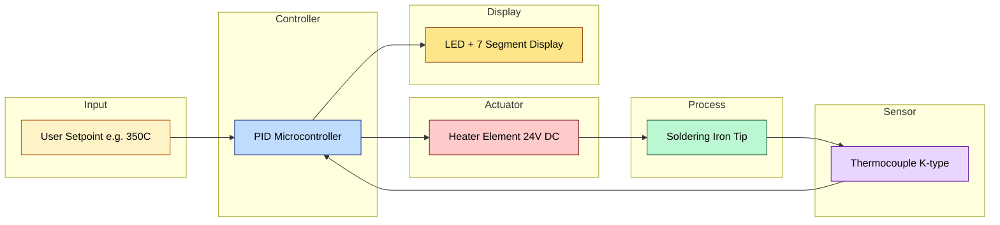
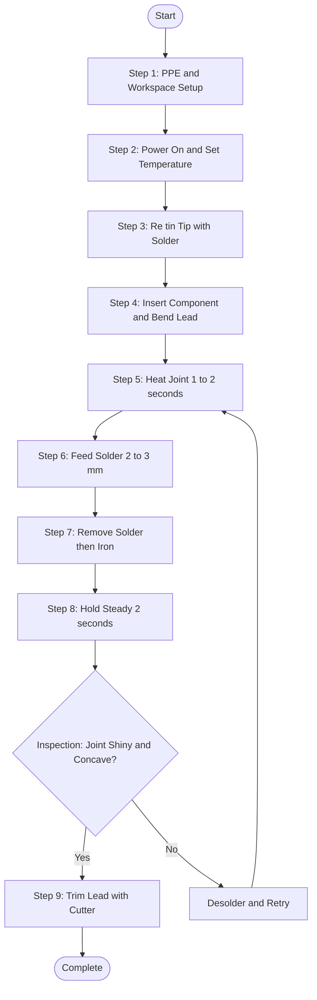
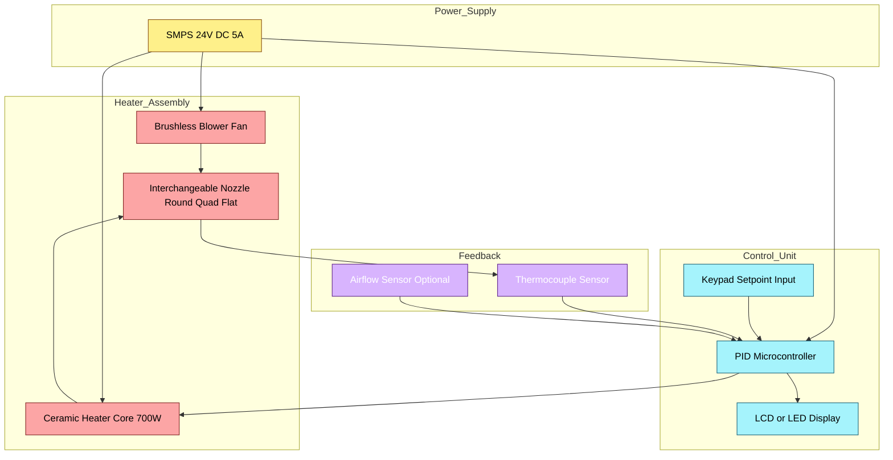
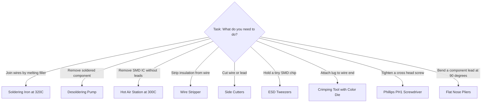

# Soldering iron, Desoldering pump, Pliers, Cutters, Wire strippers, Screw drivers, Tweezers, Crimping tool, Hot air soldering and de- soldering station

<!-- SECTION_1_START -->

# Module 11: Familiarization & Application of Testing Instruments and Commonly Used Tools

## Overview of Electronics Workshop Hand Tools

> [!IMPORTANT]
> **KTU 2024 Scheme - GZESL208 Context**
> In the NEP 2020 aligned KTU 2024 B.Tech curriculum, the Basic Electrical and Electronics Engineering Workshop is a **practical-centric laboratory course** under the **Engineering Science (ES)** basket. Module 11 directly addresses the **Course Outcome (CO3 / CO4)** of identifying, selecting, and safely handling standard hand tools and soldering workstations used in professional PCB assembly, repair, and prototype development environments.

### 1.1 Soldering Iron

**Formal KTU Definition:**
A *soldering iron* is a **hand-held thermal tool** that uses an **electrically heated metallic tip** maintained at a controlled temperature (typically between **$200^\circ C$ and $480^\circ C$**) to melt **filler metal solder** (commonly **60/40 Sn-Pb** or **SAC305 lead-free**) for the purpose of forming a permanent, electrically conductive, and mechanically robust metallurgical bond between two or more metallic surfaces (component leads and PCB copper pads).

**Conceptual Analogy:**
Imagine you are using a **hot glue gun** for crafts, but instead of glue sticks, you are melting a soft metal wire. The molten metal "wets" both surfaces and, upon cooling, locks the wires together forever — not just mechanically, but **electrically**. The soldering iron is the controlled heat source, the solder is the "metal glue," and **rosin flux** acts as the "cleaner" that lets the metal glue spread smoothly.

> [!NOTE]
> **Key Distinction:** Soldering is **NOT welding**. Welding melts the *base metals themselves* (e.g., $T > 1500^\circ C$), while soldering only melts a *filler metal* with a lower melting point ($T < 450^\circ C$).

**Key Specifications of a Standard Soldering Iron:**

| Parameter | Typical Value |
|---|---|
| Operating Voltage | **$230\text{ V AC}, 50\text{ Hz}$** (India standard) |
| Power Rating | **$15\text{ W}$ to $80\text{ W}$** (standard); up to **$200\text{ W}$** (heavy-duty) |
| Tip Temperature | **$200^\circ C$ – $480^\circ C$** (adjustable in stations) |
| Heating Element | Nichrome wire / ceramic PTC heater |
| Tip Material | Copper core plated with iron (Fe) and chrome (Cr) |

---

### 1.2 Desoldering Pump (Solder Sucker)

**Formal Definition:**
A *desoldering pump* (commonly called a **solder sucker**) is a **spring-loaded vacuum pump** used to remove molten solder from a previously formed joint, enabling **component removal without damaging** the PCB pad or through-hole plating.

**Conceptual Analogy:**
Think of it as a **tiny, spring-powered vacuum cleaner for molten metal**. You cock the spring (like a click-pen), heat the old solder joint with the iron, place the nozzle over the melted solder, and press the release button — the spring snaps, creating a sudden vacuum that **sucks the liquid solder up** into the cylinder.

> [!NOTE]
> Modern variants include **electric desoldering pumps** (continuous vacuum via solenoid + diaphragm pump) used in SMD rework stations.

---

### 1.3 Pliers

**Formal Definition:**
*Pliers* are **dual-lever hand tools** consisting of two crossed metal jaws pivoted on a central fulcrum, used for **gripping, bending, twisting, and holding** components and wires. They are **NOT cutting tools** (that role belongs to cutters).

**Conceptual Analogy:**
Pliers are like **your fingers with a mechanical advantage**. A pair of pliers can multiply the squeezing force of your hand by **5× to 10×**, allowing you to firmly hold a tiny nut or bend a thick wire lead with minimal effort.

**Types Used in Electronics Workshops:**

| Plier Type | Primary Use | Jaws Shape |
|---|---|---|
| **Long Nose / Needle Nose** | Reaching into dense PCBs, bending leads | Long, tapered, cylindrical |
| **Flat Nose** | Straight bending, forming leads | Rectangular, flat |
| **Round Nose** | Making loops in wire (e.g., for terminal lugs) | Conical, tapered |
| **Combination Pliers** | General gripping + light cutting | Serrated flat + side cutter |

---

### 1.4 Cutters (Side Cutters / Diagonal Cutting Pliers / Nippers)

**Formal Definition:**
*Cutters* (specifically **diagonal cutting pliers**, also called **nippers** or **flush cutters**) are **hand tools with two sharp, opposing bevel-edged jaws** used to **shear through component leads, wires, and soft metal strips** by means of a **scissor-like lever action**.

**Conceptual Analogy:**
Cutters are the **scissors of the electronics world**, but built like pliers. The cutting edges are hardened to **Rockwell HRC 58–62** to withstand repeated shearing of copper and soft steel without chipping.

> [!WARNING]
> **KTU Examiner's Note:** Cutters are rated for **soft metals only** (copper, brass, thin aluminum). Cutting hardened steel, piano wire, or hardened bolts will **chip or break** the cutting edge and is a **practical exam disqualification** in some institutions.

---

### 1.5 Wire Strippers

**Formal Definition:**
*Wire strippers* are **specialized hand tools** (or stations) designed to **remove the insulating polymer sheath** (PVC, Teflon, silicone) from an electrical conductor **without nicking, cutting, or weakening the underlying copper strands**.

**Conceptual Analogy:**
Think of a wire stripper as a **tiny, precision claw that grabs only the skin (insulation) and peels it off**, leaving the muscle (copper wire) completely intact. A wrong cut is like a knife slipping — it cuts into the copper, weakens it, and may cause the wire to snap at that point under stress.

**Types of Wire Strippers:**

- **Manual Mechanical Strippers:** Adjustable screw or spring-loaded with multiple notches for different **AWG (American Wire Gauge)** sizes.
- **Self-Adjusting Strippers:** Spring jaws automatically conform to wire diameter.
- **Thermal Strippers:** Use a hot nichrome filament to melt the insulation (used for Teflon).

---

### 1.6 Screw Drivers

**Formal Definition:**
A *screw driver* is a **rotary hand tool** consisting of a **hardened steel shaft (bit)** and a **handle**, used to **turn fasteners (screws)** by applying torque. In electronics, the two dominant types are **slotted (flathead)** and **Phillips (cross-head)**.

**Conceptual Analogy:**
A screw driver is a **lever that converts rotational motion into linear clamping force**. The threaded screw acts like a ramp wrapped around a cylinder — every full rotation pulls the screw a small distance (the **pitch**, $P$) into the material, generating enormous clamping force.

**Sizes Used in Electronics:**

- **PH0 / PH00** — Eyeglass, mobile phone, laptop internal screws.
- **PH1 / PH2** — Standard consumer electronics, switchboards.
- **Slotted $2\text{ mm}$ / $3\text{ mm}$ / $4\text{ mm}$** — Old-style binding posts, terminal blocks.

---

### 1.7 Tweezers (ESD-Safe Precision Tweezers)

**Formal Definition:**
*Tweezers* are **two-legged precision grippers** joined at one end, used to **manipulate sub-millimeter components** (SMD resistors, ICs, jumper wires) where human finger dexterity is insufficient.

**Conceptual Analogy:**
Tweezers are **the surgeon's forceps of the electronics lab**. They translate the gross motion of your fingers into a fine, pinch-grip at a sharp tip, enabling placement of a $1\text{ mm} \times 0.5\text{ mm}$ chip component on a PCB pad.

> [!IMPORTANT]
> **ESD Safety:** In SMT labs, tweezers must be **anti-static (ESD-safe)**, meaning the body has a **surface resistivity of $10^6$ to $10^9\ \Omega$** to safely dissipate static charge from the user to ground.

---

### 1.8 Crimping Tool

**Formal Definition:**
A *crimping tool* is a **hand or ratcheted tool** that mechanically **deforms a metal connector (ferrule, lug, terminal)** around a stripped wire conductor to form a **gas-tight, low-resistance electrical and mechanical joint** — without the use of solder.

**Conceptual Analogy:**
Crimping is like **squishing a metal sleeve so tight around a wire that the two become one**. The metal deforms plastically (permanently), and the resulting **inter-metallic cold weld** at the molecular level gives near-zero contact resistance.

> [!NOTE]
> **Crimping vs. Soldering:** Crimped joints are **vibration-resistant** (used in automotive, aerospace) and are the **industry standard for connectors**. Soldered joints are **heat-sensitive** and can crack under thermal cycling.

---

### 1.9 Hot Air Soldering & De-Soldering Station (SMD Rework Station)

**Formal Definition:**
A *Hot Air Soldering Station* (also called an **SMD Rework Station** or **Hot Air Blower Station**) is an **electronically controlled thermal tool** that delivers a **focused, adjustable stream of hot air** (typically $100^\circ C$ to $500^\circ C$, $1$ to $100$ standard liters per minute) through a precisely shaped nozzle to **reflow solder paste** on SMD pads or to **melt and remove** surface-mount components without contact.

**Conceptual Analogy:**
Imagine a **precision hair dryer**, but instead of drying hair, it is melting solder. Unlike a soldering iron (which heats a single point through *conduction*), the hot air station heats the **entire component and pad area uniformly** through *convection* — this is the only practical way to remove a **QFN or BGA chip** that has no exposed leads.

**Core Subsystem Block Diagram Concept:**

> [A future SECTION_4 Mermaid diagram will model the airflow, heater, and PID control loop.]

---

> [!VISUALIZATION CONTROL]
> **Concept:** Soldering Iron Tip Temperature vs. Time (Thermal Recovery Curve)
> **Desmos / GeoGebra Input Equations:**
> * `T(t) = T_ambient + (T_set - T_ambient) * (1 - exp(-t / tau))` where `tau = 45` seconds, `T_ambient = 25`, `T_set = 350`
> * Add a point: `(0, 25)` and a horizontal line `y = 350`
> **Visual Description:** The student should observe an **exponential rise** of the tip temperature from $25^\circ C$ to $350^\circ C$, asymptotically approaching the setpoint. When solder is applied (heat load), the curve momentarily dips (thermal sag) and then recovers — illustrating the importance of **thermal mass and recovery rate** in iron selection.

<!-- SECTION_1_END -->

<!-- SECTION_2_START -->

## 2. Deep Theoretical Analysis & KTU High-Yield Reference Sheet

### 2.1 Operational Principles of Each Tool

#### 2.1.1 Soldering Iron — Thermal & Electrical Theory

A soldering iron converts **electrical energy** into **thermal energy** at the tip. The governing equation is:

$$P = V \times I = \frac{V^2}{R} = I^2 R$$

where $P$ is the power dissipated in watts, $V$ is the supply voltage, $I$ is the current, and $R$ is the resistance of the heating element.

The **heat delivered to the joint** is governed by:

$$Q = m \cdot c \cdot \Delta T$$

where $m$ is the mass of the tip, $c$ is the specific heat capacity of copper ($c \approx 385\ \text{J/kg·K}$), and $\Delta T$ is the temperature rise. From this, we see why a **larger tip mass** holds more heat and recovers faster after a joint is made.

> [!IMPORTANT]
> **Thermal Recovery Time:** A high-quality soldering station with a **$70\text{ W}$** element and large thermal mass tip can recover to setpoint in **$<10$ seconds** after a joint. A cheap $25\text{ W}$ pencil iron may take **$30+$ seconds** — leading to **cold joints**.

#### 2.1.2 Desoldering Pump — Vacuum Pulse Physics

A desoldering pump operates on a **sudden volume expansion** creating a transient vacuum. The peak suction pressure is approximated by:

$$P_{\text{peak}} = P_{\text{atm}} \cdot \left(1 - \frac{V_0}{V_0 + \Delta V}\right)$$

For a typical pump with $V_0 = 10\text{ cm}^3$ and $\Delta V = 5\text{ cm}^3$:

$$P_{\text{peak}} \approx 101.3\ \text{kPa} \cdot \left(1 - \frac{10}{15}\right) \approx 33.8\ \text{kPa}$$

This corresponds to a **$2/3$ atmospheric vacuum**, which is sufficient to lift molten solder from a $0.8\text{ mm}$ through-hole.

#### 2.1.3 Crimping Tool — Cold Weld Mechanics

The crimp joint is essentially a **cold-welded gas-tight connection**. The contact resistance of a properly crimped joint is:

$$R_{\text{crimp}} \approx \frac{\rho}{2 \pi L} \ln\!\left(\frac{r_2}{r_1}\right)$$

where $\rho$ is the resistivity of copper, $L$ is the crimp barrel length, $r_1$ is the effective contact radius, and $r_2$ is the outer barrel radius. A proper crimp reduces $r_1$ to nearly the conductor radius, minimizing $R_{\text{crimp}}$.

#### 2.1.4 Hot Air Station — Convective Heat Transfer

The hot air station heats the component by **forced convection**. The heat transfer rate is given by Newton's Law of Cooling:

$$\dot{Q} = h \cdot A \cdot (T_{\text{air}} - T_{\text{component}})$$

where $h$ is the convective heat transfer coefficient (typically $50$ to $200\ \text{W/m}^2\text{K}$ for laminar hot air jets), $A$ is the component surface area, and $T_{\text{air}} - T_{\text{component}}$ is the temperature driving force. The **PID controller** in the station modulates heater power to maintain $T_{\text{air}}$ at setpoint despite the cooling load of the component.

---

### 2.2 KTU High-Yield Tool Specification Cheat Sheet

| Tool | Power / Force | Operating Parameter | Material of Tip/Jaw | Safety Class | Typical Lab Cost (INR) |
|---|---|---|---|---|---|
| **Soldering Iron (Pencil)** | $15$–$60\text{ W}$ | $200$–$400^\circ C$ | Copper + Fe plating | Class I (Earthed) | $150$–$800$ |
| **Soldering Station** | $48$–$80\text{ W}$ | $200$–$480^\circ C$ (PID) | Same + ceramic heater | Class I + ESD safe | $1,500$–$8,000$ |
| **Desoldering Pump (Manual)** | Spring force $\approx 5\text{ N}$ | Peak vacuum $\approx 33\text{ kPa}$ | Teflon nozzle (heat-proof) | n/a | $80$–$300$ |
| **Desoldering Pump (Electric)** | $30\text{ W}$ motor | Continuous vacuum $0.05\text{ MPa}$ | Aluminum body | Class II | $2,500$–$8,000$ |
| **Long Nose Pliers** | Hand force | Jaw opening $0$–$30\text{ mm}$ | Chrome Vanadium Steel (CrV) | Insulated $1000\text{ V}$ | $150$–$600$ |
| **Side Cutters** | Hand force | Max cut Cu $\varnothing\ 1.6\text{ mm}$ | CrV, HRC $58$–$62$ | Insulated $1000\text{ V}$ | $200$–$700$ |
| **Wire Strippers** | Hand force | AWG $10$–$30$ ($0.05$–$6.0\text{ mm}^2$) | Hardened steel jaws | Insulated | $250$–$1,200$ |
| **Precision Tweezers** | Hand force | Tip $\varnothing\ 0.1\text{ mm}$ | Anti-magnetic SS $304$ | ESD $10^6$–$10^9\ \Omega$ | $100$–$600$ |
| **Crimping Tool (Ratcheted)** | Hand force ($200\text{ N}$) | Wire $0.25$–$6.0\text{ mm}^2$ | Hardened Cr-Mo steel | Insulated | $600$–$3,000$ |
| **Crimping Tool (Hydraulic)** | Hydraulic $50\text{ kN}$ | Cable up to $300\text{ mm}^2$ | Hardened alloy | Class II | $4,000$–$15,000$ |
| **Hot Air Rework Station** | $550$–$700\text{ W}$ | $100$–$500^\circ C$, $1$–$100\text{ L/min}$ | Ceramic heater core | ESD safe | $2,500$–$12,000$ |
| **Screw Driver Set** | Torque $<4\text{ N·m}$ | Tip size PH000 – PH3 | S2 tool steel | Insulated $1000\text{ V}$ | $300$–$1,500$ |

> [!NOTE]
> **HRC** = **Hardness Rockwell C-scale**. A higher HRC means harder steel. Cutting tools for electronics are typically HRC 58–62 — hard enough to hold an edge, tough enough not to chip.

---

### 2.3 Real-World Engineering Utility

| Tool | Industrial / Production Use |
|---|---|
| **Soldering Iron** | Through-hole PCB assembly, prototype soldering, repair stations in field service kits of BSNL, BEL, ISRO. |
| **Desoldering Pump** | Component recovery in rework cells of Foxconn, Samsung, LG; quality repair in authorized service centers. |
| **Pliers & Cutters** | Wire harness fabrication in automotive (Maruti, Tata, M&M); control panel wiring in industrial PLCs. |
| **Wire Strippers** | Solar PV installation (Adani, Tata Power); power distribution panel wiring. |
| **Screw Drivers (ESD)** | Mobile phone repair (Apple authorized centers); laptop service centers. |
| **Tweezers (ESD)** | SMT pick-and-place assistance, BGA reballing, jewelry-grade fine work. |
| **Crimping Tool** | Aerospace wiring (HAL, Boeing); telecom cable jointing (RJ45, RJ11); automotive ECU harness. |
| **Hot Air Station** | SMD reworking in EMS (Electronic Manufacturing Services) companies; BGA reballing; laptop motherboard chip-level repair. |

---

### 2.4 Soldering Metallurgy — Eutectic Principle

> [!IMPORTANT]
> The most commonly used solder in KTU labs is **60/40 Sn-Pb (60% tin, 40% lead)**, which is a **eutectic alloy** with a single sharp melting point of **$183^\circ C$**. A non-eutectic alloy (e.g., 50/50) has a **plastic range** (e.g., $183^\circ C$ to $215^\circ C$) where it is partially solid and partially liquid — leading to **disturbed / cold joints** if moved during cooling.

**Lead-free alternatives** (mandatory in EU under **RoHS** directive):
- **SAC305** (Sn 96.5% / Ag 3% / Cu 0.5%) — melts at $217^\circ C$.
- **Sn-Cu** — melts at $227^\circ C$.

Lead-free solders require **higher tip temperatures** ($340$–$380^\circ C$) and more aggressive flux chemistry.

<!-- SECTION_2_END -->

<!-- SECTION_3_START -->

## 3. Step-by-Step Procedures & Practical Implementation

> [!IMPORTANT]
> **KTU Workshop Practical Format:** All KTU 2024 Scheme lab examinations in *GZESL208* follow a **"Tool Identification + Procedure + Viva"** pattern. The examiner expects the student to **demonstrate** the safe handling of every tool, name the tool, state the operating parameter, and execute the standard procedure.

### 3.1 Master Soldering Procedure (Through-Hole Component on a Single-Sided PCB)

This is the **most important practical procedure** you will be asked to demonstrate. Follow each step in sequence.

**Pre-Procedure Checklist (Mandatory Safety Steps):**

| # | Step | Detail |
|---|---|---|
| 1 | **Wear safety goggles** | Protect from solder splatter and flux fumes. |
| 2 | **Verify mains voltage** | $230\text{ V AC}, 50\text{ Hz}$ — use a **line tester** to confirm socket polarity (Phase, Neutral, Earth). |
| 3 | **Earth the iron** | Confirm 3-pin plug and continuity from earth pin to iron tip. |
| 4 | **Ventilate the workspace** | Use a **fume extractor** or cross-ventilation — flux fumes are irritant. |
| 5 | **Inspect the tip** | Tip should be tinned (shiny silver), not oxidized (black). |
| 6 | **Set the temperature** | $320^\circ C$ for leaded solder, $370^\circ C$ for lead-free. |

**Main Procedure — Soldering a Resistor Lead:**

**Step 1:** Plug in the iron and wait for the **setpoint indicator LED** to show "ready" (typically $90$–$120$ seconds).

**Step 2:** Apply a small amount of **rosin-core solder (60/40, $\varnothing 0.8\text{ mm}$)** directly to the **tinned tip** and wipe on a **brass-wool tip cleaner** — this is called **re-tinning** and prevents tip oxidation.

**Step 3:** Insert the component (e.g., a $1\text{ k}\Omega$ resistor) into the PCB through-hole. Bend the leads at $45^\circ$ on the solder side to hold the component in place. (Use **flat-nose pliers**, not your fingers.)

**Step 4:** Bring the soldering iron tip to the junction of the **lead and the PCB pad** simultaneously. Contact both surfaces for **$1$ to $2$ seconds** to preheat the joint. (Heat the **workpiece, not the solder**.)

**Step 5:** Touch the **solder wire** to the opposite side of the joint (not the iron tip). The joint, having been heated, will **melt the solder** by conduction. Feed **$2$ to $3\text{ mm}$** of solder wire — do not feed more.

**Step 6:** Remove the solder wire first, then the iron tip, in that order. Total contact time: **$3$ to $5$ seconds maximum** for a $1.6\text{ mm}$ pad.

**Step 7:** Hold the PCB steady for **$2$ seconds** — do not blow on the joint or move it. Allow natural solidification. A **good joint** will appear **shiny, concave (volcano-shaped), and smooth**. A **bad joint** will be **dull, blobby, or crystalline (cold joint)**.

**Step 8:** Trim the excess lead with **side cutters** at $1\text{ mm}$ above the solder joint.

> [!NOTE]
> **The "3–5 Second Rule":** If you cannot complete a joint in $5$ seconds, your iron is either **under-powered, under-temperature, or the pad is acting as a heat sink** (large ground plane). Pre-heat the pad longer in Step 4.

---

### 3.2 Master Desoldering Procedure (Using a Manual Solder Sucker)

**Step 1:** Identify the joint to be removed (e.g., a 2-pin terminal block).

**Step 2:** Set the iron to **$340^\circ C$** (slightly higher than for soldering, to ensure the joint is fully molten).

**Step 3:** **Cock the desoldering pump** by depressing the plunger until it clicks and locks.

**Step 4:** Apply a small amount of **fresh solder + flux** to the old joint. This is called **reflowing** and improves thermal coupling.

**Step 5:** Place the **Teflon nozzle** of the desoldering pump flat against the PCB pad, **$1$ to $2\text{ mm}$ above** the joint. Avoid pushing hard — you may lift the pad.

**Step 6:** Bring the **soldering iron tip** to the joint. Heat the joint until the solder is **fully molten and shiny** (typically $3$ to $4$ seconds).

**Step 7:** With the iron still in place, **press the release button** on the desoldering pump. The vacuum pulse will suck the molten solder into the cylinder.

**Step 8:** Wait **$2$ seconds**, remove both iron and pump. Inspect the through-hole — the hole should be **clear and open**. If solder remains, repeat Steps 3 to 7 after allowing the board to cool for $10$ seconds.

**Step 9:** **Eject the collected solder** by pressing the plunger again into a waste tray. Do not reuse the recovered solder — it is oxidized.

---

### 3.3 Master Crimping Procedure (Insulated Terminal Lug)

**Pre-Procedure:** Strip the wire to the **exact length of the terminal barrel** (typically $7$ to $10\text{ mm}$). Use a **wire stripper** — never a knife or cutter. A nicked conductor will break under crimp pressure.

| Step | Action | Specification |
|---|---|---|
| 1 | Select the **correct die** on the crimping tool (color-coded: red $= 0.5$–$1.5\text{ mm}^2$; blue $= 1.5$–$2.5\text{ mm}^2$; yellow $= 4.0$–$6.0\text{ mm}^2$). | Match die to wire cross-section. |
| 2 | Insert the **bare conductor** into the terminal barrel until **all strands are inside**; no insulation under the barrel. | Visual check. |
| 3 | Place the terminal in the **crimping die** with the barrel centered in the appropriate color-coded cavity. | Tool orientation: barrel horizontal. |
| 4 | Squeeze the handles **firmly and completely** until the **ratchet releases** (this guarantees correct crimp force). | A partial crimp is a **failed crimp**. |
| 5 | Inspect: the crimp should show a **uniform, hexagonal or indent-shaped** deformation. Pull-test with **$50\text{ N}$** for $5$ seconds — should not slip. | Quality gate. |
| 6 | Apply **heat-shrink sleeve** (optional) and shrink with a hot-air gun at $120^\circ C$. | Insulated, strain-relieved joint. |

---

### 3.4 Master Hot Air SMD Desoldering Procedure (QFP or SOIC IC)

**Step 1: Pre-Heat Phase**
Set the hot air station to **$300^\circ C$ airflow at $30\text{ L/min}$**. Hold the nozzle **$5\text{ cm}$** above the PCB and pre-heat the **entire component area** for **$60$ to $90$ seconds**. This drives off moisture and reduces thermal shock.

**Step 2: Flux Application**
Apply a generous amount of **no-clean flux paste** (or rosin flux) over all pins of the IC using a syringe or flux pen. The flux reduces surface tension and improves solder flow.

**Step 3: Targeted Reflow**
Reduce the nozzle distance to **$1$ to $2\text{ cm}$**. Move the nozzle in a **figure-8 or circular pattern** over the chip, $1\text{ to }2\text{ cm}$ above the pins. Heat for **$30$ to $60$ seconds** until you see the solder **shimmer and pool** under the pins.

**Step 4: Component Removal**
Using **ESD-safe tweezers**, **grip the IC body firmly** and **lift straight up** with a smooth, vertical motion — **never twist or pry**. The component should lift off cleanly.

**Step 5: Pad Cleaning**
While the pads are still warm, use **solder wick (desoldering braid)** and a soldering iron to remove residual solder. Clean with **isopropyl alcohol (IPA)** and a lint-free swab.

> [!WARNING]
> **Do NOT use a hot air station on:** plastic connectors, electrolytic capacitors, LEDs, or components rated below $200^\circ C$ — they will **melt, delaminate, or explode**.

---

### 3.5 Tool Selection Decision Matrix (KTU Viva Favorite)

| Task | Correct Tool | Incorrect Tool (and why) |
|---|---|---|
| Cutting a $10\text{ mm}^2$ copper wire | **Heavy-duty cable cutter** | Side cutters — exceeds jaw rating |
| Stripping a $0.5\text{ mm}^2$ hookup wire | **Wire stripper (AWG 20 cavity)** | Pliers — nicks the copper |
| Soldering a 0805 SMD resistor | **Hot air station + tweezers** | Soldering iron — cannot contact both terminals |
| Removing a 40-pin DIP IC | **Desoldering pump + 60W iron** | Hot air — may warp the entire board |
| Tightening a $1.6\text{ mm}$ screw on a terminal block | **PH1 screwdriver with $0.4\text{ N·m}$ torque** | Flathead — will cam-out and damage slot |
| Holding a $0402$ SMD chip | **Anti-static curved tweezers** | Pliers — will crush the chip |
| Crimping a $6\text{ mm}^2$ lug | **Ratcheted crimper, yellow die** | Pliers — no gas-tight joint |

<!-- SECTION_3_END -->

<!-- SECTION_4_START -->

## 4. Structural Diagrams & Process Schematics

### 4.1 Master Tool Classification Tree

```mermaid
graph TD
    A[Electronics Workshop Tools] --> B[Thermal Tools]
    A --> C[Mechanical Hand Tools]
    A --> D[Precision Manipulation Tools]
    A --> E[Termination Tools]

    B --> B1[Soldering Iron / Station]
    B --> B2[Desoldering Pump Manual]
    B --> B3[Desoldering Pump Electric]
    B --> B4[Hot Air Rework Station]

    C --> C1[Pliers Long Nose]
    C --> C2[Pliers Flat Nose]
    C --> C3[Pliers Round Nose]
    C --> C4[Side Cutters Diagonal]
    C --> C5[Wire Strippers]

    D --> D1[ESD Tweezers Straight]
    D --> D2[ESD Tweezers Curved]
    D --> D3[Vacuum Pick Up Tool]

    E --> E1[Screwdriver Slotted]
    E --> E2[Screwdriver Phillips]
    E --> E3[Crimping Tool Ratcheted]
    E --> E4[Crimping Tool Hydraulic]

    classDef thermal fill:#ffd166,stroke:#d97706,color:#000
    classDef mech fill:#06d6a0,stroke:#047857,color:#000
    classDef prec fill:#118ab2,stroke:#0c4a6e,color:#fff
    classDef term fill:#ef476f,stroke:#9f1239,color:#fff

    class B1,B2,B3,B4 thermal
    class C1,C2,C3,C4,C5 mech
    class D1,D2,D3 prec
    class E1,E2,E3,E4 term
```

### 4.2 Soldering Station PID Control Loop

### 4.3 Sequential Soldering Workflow Topology

### 4.4 Hot Air SMD Rework Station Block Architecture

### 4.5 Tool Selection Decision Matrix Diagram

<!-- SECTION_4_END -->

<!-- SECTION_5_START -->

## 5. KTU 2024 Scheme Examination Question Bank & Topic Recap

> [!IMPORTANT]
> All questions below are modeled strictly on the **KTU 2024 Scheme B.Tech End Semester Evaluation (ESE)** pattern for the course **GZESL208 — Basic Electrical and Electronics Engineering Workshop**. Marks are distributed as: **Part A = 3 marks each**, **Part B = 14 marks each** (with internal choice). Cognitive levels are mapped to **Revised Bloom's Taxonomy (RBT)**.

---

### PART A — Short Answer Questions (3 Marks Each)

#### **Question 1 (3 Marks)**
`[KTU University Exam - July 2024, Model]`
**(RBT Level: Remember | CO3 | CO4)**

**Q:** List any **three commonly used hand tools** in an electronics workshop and state **one specific use** of each.

**Model Answer (3 Marks — 1 Mark per tool):**

1. **Long Nose Pliers** (1 Mark) — Used for gripping component leads and bending them at precise angles during PCB assembly.
2. **Side Cutters / Diagonal Cutting Pliers** (1 Mark) — Used for trimming excess component leads flush with the solder joint after soldering.
3. **Wire Stripper** (1 Mark) — Used for removing the PVC insulation from hookup wires without damaging the copper conductor.

> [!WARNING]
> **Common Mistake:** Students often confuse "pliers" with "cutters." Pliers are for **gripping/bending**; cutters are for **shearing**. Stating "cut wire with pliers" will lose a mark.

---

#### **Question 2 (3 Marks)**
`[KTU University Exam - Dec 2023, Model]`
**(RBT Level: Understand | CO3)**

**Q:** What is the **function of rosin-core solder** and why is **flux** applied to a joint before soldering?

**Model Answer (3 Marks):**

- **Rosin-core solder (1 Mark):** The solder wire (60/40 Sn-Pb) has a central core of rosin flux. As the solder melts, the rosin is released onto the joint, simultaneously cleaning and joining in a single operation.
- **Function of flux (1 Mark):** Flux **removes the thin oxide layer** that forms on the copper pad and component lead. It also **reduces the surface tension** of the molten solder, allowing it to **wet** and spread evenly over the joint.
- **Result (1 Mark):** Without flux, the solder would **bead up** like water on a waxed surface, producing a **dry / cold joint** with high electrical resistance.

---

### PART B — Long Answer Questions (14 Marks Each — Internal Choice Pattern)

---

#### **Question A (14 Marks)**
`[KTU University Exam - July 2024, Model]`
**(RBT Level: Understand + Apply | CO3, CO4)**

**Q:** With the help of a **neat block diagram**, explain the **construction and working of a Hot Air Soldering and De-Soldering Station**. Also list **any four safety precautions** to be observed while using it.

**Model Answer — Step-by-Step Valuation Key:**

**Part (a) — Construction and Block Diagram (7 Marks)**

A Hot Air Soldering Station consists of the following major sub-blocks:

1. **Power Supply Unit (SMPS) (1 Mark):** Converts $230\text{ V AC}$ mains to low-voltage DC (typically **$24\text{ V DC}$**) required for the heater and blower. Provides electrical isolation and over-current protection.

2. **Microcontroller / PID Controller (1 Mark):** The brain of the station. It reads the temperature from the thermocouple and computes the error signal $e(t) = T_{\text{set}} - T_{\text{actual}}$. It then applies a **Proportional-Integral-Derivative (PID)** algorithm to drive the heater via a MOSFET/SSR.

3. **Heater Assembly (1 Mark):** A high-power **ceramic heating element** ($550$ to $700\text{ W}$) raises the incoming air to the setpoint temperature (up to **$500^\circ C$**).

4. **Blower / Fan (1 Mark):** A **brushless DC blower** forces room air through the heater at a controlled flow rate (typically **$1$ to $100$ standard liters per minute, SLPM**).

5. **Nozzle (1 Mark):** Interchangeable precision nozzles (round $\varnothing 4$–$8\text{ mm}$, quad flat for QFP, custom for BGA) focus the hot air jet onto the component.

6. **Thermocouple Sensor (1 Mark):** A **K-type thermocouple** mounted near the heater outlet provides **closed-loop temperature feedback**.

7. **Display and Keypad (1 Mark):** Shows real-time temperature and airflow; allows the user to set the desired operating point.

**Part (b) — Working Principle (3 Marks)**

When powered on, the blower draws ambient air through the heated ceramic element. The thermocouple continuously monitors the exit air temperature and sends a feedback signal to the PID controller. The controller modulates the **duty cycle of the heater** (typically via PWM) to maintain the setpoint. The hot air jet is directed through the nozzle onto the SMD component. Heat is transferred to the component by **forced convection** following Newton's Law of Cooling:

$$\dot{Q} = h \cdot A \cdot (T_{\text{air}} - T_{\text{component}})$$

When all the solder beneath the component reaches its melting point (e.g., $217^\circ C$ for SAC305 or $183^\circ C$ for 60/40), the component can be **lifted off with ESD-safe tweezers** (de-soldering mode) or a **new component can be placed on reflowed solder paste** (soldering mode).

**Part (c) — Four Safety Precautions (4 Marks — 1 Mark Each)**

1. **Use a fume extractor** — Solder paste and flux fumes are irritant and may be toxic (especially lead-free flux and leaded paste). Work in a well-ventilated area.
2. **Wear safety goggles and ESD wrist strap** — Protect eyes from solder splatter; prevent ESD damage to sensitive components.
3. **Maintain safe nozzle distance ($> 1\text{ cm}$)** — A nozzle too close will **overheat and delaminate** the PCB, scorch the silkscreen, or melt adjacent components.
4. **Pre-heat large boards before localized rework** — Sudden thermal gradients cause **PCB warping and pad lifting**. A bottom-side pre-heater at $150^\circ C$ is recommended for multilayer boards.

> [!WARNING]
> **KTU Examiner's Pitfall:** Students often draw a generic "block diagram" without **labeling the feedback path from the thermocouple to the PID controller**. A block diagram **without the feedback loop** is worth only **3 out of 7 marks** in part (a). Always show the **closed-loop**.

---

#### **Question B (14 Marks) — Alternative Choice**
`[KTU University Exam - Dec 2023, Model]`
**(RBT Level: Understand + Apply | CO3, CO4)**

**Q:** With a **neat sketch**, explain the **step-by-step procedure to solder a through-hole component on a PCB** using a soldering iron. State the **operating temperature** and **safety precautions**.

**Model Answer — Step-by-Step Valuation Key:**

**Part (a) — Soldering Procedure (7 Marks)**

1. **(1 Mark) Preparation:** Wear safety goggles. Verify the iron's earth connection. Place the PCB in a PCB holder.

2. **(1 Mark) Iron Setup:** Set the soldering station to **$320^\circ C$** for leaded (60/40) solder or **$370^\circ C$** for lead-free solder. Wait until the "ready" LED glows.

3. **(1 Mark) Tinning the Tip:** Apply fresh solder to the hot tip and wipe on a brass-wool cleaner. The tip should appear bright silver (shiny).

4. **(1 Mark) Component Insertion:** Insert the component (e.g., a $1\text{ k}\Omega$ resistor) into the through-holes. Bend the leads on the solder side at $45^\circ$ using flat-nose pliers to hold the component mechanically.

5. **(1 Mark) Joint Heating:** Touch the iron tip to **both the lead and the PCB pad simultaneously** for $1$ to $2$ seconds to preheat the joint.

6. **(1 Mark) Solder Application:** Touch the **solder wire to the joint (not the iron)**. The preheated joint will melt the solder. Feed $2$ to $3\text{ mm}$ of wire. Total contact time: **$3$ to $5$ seconds maximum**.

7. **(1 Mark) Inspection and Trimming:** Remove solder first, then iron. Hold the PCB still for $2$ seconds. A good joint is **shiny, concave, and volcano-shaped**. Trim the lead $1\text{ mm}$ above the joint with side cutters.

**Part (b) — Operating Temperature and Physics (3 Marks)**

The operating temperature is **$320^\circ C \pm 10^\circ C$** for leaded solder (60/40 Sn-Pb with eutectic point $183^\circ C$). The tip temperature must be **$80^\circ C$ to $120^\circ C$ above** the solder's melting point to ensure proper **wetting** and **intermetallic bond formation** at the pad-lead interface.

The heat required to form a joint is given by:

$$Q = m_{\text{solder}} \cdot L_f + m_{\text{solder}} \cdot c \cdot \Delta T$$

For $0.05\text{ g}$ of 60/40 solder with $L_f = 51\text{ kJ/kg}$ and $c = 167\text{ J/kg·K}$:

$$Q \approx (0.05 \times 10^{-3}) \times 51000 + (0.05 \times 10^{-3}) \times 167 \times (320 - 183) \approx 4.0\text{ J}$$

This is easily delivered by a $40\text{ W}$ iron in well under a second, but practical losses (pad heat sinking, convection) demand $3$ to $5$ seconds of contact.

**Part (c) — Four Safety Precautions (4 Marks — 1 Mark Each)**

1. **Always earth the iron** to prevent leakage currents from damaging CMOS components or giving the user an electric shock.
2. **Use a fume extractor / work near an open window** — rosin flux fumes can cause occupational asthma with chronic exposure.
3. **Never touch the tip** — the tip reaches $400^\circ C$; even brief contact causes a **second-degree burn**.
4. **Return the iron to its stand** when not in use — never lay it on the bench, where it may ignite the work mat or burn a colleague.

> [!WARNING]
> **KTU Examiner's Pitfall:** A common error is writing "set temperature to $200^\circ C$" because the student remembers the **solder melting point** ($183^\circ C$). You must set the **iron tip temperature to $\approx 320^\circ C$**, which is **$80$–$120^\circ C$ above** the melting point. Stating $200^\circ C$ loses **1 mark** for wrong physical reasoning.

---

### Topic Recap & Important Things to Remember (Rapid Revision Checklist)

> [!IMPORTANT]
> This is a **high-density, exam-oriented summary**. Memorize these points verbatim for the viva and Part A questions.

- [ ] **Soldering Iron** converts electrical energy to thermal energy at the tip ($P = V \cdot I$). Standard KTU lab setting: **$320^\circ C$** for leaded solder, **$370^\circ C$** for lead-free.
- [ ] **Eutectic solder 60/40 Sn-Pb** melts sharply at **$183^\circ C$** — no plastic range. **SAC305 lead-free** melts at **$217^\circ C$**.
- [ ] **3-to-5 second rule** for a single through-hole joint on a $1.6\text{ mm}$ pad. Exceeding this scorches the pad.
- [ ] **Rosin flux** removes oxide layer and reduces surface tension, enabling solder to **wet** the pad. Without flux → **cold joint** (dull, crystalline, high resistance).
- [ ] **A good solder joint** = shiny + concave (volcano shape) + smooth. A **bad joint** = dull + blobby + crystalline.
- [ ] **Desoldering Pump** uses a spring-loaded vacuum pulse of **$\approx 33\text{ kPa}$** (i.e., $2/3$ atmospheric vacuum) to remove molten solder. Always **reflow with fresh solder + flux** before pumping.
- [ ] **Pliers** = grip / bend. **Cutters** = shear. **Wire strippers** = remove insulation. These three are **distinct tools** — do not interchange in viva.
- [ ] **Side cutters** are rated for **soft metals only** (Cu, brass). Hardened steel destroys the HRC 58–62 cutting edge.
- [ ] **Wire strippers** must match the **AWG / mm²** size. A wrong setting **nicks** the conductor, creating a stress concentration that will break under vibration.
- [ ] **Screw drivers** in electronics: **PH000, PH00, PH0, PH1, PH2** are the common sizes. Use the **largest bit that fully engages the screw head** without bottoming out — prevents cam-out.
- [ ] **ESD-safe tweezers** have surface resistivity **$10^6$ to $10^9\ \Omega$**, safely dissipating static charge. Standard stainless tweezers are **NOT** ESD-safe and may damage ICs.
- [ ] **Crimping** produces a **cold-welded, gas-tight** electrical joint. Use a **ratcheted crimper** and the **color-coded die** (red = $0.5$–$1.5\text{ mm}^2$; blue = $1.5$–$2.5\text{ mm}^2$; yellow = $4.0$–$6.0\text{ mm}^2$).
- [ ] A **proper crimp** requires the ratchet to **fully release** — a partial crimp is a **failed crimp** and must be cut off and redone.
- [ ] **Hot Air Station** heats by **forced convection** (Newton's Law: $\dot{Q} = h A \Delta T$), unlike the soldering iron which heats by **conduction**.
- [ ] Hot air station core subsystems: **SMPS, PID controller, ceramic heater, BLDC blower, K-type thermocouple, interchangeable nozzle**.
- [ ] **Safety on hot air station:** Maintain **$> 1\text{ cm}$** nozzle distance, use **fume extractor**, do **NOT** heat plastic connectors, electrolytic capacitors, or LEDs.
- [ ] **SMD rework procedure:** pre-heat $\rightarrow$ apply flux $\rightarrow$ reflow with figure-8 motion $\rightarrow$ lift vertically with tweezers $\rightarrow$ clean pads with wick + IPA.
- [ ] **Through-hole desoldering procedure** (DIP IC): reflow with fresh solder + flux $\rightarrow$ heat to full melt $\rightarrow$ trigger desoldering pump $\rightarrow$ repeat if hole not clear $\rightarrow$ cool $10$ seconds between attempts.
- [ ] **Fume extractor is mandatory** — chronic rosin exposure causes **occupational asthma** (a recognized industrial disease).
- [ ] **Tin the tip before and after use** — a black, oxidized tip will not transfer heat and will fail every joint.

<!-- SECTION_5_END -->
