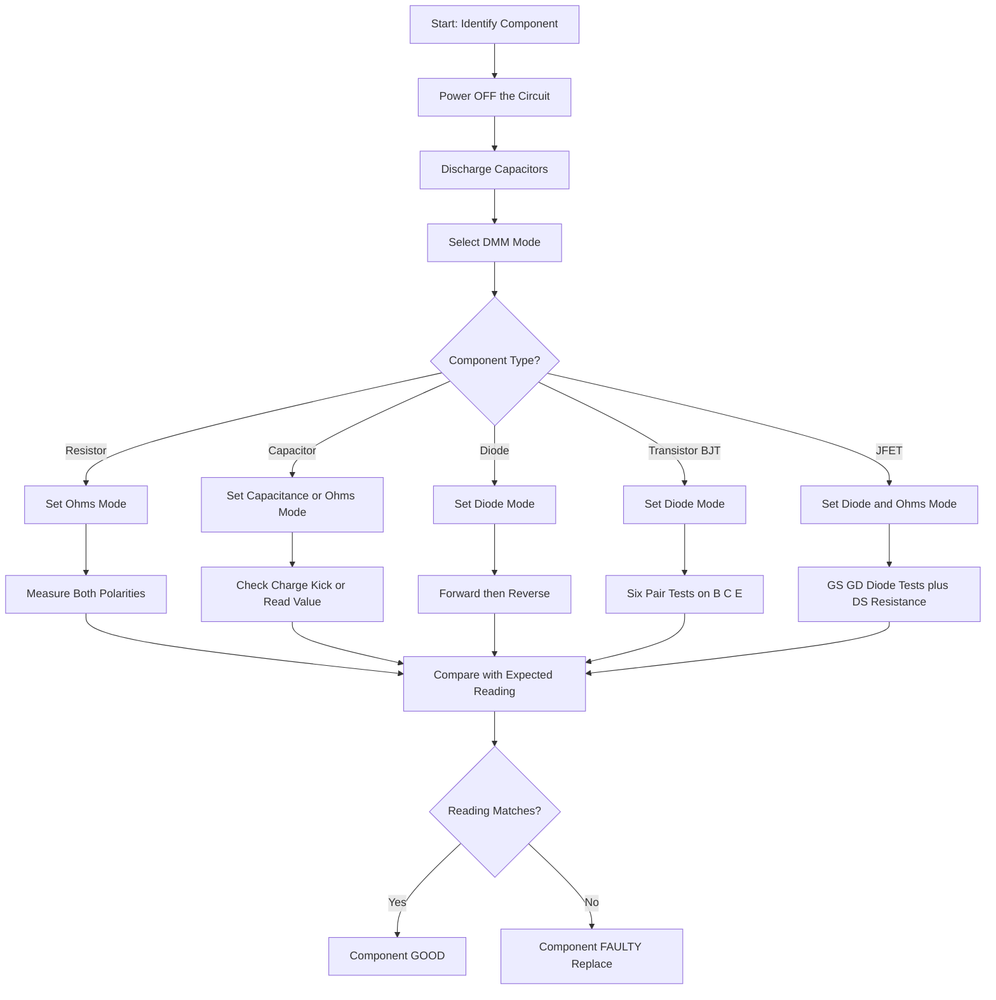
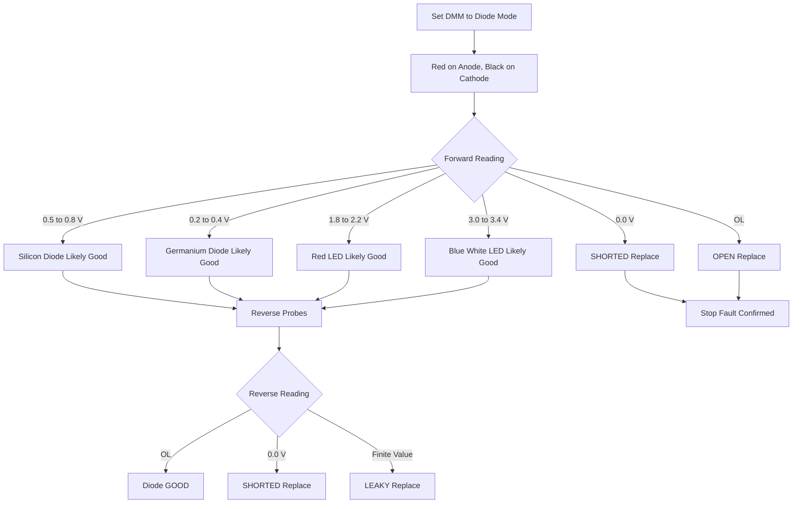
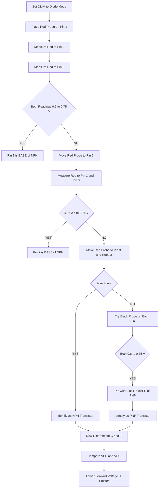
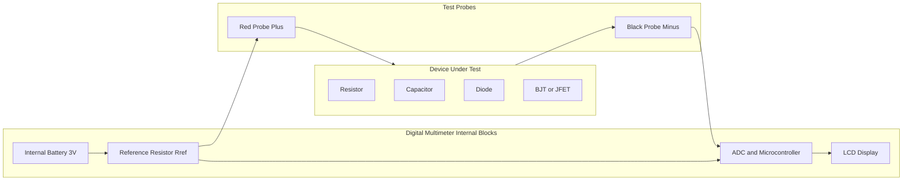
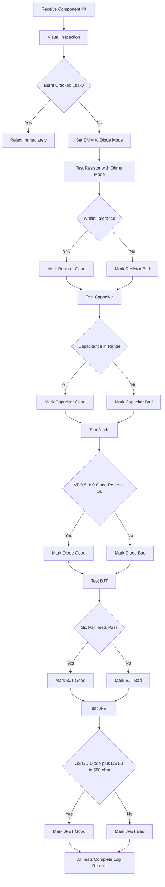

# Testing of electronic components using multimeter - Resistor, Capacitor, Diode, Transistor and JFET.

<!-- SECTION_1_START -->
# Testing of Electronic Components Using a Multimeter

## 1.1 What is a Digital Multimeter (DMM)?

A **Digital Multimeter (DMM)** is a multi-functional electronic test instrument used to measure two or more electrical quantities — typically **voltage (V)**, **current (A)**, and **resistance ($\Omega$)**. In an electronics workshop, it is the most fundamental diagnostic tool for verifying the health of discrete components such as resistors, capacitors, diodes, transistors, and JFETs before they are placed on a printed circuit board (PCB).

> [!IMPORTANT]
> **KTU 2024 Definition:** A multimeter is a **battery-operated, hand-held measurement instrument** that combines the functions of a voltmeter, ammeter, and ohmmeter. In *component testing mode*, it injects a small known current into the device under test (DUT) and displays the resulting forward voltage drop or equivalent resistance on its LCD.

### 1.2 Intuitive Analogy — "The Multimeter as a Doctor's Stethoscope"

Think of a multimeter as a **stethoscope for an electronic circuit**:

- Just as a doctor places the stethoscope on your chest to listen to your heart, an engineer places the multimeter probes across two terminals of a component to "listen" to its electrical health.
- A **healthy resistor** "breathes" with a steady resistance value.
- A **healthy capacitor** blocks DC (shows infinite resistance) and stores charge.
- A **healthy diode** allows current in only one direction, like a **one-way valve** in a water pipe.
- A **healthy transistor** acts like a **two-gate dam** — a small signal at the gate/base controls a large current flow between the source/emitter and drain/collector.

### 1.3 Types of Multimeters

| Type | Symbol | Key Feature | Workshop Use |
| :--- | :---: | :--- | :--- |
| **Analog Multimeter (VOM)** | Moving coil needle | Continuous deflection, no battery needed for voltage tests | Rarely used now |
| **Digital Multimeter (DMM)** | LCD display | Auto-ranging, high input impedance (typically **10 M$\Omega$**), diode-test mode | **Standard for KTU labs** |
| **True RMS DMM** | LCD with True RMS | Accurate measurement of non-sinusoidal AC waveforms | Industrial applications |
| **Clamp Meter** | Clamp jaw | Measures current without breaking the circuit | Power systems |

### 1.4 Standard Front-Panel Layout of a DMM

A typical KTU-approved DMM (e.g., **Fluke 101**, **Meco 108B**, **HTC DM-86T**) has the following controls:

1. **Rotary Selector Dial** — selects the function (V, A, $\Omega$, diode, continuity, capacitance, hFE).
2. **COM (Common) Jack** — black probe is always inserted here.
3. **V$\Omega$mA Jack** — red probe for voltage, resistance, and small current measurements.
4. **10 A Jack** — red probe for high current measurements (fused).
5. **LCD Display** — shows measured value with auto-polarity.
6. **Range Button (RANGE)** — manual range selection in non-auto-ranging DMMs.
7. **HOLD Button** — freezes the displayed value.
8. **Diode/Continuity Button** — switches between diode test and continuity buzzer mode.

> [!NOTE]
> **Why a DMM has a high input impedance of 10 M$\Omega$:** When measuring voltage across a high-resistance component, a low-impedance meter would itself draw current and disturb the circuit, giving a *false* reading. A high-impedance DMM "observes" the circuit without disturbing it.

### 1.5 Safety Ratings & Measurement Categories

> [!IMPORTANT]
> **KTU Safety Mandate:** Always check the **CAT rating** before measuring. Most workshop experiments fall under **CAT II (300 V)** or **CAT III (600 V)**.

| Category | Use Environment | Max Voltage |
| :--- | :--- | :--- |
| **CAT I** | Protected electronic circuits, low-energy signal-level | 150 V |
| **CAT II** | Single-phase receptacle-connected loads, lab experiments | **300 V** |
| **CAT III** | Distribution boards, three-phase industrial equipment | 600 V |
| **CAT IV** | Outside wiring, utility service entrance | 1000 V |

> [!VISUALIZATION CONTROL]
> **Concept:** Ohmmeter open-circuit voltage curve
> **Conceptual Plot:** A graph showing injected current $I$ (mA) on the Y-axis and measured resistance $R$ ($\Omega$) on the X-axis. The DMM's internal battery (typically **3 V**) drives a small constant current through the DUT.
> **Visual Description:** A nearly linear $V = IR$ relationship exists in the low-resistance region. As $R$ approaches infinity, $I$ approaches zero, and the display shows "OL" (Over-Limit or open loop).

---

## 1.6 Working Principle of Ohmmeter & Diode-Test Mode

When the rotary switch is set to **$\Omega$** or **diode** mode:

- The DMM's internal battery (typically **3 V DC** from two AA cells) is connected in series with a known reference resistor $R_{ref}$ inside the meter.
- The test probes (red = positive, black = negative of the internal battery) inject this small current through the component under test.
- The meter measures the resulting voltage drop and computes the unknown value using Ohm's law:

$$V_{measured} = I_{test} \times R_{unknown}$$

- For a **diode test**, the display shows the **forward voltage drop** $V_F$, which is typically:
  - **Silicon diode:** 0.5 V to 0.8 V (commonly **0.7 V**)
  - **Germanium diode:** 0.2 V to 0.4 V
  - **Schottky diode:** 0.15 V to 0.4 V
  - **LED (Red):** 1.8 V to 2.2 V
  - **LED (Blue/White):** 3.0 V to 3.4 V

<!-- SECTION_1_END -->

<!-- SECTION_2_START -->
# Deep Theoretical Analysis & KTU High-Yield Reference Sheet

## 2.1 Internal Circuit of a DMM in Resistance Mode

The DMM's ohmmeter section consists of:

- An **internal EMF source** $E$ (typically **3 V**).
- A **series reference resistor** $R_{ref}$ (internal).
- A **current-sensing / volt-measuring ADC** front-end.
- The **external unknown resistance** $R_x$ connected across the probes.

The equivalent circuit is:

$$E = I \cdot (R_{ref} + R_x)$$

The current flowing is:

$$I = \frac{E}{R_{ref} + R_x}$$

The ADC measures $I$ and the microprocessor computes:

$$R_x = \frac{E}{I} - R_{ref}$$

When the probes are **shorted (0 $\Omega$)**, $I$ is maximum, and the meter calibrates this as **0.00 $\Omega$**. When the probes are **open**, $I \to 0$, and the display reads **OL** (open loop / infinite).

> [!NOTE]
> **Why must the component be desoldered (or at least one lead lifted) for testing?** Because if the component remains connected to other parallel paths in a live circuit, the meter measures the **equivalent parallel resistance** of the entire network, not the component itself.

## 2.2 Internal Circuit in Diode-Test Mode

In diode mode, the DMM applies a constant current source of approximately **1 mA to 5 mA** through the probes. The forward-biased junction drops a voltage that is directly displayed.

| Component | Expected Forward Voltage $V_F$ | Reverse Reading |
| :--- | :---: | :--- |
| **Silicon Diode (1N4007)** | 0.50 V – 0.80 V | **OL** |
| **Germanium Diode (OA79)** | 0.20 V – 0.40 V | **OL** |
| **Schottky Diode (1N5819)** | 0.15 V – 0.40 V | **OL** |
| **Red LED** | 1.80 V – 2.20 V | **OL** |
| **Green LED** | 2.00 V – 2.40 V | **OL** |
| **Blue / White LED** | 3.00 V – 3.60 V | **OL** |
| **Silicon BJT base-emitter** | 0.60 V – 0.75 V | **OL** |

## 2.3 KTU Formula Sheet — Component Testing

| Test Action | Governing Equation / Logic | Expected Healthy Reading | Fault Indication |
| :--- | :--- | :--- | :--- |
| **Resistor value** | $R = \frac{V}{I}$ (Ohm's law) | Within $\pm 5\%$ of color-code value | "OL" = open; $0\,\Omega$ = short |
| **Capacitor (large)** | Charge/discharge curve on analog meter | Initial kick, then returns to OL | Steady low $\Omega$ = leaky/short |
| **Diode forward** | $V_F = V_T \ln\left(\frac{I_F}{I_S} + 1\right)$ | 0.5 V – 0.8 V for Si | 0.0 V = short; OL = open |
| **Diode reverse** | Reverse leakage $\approx I_S \approx$ nA | **OL** | Any low reading = leaky |
| **BJT NPN base-emitter** | $V_{BE} \approx 0.7$ V | 0.6 V – 0.75 V | 0 V = short; OL = open |
| **BJT NPN base-collector** | $V_{BC} \approx 0.7$ V (forward) | 0.6 V – 0.75 V | 0 V = short; OL = open |
| **BJT NPN C-E (no base)** | $I_C \approx 0$ (cut-off) | **OL** | Low reading = collector-emitter short |
| **JFET G-S / G-D (off)** | Reverse-biased PN junction | **OL** | Low reading = gate short |
| **JFET D-S (no gate bias)** | Conductive channel | $R_{DS(on)} \approx 50\,\Omega$ to $500\,\Omega$ | OL = open channel; 0 $\Omega$ = short |
| **Continuity** | Buzzer activates below $\sim 30\,\Omega$ | Beep + near 0 $\Omega$ | No beep = open circuit |

> [!IMPORTANT]
> **Shockley diode equation (for understanding, not calculation in lab):**
> $$I_F = I_S \left( e^{\frac{V_F}{n V_T}} - 1 \right)$$
> where $I_S$ is reverse saturation current (typically **1 nA to 1 $\mu$A** for silicon), $V_T$ is thermal voltage **$\approx 25.85$ mV at 300 K**, and $n$ is the ideality factor (1 to 2).

## 2.4 Why a Healthy Diode Reads "OL" in Reverse

A reverse-biased PN junction has a **depletion region** that acts as an insulator. Only a tiny leakage current $I_S$ (nano-amperes) flows. The DMM detects this as "no conduction" and displays **OL** (open loop). This is the *signature* of a working diode.

## 2.5 Real-World Engineering Applications

- **PCB rework stations** — technicians test SMD components in-circuit using DMM diode mode.
- **Field service of inverters & SMPS** — DMM is used to quickly identify shorted MOSFETs (D-S short) or open capacitors before replacing modules.
- **Automotive electronics** — testing alternator diodes, battery leakage, and sensor continuity.
- **Telecommunications hardware** — line-card testing for short circuits before powering up.
- **Educational labs (KTU GZESL208)** — verifying lab kits before assembling circuits on breadboard.

> [!NOTE]
> **Production-grade note:** While a DMM is the workshop standard, an *LCR meter* (e.g., Meco 900 or GW Instek LCR-6002) provides more accurate capacitance, inductance, and dissipation factor (tan $\delta$) measurements at a specific test frequency (typically **1 kHz** or **120 Hz**). For MOSFET/JFET parametric testing, a *curve tracer* or *semiconductor analyzer* (e.g., Keysight B1500A) is used in industry.

<!-- SECTION_2_END -->

<!-- SECTION_3_START -->
# Step-by-Step Testing Procedures for Each Component

> [!IMPORTANT]
> **General Pre-Test Rules (Mandatory for KTU Lab Exam):**
> 1. Always **switch OFF** the circuit and **disconnect** the power supply.
> 2. **Discharge** all capacitors using a 1 k$\Omega$ resistor across their leads before testing.
> 3. **Remove at least one lead** of the component from the circuit, OR ensure the component is on an isolated breadboard.
> 4. **Inspect** the component visually for cracks, burns, or leakage before testing.
> 5. Note the **ambient temperature** — resistance changes with temperature (Cu: $\approx +0.4\%/^{\circ}$C).

---

## 3.1 Testing a Resistor

### 3.1.1 Component Identification

A resistor has **no polarity**. It has two terminals of equal length. Value is read by **color bands** or by printing a numeric code (SMD).

### 3.1.2 Required Tools & Materials

| Item | Specification |
| :--- | :--- |
| Digital Multimeter (DMM) | Auto-ranging, CAT II 300 V |
| Test leads (probes) | Standard red and black, 4 mm banana plugs |
| Resistor under test | Carbon-film or metal-film, 1/4 W |
| Color-code reference chart | (Provided in lab manual) |

### 3.1.3 Step-by-Step Procedure

**Step 1:** Identify the nominal resistance value from the color bands.
  - Example: **Brown–Black–Red–Gold** = $1\,0 \times 10^2 \pm 5\%$ = **1000 $\Omega$ (1 k$\Omega$) $\pm 5\%$**.

**Step 2:** Set the DMM rotary switch to the **$\Omega$ (Ohms)** position. If the DMM is manual-ranging, select a range just above the expected value (e.g., 2 k$\Omega$ range for a 1 k$\Omega$ resistor).

**Step 3:** **Touch the two probes together** to verify the meter reads **0.00 $\Omega$** (or 0.1 $\Omega$ with lead resistance). This is the **zero-calibration** of the ohmmeter.

**Step 4:** Place the **red probe on one lead** of the resistor and the **black probe on the other lead**. Polarity is irrelevant.

**Step 5:** Read the displayed value. For a 1 k$\Omega$ resistor, expect a reading between **950 $\Omega$ and 1050 $\Omega$** (within $\pm 5\%$ tolerance).

**Step 6:** **Invert the probes** (swap red and black) and verify the reading is identical. (This confirms a non-polar, symmetric component.)

### 3.1.4 Result Interpretation

| Measured Reading | Component Status |
| :--- | :--- |
| Within $\pm 5\%$ of nominal | **GOOD** |
| Within $\pm 20\%$ of nominal | **Drifted** (replace if precision circuit) |
| **OL** (over-limit / open) | **OPEN / BURNED** — replace |
| **0.00 $\Omega$** | **SHORTED** — replace |
| Highly unstable reading | **Intermittent / Loose lead** — replace |

### 3.1.5 Python Helper — Resistor Color Code Decoder

```python
from typing import Dict

COLOR_VALUE: Dict[str, int] = {
    "black": 0, "brown": 1, "red": 2, "orange": 3, "yellow": 4,
    "green": 5, "blue": 6, "violet": 7, "grey": 8, "white": 9
}
COLOR_MULTIPLIER: Dict[str, float] = {
    "black": 1, "brown": 10, "red": 100, "orange": 1_000,
    "yellow": 10_000, "green": 100_000, "blue": 1_000_000
}
TOLERANCE: Dict[str, float] = {
    "brown": 1, "red": 2, "green": 0.5, "blue": 0.25,
    "violet": 0.1, "gold": 5, "silver": 10
}

def decode_resistor(band1: str, band2: str, band3: str, band4: str) -> str:
    """Decode a 4-band resistor color code.
    
    Args:
        band1: Color of first significant figure
        band2: Color of second significant figure
        band3: Color of multiplier
        band4: Color of tolerance
    
    Returns:
        Human-readable string with nominal value and tolerance range.
    
    Raises:
        KeyError: If an invalid color name is supplied.
    """
    nominal = (10 * COLOR_VALUE[band1] + COLOR_VALUE[band2]) * COLOR_MULTIPLIER[band3]
    tol_pct = TOLERANCE[band4]
    lower = nominal * (1 - tol_pct / 100.0)
    upper = nominal * (1 + tol_pct / 100.0)
    return f"{nominal:.2f} Ω ±{tol_pct}%  [Range: {lower:.2f} Ω to {upper:.2f} Ω]"


if __name__ == "__main__":
    # Example: Brown - Black - Red - Gold  ==>  1 kΩ ±5%
    print(decode_resistor("brown", "black", "red", "gold"))
    # Output: 1000.00 Ω ±5%  [Range: 950.00 Ω to 1050.00 Ω]
```

---

## 3.2 Testing a Capacitor

### 3.2.1 Component Identification

Capacitors may be **polarized (electrolytic, tantalum)** or **non-polarized (ceramic, film, mica)**. Polarity is critical for electrolytics — the **longer lead is positive**, the **stripe on the body indicates negative**.

### 3.2.2 Required Tools & Materials

| Item | Specification |
| :--- | :--- |
| Digital Multimeter (DMM) with **Capacitance mode** | Auto-ranging, range typically 10 pF to 100 mF |
| Discharge resistor | 1 k$\Omega$, 1/4 W |
| Capacitor under test | Electrolytic 100 $\mu$F / 25 V, ceramic 0.1 $\mu$F |
| Safety gloves | Anti-static |

### 3.2.3 Step-by-Step Procedure Using a DMM with Capacitance Mode

**Step 1:** **Discharge** the capacitor by connecting a 1 k$\Omega$ resistor across its leads for at least 5 seconds (10 seconds for large electrolytics $> 1000\,\mu$F).

**Step 2:** Set the DMM rotary switch to the **|⊢| (Capacitance)** symbol.

**Step 3:** Insert the capacitor leads directly into the dedicated capacitor test slots on the DMM (most DMMs have two small slots labelled **CX** or **+ −**).

> [!NOTE]
> If no slot exists, hold the probes against the leads and observe the reading. For electrolytic capacitors, maintain correct polarity: **red probe on +**, **black probe on −**.

**Step 4:** Wait for the reading to **stabilize** (may take a few seconds for large electrolytics).

**Step 5:** Compare with the **marked value** and **tolerance** (typical electrolytic tolerance: $\pm 20\%$).

### 3.2.4 Step-by-Step Procedure Using DMM Resistance Mode (Quick "Kick Test")

**Step 1:** Switch DMM to the highest **$\Omega$** range (e.g., 2 M$\Omega$ or 20 M$\Omega$).

**Step 2:** Connect probes across the **discharged** capacitor (red to +, black to −).

**Step 3:** Observe the meter:
  - **Initial low reading** that **rises steadily to OL** = **GOOD** (capacitor is charging).
  - **Immediate return to OL without any kick** = **OPEN** (failed capacitor, internal break).
  - **Steady low reading** (e.g., a few hundred $\Omega$) = **SHORTED / LEAKY** (failed, replace).
  - **Reading rises but does not reach OL** (e.g., settles at 50 k$\Omega$) = **LEAKY** (degraded, replace).

> [!WARNING]
> **The "kick test" is qualitative, not quantitative.** A DMM with dedicated capacitance mode gives the actual value in **farads (F)**, while a resistance-mode test only indicates the charging behavior.

### 3.2.5 Result Interpretation Table

| DMM Capacitance Reading | DMM Resistance Kick Test | Status |
| :--- | :--- | :--- |
| Within $\pm 20\%$ of marked | Rises steadily to OL | **GOOD** |
| $> +50\%$ of marked | — | **Open (ESR high) — REPLACE** |
| $< -10\%$ of marked | — | **Leaky / dried-out — REPLACE** |
| 0.00 F | Steady near 0 $\Omega$ | **SHORTED — REPLACE** |
| OL in capacitance mode | No kick observed | **OPEN — REPLACE** |

> [!NOTE]
> **ESR (Equivalent Series Resistance)** is a critical parameter for electrolytic capacitors in switching power supplies. A standard DMM does not measure ESR; an *ESR meter* or *LCR meter* at 100 kHz is needed. A high ESR causes capacitor heating and is a common failure mode in aged SMPS equipment.

---

## 3.3 Testing a Diode

### 3.3.1 Component Identification

A diode has **two terminals**: **Anode (A)** and **Cathode (K)**. The cathode is marked by a **stripe** on the body. Current flows from anode to cathode in forward bias.

### 3.3.2 Required Tools & Materials

| Item | Specification |
| :--- | :--- |
| DMM with **diode-test mode** | Symbol: **$\rightarrow$⊢** |
| Diode under test | 1N4007 (Si rectifier), 1N4148 (signal), LED |
| Datasheet (for $V_F$ spec) | Provided in lab manual |

### 3.3.3 Step-by-Step Procedure

**Step 1:** Set the DMM rotary switch to the **diode-test** position (often shared with continuity; press the **MODE** or **SELECT** button to enter diode mode — the LCD will show the **$\rightarrow$⊢** symbol).

**Step 2:** Identify the **anode** and **cathode** of the diode (stripe on cathode side).

**Step 3:** **Forward-bias test:** Place the **red probe on the anode** and the **black probe on the cathode**. Read the displayed forward voltage drop $V_F$.

**Step 4:** **Reverse-bias test:** Reverse the probes (**red on cathode, black on anode**). Read the display.

**Step 5:** Repeat for any additional diodes or LEDs in the kit.

### 3.3.4 Expected Readings & Interpretation

| Component | Forward Bias Reading | Reverse Bias Reading | Status |
| :--- | :---: | :---: | :--- |
| **1N4007 (Si rectifier)** | 0.50 V – 0.80 V | **OL** | **GOOD** |
| **1N4148 (signal Si)** | 0.60 V – 0.75 V | **OL** | **GOOD** |
| **Red LED** | 1.80 V – 2.20 V | **OL** | **GOOD** |
| **Green LED** | 2.00 V – 2.40 V | **OL** | **GOOD** |
| **Blue LED** | 3.00 V – 3.40 V | **OL** | **GOOD** |
| Any diode | 0.00 V (both directions) | 0.00 V | **SHORTED — REPLACE** |
| Any diode | **OL** (both directions) | **OL** | **OPEN — REPLACE** |
| Any diode | 0.4 V (forward) but finite in reverse (e.g., 1.5 V) | — | **LEAKY — REPLACE** |

> [!IMPORTANT]
> **KTU Examiner Tip:** A diode may also be tested in **resistance mode** for a quick go/no-go check. A healthy silicon diode typically shows **low resistance (300 $\Omega$ to 1 k$\Omega$) in forward** and **OL in reverse**. However, the *precise* $V_F$ value can only be measured in **diode-test mode**.

### 3.3.5 Quick Visual Decision Logic

```
Forward reading in 0.5 V to 0.8 V range?
  YES + Reverse = OL      -->  HEALTHY Si diode
  YES + Reverse = 0.0 V   -->  SHORTED diode
  OL in both directions   -->  OPEN diode
  Both directions 1.5 V   -->  LEAKY / soft breakdown
```

---

## 3.4 Testing a Bipolar Junction Transistor (BJT)

### 3.4.1 Component Identification

A BJT has **three terminals**:
- **Emitter (E)**
- **Base (B)**
- **Collector (C)**

The component is either **NPN** or **PNP**. The pinout depends on the package (TO-92, TO-220, SOT-23). A typical **TO-92 NPN** (e.g., BC547) viewed from the flat face has pinout: **C – B – E (left to right)**.

### 3.4.2 Required Tools & Materials

| Item | Specification |
| :--- | :--- |
| DMM with **diode-test mode** | Symbol: $\rightarrow$⊢ |
| BJT under test | BC547 (NPN), BC557 (PNP), 2N2222 (NPN) |
| Datasheet (pinout reference) | Provided in lab manual |
| $10\text{ k}\Omega$ resistor | For "in-circuit" gain estimation (optional) |

### 3.4.3 Step-by-Step Procedure (NPN — e.g., BC547)

The BJT has **two back-to-back PN junctions**:
- **Base-Emitter (B-E) junction**
- **Base-Collector (B-C) junction**

Testing these two junctions with a DMM in diode mode is sufficient to identify the device type, pinout, and basic health.

**Step 1:** Set DMM to **diode mode**.

**Step 2:** **Identify the Base terminal** by trial:
  - Place the **red probe on a pin** and **touch the black probe** to each of the other two pins in turn.
  - A reading of **0.6 V – 0.75 V** on both the other two pins means **the red probe is on the BASE of an NPN transistor**.
  - If the black probe is on the base and you get 0.6 V – 0.75 V on both other pins, the transistor is **PNP**.

**Step 3:** Once the base is identified, measure **B-C** and **B-E**:
  - **NPN:** Red on Base, Black on Collector $\to$ **0.6 V – 0.75 V**.
  - **NPN:** Red on Base, Black on Emitter $\to$ **0.6 V – 0.75 V**.
  - **NPN:** Reverse probes for both junctions $\to$ **OL**.

**Step 4:** **Collector-Emitter leakage test:**
  - With the **base left unconnected (floating)**, measure between collector and emitter.
  - Healthy NPN: **OL** (transistor is in cut-off, no conduction).
  - Faulty: low reading indicates **C-E short**.

**Step 5:** For a **PNP** (e.g., BC557), all polarities are reversed: **Black on Base**, Red on C and E for forward-bias readings.

### 3.4.4 NPN BJT Test Summary Table

| Red Probe | Black Probe | Healthy NPN Reading | Healthy PNP Reading | Faulty Reading |
| :---: | :---: | :---: | :---: | :--- |
| **B** | **E** | 0.6 V – 0.75 V | **OL** | 0.0 V = short, OL = open |
| **B** | **C** | 0.6 V – 0.75 V | **OL** | 0.0 V = short, OL = open |
| **E** | **B** | **OL** | 0.6 V – 0.75 V | 0.0 V = short, OL = open |
| **C** | **B** | **OL** | 0.6 V – 0.75 V | 0.0 V = short, OL = open |
| **C** | **E** | **OL** | **OL** | Low = C-E short |
| **E** | **C** | **OL** | **OL** | Low = C-E short |

### 3.4.5 Pinout Identification Logic (Quick Method)

> [!IMPORTANT]
> **Three-step pinout finder for an unmarked TO-92 transistor:**
> 1. **Find the base** — the pin where the red probe reads 0.6 V to both other pins (NPN) or the black probe reads 0.6 V to both others (PNP).
> 2. **Identify the type** — if red on base gave forward readings, it's NPN. If black on base gave forward readings, it's PNP.
> 3. **Differentiate C and E** — measure resistance with probes swapped between C and E. The **higher** forward-biased junction reading is typically the **base-collector**; the **lower** is the **base-emitter**. (Emitter doping is heavier, so $V_{BE} < V_{BC}$.)

---

## 3.5 Testing a Junction Field-Effect Transistor (JFET)

### 3.5.1 Component Identification

A JFET has **three terminals**:
- **Gate (G)**
- **Drain (D)**
- **Source (S)**

There are two types:
- **N-channel JFET** (e.g., 2N3819, BF245) — the channel is n-type; majority carriers are electrons.
- **P-channel JFET** (e.g., 2N5460) — the channel is p-type.

The **gate-channel junction is a reverse-biased PN junction**, similar to a diode.

### 3.5.2 Required Tools & Materials

| Item | Specification |
| :--- | :--- |
| DMM with **diode-test mode** and **$\Omega$ mode** | Standard workshop DMM |
| JFET under test | 2N3819 (N-channel), MPF102 (N-channel) |
| Datasheet (pinout reference) | Provided in lab manual |
| $10\text{ k}\Omega$ resistor | Optional, for pinch-off test |

### 3.5.3 Step-by-Step Procedure (N-Channel JFET, e.g., 2N3819)

**Pinout of 2N3819 (TO-92 package, flat face):** **D – G – S** (left to right, with the flat face toward you and leads pointing down).

**Step 1:** Set DMM to **diode mode**.

**Step 2:** **Gate-to-Source (G-S) test:**
  - **Red probe on G, Black on S** (forward bias of gate-source PN junction) $\to$ expect **0.5 V – 0.8 V** (acts like a diode).
  - **Reverse probes (Red on S, Black on G)** $\to$ expect **OL** (reverse-biased junction).

**Step 3:** **Gate-to-Drain (G-D) test:**
  - **Red probe on G, Black on D** $\to$ expect **0.5 V – 0.8 V**.
  - **Reverse probes** $\to$ expect **OL**.

**Step 4:** **Drain-to-Source (D-S) test (channel resistance):**
  - With the **gate unconnected** (or connected to source), the channel is fully ON.
  - Set DMM to **$\Omega$ mode**.
  - Measure **D-S resistance** in **both polarities**. The JFET channel is symmetric, so reading should be **similar in both directions**.
  - Healthy N-channel JFET: **$R_{DS(on)} \approx 50\,\Omega$ to $500\,\Omega$** (varies by part; 2N3819 typically 100 $\Omega$ to 300 $\Omega$).
  - For a P-channel JFET, the channel is normally ON but with reversed polarities.

**Step 5:** **Pinch-off test (optional, verifies gate control):**
  - Connect a **10 k$\Omega$ resistor** between the **gate and source** to bias the gate to 0 V (this is more like a "shut off" via residual gate charge for depletion-mode JFETs).
  - For a depletion-mode N-channel JFET, leaving the gate floating turns the channel ON. Touching the gate with your finger (which carries small static charge) can sometimes reduce $R_{DS}$.
  - The classic demonstration: with $R_{DS}$ measured in $\Omega$ mode, **briefly short the gate to source** with a wire. For a depletion-mode JFET, $V_{GS} = 0$ keeps it ON, so $R_{DS}$ remains low. If you applied a reverse bias (negative $V_{GS}$ for N-channel), the channel would pinch off and $R_{DS} \to$ OL. This requires an external supply and is beyond basic workshop testing.

### 3.5.4 N-Channel JFET Test Summary Table

| Red Probe | Black Probe | Healthy N-JFET Reading | Status / Fault |
| :---: | :---: | :---: | :--- |
| **G** | **S** | 0.5 V – 0.8 V | Forward PN junction — OK |
| **S** | **G** | **OL** | Reverse-biased junction — OK |
| **G** | **D** | 0.5 V – 0.8 V | Forward PN junction — OK |
| **D** | **G** | **OL** | Reverse-biased junction — OK |
| **D** | **S** | 50 $\Omega$ – 500 $\Omega$ | Channel ON — OK |
| **S** | **D** | 50 $\Omega$ – 500 $\Omega$ | Symmetric channel — OK |
| **D** | **S** | **OL** | Channel open — REPLACE |
| **D** | **S** | 0 $\Omega$ | Channel shorted — REPLACE |
| **G** | **S** | **OL** in both directions | Gate open — REPLACE |
| **G** | **S** | 0.0 V in both directions | Gate shorted — REPLACE |

> [!IMPORTANT]
> **Critical difference from BJT:** A JFET's **G-S** and **G-D** junctions behave like a *single diode* (not two back-to-back diodes like a BJT). The D-S channel conducts in **both directions** when the gate is unbiased — unlike a BJT, which is normally OFF between C and E.

### 3.5.5 Identifying Source vs Drain

For a JFET, the **source** is typically tied to the lower-potential end (for N-channel, the source is at the more negative voltage during operation). In a symmetric JFET like the 2N3819, the channel itself is symmetric, so **D and S can be interchanged** with no change in DC behavior. For asymmetric power JFETs, the **drain** is usually marked with a tab or identified in the datasheet.

---

## 3.6 Quick Reference: Universal Component Test Patterns

| Component | Forward Signature | Reverse Signature | Other Key Test |
| :--- | :--- | :--- | :--- |
| **Resistor** | Same reading both ways | Same reading both ways | Within tolerance |
| **Capacitor (charged)** | Initial kick, rises to OL | Same as forward (kicks) | Discharged before test |
| **Diode (Si)** | 0.5 V – 0.8 V | OL | $V_F$ matches type |
| **LED (Red)** | 1.8 V – 2.2 V (faint glow possible) | OL | $V_F$ color-dependent |
| **BJT NPN** | Red on B reads 0.7 V on both E and C | Black on B reads OL on E and C | C-E = OL with B floating |
| **BJT PNP** | Black on B reads 0.7 V on both E and C | Red on B reads OL on E and C | C-E = OL with B floating |
| **JFET N-ch** | Red on G reads 0.7 V on both S and D | Black on G reads OL on S and D | D-S = 50-500 $\Omega$ both ways |

---

## 3.7 Safety Monitoring Steps for the Entire Workshop

| Step | Action | Reason |
| :--- | :--- | :--- |
| 1 | Wear **anti-static wrist strap** when handling MOSFET/JFET | Prevent gate-oxide breakdown (JFETs are more robust, but ESD is still harmful) |
| 2 | **Inspect DMM test leads** for cracked insulation before use | Prevent electric shock |
| 3 | Verify **DMM battery** is healthy (low battery gives false low $V_F$) | Reading accuracy |
| 4 | **Never measure resistance** on a **live circuit** | DMM can be damaged and gives false readings |
| 5 | **Never measure voltage** with the DMM set to **current mode** | Blows the internal fuse |
| 6 | **Replace DMM fuse** with the **exact rating** (typically **200 mA / 250 V fast-blow** for the mA jack) | Safety |
| 7 | After testing electrolytic capacitors, **discharge again** before storing | Prevents charged capacitor hazard |

<!-- SECTION_3_END -->

<!-- SECTION_4_START -->
# Structural Diagrams & Schematics

## 4.1 Universal Multimeter Test Flow



## 4.2 Diode Test Decision Logic



## 4.3 BJT NPN Identification Flow



## 4.4 Component Test Topology (Block Diagram)



## 4.5 Sequential Testing Workflow for a Component Kit



<!-- SECTION_4_END -->

<!-- SECTION_5_START -->
# KTU 2024 Scheme Examination Question Bank & Topic Recap

## 5.1 Part A — Short Answer Questions (3 Marks Each)

> [!NOTE]
> **Cognitive Levels:** Remember (L1) and Understand (L2). Answers should be concise, 50-80 words, with a labeled diagram or equation where applicable.

### Question 1 `[KTU University Exam — July 2024]`
**Q: List the three primary functions of a digital multimeter (DMM). Mention the typical internal battery voltage used in the resistance mode. (CO1, Remember)**

**Model Answer (3 Marks):**
A digital multimeter (DMM) primarily measures:
1. **Voltage (V)** — both AC and DC, indicated by V~ and V⎓ symbols.
2. **Current (A)** — both AC and DC, indicated by A~ and A⎓ symbols, measured in series with the circuit.
3. **Resistance ($\Omega$)** — measured with the circuit de-energized.

The DMM's internal ohmmeter uses a battery of **3 V DC** (typically two AA cells) which drives a small constant current through the unknown resistance, and the resulting voltage drop is converted to a resistance reading on the LCD. **[Full marks: 1 for listing 3 functions + 1 for AC/DC distinction + 1 for 3 V battery]**

---

### Question 2 `[KTU University Exam — Dec 2023]`
**Q: With a neat sketch, explain how a healthy silicon diode behaves when tested using the DMM diode-test mode. (CO2, Understand)**

**Model Answer (3 Marks):**

When tested with a DMM in diode mode:

**Forward bias (red probe on anode, black on cathode):** The DMM injects a small current (1-5 mA) and the LCD displays the **forward voltage drop $V_F \approx 0.7$ V** for a healthy silicon diode.

**Reverse bias (probes reversed):** The PN junction is reverse-biased; only a tiny leakage current $I_S$ (nano-amperes) flows. The DMM displays **OL (open loop)**, indicating no conduction.

A diode showing **0.5 V – 0.8 V forward** and **OL reverse** is confirmed healthy. **Marks split: 1 for forward reading + 1 for reverse reading + 1 for OL interpretation.**

**Sketch (describe):**
```
  Red →  |►|→ Black   →   LCD: 0.687 V  (Forward bias, healthy)
  Red →  |◄|← Black   →   LCD: OL       (Reverse bias, healthy)
```

---

## 5.2 Part B — Long Answer Questions (14 Marks Each)

> [!WARNING]
> **KTU Valuation Pattern:** Sub-parts are typically **(a) 7 marks** and **(b) 7 marks**. Always draw a **neat circuit / test setup** before the calculation/procedure. Writing only the answer without the procedure fetches only 50\% marks.

### Question A `[KTU University Exam — July 2024]` **(14 Marks)**

**(a)** Describe, with a stepwise procedure, how you would test a **carbon-film resistor of nominal value 4.7 k$\Omega$ $\pm 5\%$** using a DMM. State the expected acceptable range of measured values. **(7 Marks, CO2 — Understand)**

**(b)** A **BC547 (NPN BJT)** is suspected of being faulty. Describe the complete DMM-based test procedure to identify the **base, collector, and emitter** terminals and verify whether the transistor is healthy. Mention all six probe-pair test readings. **(7 Marks, CO3 — Apply)**

#### Model Solution

### Part (a) — Resistor Testing (7 Marks)

**Step 1: Visual inspection (1 Mark)**
Inspect the resistor for visible damage — burnt body, broken leads, or discolouration. Read the color bands: **Yellow – Violet – Red – Gold = $47 \times 10^2 \pm 5\% = 4700\,\Omega$ $\pm 5\%$**.

**Step 2: Calculate acceptable range (1 Mark)**

$$R_{min} = 4700 \times (1 - 0.05) = 4465\,\Omega$$

$$R_{max} = 4700 \times (1 + 0.05) = 4935\,\Omega$$

**Acceptable range: 4465 $\Omega$ to 4935 $\Omega$.**

**Step 3: Set up the DMM (1 Mark)**
Turn the rotary selector to the **$\Omega$** (Ohms) position. Choose a manual range of **20 k$\Omega$** if the DMM is not auto-ranging. Verify zero calibration by shorting the probes — display should read 0.00 $\Omega$ (or near zero, accounting for lead resistance).

**Step 4: Measure (1 Mark)**
Connect the red probe to one lead and the black probe to the other. Read the LCD.

**Step 5: Reverse and re-measure (1 Mark)**
Swap the probes. The reading should be **identical** (resistors are non-polar).

**Step 6: Interpretation (2 Marks)**
- Reading between **4465 $\Omega$ and 4935 $\Omega$** $\to$ **HEALTHY**.
- Reading **OL** $\to$ **OPEN** — resistor is broken.
- Reading **near 0 $\Omega$** $\to$ **SHORTED** — replace.
- Reading drifting $\to$ **intermittent connection** — replace.

> **Valuation Key:** [Visual inspection and color code: 1 Mark] [Range calculation: 1 Mark] [DMM setup: 1 Mark] [Measurement procedure: 1 Mark] [Reverse probe verification: 1 Mark] [Interpretation: 2 Marks]

---

### Part (b) — BJT Testing (7 Marks)

**Step 1: Setup and pinout reference (1 Mark)**
The BC547 in TO-92 package (flat face toward you, leads down) has the pinout: **Collector – Base – Emitter (C – B – E)** from left to right. Set DMM to **diode mode**.

**Step 2: Base identification (2 Marks)**
Test all three pins by placing the **red probe on Pin 1 (C)** and the **black probe on Pin 2 (B)** $\to$ expect **OL** (B-C junction reverse-biased). Now place **red on Pin 2 (B)** and **black on Pin 1 (C)** $\to$ expect **0.6 V – 0.75 V** (B-C junction forward-biased for NPN).

Repeat the test for the **B-E junction**: red on B, black on E $\to$ **0.6 V – 0.75 V**; reverse $\to$ **OL**.

**Conclusion:** The pin giving **0.6 V – 0.75 V forward readings to both other pins when red is on it** is the **BASE of the NPN transistor**.

**Step 3: Differentiate Collector and Emitter (2 Marks)**
Compare the two forward-bias readings:
- The **lower** $V_{BE}$ (e.g., 0.65 V) is typically the **Base-Emitter** junction (heavily doped emitter).
- The **higher** $V_{BC}$ (e.g., 0.72 V) is the **Base-Collector** junction.

Alternatively, use a known datasheet pinout (BC547: C-B-E left to right).

**Step 4: C-E leakage test (1 Mark)**
With **base floating (unconnected)**, measure between **C and E** in both polarities. Healthy BC547: **OL** in both directions (transistor is in cut-off). Faulty: low reading indicates C-E short.

**Step 5: Six probe-pair summary (1 Mark)**

| Red | Black | Reading |
|:---:|:---:|:---:|
| B | E | 0.65 V |
| B | C | 0.72 V |
| E | B | OL |
| C | B | OL |
| C | E | OL |
| E | C | OL |

**Conclusion:** If all six readings match the table, the BC547 is **HEALTHY**. Any deviation (e.g., 0.0 V on B-E) indicates a fault.

> **Valuation Key:** [DMM setup and pinout reference: 1 Mark] [Base identification logic: 2 Marks] [C/E differentiation: 2 Marks] [C-E leakage test: 1 Mark] [Tabulated results: 1 Mark]

---

### Question B `[KTU University Exam — Dec 2023]` **(14 Marks)**

**(a)** With a neat sketch and stepwise procedure, explain how you would test a **100 $\mu$F / 25 V electrolytic capacitor** using a DMM. What is the significance of **ESR** in practical applications? **(7 Marks, CO2 — Understand)**

**(b)** Describe the complete procedure to test a **2N3819 N-channel JFET** using a DMM in diode and resistance modes. Tabulate all the expected readings and indicate how a healthy device differs from a faulty one. **(7 Marks, CO3 — Apply)**

#### Model Solution

### Part (a) — Capacitor Testing (7 Marks)

**Step 1: Safety discharge (1 Mark)**
Before testing, the capacitor must be **fully discharged** by connecting a **1 k$\Omega$ resistor** across its leads for **5–10 seconds** (10 s for capacitance $> 1000\,\mu$F). This prevents electric shock and protects the DMM.

**Step 2: Identify polarity (1 Mark)**
Electrolytic capacitors are **polarized**. The **longer lead is the positive (anode)**. The **stripe on the body marked "−"** indicates the negative (cathode).

**Step 3: Set DMM to capacitance mode (1 Mark)**
Rotate the selector to the **|⊢|** symbol. Insert the capacitor leads into the dedicated **CX** slots on the DMM (or hold the probes, maintaining red on + and black on −).

**Step 4: Read and compare (2 Marks)**
Wait for the reading to stabilize. Compare with the marked value of **100 $\mu$F** with typical tolerance **$\pm 20\%$**.

$$C_{min} = 100 \times 0.80 = 80\,\mu\text{F}$$

$$C_{max} = 100 \times 1.20 = 120\,\mu\text{F}$$

**Acceptable range: 80 $\mu$F to 120 $\mu$F.**

**Step 5: Alternative "kick test" using $\Omega$ mode (1 Mark)**
Set DMM to highest $\Omega$ range (e.g., 2 M$\Omega$). Connect probes (red to +). Observe: a healthy electrolytic shows an **initial low reading that rises steadily to OL** as the internal capacitor charges. If the reading returns to OL almost immediately (no kick), the capacitor is **open**. A steady low reading indicates a **short**.

**Step 6: Significance of ESR (1 Mark)**
**Equivalent Series Resistance (ESR)** is the total ohmic loss of a capacitor (lead resistance, foil resistance, electrolyte resistance). A low ESR is critical in:
- **Switch-mode power supplies (SMPS)** — high ESR causes $I^2R$ heating, voltage ripple, and eventual failure.
- **Motor run capacitors** — high ESR causes motor overheating.
- **CPU decoupling on motherboards** — high ESR defeats the purpose of bypassing high-frequency noise.

A standard DMM **does not measure ESR**; an *LCR meter* or *dedicated ESR meter* (e.g., MESR-100) is required.

> **Valuation Key:** [Discharge procedure: 1 Mark] [Polarity identification: 1 Mark] [DMM setup: 1 Mark] [Reading and tolerance: 2 Marks] [Kick test method: 1 Mark] [ESR significance: 1 Mark]

---

### Part (b) — JFET Testing (7 Marks)

**Step 1: Pinout reference (1 Mark)**
The **2N3819** N-channel JFET in TO-92 package (flat face toward you, leads down) has the pinout: **Drain – Gate – Source (D – G – S)** from left to right.

**Step 2: Set DMM to diode mode (1 Mark)**
Rotate the selector to the **$\rightarrow$⊢** symbol. The internal battery provides a small forward current (1-5 mA) to test the gate-channel junction.

**Step 3: Test G-S and G-D junctions (2 Marks)**
The gate of an N-channel JFET forms a PN junction with both the source and the drain (P-type gate on N-type channel). Test as follows:

| Red Probe | Black Probe | Expected Reading | Interpretation |
|:---:|:---:|:---:|:---|
| G | S | 0.5 V – 0.8 V | Forward-biased gate-source PN junction |
| S | G | OL | Reverse-biased junction (no conduction) |
| G | D | 0.5 V – 0.8 V | Forward-biased gate-drain PN junction |
| D | G | OL | Reverse-biased junction (no conduction) |

**Step 4: Test D-S channel resistance (1 Mark)**
Set DMM to **$\Omega$ mode**. With the **gate floating (unconnected)**, the depletion-mode N-channel JFET channel is fully **ON**.

| Red Probe | Black Probe | Expected Reading |
|:---:|:---:|:---:|
| D | S | 50 $\Omega$ – 500 $\Omega$ |
| S | D | 50 $\Omega$ – 500 $\Omega$ (similar) |

The channel is **symmetric** — readings should be similar in both polarities (unlike a BJT).

**Step 5: Fault identification (1 Mark)**
| Faulty Reading | Indication |
|:--- | :--- |
| OL in both D-S polarities | **Channel open — REPLACE** |
| 0 $\Omega$ in D-S | **Channel shorted — REPLACE** |
| 0 V in both G-S directions | **Gate shorted to channel — REPLACE** |
| OL in both G-S directions | **Gate open (broken bond wire) — REPLACE** |
| Low forward but finite reverse on G-S | **Gate junction leaky — REPLACE** |

**Step 6: Pinout confirmation (1 Mark)**
The **Gate** is the terminal that shows a **diode-like 0.5 V – 0.8 V** reading to BOTH other pins. The other two pins (D and S) are interchangeable in DC behavior due to channel symmetry. If unsure, consult the datasheet — for 2N3819, the pin adjacent to the tab on the flat face is the **Drain**.

> **Valuation Key:** [Pinout and DMM setup: 1 Mark] [G-S and G-D junction tests: 2 Marks] [D-S channel resistance: 1 Mark] [Fault identification table: 1 Mark] [Pinout confirmation logic: 1 Mark] [Healthy vs faulty tabulation: 1 Mark]

---

## 5.3 KTU Examiner's Valuation Warning / Pitfall Callout

> [!WARNING]
> **Common Mistakes That Cost Marks in the KTU Board Exam:**
>
> 1. **Forgetting to discharge the capacitor before testing** — the DMM may show a misleading high reading or the residual charge can damage the meter's input stage. Always write the **discharge step** explicitly.
> 2. **Confusing OL with 0 V** — "OL" (open loop / over-limit) means **infinite resistance / no conduction**, NOT a faulty high value. Many students write "the diode is shorted" when they see "OL", which is the opposite of correct.
> 3. **Not maintaining BJT probe polarity** — for an **NPN**, **red on base** gives forward-bias readings; for a **PNP**, **black on base** gives forward-bias readings. Mixing this up leads to wrong pinout identification.
> 4. **Measuring resistance on a live circuit** — this is the most common lab accident. Always **switch off the power supply** before using the ohms mode.
> 5. **Failing to draw the test setup diagram** — even a simple sketch of the DMM, probes, and component earns **1-2 marks** in Part B answers.
> 6. **Treating JFET and BJT as the same** — a JFET's **D-S conducts in both directions** when the gate is unbiased; a BJT's **C-E is open** without base bias. This is a high-weightage conceptual differentiator.
> 7. **Wrong color-code reading** — always write the **band-by-band** decoding with the multiplier; for 5-band resistors, the 3rd band is also a significant figure, not a multiplier.
> 8. **Selecting wrong DMM range** — for a 1 k$\Omega$ resistor, use a 2 k$\Omega$ or 20 k$\Omega$ range, not a 200 $\Omega$ range (which gives "OL"). State the range explicitly.

---

## 5.4 Topic Recap & Important Things to Remember

- [ ] A **Digital Multimeter (DMM)** combines the functions of a voltmeter, ammeter, and ohmmeter, with additional **diode-test**, **continuity**, and **capacitance** modes.
- [ ] In **resistance mode**, the DMM injects a small current from its **internal 3 V battery** through the unknown resistance. Touching the probes together should read **0.00 $\Omega$** (zero-cal).
- [ ] In **diode mode**, the DMM displays the **forward voltage drop $V_F$** in volts. A healthy **silicon diode** reads **0.5 V – 0.8 V forward** and **OL reverse**.
- [ ] A **healthy resistor** reads the same value in both probe polarities, within its **tolerance band** (typically $\pm 5\%$ for carbon-film, $\pm 1\%$ for metal-film).
- [ ] Always **discharge capacitors** using a **1 k$\Omega$ resistor** for at least 5 seconds before testing.
- [ ] An electrolytic capacitor in good condition shows an **initial low resistance that rises to OL** ("capacitor kick") in resistance mode, OR a stable capacitance value within **$\pm 20\%$** of the marked value in capacitance mode.
- [ ] **ESR (Equivalent Series Resistance)** is critical in SMPS applications. A standard DMM cannot measure ESR; an LCR meter or dedicated ESR meter is needed.
- [ ] An **NPN BJT** has its **base as the P-region**. In diode mode, **red probe on base** gives **0.6 V – 0.75 V** to both emitter and collector. **Black probe on base** gives **OL** in both directions.
- [ ] A **PNP BJT** is the opposite: **black probe on base** gives 0.7 V forward; **red probe on base** gives OL.
- [ ] With **base floating**, an NPN or PNP BJT in good condition has **OL between collector and emitter** (cut-off state, no base drive).
- [ ] A **JFET gate-channel junction behaves like a single diode** (not two back-to-back like a BJT). Test it in diode mode: forward = 0.5 V – 0.8 V, reverse = OL.
- [ ] A **JFET channel (D-S) conducts in both directions** with the gate floating, with a resistance of approximately **50 $\Omega$ to 500 $\Omega$** (varies by part; 2N3819 typically 100-300 $\Omega$).
- [ ] **JFETs are depletion-mode devices** — $V_{GS} = 0$ V keeps the channel ON. To turn it OFF, a reverse bias must be applied (negative $V_{GS}$ for N-channel).
- [ ] **Pinout summary for common TO-92 devices:**
  - **BC547 (NPN)**: C – B – E (left to right, flat face)
  - **BC557 (PNP)**: C – B – E (left to right, flat face)
  - **2N3819 (N-JFET)**: D – G – S (left to right, flat face)
  - **MPF102 (N-JFET)**: D – G – S (left to right, flat face)
- [ ] **Safety rules:** Never measure resistance on a live circuit, never use current mode to measure voltage, always check the **CAT rating**, and **discharge capacitors** before testing.
- [ ] **DMM jack convention:** Black probe **always in COM**; red probe in **V$\Omega$mA** for normal measurements, switch to **10 A jack** for high current.
- [ ] **Continuity mode** sounds a buzzer for resistances below approximately **30 $\Omega$** — useful for tracing wires and checking fuses.
- [ ] **Faulty component signatures:** **0 $\Omega$** in both directions = **SHORT**; **OL** in both directions = **OPEN**; **low but finite reverse reading on a diode** = **LEAKY**; **intermittent readings** = **intermittent connection** (often a cracked solder joint or broken bond wire inside the component).
- [ ] **LEDs** have higher forward voltages than rectifier diodes: **Red $\approx 1.8-2.2$ V**, **Green $\approx 2.0-2.4$ V**, **Blue/White $\approx 3.0-3.4$ V**. Some DMMs may faintly light up an LED in diode-test mode if the test current is sufficient.
- [ ] **For Surface-Mount Devices (SMD)**, use fine-tipped probes or **SMD test clips**. The same diode and resistance test principles apply, but the physical handling requires magnification and anti-static precautions.

<!-- SECTION_5_END -->
