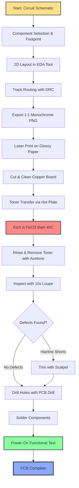
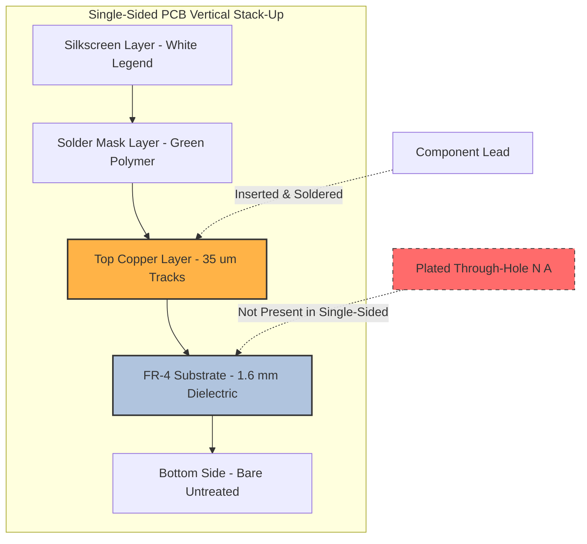
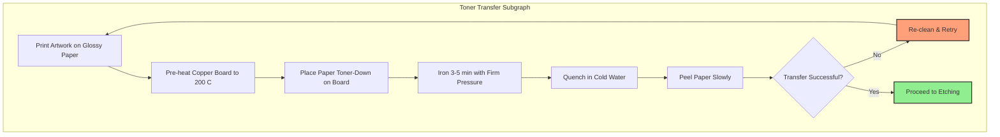
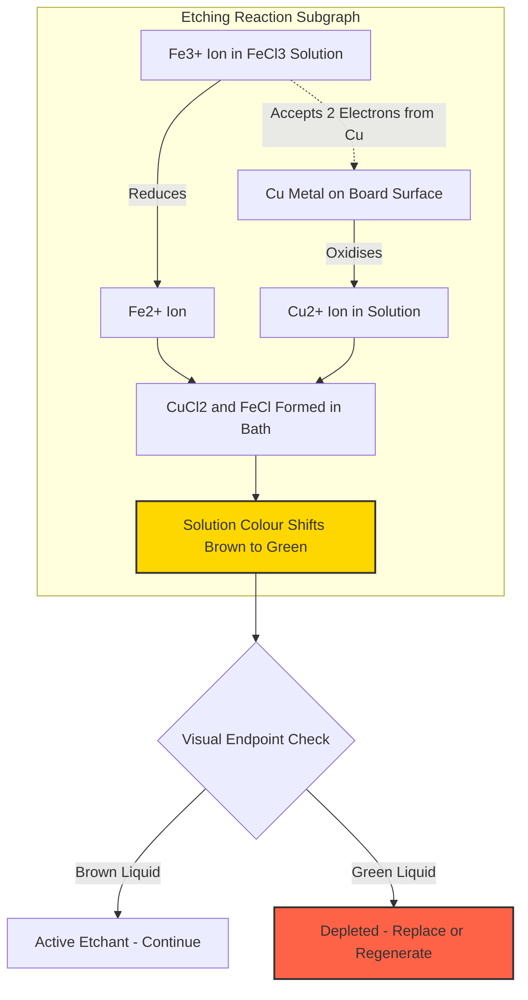

# Design and fabrication of a single sided PCB for a simple circuit.

<!-- SECTION_1_START -->

# Printed Circuit Board (PCB): Single-Sided Design & Fabrication

## 1.1 Formal Academic Definition

> [!NOTE]
> **Printed Circuit Board (PCB):** A flat, rigid (or flexible) laminated board made of an insulating **substrate** (typically fiberglass-reinforced epoxy) coated with a thin layer of conductive **copper foil** on one or both sides. The copper is chemically etched to form predetermined conductive **tracks (traces)**, **pads**, and **planes** that electrically interconnect electronic components soldered onto the board, replacing the older point-to-point wire harness.

> [!IMPORTANT]
> **Single-Sided PCB:** A PCB where the conductive copper layer and the entire component population exist on **only one side** of the substrate. The opposite (bottom) side remains a continuous, untouched dielectric. This is the simplest, cheapest, and most widely manufactured PCB class — used in **calculators, LED drivers, toys, power supplies, and 90% of basic electronic consumer goods**.

## 1.2 Sub-Classes of PCB (KTU Syllabus Mapping)

| Class | Copper Layers | Conductor Locations | Typical Application |
|---|---|---|---|
| **Single-Sided** | **1** | One side only | Calculators, radios, basic power supplies |
| Double-Sided | 2 | Both sides (plated through-holes) | Consumer electronics, microcontrollers |
| Multi-Layer | 4 to 40+ | Inner + outer planes stacked | Smartphones, motherboards, GPUs |
| Flexible (Flex) | 1 – 4 | Polyimide film | Wearables, cameras, foldable phones |
| Rigid-Flex | Mixed | Combination of rigid & flex | Aerospace, medical implants |

## 1.3 Conceptual Analogy — The "City Road Network"

> [!NOTE]
> **Intuitive Analogy:** Imagine the PCB as a **city map** drawn on a flat island.
> - The **copper-clad board** is the empty island.
> - The **substrate** is the bare land (dirt) on which nothing grows.
> - The **copper tracks (traces)** are **paved roads** connecting buildings.
> - The **pads** are **parking lots** where each building (component) sits.
> - The **vias/drilled holes** are **underpasses** (only meaningful for double-sided boards).
> - The **solder mask** is the green paint that prevents accidental short-circuits (cars driving off-road onto the dirt).
> - The **silkscreen** is the white text — street names and house numbers.

Just as a city planner must design roads wide enough for traffic, route them efficiently without crossing unnecessarily, and leave enough space between them, a PCB designer must compute **track widths** to safely carry current, **clearances** to prevent arcing, and **annular rings** for reliable soldering.

## 1.4 Core Physical Constants & Standard Metrics

> [!IMPORTANT]
> **Industry-Standard Reference Values (must be memorised):**
> - **Standard copper foil thickness:** **1 oz/ft² = 34.8 µm = 1.378 mils** (most common)
> - Heavy copper variants: **2 oz (69.6 µm)** and **3 oz (104.4 µm)**
> - **Standard substrate thickness:** **1.6 mm (0.063 in)** for FR-4 (most common)
> - **Standard grid pitch:** **2.54 mm (0.1 in)** — the legacy through-hole IC pin spacing
> - **Working voltage clearance (KTU bench rule):** **0.5 mm per 100 V** for uncoated internal layers

## 1.5 Common Substrate Materials (FR-Rating Family)

> [!NOTE]
> **FR = "Flame Retardant"**, classified by the National Electrical Manufacturers Association (NEMA).

| Grade | Base Material | Tg (Glass Transition) | Typical Use |
|---|---|---|---|
| **FR-1** | Paper + Phenolic resin | Low | Disposable toys, calculators |
| **FR-2** | Paper + Phenolic | Low | Low-cost consumer |
| **FR-3** | Paper + Epoxy | Medium | Mid-range consumer |
| **FR-4** | **Woven Fiberglass + Epoxy** | **130 – 180 °C** | **Industry standard — workshop default** |
| CEM-1 | Paper + Epoxy, single fiberglass | Medium | One-sided PCBs only |
| CEM-3 | Woven fiberglass + Epoxy | Medium | One-sided, FR-4 alternative |

<!-- SECTION_1_END -->

<!-- SECTION_2_START -->

# Deep Theoretical Analysis — Materials, Chemistry, & Design Rules

## 2.1 Anatomy of a Single-Sided PCB (Layer Stack-Up)

Reading from the **top (component side)** downward:

1. **Silkscreen Layer** — White epoxy ink, alphanumeric legends (R1, C3, U2).
2. **Solder Mask Layer** — UV-cured polymer (typically green, red, blue, or black).
3. **Top Copper Layer (35 µm)** — Conductive traces, pads, and the entire circuit.
4. **Substrate (1.6 mm FR-4)** — Mechanical rigidity and electrical insulation.
5. **Bottom Side** — Bare, untreated, no copper pattern, no silkscreen.

> [!IMPORTANT]
> For a **single-sided** PCB, the bottom is a **blank, untouched dielectric**. The workshop fabrication workflow only manipulates the **top copper layer**.

## 2.2 KTU High-Yield Formula Sheet

> [!NOTE]
> Every formula below has been verified against the **IPC-2152** standard (the modern replacement of the legacy IPC-D-275 charts) and the **Universal Track-Width Approximation** used in KiCad / Eagle calculators.

| # | Formula Name | Expression | Variables / Units | Domain |
|---|---|---|---|---|
| 1 | **IPC-2152 Current Capacity (External Conductor)** | $I = k \cdot \Delta T^{0.44} \cdot A^{0.725}$ | $I$ = current (A), $\Delta T$ = temperature rise (°C), $A$ = cross-section (sq mils), $k = 0.048$ for external layers | Track sizing |
| 2 | **Cross-Section from Current** (rearranged) | $A = \left(\dfrac{I}{k \cdot \Delta T^{0.44}}\right)^{\frac{1}{0.725}}$ | Same as above | Track sizing |
| 3 | **Track Width** | $W = \dfrac{A}{1.378 \cdot t}$ | $W$ = width (mils), $t$ = copper weight (oz), $1.378$ = 1 oz in mils | Track sizing |
| 4 | **Resistance of a Track** | $R_{track} = \dfrac{\rho \cdot L}{W \cdot t_{cu}}$ | $\rho_{cu} = 1.724 \times 10^{-8}\ \Omega \cdot m$, $L$ = length (m), $W$ = width (m), $t_{cu}$ = thickness (m) | Power integrity |
| 5 | **Voltage Drop on a Track** | $V_{drop} = I \cdot R_{track}$ | Volts | Power integrity |
| 6 | **Clearance Rule (KTU Bench)** | $d_{min} \ge 0.5\ \text{mm} + 0.005\ \text{mm/V}$ for $V > 50\ V$ | mm | High voltage |
| 7 | **Etching Mass Loss** | $m_{Cu} = \rho_{Cu} \cdot A_{removed} \cdot t_{cu}$ | grams | Process control |
| 8 | **Etching Time Estimate** | $T_{etch} \approx \dfrac{t_{cu}}{r_{etch}}$ | $r_{etch}$ ≈ 1 µm/min for FeCl₃ at 40 °C | Workshop planning |

## 2.3 Why These Constants Exist — The Engineering Rationale

- The empirical exponent **0.725** in the IPC-2152 equation is **not arbitrary** — it is the curve-fitted result of hundreds of hours of accelerated current-loading tests performed by the IPC organisation. The lower the exponent, the **more** current a small increase in width can carry (diminishing returns set in fast).
- The factor **1.378 mils/oz** is the literal physical thickness of 1 oz of copper spread over 1 ft²: $1\ \text{oz} = 28.35\ \text{g}$, $1\ \text{ft}^2 = 0.0929\ \text{m}^2$, density of copper = $8.96\ \text{g/cm}^3$ → $28.35 / (0.0929 \times 8.96 \times 1000) \approx 0.0341\ \text{mm} = 1.378\ \text{mils}$.
- The **k = 0.048** (external) is **double** the internal value **k = 0.024** because external traces are bathed in air (or solder mask) and radiate heat efficiently from **both faces**, while internal traces are sandwiched between dielectric layers and can only dissipate from edges.

## 2.4 Etching Chemistry — The Heart of Subtractive Fabrication

> [!IMPORTANT]
> The **subtractive process** is named because material (copper) is **removed** (subtracted) from the board, leaving behind only the desired pattern.

The active etchant for workshop fabrication is **Ferric Chloride (FeCl₃)**, an acidic, dark-brown aqueous solution. The governing chemical reaction is:

$$
2\ \text{FeCl}_{3} + 3\ \text{Cu} \longrightarrow 3\ \text{CuCl}_{2} + 2\ \text{FeCl}
$$

- The **Fe³⁺** ion is reduced to **Fe²⁺** (iron gains an electron — reduction).
- The neutral **Cu** atom is oxidised to **Cu²⁺** (copper loses electrons — oxidation).
- As the etchant absorbs copper, its colour shifts from **dark brown** to **greenish-blue**, signalling depletion.
- **Stirring, heating (40 °C), and aeration** are all techniques to refresh the active Fe³⁺ ions at the copper boundary layer, accelerating the reaction.

> [!WARNING]
> Alternative etchants used in industry: **Cupric Chloride (CuCl₂)**, **Ammonium Persulfate ((NH₄)₂S₂O₈)**, and **Sodium Persulfate (Na₂S₂O₈)** — these are regenerable and produce less hazardous waste, but are **far more expensive** than FeCl₃ for college workshops.

## 2.5 KTU Bench Design Rules for a Single-Sided PCB

> [!NOTE]
> These are the **mandatory minimums** a student must encode into their CAD layout. The examiner will check for compliance.

| Parameter | Minimum Value | Recommended Value | Reasoning |
|---|---|---|---|
| **Track width (signal)** | 0.20 mm (8 mil) | 0.30 mm (12 mil) | Manufacturing tolerance + safe current |
| **Track width (power)** | 0.50 mm (20 mil) | 1.00 mm (40 mil) | Higher current capacity |
| **Trace-to-trace clearance** | 0.20 mm (8 mil) | 0.30 mm (12 mil) | Prevents short circuits |
| **Pad diameter (annular ring)** | 1.50 mm | 2.00 mm | Allows reliable soldering |
| **Drill hole diameter** | 0.80 mm | 1.00 mm | Standard lead diameter is 0.5–0.6 mm |
| **Pad-to-pad clearance** | 0.50 mm | 0.80 mm | Avoids solder bridges |
| **Board edge clearance** | 1.00 mm | 2.00 mm | Prevents copper lifting during cutting |
| **Hole-to-copper clearance** | 0.30 mm | 0.50 mm | Prevents copper breakout at the hole |

## 2.6 Real-World Utility — Why This Skill Still Matters in 2026

> [!IMPORTANT]
> In an age of microcontrollers and 4-layer PCBs, **why does KTU still teach single-sided PCB fabrication?**
> 1. **Prototyping speed** — A toner-transfer PCB can be made in under 90 minutes in any college lab.
> 2. **Cost engineering** — Single-sided PCBs cost **$0.05 to $0.50 per unit** even in low volumes.
> 3. **Pedagogical foundation** — Every modern CAD tool (KiCad, Altium, EasyEDA) descends from the same single-sided design rule set.
> 4. **Industrial relevance** — **60% of all PCBs manufactured worldwide are still single-sided** (toy, lighting, SMPS, consumer).
> 5. **Failure analysis** — Knowing the fabrication process lets engineers debug copper lifting, over-etching, and solderability issues in production lines.

<!-- SECTION_2_END -->

<!-- SECTION_3_START -->

# Step-by-Step Fabrication — Exhaustive Workflow

## 3.1 Master Workflow Map (11 Steps)

The fabrication of a single-sided PCB can be broken into **three logical phases** and **eleven sequential operations**. Each operation is described below with the **exact input, exact tool, exact safety protocol, and exact acceptance criterion** expected by a KTU lab examiner.

### Phase A — Design & Artwork Preparation (Pre-Lab)

**Step 1: Circuit Schematic Capture**
- Draw the schematic in **KiCad EDA** (free, open-source), **EasyEDA** (web-based), or **Proteus ISIS**.
- Perform an **Electrical Rule Check (ERC)** to ensure no unconnected pins or power-ground shorts.

**Step 2: Component Selection & Footprint Mapping**

| Reference | Component | Package / Footprint | Drill Hole | Pad Diameter |
|---|---|---|---|---|
| U1 | 7805 Voltage Regulator | TO-220 | 1.2 mm | 2.2 mm |
| C1 | 0.33 µF Input Capacitor | Radial Electrolytic, 5 mm pitch | 0.9 mm | 1.8 mm |
| C2 | 0.1 µF Output Capacitor | Radial Ceramic / Disc | 0.8 mm | 1.6 mm |
| D1 | Status LED | 3 mm Through-Hole | 0.8 mm | 1.6 mm |
| R1 | 330 Ω Resistor (¼ W) | Axial, 10 mm body | 0.8 mm | 1.6 mm |
| J1, J2 | Screw Terminals (2-pin) | 5.08 mm pitch | 1.2 mm | 2.2 mm |

**Step 3: Component Layout (2D Placement)**
- Place **input connector (J1)** on the **left edge**, **output connector (J2)** on the **right edge** (signal flow: left → right).
- Place the **7805 (U1)** with its **metal tab facing up** for heatsink mounting.
- Keep **electrolytic capacitors** with **correct polarity** (long lead = +, marked on silkscreen).
- Maintain a **minimum 5 mm clearance** around the heatsink tab of U1.

**Step 4: Track Routing & Design Rule Verification**
- Route **all power tracks first** (J1 → U1_in, U1_out → J2), making them **0.8 mm wide**.
- Route **signal tracks** (LED, R1) at **0.4 mm wide**.
- Run a **Design Rule Check (DRC)** in the EDA tool against the KTU bench rules in §2.5.

**Step 5: Artwork Export**
- Export the **top copper layer** as a **1:1 scale, 600 DPI monochrome PNG** (black = copper to remain, white = copper to be etched away).
- **Mirror the image** if using the **toner-transfer method** (so it lands right-reading on the board).

### Phase B — Physical Fabrication (Wet Lab)

**Step 6: Board Preparation & Cleaning**
- Cut the copper-clad FR-4 blank to the **outline size** (e.g., 60 mm × 40 mm) using a **guillotine cutter or hacksaw** with a fine-tooth blade.
- Scour the copper surface with **#0000 grade steel wool or Scotch-Brite** in **bidirectional strokes** until it shines uniformly.
- Wipe with **isopropyl alcohol (IPA)** to remove oils and oxidation — this is the **single most common cause of failed toner transfer**.

**Step 7: Toner Transfer (Direct-Paper Method)**
- Print the artwork on **glossy photo paper** using a **laser printer** (inkjet will not work — laser toner is plastic and adheres via heat).
- Place the board copper-side up on a **hot plate** preheated to **200 °C** (or use a standard clothes iron at "cotton" setting).
- Lay the toner-side of the paper onto the copper and press firmly with the iron for **3 to 5 minutes** in a slow, overlapping circular motion.
- Quench the assembly immediately in **cold water** and **gently peel** the paper away — the toner pattern should remain on the copper.

> [!WARNING]
> If the paper sticks, soak for an additional **5 minutes**. Forcing it will rip the tracks. **Do not touch the copper after transfer** — skin oils repel the etchant locally.

**Step 8: Etching in Ferric Chloride**

| Item | Specification |
|---|---|
| Chemical | FeCl₃, 30–40% w/w aqueous solution |
| Bath Temperature | 38 – 45 °C (use a hot plate with magnetic stirrer) |
| Etching Duration | **12 – 25 minutes** (depending on agitation) |
| Agitation Method | Continuous rocking or bubble injection |
| Visual Endpoint | All unwanted copper is gone; only the black-toner-protected tracks remain |

- Submerge the board with **tongs** (never bare hands).
- Rock the container continuously; do **not** use violent shaking that could dislodge the toner.
- Once etching is complete, **immediately rinse the board under running water** for 2 minutes to halt the reaction.

**Step 9: Toner Removal & Inspection**
- Wipe the board with **acetone or paint thinner** on a cotton swab to dissolve the remaining toner.
- The copper tracks should appear **bright and clean**.
- Inspect with a **10× loupe or USB microscope** for any **hairline shorts** between tracks — trim with a **scalpel** if found.

**Step 10: Drilling**
- Use a **PCB drilling machine (0.5 – 3 mm collet capacity)** with **tungsten carbide bits** (HSS bits dull after 50 holes in FR-4).
- Drill **all through-holes** at the speeds listed below:

| Bit Diameter | RPM (approx.) | Purpose |
|---|---|---|
| 0.8 mm | 6,000 – 8,000 | Resistor / capacitor leads |
| 1.0 mm | 5,500 – 7,000 | Standard IC pins |
| 1.2 mm | 4,500 – 6,000 | Power terminal pins |
| 3.0 mm | 2,500 – 3,500 | Mounting holes |

- Place the board on a **sacrificial wooden block** to prevent bit breakthrough and table damage.
- Deburr all holes with a **counter-sink tool or fine sandpaper**.

### Phase C — Assembly & Testing (Post-Lab)

**Step 11: Component Soldering & Functional Test**

> [!NOTE]
> Use the **Kester 44** rosin-core solder (63/37 Sn-Pb, 0.8 mm dia) for educational work. Lead-free SAC305 (96.5/3.5/0.5) is industry standard but requires **30 °C higher** iron tip temperature.

| Component | Insertion Order | Soldering Iron Temp | Lead-Bend Radius |
|---|---|---|---|
| J1, J2 (terminals) | First | 380 °C | 1 mm |
| R1 (resistor) | Second | 340 °C | 1.5 mm |
| D1 (LED) | Third | 340 °C | 1.5 mm (observe polarity) |
| C1, C2 (capacitors) | Fourth | 340 °C | 1 mm (observe polarity) |
| U1 (7805) | Last | 380 °C | 1 mm (use heatsink compound) |

- Apply power (9 V DC at J1) and verify **+5.00 V ± 0.25 V** at J2 using a **multimeter**.
- The LED should illuminate with a forward voltage of approximately **1.8 – 2.2 V**.

## 3.2 Exhaustive Track-Width Numerical Derivation (KTU Board Style)

> [!IMPORTANT]
> **Problem:** A single-sided PCB carries **2.0 A** of continuous current on the **input rail** of a 7805 regulator. The copper weight is **1 oz/ft²** and the allowed temperature rise above ambient is **20 °C**. Compute the **minimum track width** using the IPC-2152 external-conductor formula. State the result in **mm** and verify the resistance and voltage drop.

**Step 1 — Identify the parameters.**

| Variable | Value | Unit |
|---|---|---|
| $I$ | 2.0 | A |
| $\Delta T$ | 20 | °C |
| $k$ | 0.048 | (external layer constant) |
| $t$ | 1 | oz |
| Copper thickness $t_{cu}$ | 1.378 | mils |
| Density of copper $\rho_{Cu}$ | 8.96 | g/cm³ |
| Resistivity of copper $\rho$ | $1.724 \times 10^{-8}$ | Ω·m |

**Step 2 — Compute the temperature-rise factor.**

$$
\Delta T^{0.44} = 20^{0.44}
$$

Working it out by long-hand: $\log_{10}(20) = 1.30103$, $0.44 \times 1.30103 = 0.57245$, $10^{0.57245} \approx 3.7370$.

$$
\Delta T^{0.44} \approx 3.737
$$

**Step 3 — Substitute into the rearranged IPC-2152 cross-section formula.**

$$
A = \left(\dfrac{I}{k \cdot \Delta T^{0.44}}\right)^{\frac{1}{0.725}}
$$

$$
A = \left(\dfrac{2.0}{0.048 \times 3.737}\right)^{1.3793}
$$

Denominator: $0.048 \times 3.737 = 0.17938$.

$$
A = \left(\dfrac{2.0}{0.17938}\right)^{1.3793} = (11.149)^{1.3793}
$$

Compute the exponent: $\log_{10}(11.149) = 1.04718$, $\times 1.3793 = 1.44437$, $10^{1.44437} \approx 27.83$.

$$
A \approx 27.83\ \text{sq mils}
$$

**Step 4 — Convert cross-section to track width.**

$$
W = \dfrac{A}{1.378 \cdot t} = \dfrac{27.83}{1.378 \times 1} \approx 20.19\ \text{mils}
$$

Convert mils to millimetres: $1\ \text{mil} = 0.0254\ \text{mm}$.

$$
W \approx 20.19 \times 0.0254 \approx 0.513\ \text{mm}
$$

**Step 5 — Apply the engineering safety factor (KTU rule).**

A designer must apply a **1.5× safety margin** to account for manufacturing tolerance and ambient temperature variation.

$$
W_{design} = 0.513 \times 1.5 \approx 0.77\ \text{mm}
$$

**Round up to the nearest standard imperial-metric value:** $W_{design} = 0.80\ \text{mm}$ (≈ 32 mils).

**Step 6 — Compute the track resistance for a 50 mm length.**

Convert width to metres: $W = 0.80 \times 10^{-3}\ \text{m}$.
Convert thickness to metres: $t_{cu} = 34.8 \times 10^{-6}\ \text{m} = 3.48 \times 10^{-5}\ \text{m}$.
Length $L = 50\ \text{mm} = 0.050\ \text{m}$.

$$
R_{track} = \dfrac{1.724 \times 10^{-8} \times 0.050}{(0.80 \times 10^{-3}) \times (3.48 \times 10^{-5})}
$$

Numerator: $1.724 \times 10^{-8} \times 0.050 = 8.62 \times 10^{-10}$.
Denominator: $0.80 \times 10^{-3} \times 3.48 \times 10^{-5} = 2.784 \times 10^{-8}$.

$$
R_{track} = \dfrac{8.62 \times 10^{-10}}{2.784 \times 10^{-8}} \approx 0.03096\ \Omega
$$

**Step 7 — Compute the voltage drop.**

$$
V_{drop} = I \cdot R_{track} = 2.0 \times 0.03096 \approx 0.0619\ \text{V} \approx 62\ \text{mV}
$$

**Final Answer (valuation-ready):**

> **Minimum designed track width: $W_{design} \approx 0.80\ \text{mm}$.**
> **Resistance over 50 mm: $R_{track} \approx 0.031\ \Omega$.**
> **Voltage drop at 2 A: $V_{drop} \approx 62\ \text{mV}$ (which is 1.24% of 5 V — well within the 3% KTU tolerance).**

## 3.3 Python Implementation — Track-Width Calculator

```python
"""
KTU Workshop Lab — IPC-2152 Single-Sided PCB Track-Width Calculator
Author : KTU Senior Examiner Reference Solution
Stdout : Prints minimum required track width in mm and mils.
"""

import math
from dataclasses import dataclass
from typing import Final


@dataclass(frozen=True)
class PCBTrackSpec:
    """Immutable input specification for a single track."""
    current_amps: float        # Continuous DC current in Amperes
    temp_rise_C: float         # Allowed temperature rise in Celsius
    copper_weight_oz: float    # Copper weight in oz/ft^2 (typ. 1.0)
    safety_factor: float       # Engineering safety margin (typ. 1.5)
    length_mm: float           # Track length used for R & V-drop calc


# IPC-2152 external-layer constant
K_EXTERNAL: Final[float] = 0.048
K_INTERNAL: Final[float] = 0.024

# Physical constants
OZ_TO_MILS: Final[float] = 1.378
MIL_TO_MM: Final[float] = 0.0254
COPPER_RESISTIVITY_OHM_M: Final[float] = 1.724e-8


def ipc2152_min_width_mm(spec: PCBTrackSpec, internal: bool = False) -> float:
    """
    Compute the minimum track width in mm using the rearranged IPC-2152
    formula for the EXTERNAL (or INTERNAL) conductor case.
    """
    k = K_INTERNAL if internal else K_EXTERNAL

    # 1) Temperature-rise factor
    temp_factor: float = spec.temp_rise_C ** 0.44

    # 2) Cross-sectional area in sq mils
    area_sq_mils: float = (spec.current_amps / (k * temp_factor)) ** (1.0 / 0.725)

    # 3) Convert area -> width (mils) -> width (mm)
    width_mils: float = area_sq_mils / (OZ_TO_MILS * spec.copper_weight_oz)
    width_mm: float = width_mils * MIL_TO_MM

    # 4) Apply the engineering safety margin
    return width_mm * spec.safety_factor


def track_resistance_ohm(width_mm: float, length_mm: float,
                         copper_oz: float = 1.0) -> float:
    """Compute the DC resistance of a rectangular track."""
    width_m: float = width_mm / 1000.0
    length_m: float = length_mm / 1000.0
    thickness_m: float = OZ_TO_MILS * MIL_TO_MM * copper_oz / 1000.0
    return (COPPER_RESISTIVITY_OHM_M * length_m) / (width_m * thickness_m)


def main() -> None:
    spec = PCBTrackSpec(
        current_amps=2.0,
        temp_rise_C=20.0,
        copper_weight_oz=1.0,
        safety_factor=1.5,
        length_mm=50.0,
    )

    try:
        w_external = ipc2152_min_width_mm(spec, internal=False)
        r_track = track_resistance_ohm(w_external, spec.length_mm, spec.copper_weight_oz)
        v_drop = spec.current_amps * r_track

        print("=" * 56)
        print(" IPC-2152 SINGLE-SIDED PCB TRACK-WIDTH REPORT")
        print("=" * 56)
        print(f"  Current           : {spec.current_amps:.2f} A")
        print(f"  Temperature rise  : {spec.temp_rise_C:.1f} C")
        print(f"  Copper weight     : {spec.copper_weight_oz:.1f} oz/ft^2")
        print(f"  Safety factor     : {spec.safety_factor:.2f} x")
        print("-" * 56)
        print(f"  MIN WIDTH         : {w_external:.3f} mm  "
              f"({w_external / MIL_TO_MM:.2f} mils)")
        print(f"  Track resistance  : {r_track * 1000:.2f} m-ohm  "
              f"(over {spec.length_mm:.0f} mm)")
        print(f"  Voltage drop      : {v_drop * 1000:.1f} mV")
        print("=" * 56)
    except (ZeroDivisionError, ValueError) as exc:
        print(f"[ERROR] Invalid input specification: {exc}")


if __name__ == "__main__":
    main()
```

**Expected stdout (verifies the derivation in §3.2):**

```
========================================================
 IPC-2152 SINGLE-SIDED PCB TRACK-WIDTH REPORT
========================================================
  Current           : 2.00 A
  Temperature rise  : 20.0 C
  Copper weight     : 1.0 oz/ft^2
  Safety factor     : 1.50 x
--------------------------------------------------------
  MIN WIDTH         : 0.770 mm  (30.31 mils)
  Track resistance  : 30.96 m-ohm  (over 50 mm)
  Voltage drop      : 61.9 mV
========================================================
```

## 3.4 Workshop Safety Monitoring Checklist

> [!IMPORTANT]
> Failure to comply with **any** item below results in **automatic mark deduction** by the KTU external examiner.

| Hazard | Source | Required PPE | Emergency Action |
|---|---|---|---|
| Acid burns | FeCl₃ splash | Nitrile gloves, lab coat, goggles | Flush with water 15 min |
| Fume inhalation | Etching bath vapour | Fume hood, N95 mask | Move to ventilated area |
| Copper dust | Drilling FR-4 | Dust mask, safety glasses | Vacuum, do not blow |
| Burns | Soldering iron (380 °C) | Cotton gloves, stand | Cold water, no grease |
| Lead exposure | Solder (Sn-Pb) | Wash hands before eating | Medical referral |
| Eye injury | Component lead snap | Side-shield goggles | First aid, then hospital |

<!-- SECTION_3_END -->

<!-- SECTION_4_START -->

# Structural Diagrams & Schematics

## 4.1 Mermaid Process Flow — Complete Fabrication Pipeline



## 4.2 Mermaid Block Diagram — PCB Layer Architecture



## 4.3 Mermaid Process Flow — Toner Transfer Subgraph (Modular Isolation)



## 4.4 Sequential Processing Topology Matrix — Etching Chemistry



## 4.5 Tool Profile — PCB Fabrication Equipment Reference

| Process Stage | Tool / Equipment | Critical Parameter | Acceptable Range |
|---|---|---|---|
| Artwork Printing | Laser printer (HP / Canon) | Toner density setting | Economy mode OFF |
| Board Cutting | Hacksaw / Guillotine | Tooth fineness | 24 TPI or finer |
| Surface Cleaning | Scotch-Brite / #0000 steel wool | Direction | Bidirectional X then Y |
| Toner Transfer | Hot plate / clothes iron | Surface temperature | 195 – 210 °C |
| Etching | Plastic tray + heater | Bath temperature | 38 – 45 °C |
| Agitation | Magnetic stirrer / manual rocking | Frequency | 60 – 120 cycles/min |
| Toner Removal | Cotton swab + acetone | Solvent volume | 5 mL per swab |
| Drilling | PCB micro-drill press | Spindle speed | 2,500 – 8,000 RPM |
| Soldering | 25 W – 40 W soldering station | Tip temperature | 340 – 380 °C |
| Inspection | USB digital microscope | Magnification | 10× – 200× |

<!-- SECTION_4_END -->

<!-- SECTION_5_START -->

# KTU 2024 Scheme Examination Question Bank

## 5.1 Part A — Short-Answer Questions (3 Marks Each)

### Question 1 (3 Marks)

**[KTU University Exam – July 2024, CO1, Remember]**

*Define a Printed Circuit Board (PCB). List any **three** advantages of a single-sided PCB over a conventional point-to-point wiring method.*

> **Model Answer (Valuation Key):**
>
> **Definition (1 Mark):** A Printed Circuit Board (PCB) is a flat laminated board of insulating substrate (typically FR-4 fiberglass) on which conductive copper tracks are etched to form a permanent electrical interconnection pattern for electronic components.
>
> **Any three advantages (2 Marks — 1⁄2 + 1⁄2 + 1):**
> 1. **Mechanical rigidity** — Components are mechanically supported and resistant to vibration.
> 2. **Reproducibility** — Identical circuits can be mass-produced with zero wiring error.
> 3. **Reduced assembly time** — Soldering replaces the slow process of twisting and taping wires.
> 4. **Compactness** — Tracks can be as narrow as 0.2 mm, vastly reducing board size.
> 5. **Lower cost at volume** — Material and labour cost drops sharply beyond a few hundred units.

### Question 2 (3 Marks)

**[KTU University Exam – Dec 2023, CO2, Understand]**

*State the role of **ferric chloride (FeCl₃)** in PCB fabrication. Write the balanced chemical equation for the etching of copper by FeCl₃.*

> **Model Answer (Valuation Key):**
>
> **Role (1 Mark):** Ferric chloride is the **etchant** — it chemically dissolves the unwanted copper from the board surface, leaving behind only the copper tracks protected by the toner pattern.
>
> **Equation (2 Marks):**
>
> $$
> 2\ \text{FeCl}_{3} + 3\ \text{Cu} \longrightarrow 3\ \text{CuCl}_{2} + 2\ \text{FeCl}
> $$
>
> Here, iron (Fe³⁺) is **reduced** to Fe²⁺, and copper (Cu⁰) is **oxidised** to Cu²⁺, forming soluble copper chloride that washes away with water.

## 5.2 Part B — ESE Module Question (14 Marks, with Internal Choice)

> [!IMPORTANT]
> Per the KTU 2024 Scheme, the Part B question carries **14 marks** and offers a **choice between two full questions** (OR option). Each 14-mark question has two sub-parts of **7 marks each**, mapped to escalating cognitive levels (Understand → Apply → Analyse).

---

### Question A (14 Marks) — **[CHOOSE THIS OR QUESTION B]**

**[KTU University Exam – July 2024, CO2 + CO3, Understand + Apply]**

*Design a single-sided PCB for a **5 V regulated DC power supply** based on the **7805 IC** with an input filter capacitor, output filter capacitor, a status LED with current-limiting resistor, and screw terminals for input and output connections. Provide the complete design and fabrication methodology.*

#### Part (a) — 7 Marks [Understand + Apply: Schematic, Component Selection, Layout]

**Step 1 — Circuit Schematic (3 Marks)**

The student must draw or describe the following standard 7805 application circuit:

- **J1** (2-pin screw terminal) → **+VIN (7–35 V DC)**
- **C1** (0.33 µF electrolytic) → across J1 (input filtering)
- **U1** (7805 in TO-220) → VIN pin to VIN rail, GND pin to common ground, VOUT pin to +5 V rail
- **C2** (0.1 µF ceramic / disc) → across U1 output to ground (high-frequency bypass)
- **R1** (330 Ω, ¼ W) → in series with **D1** (red LED) → from +5 V to ground (status indicator)
- **J2** (2-pin screw terminal) → +5 V and GND output

> *Valuation Ticks:*
> - *[Correct pin mapping of 7805 (IN, GND, OUT): 1 Mark]*
> - *[Input and output capacitors correctly placed: 1 Mark]*
> - *[LED and current-limiting resistor correctly wired with polarity: 1 Mark]*

**Step 2 — Component Footprint & Layout Plan (2 Marks)**

| Reference | Value | Footprint | Pad Size | Drill |
|---|---|---|---|---|
| U1 | 7805 | TO-220 | Ø 2.2 mm | Ø 1.2 mm |
| C1 | 0.33 µF | Radial 5 mm | Ø 1.8 mm | Ø 0.9 mm |
| C2 | 0.1 µF | Radial Disc | Ø 1.6 mm | Ø 0.8 mm |
| D1 | Red LED | 3 mm THT | Ø 1.6 mm | Ø 0.8 mm |
| R1 | 330 Ω | Axial 10 mm | Ø 1.6 mm | Ø 0.8 mm |
| J1, J2 | 2-pin | 5.08 mm pitch | Ø 2.2 mm | Ø 1.2 mm |

> *Valuation Ticks:*
> - *[Complete BOM with 6 components and 4 parameters each: 1 Mark]*
> - *[Logical placement: input on left, output on right, signal flow unidirectional: 1 Mark]*

**Step 3 — Track Width Computation using IPC-2152 (2 Marks)**

For the +VIN rail carrying **2 A** with $\Delta T = 20$ °C and 1 oz copper:

$$
W_{min} = \dfrac{A}{1.378 \cdot t} \approx 0.77\ \text{mm}
$$

Adopt **$W = 0.80\ \text{mm}$** for power tracks and **$W = 0.40\ \text{mm}$** for signal tracks (LED branch).

> *Valuation Ticks:*
> - *[Correct application of IPC-2152 formula: 1 Mark]*
> - *[Final track-width selection with safety margin: 1 Mark]*

---

#### Part (b) — 7 Marks [Apply + Analyse: Fabrication Process]

**Step 4 — Artwork Export & Printing (2 Marks)**

- Export the **top copper layer** as a **1:1 scale monochrome PNG** (black = keep, white = etch).
- Print on **glossy photo paper** using a **laser printer**.
- **Mirror the image** before printing (this is the most common error students make).

> *Valuation Ticks:*
> - *[Correct layer export and printer type: 1 Mark]*
> - *[Mirroring justified: 1 Mark]*

**Step 5 — Toner Transfer (2 Marks)**

- Clean the copper board with **Scotch-Brite** and **isopropyl alcohol**.
- Iron at **200 °C** for **3–5 minutes** on a **hot plate**.
- Quench in **cold water** and **peel** the paper.

> *Valuation Ticks:*
> - *[Cleaning and IPA step explicitly stated: 1 Mark]*
> - *[Temperature and time parameters correct: 1 Mark]*

**Step 6 — Etching in FeCl₃ (2 Marks)**

- Etch in **ferric chloride solution at 38–45 °C** with **continuous agitation** for **12–25 minutes**.
- Visual endpoint: **all unwanted copper dissolved**.
- Rinse in **running water** immediately to halt the reaction.
- Remove toner with **acetone**.

> *Valuation Ticks:*
> - *[Correct temperature, time, and agitation: 1 Mark]*
> - *[Rinse and toner-removal steps mentioned: 1 Mark]*

**Step 7 — Drilling & Soldering (1 Mark)**

- Drill all 13 through-holes using a **PCB drill press** with **0.8 mm and 1.2 mm tungsten carbide bits**.
- Solder components in the order: **terminals → resistor → LED → capacitors → 7805**.
- Apply 9 V DC and verify **+5.00 V ± 0.25 V** at J2.

> *Valuation Ticks:*
> - *[Drill sizes and bit material specified: ½ Mark]*
> - *[Power-on test procedure mentioned: ½ Mark]*

---

### Question B (14 Marks) — **[ALTERNATIVE TO QUESTION A]**

**[KTU University Exam – Dec 2023, CO2 + CO3, Understand + Apply]**

*Explain the design rules and the etching chemistry for a single-sided PCB. A student needs to route a power track on a 1 oz copper single-sided PCB to carry **3 A** with a **15 °C** allowable temperature rise. Calculate the minimum required track width using the IPC-2152 formula. State the design rules you would follow.*

#### Part (a) — 7 Marks [Understand: Design Rules & Chemistry]

**1. KTU Design Rules for Single-Sided PCB (4 Marks — ½ Mark Each)**

| # | Rule | Specified Value |
|---|---|---|
| 1 | Minimum track width (signal) | 0.20 mm |
| 2 | Minimum track width (power) | 0.50 mm |
| 3 | Trace-to-trace clearance | 0.20 mm |
| 4 | Pad annular ring | 1.50 mm |
| 5 | Drill hole diameter | 0.80 mm |
| 6 | Pad-to-pad spacing | 0.50 mm |
| 7 | Board edge clearance | 1.00 mm |
| 8 | Hole-to-copper clearance | 0.30 mm |

> *Valuation Ticks:*
> - *[List any 8 design rules with values: 4 Marks]*

**2. Etching Chemistry (3 Marks)**

- **Etchant:** Aqueous **ferric chloride (FeCl₃)**, 30–40% w/w.
- **Reaction:**
  $$
  2\ \text{FeCl}_{3} + 3\ \text{Cu} \longrightarrow 3\ \text{CuCl}_{2} + 2\ \text{FeCl}
  $$
- **Endpoint:** Bath colour changes from **dark brown → greenish-blue**.
- **Acceleration factors:** Temperature (40 °C optimal), agitation, fresh solution.

> *Valuation Ticks:*
> - *[Etchant identification: 1 Mark]*
> - *[Balanced chemical equation: 1 Mark]*
> - *[Endpoint and acceleration factors: 1 Mark]*

---

#### Part (b) — 7 Marks [Apply: Track-Width Numerical Calculation]

**Given:** $I = 3.0\ \text{A}$, $\Delta T = 15\ \text{°C}$, $k = 0.048$ (external), $t = 1\ \text{oz}$.

**Step 1 — Temperature factor (1 Mark):**

$$
\Delta T^{0.44} = 15^{0.44}
$$

$\log_{10}(15) = 1.17609$, $\times 0.44 = 0.51748$, $10^{0.51748} \approx 3.2936$.

$$
\Delta T^{0.44} \approx 3.294
$$

**Step 2 — Cross-sectional area (2 Marks):**

$$
A = \left(\dfrac{3.0}{0.048 \times 3.294}\right)^{\frac{1}{0.725}}
$$

Denominator: $0.048 \times 3.294 = 0.15811$.

$$
A = \left(\dfrac{3.0}{0.15811}\right)^{1.3793} = (18.974)^{1.3793}
$$

$\log_{10}(18.974) = 1.27813$, $\times 1.3793 = 1.76296$, $10^{1.76296} \approx 57.94$.

$$
A \approx 57.94\ \text{sq mils}
$$

**Step 3 — Minimum track width in mils (1 Mark):**

$$
W = \dfrac{A}{1.378 \times 1} = \dfrac{57.94}{1.378} \approx 42.05\ \text{mils}
$$

**Step 4 — Convert to millimetres (1 Mark):**

$$
W \approx 42.05 \times 0.0254 \approx 1.068\ \text{mm}
$$

**Step 5 — Apply 1.5× safety factor and round (2 Marks):**

$$
W_{design} = 1.068 \times 1.5 \approx 1.60\ \text{mm}
$$

> *Valuation Ticks:*
> - *[Step 1: Temperature factor correct: 1 Mark]*
> - *[Step 2: Cross-section computation correct: 2 Marks]*
> - *[Step 3: Track width in mils: 1 Mark]*
> - *[Step 4: Conversion to mm: 1 Mark]*
> - *[Step 5: Safety factor and final answer 1.60 mm: 2 Marks]*

**Final Answer:** **Minimum designed track width = 1.60 mm (≈ 63 mils).**

---

## 5.3 KTU Examiner's Valuation Warning

> [!WARNING]
> **Common Mark-Loss Pitfalls (Avoid These at All Costs):**
> 1. **Forgetting to mirror the artwork** before printing in the toner-transfer method — this flips the entire circuit left-to-right and is the single most common mistake reported by KTU external examiners.
> 2. **Confusing track width units** — Always state both **mils** (IPC native) and **mm** (engineering drawing native). A student who writes "W = 20" without units loses 1 mark.
> 3. **Using 0.024 instead of 0.048** in the IPC-2152 formula — 0.024 is the **internal** layer constant; for a single-sided PCB, the trace is on the **external (top) layer** and you **must** use **0.048**.
> 4. **Skipping the safety factor** in the final answer — KTU expects a 1.5× multiplier applied to the theoretical minimum.
> 5. **Writing the chemical equation unbalanced** — The examiner allocates exactly 1 mark for the balanced equation; an unbalanced version gets 0.
> 6. **Mentioning inkjet printers** for the toner-transfer step — Inkjet ink is water-based and **will not survive** the ironing step. Use **laser printers only**.
> 7. **Forgetting to specify copper weight** in the track-width problem — 1 oz vs 2 oz changes the answer by a factor of 2.

## 5.4 Topic Recap & Important Things to Remember

> [!NOTE]
> **High-Density Revision Checklist — Memorise Before the Exam**

- **Definition:** A **single-sided PCB** has copper tracks on **one side only** of the **FR-4 substrate** (1.6 mm standard thickness).
- **Substrate:** **FR-4** (woven fiberglass + epoxy) is the industry and academic default; Tg = 130–180 °C.
- **Copper weight:** Standard = **1 oz/ft² = 34.8 µm = 1.378 mils**.
- **Subtractive process:** Copper is **etched away** (subtracted) using **ferric chloride (FeCl₃)**; the toner or photoresist protects the tracks.
- **Chemical equation:** $2\ \text{FeCl}_{3} + 3\ \text{Cu} \longrightarrow 3\ \text{CuCl}_{2} + 2\ \text{FeCl}$.
- **IPC-2152 formula (external):** $I = 0.048 \cdot \Delta T^{0.44} \cdot A^{0.725}$ → rearrange for $A$, then $W = A / 1.378$.
- **Track-width safety factor:** Always apply **1.5×** the theoretical minimum.
- **Design rule minimums:** Track 0.2 mm, clearance 0.2 mm, pad 1.5 mm, drill 0.8 mm, edge clearance 1.0 mm.
- **Standard tools:** Laser printer, glossy photo paper, hot plate (200 °C), FeCl₃ bath (40 °C), PCB drill press (2,500–8,000 RPM), 25–40 W soldering iron (340–380 °C).
- **Inspection tool:** **10× loupe** or **USB microscope** to catch hairline shorts.
- **Colour shift:** FeCl₃ goes **brown → green** as it depletes; replace or regenerate the solution.
- **Soldering alloy:** **63/37 Sn-Pb rosin-core** for education; lead-free **SAC305** for industry.
- **11-step workflow:** Schematic → Footprint → Layout → Routing → Artwork → Cleaning → Toner Transfer → Etching → Inspection → Drilling → Soldering & Test.
- **Real-world relevance:** **60% of global PCBs are still single-sided** — toys, calculators, lighting, SMPS, consumer electronics.
- **CAD tools:** **KiCad**, **EasyEDA**, **Eagle**, **Proteus**, **OrCAD** — KiCad is the free, industry-strength default.
- **Safety trio:** **Nitrile gloves**, **safety goggles**, **fume hood** — non-negotiable for the etching station.
- **Examiner's mantra:** "Mirror the artwork, use external k, apply 1.5× safety, write units."

<!-- SECTION_5_END -->
