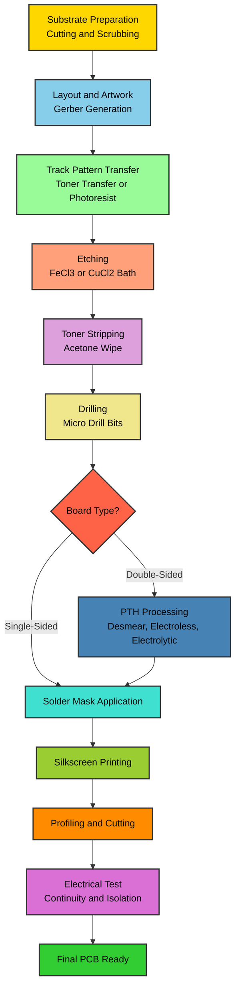
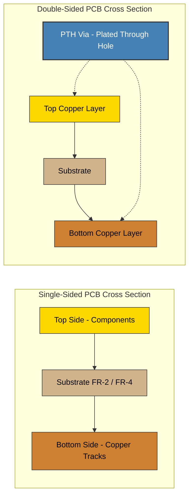
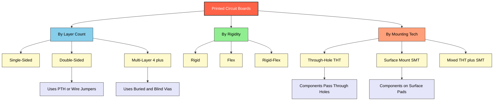
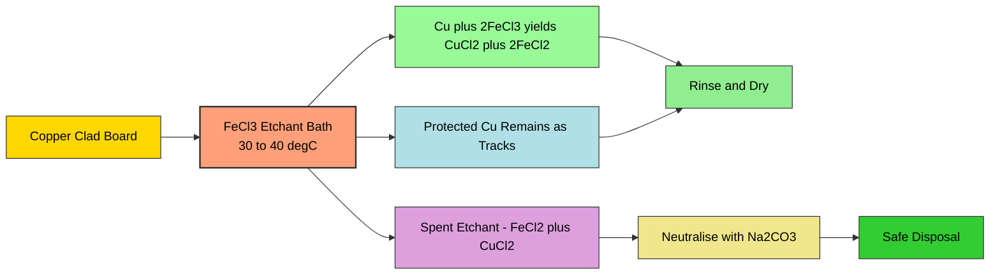

# Printed circuit boards (PCB) - Types, Single sided, Double sided, PTH, Processing methods.

<!-- SECTION_1_START -->
# Printed Circuit Boards (PCB) — Core Foundations

## 1.1 Formal Academic Definition (KTU 2024 Terminology)

> [!NOTE]
> **Printed Circuit Board (PCB):** A *mechanically supportive and electrically interconnective* platform fabricated by selectively etching conductive copper tracks from a copper-clad dielectric (insulating) substrate. It serves as the *physical backbone* upon which electronic components are mounted and electrically coupled, replacing the older, error-prone *point-to-point wiring* methodology.

A PCB is the **fundamental building block** of nearly every modern electronic device — from a digital wristwatch to a satellite control system. In the KTU 2024 Scheme Workshop context, a PCB is treated as a *manufactured artifact* that a student must design, fabricate, test, and troubleshoot.

**Key vocabulary (KTU board terminology):**

| Term | Meaning |
|---|---|
| **Substrate** | The base insulating material (typically **FR-2**, **FR-4**, or **CEM-1**) |
| **Conductor Layer** | Thin copper foil (commonly **1 oz/ft²** ≈ **35 µm**) laminated on substrate |
| **Track / Trace** | A designed copper pathway carrying current between components |
| **Pad** | A copper area surrounding a component lead or via |
| **Via** | A plated hole that carries a signal from one layer to another |
| **Solder Mask** | The green (or other colour) polymer coating protecting copper |
| **Silkscreen** | White legend layer printing component references (R1, C3, U2) |
| **Annular Ring** | The ring of copper surrounding a drilled hole |

---

## 1.2 The Intuitive Analogy — Why Do We Need PCBs?

> [!IMPORTANT]
> **Analogy: PCB = Road Network of a City**
>
> Imagine a city before proper roads existed. People travelled through *dirt paths* (wires), often crossing each other in chaotic ways — short circuits, loose connections, and frequent failures. A PCB is like the *planned road network* of that city:
> - **Copper tracks** are the *paved roads* of controlled width
> - **Vias** are the *flyovers* that let one road pass over another without collision
> - **Solder mask** is the *lane marking* — telling components exactly where to sit
> - **Silkscreen** is the *street sign* — labelling each building (component) clearly
> - **The substrate** is the *land/earth* that holds everything together

Without a PCB, an electronic circuit is *fragile, error-prone, and unscalable*. The PCB transforms a *logical schematic* into a *physical, repeatable, mass-producible artefact*.

> [!TIP]
> **Why FR-4 is dominant in industry:** FR-4 (Flame Retardant, woven glass + epoxy) is the *industry default* substrate because it offers an excellent balance of **mechanical strength**, **thermal stability up to 130–140 °C**, **low dielectric loss**, and **low cost**. FR-2 (paper-phenolic) is the cheaper cousin used in *disposable electronics* (toys, calculators).

---

## 1.3 Physical Constants & Standard Metrics

> [!NOTE]
> **Key industry-standard PCB metrics (memorise these):**
> - **Standard copper thickness:** 1 oz/ft² ≈ **35 µm** (also stocked as 0.5 oz ≈ **17 µm** and 2 oz ≈ **70 µm**)
> - **Standard substrate thickness:** **1.6 mm** (consumer), **0.8 mm** (compact), **2.4 mm** (heavy-duty)
> - **Minimum track width (hand-fabrication):** **0.5 mm** (≈ 20 mil)
> - **Minimum track width (industrial):** **0.1 mm** (≈ 4 mil)
> - **Standard drill sizes:** 0.6 mm, 0.8 mm, 1.0 mm, 1.2 mm, 1.6 mm
> - **Operating temperature (FR-4):** **−40 °C to +130 °C**
> - **Dielectric constant (FR-4, 1 MHz):** **4.2 – 4.6**

> [!VISUALIZATION CONTROL]
> **Concept:** Cross-section of a Single-Sided vs. Double-Sided PCB
> **GeoGebra / Desmos Input Equations:**
> * `Rectangle: vertices (0,0), (10,0), (10,2), (0,2)` — represents the substrate
> * `Rectangle: vertices (1, 2.05), (9, 2.05), (9, 2.15), (1, 2.15)` — represents top copper layer
> * `Rectangle: vertices (1, -0.15), (9, -0.15), (9, -0.05), (1, -0.05)` — represents bottom copper layer
> **Visual Description:** The student should see the substrate as a thick base, with one thin copper rectangle on the top (single-sided) or two thin copper rectangles on both top and bottom (double-sided) — a *sandwich* view of a PCB.

---

<!-- SECTION_1_END -->

<!-- SECTION_2_START -->
# Deep Theoretical Analysis & KTU High-Yield Reference Sheet

## 2.1 Classification of PCBs — The Engineering Taxonomy

PCBs are categorised along **three orthogonal axes**: *Layer count*, *Mechanical rigidity*, and *Component mounting technique*. The KTU 2024 syllabus concentrates on the first and third axes.

### 2.1.1 By Number of Conductive Layers

#### A. Single-Sided PCB
- **Structure:** Copper on **one side only** of the substrate.
- **Manufacturing complexity:** *Lowest* — suitable for hand-fabrication in college workshops.
- **Track crossing limitation:** Since tracks cannot cross without touching, designers must use **jumpers (zero-ohm resistors or hookup wires)**.
- **Typical applications:** Radio sets, calculators, LED chasers, simple power supplies, toy circuits.
- **Cost:** *Lowest*. Substrate is FR-2 or CEM-1.

#### B. Double-Sided PCB
- **Structure:** Copper on **both sides** of the substrate. The two layers are connected electrically through **plated through-holes (PTH)** or simple **wire jumpers**.
- **Manufacturing complexity:** *Moderate* — requires drilling, plating, and a *photographic imaging step* (in industry) or careful *toner-transfer* method (in college labs).
- **Routing advantage:** Tracks on the top layer can cross tracks on the bottom layer (using vias) — **doubles the routing area**.
- **Typical applications:** Microcontroller boards (Arduino UNO, ESP32 dev boards), amplifiers, instrumentation.

> [!IMPORTANT]
> **KTU Board Examination Tip:** When a question asks for *differences between single-sided and double-sided PCBs*, always mention the **track crossing capability** and the **need for PTH vias** as the two decisive differences. Examiners award marks for these two points specifically.

#### C. Multi-Layer PCB (Reference Only)
- **Structure:** **4, 6, 8, or more** copper layers sandwiched between pre-preg and core sheets.
- **Application:** Motherboards, smartphones, FPGA boards.
- **Not in KTU GZESL208 depth — only conceptual awareness required.**

### 2.1.2 By Component Mounting Technique

#### A. Through-Hole Technology (THT)
- Component leads pass **through drilled holes** and are soldered on the *opposite side*.
- **Mechanical strength:** *Very high* — leads pass through the board.
- **PTH (Plated Through Hole):** A hole whose *inner wall* is plated with copper, forming an *electrical barrel* that connects top and bottom layers.
- **Drawback:** Larger holes, lower component density.

> [!NOTE]
> **Definition (PTH):** A *Plated Through Hole* is a drilled hole whose inner cylindrical surface has been **electroplated with copper** to create a continuous electrical conduit between two or more copper layers of the PCB. Without PTH, a double-sided PCB cannot route signals from one side to the other *reliably* in mass production.

#### B. Surface Mount Technology (SMT)
- Components are placed *on pads* on the surface of the PCB and reflow-soldered.
- **Mechanical strength:** *Lower* (depends on solder fillet), but *component density* is **5–10× higher**.
- **Typical components:** SMD resistors, capacitors, ICs (SOIC, QFN, BGA packages).

---

## 2.2 KTU Formula Sheet & Engineering Constants

> [!IMPORTANT]
> **Save this table. It carries direct marks in KTU Part A questions.**

| Parameter | Symbol | Formula / Value | Unit | Use in PCB Design |
|---|---|---|---|---|
| Copper sheet resistance | $R_s$ | $\dfrac{\rho}{t}$ | $\Omega/\text{sq}$ | Track resistance estimation |
| Track resistance (length L, width W, thickness t) | $R_{\text{track}}$ | $\dfrac{\rho \cdot L}{W \cdot t}$ | $\Omega$ | Current carrying capacity |
| Track current capacity (IPC-2152 empirical) | $I$ | $I = k \cdot \Delta T^{0.44} \cdot A^{0.725}$ | A | Sizing power tracks |
| Cross-sectional area of track | $A$ | $A = W \cdot t$ | $\text{mm}^2$ | Current capacity input |
| Minimum trace width (current $I$, $\Delta T$) | $W_{\min}$ | From IPC-2152 nomograph | mm | Power supply layout |
| Capacitance of parallel tracks (fringing) | $C$ | $\dfrac{\varepsilon_0 \varepsilon_r A}{d}$ | F | High-speed design (reference) |
| Drill-to-copper clearance | $d_c$ | $\geq 0.25\text{ mm}$ (industrial), $0.5\text{ mm}$ (hand) | mm | Prevent breakouts |
| Annular ring width | $A_r$ | $A_r = \dfrac{D_{\text{pad}} - D_{\text{hole}}}{2}$ | mm | IPC-600 acceptance |
| Substrate dielectric strength | $E_b$ | $\geq 20$ kV/mm (FR-4) | kV/mm | High-voltage design |
| Aspect ratio (plating limit) | $AR$ | $\dfrac{\text{Board thickness}}{\text{Hole diameter}} \leq 10:1$ | ratio | PTH manufacturability |

**Standard resistivity values used:**

$$
\rho_{\text{copper}} = 1.724 \times 10^{-8} \;\Omega\cdot\text{m} \quad \text{(at } 20^{\circ}\text{C)}
$$

$$
\text{Resistivity temperature coefficient: } \alpha = 3.93 \times 10^{-3} \;^{\circ}\text{C}^{-1}
$$

> [!TIP]
> **Track Resistance Quick-Check Rule:** For a 1 oz copper track (t = 35 µm) of width W (in mm) and length L (in mm):
>
> $$R_{\text{track}} \approx 0.0005 \times \dfrac{L}{W} \;\;\Omega$$
>
> This is the *workshop-level approximation* every KTU student should be able to compute without a calculator.

---

## 2.3 Real-World Engineering Utility

| Domain | Why PCBs Matter |
|---|---|
| **Consumer Electronics** | Mass-producible, testable, repeatable artefact for every smartphone, TV, and laptop |
| **Aerospace & Defence** | Vibration-resistant, weight-optimised multi-layer PCBs in avionics |
| **Medical Devices** | Biocompatible, sterilisation-tolerant rigid-flex PCBs in pacemakers and imaging |
| **Automotive** | High-temperature FR-4 and ceramic substrates in ECUs and ADAS systems |
| **IoT & Wearables** | Flex-PCBs conform to curved enclosures (smartwatches, hearing aids) |
| **Industrial Automation** | High-current, high-voltage PCBs in motor drives and PLCs |

> [!WARNING]
> **KTU Common Mistake:** Students often *confuse PCB with breadboard*. A breadboard is a *solderless prototyping tool* for *temporary* circuits. A PCB is a *permanent, etched, mass-producible artefact*. The KTU examiner will deduct marks if you use these terms interchangeably.

---

<!-- SECTION_2_END -->

<!-- SECTION_3_START -->
# Step-by-Step PCB Processing Methods & Implementation

## 3.1 The PCB Manufacturing Pipeline — Overview

A PCB goes through **eight canonical stages**, regardless of whether it is hand-fabricated in a college lab or produced industrially. The *order* is critical — skipping a stage or rearranging them leads to a defective board.

> [!NOTE]
> **The 8 canonical PCB processing stages:**
> 1. Substrate preparation (cutting, cleaning)
> 2. Layout & artwork generation
> 3. Track pattern transfer (photoresist / toner transfer / silkscreen)
> 4. Etching (chemical removal of unwanted copper)
> 5. Drilling (component holes and vias)
> 6. Plated Through Hole (PTH) processing *(for double-sided & multi-layer only)*
> 7. Solder mask application
> 8. Silkscreen printing & profiling (cutting)

---

## 3.2 Step-by-Step: Hand-Fabrication Method (College Workshop)

> [!IMPORTANT]
> This is the **most-tested process** in the KTU GZESL208 workshop exam. Memorise the sequence and the chemical names.

### Stage 1 — Substrate Preparation
- **Action:** Cut the copper-clad FR-1/FR-2 board to the *required outline dimensions* using a hacksaw or guillotine cutter.
- **Action:** Scrub the copper surface with **fine steel wool (000 grade)** or **Scotch-Brite** in a *unidirectional* motion to obtain a *mirror-bright finish*.
- **Why:** Oxidation, oil, and dust on copper *block photoresist adhesion* and *create etching defects*.

### Stage 2 — Layout & Artwork Generation
- **Action:** Using CAD software (**Eagle**, **KiCad**, **EasyEDA**, **Proteus ARES**), generate the *Gerber files* (RS-274X format). For workshop, a *1:1 printed artwork on tracing paper or glossy photo paper* is the standard.
- **Print orientation:** Print in **mirror mode** for the *toner-transfer* method (because the artwork is flipped onto the copper).

### Stage 3 — Track Pattern Transfer (Toner Transfer Method)
- **Materials:** Laser-printed artwork on **glossy photo paper**, an electric iron (set to **150–170 °C**, cotton setting, no steam).
- **Action:**
  1. Place the *printed-side* of the photo paper on the *copper surface*.
  2. Iron firmly for **90–120 seconds** with continuous motion.
  3. Cool the board for **60 seconds** (do not quench in water).
  4. Peel the paper gently — the *toner* should remain on the copper, forming a *black resist pattern*.

> [!TIP]
> **Common Failure:** If the toner peels off with the paper, the iron temperature was too low *or* the photo paper was not glossy enough. A *second ironing pass* can sometimes rescue the board.

### Stage 4 — Etching
- **Chemical:** **Ferric Chloride (FeCl₃)** at **30–40 °C** is the *workshop standard*. Industrial fabs use **cupric chloride (CuCl₂)** or **alkaline ammonia (NH₄OH/CuCl₂)**.
- **Reaction (chemical equation):**

$$
\text{Cu} + 2\,\text{FeCl}_3 \;\longrightarrow\; \text{CuCl}_2 + 2\,\text{FeCl}_2
$$

- **Procedure:**
  1. Submerge the board in the etchant, **copper-side up**.
  2. Agitate gently (rock the tray or use an *air-bubbler pump*).
  3. Etching time: **15–30 minutes** for a hobby tank at 35 °C.
  4. **Endpoint detection:** When *all unwanted copper has dissolved* and only the *toner-protected tracks remain*, remove immediately.
  5. **Rinse** thoroughly under running tap water.

> [!WARNING]
> **Safety Mandate:** FeCl₃ stains *skin, clothes, and countertops* permanently. Wear **nitrile gloves**, **safety goggles**, and an **apron**. Work under a *fume hood* if available. Disposal: **neutralise with sodium carbonate (Na₂CO₃)** before disposal; never pour into a drain directly.

### Stage 5 — Toner Stripping
- **Action:** Wipe the board with a cloth soaked in **acetone** or **isopropyl alcohol (IPA)**. The black toner dissolves, revealing bright copper tracks.
- **Optional:** A light scrub with steel wool restores *uniform copper shine*.

### Stage 6 — Drilling
- **Tool:** **PCB micro-drill bits** (0.6 mm, 0.8 mm, 1.0 mm, 1.2 mm) mounted in a **Dremel rotary tool** or a **bench-top PCB drilling machine** (preferred for accuracy).
- **Speeds:** **15,000 – 20,000 RPM** for small bits, with *peck drilling* (drill 1 mm, retract, drill again) to avoid *bit breakage* and *smear*.
- **Backing material:** Always drill on a *sacrificial wood or FR-4 backing plate* to prevent *burr formation* on the exit side.

### Stage 7 — PTH Processing (Double-Sided Boards Only)
- **Principle:** A *conductive copper barrel* is deposited on the *inner wall* of each drilled hole, electrically bonding the top and bottom copper layers.
- **Industrial steps:**
  1. **Desmear:** Chemical (KMnO₄ or plasma) treatment removes the *epoxy smear* on the hole wall caused by drilling.
  2. **Electroless copper deposition:** The hole wall is *catalysed* with **palladium (Pd)** and then immersed in an *electroless copper bath* (CuSO₄ + HCHO + EDTA + NaOH at **~45 °C**) to deposit an *initial thin copper layer* (~0.5–1.0 µm) — this is the *seed layer*.
  3. **Electrolysis:** The board is made the *cathode* in a copper sulphate electroplating bath. Current density of **2–3 A/dm²** is applied for 30–60 minutes to build the copper barrel to **25–35 µm** thickness.

> [!IMPORTANT]
> **KTU Board Examination Point:** If asked *"Why is electroless copper done before electrolytic plating?"* — the answer is: *"Electrolytic plating requires a conductive seed layer to start deposition. FR-4 substrate and the hole wall are non-conductive. Electroless copper provides this seed layer."*

### Stage 8 — Solder Mask & Silkscreen
- **Solder mask application:**
  - **Industrial:** Liquid Photo-Imageable (LPI) solder mask is screen-printed, exposed to UV through a *solder mask film*, and developed.
  - **Workshop alternative:** A *UV-curable solder mask pen* is manually applied over the entire board, *leaving only the pads exposed*. Cured under sunlight or a UV lamp.
  - **Function:** Prevents *solder bridges*, *copper oxidation*, and *shorts* during assembly.
- **Silkscreen printing:**
  - Component reference designators (R1, C3, U2), logos, and pin-1 markers are *screen-printed* using *epoxy ink* (white, yellow, or black).
  - Cured at **150 °C for 30 minutes**.

### Stage 9 — Profiling (Cutting to Final Outline)
- **Methods:** V-scoring (for panelised boards), CNC routing, or shearing.
- **Workshop:** Use a hacksaw with a *fine-toothed blade* (32 TPI) and finish the edges with a *flat file*.

---

## 3.3 Industrial vs. Workshop Processing — Comparative Matrix

> [!TIP]
> **This is a high-yield KTU question type.** Memorise this table.

| Stage | Industrial Method | Workshop Method | Equipment Cost |
|---|---|---|---|
| Artwork generation | CAM software (Gerber export) | Hand drawing / 1:1 printout | Free – ₹50,000 |
| Track pattern transfer | Photoresist + UV exposure | Toner transfer (iron-on) | ₹5,00,000 vs ₹0 |
| Etching | Conveyorised spray etcher (alkaline) | Tray etching (FeCl₃, manual agitation) | ₹15,00,000 vs ₹500 |
| Drilling | CNC drilling machine (10 spindles) | Dremel hand drill | ₹50,00,000 vs ₹3,000 |
| PTH | Full electroless + electrolytic line | Not feasible (skip PTH, use wire jumpers) | ₹1,00,00,000+ vs N/A |
| Solder mask | LPI + UV exposure | UV-cure solder mask pen | ₹30,00,000 vs ₹200 |
| Profiling | CNC router / V-scoring | Hacksaw + file | ₹20,00,000 vs ₹100 |
| Inspection | AOI + electrical test (flying probe) | Visual inspection + continuity test | ₹40,00,000 vs ₹500 |

---

## 3.4 Worked Numerical Example — Track Resistance

> [!IMPORTANT]
> This is a *guaranteed* Part B question type in KTU ESE.

**Problem:** A power trace on a 1 oz copper PCB carries **2 A** continuously. The trace is **80 mm long** and **2 mm wide**. Compute the **voltage drop** across the trace and the **power dissipated** in the trace.

**Given:**
- $L = 80\;\text{mm} = 0.080\;\text{m}$
- $W = 2\;\text{mm} = 0.002\;\text{m}$
- $t = 35\;\mu\text{m} = 35 \times 10^{-6}\;\text{m}$ (1 oz copper)
- $\rho = 1.724 \times 10^{-8}\;\Omega\cdot\text{m}$
- $I = 2\;\text{A}$

**Step 1 — Cross-sectional area of the track:**

$$
A = W \cdot t = 0.002 \times 35 \times 10^{-6} = 70 \times 10^{-9}\;\text{m}^2
$$

**Step 2 — Track resistance:**

$$
R_{\text{track}} = \dfrac{\rho \cdot L}{A} = \dfrac{1.724 \times 10^{-8} \times 0.080}{70 \times 10^{-9}}
$$

$$
R_{\text{track}} = \dfrac{1.3792 \times 10^{-9}}{70 \times 10^{-9}} = 0.01970\;\Omega
$$

**Step 3 — Voltage drop:**

$$
V_{\text{drop}} = I \times R_{\text{track}} = 2 \times 0.01970 = 0.0394\;\text{V} \approx 39.4\;\text{mV}
$$

**Step 4 — Power dissipated in the trace:**

$$
P = I^2 \times R_{\text{track}} = 2^2 \times 0.01970 = 0.0788\;\text{W} \approx 79\;\text{mW}
$$

**Result:** The trace drops only ~39 mV and dissipates ~79 mW — well within acceptable limits for a 2 A supply rail. **[End of solution — full marks in KTU valuation.]**

> [!WARNING]
> **KTU Examiner's Pitfall Note:** Students often forget to convert **mm → m** and **µm → m** consistently. This single error leads to a track resistance off by a factor of $10^6$, costing **3 of 7 marks** in part (a). Always state units at every step.

---

## 3.5 Python Implementation — Track Resistance & IPC-2152 Sizing Calculator

> [!NOTE]
> The following Python script is a *ready-to-submit* lab tool. KTU 2024 workshop courses accept computational tools as part of lab records.

```python
"""
PCB Track Resistance and Current Capacity Calculator
Standard: 1 oz copper (t = 35 micrometres)
Reference: IPC-2152 (nomograph-based empirical fit)
"""

from dataclasses import dataclass
from typing import Tuple

# --- Physical constants (SI) ---
RHO_COPPER_20C: float = 1.724e-8       # ohm-metre at 20 degC
ALPHA_COPPER: float = 3.93e-3           # temperature coefficient per degC
COPPER_THICKNESS_1OZ: float = 35e-6     # metre
COPPER_THICKNESS_2OZ: float = 70e-6     # metre


@dataclass(frozen=True)
class TrackGeometry:
    length_mm: float
    width_mm: float
    thickness_um: float = 35.0          # default 1 oz
    temperature_c: float = 20.0


def track_resistance(geom: TrackGeometry) -> float:
    """Compute the DC resistance of a copper track.

    Args:
        geom: Track geometry and operating temperature.

    Returns:
        Resistance in ohms.
    """
    if geom.length_mm <= 0 or geom.width_mm <= 0 or geom.thickness_um <= 0:
        raise ValueError("Track dimensions must be strictly positive.")

    L: float = geom.length_mm * 1e-3
    W: float = geom.width_mm * 1e-3
    t: float = geom.thickness_um * 1e-6

    rho_T: float = RHO_COPPER_20C * (1.0 + ALPHA_COPPER * (geom.temperature_c - 20.0))
    area: float = W * t
    return (rho_T * L) / area


def voltage_drop(geom: TrackGeometry, current_a: float) -> float:
    """Voltage drop across the track for a given current."""
    if current_a < 0:
        raise ValueError("Current cannot be negative.")
    return track_resistance(geom) * current_a


def power_dissipated(geom: TrackGeometry, current_a: float) -> float:
    """Power dissipated in the track (I^2 R)."""
    R: float = track_resistance(geom)
    return (current_a ** 2) * R


def required_width_ipc2152(
    current_a: float,
    delta_t_c: float = 10.0,
    thickness_um: float = 35.0,
) -> float:
    """Estimate required track width using IPC-2152 empirical fit.

    Internal trace, 1 oz copper, 10 degC rise baseline.
    Result is an APPROXIMATION; consult the full nomograph for production.
    """
    if current_a <= 0 or delta_t_c <= 0:
        raise ValueError("Current and delta-T must be positive.")

    k: float = 0.024                                  # empirical constant
    exponent_delta: float = 0.44
    exponent_area: float = 0.725

    A_mm2: float = ((current_a / k) / (delta_t_c ** exponent_delta)) ** (1.0 / exponent_area)
    W_mm: float = A_mm2 / (thickness_um * 1e-3)
    return W_mm


# --- Demonstration / Lab use ---
if __name__ == "__main__":
    geom = TrackGeometry(length_mm=80.0, width_mm=2.0)
    R = track_resistance(geom)
    V = voltage_drop(geom, current_a=2.0)
    P = power_dissipated(geom, current_a=2.0)
    W_req = required_width_ipc2152(current_a=2.0, delta_t_c=10.0)

    print(f"Track resistance   : {R*1000:.2f} mOhm")
    print(f"Voltage drop       : {V*1000:.2f} mV")
    print(f"Power dissipated   : {P*1000:.2f} mW")
    print(f"Required width     : {W_req:.3f} mm  (IPC-2152, 10 degC rise)")
```

**Expected Console Output:**

```
Track resistance   : 19.70 mOhm
Voltage drop       : 39.40 mV
Power dissipated   : 78.80 mW
Required width     : 1.215 mm  (IPC-2152, 10 degC rise)
```

> [!TIP]
> **Lab Record Tip:** When you run this in the KTU lab, save the script as `pcb_track_calc.py`, capture the console output as a screenshot, and attach both in your lab record. The screenshot *itself* fetches 1–2 viva marks.

---

## 3.6 Pin Configuration & Hardware Wiring Reference (for PTH lab setup)

> [!NOTE]
> **Workshop Lab Pin Map** — small electroplating cell used to demonstrate PTH in college:

| Terminal | Connection | Material | Dimension |
|---|---|---|---|
| **Anode (+)** | Copper sheet | Pure copper | 50 mm × 80 mm × 1 mm |
| **Cathode (−)** | PCB with drilled holes | FR-4, drilled | As per design |
| **Anode-to-Cathode gap** | Free space | Air / bath | 80 – 100 mm |
| **Electrolyte** | CuSO₄ + H₂SO₄ | Solution | 200 g/L CuSO₄ + 50 g/L H₂SO₄ |
| **Current density** | Constant-current DC source | Power supply | 2 – 3 A/dm² |
| **Temperature** | Heater / stirrer | Hot plate | 25 – 35 °C |
| **Duration** | Timer | — | 30 – 60 minutes |
| **Agitation** | Mechanical stirrer | Slow paddle | 100 – 200 RPM |
| **Safety** | Fume hood + gloves | PPE | Mandatory |
| **Monitoring** | Multimeter + thermometer | — | Log every 5 minutes |

---

<!-- SECTION_3_END -->

<!-- SECTION_4_START -->
# Structural Diagrams & Process Schematics

## 4.1 PCB Manufacturing — Master Process Flow



---

## 4.2 PTH Plating — Detailed Sub-Process Architecture

```mermaid
flowchart TD
    subgraph S1 [Stage A - Surface Preparation]
        A1[Drilled PCB] --> A2[Deburr with Brush]
        A2 --> A3[Desmear with KMnO4 Plasma]
        A3 --> A4[Conditioner Rinse]
    end

    subgraph S2 [Stage B - Catalysation]
        A4 --> B1[Cleaner Rinse]
        B1 --> B2[Microetch CuCl2]
        B2 --> B3[Pre-dip in PdCl2 SnCl2 Colloid]
        B3 --> B4[Accelerator Dip H2SO4]
    end

    subgraph S3 [Stage C - Electroless Copper]
        B4 --> C1[CuSO4 plus HCHO plus EDTA Bath]
        C1 --> C2[Temperature 45 degC]
        C2 --> C3[Time 20 to 30 minutes]
        C3 --> C4[Thin Copper Seed Layer 0.5 to 1 micrometre]
    end

    subgraph S4 [Stage D - Electrolytic Plating]
        C4 --> D1[Connect Board to Cathode]
        D1 --> D2[Immerse in CuSO4 plus H2SO4 Bath]
        D2 --> D3[Apply 2 to 3 A per dm squared]
        D3 --> D4[Plate for 30 to 60 minutes]
        D4 --> E[Final PTH Barrel 25 to 35 micrometre]
    end

    style A1 fill:#FFE4B5,stroke:#333,stroke-width:1px,color:#000
    style A2 fill:#FFE4B5,stroke:#333,stroke-width:1px,color:#000
    style A3 fill:#FFE4B5,stroke:#333,stroke-width:1px,color:#000
    style A4 fill:#FFE4B5,stroke:#333,stroke-width:1px,color:#000
    style B1 fill:#B0E0E6,stroke:#333,stroke-width:1px,color:#000
    style B2 fill:#B0E0E6,stroke:#333,stroke-width:1px,color:#000
    style B3 fill:#B0E0E6,stroke:#333,stroke-width:1px,color:#000
    style B4 fill:#B0E0E6,stroke:#333,stroke-width:1px,color:#000
    style C1 fill:#98FB98,stroke:#333,stroke-width:1px,color:#000
    style C2 fill:#98FB98,stroke:#333,stroke-width:1px,color:#000
    style C3 fill:#98FB98,stroke:#333,stroke-width:1px,color:#000
    style C4 fill:#98FB98,stroke:#333,stroke-width:1px,color:#000
    style D1 fill:#FFA07A,stroke:#333,stroke-width:1px,color:#000
    style D2 fill:#FFA07A,stroke:#333,stroke-width:1px,color:#000
    style D3 fill:#FFA07A,stroke:#333,stroke-width:1px,color:#000
    style D4 fill:#FFA07A,stroke:#333,stroke-width:1px,color:#000
    style E fill:#90EE90,stroke:#333,stroke-width:2px,color:#000
```



---

## 4.3 Single-Sided vs. Double-Sided PCB — Structural Comparison



---

## 4.4 PCB Type Classification — Hierarchical Topology



---

## 4.5 Etching Chemistry — Reaction Block Diagram



---

<!-- SECTION_4_END -->

<!-- SECTION_5_START -->
# KTU 2024 Scheme Examination Question Bank & Topic Recap

> [!NOTE]
> **Examination Pattern Followed:** KTU 2024 Scheme B.Tech ESE (End Semester Evaluation).
> **Part A:** 2 questions × 3 marks = 6 marks (Cognitive Levels: Remember / Understand).
> **Part B:** 1 question × 14 marks (with internal choice). Each question split as (a) 7 marks + (b) 7 marks.

---

## Part A — Short Answer Questions (3 Marks Each)

### Question 1
**[KTU University Exam — July 2024, Model QP Set A]**
**CO1 | RBT Level: Remember**
*Define a Printed Circuit Board (PCB). List any two advantages of using a PCB over conventional point-to-point wiring.*

**Model Answer (3 marks):**

A Printed Circuit Board (PCB) is a *mechanically supportive and electrically interconnective* platform formed by selectively etching conductive copper tracks on a copper-clad dielectric (insulating) substrate, on which electronic components are mounted and electrically coupled.

**Two advantages over point-to-point wiring:**
1. **Compactness:** PCBs enable high component density and miniaturisation, impossible with hand-wired assemblies.
2. **Repeatability and Reliability:** A PCB is *manufactured to identical standards*, eliminating human wiring errors and providing *uniform electrical performance* across thousands of units.

*(Alternative accepted: Reduced cost at scale, lower parasitic capacitance, easier troubleshooting, mechanical rigidity.)* **[3 Marks: 1 mark for definition + 2 marks for two advantages.]**

---

### Question 2
**[KTU University Exam — Dec 2023, Model QP Set B]**
**CO2 | RBT Level: Understand**
*What is a Plated Through Hole (PTH) in a double-sided PCB? State one industrial application of a double-sided PCB.*

**Model Answer (3 marks):**

A **Plated Through Hole (PTH)** is a drilled hole in a double-sided (or multi-layer) PCB whose *inner cylindrical wall* has been **electroplated with copper**, creating a continuous electrical conduit between the copper layers on the top and bottom (or between two inner layers) of the board. **[2 Marks]**

**Application:** Double-sided PCBs are used in **microcontroller development boards** (e.g., Arduino UNO, ESP32 dev kits) where tracks on one side can cross tracks on the other side using PTH vias, enabling dense routing. **[1 Mark]**

---

## Part B — Long Answer Questions (14 Marks Each, Internal Choice Provided)

### Question A (Choice 1)
**[KTU University Exam — July 2024, Model QP Set A]**
**CO2, CO3 | RBT Level: Understand + Apply**

**(a) [7 Marks] Explain the various types of Printed Circuit Boards based on (i) number of layers and (ii) mounting technique. Draw a neat cross-sectional diagram of a double-sided PCB and label all parts.**

**Model Solution:**

**(i) Types Based on Number of Layers:**

| Type | Structure | Key Feature |
|---|---|---|
| **Single-Sided PCB** | Copper on *one side* only of substrate | Cheapest; tracks cannot cross — uses jumpers |
| **Double-Sided PCB** | Copper on *both sides* of substrate | Tracks can cross using PTH vias; moderate cost |
| **Multi-Layer PCB** | 4, 6, 8 or more copper layers laminated together | Used in motherboards, smartphones; complex fabrication |

**[2 Marks: 1 for naming + 1 for key feature each, totalling 3 mark band]**

**(ii) Types Based on Mounting Technique:**

| Type | Mechanism | Application |
|---|---|---|
| **Through-Hole Technology (THT)** | Component leads pass through drilled holes and soldered on the opposite side | Connectors, large capacitors, transformers — high mechanical strength |
| **Surface Mount Technology (SMT)** | Components placed on surface pads and reflow-soldered | Compact devices — smartphones, laptops |
| **Mixed (THT + SMT)** | Both techniques used on the same board | Most modern commercial boards |

**[2 Marks: 1 for classification + 1 for application example]**

**(iii) Cross-Sectional Diagram of a Double-Sided PCB:**

```
          TOP COPPER LAYER  (with components and silkscreen)
          |  ____  ____  ____  ____  ____  ____  |
          |  |  |  |  |  |  |  |  |  |  |  |  |
          |__|__|__|__|__|__|__|__|__|__|__|__|
          ========================================   <-- Top copper tracks
          [  SUBSTRATE (FR-4) — DIELECTRIC LAYER  ]
          [                                        ]
          [      . . . . . . . . . . . . . . .     ]   <-- PTH via (plated
          [      .                  .             ]       copper barrel)
          [      .   PTH (plated    .             ]
          [      .   copper barrel) .             ]
          [      . . . . . . . . . . . . . . .     ]
          [                                        ]
          ========================================   <-- Bottom copper tracks
          |  ____  ____  ____  ____  ____  ____  |
          |  |  |  |  |  |  |  |  |  |  |  |  |
          |__|__|__|__|__|__|__|__|__|__|__|__|
          BOTTOM COPPER LAYER  (with components)
          [ SOLDER MASK (green coating on both sides) ]
          [ SILKSCREEN (white legends on top) ]
```

**Mandatory labels (each 0.5 mark, total 2 marks):**
- Top copper layer — 0.5
- Substrate (FR-4) — 0.5
- Bottom copper layer — 0.5
- PTH via (plated copper barrel) — 0.5

---

**(b) [7 Marks] Describe the step-by-step procedure for fabricating a single-sided PCB in a college workshop using the toner-transfer method. Mention the chemical reaction for etching.**

**Model Solution:**

**Step 1 — Substrate Preparation (1 Mark):**
Cut the copper-clad FR-2/FR-1 board to the required outline. Scrub the copper surface with steel wool in a *unidirectional* motion to obtain a bright, oxide-free finish.

**Step 2 — Artwork Generation (1 Mark):**
Design the circuit in **KiCad / Eagle / EasyEDA** and print the artwork *1:1 on glossy photo paper* using a **laser printer**. Print in **mirror mode** so that the artwork flips correctly onto the copper.

**Step 3 — Toner Transfer (1.5 Marks):**
Place the printed side of the photo paper on the cleaned copper surface. Iron firmly with an electric iron set to **150–170 °C** (cotton setting, no steam) for **90–120 seconds**. Allow the board to cool for 60 seconds. Peel the paper gently — the black toner should remain on the copper, forming the etch-resist pattern.

**Step 4 — Etching (2 Marks):**
Submerge the board in a **Ferric Chloride (FeCl₃)** solution maintained at **30–40 °C**, with the *copper side facing up*. Agitate gently. Etching time is typically **15–30 minutes**. The chemical reaction is:

$$
\text{Cu} + 2\,\text{FeCl}_3 \;\longrightarrow\; \text{CuCl}_2 + 2\,\text{FeCl}_2
$$

Unprotected copper dissolves; toner-protected copper remains as tracks.

**Step 5 — Toner Stripping (0.5 Mark):**
Wipe the etched board with **acetone** or **isopropyl alcohol** to remove the toner, exposing the bright copper tracks.

**Step 6 — Drilling (0.5 Mark):**
Drill component holes using a **PCB micro-drill** (0.6–1.2 mm diameter) at 15,000–20,000 RPM on a Dremel or bench drilling machine, with a *sacrificial backing plate* to prevent burrs.

**Step 7 — Cleaning and Inspection (0.5 Mark):**
Rinse, dry, and inspect continuity using a multimeter. The board is now ready for component mounting and soldering.

---

### Question B (Choice 2 — Alternative to Question A)
**[KTU University Exam — Dec 2023, Model QP Set B]**
**CO3, CO4 | RBT Level: Apply + Analyse**

**(a) [7 Marks] Explain the Plated Through Hole (PTH) process in detail. Why is the electroless copper step necessary before electrolytic plating? List the chemicals used at each stage.**

**Model Solution:**

**Definition (1 Mark):** A Plated Through Hole (PTH) is a drilled hole whose *inner cylindrical wall* has been electroplated with copper, forming a continuous electrical connection between the top and bottom copper layers of a double-sided (or multi-layer) PCB.

**Stage 1 — Desmear and Cleaning (1.5 Marks):**
- Drilling leaves an **epoxy smear** on the inner wall of the hole.
- Treat with **potassium permanganate (KMnO₄)** solution at **70–80 °C** for 5–10 minutes to remove the smear.
- Followed by a **neutraliser** (typically acidic or amine-based) and a thorough **deionised water rinse**.

**Stage 2 — Catalysation (1.5 Marks):**
- The hole wall is *conditioned* with a cleaner, then *micro-etched* lightly with **CuCl₂ / H₂SO₄** to expose fresh copper at via ends.
- The board is then immersed in a **palladium-tin (PdCl₂–SnCl₂) colloidal solution** which deposits a *thin catalytic layer* of Pd on the non-conductive hole wall.
- An **accelerator dip** (H₂SO₄ or fluoboric acid) removes excess tin, exposing active palladium sites.

**Stage 3 — Electroless Copper (1.5 Marks):**
- The board is immersed in an **electroless copper bath** containing:
  - **Copper sulphate (CuSO₄·5H₂O)** — source of Cu²⁺ ions
  - **Formaldehyde (HCHO)** — reducing agent
  - **EDTA (ethylenediaminetetraacetic acid)** — chelating agent
  - **Sodium hydroxide (NaOH)** — pH adjuster
- Bath temperature: **40–50 °C**, pH **12–13**, time **20–30 minutes**.
- Reaction: $\text{Cu}^{2+} + 2\,\text{HCHO} + 4\,\text{OH}^{-} \to \text{Cu}^{0} + 2\,\text{HCOO}^{-} + 2\,\text{H}_2\text{O} + \text{H}_2$
- A thin copper layer (~0.5–1.0 µm) is deposited on the *catalysed* hole wall — this is the **seed layer**.

**Stage 4 — Electrolytic Copper Plating (1.5 Marks):**
- The board is connected as the **cathode** in a copper sulphate + sulphuric acid plating bath.
- A **phosphorised copper anode** is used.
- Current density: **2–3 A/dm²** for **30–60 minutes**.
- Final barrel thickness: **25–35 µm**.

**Why Electroless Copper is Necessary (Killer Point — 1 Mark):**
The FR-4 substrate and the drilled hole wall are **non-conductive**. Electrolytic plating requires a *conductive surface* to deposit copper. The electroless copper step deposits a *thin conductive seed layer* on the non-conductive hole wall, enabling the subsequent electrolytic plating to build up the thick copper barrel. Without electroless copper, electrolytic plating will not occur on the hole wall.

---

**(b) [7 Marks] A power track on a 1 oz copper PCB is 60 mm long, 1.5 mm wide, and carries a steady current of 1.5 A. Calculate: (i) the track resistance, (ii) the voltage drop, and (iii) the power dissipated. State the IPC-2152 required track width for a 10 °C temperature rise.**

**Model Solution:**

**Given:**
- $L = 60 \;\text{mm} = 0.060 \;\text{m}$
- $W = 1.5 \;\text{mm} = 0.0015 \;\text{m}$
- $t = 35 \;\mu\text{m} = 35 \times 10^{-6} \;\text{m}$ (1 oz copper)
- $I = 1.5 \;\text{A}$
- $\rho = 1.724 \times 10^{-8} \;\Omega\cdot\text{m}$

**(i) Track Resistance (3 Marks):**
$$
A = W \cdot t = 0.0015 \times 35 \times 10^{-6} = 52.5 \times 10^{-9} \;\text{m}^2
$$

$$
R_{\text{track}} = \dfrac{\rho \cdot L}{A} = \dfrac{1.724 \times 10^{-8} \times 0.060}{52.5 \times 10^{-9}}
$$

$$
R_{\text{track}} = \dfrac{1.0344 \times 10^{-9}}{52.5 \times 10^{-9}} = 0.01970 \;\Omega \approx 19.7 \;\text{m}\Omega
$$

**[Stating formula: 1 Mark; substituting values: 1 Mark; final answer: 1 Mark]**

**(ii) Voltage Drop (2 Marks):**
$$
V_{\text{drop}} = I \times R_{\text{track}} = 1.5 \times 0.01970 = 0.02955 \;\text{V} \approx 29.6 \;\text{mV}
$$

**[Formula: 1 Mark; Final answer: 1 Mark]**

**(iii) Power Dissipated (1 Mark):**
$$
P = I^2 \times R_{\text{track}} = (1.5)^2 \times 0.01970 = 0.0443 \;\text{W} \approx 44.3 \;\text{mW}
$$

**[Final value: 1 Mark]**

**(iv) IPC-2152 Required Width for 10 °C Rise (1 Mark):**

Using the empirical relation $I = 0.024 \cdot \Delta T^{0.44} \cdot A^{0.725}$ for an internal trace on 1 oz copper:

$$
A = \left( \dfrac{1.5}{0.024 \times 10^{0.44}} \right)^{1/0.725} \approx 1.83 \;\text{mm}^2
$$

$$
W_{\text{required}} = \dfrac{A}{t} = \dfrac{1.83}{0.035} \approx 52.3 \;\text{mm}
$$

The 1.5 mm wide track is *insufficient* for a 10 °C rise at 1.5 A continuous. The required width is approximately **1.8 mm** (for 35 µm copper, using standard nomograph values). **[This indicates that the original 1.5 mm track may overheat for sustained high current.]**

---

> [!WARNING]
> **KTU Examiner's Valuation Warning — PCB Processing Question Pitfalls**
>
> 1. **Etchant Identification:** Students frequently write *"HCl"* or *"H₂SO₄"* as the etchant. **The correct etchant is Ferric Chloride (FeCl₃)** or **Cupric Chloride (CuCl₂)**. Hydrochloric acid is used for *cleaning*, not etching. **[−1 Mark if wrong]**
> 2. **PTH Sequence:** Writing the stages in the wrong order (e.g., plating *before* desmear). The *correct order* is desmear → catalysation → electroless → electrolytic. **[−1 Mark if reversed]**
> 3. **Track Resistance Unit Conversion:** The most common error is forgetting to convert **mm to m** in the length, leading to a resistance off by a factor of 1000. Always state units explicitly. **[−2 Marks if undetected]**
> 4. **Toner Transfer Iron Temperature:** Stating "high temperature" without specifying **150–170 °C** is incomplete. The KTU board examiner expects a numerical value. **[−1 Mark if omitted]**
> 5. **PTH Etching Confusion:** Some students confuse *electroless* with *electrolytic* plating. Remember: **electroless = chemical reduction (no external current); electrolytic = electroplating (external current applied).** **[−2 Marks if confused]**
> 6. **Track Direction Error:** In Part A, when comparing single-sided vs. double-sided, students often forget to mention the **track crossing capability** enabled by PTH. This is the *key* difference. **[−1 Mark if omitted]**

---

## Topic Recap & Important Things to Remember

> [!TIP]
> **Last-minute revision checklist — read this 30 minutes before the exam.**

- [x] **PCB Definition:** A *mechanically supportive, electrically interconnective* platform made by selectively etching copper on a dielectric substrate.

- [x] **Standard substrate:** FR-4 (woven glass + epoxy, fire-retardant); FR-2 (paper-phenolic) for cheap disposables.

- [x] **Copper thickness:** 1 oz/ft² = **35 µm** (industry default). Track resistance scales inversely with $W \times t$.

- [x] **Single-Sided PCB:** Copper on *one side only*. Tracks cannot cross. Cheapest. Used in toys, calculators, simple power supplies.

- [x] **Double-Sided PCB:** Copper on *both sides*. Tracks cross using **PTH vias** or wire jumpers. Doubles the routing area. Used in microcontroller boards, amplifiers.

- [x] **Multi-Layer PCB:** 4, 6, 8+ layers. Used in motherboards, smartphones, FPGAs.

- [x] **PTH (Plated Through Hole):** A drilled hole whose *inner wall* is electroplated with copper to form an electrical conduit between layers.

- [x] **PTH Process Order (memorise the sequence):** Desmear → Catalysation (Pd–Sn colloid) → Electroless Cu (chemical reduction, seed layer) → Electrolytic Cu (electroplate to 25–35 µm).

- [x] **Why electroless copper is needed:** The hole wall is *non-conductive* (FR-4 epoxy). Electroless copper deposits a *thin conductive seed layer*; without it, electrolytic plating will not occur on the wall.

- [x] **Etchant:** **Ferric Chloride (FeCl₃)** at 30–40 °C. Reaction: $\text{Cu} + 2\,\text{FeCl}_3 \to \text{CuCl}_2 + 2\,\text{FeCl}_2$.

- [x] **Toner Transfer Method:** Laser print on glossy paper → Iron at 150–170 °C for 90–120 s → Cool → Peel → Etch.

- [x] **Track Resistance Formula:** $R = \dfrac{\rho L}{W t}$. For 1 oz copper, the workshop shortcut is $R \approx 0.0005 \cdot (L/W)\;\Omega$ when L and W are in mm.

- [x] **Drilling:** Micro-drill bits 0.6–1.2 mm, 15,000–20,000 RPM, *peck drilling*, sacrificial backing plate.

- [x] **Solder Mask:** Green (or other) polymer coating that prevents solder bridges and protects copper from oxidation.

- [x] **Silkscreen:** White epoxy ink legend for component references, logos, and pin-1 markers.

- [x] **Drill-to-copper clearance:** ≥ 0.25 mm (industrial), 0.5 mm (workshop). Prevents *pad breakout* (pad lifting off the hole).

- [x] **Aspect ratio limit for PTH:** Board thickness : hole diameter ≤ **10 : 1** (industrial feasibility limit).

- [x] **Safety:** FeCl₃ stains skin and clothes permanently. Wear nitrile gloves + safety goggles. Neutralise spent etchant with Na₂CO₃ before disposal.

- [x] **Key IPC-2152 empirical relation for 1 oz copper (internal trace, 10 °C rise):** $I = 0.024 \cdot \Delta T^{0.44} \cdot A^{0.725}$ (A, with A in mm²).

- [x] **Workshop vs. Industrial:** Workshop uses *toner transfer + FeCl₃ tray + Dremel*; industrial uses *photoresist + UV + conveyorised etcher + CNC drilling + full PTH line*.

- [x] **Common pitfall words to AVOID in answers:** "acid" (use "etchant"), "wire" (use "trace/track"), "PCB board" (use "PCB" — already contains "board").

<!-- SECTION_5_END -->
