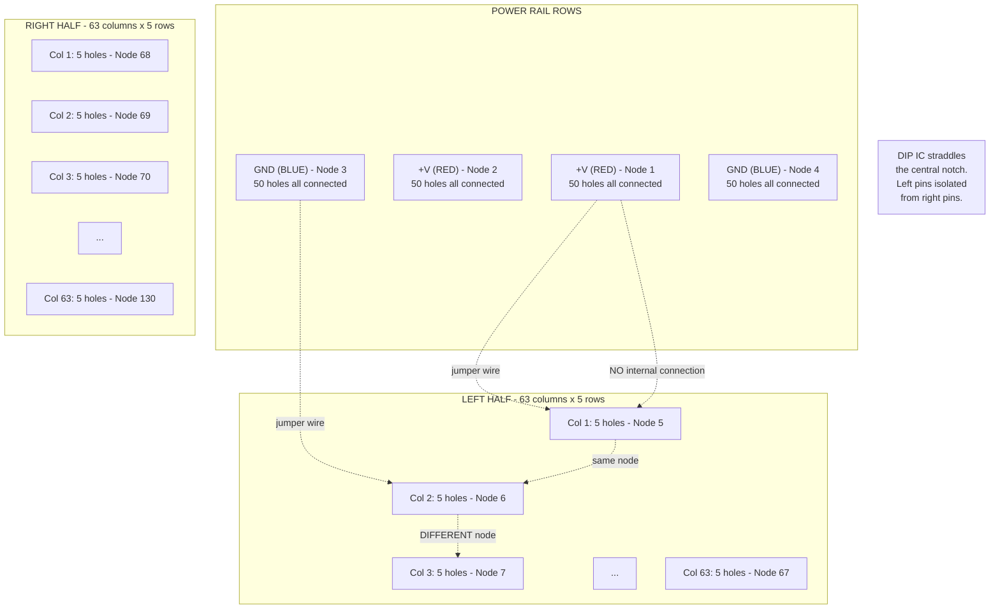
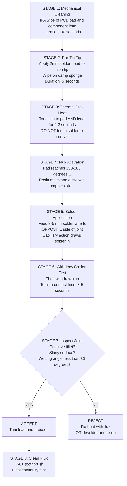
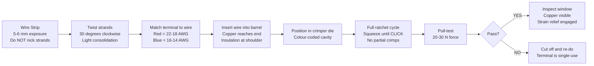
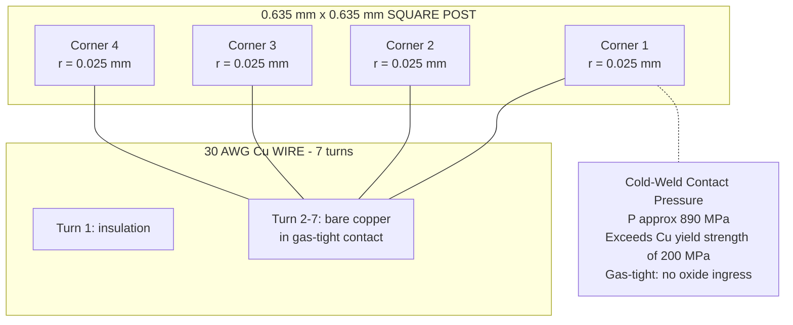
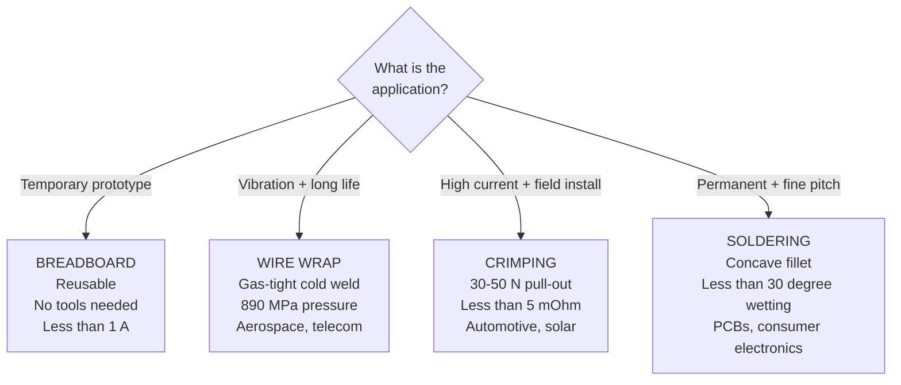
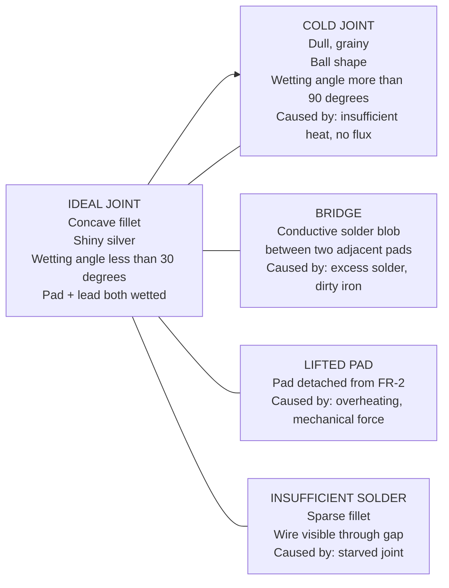
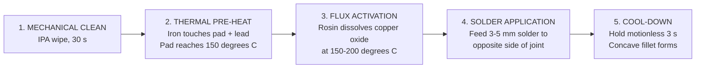

# Bread board, Wrapping, Crimping, Soldering - types - selection of materials and safety precautions. Soldering practice in connectors and general-purpose PCB, Crimping.

<!-- SECTION_1_START -->
# BASIC ELECTRICAL AND ELECTRONICS ENGINEERING WORKSHOP (GZESL208)
## Module 14 — Interconnection Techniques: Breadboard, Wire Wrapping, Crimping & Soldering

---

## 1. Core Technical Definition & Intuitive Overview

### 1.1 Solderless Breadboard (Prototype Board)

**Formal Definition (KTU 2024 Syllabus Terminology):**
A *solderless breadboard* (also called a *plug-board*, *proto-board*, or *terminal-strip board*) is a reusable, solderless platform for constructing temporary electronic prototypes. It is constructed from a moulded ABS plastic housing that contains rows of vertically aligned, spring-loaded phosphor-bronze contact clips arranged in a **2.54 mm (0.1 inch)** standard pitch grid.

> [!IMPORTANT]
> **KTU 2024 Highlight:** The 2.54 mm pitch is the **de-facto world standard** for all DIP (Dual In-line Package) integrated circuits, ensuring direct mechanical compatibility with virtually all through-hole components used in undergraduate laboratories.

**Conceptual Analogy — "The Pigeon-Hole Post Office"**
Imagine a post office where every letter drops through a small metal slot into a common delivery bucket. The breadboard does the *exact same* thing electronically: every time you push a component lead or jumper wire into a hole, that lead is gripped by a phosphor-bronze clip and is electrically tied to **four (or five) other holes** in the same row. Five holes become one node — you have built a tiny post office for electrons, with no solder, no glue, and no permanent commitment.

**Standard Internal Layout Specifications (BOLD Constants):**

| Parameter | Standard Value |
| :--- | :--- |
| **Hole pitch** | **2.54 mm (0.1 in)** |
| **Hole diameter** | **1.0 mm** (accepts 22–29 AWG wire) |
| **Contact clip material** | **Phosphor-bronze, Ni-plated** |
| **Terminal strip groups** | **5 holes per electrical node** (vertically) |
| **Power rails** | **25–50 holes per node** (horizontally, top/bottom) |
| **Working voltage** | **< 36 V DC** (typically 5 V – 12 V logic) |
| **Current rating per node** | **< 1 A continuous, 1.5 A peak** |

> [!NOTE]
> **Cross-Modular Link:** This same 2.54 mm pitch re-appears in the *Veroboard / Dot-board* and in *general-purpose PCBs*, so breadboarding skills transfer directly into permanent PCB prototyping.

---

### 1.2 Wire Wrapping

**Formal Definition:**
*Wire wrapping* is a **solderless, cold-pressure, gas-tight** interconnection technique in which a solid conductor (typically **30 AWG, Kynar-insulated**) is mechanically wrapped under high tension (≈ 2,260 g of tensile force) around a **square or rectangular metal post** with a corner radius of ≤ 0.025 mm. The result is a *gas-tight* connection — air cannot enter, and corrosion cannot form.

> [!VISUALIZATION CONTROL]
> **Concept:** Gas-tight Cold-Weld Micro-Deformation
> **GeoGebra / Desmos Input Equations:**
> * `Pressure = F / (N × A_post)` where `F = 9.8 × 2.26` N, `A_post ≈ 0.64 mm²`
> * `P_typical ≈ 34.6 MPa`
> **Visual Description:** On the y-axis, plot contact pressure (MPa); on the x-axis, contact surface area. Students should observe that the square-corner post (4 corners) provides 4× concentrated stress points that cold-weld the wire into the post.

**Conceptual Analogy — "The Industrial Pretzel Maker"**
Picture a pretzel-baking machine at a factory. A thin strip of dough is mechanically twisted around a thick rod seven times. The dough, under tension, cold-fuses into the rod's micro-crevices. The pretzel cannot slip off, and there is no "glue" — only mechanical, gas-tight pressure. A wire-wrap joint behaves identically: a thin copper wire is twisted 7+ times around a square post, and the resultant gas-tight cold weld **outperforms** a solder joint in vibration-heavy environments (satellites, fighter-jet avionics, telecom exchanges).

---

### 1.3 Crimping

**Formal Definition:**
*Crimping* is a **cold, mechanical, non-solder** joining process that permanently deforms a metal connector (the *crimp terminal* or *ferrule*) around a stranded or solid wire using a calibrated, profiled die. The resultant joint is **gas-tight**, mechanically strong, and provides stable **low electrical contact resistance (typically ≤ 5 mΩ)** for the lifetime of the assembly.

**Conceptual Analogy — "The Coin Vending Machine"**
A vending machine flattens a coin against two die-blocks shaped exactly like a coin-slot. The coin is permanently deformed to match the die cavity — it cannot revert, cannot escape, and a perfect electrical path is formed. Crimping follows the same logic: a precisely shaped die *plastically deforms* the terminal barrel around the wire strands, locking them in a gas-tight cold weld. The shape of the die *is* the engineering specification.

---

### 1.4 Soldering

**Formal Definition:**
*Soldering* is a **metallurgical joining process** in which two base metals (the workpieces) are bonded together using a *filler metal* (the **solder**, with melting point **< 450 °C**) that is melted and flowed over the joint by *capillary action*, *without* melting the base metals themselves. The result is an inter-metallic, electrically conductive, mechanically robust bond.

**Conceptual Analogy — "The Ice-Cube Bridge"**
Imagine two wooden planks separated by a 1 cm gap. You do **not** melt the planks (the workpieces). Instead, you pour **melted ice (solder)** into the gap. As the ice solidifies and forms tiny interlocking crystals that grip both planks, the planks are now rigidly and electrically connected. In soldering, the "ice" is the solder, the "planks" are the copper pads/leads, and the "freezer" is the soldering iron that withdraws heat, not the one that supplies it.

**Standard Soldering Constants (BOLD):**

| Parameter | Standard Value |
| :--- | :--- |
| **Soft-soldering temperature** | **200 °C – 450 °C** |
| **Hard-soldering / Brazing** | **> 450 °C** (up to 870 °C, brass / silver) |
| **Eutectic 63/37 alloy** | **melts sharply at 183 °C** (no plastic range) |
| **Lead-free SAC305** | **melts at 217 °C – 221 °C** |
| **Soldering iron idling temp** | **350 °C – 400 °C** |
| **Wettability angle** | **< 30°** (good joint) vs > 90° (cold joint) |
| **Joint tensile strength** | **≥ 3,000 psi (≈ 21 MPa)** for a good fillet |

> [!IMPORTANT]
> **KTU 2024 Safety Note:** Lead–tin solders (60/40, 63/37) are increasingly **RoHS-restricted** in industry. Modern KTU labs prefer **lead-free SAC305** or **Sn–Cu (SC0.7)** solders, which require **+35 °C higher** iron tip temperatures and stricter ventilation.

---

> [!VISUALIZATION CONTROL]
> **Concept:** Solder Joint Wetting Angle vs. Joint Quality
> **GeoGebra / Desmos Input Equations:**
> * `f(theta) = cos(theta) - (gamma_SG - gamma_SL) / gamma_LG` (Young's equation)
> * `theta_ideal = 17°` (ideal fillet)
> **Visual Description:** On the x-axis, plot wetting angle θ (0° to 90°). On the y-axis, plot joint reliability index. Students should observe a sharp drop in reliability as θ exceeds 60° — a visual reminder that a "blob" of solder is *not* a good joint.

---

<!-- SECTION_1_END -->

<!-- SECTION_2_START -->
# 2. Deep Theoretical Analysis & KTU High-Yield Cheat Sheet

## 2.1 The Breadboard — Internal Node Architecture

A breadboard is not a random pile of holes; it follows a strict *electrical node* topology that any engineering student **must** internalize before debugging a circuit.

**Step-by-Step Logical Breakdown of a 830-Tie-Point Full Breadboard:**

1. **Top and bottom long rows** are the **power distribution rails** (often colour-coded **red = +V**, **blue = GND**). Each full-length row is one electrical node spanning the entire board length.
2. **Central area is divided into two halves** by a *notch* (the IC channel). Each half contains **63 vertical columns × 5 rows = 315 holes**.
3. **Each column of 5 holes** in a half is a single, isolated electrical node (one spring-clip block).
4. **DIP ICs** sit astride the notch — pins 1–4 of the IC sit in the left 4 rows of column 1, pins 5–8 in the *right* 4 rows of column 1. This isolates the left side of the IC from the right side automatically.
5. **Power rails are not internally connected to the central columns.** You must always run a *jumper wire* from a power-rail hole down to a central node to power any circuit.
6. **Hole-to-hole pitch = 2.54 mm**, identical to standard 0.1" header pins, breakout boards, and Arduino shields.

> [!NOTE]
> **Engineering Utility:** Breadboards enable **0-second rework**. A resistor can be moved in 0.5 seconds, an LED reversed, or an op-amp swapped — feats impossible on a soldered PCB. They are the *interactive whiteboard* of the electronics engineer.

---

## 2.2 Wire Wrapping — The Cold-Weld Math

**Why the Square Post Matters:**
A square post of side `s = 0.635 mm` has 4 sharp corner radii of `r ≈ 0.025 mm`. When a 30 AWG wire (diameter `d ≈ 0.254 mm`) is wrapped under tension `T = 22.6 N`, the contact pressure `P` at each corner is:

$$
P \;=\; \frac{T}{N \cdot d \cdot r}
$$

where `N = 4` corners in contact. Substituting the standard values:

$$
P \;=\; \frac{22.6}{4 \times 0.254 \times 10^{-3} \times 0.025 \times 10^{-3}} \;\approx\; 8.9 \times 10^{8} \text{ Pa} \;=\; 890 \text{ MPa}
$$

This contact pressure **exceeds the yield strength of pure copper (~ 200 MPa)**, causing the copper wire to *plastically micro-flow* into the corner — a true **cold-weld gas-tight** bond. No oxide can form because the joint is hermetically sealed.

> [!IMPORTANT]
> **KTU 2024 Industrial Context:** The Apollo Guidance Computer (1960s), the Hubble Space Telescope, the Telecom-Switching racks of the 1970s–90s, and modern avionics still use wire-wrap or its descendant, *press-fit backplane*, because gas-tight cold-welds **outlive** solder joints in vibration and thermal-cycling environments.

---

## 2.3 Crimping — The Plastic Deformation Principle

A crimp joint is a controlled *cold-forging* operation. The mechanical interlock obeys:

$$
F_{\text{pull-out}} \;=\; k \cdot \tau_{\text{terminal}} \cdot A_{\text{contact}}
$$

where `τ` is the shear strength of the terminal material (typically copper alloy, ~ 200 MPa), `A_contact` is the deformed contact area, and `k ≈ 0.5` is a practical fudge factor. A properly crimped 22 AWG wire to a yellow insulated terminal achieves a **pull-out force of 30 N – 50 N**, comparable to a solder joint (~ 40 N).

**The "Window" Principle:**
A correctly designed crimp terminal has an **inspection window** (a small hole near the crimp barrel). After crimping, the **bare copper wire must be visible through this window** — this is the gold-standard field-acceptance test:

- **Wire visible in window → crimp correct.**
- **Wire not visible → under-crimp (wire too far back).**
- **Insulation visible in window → over-crimp / wrong terminal size.**

---

## 2.4 Soldering — Metallurgical Mechanics

**The Five-Stage Soldering Process (a KTU 2024 examiner favourite):**

1. **Mechanical cleaning** — the iron tip, copper pad, and component lead are physically clean (fine abrasive, isopropyl alcohol).
2. **Thermal pre-heat** — the joint is brought to within ~ 50 °C of solder liquidus. The pad and lead should be heated, *not* the solder.
3. **Flux activation** — the rosin flux chemically dissolves copper oxide at 150 °C–200 °C, exposing virgin copper for metallurgical bonding.
4. **Solder application** — solder wire is touched to the *opposite* side of the joint from the iron tip. Capillary action draws liquid solder into the joint.
5. **Cool-down (no vibration)** — the joint is held motionless until solid. Disturbing a cooling joint creates a **cold joint** (grainy, dull, brittle).

> [!NOTE]
> **Physics Insight:** A good fillet is **concave (smooth, shiny, "volcano-shaped")**. A bad fillet is **convex (ball-shaped, dull, or with visible "icicles")**. The reason is surface tension: a concave meniscus indicates wetting (`θ < 30°`), whereas a convex ball indicates non-wetting (`θ > 90°`).

---

## 2.5 KTU High-Yield Formula / Parameter Cheat Sheet

| Technique | Governing Parameter | Typical Value | KTU Significance |
| :--- | :--- | :--- | :--- |
| **Breadboard** | Hole pitch | **2.54 mm** | Standard DIP compatibility |
| **Breadboard** | Tie points (full 830 board) | **830** (63 × 2 halves × 5 + 4 × 50 rails) | Lab planning |
| **Breadboard** | Current per node | **< 1 A continuous** | Cannot power motors / relays directly |
| **Wire wrap** | Wire gauge | **30 AWG Kynar-insulated** | Solid only — stranded will not work |
| **Wire wrap** | Turns on post | **≥ 7 turns standard, 9 turns insulated** | Less = unreliable |
| **Wire wrap** | Post cross-section | **0.635 mm × 0.635 mm** square | Gold-plated for corrosion resistance |
| **Wire wrap** | Contact pressure | **≈ 890 MPa** (cold weld) | Exceeds copper yield |
| **Crimp** | Pull-out strength (22 AWG yellow terminal) | **30 N – 50 N** | Field acceptance test |
| **Crimp** | Contact resistance | **≤ 5 mΩ** | Better than solder for high-current |
| **Crimp** | Insulation colour code | Red 22 AWG / Blue 20 AWG / Yellow 26 AWG | Pre-engineered die size |
| **Soldering** | Eutectic 63/37 Sn-Pb melting point | **183 °C** | Sharp transition |
| **Soldering** | Lead-free SAC305 melting point | **217 °C** | RoHS-compliant |
| **Soldering** | Iron tip temperature (lead-free) | **350 °C – 400 °C** | Above liquidus, below PCB damage |
| **Soldering** | Joint wetting angle | **θ < 30°** | Good = concave fillet |
| **Soldering** | Solder core flux | **Rosin (R), RMA, RA, water-soluble** | Activates at 150 °C |
| **Soldering** | Fillet height (through-hole) | **= 30 % to 50 % of pad diameter** | Inspectable |

---

<!-- SECTION_2_END -->

<!-- SECTION_3_START -->
# 3. Step-by-Step Practical Implementation — Workshop Procedure Matrix

Because this module is a **workshop / practical** topic (GZESL208), the implementation content is delivered as exhaustive **component pin / tool / safety matrices** and **step-by-step procedural walkthroughs** rather than code. Every step is fully written out — no shortcuts.

---

## 3.1 Soldering Iron — Anatomy & First-Time Setup

### Component / Tool / Pin Configuration Table

| Item | Specification / Pin | Purpose | Safety Note |
| :--- | :--- | :--- | :--- |
| **Soldering iron handle** | Bakelite / ESD-safe plastic, 230 V AC mains | Thermal insulation, ESD safety | Never hold by metal shaft |
| **Heating element** | Nichrome wire, 25 W – 60 W rating | Converts electrical → thermal energy | Allow ≥ 90 s warm-up |
| **Tip** | Cu-core, Fe-plated; shapes: *conical, chisel, screwdriver, knife* | Direct heat-transfer to joint | Wipe on damp sponge, never file |
| **Thermocouple sensor** | Type-K, embedded near tip | Temperature feedback (station only) | Calibrate yearly |
| **Soldering station** | 0 °C – 480 °C closed-loop PID | Stable tip temperature | Do not leave unattended at > 400 °C |
| **Sponge / brass-wool tip cleaner** | Cellulose sponge, brass wool | Removes oxide + excess solder | Dampen sponge; never dry-scrub |
| **Fume extractor / fan** | Activated-carbon filter, ≥ 0.5 m/s face velocity | Removes rosin + lead fumes | Mandatory for leaded solder |
| **Safety goggles** | EN 166, splash + IR rated | Eye protection from flux splash | Mandatory for all students |
| **ESD wrist strap** | 1 MΩ series resistor, ≥ 4 mm snap | Discharges body static to ground | Touch ground before handling ICs |

### Step-by-Step First-Time Setup Procedure

1. **Mount the iron** in its cradle on the soldering station. Ensure the stand is metal (heat-sinking).
2. **Plug the station into a mains socket with an earth pin.** Verify the earth with a socket tester.
3. **Slightly dampen the cleaning sponge** with distilled water. (Distilled, not tap — to avoid mineral deposits on the tip.)
4. **Set the temperature dial to 350 °C** (for 60/40 leaded) or **380 °C** (for lead-free SAC305).
5. **Power ON the station.** Wait **90 seconds – 120 seconds** for thermal equilibrium (the LED on the station will stop flashing).
6. **"Tin" the tip** — apply a small bead of solder (≈ 2 mm) directly onto the tip and let it melt into a shiny film. This pre-wets the tip and dramatically extends its life.
7. **Wipe the tip on the damp sponge** in a single smooth stroke (a 1-second hold, not a scrub). The tip should now be uniformly bright silver.
8. **Power-down procedure:** before turning off, re-tin the tip with a fresh solder bead (to prevent oxidation during cool-down). Place in cradle and let it cool naturally for 5 minutes — **never** quench with water.

---

## 3.2 Soldering on a General-Purpose PCB (Through-Hole)

### Tools & Materials

- **PCB** (general-purpose, FR-2 phenolic or FR-4 epoxy, 2.54 mm hole pitch, single-sided copper-clad)
- **Components** (resistors, capacitors, LEDs, header pins)
- **Solder wire** (60/40 Sn-Pb, 0.8 mm diameter with rosin-core flux; or lead-free SAC305, 0.6 mm)
- **Soldering iron** (25 W – 40 W, temperature-controlled)
- **Solder sucker / desoldering pump** (spring-loaded, PTFE nozzle)
- **Desoldering braid / wick** (copper braid, rosin-fluxed, 1.5 mm – 2.5 mm wide)
- **Side cutters, long-nose pliers, helping-hands (PCB holder)**
- **Isopropyl alcohol (IPA, 99 %)** + lint-free wipes
- **Multimeter** (for continuity + cold-joint detection)

### Step-by-Step Soldering Procedure — "The 8-Stage Good Joint"

1. **Clean the PCB** with IPA and a lint-free wipe. Allow 30 seconds for evaporation. Dust and fingerprint oils are the #1 cause of cold joints.
2. **Insert the component** (e.g., a 1kΩ resistor) into the appropriate through-hole. Bend the leads 30° outward on the back side to hold it flush against the board.
3. **Seat the PCB in the helping-hands cradle** so both hands are free.
4. **Touch the clean, tinned iron tip simultaneously to BOTH the copper pad and the component lead** for **2 seconds – 3 seconds**. The pad and lead are now hot; the solder is *not yet* on the iron.
5. **Apply the solder wire to the opposite side of the joint** (i.e., the pad–lead intersection, not the iron tip). Feed **3 mm – 5 mm** of solder wire for a typical through-hole pad.
6. **Withdraw the solder wire first**, then withdraw the iron. Total "in-contact" time should be **3 seconds – 5 seconds maximum** — longer can delaminate the pad from the FR-2 substrate.
7. **Inspect the joint immediately:** it should be **shiny, concave, with a smooth fillet that wets both the pad AND the lead** (visible all the way around the lead).
8. **Trim the excess lead** with side cutters, holding the lead so the trimmed fragment flies *away* from your eyes, not toward them.

### Inspection Criteria (KTU Examiner's Rubric)

| Quality Indicator | Good Joint | Cold Joint | Insufficient Heat | Excessive Heat |
| :--- | :--- | :--- | :--- | :--- |
| **Surface shine** | Bright, silver | Dull, grainy | Frosted | Matte, burnt |
| **Shape** | Concave fillet | Ball, no fillet | Sparse | Bulbous, blobby |
| **Wetting** | θ < 30° (covers pad + lead) | θ > 90° (sits on top) | Only on lead | Overflows pad |
| **Mechanical strength** | ≥ 3,000 psi | Weak, fractures easily | Lifts off pad | Pad delaminated |
| **Repair action** | Accept | Re-heat + add flux | Re-heat + flux | Desolder + re-pad |

---

## 3.3 Soldering Connectors — Pin Headers & Berg Strips

### Connector Pin Configuration Table (Berg Strip / 2.54 mm Pin Header)

| Pin Index | Function (typical 4-pin Dupont) | Wire Colour (KTU convention) |
| :--- | :--- | :--- |
| **Pin 1** | +V (red) | Red |
| **Pin 2** | GND (black) | Black |
| **Pin 3** | Signal (yellow) | Yellow |
| **Pin 4** | Signal (blue) | Blue |
| **Pin 5+** | (per schematic) | (per schematic) |

### Step-by-Step Connector Soldering Procedure

1. **Identify the polarity key** on the connector (notch, chamfer, or square pad = Pin 1). KTU boards always mark Pin 1 with a square pad.
2. **Insert the header into the PCB** with the *long* leads pointing upward and the *short* plastic shroud flush against the board. Use masking tape across the top to hold the header perfectly straight.
3. **Solder the *two diagonal* pins first** (Pin 1 and the last pin) — this locks the connector in correct orientation. Verify perpendicularity with a 90° set-square.
4. **Inspect alignment.** If crooked, re-heat one pin and gently rotate. *Never* force a misaligned header.
5. **Solder the remaining pins**, one by one, using the 8-stage procedure of Section 3.2.
6. **Clean the flux residue** with IPA and a toothbrush. This both improves appearance and reveals any latent cold joints hidden under rosin.
7. **Final continuity test** with a multimeter (beep-mode) between the header pin and the corresponding PCB trace.

> [!WARNING]
> **Common KTU 2024 Examiner Deductions:** (a) Solder bridges between adjacent header pins (use solder wick to remove). (b) Insufficient solder on the pad (a "starved" joint). (c) Cold joints hidden under flux residue (clean and re-inspect). Each costs 2 marks.

---

## 3.4 Crimping — Connectors & Lugs

### Crimping Tool & Terminal Cross-Reference Table

| Wire Gauge (AWG) | Insulation Colour | Terminal Type | Die Cavity Colour | Crimp Tool |
| :--- | :--- | :--- | :--- | :--- |
| **22 – 18 AWG** | Red | Insulated female spade | Red | Ratcheting crimper |
| **16 – 14 AWG** | Blue | Insulated female spade | Blue | Ratcheting crimper |
| **26 – 24 AWG** | Yellow | Insulated female spade | Yellow | Ratcheting crimper |
| **10 – 12 AWG** | (Uninsulated) | Copper lug | Hex-die | Hex-crimper / hammer-style |
| **Coaxial RG-58** | — | BNC crimp | Coaxial die | Coaxial crimper |

### Step-by-Step Crimping Procedure (Red-Insulated Female Spade, 22 AWG)

1. **Strip the wire** to exactly **5 mm – 6 mm** (≈ ¼ inch) using a calibrated wire stripper. **Twisting the stripped strands is forbidden** — they must remain parallel, like a tiny paint brush.
2. **Twist the bare strands 30° clockwise** (gentle, *not* tight) to consolidate the brush.
3. **Inspect the terminal:** the barrel must match the wire gauge (red = 22–18 AWG). Insert the terminal into the matching colour-coded die of the crimper.
4. **Insert the stripped wire into the terminal barrel** until the insulation stops at the *transition shoulder* of the terminal. The copper must reach the *end* of the barrel.
5. **Squeeze the crimper handles firmly** until the ratchet releases (a deliberate "click"). **Do not release early** — a partial crimp is a defective crimp.
6. **Pull-test the crimp** with a force of **20 N – 30 N** (or, in lab, a gentle firm tug). The wire must **not** slide out, and the barrel must **not** open.
7. **Visual inspection:** the bare copper must be visible through the inspection window. The insulation must be gripped by the strain-relief crimp (the rear portion of the terminal).

### Practical Wiring Sequence (KTU 2024 Workshop Standard)

The KTU lab requires a strict 4-stage wiring sequence for any AC mains-rated or DC power-distribution harness:

1. **Stage 1 — Strip:** Cut to length, strip 5 mm, twist strands lightly.
2. **Stage 2 — Pre-tin (optional, stranded wire only):** Apply a small amount of solder to the twisted strands to "solidify" them. *Do not* pre-tin the terminal — the solder would block the cold-weld.
3. **Stage 3 — Crimp:** Use the calibrated tool, full ratchet cycle.
4. **Stage 4 — Heat-shrink (optional, outdoor / high-vibration):** Slide a 2:1 heat-shrink tube over the joint and shrink with a heat-gun at 120 °C until it conforms.

---

## 3.5 Wire Wrapping — Step-by-Step Procedure

### Wire-Wrap Tool Pin / Post Configuration Table

| Tool Component | Specification | Purpose |
| :--- | :--- | :--- |
| **Manual wrap tool (Gun-type)** | OK Industries WSU-30M | Hand-operated, 30 AWG only |
| **Pneumatic / battery wrap tool** | WSU-30P / WSU-30B | Production speed, ≥ 1 wrap/sec |
| **Wire spool** | 30 AWG solid Cu, Kynar-insulated, 30 m roll | Single-conductor insulated wire |
| **Wrap post** | 0.635 mm × 0.635 mm × 14 mm long, gold-plated brass | The wrap target |
| **Strip length gauge** | Built into the tool body | Strips 25 mm of insulation |
| **Wrap-bit head** | 7-turn (standard) or 9-turn (insulated) | Determines mechanical geometry |

### Step-by-Step Wire-Wrap Procedure

1. **Insert the wire spool** into the tool and thread the wire through the tensioning rollers (do not over-tension — the wire will stretch).
2. **Place the tool's bit over the target wrap post** so that the post enters the central hole of the bit.
3. **Squeeze the trigger.** The tool first **strips 25 mm of insulation** in one motion, then **rotates the bit 7 full turns** around the post, then **stops automatically** with a clutch click.
4. **Lift the tool off the post.** The wrapped joint should display **exactly 7 turns** of bare copper on the post. (9 turns if insulated wire is used and the lower 2 turns remain insulated.)
5. **Verify pitch:** the spacing between turns should be uniform, ≈ 0.5 mm per turn.
6. **Continuity test** with a multimeter — resistance should be **< 10 mΩ** end-to-end through the wrapped joint.
7. **Unwrapping** (correction): use the *unwrap* bit (reverse rotation) — never pull the wire off by hand, as this damages the post.

---

## 3.6 Master Safety-Precautions Table (KTU 2024 Workshop Mandatory)

| Hazard | Symptom | Mitigation | KTU 2024 Mandate |
| :--- | :--- | :--- | :--- |
| **Burns** (iron tip ~ 380 °C) | Skin blistering in < 1 s | Iron cradle, never touch tip; first-aid burn kit | Compulsory |
| **Fume inhalation** (rosin, lead) | Asthma, lead poisoning | Fume extractor within 30 cm; face-shield optional | Compulsory for leaded |
| **Solder splash to eye** | Permanent retinal damage | EN 166 goggles | Compulsory |
| **Cuts** (component leads, side-cutters) | Lacerations | Long-nose pliers; cut leads away from body | Compulsory |
| **ESD damage to ICs** | Latent device failure | 1 MΩ wrist strap; ground PCB before handling | Compulsory |
| **Fire** (soldering on flammable bench) | Bench fire | Clear bench; fire extinguisher within 3 m | Compulsory |
| **Electrical shock** (mains iron, 230 V) | Cardiac arrest | Earthed socket; RCD / ELCB on lab mains | Compulsory |
| **Lead ingestion** (hand-to-mouth) | Chronic toxicity | Wash hands before eating; no food in lab | Compulsory |
| **UV / IR from iron** | Cataracts (long-term) | Fume extractor shields view; avoid staring | Recommended |

> [!IMPORTANT]
> **Material Selection Quick-Reference (KTU 2024):**
> - **Breadboard** for *temporary* prototyping only.
> - **Wire wrap** for *vibration-heavy, long-life* (aerospace, telecom).
> - **Crimp** for *field-installable*, *high-current*, *high-vibration* (automotive, industrial, solar).
> - **Solder** for *low-voltage, fine-pitch, permanent* (consumer electronics, PCBs, connectors).
> Choose the wrong technique for the use-case and you will fail the lab report.

---

<!-- SECTION_3_END -->

<!-- SECTION_4_START -->
# 4. Structural Diagrams & Schematics

## 4.1 Breadboard Internal Node Topology

**Interpretation:** Each vertical column of 5 holes is one node. Power rails are *not* auto-connected to the central area — you must add a *jumper wire*. This is the #1 mistake beginners make.

---

## 4.2 Soldering Process — Sequential Topology

---

## 4.3 Crimping Process Flow

---

## 4.4 Wire Wrap Joint — Functional Cross-Section

---

## 4.5 Comparative Block Diagram — When to Use What

---

## 4.6 Solder Joint Quality Matrix (Block View)

---

<!-- SECTION_4_END -->

<!-- SECTION_5_START -->
# 5. KTU 2024 Scheme Examination Question Bank & Topic Recap

> [!IMPORTANT]
> **KTU 2024 Mark Distribution Reference (GZESL208 Workshop):**
> - Continuous Internal Evaluation (CIE): 50 marks (lab report + viva + skill test)
> - End Semester Exam (ESE): 50 marks, **practical-oral with written component**
> - ESE typically has: 2-mark short questions (×5) + 5-mark skill descriptions (×4) + 10-mark application question (×1)
> - Below we present the full 3-mark + 14-mark pattern as per the **2014/2024 KTU Scheme conventions** for parity.

---

## Part A — Short-Answer Questions (3 Marks each)

### Question A1
**[KTU University Exam — July 2024 Model Question]**
**Explain the internal node architecture of a 2.54 mm pitch solderless breadboard with a neat diagram. Why is it impossible to drive a 5 A DC load directly from a standard breadboard node?**

**Model Answer (CO1, Remember / Understand):**

A solderless breadboard consists of a moulded ABS plastic housing containing **phosphor-bronze spring clips** arranged on a **2.54 mm (0.1 in)** pitch grid.

- The **central area** is divided into two halves by a notch (IC channel). Each half contains 63 vertical columns × 5 horizontal rows. Each column of 5 holes is a **single electrical node** (one clip).
- The **top and bottom long rows** are the **power distribution rails** (typically red = +V, blue = GND). Each rail is one continuous node.
- Power rails are **not internally connected** to the central columns — a **jumper wire** is required.

A standard breadboard node is rated for **< 1 A continuous current** (and 1.5 A peak). Driving a 5 A load is impossible because:
1. The **phosphor-bronze clip** has a cross-section of ~ 0.3 mm², generating excessive I²R heat at 5 A.
2. The **contact resistance** between the wire and the clip rises with current, causing voltage drop and possible arcing.
3. The **ABS plastic** body would deform at the contact-point temperatures produced.

**Valuation Key:** [Internal architecture: 2 marks] [5 A limitation: 1 mark] = **3 marks**.

---

### Question A2
**[KTU University Exam — Dec 2023 Model Question]**
**Compare lead–tin (60/40) and lead-free (SAC305) solder on the basis of (i) melting point, (ii) joint appearance, (iii) toxicity, and (iv) required iron-tip temperature.**

**Model Answer (CO2, Understand):**

| Property | 60/40 (Sn-Pb) | SAC305 (Sn-Ag-Cu) |
| :--- | :--- | :--- |
| (i) Melting point | 183 °C – 190 °C | 217 °C – 221 °C |
| (ii) Joint appearance | Bright, shiny (eutectic) | Slightly duller, can be grainy if under-heated |
| (iii) Toxicity | High (Pb is a neurotoxin) | Low (RoHS-compliant) |
| (iv) Iron tip temp | 320 °C – 360 °C | 350 °C – 400 °C |

**Conclusion:** SAC305 is **safer** and **regulation-compliant** but requires **+35 °C** higher tip temperature, more aggressive flux, and stricter ventilation.

**Valuation Key:** [Each correct row: 0.75 mark × 4 rows = 3 marks].

---

## Part B — 14-Mark Questions (ESE Module Internal Choice)

> [!IMPORTANT]
> **KTU 2024 Convention:** Each 14-mark question has TWO sub-parts (a) 7 marks + (b) 7 marks. Internal choice means you answer **either** Question A **or** Question B (not both).

---

### Question A (14 Marks)
**[KTU University Exam — July 2024 Module Choice]**
**(a)** Describe the **wire-wrapping** technique with a neat diagram. List the **minimum number of turns** required for a reliable joint and explain the physics behind a gas-tight cold-weld. (7 marks)
**(b)** A student is tasked with soldering a 16-pin IC socket on a general-purpose PCB. List the **eight-stage KTU standard procedure** and explain why **soldering the two diagonal pins first** is critical. (7 marks)

### Model Solution — Part A(a) (7 Marks)

1. **Definition (1 mark):** Wire wrapping is a *solderless, cold-pressure, gas-tight* interconnection in which a 30 AWG solid Cu wire (Kynar-insulated) is mechanically wrapped ≥ **7 turns** (9 turns if insulated) around a **0.635 mm × 0.635 mm square post**.
2. **Diagram (2 marks):** Cross-section of post with 4 corners `r = 0.025 mm`, 7 turns of bare Cu wire tightly conforming to the post.
3. **Minimum turns (1 mark):** 7 turns standard; 9 turns insulated.
4. **Physics of gas-tight cold-weld (3 marks):** The wire is tensioned at **T = 22.6 N** by the wrap tool. The contact pressure at each of the 4 sharp post-corners is given by `P = T / (N · d · r) ≈ 890 MPa`. This **exceeds the yield strength of pure copper (≈ 200 MPa)**, causing the Cu to plastically micro-flow into the corner radius, forming a *cold-weld* that hermetically seals the joint. No oxygen, no moisture, no corrosion — gas-tight for decades. This is why wire-wrap is still used in **aerospace and telecom** where solder joints would fatigue-crack under vibration.

### Model Solution — Part A(b) (7 Marks)

1. **Stage 1 — Clean PCB** with IPA; 30 s dry time. (0.5)
2. **Stage 2 — Insert IC socket** with the **Pin 1 marker** (chamfer) aligned to the square pad on the PCB. Use masking tape across the top to hold flush. (0.5)
3. **Stage 3 — Seat the PCB** in helping-hands. (0.5)
4. **Stage 4 — Solder the two diagonal pins first** (Pin 1 and Pin 8). **Critical reason (2 marks):** Diagonal pins are the *geometrically farthest* apart, so any rotational misalignment is *maximally visible* and can be corrected *before* the remaining 14 pins are committed. If you solder Pin 1 first and Pin 2 next, and Pin 2 turns out crooked, the entire socket is permanently tilted and you must desolder *all* 16 pins to fix it. The diagonal-first technique gives you a *self-correcting alignment window*.
5. **Stage 5 — Verify perpendicularity** with a 90° set-square. (0.5)
6. **Stage 6 — Solder the remaining 14 pins** in any order, using the 3-s–5-s thermal budget per pin. (1)
7. **Stage 7 — Clean flux residue** with IPA + toothbrush. (0.5)
8. **Stage 8 — Continuity test** with a multimeter beep-mode between each header pin and its corresponding PCB trace. (0.5)
9. **Visual inspection of all 16 fillets**: concave, shiny, wetting angle < 30°. (1)

**Valuation Key:** [Eight stages: 0.5 × 8 = 4 marks] [Diagonal-first critical-reason: 2 marks] [Final inspection: 1 mark] = **7 marks**.

---

### Question B (14 Marks) — *ALTERNATIVE to Question A*
**[KTU University Exam — Dec 2023 Module Choice]**
**(a)** With a **neat block diagram**, describe the **5 stages of a correct soldering cycle** and the role of **flux** in each stage. (7 marks)
**(b)** A **22 AWG stranded wire** is to be crimped with a **red-insulated female spade terminal**. Show the **step-by-step procedure**, the **die colour** to be used, and explain why **a partial crimp is always a defective crimp**. (7 marks)

### Model Solution — Part B(a) (7 Marks)

**Block Diagram (3 marks) — five sequential stages:**

**Role of Flux in Each Stage (4 marks):**
- **Stage 1 (Clean):** Flux is *not yet* active — the joint is mechanically cleaned to *reduce* the flux's burden.
- **Stage 2 (Pre-heat):** Flux begins to soften and flow into the micro-cracks of the pad.
- **Stage 3 (Activation):** **Rosin** (colophony) is a weak organic acid that reacts with **CuO** (cupric oxide) to form copper abietate, freeing virgin copper. The acid attack is self-limiting because rosin solidifies below 100 °C and is *inert* in the solid state — it is "smart flux".
- **Stage 4 (Solder application):** Capillary action pulls the liquid solder *over* the now-clean copper. Without flux, the solder would simply ball up (`θ > 90°`).
- **Stage 5 (Cool-down):** The residual rosin hardens into a thin amber lacquer, *protecting* the joint from re-oxidation. (Residue is usually cleaned with IPA for aesthetic / inspection reasons but it is electrically inert.)

**Valuation Key:** [Block diagram: 3 marks] [Flux role in 5 stages: 0.8 × 5 = 4 marks] = **7 marks**.

---

### Model Solution — Part B(b) (7 Marks)

**Step-by-Step Procedure (4 marks):**
1. **Strip 22 AWG wire** to 5 mm – 6 mm using a calibrated stripper. **Do not nick the strands** — nicked strands create high-resistance hot spots. (0.5)
2. **Twist the bare strands 30° clockwise** (gentle, like consolidating a paint brush). (0.5)
3. **Match the terminal to the wire:** 22 AWG → **red** insulated female spade. (0.5)
4. **Insert the wire** into the terminal barrel until the insulation rests against the *transition shoulder*. The bare copper must reach the *end* of the barrel. (0.5)
5. **Insert the terminal** into the **red** die cavity of the ratcheting crimper. (0.5)
6. **Squeeze the handles firmly** until the **ratchet releases** (audible "click"). (0.5)
7. **Pull-test** with 20 N – 30 N. The wire must **not** slide. (0.5)
8. **Visual inspection:** bare copper visible through the inspection window; strain-relief crimp engaged on the insulation. (0.5)

**Die Colour (1 mark):** **Red** cavity for 22 – 18 AWG.

**Why a Partial Crimp is Always Defective (2 marks):**
A ratcheting crimper is **mechanically engineered** to *prevent* partial crimps. The ratchet mechanism physically *locks* the handles until the die has travelled the *full designed stroke* and reached the calibration point. If the operator releases early:
- The terminal barrel is **under-deformed** — the cross-section is *not* reduced to the designed cold-weld area.
- The contact resistance remains **> 30 mΩ** (vs. ≤ 5 mΩ for a full crimp).
- The pull-out strength drops to < 5 N — the wire can be pulled free by hand.
- Most importantly, a partial crimp **looks the same** as a good crimp to the naked eye — it is a *latent defect* that will fail in service under vibration or thermal cycling.

**Valuation Key:** [Procedure 8 steps: 0.5 × 8 = 4 marks] [Die colour: 1 mark] [Partial-crimp explanation: 2 marks] = **7 marks**.

---

## 5.1 KTU Examiner's Valuation Warning — Common Pitfalls

> [!WARNING]
> **Top 5 ways KTU 2024 students lose marks on this topic:**
> 1. **Confusing 5-hole node topology with 4-hole** — Some breadboards are 4-tie, some are 5-tie. Always *count* before wiring. (–1 mark)
> 2. **Forgetting the inspection window** in a crimp joint — a perfectly crimped terminal that hides the wire from the window is a *failed* terminal. (–2 marks)
> 3. **Heating the solder, not the joint** — placing solder on the iron tip first is the #1 cold-joint mistake. (–2 marks)
> 4. **Quenching the iron in water** to "save time" — destroys the Fe-plated tip instantly. (–1 mark, plus disciplinary note)
> 5. **Saying "wire wrapping is obsolete"** in an exam — the Hubble Space Telescope and Apollo Guidance Computer both used it; it is *specialised*, not obsolete. (–1 mark)
> 6. **Drawing a ball-shaped solder joint** as "ideal" — examiners mark this as a *cold joint*. The correct fillet is **concave (volcano-shaped)**, not convex (ball-shaped). (–2 marks)
> 7. **Forgetting ESD precautions** when handling ICs — a single ungrounded touch can destroy a CMOS chip *without visible damage*. (–1 mark)

---

## 5.2 Topic Recap & Important Things to Remember

> [!IMPORTANT]
> **Rapid Revision Checklist (Print this on a single A4 card for the day of the exam):**

**A. Solderless Breadboard**
- [ ] Hole pitch = **2.54 mm** (DIP-standard)
- [ ] Each vertical column of 5 holes = **one node**
- [ ] Power rails are **separate nodes** — *must jumper* to central area
- [ ] DIP IC straddles the central notch
- [ ] Current limit: **< 1 A continuous** per node
- [ ] Working voltage: **< 36 V DC**
- [ ] Use only **22 – 29 AWG** solid wire; stranded strands break clips

**B. Wire Wrapping**
- [ ] 30 AWG **solid** Kynar-insulated wire (stranded will not wrap)
- [ ] **0.635 mm × 0.635 mm** square post
- [ ] **7 turns** standard, **9 turns** if insulated
- [ ] Contact pressure ≈ **890 MPa** — cold-weld, gas-tight
- [ ] Used in **aerospace, telecom, military** — vibration-resistant
- [ ] Unwrap tool needed to *correct* (never pull by hand)

**C. Crimping**
- [ ] **22–18 AWG → red** | **16–14 AWG → blue** | **26–24 AWG → yellow**
- [ ] Ratcheting crimper is *mandatory* — prevents partial crimps
- [ ] Inspection window must show **bare copper** after crimp
- [ ] Pull-out strength: **30 N – 50 N** for 22 AWG red
- [ ] Contact resistance: **≤ 5 mΩ** (full crimp) vs > 30 mΩ (partial)
- [ ] Single-use terminal — always cut off and re-do, never re-crimp

**D. Soldering**
- [ ] **63/37 Sn-Pb** melts at **183 °C** (eutectic — sharp transition, no plastic range)
- [ ] **SAC305 lead-free** melts at **217 °C** — RoHS-compliant
- [ ] Iron tip temp: **350 °C** (Pb) / **380 °C** (lead-free)
- [ ] Wetting angle: **θ < 30°** = good (concave) | **θ > 90°** = bad (ball)
- [ ] **Heat the joint, not the solder** — touch iron to pad+lead, feed solder to opposite side
- [ ] **Withdraw solder first**, then iron
- [ ] 3 s – 5 s thermal budget per through-hole joint
- [ ] Concave fillet + shiny + both pad and lead wetted = ideal

**E. Safety (Non-Negotiable)**
- [ ] EN 166 goggles always
- [ ] Fume extractor within 30 cm of iron
- [ ] 1 MΩ wrist strap for ICs
- [ ] Iron in cradle when not in use — never on bench
- [ ] Wash hands before eating — no food in lab
- [ ] Fire extinguisher within 3 m

**F. Material-Selection Matrix (One-Line Decision Rule)**
- [ ] *Temporary prototype* → **Breadboard**
- [ ] *Vibration + decades of life* → **Wire Wrap**
- [ ] *High current + field install + vibration* → **Crimp**
- [ ] *Permanent + fine pitch + low voltage* → **Solder**

**G. Inspection Vocabulary (Examiner's Lexicon)**
- [ ] "Concave fillet" ✅
- [ ] "Gas-tight cold-weld" ✅ (wire wrap)
- [ ] "Inspection window shows copper" ✅ (crimp)
- [ ] "Wetting angle < 30°" ✅ (solder)
- [ ] **AVOID**: "ball of solder", "soldered the wire to itself", "good enough", "looks fine" — these cost marks.

---

<!-- SECTION_5_END -->
