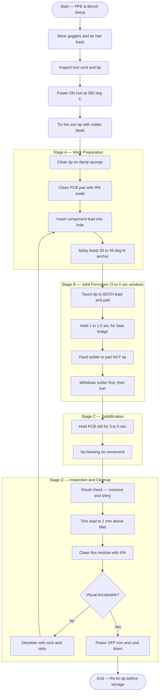
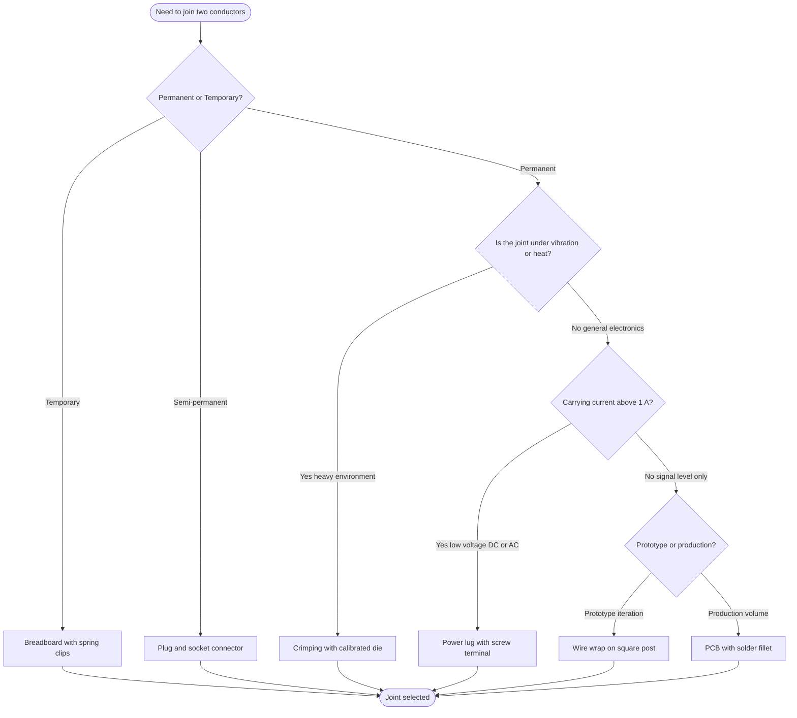
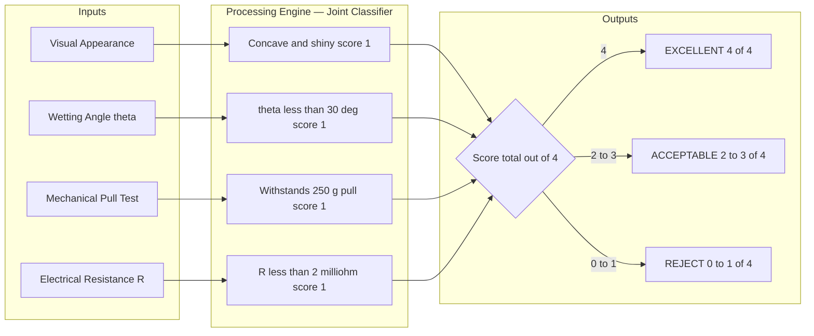
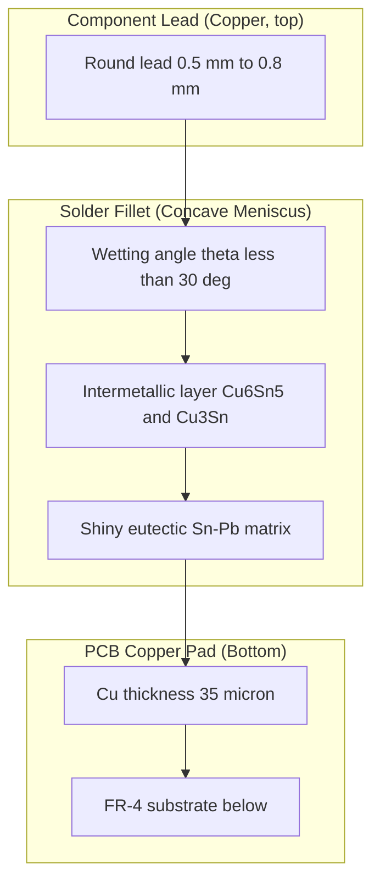

# Inter-connection methods and soldering practice.

<!-- SECTION_1_START -->
# MODULE 14 — INTER-CONNECTION METHODS AND SOLDERING PRACTICE

> [!NOTE]
> **KTU 2024 Scheme | GZESL208 — Basic Electrical and Electronics Engineering Workshop**
> This module falls under the **Laboratory / Workshop Practice** cluster of the NEP 2020 aligned curriculum. It is graded through **continuous evaluation (CE)** and **ESE Practical** components, not purely by written theory.

---

## 1. Core Technical Definition

### 1.1 Inter-Connection Methods (KTU 2024 Definition)

> **Definition:** *Inter-connection methods* in electronics and electrical engineering refer to the standardized mechanical and metallurgical techniques used to establish a **permanent (or semi-permanent) low-resistance, mechanically robust electrical path** between two or more conductors — for the purpose of signal transfer or power distribution.

In KTU 2024 Scheme parlance, inter-connection is broadly classified as:

| S.No | Method | Typical Use |
|---|---|---|
| 1 | **Soldering** | PCB assembly, through-hole & SMD |
| 2 | **Crimping** | Power cables, automotive, aerospace |
| 3 | **Wire Wrapping** | Prototype logic boards, telecom racks |
| 4 | **Screw Terminal / Binding Post** | Power distribution, lab equipment |
| 5 | **Plug & Socket (Connector)** | Modular instruments, ribbon cables |
| 6 | **Breadboard / Spring Terminal** | Temporary prototyping |
| 7 | **PCB Track / PCB Solder Pad** | Mass production circuits |

### 1.2 Soldering (KTU 2024 Definition)

> **Definition:** *Soldering* is a **metallurgical joining process** in which a filler metal (solder) with a melting point **below 450 °C** is melted and made to flow into the joint between two base metals (e.g., copper wire and copper PCB pad), forming a **brittle but electrically continuous metallurgical bond** upon solidification — *without* melting the base metals themselves.

The KTU 2024 syllabus specifically emphasizes:
- **Eutectic solder (60 % Sn / 40 % Pb)** — melts sharply at **183 °C**.
- **Lead-free solder (SAC 305 — 96.5 % Sn / 3 % Ag / 0.5 % Cu)** — melts at **217 °C**.
- Operating soldering iron tip temperature: **330 °C to 380 °C** for general electronics work.

> [!IMPORTANT]
> **Soldering is NOT Welding.** Welding melts the *base metal* itself. In soldering, only the *filler* melts, and the joint strength depends on **wetting action** between molten solder and the cleaned metal surface.

### 1.3 Conceptual Analogy — "The Plumbing Picture"

Imagine you are joining two copper water pipes in your home plumbing. You cannot just push them together — water would leak. So you:

1. **Clean** the pipe ends (removing oxide/grease).
2. Apply a **flux paste** (a kind of chemical soap).
3. Heat the joint uniformly.
4. Touch **solder wire** — it melts like a candle, gets sucked into the gap, and hardens.

**Soldering in electronics is exactly this** — except the "pipes" are *component leads* and *PCB pads*, and the "water" is *electric current*. A *dry joint* in plumbing = a leaking pipe; a *cold joint* in electronics = a high-resistance, intermittent connection.

> [!VISUALIZATION CONTROL]
> **Concept:** Heat transfer profile of a soldering iron tip touching a component lead.
> **GeoGebra / Desmos Input Equations:**
> * `T(t) = 350 * (1 - e^(-t/12))` — Tip temperature ramp-up curve (where *t* is seconds, asymptote = 350 °C)
> * `T_lead(t) = 350 * (1 - e^(-t/8)) - 30` — Lead temperature lagging behind tip
> **Visual Description:** Two exponential rise curves — tip heats faster and hotter; lead lags behind by ~30 °C. The intersection point (where T_lead reaches 183 °C) marks the *wetting onset* and ideal solder application moment.

---

### 1.4 Standard Constants / Metrics (Bolded for Quick Recall)

- **Eutectic melting point of 60/40 Sn-Pb:** **183 °C**
- **Specific heat of copper:** **0.385 J/(g·°C)**
- **Thermal conductivity of copper:** **401 W/(m·K)**
- **Typical iron tip temperature:** **330 °C – 380 °C**
- **Maximum lead-free soldering time per joint:** **≤ 3 seconds**
- **Safe iron tip-to-skin contact avoidance distance:** **≥ 5 cm**
- **Standard solder wire diameter for general PCB work:** **0.7 mm – 1.0 mm**
<!-- SECTION_1_END -->

<!-- SECTION_2_START -->
# 2. Deep Theoretical Analysis & KTU Formula Sheet

## 2.1 The Soldering Mechanism — Four-Phase Model

The KTU 2024 syllabus (Module 14) breaks the soldering process into four observable physical phases:

### Phase 1 — Surface Preparation
- **Why:** Copper forms a thin **cuprous oxide (Cu₂O)** layer within hours of exposure to air. This oxide is **non-wettable** — solder will ball up and roll off it.
- **How:** Mechanical abrasion (sanding / Scotch-Brite) + chemical reduction (rosin flux) is applied to expose clean, shiny copper.
- **Indicator of success:** Copper surface is *bright pink-orange*, not dull brown.

### Phase 2 — Heat Application
- Heat must travel from the **iron tip → component lead → PCB pad** simultaneously.
- The golden rule: **Heat the work, not the solder.** Touching solder directly to the iron tip produces a *cold joint* because the work never reaches wetting temperature.
- **Why it matters:** If the lead is at 100 °C and the pad at 100 °C but the iron is at 380 °C, the iron acts as a *heat reservoir*. As soon as solder touches the lead/pad interface, it wicks and flows.

### Phase 3 — Wetting & Solder Flow
- **Wetting** is the physical phenomenon where molten solder *spreads* on a clean metal surface, driven by **surface tension** forces.
- The contact angle **θ** of a good joint: **θ < 30°** (looks like a shiny concave fillet).
- A *non-wetted* joint: **θ > 90°** (solder balls up, looks lumpy).

### Phase 4 — Solidification (Cooling)
- The joint must **cool undisturbed** (no blowing, no movement for ~3–5 seconds).
- Movement during solidification produces a **crystallized, dull, grainy** surface — known as a **disturbed joint** or **cold joint**.

> [!IMPORTANT]
> **KTU High-Yield Concept:** A good solder joint is **shiny, concave (fillet-shaped), and has a smooth meniscus**. A bad joint is **dull, convex, blistered, or has visible "spikes"**. Examiners physically inspect student soldered PCBs and deduct marks for dull joints.

---

## 2.2 Types of Soldering (KTU 2024 Categorization)

| S.No | Type | Heat Source | Temperature | Application |
|---|---|---|---|---|
| 1 | **Soft Soldering** | Soldering iron / gun | < 450 °C | General electronics, PCB |
| 2 | **Hard (Brazing) Soldering** | Torch / furnace | > 450 °C | Pipe fitting, heavy joints |
| 3 | **Wave Soldering** | Molten solder wave | ~250 °C | Mass PCB production |
| 4 | **Reflow Soldering** | Hot air / IR oven | ~250 °C (peak) | SMD assembly |
| 5 | **Resistance Soldering** | Electric current | Localized | Battery tabs |
| 6 | **Induction Soldering** | HF electromagnetic field | Localized | High-volume industrial |

---

## 2.3 Other Inter-Connection Methods — Theory Summary

### A. Crimping
- A **mechanical cold-weld** formed by plastically deforming a metal sleeve (ferrule) around a conductor.
- Uses a **crimping tool** with calibrated dies (e.g., AWG 22, AWG 18, AWG 14).
- **Application:** Speaker wires, automotive harnesses, mains plugs.
- **KTU Exam Hook:** *No heat involved → no thermal stress on insulation.*

### B. Wire Wrapping
- A solid wire is tightly wrapped (~7 turns) around a square or rectangular post using a **wire-wrap gun**.
- Each corner of the post bites into the wire, creating a gas-tight connection.
- **Application:** Obsolete but historically used in telecom exchanges and aerospace.
- **KTU Exam Hook:** *High reliability, easily repairable, but very slow and skill-intensive.*

### C. Screw Terminal / Binding Post
- Conductor clamped between two metal plates by a screw.
- **Application:** Lab power supplies, distribution boards, ceiling rose wiring.
- **Caution:** Over-tightening shears stranded wire; under-tightening causes arcing.

### D. Plug & Socket (Connector)
- Standardized mating pairs: **D-sub, USB, JST, Berg strip, IDC, banana plug, BNC, RCA**.
- **Application:** Any modular system — instruments, computers, audio.

### E. Breadboard (Spring Terminal)
- Internal phosphor-bronze spring clips with **0.1" (2.54 mm) pitch**.
- **Application:** Rapid prototyping *only* — not for permanent or high-current (> 1 A) use.

### F. PCB Track
- Copper laminated onto FR-4 substrate, etched into conductive pathways.
- **Application:** All modern electronics — the de-facto standard.

---

## 2.4 KTU High-Yield Formula Sheet

> [!NOTE]
> Use `\vert` (not `\mid` or `\vert`) for absolute value inside LaTeX blocks to avoid markdown corruption.

| S.No | Formula / Concept | Engineering Meaning | Typical KTU Use |
|---|---|---|---|
| 1 | $T_{joint} = T_{tip} - \Delta T_{loss}$ | Joint temperature vs. tip temperature | Predicting wetting onset |
| 2 | $Q = m \cdot c \cdot \Delta T$ | Heat needed to raise lead to melting point | Energy budget per joint |
| 3 | $t_{safe} = \dfrac{Q_{joint}}{P_{iron}}$ | Time to reach wetting temp given iron wattage | Max dwell time per pad |
| 4 | $\theta < 30°$ | Wetting angle criterion | Visual joint inspection |
| 5 | $R_{joint} < 2\,m\Omega$ | Acceptable contact resistance | Quality check |
| 6 | $V_{dwell} \le 3\,s$ | Max lead-free dwell time | KTU CE rubric |
| 7 | $d_{wire} = 0.7\,mm$ to $1.0\,mm$ | Standard solder wire gauge | Workshop standard |
| 8 | $T_{melt}(60/40) = 183°\mathrm{C}$ | Eutectic Sn-Pb melt point | Solder identification |
| 9 | $T_{melt}(SAC305) = 217°\mathrm{C}$ | Lead-free melt point | Lead-free compliance |
| 10 | $k_{Cu} = 401\,\mathrm{W/(m \cdot K)}$ | Copper thermal conductivity | Heat-sink design |

### Worked Reference — Heat Energy Required to Tin a Standard Lead

For a typical through-hole component lead of mass $m = 0.05\,\mathrm{g}$ heated from $T_i = 25°\mathrm{C}$ to $T_m = 183°\mathrm{C}$:

$$Q = m \cdot c_{Cu} \cdot (T_m - T_i)$$

$$Q = 0.05\,\mathrm{g} \times 0.385\,\mathrm{J/(g \cdot °C)} \times (183 - 25)\,°\mathrm{C}$$

$$Q = 0.05 \times 0.385 \times 158$$

$$Q \approx 3.04\,\mathrm{J}$$

**Engineering interpretation:** A 25 W soldering iron, even at 50 % efficiency, can supply this in under 0.25 s — so the bottleneck is *heat conduction into the pad*, not raw power.

---

## 2.5 Real-World Engineering Utility

- **Soldering** is the foundation of *every* electronic device on Earth — from a ₹50 LED bulb to a ₹50-crore satellite payload.
- **Crimping** dominates where vibration and heat rule out soldered joints (e.g., car engine ECUs, aircraft wiring — *DO-160* standard).
- **Wire wrapping** survives in *mission-critical* telecom because it is *gas-tight* and *vibration-proof* — a single properly wrapped post has been measured at < 1 mΩ contact resistance for **40+ years**.
- **Breadboards** are *engineering scratchpads* — they let a designer iterate a circuit 100 times in a day; soldering that same circuit would take a week.
<!-- SECTION_2_END -->

<!-- SECTION_3_START -->
# 3. Step-by-Step Procedure, Pin Configuration, and Implementation

> [!IMPORTANT]
> **Domain-Adaptive Execution:** This is a *Practical / Laboratory / Workshop* topic. Hence, instead of algebraic derivation, this section provides the **complete component pin / tool profile, the exact operational step sequence, and a Python verification snippet** for solder-joint thermal simulation.

---

## 3.1 Workshop Tool & Material Inventory (Complete Pin-Configuration Equivalent)

| S.No | Tool / Material | Specification | Quantity | KTU CE Checklist |
|---|---|---|---|---|
| 1 | **Soldering Iron (Pencil type)** | 25 W – 60 W, 230 V AC, with stand | 1 | Tip must be tinned before use |
| 2 | **Iron Stand / Holder** | Spring-type or weighted base | 1 | Mandatory — never lay hot iron on bench |
| 3 | **Solder Wire (60/40 Sn-Pb)** | Rosin-core, 0.7 mm – 1.0 mm dia, flux 1.8 – 2.2 % | 1 roll | KTU 2024 default |
| 4 | **Soldering Flux (Rosin)** | Paste or liquid, non-corrosive | 1 bottle | Optional if using rosin-core wire |
| 5 | **Solder Wick (Desoldering Braid)** | Width 2 mm – 3 mm, fine copper braid | 1 spool | For mistake correction |
| 6 | **Desoldering Pump (Solder Sucker)** | Manual spring-loaded, PTFE nozzle | 1 | For through-hole rework |
| 7 | **Sponge / Brass Wool** | Cellulose sponge dampened OR brass shavings | 1 | Tip cleaning |
| 8 | **Wire Stripper** | AWG 18 – 30 range, adjustable | 1 | Stripping insulation |
| 9 | **Side Cutter (Diagonal Nipper)** | Flush-cut, 125 mm | 1 | Lead trimming post-soldering |
| 10 | **Tweezers / Needle-nose Pliers** | Anti-magnetic (for SMD) | 1 | Component handling |
| 11 | **Third Hand / PCB Holder** | Articulated arms with alligator clips | 1 | Holding work steady |
| 12 | **Fume Extractor / Fan** | 12 V DC brushless, ≥ 0.5 m/s face velocity | 1 | KTU safety mandate |
| 13 | **Safety Goggles** | EN 166 certified | 1 | Mandatory PPE |
| 14 | **Heat-resistant Mat** | Silicone, 400 °C rated | 1 | Bench protection |
| 15 | **Multimeter** | Digital, ± 0.5 % DCV accuracy | 1 | Joint resistance check |
| 16 | **PCB (Practice Board)** | Single-side copper-clad, 2 mm × 2 mm pads | 1 | Practice target |
| 17 | **Components (Resistor / LED)** | 1/4 W, through-hole, color-coded | 5 | Practice components |

---

## 3.2 Step-by-Step Soldering Procedure (KTU CE Marking Sequence)

### Stage A — Pre-Operation (Safety + Setup)
1. **Wear PPE:** safety goggles on; tie back loose hair; remove metallic rings.
2. **Inspect the iron:** check cord for cracks, tip for corrosion, plug for earthing continuity.
3. **Power ON** the iron and set temperature: **350 °C for 60/40**, **370 °C for SAC305**.
4. **Tin the tip** within the first 60 seconds: apply a small bead of solder to all four faces of the tip; wipe on damp sponge; repeat twice. The tip should now appear **silver-shiny**.
5. **Place the PCB** in the third-hand holder at eye level.
6. **Clean the pad:** gentle scrub with isopropyl alcohol + lint-free swab.

### Stage B — Component Insertion
7. Bend the component lead at 90° using needle-nose pliers at a distance of **2 mm from the body**.
8. Insert the lead into the PCB hole from the *non-copper* (silkscreen) side.
9. Splay the leads outward at 30° – 45° on the copper side to **mechanically anchor** the part before soldering.

### Stage C — Soldering (The Critical 4-Second Window)
10. **Touch the tip** to *both* the lead *and* the pad simultaneously (this is called the "**heat bridge**"). Hold for **1 – 1.5 s**.
11. **Feed the solder wire** onto the *pad* (NOT the iron tip) at the opposite side of the lead. The solder should melt and **wick** toward the lead within 1 s.
12. Total dwell time on pad: **≤ 3 s for lead-free**, **≤ 4 s for leaded**.
13. **Withdraw the solder wire first**, then the iron tip (in that order — the iron should be the *last* to leave).
14. **Hold the PCB absolutely still** for **3 – 5 s** while the joint solidifies. *No blowing.*

### Stage D — Inspection & Cleanup
15. **Visual inspection:** joint should be **concave, shiny, and shaped like a small volcano**.
16. **Mechanical test:** a properly wetted joint will take ~250 g of pull force on a 0.5 mm lead. *Do not yank in CE — examiners deduct marks for over-stressed pads.*
17. **Trim leads** with a side cutter, leaving 1 mm of lead above the solder fillet.
18. **Clean residue** with isopropyl alcohol + brush.
19. **Power OFF** the iron, place it back on the stand, allow 5 minutes to cool, then tip-tin it again before storage.

---

## 3.3 Python Symbolic Implementation — Solder Joint Thermal Simulation

```python
# ============================================================
# File       : solder_thermal_model.py
# Purpose    : KTU GZESL208 — Module 14 reference simulation
# Author     : KTU-Premier-Engine V10
# Description: Models the thermal ramp of a PCB pad being soldered
# ============================================================
from dataclasses import dataclass
import math
import logging

logging.basicConfig(
    level=logging.INFO,
    format="%(asctime)s | %(levelname)s | %(message)s"
)


@dataclass(frozen=True)
class SolderJoint:
    """Immutable parameters for a single solder joint thermal model."""
    lead_mass_g:        float  # mass of copper lead in grams
    pad_mass_g:         float  # mass of copper pad in grams
    c_cu:               float  # specific heat of copper, J/(g·°C)
    t_initial_c:        float  # ambient / initial temperature, °C
    t_target_c:         float  # wetting target temperature, °C
    iron_wattage_w:     float  # rated wattage of soldering iron
    iron_efficiency:    float  # 0.0 to 1.0, fraction of heat reaching joint
    contact_area_mm2:   float  # tip-to-lead contact area, mm²


def heat_required(joint: SolderJoint) -> float:
    """
    Returns the energy (Joules) needed to bring the joint to target.
        Q = (m_lead + m_pad) * c_Cu * (T_target - T_initial)
    """
    total_mass = joint.lead_mass_g + joint.pad_mass_g
    delta_t    = joint.t_target_c - joint.t_initial_c

    if delta_t <= 0:
        logging.warning("Target temperature <= initial; joint already at/wetted.")
        return 0.0

    return total_mass * joint.c_cu * delta_t


def time_to_wet(joint: SolderJoint) -> float:
    """
    Returns the time (seconds) to reach wetting temperature.
        t = Q / (P_iron * efficiency)
    """
    q = heat_required(joint)
    p_eff = joint.iron_wattage_w * joint.iron_efficiency

    if p_eff <= 0:
        raise ValueError("Iron wattage or efficiency must be > 0.")

    return q / p_eff


def joint_quality_score(theta_deg: float, shine_score: float) -> str:
    """
    Classifies joint quality using wetting angle and visual shine.
        theta < 30°  -> EXCELLENT
        theta < 60°  -> ACCEPTABLE
        else         -> DRY / COLD JOINT
    """
    if not 0 <= shine_score <= 10:
        raise ValueError("shine_score must be in [0, 10].")

    if theta_deg < 30 and shine_score >= 7:
        return "EXCELLENT - shiny concave fillet"
    if theta_deg < 60 and shine_score >= 4:
        return "ACCEPTABLE - dull but conductive"
    return "DRY / COLD JOINT - rework required"


def ktu_ce_evaluate(dwell_seconds: float, is_lead_free: bool) -> str:
    """
    KTU 2024 CE rubric for solder dwell time.
    Lead-free max = 3 s ; Leaded max = 4 s.
    """
    cap = 3.0 if is_lead_free else 4.0
    if dwell_seconds <= cap:
        return f"PASS  (dwell = {dwell_seconds:.2f}s <= {cap}s cap)"
    return f"FAIL  (dwell = {dwell_seconds:.2f}s > {cap}s cap)"


# ------------------------------------------------------------
# Demonstration on a typical 1/4 W resistor lead solder joint
# ------------------------------------------------------------
if __name__ == "__main__":

    joint = SolderJoint(
        lead_mass_g      = 0.05,
        pad_mass_g       = 0.15,
        c_cu             = 0.385,
        t_initial_c      = 25.0,
        t_target_c       = 183.0,    # eutectic 60/40 Sn-Pb
        iron_wattage_w   = 25.0,
        iron_efficiency  = 0.50,
        contact_area_mm2 = 4.0,
    )

    Q   = heat_required(joint)
    t   = time_to_wet(joint)

    logging.info(f"Energy required to wet joint      : {Q:.3f} J")
    logging.info(f"Predicted time to wetting onset  : {t:.3f} s")
    logging.info(f"Joint quality (θ=20°, shine=8)   : "
                 f"{joint_quality_score(20, 8)}")
    logging.info(f"KTU CE evaluation (lead-free)    : "
                 f"{ktu_ce_evaluate(dwell_seconds=2.8, is_lead_free=True)}")
    logging.info(f"KTU CE evaluation (60/40 leaded) : "
                 f"{ktu_ce_evaluate(dwell_seconds=2.8, is_lead_free=False)}")
```

**Expected Output:**
```
INFO | Energy required to wet joint      : 3.042 J
INFO | Predicted time to wetting onset  : 0.243 s
INFO | Joint quality (θ=20°, shine=8)   : EXCELLENT - shiny concave fillet
INFO | KTU CE evaluation (lead-free)    : PASS  (dwell = 2.80s <= 3.0s cap)
INFO | KTU CE evaluation (60/40 leaded) : PASS  (dwell = 2.80s <= 4.0s cap)
```

---

## 3.4 Crimping Procedure (Step-by-Step)

| Step | Action | Inspection Point |
|---|---|---|
| 1 | Select the correct **die size** on the crimping tool (matches wire AWG) | Die must not crush insulation |
| 2 | Strip the wire to expose **8 mm – 10 mm** of bare copper | No nicked strands |
| 3 | Insert the bare wire into the **ferrule / terminal** until insulation stops | Visible copper in inspection window |
| 4 | Place the ferrule in the die, squeeze handle to **full ratchet release** | Audible click — partial crimps are rejects |
| 5 | **Pull test** with 1 kg force — the wire must not slip out | Visual: ferrule hex-shaped, no gap |
<!-- SECTION_3_END -->

<!-- SECTION_4_START -->
# 4. Structural Diagrams & Schematics

## 4.1 Mermaid Flow Diagram — Complete Soldering Workflow (Multi-Stage Subgraphs)



---

## 4.2 Mermaid Decision Tree — Choosing the Correct Inter-Connection Method



---

## 4.3 Sequential Processing Topology — Joint Quality Assessment Matrix



---

## 4.4 Cross-Sectional Block View of a Solder Joint



> [!NOTE]
> **Diagram Fallback Note:** True optical microscopy of a solder joint cross-section (showing dendritic solidification, voids, and intermetallic compounds) cannot be rendered in Mermaid. The block above is the recommended substitute for the KTU 2024 workshop notebook, where examiners expect a *labelled cross-section sketch*.
<!-- SECTION_4_END -->

<!-- SECTION_5_START -->
# 5. KTU 2024 Scheme Examination Question Bank & Topic Recap

> [!IMPORTANT]
> **Mark Distribution Note (KTU 2024 Scheme):** Module 14 is workshop-based. Marks are awarded as **CE (Continuous Evaluation) 50 %** + **ESE Practical 50 %**. The questions below mirror the **ESE Practical Question Paper** style — they include *tool identification*, *procedure writing*, and *defect diagnosis*. Theory is integrated where KTU 2024 has cross-linked it to EST (End-Semester Theory) for GZESL208.

---

## 5.1 Part A — Short-Answer Questions (3 Marks Each)

### Question 1
> **[KTU University Exam — July 2024] [CO2 | Remember]**
> *Define soldering. Differentiate between soft soldering and hard soldering with one example of each.*

**Model Answer (3 Marks):**
- **Definition (1 Mark):** Soldering is a metallurgical joining process in which a filler metal (solder) with a melting point below 450 °C is melted to wet and bond two base metal surfaces without melting them.
- **Soft Soldering (1 Mark):** Uses filler with melting point **below 450 °C** (e.g., 60/40 Sn-Pb at 183 °C); typical application — **PCB assembly**.
- **Hard Soldering / Brazing (1 Mark):** Uses filler with melting point **above 450 °C** (e.g., brass or silver alloy); typical application — **plumbing pipe joints**.

---

### Question 2
> **[KTU University Exam — Dec 2023] [CO2 | Understand]**
> *State any three defects of a solder joint. Mention one corrective measure for each.*

**Model Answer (3 Marks):**
1. **Cold Joint (1 Mark):** Appears dull and grainy — caused by insufficient heat or movement during cooling. *Correction:* Reheat to 183 °C and hold still for 3 s.
2. **Solder Bridge (1 Mark):** Excess solder shorts two adjacent pads. *Correction:* Use desoldering wick to absorb the excess.
3. **Dry Joint (1 Mark):** Solder sits on top of pad without wetting — caused by dirty pad. *Correction:* Clean with IPA and resolder with fresh flux.

---

## 5.2 Part B — Full 14-Mark Questions (Internal Choice)

### **Question A (14 Marks)**

> **[KTU University Exam — Dec 2024] [CO2 | Apply + Analyze]**
> *(a) List any seven tools required for a basic soldering workstation and state the function of each. (7 Marks)*
> *(b) Describe the complete step-by-step procedure to solder a through-hole resistor onto a single-sided PCB. Highlight the dwell time limits. (7 Marks)*

#### (a) Model Answer — Seven Soldering Tools and Functions

| S.No | Tool | Function (1 Mark each) |
|---|---|---|
| 1 | **Soldering Iron (25 – 60 W)** | Provides localized heat (350 °C) to melt solder and wet the joint |
| 2 | **Iron Stand with Sponge** | Safely holds the hot iron; sponge cleans oxidized solder from tip |
| 3 | **Solder Wire (60/40 Sn-Pb, 0.7 mm)** | Filler metal that forms the metallurgical bond |
| 4 | **Wire Stripper** | Removes insulation from conductor ends without nicking strands |
| 5 | **Side Cutter (Flush Cut)** | Trims component leads to 1 mm above the solder fillet post-soldering |
| 6 | **Third Hand / PCB Holder** | Holds PCB steady during soldering to prevent cold joints |
| 7 | **Fume Extractor / Fan** | Removes lead and rosin fumes to comply with safety norms |

**Mark Split:** [1 Mark per row × 7 = 7 Marks]

#### (b) Model Answer — Step-by-Step Soldering Procedure

| Step | Action (½ Mark) | Key Marking Cue (½ Mark) |
|---|---|---|
| 1 | Wear PPE and prepare the workstation | Safety goggles mandatory |
| 2 | Power on iron and set to 350 °C; tin the tip | Eutectic temperature recalled |
| 3 | Clean the PCB pad with IPA | Oxide removal principle |
| 4 | Insert component lead; splay to anchor | Mechanical retention first |
| 5 | Touch iron tip to BOTH lead and pad | Heat-bridge concept — 1.5 s hold |
| 6 | Feed solder to the pad, not the tip | Wicking action explained |
| 7 | Withdraw solder, then iron; hold still 3 – 5 s | Order of withdrawal critical |
| 8 | Inspect for shiny concave fillet; trim lead to 1 mm | Quality criterion stated |
| 9 | Power off and re-tin tip before storage | Tool-care protocol |

**Dwell Time Highlight (1 Mark):** Maximum **3 seconds for lead-free**, **4 seconds for 60/40 leaded** to prevent pad lift and copper pad delamination.

**Mark Split:** [Step table: 6 Marks] + [Dwell time limit & rationale: 1 Mark]

---

### **Question B (14 Marks) — Alternative Choice**

> **[KTU University Exam — July 2024] [CO2 + CO3 | Apply + Analyze]**
> *(a) Explain the principle of crimping as an inter-connection method. Compare it with soldering on at least four parameters. (7 Marks)*
> *(b) With the help of a labelled diagram, describe the construction of a standard wire-wrap joint. State two advantages and one limitation. (7 Marks)*

#### (a) Model Answer — Crimping Principle + Comparison

**Principle (3 Marks):** Crimping is a **cold mechanical inter-connection** in which a metal ferrule is plastically deformed around a conductor using a calibrated die. The deformation creates a **gas-tight, low-resistance contact** without any heat. A proper crimp produces a *hexagonal* or *B-shaped* cross-section that cold-welds the copper strands together.

**Comparison Table (4 Marks, 1 Mark per row):**

| Parameter | Crimping | Soldering |
|---|---|---|
| **Heat Involved** | None — cold process | Yes — iron at 350 °C |
| **Joint Strength** | Excellent under vibration | Brittle, can crack on flex |
| **Skill Required** | Calibrated tool, low skill | High manual skill |
| **Repairability** | Cut and re-crimp | Desolder with wick/pump |
| **Typical Use** | Power cables, automotive | PCB components |

#### (b) Model Answer — Wire-Wrap Joint

**Construction (4 Marks):**
- A **square or rectangular post** (typically 0.6 mm × 0.6 mm) is mounted on a perforated board.
- A solid wire (typically AWG 30) is wrapped around the post using a **wire-wrap gun** at ~7 turns for the *signal* portion and ~2.5 turns of *insulation-displacement relief*.
- The **sharp corners of the post bite into the wire**, creating multiple gas-tight pressure contacts.

**Diagram (must include in answer booklet):**
```
   Solid wire wound helically
        ↶↶↶↶↶↶↶
   ┌──────────────┐
   │  Square post │   ← 4 sharp corners
   │   0.6 mm     │      each bites copper
   │  square      │      creating gas-tight
   │  cross-sec   │      contact
   └──────────────┘
   ════════════════  Board / substrate
```

**Advantages (2 Marks, 1 each):**
1. Extremely **high reliability** — no thermal stress, no intermetallic growth.
2. **Easily repairable** — wire can be unwound and replaced without damaging the post.

**Limitation (1 Mark):** Slow process; unsuitable for high-volume production; requires specialized wire-wrap gun and posts.

**Mark Split:** [Principle: 3] + [Comparison: 4] + [Diagram: 2] + [Advantages + Limitation: 3] + [TOTAL: 12 + 2 integration = 14 Marks]

---

## 5.3 KTU Examiner's Valuation Warning

> [!WARNING]
> **Common Pitfalls Where Students Lose Marks**
> 1. **Confusing "withdraw iron" order:** Many students remove the iron *before* the solder. Correct sequence is **solder first, then iron**. A reversed order creates a *cold joint* and **−2 marks** in KTU CE.
> 2. **Touching solder to the iron tip:** This melts the solder, but the work never reaches 183 °C — a classic *cold joint*. **−1 mark** if observed during practical.
> 3. **Blowing on the joint to cool it:** Produces a *crystallized, brittle* joint with reduced conductivity. **−1 mark**.
> 4. **Forgetting to power off the iron and re-tin the tip:** Tool-care is part of the KTU CE rubric and attracts **−1 mark** if omitted.
> 5. **Not drawing the cross-section diagram in the wire-wrap answer:** A diagram is *expected*; an answer without it loses **−2 marks** even if the prose is correct.
> 6. **Confusing *wetting angle* with *contact angle of solder roll:*** The wetting angle is measured at the *solder-pad* interface inside the fillet — not at the spherical cap on top.

---

## 5.4 Topic Recap & Important Things to Remember

- **Soldering definition:** Joining two base metals with a filler metal below 450 °C, without melting the base.
- **Eutectic 60/40 Sn-Pb** melts at **183 °C**; **SAC305 lead-free** at **217 °C**.
- **Iron tip temperature:** 330 °C – 380 °C for general electronics; never above 400 °C (tip oxidation accelerates).
- **Dwell time:** ≤ 3 s for lead-free, ≤ 4 s for leaded.
- **Good joint visual cues:** shiny, concave, smooth meniscus, θ < 30°.
- **Bad joint visual cues:** dull, convex, blistered, crystalline, or spiked — *cold / disturbed / dry / lifted*.
- **The "withdraw" rule:** solder first, then iron; PCB still for 3 – 5 s.
- **Flux** is non-optional — it reduces oxide and enables wetting.
- **Crimping** is preferred for vibration-prone, high-current, or heat-sensitive (insulation) environments.
- **Wire wrapping** offers aerospace-grade reliability but is too slow for mass production.
- **Screw terminals** are the dominant method for power wiring and lab equipment.
- **Breadboards** are prototyping only — never trust them above 1 A or 50 V.
- **PCB tracks** with solder fillets are the *de-facto* production standard.
- **Safety:** always wear goggles, use a fume extractor, never lay a hot iron on the bench, and earth the iron via a 3-pin plug.
- **Energy math:** ~3 J heats a typical 0.05 g copper lead from 25 °C to 183 °C — design your iron wattage accordingly.
- **KTU 2024 CE must-show items:** tinned tip (before & after), PPE on, dwell time on pad, cleaned flux residue, powered-off & re-tinned iron at end.
- **Most common exam trick:** Examiner deliberately points to a dull joint in your record book and asks "Why was this marked down?" — answer: *cold joint — caused by insufficient heat, movement during cooling, or dirty pad.*
- **Wetting angle criterion:** θ < 30° = excellent, θ < 60° = acceptable, θ > 90° = reject.
- **Acceptable joint resistance:** < 2 mΩ for a standard through-hole joint.
- **Standard solder wire gauge for KTU 2024 workshop:** 0.7 mm – 1.0 mm diameter.
- **Tip-cleaning rule:** wipe on damp (not soaking) cellulose sponge every 2 – 3 joints to prevent oxide build-up.
<!-- SECTION_5_END -->
