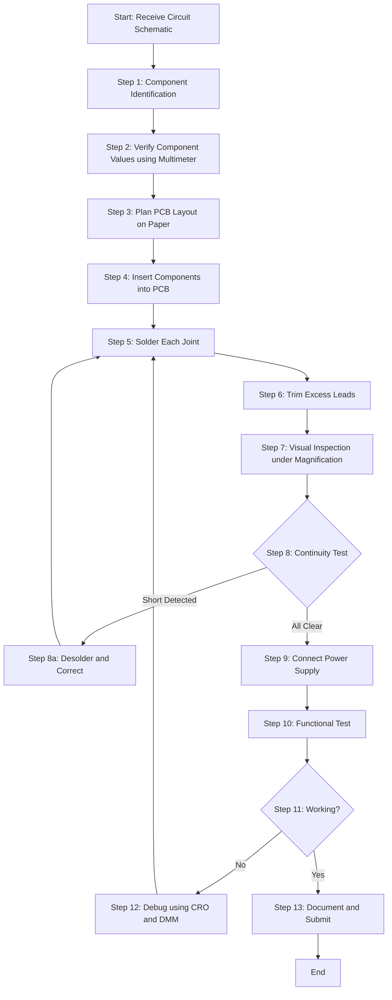
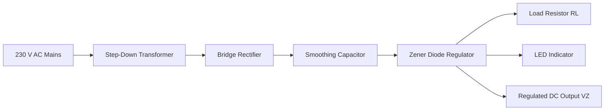
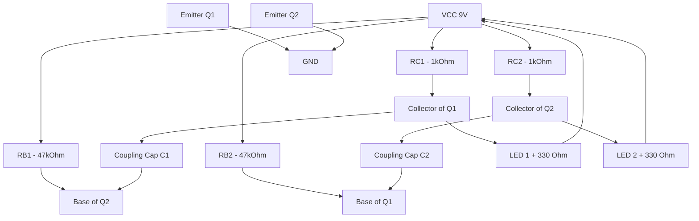
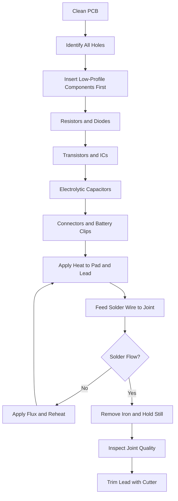

# Assembling of electronic circuit/system on general purpose PCB, test and show the functioning (Any two)-

<!-- SECTION_1_START -->
# Module 15: Assembling of Electronic Circuit/System on General Purpose PCB

## 1.1 Formal KTU 2024 Definition

A **General Purpose PCB (Printed Circuit Board)** is a standard, pre-fabricated insulated substrate (typically **FR-2 phenolic resin** or **FR-4 fiberglass**) laminated with a thin layer of copper on one or both sides, used as a universal platform for the physical construction and electrical interconnection of discrete and active electronic components. It contains a generic grid of plated or unplated through-holes designed to accommodate a wide variety of circuit configurations without the need for a custom-designed board.

**Electronic Circuit Assembly on General Purpose PCB** is the systematic process of translating a circuit schematic diagram into a functional hardware prototype by physically mounting, soldering, and interconnecting electronic components on the universal board, followed by verification through electrical testing.

> [!NOTE]
> **KTU 2024 Syllabus Highlight (GZESL208):** The workshop mandates that each student must assemble and demonstrate the functioning of **at least TWO** distinct electronic circuits on a general-purpose PCB. The circuits are tested using standard laboratory instruments (Multimeter, CRO/DSO, Function Generator) and the results are recorded in the lab manual.

## 1.2 Conceptual Analogy — The "City on a Plot of Land"

Imagine you are building a small township on an empty rectangular plot of land:
- The **PCB** is the empty land plot — a flat, structured surface ready to be developed.
- The **copper tracks/lines** are the **roads** carved into the plot, which connect different zones electrically (like how roads connect different parts of a city).
- The **electronic components** (resistors, capacitors, transistors, ICs) are the **buildings** — each performing a specific function (residential, commercial, industrial).
- The **solder joints** are the **intersections and junctions** where two roads meet or where a building connects to the road.
- The **power supply rails (VCC and GND)** are the **main water and electricity supply lines** feeding the entire township.
- The **drilled holes** on the PCB are the **pre-marked plots** allocated for constructing buildings.

Just as a city planner must decide where to place roads and buildings, an electronics engineer must plan the **component layout** and **track routing** to avoid short circuits, minimize noise, and ensure signal integrity.

## 1.3 Tools, Equipment & Safety Overview

| Category | Item | Specific Use |
|---|---|---|
| **Soldering Station** | Soldering Iron (15W–25W) | Melting solder for joint formation |
| **Soldering Station** | Solder Wire (60/40 Sn-Pb, Rosin-core) | Metallic bonding agent |
| **Soldering Station** | Soldering Flux / Paste | Prevents oxidation during soldering |
| **Soldering Station** | Solder Wick / Desoldering Pump | Removal of excess solder or mistakes |
| **Hand Tools** | Wire Stripper & Cutter | Trimming component leads |
| **Hand Tools** | Needle-Nose Pliers | Bending leads for insertion |
| **Hand Tools** | Tweezers | Holding small SMD components |
| **Hand Tools** | PCB Holder / Vise | Stabilizing the board during soldering |
| **Testing** | Digital Multimeter (DMM) | Voltage, Current, Resistance, Continuity |
| **Testing** | CRO / DSO | Waveform observation |
| **Testing** | Function Generator | Input signal injection |
| **Testing** | Regulated DC Power Supply | Powering the circuit |
| **Consumables** | General Purpose PCB | The mounting platform |
| **Consumables** | Cleaning Solvent (IPA) | Post-soldering flux residue removal |

> [!IMPORTANT]
> **Workshop Safety Rule:** Always wear **anti-static wrist straps** when handling ICs. Soldering irons operate at **$350^\circ\text{C} - 400^\circ\text{C}$** — never touch the metallic shaft. Ensure proper ventilation to avoid inhaling rosin fumes.

## 1.4 Standard PCB Specification (General Purpose)

| Parameter | Typical Specification |
|---|---|
| Substrate Material | **Phenolic Resin (FR-2)** or Fiberglass (FR-4) |
| Copper Thickness | **$35\ \mu\text{m}$** (1 oz/ft²) |
| Hole Diameter | **$0.8\ \text{mm}$ to $1.2\ \text{mm}$** |
| Hole Pitch (Grid) | **$2.54\ \text{mm}$** (0.1 inch — standard DIP pitch) |
| Board Thickness | **$1.6\ \text{mm}$** |
| Number of Sides | Single-sided (most common) or Double-sided |
| Track Width | Hand-drawn using **permanent marker** and **ferric chloride etching** or direct wire-jumper soldering |

<!-- SECTION_1_END -->

<!-- SECTION_2_START -->
# SECTION 2: Deep Theoretical Analysis & KTU Formula Sheet

## 2.1 Classification of General Purpose PCBs

1. **Stripboard / Veroboard:** Pre-cut parallel copper strips running along one axis. Components are placed perpendicular to the strips and cuts are made with a spot-face cutter to break unwanted connections.
2. **Dot Board / Perf Board:** A matrix of isolated copper pads (dots) with no interconnections. The user must manually bridge pads using jumper wires or solder blobs. Most flexible but most error-prone.
3. **Breadboard (Zero PCB - Solderless):** Internal spring clips allow temporary insertion of components without soldering. Used only for prototyping; not a "PCB" in the strict assembly sense.
4. **Etched Custom PCB:** A blank copper-clad board is coated with etchant-resistant ink, then chemically etched with **ferric chloride ($\text{FeCl}_3$)** to leave behind custom tracks.

## 2.2 Soldering Theory — The Metallurgical Bond

Soldering is **not** a mechanical joint. It is a **metallurgical alloy bond** formed between the molten solder and the copper pad + component lead at temperatures exceeding the solder's liquidus point (~$183^\circ\text{C}$ for **60/40 Sn-Pb**).

**The Five Pillars of a Good Solder Joint:**
- **Wetting:** Solder flows freely over the heated pad and lead, indicating good surface adhesion.
- **Concave Fillet:** A perfect joint has a shiny, volcano-shaped (concave) fillet.
- **Shiny Surface:** A grainy or dull surface indicates a **"Cold Joint"** (insufficient heat).
- **No Bridges:** Solder must not accidentally connect two adjacent tracks (solder bridge → short circuit).
- **Right Amount of Solder:** Excessive solder creates blobs; insufficient solder creates weak joints.

## 2.3 Resistor Color Code (Mandatory Workshop Skill)

A standard 4-band resistor is decoded as:
$$R = (B_1 \times 10 + B_2) \times 10^{B_3} \pm \text{Tolerance}$$

where $B_1$ is the first significant digit, $B_2$ is the second significant digit, $B_3$ is the multiplier, and the 4th band denotes tolerance.

| Color | Digit | Multiplier |
|---|---|---|
| Black | 0 | $10^0 = 1$ |
| Brown | 1 | $10^1 = 10$ |
| Red | 2 | $10^2 = 100$ |
| Orange | 3 | $10^3 = 1\text{k}$ |
| Yellow | 4 | $10^4 = 10\text{k}$ |
| Green | 5 | $10^5 = 100\text{k}$ |
| Blue | 6 | $10^6 = 1\text{M}$ |
| Gold | — | $\times 0.1$ |
| Silver | — | $\times 0.01$ |

## 2.4 Testing Methodology

After assembly, every circuit undergoes three layers of testing:

| Test Stage | Instrument | Purpose |
|---|---|---|
| **Visual Inspection** | Magnifying lamp | Detect solder bridges, dry joints, wrong polarity |
| **Continuity Test** | Digital Multimeter (Buzzer mode) | Verify every intended connection and confirm no shorts |
| **Functional Test** | Power Supply + CRO/DMM | Verify the circuit performs its intended function |

## 2.5 KTU High-Yield Formula Sheet

> [!IMPORTANT]
> The following formulas are tested in KTU viva voce and problem-solving questions.

| S.No. | Formula / Law | Expression | Engineering Application |
|---|---|---|---|
| 1 | Ohm's Law | $V = I \times R$ | Biasing calculations |
| 2 | Power Dissipation | $P = V \times I = I^2 R = \frac{V^2}{R}$ | Heat sink sizing, resistor wattage selection |
| 3 | Resistor Color Code | $R = (B_1 B_2) \times 10^{B_3}$ | Identifying resistance values |
| 4 | LED Current Limiting Resistor | $R = \frac{V_{S} - V_{F}}{I_{F}}$ | Protecting LED from burnout |
| 5 | RC Time Constant | $\tau = R \times C$ | Timing circuits, filters |
| 6 | Capacitor Energy | $E = \frac{1}{2} C V^2$ | Energy storage circuits |
| 7 | Astable Multivibrator Frequency | $f = \frac{1}{1.4 \times R \times C}$ | Square wave generator |
| 8 | Zener Voltage Regulator | $V_{\text{out}} = V_{Z}$ | Constant DC reference |
| 9 | Transformer Turns Ratio | $\frac{V_p}{V_s} = \frac{N_p}{N_s}$ | Step-down for power supplies |
| 10 | Series Capacitor (Rectifier Filter) | $V_{\text{DC}} \approx 1.414 \times V_{\text{RMS}}$ | Filter capacitor sizing |
| 11 | Resistors in Series | $R_{\text{eq}} = R_1 + R_2 + \dots + R_n$ | Voltage divider design |
| 12 | Resistors in Parallel | $\frac{1}{R_{\text{eq}}} = \frac{1}{R_1} + \frac{1}{R_2} + \dots + \frac{1}{R_n}$ | Current divider design |

## 2.6 Real-World Engineering Utility

PCB assembly on general-purpose boards is the foundational skill underlying:
- **Rapid Prototyping:** Startups and R&D labs use perf boards to validate designs before investing in custom-fabricated PCBs.
- **Educational Tool:** Universities worldwide use it to teach students the transition from theoretical schematic to physical hardware.
- **Low-Volume Production:** Certain niche products (audio amplifiers, custom sensor modules) are still hand-assembled on general-purpose PCBs.
- **Repair & Rework:** Field engineers use point-to-point soldering on perf boards to replace damaged components on legacy equipment where replacement PCBs are unavailable.
<!-- SECTION_2_END -->

<!-- SECTION_3_START -->
# SECTION 3: Step-by-Step Assembly & Implementation of Two KTU Workshop Circuits

> [!NOTE]
> Per KTU 2024 Scheme guidelines for GZESL208, the student must assemble and demonstrate **ANY TWO** of the following circuits. The two most frequently tested are:
> 1. **Zener Diode Voltage Regulator Circuit**
> 2. **Astable Multivibrator (LED Flasher)**

---

## 3.1 CIRCUIT 1: Zener Diode Voltage Regulator

### 3.1.1 Objective
To design and assemble a **5.1 V DC regulated power supply** using a step-down transformer, bridge rectifier, filter capacitor, and Zener diode on a general-purpose PCB, and to verify the constant output voltage under varying load conditions.

### 3.1.2 Circuit Schematic & Functional Description

A **Zener diode** is a heavily doped p-n junction designed to operate in the **reverse breakdown region** without being damaged. When the reverse voltage across the Zener equals its rated **Zener voltage $V_Z$**, it conducts heavily and maintains a nearly constant voltage across its terminals — making it ideal for voltage regulation.

The complete assembly pipeline is:
$$\text{230 V AC} \xrightarrow{\text{Transformer}} \text{12 V AC} \xrightarrow{\text{Bridge Rectifier}} \text{Pulsating DC} \xrightarrow{\text{Capacitor}} \text{Filtered DC} \xrightarrow{\text{Zener Diode}} \text{Regulated } V_Z$$

### 3.1.3 Component List & Pin Configurations

| S.No. | Component | Specification | Quantity | Pin Configuration / Identification |
|---|---|---|---|---|
| 1 | Step-Down Transformer | 230 V AC to 12 V AC, 500 mA | 1 | Primary: 2 pins (Line & Neutral); Secondary: 2 pins (AC out) |
| 2 | Bridge Rectifier (or 4 × 1N4007 Diodes) | 1 A, 50 V (1N4007) | 1 (or 4) | 4 pins: AC, AC, DC+, DC- (Marked with $\sim$ and $+$/$-$ symbols) |
| 3 | Filter Capacitor (Electrolytic) | 1000 µF / 25 V | 1 | Longer lead = Anode (+); Shorter lead = Cathode (-); Stripe on body indicates negative |
| 4 | Zener Diode | 5.1 V, 0.5 W (1N4733) | 1 | Cathode (marked with a black bar) connects to positive rail; Anode to ground |
| 5 | Current Limiting Resistor $R_S$ | 330 Ω, ¼ W (Color: Orange-Orange-Brown-Gold) | 1 | Non-polar; any orientation |
| 6 | Load Resistor $R_L$ | 1 kΩ, ¼ W (Color: Brown-Black-Red-Gold) | 1 | Non-polar |
| 7 | LED Indicator | 5 mm, Red, 20 mA | 1 | Longer lead = Anode (+); Shorter = Cathode (-) |
| 8 | LED Series Resistor | 470 Ω, ¼ W | 1 | Non-polar |
| 9 | General Purpose PCB | Single-sided, 2.54 mm pitch | 1 | — |
| 10 | Connecting Wires | 22 AWG copper | As required | — |

### 3.1.4 Required Tools & Safety Equipment

| Tool | Specification | Purpose |
|---|---|---|
| Soldering Iron | 25 W, with stand | Soldering components |
| Solder Wire | 60/40 Sn-Pb, 0.8 mm diameter | Joining leads and pads |
| Wire Cutter | Flush-cut type | Trimming leads |
| Multimeter | Digital, with DC Voltage mode | Measuring output |
| Breadboard (optional) | 830 tie-points | Pre-testing before PCB assembly |
| Safety Goggles | ANSI Z87.1 rated | Eye protection from solder splashes |
| Anti-static Mat | ESD-safe surface | Preventing component damage |

### 3.1.5 Hardware Wiring Sequence (Step-by-Step Assembly)

**Step 1 — Safety Setup**
Wear anti-static wrist strap. Place the soldering iron in its stand and allow it to reach operating temperature ($\approx 350^\circ\text{C}$). Keep a wet sponge nearby for tip cleaning.

**Step 2 — PCB Inspection and Planning**
Inspect the general-purpose PCB for any pre-existing copper bridges between adjacent holes. Use a multimeter in continuity mode to identify and remove any unintended short circuits between adjacent pads.

**Step 3 — Mount the Transformer (Off-PCB)**
The transformer is too heavy and bulky to mount directly on the PCB. Fix it on the workshop table or chassis and bring only the **two secondary AC leads** (typically red and black) to the PCB terminals.

**Step 4 — Mount the Bridge Rectifier / Diodes**
Insert the bridge rectifier (or four 1N4007 diodes in bridge configuration) onto the PCB. **Verify polarity carefully.** The two AC input pins connect to the transformer secondary. The DC+ and DC- outputs will feed the filter capacitor.

**Step 5 — Soldering the Filter Capacitor**
Insert the 1000 µF electrolytic capacitor with the **correct polarity**: the longer lead (positive) goes to the **DC+ rail** (positive output of bridge), and the shorter lead (negative) goes to the **GND rail**. The negative side stripe on the capacitor body must align with the GND.

**Step 6 — Soldering the Zener Diode**
Connect the **Zener diode in reverse bias** between the DC output and ground:
- The **cathode (marked with black bar)** connects to the **positive DC rail**.
- The **anode** connects to the **ground rail**.

**Step 7 — Soldering the Series Resistor $R_S$ (330 Ω)**
This resistor drops the excess voltage and limits the Zener current. Solder it in series between the bridge rectifier output and the Zener cathode.

**Step 8 — Soldering the Load Resistor $R_L$ (1 kΩ)**
Connect it across the Zener diode (from the regulated DC output to ground) to simulate an actual load.

**Step 9 — Soldering the LED Indicator Circuit**
Connect a 470 Ω resistor in series with the LED. The LED anode goes to the regulated output, and the LED cathode goes to ground. When powered, the LED glows, confirming voltage regulation.

**Step 10 — Final Solder Joint Inspection**
Visually inspect every joint under magnification. Each joint should appear:
- **Shiny** (not dull or grainy)
- **Concave** (volcano-shaped, not a blob)
- **Wetting both the pad and the lead**

Use a multimeter in continuity mode to confirm there is no short circuit between VCC and GND rails.

**Step 11 — Power-On Test**
Connect the 230 V AC mains to the transformer primary through an isolation switch and fuse. Measure:
- Input to transformer: **230 V AC**
- Transformer secondary: **$\approx$ 12 V AC**
- DC output of bridge rectifier: **$\approx$ 16-17 V DC (no load)**
- Output across Zener (with load): **$5.1\ \text{V} \pm 5\%$**

### 3.1.6 Testing Procedure & Expected Results

| Test | Procedure | Expected Result |
|---|---|---|
| Visual Inspection | Check all solder joints | All joints shiny, no bridges |
| No-Load Output | Measure voltage across Zener | $V_{\text{out}} \approx 5.1\ \text{V}$ |
| Loaded Output (1 kΩ) | Connect $R_L$ and re-measure | $V_{\text{out}} \approx 5.1\ \text{V}$ (constant) |
| Ripple Observation | Use CRO to view output | Smooth DC with minimal ripple |
| LED Glow | Apply rated voltage | LED lights up steadily |
| Heat Test | Touch Zener after 1 minute | Slightly warm (within safe limit) |

### 3.1.7 Design Calculation (Sample)

Given: $V_{\text{in(DC)}} = 17\ \text{V}$, $V_Z = 5.1\ \text{V}$, $I_L = 5\ \text{mA}$ (load current), $I_Z = 5\ \text{mA}$ (minimum Zener current)

**Step 1 — Calculate the series resistor $R_S$:**

$$R_S = \frac{V_{\text{in}} - V_Z}{I_Z + I_L}$$

$$R_S = \frac{17 - 5.1}{(5 + 5) \times 10^{-3}}$$

$$R_S = \frac{11.9}{0.01} = 1190\ \Omega \approx 1.2\ \text{k}\Omega$$

**Step 2 — Use the nearest standard value, 1.2 kΩ (Color: Brown-Red-Red-Gold).**

---

## 3.2 CIRCUIT 2: Astable Multivibrator (LED Flasher)

### 3.2.1 Objective
To design and assemble an **astable multivibrator** using two BC547 NPN transistors on a general-purpose PCB, and to demonstrate its functioning as a **free-running square wave generator** that alternately flashes two LEDs.

### 3.2.2 Circuit Schematic & Functional Description

An **astable multivibrator** has **no stable state** — it continuously switches between two states, producing a square wave output. The switching is controlled by the charging and discharging of two cross-coupled **capacitors**.

The output frequency for a symmetric astable multivibrator is given by:
$$f = \frac{1}{1.4 \times R \times C}$$

where $R$ is the base resistor and $C$ is the coupling capacitor.

### 3.2.3 Component List & Pin Configurations

| S.No. | Component | Specification | Quantity | Pin Configuration |
|---|---|---|---|---|
| 1 | NPN Transistor (BC547) | $V_{CE} = 45\ \text{V}$, $I_C = 100\ \text{mA}$ | 2 | **EBC Pinout (flat face):** Pin 1 = Emitter, Pin 2 = Base, Pin 3 = Collector |
| 2 | Collector Resistor $R_C$ | 1 kΩ, ¼ W (Brown-Black-Red-Gold) | 2 | Between VCC and collector of each transistor |
| 3 | Base Resistor $R_B$ | 47 kΩ, ¼ W (Yellow-Violet-Orange-Gold) | 2 | Between VCC and base of opposite transistor (cross-coupled) |
| 4 | Coupling Capacitor | 10 µF / 16 V (Electrolytic) | 2 | Between collector of one transistor and base of the other |
| 5 | LED 1 | Red, 5 mm, 20 mA | 1 | Anode to VCC, Cathode to collector of Q1 via 330 Ω |
| 6 | LED 2 | Green, 5 mm, 20 mA | 1 | Anode to VCC, Cathode to collector of Q2 via 330 Ω |
| 7 | LED Current Limiting Resistor | 330 Ω, ¼ W (Orange-Orange-Brown-Gold) | 2 | Series with each LED |
| 8 | Battery Clip | 9 V DC | 1 | Red wire = +VCC, Black wire = GND |
| 9 | General Purpose PCB | Single-sided, 2.54 mm pitch | 1 | — |
| 10 | 9 V Battery | Standard alkaline | 1 | Powers the circuit |

### 3.2.4 Pin Configuration of BC547 (NPN Transistor)

```
        Flat Face (Front View)
        ___________________
       /                   \
      |    BC547            |
      |                     |
      |  1    2    3        |
      |  E    B    C        |
      |_____________________|
```

- **Pin 1 (Emitter — E):** Symbol with arrow pointing OUT of transistor. Connected to GND in this circuit.
- **Pin 2 (Base — B):** Control terminal. Receives bias current from the base resistor.
- **Pin 3 (Collector — C):** Output terminal. Connects to the load (LED + resistor) and the coupling capacitor.

### 3.2.5 Hardware Wiring Sequence (Step-by-Step Assembly)

**Step 1 — Pre-Assembly Breadboard Test (Recommended)**
Before soldering, replicate the circuit on a solderless breadboard to verify functionality. This prevents wasted PCB material.

**Step 2 — Insert Transistors**
Insert the two BC547 transistors into the PCB such that the **flat face is visible to the assembler**. The pins must align in the order **E-B-C** (left to right when viewed from the front). Ensure the two transistors are separated by at least 4-5 holes to provide space for cross-coupling wires.

**Step 3 — Solder the Emitter Connections to GND Rail**
Connect the emitter (Pin 1) of both transistors to the common ground rail using short jumper wires.

**Step 4 — Solder the Collector Resistors (1 kΩ)**
Connect one 1 kΩ resistor between **VCC** and the **collector of Q1**, and another between **VCC** and the **collector of Q2**.

**Step 5 — Solder the Base Resistors (47 kΩ)**
The base resistor of Q1 ($R_{B1}$) connects between **VCC** and the **base of Q2** (cross-coupled). Similarly, $R_{B2}$ connects between **VCC** and the **base of Q1**. This cross-coupling is the heart of the multivibrator.

**Step 6 — Solder the Coupling Capacitors (10 µF)**
Connect one capacitor between the **collector of Q1** and the **base of Q2** (negative terminal of capacitor goes to base). Connect another between the **collector of Q2** and the **base of Q1**. Observe polarity: the side connected to the collector (higher voltage) is the **positive terminal** of the capacitor.

**Step 7 — Solder the LED Indicators**
Each LED must have its cathode (shorter lead) connected to the respective collector of Q1/Q2 through a 330 Ω current-limiting resistor. The anode (longer lead) connects to VCC.

**Step 8 — Connect the Power Supply**
Solder the red wire of the 9 V battery clip to the VCC rail and the black wire to the GND rail.

**Step 9 — Visual Inspection & Continuity Test**
Check for solder bridges, dry joints, and correct polarity. Use a multimeter in continuity mode to verify the path from VCC to GND through each LED branch (it should show high resistance or open, not a short).

**Step 10 — Power-On Test**
Connect the 9 V battery. Observe that the two LEDs flash alternately:
- When Q1 is **ON** (saturation), LED 1 is **OFF** (its cathode is pulled to ground through Q1).
- Simultaneously, Q2 is **OFF** (cut-off), so LED 2 is **ON** (current flows from VCC through LED 2 to the collector of Q2 which is at VCC potential).
- After a time delay determined by the RC constant, the coupling capacitor forces a state reversal, and the roles swap.

### 3.2.6 Design Calculation (Sample)

Given: Desired blink frequency $f = 1\ \text{Hz}$, $C = 10\ \mu\text{F}$

**Step 1 — Calculate the time period $T$:**

$$T = \frac{1}{f} = \frac{1}{1} = 1\ \text{second}$$

**Step 2 — Use the formula for a symmetric astable multivibrator:**

$$T = 1.4 \times R \times C$$

$$R = \frac{T}{1.4 \times C}$$

$$R = \frac{1}{1.4 \times 10 \times 10^{-6}}$$

$$R = \frac{1}{1.4 \times 10^{-5}} = 71428\ \Omega \approx 68\ \text{k}\Omega$$

**Step 3 — Use the nearest standard value: 68 kΩ (Color: Blue-Grey-Orange-Gold).**

> [!TIP]
> For a faster blink, reduce $R$ or $C$. For a slower blink, increase them. A common student choice is $R = 47\ \text{k}\Omega$ and $C = 10\ \mu\text{F}$, giving $f \approx 1.5\ \text{Hz}$.

### 3.2.7 Testing Procedure & Expected Results

| Test | Procedure | Expected Result |
|---|---|---|
| Visual Inspection | Check component placement & polarity | All components correctly oriented |
| Continuity Test | Use multimeter in buzzer mode | No unintended short circuits |
| Power-On Test | Connect 9 V battery | Both LEDs start flashing alternately |
| Frequency Measurement | Connect CRO probe to collector of Q1 | Square wave of $\approx 1\ \text{Hz}$ observed |
| Amplitude Measurement | Measure peak-to-peak voltage on CRO | $V_{\text{PP}} \approx 8\ \text{V}$ (close to VCC) |
| Duty Cycle | Observe waveform on CRO | Approximately 50% (symmetric) |
| Stability Test | Run for 5 minutes | Frequency remains constant |

### 3.2.8 Safety Monitoring Steps

| Risk | Mitigation |
|---|---|
| **Reverse Polarity of 9 V Battery** | The transistors will draw excessive current and burn out. Always verify polarity before connecting. |
| **Short Circuit Across VCC-GND** | Battery may overheat. Always perform continuity test before power-on. |
| **Soldering Iron Burns** | Never touch the metallic tip. Return the iron to its stand immediately after use. |
| **Toxic Fumes** | Work in a well-ventilated area or use a fume extractor. |
| **Component Overheating** | Do not apply heat to a single component pad for more than **3-4 seconds**. |

### 3.2.9 General-Purpose PCB Layout Strategy

| Layout Rule | Description |
|---|---|
| **Component Spacing** | Keep at least 2-3 holes between adjacent components to avoid solder bridges. |
| **Signal Path** | Route input signals from one side and outputs to the opposite side. |
| **Power Distribution** | Use thick (22 AWG) jumper wires for VCC and GND to minimize voltage drop. |
| **Heat Sensitive Components** | Solder transistors, ICs, and electrolytic capacitors LAST to avoid heat damage. |
| **Test Points** | Reserve 2-3 unused holes near key nodes (e.g., collectors, Zener output) to allow easy CRO probe connection. |

<!-- SECTION_3_END -->

<!-- SECTION_4_START -->
# SECTION 4: Structural Diagrams & Schematics

## 4.1 Block Diagram: General Electronic Circuit Assembly Workflow



## 4.2 Functional Block Architecture: Zener Diode Voltage Regulator



## 4.3 Functional Block Architecture: Astable Multivibrator



## 4.4 Sequential Processing Topology: Soldering Best Practices



## 4.5 Decision Matrix: Solder Joint Quality Assessment

| Visual Cue | Diagnosis | Action Required |
|---|---|---|
| Shiny, concave, volcano-shaped | **Good Joint** | None — proceed |
| Dull, grainy, ball-shaped | **Cold Joint** | Reheat and add fresh solder |
| Excess solder blob covering multiple pads | **Solder Bridge** | Use solder wick or desoldering pump |
| Solder wets only the lead, not the pad | **Insufficient Wetting** | Add flux, reheat, ensure pad is clean |
| Lead moves inside the solder | **Dry Joint** | Desolder completely and redo |
| No solder at all on the pad | **Missing Joint** | Solder the connection |

> [!TIP]
> **Mermaid Compilation Note:** All node identifiers in the diagrams above follow the alphanumeric-prefix rule. Labels are kept in plain uppercase alphanumeric text to ensure compatibility with strict Mermaid parsers.

<!-- SECTION_4_END -->

<!-- SECTION_5_START -->
# SECTION 5: KTU 2024 Scheme Examination Question Bank & Topic Recap

> [!IMPORTANT]
> The question patterns below mirror the **KTU End Semester Evaluation (ESE)** for GZESL208. All marks are allocated per the official KTU 2024 Scheme rubric.

---

## 5.1 Part A Questions (3 Marks Each)

### Question 1 `[KTU University Exam – July 2024]` [CO1, Remember]

**What is a general purpose PCB? List any two types of general purpose PCBs.**

**Model Answer (3 Marks):**

A **General Purpose PCB (Printed Circuit Board)** is a standard, ready-to-use insulated board with a regular grid of holes and copper pads, used for assembling electronic circuits without the need for a custom design. **[1 Mark]**

Two types are: **[1 Mark each]**
1. **Stripboard (Veroboard):** Pre-fabricated board with parallel copper strips running along its length.
2. **Dot Board (Perf Board):** A board with a matrix of isolated copper pads (dots) requiring jumper wires for interconnections.

---

### Question 2 `[KTU University Exam – Dec 2023]` [CO2, Understand]

**Explain the difference between a "cold joint" and a "dry joint" in soldering.**

**Model Answer (3 Marks):**

A **cold joint** is formed when the solder is not heated to the proper temperature, resulting in a **dull, grainy, and weak** connection that has poor electrical conductivity. **[1.5 Marks]**

A **dry joint** occurs when the solder does not properly wet either the component lead or the copper pad, often due to dirt or insufficient flux, causing the lead to move loosely within the joint. **[1.5 Marks]**

---

## 5.2 Part B Questions (14 Marks Each)

### Question 3A `[KTU University Exam – July 2024]` [CO3, Apply + Analyze]

**Design and explain the working of a 5.1 V Zener diode voltage regulator circuit. List the components required and describe the testing procedure.**

**OR**

**Question 3B `[KTU University Exam – Dec 2023]` [CO3, Apply + Analyze]

Design and assemble an astable multivibrator using two BC547 transistors to flash two LEDs alternately. Derive the expression for its frequency of oscillation.**

---

### Model Solution for Question 3A (14 Marks)

**Part (a) — Circuit Design and Working (7 Marks)**

**Objective:** To design a regulated 5.1 V DC power supply using a Zener diode. **[0.5 Mark]**

**Components Required: (Listed in tabular form for 1 Mark)**
- Step-down transformer (230 V AC to 12 V AC)
- Bridge rectifier (4 × 1N4007 diodes or W04M module)
- Filter capacitor (1000 µF / 25 V)
- Zener diode (1N4733, $V_Z = 5.1$ V, $P_Z = 0.5$ W)
- Series resistor $R_S$ (1.2 kΩ, ¼ W)
- Load resistor $R_L$ (1 kΩ, ¼ W)
- LED indicator + 470 Ω current limiting resistor
- General purpose PCB

**Working Principle: (3.5 Marks)**
1. The 230 V AC mains is stepped down to 12 V AC by the transformer. **[0.5 Mark]**
2. The bridge rectifier converts the 12 V AC into pulsating DC using four diodes in a bridge configuration. **[0.5 Mark]**
3. The filter capacitor (1000 µF) smooths the pulsating DC into a nearly constant DC level ($V_{\text{DC}} \approx 1.414 \times V_{\text{RMS}} = 16.97\ \text{V}$). **[1 Mark]**
4. The Zener diode is connected in **reverse bias** between the DC output and ground. **[0.5 Mark]**
5. When the input voltage exceeds the Zener voltage ($V_Z = 5.1\ \text{V}$), the Zener enters the **breakdown region** and maintains a constant voltage across its terminals. **[0.5 Mark]**
6. The series resistor $R_S$ limits the current flowing through the Zener to a safe value, preventing thermal runaway. **[0.5 Mark]**

**Design Calculation: (1 Mark)**
$$R_S = \frac{V_{\text{in}} - V_Z}{I_Z + I_L} = \frac{17 - 5.1}{(5 + 5) \times 10^{-3}} = 1190\ \Omega \approx 1.2\ \text{k}\Omega$$

**Part (b) — Testing Procedure and Expected Results (7 Marks)**

1. **Visual Inspection:** Verify all component placements, polarity of diodes and capacitor, and absence of solder bridges. **[1 Mark]**
2. **Continuity Test:** Use a digital multimeter in buzzer mode to confirm VCC-to-GND is **NOT** shorted. **[1 Mark]**
3. **No-Load Test:** Apply 230 V AC and measure the voltage across the Zener diode. Expected: $V_{\text{out}} \approx 5.1\ \text{V}$. **[1 Mark]**
4. **Loaded Test:** Connect the load resistor $R_L$ (1 kΩ) across the output. Re-measure the voltage. Expected: Voltage remains at $5.1\ \text{V} \pm 5\%$. **[1 Mark]**
5. **Ripple Test:** Connect a CRO probe across the output and observe the waveform. Expected: A smooth DC with minimal ripple ($\leq 100\ \text{mV}$ peak-to-peak). **[1 Mark]**
6. **Line Regulation Test:** Vary the input AC voltage by $\pm 10\%$ and observe the output. Expected: Output remains constant at 5.1 V. **[1 Mark]**
7. **LED Glow Test:** The LED indicator should glow steadily, confirming continuous regulated output. **[1 Mark]**

---

### Model Solution for Question 3B (14 Marks)

**Part (a) — Circuit Design and Working (7 Marks)**

**Objective:** To design a free-running square wave oscillator that alternately flashes two LEDs. **[0.5 Mark]**

**Components Required: (1 Mark)**
- 2 × BC547 NPN transistors
- 2 × Collector resistors $R_C$ (1 kΩ)
- 2 × Base resistors $R_B$ (47 kΩ)
- 2 × Coupling capacitors $C$ (10 µF, 16 V)
- 2 × LEDs (Red and Green) with 330 Ω series resistors
- 9 V battery + battery clip
- General purpose PCB

**Working Principle: (3.5 Marks)**
1. The circuit has two cross-coupled transistor stages. When Q1 is **ON** (saturated), its collector voltage drops to near 0 V, which is coupled through capacitor C1 to the base of Q2, forcing Q2 **OFF**. **[1 Mark]**
2. While Q2 is OFF, its collector is at $V_{CC} = 9\ \text{V}$, which allows LED 2 to glow. **[0.5 Mark]**
3. Meanwhile, capacitor C1 charges through base resistor $R_{B1}$ (47 kΩ) towards $V_{CC}$. When the capacitor voltage rises above the base-emitter cut-in voltage ($\approx 0.7\ \text{V}$), Q2 turns **ON**. **[1 Mark]**
4. The collector of Q2 drops to 0 V, which is coupled through C2 to the base of Q1, turning Q1 **OFF** and lighting up LED 1. **[0.5 Mark]**
5. This process repeats indefinitely, producing a **square wave** at each collector. **[0.5 Mark]**

**Pinout of BC547:** Pin 1 = Emitter, Pin 2 = Base, Pin 3 = Collector (EBC configuration when viewed from the flat face). **[1 Mark]**

**Part (b) — Frequency Derivation and Testing (7 Marks)**

**Derivation of Frequency: (3.5 Marks)**

The time period of one complete cycle consists of two half-cycles (one for each transistor's OFF duration):

$$T_{\text{half}} = 0.693 \times R_B \times C$$

For a symmetric circuit with equal $R_B$ and $C$ values on both sides:

$$T_{\text{total}} = 2 \times 0.693 \times R_B \times C = 1.386 \times R_B \times C$$

Therefore, the frequency of oscillation is:

$$f = \frac{1}{T_{\text{total}}} = \frac{1}{1.386 \times R_B \times C} \approx \frac{1}{1.4 \times R_B \times C}$$

**[1 Mark for each line of derivation, totaling 3 Marks]**

**Numerical Calculation (with $R_B = 47\ \text{k}\Omega$, $C = 10\ \mu\text{F}$):** **[0.5 Mark]**

$$f = \frac{1}{1.4 \times 47000 \times 10 \times 10^{-6}} = \frac{1}{0.658} \approx 1.52\ \text{Hz}$$

**Testing Procedure: (3.5 Marks)**
1. **Power-On Test:** Connect the 9 V battery. Observe that the two LEDs flash alternately. **[1 Mark]**
2. **Waveform Observation:** Connect a CRO probe to the collector of Q1. Expected: A square wave of approximately **1.5 Hz** frequency and **$\approx 8\ \text{V}$** peak-to-peak amplitude. **[1 Mark]**
3. **Duty Cycle Measurement:** Using the CRO, measure the ON and OFF durations. For a symmetric circuit, duty cycle should be **50%**. **[0.5 Mark]**
4. **Stability Test:** Let the circuit run for 5 minutes. The blinking rate should remain constant (frequency stability). **[0.5 Mark]**
5. **Current Measurement:** Use a multimeter in series with the battery. Expected: Total current draw should be **less than 30 mA**. **[0.5 Mark]**

---

> [!WARNING]
> **KTU Examiner's Valuation Pitfall Callout:**
> 1. **Do not skip the Zener polarity check** — placing the Zener in forward bias will cause it to act as a normal diode and the output will not be regulated. This is a 2-mark deduction if omitted.
> 2. **Do not forget to declare the EBC pin configuration of BC547** — students frequently write CBE or BEC and lose 1-2 marks. Always state "flat face visible, left to right: E-B-C."
> 3. **Do not write the formula $f = \frac{1}{RC}$** for an astable multivibrator — the correct formula is $f = \frac{1}{1.4 RC}$. Using the wrong constant loses 1 mark.
> 4. **Do not skip mentioning the safety rule** of using an anti-static wrist strap when handling active components — the KTU 2024 scheme explicitly tests workshop safety awareness.
> 5. **Always specify the wattage of resistors used** — using ¼ W resistors in a high-current regulator circuit may cause them to burn out. This is a common viva question.

---

## 5.3 Topic Recap & Important Things to Remember

> [!TIP]
> **Rapid Revision Checklist — Read this 5 minutes before your KTU Exam!**

- [ ] A **General Purpose PCB** is a standardized board with a 2.54 mm hole pitch, used for assembling prototype circuits.
- [ ] The three main types of general purpose PCBs are: **Stripboard (Veroboard)**, **Dot Board (Perf Board)**, and **Breadboard (solderless)**.
- [ ] A **good solder joint** is **shiny, concave, and wets both the pad and the lead**.
- [ ] A **cold joint** is dull and grainy; a **dry joint** has the lead loose within the solder.
- [ ] The **Zener diode** must always be connected in **reverse bias** to function as a voltage regulator.
- [ ] The **Zener voltage ($V_Z$)** is the constant output voltage of a Zener regulator.
- [ ] The series resistor formula for a Zener regulator is: $R_S = \frac{V_{\text{in}} - V_Z}{I_Z + I_L}$.
- [ ] The **BC547 NPN transistor** has the pin configuration **E-B-C** (Emitter, Base, Collector) when viewed from the flat face.
- [ ] An **astable multivibrator** is a free-running oscillator with no stable state, producing a square wave output.
- [ ] The frequency of a symmetric astable multivibrator is: $f = \frac{1}{1.4 \times R_B \times C}$.
- [ ] The time period of one half-cycle is: $T_{\text{half}} = 0.693 \times R_B \times C$.
- [ ] **Resistor Color Code (4-band):** Digit-Digit-Multiplier-Tolerance. Example: 1 kΩ = Brown-Black-Red-Gold.
- [ ] **LED current limiting resistor:** $R = \frac{V_S - V_F}{I_F}$, where $V_F \approx 2\ \text{V}$ for red LED, $I_F \approx 20\ \text{mA}$.
- [ ] **Transformer ratio:** $\frac{V_p}{V_s} = \frac{N_p}{N_s}$. For a 230 V to 12 V step-down, ratio is approximately 19:1.
- [ ] **Bridge rectifier output (no load):** $V_{\text{DC}} \approx 1.414 \times V_{\text{RMS}}$.
- [ ] **Power dissipation:** $P = I^2 R = \frac{V^2}{R} = V \times I$.
- [ ] **Capacitor energy storage:** $E = \frac{1}{2} C V^2$.
- [ ] Always perform **continuity test** before applying power to detect short circuits.
- [ ] Use **anti-static wrist strap** when handling ICs and transistors.
- [ ] The **soldering iron tip temperature** is typically $350^\circ\text{C} - 400^\circ\text{C}$ for lead-based solder.
- [ ] **Apply heat to the pad and lead, not directly to the solder** — feed the solder wire to the joint and let it flow naturally.
- [ ] The KTU workshop record must include the **circuit diagram, component list, design calculation, working principle, and testing results with CRO/DMM readings**.

<!-- SECTION_5_END -->
