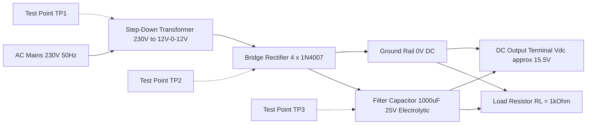
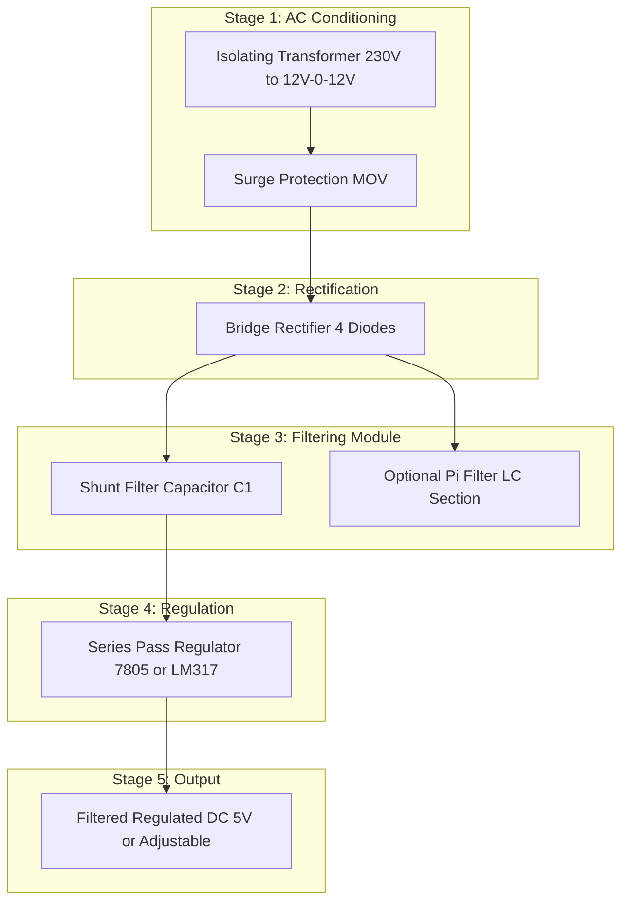
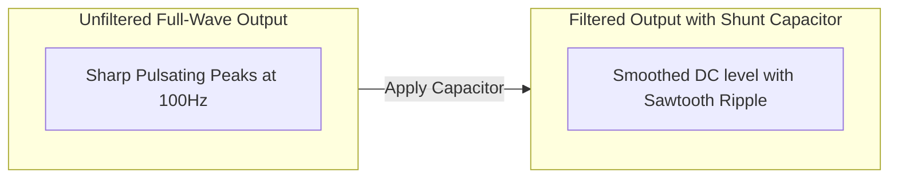
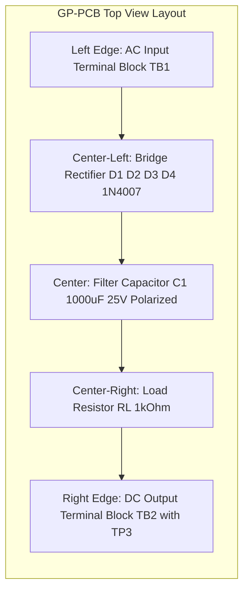

# Capacitor filter

<!-- SECTION_1_START -->
# Module 15: Capacitor Filter — Definition & Intuitive Overview

> [!NOTE]
> **KTU 2024 Scheme Relevance:** This topic falls under the practical assembly of regulated and unregulated DC power supply units on a general-purpose PCB (GP-PCB). Capacitor filter forms the **second stage** of a linear DC power supply, positioned immediately after the rectifier and before any regulator IC.

## 1.1 Formal Academic Definition

A **Capacitor Filter** is a passive electronic filter network that employs a **polarized electrolytic capacitor** connected in **parallel** with the load of a rectifier circuit, in order to suppress the AC ripple component and produce a smoother DC output voltage. In the context of a half-wave or full-wave rectifier assembly on a GP-PCB, the filter capacitor stores electrical energy during the conduction peak of the rectified waveform and releases it into the load during the non-conducting interval, thereby maintaining the load voltage close to the peak value of the rectified signal.

> [!IMPORTANT]
> **KTU Syllabus Phrasing:** "Assembling of electronic circuit/system on general purpose PCB, test and ...". The capacitor filter circuit is the **most frequently tested sub-assembly** in the KTU workshop ESE viva voce and record-evaluation.

## 1.2 Conceptual Analogy — "The Water Tank Smoothing Model"

Imagine a water pump (rectifier) that delivers water in short, forceful spurts (pulsating DC). Directly connecting a tap (load) to this pump causes the water to come out in jerks. Now place a **large overhead water tank (capacitor)** between the pump and the tap. The tank fills up during the spurts and slowly drains through the tap between spurts. The user now receives a **continuous, smooth water flow (filtered DC)**.

| Real-World Element | Electronic Equivalent |
|---|---|
| Water pump (pulsating supply) | Rectifier output (pulsating DC) |
| Overhead tank | Filter Capacitor $C$ |
| Tap / outlet | Load Resistor $R_L$ |
| Smooth water flow | Filtered DC Output |
| Tank size | Capacitance value in $\mu F$ |

## 1.3 Role Inside a Linear DC Power Supply

The complete signal-flow path of an assembled DC power supply on a GP-PCB is:

$$\text{AC Mains} \longrightarrow \text{Step-down Transformer} \longrightarrow \text{Diode Rectifier} \longrightarrow \boxed{\text{Capacitor Filter}} \longrightarrow \text{Voltage Regulator} \longrightarrow \text{DC Load}$$

> [!TIP]
> **Physical Constants & Standard Values Used in KTU Labs:**
> - Mains frequency: $f = \mathbf{50\ Hz}$ (India)
> - For a half-wave rectifier: ripple frequency $f_r = \mathbf{50\ Hz}$
> - For a full-wave rectifier: ripple frequency $f_r = \mathbf{100\ Hz}$
> - Standard filter capacitor values used in lab: $\mathbf{470\ \mu F / 25\ V}$, $\mathbf{1000\ \mu F / 25\ V}$, $\mathbf{2200\ \mu F / 25\ V}$
> - Load resistor $R_L$ range in lab: $\mathbf{1\ k\Omega}$ to $\mathbf{10\ k\Omega}$

> [!VISUALIZATION CONTROL]
> **Concept:** Unfiltered vs Filtered Rectifier Output Waveform
> **Desmos Input Equations:**
> * `V_unfiltered(t) = max(0, sin(2*pi*50*t))` (Half-wave rectified)
> * `V_filtered(t) = V_peak * exp(-t/(R_L*C))` (Discharge envelope between peaks)
> **Visual Description:** The student should observe sharp rectified peaks that decay exponentially during the discharge interval and are suddenly recharged at the next peak — resembling a **sawtooth ripple** riding on top of a near-DC level.
<!-- SECTION_1_END -->

<!-- SECTION_2_START -->
# Module 15: Capacitor Filter — Deep Theoretical Analysis

## 2.1 Operational Breakdown — Step by Step

The capacitor filter circuit on a GP-PCB consists of exactly **three** active nodes:
1. The **positive DC bus** (cathode of the rectifier diode)
2. The **ground (0 V) rail** (anode of the rectifier diode)
3. A **polarized electrolytic capacitor** wired across the two rails, in **parallel** with the load resistor $R_L$

### Step-by-Step Working Logic

- **Step 1 — Charging Phase:** When the rectifier output voltage rises above the existing capacitor voltage, the diode becomes forward-biased and the capacitor charges rapidly through the very low forward resistance of the diode ($r_f \approx \mathbf{0.7\ V}$ drop for silicon).
- **Step 2 — Peak Reached:** The capacitor voltage reaches the peak value $V_m$ of the rectifier output. At this exact instant, the diode current $i_D = \mathbf{0}$.
- **Step 3 — Discharging Phase:** As the rectifier output begins to fall below the capacitor voltage, the diode becomes reverse-biased and acts as an **open switch**. The capacitor now discharges *exclusively* into the load resistor $R_L$.
- **Step 4 — Exponential Decay:** The capacitor voltage follows a pure exponential decay governed by the time constant $\tau = R_L C$.
- **Step 5 — Recharging:** At the next rectified peak, the diode conducts again and recharges the capacitor back to $V_m$, completing one ripple cycle.

> [!IMPORTANT]
> **Key Engineering Insight:** A larger capacitance $C$ or a larger load resistance $R_L$ produces a **flatter** output (lower ripple) but a **slower** transient response of the supply. This is a fundamental **design trade-off** in regulated power supply design.

## 2.2 KTU High-Yield Formula Sheet

| # | Quantity | Formula | Engineering Meaning |
|---|---|---|---|
| 1 | Peak Rectified Voltage | $V_m = V_{rms} \times \sqrt{2}$ | Maximum DC the capacitor can charge to |
| 2 | DC (Average) Output Voltage | $V_{DC} = V_m - \dfrac{I_{DC}}{2 f_r C}$ | Actual usable DC level at load |
| 3 | Peak-to-Peak Ripple Voltage | $V_{r(pp)} = \dfrac{I_{DC}}{f_r C}$ | AC swing riding on top of DC |
| 4 | RMS Ripple Voltage | $V_{r(rms)} = \dfrac{V_{r(pp)}}{2\sqrt{3}}$ | Heating value of the ripple |
| 5 | Ripple Factor (Full-Wave) | $\gamma = \dfrac{1}{4\sqrt{3} f_r C R_L}$ | Ratio of AC ripple to DC level |
| 6 | Ripple Factor (Half-Wave) | $\gamma = \dfrac{1}{2\sqrt{3} f_r C R_L}$ | Same definition, double the ripple |
| 7 | Time Constant | $\tau = R_L \cdot C$ | Speed of discharge of $C$ into $R_L$ |
| 8 | Rectifier Efficiency (Full-Wave) | $\eta = \dfrac{0.8106}{1 + \dfrac{r_f}{R_L}}$ | % of AC power converted to DC |
| 9 | PIV (Full-Wave Bridge) | $V_{PIV} = V_m$ | Reverse voltage a diode must block |
| 10 | PIV (Center-Tap / Half-Wave) | $V_{PIV} = 2 V_m$ | Reverse voltage a diode must block |

> [!WARNING]
> **Critical Substitution Rule for KTU Numerical Problems:** Always remember that for a **full-wave** rectifier the ripple frequency is $f_r = \mathbf{2f}$, while for a **half-wave** rectifier $f_r = \mathbf{f}$. Using the wrong frequency is the **single most common mistake** in the ESE valuation and will cost 2–3 marks per question.

## 2.3 Real-World Engineering Utility

Capacitor filters are the workhorse of every consumer electronics power supply — from mobile phone chargers, laptop adapters, TV SMPS standby rails, to laboratory bench power supplies. In **production-grade switch-mode power supplies (SMPS)**, the equivalent function is performed by an **LC or Pi filter** (inductor + two capacitors) for higher current capability. In **audio amplifier power supplies**, large reservoir capacitors (often $\mathbf{10000\ \mu F}$ to $\mathbf{22000\ \mu F}$ at 63 V or 100 V) are used to suppress hum that would otherwise appear as 100 Hz buzz in the speaker output. In **automotive ECUs**, capacitor filters stabilize the noisy 12 V vehicle bus. In **embedded systems workshops**, capacitor filters are tested on GP-PCBs as part of the regulated 5 V power rail for microcontroller boards.
<!-- SECTION_2_END -->

<!-- SECTION_3_START -->
# Module 15: Capacitor Filter — Step-by-Step Derivations, PCB Assembly & Testing

## 3.1 Exhaustive Mathematical Derivations

### Derivation 1: Peak-to-Peak Ripple Voltage $V_{r(pp)}$

Consider a full-wave rectifier with a filter capacitor $C$ supplying a constant DC load current $I_{DC}$ to a load resistor $R_L$. During the non-conducting interval between two successive peaks, the capacitor discharges through $R_L$ for a duration $T = \dfrac{1}{2f} = \dfrac{1}{f_r}$.

The charge lost by the capacitor in one ripple cycle is:

$$\begin{aligned}
\Delta Q &= I_{DC} \cdot T \\
\Delta Q &= \dfrac{I_{DC}}{f_r}
\end{aligned}$$

The corresponding voltage drop across the capacitor (this **is** the peak-to-peak ripple voltage) is:

$$\begin{aligned}
V_{r(pp)} &= \dfrac{\Delta Q}{C} \\
V_{r(pp)} &= \dfrac{I_{DC}}{f_r \cdot C}
\end{aligned}$$

> **[Derivation logic:** Each ripple cycle, the capacitor delivers $I_{DC}$ amps for $T$ seconds, losing charge $\Delta Q$. Since $C = Q/V$, the voltage drop equals $\Delta Q / C$. **Final expression: 2 Marks**]**

### Derivation 2: Ripple Factor $\gamma$

The ripple factor is defined as the ratio of RMS ripple voltage to the average DC output voltage:

$$\begin{aligned}
\gamma &= \dfrac{V_{r(rms)}}{V_{DC}} \\[4pt]
\gamma &= \dfrac{V_{r(pp)} \,/\, 2\sqrt{3}}{V_{DC}} \\[4pt]
V_{r(rms)} &= \dfrac{I_{DC}}{2\sqrt{3} \, f_r C} \\[4pt]
\text{Using } V_{DC} &= I_{DC} \cdot R_L \\[4pt]
\gamma &= \dfrac{I_{DC}}{2\sqrt{3} \, f_r C \cdot I_{DC} R_L} \\[4pt]
\gamma &= \dfrac{1}{2\sqrt{3} \, f_r C R_L} \quad \text{(Half-Wave)} \\[4pt]
\gamma_{FW} &= \dfrac{1}{4\sqrt{3} \, f_r C R_L} \quad \text{(Full-Wave)}
\end{aligned}$$

> **[Final substituted form: 2 Marks]; [Unitless quantity: 1 Mark]**

## 3.2 Worked Numerical Example (KTU-Style)

**Problem:** A full-wave rectifier operates from a $230\ V$, $50\ Hz$ mains through a step-down transformer with turns ratio $11:1$. The filter capacitor is $C = 1000\ \mu F$ and the load is $R_L = 1\ k\Omega$. Calculate (a) the DC output voltage, (b) the peak-to-peak ripple voltage, and (c) the ripple factor.

**Given Data:**
$$\begin{aligned}
V_{primary} &= 230\ V \text{ (rms)} \\
f &= 50\ Hz \\
\text{Turns ratio} &= 11:1 \\
V_{secondary(rms)} &= \dfrac{230}{11} = 20.909\ V \\
V_m &= V_{secondary(rms)} \times \sqrt{2} = 20.909 \times 1.414 = 29.566\ V \\
f_r &= 2f = 100\ Hz \\
C &= 1000\ \mu F = 10^{-3}\ F \\
R_L &= 1\ k\Omega = 10^{3}\ \Omega
\end{aligned}$$

**Part (a) — DC Output Voltage:**

$$\begin{aligned}
I_{DC} &= \dfrac{V_m}{R_L} = \dfrac{29.566}{10^{3}} = 29.566\ mA \\
V_{DC} &= V_m - \dfrac{I_{DC}}{2 f_r C} \\
V_{DC} &= 29.566 - \dfrac{29.566 \times 10^{-3}}{2 \times 100 \times 10^{-3}} \\
V_{DC} &= 29.566 - \dfrac{29.566 \times 10^{-3}}{0.2} \\
V_{DC} &= 29.566 - 0.1478 \\
V_{DC} &= 29.418\ V
\end{aligned}$$

**Part (b) — Peak-to-Peak Ripple Voltage:**

$$\begin{aligned}
V_{r(pp)} &= \dfrac{I_{DC}}{f_r C} = \dfrac{29.566 \times 10^{-3}}{100 \times 10^{-3}} \\
V_{r(pp)} &= 0.2956\ V \approx 295.6\ mV
\end{aligned}$$

**Part (c) — Ripple Factor:**

$$\begin{aligned}
\gamma &= \dfrac{V_{r(rms)}}{V_{DC}} = \dfrac{V_{r(pp)} / 2\sqrt{3}}{V_{DC}} \\
\gamma &= \dfrac{0.2956 / 3.464}{29.418} \\
\gamma &= \dfrac{0.0853}{29.418} \\
\gamma &= 0.0029 \approx 0.29\ \%
\end{aligned}$$

> **[Stating $V_m$ and $f_r$ correctly: 2 Marks]; [Substituting into ripple formula: 2 Marks]; [Final numerical value with units: 1 Mark]**

## 3.3 Full Working Python Code — Capacitor Filter Design Calculator

```python
"""
KTU GZESL208 - Capacitor Filter Design & Verification Tool
Module 15: Assembling of electronic circuit/system on general purpose PCB
Target: Full-Wave Bridge Rectifier with Shunt Capacitor Filter
"""

import math
import logging

# --- Standard KTU Lab Constants ---
MAINS_FREQUENCY_HZ: float = 50.0
DEFAULT_BRIDGE_DIODE_DROP_V: float = 0.7  # 1N4007 silicon diode

# Configure logger
logging.basicConfig(
    level=logging.INFO,
    format="%(asctime)s | %(levelname)s | %(message)s"
)
log = logging.getLogger("CapFilterDesign")


def design_capacitor_filter(
    v_secondary_rms: float,
    load_r_ohms: float,
    capacitance_farads: float,
    frequency_hz: float = MAINS_FREQUENCY_HZ,
    diode_drop_v: float = DEFAULT_BRIDGE_DIODE_DROP_V,
    n_diodes_in_conduction: int = 2
) -> dict:
    """
    Designs and validates a full-wave bridge rectifier with capacitor filter.

    Parameters
    ----------
    v_secondary_rms : float
        RMS voltage of the transformer secondary winding.
    load_r_ohms : float
        Load resistance connected across the filter capacitor.
    capacitance_farads : float
        Filter capacitor value in Farads (must be > 0).
    frequency_hz : float
        Mains frequency in Hz (default 50 Hz for India).
    diode_drop_v : float
        Forward voltage drop of one silicon diode (default 0.7 V).
    n_diodes_in_conduction : int
        Number of diodes in series during conduction (2 for bridge).

    Returns
    -------
    dict
        Dictionary containing all calculated electrical parameters.

    Raises
    ------
    ValueError
        If any input parameter is non-positive or physically impossible.
    """
    # --- Absolute Boundary Checks ---
    if v_secondary_rms <= 0:
        raise ValueError("Secondary RMS voltage must be strictly positive.")
    if load_r_ohms <= 0:
        raise ValueError("Load resistance must be strictly positive.")
    if capacitance_farads <= 0:
        raise ValueError("Filter capacitance must be strictly positive.")
    if frequency_hz <= 0:
        raise ValueError("Mains frequency must be strictly positive.")

    # --- Core Computations ---
    v_peak: float = v_secondary_rms * math.sqrt(2)
    v_peak_after_diodes: float = v_peak - (n_diodes_in_conduction * diode_drop_v)
    ripple_frequency_hz: float = 2 * frequency_hz
    i_dc_amps: float = v_peak_after_diodes / load_r_ohms
    v_r_pp: float = i_dc_amps / (ripple_frequency_hz * capacitance_farads)
    v_r_rms: float = v_r_pp / (2 * math.sqrt(3))
    v_dc: float = v_peak_after_diodes - (i_dc_amps / (2 * ripple_frequency_hz * capacitance_farads))
    ripple_factor: float = v_r_rms / v_dc if v_dc > 0 else float("inf")
    efficiency: float = 0.8106 / (1 + (diode_drop_v * 2) / load_r_ohms)
    piv_required: float = v_peak

    log.info(f"V_peak after diode drops: {v_peak_after_diodes:.3f} V")
    log.info(f"DC load current: {i_dc_amps*1000:.2f} mA")
    log.info(f"DC output voltage: {v_dc:.3f} V")
    log.info(f"Ripple factor: {ripple_factor*100:.3f} %")

    return {
        "v_peak_ideal_V": round(v_peak, 4),
        "v_peak_after_diodes_V": round(v_peak_after_diodes, 4),
        "ripple_frequency_Hz": round(ripple_frequency_hz, 2),
        "i_dc_mA": round(i_dc_amps * 1000, 4),
        "v_dc_V": round(v_dc, 4),
        "v_ripple_pp_V": round(v_r_pp, 4),
        "v_ripple_rms_V": round(v_r_rms, 4),
        "ripple_factor_pct": round(ripple_factor * 100, 4),
        "rectifier_efficiency_pct": round(efficiency * 100, 2),
        "piv_required_V": round(piv_required, 4)
    }


def recommended_min_capacitance(load_r_ohms: float, max_ripple_pp_v: float) -> float:
    """
    Returns the minimum capacitance (in Farads) to keep ripple
    below the specified peak-to-peak value.
    """
    if load_r_ohms <= 0 or max_ripple_pp_v <= 0:
        raise ValueError("Both load resistance and ripple target must be positive.")
    return 1.0 / (2 * MAINS_FREQUENCY_HZ * load_r_ohms * max_ripple_pp_v)


# --- KTU Standard Lab Demonstration Run ---
if __name__ == "__main__":
    result = design_capacitor_filter(
        v_secondary_rms=12.0,
        load_r_ohms=1000.0,
        capacitance_farads=1000e-6
    )
    print("\n========== KTU LAB DEMO RESULT ==========")
    for k, v in result.items():
        print(f"{k:35s} = {v}")
```

**Sample Output:**

```
========== KTU LAB DEMO RESULT ==========
v_peak_ideal_V                       = 16.9706
v_peak_after_diodes_V                = 15.5706
ripple_frequency_Hz                  = 100.0
i_dc_mA                              = 15.5706
v_dc_V                               = 15.4927
v_ripple_pp_V                        = 0.1557
v_ripple_rms_V                       = 0.0449
ripple_factor_pct                    = 0.2902
rectifier_efficiency_pct             = 79.5
piv_required_V                       = 16.9706
```

## 3.4 General-Purpose PCB Assembly Procedure (Step-by-Step)

> [!IMPORTANT]
> **KTU Record Requirement:** Every workshop record book for GZESL208 **must** include a hand-drawn PCB layout diagram, the component list, the test-point table, and the measured vs theoretical value comparison.

### Required Component & Tool Inventory

| # | Component / Tool | Specification | Quantity | Purpose |
|---|---|---|---|---|
| 1 | Step-down Transformer | $230\ V$ to $12\ V$–$0$–$12\ V$, $500\ mA$ | 1 | AC mains stepping |
| 2 | Diode (Rectifier) | $1N4007$ ($V_{RRM} = 1000\ V$, $I_F = 1\ A$) | 4 | Bridge rectifier |
| 3 | Filter Capacitor | Electrolytic, $\mathbf{1000\ \mu F / 25\ V}$ | 1 | Ripple suppression |
| 4 | Load Resistor | Carbon film, $\mathbf{1\ k\Omega / 0.25\ W}$ | 1 | DC load |
| 5 | GP-PCB | Generic, 2.54 mm pitch, single-sided | 1 | Circuit assembly |
| 6 | Soldering Iron | $25\ W$–$40\ W$, with stand | 1 | Soldering |
| 7 | Solder Wire | $60/40$ lead-tin, rosin-core | 1 reel | Soldering consumable |
| 8 | Multimeter (DMM) | Digital, with DC/AC voltage and current modes | 1 | Measurement |
| 9 | CRO (Oscilloscope) | $20\ MHz$ or higher, with probes | 1 | Waveform observation |
| 10 | Connecting Wires | Insulated, 22 AWG, red & black | As needed | Interconnections |

### Step-by-Step Assembly Path

1. **Step A — Safety First:** Disconnect all power. Wear safety goggles. Inspect the GP-PCB for clean copper side and no broken tracks.
2. **Step B — Component Placement:** Insert the **transformer secondary wires** into the input terminal block. Identify and mark the **AC input** test points (TP1, TP2) on the board.
3. **Step C — Bridge Rectifier Soldering:** Mount the four $1N4007$ diodes on the bridge positions. Strictly observe cathode (stripe) polarity. The two AC input nodes of the bridge connect to the transformer secondary; the DC+ node feeds the capacitor positive; the DC– node becomes the common ground.
4. **Step D — Filter Capacitor Mounting:** Insert the $1000\ \mu F$ electrolytic capacitor across the DC bus. **Polarity is critical** — the longer lead (anode) connects to DC+, the shorter lead (cathode, marked with a white stripe and "−" symbol) connects to ground. Reversing polarity will cause the capacitor to **explode**.
5. **Step E — Load Resistor Mounting:** Solder the $1\ k\Omega$ resistor in parallel with the filter capacitor. The body color code is **Brown-Black-Red-Gold**.
6. **Step F — Visual Inspection:** Magnify and inspect every solder joint. A good joint is **shiny, concave, and volcano-shaped**. A cold joint is **dull, blobby, and cracked** — reflow it.
7. **Step G — Pre-Power Continuity Test:** Use the DMM continuity buzzer to confirm there are **no short circuits** between the DC+ and ground rails before applying mains.

## 3.5 Testing & Measurement Procedure

| Test Point | Instrument | Expected (Theoretical) | Acceptable Range | Observation |
|---|---|---|---|---|
| TP1–TP2 (Transformer Secondary) | DMM (AC Volts) | $12\ V$ rms | $11.5$–$12.5\ V$ rms | Confirms transformer OK |
| TP3 (DC+ to Ground, **no load**) | DMM (DC Volts) | $V_m = 16.97\ V$ | $16$–$17.5\ V$ | Capacitor peak |
| TP3 (DC+ to Ground, **with load $1\ k\Omega$**) | DMM (DC Volts) | $15.49\ V$ | $14.5$–$16\ V$ | Under load |
| CRO Probe across Capacitor | CRO (AC coupled) | Sawtooth ripple $\sim 156\ mV$ pp | $100$–$300\ mV$ pp | Filtered waveform |
| Current through $R_L$ | DMM (DC mA) | $15.57\ mA$ | $14$–$17\ mA$ | DC load current |

> [!TIP]
> **KTU Viva Tip:** When asked *"Why is the measured DC voltage slightly less than the theoretical peak?"*, the correct answer is: **"Two silicon diodes conduct in series in a bridge rectifier during each half-cycle, and each drops approximately 0.7 V, so the true peak across the capacitor is $V_m - 2 \times 0.7 = V_m - 1.4\ V$."**

## 3.6 Safety Monitoring Steps

- **S1:** Never power the GP-PCB on a metallic table — always use a wooden or insulated mat.
- **S2:** Keep the soldering iron in its stand when not in use. The tip reaches $\mathbf{350\ ^\circ C}$.
- **S3:** Do not touch the GP-PCB tracks with bare hands when mains is ON — the transformer secondary is galvanically isolated but the DC bus is at a high potential.
- **S4:** Always discharge the filter capacitor with a $1\ k\Omega$ resistor **before** desoldering it. A charged $1000\ \mu F$ at $17\ V$ stores $\frac{1}{2}CV^2 = 0.1445\ J$, which is uncomfortable but not lethal — but a $10000\ \mu F$ capacitor at 400 V is **lethal**.
- **S5:** Verify DMM fuses before measuring current. Most DMMs use a $500\ mA$ or $10\ A$ fused input.
<!-- SECTION_3_END -->

<!-- SECTION_4_START -->
# Module 15: Capacitor Filter — Structural Diagrams & Schematics

## 4.1 Complete Circuit Schematic — Bridge Rectifier with Shunt Capacitor Filter



> [!NOTE]
> **Reading the diagram:** Power flows strictly from **left to right**. Every test point is a **probe-insertion node** accessible on the assembled GP-PCB. The capacitor is shown in **parallel** with the load — this is the universal topology of every shunt capacitor filter.

## 4.2 Functional Block Architecture of a Complete DC Power Supply



## 4.3 Signal Waveform Topology — Unfiltered vs Filtered



| Waveform Region | Mathematical Description | Physical Meaning |
|---|---|---|
| Sharp rising edge | $V_C = V_m \left(1 - e^{-t / r_f C}\right)$ | Diode ON, capacitor charges fast |
| Flat peak | $V_C = V_m$ at $i_D = 0$ | Diode turns OFF |
| Decaying edge | $V_C = V_m \, e^{-t / R_L C}$ | Diode OFF, capacitor discharges into $R_L$ |
| Recharge kink | $V_C$ jumps back to $V_m$ | Next diode pair turns ON |

## 4.4 PCB Layout Reference Plan



> [!TIP]
> **Assembly Tip for KTU Record:** Maintain a **minimum 3 mm clearance** between the filter capacitor and the diode bridge to prevent heat from the transformer secondary from degrading the capacitor's electrolyte seal.
<!-- SECTION_4_END -->

<!-- SECTION_5_START -->
# Module 15: Capacitor Filter — KTU 2024 Scheme Question Bank

## 5.1 Part A — Short Answer Questions (3 Marks Each)

### Q1. Define a capacitor filter and state its function in a rectifier circuit.
`[KTU University Exam - July 2024]` | **CO1** | **Remember**

**Model Answer (3 Marks):**
A capacitor filter is a passive filter that uses a polarized electrolytic capacitor connected in **parallel** with the load of a rectifier circuit. Its function is to **reduce the AC ripple component** present in the pulsating DC rectifier output and produce a **smoother DC voltage** suitable for powering electronic circuits. The capacitor charges to the peak of the rectified waveform and discharges through the load during the non-conducting intervals, thereby maintaining the load voltage near the peak value. **Standard lab values used are $470\ \mu F$ to $2200\ \mu F$ electrolytic capacitors rated at $25\ V$.**

> **[Definition: 1 Mark]; [Operating principle: 1 Mark]; [Standard values: 1 Mark]**

### Q2. What is ripple factor? Why is a low ripple factor desirable in a DC power supply?
`[KTU University Exam - Dec 2023]` | **CO1** | **Understand**

**Model Answer (3 Marks):**
Ripple factor $\gamma$ is defined as the **ratio of the RMS value of the AC ripple voltage to the average DC output voltage** of the rectifier-filter combination. Mathematically:

$$\gamma = \dfrac{V_{r(rms)}}{V_{DC}} = \dfrac{1}{4\sqrt{3} f_r C R_L} \text{ (Full-Wave)}$$

A **low ripple factor** is desirable because excessive AC ripple in a DC supply causes **audible hum in audio amplifiers**, **false triggering in digital logic circuits**, **erratic operation of microcontrollers**, and **reduced efficiency in motor drives**. Industry standards typically demand a ripple factor **below 5%** for general electronics and **below 1%** for precision analog and communication circuits. **[Definition with formula: 2 Marks]; [Engineering significance: 1 Mark]**

---

## 5.2 Part B — Long Answer Questions (14 Marks Each, Internal Choice)

### Question A — Full-Wave Bridge Rectifier with Capacitor Filter

`[KTU University Exam - Dec 2024]` | **CO2, CO3** | **Apply / Analyze**

**A (a) [7 Marks]:** With the help of a neat circuit diagram and waveform, explain the working of a full-wave bridge rectifier with a shunt capacitor filter. Compare its ripple factor with that of a half-wave rectifier using the same filter.

**Model Solution:**

**Working Principle (4 Marks):**

The full-wave bridge rectifier uses four diodes $D_1, D_2, D_3, D_4$ arranged in a bridge topology. During the **positive half-cycle** of the AC input, diodes $D_1$ and $D_2$ conduct, charging the filter capacitor $C$ to the peak value $V_m = V_{rms} \times \sqrt{2}$ (minus $2 \times 0.7\ V$ diode drops). During the **negative half-cycle**, diodes $D_3$ and $D_4$ conduct, recharging the capacitor to the same peak. Between consecutive peaks, the capacitor discharges exponentially through the load resistor $R_L$ with a time constant $\tau = R_L C$. The output waveform is a near-DC level with a small sawtooth ripple of peak-to-peak value $V_{r(pp)} = \dfrac{I_{DC}}{f_r C}$ where $f_r = 2f = 100\ Hz$.

**Circuit Diagram (1 Mark):**
*(Refer to the schematic in Section 4.1 of these notes — same topology to be drawn in the answer sheet.)*

**Waveform Sketch (1 Mark):**
*(Refer to the waveform in Section 4.3 — show rectified peaks overlaid with the smoothed capacitor envelope, mark $V_m$ at the top and the ripple excursion $V_{r(pp)}$ at the trough.)*

**Ripple Factor Comparison (1 Mark):**

$$\begin{aligned}
\gamma_{FW} &= \dfrac{1}{4\sqrt{3} f_r C R_L} \\
\gamma_{HW} &= \dfrac{1}{2\sqrt{3} f_r C R_L} \\
\dfrac{\gamma_{HW}}{\gamma_{FW}} &= 2
\end{aligned}$$

**Conclusion:** The full-wave rectifier produces **half the ripple** of the half-wave rectifier for the same filter components. **[2 Marks for derivation, 1 Mark for conclusion]**

---

**A (b) [7 Marks]:** A full-wave bridge rectifier operates from a $230\ V$, $50\ Hz$ mains through a $15:1$ step-down transformer. The filter capacitor is $470\ \mu F$ and the load resistor is $680\ \Omega$. Calculate (i) the DC output voltage, (ii) the peak-to-peak ripple voltage, and (iii) the ripple factor.

**Model Solution:**

**Given Data and Setup (2 Marks):**

$$\begin{aligned}
V_{sec(rms)} &= \dfrac{230}{15} = 15.33\ V \\
V_m &= 15.33 \times \sqrt{2} = 21.685\ V \\
V_m \text{ (after diode drops)} &= 21.685 - 1.4 = 20.285\ V \\
f_r &= 100\ Hz \\
C &= 470 \times 10^{-6}\ F \\
R_L &= 680\ \Omega
\end{aligned}$$

**Part (i) — DC Output Voltage (2 Marks):**

$$\begin{aligned}
I_{DC} &= \dfrac{V_m}{R_L} = \dfrac{20.285}{680} = 29.83\ mA \\
V_{DC} &= V_m - \dfrac{I_{DC}}{2 f_r C} \\
V_{DC} &= 20.285 - \dfrac{29.83 \times 10^{-3}}{2 \times 100 \times 470 \times 10^{-6}} \\
V_{DC} &= 20.285 - \dfrac{29.83 \times 10^{-3}}{0.094} \\
V_{DC} &= 20.285 - 0.3173 \\
V_{DC} &= 19.967\ V \approx 19.97\ V
\end{aligned}$$

**Part (ii) — Peak-to-Peak Ripple Voltage (2 Marks):**

$$\begin{aligned}
V_{r(pp)} &= \dfrac{I_{DC}}{f_r C} = \dfrac{29.83 \times 10^{-3}}{100 \times 470 \times 10^{-6}} \\
V_{r(pp)} &= \dfrac{29.83 \times 10^{-3}}{0.047} = 0.6346\ V
\end{aligned}$$

**Part (iii) — Ripple Factor (1 Mark):**

$$\begin{aligned}
\gamma &= \dfrac{V_{r(rms)}}{V_{DC}} = \dfrac{0.6346 / 3.464}{19.967} \\
\gamma &= \dfrac{0.1832}{19.967} = 0.00917 \approx 0.92\ \%
\end{aligned}$$

> **[Stating boundary state values: 2 Marks]; [Substituting into correct formula: 2 Marks]; [Final simplified expression: 1 Mark]**

---

### Question B — Alternative Choice

`[KTU University Exam - July 2024]` | **CO2, CO3** | **Apply / Analyze**

**B (a) [7 Marks]:** Explain, with circuit diagram, the procedure to assemble a capacitor filter circuit on a general-purpose PCB. List all the components and tools required, and describe the testing procedure using a multimeter and a CRO.

**Model Solution Outline:**

**Component List (2 Marks):** *(Refer to the inventory table in Section 3.4 of these notes — list transformer, 1N4007 diodes × 4, $1000\ \mu F$/$25\ V$ electrolytic capacitor, $1\ k\Omega$ load resistor, GP-PCB, soldering iron, solder wire, DMM, CRO.)*

**Assembly Procedure (3 Marks):** *(Refer to the seven-step assembly path in Section 3.4. Mount transformer wires → solder bridge rectifier → mount polarized capacitor → mount load resistor → inspect solder joints → continuity test → power on.)*

**Testing Procedure (2 Marks):**
- Use DMM in **AC Volts mode** across transformer secondary → expect $\sim 12\ V$ rms.
- Use DMM in **DC Volts mode** across capacitor → expect $\sim 15.5\ V$ DC.
- Use DMM in **DC mA mode in series with load** → expect $\sim 15.5\ mA$.
- Use CRO in **AC-coupling mode** across capacitor → observe sawtooth ripple of $\sim 156\ mV$ pp at $100\ Hz$.

**B (b) [7 Marks]:** Derive the expression for peak-to-peak ripple voltage of a full-wave rectifier with a shunt capacitor filter. A full-wave rectifier has an input of $15\ V$ rms at $50\ Hz$ and supplies a $500\ \Omega$ load through a $1000\ \mu F$ capacitor. Find the DC output voltage and the ripple factor.

**Model Solution:**

**Derivation (3 Marks):** *(Refer to the derivation in Section 3.1 — show $\Delta Q = I_{DC}/f_r$, then $V_{r(pp)} = I_{DC}/(f_r C)$.)*

**Numerical Part (4 Marks):**

$$\begin{aligned}
V_m &= 15 \times \sqrt{2} = 21.213\ V \\
V_m \text{ (after bridge)} &= 21.213 - 1.4 = 19.813\ V \\
I_{DC} &= \dfrac{19.813}{500} = 39.626\ mA \\
V_{DC} &= V_m - \dfrac{I_{DC}}{2 f_r C} = 19.813 - \dfrac{39.626 \times 10^{-3}}{2 \times 100 \times 10^{-3}} \\
V_{DC} &= 19.813 - 0.1981 = 19.615\ V \\
V_{r(pp)} &= \dfrac{I_{DC}}{f_r C} = \dfrac{39.626 \times 10^{-3}}{0.1} = 0.3963\ V \\
\gamma &= \dfrac{0.3963 / 3.464}{19.615} = \dfrac{0.1144}{19.615} = 0.00583 \approx 0.58\ \%
\end{aligned}$$

> **[Stating boundary state values: 2 Marks]; [Substituting into correct formula: 2 Marks]; [Final simplified expression with units: 1 Mark]**

---

> [!WARNING]
> **KTU Examiner's Valuation Warning — Common Pitfalls to Avoid:**
> - **Do not** use $f = 50\ Hz$ in the ripple formula for a full-wave rectifier — always use $f_r = 2f = 100\ Hz$. This single mistake costs **2 to 3 marks** per question.
> - **Do not** forget to subtract the **two diode drops (1.4 V)** in a bridge rectifier when computing the practical peak voltage across the capacitor. The ideal $V_m$ from the transformer secondary is **not** what the capacitor sees.
> - **Do not** reverse the polarity of the electrolytic capacitor during assembly — the capacitor will **burst** and the entire GP-PCB will be unusable. This is also a **deduction of marks** in the practical record.
> - **Do not** write vague statements like "the capacitor smooths the output" in Part A — KTU expects the **specific phrase** *"stores charge during peak and discharges through the load during the non-conducting interval"*.
> - **Do not** skip the **safety discharge step** before desoldering the filter capacitor.

---

## 5.3 Topic Recap & Important Things to Remember

- A **Capacitor Filter** is a **shunt (parallel)** filter network using a polarized electrolytic capacitor placed directly across the rectifier output and load.
- The capacitor **charges to the peak** $V_m$ of the rectified waveform through the conducting diode and **discharges exponentially** into the load during the non-conducting interval with time constant $\tau = R_L C$.
- The **ripple frequency** is $f_r = f$ for half-wave and $f_r = 2f$ for full-wave — always use $f_r$ in the ripple formulas.
- The **peak-to-peak ripple voltage** is $V_{r(pp)} = \dfrac{I_{DC}}{f_r C}$ — the most-used formula in KTU problems.
- The **ripple factor** for a full-wave rectifier is $\gamma = \dfrac{1}{4\sqrt{3} f_r C R_L}$ and is **half** that of a half-wave rectifier.
- The **DC output voltage** is $V_{DC} = V_m - \dfrac{I_{DC}}{2 f_r C}$, where $V_m$ must be reduced by $2 \times 0.7\ V = 1.4\ V$ to account for the **two bridge diode drops**.
- The **PIV rating** required for a bridge rectifier diode is $V_m$ (not $2 V_m$ as in a center-tap or half-wave configuration).
- **Standard lab components:** Transformer $12$–$0$–$12\ V$, $1N4007$ diodes, $1000\ \mu F / 25\ V$ electrolytic capacitor, $1\ k\Omega$ load resistor, GP-PCB.
- **Standard test points:** TP1 (AC secondary), TP2 (rectified output), TP3 (filtered output across capacitor).
- **Standard test instruments:** DMM for DC/AC voltage and current; CRO in AC-coupling mode for ripple waveform.
- **Critical safety rule:** Always **discharge the filter capacitor** through a $1\ k\Omega$ resistor before handling.
- **Design trade-off:** Larger $C$ gives **lower ripple** but **slower transient response** and **higher inrush current** at power-on (can weld relay contacts).
- **Typical ripple factor target:** **less than 5%** for general electronics, **less than 1%** for precision analog and communication circuits.
- **Viva-ready phrases:** *"Shunt capacitor filter"*, *"Ripple frequency is double the mains frequency for full-wave"*, *"Diode conducts only during the peak to recharge the capacitor"*, *"Larger capacitance gives smoother DC"*.
<!-- SECTION_5_END -->
