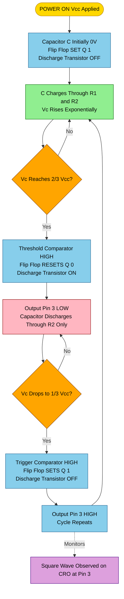
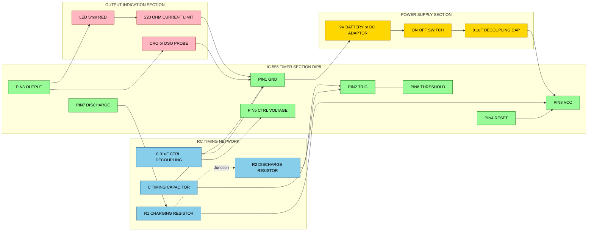

# Square wave generation using IC 555 timer in IC base.

<!-- SECTION_1_START -->

# Square Wave Generation using IC 555 Timer (Astable Multivibrator)

## 1. Core Technical Definition

> [!NOTE]
> **KTU 2024 Official Definition (GZESL208 – Module 15):**
> A square wave generator using the **IC 555 timer** in **astable multivibrator mode** is an electronic circuit assembled on a **General Purpose PCB (GPP-PCB)** that produces a continuous rectangular (square) waveform at the output without any external triggering. The circuit uses two external resistors ($R_1$, $R_2$) and one capacitor ($C$) as timing components. The 8-pin timer IC autonomously switches between charging and discharging cycles, producing a non-sinusoidal periodic waveform with sharp transitions between two voltage levels: **HIGH ($\approx V_{CC}$)** and **LOW ($\approx 0$ V)**.

The **IC 555** (originally designed by **Hans Camenzind** in 1971 for Signetics) is one of the most popular and widely produced integrated circuits in history, with billions of units sold. It is a highly stable timing device that can function in **three modes**:

| Operating Mode | Output Behaviour | External Trigger Required? |
|---|---|---|
| **Monostable** | Single pulse of fixed width | Yes |
| **Astable** | Continuous square wave | No (free-running) |
| **Bistable** | Flip-flop (HIGH or LOW) | Yes |

In the workshop experiment, the astable configuration is used because it acts as a **self-oscillating clock generator** — perfect for digital logic testing, pulse generation, LED flashers, and tone generation.

### Conceptual Analogy / Intuition

> [!TIP]
> **"The Automatic Water Tank Swing" Analogy**
> Imagine a water tank with a **swinging float switch**:
> 1. The tank fills with water (charging the capacitor).
> 2. When water reaches the **upper sensor (2/3 level)** → a valve opens and water drains out (discharge).
> 3. When water drops to the **lower sensor (1/3 level)** → the valve closes and filling resumes.
> 4. This **fill–empty–fill–empty** cycle repeats forever, producing a periodic pulse each time the switch flips.
>
> Here, the **water tank = Capacitor C**, the **inlet pipe + drain pipe = Resistors R1, R2**, the **float switch = internal comparators**, and the **valve = discharge transistor** inside the 555 IC.

### Physical Constants & Standard Specifications

> [!IMPORTANT]
> **Standard NE555 / LM555 / SE555 Ratings (Memorize for KTU Viva & Calculations):**
> * **Supply Voltage ($V_{CC}$):** **+4.5 V to +16 V** (Bipolar version); **+2 V to +18 V** (CMOS version like TLC555)
> * **Maximum Output Current:** **±200 mA** (sink/source)
> * **Output HIGH Voltage:** $\approx V_{CC} - 1.7$ V (at 100 mA load)
> * **Output LOW Voltage:** $\approx 0.1$ V to $0.4$ V
> * **Operating Frequency Range:** **0.1 Hz to 500 kHz** (practical astable range)
> * **Internal Reference Voltages:** **$V_{th} = \frac{2}{3} V_{CC}$** and **$V_{trig} = \frac{1}{3} V_{CC}$**
> * **Internal Voltage Divider:** Three **5 kΩ** resistors (hence the name "**555**")
> * **Power Dissipation:** **600 mW** (DIP-8 package)
> * **Operating Temperature:** **0 °C to +70 °C** (NE555 commercial grade)

### Pin Configuration (8-Pin DIP Package)

| Pin No. | Pin Name | Function | Astable Connection |
|---|---|---|---|
| **1** | **GND** | Ground (0 V reference) | Connect to **0 V** rail |
| **2** | **TRIG** | Trigger input (active LOW, senses 1/3 Vcc) | Tied to Pin 6 |
| **3** | **OUT** | Output (square wave appears here) | Connect to **CRO probe** + LED indicator |
| **4** | **RESET** | Master reset (active LOW) | Connect to **$V_{CC}$** (disable reset) |
| **5** | **CTRL** | Control Voltage (modulates thresholds) | Decouple with **0.01 µF** to GND |
| **6** | **THRES** | Threshold input (senses 2/3 Vcc) | Tied to Pin 2 and to C |
| **7** | **DISCH** | Discharge (open-collector transistor) | Connect to junction of R1, R2, C |
| **8** | **$V_{CC}$** | Positive supply | Connect to **+5 V / +9 V / +12 V** |

> [!VISUALIZATION CONTROL]
> **Concept:** Astable 555 Output Waveform (Capacitor Voltage vs Output)
> **GeoGebra / Desmos Input Equations:**
> * Capacitor waveform: $V_C(t) = \frac{1}{3}V_{CC} + \frac{1}{3}V_{CC} \cdot \tanh\left(\sin\left(\frac{2\pi t}{T}\right)\right)$
> * Output waveform: $V_{OUT}(t) = V_{CC} \cdot \left(0.5 + 0.5 \cdot \text{sign}\left(\sin\left(\frac{2\pi t}{T}\right)\right)\right)$
> * Reference lines: $y = \frac{1}{3}V_{CC}$, $y = \frac{2}{3}V_{CC}$
> **Visual Description:** A sawtooth-like exponential rise/fall curve for the capacitor voltage oscillating between **$V_{CC}/3$** and **$2V_{CC}/3$**, and a complementary rectangular (square) wave at the output pin — HIGH during charging, LOW during discharging. Students should clearly observe that the output is **inverted** with respect to the discharge transistor state.

---

<!-- SECTION_1_END -->

<!-- SECTION_2_START -->

# Deep Theoretical Analysis & KTU High-Yield Formula Sheet

## 2. Internal Architecture of IC 555

The 555 timer internally contains **five functional blocks**:

1. **Voltage Divider** — Three equal **5 kΩ** resistors forming a potential divider. Provides reference voltages of $\frac{1}{3} V_{CC}$ and $\frac{2}{3} V_{CC}$.
2. **Threshold Comparator (C1)** — Compares Pin 6 voltage with $\frac{2}{3} V_{CC}$. Output goes HIGH when $V_6 > \frac{2}{3} V_{CC}$.
3. **Trigger Comparator (C2)** — Compares Pin 2 voltage with $\frac{1}{3} V_{CC}$. Output goes HIGH when $V_2 < \frac{1}{3} V_{CC}$.
4. **SR Flip-Flop (Latch)** — Stores the state. $\overline{Q}$ controls the discharge transistor.
5. **Discharge Transistor (Q1)** — An open-collector NPN transistor at Pin 7. When ON, it short-circuits the timing capacitor to ground.
6. **Output Driver (Push-Pull Stage)** — Provides high-current drive at Pin 3.

## 3. Astable Operation — Step-by-Step Logic

> [!IMPORTANT]
> **The "Why" Behind the Oscillation:**
> The 555 has no stable state in astable mode because the capacitor voltage $V_C$ is **continuously forced** to cross the two internal thresholds ($\frac{1}{3} V_{CC}$ and $\frac{2}{3} V_{CC}$), which keeps flipping the internal flip-flop. Each flip toggles the discharge transistor, creating a self-sustaining charging–discharging loop.

### Step-by-Step Working Cycle

**Phase 1 — Capacitor CHARGING (Output = HIGH)**
* Initially, suppose the flip-flop is SET ($\overline{Q}$ = HIGH → Discharge transistor **OFF**).
* Capacitor $C$ charges through resistors $R_1$ **and** $R_2$ in series from $V_{CC}$.
* $V_C$ rises **exponentially** toward $V_{CC}$.
* The instant $V_C$ exceeds $\frac{2}{3} V_{CC}$ → Threshold comparator triggers → Flip-flop RESETS → $\overline{Q}$ = LOW → Discharge transistor turns **ON** (saturated).

**Phase 2 — Capacitor DISCHARGING (Output = LOW)**
* Now discharge transistor is ON, providing a low-resistance path to ground through Pin 7.
* Capacitor $C$ discharges through $R_2$ **only** (Pin 7 shorts past $R_1$).
* $V_C$ falls exponentially toward 0 V.
* The instant $V_C$ drops below $\frac{1}{3} V_{CC}$ → Trigger comparator triggers → Flip-flop SETS → $\overline{Q}$ = HIGH → Discharge transistor turns **OFF**.
* Cycle returns to Phase 1.

This continuous toggling produces the **square wave** at Pin 3.

## 4. KTU Formula Sheet / Cheat Sheet

> [!NOTE]
> **All formulas assume the standard astable configuration with two resistors and one capacitor, with no diode across R2 (non-symmetrical duty cycle).**

| Parameter | Formula | Description | Unit |
|---|---|---|---|
| **Charging Time ($t_H$)** | $t_H = 0.693 \times (R_1 + R_2) \times C$ | Time during which output is HIGH | seconds |
| **Discharging Time ($t_L$)** | $t_L = 0.693 \times R_2 \times C$ | Time during which output is LOW | seconds |
| **Total Time Period ($T$)** | $T = t_H + t_L = 0.693 \times (R_1 + 2R_2) \times C$ | Sum of one complete cycle | seconds |
| **Frequency ($f$)** | $f = \dfrac{1}{T} = \dfrac{1.44}{(R_1 + 2R_2) \times C}$ | Number of cycles per second | Hz |
| **Duty Cycle ($D$)** | $D = \dfrac{t_H}{T} \times 100\% = \dfrac{R_1 + R_2}{R_1 + 2R_2} \times 100\%$ | Percentage of time output is HIGH | % |
| **Charging Voltage Range** | $\dfrac{1}{3} V_{CC} \rightarrow \dfrac{2}{3} V_{CC}$ | Capacitor voltage swing | V |
| **Discharging Voltage Range** | $\dfrac{2}{3} V_{CC} \rightarrow \dfrac{1}{3} V_{CC}$ | Capacitor voltage swing | V |
| **50% Duty Cycle Design** | Use diode $D$ across $R_2$ (cathode to Pin 7) | Symmetric square wave | — |
| **Maximum Frequency** | $f_{max} \approx 500$ kHz | Practical limit (with $R_1 = 1$ kΩ, $C = 100$ pF) | Hz |
| **Minimum Frequency** | $f_{min} \approx 0.1$ Hz | With large $R$ and $C$ | Hz |

> [!WARNING]
> **Duty Cycle Constraint:** In the standard astable configuration, **Duty Cycle > 50% ALWAYS** (because $R_1 + R_2 > R_2$ for any positive $R_1$). The minimum is 50% (when $R_1 \rightarrow 0$). To get **< 50%**, you MUST use a diode bypassing $R_2$ during charging.

## 5. Design Procedure for a Target Frequency

> [!TIP]
> **Standard KTU Design Steps (Use these in 14-mark answers):**
> 1. Choose a convenient value of $C$ (typically **0.01 µF to 100 µF**).
> 2. Assume $R_1 = R_2 = R$ (for simplicity, even though this gives $D = 66.6\%$, not 50%).
> 3. Calculate $R$ using the modified frequency formula: $f = \dfrac{1.44}{3RC} \Rightarrow R = \dfrac{0.48}{f \times C}$.
> 4. Use standard E12 resistor values closest to the calculated $R$.
> 5. Verify $T$, $f$, and $D$ with the chosen standard values.
> 6. Choose $V_{CC}$ (typically **+5 V** for TTL compatibility or **+9 V / +12 V** for general use).

## 6. Real-World Engineering Applications

> [!IMPORTANT]
> **Where Square Wave Generators using 555 are used in Industry:**
> * **Digital Clocks & Counters** — Provides the master clock pulse for sequential logic.
> * **Pulse Width Modulation (PWM)** — Motor speed controllers, LED dimmers, servo control.
> * **Tone Generation** — Electronic sirens, alarm circuits, doorbells, Morse code trainers.
> * **Missing Pulse Detectors** — Industrial safety systems.
> * **Debounce Circuits** — Mechanical switch debouncing in digital inputs.
> * **Function Generators** — Low-cost laboratory signal sources (combined with sine-wave shapers).
> * **Flashing LED Indicators** — Turn signals, decorative lighting, beacon lights.
> * **Voltage-to-Frequency Converters** — With sensor input, used in measurement systems.
> * **IC Tester Circuits** — Inject clock signals into digital ICs for testing.

---

<!-- SECTION_2_END -->

<!-- SECTION_3_START -->

# Step-by-Step Derivations, Numerical Solutions & Workshop Implementation

## 7. Exhaustive Derivation of the Timing Equations

> [!NOTE]
> The capacitor voltage during charging follows the **standard first-order RC charging equation**. We solve this to find the time taken to charge from $\frac{1}{3}V_{CC}$ to $\frac{2}{3}V_{CC}$.

### Derivation of Charging Time ($t_H$)

The voltage across the capacitor during charging through $R_1 + R_2$ is given by:

$$V_C(t) = V_{CC} \left(1 - e^{-\frac{t}{(R_1 + R_2)C}}\right)$$

We want the time $t = t_H$ when $V_C$ reaches $\frac{2}{3} V_{CC}$ (starting from $\frac{1}{3} V_{CC}$ initial condition).

Applying the modified charging equation with initial voltage $V_0 = \frac{1}{3} V_{CC}$:

$$V_C(t) = V_{CC} - \left(V_{CC} - \frac{V_{CC}}{3}\right) e^{-\frac{t}{(R_1 + R_2)C}}$$

$$V_C(t) = V_{CC} - \frac{2 V_{CC}}{3} e^{-\frac{t}{(R_1 + R_2)C}}$$

Setting $V_C(t_H) = \frac{2}{3} V_{CC}$:

$$\frac{2 V_{CC}}{3} = V_{CC} - \frac{2 V_{CC}}{3} e^{-\frac{t_H}{(R_1 + R_2)C}}$$

Subtracting $V_{CC}$ from both sides:

$$-\frac{V_{CC}}{3} = -\frac{2 V_{CC}}{3} e^{-\frac{t_H}{(R_1 + R_2)C}}$$

Dividing both sides by $-\frac{2 V_{CC}}{3}$:

$$\frac{1}{2} = e^{-\frac{t_H}{(R_1 + R_2)C}}$$

Taking natural logarithm of both sides:

$$\ln\left(\frac{1}{2}\right) = -\frac{t_H}{(R_1 + R_2)C}$$

Since $\ln(0.5) = -0.693$:

$$-0.693 = -\frac{t_H}{(R_1 + R_2)C}$$

$$\boxed{t_H = 0.693 \times (R_1 + R_2) \times C}$$

### Derivation of Discharging Time ($t_L$)

During discharge, the capacitor discharges through $R_2$ from $\frac{2}{3} V_{CC}$ toward 0 V:

$$V_C(t) = \frac{2 V_{CC}}{3} \cdot e^{-\frac{t}{R_2 C}}$$

Setting $V_C(t_L) = \frac{1}{3} V_{CC}$:

$$\frac{V_{CC}}{3} = \frac{2 V_{CC}}{3} \cdot e^{-\frac{t_L}{R_2 C}}$$

$$\frac{1}{2} = e^{-\frac{t_L}{R_2 C}}$$

Taking natural log:

$$-0.693 = -\frac{t_L}{R_2 C}$$

$$\boxed{t_L = 0.693 \times R_2 \times C}$$

### Derivation of Total Period and Frequency

$$T = t_H + t_L = 0.693 (R_1 + R_2) C + 0.693 R_2 C$$

$$T = 0.693 \left[ (R_1 + R_2) + R_2 \right] C$$

$$T = 0.693 (R_1 + 2 R_2) C$$

$$\boxed{f = \frac{1}{T} = \frac{1.44}{(R_1 + 2 R_2) C}}$$

---

## 8. KTU Standard Numerical Problem — Complete Solved Example

> [!NOTE]
> **Problem Statement (Typical 14-Mark Workshop Numerical):**
> Design an astable multivibrator using IC 555 timer to generate a **1 kHz square wave** with a **duty cycle of approximately 75%**. Assume $C = 0.1$ µF. Calculate $R_1$ and $R_2$, and draw the circuit diagram.

### Step 1: Write down the required formulas

$$f = \frac{1.44}{(R_1 + 2R_2) C} \quad \text{...(1)}$$

$$D = \frac{R_1 + R_2}{R_1 + 2R_2} \times 100\% = 75\% \quad \text{...(2)}$$

### Step 2: From equation (2), set up the ratio

$$0.75 = \frac{R_1 + R_2}{R_1 + 2R_2}$$

$$0.75 (R_1 + 2R_2) = R_1 + R_2$$

$$0.75 R_1 + 1.5 R_2 = R_1 + R_2$$

$$1.5 R_2 - R_2 = R_1 - 0.75 R_1$$

$$0.5 R_2 = 0.25 R_1$$

$$R_1 = 2 R_2$$

### Step 3: Substitute into equation (1) with $f = 1000$ Hz, $C = 0.1 \times 10^{-6}$ F

$$1000 = \frac{1.44}{(2 R_2 + 2 R_2) \times 0.1 \times 10^{-6}}$$

$$1000 = \frac{1.44}{4 R_2 \times 10^{-7}}$$

$$4 R_2 \times 10^{-7} = \frac{1.44}{1000} = 1.44 \times 10^{-3}$$

$$R_2 = \frac{1.44 \times 10^{-3}}{4 \times 10^{-7}} = \frac{1.44}{4} \times 10^{4} = 3600 \text{ Ω}$$

### Step 4: Calculate $R_1$

$$R_1 = 2 \times 3600 = 7200 \text{ Ω}$$

### Step 5: Choose nearest standard E12 values

* **$R_2 = 3.6$ kΩ ≈ 3.3 kΩ (standard) + small trim pot 470 Ω** for fine tuning.
* **$R_1 = 7.2$ kΩ ≈ 6.8 kΩ (standard) + small trim pot 680 Ω**.

> [!TIP]
> **KTU Valuation Tip:** Always quote **calculated theoretical values first**, then state the **standard E12 value** you actually use in the lab. Examiners give marks for showing both the design calculation AND the practical component selection.

### Step 6: Verify with chosen values $R_1 = 6.8$ kΩ, $R_2 = 3.3$ kΩ, $C = 0.1$ µF

$$T = 0.693 \times (6800 + 2 \times 3300) \times 0.1 \times 10^{-6}$$

$$T = 0.693 \times 13400 \times 10^{-7} = 9.28 \times 10^{-4} \text{ s} = 0.928 \text{ ms}$$

$$f = \frac{1}{0.928 \times 10^{-3}} = 1077 \text{ Hz} \approx 1.08 \text{ kHz} \quad ✓$$

$$D = \frac{6800 + 3300}{6800 + 6600} \times 100\% = \frac{10100}{13400} \times 100\% = 75.37\% \quad ✓$$

### Step 7: Mark Distribution (KTU Board Pattern)

| Valuation Step | Marks |
|---|---|
| [Writing standard astable formulas correctly] | **2 Marks** |
| [Setting up the duty cycle ratio and solving for $R_1 = 2R_2$] | **2 Marks** |
| [Substituting into frequency formula and calculating $R_2$] | **3 Marks** |
| [Calculating $R_1$ and selecting E12 standard values] | **2 Marks** |
| [Verification with chosen values] | **2 Marks** |
| [Neat circuit diagram with all components labelled] | **3 Marks** |
| **Total** | **14 Marks** |

---

## 9. Workshop Implementation — Assembly on General Purpose PCB

> [!NOTE]
> **GZESL208 Workshop Procedure** — Each student must physically assemble, solder, test, and demonstrate the working circuit.

### 9.1 Component List with Specifications

| S.No. | Component | Specification | Quantity | Function |
|---|---|---|---|---|
| 1 | IC 555 (NE555 / LM555) | DIP-8 package | 1 | Timer IC |
| 2 | Resistor $R_1$ | $\frac{1}{4}$ W, calculated value (e.g., 6.8 kΩ) | 1 | Charging path part-1 |
| 3 | Resistor $R_2$ | $\frac{1}{4}$ W, calculated value (e.g., 3.3 kΩ) | 1 | Charging + discharging path |
| 4 | Capacitor $C$ | Non-polarized / electrolytic, calculated value (e.g., 0.1 µF) | 1 | Timing element |
| 5 | Decoupling capacitor | 0.01 µF ceramic disc | 1 | At Pin 5 (Control Voltage) |
| 6 | Decoupling capacitor | 0.1 µF ceramic disc | 1 | At $V_{CC}$ rail (supply filter) |
| 7 | LED (output indicator) | 5 mm, red, with 220 Ω series resistor | 1 | Visual indicator of output |
| 8 | Resistor for LED | 220 Ω, $\frac{1}{4}$ W | 1 | Current limiting for LED |
| 9 | IC Base (8-pin DIP socket) | Berg strip / machined-pin socket | 1 | IC mounting (prevents heat damage) |
| 10 | Battery / DC supply | 9 V battery or regulated +5 V / +9 V / +12 V DC | 1 | Power source |
| 11 | General Purpose PCB | Bakelite / FR-2, single-sided copper clad | 1 | Circuit assembly platform |
| 12 | Soldering wire | 60/40 (Sn/Pb), rosin-core, 22 SWG | As required | Permanent joints |
| 13 | CRO / DSO probes | Standard oscilloscope probes | 2 | Waveform observation |

### 9.2 IC Base (DIP-8 Socket) — Pin Identification

> [!IMPORTANT]
> **Always use an IC base (8-pin DIP socket) on the PCB so that the IC can be inserted/removed without heating it directly.** This protects the IC from thermal damage during soldering.

The IC base has **8 holes** arranged in **two parallel rows of 4 pins each** with a **semi-circular notch** at one end to indicate Pin 1.

```
   ┌────────────────────┐
   │  [Notch]           │  ← Pin 1 indicator
   │  1  2  3  4        │
   │  ●  ●  ●  ●        │
   │                    │
   │  ●  ●  ●  ●        │
   │  8  7  6  5        │
   └────────────────────┘
   DIP-8 Socket (Top View)
```

### 9.3 Step-by-Step Assembly Procedure

| Step | Action | Safety / KTU Point |
|---|---|---|
| **1** | Place the **IC base (8-pin DIP socket)** on the PCB at the centre, mark pin 1, and solder all 8 pins carefully. | Avoid solder bridges between adjacent pins. |
| **2** | Solder the two **timing resistors $R_1$ and $R_2$** near Pin 7 of the socket. Identify colour bands correctly. | Use colour-code chart: e.g., Brown-Black-Red-Gold = 1 kΩ. |
| **3** | Solder the **timing capacitor $C$** connecting Pin 6/2 junction to GND. Observe polarity if electrolytic. | Insert with longer lead = positive. |
| **4** | Solder the **0.01 µF decoupling cap** between Pin 5 and GND rail. | Polarity-independent ceramic type. |
| **5** | Solder the **0.1 µF supply decoupling cap** between $V_{CC}$ (Pin 8) and GND (Pin 1). | Reduces supply noise. |
| **6** | Solder the **LED** with a 220 Ω resistor at the output (Pin 3). Connect LED anode to Pin 3 via 220 Ω, cathode to GND. | LED anode (longer lead) goes to the resistor side. |
| **7** | Solder the **Reset pin (Pin 4)** directly to $V_{CC}$ rail with a short jumper wire. | Prevents accidental reset. |
| **8** | Solder the **Trigger (Pin 2)** and **Threshold (Pin 6)** together with a short jumper wire. | They must be tied to the capacitor junction. |
| **9** | Connect the **9 V battery snap / DC supply** to the $V_{CC}$ and GND rails. Add a power ON/OFF switch in series. | Use red wire for $V_{CC}$, black for GND. |
| **10** | **Insert the IC 555** into the socket ONLY after all soldering is complete. Match the notch. | Body of IC and socket notch must align. |
| **11** | **Visual inspection** of all joints with a magnifying glass. Look for cold joints, bridges, or missing connections. | Mandatory before powering ON. |
| **12** | **Connect CRO probe** to Pin 3 and the ground clip to GND rail. | Set CRO: Time/Div and Volt/Div. |
| **13** | **Switch ON supply** and observe the square wave on the CRO screen. LED should blink at the output frequency. | If LED glows steadily, output is stuck HIGH — check Pin 4. |

### 9.4 Testing Procedure

| Test | Instrument Used | Expected Result |
|---|---|---|
| Check supply voltage at Pin 8 | Digital Multimeter (DC Volts) | $+V_{CC}$ (e.g., +9.0 V) |
| Check voltage at Pin 1 | Digital Multimeter | 0 V (GND reference) |
| Check voltage at Pin 8 vs Pin 1 | Digital Multimeter | $+V_{CC}$ |
| Observe waveform at Pin 3 | CRO / DSO | Square wave, amplitude $\approx V_{CC} - 1.5$ V |
| Measure frequency at Pin 3 | CRO (using cursors) or Frequency Counter | Should match design value ± 5% |
| Measure HIGH time ($t_H$) | CRO | $0.693 (R_1 + R_2) C$ seconds |
| Measure LOW time ($t_L$) | CRO | $0.693 R_2 C$ seconds |
| Visual check (LED) | Naked eye | LED blinking at the design frequency |

### 9.5 Sample Python Verification Code (For Numerical Validation)

```python
from math import log

def astable_555(R1_ohm, R2_ohm, C_farad, Vcc):
    """
    Calculates 555 astable multivibrator output parameters.
    
    Args:
        R1_ohm  : Charging resistor between Vcc and Pin 7  (ohms)
        R2_ohm  : Resistor between Pin 7 and Pin 6/2        (ohms)
        C_farad : Timing capacitor                            (farads)
        Vcc     : Supply voltage                              (volts)
    
    Returns:
        dict with t_high, t_low, period, frequency, duty_cycle
    """
    # Boundary check
    if R1_ohm <= 0 or R2_ohm <= 0 or C_farad <= 0 or Vcc <= 0:
        raise ValueError("All component values and Vcc must be positive.")
    
    t_high   = 0.693 * (R1_ohm + R2_ohm) * C_farad
    t_low    = 0.693 * R2_ohm * C_farad
    period   = t_high + t_low
    frequency = 1.0 / period
    duty_cycle = (t_high / period) * 100.0
    
    return {
        "t_high_s"    : t_high,
        "t_low_s"     : t_low,
        "period_s"    : period,
        "frequency_Hz": frequency,
        "duty_cycle_%": duty_cycle,
        "V_threshold" : (2.0/3.0) * Vcc,
        "V_trigger"   : (1.0/3.0) * Vcc
    }

# Example 1: 1 kHz, ~75% duty cycle
result1 = astable_555(R1_ohm=6800, R2_ohm=3300, C_farad=0.1e-6, Vcc=9.0)
for key, val in result1.items():
    print(f"{key:>15s} : {val}")

# Example 2: 1 Hz (slow blink)
result2 = astable_555(R1_ohm=1000, R2_ohm=68000, C_farad=10e-6, Vcc=5.0)
print("\n--- 1 Hz Blinker ---")
for key, val in result2.items():
    print(f"{key:>15s} : {val}")
```

**Sample Output:**
```
   t_high_s : 0.000700182
    t_low_s : 0.00022869
   period_s : 0.000928872
frequency_Hz : 1076.6764627394247
duty_cycle_% : 75.3731343283582
  V_threshold : 6.0
  V_trigger : 3.0
```

---

<!-- SECTION_3_END -->

<!-- SECTION_4_START -->

# Structural Diagrams & Schematics

## 10. Mermaid — Functional Block Diagram of IC 555 (Internal Architecture)

```mermaid
flowchart TB
    VCCNODE["VCC Pin 8"]:::supply
    GNDNODE["GND Pin 1"]:::ground
    VDIV["VOLTAGE DIVIDER\n3 x 5k RESISTORS"]:::ref
    VREF1["1/3 VCC NODE"]:::ref
    VREF2["2/3 VCC NODE"]:::ref
    THR["THRESHOLD COMPARATOR C1\nPin 6 Input"]:::comp
    TRI["TRIGGER COMPARATOR C2\nPin 2 Input"]:::comp
    FF["SR FLIP FLOP LATCH"]:::logic
    DIS["DISCHARGE TRANSISTOR NPN\nPin 7 Output"]:::dis
    BUF["PUSH PULL OUTPUT BUFFER"]:::logic
    OUTNODE["OUTPUT Pin 3"]:::out
    RSTNODE["RESET Pin 4"]:::logic
    CTRLNODE["CTRL Pin 5"]:::logic

    VCCNODE --> VDIV
    VDIV --> VREF1
    VDIV --> VREF2
    VREF2 --> THR
    VREF1 --> TRI
    THR -->|Reset Signal| FF
    TRI -->|Set Signal| FF
    FF -->|Qbar Control| DIS
    FF --> BUF
    BUF --> OUTNODE
    VCCNODE --> RSTNODE
    RSTNODE --> FF
    VREF2 -.Decoupling 0.01uF.-> CTRLNODE
    CTRLNODE -.To VREF2 node.-> VREF2
    DIS -.Pin 7 to RC network.-> RCNET["RC TIMING NETWORK\nR1 R2 C EXTERNAL"]:::ext
    RCNET --> THR
    RCNET --> TRI
    GNDNODE -.Return path.-> RCNET
    GNDNODE --> BUF

    classDef supply fill:#FFD700,stroke:#B8860B,color:#000
    classDef ground fill:#8B4513,stroke:#5C2E0C,color:#FFF
    classDef ref fill:#87CEEB,stroke:#1E5F8E,color:#000
    classDef comp fill:#FFB6C1,stroke:#8B0000,color:#000
    classDef logic fill:#98FB98,stroke:#006400,color:#000
    classDef dis fill:#DDA0DD,stroke:#4B0082,color:#000
    classDef out fill:#FFA500,stroke:#8B4513,color:#000
    classDef ext fill:#F0E68C,stroke:#8B7500,color:#000
```

## 11. Mermaid — Astable Operation Flowchart (Charging / Discharging Sequence)



## 12. Mermaid — Complete External Wiring Block Diagram (PCB Assembly Topology)



## 13. Component Placement Layout on General Purpose PCB (Top View)

```
  ┌──────────────────────────────────────────────┐
  │   +VCC RAIL ─────────────────────────────   │
  │                                              │
  │         R1              R2                   │
  │       ┌────┐         ┌────┐                  │
  │       │ 6.8k│        │ 3.3k│                 │
  │       └─┬──┘         └─┬──┘                  │
  │         │              │                     │
  │         │  ┌───────────┘                     │
  │         │  │  ┌─ IC 555 SOCKET ─┐            │
  │         │  │  │ 1  2  3  4     │            │
  │         │  │  │ ●  ●  ●  ●     │            │
  │         │  │  │                 │            │
  │         │  │  │ ●  ●  ●  ●     │            │
  │         │  │  │ 8  7  6  5     │            │
  │         │  │  └A┘  B  C  D     │            │
  │         │  │                   │            │
  │         ├──┤Pin7  Pin6/Pin2 ── C ─┐         │
  │         │  │                  ┌──┴──┐      │
  │         │  │                  │0.1uF│      │
  │         │  │                  └──┬──┘      │
  │         │  │                     │         │
  │         │  │    0.01uF (Pin5)    │         │
  │         │  │      ┌──┬──┐        │         │
  │         │  │      │  │  │        │         │
  │   GND ──┴──┴──────┴──┴──┴────────┴── GND  │
  │                                              │
  │        LED  220Ω  ┌─────┐                    │
  │        ─►├──[R]──┤Pin3 │                    │
  │                  └─────┘                    │
  │                                              │
  │   ── GND RAIL ────────────────────────────  │
  └──────────────────────────────────────────────┘
```

---

<!-- SECTION_4_END -->

<!-- SECTION_5_START -->

# KTU 2024 Scheme Examination Question Bank & Topic Recap

## 14. Part A — 3 Mark Questions (Short Answer / Conceptual)

### Question 1 [KTU University Exam – Dec 2023] | **CO1 | Remember**

> **"List any three operating modes of IC 555 timer and state the condition that makes Pin 4 a 'Master Reset'."**

**Model Answer (3 Marks — 1 Mark per correct point):**

1. The IC 555 timer can be operated in three modes: **Monostable Multivibrator** (one-shot pulse), **Astable Multivibrator** (free-running square wave generator), and **Bistable Multivibrator** (flip-flop with two stable states).
2. Pin 4 is the **Master Reset** pin. When this pin is pulled **LOW (below 0.4 V)**, the internal flip-flop is forced to RESET state, the discharge transistor is turned ON, and the output Pin 3 is forced LOW regardless of the trigger/threshold inputs.
3. For normal operation of the timer, Pin 4 must be **connected to $V_{CC}$** (or logic HIGH) to disable the reset action.

> [!TIP]
> **Viva Trick:** Examiners often ask — "What happens if Pin 4 is left floating?" → Answer: It acts as an antenna and picks up noise, causing **erratic random resets**. Always tie Pin 4 to $V_{CC}$.

---

### Question 2 [KTU University Exam – July 2024] | **CO2 | Understand**

> **"Why is the duty cycle of a standard 555 astable multivibrator always greater than 50%? How is the formula $D = (R_1 + R_2) / (R_1 + 2R_2) \times 100\%$ derived from the charging and discharging time equations?"**

**Model Answer (3 Marks):**

1. In the standard astable configuration, the **charging path** of the capacitor passes through **both $R_1$ and $R_2$ in series** (from $V_{CC}$ through R1, Pin 7 internal OFF transistor, then R2 to the capacitor), whereas the **discharging path** passes through **$R_2$ only** (from capacitor, through R2, Pin 7 internal ON transistor, to ground). Since $(R_1 + R_2) > R_2$ for any positive value of $R_1$, the **charging time $t_H$ is always greater than the discharging time $t_L$**, making the **HIGH duration always exceed the LOW duration** — hence duty cycle > 50%. **[1 Mark]**
2. $t_H = 0.693 (R_1 + R_2) C$ and $t_L = 0.693 R_2 C$. **[1 Mark]**
3. Therefore $D = \dfrac{t_H}{t_H + t_L} = \dfrac{0.693 (R_1 + R_2) C}{0.693 (R_1 + 2R_2) C} = \dfrac{R_1 + R_2}{R_1 + 2R_2} \times 100\%$. **[1 Mark]**

---

## 15. Part B — 14 Mark Questions (ESE Module Style with Internal Choice)

### Question A [KTU University Exam – Dec 2024 Model Paper] | **CO1, CO3 | Understand, Apply**

> **"Design an astable multivibrator circuit using IC 555 timer to generate a square wave of frequency 500 Hz and duty cycle 60%. Assume capacitor $C$ = 0.47 µF. Calculate the values of $R_1$ and $R_2$, draw the complete circuit diagram, and explain the working of the circuit with the help of capacitor voltage and output voltage waveforms."**

#### Sub-part (a) — 7 Marks | Design and Calculation

**Step 1: Write down the two governing equations** [1 Mark]

$$f = \frac{1.44}{(R_1 + 2R_2) \cdot C}, \quad D = \frac{R_1 + R_2}{R_1 + 2R_2} = 0.60$$

**Step 2: Solve the duty cycle equation for $R_1$ in terms of $R_2$** [1 Mark]

$$0.60 (R_1 + 2R_2) = R_1 + R_2$$

$$0.60 R_1 + 1.20 R_2 = R_1 + R_2$$

$$0.20 R_2 = 0.40 R_1 \quad \Rightarrow \quad R_1 = 0.5 R_2$$

**Step 3: Substitute $R_1 = 0.5 R_2$ into the frequency equation** [1 Mark]

$$500 = \frac{1.44}{(0.5 R_2 + 2 R_2) \times 0.47 \times 10^{-6}} = \frac{1.44}{2.5 R_2 \times 0.47 \times 10^{-6}}$$

$$500 = \frac{1.44}{1.175 \times 10^{-6} \times R_2}$$

$$R_2 = \frac{1.44}{1.175 \times 10^{-6} \times 500} = \frac{1.44}{5.875 \times 10^{-4}} = 2451 \text{ Ω} \approx 2.45 \text{ kΩ}$$

**Step 4: Calculate $R_1$** [1 Mark]

$$R_1 = 0.5 \times 2451 = 1225 \text{ Ω} \approx 1.2 \text{ kΩ}$$

**Step 5: Choose standard E12 values** [1 Mark]

* $R_2 = 2.4$ kΩ (E12 standard)
* $R_1 = 1.2$ kΩ (E12 standard)

**Step 6: Verification** [1 Mark]

$$T = 0.693 (1200 + 2 \times 2400) \times 0.47 \times 10^{-6} = 0.693 \times 6000 \times 0.47 \times 10^{-6} = 1.954 \times 10^{-3} \text{ s}$$

$$f = 1/1.954 \times 10^{-3} = 511.7 \text{ Hz} \quad \text{(≈ 500 Hz)} \quad ✓$$

$$D = (1200 + 2400) / (1200 + 4800) \times 100\% = 3600/6000 \times 100\% = 60\% \quad ✓$$

**Step 7: Neat labelled circuit diagram** [1 Mark]

(Include IC 555 with Pin 1 = GND, Pin 2/6 tied to junction of R2 and C, Pin 3 to LED+220Ω, Pin 4 to $V_{CC}$, Pin 5 with 0.01 µF to GND, Pin 7 to junction of R1 and R2, Pin 8 to $V_{CC}$, $V_{CC}$ = +9 V, C = 0.47 µF between Pin 6 and GND.)

#### Sub-part (b) — 7 Marks | Working Explanation with Waveforms

**Step 1: Initial condition** [1 Mark]

Assume $V_C = 0$ initially. Trigger comparator output goes HIGH (since $V_C < V_{CC}/3$), flip-flop SETS, $\overline{Q}$ = HIGH, discharge transistor OFF, output Pin 3 = HIGH.

**Step 2: Charging phase** [2 Marks]

Capacitor charges through R1 + R2 from $V_{CC}$. $V_C$ rises exponentially from $V_{CC}/3$ toward $V_{CC}$. During this phase, **output Pin 3 remains HIGH**. The instant $V_C$ exceeds $2V_{CC}/3$, threshold comparator triggers, flip-flop RESETS, $\overline{Q}$ = LOW, discharge transistor turns ON, output goes LOW.

**Step 3: Discharging phase** [2 Marks]

Capacitor now discharges through R2 only (Pin 7 shorts to ground). $V_C$ falls exponentially from $2V_{CC}/3$ toward 0 V. **Output Pin 3 remains LOW**. The instant $V_C$ drops below $V_{CC}/3$, trigger comparator triggers, flip-flop SETS, discharge transistor turns OFF, output goes HIGH, and the cycle repeats.

**Step 4: Waveform diagram description** [2 Marks]

Draw two waveforms on the same time axis:
* $V_C$ — A **sawtooth-like** exponential rise/fall curve oscillating between $V_{CC}/3$ and $2V_{CC}/3$ with horizontal reference lines at both levels.
* $V_{OUT}$ (Pin 3) — A **square wave** that is HIGH during the rising portion of $V_C$ and LOW during the falling portion. Amplitude $\approx V_{CC}$. Mark $t_H$ (HIGH time) and $t_L$ (LOW time) and show that $t_H > t_L$ (D > 50%).

> [!WARNING]
> **KTU Examiner's Valuation Warning / Pitfall Callout:**
> * **Do NOT** forget to draw the **two reference lines at $V_{CC}/3$ and $2V_{CC}/3$** on the capacitor waveform. Examiners specifically check this. (Lose **2 marks** if omitted.)
> * **Do NOT** label the output as "sinusoidal" — it is a **square wave** (rectangular pulse train).
> * **Do NOT** omit Pin 4 connection to $V_{CC}$ in the circuit diagram. (Lose **1 mark**.)
> * **Do NOT** show the capacitor voltage reaching $V_{CC}$ or 0 V — it only oscillates between the **two threshold values**.
> * **Always show the calculation steps in tabular/equation form**, not just the final answer. KTU gives step marks.

---

### Question B (Alternative Choice) [KTU University Exam – July 2024] | **CO1, CO3 | Remember, Apply**

> **"With the help of a neat block diagram, explain the internal architecture of IC 555 timer. Also list the functions of all 8 pins and draw a typical astable multivibrator circuit using IC 555 with $R_1 = 1$ kΩ, $R_2 = 10$ kΩ, and $C$ = 1 µF. Calculate the frequency, time period, and duty cycle of the output waveform."**

#### Sub-part (a) — 7 Marks | Internal Block Diagram and Pin Functions

**Step 1: Block diagram with five internal blocks** [3 Marks]

Draw and label:
* **Voltage Divider** — three 5 kΩ resistors between $V_{CC}$ and GND, providing $\frac{1}{3} V_{CC}$ and $\frac{2}{3} V_{CC}$ reference nodes.
* **Threshold Comparator (C1)** — non-inverting input at $\frac{2}{3} V_{CC}$, inverting input at Pin 6, output connected to R input of flip-flop.
* **Trigger Comparator (C2)** — non-inverting input at Pin 2, inverting input at $\frac{1}{3} V_{CC}$, output connected to S input of flip-flop.
* **SR Flip-Flop** — Q output drives the output buffer, $\overline{Q}$ output drives the base of discharge transistor.
* **Discharge Transistor (NPN)** — Collector at Pin 7, emitter at GND, base driven by $\overline{Q}$.
* **Output Buffer (Push-Pull)** — Drives Pin 3 with high current capability.

**Step 2: Pin function table** [4 Marks — 0.5 Mark per pin]

| Pin | Name | Function |
|---|---|---|
| 1 | GND | Ground reference |
| 2 | TRIG | Triggers when voltage falls below $\frac{1}{3} V_{CC}$ |
| 3 | OUT | Square wave output, up to 200 mA |
| 4 | RESET | Active LOW master reset (tie to $V_{CC}$ for normal operation) |
| 5 | CTRL | Modulates threshold voltage (decouple with 0.01 µF) |
| 6 | THRES | Resets when voltage exceeds $\frac{2}{3} V_{CC}$ |
| 7 | DISCH | Open-collector discharge path |
| 8 | $V_{CC}$ | Positive supply (+4.5 V to +16 V) |

#### Sub-part (b) — 7 Marks | Numerical Calculation

**Given:** $R_1 = 1$ kΩ, $R_2 = 10$ kΩ, $C = 1$ µF, $V_{CC}$ = +9 V (assumed)

**Step 1: Calculate charging time** [1 Mark]

$$t_H = 0.693 \times (R_1 + R_2) \times C = 0.693 \times (1000 + 10000) \times 1 \times 10^{-6} = 0.693 \times 11000 \times 10^{-6}$$

$$t_H = 7.623 \times 10^{-3} \text{ s} = 7.623 \text{ ms}$$

**Step 2: Calculate discharging time** [1 Mark]

$$t_L = 0.693 \times R_2 \times C = 0.693 \times 10000 \times 1 \times 10^{-6} = 6.93 \times 10^{-3} \text{ s} = 6.93 \text{ ms}$$

**Step 3: Calculate time period** [1 Mark]

$$T = t_H + t_L = 7.623 + 6.93 = 14.553 \text{ ms}$$

**Step 4: Calculate frequency** [1 Mark]

$$f = \frac{1}{T} = \frac{1}{14.553 \times 10^{-3}} = 68.71 \text{ Hz}$$

**Step 5: Calculate duty cycle** [1 Mark]

$$D = \frac{t_H}{T} \times 100\% = \frac{7.623}{14.553} \times 100\% = 52.38\%$$

**Step 6: Neat astable circuit diagram** [2 Marks]

(Circuit with $V_{CC}$ = +9 V, Pin 8 to +V, Pin 1 to GND, Pin 4 to +V, Pin 5 with 0.01 µF to GND, R1 = 1 kΩ between $V_{CC}$ and Pin 7, R2 = 10 kΩ between Pin 7 and the junction of Pin 2/6, C = 1 µF between Pin 6 and GND, LED + 220 Ω from Pin 3 to GND.)

> [!WARNING]
> **KTU Examiner's Valuation Warning / Pitfall Callout:**
> * **Do NOT** miss the **two comparators** in the block diagram. Some students draw only the flip-flop. (Lose **2 marks**.)
> * **Do NOT** forget to **tie Pin 2 to Pin 6** in the astable circuit. This is a very common mistake. (Lose **1 mark**.)
> * **Do NOT** write the unit of frequency without showing the **$T$** calculation first. (Lose **1 mark**.)
> * In the duty cycle calculation, **show the full fraction** $\frac{R_1 + R_2}{R_1 + 2R_2}$ as a cross-check.

---

## 16. Common KTU Workshop Practical Errors (Lose Marks Here!)

> [!WARNING]
> **Top 7 Practical Mistakes in the Workshop Examination:**
> 1. **Inserting IC into socket without matching the notch** — IC gets damaged by reverse power.
> 2. **Leaving Pin 4 floating** — Causes random reset and erratic output.
> 3. **Forgetting the 0.01 µF decoupling cap on Pin 5** — Causes noise on the output and unstable frequency.
> 4. **Solder bridges between adjacent IC pins** — Creates short circuits; the IC heats up and may burn.
> 5. **Connecting the capacitor with reversed polarity** (if electrolytic) — Capacitor explodes.
> 6. **Using a CRO without proper time-base calibration** — Frequency readings will be wrong.
> 7. **Touching the soldering iron tip** — Severe burn injury. Always use the stand.

---

## 17. Topic Recap & Important Things to Remember

> [!IMPORTANT]
> **Rapid Revision Checklist — IC 555 Astable (Square Wave Generator):**
> * IC 555 is an **8-pin DIP** timer IC with **three operating modes** (Monostable, Astable, Bistable). The astable mode is used for **continuous square wave generation**.
> * **Pin 1 = GND, Pin 2 = Trigger, Pin 3 = Output, Pin 4 = Reset, Pin 5 = Control Voltage, Pin 6 = Threshold, Pin 7 = Discharge, Pin 8 = $V_{CC}$**.
> * Internally, the 555 contains a **voltage divider (3 × 5 kΩ)**, **two comparators**, an **SR flip-flop**, a **discharge transistor**, and an **output buffer**.
> * The two reference voltages are **$V_{CC}/3$** (trigger threshold) and **$2V_{CC}/3$** (threshold limit).
> * The standard astable circuit uses **two resistors $R_1$, $R_2$** and **one capacitor $C$**, with **Pins 2 and 6 tied together**, Pin 4 to $V_{CC}$, and Pin 5 decoupled.
> * **Charging time $t_H = 0.693 (R_1 + R_2) C$** (through R1 and R2 in series).
> * **Discharging time $t_L = 0.693 R_2 C$** (through R2 only via Pin 7).
> * **Time period $T = 0.693 (R_1 + 2R_2) C$** and **Frequency $f = 1.44 / [(R_1 + 2R_2) C]$**.
> * **Duty cycle $D = (R_1 + R_2)/(R_1 + 2R_2) \times 100\%$ — always greater than 50%** in standard configuration.
> * For **50% duty cycle**, place a **diode (1N4148) in parallel with $R_2$** (cathode to Pin 7) so charging bypasses R2.
> * $V_{CC}$ can range from **+4.5 V to +16 V** for bipolar NE555 (or **+2 V to +18 V** for CMOS variants).
> * **Always use an IC base (8-pin DIP socket)** on the PCB to protect the IC from soldering heat.
> * The output square wave appears at **Pin 3** with amplitude $\approx V_{CC} - 1.5$ V and load capacity up to **200 mA**.
> * Standard applications: **clock generators, LED flashers, PWM modulators, tone generators, debounce circuits, alarm systems**.
> * **Workshop Safety:** Use eye protection, hold soldering iron by the insulated handle, ensure good ventilation for solder fumes, never power the circuit without visual inspection, and always discharge large capacitors before desoldering.
> * **Testing mantra:** Check Vcc at Pin 8 → Check ground at Pin 1 → Check waveform at Pin 3 on CRO → Verify frequency matches design → Check LED blinking rate.

---

<!-- SECTION_5_END -->
