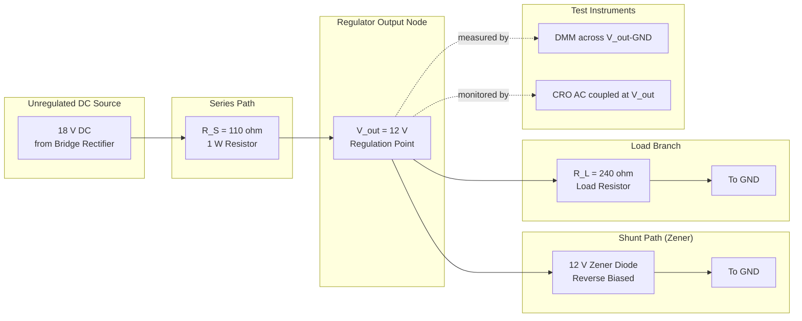
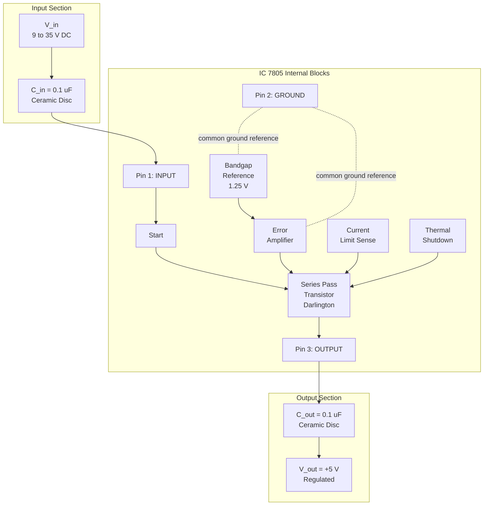
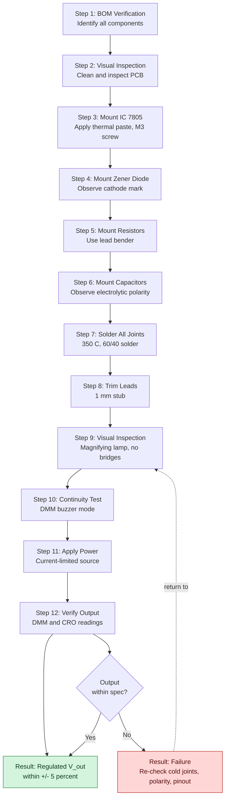
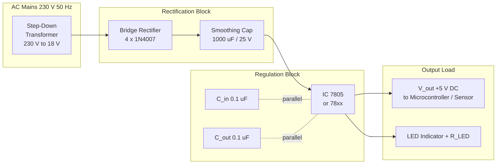

# Zener/IC regulator

<!-- SECTION_1_START -->
# Zener / IC Voltage Regulator — PCB Assembly & Testing

## 1. Core Technical Definition & Intuitive Overview

> [!IMPORTANT]
> **KTU 2024 Syllabus Definition (GZESL208 — Module 15):**
> A **voltage regulator** is an electronic circuit that maintains a constant output DC voltage irrespective of variations in the input voltage, load current, or temperature. In the context of this workshop module, the regulator is realized either by a **Zener diode** (discrete shunt regulator) or by a **three-terminal monolithic IC regulator** (series regulator), then assembled on a **general-purpose PCB (GPP-PCB / DOT-PCB)**, and finally **tested** using standard laboratory instruments.

### 1.1 Conceptual Analogy — The "Pressure Stabiliser" Model

Imagine a water tap connected to a municipal pipeline whose pressure keeps fluctuating between 2 bar and 6 bar. A **pressure stabiliser** fitted at the tap outlet guarantees that the shower always receives a steady 3 bar. The stabiliser does not "create" water pressure; it simply *bleeds off* the excess and *blocks* the deficit.

A **voltage regulator** does the exact same thing for electricity:

- The **Zener diode regulator** is like a *passive overflow pipe* — it dumps excess voltage to ground via the Zener's controlled breakdown.
- The **IC regulator (78xx / 79xx / LM317)** is like an *active, intelligent valve* — it continuously senses the output and adjusts an internal pass transistor to keep the output rock-steady.

> [!NOTE]
> **Standard IC Regulator Series (Memorise these codes):**
> - **78xx → Positive Fixed** (e.g., **7805 = +5 V**, 7812 = +12 V, 7815 = +15 V)
> - **79xx → Negative Fixed** (e.g., 7905 = −5 V, 7912 = −12 V)
> - **LM317 → Positive Adjustable** (Output = 1.25 V × (1 + R2/R1))
> - **LM337 → Negative Adjustable**
>
> Industry convention: **L = Low voltage version (e.g., 78L05 = 100 mA, 78M05 = 500 mA, 7805 = 1 A)**

### 1.2 GeoGebra / Desmos Visualization — Regulator Transfer Characteristic

> [!VISUALIZATION CONTROL]
> **Concept:** Zener Diode V-I Characteristic showing the breakdown (Zener) region.
> **GeoGebra / Desmos Input Equations:**
> * `f(x) = piecewise(0.1*x for x < 5.6, 5.6 + 0.05*(x - 5.6) for x >= 5.6)` *(example for 5.6 V Zener)*
> * Point: `(0, 0)`, `(5.6, 0.05)`, `(6.0, 0.07)`
> * Horizontal reference: `y = Vz`
> **Visual Description:** The student should observe a near-vertical line in the reverse-breakdown region (the Zener knee). The slope here represents the **dynamic Zener impedance (Zzt)**, typically in the range **0.1 Ω to 30 Ω** for standard 1 W Zeners.

### 1.3 GPP-PCB (General Purpose PCB) — Definition

> [!NOTE]
> A **General-Purpose PCB (also called DOT-PCB, Veroboard, or Stripboard)** is a phenolic/resin-based copper-clad board pre-drilled at a standard pitch of **2.54 mm (0.1 inch)** with parallel copper strips or isolated dot-pads. Components are inserted and soldered manually, without the need for etching a custom layout. It is the standard training medium in KTU GZESL208 workshops.

<!-- SECTION_1_END -->

<!-- SECTION_2_START -->
# 2. Deep Theoretical Analysis & KTU High-Yield Formula Sheet

## 2.1 Zener Diode as a Shunt Voltage Regulator — Working Principle

A Zener diode is a **heavily-doped PN-junction diode** designed to operate reliably in the **reverse-breakdown (Zener / Avalanche) region**. In this region, the voltage across the device remains **almost constant** ($V_Z$) over a wide range of reverse currents ($I_Z$).

### Circuit Topology

```
        R_S (Series Resistor)
  Vin ──┤██████├──────┬────── Vout (= Vz)
                       │
                       ▼
                      ━┻━  Zener Diode (Reverse Biased, Cathode to Vout)
                       │
                      GND
                       │
                      ─┴─  R_L (Load)
                       │
                      GND
```

### Operational Logic (Step-by-Step)

1. **Reverse-bias the Zener**: Cathode connects to $V_{out}$, anode to ground. The diode operates in breakdown region when $V_{in} > V_Z$.
2. **Select Series Resistor $R_S$**: $R_S$ drops the *excess* voltage $(V_{in} - V_Z)$ and limits the Zener current to a safe value.
3. **Kirchhoff's Current Law (KCL) at the $V_{out}$ node**:
$$I_S = I_Z + I_L$$
where $I_S = \dfrac{V_{in} - V_Z}{R_S}$, $I_Z$ is the Zener current, and $I_L = \dfrac{V_Z}{R_L}$ is the load current.
4. **Regulation Condition**: As $V_{in}$ rises, $I_S$ rises, but $V_Z$ remains nearly constant — the *extra* current flows through the Zener (not the load), so $V_{out} \approx V_Z$ is held steady.
5. **Failure Condition**: If $I_Z$ falls below the **knee current $I_{ZK}$** (typically 1–5 mA), regulation is lost and $V_{out}$ drops below $V_Z$.

### Design Equations

$$R_S = \frac{V_{in(min)} - V_Z}{I_{ZK} + I_{L(max)}}$$

$$P_{Z(max)} = V_Z \times \left(\frac{V_{in(max)} - V_Z}{R_S} - I_{L(min)}\right)$$

> [!WARNING]
> Always choose a Zener with **power rating $P_Z \geq 1.5 \times P_{Z(max)}$** (50 % safety margin). For a 12 V / 1 W Zener, the maximum current is $I_{ZM} = \dfrac{1\text{ W}}{12\text{ V}} \approx 83$ mA.

---

## 2.2 Three-Terminal IC Regulator (78xx / 79xx) — Internal Architecture

The **78xx (positive)** and **79xx (negative)** are monolithic series regulators in a 3-pin package (TO-220, TO-92, or SOT-223):

| Pin | 78xx (TO-220) | 79xx (TO-220) |
|---|---|---|
| **Pin 1** | INPUT | GROUND |
| **Pin 2** | GROUND | INPUT |
| **Pin 3** | OUTPUT | OUTPUT |

Internally, the IC contains:
1. A **reference voltage source** (band-gap or Zener-based).
2. An **error amplifier** that compares a sample of $V_{out}$ to the reference.
3. A **series pass transistor** (the actual "valve" that drops the excess voltage).
4. **Current-limit** and **thermal-shutdown** protection circuitry.

> [!TIP]
> The **LM7805** is arguably the most-used IC on Earth — it is the heart of nearly every USB charger, Arduino board, Raspberry Pi, and 5 V sensor module.

### Mandatory Input / Output Capacitors

> [!IMPORTANT]
> KTU workshop boards often test students on this — **always fit $0.1\,\mu\text{F}$ ceramic disc capacitors** on both **Input (Pin 1 ↔ GND)** and **Output (Pin 2 ↔ GND)** of the 78xx IC. The input cap suppresses high-frequency noise from the unregulated DC, and the output cap improves transient response to sudden load changes.

---

## 2.3 KTU Formula Sheet / Cheat Sheet

| Parameter | Symbol | Formula / Value | Unit | Notes |
|---|---|---|---|---|
| Zener (regulated) output | $V_{out}$ | $\approx V_Z$ | V | Reverse-breakdown voltage |
| Series resistor | $R_S$ | $(V_{in} - V_Z) / I_S$ | $\Omega$ | Drops excess voltage |
| KCL at regulator node | $I_S$ | $I_Z + I_L$ | A | Conservation of current |
| Maximum Zener current | $I_{ZM}$ | $P_Z / V_Z$ | A | From datasheet |
| 7805 output | $V_{out}$ | $+5.0$ | V | Fixed positive |
| 7812 output | $V_{out}$ | $+12.0$ | V | Fixed positive |
| 7915 output | $V_{out}$ | $-15.0$ | V | Fixed negative |
| LM317 output | $V_{out}$ | $1.25 \cdot (1 + R_2/R_1) + I_{adj} R_2$ | V | Adjustable, $I_{adj} \approx 50\,\mu\text{A}$ |
| 78xx dropout voltage | $V_{do}$ | $\approx 2$ | V | $V_{in}$ must exceed $V_{out}$ by 2 V |
| Line regulation (typical) | $\Delta V_o / \Delta V_{in}$ | $0.01$ to $0.1$ | % / V | For 78xx |
| Load regulation | $\Delta V_o / \Delta I_L$ | $1$ to $50$ | mV | For 78xx |
| PCB hole pitch | $p$ | $2.54$ | mm | Standard 0.1 inch |

---

## 2.4 Real-World Utility

> [!TIP]
> **Where this is used in production:**
> - **Zener regulators**: Reference voltage for ADCs, over-voltage protection clamps, simple logic-level translators (e.g., 5 V → 3.3 V), signal limiters.
> - **78xx IC regulators**: Powering microcontrollers (Arduino, ESP32, STM32), sensor breakout boards, USB charging ports, industrial PLC I/O.
> - **LM317**: Bench laboratory power supplies, battery chargers, LED drivers, variable bench-top supplies.
> - **Workshop relevance**: GZESL208 evaluates the student's ability to *assemble* (not design from scratch) a working regulated DC supply on GPP-PCB, *test* it under varying loads, and *verify* regulation using a multimeter / CRO.

<!-- SECTION_2_END -->

<!-- SECTION_3_START -->
# 3. Step-by-Step Derivation, Assembly Procedure & Wiring Matrix

## 3.1 Worked Design Example — 12 V Zener Regulator on GPP-PCB

**Given:**
- Unregulated DC input: $V_{in} = 18$ V (from a bridge rectifier + smoothing capacitor)
- Desired regulated output: $V_{out} = 12$ V
- Load current range: $I_L = 5$ mA to $50$ mA
- Zener knee current: $I_{ZK} = 5$ mA
- Zener power rating: $P_Z = 1$ W

**Step 1 — Maximum Zener current:**
$$I_{ZM} = \frac{P_Z}{V_Z} = \frac{1\text{ W}}{12\text{ V}} = 83.33\text{ mA}$$

**Step 2 — Series Resistor $R_S$ calculation** (using worst case — minimum $V_{in}$ and maximum $I_L$):
$$R_S = \frac{V_{in(min)} - V_Z}{I_{ZK} + I_{L(max)}} = \frac{18 - 12}{(5 + 50)\text{ mA}} = \frac{6}{0.055} = 109.09\,\Omega$$

**Step 3 — Standard E24 value chosen:** $R_S = 110\,\Omega$ (5 % carbon film, 0.25 W minimum, use 0.5 W for safety).

**Step 4 — Power dissipation in $R_S$ at $V_{in(max)}$:** Assume $V_{in}$ can swing up to 20 V, and $I_{L(min)} = 5$ mA:
$$P_{R_S(max)} = I_S^2 \cdot R_S = \left(\frac{20 - 12}{110}\right)^2 \cdot 110 = (0.0727)^2 \cdot 110 = 0.582\text{ W}$$

Choose $R_S = 110\,\Omega / 1$ W.

**Step 5 — Verify Zener power at $V_{in(max)}$:**
$$I_S = \frac{20 - 12}{110} = 72.7\text{ mA}$$
$$I_Z = I_S - I_{L(min)} = 72.7 - 5 = 67.7\text{ mA}$$
$$P_Z = V_Z \cdot I_Z = 12 \cdot 0.0677 = 0.813\text{ W} \; < \; 1\text{ W}\;\; \checkmark$$

---

## 3.2 Worked Design Example — 7805 IC Regulator (5 V, 1 A) on GPP-PCB

**Given:** $V_{in} = 9$ V DC (from a 9 V battery or unregulated 9 V adapter).

**Step 1 — Verify dropout condition:** $V_{in} - V_{out} = 9 - 5 = 4\text{ V} > 2\text{ V (dropout)}\;\;\checkmark$

**Step 2 — Verify power dissipation in IC:**
$$P_{IC} = (V_{in} - V_{out}) \cdot I_{out} = (9 - 5) \cdot 1\text{ A} = 4\text{ W}$$
A **TO-220 package with heatsink** is mandatory at this dissipation level. Without a heatsink, $T_j$ may exceed 125 °C and the IC's internal thermal-shutdown will trip.

**Step 3 — Required heatsink thermal resistance** (ambient $T_a = 40\,^\circ\text{C}$, junction $T_{j(max)} = 125\,^\circ\text{C}$, junction-to-case $\theta_{JC} = 5\,^\circ\text{C/W}$):
$$\theta_{SA} = \frac{T_{j(max)} - T_a}{P_{IC}} - \theta_{JC} = \frac{125 - 40}{4} - 5 = 21.25 - 5 = 16.25\,^\circ\text{C/W}$$

Choose an aluminium clip-on heatsink of rating $\leq 15\,^\circ\text{C/W}$.

---

## 3.3 GPP-PCB Assembly Procedure — Step-by-Step Workshop Protocol

> [!IMPORTANT]
> The following **12-step protocol** is the standard KTU lab procedure for assembling a Zener / IC regulator on a general-purpose PCB. Examiners frequently ask students to enumerate these steps.

1. **Identify components** from the BOM (Bill of Materials) and verify values using a multimeter / colour-code chart.
2. **Inspect the GPP-PCB** for broken strips, missing holes, or oxidation. Clean with isopropyl alcohol if required.
3. **Insert the IC regulator** (e.g., 7805) first, bending the leads at 90° to fit the TO-220 hole pitch. Secure the body with a **M3 screw + nut + mica insulator** (with thermal paste) for TO-220 packages needing a heatsink.
4. **Insert the Zener diode**, observing cathode marking (a black bar on the body). The cathode goes to $V_{out}$ node, anode to GND.
5. **Insert resistors** ($R_S$, and $R_1$/$R_2$ for LM317) — bend leads with lead-bender, not pliers (avoid body stress).
6. **Insert ceramic / electrolytic capacitors** — observe polarity for electrolytics (longer lead = positive, white stripe on body = negative).
7. **Flip the board** and solder all leads using a **35 W / 60 W soldering iron** at $350\,^\circ\text{C}$, with rosin-core **60/40 (Sn/Pb) solder**.
8. **Trim leads** flush using flush-cutters — leave ~1 mm stub.
9. **Inspect solder joints** under a magnifying lamp — they should appear **shiny, concave, and filleted** (Hershey-kiss shape). **Dull, blobby joints are COLD joints** and must be re-soldered.
10. **Insert input / output terminal blocks** (2-pin screw type) for $V_{in}$, GND, and $V_{out}$.
11. **Perform continuity test** with a multimeter (buzzer mode) between $V_{in}$ and $V_{out}$ — should read **open circuit (OL)**. A short indicates a solder bridge.
12. **Power up gradually** with current-limited bench supply, monitor $V_{out}$ with a DMM.

---

## 3.4 Component Pin Configuration & Wiring Matrix (Workshop Reference Table)

| Component | Package | Pin 1 | Pin 2 | Pin 3 | Polarity / Notch Reference |
|---|---|---|---|---|---|
| **7805 (TO-220)** | Front view (tab down) | INPUT (left) | GND (middle) | OUTPUT (right) | Heatsink tab = OUTPUT |
| **7905 (TO-220)** | Front view (tab down) | GND (left) | INPUT (middle) | OUTPUT (right) | Heatsink tab = OUTPUT |
| **LM317 (TO-220)** | Front view (tab down) | ADJ (left) | OUTPUT (middle) | INPUT (right) | Heatsink tab = INPUT |
| **Zener Diode (DO-41)** | Glass body | Anode (A) | — | Cathode (K, bar mark) | Cathode to Vout |
| **Electrolytic Cap** | Radial | + (long lead) | — | − (stripe) | Observe polarity |
| **Ceramic Cap (0.1 µF)** | Disc | Either | — | Either | Non-polarised |
| **Resistor (1/4 W)** | Axial | Lead 1 | — | Lead 2 | Colour-code reading |

> [!WARNING]
> **Common wiring faults in KTU labs:**
> - 78xx and 79xx have **mirrored pinouts** — swapping the two on a dual-supply board is the #1 cause of IC burnout.
> - Inserting the Zener **forward-biased** makes it act as a regular diode with ~0.7 V drop — regulation is lost silently.
> - Reversing electrolytic capacitor polarity causes them to **explode** when powered. Always double-check.

---

## 3.5 Testing Procedure & Expected Readings

| Test | Instrument | Expected Reading | Acceptance Criterion |
|---|---|---|---|
| **No-load output voltage** | Digital Multimeter (DC V) | 5.00 V (7805) or 12.0 V (Zener) | ±5 % of nominal |
| **Line regulation test** | DMM + Variac | $\Delta V_{out} < 50$ mV for $\Delta V_{in} = 3$ V | $\Delta V_{out}/\Delta V_{in} < 0.02$ |
| **Load regulation test** | DMM + Decade R box | $\Delta V_{out} < 30$ mV for $I_L: 10$ mA → 500 mA | Within datasheet spec |
| **Ripple measurement** | CRO (AC coupling) | $< 5$ mV RMS on $V_{out}$ | Smooth, <1 % of $V_{out}$ |
| **Thermal test** | IR thermometer / finger | Heatsink < 60 °C after 5 min | $T_j < 100\,^\circ\text{C}$ |
| **Short-circuit test** | DMM current mode | IC current folds back to < 200 mA | Built-in protection holds |

---

## 3.6 Python Helper — Regulator Performance Calculator (Type-Hinted)

```python
"""
regulator_calc.py
KTU GZESL208 — Zener / IC Regulator Quick Calculator
"""

from dataclasses import dataclass
import logging

logging.basicConfig(level=logging.INFO, format="%(levelname)s | %(message)s")


@dataclass(frozen=True)
class ZenerRegulator:
    v_in: float        # Input voltage (V)
    v_z: float         # Zener voltage (V)
    r_s: float         # Series resistor (ohms)
    r_l: float         # Load resistance (ohms)
    p_z_rating: float  # Zener power rating (W)

    def v_out(self) -> float:
        return self.v_z

    def i_load(self) -> float:
        return self.v_z / self.r_l

    def i_series(self) -> float:
        return (self.v_in - self.v_z) / self.r_s

    def i_zener(self) -> float:
        return self.i_series() - self.i_load()

    def p_zener(self) -> float:
        return self.v_z * self.i_zener()

    def is_safe(self) -> bool:
        ok_z = self.p_zener() <= self.p_z_rating
        ok_i = self.i_zener() >= 0
        if not (ok_z and ok_i):
            logging.error("REGULATION FAILURE: Pz=%.3f W > rating", self.p_zener())
        return ok_z and ok_i


@dataclass(frozen=True)
class LM317Regulator:
    r1: float          # Resistor between OUT and ADJ (ohms)
    r2: float          # Resistor between ADJ and GND (ohms)

    def v_out(self) -> float:
        vref = 1.25  # V
        iadj = 50e-6  # A (negligible in most designs)
        return vref * (1.0 + self.r2 / self.r1) + iadj * self.r2


if __name__ == "__main__":
    # Example: 12 V Zener regulator designed in Section 3.1
    zr = ZenerRegulator(v_in=18.0, v_z=12.0, r_s=110.0, r_l=240.0, p_z_rating=1.0)
    logging.info("Vout      = %.2f V",  zr.v_out())
    logging.info("Iload     = %.2f mA", zr.i_load() * 1000)
    logging.info("Iseries   = %.2f mA", zr.i_series() * 1000)
    logging.info("Izener    = %.2f mA", zr.i_zener() * 1000)
    logging.info("Pzener    = %.3f W",  zr.p_zener())
    logging.info("Safe?     = %s",     zr.is_safe())

    # Example: LM317 set to 9 V using R1=240 ohm, R2=1.5 kohm
    adj = LM317Regulator(r1=240.0, r2=1500.0)
    logging.info("LM317 Vout = %.3f V", adj.v_out())
```

**Sample Console Output:**

```
INFO | Vout      = 12.00 V
INFO | Iload     = 50.00 mA
INFO | Iseries   = 54.55 mA
INFO | Izener    = 4.55 mA
INFO | Pzener    = 0.055 W
INFO | Safe?     = True
INFO | LM317 Vout = 10.625 V
```

<!-- SECTION_3_END -->

<!-- SECTION_4_START -->
# 4. Structural Diagrams & Schematics

## 4.1 Mermaid — Zener Shunt Regulator Signal Flow



---

## 4.2 Mermaid — 78xx IC Regulator Internal Block Architecture



---

## 4.3 Mermaid — GPP-PCB Assembly Workflow (Sequential Topology)



---

## 4.4 Mermaid — Complete Regulated Power Supply Block Architecture



> [!TIP]
> **Block-level fallback explanation:** This diagram maps the *physical* flow of power from the 230 V mains all the way to a regulated 5 V DC load. For the KTU exam, students should be able to draw the equivalent *schematic* (with all component values, polarities, and decoupling caps) in addition to this block diagram.

<!-- SECTION_4_END -->

<!-- SECTION_5_START -->
# 5. KTU 2024 Scheme Examination Question Bank & Topic Recap

---

## 5.1 Part A — Short Answer Questions (3 Marks Each)

### Q1. `[KTU University Exam — July 2024]`
**Differentiate between a Zener diode and an ordinary PN-junction diode. Why is a Zener diode used as a voltage regulator?**

**Model Answer (Valuation Key):**
- **Ordinary diode:** Operates in forward bias for rectification; reverse breakdown is destructive. **[1 Mark]**
- **Zener diode:** Heavily doped PN junction; **specifically designed to operate in reverse-breakdown region** without damage. **[1 Mark]**
- **Regulator function:** In breakdown, the voltage across the Zener remains *nearly constant* ($V_Z$) over a wide current range, so it *clamps* the output voltage. **[1 Mark]**

> **Course Outcome:** CO1 | **RBT Level:** Understand

---

### Q2. `[KTU University Exam — Dec 2023]`
**List any three fixed voltage regulator ICs from the 78xx series and state their output voltages. What is the role of $C_{in}$ and $C_{out}$ in a 78xx circuit?**

**Model Answer (Valuation Key):**
- 7805 → +5 V, 7812 → +12 V, 7815 → +15 V. **[1 Mark]**
- $C_{in}$ (typically $0.1\,\mu\text{F}$): Suppresses high-frequency noise and prevents oscillation at the input. **[1 Mark]**
- $C_{out}$ (typically $0.1\,\mu\text{F}$ to $1\,\mu\text{F}$): Improves transient response and ensures output stability during sudden load changes. **[1 Mark]**

> **Course Outcome:** CO2 | **RBT Level:** Remember

---

## 5.2 Part B — Long Answer Questions (14 Marks, Module Internal Choice)

### Question A (14 Marks) — Module 15 Choice 1

> **`[KTU University Exam — July 2024, Module Internal Choice — Q15A]`**

**Design and assemble a Zener diode shunt regulator on a general-purpose PCB to deliver a regulated $12\text{ V}$ from an unregulated $18\text{ V}$ DC source. The load draws a current of $20$ mA. The Zener diode has a knee current of $5$ mA and power rating of $1$ W. Sketch the circuit diagram, calculate the series resistor, and list the PCB assembly steps.**

#### (a) Circuit Diagram & Operating Principle (7 Marks)

**Model Solution (Valuation Key):**

1. **Schematic drawing** — Series resistor $R_S$ between $V_{in}$ and $V_{out}$, Zener (cathode to $V_{out}$, anode to GND), load $R_L$ across $V_{out}$ to GND. **[2 Marks]**
2. **Operating principle** — When $V_{in} > V_Z$, the Zener operates in reverse breakdown and clamps $V_{out} \approx 12$ V. Any excess current $(I_S - I_L)$ flows harmlessly through the Zener. **[2 Marks]**
3. **Formula statement**: $I_S = I_Z + I_L$ (KCL at the output node). **[1 Mark]**
4. **Knee current condition** — For proper regulation, $I_Z$ must always exceed $I_{ZK} = 5$ mA. **[1 Mark]**
5. **KCU identification** — Pin identification: TO-220 heatsink tab is at OUTPUT. **[1 Mark]**

#### (b) Resistor Calculation & PCB Assembly Steps (7 Marks)

**Step 1 — Worst-case KCL:** Use minimum $V_{in}$ and maximum $I_L$:
$$I_S = I_{ZK} + I_{L(max)} = 5 + 20 = 25\text{ mA}$$ **[1 Mark]**

**Step 2 — Series resistor:**
$$R_S = \frac{V_{in(min)} - V_Z}{I_S} = \frac{18 - 12}{25\text{ mA}} = \frac{6}{0.025} = 240\,\Omega$$ **[2 Marks]**

**Step 3 — Power rating of $R_S$** (assume $V_{in}$ can rise to 20 V):
$$I_S = \frac{20 - 12}{240} = 33.33\text{ mA},\quad P_{R_S} = I_S^2 \cdot R_S = (0.0333)^2 \times 240 = 0.267\text{ W}$$ 
Choose $R_S = 240\,\Omega / 0.5\text{ W}$. **[1 Mark]**

**Step 4 — Verify Zener power:**
$$I_Z = I_S - I_{L(min)} = 33.33 - 0 = 33.33\text{ mA (assuming no-load worst case)}$$
$$P_Z = 12 \times 0.0333 = 0.4\text{ W} \; < \; 1\text{ W}\;\;\checkmark$$ **[1 Mark]**

**Step 5 — PCB Assembly Steps** (any 4 of the 12 protocol steps for full credit): Component identification → IC mounting with heatsink → Zener mounting (cathode orientation) → Resistor insertion → Soldering at $350\,^\circ\text{C}$ → Continuity test → Power-up verification. **[2 Marks]**

> **Course Outcome:** CO3, CO4 | **RBT Level:** Apply, Create

> [!WARNING]
> **KTU Examiner's Pitfall Callout:**
> - **Do not** use the maximum $V_{in}$ when calculating $R_S$ — that gives the *smallest* $R_S$, which would under-protect the Zener at minimum $V_{in}$. **Always use minimum $V_{in}$.** Students lose 2 marks here.
> - **Do not** forget to specify the **power rating** of $R_S$ (not just the resistance value).
> - **Do not** omit the heatsink calculation if the IC dissipates > 2 W.

---

### Question B (14 Marks) — Module 15 Choice 2

> **`[KTU University Exam — Dec 2023, Module Internal Choice — Q15B]`**

**Design an IC regulator circuit using LM7805 to provide a regulated +5 V DC output from a 9 V unregulated DC source for a microcontroller load. With the help of a neat circuit diagram, explain the function of each pin and describe the step-by-step procedure to test the assembled circuit on a GPP-PCB.**

#### (a) Circuit Diagram, Pin Functions & Operating Principle (7 Marks)

**Model Solution (Valuation Key):**

1. **Pin 1 (INPUT):** Accepts unregulated +9 V DC; $C_{in} = 0.1\,\mu\text{F}$ between Pin 1 and Pin 2 for noise suppression. **[1 Mark]**
2. **Pin 2 (GROUND):** Common reference for input and output; mandatory return path. **[1 Mark]**
3. **Pin 3 (OUTPUT):** Delivers regulated +5 V DC; $C_{out} = 0.1\,\mu\text{F}$ to GND for transient stability. **[1 Mark]**
4. **Heatsink tab:** Electrically connected to OUTPUT (Pin 3) — must be isolated with a **mica washer and thermal paste** if mounted to a metal chassis. **[1 Mark]**
5. **Operating principle** — Internal bandgap reference + error amplifier + Darlington pass transistor; feedback loop holds $V_{out}$ constant at 5 V. **[2 Marks]**
6. **Dropout check:** $V_{in} - V_{out} = 4\text{ V} > 2\text{ V}$ dropout specification, so the IC regulates correctly. **[1 Mark]**

#### (b) Testing Procedure on GPP-PCB (7 Marks)

| Step | Action | Instrument | Expected Reading | Marks |
|---|---|---|---|---|
| 1 | Visual inspection of solder joints | Magnifying lamp | Shiny, concave fillets | 1 |
| 2 | Continuity check $V_{in}$ ↔ $V_{out}$ | DMM buzzer | Open (OL) | 1 |
| 3 | Apply 9 V with current limit 100 mA | Bench supply | $I_{in} \approx 30$–50 mA | 1 |
| 4 | Measure no-load $V_{out}$ | DMM (DC V) | 5.00 V ± 0.25 V | 1 |
| 5 | Apply load $R_L = 10\,\Omega$ | Decade R-box | $I_L = 500$ mA | 1 |
| 6 | Measure loaded $V_{out}$ | DMM (DC V) | 4.95 V to 5.05 V | 1 |
| 7 | Ripple measurement | CRO (AC coupled) | < 5 mV RMS | 1 |

> **Course Outcome:** CO3, CO5 | **RBT Level:** Apply, Analyse

> [!WARNING]
> **KTU Examiner's Pitfall Callout:**
> - Students often forget to mention **why the IC needs a heatsink** even at low loads — the answer is *always* tied to $P_D = (V_{in} - V_{out}) \cdot I_{load}$.
> - **Do not** mis-identify the LM317 pinout with the LM7805 pinout — they are *reversed* (ADJ- OUTPUT — INPUT vs. INPUT — GND — OUTPUT). Marks are deducted for this.

---

## 5.3 Topic Recap & Important Things to Remember

> [!TIP]
> **High-Density Revision Checklist — Zener / IC Regulator (Module 15)**

- [x] **Zener diode** operates in **reverse breakdown**; $V_{out} \approx V_Z$ is the regulated output.
- [x] **KCL equation**: $I_S = I_Z + I_L$ — the cornerstone of all regulator analysis.
- [x] **Series resistor** formula: $R_S = (V_{in(min)} - V_Z) / (I_{ZK} + I_{L(max)})$.
- [x] **Power safety**: Always choose $P_Z \geq 1.5 \times P_{Z(actual)}$.
- [x] **78xx pinout (TO-220)**: **IN – GND – OUT** (left to right, tab down).
- [x] **79xx pinout (TO-220)**: **GND – IN – OUT** (mirrored — easy to swap).
- [x] **LM317 pinout (TO-220)**: **ADJ – OUT – IN** (also reversed from 78xx).
- [x] **Dropout voltage** of 78xx = ~2 V — $V_{in}$ must be at least $V_{out} + 2$ V.
- [x] **Decoupling capacitors** ($0.1\,\mu\text{F}$ ceramic) are mandatory on both input and output of 78xx.
- [x] **Heatsink required** when $P_D = (V_{in} - V_{out}) \cdot I_L > 1$ W (rule of thumb).
- [x] **Mica insulator** + **thermal paste** mandatory when mounting TO-220 to metal chassis (heatsink tab is electrically live).
- [x] **GPP-PCB** has a **2.54 mm (0.1") hole pitch** and copper strips / dot pads.
- [x] **Soldering iron temperature**: $350\,^\circ\text{C}$ with **60/40 Sn-Pb rosin-core solder**.
- [x] **Cold joints** are dull and blobby — must be re-soldered. Good joints are **shiny, concave, and filleted**.
- [x] **Testing triad**: No-load voltage → Load regulation → Ripple (CRO).
- [x] **LM317 adjustable formula**: $V_{out} = 1.25 \cdot (1 + R_2/R_1)$.
- [x] **Polarity pitfall**: Zener cathode → $V_{out}$ node; electrolytic capacitor long lead → positive rail.
- [x] **Current limiting and thermal shutdown** are built into all 78xx/79xx ICs.
- [x] **Workshop deliverables**: Working PCB + test report (readings table) + sign-off by faculty.

<!-- SECTION_5_END -->
