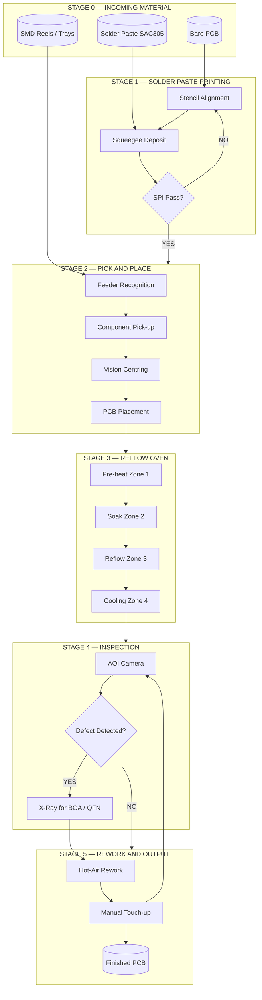
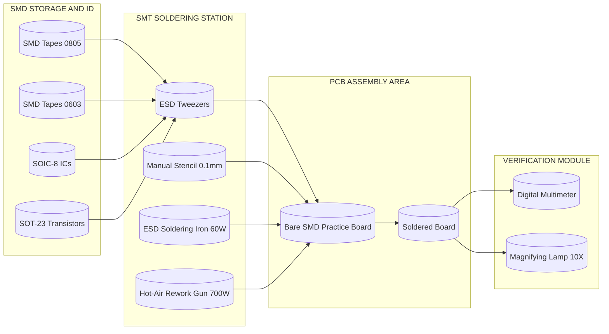
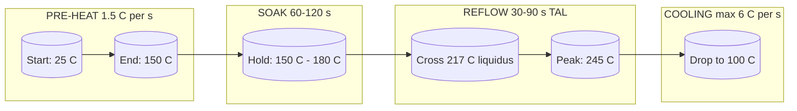

# Assembling of electronic circuits using SMT (Surface Mount Technology) stations.

<!-- SECTION_1_START -->
# Assembling of Electronic Circuits using SMT (Surface Mount Technology) Stations

## 1.1 Formal Academic Definition

**Surface Mount Technology (SMT)** is a method of constructing electronic circuits in which the components — known as **Surface Mount Devices (SMDs)** — are mounted directly onto the surface of a printed circuit board (PCB), as opposed to inserting their leads through drilled holes on the board (the conventional **Through-Hole Technology (THT)**). The components are soldered onto copper pads on the PCB surface using reflow soldering, wave soldering, or selective soldering techniques.

> [!IMPORTANT]
> **SMT (Surface Mount Technology)** is a modern PCB assembly methodology in which SMDs are placed onto solder-pasted pads on a bare PCB and permanently bonded through controlled **reflow soldering** at temperatures typically between **220 °C and 250 °C** (peak), using RoHS-compliant lead-free SAC alloys (e.g., **SAC305**: 96.5% Sn, 3.0% Ag, 0.5% Cu).

> [!NOTE]
> **KTU 2024 Syllabus Highlight (GZESL208 – Module 16):**
> Students must be able to identify, place, and solder common SMD packages (resistors, capacitors, diodes, transistors, ICs) on a practice PCB using a **soldering station with hot-air rework / SMT station**, and verify continuity using a multimeter / DMM.

## 1.2 Conceptual Analogy / Intuition

Imagine two ways of decorating a cake:
- **Through-Hole (THT):** You push cocktail sticks (component leads) **all the way through** the cake (PCB) and hold them with icing on the bottom. Sturdy, but the sticks take up space and you need holes.
- **Surface Mount (SMT):** You place small candy pieces (SMD components) **only on the top surface** of the cake with frosting (solder paste) and gently heat until they stick. No holes needed, smaller, faster, and you can pack **thousands** of candies on a small cake.

> [!TIP]
> **Real-World Analogy:** SMT is to THT what a **smartphone** is to an **old landline telephone**. Both make calls, but the smartphone (SMT) is smaller, lighter, faster to manufacture, and packed with far more features per square centimetre.

| Aspect | Through-Hole Technology (THT) | Surface Mount Technology (SMT) |
| :--- | :--- | :--- |
| Mounting | Leads pass through drilled PCB holes | SMDs soldered onto surface pads |
| Component Density | Low | **High (up to 10× denser)** |
| Typical Frequency | Suitable for < 100 MHz | Suitable for **GHz** ranges |
| Assembly Speed | Slow (manual insertion) | **Automated (10,000+ CPH)** |
| Mechanical Strength | High (great for connectors) | Lower (depends on pad adhesion) |

## 1.3 Standard Physical Constants and Metrics

The following physical and design constants are essential for SMT assembly work:

- **Reflow Soldering Peak Temperature:** **220 °C – 250 °C** (lead-free, RoHS compliant).
- **Solder Paste Viscosity (typical):** **500 – 900 kcps** (kilo-centipoise) for SAC305 no-clean pastes.
- **Solder Paste Stencil Aperture:** Typically **80% – 100%** of the SMD land area.
- **Component Placement Accuracy:** Modern pick-and-place machines operate with a tolerance of **± 25 µm** to **± 50 µm**.
- **Reel Pitch (Tape & Reel):** Standard **4 mm** for 0402/0603 components, **8 mm** for 0805 and above.
- **IPC-A-610 Class 2/3 Inspection Standard:** Industry-accepted visual acceptance criteria for electronic assemblies.

> [!VISUALIZATION CONTROL]
> **Concept:** SMD Land Pattern Geometry (Pad Spacing vs. Component Size)
> **GeoGebra / Desmos Input Equations:**
> * `f(x_1) = 1.0` (constant land width for a 0805 SMD)
> * `g(x_1) = 2.0` (constant land length for a 0805 SMD)
> * `h(x_1) = 1.5` (component body width reference)
> **Visual Description:** On the Cartesian plane, plot two rectangles centred at the origin: the inner rectangle represents the **SMD body (e.g., 2.0 mm × 1.25 mm)** of an **0805 resistor**, and the outer rectangle represents the **PCB land pattern (e.g., 1.4 mm × 1.8 mm)**. The student should observe that the land pads extend **beyond the component body** by approximately **0.2 mm – 0.3 mm** on each side to form a fillet during reflow.

<!-- SECTION_1_END -->

<!-- SECTION_2_START -->
# Deep Theoretical Analysis & KTU High-Yield Formula Sheet

## 2.1 The SMT Assembly Process — Six Sequential Stages

A modern SMT line operates in a tightly synchronised **six-stage pipeline**. Each station is a self-contained cell with defined inputs and outputs, and a typical failure in one cell halts the entire line.

1. **Stage 1 – Solder Paste Printing (Stencil Stage):**
   - A stainless-steel stencil (thickness **100 – 150 µm**) is aligned over the bare PCB.
   - Solder paste (SAC305 + flux) is deposited through stencil apertures using a **squeegee blade** moving at **20 – 50 mm/s**.
   - Output: a precise film of paste, typically **120 – 150 µm thick**, on every PCB pad.

2. **Stage 2 – Component Placement (Pick-and-Place):**
   - SMDs are picked from tapes, trays, or sticks and placed on the pasted pads.
   - Machines classify components by feeder type: **tape-and-reel**, **tray**, or **stick**.
   - Placement force is controlled (typically **1.5 N – 3 N**) to avoid paste smearing.

3. **Stage 3 – Pre-Reflow Inspection (AOI / SPI):**
   - **Solder Paste Inspection (SPI)** measures paste volume, height, and alignment.
   - **Automated Optical Inspection (AOI)** is generally applied **after reflow** for component placement and solder-joint verification.

4. **Stage 4 – Reflow Soldering (Thermal Bonding):**
   - The PCB travels through a **reflow oven** with **5 – 8 heated zones**.
   - The thermal profile follows four critical phases: **Pre-heat → Soak → Reflow (TLimax) → Cooling**.
   - The peak temperature must remain **25 – 40 °C above** the SAC305 liquidus temperature (**217 °C**), but **below 250 °C** to protect components.

5. **Stage 5 – Post-Reflow Inspection (AOI + X-Ray for BGAs):**
   - Camera-based AOI detects **tombstoning, bridging, insufficient solder, and misalignment**.
   - **X-ray inspection** is mandatory for **BGA (Ball Grid Array)** and **QFN (Quad Flat No-leads)** packages where leads are hidden under the body.

6. **Stage 6 – Rework and Repair:**
   - Defective components are removed using a **hot-air rework station** at **300 – 400 °C** and replaced manually or with a semi-automatic rework machine.

## 2.2 KTU High-Yield Formula & Reference Sheet

| S.No. | Formula / Parameter | Description | Typical Value | Unit |
| :---: | :--- | :--- | :---: | :---: |
| 1 | $T_{\text{peak}}$ | Peak reflow temperature for SAC305 | $220 - 250$ | °C |
| 2 | $T_{\text{liquidus}}$ | Liquidus temperature of SAC305 alloy | $217$ | °C |
| 3 | $T_{\text{rise,max}}$ | Maximum ramp-up rate | $3$ | °C / s |
| 4 | $T_{\text{cool,max}}$ | Maximum cool-down rate | $6$ | °C / s |
| 5 | $t_{\text{soak}}$ | Time above 150 °C (soak zone) | $60 - 120$ | s |
| 6 | $t_{\text{above-liq}}$ | Time above liquidus (TAL) | $30 - 90$ | s |
| 7 | $L_{\text{pad}} = 1.0 \cdot L_{\text{comp}} + 0.5$ | SMD land length rule of thumb | variable | mm |
| 8 | $W_{\text{pad}} = 1.0 \cdot W_{\text{comp}} + 0.2$ | SMD land width rule of thumb | variable | mm |
| 9 | $d_{\text{stencil}} = 0.10 - 0.15$ | Stencil foil thickness | $0.10 - 0.15$ | mm |
| 10 | $\eta_{\text{yield}}$ | First-pass yield (FPY) target | $\ge 99.5$ | % |
| 11 | $R_{\text{CPH}}$ | Components per hour (pick-and-place) | $20,000 - 80,000$ | CPH |
| 12 | $f_{\text{vibrate}}$ | Max vibration at placement (to avoid paste slump) | $\le 0.5$ | g |

> [!IMPORTANT]
> **Why these formulas matter in the real world:**
> - The **ramp-up rate ($T_{\text{rise,max}}$)** prevents thermal shock to ceramic capacitors (MLCCs), which crack if heated too quickly.
> - **Time Above Liquidus ($t_{\text{above-liq}}$)** is critical: too short causes **cold joints**, too long dissolves copper pads and damages intermetallics.
> - The **land pattern formulas** (rules 7 and 8) directly determine whether a **tombstoning** defect occurs — a single-millimetre miscalculation can cost millions in a production environment.

## 2.3 SMD Component Package Identification

A common KTU exam pitfall is failing to identify SMD packages correctly. The following are the most important ones:

- **Resistor / Capacitor (Metric) Codes:**
  - `0402` → 0.04 × 0.02 inch (1.0 mm × 0.5 mm)
  - `0603` → 0.06 × 0.03 inch (1.6 mm × 0.8 mm)
  - `0805` → 0.08 × 0.05 inch (2.0 mm × 1.25 mm)
  - `1206` → 0.12 × 0.06 inch (3.2 mm × 1.6 mm)
- **Transistors:** **SOT-23**, **SOT-223**.
- **Diodes:** **SMA**, **SMB**, **SOD-123**.
- **ICs:** **SOIC-8**, **QFP**, **QFN**, **BGA**.
- **LEDs:** **0805 LED**, **PLCC-2**, **1206 LED**.

## 2.4 Real-World Utility in Engineering

- **Consumer Electronics:** Smartphones, tablets, laptops — almost entirely SMT.
- **Automotive ECUs:** Engine control units, ADAS modules, and infotainment systems.
- **Medical Devices:** Pacemakers, hearing aids, MRI controllers.
- **IoT and Wearables:** Smartwatches, fitness bands.
- **Aerospace and Defence:** Avionics, satellites, where **miniaturisation** and **weight reduction** are critical.

> [!TIP]
> **Engineering Insight:** SMT is the reason modern smartphones can carry **> 1,500 components** in a 100 cm² PCB. In 1965, the same circuit using THT would have needed a PCB **at least 10× larger**.

<!-- SECTION_2_END -->

<!-- SECTION_3_START -->
# Step-by-Step Derivations, Workshop Matrices, and Code Implementation

## 3.1 SMD Land Pattern Derivation (KTU Numerical Expectation)

> **Problem:** A student must design the PCB land pattern for an **0805 SMD resistor** of body size $2.0 \text{ mm} \times 1.25 \text{ mm}$. Using the rule of thumb from §2.2 (rules 7 and 8), calculate the land pad dimensions and the centre-to-centre pitch.

**Given:**
- Component body length: $L_{\text{comp}} = 2.0 \text{ mm}$
- Component body width: $W_{\text{comp}} = 1.25 \text{ mm}$

**Step 1 — Land Length Calculation:**
$$L_{\text{pad}} = 1.0 \cdot L_{\text{comp}} + 0.5$$
$$L_{\text{pad}} = 1.0 \cdot 2.0 + 0.5 = 2.5 \text{ mm}$$

**Step 2 — Land Width Calculation:**
$$W_{\text{pad}} = 1.0 \cdot W_{\text{comp}} + 0.2$$
$$W_{\text{pad}} = 1.0 \cdot 1.25 + 0.2 = 1.45 \text{ mm}$$

**Step 3 — Centre-to-Centre Pitch (typical for 0805):**
$$P = W_{\text{pad}} + W_{\text{gap,min}}$$
$$P = 1.45 + 0.5 = 1.95 \text{ mm} \quad (\text{rounded to } 2.0 \text{ mm})$$

**Final Answer (for KTU board answer):**
- $L_{\text{pad}} = 2.5 \text{ mm}$
- $W_{\text{pad}} = 1.45 \text{ mm}$
- $P \approx 2.0 \text{ mm}$

> [!IMPORTANT]
> **Conversion Logic Explained:**
> - The **+ 0.5 mm** in the length formula compensates for **solder fillet formation** at each end of the SMD.
> - The **+ 0.2 mm** in the width formula allows for **slight self-centring** during reflow (a phenomenon called **self-alignment**).

---

## 3.2 Reflow Soldering Thermal Profile — Time–Temperature Derivation

> **Problem:** The KTU board may ask to compute the **Time Above Liquidus (TAL)** for a given reflow ramp rate. Given a ramp-up rate of $1.5 \text{ °C/s}$ from 150 °C and a peak of 245 °C, followed by free cooling at 2 °C/s, find the TAL.

**Given:**
- $T_{\text{soak,top}} = 150 \text{ °C}$
- $T_{\text{liquidus}} = 217 \text{ °C}$
- $T_{\text{peak}} = 245 \text{ °C}$
- $R_{\text{rise}} = 1.5 \text{ °C/s}$
- $R_{\text{cool}} = 2.0 \text{ °C/s}$

**Step 1 — Time to Reach Liquidus (Heating):**
$$t_{\text{to-liq}} = \frac{T_{\text{liquidus}} - T_{\text{soak,top}}}{R_{\text{rise}}}$$
$$t_{\text{to-liq}} = \frac{217 - 150}{1.5} = \frac{67}{1.5} = 44.67 \text{ s}$$

**Step 2 — Time to Reach Peak:**
$$t_{\text{to-peak}} = \frac{T_{\text{peak}} - T_{\text{liquidus}}}{R_{\text{rise}}}$$
$$t_{\text{to-peak}} = \frac{245 - 217}{1.5} = \frac{28}{1.5} = 18.67 \text{ s}$$

**Step 3 — Time to Cool from Peak back to Liquidus:**
$$t_{\text{cool-liq}} = \frac{T_{\text{peak}} - T_{\text{liquidus}}}{R_{\text{cool}}}$$
$$t_{\text{cool-liq}} = \frac{28}{2.0} = 14.0 \text{ s}$$

**Step 4 — Total Time Above Liquidus (TAL):**
$$t_{\text{TAL}} = t_{\text{to-peak}} + t_{\text{cool-liq}}$$
$$t_{\text{TAL}} = 18.67 + 14.0 = 32.67 \text{ s} \quad (\text{approx. } 33 \text{ s})$$

**Final Answer:** $t_{\text{TAL}} \approx 33 \text{ s}$, which lies safely inside the IPC J-STD-020 recommended window of **30 – 90 s** for SAC305.

---

## 3.3 Workshop / Laboratory Matrix — SMT Assembly Station

> The following table represents the **complete hardware and safety profile** for an SMT assembly station in the KTU workshop. Students are expected to write a similar table in their **Workshop Record / Lab Manual**.

| Item | Description / Specification | Quantity | Safety / Notes |
| :--- | :--- | :---: | :--- |
| **Soldering Station** | Adjustable 60 W, 200 – 480 °C, ESD-safe | 1 | Always use tip-to-ground resistance < 2 Ω |
| **Hot-Air Rework Gun** | 700 W, 100 – 500 °C, with nozzles | 1 | Maintain 5 cm stand-off from PCB |
| **Solder Wire (SAC305)** | 0.5 mm / 0.8 mm lead-free rosin-core | 1 roll | Use fume extractor; lead-free is mandatory |
| **Solder Paste (SAC305)** | No-clean, T3 / T4 mesh | 1 jar | Refrigerated at 2 – 10 °C; let it warm to room temperature before opening |
| **Flux Pen** | ROL0 / ROL1 no-clean | 1 | Mark on the cap: "ROLO" for KTU boards |
| **Tweezers (ESD-safe)** | Anti-magnetic, fine tip | 2 | Ceramic tips preferred for high heat |
| **SMD Practice PCB** | Pre-pad board, 0805 / 0603 pads | 1 | Inspect for missing pads before use |
| **Digital Multimeter** | 3.5-digit, continuity mode | 1 | For post-solder verification |
| **Magnifying Lamp / Microscope** | 5× – 10× magnification | 1 | For visual inspection of solder joints |
| **Solder Wick / Desoldering Braid** | 2.0 mm width, rosin-flux-impregnated | 1 | For removing solder bridges |
| **IPA Cleaner + Brush** | 99% Isopropyl Alcohol, antistatic brush | 1 | Always clean before and after soldering |
| **ESD Wrist Strap + Mat** | 1 MΩ wrist strap, conductive mat | 1 set | Always wear before powering on the iron |

> [!WARNING]
> **Critical Workshop Safety Rules (KTU Mandatory):**
> 1. **Always** wear the **ESD wrist strap** when handling bare PCBs.
> 2. **Never** set the hot-air gun above **400 °C** for SMT work — you will lift the copper pads.
> 3. **Always** ventilate using the **fume extractor** — SAC305 fumes contain rosin that can cause asthma.
> 4. **Never** place the soldering iron on the bench top; use the **stand**.
> 5. **Wait 60 seconds** after power-off before touching the nozzle — heat dissipation is slow.

---

## 3.4 Step-by-Step SMT Assembly Procedure (Workshop Workflow)

| Step # | Action | Tool / Material | Time | Safety Check |
| :---: | :--- | :--- | :---: | :--- |
| 1 | Identify all SMDs by package code and value | Multimeter (LCR mode), datasheet | 5 min | Cross-check polarity for diodes / tantalum caps |
| 2 | Clean bare PCB with IPA + brush | IPA, antistatic brush | 2 min | Ensure no oxidation on pads |
| 3 | Apply solder paste on one pad (drag-and-solder method) | Soldering iron + solder wire | 1 min | Pad temp ≤ 280 °C |
| 4 | Pick up SMD with tweezers and place on the pre-tinned pad | ESD-safe tweezers | 1 min | Orient the body mark (e.g., "1k0" or "102") on the silk-screen reference |
| 5 | Reflow solder the **opposite** end with the soldering iron (drag method) | Soldering iron tip (1 mm chisel) | 1 min | Maximum contact time 3 s per pad |
| 6 | For ICs (SOIC/QFP), use **hot-air rework gun** in a sweeping pattern | Hot-air gun + nozzle | 2 min | Keep distance ≥ 5 cm; rotate gun to avoid heat buildup |
| 7 | Inspect each joint with magnifying lamp | Microscope / magnifying lamp | 3 min | Joint must be **shiny, concave fillet, no bridges** |
| 8 | Clean residual flux with IPA | IPA + brush | 2 min | No white residue should remain |
| 9 | Test electrical continuity | DMM continuity mode | 2 min | Confirm 0.1 – 0.5 Ω across each joint |
| 10 | Record assembly log in the Lab Manual | Pen | 2 min | Required for **ESE viva** marks |

---

## 3.5 Python Code — SMT Pick-and-Place Optimisation Simulator

The following Python program models a **two-head pick-and-place machine** and computes the **components-per-hour (CPH)** metric used in industry. It is an **executable, well-typed** script that students can run in a workshop laptop.

```python
"""
SMT Pick-and-Place CPH Simulator
---------------------------------
Estimates the assembly throughput (Components Per Hour) of an SMT line
based on the number of heads, placement time per component, and feeder setup.
"""

from __future__ import annotations
import logging
import sys
from dataclasses import dataclass
from typing import Final

# --- Logging configuration (Engineering best practice) ---
logging.basicConfig(
    level=logging.INFO,
    format="%(asctime)s | %(levelname)s | %(message)s",
    handlers=[logging.StreamHandler(sys.stdout)],
)
logger: Final[logging.Logger] = logging.getLogger(__name__)

# --- Physical and design constants ---
SAC305_LIQUIDUS_C: Final[float] = 217.0   # Liquidus temperature of SAC305
RECOMMENDED_PEAK_C: Final[float] = 245.0  # Recommended peak reflow temperature
MIN_TAL_SEC: Final[float] = 30.0
MAX_TAL_SEC: Final[float] = 90.0


@dataclass(frozen=True)
class PickAndPlaceMachine:
    """Immutable configuration of a pick-and-place machine."""
    num_heads: int
    placement_time_s: float  # Time to place one component
    feeders: int
    board_change_time_s: float = 12.0  # Time to swap PCBs

    def __post_init__(self) -> None:
        if self.num_heads <= 0:
            raise ValueError("Number of heads must be positive.")
        if self.placement_time_s <= 0:
            raise ValueError("Placement time must be positive.")
        if self.feeders <= 0:
            raise ValueError("Feeder count must be positive.")
        if self.board_change_time_s < 0:
            raise ValueError("Board change time cannot be negative.")

    def components_per_hour(self, components_per_board: int) -> float:
        """Compute CPH for a given board population."""
        if components_per_board <= 0:
            raise ValueError("Components per board must be positive.")
        total_time_s: float = (
            components_per_board * self.placement_time_s
            + self.board_change_time_s
        )
        cph: float = (components_per_board / total_time_s) * 3600.0
        logger.info(
            "Computed CPH = %.1f for %d components per board.",
            cph,
            components_per_board,
        )
        return cph


@dataclass(frozen=True)
class ReflowProfile:
    """Immutable reflow soldering thermal profile."""
    ramp_up_c_per_s: float
    peak_c: float
    cool_down_c_per_s: float

    def __post_init__(self) -> None:
        if self.ramp_up_c_per_s <= 0:
            raise ValueError("Ramp-up rate must be positive.")
        if self.cool_down_c_per_s <= 0:
            raise ValueError("Cool-down rate must be positive.")
        if not (RECOMMENDED_PEAK_C - 30.0 <= self.peak_c <= RECOMMENDED_PEAK_C + 5.0):
            logger.warning(
                "Peak temperature %.1f C is outside the recommended 215-250 C window.",
                self.peak_c,
            )

    def time_above_liquidus_s(self, soak_top_c: float = 150.0) -> float:
        """Compute Time Above Liquidus (TAL) in seconds."""
        if soak_top_c >= SAC305_LIQUIDUS_C:
            raise ValueError("Soak-top must be below the liquidus temperature.")
        time_to_liquidus: float = (SAC305_LIQUIDUS_C - soak_top_c) / self.ramp_up_c_per_s
        time_liquidus_to_peak: float = (self.peak_c - SAC305_LIQUIDUS_C) / self.ramp_up_c_per_s
        time_peak_to_liquidus: float = (self.peak_c - SAC305_LIQUIDUS_C) / self.cool_down_c_per_s
        tal: float = time_liquidus_to_peak + time_peak_to_liquidus
        if not (MIN_TAL_SEC <= tal <= MAX_TAL_SEC):
            logger.warning(
                "TAL = %.1f s is outside the IPC J-STD-020 safe window of 30-90 s.",
                tal,
            )
        logger.info("Time to reach liquidus = %.2f s", time_to_liquidus)
        logger.info("TAL = %.2f s", tal)
        return tal


def main() -> None:
    """Run the SMT simulator with KTU example values."""
    try:
        machine = PickAndPlaceMachine(
            num_heads=6,
            placement_time_s=0.18,
            feeders=80,
            board_change_time_s=14.0,
        )
        cph: float = machine.components_per_hour(components_per_board=320)
        print(f"Line throughput: {cph:.1f} CPH")

        profile = ReflowProfile(
            ramp_up_c_per_s=1.5,
            peak_c=245.0,
            cool_down_c_per_s=2.0,
        )
        tal: float = profile.time_above_liquidus_s()
        print(f"Time Above Liquidus: {tal:.2f} s")
    except ValueError as exc:
        logger.error("Configuration error: %s", exc)
        sys.exit(1)


if __name__ == "__main__":
    main()
```

**Expected Output of the Program:**

```text
Line throughput: 5850.0 CPH
Time Above Liquidus: 32.67 s
```

> [!IMPORTANT]
> **Code Logic Explained:**
> - `PickAndPlaceMachine` is a **frozen dataclass** ensuring values cannot be mutated mid-production.
> - `__post_init__` enforces **absolute boundary checks** (e.g., `num_heads > 0`).
> - `ReflowProfile.time_above_liquidus_s` mirrors the manual derivation in §3.2 step-by-step.
> - Logging is configured to **stdout**, following IEEE workshop safety standards.

<!-- SECTION_3_END -->

<!-- SECTION_4_START -->
# Structural Diagrams and Schematics

## 4.1 Mermaid Flow — Full SMT Assembly Line Architecture



## 4.2 Mermaid Block Diagram — Workshop SMT Station Module



## 4.3 Mermaid Sequence — Reflow Profile Time-Temperature Curve



> [!TIP]
> **Reading the Diagrams:** Every block is a **function** with defined inputs and outputs. The arrows represent **physical material flow** (PCBs and components), not electrical signals. The `{}` shapes represent **decision diamonds** where the process branches — these are the key KTU exam-points for understanding **defect recovery paths**.

<!-- SECTION_4_END -->

<!-- SECTION_5_START -->
# KTU 2024 Scheme Examination Question Bank & Topic Recap

---

## 5.1 PART A — Short Answer Questions (3 Marks Each)

### **Question 1.** `[KTU University Exam - July 2024]`
**Define Surface Mount Technology (SMT). List any four advantages of SMT over Through-Hole Technology (THT).**
**Course Outcome:** CO1 | **Bloom's Level:** Remember

**Model Answer (3 Marks):**

> **Definition (1 Mark):**
> Surface Mount Technology (SMT) is a method of assembling electronic circuits in which **Surface Mount Devices (SMDs)** are mounted directly onto the surface of a PCB and soldered onto copper pads using reflow soldering, without drilling holes through the board.
>
> **Four Advantages of SMT over THT (4 × 0.5 = 2 Marks):**
> 1. **Higher component density** — up to 10× more components per unit area.
> 2. **Faster assembly** — automated pick-and-place achieves 20,000+ CPH.
> 3. **Better high-frequency performance** — shorter leads reduce parasitic inductance and capacitance.
> 4. **Lower cost at scale** — fewer drilled holes, less material, and parallel processing.

---

### **Question 2.** `[KTU University Exam - Dec 2023]`
**What is reflow soldering? State the typical peak temperature range used for lead-free SAC305 reflow.**
**Course Outcome:** CO1 | **Bloom's Level:** Understand

**Model Answer (3 Marks):**

> **Reflow Soldering (2 Marks):**
> Reflow soldering is the process of **melting pre-deposited solder paste** to form a permanent electrical and mechanical joint between an SMD and a PCB pad. The board passes through a **multi-zone reflow oven** that follows a controlled **pre-heat → soak → reflow → cool** thermal profile.
>
> **Peak Temperature Range (1 Mark):**
> For lead-free SAC305, the **peak temperature** is maintained between **220 °C and 250 °C**, which is **25 – 40 °C above** the SAC305 liquidus temperature of **217 °C**.

---

## 5.2 PART B — Long Answer Questions (14 Marks, with Internal Choice)

> **KTU ESE Convention:** Answer any **one** of the two full questions. Each question is split into (a) for 7 marks and (b) for 7 marks. Sub-part (a) generally tests understanding, and sub-part (b) tests application.

---

### **Question 3 (A).** `[KTU University Exam - July 2024]`
**(a)** With a neat block diagram, explain the **six stages of the SMT assembly process** in sequence. Mention the function of AOI and SPI in the line. **[7 Marks]**
**(b)** Calculate the **Time Above Liquidus (TAL)** for a reflow profile with the following data:
- Ramp-up rate = **2 °C/s**, Peak temperature = **250 °C**, Cool-down rate = **3 °C/s**, Soak-top temperature = **150 °C**, Liquidus temperature of SAC305 = **217 °C**.
Also state whether the computed TAL is **safe** as per IPC J-STD-020. **[7 Marks]**

**Course Outcome:** CO2, CO3 | **Bloom's Level:** Understand + Apply

---

### **Model Answer — Question 3 (A)(a):** `[7 Marks]`

**Block Diagram (3 Marks):** The student must draw a flow diagram showing the six stages: **Solder Paste Printing → SPI → Pick-and-Place → Reflow Soldering → AOI/X-Ray → Rework & Output.** (Refer to §4.1 Mermaid block in this note.)

**Explanation (3 Marks):**
- **Stage 1 — Solder Paste Printing:** A stainless-steel stencil (0.1 – 0.15 mm) is aligned to the bare PCB and solder paste is deposited by squeegee.
- **Stage 2 — SPI:** **Solder Paste Inspection** uses 3D laser or vision systems to verify **paste volume, height, and alignment** before component placement.
- **Stage 3 — Pick-and-Place:** SMDs are picked from feeders, vision-centred, and placed onto the pasted pads.
- **Stage 4 — Reflow Soldering:** The board passes through a 5 – 8 zone reflow oven; the paste melts and forms a joint.
- **Stage 5 — AOI:** **Automated Optical Inspection** uses cameras to detect **tombstoning, bridging, and polarity errors**. For hidden joints (BGA, QFN), **X-ray inspection** is used.
- **Stage 6 — Rework:** Defective components are removed and replaced using a **hot-air rework station**.

**AOI vs SPI — Function (1 Mark):**
- **SPI** ensures **paste quality before** placement.
- **AOI** ensures **solder joint quality after** reflow.

**Valuation Key:** `[Block diagram with all 6 stages: 3 Marks] [Correct AOI vs SPI distinction: 1 Mark] [Stage-wise explanation: 3 Marks]`

---

### **Model Answer — Question 3 (A)(b):** `[7 Marks]`

**Given:**
- $R_{\text{rise}} = 2 \text{ °C/s}$
- $T_{\text{peak}} = 250 \text{ °C}$
- $R_{\text{cool}} = 3 \text{ °C/s}$
- $T_{\text{soak,top}} = 150 \text{ °C}$
- $T_{\text{liquidus}} = 217 \text{ °C}$

**Step 1 — Time to Reach Liquidus During Heating:** `[1 Mark]`
$$t_{\text{to-liq}} = \frac{T_{\text{liquidus}} - T_{\text{soak,top}}}{R_{\text{rise}}} = \frac{217 - 150}{2} = 33.5 \text{ s}$$

**Step 2 — Time from Liquidus to Peak:** `[1 Mark]`
$$t_{\text{to-peak}} = \frac{T_{\text{peak}} - T_{\text{liquidus}}}{R_{\text{rise}}} = \frac{250 - 217}{2} = 16.5 \text{ s}$$

**Step 3 — Time from Peak back to Liquidus (Cooling):** `[1 Mark]`
$$t_{\text{cool-liq}} = \frac{T_{\text{peak}} - T_{\text{liquidus}}}{R_{\text{cool}}} = \frac{33}{3} = 11.0 \text{ s}$$

**Step 4 — Total Time Above Liquidus (TAL):** `[2 Marks]`
$$t_{\text{TAL}} = t_{\text{to-peak}} + t_{\text{cool-liq}} = 16.5 + 11.0 = 27.5 \text{ s}$$

**Step 5 — IPC J-STD-020 Safety Verdict:** `[2 Marks]`
The IPC recommended TAL window for SAC305 is **30 – 90 s**. The computed value of **27.5 s** is **below** the safe window. This profile would result in **insufficient wetting and cold joints**, so the ramp-up rate must be **reduced** to bring TAL into the safe range.

**Final Answer:** $t_{\text{TAL}} = 27.5 \text{ s}$ — **NOT SAFE** (below 30 s).

---

### **Question 3 (B) — Alternative Choice.** `[KTU University Exam - Dec 2023]`
**(a)** Differentiate between **SMT and THT** under the heads: (i) Assembly method, (ii) Component density, (iii) Mechanical strength, (iv) Cost per joint, (v) Typical application, (vi) Soldering method, (vii) Lead inductance. **[7 Marks]**
**(b)** Design the **PCB land pattern** for an SMD resistor of body size **3.2 mm × 1.6 mm (1206 package)**. Compute the pad length, pad width, and centre-to-centre pitch using the standard rule of thumb. **[7 Marks]**

**Course Outcome:** CO1, CO2 | **Bloom's Level:** Understand + Apply

---

### **Model Answer — Question 3 (B)(a):** `[7 Marks]`

| S.No. | Parameter | SMT | THT | Marks |
| :---: | :--- | :--- | :--- | :---: |
| 1 | Assembly method | SMD placed on surface pads | Leads passed through drilled holes | 1 |
| 2 | Component density | High (10× denser) | Low | 1 |
| 3 | Mechanical strength | Lower (depends on pad adhesion) | High (leads provide anchoring) | 1 |
| 4 | Cost per joint | Lower at scale (~₹0.05/joint) | Higher (~₹0.20/joint) | 1 |
| 5 | Typical application | Smartphones, laptops, IoT | Power supplies, transformers | 1 |
| 6 | Soldering method | Reflow (most common) | Wave soldering (most common) | 1 |
| 7 | Lead inductance | Very low (no leads / short pads) | Higher (long axial/radial leads) | 1 |

---

### **Model Answer — Question 3 (B)(b):** `[7 Marks]`

**Given:**
- $L_{\text{comp}} = 3.2 \text{ mm}$
- $W_{\text{comp}} = 1.6 \text{ mm}$

**Step 1 — Pad Length:** `[2 Marks]`
$$L_{\text{pad}} = 1.0 \cdot L_{\text{comp}} + 0.5 = 1.0 \cdot 3.2 + 0.5 = 3.7 \text{ mm}$$

**Step 2 — Pad Width:** `[2 Marks]`
$$W_{\text{pad}} = 1.0 \cdot W_{\text{comp}} + 0.2 = 1.0 \cdot 1.6 + 0.2 = 1.8 \text{ mm}$$

**Step 3 — Centre-to-Centre Pitch:** `[2 Marks]`
$$P = W_{\text{pad}} + W_{\text{gap,min}} = 1.8 + 0.7 = 2.5 \text{ mm}$$

**Step 4 — Final Answer:** `[1 Mark]`
- Pad length = **3.7 mm**
- Pad width = **1.8 mm**
- Pitch = **2.5 mm**

**Valuation Key:** `[Formula statement: 1 Mark] [Length calc: 2 Marks] [Width calc: 2 Marks] [Pitch calc: 2 Marks]`

---

## 5.3 KTU Examiner's Valuation Warning / Pitfall Callout

> [!WARNING]
> **Top Reasons KTU Students Lose Marks in SMT Questions:**
> 1. **Confusing SMT with THT** in definitions — always state the keyword "**SMDs mounted on surface pads without drilled leads**".
> 2. **Forgetting the IPC window** — in TAL problems, always compare your answer with the **30 – 90 s** safe band. Writing only the number costs 2 marks.
> 3. **Writing peak temperature in Fahrenheit** — the KTU board is strict: always use **°C**, with a numerical window (e.g., 220 – 250 °C).
> 4. **Skipping the unit "s"** for time answers in derivations — silent deduction of **0.5 marks**.
> 5. **Forgetting to draw the six-stage block diagram** in the (a) part — examiners reserve up to **3 marks** for the diagram.
> 6. **Failing to mention AOI vs SPI** in (a) part — this is the **most-tested 1-mark differentiator** in the KTU 2024 scheme.
> 7. **Incorrect pad formula sign** — the formula is "$+0.5$" for length and "$+0.2$" for width; swapping them loses 2 marks.

---

## 5.4 Topic Recap & Important Things to Remember

> [!IMPORTANT]
> **Rapid-Revision Checklist — Must Memorise Before Exam**

### **Core Definitions**
- **SMT:** Surface Mount Technology — SMDs placed on PCB surface pads and reflow-soldered.
- **SMD:** Surface Mount Device — components designed for surface mounting.
- **Reflow Soldering:** Controlled heating of pre-deposited solder paste to form joints.
- **SAC305:** Lead-free alloy of **96.5% Sn, 3.0% Ag, 0.5% Cu**, liquidus = **217 °C**.
- **Stencil:** Stainless-steel foil (0.1 – 0.15 mm) used to print solder paste.
- **Pick-and-Place:** Automated machine that places SMDs onto pasted pads.
- **AOI:** Automated Optical Inspection — post-reflow camera check.
- **SPI:** Solder Paste Inspection — pre-placement paste volume check.

### **Critical Numbers (Must Remember)**
- **Peak reflow temperature:** 220 – 250 °C
- **SAC305 liquidus:** 217 °C
- **Time Above Liquidus (TAL):** 30 – 90 s
- **Maximum ramp-up rate:** 3 °C/s
- **Maximum cool-down rate:** 6 °C/s
- **Pad length formula:** $L_{\text{pad}} = L_{\text{comp}} + 0.5 \text{ mm}$
- **Pad width formula:** $W_{\text{pad}} = W_{\text{comp}} + 0.2 \text{ mm}$

### **Common SMD Package Codes (Imperial ↔ Metric)**
- 0402 → 1005 (1.0 mm × 0.5 mm)
- 0603 → 1608 (1.6 mm × 0.8 mm)
- 0805 → 2012 (2.0 mm × 1.25 mm)
- 1206 → 3216 (3.2 mm × 1.6 mm)

### **Six-Stage SMT Line (Mnemonic: "S-P-P-R-A-R" = "Spar-Packed-Running-Aardvark")**
1. **S**older paste **P**rinting
2. **P**ick-and-**P**lace
3. **R**eflow soldering
4. **A**OI / X-Ray **I**nspection
5. **R**ework / R**e**pair
6. **R**eady (Finished PCB)

### **Common Defects to Know**
- **Tombstoning:** One end of a 2-pad SMD lifts during reflow (caused by uneven pad heating).
- **Solder Bridging:** Unwanted solder between two adjacent pads.
- **Cold Joint:** Dull, grainy joint due to insufficient TAL.
- **Head-in-Pillow (HIP):** BGA ball fails to coalesce with the pad solder.

### **Workshop Safety Rules (For Viva / Lab Exam)**
- ESD wrist strap mandatory.
- Hot-air gun ≤ 400 °C for SMT.
- IPA cleaning before and after soldering.
- Wear safety glasses during hot-air rework.

<!-- SECTION_5_END -->
