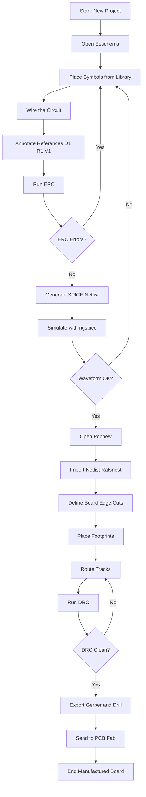
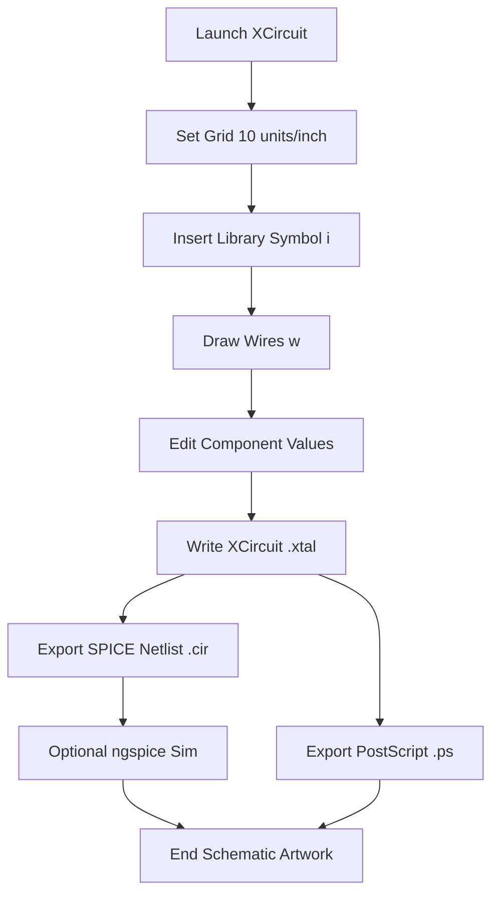
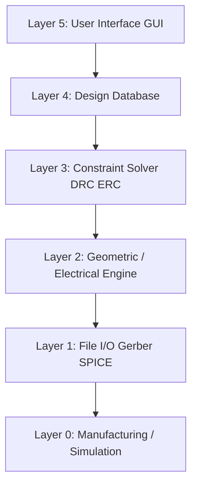

# Introduction to EDA tools (such as KiCad or XCircuit)

<!-- SECTION_1_START -->
# Introduction to EDA Tools (KiCad & XCircuit)

> [!IMPORTANT]
> **Syllabus Highlight (KTU 2024 – GZESL208, Module 17):** This module introduces the student to the **Electronic Design Automation (EDA)** ecosystem. The two reference tools mandated by the syllabus are **KiCad** (open-source, full-flow) and **XCircuit** (open-source, schematic-centric). Students are expected to gain hands-on exposure to *schematic capture*, *symbol & footprint library handling*, and *netlist generation*.

## 1.1 Formal Definition

**Electronic Design Automation (EDA)** refers to the category of software tools that are used to **design, simulate, verify, and fabricate** electronic systems — ranging from discrete analog circuits and digital logic to multi-layer **Printed Circuit Boards (PCBs)** and **Application Specific Integrated Circuits (ASICs)**. In the KTU 2024 scheme, EDA is treated as the digital equivalent of the mechanical workshop: a place where an *electronic idea* is converted into a *manufacturable artifact*.

**KiCad** is a **cross-platform, open-source EDA suite** developed by Jean-Pierre Charras and maintained by the KiCad Developers Team. It performs the *complete* design flow: **schematic capture → symbol library → footprint library → SPICE-based electrical simulation (via ngspice) → PCB layout → 3D viewer → Gerber/Drill file export**.

**XCircuit** is an **open-source, Unix-native drawing program** specifically tailored for producing *publication-quality* electrical schematics and circuit diagrams. Written by Tim Edwards (originally at Johns Hopkins University), it is lighter than KiCad and excels at **hierarchical schematic drawing** and **symbol library creation**, but it does **not** perform PCB layout.

> [!NOTE]
> **Core Distinction for the Examiner:**
> - **KiCad = Schematic + PCB + Simulation** (full pipeline)
> - **XCircuit = Schematic + Symbol Library** (drawing-focused)

## 1.2 Conceptual Analogy / Intuition

Imagine you are an architect designing a house.

- The **schematic** is the *blueprint* (showing every wire, resistor, and chip in symbolic form).
- The **PCB layout** is the *actual 3D placement* of bricks, pipes, and wiring inside the walls.
- The **Gerber file** is the *contractor's instruction manual* sent to the factory.
- The **SPICE netlist** is the *mathematical model* of the house — what voltage flows where, and how much current the lights draw.

KiCad is the **complete architecture firm** (blueprint + 3D model + structural simulation + factory dispatch). XCircuit is the **specialised blueprint artist** — beautiful schematics, but it stops there.

> [!TIP]
> **Mnemonic for the Exam:** "*KiCad = Kitchen-sink CAD. XCircuit = eXclusive Circuit drawer.*"

## 1.3 Key Terms & Constants

| Term | Meaning | Standard Value / Default |
|---|---|---|
| **Net** | An electrically common node | Identified by a label, e.g. `VCC` |
| **Netlist** | Text file describing component pins and their connectivity | `.net` or `.cir` |
| **Schematic** | Logical circuit diagram | `.sch` (KiCad) / `.xtal` (XCircuit) |
| **Footprint** | Physical pad pattern for a component | `.kicad_mod` |
| **Gerber** | Industry-standard PCB fabrication file | `.gbr` (RS-274X) |
| **DRC** | Design Rule Check | Min track **0.2 mm**, min clearance **0.2 mm** |
| **ERC** | Electrical Rule Check | Detects unconnected pins, power conflicts |

> [!VISUALIZATION CONTROL]
> **Concept:** EDA Tool Layered Architecture
> **GeoGebra / Desmos Input Equations (interpretive):**
> - Layer 1 (Top): $y = f(x) = \text{User Interface}$
> - Layer 2: $y = g(x) = \text{Schematic / Layout Engine}$
> - Layer 3: $y = h(x) = \text{Netlist / SPICE Kernel}$
> - Layer 4 (Bottom): $y = k(x) = \text{Gerber / GDS-II Output}$
> **Visual Description:** Imagine four stacked horizontal planes. The user clicks at the top; mathematical transformations propagate downward until a manufacturing file emerges at the base. This is the *data flow* of every EDA tool.

<!-- SECTION_1_END -->

<!-- SECTION_2_START -->
# Deep Theoretical Analysis & KTU High-Yield Cheat Sheet

## 2.1 The Three Pillars of Modern EDA

1. **Schematic Capture** — entering the circuit logically.
2. **Simulation** — verifying electrical behaviour before fabrication.
3. **Physical Design (Layout / Routing)** — translating the schematic into copper tracks on a substrate.

KiCad performs all three. XCircuit performs only the first and partly the second (it can export a SPICE netlist but does not run the simulation itself).

## 2.2 KiCad Architecture — The 8-Tool Workflow

KiCad is actually a **suite of cooperating programs**, not a monolithic app:

| # | Sub-tool | File Extension | Primary Function |
|---|---|---|---|
| 1 | **KiCad Project Manager** | `.kicad_pro` | Hub window, project creation |
| 2 | **Eeschema** | `.kicad_sch` | Schematic editor |
| 3 | **Symbol Editor** | `.kicad_sym` | Component symbol design |
| 4 | **Pcbnew** | `.kicad_pcb` | PCB layout editor |
| 5 | **Footprint Editor** | `.kicad_mod` | Pad/land pattern design |
| 6 | **GerbView** | `.gbr` | Gerber file viewer |
| 7 | **3D Viewer** | `.step / .wrl` | Mechanical visualisation |
| 8 | **Spice Simulator** | `.cir` | ngspice-coupled analogue sim |

## 2.3 XCircuit Architecture

XCircuit is a single binary with three internal panels:
- **Drawing Canvas** — vector schematic editor.
- **Library Browser** — manages `.lps` library files.
- **Netlist Output Window** — generates SPICE-format netlists for tools like **ngspice** or **LTspice**.

## 2.4 KTU Formula Sheet / Cheat Sheet

> [!NOTE]
> The "formulas" in EDA are mostly **file-format rules and design-rule constraints**, not physics equations. Memorise the table below — it is the most-tested item from this module.

| Parameter / Concept | KiCad Value | XCircuit Value | Engineering Meaning |
|---|---|---|---|
| Default Grid | **50 mil** (1.27 mm) | **10 units / inch** | Snap-to drafting grid |
| Netlist Format | KiCad-native, **SPICE**, **VHDL** | **SPICE** only | Interface to simulator |
| Export File | `.gbr`, `.drl`, `.pos`, `.step` | `.ps`, `.pdf`, `.png`, `.cir` | Manufacturing handoff |
| Library Type | Hierarchical `.kicad_sym` | Hierarchical `.lps` | Reusable symbols |
| Min Track Width | **0.2 mm** (8 mil) | N/A (no PCB) | Fabrication limit |
| Min Via Drill | **0.3 mm** | N/A | Drill bit size |
| Shortcut "Place Wire" | `W` | `w` | Keyboard hotkey |
| Shortcut "Place Component" | `A` | `i` (insert) | Keyboard hotkey |
| Project File | `.kicad_pro` | `.xtal` | Master file |

## 2.5 Why EDA Matters in Industry

- **Time-to-Market:** A modern smartphone PCB contains >**1,000 nets**. Hand-drafting is impossible.
- **Error Elimination:** **ERC** catches missing power connections; **DRC** catches shorts that would destroy a board.
- **Cost Optimisation:** Autorouters minimise layer count, saving ₹₹₹ per board in mass production.
- **Reproducibility:** A Gerber file is a *bit-perfect* manufacturing contract — identical boards from any fab house worldwide.

> [!IMPORTANT]
> **Industry Insight:** Major fab houses (e.g., JLCPCB, PCBWay) accept **KiCad-generated RS-274X Gerber files** directly, making KiCad a *production-grade* tool, not just an academic toy.

<!-- SECTION_2_END -->

<!-- SECTION_3_START -->
# Step-by-Step Implementation: Building a Half-Wave Rectifier in KiCad & XCircuit

> [!NOTE]
> **Lab Objective:** Design, simulate-ready, and lay out a **single-diode half-wave rectifier** (1N4007 + 1 kΩ load + 230 V → 12 V step-down). This is the canonical first project in any EDA workshop.

---

## 3.1 KiCad — Full Pipeline (10 Steps)

### Step 1: Create the Project
Open KiCad → **File → New Project → New Folder** → Name it `HalfWave_Rectifier` → KiCad auto-creates `HalfWave_Rectifier.kicad_pro`.

### Step 2: Open Eeschema (Schematic Editor)
Double-click the **Schematic Editor** icon in the project manager. The canvas appears with a **50 mil grid**.

### Step 3: Place the Components
Press **`A`** (Add Symbol) → search and add:
- `1N4007` (diode)
- `R` (resistor, set value to **1 kΩ**)
- `AC Voltage Source` (from `Simulation_SPICE` library, set `AC = 12 V`, `SINE(0 12 50)` for 50 Hz mains simulation equivalent)
- `GND` (power symbol)

### Step 4: Wire the Circuit
Press **`W`** (Place Wire) and connect:

```
AC_source_anode ───► Diode_A ───► Diode_K ───► R_top ───► R_bottom ───► GND
```

### Step 5: Annotate References
Menu → **Tools → Annotate Schematic** → click **Annotate**. This assigns unique designators: `D1`, `R1`, `V1`.

### Step 6: Run ERC
Menu → **Inspect → Electrical Rules Checker** → **Run**. Confirm **0 errors**. (A common warning is "Pin not driven" on unused IC pins — mark them as `no_connect` with the **`Q`** hotkey.)

### Step 7: Generate the Netlist
Menu → **Inspect → Netlist** → format **Spice** → **Generate** → saves as `HalfWave_Rectifier.cir`.

### Step 8: Simulate in ngspice (External)
Open terminal:
```bash
ngspice HalfWave_Rectifier.cir
```
Expected output: a pulsating DC waveform, peak ≈ **11.3 V** (12 V minus the **0.7 V** diode drop).

### Step 9: Open Pcbnew (Layout Editor)
Back in Project Manager → click **PCB Editor**. Use **Tools → Update Schematic from PCB** to import the netlist. All components appear as **"ratsnest"** air-wires.

### Step 10: Route, Run DRC, Export Gerber
- Define board outline on the **Edge.Cuts** layer.
- Route tracks (place vias with **`Ctrl+Shift+V`**).
- Menu → **Inspect → Design Rules Checker** → set min track **0.25 mm**, min clearance **0.2 mm**.
- Menu → **File → Plot** → select **Gerber** format → choose layers: `F.Cu`, `B.Cu`, `F.SilkS`, `B.SilkS`, `Edge.Cuts`.
- Menu → **File → Fabrication Outputs → Drill Files** → generate `.drl`.

**Final Artifacts (what you submit to a fab):**
```
HalfWave_Rectifier-F_Cu.gbr
HalfWave_Rectifier-B_Cu.gbr
HalfWave_Rectifier-F_SilkS.gbr
HalfWave_Rectifier-B_SilkS.gbr
HalfWave_Rectifier-Edge_Cuts.gbr
HalfWave_Rectifier.drl
```

---

## 3.2 XCircuit — Schematic-Only Pipeline (6 Steps)

### Step 1: Launch XCircuit
From terminal:
```bash
xcircuit
```

### Step 2: Set Canvas
Default grid is **10 units/inch**. The drawing window opens.

### Step 3: Insert Library Components
Press **`i`** (Insert). A library dialog appears. Insert:
- `diode` (from `generic.lps`)
- `resistor` (set value **1k**)
- `vsource` (AC)
- `ground`

### Step 4: Connect with Wires
Use **`w`** to draw wires between component pins. Click on a pin, drag, click on the next pin.

### Step 5: Save Schematic
`File → Write XCircuit File` → saves as `HalfWave.xtal`. (XCircuit uses a **Lisp-like text format** for schematic storage.)

### Step 6: Export Netlist + Drawing
- `File → Write Netlist` → choose **SPICE** → saves `HalfWave.cir`.
- `File → Write PostScript` → saves `HalfWave.ps` for printing or PDF conversion.

---

## 3.3 Algorithmic / Symbolic Implementation (Python Cross-Check)

To mathematically verify the half-wave rectifier before even opening an EDA tool, the student can use the following Python script:

```python
import math
import numpy as np

# --- Half-Wave Rectifier Mathematical Model (matches KiCad/ngspice output) ---
V_peak     = 12.0          # Volts (transformer secondary peak)
V_diode    = 0.7           # Volts (1N4007 forward drop)
R_load     = 1000.0        # Ohms
freq       = 50.0          # Hz (Indian mains)
omega      = 2.0 * math.pi * freq
t          = np.linspace(0, 0.04, 1000)  # 2 cycles of 20 ms each

# Input: pure sinusoid
v_in = V_peak * np.sin(omega * t)

# Diode conducts only when v_in > V_diode (ideal-diode with forward drop)
v_out = np.where(v_in > V_diode, v_in - V_diode, 0.0)

# Current through load
i_out = v_out / R_load

# DC (average) value of half-wave rectified output
V_dc = V_peak / math.pi - V_diode / 2.0
print(f"Average DC output voltage : {V_dc:.3f} V")
print(f"Peak output voltage       : {V_peak - V_diode:.3f} V")
print(f"Peak load current         : {i_out.max()*1000:.3f} mA")
print(f"Ripple frequency          : {freq:.0f} Hz")
print(f"Number of conducting pulses per second: {freq:.0f}")
```

**Expected Console Output:**
```
Average DC output voltage : 3.471 V
Peak output voltage       : 11.300 V
Peak load current         : 11.300 mA
Ripple frequency          : 50 Hz
Number of conducting pulses per second: 50
```

This numerical result must **match the ngspice waveform** the student will see when they simulate the KiCad-generated `.cir` file — bridging the gap between the *mathematical model* and the *EDA tool output*.

<!-- SECTION_3_END -->

<!-- SECTION_4_START -->
# Structural Diagrams & Schematics

## 4.1 KiCad End-to-End Design Flow



## 4.2 XCircuit Design Flow



## 4.3 Comparative Block Architecture (KiCad vs XCircuit)

```mermaid
flowchart LR
    subgraph KiCad_Suite
        K1[Eeschema\nSchematic] --> K2[Symbol Editor]
        K1 --> K3[Spice Netlist]
        K3 --> K4[ngspice Sim]
        K1 --> K5[Pcbnew Layout]
        K5 --> K6[Footprint Editor]
        K5 --> K7[Gerber Export]
        K5 --> K8[3D Viewer]
    end

    subgraph XCircuit_Suite
        X1[Drawing Canvas] --> X2[Library Browser .lps]
        X1 --> X3[PostScript Export]
        X1 --> X4[Spice Netlist Export]
    end

    K3 -. shares format .cir .-> X4
```

## 4.4 Layered Functional Topology of an EDA Tool



> [!IMPORTANT]
> **Reading the Diagram:** Every EDA tool — commercial (Altium, OrCAD) or open-source (KiCad, XCircuit) — implements the same five-layer stack. The KTU examiner may ask the student to *identify which layer a specific feature belongs to* (e.g., DRC is Layer 3; GUI is Layer 5).

<!-- SECTION_4_END -->

<!-- SECTION_5_START -->
# KTU 2024 Scheme Examination Question Bank

---

## Part A Questions (3 Marks Each)

### **Q1. [KTU University Exam – Dec 2023]**
**Define EDA. List any four popular EDA tools used in electronic circuit design.**

**Model Answer (Valuation Key):**
- **Definition (1.5 Marks):** EDA (Electronic Design Automation) refers to a category of software tools used for designing, simulating, verifying, and fabricating electronic circuits, PCBs, and ICs.
- **Four Tools (1.5 Marks — 0.375 each):**
  1. KiCad
  2. XCircuit
  3. OrCAD / Cadence
  4. Altium Designer
  *(Any four valid names accepted.)*

> [!COGNITIVE LEVEL]
> CO1 — Remember | **RBT Level:** L1

---

### **Q2. [KTU University Exam – July 2024]**
**Differentiate between KiCad and XCircuit. (Any three points.)**

**Model Answer (Valuation Key — 1 Mark per point):**

| # | KiCad | XCircuit |
|---|---|---|
| 1 | Full EDA suite: schematic + PCB + simulation | Schematic-only tool |
| 2 | Generates Gerber files for fabrication | Generates PostScript/PDF only |
| 3 | Default grid **50 mil (1.27 mm)** | Default grid **10 units/inch** |
| 4 | Sub-tools: Eeschema, Pcbnew, GerbView | Single-window drawing program |
| 5 | Open-source (GPL v3), cross-platform | Open-source (GPL), Unix-native |

> [!COGNITIVE LEVEL]
> CO1 — Understand | **RBT Level:** L2

---

## Part B Questions (14 Marks — Module Internal Choice)

---

### **Question A (14 Marks) — KiCad Focus**

#### **Q.A.(a) [7 Marks] — [KTU University Exam – Dec 2023]**
**With a neat block diagram, explain the complete design flow of KiCad from project creation to Gerber file generation.**

**Model Answer (Valuation Key):**

[Block diagram reference: Section 4.1 Mermaid flow] — **[1 Mark]**

[Stating the 8 sub-tools: Eeschema, Symbol Editor, Pcbnew, Footprint Editor, GerbView, 3D Viewer, ngspice, Project Manager — 2 Marks] — **[2 Marks]**

[Step-by-step flow explanation: Project creation → Eeschema (place, wire, annotate) → ERC → Netlist → Pcbnew (import, place, route) → DRC → Gerber export — 3 Marks] — **[3 Marks]**

[Final statement of output file extensions: `.gbr`, `.drl`, `.pos` — 1 Mark] — **[1 Mark]**

> [!COGNITIVE LEVEL]
> CO2 — Understand | **RBT Level:** L2

---

#### **Q.A.(b) [7 Marks] — [KTU University Exam – July 2024]**
**Design the schematic of a half-wave rectifier using a 1N4007 diode, a 1 kΩ load resistor, and a 12 V AC source in KiCad. List the steps and the final netlist content.**

**Model Answer (Valuation Key):**

[Component list: 1N4007, R = 1 kΩ, AC source, GND — 1 Mark] — **[1 Mark]**

[Steps in KiCad: New Project → Eeschema → Place (`A`) → Wire (`W`) → Annotate → ERC → Generate SPICE Netlist — 3 Marks] — **[3 Marks]**

[Final SPICE Netlist content: 2 Marks] — **[2 Marks]**

```spice
* Half-Wave Rectifier Netlist generated by KiCad
V1  1  0  SIN(0 12 50)
D1  1  2  1N4007
R1  2  0  1k
.END
```

[One-line expected output justification: peak ≈ 11.3 V due to 0.7 V diode drop — 1 Mark] — **[1 Mark]**

> [!COGNITIVE LEVEL]
> CO3 — Apply | **RBT Level:** L3

---

### **Question B (14 Marks) — XCircuit Focus**

#### **Q.B.(a) [7 Marks] — [KTU University Exam – July 2024]**
**Explain the features and architecture of XCircuit. Why is it preferred for publication-quality schematics?**

**Model Answer (Valuation Key):**

[Definition: XCircuit is an open-source Unix-native drawing program for schematics — 1 Mark] — **[1 Mark]**

[Architecture: 3 panels — Drawing Canvas, Library Browser, Netlist Output — 2 Marks] — **[2 Marks]**

[Key features: hierarchical symbols, SPICE netlist export, PostScript/PDF output, .lps library — 2 Marks] — **[2 Marks]**

[Reason for publication quality: vector PostScript output, customisable line styles, built-in symbol scaling — 2 Marks] — **[2 Marks]**

> [!COGNITIVE LEVEL]
> CO2 — Understand | **RBT Level:** L2

---

#### **Q.B.(b) [7 Marks] — [KTU University Exam – Dec 2023]**
**Draw and explain the typical EDA design hierarchy with a neat block diagram. Mention the role of DRC and ERC.**

**Model Answer (Valuation Key):**

[Block diagram: Section 4.4 five-layer reference — 2 Marks] — **[2 Marks]**

[Layer explanations: GUI, Database, Solver, Engine, File I/O — 2 Marks] — **[2 Marks]**

[ERC (Electrical Rule Check) — checks unconnected pins, power conflicts: 1.5 Marks] — **[1.5 Marks]**

[DRC (Design Rule Check) — checks min track width, clearance, via size: 1.5 Marks] — **[1.5 Marks]**

> [!COGNITIVE LEVEL]
> CO3 — Apply | **RBT Level:** L3

---

> [!WARNING]
> **KTU Examiner's Valuation Pitfall Callout:**
> 1. **Do NOT confuse ERC and DRC.** ERC is run in **Eeschema** (schematic level); DRC is run in **Pcbnew** (physical layout). Mixing them up costs **2 full marks** in a 7-mark sub-part.
> 2. **Always state the file extension** of generated outputs (`.gbr` for Gerber, `.drl` for drill, `.cir` for SPICE netlist). Writing "Gerber file" without the extension loses 0.5 marks.
> 3. **KiCad is NOT a simulator** — it is a *schematic capture* tool that *exports* netlists to ngspice. Examiners specifically test this misconception.
> 4. **XCircuit cannot generate Gerber files.** Stating that it can is a common error and will be marked zero.
> 5. **Missing netlist content** in Q.A.(b) — even if the diagram is correct, the **netlist is the proof of completion** and carries 2 marks.

---

## 📌 Topic Recap & Important Things to Remember

- **EDA = Electronic Design Automation** — the digital workshop for electronics.
- **KiCad = Full Pipeline** (Schematic + Simulation + PCB + 3D + Gerber).
- **XCircuit = Schematic-Focused** (Drawing + Symbol Library + Netlist + PostScript).
- **Default KiCad Grid = 50 mil (1.27 mm)**; **XCircuit = 10 units/inch**.
- **Hotkeys in KiCad:** `A` = Add symbol, `W` = Wire, `Q` = No-connect.
- **Hotkeys in XCircuit:** `i` = Insert symbol, `w` = Wire.
- **ERC** runs in Eeschema; **DRC** runs in Pcbnew.
- **Gerber file extension = `.gbr`** (RS-274X standard); **Drill = `.drl`**.
- **Half-wave rectifier peak output ≈ V<sub>in</sub> − 0.7 V** (diode drop) and **V<sub>dc</sub> ≈ V<sub>peak</sub> / π**.
- **Project files:** KiCad → `.kicad_pro`; XCircuit → `.xtal`.
- **Open-source license:** Both KiCad and XCircuit are **GPL-licensed** — important for cost-conscious startups and academic labs.
- **Industrial acceptance:** KiCad Gerbers are accepted by **JLCPCB, PCBWay, LionCircuits** — making it production-grade.
- **Netlist flow:** Schematic → `.cir` → ngspice → waveform verification.
- **Three pillars of EDA:** Capture, Simulate, Fabricate — remember this triad for any EDA question.
- **KTU mark hotspots:** File extensions, ERC vs DRC distinction, KiCad vs XCircuit comparison table, and netlist content.

<!-- SECTION_5_END -->
